# 12 — Document Chunking Strategies

> Learn how to transform processed documents into retrieval-ready chunks while preserving semantic meaning, document structure, context, metadata, and enterprise traceability.

---

## 📖 Overview

Document chunking is the process of dividing a large document into smaller units that can be independently embedded, indexed, retrieved, and supplied as context to a Large Language Model (LLM).

A simplified pipeline is:

```text
Document
    ↓
Document Processing
    ↓
Chunking
    ↓
Embedding
    ↓
Vector Database
    ↓
Retrieval
    ↓
LLM
```

Chunking looks simple:

```text
Large Document
      ↓
Smaller Pieces
```

but production chunking is much more than splitting text every `N` characters.

A good chunk should preserve enough context to represent a meaningful concept while remaining small enough for efficient retrieval.

The central challenge is:

> **How do we divide enterprise knowledge into retrieval units without destroying the relationships and context contained in the original document?**

---

# 1. Why Chunking Matters

Suppose an enterprise document contains:

```text
Employee Handbook
 ├── Leave Policy
 ├── Compensation
 ├── Benefits
 ├── Travel Policy
 └── Expense Policy
```

If the entire handbook becomes one embedding:

```text
Employee Handbook
        ↓
     Vector
```

retrieval becomes too coarse.

A query such as:

```text
How many annual leave days do employees receive?
```

may only need:

```text
Leave Policy
 → Annual Leave
```

Therefore the document should be divided into meaningful retrieval units.

```text
Employee Handbook
        ↓
     Chunks
        ↓
┌───────────────┐
│ Leave Policy  │
├───────────────┤
│ Benefits      │
├───────────────┤
│ Travel        │
├───────────────┤
│ Expenses      │
└───────────────┘
```

---

# 2. Chunking in the RAG Pipeline

Chunking sits between document processing and embedding.

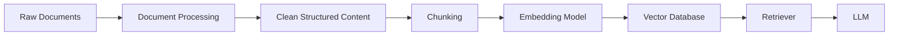

This means chunking directly influences:

```text
Embedding Quality
Retrieval Quality
Context Quality
LLM Input Size
Latency
Storage
Cost
```

---

# 3. What Is a Chunk?

A chunk is a smaller retrieval unit extracted from a document.

Example:

```text
Original Document:

The company provides employees with annual leave.
Employees who have completed one year of service
are entitled to 25 days of annual leave per year.
Unused leave may be carried forward according
to company policy.
```

Possible chunk:

```text
Employees who have completed one year of service
are entitled to 25 days of annual leave per year.
```

The chunk should contain enough information to answer a relevant question.

---

# 4. Chunking vs Splitting

These terms are often used interchangeably, but conceptually they can be distinguished.

### Splitting

Mechanically divides content:

```text
Text
 ↓
Part 1
Part 2
Part 3
```

### Chunking

Attempts to create meaningful retrieval units:

```text
Document Structure
      ↓
Semantic Boundaries
      ↓
Context
      ↓
Retrieval Chunks
```

Production RAG systems should prefer meaningful chunking over blind splitting.

---

# 5. Characteristics of a Good Chunk

A useful chunk generally has:

```text
✓ Meaningful context
✓ Sufficient information
✓ Clear boundaries
✓ Appropriate size
✓ Useful metadata
✓ Traceability to the source
✓ Minimal unrelated content
```

A poor chunk may contain:

```text
✗ Half a sentence
✗ Missing heading
✗ Broken table
✗ Unrelated sections
✗ Excessive boilerplate
✗ Too much content
```

---

# 6. The Chunking Trade-off

Chunking involves a trade-off.

```text
Smaller Chunks
     ↓
More precise retrieval
     ↓
Less context

Larger Chunks
     ↓
More context
     ↓
Less precise retrieval
```

Conceptually:

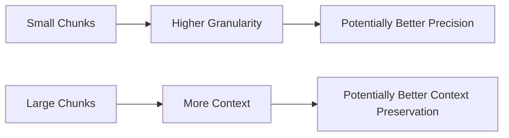

There is no universally optimal chunk size.

---

# 7. Chunk Size

Chunk size determines how much content belongs in one chunk.

Common units include:

```text
Characters
Tokens
Words
Sentences
Paragraphs
Sections
Pages
```

For LLM applications, token-based sizing is often more meaningful because model context limits are measured in tokens.

---

# 8. Character-Based Chunking

A simple strategy:

```text
Every 1,000 characters
```

Example:

```python
def chunk_text(
    text: str,
    chunk_size: int = 1000
):
    return [
        text[i:i + chunk_size]
        for i in range(
            0,
            len(text),
            chunk_size
        )
    ]
```

This is easy to implement but ignores semantic boundaries.

---

# 9. Character-Based Chunking Problem

Consider:

```text
The annual leave policy states that
employees are entitled to 25 days of leave.
```

A fixed character boundary might produce:

```text
Chunk 1:
The annual leave policy states that employees

Chunk 2:
are entitled to 25 days of leave.
```

The second chunk loses useful context.

---

# 10. Token-Based Chunking

Token-based chunking considers model tokenization.

Conceptually:

```text
Document
 ↓
Tokenizer
 ↓
Tokens
 ↓
Chunk by Token Count
```

Example:

```text
512 tokens
```

per chunk.

Token-based chunking is useful because:

```text
Embedding Models
+
LLMs
```

operate with token limits.

---

# 11. Token-Based Chunking Example

Conceptually:

```python
tokens = tokenizer.encode(text)

chunks = []

for i in range(
    0,
    len(tokens),
    512
):
    chunk = tokens[
        i:i + 512
    ]

    chunks.append(chunk)
```

The exact implementation depends on the tokenizer and model.

---

# 12. Word-Based Chunking

Another simple approach:

```text
Every 200 words
```

Example:

```python
words = text.split()

chunks = [
    words[i:i + 200]
    for i in range(
        0,
        len(words),
        200
    )
]
```

This is easy but still ignores document structure and sentence boundaries.

---

# 13. Sentence-Based Chunking

Instead of splitting by characters or words:

```text
Sentence 1
Sentence 2
Sentence 3
Sentence 4
```

can be grouped into chunks.

Example:

```text
Chunk 1:
Sentence 1
Sentence 2
Sentence 3

Chunk 2:
Sentence 4
Sentence 5
Sentence 6
```

This preserves sentence boundaries better than arbitrary character splitting.

---

# 14. Paragraph-Based Chunking

Paragraph boundaries often represent meaningful semantic units.

```text
Paragraph 1
Paragraph 2
Paragraph 3
```

can become:

```text
Chunk 1 → Paragraph 1
Chunk 2 → Paragraph 2
Chunk 3 → Paragraph 3
```

However, paragraphs can vary significantly in length.

One paragraph may contain:

```text
50 tokens
```

while another may contain:

```text
2,000 tokens
```

Therefore paragraph-based chunking often needs additional size constraints.

---

# 15. Recursive Chunking

Recursive chunking attempts to split content using increasingly smaller separators.

A common conceptual hierarchy is:

```text
Document
 ↓
Paragraph
 ↓
Sentence
 ↓
Word
 ↓
Character
```

The algorithm tries to preserve the largest meaningful unit possible before falling back to smaller units.

---

# 16. Recursive Chunking Architecture

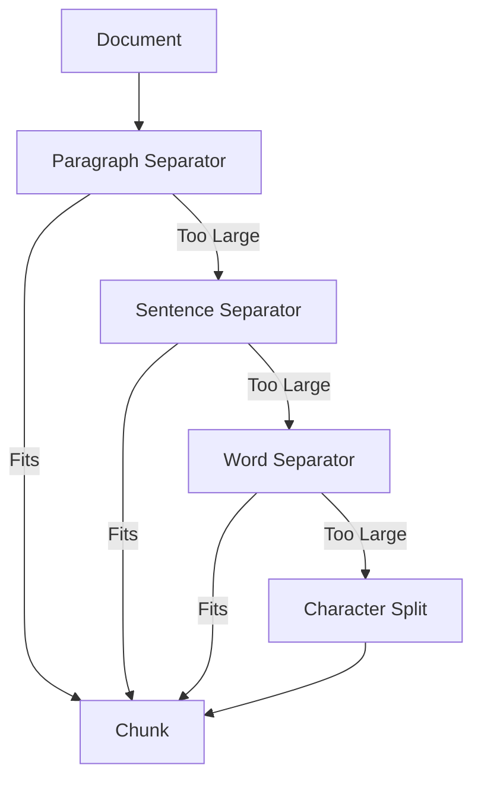

This is often a useful general-purpose strategy.

---

# 17. Recursive Chunking Example

A framework-style implementation might look like:

```python
from langchain_text_splitters import (
    RecursiveCharacterTextSplitter
)

splitter = RecursiveCharacterTextSplitter(
    chunk_size=1000,
    chunk_overlap=150,
    separators=[
        "\n\n",
        "\n",
        ". ",
        " ",
        ""
    ]
)

chunks = splitter.split_text(
    document_text
)
```

The important idea is the hierarchy of separators rather than the framework itself.

---

# 18. Semantic Chunking

Semantic chunking attempts to identify boundaries based on meaning rather than fixed length.

Conceptually:

```text
Document
 ↓
Sentences
 ↓
Semantic Similarity
 ↓
Topic Boundaries
 ↓
Chunks
```

For example:

```text
Paragraph 1
Paragraph 2
Paragraph 3
```

may all discuss:

```text
Annual Leave
```

while:

```text
Paragraph 4
```

starts discussing:

```text
Travel Policy
```

A semantic chunker may therefore create:

```text
Chunk 1 → Annual Leave
Chunk 2 → Travel Policy
```

---

# 19. Semantic Chunking Architecture

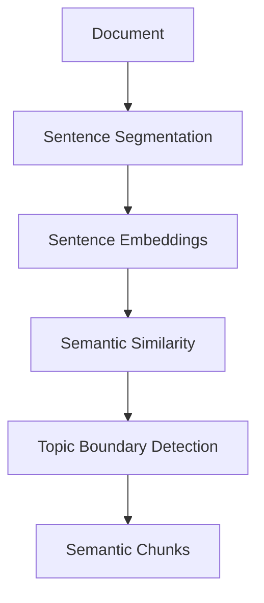

Semantic chunking can improve coherence but introduces additional processing cost.

---

# 20. Structure-Aware Chunking

Enterprise documents often contain explicit structure:

```text
Title
Heading
Subheading
Paragraph
List
Table
```

A structure-aware strategy preserves these relationships.

Example:

```text
Employee Handbook

## Leave

### Annual Leave

Employees receive 25 days...
```

Possible chunk:

```text
Employee Handbook
Section: Leave
Subsection: Annual Leave

Employees receive 25 days...
```

---

# 21. Structure-Aware Chunking

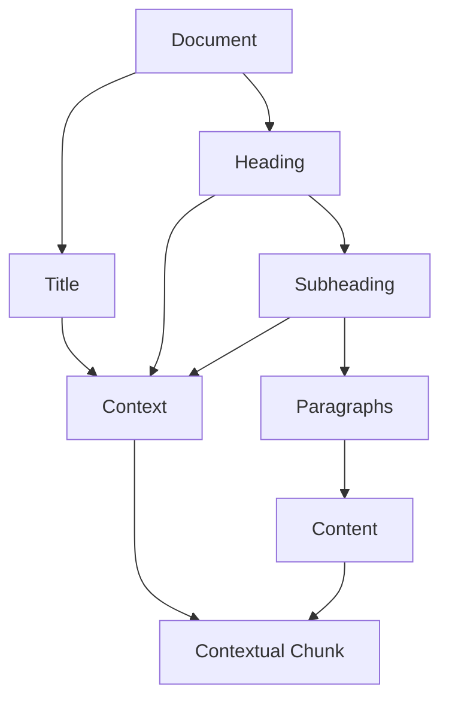

This can be particularly useful for:

```text
Policies
Manuals
Technical Documentation
Legal Documents
Standards
Product Documentation
```

---

# 22. Heading-Based Chunking

A practical strategy is to use headings as natural boundaries.

Example:

```text
# Employee Benefits

## Health Insurance

...

## Annual Leave

...

## Travel Policy

...
```

Chunks can be aligned to:

```text
Health Insurance
Annual Leave
Travel Policy
```

while preserving heading metadata.

---

# 23. Parent Context

Sometimes the heading itself is not enough.

Instead of:

```text
Employees may carry forward
up to 10 days.
```

store:

```text
Employee Handbook
→ Leave
→ Annual Leave

Employees may carry forward
up to 10 days.
```

This adds contextual information to the chunk.

---

# 24. Contextual Chunking

```text
Document:
Employee Handbook

Section:
Leave

Subsection:
Annual Leave

Content:
Employees may carry forward
up to 10 days.
```

Embedding input:

```text
Employee Handbook
Leave
Annual Leave

Employees may carry forward
up to 10 days.
```

This can make otherwise ambiguous chunks more understandable.

---

# 25. Chunk Metadata

Every chunk should normally have metadata.

Example:

```json
{
  "chunk_id": "handbook-001-chunk-12",
  "document_id": "handbook-001",
  "document_version": "v4",
  "section": "Leave",
  "subsection": "Annual Leave",
  "page": 42,
  "chunk_index": 12
}
```

Metadata is not just administrative information.

It can directly influence retrieval.

---

# 26. Chunk Metadata Architecture

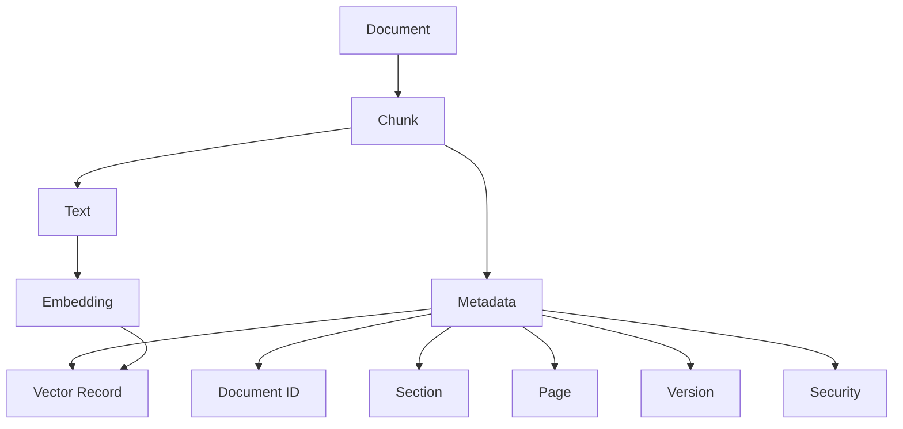

---

# 27. Chunk Overlap

Chunk overlap repeats some content between adjacent chunks.

Example:

```text
Chunk 1:
A B C D E F

Chunk 2:
E F G H I J
```

Here:

```text
E F
```

is the overlap.

---

# 28. Why Use Chunk Overlap?

Without overlap:

```text
Chunk 1
     |
     | Boundary
     |
Chunk 2
```

important context may be split across the boundary.

With overlap:

```text
Chunk 1
    E F
     ↓
Chunk 2
```

the system retains some shared context.

---

# 29. Chunk Overlap Diagram

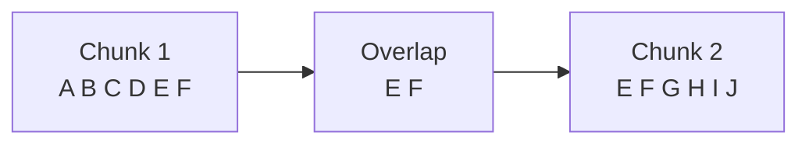

Overlap can improve recall but increases:

```text
Storage
Embedding Cost
Retrieval Redundancy
```

---

# 30. Choosing Overlap

There is no universally correct overlap.

It depends on:

```text
Chunk Size
Document Structure
Sentence Length
Retrieval Task
Content Type
```

A common starting point might be:

```text
10–20% overlap
```

but this should be treated as an experimental starting point, not a universal rule.

---

# 31. Overlap Trade-off

```text
More Overlap
     ↓
More Context Continuity
     ↓
More Duplicate Content
     ↓
Higher Storage / Processing Cost
```

Therefore:

> **Use enough overlap to preserve boundary context, but avoid unnecessary duplication.**

---

# 32. Fixed-Size Chunking

The simplest strategy:

```text
Document
 ↓
Every N tokens
```

Advantages:

```text
Simple
Fast
Predictable
Easy to scale
```

Disadvantages:

```text
May split sentences
May split concepts
Ignores structure
```

Good for:

```text
Baseline systems
Simple text
Controlled data
```

---

# 33. Sentence Chunking

Advantages:

```text
Preserves sentence boundaries
Simple
Better than arbitrary character boundaries
```

Disadvantages:

```text
Sentence lengths vary
May lose section context
Long sentences can exceed limits
```

---

# 34. Paragraph Chunking

Advantages:

```text
Natural semantic boundaries
Simple implementation
Preserves local context
```

Disadvantages:

```text
Paragraph sizes vary
Large paragraphs may exceed limits
Small paragraphs may be too narrow
```

---

# 35. Recursive Chunking

Advantages:

```text
Preserves larger boundaries when possible
Falls back gracefully
Good general-purpose strategy
```

Disadvantages:

```text
Still primarily structure-based
Not fully semantic
Requires separator configuration
```

---

# 36. Semantic Chunking

Advantages:

```text
Meaning-aware boundaries
Better topic coherence
Potentially better retrieval
```

Disadvantages:

```text
Higher processing cost
More complex
Requires additional model computation
Can be difficult to tune
```

---

# 37. Structure-Aware Chunking

Advantages:

```text
Preserves document organization
Useful for enterprise documents
Supports citations
Supports metadata filtering
```

Disadvantages:

```text
Requires structure detection
Complex documents need specialized handling
Tables and nested sections need care
```

---

# 38. Chunking Strategy Comparison

| Strategy | Complexity | Context Preservation | Speed | Typical Use |
|---|---:|---:|---:|---|
| Fixed Character | Low | Low | Very High | Baseline |
| Fixed Token | Low | Medium | High | General text |
| Sentence | Low | Medium | High | Narrative text |
| Paragraph | Low | Good | High | Structured prose |
| Recursive | Medium | Good | High | General RAG |
| Semantic | High | High | Medium/Low | Complex content |
| Structure-Aware | Medium/High | High | Medium | Enterprise documents |

---

# 39. Chunking by Document Type

Different content types benefit from different strategies.

| Document Type | Useful Strategy |
|---|---|
| Technical Documentation | Heading + recursive |
| Policies | Structure-aware |
| Legal Documents | Section-aware |
| Research Papers | Section + paragraph |
| Web Pages | Main-content + heading |
| FAQs | Question/answer unit |
| Tables | Row/record-aware |
| Source Code | Code structure |
| Emails | Thread/message-aware |
| Markdown | Heading-aware |
| Simple Text | Recursive |
| Scanned PDFs | OCR + structure-aware |

---

# 40. FAQ Chunking

An FAQ should usually preserve:

```text
Question
+
Answer
```

Example:

```text
Question:
How many annual leave days are available?

Answer:
Employees receive 25 days...
```

Do not split the question from its answer.

---

# 41. FAQ Chunk Example

```json
{
  "chunk_id": "faq-102",
  "text": "Question: How many annual leave days are available?\n\nAnswer: Employees receive 25 days of annual leave.",
  "metadata": {
    "document_type": "faq",
    "topic": "leave"
  }
}
```

This creates a self-contained retrieval unit.

---

# 42. Legal Document Chunking

Legal documents often have hierarchical structure:

```text
Agreement
 ├── Article 1
 │    ├── Section 1.1
 │    └── Section 1.2
 ├── Article 2
 └── Article 3
```

Chunking should preserve:

```text
Article
Section
Clause
Sub-clause
```

A clause without its parent context may be difficult to interpret.

---

# 43. Technical Documentation Chunking

Technical documentation often follows:

```text
Product
 ├── Installation
 ├── Configuration
 ├── Authentication
 ├── API Reference
 └── Troubleshooting
```

Heading-aware chunking is often effective.

Example:

```text
Product: Payment Gateway
Section: Authentication
Subsection: OAuth

The service requires...
```

---

# 44. Source Code Chunking

Source code should generally not be chunked like prose.

Instead preserve:

```text
Class
Method
Function
Interface
Module
```

Example:

```text
Class: PaymentService

Method:
processPayment()

Code:
...
```

This preserves code-level semantics.

---

# 45. Code Chunking Architecture

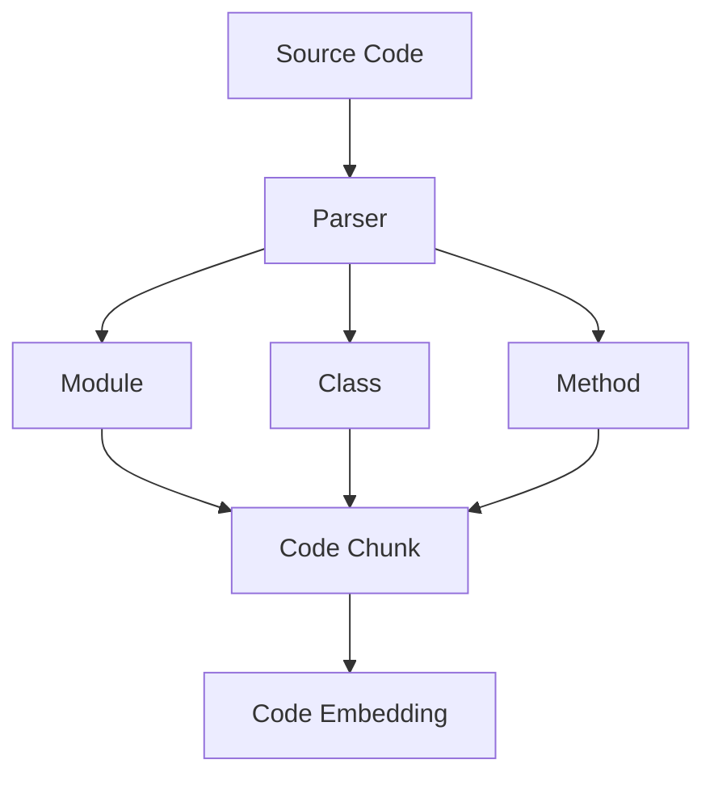

---

# 46. Table Chunking

Tables should usually preserve row/column relationships.

Bad:

```text
Product Price Region Status Payment Gateway 100 Europe Active
```

Better:

```text
Product: Payment Gateway
Price: 100
Region: Europe
Status: Active
```

For large tables, consider:

```text
Row-Level Chunks
Group-Level Chunks
Table-Level Summaries
```

depending on the retrieval use case.

---

# 47. Table-Aware Chunking

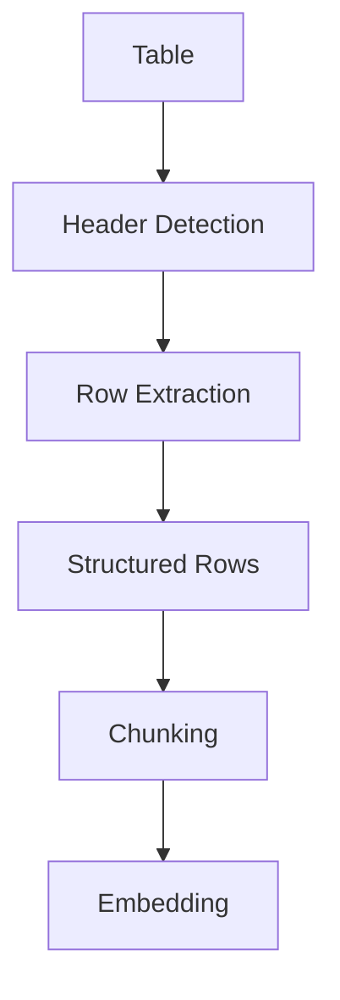

---

# 48. Spreadsheet Chunking

A spreadsheet may contain:

```text
Sheet
 ├── Header Rows
 ├── Data Rows
 ├── Summary Rows
 └── Formulas
```

Blindly converting the entire spreadsheet to text can destroy useful relationships.

A better strategy can preserve:

```text
Workbook
Sheet
Row
Column
```

as metadata.

---

# 49. Chunking Hierarchical Documents

For hierarchical content:

```text
Document
 → Section
   → Subsection
      → Paragraph
```

the chunk should preserve the hierarchy.

Example:

```text
Document: Architecture Guide

Section: Security

Subsection: Authentication

OAuth tokens must...
```

This can be more useful than:

```text
OAuth tokens must...
```

alone.

---

# 50. Parent-Child Chunking

A document can be represented using:

```text
Parent Chunk
    ↓
Child Chunks
```

Example:

```text
Parent:
Annual Leave Policy

Children:
 ├── Eligibility
 ├── Entitlement
 ├── Carry Forward
 └── Approval
```

The child chunk provides retrieval precision.

The parent provides broader context.

---

# 51. Parent-Child Architecture

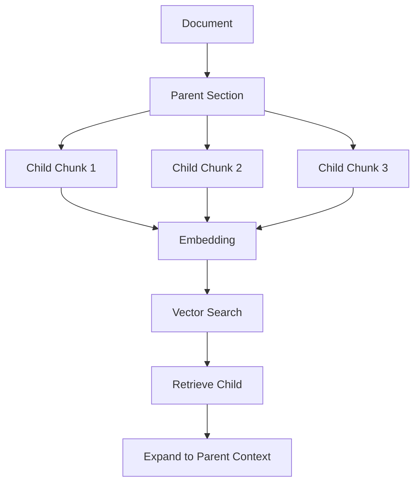

Parent-child retrieval is an advanced retrieval pattern, but the chunking design begins here.

---

# 52. Chunk Context Window

A useful concept is:

```text
Chunk Content
+
Local Context
+
Metadata
```

Example:

```text
[Document]
Employee Handbook

[Section]
Leave

[Subsection]
Annual Leave

[Content]
Employees receive 25 days...
```

This produces a more self-contained retrieval unit.

---

# 53. Chunk Context Enrichment

Context enrichment can be generated before embedding:

```python
def enrich_chunk(
    chunk: str,
    document_title: str,
    section: str
) -> str:

    return f"""
Document: {document_title}
Section: {section}

Content:
{chunk}
""".strip()
```

This should be evaluated because adding excessive metadata can also increase token usage.

---

# 54. Chunk Size and Context

Consider:

```text
Small Chunk
```

with:

```text
Context:
"Employees receive..."
```

versus:

```text
Large Chunk
```

with:

```text
Entire Leave Policy
```

The correct choice depends on the retrieval question.

If queries are highly specific:

```text
"How many days?"
```

smaller chunks may perform well.

If queries require relationships:

```text
"What are the eligibility rules,
entitlement, and carry-forward conditions?"
```

larger contextual chunks may be better.

---

# 55. Chunking and Retrieval Precision

Smaller chunks generally provide:

```text
Higher Granularity
```

which can improve precision.

But excessively small chunks may produce:

```text
Insufficient Context
```

Example:

```text
"25 days."
```

is almost useless without its surrounding context.

---

# 56. Chunking and Retrieval Recall

Larger chunks may contain more relevant information.

But if the chunk contains many unrelated concepts:

```text
Leave
Benefits
Travel
Expenses
```

the embedding may become less specific.

Therefore chunking affects both:

```text
Precision
Recall
```

---

# 57. Chunking and LLM Context

Retrieved chunks are eventually passed to the LLM.

Suppose:

```text
Top-K = 10
Chunk Size = 2,000 tokens
```

Potential context:

```text
10 × 2,000
=
20,000 tokens
```

before accounting for:

```text
System Prompt
User Query
Metadata
Other Context
```

Therefore chunk size and retrieval `K` must be considered together.

---

# 58. Chunk Size and Context Budget

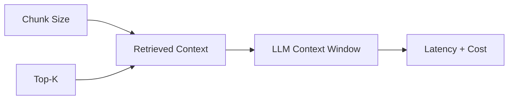

A retrieval system should not optimize chunk size independently of the generation context budget.

---

# 59. Chunk Size vs Top-K

Suppose:

```text
Option A:
500-token chunks
K = 10
```

Context:

```text
≈ 5,000 tokens
```

Option B:

```text
2,000-token chunks
K = 10
```

Context:

```text
≈ 20,000 tokens
```

Both may retrieve useful information, but their:

```text
Latency
Cost
Context Quality
Redundancy
```

can differ significantly.

---

# 60. Chunk Redundancy

With overlap:

```text
Chunk 1
A B C D E F

Chunk 2
E F G H I J
```

retrieval may return both.

The final context contains:

```text
E F
E F
```

Repeated context can waste LLM tokens.

Therefore overlap should be evaluated together with retrieval behavior.

---

# 61. Duplicate Chunk Retrieval

A query may retrieve:

```text
Chunk 10
Chunk 11
Chunk 12
```

where all three contain nearly identical content.

Possible approaches include:

```text
Deduplication
Diversity-aware retrieval
Metadata filtering
Reranking
```

These are retrieval-stage optimizations.

---

# 62. Chunking and Embedding Quality

The embedding model receives the chunk as input.

Therefore:

```text
Poor Chunk
    ↓
Poor Representation
    ↓
Poor Retrieval
```

For example:

```text
"25 days."
```

may embed poorly compared with:

```text
"Employees are entitled to 25 days
of annual leave after completing one year
of service."
```

---

# 63. Chunk Quality Heuristic

A practical question:

> If this chunk were shown to an engineer without the rest of the document, would its meaning still be reasonably understandable?

If the answer is:

```text
Yes
```

the chunk is likely self-contained.

If:

```text
No
```

consider adding:

```text
Heading
Parent Context
Metadata
Overlap
```

---

# 64. Chunk Quality Scoring

A chunking evaluation can consider:

```text
Semantic Coherence
Context Completeness
Size Compliance
Metadata Completeness
Retrieval Performance
```

A conceptual score:

```text
Chunk Quality
=
Coherence
+
Context
+
Retrieval Relevance
+
Metadata Quality
```

This is a conceptual framework, not a universal mathematical metric.

---

# 65. Chunking Evaluation Dataset

Build representative queries:

```text
Question 1
Question 2
Question 3
...
Question N
```

For each query define:

```text
Expected Document
Expected Section
Expected Chunk
```

Then compare chunking strategies.

---

# 66. Chunking Evaluation

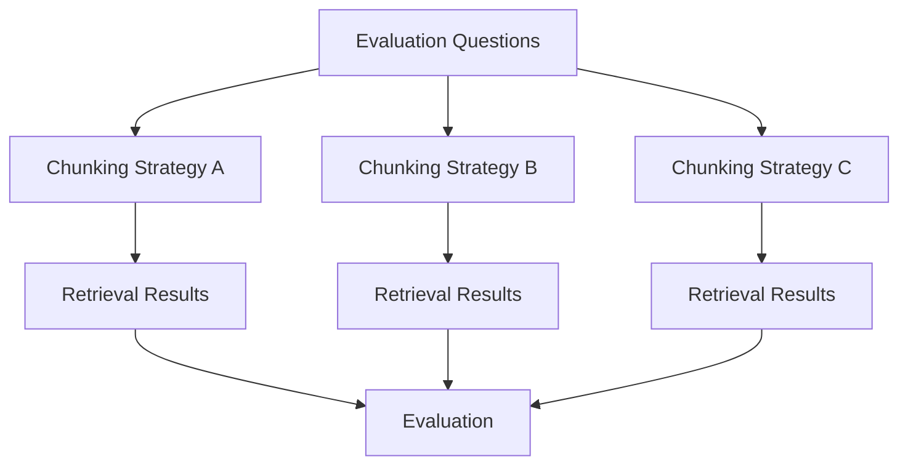

This allows empirical comparison.

---

# 67. Retrieval Metrics

Useful metrics include:

```text
Recall@K
Precision@K
MRR
NDCG
Hit Rate
```

For example:

```text
Recall@5
```

asks whether a relevant chunk appears within the top five results.

---

# 68. Chunking Experiment

Suppose you test:

```text
Strategy A:
500 tokens / 50 overlap

Strategy B:
1000 tokens / 100 overlap

Strategy C:
Recursive 1000 / 150 overlap

Strategy D:
Semantic
```

Measure:

```text
Recall@5
MRR
Latency
Context Size
Embedding Cost
```

Then choose based on the actual workload.

---

# 69. Chunking Is an Optimization Problem

A production chunking strategy balances:

```text
Retrieval Quality
+
Context Quality
+
Latency
+
Storage
+
Embedding Cost
+
LLM Cost
```

Conceptually:

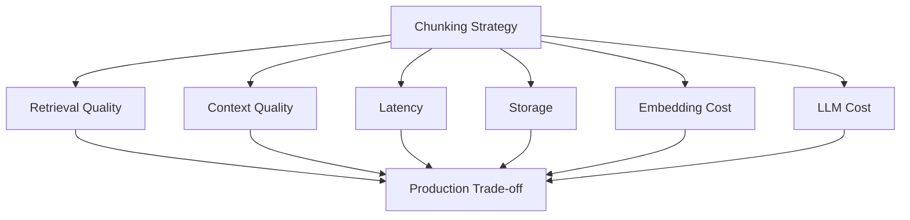

---

# 70. Dynamic Chunking

Some systems may choose chunk size dynamically based on content.

For example:

```text
Short FAQ
 → One question/answer chunk

Long Policy
 → Section-based chunks

Technical Manual
 → Heading + recursive chunks

Table
 → Row-aware chunks
```

This is often better than forcing every document into one universal strategy.

---

# 71. Content-Type-Aware Chunking

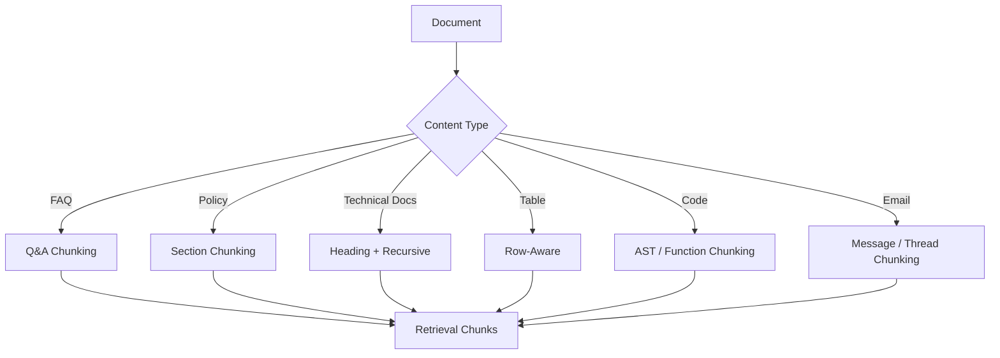

---

# 72. Recursive Character Text Splitter

A common framework implementation:

```python
from langchain_text_splitters import (
    RecursiveCharacterTextSplitter
)

splitter = RecursiveCharacterTextSplitter(
    chunk_size=1000,
    chunk_overlap=150
)

chunks = splitter.create_documents(
    [document_text]
)
```

This is useful for demonstrating recursive splitting.

However:

> The framework is not the chunking strategy.

The strategy is the underlying boundary hierarchy and configuration.

---

# 73. Custom Chunker Interface

A framework-independent application can define:

```python
from abc import ABC, abstractmethod


class Chunker(ABC):

    @abstractmethod
    def chunk(self, document):
        pass
```

Implementations:

```text
RecursiveChunker
SemanticChunker
HeadingChunker
TableChunker
CodeChunker
```

---

# 74. Java Chunker Interface

For an enterprise Java application:

```java
public interface DocumentChunker {

    List<DocumentChunk> chunk(
        ProcessedDocument document
    );
}
```

Implementations can include:

```java
public final class RecursiveChunker
    implements DocumentChunker {
}
```

and:

```java
public final class HeadingAwareChunker
    implements DocumentChunker {
}
```

---

# 75. Chunk Model

A useful domain model:

```java
public record DocumentChunk(
    String chunkId,
    String documentId,
    String content,
    int chunkIndex,
    Map<String, String> metadata
) {
}
```

This keeps chunking separate from embedding.

---

# 76. Chunking Pipeline


This separation makes the pipeline easier to test and evolve.

---

# 77. Chunker Factory

A production application can select a strategy using configuration.

```java
public interface ChunkerFactory {

    DocumentChunker get(
        ChunkingStrategy strategy
    );
}
```

Example:

```text
ChunkingStrategy
 ├── RECURSIVE
 ├── HEADING
 ├── SEMANTIC
 ├── TABLE
 └── CODE
```

---

# 78. Configuration Example

```yaml
chunking:
  strategy: recursive
  chunk-size: 1000
  overlap: 150
```

For a technical documentation workload:

```yaml
chunking:
  strategy: heading-aware
  chunk-size: 1200
  overlap: 100
```

Configuration should be driven by evaluation results.

---

# 79. Chunking and Frameworks

LangChain and LlamaIndex provide chunking utilities.

Examples include:

```text
Text Splitters
Node Parsers
Sentence Splitters
Semantic Chunking Utilities
```

Use these tools when they accelerate implementation, but maintain an architecture where chunking remains an explicit application capability.

---

# 80. LangChain Conceptual Workflow

```python
from langchain_text_splitters import (
    RecursiveCharacterTextSplitter
)

splitter = RecursiveCharacterTextSplitter(
    chunk_size=1000,
    chunk_overlap=150
)

documents = splitter.create_documents(
    [document_text]
)

for document in documents:
    print(document.page_content)
```

The important output is:

```text
Document
 ↓
Document Chunks
```

---

# 81. LlamaIndex Conceptual Workflow

LlamaIndex commonly represents processed content using nodes.

Conceptually:

```python
from llama_index.core import Document
from llama_index.core.node_parser import (
    SentenceSplitter
)

document = Document(
    text=document_text
)

parser = SentenceSplitter(
    chunk_size=1000,
    chunk_overlap=150
)

nodes = parser.get_nodes_from_documents(
    [document]
)
```

The resulting nodes can then be embedded and indexed.

---

# 82. Framework-Agnostic Architecture

The conceptual flow remains:

```text
Document
 ↓
DocumentChunker
 ↓
Chunks
 ↓
EmbeddingProvider
 ↓
VectorStore
```

Whether the implementation uses:

```text
LangChain
LlamaIndex
Custom Code
```

does not change the architecture.

---

# 83. Chunking and Parent Context

A useful pattern is:

```text
Chunk
+
Parent Section
+
Document Title
```

Example:

```text
Document:
Employee Handbook

Section:
Leave Policy

Chunk:
Employees may carry forward...
```

This improves the chance that the chunk remains meaningful outside its original location.

---

# 84. Chunk Context vs Chunk Size

Context enrichment can sometimes reduce the need for very large chunks.

Instead of:

```text
2,000-token chunk
```

you may use:

```text
800-token content
+
context metadata
```

This can provide:

```text
Better Precision
+
Enough Context
```

while reducing retrieval payload.

It should be validated experimentally.

---

# 85. Chunking and Contextual Retrieval

A more advanced architecture can transform:

```text
Raw Chunk
```

into:

```text
Contextualized Chunk
```

before embedding.


This concept belongs to advanced retrieval optimization, but chunk design should allow for it.

---

# 86. Chunking and Query Complexity

Simple query:

```text
"What is the annual leave entitlement?"
```

may work well with:

```text
Section Chunk
```

Complex query:

```text
"Compare annual leave eligibility,
carry-forward rules, and approval requirements."
```

may require multiple chunks.

Therefore chunking should support:

```text
Single-Fact Retrieval
+
Multi-Chunk Retrieval
```

---

# 87. Multi-Chunk Answers

A RAG system may retrieve:

```text
Chunk 1 → Eligibility
Chunk 2 → Entitlement
Chunk 3 → Carry Forward
```

The LLM can combine them:

```text
Retrieved Context
       ↓
     LLM
       ↓
Combined Answer
```

Chunking therefore influences how effectively multiple pieces of evidence can be combined.

---

# 88. Chunk Ordering

When multiple chunks are retrieved, preserve useful ordering.

Possible ordering:

```text
Document Order
Section Order
Similarity Score
```

The final context may need to balance:

```text
Relevance
+
Logical Order
```

This becomes important when chunks come from the same document.

---

# 89. Chunk Metadata for Ordering

Useful fields:

```json
{
  "document_id": "doc-001",
  "section_index": 4,
  "chunk_index": 12
}
```

These allow the system to reconstruct document order.

---

# 90. Chunk Deduplication

After chunking, duplicate chunks may appear because of:

```text
Repeated Sections
Repeated Headers
Document Copies
Versioning
OCR Duplication
```

Use content hashes or similarity-based methods to identify duplicates.

---

# 91. Chunk Hash

```python
import hashlib


def chunk_hash(content: str) -> str:
    return hashlib.sha256(
        content.encode("utf-8")
    ).hexdigest()
```

This can be stored as:

```json
{
  "chunk_id": "chunk-001",
  "content_hash": "abc123..."
}
```

---

# 92. Chunking and Incremental Updates

If only one section changes:

```text
Document
 ├── Section A
 ├── Section B ← changed
 └── Section C
```

the system should ideally avoid reprocessing everything.

```text
Section A → unchanged
Section B → reprocess
Section C → unchanged
```

This requires stable identifiers and change detection.

---

# 93. Stable Chunk IDs

A chunk ID can incorporate:

```text
Document ID
+
Version
+
Section
+
Chunk Index
```

Example:

```text
policy-001-v3-leave-07
```

Stable identifiers simplify:

```text
Updates
Deletion
Debugging
Citations
Lineage
```

---

# 94. Chunking and Versioning

When a document changes:

```text
Version 3
 ↓
Version 4
```

chunk IDs may change.

The system should maintain:

```text
Old Chunk
 ↓
Retired
```

and:

```text
New Chunk
 ↓
Active
```

rather than leaving stale vectors active.

---

# 95. Chunking and Security

Security metadata should be inherited by chunks.

If:

```text
Document = CONFIDENTIAL
```

then:

```text
Chunk 1 = CONFIDENTIAL
Chunk 2 = CONFIDENTIAL
Chunk 3 = CONFIDENTIAL
```

Do not lose security classification during chunking.

---

# 96. Security-Aware Chunk Model

```json
{
  "chunk_id": "policy-001-chunk-07",
  "document_id": "policy-001",
  "content": "Employees may...",
  "metadata": {
    "classification": "CONFIDENTIAL",
    "tenant": "tenant-a",
    "department": "HR"
  }
}
```

This metadata can later be used during retrieval authorization.

---

# 97. Chunking Observability

Track:

```text
Documents Processed
Chunks Created
Average Chunk Size
Median Chunk Size
Maximum Chunk Size
Minimum Chunk Size
Average Overlap
Chunks Rejected
Duplicate Chunks
Chunking Latency
```

These metrics can reveal configuration problems.

---

# 98. Chunk Size Distribution

A healthy dataset may look like:

```text
Average: 820 tokens
Median: 760 tokens
P95: 1,050 tokens
```

A suspicious distribution might show:

```text
Average: 120 tokens
```

indicating overly aggressive splitting.

Or:

```text
Average: 3,000 tokens
```

indicating insufficient splitting.

The appropriate values depend on the workload.

---

# 99. Chunk Length Histogram

A production system can visualize:

```text
Chunk Count
   │
   │       ███
   │     ███████
   │   ██████████
   │ █████████████
   └──────────────────
      Token Length
```

This can help identify unusual chunk distributions.

---

# 100. Chunking Performance

Chunking performance depends on:

```text
Document Size
Number of Documents
Parsing Complexity
Semantic Model Usage
CPU
Memory
Concurrency
```

Simple recursive splitting is usually much cheaper than semantic chunking.

---

# 101. Chunking Cost

The cost can include:

```text
Parsing Cost
+
OCR Cost
+
Semantic Analysis Cost
+
Embedding Cost
+
Storage Cost
+
LLM Context Cost
```

Therefore chunking affects more than just retrieval quality.

---

# 102. Chunking and LLM Cost

Suppose:

```text
Average Chunk = 1,000 tokens
Top-K = 8
```

Potential context:

```text
8,000 tokens
```

If the average chunk becomes:

```text
2,000 tokens
```

the context could become:

```text
16,000 tokens
```

This may increase:

```text
Inference Cost
Latency
Context Competition
```

---

# 103. Chunking and Storage Cost

Suppose a document contains:

```text
100,000 tokens
```

with:

```text
500-token chunks
```

approximately:

```text
200 chunks
```

With:

```text
1,000-token chunks
```

approximately:

```text
100 chunks
```

More chunks generally mean:

```text
More Embeddings
More Vector Records
More Index Entries
More Metadata
```

---

# 104. Chunking Strategy Selection

A practical decision process:

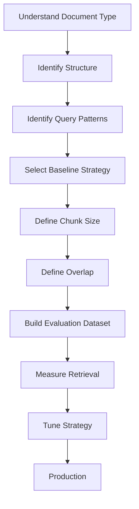

---

# 105. Recommended Baseline

For many general enterprise text workloads, a reasonable baseline is:

```text
Structure-aware preprocessing
+
Recursive chunking
+
Moderate overlap
+
Metadata
```

Then evaluate against:

```text
Semantic Chunking
Heading-Based Chunking
Parent-Child Chunking
```

where appropriate.

---

# 106. Do Not Optimize Blindly

Avoid assuming:

```text
500 tokens = best
```

or:

```text
1,000 tokens = best
```

or:

```text
20% overlap = best
```

These are starting points.

The correct values depend on:

```text
Corpus
Query Distribution
Embedding Model
Retriever
LLM Context Window
Latency
Cost
```

---

# 107. Chunking Experiment Matrix

Example:

| Strategy | Chunk Size | Overlap | Recall@5 | MRR | Latency |
|---|---:|---:|---:|---:|---:|
| Recursive | 500 | 50 | Evaluate | Evaluate | Evaluate |
| Recursive | 1000 | 100 | Evaluate | Evaluate | Evaluate |
| Recursive | 1500 | 150 | Evaluate | Evaluate | Evaluate |
| Heading | Variable | N/A | Evaluate | Evaluate | Evaluate |
| Semantic | Variable | N/A | Evaluate | Evaluate | Evaluate |

The actual values should come from experiments on the target dataset.

---

# 108. Chunking Evaluation Workflow

```text
1. Select representative documents.

2. Define representative queries.

3. Establish ground-truth relevant content.

4. Implement baseline chunking.

5. Generate embeddings.

6. Run retrieval.

7. Measure Recall@K / MRR / NDCG.

8. Change chunk size.

9. Change overlap.

10. Compare strategies.

11. Measure latency and cost.

12. Select the best production trade-off.
```

---

# 109. Production Chunking Architecture

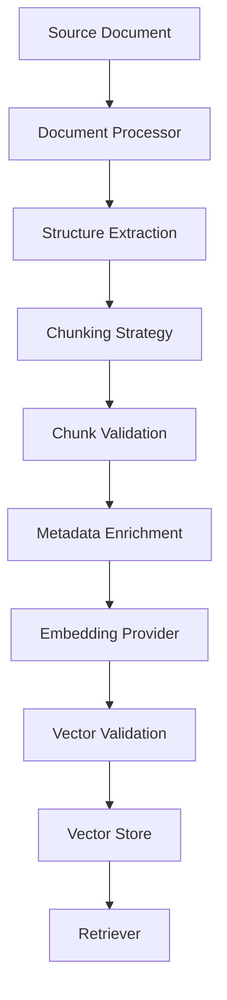

---

# 110. Production Chunking Workflow

```text
1. Receive document.

2. Validate document identity.

3. Parse document.

4. Extract content.

5. Preserve structure.

6. Normalize content.

7. Detect document type.

8. Select chunking strategy.

9. Preserve section context.

10. Generate chunks.

11. Validate chunk size.

12. Validate chunk content.

13. Attach metadata.

14. Generate stable chunk IDs.

15. Calculate content hashes.

16. Generate embeddings.

17. Validate vectors.

18. Persist chunk and vector metadata.

19. Update processing state.

20. Emit observability metrics.

21. Support reprocessing and deletion.
```

---

# 111. Common Chunking Mistakes

## 111.1 Using One Chunk Size Everywhere

Different document types require different strategies.

---

## 111.2 Splitting in the Middle of Concepts

Avoid arbitrary boundaries when possible.

---

## 111.3 Excessive Overlap

Too much overlap creates:

```text
Duplicate Content
Higher Cost
Redundant Retrieval
```

---

## 111.4 Tiny Chunks

Chunks such as:

```text
"25 days."
```

lack sufficient context.

---

## 111.5 Huge Chunks

Huge chunks reduce retrieval precision and consume more context.

---

## 111.6 Ignoring Headings

Headings often provide critical semantic context.

---

## 111.7 Breaking Tables

Table relationships should be preserved.

---

## 111.8 Breaking Q&A Pairs

Questions and answers should usually remain together.

---

## 111.9 Losing Page Numbers

This makes citations harder.

---

## 111.10 Losing Security Metadata

Security metadata must propagate to chunks.

---

## 111.11 No Evaluation

Chunking should be measured, not guessed.

---

## 111.12 Optimizing Only for Retrieval

Also measure:

```text
Latency
Storage
Embedding Cost
LLM Context Cost
```

---

# 112. Best Practices

```text
1. Treat chunking as a retrieval design decision.

2. Understand the document structure before choosing a strategy.

3. Prefer semantic or structural boundaries over arbitrary boundaries.

4. Use token-aware limits when working with LLMs.

5. Preserve headings and parent context.

6. Use overlap only where it provides value.

7. Keep chunks sufficiently self-contained.

8. Preserve tables and structured data.

9. Keep FAQ questions and answers together.

10. Use content-type-specific strategies where appropriate.

11. Preserve document IDs.

12. Preserve page and section information.

13. Preserve security metadata.

14. Generate stable chunk IDs.

15. Use content hashes for change detection.

16. Support incremental reprocessing.

17. Evaluate multiple chunk sizes.

18. Evaluate multiple overlap values.

19. Measure retrieval quality.

20. Measure latency and cost.

21. Monitor chunk-size distributions.

22. Separate chunking from embedding.

23. Keep chunking behind an application capability interface.

24. Use frameworks as implementation tools rather than architectural boundaries.

25. Re-evaluate chunking when the corpus or query distribution changes.
```

---

# 113. Production Checklist

```text
[ ] Document structure detected

[ ] Document type identified

[ ] Chunking strategy selected

[ ] Chunk size defined

[ ] Chunk overlap defined

[ ] Token limits considered

[ ] Heading context preserved

[ ] Parent context preserved where required

[ ] Tables handled correctly

[ ] Q&A pairs preserved

[ ] Code structures preserved

[ ] Chunk IDs generated

[ ] Document IDs preserved

[ ] Document versions tracked

[ ] Page numbers preserved

[ ] Section metadata preserved

[ ] Security metadata preserved

[ ] Content hashes generated

[ ] Duplicate chunks detected

[ ] Chunk size validated

[ ] Empty chunks rejected

[ ] Embedding compatibility verified

[ ] Retrieval evaluation dataset available

[ ] Recall@K measured

[ ] MRR / NDCG measured where appropriate

[ ] Latency measured

[ ] Storage measured

[ ] Embedding cost measured

[ ] LLM context cost measured

[ ] Incremental reprocessing supported

[ ] Deletion workflow supported

[ ] Observability implemented
```

---

# 114. Key Takeaways

- Chunking transforms documents into retrieval-ready units.
- Chunking is one of the most important design decisions in a RAG pipeline.
- The goal is not simply to create smaller text pieces.
- Good chunks preserve:
  - Meaning
  - Context
  - Structure
  - Metadata
  - Traceability
- Common strategies include:
  - Fixed character
  - Fixed token
  - Sentence
  - Paragraph
  - Recursive
  - Semantic
  - Structure-aware
- Recursive chunking is a useful general-purpose baseline.
- Semantic chunking attempts to preserve topic boundaries.
- Structure-aware chunking is especially valuable for enterprise documents.
- Different content types require different chunking strategies.
- Tables should preserve row/column relationships.
- FAQs should normally preserve question-answer pairs.
- Code should be chunked according to code structure rather than prose rules.
- Legal and policy documents benefit from hierarchy-aware chunking.
- Chunk overlap can preserve boundary context.
- Excessive overlap increases redundancy and cost.
- Chunk size affects retrieval precision, context quality, latency, and cost.
- Chunk size and `Top-K` should be evaluated together.
- Metadata should travel with every chunk.
- Stable chunk IDs support lineage and incremental updates.
- Content hashes support deduplication and change detection.
- Parent-child chunking can combine retrieval precision with broader context.
- Context enrichment can make chunks more self-contained.
- Chunking should be evaluated empirically.
- Useful retrieval metrics include:
  - Recall@K
  - Precision@K
  - MRR
  - NDCG
  - Hit Rate
- Production chunking should optimize both quality and operational cost.
- LangChain and LlamaIndex can provide implementation utilities, but chunking should remain an explicit application capability.
- There is no universally optimal chunk size or overlap.

The central principle is:

> **Chunk for meaning and retrieval, not merely for size.**

---

# 115. Chapter Navigation

## Part IV — Prompt Engineering & RAG Fundamentals

**Previous Chapter:** [11. Document Processing & Vectorization](11-document-processing-and-vectorization.md)

**Current Chapter:** 12 — Document Chunking Strategies

**Next Chapter:** [13. Vector Database Fundamentals](13-vector-database-fundamentals.md)

### Part IV Chapters

1. [01. Introduction to Prompt Engineering](01-introduction-to-prompt-engineering.md)
2. [02. Prompt Engineering Fundamentals](02-prompt-engineering-fundamentals.md)
3. [03. Advanced Prompt Engineering](03-advanced-prompt-engineering.md)
4. [04. Prompt Design Patterns](04-prompt-design-patterns.md)
5. [05. Zero-shot, One-shot & Few-shot Prompting](05-zero-one-few-shot-prompting.md)
6. [06. Chain-of-Thought Prompting](06-chain-of-thought-prompting.md)
7. [07. ReAct Prompting](07-react-prompting.md)
8. [08. Structured Outputs & Output Parsing](08-structured-outputs-and-output-parsing.md)
9. [09. Function Calling & Tool Calling](09-function-calling-and-tool-calling.md)
10. [10. Embeddings in Practice](10-embeddings-in-practice.md)
11. [11. Document Processing & Vectorization](11-document-processing-and-vectorization.md)
12. **12. Document Chunking Strategies**
13. [13. Vector Database Fundamentals](13-vector-database-fundamentals.md)
14. [14. Similarity Search Techniques](14-similarity-search-techniques.md)
15. [15. RAG Pipeline Components](15-rag-pipeline-components.md)
16. [16. Retrieval & Generation Pipeline](16-retrieval-and-generation-pipeline.md)
17. [17. Vector Databases in RAG](17-vector-databases-in-rag.md)
18. [18. Building Your First RAG Pipeline](18-building-your-first-rag-pipeline.md)
19. [19. RAG Evaluation Fundamentals](19-rag-evaluation-fundamentals.md)
20. [20. Enterprise Generative AI Application Architecture](20-enterprise-generative-ai-application-architecture.md)
21. [21. Deploying AI Applications with Gradio](21-deploying-ai-applications-with-gradio.md)

---

# References

- Hugging Face Transformers Documentation
- Hugging Face Tokenizers Documentation
- LangChain Text Splitters Documentation
- LlamaIndex Node Parsing Documentation
- Sentence Transformers Documentation
- FAISS Documentation
- Chroma Documentation
- pgvector Documentation
- Qdrant Documentation
- Vector database documentation
- Enterprise document-processing documentation
- OCR and document intelligence platform documentation

---

> **Enterprise AI Engineering Handbook**  
> *Building Production-Grade Enterprise AI Systems — One Chapter at a Time.*