# 13 — Vector Database Fundamentals

> Understand how vector databases store, index, search, filter, and manage high-dimensional embeddings that power modern semantic search and Retrieval-Augmented Generation (RAG) systems.

---

## 📖 Overview

A vector database provides the infrastructure required to store and retrieve embeddings efficiently.

In a typical RAG system:

```text
Documents
    ↓
Document Processing
    ↓
Chunking
    ↓
Embedding Model
    ↓
Vector Database
    ↓
Similarity Search
    ↓
Retrieved Context
    ↓
LLM
```

The embedding model converts text into numerical vectors.

The vector database provides the capabilities to:

- Store vectors
- Store associated content
- Store metadata
- Build vector indexes
- Perform similarity search
- Apply metadata filters
- Update records
- Delete records
- Scale retrieval workloads

The key idea is:

> **An embedding model creates the representation; a vector database makes that representation searchable at scale.**

---

# 1. Why Vector Databases Matter

Traditional databases are optimized for structured queries such as:

```sql
SELECT *
FROM employees
WHERE department = 'Engineering';
```

Semantic retrieval asks a different question:

```text
Which stored pieces of content are
most semantically similar to this query?
```

For example:

```text
Query:
"What is the company's annual leave policy?"

       ↓

Embedding Model

       ↓

Query Vector

       ↓

Vector Database

       ↓

Most Similar Chunks
```

This enables semantic search even when the query and document use different words.

---

# 2. Traditional Search vs Vector Search

Traditional keyword search may look for:

```text
annual leave policy
```

Vector search attempts to understand semantic relationships such as:

```text
vacation entitlement
paid time off
employee leave allowance
annual leave days
```

These phrases may have different words but similar meaning.

---

# 3. Vector Database Architecture

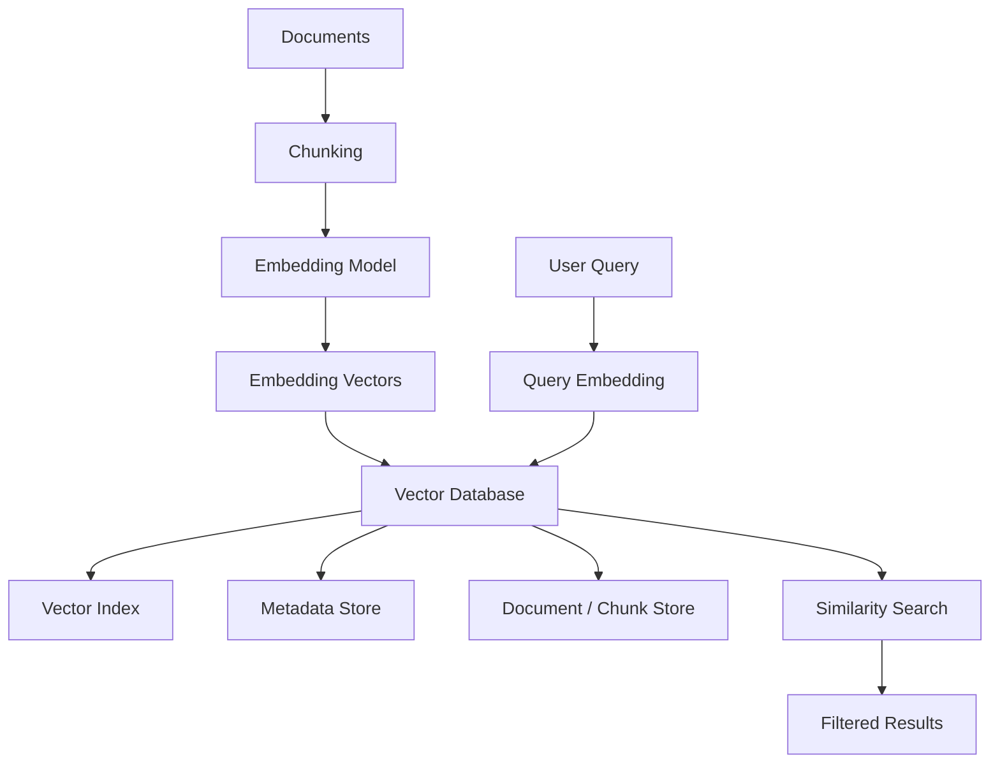

A production vector database is therefore more than a simple array of vectors.

---

# 4. What Is a Vector?

A vector is a numerical representation of data.

Conceptually:

```text
Text
 ↓
Embedding Model
 ↓
[0.12, -0.42, 0.81, ...]
```

For example, a simplified vector might be:

```text
[0.21, 0.73, -0.14, 0.62]
```

Real embedding models typically produce vectors with hundreds or thousands of dimensions.

---

# 5. High-Dimensional Vectors

Suppose an embedding model produces:

```text
768 dimensions
```

Then each document chunk becomes:

```text
Vector =
[
  x1,
  x2,
  x3,
  ...
  x768
]
```

Another model might produce:

```text
1536 dimensions
```

The vector database index must be configured consistently with the selected embedding model.

---

# 6. Vector Database Record

A vector record commonly contains:

```json
{
  "id": "policy-001-chunk-007",
  "vector": [0.12, -0.42, 0.81],
  "text": "Employees receive 25 days of annual leave.",
  "metadata": {
    "document_id": "policy-001",
    "section": "Annual Leave",
    "page": 42,
    "department": "HR"
  }
}
```

Conceptually:

```text
Vector Record
├── ID
├── Vector
├── Content
└── Metadata
```

---

# 7. Vector Database vs Vector Index

These concepts are related but different.

### Vector Database

Provides:

```text
Storage
Query APIs
Metadata
Filtering
CRUD
Persistence
Scaling
Security
Operations
```

### Vector Index

Provides:

```text
Efficient similarity search
```

A vector database may use one or more vector indexing algorithms internally.

---

# 8. Similarity Search

Suppose the query becomes:

```text
"How many annual leave days do employees get?"
```

The query is converted into a vector:

```text
Query
 ↓
Embedding
 ↓
Query Vector
```

The vector database compares it against stored vectors.

```text
Query Vector
     ↓
Similarity Search
     ↓
Vector 7
Vector 21
Vector 45
Vector 82
```

The most relevant vectors are returned.

---

# 9. Similarity Search Architecture


---

# 10. Similarity Metrics

Common similarity measures include:

```text
Cosine Similarity
Dot Product
Euclidean Distance
```

The correct metric depends on:

```text
Embedding Model
Vector Normalization
Index Configuration
Retrieval Objective
```

---

# 11. Cosine Similarity

Cosine similarity measures the angle between two vectors.

Conceptually:

```text
Similarity
   ↑
   │      A
   │     /
   │    /
   │   / θ
   │  /
   │ /
   └────────────→ B
```

The important idea is that cosine similarity focuses on vector direction rather than raw magnitude.

For normalized embeddings, cosine similarity and dot product are closely related.

---

# 12. Dot Product

The dot product measures alignment between vectors.

Conceptually:

```text
a · b
```

Higher values indicate stronger alignment when the embedding setup is appropriate.

Many modern embedding systems use normalized vectors, making dot-product search particularly convenient.

---

# 13. Euclidean Distance

Euclidean distance measures geometric distance.

```text
A ●
   \
    \
     ● B
```

Smaller distance means vectors are closer.

However, the appropriate distance function depends on the embedding model and indexing configuration.

---

# 14. Similarity vs Distance

Similarity metrics usually work as:

```text
Higher = Better
```

Distance metrics usually work as:

```text
Lower = Better
```

Therefore a retrieval implementation must understand how its vector index interprets the selected metric.

---

# 15. Exact Search

The simplest vector search compares the query against every stored vector.

```text
Query Vector
     ↓
Compare with Vector 1
Compare with Vector 2
Compare with Vector 3
...
Compare with Vector N
```

Conceptually:

```text
O(N)
```

comparisons for `N` vectors.

This can become expensive at large scale.

---

# 16. Approximate Nearest Neighbor Search

Production vector systems commonly use:

> **Approximate Nearest Neighbor (ANN)** search.

Instead of comparing against every vector, the index narrows the search space.

```text
Millions of Vectors
       ↓
ANN Index
       ↓
Candidate Region
       ↓
Relevant Vectors
```

This improves search performance.

---

# 17. ANN Trade-off

ANN search introduces a trade-off:

```text
Higher Search Speed
        ↕
Search Accuracy / Recall
```

The goal is usually:

```text
Very high retrieval quality
+
Much lower latency
```

rather than mathematically perfect exhaustive search.

---

# 18. Vector Index Architecture

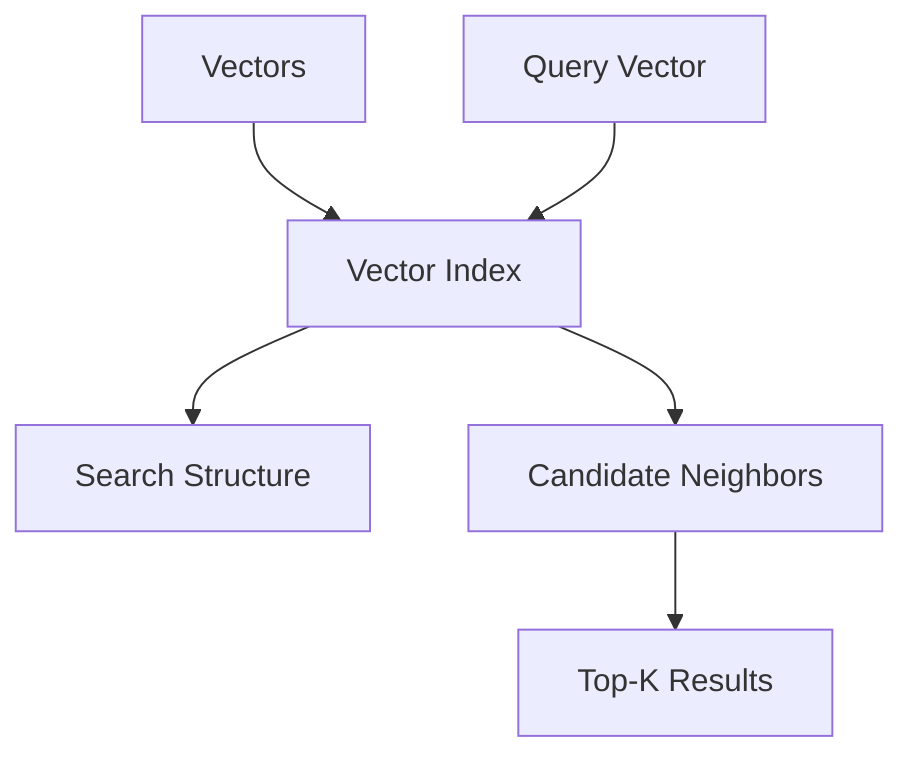

The exact search structure depends on the indexing algorithm.

---

# 19. HNSW

One widely used ANN technique is:

> **Hierarchical Navigable Small World (HNSW)**

HNSW represents vectors as nodes in a graph.

Conceptually:

```text
Layer 2:

A -------- D
           |
           E

Layer 1:

A --- B --- C --- D
      |     |
      E --- F
```

Higher layers provide longer-range navigation.

Lower layers provide more detailed neighborhood search.

---

# 20. HNSW Search Concept

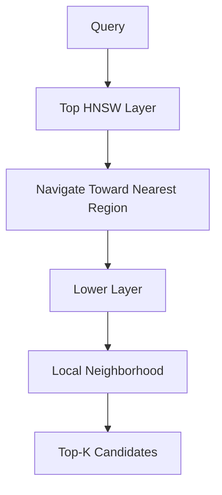

HNSW is popular because it can provide strong search quality with low latency.

---

# 21. HNSW Parameters

Vector databases may expose parameters such as:

```text
M
efConstruction
efSearch
```

Conceptually:

### M

Controls graph connectivity.

Higher values can improve search quality but increase:

```text
Memory
Index Construction Cost
```

### efConstruction

Controls effort during index construction.

### efSearch

Controls search effort at query time.

Higher values can improve recall but increase latency.

---

# 22. IVF

Another family of techniques uses:

> **Inverted File (IVF)** indexes.

Conceptually:

```text
Vectors
   ↓
Clusters
   ↓
Cluster 1
Cluster 2
Cluster 3
...
Cluster N
```

During search, only relevant clusters need to be examined.

---

# 23. IVF Architecture

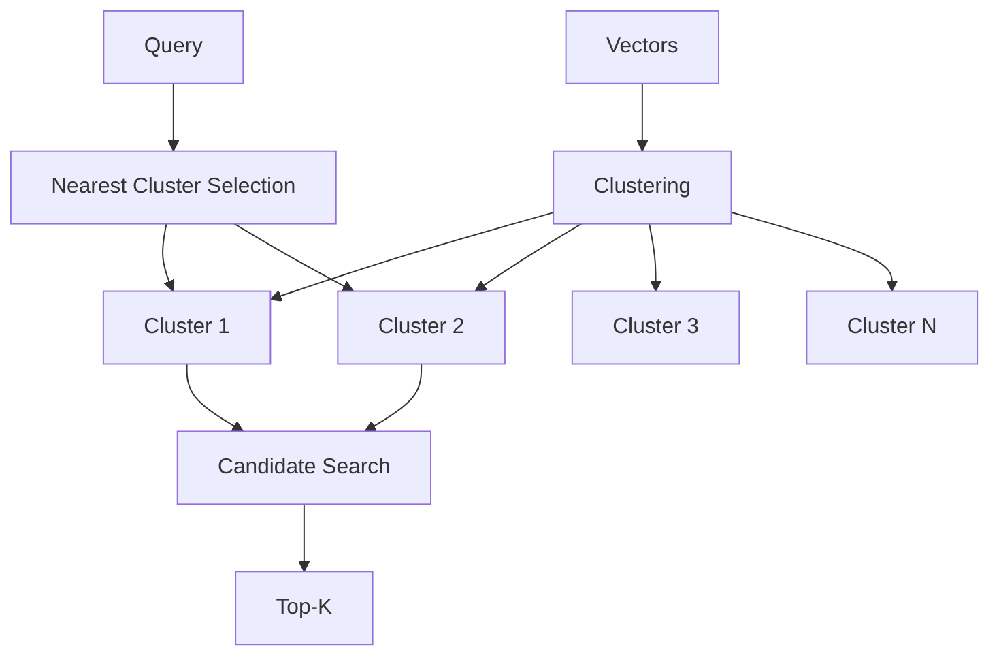

---

# 24. PQ

Another technique is:

> **Product Quantization (PQ)**

It compresses vector representations to reduce memory usage.

Conceptually:

```text
Full Precision Vector
        ↓
Vector Quantization
        ↓
Compressed Representation
```

This can be useful for very large vector collections.

---

# 25. Index Selection

Different workloads may benefit from different indexes.

Consider:

```text
Dataset Size
Query Latency
Recall Requirements
Memory
Update Frequency
Hardware
```

There is no universal vector index that is optimal for every workload.

---

# 26. Metadata Filtering

Vector search is often combined with metadata filters.

Example:

```text
Query:
"What is the leave policy?"

Filter:
department = HR
country = IN
```

Conceptually:

```text
Semantic Search
+
Metadata Filter
```

---

# 27. Metadata Filtering Architecture

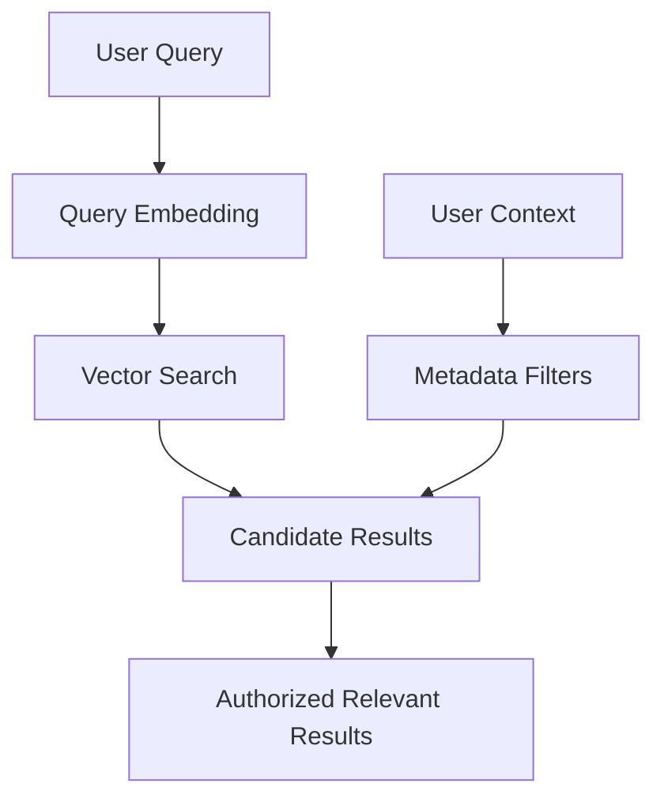

Metadata filtering is especially important in enterprise systems.

---

# 28. Metadata Fields

Common metadata fields include:

```text
document_id
document_type
department
country
language
author
created_at
updated_at
version
page
section
tenant
classification
source
```

---

# 29. Filtering Before vs After Search

Two conceptual approaches exist.

### Pre-filtering

```text
Metadata Filter
      ↓
Eligible Documents
      ↓
Vector Search
```

### Post-filtering

```text
Vector Search
      ↓
Candidate Results
      ↓
Metadata Filter
```

Pre-filtering can reduce the search space, while post-filtering may be easier to implement in some systems.

The correct approach depends on the vector database and workload.

---

# 30. Hybrid Search

Vector databases are often used alongside keyword search.

```text
Semantic Search
      +
Keyword Search
      ↓
Combined Results
```

For example:

```text
Vector Search
```

may understand:

```text
vacation entitlement
```

while keyword search may be better for:

```text
Policy ID HR-2026-0042
```

Hybrid retrieval combines both strengths.

---

# 31. Hybrid Search Architecture

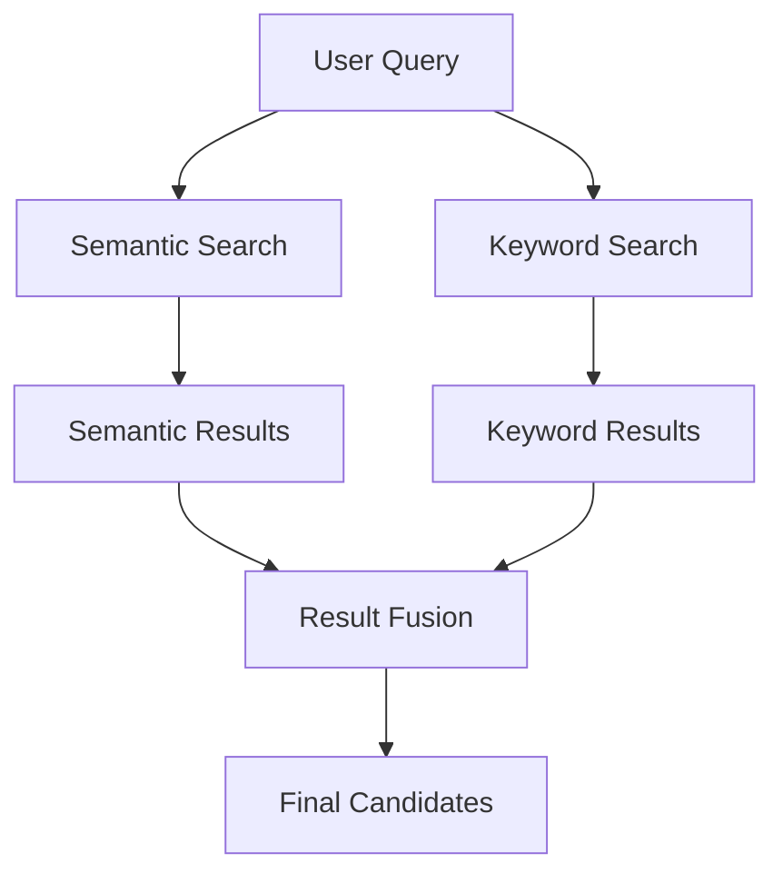

Hybrid search will be explored more deeply in the advanced retrieval module.

---

# 32. CRUD Operations

A vector database should support lifecycle operations.

```text
Create
Read
Update
Delete
```

Example:

```text
Insert Vector
Retrieve Vector
Update Metadata
Delete Vector
```

These operations become important when enterprise documents change.

---

# 33. Upsert

Many vector stores provide:

```text
Upsert
```

which means:

```text
Insert if new
Update if existing
```

Conceptually:

```python
vector_store.upsert(
    records
)
```

This simplifies incremental indexing.

---

# 34. Delete Operations

If a source document is deleted:

```text
Source Document
      ↓
Deleted
      ↓
Associated Chunks
      ↓
Associated Vectors
      ↓
Deleted
```

Vector lifecycle must follow source lifecycle.

---

# 35. Vector Database Lifecycle


---

# 36. Persistence

A production vector database should persist vectors and metadata.

Possible storage architectures include:

```text
Local Disk
Object Storage
Managed Database
Distributed Storage
```

Persistence requirements depend on:

```text
Scale
Availability
Durability
Recovery Objectives
```

---

# 37. In-Memory vs Persistent Vector Stores

### In-Memory

Advantages:

```text
Very Fast
Simple
Useful for Experiments
```

Disadvantages:

```text
Data Loss on Restart
Limited Scale
```

### Persistent

Advantages:

```text
Durability
Recovery
Production Support
```

Disadvantages:

```text
Operational Complexity
Storage Cost
```

---

# 38. Vector Database vs Relational Database

A relational database excels at:

```text
Structured Data
Transactions
Joins
Constraints
Aggregations
```

A vector database specializes in:

```text
High-Dimensional Vector Search
Similarity Retrieval
Embedding Indexes
```

Modern architectures may use both.

---

# 39. PostgreSQL + pgvector

A relational database can also provide vector capabilities.

Conceptually:

```text
PostgreSQL
 ├── Relational Tables
 ├── Metadata
 └── Vector Columns
```

This can be attractive when an application already depends heavily on PostgreSQL.

The decision between a specialized vector database and PostgreSQL with vector support depends on:

```text
Scale
Workload
Operational Requirements
Existing Infrastructure
Query Patterns
```

---

# 40. Vector Database Examples

Common technologies include:

```text
FAISS
Chroma
pgvector
Qdrant
Milvus
Weaviate
Pinecone
OpenSearch
Elasticsearch
```

They differ in:

```text
Deployment
Indexing
Filtering
Scaling
Persistence
Cloud Integration
Operational Model
```

---

# 41. FAISS

FAISS is primarily a vector similarity search library.

Conceptually:

```text
Application
    ↓
FAISS
    ↓
Vector Index
```

It is useful for:

```text
Experiments
Local Applications
Research
Custom Retrieval Systems
```

It is not necessarily a complete distributed vector database by itself.

---

# 42. Chroma

Chroma provides a developer-friendly vector storage and retrieval experience.

Conceptually:

```python
collection.add(
    ids=["chunk-1"],
    documents=["Annual leave is 25 days."],
    embeddings=[[0.1, 0.2, 0.3]]
)
```

It is useful for:

```text
Prototyping
Local Development
RAG Applications
```

---

# 43. Qdrant

Qdrant is a vector search engine/database designed around vector similarity and metadata filtering.

Conceptually:

```text
Collection
 ├── Point
 │    ├── Vector
 │    └── Payload
 └── Point
```

The payload can contain metadata used for filtering.

---

# 44. Managed Vector Services

Cloud-managed vector systems can reduce operational burden.

Typical capabilities include:

```text
Managed Infrastructure
Scaling
High Availability
Backups
Monitoring
Security
API Access
```

The trade-off is greater dependency on the selected platform.

---

# 45. Vector Database Selection

Consider:

```text
1. Dataset size

2. Query throughput

3. Latency requirements

4. Recall requirements

5. Metadata filtering

6. Hybrid search

7. Persistence

8. High availability

9. Backup and recovery

10. Multi-tenancy

11. Security

12. Cloud integration

13. Cost

14. Operational complexity

15. Vendor lock-in
```

---

# 46. Vector Store Abstraction

Enterprise applications should avoid tightly coupling business logic to one vector database.

A framework-independent interface could be:

```python
from abc import ABC, abstractmethod


class VectorStore(ABC):

    @abstractmethod
    def upsert(self, records):
        pass

    @abstractmethod
    def search(
        self,
        vector,
        top_k: int,
        filters=None
    ):
        pass

    @abstractmethod
    def delete(self, ids):
        pass
```

This creates a stable application boundary.

---

# 47. Java VectorStore Interface

For a Java-first enterprise architecture:

```java
public interface VectorStore {

    void upsert(
        List<VectorRecord> records
    );

    List<VectorRecord> search(
        List<Float> queryVector,
        int topK,
        SearchFilter filter
    );

    void delete(
        List<String> ids
    );
}
```

The application does not need to know which vector database implements the interface.

---

# 48. Adapter Architecture

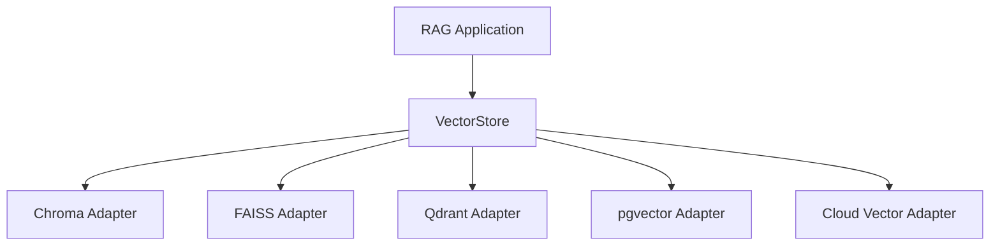

This is a Ports & Adapters approach.

---

# 49. Vector Record Model

A Java record could be:

```java
public record VectorRecord(
    String id,
    List<Float> vector,
    String content,
    Map<String, Object> metadata
) {
}
```

This provides a common domain representation independent of the underlying database.

---

# 50. Vector Store Factory

A factory can select the implementation:

```java
public interface VectorStoreFactory {

    VectorStore create(
        VectorStoreType type
    );
}
```

Possible values:

```text
CHROMA
FAISS
QDRANT
PGVECTOR
MILVUS
```

The exact set depends on the application.

---

# 51. Embedding Dimension Compatibility

One of the most important operational rules:

```text
Embedding Model
        ↓
Vector Dimension
        ↓
Vector Index
```

These must be compatible.

Example:

```text
Embedding Model
 → 768 dimensions

Vector Index
 → 768 dimensions
```

Switching to:

```text
1536 dimensions
```

usually requires a new index or collection.

---

# 52. Embedding Model Migration

Suppose production currently uses:

```text
Embedding Model V1
768 dimensions
```

and you want:

```text
Embedding Model V2
1536 dimensions
```

A safe migration is:

```text
Documents
   ↓
V2 Embeddings
   ↓
New Vector Index
   ↓
Evaluation
   ↓
Production Cutover
```

---

# 53. Blue-Green Vector Indexing

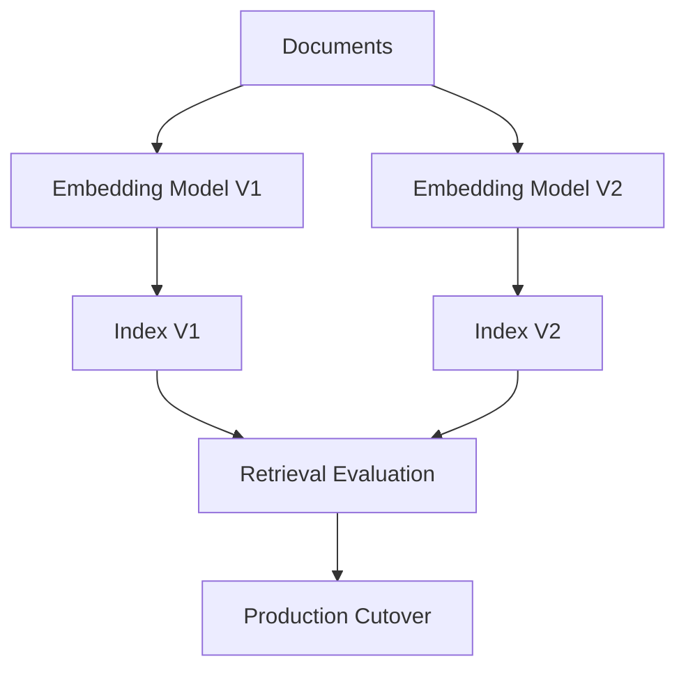

This avoids abruptly replacing a working index.

---

# 54. Batch Ingestion

Large datasets should generally be ingested in batches.

```text
Documents
 ↓
Chunks
 ↓
Batch
 ↓
Embeddings
 ↓
Vector Records
 ↓
Batch Upsert
```

Example:

```python
for batch in batches:

    vectors = embedding_model.embed_batch(
        batch
    )

    vector_store.upsert(
        vectors
    )
```

Batching improves throughput and can reduce API overhead.

---

# 55. Query-Time Workflow

At query time:

```text
User Query
    ↓
Query Embedding
    ↓
Vector Search
    ↓
Metadata Filtering
    ↓
Top-K Results
    ↓
Optional Reranking
    ↓
Context Assembly
    ↓
LLM
```

---

# 56. Query-Time Architecture

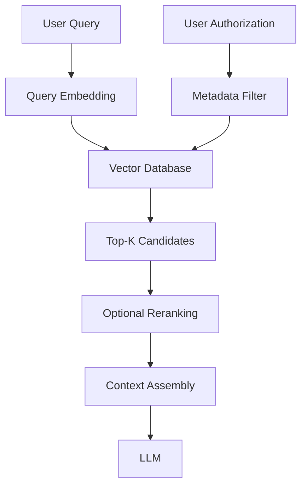

---

# 57. Top-K

`K` determines how many results are returned.

Example:

```text
Top-K = 5
```

means:

```text
Return the 5 most relevant candidates.
```

A larger `K` may improve recall but can increase:

```text
Context Size
Latency
LLM Cost
Noise
```

The optimal value should be evaluated.

---

# 58. Similarity Threshold

Instead of returning every result:

```text
Top-K = 10
```

a system can also apply:

```text
Similarity >= threshold
```

For example:

```text
Only return sufficiently relevant results.
```

However, similarity scores are model- and metric-dependent, so thresholds must be calibrated on real data.

---

# 59. Top-K + Threshold

A production retriever may use:

```text
Candidate Search
       ↓
Top-K
       ↓
Similarity Threshold
       ↓
Metadata Filtering
       ↓
Final Context
```

The exact ordering depends on the vector database and retrieval design.

---

# 60. Empty Retrieval

A production RAG system must handle:

```text
No relevant results
```

Do not automatically send unrelated documents to the LLM.

Possible behavior:

```text
No Relevant Context
       ↓
Controlled Response
```

For example:

```text
"I could not find sufficient information
in the available enterprise knowledge base."
```

---

# 61. Retrieval Confidence

Vector similarity should not automatically be interpreted as:

```text
Answer Confidence
```

A high similarity score means:

```text
The retrieved vector is similar to the query
```

It does not necessarily mean:

```text
The retrieved content contains the correct answer.
```

Additional evaluation is required.

---

# 62. Vector Database Security

Production systems should consider:

```text
Authentication
Authorization
Encryption
Network Isolation
Tenant Isolation
Audit Logging
Secret Management
Access Policies
```

A vector database may contain sensitive enterprise knowledge.

---

# 63. Multi-Tenancy

A multi-tenant vector system might organize data as:

```text
Tenant A
 └── Collection / Namespace

Tenant B
 └── Collection / Namespace

Tenant C
 └── Collection / Namespace
```

Alternative designs may use metadata:

```text
tenant_id = tenant-a
```

with strict filtering.

The correct isolation model depends on security and scale requirements.

---

# 64. Tenant Isolation

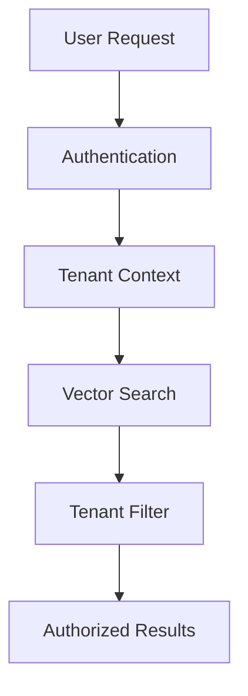

Tenant isolation should be enforced by infrastructure and application controls, not by prompt instructions.

---

# 65. Vector Database Observability

Monitor:

```text
Query Latency
P50 Latency
P95 Latency
P99 Latency
Queries Per Second
Index Size
Memory Usage
CPU
Storage
Search Recall
Failed Queries
Upsert Throughput
Delete Throughput
```

---

# 66. Ingestion Metrics

Track:

```text
Documents Processed
Chunks Indexed
Vectors Created
Vectors Updated
Vectors Deleted
Embedding Failures
Upsert Failures
Indexing Latency
```

---

# 67. Query Metrics

Useful query metrics include:

```text
Query Count
Search Latency
Top-K Distribution
Similarity Score Distribution
Empty Retrieval Rate
Metadata Filter Rate
Reranking Rate
Context Size
```

These help identify retrieval problems.

---

# 68. Vector Database Monitoring

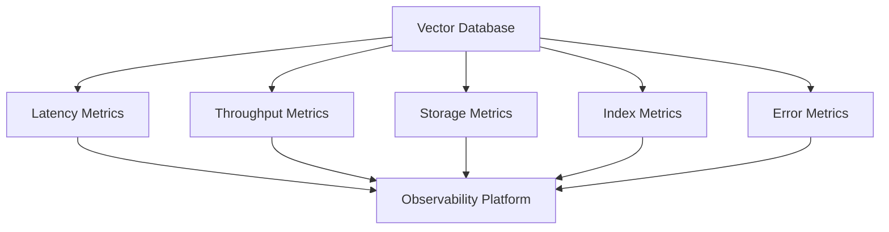

---

# 69. Backup and Recovery

Production vector data should have an appropriate recovery strategy.

Consider:

```text
Backups
Snapshots
Replication
Recovery Point Objective
Recovery Time Objective
Re-indexing Strategy
```

A useful question is:

> If the vector database disappears, how quickly can we rebuild it from the source documents?

If the answer is:

```text
Documents + Embedding Model + Configuration
```

then the vector store can often be treated as a rebuildable derived data layer.

---

# 70. Vector Store as Derived Data

A useful architecture principle:

```text
Source Documents
       ↓
Processing
       ↓
Chunks
       ↓
Embeddings
       ↓
Vector Store
```

The vector database is generally derived from the authoritative source.

This makes:

```text
Re-indexing
Migration
Recovery
Model Upgrades
```

more manageable.

---

# 71. Rebuilding a Vector Index

A rebuild may involve:

```text
Read Source Documents
        ↓
Process
        ↓
Chunk
        ↓
Embed
        ↓
Build New Index
        ↓
Validate
        ↓
Cut Over
```

This is often safer than trying to modify a large production index in place.

---

# 72. Vector Database Performance

Performance depends on:

```text
Number of Vectors
Vector Dimensions
Index Type
Index Parameters
Metadata Filters
Hardware
Concurrency
Query Distribution
```

Do not benchmark a vector database using only a tiny dataset.

---

# 73. Benchmarking

A useful benchmark should include:

```text
Representative Dataset
Representative Queries
Expected Top-K
Latency Targets
Concurrency
Index Configuration
Metadata Filters
```

Measure:

```text
P50
P95
P99
Recall
Throughput
Memory
Storage
```

---

# 74. Vector Database Evaluation

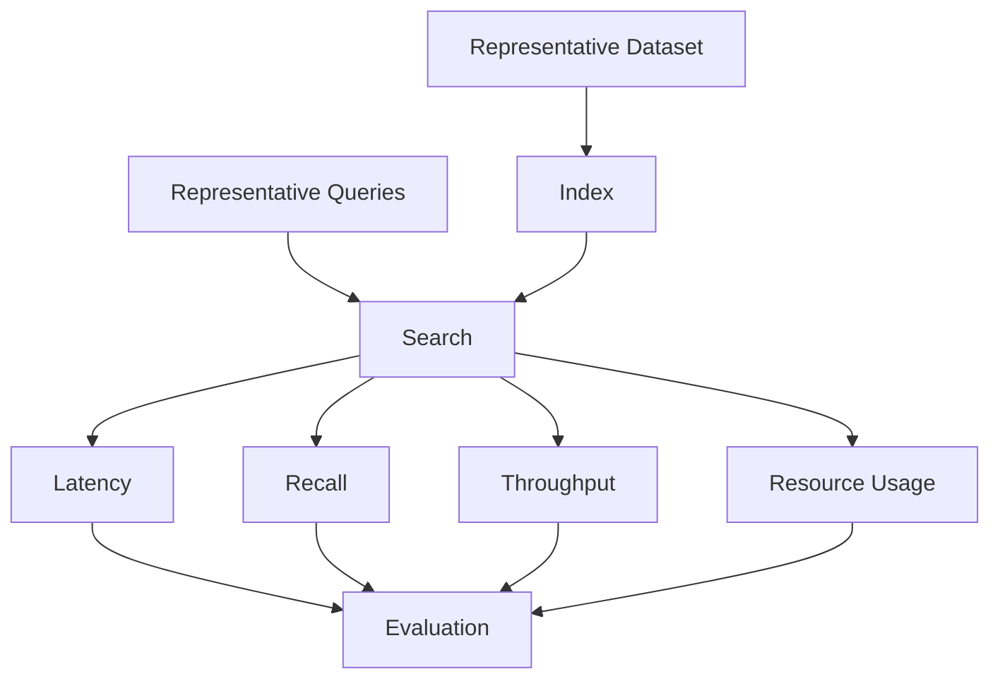

---

# 75. Common Vector Database Mistakes

## 75.1 Treating a Vector Database as Just a Vector Array

Production systems need:

```text
Metadata
Filtering
Lifecycle
Security
Observability
```

---

## 75.2 Ignoring Embedding Dimension

The index and embedding model must be compatible.

---

## 75.3 Choosing an Index Without Benchmarking

ANN parameters directly affect:

```text
Recall
Latency
Memory
```

---

## 75.4 No Metadata Filtering

Enterprise RAG often requires:

```text
Tenant
Department
Country
Security Classification
```

filters.

---

## 75.5 Ignoring Deletions

Deleted source documents must not remain retrievable.

---

## 75.6 No Backup or Rebuild Strategy

A vector database should be recoverable.

---

## 75.7 Mixing Embedding Models

Do not blindly mix vectors generated by incompatible embedding models in one index.

---

## 75.8 No Query Monitoring

Without latency and retrieval metrics, production degradation can remain invisible.

---

## 75.9 Sending Too Many Results to the LLM

More vectors do not automatically mean better answers.

---

## 75.10 Using Similarity Score as Truth

Similarity indicates relevance, not correctness.

---

# 76. Best Practices

```text
1. Treat vectors as derived data.

2. Preserve source document lineage.

3. Store chunk content with vector metadata where appropriate.

4. Track embedding model versions.

5. Track vector dimensions.

6. Choose similarity metrics intentionally.

7. Benchmark ANN indexes.

8. Tune ANN parameters using representative workloads.

9. Support metadata filtering.

10. Design for multi-tenancy.

11. Implement upsert and deletion workflows.

12. Batch ingestion workloads.

13. Validate vectors before indexing.

14. Monitor query latency.

15. Monitor indexing throughput.

16. Monitor retrieval quality.

17. Implement backups or a rebuild strategy.

18. Use blue-green index migration for major model changes.

19. Keep vector-store access behind an application interface.

20. Avoid leaking vendor-specific APIs into business logic.

21. Evaluate specialized vector databases against existing relational infrastructure.

22. Use hybrid search when keyword matching provides complementary value.

23. Calibrate similarity thresholds on real data.

24. Handle empty retrieval explicitly.

25. Secure vector databases like other enterprise data stores.
```

---

# 77. Production Vector Database Workflow

```text
1. Process enterprise documents.

2. Generate retrieval chunks.

3. Generate embeddings.

4. Validate embedding dimensions.

5. Validate vector values.

6. Attach metadata.

7. Generate stable vector IDs.

8. Batch records.

9. Upsert into vector store.

10. Build or update vector indexes.

11. Validate indexing.

12. Record embedding model version.

13. Record document version.

14. Expose retrieval API.

15. Generate query embedding.

16. Apply tenant and security filters.

17. Execute similarity search.

18. Retrieve Top-K candidates.

19. Apply thresholds or additional retrieval logic.

20. Return relevant context.

21. Monitor latency and retrieval quality.

22. Process document updates incrementally.

23. Remove vectors for deleted documents.

24. Rebuild indexes when required.

25. Evaluate retrieval continuously.
```

---

# 78. Production Architecture

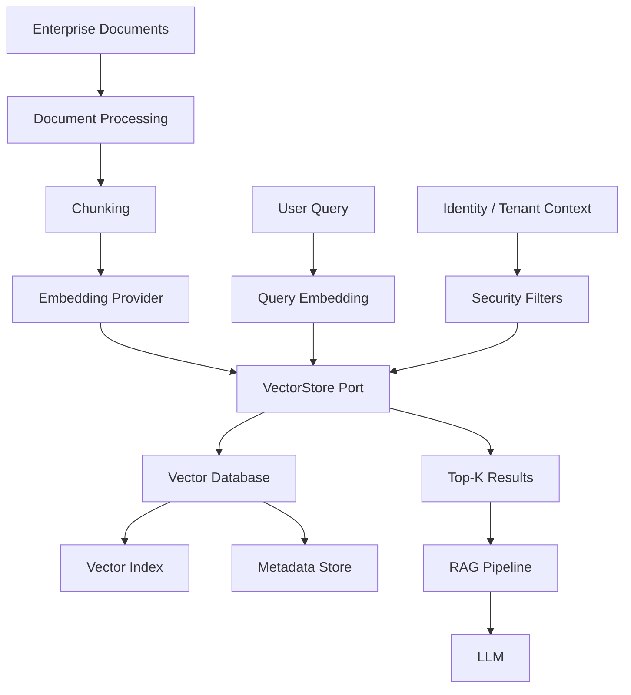

---

# 79. Enterprise Architecture Principles

A production vector layer should follow:

```text
Separation of Concerns
        ↓
Document Processing
        ↓
Chunking
        ↓
Embedding
        ↓
Vector Storage
        ↓
Retrieval
```

Each capability should have a clear responsibility.

For example:

```text
DocumentProcessor
DocumentChunker
EmbeddingProvider
VectorStore
Retriever
```

This avoids turning the vector database into the center of the entire AI architecture.

---

# 80. Framework-Agnostic Design

LangChain and LlamaIndex can simplify vector-store integration.

However:

```text
Application
   ↓
Framework API
   ↓
Vendor API
```

can create tight coupling.

A more portable design is:

```text
Application
   ↓
VectorStore Interface
   ↓
Adapter
   ↓
Vector Database
```

This makes migration easier.

---

# 81. LangChain Conceptual Example

A simplified LangChain-style workflow:

```python
from langchain_chroma import Chroma

vector_store = Chroma(
    collection_name="enterprise-documents",
    embedding_function=embedding_model
)

vector_store.add_documents(
    documents
)

results = vector_store.similarity_search(
    "What is the annual leave policy?",
    k=5
)
```

The underlying architecture remains:

```text
Documents
 ↓
Embeddings
 ↓
Vector Store
 ↓
Similarity Search
```

---

# 82. LlamaIndex Conceptual Example

A simplified LlamaIndex-style workflow:

```python
from llama_index.core import VectorStoreIndex

index = VectorStoreIndex.from_documents(
    documents
)

retriever = index.as_retriever(
    similarity_top_k=5
)

results = retriever.retrieve(
    "What is the annual leave policy?"
)
```

The framework manages implementation details, while the underlying concept remains vector indexing and retrieval.

---

# 83. Why Framework Examples Matter

Framework examples help demonstrate:

```text
How documents enter an index
How vectors are stored
How retrieval is invoked
How metadata flows through the pipeline
```

But the enterprise architecture should still understand:

```text
What is happening underneath?
```

---

# 84. Vector Database Selection Matrix

| Requirement | Possible Direction |
|---|---|
| Local experimentation | FAISS / Chroma |
| PostgreSQL-heavy application | pgvector |
| Dedicated vector service | Qdrant / Milvus / Weaviate / Pinecone |
| Existing search platform | Elasticsearch / OpenSearch |
| Managed cloud architecture | Cloud-managed vector service |
| Highly custom retrieval | FAISS / custom index |
| Enterprise metadata filtering | Evaluate filtering capabilities carefully |

This is a starting point rather than a universal recommendation.

---

# 85. Vector Database Decision Framework

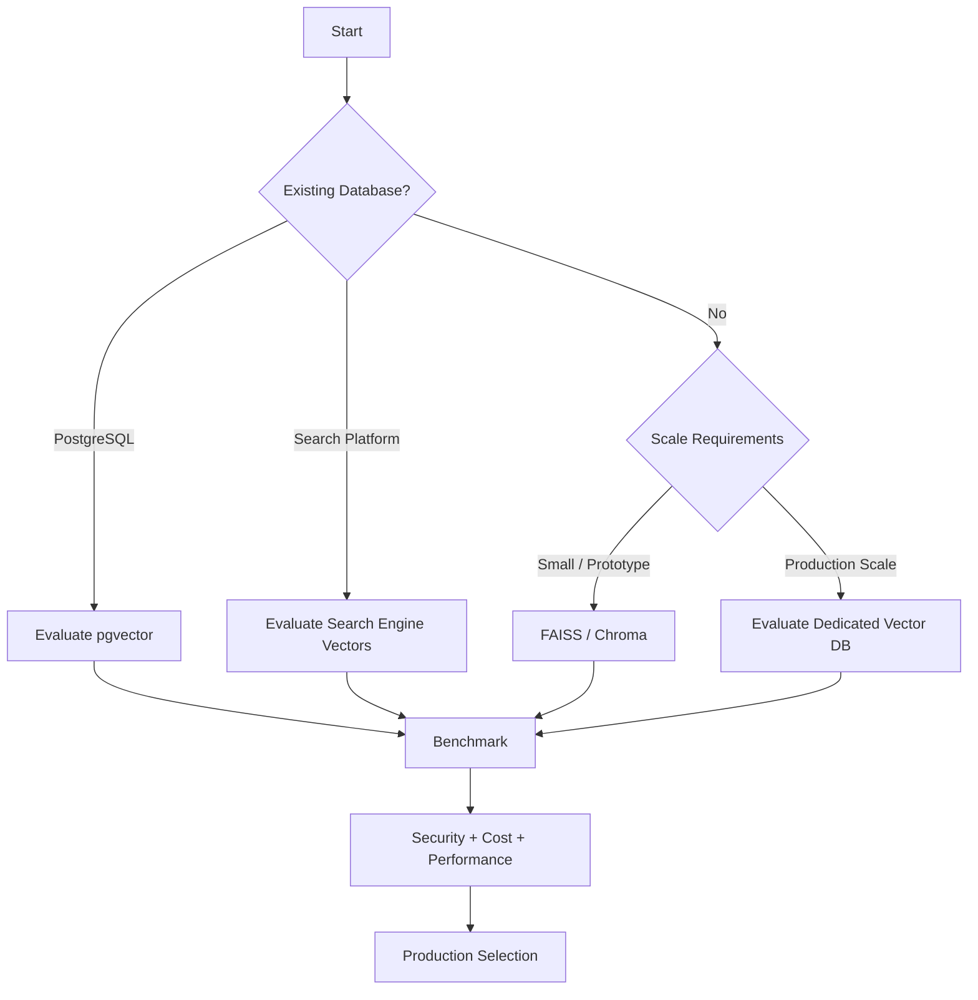

---

# 86. Vector Database vs Search Engine

Modern search platforms increasingly support vector search.

This creates architectural choices between:

```text
Dedicated Vector Database
```

and:

```text
Search Engine with Vector Capabilities
```

A search engine may be attractive when the application already needs:

```text
Keyword Search
Faceting
Filtering
Full-Text Search
Vector Search
```

---

# 87. Vector Database vs Object Storage

Object storage is excellent for:

```text
Raw Documents
PDFs
Images
Source Files
Backups
```

but it is not designed to perform low-latency vector similarity search.

A common architecture is:

```text
Object Storage
      ↓
Raw Documents

Vector Database
      ↓
Embeddings + Retrieval Metadata
```

---

# 88. Source of Truth

A production RAG architecture should clearly define:

```text
Source of Truth
```

For example:

```text
SharePoint
      ↓
Authoritative Documents

Vector Database
      ↓
Derived Retrieval Representation
```

This distinction simplifies:

```text
Governance
Deletion
Updates
Auditing
Recovery
```

---

# 89. Data Lineage

A retrieved vector should be traceable:

```text
Vector
 ↓
Chunk
 ↓
Document Version
 ↓
Source
```

Example:

```json
{
  "vector_id": "policy-001-v3-chunk-07",
  "document_id": "policy-001",
  "version": "v3",
  "source": "sharepoint",
  "page": 42
}
```

---

# 90. Citation Architecture

Metadata allows the RAG system to produce:

```text
Answer

Sources:
Employee Handbook — Page 42
Annual Leave Policy
```

This improves:

```text
Trust
Auditability
Debugging
Enterprise Adoption
```

---

# 91. Vector Database and RAG

The vector database is one component of the larger RAG architecture.

```text
Document Processing
        ↓
Chunking
        ↓
Embedding
        ↓
Vector Database
        ↓
Retrieval
        ↓
Context Assembly
        ↓
LLM
```

Do not confuse:

```text
Vector Database
```

with:

```text
Complete RAG System
```

---

# 92. RAG Pipeline with Vector Database

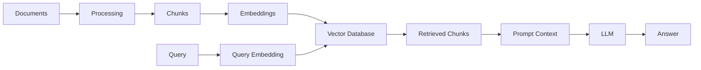

---

# 93. Key Takeaways

- A vector database provides storage and retrieval infrastructure for embeddings.
- Embedding models create vector representations.
- Vector databases make those representations searchable.
- Vector records commonly contain:
  - ID
  - Vector
  - Content
  - Metadata
- Vector indexes accelerate similarity search.
- Exact search compares against every vector.
- ANN search reduces the search space for better performance.
- HNSW is a popular graph-based ANN approach.
- IVF groups vectors into clusters for efficient candidate search.
- Product Quantization can reduce memory requirements through vector compression.
- Similarity metrics include:
  - Cosine similarity
  - Dot product
  - Euclidean distance
- The correct metric depends on the embedding model and vector configuration.
- Metadata filtering is essential for enterprise retrieval.
- Multi-tenant systems require strict tenant isolation.
- Vector databases should support document lifecycle operations.
- Upsert simplifies incremental indexing.
- Deleted source documents should result in vector deletion.
- Embedding model versions should be tracked.
- Embedding dimension must match the vector index configuration.
- Major embedding-model migrations may require rebuilding the index.
- Vector databases should be benchmarked using representative workloads.
- Monitor P50, P95, and P99 search latency.
- Monitor indexing throughput and storage.
- Retrieval quality should be evaluated alongside infrastructure performance.
- Vector databases are usually derived data stores.
- Source documents remain the authoritative source.
- A vector store should be recoverable through backups or deterministic re-indexing.
- Hybrid search can combine semantic and keyword retrieval.
- Similarity scores should not automatically be treated as answer confidence.
- Frameworks such as LangChain and LlamaIndex can simplify implementation.
- Enterprise applications should keep vector-store access behind a capability interface.
- Ports & Adapters architecture makes vector database migration easier.
- There is no universally best vector database.
- Vector database selection should consider:
  - Scale
  - Latency
  - Recall
  - Filtering
  - Security
  - Availability
  - Cost
  - Operations
  - Vendor lock-in

The central principle is:

> **A vector database is the retrieval infrastructure that turns embeddings into a searchable knowledge layer.**

---

# 94. Chapter Navigation

## Part IV — Prompt Engineering & RAG Fundamentals

**Previous Chapter:** [12. Document Chunking Strategies](12-document-chunking-strategies.md)

**Current Chapter:** 13 — Vector Database Fundamentals

**Next Chapter:** [14. Similarity Search Techniques](14-similarity-search-techniques.md)

### Part IV Chapters

1. [01. Introduction to Prompt Engineering](01-introduction-to-prompt-engineering.md)
2. [02. Prompt Engineering Fundamentals](02-prompt-engineering-fundamentals.md)
3. [03. Advanced Prompt Engineering](03-advanced-prompt-engineering.md)
4. [04. Prompt Design Patterns](04-prompt-design-patterns.md)
5. [05. Zero-shot, One-shot & Few-shot Prompting](05-zero-one-few-shot-prompting.md)
6. [06. Chain-of-Thought Prompting](06-chain-of-thought-prompting.md)
7. [07. ReAct Prompting](07-react-prompting.md)
8. [08. Structured Outputs & Output Parsing](08-structured-outputs-and-output-parsing.md)
9. [09. Function Calling & Tool Calling](09-function-calling-and-tool-calling.md)
10. [10. Embeddings in Practice](10-embeddings-in-practice.md)
11. [11. Document Processing & Vectorization](11-document-processing-and-vectorization.md)
12. [12. Document Chunking Strategies](12-document-chunking-strategies.md)
13. **13. Vector Database Fundamentals**
14. [14. Similarity Search Techniques](14-similarity-search-techniques.md)
15. [15. RAG Pipeline Components](15-rag-pipeline-components.md)
16. [16. Retrieval & Generation Pipeline](16-retrieval-and-generation-pipeline.md)
17. [17. Vector Databases in RAG](17-vector-databases-in-rag.md)
18. [18. Building Your First RAG Pipeline](18-building-your-first-rag-pipeline.md)
19. [19. RAG Evaluation Fundamentals](19-rag-evaluation-fundamentals.md)
20. [20. Enterprise Generative AI Application Architecture](20-enterprise-generative-ai-application-architecture.md)
21. [21. Deploying AI Applications with Gradio](21-deploying-ai-applications-with-gradio.md)

---

# References

- FAISS documentation
- Chroma documentation
- Qdrant documentation
- pgvector documentation
- Milvus documentation
- Weaviate documentation
- Pinecone documentation
- Elasticsearch documentation
- OpenSearch documentation
- LangChain documentation
- LlamaIndex documentation
- Hugging Face documentation
- Vector database and ANN indexing documentation
- Enterprise search and retrieval architecture documentation

---

> **Enterprise AI Engineering Handbook**  
> *Building Production-Grade Enterprise AI Systems — One Chapter at a Time.*