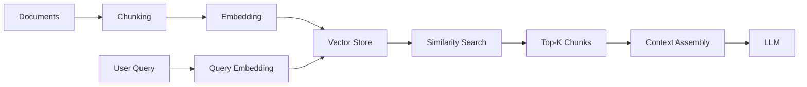
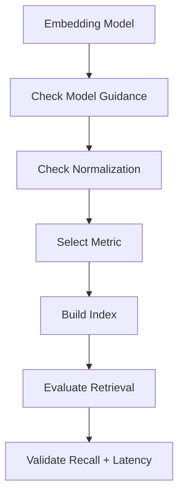
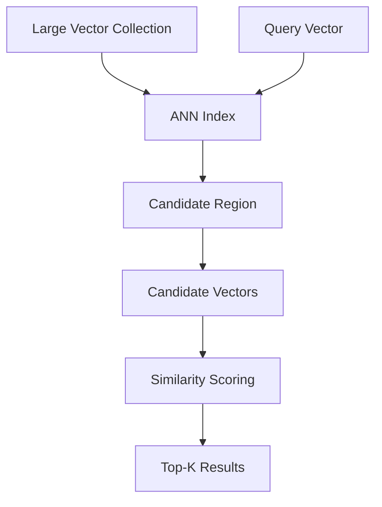
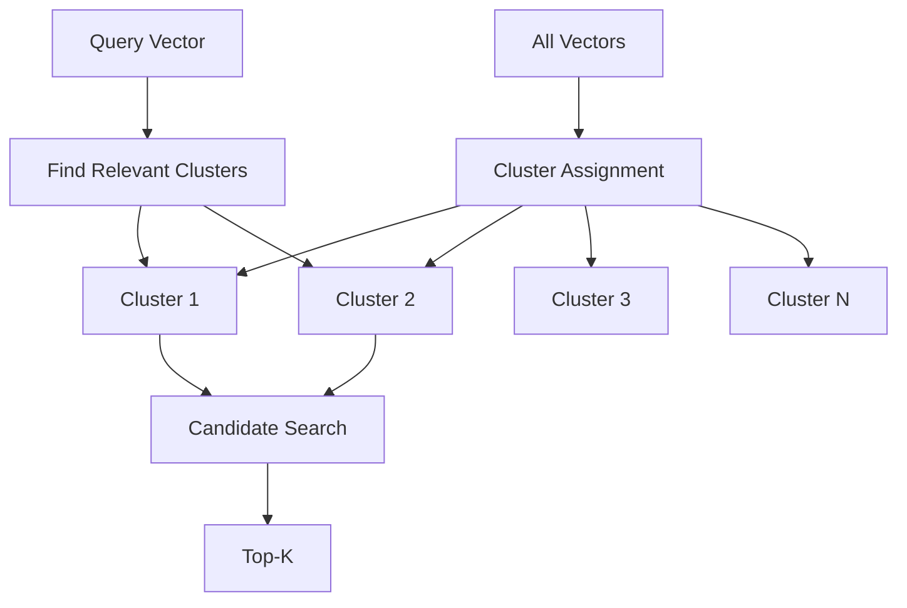
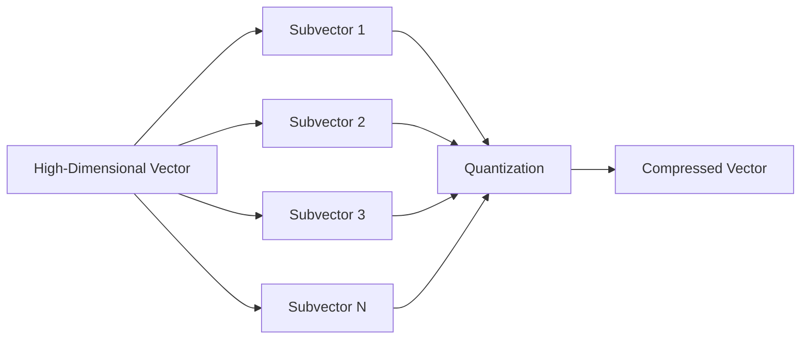
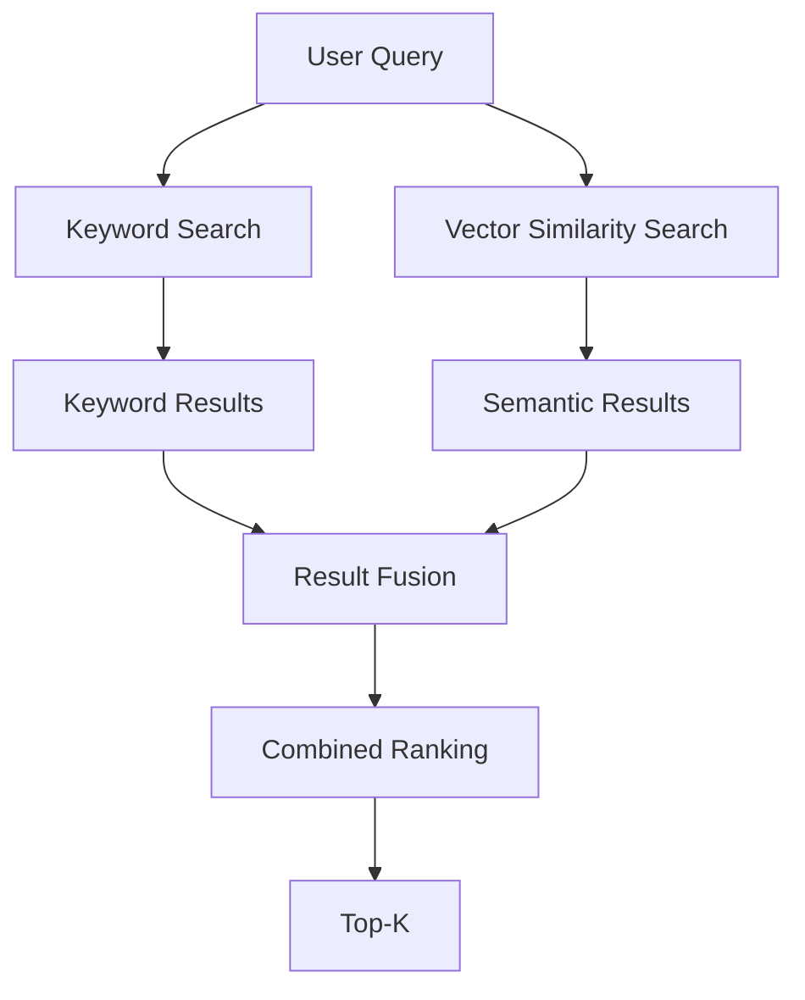
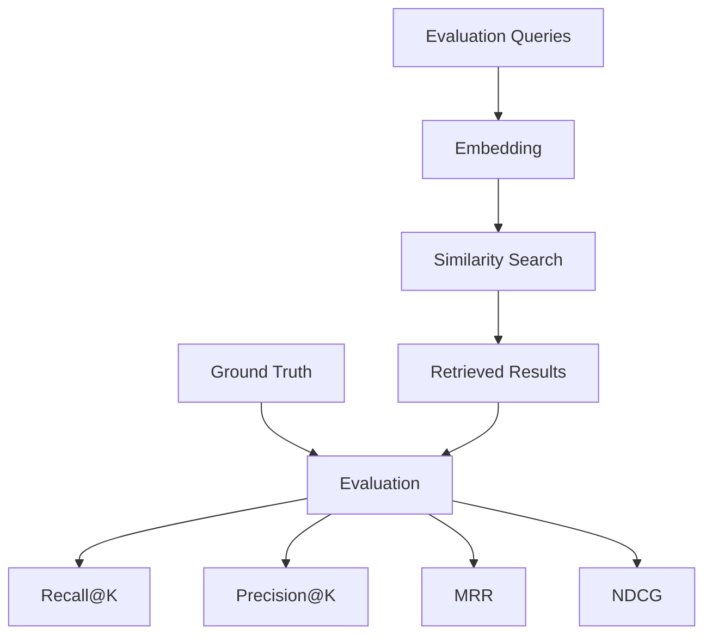
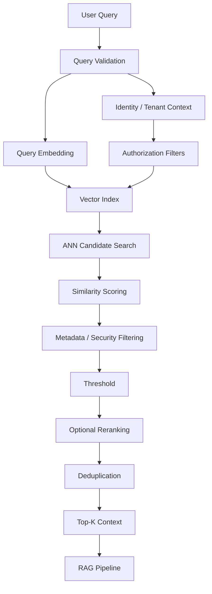
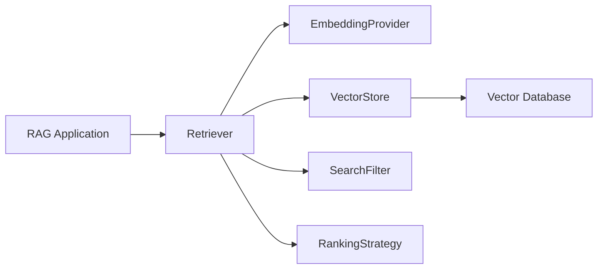

# 14 — Similarity Search Techniques

> Learn how vector similarity search retrieves semantically relevant information from high-dimensional embeddings and understand the algorithms, distance metrics, filtering strategies, ranking approaches, and production trade-offs behind modern semantic retrieval systems.

---

## 📖 Overview

Similarity search is the core retrieval operation that allows a RAG system to find content that is semantically related to a user query.

The basic workflow is:

```text
User Query
    ↓
Query Embedding
    ↓
Vector
    ↓
Similarity Search
    ↓
Candidate Vectors
    ↓
Top-K Results
    ↓
Retrieved Context
```

The goal is simple:

> **Given a query vector, find the most relevant vectors from a large collection.**

For example:

```text
Query:

"What is the employee leave entitlement?"

             ↓
        Query Embedding

             ↓

      Vector Similarity Search

             ↓

┌─────────────────────────────────┐
│ Annual Leave Policy              │
│ Employee Leave Entitlement      │
│ Leave Carry-Forward Rules       │
└─────────────────────────────────┘
```

Similarity search is therefore the bridge between:

```text
Embeddings
```

and:

```text
Retrieval
```

---

# 1. Why Similarity Search Matters

An embedding converts content into a numerical representation.

For example:

```text
"Annual leave entitlement"
```

might become:

```text
[0.12, -0.45, 0.77, 0.21, ...]
```

A different piece of text:

```text
"Employees receive 25 days of paid leave"
```

may produce a vector located relatively close to the query vector.

Similarity search identifies these nearby vectors.

```text
                 Vector Space

                    ● Query
                   / \
                  /   \
                 ●     ●
              Relevant  Relevant

       ●
   Unrelated
```

The closer the vectors are according to the selected similarity metric, the more likely the content is to be semantically related.

---

# 2. Similarity Search in RAG

Similarity search is part of the retrieval stage.



The quality of similarity search directly affects the quality of retrieved context.

---

# 3. Query Embedding

The first step is converting the user query into the same vector space used by the stored documents.

```text
Stored Documents
      ↓
Embedding Model
      ↓
Document Vectors

User Query
      ↓
Same Embedding Model
      ↓
Query Vector
```

The query and document embeddings must be compatible.

---

# 4. Same Embedding Space

Suppose documents were embedded using:

```text
Embedding Model A
Dimension = 768
```

The query should normally be embedded using the same compatible model:

```text
Embedding Model A
Dimension = 768
```

Avoid:

```text
Documents → Model A
Query     → Model B
```

unless the models are explicitly designed to work together.

---

# 5. Vector Space

A vector database can be thought of as storing points in a high-dimensional space.

For visualization:

```text
        y
        ↑
        │        ● Document A
        │
        │   ● Query
        │
        │             ● Document B
        │
        └────────────────────→ x
```

Real embedding spaces may contain:

```text
384
768
1024
1536
3072
```

or more dimensions.

Humans cannot directly visualize these dimensions, but similarity algorithms can operate on them efficiently.

---

# 6. Similarity vs Distance

Two broad approaches are common.

### Similarity

Higher value means:

```text
More Similar
```

Examples:

```text
Cosine Similarity
Dot Product
```

### Distance

Lower value means:

```text
More Similar
```

Examples:

```text
Euclidean Distance
Manhattan Distance
```

The vector database must know which interpretation to use.

---

# 7. Cosine Similarity

Cosine similarity measures the angle between two vectors.

Conceptually:

```text
              Vector A
                ↗
               /
              / θ
             /
            ●────────────→ Vector B
```

The key idea is:

```text
Smaller angle
     ↓
Higher similarity
```

Cosine similarity is widely used for text embeddings.

---

# 8. Cosine Similarity Formula

Conceptually:

```text
cosine similarity =
(dot product of A and B)
/
(product of their magnitudes)
```

In mathematical notation:

```text
cos(θ) = (A · B) / (||A|| ||B||)
```

For normalized vectors, the relationship between cosine similarity and dot product becomes especially convenient.

---

# 9. Dot Product

The dot product measures vector alignment.

For:

```text
A = [a1, a2, a3]

B = [b1, b2, b3]
```

the dot product is:

```text
A · B =
a1b1 + a2b2 + a3b3
```

For normalized embeddings, dot-product search is commonly used as an efficient similarity measure.

---

# 10. Euclidean Distance

Euclidean distance measures straight-line distance between vectors.

Conceptually:

```text
A ●
   \
    \
     \
      ● B
```

Smaller distance means:

```text
A and B are closer
```

For high-dimensional embedding spaces, whether Euclidean distance is appropriate depends on the embedding model and vector normalization.

---

# 11. Similarity Metric Comparison

| Metric | Better Result | Common Use |
|---|---|---|
| Cosine Similarity | Higher | Text embeddings |
| Dot Product | Higher | Normalized embeddings / retrieval |
| Euclidean Distance | Lower | Geometric distance |
| Manhattan Distance | Lower | Specific vector workloads |

The metric should be selected based on the embedding model and retrieval behavior rather than personal preference.

---

# 12. Choosing the Similarity Metric

A practical decision process is:



Do not choose a metric independently from the embedding model.

---

# 13. Exact Nearest Neighbor Search

The simplest search strategy compares the query vector against every stored vector.

```text
Query Vector
     ↓
Vector 1 → Similarity
Vector 2 → Similarity
Vector 3 → Similarity
...
Vector N → Similarity
     ↓
Sort Scores
     ↓
Top-K
```

This is often called:

> **Brute-force or exact nearest-neighbor search.**

---

# 14. Exact Search Complexity

For:

```text
N vectors
```

the system may need to compare the query against:

```text
N vectors
```

for every search.

Conceptually:

```text
O(N)
```

candidate comparisons.

For a small dataset this may be perfectly acceptable.

For millions or billions of vectors, it becomes increasingly expensive.

---

# 15. Exact Search Example

A simple Python implementation:

```python
import numpy as np


def cosine_similarity(a, b):
    return np.dot(a, b) / (
        np.linalg.norm(a) *
        np.linalg.norm(b)
    )


def search(query, vectors, top_k=5):

    scores = [
        cosine_similarity(query, vector)
        for vector in vectors
    ]

    ranked = np.argsort(scores)[::-1]

    return ranked[:top_k]
```

This is useful for understanding the basic concept.

Production systems generally use optimized vector indexes rather than scanning every vector in application code.

---

# 16. Approximate Nearest Neighbor Search

Large-scale systems commonly use:

> **Approximate Nearest Neighbor (ANN)** search.

Instead of searching every vector:

```text
Millions of Vectors
        ↓
ANN Index
        ↓
Smaller Candidate Set
        ↓
Top-K Results
```

ANN trades a small amount of potential recall for significantly improved search performance.

---

# 17. ANN Trade-off

The fundamental trade-off is:

```text
Search Accuracy
      ↕
Search Speed
```

Increasing search effort can improve recall:

```text
Higher Search Effort
        ↓
Potentially Better Recall
        ↓
Higher Latency
```

Reducing search effort:

```text
Lower Search Effort
        ↓
Lower Latency
        ↓
Potentially Lower Recall
```

---

# 18. ANN Architecture



---

# 19. HNSW

One of the most popular ANN techniques is:

> **Hierarchical Navigable Small World (HNSW).**

HNSW organizes vectors into graph-like structures.

Conceptually:

```text
Higher Layer

A ───────────── D
               │
               E


Lower Layer

A ── B ── C ── D
     │    │
     E ── F
```

The higher levels help navigate quickly toward promising regions.

The lower levels provide more detailed neighborhood search.

---

# 20. HNSW Search

Conceptually:

```text
Query
  ↓
Start at upper layer
  ↓
Find closer node
  ↓
Move toward target region
  ↓
Descend to lower layer
  ↓
Search local neighborhood
  ↓
Return Top-K
```

This reduces the amount of the graph that needs to be explored.

---

# 21. HNSW Parameters

Common parameters include:

```text
M
efConstruction
efSearch
```

### M

Controls graph connectivity.

Higher values can improve recall but may increase:

```text
Memory
Index Size
Construction Cost
```

### efConstruction

Controls the amount of effort used while building the index.

Higher values can improve index quality but increase construction cost.

### efSearch

Controls the amount of effort during query execution.

Higher values can improve recall but increase query latency.

---

# 22. HNSW Tuning

A simplified relationship:

```text
efSearch ↑
    ↓
More Candidates Explored
    ↓
Recall ↑
    ↓
Latency ↑
```

Therefore:

> Tune HNSW parameters using the actual production workload rather than relying on generic defaults.

---

# 23. IVF

Another ANN family is:

> **Inverted File (IVF).**

IVF divides the vector space into clusters.

```text
Vector Collection
       ↓
    Clustering
       ↓
┌──────┬──────┬──────┐
│ C1   │ C2   │ C3   │
└──────┴──────┴──────┘
```

At query time, the system searches only selected clusters.

---

# 24. IVF Search



The number of clusters examined affects the speed/recall trade-off.

---

# 25. IVF Search Parameters

A common concept is:

```text
Number of Probes
```

Higher probing:

```text
More Clusters Searched
       ↓
Potentially Higher Recall
       ↓
Higher Latency
```

Lower probing:

```text
Fewer Clusters
       ↓
Lower Latency
       ↓
Potentially Lower Recall
```

---

# 26. Product Quantization

Product Quantization (PQ) compresses vector representations.

Conceptually:

```text
Original Vector
      ↓
Split into Subvectors
      ↓
Quantize Each Subvector
      ↓
Compressed Representation
```

This can significantly reduce memory usage for very large vector collections.

---

# 27. PQ Architecture



The trade-off is:

```text
Lower Memory
      ↕
Potentially Lower Search Accuracy
```

---

# 28. HNSW vs IVF

| Characteristic | HNSW | IVF |
|---|---|---|
| Structure | Graph | Clusters |
| Search | Graph traversal | Cluster search |
| Tuning | efSearch / M | Probes / clusters |
| Memory | Can be significant | Often configurable |
| Dynamic Updates | Generally convenient | Depends on implementation |
| Large-Scale Search | Strong | Strong |
| Compression | Can combine with compression | Often combined with PQ |

The actual performance depends heavily on the database implementation and workload.

---

# 29. HNSW + Quantization

Some systems combine:

```text
HNSW
+
Vector Quantization
```

This can provide:

```text
Fast Search
+
Reduced Memory
```

while attempting to maintain acceptable recall.

---

# 30. Search Pipeline

A production vector search operation can look like:

```text
User Query
    ↓
Query Embedding
    ↓
Vector Index
    ↓
ANN Candidate Search
    ↓
Similarity Scoring
    ↓
Metadata Filtering
    ↓
Top-K
    ↓
Optional Reranking
```

The exact order may vary by vector database.

---

# 31. Top-K Retrieval

`K` determines the number of results returned.

For:

```text
K = 5
```

the retriever returns:

```text
Result 1
Result 2
Result 3
Result 4
Result 5
```

Larger `K` can increase recall but may also introduce noise.

---

# 32. Choosing K

A useful principle:

```text
K too small
    ↓
Relevant information may be missed
```

while:

```text
K too large
    ↓
More irrelevant context
    ↓
Higher latency / cost
```

Therefore `K` should be evaluated using the target query set.

---

# 33. Similarity Threshold

A retriever can also apply a minimum similarity threshold.

Conceptually:

```text
Query
  ↓
Search
  ↓
Results
  ↓
Similarity >= Threshold
  ↓
Accepted Results
```

For example:

```text
Top-K = 10
Threshold = configured minimum
```

Only sufficiently relevant results are retained.

---

# 34. Why Thresholds Are Difficult

Similarity scores depend on:

```text
Embedding Model
Similarity Metric
Vector Normalization
Corpus
Query Type
Index
```

Therefore:

```text
0.80
```

does not universally mean:

```text
Highly Relevant
```

across all systems.

Thresholds should be calibrated experimentally.

---

# 35. Metadata Filtering

Similarity search can be combined with structured filters.

Example:

```text
Query:
"What is the leave policy?"

Filter:
country = India
department = HR
```

Conceptually:

```text
Semantic Similarity
        +
Metadata Constraints
        ↓
Relevant Authorized Results
```

---

# 36. Pre-Filtering

A system may first restrict the candidate set:

```text
All Vectors
    ↓
Metadata Filter
    ↓
Eligible Vectors
    ↓
Similarity Search
```

Example:

```text
tenant_id = tenant-a
```

This can reduce the search space.

---

# 37. Post-Filtering

Another approach:

```text
All Vectors
    ↓
Similarity Search
    ↓
Candidate Results
    ↓
Metadata Filter
```

This can create problems if the initial Top-K results contain many records that are later filtered out.

For example:

```text
Top-K = 5

After security filtering:
0 results
```

The correct approach depends on database capabilities and retrieval requirements.

---

# 38. Filtered ANN Search

Production vector databases often provide mechanisms for combining:

```text
ANN Search
+
Metadata Filtering
```

This is particularly important for enterprise workloads involving:

```text
Tenant Isolation
Access Control
Department Restrictions
Document Types
Geography
Time Ranges
Security Classification
```

---

# 39. Hybrid Search

Similarity search does not always replace keyword search.

Consider:

```text
Query:
"Policy ID HR-2026-0042"
```

Exact keyword matching may be extremely useful.

Semantic search may instead interpret:

```text
HR policy identifier
```

Hybrid retrieval combines:

```text
Keyword Search
+
Semantic Search
```

---

# 40. Hybrid Search Architecture



Hybrid retrieval is particularly useful when both semantic meaning and exact terms matter.

---

# 41. Result Fusion

Two retrieval systems may produce:

```text
Keyword Results
```

and:

```text
Vector Results
```

These can be combined using ranking strategies.

Conceptually:

```text
Keyword Score
       +
Semantic Score
       ↓
Combined Score
```

More advanced fusion methods are covered later in the retrieval section.

---

# 42. Reranking

Initial vector search may return:

```text
Top 20 candidates
```

A more sophisticated reranker can then reorder them:

```text
20 Candidates
     ↓
Reranker
     ↓
Top 5 High-Quality Results
```

This creates a two-stage retrieval architecture.

---

# 43. Two-Stage Retrieval


This can improve precision because:

```text
ANN
```

focuses on fast candidate generation, while:

```text
Reranker
```

performs deeper relevance evaluation.

Advanced reranking techniques will be covered later in the handbook.

---

# 44. Candidate Generation vs Ranking

It is useful to separate:

### Candidate Generation

Goal:

```text
Find potentially relevant content quickly.
```

Typical technology:

```text
ANN Vector Search
```

### Ranking

Goal:

```text
Order candidates by relevance.
```

Possible technology:

```text
Reranker
Hybrid Ranking
Business Rules
```

---

# 45. Similarity Search and Recall

Retrieval quality can be measured using:

```text
Recall@K
```

The question is:

> Did the relevant document or chunk appear within the top K results?

Example:

```text
Expected relevant chunk:
Chunk 42

Retrieved:
Chunk 7
Chunk 12
Chunk 42
Chunk 81
Chunk 93
```

For:

```text
K = 5
```

the relevant chunk was successfully retrieved.

---

# 46. Precision

Precision asks:

> How many retrieved results are actually relevant?

Example:

```text
Top 5 Results

Relevant:
3

Irrelevant:
2
```

Then:

```text
Precision@5 = 3 / 5
```

Precision and recall often need to be balanced.

---

# 47. Recall vs Precision

```text
Higher Recall
      ↓
Retrieve more potentially relevant content
      ↓
Potentially more noise

Higher Precision
      ↓
Retrieve more focused content
      ↓
Potentially miss relevant information
```

The ideal retrieval system balances both.

---

# 48. MRR

Mean Reciprocal Rank (MRR) focuses on the position of the first relevant result.

For one query:

```text
Relevant result at rank 1

RR = 1 / 1
   = 1
```

If relevant result appears at rank 4:

```text
RR = 1 / 4
```

MRR averages reciprocal rank across queries.

---

# 49. NDCG

Normalized Discounted Cumulative Gain (NDCG) evaluates ranking quality when multiple results may have different relevance levels.

For example:

```text
Result 1 → Highly Relevant
Result 2 → Relevant
Result 3 → Slightly Relevant
Result 4 → Irrelevant
```

NDCG rewards systems that place highly relevant results near the top.

---

# 50. Similarity Search Evaluation Dataset

Create representative queries:

```text
Query 1
Query 2
Query 3
...
Query N
```

For each query define:

```text
Expected Relevant Chunks
```

Then compare:

```text
Metric
Index
K
Threshold
Filtering
```

---

# 51. Search Evaluation Workflow



---

# 52. Benchmarking Similarity Search

A production benchmark should include:

```text
Realistic Dataset Size
Representative Queries
Expected Results
Concurrent Users
Metadata Filters
Target K
Index Configuration
```

Measure:

```text
Recall
Latency
Throughput
Memory
CPU
Storage
```

---

# 53. Latency Metrics

Do not measure only average latency.

Track:

```text
P50
P95
P99
```

For example:

```text
P50 = 25 ms
P95 = 70 ms
P99 = 120 ms
```

P95 and P99 are particularly useful for understanding tail latency.

---

# 54. Throughput

A production vector search system may need to support:

```text
100 QPS
1,000 QPS
10,000 QPS
```

depending on workload.

Benchmark:

```text
Queries Per Second
```

alongside latency.

---

# 55. Recall-Latency Trade-off

ANN tuning often produces:

```text
Search Effort ↑
     ↓
Recall ↑
     ↓
Latency ↑
```

A production system should identify an acceptable operating point.

```text
        Recall
          ↑
          │          ●
          │       ●
          │    ●
          │ ●
          └────────────────→
                Latency
```

The best point is usually not the absolute maximum recall.

---

# 56. Index Build Time

Vector indexes also have construction costs.

For large datasets:

```text
Millions of vectors
       ↓
Index Construction
       ↓
CPU
Memory
Time
```

This matters when:

```text
Embedding Model Changes
```

or:

```text
Full Re-indexing
```

is required.

---

# 57. Dynamic Updates

Some vector workloads change frequently:

```text
Documents Added
Documents Updated
Documents Deleted
```

The search architecture should therefore consider:

```text
Index Update Cost
Consistency
Refresh Behavior
Deletion Handling
```

---

# 58. Real-Time vs Batch Indexing

### Batch

```text
Documents
 ↓
Batch Processing
 ↓
Batch Embedding
 ↓
Batch Indexing
```

Useful for:

```text
Large Knowledge Bases
Scheduled Updates
```

### Near Real-Time

```text
Document Change
 ↓
Processing
 ↓
Embedding
 ↓
Index Update
```

Useful when:

```text
Knowledge changes frequently.
```

---

# 59. Similarity Search in Enterprise Systems

Enterprise queries may require:

```text
Semantic Similarity
+
Security
+
Tenant Isolation
+
Metadata
+
Versioning
+
Recency
```

Therefore a production retrieval request may look conceptually like:

```json
{
  "query": "What is the leave policy?",
  "top_k": 10,
  "filters": {
    "tenant_id": "tenant-a",
    "department": "HR",
    "country": "IN"
  }
}
```

---

# 60. Security Must Precede Trust

A dangerous retrieval architecture is:

```text
Search
 ↓
Retrieve Sensitive Documents
 ↓
Filter Later
```

Security restrictions should be enforced as early as the retrieval infrastructure allows.

```text
Identity
 ↓
Authorization Context
 ↓
Allowed Search Space
 ↓
Similarity Search
 ↓
Results
```

Prompt instructions must never be treated as a security boundary.

---

# 61. Multi-Tenant Similarity Search

A multi-tenant system might use:

```text
tenant_id
```

as a mandatory filter.

```text
Query
 ↓
Tenant Context
 ↓
Vector Search
 ↓
Tenant-A Results
```

Never allow:

```text
Tenant A Query
      ↓
Tenant B Data
```

to enter the LLM context.

---

# 62. Similarity Search and Versioning

Suppose:

```text
Policy v1
Policy v2
Policy v3
```

are all stored.

A query may retrieve all three unless filtering or lifecycle management is implemented.

A production system should define:

```text
Active Version
```

and ensure obsolete versions do not incorrectly influence retrieval.

---

# 63. Recency-Aware Retrieval

Some applications care about freshness.

For example:

```text
"What is the current travel reimbursement policy?"
```

The newest document should generally be preferred.

A retrieval architecture may combine:

```text
Semantic Relevance
+
Metadata
+
Recency
```

This is an advanced ranking consideration.

---

# 64. Similarity Search Is Not Enough

A high similarity score does not guarantee:

```text
Correct Answer
```

For example:

```text
Query:
"What is the 2026 leave policy?"

Retrieved:
2023 Leave Policy
```

The content may be semantically similar but operationally wrong.

Therefore production retrieval requires:

```text
Similarity
+
Metadata
+
Version
+
Security
+
Evaluation
```

---

# 65. Query Expansion

Some queries may be too short:

```text
"leave"
```

A system may expand the query into:

```text
employee annual leave entitlement
paid time off policy
leave carry-forward rules
```

These expanded queries can be searched independently and combined.

This is generally known as:

> **Multi-query retrieval / query expansion.**

It will be explored in greater detail in the advanced retrieval module.

---

# 66. Similarity Search Failure Modes

Common failure cases include:

```text
Wrong embedding model
Wrong similarity metric
Poor chunks
Poor query
Too-small K
Too-large K
Incorrect threshold
Missing metadata filters
Stale vectors
Duplicate vectors
Poor ANN configuration
```

Similarity search should therefore be evaluated as part of the complete retrieval pipeline.

---

# 67. Debugging Similarity Search

When retrieval fails:

```text
User Query
    ↓
Inspect Query Embedding
    ↓
Inspect Top-K Scores
    ↓
Inspect Retrieved Chunks
    ↓
Inspect Metadata
    ↓
Inspect Index Configuration
    ↓
Inspect Embedding Model
```

Do not immediately assume the vector database is the problem.

---

# 68. Retrieval Debug Record

A useful diagnostic record could contain:

```json
{
  "query_id": "q-102",
  "query": "What is the leave policy?",
  "top_k": 5,
  "results": [
    {
      "chunk_id": "policy-12",
      "score": 0.91
    },
    {
      "chunk_id": "policy-18",
      "score": 0.87
    }
  ],
  "latency_ms": 34
}
```

This supports retrieval debugging.

---

# 69. Observability

Track:

```text
Query
Query ID
Embedding Model
Index
Top-K
Similarity Scores
Filters
Result IDs
Latency
Empty Result Rate
```

Be careful with logging sensitive query and document content.

Use appropriate data governance and privacy controls.

---

# 70. Production Similarity Search Workflow

```text
1. Receive user query.

2. Validate query.

3. Resolve identity and tenant context.

4. Build authorization filters.

5. Generate query embedding.

6. Validate embedding dimension.

7. Select vector index.

8. Apply similarity search.

9. Apply security and metadata constraints.

10. Retrieve candidate results.

11. Apply similarity threshold if configured.

12. Apply optional ranking or reranking.

13. Remove duplicates.

14. Preserve source ordering where appropriate.

15. Return Top-K context.

16. Record retrieval metrics.

17. Pass approved context to the RAG pipeline.
```

---

# 71. Production Similarity Search Architecture



---

# 72. Framework Example — LangChain

A simplified retrieval example:

```python
retriever = vector_store.as_retriever(
    search_type="similarity",
    search_kwargs={
        "k": 5
    }
)

documents = retriever.invoke(
    "What is the annual leave policy?"
)

for document in documents:
    print(document.page_content)
```

The framework hides the lower-level vector database calls, but conceptually the workflow remains:

```text
Query
 ↓
Embedding
 ↓
Vector Search
 ↓
Top-K
```

---

# 73. Framework Example — Similarity Threshold

A framework may expose threshold-based retrieval.

Conceptually:

```python
retriever = vector_store.as_retriever(
    search_type="similarity_score_threshold",
    search_kwargs={
        "score_threshold": 0.75,
        "k": 10
    }
)
```

The actual supported behavior and score interpretation depend on the vector store and integration.

Always validate the returned scores.

---

# 74. Framework Example — LlamaIndex

A conceptual LlamaIndex retriever:

```python
retriever = index.as_retriever(
    similarity_top_k=5
)

nodes = retriever.retrieve(
    "What is the annual leave policy?"
)

for node in nodes:
    print(node.text)
```

The underlying retrieval concepts remain independent of the framework.

---

# 75. Java Retrieval Interface

For a Java-first enterprise architecture:

```java
public interface Retriever {

    List<RetrievedDocument> retrieve(
        Query query,
        RetrievalOptions options
    );
}
```

The retriever can use:

```text
VectorStore
EmbeddingProvider
MetadataFilter
RankingStrategy
```

without exposing vendor-specific APIs to the application.

---

# 76. Retrieval Options

```java
public record RetrievalOptions(
    int topK,
    Double similarityThreshold,
    SearchFilter filter
) {
}
```

This keeps retrieval configuration explicit.

---

# 77. Search Result Model

```java
public record RetrievedDocument(
    String chunkId,
    String content,
    double score,
    Map<String, Object> metadata
) {
}
```

This provides a stable representation for downstream RAG components.

---

# 78. Retriever Architecture



This keeps similarity search as a capability rather than a vendor-specific implementation detail.

---

# 79. Similarity Search Testing

Unit tests should cover:

```text
Correct Top-K
Correct Score Ordering
Correct Filters
Empty Results
Threshold Behavior
Duplicate Results
Invalid Query
Dimension Mismatch
```

Integration tests should verify:

```text
Embedding
+
Vector Store
+
Index
+
Metadata
+
Retrieval
```

---

# 80. Retrieval Regression Testing

When changing:

```text
Embedding Model
Chunking
Index Type
ANN Parameters
Similarity Metric
```

run the retrieval evaluation suite again.

A seemingly small infrastructure change can alter retrieval quality.

---

# 81. Search Configuration as Code

Keep important retrieval configuration version-controlled.

Example:

```yaml
retrieval:
  top-k: 10
  similarity-threshold: 0.72

  index:
    type: hnsw
    ef-search: 100

  filters:
    tenant-isolation: true
```

The exact configuration depends on the vector database.

---

# 82. Production Configuration Principles

Avoid hard-coding:

```text
Top-K
Threshold
Index Parameters
Embedding Model
```

Instead make them:

```text
Configurable
Versioned
Observable
Experimentable
```

---

# 83. Similarity Search Optimization

Optimization should follow measurement:

```text
Measure
  ↓
Identify Bottleneck
  ↓
Change Configuration
  ↓
Benchmark
  ↓
Compare
  ↓
Deploy
```

Do not optimize only for latency while ignoring recall.

---

# 84. Retrieval Quality vs Latency

A production decision might look like:

| Configuration | Recall@10 | P95 Latency |
|---|---:|---:|
| ANN A | 91% | 20 ms |
| ANN B | 95% | 35 ms |
| ANN C | 98% | 90 ms |

The correct choice depends on business requirements.

For a highly sensitive knowledge system, 98% recall may justify higher latency.

For an interactive application, 95% may be preferable.

---

# 85. Similarity Search Design Checklist

```text
[ ] Embedding model selected

[ ] Query and document embeddings compatible

[ ] Vector dimension verified

[ ] Similarity metric selected

[ ] Exact vs ANN strategy selected

[ ] ANN index selected

[ ] ANN parameters configured

[ ] Top-K configured

[ ] Threshold evaluated

[ ] Metadata filtering implemented

[ ] Tenant isolation implemented

[ ] Security filtering implemented

[ ] Version filtering implemented

[ ] Empty retrieval handled

[ ] Duplicate results handled

[ ] Reranking strategy evaluated

[ ] Recall@K measured

[ ] Precision@K measured

[ ] MRR measured where appropriate

[ ] NDCG measured where appropriate

[ ] P50 latency measured

[ ] P95 latency measured

[ ] P99 latency measured

[ ] Throughput measured

[ ] Index build time measured

[ ] Memory measured

[ ] Storage measured

[ ] Retrieval logs implemented

[ ] Regression tests implemented
```

---

# 86. Common Mistakes

### 86.1 Using the Wrong Embedding Model

Query and documents must exist in a compatible vector space.

### 86.2 Choosing a Metric Arbitrarily

Similarity metrics should follow embedding model characteristics.

### 86.3 Always Using Exact Search

Exact search may become expensive at scale.

### 86.4 Blindly Using ANN Defaults

ANN parameters affect recall and latency.

### 86.5 Choosing an Arbitrary Threshold

Scores are model- and metric-dependent.

### 86.6 Using an Excessively Large K

More results can introduce noise and increase context cost.

### 86.7 Ignoring Security Filters

Similarity search must never bypass authorization.

### 86.8 Ignoring Document Versions

Old documents can outrank current policies.

### 86.9 Assuming Similarity Means Correctness

Similarity is a retrieval signal, not an answer guarantee.

### 86.10 Optimizing Only Latency

A fast retriever that misses relevant information is not useful.

---

# 87. Best Practices

```text
1. Use compatible query and document embeddings.

2. Follow embedding-model guidance for similarity metrics.

3. Start with exact search for small datasets.

4. Move to ANN when scale requires it.

5. Benchmark ANN configurations.

6. Tune HNSW or IVF parameters using real queries.

7. Measure Recall@K.

8. Measure Precision@K.

9. Monitor P95 and P99 latency.

10. Combine semantic search with metadata filters.

11. Enforce tenant isolation.

12. Keep security filters outside prompt logic.

13. Handle stale documents.

14. Track document and embedding versions.

15. Calibrate similarity thresholds.

16. Evaluate Top-K experimentally.

17. Consider reranking for difficult retrieval workloads.

18. Use hybrid search when exact terms matter.

19. Log retrieval diagnostics safely.

20. Keep retrieval configuration version-controlled.

21. Separate candidate generation from ranking.

22. Treat vector search as one stage of the RAG pipeline.

23. Keep vector-store-specific APIs behind adapters.

24. Re-run retrieval evaluation after embedding or chunking changes.

25. Optimize quality and latency together.
```

---

# 88. Production Workflow

```text
Source Documents
      ↓
Document Processing
      ↓
Chunking
      ↓
Embedding
      ↓
Vector Database
      ↓
ANN Index
      ↓
        ┌─────────────────────┐
        │                     │
User Query                Metadata
    ↓                        ↓
Query Embedding       Security Context
    ↓                        ↓
    └──────────┬─────────────┘
               ↓
        Similarity Search
               ↓
        Candidate Results
               ↓
        Filtering
               ↓
          Top-K Results
               ↓
          Optional Reranking
               ↓
        Context Assembly
               ↓
              LLM
```

---

# 89. Key Takeaways

- Similarity search is the core operation behind semantic retrieval.
- A user query is converted into an embedding before search.
- Query and document embeddings must be compatible.
- Common similarity/distance metrics include:
  - Cosine similarity
  - Dot product
  - Euclidean distance
- Exact search compares the query against every stored vector.
- ANN search reduces the search space for large datasets.
- HNSW uses graph-based navigation.
- IVF uses vector clustering.
- Product Quantization can reduce memory usage.
- ANN introduces a speed-versus-recall trade-off.
- `Top-K` determines how many candidate results are returned.
- Similarity thresholds can remove weak matches but must be calibrated.
- Metadata filtering is essential for enterprise retrieval.
- Tenant and security filtering must be enforced before unauthorized content reaches the LLM.
- Hybrid search combines keyword and semantic retrieval.
- Reranking can improve precision after candidate generation.
- Recall@K measures whether relevant results are retrieved.
- Precision@K measures the proportion of retrieved results that are relevant.
- MRR evaluates the position of the first relevant result.
- NDCG evaluates ranking quality across multiple relevance levels.
- P95 and P99 latency are important production metrics.
- Similarity scores do not equal answer confidence.
- Vector search should be evaluated using representative queries and datasets.
- Retrieval configuration should be version-controlled.
- Changes to embeddings, chunking, metrics, or indexes should trigger regression evaluation.
- Similarity search should remain an explicit capability in an enterprise architecture.

The central principle is:

> **Similarity search is not simply about finding the closest vectors; it is about finding the right evidence, under the right constraints, with the right balance between relevance, recall, latency, and cost.**

---

# 90. Chapter Navigation

## Part IV — Prompt Engineering & RAG Fundamentals

**Previous Chapter:** [13. Vector Database Fundamentals](13-vector-database-fundamentals.md)

**Current Chapter:** 14 — Similarity Search Techniques

**Next Chapter:** [15. RAG Pipeline Components](15-rag-pipeline-components.md)

### Part IV Chapters

1. [01. Introduction to Prompt Engineering](01-introduction-to-prompt-engineering.md)
2. [02. Prompt Engineering Fundamentals](02-prompt-engineering-fundamentals.md)
3. [03. Advanced Prompt Engineering](03-advanced-prompt-engineering.md)
4. [04. Prompt Design Patterns](04-prompt-design-patterns.md)
5. [05. Zero-shot, One-shot & Few-shot Prompting](05-zero-one-few-shot-prompting.md)
6. [06. Chain-of-Thought Prompting](06-chain-of-thought-prompting.md)
7. [07. ReAct Prompting](07-react-prompting.md)
8. [08. Structured Outputs & Output Parsing](08-structured-outputs-and-output-parsing.md)
9. [09. Function Calling & Tool Calling](09-function-calling-and-tool-calling.md)
10. [10. Embeddings in Practice](10-embeddings-in-practice.md)
11. [11. Document Processing & Vectorization](11-document-processing-and-vectorization.md)
12. [12. Document Chunking Strategies](12-document-chunking-strategies.md)
13. [13. Vector Database Fundamentals](13-vector-database-fundamentals.md)
14. **14. Similarity Search Techniques**
15. [15. RAG Pipeline Components](15-rag-pipeline-components.md)
16. [16. Retrieval & Generation Pipeline](16-retrieval-and-generation-pipeline.md)
17. [17. Vector Databases in RAG](17-vector-databases-in-rag.md)
18. [18. Building Your First RAG Pipeline](18-building-your-first-rag-pipeline.md)
19. [19. RAG Evaluation Fundamentals](19-rag-evaluation-fundamentals.md)
20. [20. Enterprise Generative AI Application Architecture](20-enterprise-generative-ai-application-architecture.md)
21. [21. Deploying AI Applications with Gradio](21-deploying-ai-applications-with-gradio.md)

---

# References

- FAISS documentation
- Chroma documentation
- Qdrant documentation
- pgvector documentation
- Milvus documentation
- Weaviate documentation
- Pinecone documentation
- Elasticsearch documentation
- OpenSearch documentation
- LangChain documentation
- LlamaIndex documentation
- Hugging Face documentation
- Approximate Nearest Neighbor indexing documentation
- Vector similarity search documentation
- Enterprise search and retrieval architecture documentation

---

> **Enterprise AI Engineering Handbook**  
> *Building Production-Grade Enterprise AI Systems — One Chapter at a Time.*