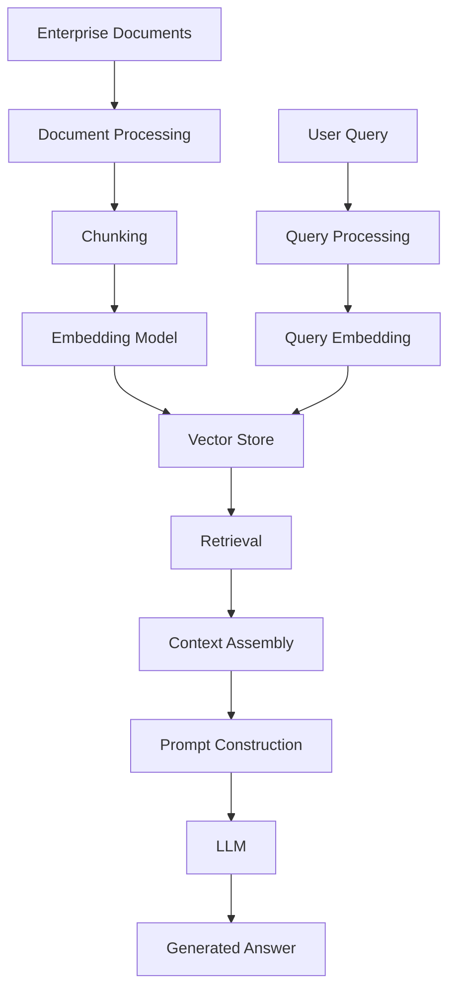
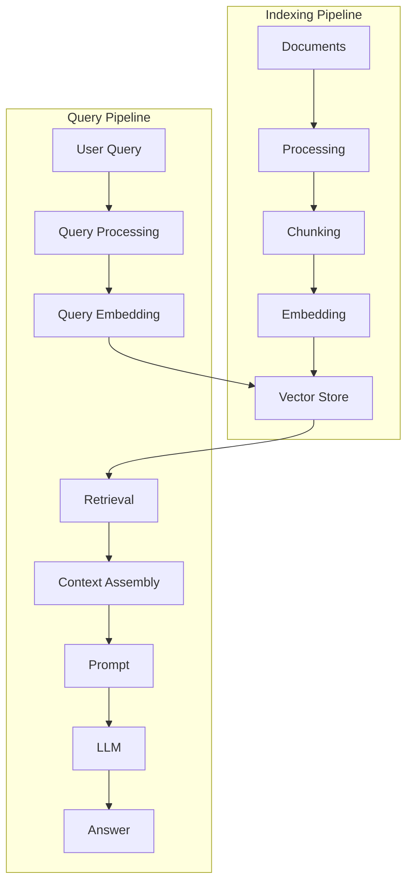
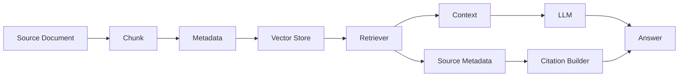
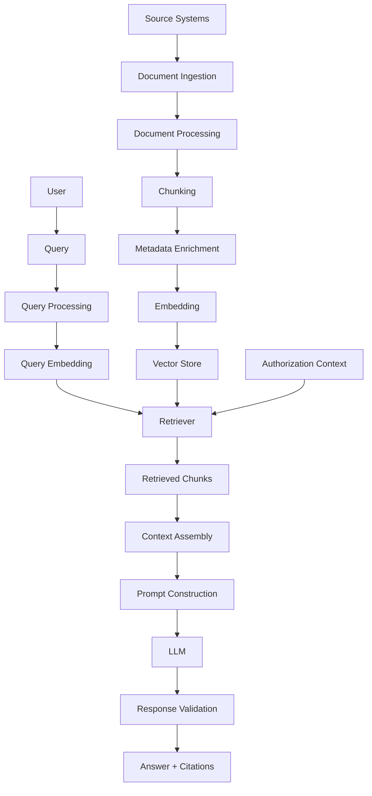
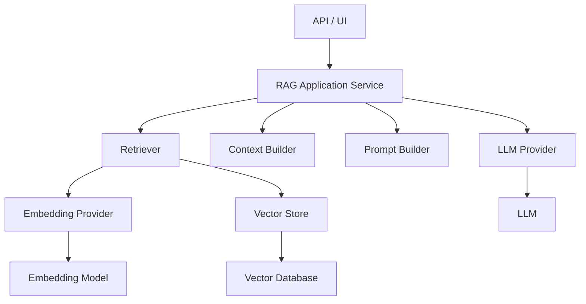
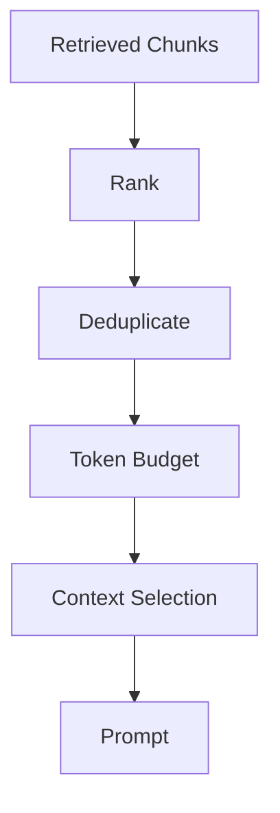
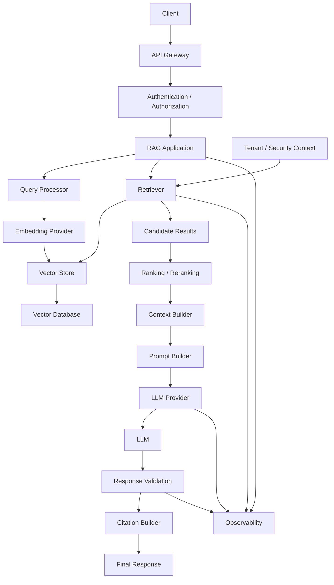
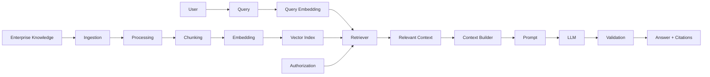

# 15 — RAG Pipeline Components

> Understand the core building blocks of a Retrieval-Augmented Generation (RAG) system and how document processing, chunking, embeddings, vector stores, retrieval, context assembly, prompting, and generation work together to build reliable enterprise AI applications.

---

## 📖 Overview

Retrieval-Augmented Generation (RAG) combines:

```text
Information Retrieval
        +
Large Language Models
        ↓
Knowledge-Grounded Generation
```

Instead of asking an LLM to answer a question using only its pretrained knowledge, a RAG system retrieves relevant information from an external knowledge source and provides that information as context to the model.

The basic architecture is:

```text
Enterprise Documents
        ↓
Document Processing
        ↓
Chunking
        ↓
Embedding
        ↓
Vector Store
        ↓
Retrieval
        ↓
Context Assembly
        ↓
Prompt
        ↓
LLM
        ↓
Generated Answer
```

A production RAG system is therefore not a single model or database.

It is a pipeline of cooperating components.

---

# 1. What Is RAG?

Retrieval-Augmented Generation is an architecture where an LLM generates an answer using information retrieved from an external knowledge source.

Without RAG:

```text
User Query
    ↓
LLM
    ↓
Answer
```

With RAG:

```text
User Query
    ↓
Retriever
    ↓
Relevant Knowledge
    ↓
LLM + Retrieved Context
    ↓
Answer
```

The key difference is the introduction of an external retrieval step.

---

# 2. Why RAG Is Required

LLMs have several limitations.

They may:

```text
Not know private enterprise information
Have outdated knowledge
Generate unsupported answers
Lack access to internal documents
Need current information
Need document-level grounding
```

RAG addresses these limitations by retrieving information at inference time.

For example:

```text
Question:
"What is our company's parental leave policy?"

        ↓

Retrieve:
Employee Handbook
HR Policy
Parental Leave Section

        ↓

LLM

        ↓

Grounded Answer
```

---

# 3. RAG vs Fine-Tuning

RAG and fine-tuning solve different problems.

### RAG

Useful for:

```text
Private Knowledge
Frequently Changing Information
Enterprise Documents
Search
Citations
Knowledge Grounding
```

### Fine-Tuning

Useful for:

```text
Model Behavior
Style
Task Adaptation
Instruction Following
Domain-Specific Patterns
```

A simplified distinction:

```text
Need new knowledge?
        ↓
       RAG

Need different model behavior?
        ↓
    Fine-Tuning
```

---

# 4. RAG Pipeline Overview



This architecture contains two major paths:

```text
Indexing Path
```

and:

```text
Query Path
```

---

# 5. Indexing Path

The indexing path prepares knowledge for retrieval.

```text
Documents
    ↓
Processing
    ↓
Chunking
    ↓
Embedding
    ↓
Vector Storage
    ↓
Search Index
```

This generally happens:

```text
Before the user query
```

and may run:

```text
Batch
Scheduled
Incrementally
Event-driven
```

---

# 6. Query Path

The query path executes when a user asks a question.

```text
User Query
    ↓
Query Processing
    ↓
Query Embedding
    ↓
Retrieval
    ↓
Context Assembly
    ↓
Prompt
    ↓
LLM
    ↓
Answer
```

The query path is usually latency-sensitive.

---

# 7. Two-Path RAG Architecture



Understanding this separation is fundamental to designing production RAG systems.

---

# 8. Component 1 — Document Sources

RAG begins with knowledge sources.

Common enterprise sources include:

```text
PDF
DOCX
PPTX
HTML
Markdown
CSV
JSON
Databases
Knowledge Bases
SharePoint
Confluence
Object Storage
Internal APIs
Web Content
```

The source is the authoritative location from which knowledge is extracted.

---

# 9. Component 2 — Document Processing

Raw documents are rarely ready for direct embedding.

A document may contain:

```text
Text
Tables
Headers
Footers
Images
Metadata
Page Numbers
Sections
Links
Formatting
```

Document processing converts these sources into structured content.

```text
Raw Document
      ↓
Parser
      ↓
Structured Document
```

---

# 10. Document Processing Example

A PDF might contain:

```text
Page 42

Annual Leave Policy

Employees are entitled to 25 days
of annual paid leave...
```

The processing layer should preserve useful metadata:

```json
{
  "text": "Employees are entitled to 25 days...",
  "page": 42,
  "document_id": "employee-handbook",
  "section": "Annual Leave"
}
```

---

# 11. Component 3 — Document Chunking

Large documents should generally be divided into smaller retrieval units.

```text
Document
    ↓
Chunks
```

For example:

```text
Employee Handbook
       ↓
Chunk 1
Chunk 2
Chunk 3
...
Chunk 500
```

Chunking is critical because retrieval usually operates on chunks rather than entire documents.

---

# 12. Why Chunking Matters

Poor chunking can result in:

```text
Incomplete Context
Missing Definitions
Broken Tables
Lost Relationships
Low Retrieval Quality
```

Good chunking should attempt to preserve meaningful semantic units.

Examples:

```text
Paragraph
Section
Heading + Content
Table
FAQ Entry
Code Block
```

---

# 13. Component 4 — Metadata

Each chunk should carry useful metadata.

Example:

```json
{
  "chunk_id": "hr-policy-2026-007",
  "document_id": "hr-policy-2026",
  "page": 7,
  "section": "Annual Leave",
  "department": "HR",
  "country": "IN",
  "version": "2026",
  "source": "sharepoint"
}
```

Metadata supports:

```text
Filtering
Security
Citations
Debugging
Versioning
Tenant Isolation
Document Lineage
```

---

# 14. Component 5 — Embedding Model

An embedding model converts text into vectors.

```text
Chunk
  ↓
Embedding Model
  ↓
Vector
```

Example:

```text
"Employees receive 25 days of annual leave."

        ↓

[0.12, -0.31, 0.74, ...]
```

The resulting vector represents the semantic characteristics of the content.

---

# 15. Query Embedding

The same embedding space is used for the user query.

```text
User Query
    ↓
Embedding Model
    ↓
Query Vector
```

Then:

```text
Query Vector
      ↓
Similarity Search
      ↓
Document Vectors
```

The query and document vectors must be compatible.

---

# 16. Component 6 — Vector Store

The vector store stores:

```text
Vectors
Content
Metadata
Identifiers
```

Conceptually:

```text
Vector Store
├── Vector
├── Content
├── Metadata
└── ID
```

It provides the infrastructure required to search the embedded knowledge base.

---

# 17. Component 7 — Retriever

The retriever is responsible for finding relevant information.

Conceptually:

```python
documents = retriever.retrieve(
    "What is the annual leave policy?"
)
```

The retriever may internally perform:

```text
Query Embedding
      ↓
Vector Search
      ↓
Metadata Filtering
      ↓
Top-K Selection
```

---

# 18. Retriever Responsibilities

A retriever may handle:

```text
Query Transformation
Embedding
Vector Search
Keyword Search
Metadata Filtering
Top-K
Thresholds
Candidate Selection
```

Advanced retrievers may also support:

```text
Hybrid Search
Multi-Query
Parent-Child Retrieval
Contextual Compression
Reranking
```

These advanced techniques are covered later in the handbook.

---

# 19. Component 8 — Retrieval

Retrieval converts a user question into evidence.

```text
Question
   ↓
Retriever
   ↓
Relevant Chunks
```

Example:

```text
Question:
"What is the annual leave entitlement?"

Retrieved:

Chunk 17
"Employees receive 25 days..."

Chunk 32
"Leave may be carried forward..."

Chunk 48
"Employees must request leave..."
```

---

# 20. Top-K Retrieval

The retriever normally returns a limited number of results.

For:

```text
Top-K = 5
```

the system returns:

```text
Result 1
Result 2
Result 3
Result 4
Result 5
```

Choosing K is a trade-off.

```text
K too small
    ↓
Potentially miss useful information

K too large
    ↓
More noise + larger context
```

---

# 21. Component 9 — Metadata Filtering

Enterprise retrieval often requires structured constraints.

Example:

```text
Query:
"What is the leave policy?"

Filters:

tenant_id = tenant-a
country = IN
department = HR
version = current
```

The architecture becomes:

```text
User Query
    +
Authorization Context
    +
Metadata Filters
        ↓
Retriever
```

---

# 22. Security-Aware Retrieval

Security must not depend on the LLM.

Incorrect:

```text
Retrieve Everything
      ↓
LLM decides what user should see
```

Correct:

```text
Identity
    ↓
Authorization
    ↓
Allowed Search Space
    ↓
Retrieval
    ↓
LLM
```

The LLM should receive only information the user is authorized to access.

---

# 23. Component 10 — Context Assembly

Retrieval may return multiple chunks.

These need to be converted into a coherent context.

```text
Retrieved Chunks
      ↓
Context Assembly
      ↓
Structured Context
```

Example:

```text
[Source: HR Policy, Page 7]

Employees are entitled to 25 days
of annual paid leave.

[Source: HR Policy, Page 8]

Unused leave may be carried forward
according to company policy.
```

---

# 24. Context Ordering

The order of retrieved information can matter.

Possible strategies include:

```text
Highest Score First
Document Order
Section Order
Chronological Order
Source Priority
```

The correct strategy depends on the application.

---

# 25. Context Deduplication

Different chunks may contain overlapping information.

For example:

```text
Chunk 12
"Employees receive 25 days..."

Chunk 13
"Employees receive 25 days of annual leave..."
```

Sending both may waste context.

A context assembly stage can:

```text
Detect duplicates
Merge overlapping content
Remove redundant chunks
```

---

# 26. Component 11 — Prompt Construction

The retrieved context must be incorporated into the LLM prompt.

Conceptually:

```text
System Instructions
        +
Retrieved Context
        +
User Question
        ↓
LLM
```

Example:

```text
System:
Answer using the provided context.

Context:
Employees receive 25 days of annual leave.

Question:
How many annual leave days do employees receive?
```

---

# 27. Grounded Prompt

A simple grounded prompt could be:

```text
You are an enterprise knowledge assistant.

Answer the question using only the
provided context.

If the context does not contain enough
information, say that the information
could not be found.

Context:
{retrieved_context}

Question:
{user_query}
```

This provides an explicit grounding policy.

---

# 28. Component 12 — LLM

The LLM receives:

```text
Instructions
+
Context
+
Question
```

and generates:

```text
Answer
```

The LLM's responsibility is primarily:

```text
Understand Context
Follow Instructions
Synthesize Information
Generate Response
```

It should not be treated as the source of enterprise truth.

---

# 29. Component 13 — Generation

The generation stage produces the final response.

```text
Retrieved Evidence
       +
User Question
       ↓
LLM
       ↓
Generated Answer
```

For example:

```text
Employees are entitled to 25 days
of annual paid leave, according to
the HR policy.
```

---

# 30. Component 14 — Citations

Enterprise RAG applications often need source attribution.

The response may include:

```text
Employees are entitled to 25 days
of annual paid leave.

Source:
Employee Handbook
Page 42
```

Citation metadata should originate from the retrieved documents rather than being invented by the model.

---

# 31. Citation Flow



This allows answers to be connected back to their source material.

---

# 32. Component 15 — Response Validation

Production systems may validate the generated response.

Possible checks include:

```text
Structured Output Validation
Citation Validation
Policy Compliance
Content Safety
Grounding Checks
Schema Validation
```

The exact checks depend on the application.

---

# 33. Complete RAG Pipeline



---

# 34. Indexing vs Retrieval Components

| Indexing Stage | Query Stage |
|---|---|
| Document Source | User Query |
| Document Processing | Query Processing |
| Chunking | Query Embedding |
| Metadata Enrichment | Retrieval |
| Embedding | Filtering |
| Vector Store | Context Assembly |
| Index Creation | Prompt Construction |
| Index Updates | LLM Generation |

This separation is important when designing production systems.

---

# 35. Component Dependency Graph

```text
Document Source
      ↓
Document Processor
      ↓
Chunker
      ↓
Metadata Enricher
      ↓
Embedding Provider
      ↓
Vector Store
      ↓
Retriever
      ↓
Context Builder
      ↓
Prompt Builder
      ↓
LLM Provider
      ↓
Response Validator
      ↓
Final Response
```

Each component should have a clear responsibility.

---

# 36. Enterprise Capability Interfaces

A Java-first enterprise architecture can expose capabilities through interfaces.

```java
public interface DocumentProcessor {

    ProcessedDocument process(
        SourceDocument document
    );
}
```

```java
public interface DocumentChunker {

    List<DocumentChunk> chunk(
        ProcessedDocument document
    );
}
```

```java
public interface EmbeddingProvider {

    List<List<Float>> embed(
        List<String> texts
    );
}
```

```java
public interface VectorStore {

    void upsert(
        List<VectorRecord> records
    );

    List<RetrievedDocument> search(
        QueryVector query,
        SearchOptions options
    );
}
```

---

# 37. Retriever Interface

```java
public interface Retriever {

    List<RetrievedDocument> retrieve(
        Query query,
        RetrievalOptions options
    );
}
```

The retriever can coordinate:

```text
EmbeddingProvider
VectorStore
SearchFilter
RankingStrategy
```

without exposing implementation details to the application.

---

# 38. Context Builder

```java
public interface ContextBuilder {

    RetrievalContext build(
        List<RetrievedDocument> documents
    );
}
```

Responsibilities may include:

```text
Ordering
Deduplication
Formatting
Token Budgeting
Citation Preservation
```

---

# 39. Prompt Builder

```java
public interface PromptBuilder {

    Prompt build(
        Query query,
        RetrievalContext context
    );
}
```

This keeps prompt construction separate from retrieval.

---

# 40. LLM Provider

```java
public interface LLMProvider {

    GenerationResult generate(
        Prompt prompt
    );
}
```

This makes the application independent of a specific model provider.

---

# 41. RAG Orchestrator

The overall workflow can be coordinated by an application service.

```java
public class RagService {

    private final Retriever retriever;
    private final ContextBuilder contextBuilder;
    private final PromptBuilder promptBuilder;
    private final LLMProvider llmProvider;

    public Answer answer(Query query) {

        var documents =
            retriever.retrieve(query, RetrievalOptions.defaults());

        var context =
            contextBuilder.build(documents);

        var prompt =
            promptBuilder.build(query, context);

        var result =
            llmProvider.generate(prompt);

        return new Answer(result);
    }
}
```

This separates orchestration from individual capabilities.

---

# 42. RAG Application Architecture



---

# 43. Ports & Adapters Architecture

A production RAG application can use:

```text
                Application Core

                  RAG Service
                      │
        ┌─────────────┼─────────────┐
        ↓             ↓             ↓
   Retriever     LLMProvider   ContextBuilder
        │
   VectorStore
        │
        ↓
      Adapters
```

Concrete implementations may include:

```text
OpenAIEmbeddingProvider
HuggingFaceEmbeddingProvider
WatsonXEmbeddingProvider

ChromaVectorStore
QdrantVectorStore
PgVectorStore

OpenAILLMProvider
WatsonXLLMProvider
AnthropicLLMProvider
```

This keeps the architecture provider-neutral.

---

# 44. Framework-Based RAG

Frameworks can simplify implementation.

Common frameworks include:

```text
LangChain
LlamaIndex
LangGraph
```

A framework may provide abstractions for:

```text
Document Loaders
Text Splitters
Embeddings
Vector Stores
Retrievers
Prompt Templates
LLMs
RAG Chains
Agents
```

However, understanding the underlying components remains important.

---

# 45. LangChain Conceptual RAG

A simplified LangChain-style pipeline:

```python
from langchain_core.prompts import ChatPromptTemplate

prompt = ChatPromptTemplate.from_template(
    """
    Answer using only the following context.

    Context:
    {context}

    Question:
    {question}
    """
)

documents = retriever.invoke(
    "What is the annual leave policy?"
)

context = "\n\n".join(
    document.page_content
    for document in documents
)

response = llm.invoke(
    prompt.format(
        context=context,
        question="What is the annual leave policy?"
    )
)
```

The framework simplifies orchestration, but the underlying stages remain:

```text
Retrieve
 ↓
Assemble Context
 ↓
Build Prompt
 ↓
Generate
```

---

# 46. LlamaIndex Conceptual RAG

A simplified LlamaIndex-style workflow:

```python
from llama_index.core import VectorStoreIndex

index = VectorStoreIndex.from_documents(
    documents
)

query_engine = index.as_query_engine(
    similarity_top_k=5
)

response = query_engine.query(
    "What is the annual leave policy?"
)

print(response)
```

The framework combines several RAG components behind the query interface.

---

# 47. Framework vs Architecture

A useful distinction:

```text
Architecture
    ↓
What components exist?
```

while:

```text
Framework
    ↓
How are those components implemented?
```

For example:

```text
Architecture:

Retriever
VectorStore
LLM
PromptBuilder
ContextBuilder
```

could be implemented using:

```text
LangChain
LlamaIndex
Custom Java
Custom Python
```

---

# 48. RAG Pipeline Data Flow

The data flowing through the system changes representation at each stage.

```text
Raw Document
     ↓
Processed Document
     ↓
Document Chunks
     ↓
Embedding Vectors
     ↓
Indexed Records
     ↓
Retrieved Documents
     ↓
Context
     ↓
Prompt
     ↓
LLM Tokens
     ↓
Generated Response
```

Understanding these transformations makes RAG debugging much easier.

---

# 49. RAG Data Contracts

Each stage should ideally have a defined contract.

For example:

```text
DocumentProcessor
Input:
SourceDocument

Output:
ProcessedDocument
```

```text
Chunker
Input:
ProcessedDocument

Output:
DocumentChunk[]
```

```text
EmbeddingProvider
Input:
Text[]

Output:
Vector[]
```

```text
Retriever
Input:
Query

Output:
RetrievedDocument[]
```

This is especially useful in enterprise architectures.

---

# 50. Document Chunk Contract

```java
public record DocumentChunk(
    String id,
    String text,
    Map<String, Object> metadata
) {
}
```

Metadata should preserve enough lineage to identify the original source.

---

# 51. Retrieval Result Contract

```java
public record RetrievedDocument(
    String chunkId,
    String content,
    double score,
    Map<String, Object> metadata
) {
}
```

The score can support:

```text
Ranking
Debugging
Thresholding
Evaluation
```

---

# 52. Context Contract

```java
public record RetrievalContext(
    List<RetrievedDocument> documents,
    String formattedContext
) {
}
```

This provides a clear boundary between retrieval and prompt construction.

---

# 53. RAG Configuration

A production RAG pipeline may need configuration for:

```yaml
rag:
  retrieval:
    top-k: 10
    similarity-threshold: 0.72

  context:
    max-chunks: 8
    deduplicate: true

  generation:
    temperature: 0.1
    max-tokens: 1000
```

Configuration should be:

```text
Versioned
Observable
Environment-Specific
Testable
```

---

# 54. Token Budget

Retrieved context consumes LLM context-window capacity.

```text
System Prompt
+
User Query
+
Retrieved Context
+
Output
=
Context Window
```

Therefore:

```text
More Retrieved Chunks
        ↓
More Input Tokens
        ↓
Higher Cost
        ↓
Potentially Higher Latency
```

More context does not automatically produce better answers.

---

# 55. Context Window Management

A production context builder may need to:

```text
Rank chunks
Remove duplicates
Trim irrelevant content
Prioritize high-value chunks
Respect token budget
Preserve citations
```

Conceptually:



---

# 56. Empty Retrieval Handling

A robust RAG pipeline must handle:

```text
No Results
```

Possible behavior:

```text
No Relevant Knowledge
       ↓
Controlled Response
```

For example:

```text
"I couldn't find sufficient information
in the available knowledge base."
```

The system should not fabricate an answer simply because retrieval failed.

---

# 57. Retrieval Failure vs Generation Failure

These are different problems.

### Retrieval Failure

The correct information was not retrieved.

```text
Question
 ↓
Wrong / Missing Chunks
 ↓
LLM
 ↓
Poor Answer
```

### Generation Failure

The correct information was retrieved but the LLM produced a poor response.

```text
Question
 ↓
Correct Chunks
 ↓
LLM
 ↓
Poor Answer
```

Debugging must identify which stage failed.

---

# 58. RAG Observability

Monitor every major stage.

```text
Document Processing
    ↓
Chunking Metrics
    ↓
Embedding Metrics
    ↓
Indexing Metrics
    ↓
Retrieval Metrics
    ↓
Context Metrics
    ↓
LLM Metrics
    ↓
Response Metrics
```

Useful metrics include:

```text
Latency
Token Usage
Error Rate
Retrieval Recall
Empty Retrieval Rate
Similarity Scores
Context Size
LLM Cost
```

---

# 59. RAG Trace

A production request should ideally have a trace:

```text
trace_id = rag-8f92
```

with stages:

```text
Query
 ↓
Embedding
 ↓
Retrieval
 ↓
Context Assembly
 ↓
Prompt
 ↓
LLM
 ↓
Response
```

This allows engineers to understand where latency and failures originate.

---

# 60. Production RAG Workflow

```text
1. Receive user request.

2. Authenticate user.

3. Resolve tenant and authorization context.

4. Validate the query.

5. Generate query embedding.

6. Execute retrieval.

7. Apply metadata and security filters.

8. Select Top-K candidates.

9. Apply similarity threshold where appropriate.

10. Optionally rerank candidates.

11. Remove duplicate content.

12. Build context.

13. Enforce token budget.

14. Construct grounded prompt.

15. Invoke LLM.

16. Validate generated output.

17. Attach citations.

18. Return response.

19. Record telemetry.

20. Evaluate retrieval and generation quality.
```

---

# 61. Production RAG Architecture



---

# 62. Common RAG Mistakes

## 62.1 Treating RAG as Just Vector Search

RAG includes:

```text
Processing
Chunking
Embedding
Retrieval
Context
Prompting
Generation
Validation
```

---

## 62.2 Poor Document Processing

If the source content is extracted incorrectly, retrieval quality will suffer.

---

## 62.3 Poor Chunking

Bad chunk boundaries can remove important context.

---

## 62.4 Missing Metadata

Without metadata, enterprise filtering and citations become difficult.

---

## 62.5 Retrieving Too Much

Large context can increase:

```text
Cost
Latency
Noise
```

---

## 62.6 Retrieving Too Little

A small Top-K can miss necessary evidence.

---

## 62.7 No Security Filtering

Sensitive documents must never reach unauthorized users.

---

## 62.8 Treating the LLM as the Source of Truth

The retrieved enterprise knowledge should be the primary source for grounded answers.

---

## 62.9 No Empty-Result Handling

The system must explicitly handle situations where evidence cannot be found.

---

## 62.10 No Observability

Without traces and metrics, debugging RAG quality becomes difficult.

---

# 63. Best Practices

```text
1. Separate indexing and query pipelines.

2. Keep source documents authoritative.

3. Preserve document lineage.

4. Use semantic chunking where appropriate.

5. Attach meaningful metadata.

6. Use compatible embedding models.

7. Keep vector-store access behind an abstraction.

8. Enforce tenant isolation.

9. Apply authorization-aware retrieval.

10. Tune Top-K using evaluation data.

11. Calibrate similarity thresholds.

12. Use reranking when required.

13. Deduplicate retrieved context.

14. Respect LLM token budgets.

15. Keep prompts grounded.

16. Handle empty retrieval explicitly.

17. Preserve citation metadata.

18. Validate generated responses where required.

19. Monitor retrieval and generation independently.

20. Trace the complete RAG request.

21. Measure both retrieval quality and system performance.

22. Version retrieval configuration.

23. Re-evaluate after embedding or chunking changes.

24. Keep framework code separate from business capabilities.

25. Design for provider and vector-store portability.
```

---

# 64. RAG Component Checklist

```text
[ ] Document Sources

[ ] Document Processor

[ ] Document Chunker

[ ] Metadata Enrichment

[ ] Embedding Provider

[ ] Vector Store

[ ] Vector Index

[ ] Query Processor

[ ] Retriever

[ ] Metadata Filtering

[ ] Authorization Filtering

[ ] Top-K Selection

[ ] Similarity Threshold

[ ] Optional Reranker

[ ] Context Builder

[ ] Token Budget Management

[ ] Prompt Builder

[ ] LLM Provider

[ ] Response Validation

[ ] Citation Builder

[ ] Observability

[ ] Evaluation
```

---

# 65. RAG Component Responsibilities

| Component | Primary Responsibility |
|---|---|
| Document Source | Provide authoritative knowledge |
| Document Processor | Extract and normalize content |
| Chunker | Create retrieval units |
| Metadata Enricher | Attach searchable context |
| Embedding Provider | Convert text into vectors |
| Vector Store | Store and search vectors |
| Retriever | Find relevant information |
| Filter | Restrict eligible results |
| Reranker | Improve candidate ordering |
| Context Builder | Assemble usable context |
| Prompt Builder | Create grounded instructions |
| LLM Provider | Generate response |
| Validator | Check output |
| Citation Builder | Preserve source attribution |
| Observability | Measure system behavior |

---

# 66. Framework Mapping

The same conceptual architecture can be implemented using different tools.

| Capability | Possible Implementation |
|---|---|
| Document Loading | Custom / LangChain / LlamaIndex |
| Chunking | Custom / LangChain / LlamaIndex |
| Embeddings | OpenAI / Hugging Face / WatsonX / Custom |
| Vector Store | Chroma / FAISS / Qdrant / pgvector / others |
| Retrieval | Custom / LangChain / LlamaIndex |
| Prompting | Custom / LangChain / LlamaIndex |
| LLM | OpenAI / Anthropic / WatsonX / others |
| Orchestration | Spring Boot / Python / LangChain / LlamaIndex / LangGraph |

The architecture should remain understandable even when the implementation framework changes.

---

# 67. RAG as a Composable Architecture

The major lesson is that RAG should be treated as a set of capabilities:

```text
Document Processing
        +
Chunking
        +
Embedding
        +
Vector Search
        +
Retrieval
        +
Context Management
        +
Prompting
        +
Generation
        +
Validation
```

This allows individual components to evolve independently.

---

# 68. Final Architecture



---

# 69. Key Takeaways

- RAG combines information retrieval with LLM generation.
- A RAG system consists of multiple independent components.
- The indexing pipeline prepares enterprise knowledge for retrieval.
- The query pipeline retrieves and uses that knowledge at runtime.
- Document processing converts raw sources into usable content.
- Chunking creates retrieval units.
- Metadata enables filtering, security, versioning, and citations.
- Embedding models convert text into vectors.
- Vector stores provide searchable storage for embeddings.
- Retrievers locate relevant information.
- Metadata filters restrict the search space.
- Authorization must be enforced before sensitive content reaches the LLM.
- Context assembly converts retrieved chunks into usable LLM context.
- Prompt construction combines instructions, context, and the user question.
- The LLM generates the final response.
- Citation metadata should be preserved from the source.
- Response validation can enforce application-specific requirements.
- Token budgets must be managed carefully.
- Too much retrieved context can introduce noise and increase cost.
- Too little context can cause missing evidence.
- Empty retrieval should be handled explicitly.
- Retrieval failures and generation failures should be diagnosed separately.
- Production RAG systems require observability across the entire pipeline.
- Frameworks such as LangChain and LlamaIndex simplify implementation but do not replace architectural understanding.
- A Java-first enterprise implementation can use capability-based interfaces such as:
  - `DocumentProcessor`
  - `DocumentChunker`
  - `EmbeddingProvider`
  - `VectorStore`
  - `Retriever`
  - `ContextBuilder`
  - `PromptBuilder`
  - `LLMProvider`
- Ports & Adapters architecture allows infrastructure providers to change without rewriting application logic.
- RAG should be treated as a composable enterprise architecture rather than a single framework feature.

The central principle is:

> **A production RAG system is a coordinated pipeline that transforms enterprise knowledge into retrievable evidence and uses that evidence to ground LLM generation.**

---

# 70. Chapter Navigation

## Part IV — Prompt Engineering & RAG Fundamentals

**Previous Chapter:** [14. Similarity Search Techniques](14-similarity-search-techniques.md)

**Current Chapter:** 15 — RAG Pipeline Components

**Next Chapter:** [16. Retrieval and Generation Pipeline](16-retrieval-and-generation-pipeline.md)

### Part IV Chapters

1. [01. Introduction to Prompt Engineering](01-introduction-to-prompt-engineering.md)
2. [02. Prompt Engineering Fundamentals](02-prompt-engineering-fundamentals.md)
3. [03. Advanced Prompt Engineering](03-advanced-prompt-engineering.md)
4. [04. Prompt Design Patterns](04-prompt-design-patterns.md)
5. [05. Zero-shot, One-shot & Few-shot Prompting](05-zero-one-few-shot-prompting.md)
6. [06. Chain-of-Thought Prompting](06-chain-of-thought-prompting.md)
7. [07. ReAct Prompting](07-react-prompting.md)
8. [08. Structured Outputs & Output Parsing](08-structured-outputs-and-output-parsing.md)
9. [09. Function Calling & Tool Calling](09-function-calling-and-tool-calling.md)
10. [10. Embeddings in Practice](10-embeddings-in-practice.md)
11. [11. Document Processing & Vectorization](11-document-processing-and-vectorization.md)
12. [12. Document Chunking Strategies](12-document-chunking-strategies.md)
13. [13. Vector Database Fundamentals](13-vector-database-fundamentals.md)
14. [14. Similarity Search Techniques](14-similarity-search-techniques.md)
15. **15. RAG Pipeline Components**
16. [16. Retrieval and Generation Pipeline](16-retrieval-and-generation-pipeline.md)
17. [17. Vector Databases in RAG](17-vector-databases-in-rag.md)
18. [18. Building Your First RAG Pipeline](18-building-your-first-rag-pipeline.md)
19. [19. RAG Evaluation Fundamentals](19-rag-evaluation-fundamentals.md)
20. [20. Enterprise Generative AI Application Architecture](20-enterprise-generative-ai-application-architecture.md)
21. [21. Deploying AI Applications with Gradio](21-deploying-ai-applications-with-gradio.md)

---

# References

- Retrieval-Augmented Generation architecture documentation
- LangChain documentation
- LlamaIndex documentation
- Hugging Face documentation
- Vector database documentation
- Embedding model documentation
- Enterprise search architecture documentation
- LLM application architecture documentation
- RAG evaluation and retrieval documentation

---

> **Enterprise AI Engineering Handbook**  
> *Building Production-Grade Enterprise AI Systems — One Chapter at a Time.*