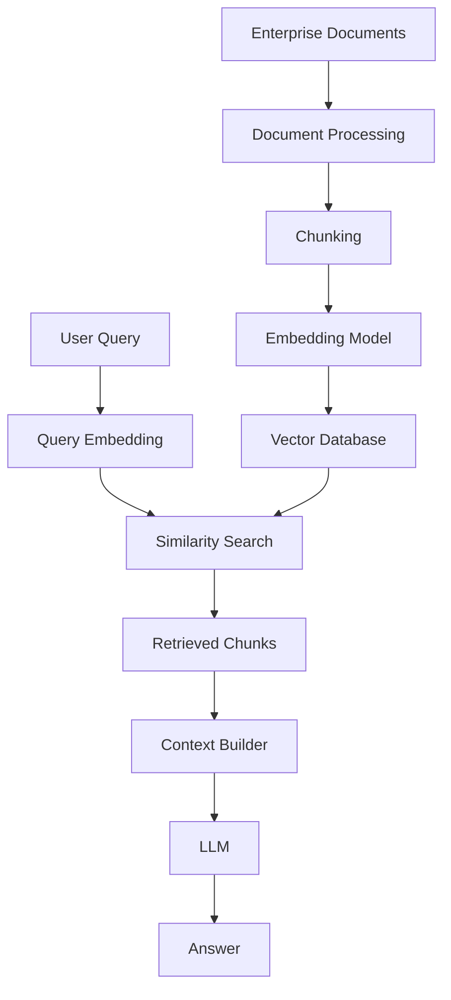
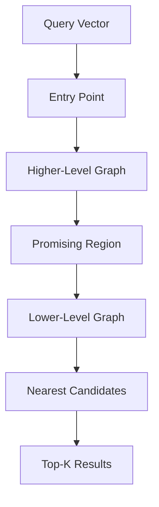
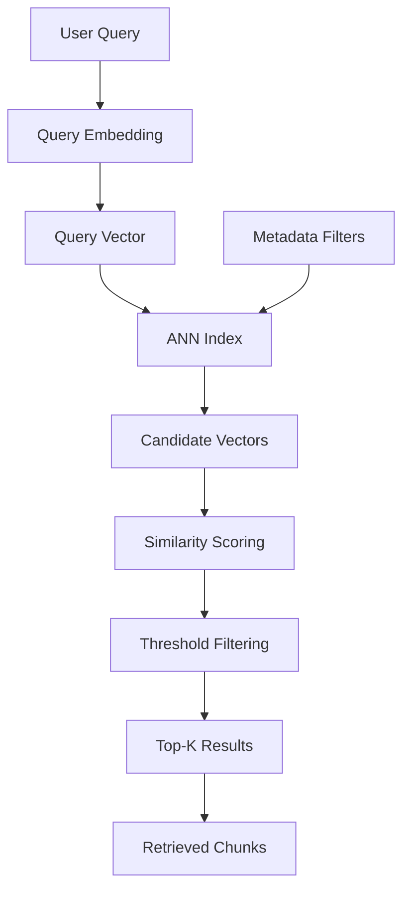
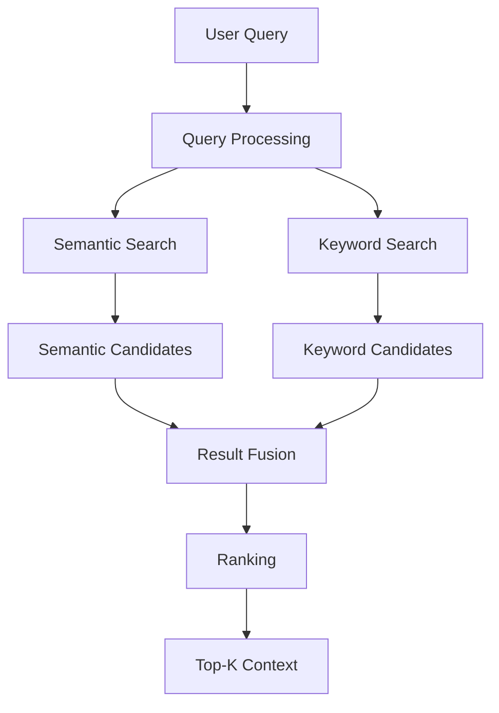
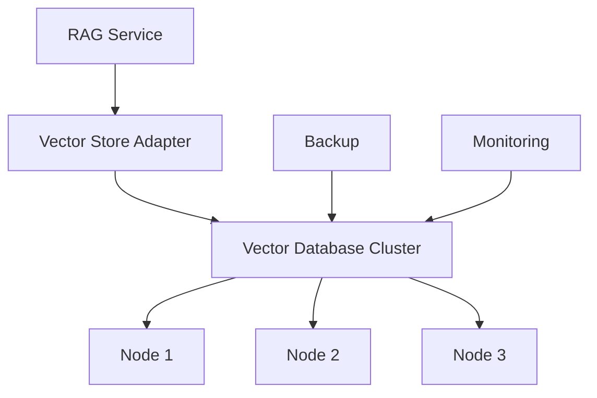
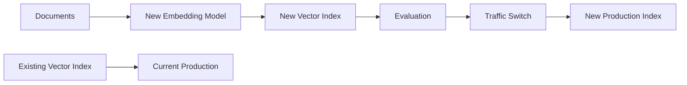
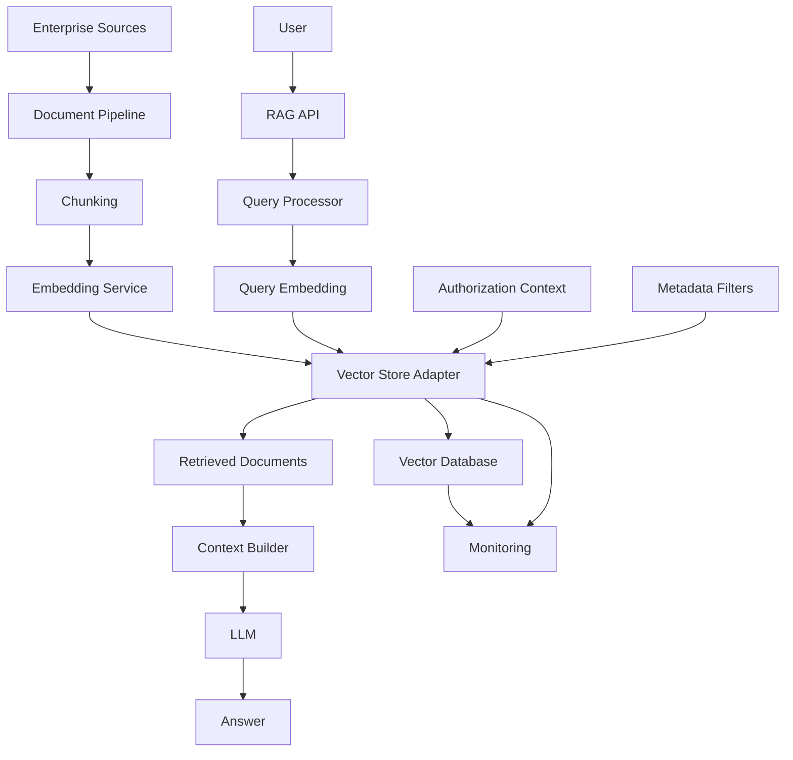

# 17 — Vector Databases in RAG

> Understand how vector databases support Retrieval-Augmented Generation (RAG), how embeddings are indexed and searched, how metadata filtering works, and how to select and architect vector storage for enterprise AI applications.

---

## 📖 Overview

Vector databases are a core infrastructure component in modern RAG systems.

They provide the ability to store and retrieve high-dimensional vectors representing the semantic meaning of documents.

A simplified RAG architecture is:

```text
Enterprise Documents
        ↓
Document Processing
        ↓
Chunking
        ↓
Embedding Model
        ↓
Vector Database
        ↓
Similarity Search
        ↓
Retriever
        ↓
Context
        ↓
LLM
        ↓
Answer
```

The vector database is therefore part of the **retrieval infrastructure**, not the LLM itself.

---

# 1. What Is a Vector Database?

A vector database is a database system optimized for storing and searching vector representations.

A typical record contains:

```text
Vector
Document Content
Document ID
Chunk ID
Metadata
```

For example:

```json
{
  "id": "chunk-001",
  "vector": [0.12, -0.42, 0.73, 0.18],
  "content": "Employees receive 25 days of annual leave.",
  "metadata": {
    "document_id": "employee-handbook",
    "page": 42,
    "section": "Annual Leave"
  }
}
```

The vector is used for semantic search while the metadata supports filtering, traceability, and security.

---

# 2. Why Vector Databases Are Used in RAG

Traditional databases are excellent at exact queries.

For example:

```sql
SELECT *
FROM employees
WHERE department = 'HR';
```

But semantic questions are different.

```text
"What benefits can employees receive?"
```

The exact words in the question may not appear in the document.

Vector search allows the system to find semantically related content.

```text
User Query
    ↓
Embedding
    ↓
Query Vector
    ↓
Vector Search
    ↓
Semantically Similar Documents
```

---

# 3. Traditional Search vs Vector Search

### Keyword Search

```text
Query:
"annual leave policy"

Matches:
"annual leave policy"
```

### Semantic Search

```text
Query:
"How many vacation days do employees get?"

Can retrieve:

"Employees receive 25 days of annual leave."
```

The wording is different, but the meaning is similar.

---

# 4. Vector Database in the RAG Architecture



The vector database sits between:

```text
Embedding
```

and:

```text
Retrieval
```

---

# 5. Vector Database vs Vector Store

These terms are often used interchangeably, but they can describe different levels of abstraction.

### Vector Database

A complete database system designed to store and search vectors.

Examples include:

```text
Qdrant
Milvus
Pinecone
Weaviate
```

### Vector Store

An abstraction used by an application or framework to interact with vector storage.

For example:

```text
Application
    ↓
VectorStore Interface
    ↓
Qdrant
```

or:

```text
Application
    ↓
VectorStore Interface
    ↓
PostgreSQL + pgvector
```

---

# 6. What Is Stored?

A RAG vector record generally contains:

```text
ID
Embedding Vector
Text
Metadata
```

Example:

```json
{
  "id": "hr-policy-42-003",
  "vector": [0.18, -0.21, 0.61, 0.09],
  "text": "Employees receive 25 days of annual leave.",
  "metadata": {
    "document_id": "hr-policy-2026",
    "page": 42,
    "section": "Annual Leave",
    "country": "IN",
    "version": "2026"
  }
}
```

The exact storage model varies by technology.

---

# 7. Why Store the Original Text?

The vector itself is not useful to the LLM.

The LLM needs the actual content.

Therefore:

```text
Vector
    ↓
Used for Search
```

while:

```text
Text
    ↓
Used for Context
```

The database therefore commonly stores both the vector and its associated content or a reference to the source content.

---

# 8. Vector Dimensions

An embedding model generates vectors with a fixed dimensionality.

For example:

```text
Embedding Model
      ↓
1536-dimensional vector
```

Conceptually:

```text
[0.12, -0.42, 0.73, ...]
             ↑
       Many dimensions
```

The dimensionality depends on the embedding model.

---

# 9. Vector Dimensionality Consistency

A vector collection normally expects a consistent vector dimension.

For example:

```text
Collection:
dimension = 1536
```

All inserted vectors must therefore be compatible.

Incorrect:

```text
Document Vector → 1536 dimensions
Query Vector    → 768 dimensions
```

This mismatch cannot be used directly for similarity search.

---

# 10. Embedding Model and Vector Database

The vector database does not usually create semantic meaning itself.

The embedding model creates the representation:

```text
Text
 ↓
Embedding Model
 ↓
Vector
```

The vector database then stores and searches it:

```text
Vector
 ↓
Vector Database
 ↓
Similarity Search
```

This distinction is important.

---

# 11. Indexing Workflow

The indexing pipeline looks like:

```text
Document
   ↓
Processing
   ↓
Chunking
   ↓
Metadata
   ↓
Embedding
   ↓
Vector Database
```

Example:

```python
for chunk in chunks:

    vector = embedding_provider.embed(
        chunk.text
    )

    vector_store.upsert(
        id=chunk.id,
        vector=vector,
        text=chunk.text,
        metadata=chunk.metadata
    )
```

---

# 12. Upsert

An upsert operation generally means:

```text
Insert if new
Update if existing
```

Conceptually:

```python
vector_store.upsert(
    records
)
```

This is useful for incremental document updates.

---

# 13. Incremental Indexing

Enterprise knowledge changes over time.

For example:

```text
HR Policy v1
      ↓
HR Policy v2
```

The indexing pipeline can process only the changed documents.

```text
Document Change
      ↓
Change Detection
      ↓
Reprocess
      ↓
Re-embed
      ↓
Upsert
```

This is more efficient than rebuilding the entire index for every change.

---

# 14. Deletion

Documents may also need to be removed.

For example:

```text
Document Deleted
      ↓
Find Document ID
      ↓
Delete Associated Chunks
      ↓
Remove Vectors
```

Deletion is particularly important for:

```text
Expired Documents
Deleted Knowledge
Data Retention
Compliance
Access Revocation
```

---

# 15. Document Lineage

Every vector should ideally be traceable to its source.

Example:

```text
Vector
  ↓
Chunk ID
  ↓
Document ID
  ↓
Source System
  ↓
Original Document
```

This supports:

```text
Debugging
Citations
Auditing
Reprocessing
Deletion
Compliance
```

---

# 16. Collections

Vector databases commonly organize vectors into collections, indexes, or namespaces.

Conceptually:

```text
Vector Database
│
├── hr-documents
├── finance-documents
├── legal-documents
└── engineering-documents
```

The exact terminology varies by database.

---

# 17. Tenant Isolation

Multi-tenant enterprise systems require strong isolation.

Possible strategies include:

```text
Separate Database
Separate Collection
Separate Namespace
Metadata-Based Isolation
```

For example:

```text
tenant_id = tenant-a
```

should be included in the retrieval constraints.

---

# 18. Tenant-Aware Retrieval

```text
User
 ↓
Tenant Context
 ↓
Query
 ↓
Retriever
 ↓
Filter tenant_id
 ↓
Vector Search
```

A user from:

```text
tenant-a
```

must not retrieve:

```text
tenant-b
```

documents.

---

# 19. Metadata Filtering

Vector similarity alone may not be enough.

Consider:

```text
Query:
"What is the leave policy?"
```

The system may need:

```text
country = IN
department = HR
version = 2026
```

The retrieval operation becomes:

```text
Semantic Similarity
        +
Metadata Filters
```

---

# 20. Metadata Filter Example

```python
results = vector_store.search(
    query_vector=query_vector,
    top_k=10,
    filter={
        "country": "IN",
        "department": "HR",
        "version": "2026"
    }
)
```

The exact filter syntax depends on the vector database.

---

# 21. Metadata Schema

A useful enterprise metadata model might include:

```json
{
  "tenant_id": "tenant-a",
  "document_id": "hr-policy-2026",
  "chunk_id": "chunk-42",
  "department": "HR",
  "country": "IN",
  "document_type": "policy",
  "version": "2026",
  "effective_date": "2026-01-01",
  "source": "sharepoint"
}
```

Metadata should be designed intentionally.

---

# 22. Metadata Is Part of Retrieval Architecture

Metadata is not merely descriptive information.

It can directly influence:

```text
Search
Security
Freshness
Version Selection
Tenant Isolation
Citations
```

Therefore metadata design should be treated as an architectural concern.

---

# 23. Similarity Search

The primary operation in a vector database is often similarity search.

Conceptually:

```text
Query Vector
      ↓
Compare against stored vectors
      ↓
Calculate similarity
      ↓
Rank results
      ↓
Return Top-K
```

---

# 24. Distance Metrics

Common vector similarity metrics include:

```text
Cosine Similarity
Dot Product
Euclidean Distance
```

The choice depends on the embedding model and vector database.

---

# 25. Cosine Similarity

Cosine similarity compares the orientation of two vectors.

Conceptually:

```text
Similar Direction
      ↓
Higher Similarity
```

while:

```text
Different Direction
      ↓
Lower Similarity
```

This is commonly used for semantic embeddings.

---

# 26. Dot Product

Dot product can also be used to compare vectors.

Conceptually:

```text
Query Vector
      ↓
Dot Product
      ↓
Similarity Score
```

The correct metric should be selected based on the embedding model and its intended similarity space.

---

# 27. Euclidean Distance

Euclidean distance measures geometric distance between vectors.

```text
Vector A ●
         \
          \ distance
           \
            ● Vector B
```

Lower distance generally means greater similarity when using distance-based ranking.

---

# 28. Metric Selection

Do not choose a metric arbitrarily.

Consider:

```text
Embedding Model Documentation
Vector Database Capabilities
Normalization
Benchmark Results
Application Retrieval Quality
```

The embedding model and search configuration should be treated as a compatible pair.

---

# 29. Approximate Nearest Neighbor Search

A naive search compares the query vector with every stored vector.

```text
Query
  ↓
Compare with
1 million vectors
  ↓
Find closest vectors
```

This can become expensive.

Approximate Nearest Neighbor (ANN) techniques improve search efficiency.

```text
Query
  ↓
ANN Index
  ↓
Candidate Neighbors
  ↓
Top-K
```

---

# 30. Why ANN Is Important

Without indexing:

```text
Large Dataset
      ↓
Many Comparisons
      ↓
Higher Latency
```

With ANN:

```text
Large Dataset
      ↓
Optimized Index
      ↓
Fast Candidate Search
      ↓
Lower Latency
```

The trade-off is that approximate search may sacrifice a small amount of exactness for substantial performance gains.

---

# 31. HNSW

HNSW stands for:

```text
Hierarchical Navigable Small World
```

It is a popular graph-based ANN indexing approach.

Conceptually:

```text
Layer 3      A -------- B
             \          /
Layer 2       C ---- D ---- E
                \   /
Layer 1          F-G-H-I-J
```

The structure allows search to navigate toward nearby vectors efficiently.

---

# 32. HNSW Search Concept



The exact implementation details are database-specific.

---

# 33. ANN Trade-Off

Vector search often involves a trade-off:

```text
Recall
  ↕
Latency
  ↕
Memory
```

Higher search effort may improve recall but increase latency.

Therefore ANN parameters should be benchmarked using real application data.

---

# 34. Top-K Search

A vector database usually returns the top K results.

Example:

```text
K = 5
```

Results:

```text
1. Chunk A
2. Chunk B
3. Chunk C
4. Chunk D
5. Chunk E
```

The optimal K depends on:

```text
Document Structure
Embedding Quality
Query Type
Context Window
LLM
Reranking
```

---

# 35. Similarity Threshold

Top-K alone may return weak matches.

A similarity threshold can help.

```text
Query
 ↓
Search
 ↓
Score >= threshold
 ↓
Relevant Results
```

Example:

```python
results = vector_store.search(
    query_vector=query_vector,
    top_k=10,
    score_threshold=0.72
)
```

The value `0.72` is illustrative.

Thresholds should be calibrated using evaluation data.

---

# 36. Top-K vs Threshold

These are different controls.

### Top-K

Controls:

```text
How many results?
```

### Threshold

Controls:

```text
How relevant must a result be?
```

They can be used together.

```text
Retrieve Top 20
       ↓
Apply Threshold
       ↓
Select Top 5
```

---

# 37. Vector Database Retrieval Flow



---

# 38. Hybrid Search

Vector search is not always sufficient.

Enterprise search often benefits from combining:

```text
Semantic Search
+
Keyword Search
```

This is called hybrid search.

Example:

```text
Semantic Search
       +
BM25 / Keyword Search
       ↓
Combined Results
```

---

# 39. Why Hybrid Search Helps

Semantic search is strong for:

```text
Conceptual Questions
Paraphrases
Natural Language
```

Keyword search is strong for:

```text
Exact Terms
Product IDs
Policy Numbers
Error Codes
Names
Technical Identifiers
```

Combining both can improve retrieval robustness.

---

# 40. Hybrid Retrieval Architecture



Advanced hybrid retrieval is explored in later RAG chapters.

---

# 41. Vector Database and Keyword Database

A vector database does not necessarily replace all existing search infrastructure.

An enterprise architecture may use:

```text
Application
     ↓
Search Abstraction
   ↙       ↘
Vector DB   Search Engine
```

For example:

```text
Semantic Search → Vector Database
Keyword Search  → Elasticsearch/OpenSearch
```

The application can combine both result sets.

---

# 42. Vector Database vs Relational Database

Traditional relational databases are optimized for:

```text
Structured Data
Transactions
Joins
Constraints
Exact Queries
```

Vector databases are optimized for:

```text
High-Dimensional Vectors
Similarity Search
Semantic Retrieval
ANN Indexing
```

They solve different problems.

---

# 43. PostgreSQL + pgvector

A relational database can also support vector search.

Conceptually:

```text
PostgreSQL
├── Relational Data
├── Metadata
└── Vector Data
```

This can be attractive when an application already uses PostgreSQL.

Example:

```sql
CREATE TABLE document_chunks (
    id TEXT PRIMARY KEY,
    content TEXT,
    embedding VECTOR(1536),
    metadata JSONB
);
```

The exact syntax depends on the installed vector extension and database version.

---

# 44. When PostgreSQL + pgvector Can Be Useful

It can be attractive when:

```text
Application already uses PostgreSQL
Metadata is relational
Transactional consistency matters
Operational simplicity is important
Vector scale is manageable
```

A specialized vector database may be preferable when:

```text
Vector search is a dominant workload
Very large-scale ANN search is required
Specialized vector features are needed
```

The correct choice should be benchmark-driven.

---

# 45. Specialized Vector Databases

Examples include:

```text
Qdrant
Milvus
Pinecone
Weaviate
```

They are designed around vector search workloads.

Different products provide different capabilities around:

```text
Filtering
Indexes
Scaling
Replication
Cloud Hosting
Hybrid Search
Multitenancy
Operational Management
```

---

# 46. In-Memory and Local Vector Stores

For experimentation and development, lightweight stores can be useful.

Examples include:

```text
FAISS
Chroma
```

These can be valuable for:

```text
Learning
Prototyping
Local Development
Experiments
```

Production suitability depends on:

```text
Scale
Availability
Persistence
Security
Operational Requirements
```

---

# 47. FAISS

FAISS is a library for efficient similarity search over dense vectors.

Conceptually:

```text
Documents
   ↓
Embeddings
   ↓
FAISS Index
   ↓
Nearest Neighbor Search
```

It is useful for experimentation and custom retrieval infrastructure.

---

# 48. Chroma

Chroma provides a developer-friendly vector storage and retrieval experience.

A simplified conceptual example:

```python
collection.add(
    ids=["doc-1"],
    documents=[
        "Employees receive 25 days of annual leave."
    ],
    embeddings=[
        embedding
    ],
    metadatas=[
        {"department": "HR"}
    ]
)
```

The exact API depends on the Chroma version.

---

# 49. Qdrant

Qdrant is a vector search engine designed around vector similarity search and metadata filtering.

Conceptually:

```text
Collection
   ↓
Points
   ├── Vector
   ├── Payload
   └── ID
```

The payload can contain metadata used during retrieval.

---

# 50. Vector Database Selection

Do not select a vector database only because it is popular.

Evaluate:

```text
Scale
Latency
Recall
Filtering
Persistence
Availability
Replication
Security
Multitenancy
Operational Complexity
Cloud Model
Cost
Developer Experience
```

---

# 51. Vector Database Decision Matrix

| Requirement | Consider |
|---|---|
| Local experimentation | FAISS / Chroma |
| Existing PostgreSQL | pgvector |
| Specialized vector workloads | Qdrant / Milvus |
| Managed cloud service | Managed vector database |
| Strong metadata filtering | Database-specific filtering support |
| Large-scale deployment | Benchmark ANN and scaling capabilities |
| Multi-tenant enterprise | Isolation and authorization capabilities |

This is a starting point, not a universal ranking.

---

# 52. Managed vs Self-Hosted

A vector database can be:

```text
Managed
```

or:

```text
Self-Hosted
```

### Managed

Advantages:

```text
Less Infrastructure Management
Automatic Scaling Options
Managed Availability
```

Potential concerns:

```text
Cost
Vendor Lock-in
Data Residency
Network Architecture
```

### Self-Hosted

Advantages:

```text
Infrastructure Control
Data Control
Customization
```

Potential concerns:

```text
Operations
Upgrades
Scaling
Backups
Monitoring
Availability
```

---

# 53. Vector Database Deployment

A production deployment may look like:



The actual architecture depends on the chosen technology and deployment model.

---

# 54. High Availability

Enterprise RAG applications may require:

```text
Replication
Failover
Backups
Health Checks
Monitoring
Disaster Recovery
```

A single vector database instance can become a single point of failure.

---

# 55. Scaling

Vector workloads may scale in several dimensions:

```text
Number of Vectors
Vector Dimensions
Queries per Second
Concurrent Users
Metadata Filters
Index Size
```

The correct scaling strategy depends on workload characteristics.

---

# 56. Capacity Planning

Important measurements include:

```text
Number of documents
Number of chunks
Average vector dimension
Storage per vector
Metadata size
Query rate
Peak query rate
Index memory
Replication factor
```

For example:

```text
10 million chunks
×
1536-dimensional embeddings
+
metadata
+
index overhead
```

can create a substantial infrastructure footprint.

Actual memory and storage requirements depend on the vector database and index implementation.

---

# 57. Vector Storage Lifecycle

```text
Source Document
      ↓
Chunk
      ↓
Embedding
      ↓
Vector Record
      ↓
Index
      ↓
Search
      ↓
Update
      ↓
Delete / Retain
```

Vector storage should therefore be treated as a lifecycle-managed data asset.

---

# 58. Embedding Model Migration

Changing the embedding model can require re-indexing.

For example:

```text
Embedding Model A
      ↓
Existing Vector Index
```

Changing to:

```text
Embedding Model B
```

may require:

```text
Documents
   ↓
New Embeddings
   ↓
New Vector Collection
   ↓
Validation
   ↓
Migration
```

Do not assume vectors from different embedding models are directly compatible.

---

# 59. Blue-Green Vector Index Migration

A safer migration pattern can be:

```text
Current Index
     │
     │ Production
     ↓
New Embedding Model
     ↓
Build New Index
     ↓
Evaluate
     ↓
Switch Traffic
```

Conceptually:



This reduces migration risk.

---

# 60. Versioning

A vector index can be versioned using:

```text
Embedding Model Version
Chunking Version
Metadata Schema Version
Index Version
Document Version
```

Example:

```text
embedding=v3
chunking=v2
index=v5
```

This makes retrieval behavior reproducible.

---

# 61. Reproducibility

If retrieval quality changes, engineers should be able to identify:

```text
Which documents?
Which chunking strategy?
Which embedding model?
Which vector index?
Which metadata schema?
Which retrieval configuration?
```

Without versioning, debugging becomes difficult.

---

# 62. Vector Database Security

Security controls may include:

```text
Authentication
Authorization
Encryption
Network Isolation
Private Endpoints
Tenant Isolation
Audit Logging
Secrets Management
```

The vector database contains enterprise knowledge and should be treated as a sensitive data store.

---

# 63. Data Encryption

Consider:

```text
Encryption in Transit
Encryption at Rest
Key Management
Credential Management
```

The exact implementation depends on the infrastructure environment.

---

# 64. Network Architecture

A production vector database should not necessarily be directly exposed to the public internet.

A common architecture is:

```text
Internet
   ↓
API Gateway
   ↓
RAG Service
   ↓
Private Network
   ↓
Vector Database
```

This reduces the external attack surface.

---

# 65. Observability

Monitor the vector layer independently.

Important metrics may include:

```text
Query Latency
Indexing Latency
Queries per Second
Error Rate
Vector Count
Index Size
Memory Usage
CPU Usage
Storage Usage
Cache Hit Rate
```

Also monitor retrieval quality:

```text
Recall@K
Similarity Scores
Empty Retrieval Rate
```

---

# 66. Vector Database Trace

A RAG trace might contain:

```json
{
  "retrieval": {
    "top_k": 10,
    "returned": 7,
    "latency_ms": 38,
    "score_threshold": 0.72
  }
}
```

This allows engineers to correlate vector search performance with overall RAG latency.

---

# 67. Backup and Recovery

A production vector database should have a recovery strategy.

Consider:

```text
Snapshots
Backups
Replication
Disaster Recovery
Rebuild Capability
```

The authoritative documents should also remain available because the vector index is generally derived data.

---

# 68. Rebuilding the Index

A robust architecture should support:

```text
Authoritative Documents
        ↓
Processing Pipeline
        ↓
Embedding Pipeline
        ↓
Vector Database
```

This means the vector index can be rebuilt if necessary.

---

# 69. Vector Database as Derived Infrastructure

A useful mental model is:

```text
Source of Truth
      ↓
Derived Vector Index
      ↓
Retrieval
```

This avoids treating the vector index as the only copy of enterprise knowledge.

---

# 70. Testing Vector Retrieval

Unit tests can verify:

```text
Vector Store Adapter
Metadata Filters
Query Parameters
Upsert
Delete
```

Integration tests can verify:

```text
Real Vector Database
Real Embeddings
Real Retrieval
```

Evaluation tests can verify:

```text
Retrieval Quality
Recall
Precision
Ranking
```

---

# 71. Example Vector Store Interface

A Java-first enterprise architecture can define:

```java
public interface VectorStore {

    void upsert(
        List<VectorRecord> records
    );

    List<RetrievedDocument> search(
        QueryVector query,
        SearchOptions options
    );

    void deleteByDocumentId(
        String documentId
    );
}
```

The application does not need to know which vector database is behind the interface.

---

# 72. Vector Store Adapter

```java
public class QdrantVectorStore
        implements VectorStore {

    private final QdrantClient client;

    @Override
    public void upsert(
        List<VectorRecord> records
    ) {
        // Map domain records
        // to Qdrant-specific structures
    }

    @Override
    public List<RetrievedDocument> search(
        QueryVector query,
        SearchOptions options
    ) {
        // Execute vector search
        // Map results back to domain objects
        return List.of();
    }

    @Override
    public void deleteByDocumentId(
        String documentId
    ) {
        // Delete associated vectors
    }
}
```

The vendor SDK remains inside the adapter.

---

# 73. Capability-Based Architecture

The application can depend on:

```text
VectorStore
```

rather than:

```text
QdrantClient
```

This provides:

```text
Provider Independence
Testability
Portability
Cleaner Domain Logic
```

Possible adapters:

```text
QdrantVectorStore
PgVectorStore
ChromaVectorStore
MilvusVectorStore
```

---

# 74. Vector Store Factory

A factory can select the implementation.

```java
public enum VectorStoreType {
    QDRANT,
    PGVECTOR,
    CHROMA,
    MILVUS
}
```

```java
public interface VectorStoreFactory {

    VectorStore create(
        VectorStoreType type
    );
}
```

The application can remain independent of provider-specific implementations.

---

# 75. Configuration-Driven Selection

```yaml
vector-store:
  provider: qdrant

  qdrant:
    collection: enterprise-documents
    host: vector-db.internal
```

The implementation can be selected through configuration rather than changing application code.

---

# 76. Testing with a Fake Vector Store

A fake implementation can be useful for unit testing.

```java
public class InMemoryVectorStore
        implements VectorStore {

    private final List<VectorRecord> records =
        new ArrayList<>();

    @Override
    public void upsert(
        List<VectorRecord> records
    ) {
        this.records.addAll(records);
    }

    @Override
    public List<RetrievedDocument> search(
        QueryVector query,
        SearchOptions options
    ) {
        // Simplified test implementation
        return List.of();
    }

    @Override
    public void deleteByDocumentId(
        String documentId
    ) {
        // Test implementation
    }
}
```

This keeps unit tests independent of external infrastructure.

---

# 77. Vector Database and RAG Responsibilities

| RAG Capability | Vector Database Responsibility |
|---|---|
| Document Processing | Usually No |
| Chunking | Usually No |
| Embedding Generation | Usually No |
| Vector Storage | Yes |
| Similarity Search | Yes |
| Metadata Filtering | Often Yes |
| ANN Indexing | Yes |
| Context Assembly | No |
| Prompt Construction | No |
| LLM Generation | No |
| Citation Formatting | Usually No |

This separation prevents architectural confusion.

---

# 78. What a Vector Database Should Not Do

A vector database should not become responsible for:

```text
Prompt Engineering
LLM Generation
Business Logic
Authorization Decisions
Conversation Management
Response Formatting
```

It should provide storage and retrieval capabilities.

Authorization can involve the vector database through filters, but the application's overall authorization policy should remain outside the database.

---

# 79. Common Vector Database Mistakes

## 79.1 Choosing the Database Before Understanding the Workload

```text
Popular Technology
      ↓
Production Choice
```

is not a sufficient selection process.

Start with:

```text
Workload
Scale
Latency
Filtering
Security
Operations
```

---

## 79.2 Ignoring Metadata

Vectors alone are not enough for enterprise RAG.

---

## 79.3 Mixing Embedding Models

Vectors generated by incompatible models should not be blindly mixed.

---

## 79.4 No Index Versioning

Without versioning, retrieval changes become difficult to diagnose.

---

## 79.5 No Deletion Strategy

Deleted or expired knowledge can remain searchable if lifecycle management is ignored.

---

## 79.6 No Tenant Isolation

Multi-tenant systems must prevent cross-tenant retrieval.

---

## 79.7 Treating Vector Search as the Entire RAG System

Vector search is only one stage:

```text
Retrieval
    ↓
Context
    ↓
Prompt
    ↓
Generation
```

---

# 80. Production Vector Database Checklist

```text
[ ] Embedding model selected

[ ] Vector dimension confirmed

[ ] Similarity metric selected

[ ] ANN index configured

[ ] Metadata schema designed

[ ] Tenant isolation designed

[ ] Authorization filtering implemented

[ ] Upsert strategy defined

[ ] Delete strategy defined

[ ] Index versioning defined

[ ] Embedding migration strategy defined

[ ] Backup strategy defined

[ ] Recovery strategy defined

[ ] Monitoring configured

[ ] Query latency measured

[ ] Retrieval quality evaluated

[ ] Capacity planned

[ ] Security controls implemented
```

---

# 81. Vector Database Selection Workflow

```text
1. Understand document volume.

2. Estimate chunk count.

3. Determine embedding dimensions.

4. Estimate query throughput.

5. Identify filtering requirements.

6. Identify security requirements.

7. Determine availability requirements.

8. Determine deployment model.

9. Benchmark candidate databases.

10. Measure retrieval quality.

11. Measure latency.

12. Measure operational complexity.

13. Evaluate cost.

14. Select the database based on evidence.
```

---

# 82. Enterprise Vector Database Architecture



---

# 83. Production Data Flow

```text
SOURCE
  ↓
Document
  ↓
Chunk
  ↓
Embedding
  ↓
Vector Record
  ↓
Vector Index
  ↓
Search
  ↓
Retrieved Evidence
  ↓
Context
  ↓
LLM
  ↓
Answer
```

The vector database is therefore an important but bounded component of the overall RAG architecture.

---

# 84. Vector Database Decision Principles

A production choice should balance:

```text
Retrieval Quality
+
Performance
+
Scalability
+
Security
+
Operational Complexity
+
Cost
+
Portability
```

There is no universally best vector database.

The best choice depends on the application workload.

---

# 85. Key Takeaways

- Vector databases provide infrastructure for semantic retrieval in RAG.
- Embedding models convert text into vectors.
- Vector databases store and search those vectors.
- A vector record commonly contains:
  - ID
  - Vector
  - Text or source reference
  - Metadata
- Vector dimensions must remain compatible within a collection or index.
- Similarity search can use cosine similarity, dot product, or distance-based metrics.
- ANN indexing makes large-scale vector search more efficient.
- HNSW is a common graph-based ANN approach.
- Top-K controls the number of returned candidates.
- Similarity thresholds control minimum relevance.
- Metadata filtering is critical for enterprise retrieval.
- Tenant isolation must be designed explicitly.
- Vector databases should preserve document lineage.
- Incremental upsert and deletion strategies are important for knowledge lifecycle management.
- Embedding model changes may require re-indexing.
- Vector indexes should be versioned.
- Hybrid search can combine semantic and keyword retrieval.
- PostgreSQL with pgvector can be useful when relational and vector workloads need to coexist.
- Specialized vector databases may be preferable for dedicated large-scale vector workloads.
- Local tools such as FAISS and Chroma are useful for experimentation and prototyping.
- Managed and self-hosted vector databases have different operational trade-offs.
- Vector databases should be monitored for both infrastructure and retrieval performance.
- The authoritative document source should remain available because the vector index is generally derived data.
- A capability-based `VectorStore` interface keeps enterprise application code independent of a specific vector database.
- Vector database selection should be based on workload benchmarks rather than popularity.
- The vector database should remain focused on storage and retrieval rather than business logic or LLM generation.

The central principle is:

> **A vector database is the retrieval infrastructure that transforms embedded enterprise knowledge into searchable evidence for RAG applications.**

---

# 86. Chapter Navigation

## Part IV — Prompt Engineering & RAG Fundamentals

**Previous Chapter:** [16. Retrieval and Generation Pipeline](16-retrieval-and-generation-pipeline.md)

**Current Chapter:** 17 — Vector Databases in RAG

**Next Chapter:** [18. Building Your First RAG Pipeline](18-building-your-first-rag-pipeline.md)

### Part IV Chapters

1. [01. Introduction to Prompt Engineering](01-introduction-to-prompt-engineering.md)
2. [02. Prompt Engineering Fundamentals](02-prompt-engineering-fundamentals.md)
3. [03. Advanced Prompt Engineering](03-advanced-prompt-engineering.md)
4. [04. Prompt Design Patterns](04-prompt-design-patterns.md)
5. [05. Zero-shot, One-shot & Few-shot Prompting](05-zero-one-few-shot-prompting.md)
6. [06. Chain-of-Thought Prompting](06-chain-of-thought-prompting.md)
7. [07. ReAct Prompting](07-react-prompting.md)
8. [08. Structured Outputs & Output Parsing](08-structured-outputs-and-output-parsing.md)
9. [09. Function Calling & Tool Calling](09-function-calling-and-tool-calling.md)
10. [10. Embeddings in Practice](10-embeddings-in-practice.md)
11. [11. Document Processing & Vectorization](11-document-processing-and-vectorization.md)
12. [12. Document Chunking Strategies](12-document-chunking-strategies.md)
13. [13. Vector Database Fundamentals](13-vector-database-fundamentals.md)
14. [14. Similarity Search Techniques](14-similarity-search-techniques.md)
15. [15. RAG Pipeline Components](15-rag-pipeline-components.md)
16. [16. Retrieval and Generation Pipeline](16-retrieval-and-generation-pipeline.md)
17. **17. Vector Databases in RAG**
18. [18. Building Your First RAG Pipeline](18-building-your-first-rag-pipeline.md)
19. [19. RAG Evaluation Fundamentals](19-rag-evaluation-fundamentals.md)
20. [20. Enterprise Generative AI Application Architecture](20-enterprise-generative-ai-application-architecture.md)
21. [21. Deploying AI Applications with Gradio](21-deploying-ai-applications-with-gradio.md)

---

# References

- Vector database architecture documentation
- Qdrant documentation
- Milvus documentation
- Weaviate documentation
- Pinecone documentation
- FAISS documentation
- Chroma documentation
- pgvector documentation
- LangChain vector store documentation
- LlamaIndex vector store documentation
- Embedding model documentation
- Approximate Nearest Neighbor search documentation
- HNSW indexing documentation
- Enterprise search architecture documentation
- RAG retrieval architecture documentation

---

> **Enterprise AI Engineering Handbook**  
> *Building Production-Grade Enterprise AI Systems — One Chapter at a Time.*