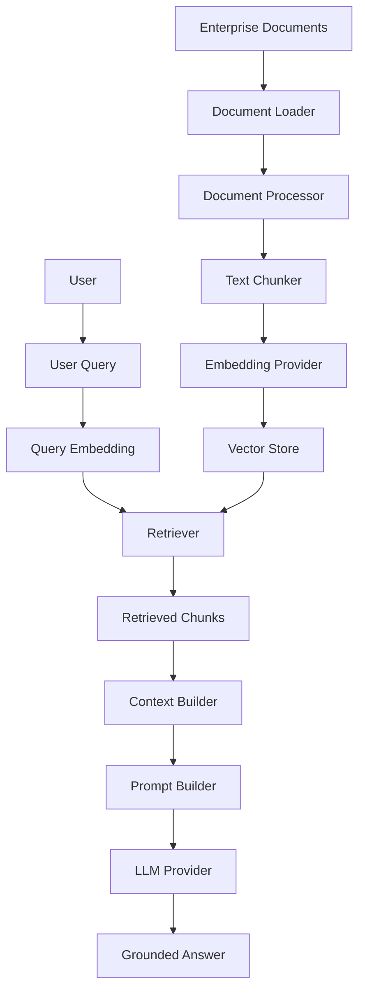
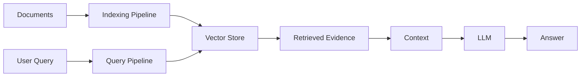
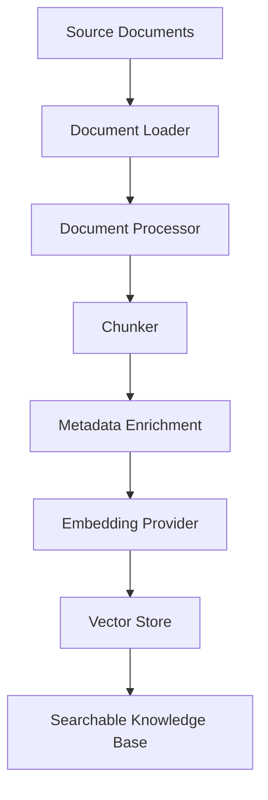
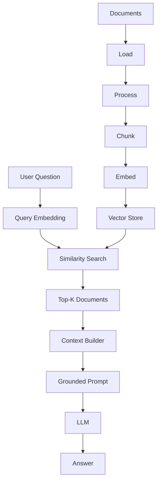
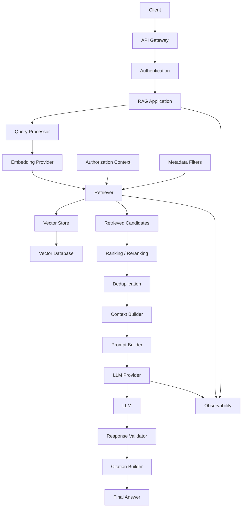
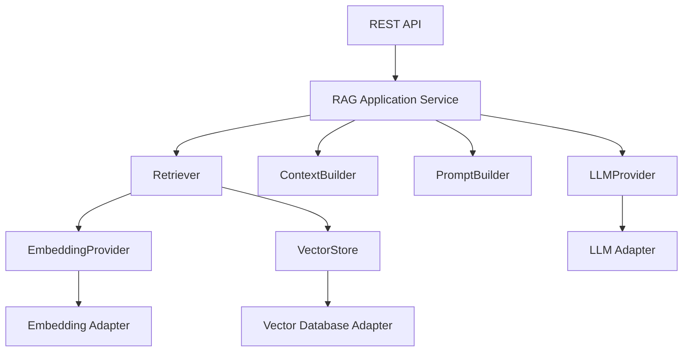
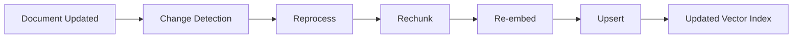
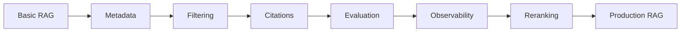
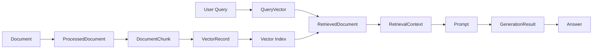

# 18 — Building Your First RAG Pipeline

> Build an end-to-end Retrieval-Augmented Generation (RAG) application by connecting document ingestion, chunking, embeddings, vector storage, retrieval, context construction, prompt engineering, and LLM generation into a working pipeline.

---

## 📖 Overview

The previous chapters introduced the individual components of a RAG system.

This chapter brings those components together into a complete working pipeline.

We will build the following flow:

```text
Documents
    ↓
Document Loading
    ↓
Text Processing
    ↓
Chunking
    ↓
Embedding
    ↓
Vector Store
    ↓
Retriever
    ↓
User Query
    ↓
Relevant Documents
    ↓
Context Assembly
    ↓
Prompt
    ↓
LLM
    ↓
Grounded Answer
```

The goal is not simply to call a framework API.

The goal is to understand what happens at every stage so that the same architecture can later be implemented using:

```text
Custom Python
LangChain
LlamaIndex
Spring Boot
Enterprise AI Starter
Cloud AI Services
```

---

# 1. What We Are Building

We will build a simple enterprise knowledge assistant.

Example knowledge source:

```text
Company Employee Handbook
```

Example user question:

```text
"What is the annual leave entitlement?"
```

The system should:

```text
1. Load the handbook.
2. Split it into chunks.
3. Generate embeddings.
4. Store the embeddings.
5. Convert the user question into an embedding.
6. Retrieve relevant chunks.
7. Build a context.
8. Send the context to an LLM.
9. Generate a grounded answer.
```

---

# 2. Final Architecture



This architecture contains two major paths:

```text
Indexing Path
```

and:

```text
Query Path
```

---

# 3. Indexing Path

The indexing path prepares enterprise knowledge.

```text
Document
   ↓
Load
   ↓
Process
   ↓
Chunk
   ↓
Embed
   ↓
Store
```

This normally happens before users start asking questions.

---

# 4. Query Path

The query path executes when a user asks a question.

```text
Question
   ↓
Embed
   ↓
Retrieve
   ↓
Build Context
   ↓
Build Prompt
   ↓
LLM
   ↓
Answer
```

The two paths meet at the vector store.

---

# 5. Complete RAG Lifecycle



---

# 6. Project Structure

A simple Python implementation can use:

```text
rag-demo/
│
├── data/
│   └── employee-handbook.txt
│
├── src/
│   ├── ingestion.py
│   ├── embeddings.py
│   ├── vector_store.py
│   ├── retriever.py
│   ├── prompt.py
│   ├── generation.py
│   └── rag_pipeline.py
│
├── tests/
│   └── test_rag_pipeline.py
│
├── requirements.txt
└── README.md
```

For a small learning project, everything can initially be implemented in one notebook.

For production, separate capabilities are preferable.

---

# 7. Step 1 — Prepare the Documents

Example document:

```text
Company Employee Handbook

Annual Leave

Employees are entitled to 25 days of annual paid leave
per calendar year.

Employees should submit annual leave requests through
the employee portal.

Unused annual leave may be carried forward according
to company policy.

Sick Leave

Employees may take sick leave when they are unable
to work due to illness.
```

The document represents the knowledge source.

---

# 8. Step 2 — Load the Document

A simple loader:

```python
from pathlib import Path


def load_document(path: str) -> str:

    return Path(path).read_text(
        encoding="utf-8"
    )


document = load_document(
    "data/employee-handbook.txt"
)

print(document)
```

The output is raw text.

```text
Raw Document
     ↓
String
```

---

# 9. Production Document Loading

Real enterprise applications rarely contain only `.txt` files.

Common sources include:

```text
PDF
DOCX
PPTX
HTML
Markdown
CSV
JSON
Database
SharePoint
Confluence
Object Storage
Enterprise APIs
```

A production ingestion layer should hide these differences.

```python
class DocumentLoader:

    def load(self, source):
        raise NotImplementedError
```

Possible implementations:

```text
PdfDocumentLoader
DocxDocumentLoader
HtmlDocumentLoader
MarkdownDocumentLoader
DatabaseDocumentLoader
```

---

# 10. Step 3 — Normalize the Document

Raw documents may contain:

```text
Extra whitespace
Headers
Footers
Page numbers
Encoding problems
Repeated content
Formatting artifacts
```

A simple normalization function:

```python
def normalize_text(text: str) -> str:

    lines = [
        line.strip()
        for line in text.splitlines()
    ]

    lines = [
        line
        for line in lines
        if line
    ]

    return "\n".join(lines)
```

For production documents, normalization should be document-type aware.

---

# 11. Step 4 — Split the Document

The complete document may be too large to retrieve as one unit.

Therefore:

```text
Document
    ↓
Chunks
```

Example:

```text
Chunk 1:
Company Employee Handbook

Chunk 2:
Annual Leave

Employees are entitled to 25 days...

Chunk 3:
Employees should submit annual leave requests...

Chunk 4:
Sick Leave

Employees may take sick leave...
```

---

# 12. Simple Chunking

A basic character-based chunker:

```python
def chunk_text(
    text: str,
    chunk_size: int = 500
):

    return [
        text[i:i + chunk_size]
        for i in range(
            0,
            len(text),
            chunk_size
        )
    ]
```

This is useful for understanding the pipeline.

However, production systems should generally use more meaningful boundaries.

---

# 13. Chunking with Overlap

A simple overlapping chunker:

```python
def chunk_text(
    text: str,
    chunk_size: int = 500,
    overlap: int = 50
):

    chunks = []

    start = 0

    while start < len(text):

        end = start + chunk_size

        chunks.append(
            text[start:end]
        )

        start += chunk_size - overlap

    return chunks
```

The overlap helps preserve context across chunk boundaries.

---

# 14. Why Chunk Overlap Matters

Suppose a sentence crosses the boundary:

```text
Chunk 1:
Employees may carry forward unused annual

Chunk 2:
leave according to company policy.
```

Without overlap, retrieval may lose the complete meaning.

With overlap:

```text
Chunk 1:
Employees may carry forward unused annual leave...

Chunk 2:
...unused annual leave according to company policy.
```

Overlap can help preserve semantic continuity.

---

# 15. Metadata

Each chunk should carry metadata.

```python
chunks = [
    {
        "id": "handbook-001",
        "text": "...",
        "metadata": {
            "document_id": "employee-handbook",
            "source": "employee-handbook.txt",
            "section": "Annual Leave"
        }
    }
]
```

Metadata becomes important for:

```text
Filtering
Citations
Security
Debugging
Versioning
```

---

# 16. Step 5 — Generate Embeddings

The next stage converts chunks into vectors.

```text
Chunk
  ↓
Embedding Model
  ↓
Vector
```

Conceptually:

```python
vector = embedding_model.embed(
    chunk["text"]
)
```

For multiple chunks:

```python
vectors = embedding_model.embed_documents(
    [
        chunk["text"]
        for chunk in chunks
    ]
)
```

---

# 17. Example Embedding Provider Interface

A framework-independent interface:

```python
class EmbeddingProvider:

    def embed_documents(
        self,
        texts: list[str]
    ) -> list[list[float]]:
        raise NotImplementedError

    def embed_query(
        self,
        text: str
    ) -> list[float]:
        raise NotImplementedError
```

This keeps the RAG application independent of a specific embedding provider.

---

# 18. Embedding Provider Implementation

A simplified example:

```python
class MockEmbeddingProvider(
    EmbeddingProvider
):

    def embed_documents(self, texts):

        return [
            self._embed(text)
            for text in texts
        ]

    def embed_query(self, text):

        return self._embed(text)

    def _embed(self, text):

        # Demonstration only.
        # Production systems should use
        # a real embedding model.

        return [0.1, 0.2, 0.3]
```

This demonstrates the architecture without coupling the example to a particular model provider.

---

# 19. Real Embedding Models

A production implementation can use:

```text
OpenAI Embeddings
Hugging Face Models
Sentence Transformers
WatsonX Embeddings
Cloud Provider Embeddings
Self-Hosted Embedding Models
```

The application should interact through:

```text
EmbeddingProvider
```

rather than embedding-provider-specific code everywhere.

---

# 20. Step 6 — Store the Vectors

The chunks and vectors now need to be stored.

```text
Chunk
 +
Vector
 +
Metadata
      ↓
Vector Store
```

A simple interface:

```python
class VectorStore:

    def upsert(
        self,
        records
    ):
        raise NotImplementedError

    def search(
        self,
        query_vector,
        top_k=5
    ):
        raise NotImplementedError
```

---

# 21. In-Memory Vector Store

For learning purposes, we can create a simple vector store.

```python
import math


class InMemoryVectorStore:

    def __init__(self):

        self.records = []

    def upsert(self, records):

        self.records.extend(records)

    def search(
        self,
        query_vector,
        top_k=5
    ):

        scored = []

        for record in self.records:

            score = cosine_similarity(
                query_vector,
                record["vector"]
            )

            scored.append(
                (score, record)
            )

        scored.sort(
            key=lambda item: item[0],
            reverse=True
        )

        return scored[:top_k]
```

This is a teaching implementation, not a production vector database.

---

# 22. Cosine Similarity

For two vectors:

```text
Query Vector
Document Vector
```

cosine similarity measures how closely their directions align.

```python
def cosine_similarity(a, b):

    dot = sum(
        x * y
        for x, y in zip(a, b)
    )

    magnitude_a = math.sqrt(
        sum(x * x for x in a)
    )

    magnitude_b = math.sqrt(
        sum(x * x for x in b)
    )

    if magnitude_a == 0 or magnitude_b == 0:
        return 0.0

    return dot / (
        magnitude_a * magnitude_b
    )
```

In a production system, this computation is normally handled by the vector database or search engine.

---

# 23. Step 7 — Build the Index

The indexing pipeline now becomes:

```python
documents = load_documents()

chunks = chunk_documents(
    documents
)

vectors = embedding_provider.embed_documents(
    [
        chunk["text"]
        for chunk in chunks
    ]
)

records = []

for chunk, vector in zip(
    chunks,
    vectors
):

    records.append(
        {
            "id": chunk["id"],
            "text": chunk["text"],
            "vector": vector,
            "metadata": chunk["metadata"]
        }
    )

vector_store.upsert(
    records
)
```

The knowledge base is now searchable.

---

# 24. Complete Indexing Pipeline



---

# 25. Step 8 — Receive a User Query

Now suppose the user asks:

```text
"What is the annual leave entitlement?"
```

The query enters the runtime pipeline.

```text
User Query
    ↓
Query Processing
    ↓
Query Embedding
    ↓
Retrieval
```

---

# 26. Step 9 — Embed the Query

The query must be converted into the same embedding space as the documents.

```python
query = (
    "What is the annual leave entitlement?"
)

query_vector = (
    embedding_provider.embed_query(
        query
    )
)
```

The resulting vector is used for similarity search.

---

# 27. Step 10 — Retrieve Relevant Chunks

```python
results = vector_store.search(
    query_vector=query_vector,
    top_k=5
)
```

Conceptually:

```text
Query Vector
      ↓
Vector Store
      ↓
Similarity Search
      ↓
Top-K Chunks
```

---

# 28. Retrieval Results

A result might look like:

```python
[
    (
        0.91,
        {
            "id": "handbook-002",
            "text": (
                "Employees are entitled to "
                "25 days of annual paid leave."
            ),
            "metadata": {
                "section": "Annual Leave",
                "page": 42
            }
        }
    )
]
```

The similarity score is useful for:

```text
Ranking
Thresholding
Debugging
Evaluation
```

---

# 29. Step 11 — Build the Context

The retrieved chunks need to be converted into context.

```python
def build_context(results):

    return "\n\n".join(
        record["text"]
        for score, record in results
    )
```

Example output:

```text
Employees are entitled to 25 days
of annual paid leave.

Employees should submit annual leave
requests through the employee portal.
```

---

# 30. Preserve Source Metadata

Do not throw away metadata during context construction.

Instead:

```python
def build_context(results):

    sections = []

    for score, record in results:

        sections.append(
            f"""
            Source: {record["metadata"]["source"]}
            Section: {record["metadata"]["section"]}

            {record["text"]}
            """
        )

    return "\n\n".join(sections)
```

This makes citations and debugging easier.

---

# 31. Step 12 — Build the Prompt

A grounded prompt can be:

```python
RAG_PROMPT = """
You are an enterprise knowledge assistant.

Answer the user's question using only
the provided context.

If the context does not contain enough
information, say that the information
is not available.

Do not invent facts.

Context:
{context}

Question:
{question}

Answer:
"""
```

---

# 32. Construct the Prompt

```python
prompt = RAG_PROMPT.format(
    context=context,
    question=query
)
```

The resulting prompt might look like:

```text
You are an enterprise knowledge assistant.

Answer the user's question using only
the provided context.

Context:

Employees are entitled to 25 days
of annual paid leave.

Question:

What is the annual leave entitlement?

Answer:
```

---

# 33. Step 13 — Invoke the LLM

The LLM receives the grounded prompt.

```python
response = llm_provider.generate(
    prompt
)
```

Conceptually:

```text
Context
   +
Question
   ↓
LLM
   ↓
Answer
```

---

# 34. LLM Provider Interface

A framework-independent interface:

```python
class LLMProvider:

    def generate(
        self,
        prompt: str
    ) -> str:

        raise NotImplementedError
```

Possible implementations:

```text
OpenAILLMProvider
AnthropicLLMProvider
WatsonXLLMProvider
GoogleLLMProvider
HuggingFaceLLMProvider
```

---

# 35. Example LLM Provider

A simplified implementation:

```python
class MockLLMProvider(
    LLMProvider
):

    def generate(self, prompt):

        return (
            "Employees are entitled to "
            "25 days of annual paid leave."
        )
```

This allows the complete pipeline to be tested without requiring an external model.

---

# 36. Step 14 — Return the Answer

The final response can include:

```text
Employees are entitled to 25 days
of annual paid leave.

Source:
Employee Handbook
Section: Annual Leave
```

This is a grounded response because the answer comes from retrieved enterprise knowledge.

---

# 37. Complete Minimal Pipeline

```python
def rag_pipeline(
    query,
    embedding_provider,
    vector_store,
    llm_provider
):

    # 1. Embed query
    query_vector = (
        embedding_provider.embed_query(
            query
        )
    )

    # 2. Retrieve
    results = vector_store.search(
        query_vector,
        top_k=5
    )

    # 3. Build context
    context = "\n\n".join(
        record["text"]
        for score, record in results
    )

    # 4. Build prompt
    prompt = f"""
    You are an enterprise knowledge assistant.

    Answer using only the provided context.

    Context:
    {context}

    Question:
    {query}

    Answer:
    """

    # 5. Generate
    return llm_provider.generate(
        prompt
    )
```

This is the simplest representation of the runtime RAG pipeline.

---

# 38. Complete End-to-End Flow



---

# 39. Adding Metadata Filters

Enterprise retrieval usually requires filters.

Example:

```python
results = vector_store.search(
    query_vector=query_vector,
    top_k=5,
    filters={
        "country": "IN",
        "department": "HR",
        "version": "2026"
    }
)
```

The final search becomes:

```text
Semantic Similarity
        +
Metadata Filtering
```

---

# 40. Adding Similarity Thresholds

A production retriever may reject weak results.

```python
results = vector_store.search(
    query_vector=query_vector,
    top_k=10,
    score_threshold=0.72
)
```

The value is illustrative.

It should be determined through evaluation.

---

# 41. Handling No Results

Never assume retrieval will always succeed.

```python
if not results:

    return (
        "I couldn't find sufficient information "
        "in the available knowledge base."
    )
```

This is safer than allowing the LLM to answer from unsupported knowledge.

---

# 42. Handling Low-Quality Results

Even if results exist, they may not be relevant.

```python
relevant_results = [
    record
    for score, record in results
    if score >= 0.72
]

if not relevant_results:

    return (
        "I couldn't find sufficient relevant "
        "information in the knowledge base."
    )
```

Again, the threshold is application-specific.

---

# 43. Adding Citations

A stronger implementation preserves source metadata.

```python
def build_context(results):

    context_parts = []

    for score, record in results:

        metadata = record["metadata"]

        context_parts.append(
            f"""
            Source: {metadata["source"]}
            Page: {metadata.get("page", "N/A")}
            Section: {metadata.get("section", "N/A")}

            {record["text"]}
            """
        )

    return "\n\n".join(
        context_parts
    )
```

---

# 44. Citation-Aware Response

The LLM can be instructed to reference source identifiers.

```text
Use the provided source information
when answering.

Do not create sources that are not present
in the context.
```

The application should still maintain source metadata independently of the model.

---

# 45. Production RAG Pipeline

The minimal pipeline can now evolve into:

```text
User
 ↓
Authentication
 ↓
Query Validation
 ↓
Query Processing
 ↓
Query Embedding
 ↓
Retriever
 ↓
Authorization Filtering
 ↓
Metadata Filtering
 ↓
Top-K
 ↓
Similarity Threshold
 ↓
Optional Reranking
 ↓
Deduplication
 ↓
Context Builder
 ↓
Token Budget
 ↓
Prompt Builder
 ↓
LLM
 ↓
Response Validation
 ↓
Citation Builder
 ↓
Answer
```

---

# 46. Production Architecture



---

# 47. Framework Implementation

The same architecture can be implemented using a framework.

For example:

```text
Application
     ↓
LangChain
     ↓
Retriever
     ↓
Vector Store
     ↓
Prompt
     ↓
LLM
```

or:

```text
Application
     ↓
LlamaIndex
     ↓
Query Engine
     ↓
Retriever
     ↓
LLM
```

The framework should simplify implementation without hiding the architectural concepts.

---

# 48. LangChain Example

A simplified LangChain-style implementation:

```python
from langchain_core.prompts import ChatPromptTemplate

prompt = ChatPromptTemplate.from_template(
    """
    Answer using only the provided context.

    Context:
    {context}

    Question:
    {question}

    Answer:
    """
)

question = (
    "What is the annual leave entitlement?"
)

documents = retriever.invoke(
    question
)

context = "\n\n".join(
    document.page_content
    for document in documents
)

response = llm.invoke(
    prompt.format_messages(
        context=context,
        question=question
    )
)

print(response.content)
```

The important architectural flow remains:

```text
Query
 ↓
Retriever
 ↓
Context
 ↓
Prompt
 ↓
LLM
```

---

# 49. LlamaIndex Example

A simplified LlamaIndex implementation:

```python
from llama_index.core import (
    VectorStoreIndex
)

index = VectorStoreIndex.from_documents(
    documents
)

query_engine = index.as_query_engine(
    similarity_top_k=5
)

response = query_engine.query(
    "What is the annual leave entitlement?"
)

print(response)
```

The query engine hides several underlying operations.

Conceptually:

```text
Query
 ↓
Embedding
 ↓
Retrieval
 ↓
Context
 ↓
Prompt
 ↓
LLM
```

---

# 50. Custom Implementation vs Framework

### Custom Implementation

```text
More Control
More Code
Explicit Architecture
Better Learning
```

### Framework

```text
Less Boilerplate
Faster Development
Prebuilt Integrations
More Abstraction
```

For enterprise engineering, understanding both levels is valuable.

---

# 51. Java-First Enterprise RAG

A production backend can expose the RAG pipeline through Spring Boot.

```text
Client
   ↓
Spring Boot REST API
   ↓
RagService
   ↓
Retriever
   ↓
VectorStore
   ↓
ContextBuilder
   ↓
PromptBuilder
   ↓
LLMProvider
   ↓
Answer
```

---

# 52. Spring Boot Controller

```java
@RestController
@RequestMapping("/api/rag")
public class RagController {

    private final RagService ragService;

    public RagController(
        RagService ragService
    ) {
        this.ragService = ragService;
    }

    @PostMapping("/query")
    public AnswerResponse query(
        @RequestBody QueryRequest request
    ) {

        return ragService.answer(
            request.question()
        );
    }
}
```

The controller should remain thin.

Business orchestration belongs in the application/service layer.

---

# 53. RAG Service

```java
@Service
public class RagService {

    private final Retriever retriever;
    private final ContextBuilder contextBuilder;
    private final PromptBuilder promptBuilder;
    private final LLMProvider llmProvider;

    public AnswerResponse answer(
        String question
    ) {

        var documents =
            retriever.retrieve(
                question
            );

        var context =
            contextBuilder.build(
                documents
            );

        var prompt =
            promptBuilder.build(
                question,
                context
            );

        var result =
            llmProvider.generate(
                prompt
            );

        return AnswerResponse.from(
            result,
            documents
        );
    }
}
```

---

# 54. Capability Interfaces

The application can use capability-based interfaces:

```java
public interface EmbeddingProvider {

    List<float[]> embedDocuments(
        List<String> documents
    );

    float[] embedQuery(
        String query
    );
}
```

```java
public interface VectorStore {

    void upsert(
        List<VectorRecord> records
    );

    List<RetrievedDocument> search(
        float[] query,
        SearchOptions options
    );
}
```

```java
public interface Retriever {

    List<RetrievedDocument> retrieve(
        String query
    );
}
```

```java
public interface LLMProvider {

    GenerationResult generate(
        Prompt prompt
    );
}
```

---

# 55. Ports & Adapters Architecture



The core application does not need to know whether the infrastructure uses:

```text
OpenAI
Hugging Face
WatsonX
Qdrant
pgvector
Chroma
Milvus
```

---

# 56. Configuration

Provider selection can be configuration-driven.

```yaml
rag:
  embedding:
    provider: huggingface

  vector-store:
    provider: qdrant

  llm:
    provider: openai

  retrieval:
    top-k: 5
    similarity-threshold: 0.72
```

This makes deployments easier to configure across environments.

---

# 57. Development vs Production

### Development

```text
Local Documents
     ↓
Local Embeddings
     ↓
Chroma / FAISS
     ↓
LLM API
```

### Production

```text
Enterprise Sources
     ↓
Ingestion Pipeline
     ↓
Enterprise Embedding Service
     ↓
Managed / Clustered Vector Database
     ↓
RAG Service
     ↓
Enterprise LLM
```

The conceptual architecture remains the same.

---

# 58. Testing Strategy

A production RAG pipeline should be tested at multiple levels.

```text
Unit Tests
     ↓
Integration Tests
     ↓
Retrieval Evaluation
     ↓
End-to-End Tests
     ↓
Production Monitoring
```

---

# 59. Unit Testing

Test individual components.

Examples:

```text
Document Chunker
Metadata Builder
Prompt Builder
Context Builder
Retriever Logic
Response Validator
```

Example:

```python
def test_prompt_contains_context():

    prompt = build_prompt(
        question="What is annual leave?",
        context="Employees receive 25 days."
    )

    assert (
        "Employees receive 25 days."
        in prompt
    )
```

---

# 60. Retrieval Testing

Test whether the correct chunks are retrieved.

Example:

```python
def test_annual_leave_retrieval():

    results = retriever.retrieve(
        "How many annual leave days?"
    )

    assert any(
        "25 days"
        in result.content
        for result in results
    )
```

A real evaluation suite should use representative datasets rather than only one example.

---

# 61. End-to-End Testing

An end-to-end test can verify:

```text
Question
 ↓
Retrieval
 ↓
Context
 ↓
LLM
 ↓
Answer
```

Example expected behavior:

```text
Question:
"What is the annual leave entitlement?"

Expected:
25 days
```

The test should ideally validate grounding and source attribution as well.

---

# 62. Retrieval Evaluation Dataset

Create representative questions:

```json
[
    {
        "question": "What is the annual leave entitlement?",
        "expected_source": "employee-handbook",
        "expected_section": "Annual Leave"
    },
    {
        "question": "How should leave be requested?",
        "expected_source": "employee-handbook",
        "expected_section": "Annual Leave"
    }
]
```

This dataset becomes valuable for regression testing.

---

# 63. RAG Regression Testing

Whenever you change:

```text
Embedding Model
Chunking Strategy
Vector Database
Retriever
Prompt
LLM
```

rerun the evaluation dataset.

```text
Configuration Change
        ↓
RAG Evaluation
        ↓
Compare Results
        ↓
Accept / Reject
```

---

# 64. Observability

Track each pipeline stage.

```text
Query
 ↓
Embedding
 ↓
Retrieval
 ↓
Context
 ↓
LLM
 ↓
Response
```

Useful metrics include:

```text
Retrieval Latency
LLM Latency
Total Latency
Top-K
Similarity Scores
Context Tokens
Input Tokens
Output Tokens
LLM Cost
Error Rate
Empty Retrieval Rate
```

---

# 65. Example Trace

```json
{
  "trace_id": "rag-12345",
  "query": "What is the annual leave entitlement?",
  "retrieval": {
    "top_k": 5,
    "results": 3,
    "latency_ms": 38
  },
  "context": {
    "chunks": 3,
    "tokens": 640
  },
  "generation": {
    "input_tokens": 710,
    "output_tokens": 90,
    "latency_ms": 820
  }
}
```

Avoid logging sensitive document contents unless required and properly protected.

---

# 66. Cost Awareness

A RAG request can incur costs from:

```text
Query Embedding
+
Vector Infrastructure
+
Reranking
+
LLM Input Tokens
+
LLM Output Tokens
```

Reducing unnecessary retrieved context can reduce:

```text
Cost
Latency
Noise
```

---

# 67. Caching

Repeated queries may benefit from caching.

```text
Query
 ↓
Cache
 ├── Hit → Response
 └── Miss
       ↓
     RAG
       ↓
    Response
```

Caching must account for:

```text
User
Tenant
Authorization
Document Version
Prompt Version
Model Version
```

---

# 68. Failure Handling

Every stage can fail.

```text
Document Loader
Embedding
Vector Store
Retriever
LLM
Validation
```

Production systems should define:

```text
Timeout
Retry
Fallback
Error Response
Circuit Breaker
```

where appropriate.

---

# 69. Empty Knowledge Base

A new RAG application may start with:

```text
Documents = 0
```

The system should return a controlled response rather than attempting generation with empty context.

```text
No Knowledge
    ↓
No Retrieval
    ↓
Controlled Response
```

---

# 70. Security

Enterprise RAG must enforce security before generation.

```text
User
 ↓
Identity
 ↓
Authorization
 ↓
Allowed Knowledge
 ↓
Retrieval
 ↓
Context
 ↓
LLM
```

Never rely on the LLM to decide whether a user is allowed to see a document.

---

# 71. Multi-Tenant RAG

A multi-tenant architecture may include:

```text
tenant_id
```

in every retrieval request.

```python
results = vector_store.search(
    query_vector=query_vector,
    filters={
        "tenant_id": tenant_id
    }
)
```

This prevents cross-tenant retrieval.

---

# 72. Document Versioning

If the handbook changes:

```text
2025 Handbook
      ↓
2026 Handbook
```

the vector index must represent the correct version.

Metadata can include:

```json
{
    "document_id": "employee-handbook",
    "version": "2026",
    "effective_date": "2026-01-01"
}
```

---

# 73. Updating the Knowledge Base

A document update should trigger:



This prevents stale enterprise knowledge from remaining indefinitely searchable.

---

# 74. RAG Pipeline with Knowledge Updates

```text
                  ┌───────────────┐
                  │ Source System │
                  └───────┬───────┘
                          ↓
                    Document Update
                          ↓
                  Ingestion Pipeline
                          ↓
                    Vector Store
                          ↓
                     RAG Query
                          ↓
                        LLM
```

The ingestion pipeline and query pipeline are independent but connected through the knowledge index.

---

# 75. Common Beginner Mistakes

## 75.1 Sending the Entire Document to the LLM

```text
Large Document
     ↓
LLM
```

This can increase:

```text
Cost
Latency
Noise
```

Use retrieval instead.

---

## 75.2 Using Poor Chunking

Bad chunk boundaries can reduce retrieval quality.

---

## 75.3 No Metadata

Without metadata:

```text
Filtering
Citations
Security
Versioning
```

become harder.

---

## 75.4 No Retrieval Threshold

The system may pass weakly relevant results to the LLM.

---

## 75.5 No Empty-Result Handling

The LLM may generate an unsupported answer.

---

## 75.6 Mixing Embedding Models

Document and query vectors must belong to compatible embedding spaces.

---

## 75.7 Treating the Framework as the Architecture

Knowing:

```python
retriever.invoke(query)
```

is not the same as understanding:

```text
How retrieval works
How filtering works
How context is constructed
How generation is grounded
```

---

# 76. Improving the First RAG Pipeline

The first implementation should intentionally remain simple.

```text
Version 1

Document
 ↓
Chunk
 ↓
Embed
 ↓
Vector Store
 ↓
Retrieve
 ↓
Prompt
 ↓
LLM
```

Then evolve it incrementally.

```text
Version 2
+ Metadata

Version 3
+ Filtering

Version 4
+ Citations

Version 5
+ Evaluation

Version 6
+ Observability

Version 7
+ Reranking

Version 8
+ Production Security
```

This is a better learning strategy than starting with a highly complex architecture.

---

# 77. RAG Evolution



Advanced retrieval techniques are covered in later chapters.

---

# 78. Complete Python Reference Architecture

```python
class RagPipeline:

    def __init__(
        self,
        embedding_provider,
        retriever,
        prompt_builder,
        llm_provider
    ):

        self.embedding_provider = (
            embedding_provider
        )

        self.retriever = retriever

        self.prompt_builder = (
            prompt_builder
        )

        self.llm_provider = (
            llm_provider
        )

    def answer(self, question):

        documents = (
            self.retriever.retrieve(
                question
            )
        )

        if not documents:

            return (
                "I couldn't find sufficient "
                "information in the knowledge base."
            )

        context = self._build_context(
            documents
        )

        prompt = (
            self.prompt_builder.build(
                question,
                context
            )
        )

        return self.llm_provider.generate(
            prompt
        )

    def _build_context(
        self,
        documents
    ):

        return "\n\n".join(
            document.content
            for document in documents
        )
```

The purpose is to demonstrate clean separation of responsibilities.

---

# 79. Production-Oriented Python Architecture

```text
rag/
│
├── domain/
│   ├── document.py
│   ├── query.py
│   ├── retrieval.py
│   └── answer.py
│
├── application/
│   └── rag_service.py
│
├── ports/
│   ├── embedding_provider.py
│   ├── vector_store.py
│   ├── retriever.py
│   └── llm_provider.py
│
├── adapters/
│   ├── embeddings/
│   ├── vectorstores/
│   └── llm/
│
└── infrastructure/
    ├── configuration.py
    └── observability.py
```

This structure is closer to an enterprise architecture.

---

# 80. Production-Oriented Java Architecture

A Java-first implementation could use:

```text
rag/
│
├── domain/
│   ├── model/
│   └── service/
│
├── application/
│   ├── RagService.java
│   └── RetrievalService.java
│
├── ports/
│   ├── EmbeddingProvider.java
│   ├── VectorStore.java
│   ├── Retriever.java
│   ├── LLMProvider.java
│   └── PromptBuilder.java
│
├── adapters/
│   ├── embedding/
│   ├── vectorstore/
│   └── llm/
│
└── api/
    └── RagController.java
```

This follows the Ports & Adapters approach.

---

# 81. RAG Pipeline Contract

The complete pipeline can be expressed as:

```text
Document
    ↓
ProcessedDocument
    ↓
DocumentChunk[]
    ↓
VectorRecord[]
    ↓
Indexed Knowledge
```

and at runtime:

```text
Query
    ↓
QueryVector
    ↓
RetrievedDocument[]
    ↓
RetrievalContext
    ↓
Prompt
    ↓
GenerationResult
    ↓
Answer
```

These explicit contracts make systems easier to test and evolve.

---

# 82. RAG Data Flow



---

# 83. What We Have Built

At the end of this chapter, we have a conceptual end-to-end pipeline:

```text
                 INDEXING

Documents
    ↓
Loader
    ↓
Processor
    ↓
Chunker
    ↓
Embedding Provider
    ↓
Vector Store


                 QUERY

User Question
    ↓
Query Embedding
    ↓
Retriever
    ↓
Relevant Chunks
    ↓
Context Builder
    ↓
Prompt Builder
    ↓
LLM Provider
    ↓
Answer
```

This is the foundation for production RAG systems.

---

# 84. Production Readiness Checklist

```text
[ ] Document ingestion implemented

[ ] Document normalization implemented

[ ] Chunking strategy defined

[ ] Chunk metadata preserved

[ ] Embedding provider abstracted

[ ] Vector store abstracted

[ ] Query embedding implemented

[ ] Retrieval implemented

[ ] Metadata filtering implemented

[ ] Authorization filtering implemented

[ ] Top-K configured

[ ] Similarity threshold evaluated

[ ] Context builder implemented

[ ] Token budget considered

[ ] Grounded prompt implemented

[ ] LLM provider abstracted

[ ] Empty retrieval handled

[ ] Citations preserved

[ ] Response validation implemented

[ ] Error handling implemented

[ ] Observability implemented

[ ] Retrieval evaluation implemented

[ ] Regression tests implemented

[ ] Document versioning considered

[ ] Knowledge update strategy defined

[ ] Security controls implemented
```

---

# 85. Key Takeaways

- A RAG pipeline combines document indexing and query-time retrieval.
- The indexing pipeline prepares knowledge before user queries arrive.
- The query pipeline retrieves knowledge and uses it to ground generation.
- Documents should be processed before chunking.
- Chunking creates manageable retrieval units.
- Metadata should be preserved throughout the pipeline.
- Embeddings convert chunks into vectors.
- Query embeddings must be compatible with document embeddings.
- Vector stores provide searchable storage for embeddings.
- Retrieval should return structured results containing content, scores, and metadata.
- Context builders should select, order, deduplicate, and format retrieved evidence.
- Prompt builders should clearly separate instructions from retrieved data.
- LLMs should generate answers from retrieved evidence rather than being treated as the enterprise source of truth.
- Empty and low-confidence retrieval must be handled explicitly.
- Citations should originate from source metadata.
- Production RAG requires authorization-aware retrieval.
- Multi-tenant systems must enforce tenant isolation.
- Document updates should trigger appropriate re-indexing.
- Embedding and chunking changes should be evaluated before production rollout.
- RAG should be evaluated at both retrieval and generation levels.
- Observability should cover the complete request path.
- Frameworks such as LangChain and LlamaIndex simplify implementation, but the underlying architecture remains the same.
- Capability-based interfaces such as `EmbeddingProvider`, `VectorStore`, `Retriever`, and `LLMProvider` support provider independence.
- A Java-first implementation can expose the pipeline through Spring Boot while keeping AI infrastructure behind adapters.
- The first RAG implementation should remain simple and evolve incrementally toward production readiness.

The central principle is:

> **A RAG application is an end-to-end knowledge pipeline: ingest authoritative information, make it searchable, retrieve the right evidence, and use that evidence to ground LLM generation.**

---

# 86. Chapter Navigation

## Part IV — Prompt Engineering & RAG Fundamentals

**Previous Chapter:** [17. Vector Databases in RAG](17-vector-databases-in-rag.md)

**Current Chapter:** 18 — Building Your First RAG Pipeline

**Next Chapter:** [19. RAG Evaluation Fundamentals](19-rag-evaluation-fundamentals.md)

### Part IV Chapters

1. [01. Introduction to Prompt Engineering](01-introduction-to-prompt-engineering.md)
2. [02. Prompt Engineering Fundamentals](02-prompt-engineering-fundamentals.md)
3. [03. Advanced Prompt Engineering](03-advanced-prompt-engineering.md)
4. [04. Prompt Design Patterns](04-prompt-design-patterns.md)
5. [05. Zero-shot, One-shot & Few-shot Prompting](05-zero-one-few-shot-prompting.md)
6. [06. Chain-of-Thought Prompting](06-chain-of-thought-prompting.md)
7. [07. ReAct Prompting](07-react-prompting.md)
8. [08. Structured Outputs & Output Parsing](08-structured-outputs-and-output-parsing.md)
9. [09. Function Calling & Tool Calling](09-function-calling-and-tool-calling.md)
10. [10. Embeddings in Practice](10-embeddings-in-practice.md)
11. [11. Document Processing & Vectorization](11-document-processing-and-vectorization.md)
12. [12. Document Chunking Strategies](12-document-chunking-strategies.md)
13. [13. Vector Database Fundamentals](13-vector-database-fundamentals.md)
14. [14. Similarity Search Techniques](14-similarity-search-techniques.md)
15. [15. RAG Pipeline Components](15-rag-pipeline-components.md)
16. [16. Retrieval and Generation Pipeline](16-retrieval-and-generation-pipeline.md)
17. [17. Vector Databases in RAG](17-vector-databases-in-rag.md)
18. **18. Building Your First RAG Pipeline**
19. [19. RAG Evaluation Fundamentals](19-rag-evaluation-fundamentals.md)
20. [20. Enterprise Generative AI Application Architecture](20-enterprise-generative-ai-application-architecture.md)
21. [21. Deploying AI Applications with Gradio](21-deploying-ai-applications-with-gradio.md)

---

# References

- Retrieval-Augmented Generation architecture documentation
- LangChain documentation
- LlamaIndex documentation
- Hugging Face documentation
- Embedding model documentation
- Vector database documentation
- RAG retrieval documentation
- RAG evaluation documentation
- Enterprise search architecture documentation
- Spring Boot documentation
- OpenTelemetry documentation

---

> **Enterprise AI Engineering Handbook**  
> *Building Production-Grade Enterprise AI Systems — One Chapter at a Time.*