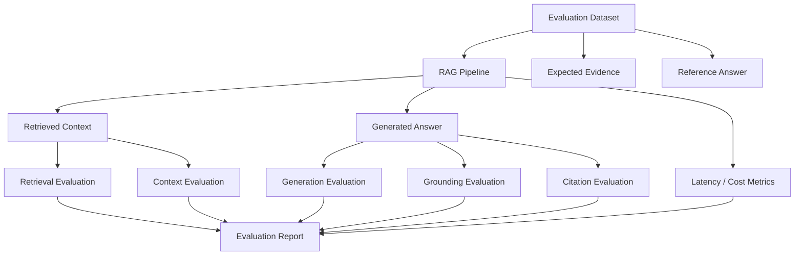
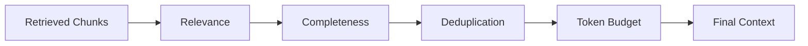
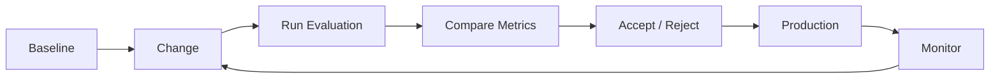
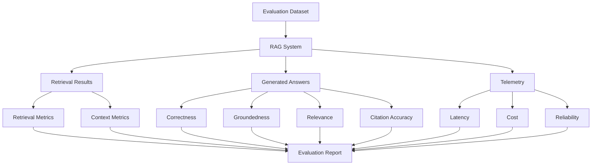
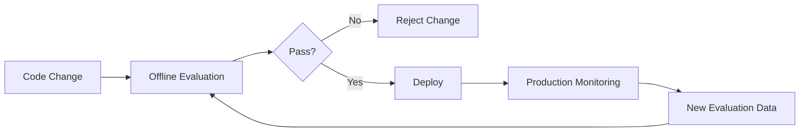

# 19 — RAG Evaluation Fundamentals

> Learn how to systematically evaluate Retrieval-Augmented Generation (RAG) systems across retrieval quality, context quality, answer quality, grounding, citations, latency, cost, and overall user experience.

---

## 📖 Overview

Building a RAG pipeline is only the beginning.

A system can successfully execute:

```text
Query
  ↓
Retrieval
  ↓
Context
  ↓
LLM
  ↓
Answer
```

and still produce poor results.

For example:

```text
User Question
      ↓
Retriever
      ↓
Wrong Documents
      ↓
LLM
      ↓
Confident Wrong Answer
```

Therefore, production RAG systems require systematic evaluation.

The central question is not:

> **"Did the pipeline run successfully?"**

It is:

> **"Did the system retrieve the right evidence and use that evidence to produce a correct, relevant, grounded, and useful answer?"**

---

# 1. Why RAG Evaluation Matters

A RAG system contains multiple stages:

```text
Query
 ↓
Query Processing
 ↓
Embedding
 ↓
Retrieval
 ↓
Filtering
 ↓
Ranking
 ↓
Context Assembly
 ↓
Prompt
 ↓
LLM
 ↓
Answer
```

A failure at any stage can affect the final response.

For example:

```text
Poor Chunking
      ↓
Poor Retrieval
      ↓
Poor Context
      ↓
Poor Answer
```

Therefore, evaluating only the final answer is insufficient.

---

# 2. RAG Evaluation Dimensions

A practical evaluation model is:

```text
                 RAG Evaluation

        ┌─────────────────────────┐
        │     Retrieval Quality   │
        └────────────┬────────────┘
                     ↓
        ┌─────────────────────────┐
        │      Context Quality    │
        └────────────┬────────────┘
                     ↓
        ┌─────────────────────────┐
        │      Generation Quality │
        └────────────┬────────────┘
                     ↓
        ┌─────────────────────────┐
        │     System Quality      │
        └─────────────────────────┘
```

The major dimensions are:

```text
Retrieval
Context
Generation
Grounding
Citations
Latency
Cost
Reliability
User Experience
```

---

# 3. Retrieval vs Generation Evaluation

One of the most important distinctions is:

```text
Did we retrieve the correct information?
```

versus:

```text
Did the LLM correctly use the retrieved information?
```

Example:

```text
Question:
"What is the annual leave entitlement?"

Retrieved:
"Employees receive 25 days."

Generated:
"Employees receive 30 days."
```

Retrieval succeeded.

Generation failed.

---

# 4. Retrieval Failure Example

```text
Question:
"What is the annual leave entitlement?"

Retrieved:
"Employees receive 10 sick days."

Generated:
"Employees receive 10 sick days."
```

The LLM may have correctly summarized the supplied context.

But the RAG system still failed.

The problem is:

```text
Retrieval Quality
```

---

# 5. RAG Evaluation Pipeline



---

# 6. Evaluation Dataset

A RAG evaluation requires representative questions.

Example:

```json
[
  {
    "question": "What is the annual leave entitlement?",
    "expected_source": "employee-handbook",
    "expected_section": "Annual Leave",
    "reference_answer": "Employees receive 25 days of annual leave."
  },
  {
    "question": "How should annual leave be requested?",
    "expected_source": "employee-handbook",
    "expected_section": "Annual Leave",
    "reference_answer": "Employees should submit requests through the employee portal."
  }
]
```

The dataset becomes the foundation for repeatable evaluation.

---

# 7. What an Evaluation Dataset Should Contain

A useful evaluation record may include:

```text
Question
Expected Answer
Expected Source
Expected Section
Expected Evidence
Metadata Filters
Difficulty
Question Type
```

Example:

```json
{
  "id": "rag-001",
  "question": "What is the annual leave entitlement?",
  "expected_answer": "25 days",
  "expected_source": "employee-handbook",
  "expected_section": "Annual Leave",
  "category": "policy"
}
```

---

# 8. Evaluation Dataset Types

A production dataset should contain different question types.

```text
Fact Questions
Policy Questions
Multi-Sentence Questions
Comparison Questions
Procedural Questions
Ambiguous Questions
Unanswerable Questions
```

For example:

```text
"What is the annual leave entitlement?"

"How do I request annual leave?"

"Can unused leave be carried forward?"

"What is the policy for contractors?"

"Does the handbook mention remote work?"
```

---

# 9. Answerable vs Unanswerable Questions

A strong evaluation dataset should include questions for which the knowledge base contains no answer.

Example:

```text
Question:
"What is the company's stock price?"

Knowledge Base:
Employee Handbook
```

Expected behavior:

```text
No supporting evidence
        ↓
Controlled response
```

The system should not fabricate an answer.

---

# 10. Retrieval Evaluation

Retrieval evaluation asks:

> **Did the retriever return the relevant evidence?**

Important metrics include:

```text
Precision@K
Recall@K
MRR
NDCG
Hit Rate
```

These metrics measure different aspects of retrieval quality.

---

# 11. Precision@K

Precision@K measures how many of the top K retrieved results are relevant.

Conceptually:

```text
Precision@K =
Relevant Results in Top-K
-------------------------
Total Results in Top-K
```

For example:

```text
Top 5 Results

Relevant:
3

Precision@5:

3 / 5 = 0.60
```

A higher value means the retrieved result set contains more relevant documents.

---

# 12. Precision@K Formula


Example:

```text
K = 5
Relevant = 4

Precision@5 = 4 / 5 = 0.80
```

Precision is especially useful when irrelevant context is expensive.

---

# 13. Recall@K

Recall@K measures whether the relevant evidence was retrieved within the top K results.

Conceptually:

```text
Recall@K =
Relevant Results Retrieved in Top-K
-----------------------------------
Total Relevant Results
```

Example:

```text
Total relevant chunks = 4
Retrieved relevant chunks = 3

Recall@K = 3 / 4 = 0.75
```

---

# 14. Recall@K Formula


Recall is important because:

> If the correct evidence is never retrieved, the generation stage cannot use it.

---

# 15. Precision vs Recall

```text
Precision
    ↓
"How much of what I retrieved was relevant?"

Recall
    ↓
"How much of the relevant information did I retrieve?"
```

Example:

```text
Retriever A:

5 results
4 relevant

High Precision


Retriever B:

10 results
4 relevant

Lower Precision
Higher opportunity for Recall
```

The correct balance depends on the application.

---

# 16. Hit Rate

Hit Rate measures whether at least one relevant result appears within the top K.

Example:

```text
Expected Evidence:
Chunk 42

Top 5:
Chunk 7
Chunk 12
Chunk 42
Chunk 81
Chunk 90
```

The query is a hit.

```text
Hit Rate = 1
```

If no relevant result appears:

```text
Hit Rate = 0
```

---

# 17. Mean Reciprocal Rank

MRR considers the position of the first relevant result.

If the first relevant document appears at:

```text
Position 1
```

the reciprocal rank is:

```text
1 / 1 = 1.0
```

If it appears at:

```text
Position 4
```

then:

```text
1 / 4 = 0.25
```

---

# 18. MRR Formula


MRR is useful when the position of the first relevant result matters.

---

# 19. NDCG

NDCG stands for:

```text
Normalized Discounted Cumulative Gain
```

It considers both:

```text
Relevance
```

and:

```text
Ranking Position
```

A highly relevant result near the top contributes more than the same result appearing much later.

NDCG is useful when relevance can have multiple levels.

For example:

```text
Highly Relevant
Relevant
Partially Relevant
Irrelevant
```

---

# 20. Retrieval Metrics Summary

| Metric | Main Question |
|---|---|
| Precision@K | How many retrieved results are relevant? |
| Recall@K | Did we retrieve the relevant evidence? |
| Hit Rate | Did at least one relevant result appear? |
| MRR | How early is the first relevant result? |
| NDCG | Are highly relevant results ranked near the top? |

No single metric completely describes retrieval quality.

---

# 21. Context Evaluation

Retrieval can succeed while context assembly fails.

Example:

```text
Retriever
   ↓
Correct 5 chunks
   ↓
Context Builder
   ↓
Only 2 chunks preserved
```

Therefore context should also be evaluated.

Important dimensions include:

```text
Context Relevance
Context Completeness
Context Precision
Context Ordering
Context Noise
```

---

# 22. Context Relevance

Context relevance asks:

> **Does the retrieved context actually help answer the question?**

Example:

```text
Question:
"What is the annual leave entitlement?"

Context:
"Employees receive 25 days of annual leave."

High relevance.
```

But:

```text
Context:
"Employees should use the company cafeteria."

Low relevance.
```

---

# 23. Context Completeness

Context completeness asks:

> **Does the retrieved context contain enough information to answer the question?**

Example:

```text
Question:
"How many leave days can be carried forward?"

Context:
"Employees may carry forward unused leave."
```

If the number of days is missing, the context may be incomplete.

---

# 24. Context Noise

Too much irrelevant context can reduce generation quality.

```text
Relevant Chunk
Relevant Chunk
Relevant Chunk
Irrelevant Chunk
Irrelevant Chunk
Irrelevant Chunk
```

The goal is not:

```text
Maximum Context
```

but:

```text
Maximum Useful Context
```

---

# 25. Context Quality Pipeline



---

# 26. Generation Evaluation

Generation evaluation asks:

> **Did the LLM produce a useful answer from the supplied evidence?**

Important dimensions include:

```text
Correctness
Relevance
Faithfulness
Groundedness
Completeness
Clarity
Citation Accuracy
```

---

# 27. Answer Correctness

Answer correctness asks:

> **Does the generated answer correctly answer the question?**

Example:

```text
Question:
"What is the annual leave entitlement?"

Expected:
25 days

Generated:
Employees receive 25 days of annual leave.

Result:
Correct
```

---

# 28. Answer Relevance

An answer can be factually correct but still poorly focused.

Question:

```text
"What is the annual leave entitlement?"
```

Answer:

```text
Employees receive 25 days of annual leave.
The company also has policies for sick leave,
remote work, travel expenses, and office security...
```

The answer begins correctly but contains unnecessary information.

Answer relevance measures whether the response directly addresses the user's question.

---

# 29. Faithfulness

Faithfulness asks:

> **Is the generated answer supported by the retrieved context?**

Example:

```text
Context:
Employees receive 25 days of annual leave.

Answer:
Employees receive 25 days of annual leave.

Faithful
```

But:

```text
Context:
Employees receive 25 days of annual leave.

Answer:
Employees receive 30 days of annual leave.

Not faithful
```

---

# 30. Groundedness

Groundedness is closely related to faithfulness.

A grounded answer should be supported by the evidence provided to the LLM.

```text
Retrieved Evidence
       ↓
Generated Answer
       ↓
Supported?
```

If the answer contains unsupported claims:

```text
Grounding ↓
```

---

# 31. Hallucination in RAG

RAG reduces the need for the model to rely entirely on pretrained knowledge, but it does not eliminate hallucinations.

Example:

```text
Context:
Employees receive 25 days of annual leave.

Answer:
Employees receive 25 days and can
automatically carry forward 15 days.
```

If the context does not mention the carry-forward limit, that claim is unsupported.

---

# 32. Groundedness Evaluation

A practical evaluation process can be:

```text
Generated Answer
       ↓
Split into Claims
       ↓
Check Each Claim
       ↓
Supported by Context?
       ↓
Groundedness Score
```

Example:

```text
Claim 1 → Supported
Claim 2 → Supported
Claim 3 → Unsupported
```

---

# 33. Claim-Level Evaluation

Suppose the answer is:

```text
Employees receive 25 days of annual leave.
Requests must be submitted through the portal.
Unused leave may be carried forward.
```

Break it into:

```text
Claim 1
Claim 2
Claim 3
```

Then evaluate each claim independently.

```text
Claim 1 → Supported
Claim 2 → Supported
Claim 3 → Supported
```

This gives a more detailed view than simply marking the entire answer correct or incorrect.

---

# 34. Citation Evaluation

Enterprise RAG systems often return citations.

Example:

```text
Employees receive 25 days of annual leave.

Source:
Employee Handbook — Page 42
```

Citation evaluation should verify:

```text
Citation Exists
Citation Points to Correct Source
Citation Supports the Claim
Citation Is Not Fabricated
```

---

# 35. Citation Accuracy

Bad example:

```text
Answer:
Employees receive 25 days.

Citation:
Employee Handbook — Page 90
```

If page 90 contains unrelated content:

```text
Citation Accuracy = Failure
```

The answer may still be correct, but the source attribution is wrong.

---

# 36. Citation Coverage

If an answer contains several factual claims:

```text
Claim 1 → Citation
Claim 2 → Citation
Claim 3 → No Citation
```

citation coverage is incomplete.

A production system should determine which claims require source attribution.

---

# 37. Answer Completeness

An answer can be correct but incomplete.

Question:

```text
"How do I request annual leave?"
```

Context:

```text
Employees should submit requests
through the employee portal.
Requests require manager approval.
```

Answer:

```text
Use the employee portal.
```

Correct, but incomplete.

A better answer:

```text
Submit the request through the employee portal.
The request then requires manager approval.
```

---

# 38. Answer Quality Model

```text
                 Answer Quality

             ┌────────────────┐
             │   Correctness  │
             └───────┬────────┘
                     ↓
             ┌────────────────┐
             │   Relevance    │
             └───────┬────────┘
                     ↓
             ┌────────────────┐
             │  Groundedness  │
             └───────┬────────┘
                     ↓
             ┌────────────────┐
             │ Completeness   │
             └───────┬────────┘
                     ↓
             ┌────────────────┐
             │ Citation       │
             └────────────────┘
```

A strong answer should perform well across these dimensions.

---

# 39. Human Evaluation

Human evaluation remains important.

A reviewer can score an answer on:

```text
Correctness
Relevance
Grounding
Completeness
Clarity
Citation Quality
```

For example:

```text
Score: 1 → Poor
Score: 2 → Weak
Score: 3 → Acceptable
Score: 4 → Good
Score: 5 → Excellent
```

---

# 40. Human Evaluation Rubric

| Dimension | Question |
|---|---|
| Correctness | Is the answer factually correct? |
| Relevance | Does it answer the question directly? |
| Groundedness | Is it supported by retrieved evidence? |
| Completeness | Does it include important information? |
| Clarity | Is it easy to understand? |
| Citation Quality | Are sources accurate and useful? |

---

# 41. LLM-as-a-Judge

An LLM can also evaluate generated responses.

Conceptually:

```text
Question
+
Retrieved Context
+
Generated Answer
        ↓
Evaluation LLM
        ↓
Score + Explanation
```

Example evaluation prompt:

```text
Evaluate whether the answer is supported
by the provided context.

Question:
{question}

Context:
{context}

Answer:
{answer}

Return:

{
  "grounded": true,
  "score": 0.95,
  "reason": "The answer is directly supported by the context."
}
```

LLM-based evaluation should itself be validated.

---

# 42. Human Evaluation vs Automated Evaluation

### Human Evaluation

Advantages:

```text
High-quality judgment
Nuanced reasoning
Better for complex questions
```

Limitations:

```text
Expensive
Slow
Subjective
```

### Automated Evaluation

Advantages:

```text
Fast
Repeatable
Scalable
```

Limitations:

```text
Evaluator bias
Prompt sensitivity
Model limitations
```

A production evaluation strategy often combines both.

---

# 43. Reference-Based Evaluation

If a reference answer exists:

```text
Question
   ↓
Expected Answer
   ↓
Generated Answer
   ↓
Comparison
```

This can evaluate:

```text
Correctness
Similarity
Completeness
```

However, exact string matching is usually insufficient for natural-language answers.

---

# 44. Semantic Answer Evaluation

Two answers may express the same meaning differently.

Reference:

```text
Employees receive 25 days of annual leave.
```

Generated:

```text
The annual leave entitlement is 25 days per year.
```

String comparison would show a difference.

Semantic evaluation can recognize that the answers convey the same information.

---

# 45. Exact Match

Exact Match is useful when the expected output has a deterministic form.

Example:

```text
Question:
"What is the policy year?"

Expected:
2026
```

Generated:

```text
2026
```

Exact match succeeds.

It is less suitable for open-ended answers.

---

# 46. Token-Level Metrics

Traditional NLP metrics can compare generated text against references.

Examples include:

```text
BLEU
ROUGE
```

However, they should not be treated as complete measures of RAG quality.

A response can use different words while still being correct.

---

# 47. RAG-Specific Evaluation

RAG evaluation should focus on:

```text
Retrieval
Context
Grounding
Answer
Citations
```

rather than relying solely on text-overlap metrics.

---

# 48. Evaluation Frameworks

RAG evaluation can be implemented manually or using specialized tools.

Examples include:

```text
Ragas
DeepEval
TruLens
Custom Evaluation Pipelines
```

Frameworks can help automate metrics and evaluation workflows.

The important principle is:

> **Understand the metric before relying on a framework to calculate it.**

---

# 49. Evaluation Without a Framework

A simple custom evaluator can be implemented.

```python
def evaluate_answer(
    expected_answer,
    generated_answer
):

    return {
        "contains_expected": (
            expected_answer.lower()
            in generated_answer.lower()
        )
    }
```

This is intentionally simple.

Production evaluation should use richer semantic and grounding checks.

---

# 50. Retrieval Evaluation Example

```python
def evaluate_retrieval(
    retrieved_ids,
    expected_ids,
    k=5
):

    retrieved = set(
        retrieved_ids[:k]
    )

    expected = set(
        expected_ids
    )

    relevant = (
        retrieved.intersection(expected)
    )

    precision = (
        len(relevant) / k
        if k
        else 0
    )

    recall = (
        len(relevant) / len(expected)
        if expected
        else 0
    )

    return {
        "precision_at_k": precision,
        "recall_at_k": recall
    }
```

This demonstrates the basic idea behind retrieval evaluation.

---

# 51. Evaluation Record

A useful evaluation result might look like:

```json
{
  "question_id": "rag-001",
  "retrieval": {
    "precision_at_5": 0.8,
    "recall_at_5": 1.0,
    "hit": true
  },
  "generation": {
    "correct": true,
    "grounded": true,
    "relevant": true
  },
  "citation": {
    "accurate": true
  },
  "latency_ms": 910
}
```

This makes results machine-readable.

---

# 52. Batch Evaluation

Instead of evaluating one question:

```text
Question 1
Question 2
Question 3
...
Question 1000
```

run the complete evaluation dataset.

```python
results = []

for item in evaluation_dataset:

    result = rag_pipeline.answer(
        item["question"]
    )

    evaluation = evaluate(
        item,
        result
    )

    results.append(
        evaluation
    )
```

This allows regression testing.

---

# 53. Evaluation Dashboard

A production team can track:

```text
Retrieval Recall@K
Retrieval Precision@K
Hit Rate
Answer Correctness
Groundedness
Citation Accuracy
Latency
Cost
Failure Rate
```

Example:

```text
Retrieval Recall@5       0.91
Retrieval Precision@5    0.78
Groundedness             0.94
Answer Correctness       0.89
Citation Accuracy        0.97
P95 Latency              1.8s
```

These numbers are illustrative.

---

# 54. Evaluation Trend

Evaluation should be continuous.



This turns RAG evaluation into an engineering feedback loop.

---

# 55. Regression Testing

Suppose the current system has:

```text
Recall@5 = 0.91
```

After changing the chunking strategy:

```text
Recall@5 = 0.73
```

The change should be investigated before deployment.

Similarly:

```text
Groundedness:
0.94 → 0.81
```

could indicate that the new prompt or context strategy is causing problems.

---

# 56. Evaluation Before and After Changes

Common changes requiring evaluation include:

```text
Embedding Model
Chunk Size
Chunk Overlap
Metadata Filters
Top-K
Similarity Threshold
Prompt
LLM Model
Context Formatting
Vector Database
Retrieval Strategy
```

Every change can affect downstream quality.

---

# 57. Evaluation Matrix

| Change | Retrieval Impact | Generation Impact |
|---|---:|---:|
| Embedding Model | High | Indirect |
| Chunk Size | High | High |
| Chunk Overlap | Medium | Medium |
| Top-K | High | High |
| Similarity Threshold | High | High |
| Prompt | Low | High |
| LLM Model | None | High |
| Context Formatting | Low | High |
| Vector Database | Potentially High | Indirect |

---

# 58. Evaluation by Question Type

Different questions may produce different results.

Example:

```text
Fact Questions
    ↓
High Accuracy

Multi-hop Questions
    ↓
Lower Accuracy

Ambiguous Questions
    ↓
Variable Accuracy

Unanswerable Questions
    ↓
Hallucination Risk
```

Therefore aggregate scores alone can hide important weaknesses.

---

# 59. Segment Evaluation

Evaluate by categories.

```text
Policy Questions
    Accuracy = 95%

Procedural Questions
    Accuracy = 89%

Unanswerable Questions
    Safe Response = 96%

Multi-document Questions
    Accuracy = 78%
```

This reveals where improvements are needed.

---

# 60. Difficulty Levels

Evaluation questions can also be classified:

```text
Easy
Medium
Hard
```

Example:

### Easy

```text
"What is the annual leave entitlement?"
```

### Medium

```text
"How is annual leave requested and approved?"
```

### Hard

```text
"What happens to unused leave when an employee changes departments?"
```

Difficulty-based evaluation helps identify system limitations.

---

# 61. Negative Testing

RAG systems should be tested with intentionally difficult or unsupported queries.

Examples:

```text
Unknown Topic
Wrong Department
Outdated Policy
Unauthorized Information
Ambiguous Query
Contradictory Documents
```

Expected behavior should be defined beforehand.

---

# 62. Security Evaluation

Security should be evaluated separately.

Example:

```text
User:
Employee A

Query:
"What is the executive compensation policy?"
```

If the user does not have access:

```text
Expected:
No unauthorized information
```

The test should verify that restricted content never reaches the generation layer.

---

# 63. Evaluation of Empty Retrieval

Test:

```text
Question outside knowledge base
```

Expected:

```text
Controlled response
```

Not:

```text
Confident hallucination
```

This is an important production safety test.

---

# 64. Evaluation of Citation Integrity

Test:

```text
Generated Claim
      ↓
Citation
      ↓
Source
      ↓
Does Source Support Claim?
```

If not:

```text
Citation Failure
```

Citation integrity is particularly important for:

```text
Legal
Finance
Compliance
Healthcare
Enterprise Policy
```

applications.

---

# 65. Latency Evaluation

RAG latency should be measured end-to-end.

```text
Total Latency =
Query Processing
+
Embedding
+
Retrieval
+
Context Processing
+
LLM
+
Validation
```

Measure:

```text
Average
P50
P95
P99
```

rather than relying only on average latency.

---

# 66. Why P95 Matters

Suppose:

```text
Average latency = 800 ms
P95 latency     = 2.5 s
```

Most users may receive fast responses, but a significant minority experience much slower requests.

Production systems should therefore monitor latency distributions.

---

# 67. Cost Evaluation

A RAG request can incur:

```text
Embedding Cost
+
Vector Infrastructure Cost
+
Reranking Cost
+
LLM Input Cost
+
LLM Output Cost
```

Track cost per:

```text
Request
User
Tenant
Day
Month
Application
```

where useful.

---

# 68. Cost vs Quality

Reducing cost aggressively can reduce answer quality.

Example:

```text
Top-K: 10
    ↓
High Context
    ↓
Higher Cost
    ↓
Potentially Better Recall
```

versus:

```text
Top-K: 3
    ↓
Lower Context
    ↓
Lower Cost
    ↓
Potentially Lower Recall
```

The goal is not minimum cost.

It is:

```text
Best Quality / Cost Trade-Off
```

---

# 69. Evaluation Scorecard

A practical scorecard can be:

```text
Retrieval
  Recall@5
  Precision@5
  MRR

Context
  Relevance
  Completeness

Generation
  Correctness
  Groundedness
  Relevance

Citations
  Accuracy
  Coverage

System
  P95 Latency
  Cost / Query
  Error Rate
```

---

# 70. Example Scorecard

| Category | Metric | Example |
|---|---|---:|
| Retrieval | Recall@5 | 0.91 |
| Retrieval | Precision@5 | 0.82 |
| Retrieval | MRR | 0.88 |
| Context | Relevance | 0.93 |
| Generation | Correctness | 0.90 |
| Generation | Groundedness | 0.95 |
| Citations | Accuracy | 0.97 |
| System | P95 Latency | 1.8s |

The values are illustrative.

---

# 71. Weighted Evaluation

Some applications may combine metrics.

For example:

```text
Overall Score =
0.30 × Retrieval
+
0.30 × Groundedness
+
0.20 × Correctness
+
0.10 × Citation
+
0.10 × Relevance
```

The weights should reflect business priorities.

For high-risk applications, correctness and grounding may deserve greater importance.

---

# 72. Why a Single Score Is Dangerous

A single score can hide failures.

Example:

```text
Overall Score = 0.91
```

but:

```text
Retrieval Recall = 0.98
Groundedness     = 0.95
Citation Accuracy = 0.60
```

The system may still be unsuitable for an enterprise application requiring reliable citations.

Always inspect individual metrics.

---

# 73. Evaluation Architecture



---

# 74. Production Evaluation Workflow

```text
1. Define evaluation goals.

2. Build representative questions.

3. Identify expected evidence.

4. Define reference answers where appropriate.

5. Run the RAG system.

6. Capture retrieved documents.

7. Measure retrieval quality.

8. Evaluate context quality.

9. Evaluate generated answers.

10. Measure groundedness.

11. Validate citations.

12. Measure latency.

13. Measure cost.

14. Segment results by question type.

15. Compare against baseline.

16. Investigate regressions.

17. Approve or reject changes.

18. Continuously monitor production behavior.
```

---

# 75. Baseline Evaluation

Before optimizing the system, establish a baseline.

Example:

```text
Embedding Model: Model A
Chunk Size: 500
Overlap: 50
Top-K: 5
LLM: Model X
```

Baseline:

```text
Recall@5        = 0.88
Groundedness    = 0.91
Correctness     = 0.86
Citation        = 0.94
P95 Latency     = 1.9s
```

Future changes should be compared against this baseline.

---

# 76. Experiment Tracking

A RAG experiment should record:

```text
Embedding Model
Chunk Size
Chunk Overlap
Top-K
Similarity Threshold
Vector Store
Prompt Version
LLM Model
Evaluation Dataset Version
Evaluation Metrics
```

Example:

```json
{
  "experiment": "rag-v12",
  "embedding_model": "embedding-v3",
  "chunk_size": 500,
  "chunk_overlap": 50,
  "top_k": 5,
  "llm": "enterprise-model-x",
  "prompt_version": "prompt-v4"
}
```

This enables reproducible experimentation.

---

# 77. Evaluation Dataset Versioning

The dataset itself should be versioned.

```text
eval-v1
eval-v2
eval-v3
```

If questions change, metric comparisons may no longer be directly comparable.

Therefore:

```text
System Version
+
Evaluation Dataset Version
```

should be recorded together.

---

# 78. Production Monitoring vs Offline Evaluation

These are complementary.

### Offline Evaluation

```text
Controlled Dataset
      ↓
Repeatable Testing
```

### Production Monitoring

```text
Real User Traffic
      ↓
Real-World Behavior
```

Offline evaluation provides controlled comparison.

Production monitoring reveals actual system behavior.

---

# 79. Continuous Evaluation



This creates a continuous quality loop.

---

# 80. Evaluation Alerts

Production systems can alert when:

```text
Groundedness drops
Retrieval recall drops
Empty retrieval increases
Latency increases
Cost increases
Citation failures increase
Error rate increases
```

Example:

```text
Groundedness:
0.94 → 0.81
```

This should trigger investigation.

---

# 81. Root-Cause Analysis

When quality decreases, inspect the pipeline stage.

```text
Quality Drop
     ↓
Retrieval?
     ↓
Context?
     ↓
Prompt?
     ↓
LLM?
     ↓
Citation?
```

Do not immediately change the model.

The failure may be caused by:

```text
Chunking
Metadata
Embedding
Filtering
Top-K
Context Budget
```

---

# 82. Example Root-Cause Investigation

Suppose:

```text
Answer Correctness:
0.91 → 0.76
```

Check:

```text
Recall@5:
0.90 → 0.61
```

This suggests:

```text
Retrieval degradation
```

rather than an LLM generation problem.

---

# 83. Another Root-Cause Example

Suppose:

```text
Recall@5:
0.91 → 0.92

Groundedness:
0.95 → 0.81
```

Retrieval remains strong.

The problem may be:

```text
Prompt
Context Formatting
LLM
Response Generation
```

This illustrates why multiple metrics are required.

---

# 84. Evaluation Anti-Patterns

## 84.1 Only Measuring Final Answers

This hides retrieval failures.

---

## 84.2 Using Only One Question

One question cannot represent an enterprise workload.

---

## 84.3 Using Only Exact String Matching

Equivalent answers may use different wording.

---

## 84.4 Ignoring Unanswerable Questions

This hides hallucination behavior.

---

## 84.5 Ignoring Citations

Correct answers can still have incorrect sources.

---

## 84.6 Ignoring Latency

A high-quality system can still be unusable if responses are too slow.

---

## 84.7 Ignoring Cost

An accurate system may still be economically impractical.

---

## 84.8 Changing Multiple Variables at Once

If you change:

```text
Chunking
Embedding
Prompt
LLM
Top-K
```

at the same time, it becomes difficult to identify what caused the improvement or regression.

---

# 85. Controlled Experiments

Prefer:

```text
Change One Major Variable
        ↓
Run Evaluation
        ↓
Compare
```

Example:

```text
Experiment A:
Chunk size = 500

Experiment B:
Chunk size = 800
```

Keep other major variables stable.

---

# 86. Evaluation of Chunk Size

Example experiment:

```text
Chunk Size     Recall@5

300            0.82
500            0.90
800            0.87
1200           0.79
```

The best chunk size is not necessarily the largest or smallest.

It should be selected based on evaluation results and workload characteristics.

---

# 87. Evaluation of Top-K

Example:

```text
Top-K     Recall@K     Groundedness

3         0.78        0.96
5         0.89        0.95
10        0.94        0.90
20        0.97        0.82
```

Increasing K improves retrieval coverage but may introduce context noise.

This demonstrates why retrieval and generation metrics should be evaluated together.

---

# 88. Quality Trade-Off

```text
Top-K ↑
   ↓
Recall ↑
   ↓
Context Size ↑
   ↓
Noise / Cost ↑
   ↓
Potential Groundedness ↓
```

The optimal value is application-specific.

---

# 89. Evaluation as an Engineering Discipline

RAG evaluation should be treated like software testing.

```text
Code
 ↓
Unit Tests
 ↓
Integration Tests
 ↓
Evaluation Tests
 ↓
Deployment
 ↓
Monitoring
```

RAG quality should not depend on manual experimentation alone.

---

# 90. Test Pyramid for RAG

```text
             ┌───────────────┐
             │ Human Review  │
             └───────────────┘
           ┌─────────────────────┐
           │ End-to-End Evaluation│
           └─────────────────────┘
        ┌───────────────────────────┐
        │ Retrieval / Generation    │
        └───────────────────────────┘
     ┌─────────────────────────────────┐
     │ Unit / Integration Tests        │
     └─────────────────────────────────┘
```

The lower levels should provide fast feedback.

The higher levels provide broader quality validation.

---

# 91. Evaluation Strategy by Stage

| Stage | Example Evaluation |
|---|---|
| Document Processing | Extraction accuracy |
| Chunking | Context completeness |
| Embeddings | Retrieval benchmark |
| Retrieval | Recall@K / Precision@K |
| Ranking | MRR / NDCG |
| Context | Relevance / completeness |
| Generation | Correctness / relevance |
| Grounding | Faithfulness |
| Citations | Source accuracy |
| System | Latency / cost / reliability |

---

# 92. RAG Quality Lifecycle

```text
Build
 ↓
Evaluate
 ↓
Identify Weakness
 ↓
Change One Component
 ↓
Evaluate Again
 ↓
Compare
 ↓
Deploy
 ↓
Monitor
 ↓
Collect New Cases
 ↓
Expand Dataset
 ↓
Evaluate Again
```

This turns evaluation into a continuous improvement process.

---

# 93. Key Takeaways

- RAG evaluation must measure more than whether the pipeline executes successfully.
- Retrieval and generation should be evaluated separately.
- Retrieval evaluation determines whether the right evidence was found.
- Precision@K measures how many retrieved results are relevant.
- Recall@K measures whether relevant evidence was retrieved.
- Hit Rate measures whether at least one relevant result was retrieved.
- MRR evaluates the position of the first relevant result.
- NDCG evaluates both relevance and ranking position.
- Context evaluation measures relevance, completeness, and noise.
- Generation evaluation measures correctness, relevance, completeness, and clarity.
- Faithfulness and groundedness measure whether answers are supported by retrieved evidence.
- Citation evaluation verifies that sources are accurate and actually support generated claims.
- Evaluation datasets should contain representative, difficult, and unanswerable questions.
- Human evaluation provides nuanced judgment but is expensive.
- Automated evaluation provides scale and repeatability but requires validation.
- LLM-as-a-judge can help evaluate semantic qualities but should not be blindly trusted.
- Exact-match metrics are useful for deterministic outputs but are insufficient for open-ended RAG answers.
- Offline evaluation and production monitoring serve different purposes and should complement each other.
- Evaluation datasets should be versioned.
- System configurations should be tracked with evaluation results.
- Baselines are essential for measuring improvements and regressions.
- Changes to chunking, embeddings, retrieval, prompts, or LLMs should be evaluated before production rollout.
- Aggregate scores can hide important weaknesses, so metrics should also be segmented by question type.
- RAG evaluation should include latency, cost, reliability, and security behavior.
- Empty retrieval and unanswerable questions are important tests for hallucination resistance.
- Evaluation should become part of the RAG engineering lifecycle rather than a final one-time activity.

The central principle is:

> **A production RAG system should be evaluated as a complete pipeline: retrieve the right evidence, construct useful context, generate a correct and grounded answer, provide trustworthy citations, and meet the required latency, reliability, security, and cost targets.**

---

# 94. Chapter Navigation

## Part IV — Prompt Engineering & RAG Fundamentals

**Previous Chapter:** [18. Building Your First RAG Pipeline](18-building-your-first-rag-pipeline.md)

**Current Chapter:** 19 — RAG Evaluation Fundamentals

**Next Chapter:** [20. Enterprise Generative AI Application Architecture](20-enterprise-generative-ai-application-architecture.md)

### Part IV Chapters

1. [01. Introduction to Prompt Engineering](01-introduction-to-prompt-engineering.md)
2. [02. Prompt Engineering Fundamentals](02-prompt-engineering-fundamentals.md)
3. [03. Advanced Prompt Engineering](03-advanced-prompt-engineering.md)
4. [04. Prompt Design Patterns](04-prompt-design-patterns.md)
5. [05. Zero-shot, One-shot & Few-shot Prompting](05-zero-one-few-shot-prompting.md)
6. [06. Chain-of-Thought Prompting](06-chain-of-thought-prompting.md)
7. [07. ReAct Prompting](07-react-prompting.md)
8. [08. Structured Outputs & Output Parsing](08-structured-outputs-and-output-parsing.md)
9. [09. Function Calling & Tool Calling](09-function-calling-and-tool-calling.md)
10. [10. Embeddings in Practice](10-embeddings-in-practice.md)
11. [11. Document Processing & Vectorization](11-document-processing-and-vectorization.md)
12. [12. Document Chunking Strategies](12-document-chunking-strategies.md)
13. [13. Vector Database Fundamentals](13-vector-database-fundamentals.md)
14. [14. Similarity Search Techniques](14-similarity-search-techniques.md)
15. [15. RAG Pipeline Components](15-rag-pipeline-components.md)
16. [16. Retrieval and Generation Pipeline](16-retrieval-and-generation-pipeline.md)
17. [17. Vector Databases in RAG](17-vector-databases-in-rag.md)
18. [18. Building Your First RAG Pipeline](18-building-your-first-rag-pipeline.md)
19. **19. RAG Evaluation Fundamentals**
20. [20. Enterprise Generative AI Application Architecture](20-enterprise-generative-ai-application-architecture.md)
21. [21. Deploying AI Applications with Gradio](21-deploying-ai-applications-with-gradio.md)

---

# References

- Retrieval-Augmented Generation evaluation research
- Information retrieval evaluation documentation
- Precision and Recall documentation
- MRR and NDCG evaluation documentation
- RAG evaluation methodology documentation
- Ragas documentation
- DeepEval documentation
- TruLens documentation
- LangChain evaluation documentation
- LlamaIndex evaluation documentation
- LLM evaluation documentation
- Enterprise AI evaluation and observability documentation

---

> **Enterprise AI Engineering Handbook**  
> *Building Production-Grade Enterprise AI Systems — One Chapter at a Time.*