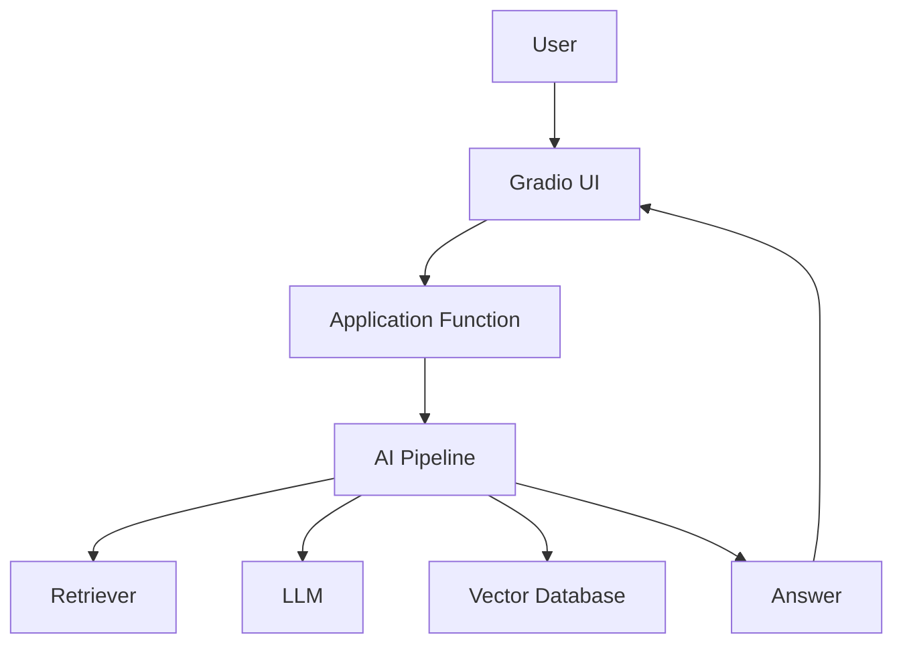
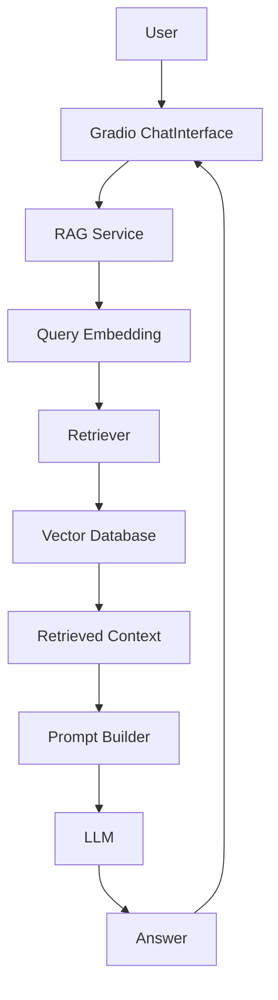
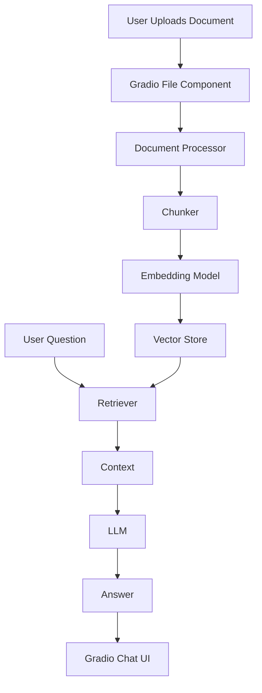
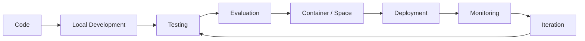
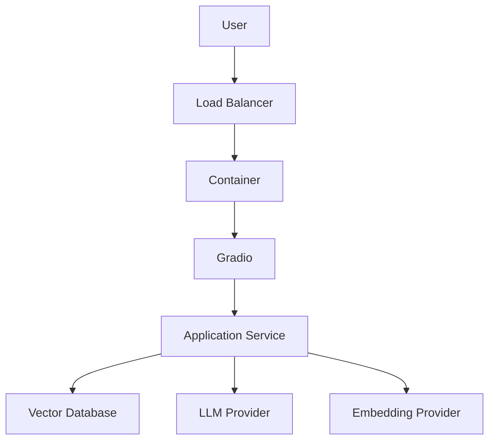
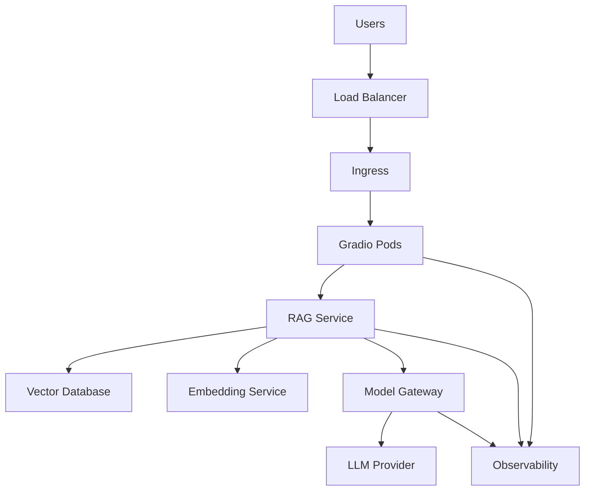
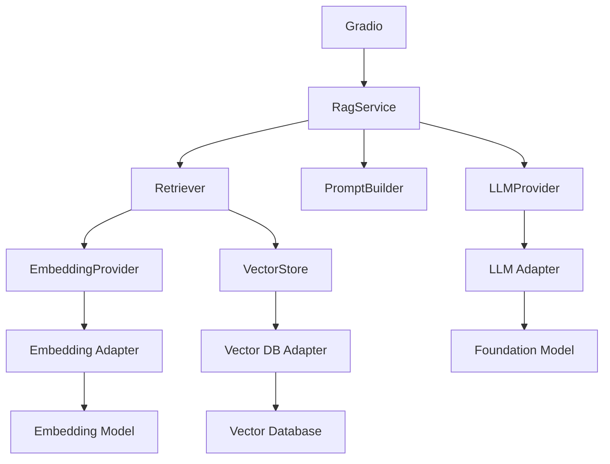
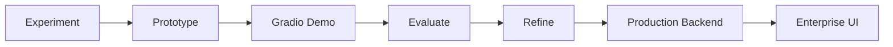
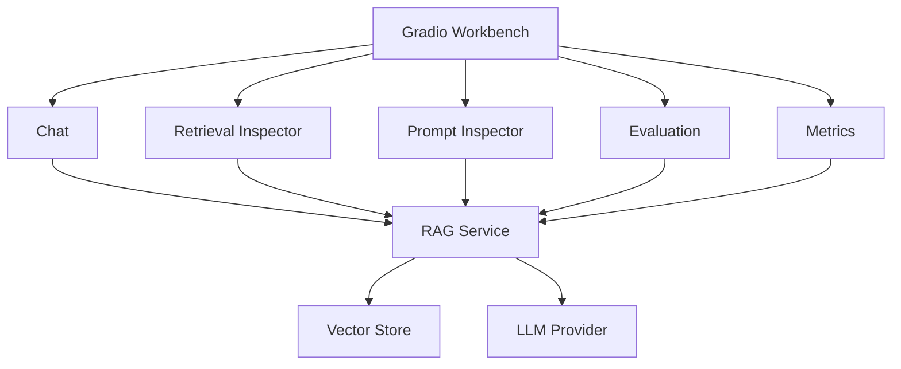

# 21 — Deploying AI Applications with Gradio

> Learn how to turn Python-based AI, LLM, and RAG pipelines into interactive web applications using Gradio, and understand the path from local prototypes to shareable and deployable AI applications.

---

## 📖 Overview

Building an AI model or RAG pipeline is only one part of an AI application.

Users need a way to interact with it.

A simple Python pipeline may look like:

```text
User Question
      ↓
Python Function
      ↓
LLM / RAG Pipeline
      ↓
Answer
```

Gradio provides a Python-based interface layer that can turn this backend capability into an interactive web application.

```text
Python AI Pipeline
       ↓
     Gradio
       ↓
Web Application
       ↓
      User
```

Gradio provides higher-level components such as `Interface` and `ChatInterface`, while `Blocks` provides more control over layouts, events, and data flow. :contentReference[oaicite:0]{index=0}

This chapter focuses on using Gradio as an **AI application interface and deployment tool**, particularly for LLM and RAG prototypes.

---

# 1. Why Gradio Matters for AI Engineers

AI engineers often have a working Python pipeline before they have a complete frontend application.

For example:

```python
def answer_question(question):
    return rag_pipeline.answer(question)
```

Without a UI:

```text
Developer
   ↓
Python Script
   ↓
Terminal
```

With Gradio:

```text
User
 ↓
Web UI
 ↓
Python Function
 ↓
RAG Pipeline
 ↓
LLM
```

This makes AI systems easier to:

```text
Demonstrate
Prototype
Test
Share
Evaluate
Integrate
```

---

# 2. What Gradio Provides

Gradio provides components for building interactive AI applications.

Common building blocks include:

```text
Interface
Blocks
ChatInterface
Textbox
Chatbot
Button
File
Image
Audio
Dataframe
JSON
Markdown
```

Gradio components act as inputs and outputs around Python functions. :contentReference[oaicite:1]{index=1}

---

# 3. Gradio in an AI Architecture

Gradio should generally be viewed as an **application interface layer**.



Gradio does not replace:

```text
LLM
Vector Database
Retriever
Embedding Model
Business Logic
Security Architecture
```

It provides the interactive interface around those capabilities.

---

# 4. Installation

Install Gradio using:

```bash
pip install gradio
```

Verify the installation:

```bash
python -c "import gradio; print(gradio.__version__)"
```

A typical project can use:

```text
Python
Gradio
LLM SDK
Embedding SDK
Vector Database Client
```

---

# 5. Project Structure

A simple AI application can start with:

```text
ai-gradio-app/
│
├── app.py
├── requirements.txt
├── README.md
│
├── src/
│   ├── llm.py
│   ├── embeddings.py
│   ├── retriever.py
│   └── rag.py
│
└── data/
    └── documents/
```

The important principle is:

```text
UI
 ↓
Application Logic
 ↓
AI Capabilities
```

Do not place the complete RAG implementation inside the UI callback.

---

# 6. Your First Gradio Application

A minimal application:

```python
import gradio as gr


def greet(name):
    return f"Hello, {name}!"


demo = gr.Interface(
    fn=greet,
    inputs="text",
    outputs="text"
)

demo.launch()
```

The function:

```python
greet()
```

is the application logic.

Gradio creates the interface around it.

---

# 7. How `Interface` Works

The basic model is:

```text
Function
   +
Input Components
   +
Output Components
   ↓
Gradio Interface
```

For example:

```python
demo = gr.Interface(
    fn=greet,
    inputs="text",
    outputs="text"
)
```

The function receives the input and returns the output.

`Interface` is a high-level abstraction intended for quickly wrapping a Python function or model with a web UI. :contentReference[oaicite:2]{index=2}

---

# 8. Input and Output Mapping

Suppose the function is:

```python
def calculate(a, b):
    return a + b
```

The interface can define:

```python
demo = gr.Interface(
    fn=calculate,
    inputs=[
        gr.Number(label="A"),
        gr.Number(label="B")
    ],
    outputs=gr.Number(label="Result")
)
```

The flow is:

```text
Textbox / Number
       ↓
Python Function
       ↓
Output Component
```

---

# 9. Building a Simple LLM UI

Suppose we already have:

```python
def generate_answer(question):

    return llm.generate(
        question
    )
```

Gradio can expose it:

```python
import gradio as gr


def generate_answer(question):

    return llm.generate(
        question
    )


demo = gr.Interface(
    fn=generate_answer,
    inputs=gr.Textbox(
        label="Question",
        placeholder="Ask a question..."
    ),
    outputs=gr.Textbox(
        label="Answer"
    ),
    title="Enterprise AI Assistant"
)

demo.launch()
```

The AI logic remains outside the UI definition.

---

# 10. `ChatInterface`

For conversational AI applications, `ChatInterface` is usually more appropriate.

It provides a higher-level abstraction specifically for chatbot applications. The callback receives the user's message and conversation history. :contentReference[oaicite:3]{index=3}

Basic example:

```python
import gradio as gr


def chat(message, history):

    return f"You asked: {message}"


demo = gr.ChatInterface(
    fn=chat,
    title="Enterprise AI Assistant"
)

demo.launch()
```

The architecture becomes:

```text
User Message
      ↓
ChatInterface
      ↓
chat(message, history)
      ↓
AI Pipeline
      ↓
Response
```

---

# 11. Understanding `message` and `history`

A typical callback:

```python
def chat(message, history):

    ...
```

receives:

```text
message
```

as the current user input.

The:

```text
history
```

contains previous conversation turns.

Conceptually:

```text
history
[
    user → "What is leave policy?"
    assistant → "Employees receive 25 days."
]
```

The exact history representation depends on the Gradio API version and configuration. Current Gradio documentation describes the history passed to `ChatInterface` in OpenAI-style message dictionaries. :contentReference[oaicite:4]{index=4}

---

# 12. Connecting ChatInterface to an LLM

```python
import gradio as gr


def chat(message, history):

    response = llm.generate(
        message
    )

    return response


demo = gr.ChatInterface(
    fn=chat,
    title="Enterprise AI Assistant"
)

demo.launch()
```

The architecture is:

```text
Browser
   ↓
Gradio ChatInterface
   ↓
chat()
   ↓
LLM Provider
   ↓
Response
```

---

# 13. Connecting ChatInterface to RAG

The same pattern can expose a RAG pipeline.

```python
import gradio as gr


def chat(message, history):

    return rag_pipeline.answer(
        message
    )


demo = gr.ChatInterface(
    fn=chat,
    title="Enterprise Knowledge Assistant"
)

demo.launch()
```

Now:

```text
User
 ↓
Gradio
 ↓
RAG Pipeline
 ├── Query Embedding
 ├── Retrieval
 ├── Context
 ├── Prompt
 └── LLM
 ↓
Answer
```

---

# 14. Gradio + RAG Architecture



This is a natural use case for Gradio in AI engineering projects.

---

# 15. Separating UI from RAG Logic

Avoid:

```python
def chat(message, history):

    # Load documents
    # Chunk documents
    # Create embeddings
    # Search vector DB
    # Build prompt
    # Call LLM
    # Return response
```

This makes the UI callback responsible for the entire application.

Prefer:

```python
def chat(message, history):

    return rag_service.answer(
        message,
        history
    )
```

The architecture becomes:

```text
Gradio
   ↓
RAG Service
   ↓
Retriever
   ↓
LLM Provider
```

---

# 16. Application Service

A simple service:

```python
class RagService:

    def __init__(
        self,
        retriever,
        llm_provider,
        prompt_builder
    ):

        self.retriever = retriever
        self.llm_provider = llm_provider
        self.prompt_builder = prompt_builder

    def answer(
        self,
        question,
        history=None
    ):

        documents = (
            self.retriever.retrieve(
                question
            )
        )

        context = "\n\n".join(
            document.content
            for document in documents
        )

        prompt = self.prompt_builder.build(
            question=question,
            context=context,
            history=history
        )

        return self.llm_provider.generate(
            prompt
        )
```

The Gradio layer now remains thin.

---

# 17. Gradio as an Adapter

A useful architectural model is:

```text
                 Application Core
                       │
                       ↓
                  RagService
                       ↑
                       │
              Gradio UI Adapter
```

The application should not depend heavily on Gradio.

Instead:

```text
Gradio
   ↓
Adapter
   ↓
Application Service
```

This makes it easier to replace Gradio later.

---

# 18. `Blocks`

`Blocks` provides more control than `Interface`.

It is useful when an application needs:

```text
Custom Layout
Multiple Components
Tabs
Buttons
Events
Multiple Inputs
Multiple Outputs
Custom Data Flow
```

Current Gradio documentation describes `Blocks` as a lower-level API than `Interface`, giving more control over layout, events, and data flow. :contentReference[oaicite:5]{index=5}

---

# 19. Basic Blocks Application

```python
import gradio as gr


def greet(name):

    return f"Hello, {name}!"


with gr.Blocks() as demo:

    gr.Markdown(
        "# Enterprise AI Assistant"
    )

    name = gr.Textbox(
        label="Name"
    )

    output = gr.Textbox(
        label="Response"
    )

    button = gr.Button(
        "Submit"
    )

    button.click(
        fn=greet,
        inputs=name,
        outputs=output
    )


demo.launch()
```

The architecture becomes event-driven:

```text
Button Click
     ↓
Function
     ↓
Output Component
```

---

# 20. Interface vs Blocks

| Feature | Interface | Blocks |
|---|---|---|
| Quick prototype | Excellent | Good |
| Simple ML demo | Excellent | Good |
| Custom layout | Limited | Excellent |
| Multiple events | Limited | Excellent |
| Complex application | Limited | Better |
| Tabs | Limited | Yes |
| Custom data flow | Limited | Yes |
| Learning curve | Low | Moderate |

A useful rule:

```text
Simple Demo
    ↓
Interface

Custom AI Application
    ↓
Blocks
```

---

# 21. ChatInterface vs Blocks

Use:

```text
ChatInterface
```

when the primary requirement is:

```text
Chat
```

Use:

```text
Blocks
```

when you need:

```text
Chat
+
Controls
+
Documents
+
Settings
+
Metrics
+
Multiple Views
```

For enterprise AI demos, `Blocks` can become useful when the application needs more than a simple chat window.

---

# 22. Building a RAG UI with Blocks

```python
import gradio as gr


def answer_question(
    question,
    top_k
):

    return rag_service.answer(
        question=question,
        top_k=top_k
    )


with gr.Blocks() as demo:

    gr.Markdown(
        "# Enterprise RAG Assistant"
    )

    question = gr.Textbox(
        label="Question"
    )

    top_k = gr.Slider(
        minimum=1,
        maximum=10,
        value=5,
        step=1,
        label="Top-K"
    )

    answer = gr.Textbox(
        label="Answer"
    )

    ask = gr.Button(
        "Ask"
    )

    ask.click(
        fn=answer_question,
        inputs=[
            question,
            top_k
        ],
        outputs=answer
    )


demo.launch()
```

This provides a simple retrieval control.

---

# 23. Adding Sources

A production-oriented RAG demo should ideally expose citations.

```python
def answer_question(question):

    result = rag_service.answer(
        question
    )

    return (
        result.answer,
        result.sources
    )
```

The UI can expose:

```text
Answer
+
Sources
```

rather than only returning the generated text.

---

# 24. Structured RAG Response

A useful application-level response:

```python
class RagResponse:

    def __init__(
        self,
        answer,
        sources
    ):

        self.answer = answer
        self.sources = sources
```

Example:

```json
{
  "answer": "Employees receive 25 days of annual leave.",
  "sources": [
    {
      "document": "employee-handbook",
      "section": "Annual Leave",
      "page": 42
    }
  ]
}
```

---

# 25. File Uploads

Gradio can expose file components.

A RAG application may allow:

```text
Upload PDF
     ↓
Process Document
     ↓
Chunk
     ↓
Embed
     ↓
Vector Store
     ↓
Ask Questions
```

Example:

```python
import gradio as gr


def process_file(file):

    return f"Received: {file}"


demo = gr.Interface(
    fn=process_file,
    inputs=gr.File(
        label="Upload Document"
    ),
    outputs=gr.Textbox(
        label="Status"
    )
)

demo.launch()
```

The exact file value passed to the function depends on the component configuration and Gradio version.

---

# 26. Document Question Answering

A simple document assistant can follow:



This is a useful portfolio project pattern.

---

# 27. Multimodal Applications

Gradio can also expose:

```text
Text
Image
Audio
Video
Files
```

This makes it useful for:

```text
Vision Applications
Speech Applications
Document AI
Multimodal AI
```

For example:

```text
Image
 ↓
Vision Model
 ↓
Description
```

or:

```text
Audio
 ↓
Speech Model
 ↓
Transcript
```

---

# 28. Example Image Application

```python
import gradio as gr


def classify(image):

    result = vision_model.predict(
        image
    )

    return result


demo = gr.Interface(
    fn=classify,
    inputs=gr.Image(
        type="pil"
    ),
    outputs=gr.Label()
)

demo.launch()
```

Gradio handles the UI interaction while the model remains in Python.

---

# 29. Streaming Responses

LLM responses may be generated incrementally.

Conceptually:

```text
LLM
 ↓
Token 1
 ↓
Token 2
 ↓
Token 3
 ↓
...
```

A UI can display partial results instead of waiting for the complete response.

```text
User
 ↓
Request
 ↓
LLM
 ↓
Streaming Tokens
 ↓
Gradio
 ↓
Progressive Response
```

---

# 30. Generator-Based Streaming

A Python function can yield intermediate responses.

```python
def generate_response(message):

    partial = ""

    for token in llm.stream(
        message
    ):

        partial += token

        yield partial
```

The exact streaming behavior depends on the component and backend implementation.

---

# 31. Why Streaming Matters

Streaming improves perceived responsiveness.

Without streaming:

```text
Request
    ↓
Wait 5 seconds
    ↓
Complete Response
```

With streaming:

```text
Request
    ↓
First Tokens
    ↓
More Tokens
    ↓
Complete Response
```

The total generation time may remain similar, but the user receives useful feedback earlier.

---

# 32. Error Handling

AI applications can fail because of:

```text
LLM Timeout
Embedding Failure
Vector Database Failure
Invalid Input
Rate Limit
Network Failure
Model Error
```

Do not allow raw exceptions to become the user experience.

Example:

```python
def chat(message, history):

    try:

        return rag_service.answer(
            message,
            history
        )

    except Exception:

        return (
            "Sorry, the AI service is "
            "temporarily unavailable."
        )
```

Production systems should use structured exception handling and proper logging rather than catching every exception indiscriminately.

---

# 33. Validation

Validate user inputs before sending them to the AI backend.

```python
def validate_question(question):

    if not question.strip():

        raise ValueError(
            "Question cannot be empty."
        )

    if len(question) > 5000:

        raise ValueError(
            "Question is too long."
        )
```

Validation helps control:

```text
Cost
Latency
Abuse
Unexpected Model Behavior
```

---

# 34. Authentication Considerations

A local Gradio application may be appropriate for:

```text
Development
Demonstration
Internal Testing
```

But enterprise applications often require:

```text
SSO
OAuth
OIDC
Enterprise Identity
Role-Based Access Control
```

Do not treat a basic Gradio demo as a complete enterprise security architecture.

---

# 35. `launch()` and Local Hosting

A basic application can be started with:

```python
demo.launch()
```

Gradio's local server normally binds to localhost.

You can explicitly configure:

```python
demo.launch(
    server_name="127.0.0.1",
    server_port=7860
)
```

The current documentation notes that `server_name="0.0.0.0"` can be used when the app needs to be accessible on the local network. :contentReference[oaicite:6]{index=6}

---

# 36. Making an Application Locally Accessible

For a container or development environment:

```python
demo.launch(
    server_name="0.0.0.0",
    server_port=7860
)
```

Conceptually:

```text
Network
   ↓
Port 7860
   ↓
Gradio Server
```

Network exposure should be controlled through infrastructure security rather than exposing a development service directly to the public internet.

---

# 37. Temporary Public Sharing

Gradio supports a `share` option for creating a public share link in supported environments. :contentReference[oaicite:7]{index=7}

Example:

```python
demo.launch(
    share=True
)
```

This is useful for:

```text
Quick Demo
Remote Testing
Temporary Sharing
```

It should not automatically be interpreted as a production deployment architecture.

---

# 38. Local Development vs Production

### Local

```text
Developer
 ↓
Gradio
 ↓
Local Python
 ↓
LLM
```

### Demonstration

```text
User
 ↓
Shared Gradio Application
 ↓
Python Backend
 ↓
AI Services
```

### Production

```text
User
 ↓
Enterprise Frontend
 ↓
API Gateway
 ↓
Backend Service
 ↓
AI Services
```

Gradio can be useful in the first two scenarios and can also participate in selected internal or controlled production use cases.

---

# 39. Hugging Face Spaces

Hugging Face Spaces is a common deployment destination for Gradio applications.

A simplified architecture is:

```text
Git Repository
     ↓
Hugging Face Space
     ↓
Gradio Application
     ↓
Browser
```

The Gradio ecosystem documentation identifies Hugging Face Spaces as a common hosting environment for Gradio applications. :contentReference[oaicite:8]{index=8}

---

# 40. Space Project Structure

A basic Space repository may contain:

```text
my-ai-space/
│
├── app.py
├── requirements.txt
└── README.md
```

For a larger application:

```text
my-rag-space/
│
├── app.py
├── requirements.txt
├── README.md
│
├── src/
│   ├── rag.py
│   ├── retriever.py
│   ├── embeddings.py
│   └── llm.py
│
└── data/
```

---

# 41. `requirements.txt`

A simple example:

```text
gradio
```

A RAG application might require:

```text
gradio
langchain
sentence-transformers
qdrant-client
openai
```

Exact dependencies should reflect the implementation.

Pin versions for reproducible deployments when appropriate:

```text
gradio==<tested-version>
```

---

# 42. Application Entry Point

A typical `app.py`:

```python
import gradio as gr


def chat(message, history):

    return rag_service.answer(
        message,
        history
    )


demo = gr.ChatInterface(
    fn=chat,
    title="Enterprise RAG Assistant"
)


if __name__ == "__main__":

    demo.launch()
```

The application can then be run locally.

---

# 43. Deployment with `gradio deploy`

Gradio also supports deployment workflows through the CLI.

For example:

```bash
gradio deploy
```

The current Gradio workflow documentation describes `gradio deploy` as a way to deploy a Workflow/Gradio application to Hugging Face Spaces. :contentReference[oaicite:9]{index=9}

---

# 44. Secrets Management

Never hard-code API keys.

Bad:

```python
OPENAI_API_KEY = "sk-..."
```

Better:

```python
import os

api_key = os.environ[
    "OPENAI_API_KEY"
]
```

For local development:

```text
Environment Variables
```

For hosted environments:

```text
Secret Management
```

Use the deployment platform's secret mechanism rather than committing credentials to Git.

---

# 45. Configuration

A production-oriented application should separate:

```text
Code
Configuration
Secrets
```

Example:

```text
RAG_TOP_K=5
LLM_MODEL=enterprise-model
VECTOR_STORE=qdrant
```

while secrets remain outside the source repository.

---

# 46. Environment-Based Configuration

```text
Development
    ↓
.env / Local Configuration

Staging
    ↓
Environment Configuration

Production
    ↓
Managed Secrets + Configuration
```

This allows the same application code to operate across environments.

---

# 47. Gradio Behind an API

For enterprise architecture, Gradio does not have to be the only interface.

You can have:

```text
                 AI Backend
                    │
          ┌─────────┴─────────┐
          ↓                   ↓
      Gradio UI          REST API
```

This is useful when:

```text
Developers
```

need a testing UI while:

```text
Enterprise Applications
```

consume the same backend through APIs.

---

# 48. Gradio as an Internal AI Workbench

A strong enterprise use case is an internal AI workbench.

```text
AI Engineering Team
        ↓
Gradio Workbench
        ↓
 ┌──────┼─────────┐
 ↓      ↓         ↓
RAG   Models   Evaluation
```

Possible features:

```text
Test Prompts
Compare Models
Inspect Retrieval
Upload Documents
Evaluate Answers
View Citations
Test Parameters
```

This is more valuable than treating Gradio only as a chatbot UI.

---

# 49. RAG Debugging UI

A useful internal application can expose:

```text
Question
 ↓
Retrieved Chunks
 ↓
Similarity Scores
 ↓
Context
 ↓
Prompt
 ↓
LLM Response
```

Example:

```text
Question:
"What is annual leave?"

Retrieved:

[0.91] Employee Handbook / Annual Leave
[0.84] Employee Handbook / Leave Requests
[0.63] Employee Handbook / Sick Leave

Context:
...

Answer:
Employees receive 25 days.
```

This makes retrieval failures easier to diagnose.

---

# 50. Evaluation UI

Gradio can also expose evaluation results.

```text
Evaluation Dataset
        ↓
RAG Pipeline
        ↓
Metrics
        ↓
Gradio Dashboard
```

Example metrics:

```text
Recall@5
Precision@5
Groundedness
Answer Correctness
Citation Accuracy
Latency
Cost
```

This creates an AI engineering workbench rather than only a demo.

---

# 51. Model Comparison UI

A Gradio application can compare multiple models.

```text
Question
   ↓
 ┌───────────────┐
 ↓               ↓
Model A        Model B
 ↓               ↓
Answer A       Answer B
```

This is useful for:

```text
Model Evaluation
Prompt Testing
Cost Comparison
Quality Comparison
Latency Comparison
```

---

# 52. Model Comparison Example

```python
def compare_models(question):

    answer_a = model_a.generate(
        question
    )

    answer_b = model_b.generate(
        question
    )

    return answer_a, answer_b
```

Gradio can expose both outputs.

```python
demo = gr.Interface(
    fn=compare_models,
    inputs=gr.Textbox(
        label="Question"
    ),
    outputs=[
        gr.Textbox(
            label="Model A"
        ),
        gr.Textbox(
            label="Model B"
        )
    ]
)
```

---

# 53. Gradio + LangChain

Gradio can sit above a LangChain pipeline.

```text
Gradio
   ↓
LangChain
   ↓
Retriever
   ↓
Vector Store
   ↓
LLM
```

Example:

```python
import gradio as gr


def chat(message, history):

    response = chain.invoke(
        {
            "question": message
        }
    )

    return response


demo = gr.ChatInterface(
    fn=chat
)

demo.launch()
```

The framework remains inside the application layer.

---

# 54. Gradio + LlamaIndex

Similarly:

```text
Gradio
   ↓
LlamaIndex
   ↓
Query Engine
   ↓
Retriever
   ↓
Vector Store
   ↓
LLM
```

Example:

```python
import gradio as gr


def chat(message, history):

    response = query_engine.query(
        message
    )

    return str(response)


demo = gr.ChatInterface(
    fn=chat
)

demo.launch()
```

Gradio provides the UI; LlamaIndex manages the AI workflow.

---

# 55. Framework-Agnostic Architecture

A cleaner enterprise architecture is:

```text
Gradio
   ↓
Application Service
   ↓
Retriever
   ↓
EmbeddingProvider
   ↓
VectorStore
   ↓
LLMProvider
```

LangChain or LlamaIndex can be adapters or orchestration implementations rather than defining the entire application architecture.

---

# 56. API Integration

Gradio applications can also expose callable interfaces through Gradio's ecosystem.

The official documentation provides a Python client:

```text
gradio-client
```

and a JavaScript client:

```text
@gradio/client
```

for programmatic interaction with Gradio applications. :contentReference[oaicite:10]{index=10}

Conceptually:

```text
Application
     ↓
Gradio API
     ↓
Client
```

This can be useful for experimentation and integration.

---

# 57. Programmatic Access

A Python client can interact with a Gradio application.

Conceptually:

```python
from gradio_client import Client

client = Client(
    "your-space"
)

result = client.predict(
    "What is the leave policy?"
)

print(result)
```

The exact endpoint and generated API signature depend on the deployed application.

---

# 58. Gradio API vs Enterprise REST API

Gradio APIs are useful for:

```text
AI Demos
Internal Tools
Model Testing
Rapid Integration
```

An enterprise application may still require:

```text
Dedicated REST API
API Gateway
Authentication
Authorization
Versioning
SLOs
Enterprise Governance
```

Therefore:

```text
Gradio API
```

should not automatically be treated as a replacement for a full enterprise API architecture.

---

# 59. Performance Considerations

AI applications can be slow because of:

```text
Embedding
Retrieval
LLM Generation
External APIs
Large Documents
```

Gradio itself should not become the place where expensive initialization occurs for every request.

Avoid:

```python
def chat(message, history):

    model = load_model()

    return model.generate(
        message
    )
```

This may repeatedly load the model.

---

# 60. Load Models Once

Prefer:

```python
model = load_model()


def chat(message, history):

    return model.generate(
        message
    )
```

The model is initialized once when the application starts.

For large models, initialization strategy becomes an important deployment concern.

---

# 61. Application Startup

A good startup sequence is:

```text
Application Start
       ↓
Load Configuration
       ↓
Initialize Models
       ↓
Initialize Vector Store
       ↓
Initialize Services
       ↓
Start Gradio
```

Avoid expensive initialization inside request callbacks unless there is a deliberate reason.

---

# 62. Concurrency

Multiple users may access the application simultaneously.

Conceptually:

```text
User A ─┐
User B ─┼──→ Gradio → AI Backend
User C ─┘
```

AI inference can become a bottleneck.

Consider:

```text
Concurrency Limits
Queueing
Batching
Model Serving
Autoscaling
Rate Limiting
```

The appropriate configuration depends on the workload and hosting environment.

---

# 63. Queueing

A queue can help control concurrent expensive operations.

```text
Users
  ↓
Requests
  ↓
Queue
  ↓
Workers
  ↓
Model
```

This can prevent the application from overwhelming the model backend.

---

# 64. Background Processing

Document ingestion should usually be separated from interactive requests.

Avoid:

```text
User Upload
 ↓
Process 10,000 documents
 ↓
Wait
 ↓
Answer
```

Prefer:

```text
Upload
 ↓
Queue
 ↓
Background Ingestion
 ↓
Vector Index

User Query
 ↓
Existing Index
 ↓
Answer
```

---

# 65. Observability

Track:

```text
Request Count
Latency
Errors
LLM Calls
Token Usage
Retrieval Latency
Vector DB Latency
Model Latency
```

For RAG applications also track:

```text
Top-K
Similarity Scores
Retrieved Chunks
Empty Retrieval Rate
Groundedness
```

---

# 66. Logging

Useful logs:

```text
Request ID
User / Tenant ID
Model
Latency
Retrieved Document IDs
Token Counts
Error Type
```

Avoid indiscriminately logging:

```text
Passwords
API Keys
PII
Confidential Documents
Sensitive Prompts
```

Logging policy should follow the organization's security and compliance requirements.

---

# 67. Health Checks

A production backend should expose health information.

Conceptually:

```text
Application
 ├── Liveness
 └── Readiness
```

Dependencies may include:

```text
LLM Provider
Vector Database
Embedding Provider
Database
```

A dependency outage should be represented appropriately rather than silently returning incorrect answers.

---

# 68. Gradio Application Lifecycle



Deployment is part of the application lifecycle, not the end of development.

---

# 69. Containerizing a Gradio Application

A simple Dockerfile:

```dockerfile
FROM python:3.12-slim

WORKDIR /app

COPY requirements.txt .

RUN pip install --no-cache-dir \
    -r requirements.txt

COPY . .

EXPOSE 7860

CMD ["python", "app.py"]
```

The exact Python version and dependencies should be selected based on compatibility testing.

---

# 70. Running in Docker

Build:

```bash
docker build -t ai-gradio-app .
```

Run:

```bash
docker run \
  -p 7860:7860 \
  ai-gradio-app
```

The application should bind to:

```text
0.0.0.0
```

inside the container.

Example:

```python
demo.launch(
    server_name="0.0.0.0",
    server_port=7860
)
```

---

# 71. Container Architecture



For production, additional infrastructure may include:

```text
API Gateway
Identity
Secrets
Monitoring
Autoscaling
Logging
```

---

# 72. Gradio on Kubernetes

A containerized Gradio application can run on Kubernetes.

```text
Ingress
   ↓
Service
   ↓
Pods
 ┌─────┬─────┬─────┐
 ↓     ↓     ↓
Pod   Pod   Pod
```

Each pod runs the Gradio application.

The backend AI services may be:

```text
External Managed Services
```

or:

```text
Internal Kubernetes Services
```

---

# 73. Scaling Considerations

Horizontal scaling may require:

```text
Stateless Application
Shared Vector Store
Shared Cache
Shared Conversation Store
External Model Service
```

If model state exists only inside one process:

```text
Pod A
```

a request routed to:

```text
Pod B
```

may not have access to that state.

State should therefore be deliberately designed.

---

# 74. Production Deployment Pattern



---

# 75. Gradio vs React + Spring Boot

Gradio is excellent for:

```text
AI Prototypes
Model Demos
Internal Tools
Research Interfaces
Evaluation Workbenches
Rapid Experiments
```

A custom enterprise frontend may be preferable for:

```text
Complex UX
Enterprise Branding
Large Product Teams
Fine-Grained Frontend Control
Complex Authentication
Advanced State Management
```

A common architecture can therefore be:

```text
React
  ↓
Spring Boot
  ↓
AI Services
```

while Gradio is used for:

```text
Developer / AI Engineering Workbench
```

---

# 76. Gradio in a Java-First Enterprise Architecture

If the main production backend is Java:

```text
                    Enterprise Application

React / Enterprise UI
          ↓
Spring Boot API
          ↓
AI Application Services
          ↓
Capability Interfaces
 ┌────────┼───────────┐
 ↓        ↓           ↓
RAG    LLMProvider   Tools
 ↓        ↓
Vector   Model
Store    Adapter
```

Gradio can remain a separate Python-based tool:

```text
AI Engineering Workbench
          ↓
       Gradio
          ↓
    AI Services / APIs
```

This keeps Gradio from becoming a forced dependency in the core Java backend.

---

# 77. When to Use Gradio

Use Gradio when you need:

```text
Fast AI UI
Interactive Prototype
Model Demonstration
RAG Testing Interface
Internal AI Tool
Evaluation Dashboard
Multimodal Demo
```

---

# 78. When Not to Use Gradio as the Main Product UI

Consider a custom frontend when you need:

```text
Complex Enterprise UX
Large Multi-Page Application
Advanced Navigation
Fine-Grained Frontend State
Extensive Branding
Complex Workflow UI
Enterprise Design System
```

The correct choice depends on the product requirements.

---

# 79. Gradio Deployment Decision

```text
Need a quick AI demo?
        ↓
      Gradio

Need a chatbot prototype?
        ↓
      Gradio

Need an internal AI workbench?
        ↓
      Gradio

Need a complex enterprise product UI?
        ↓
Custom Frontend

Need a production Java backend?
        ↓
Spring Boot + AI Services

Need both?
        ↓
Gradio for AI Workbench
+
Enterprise UI for Product
```

---

# 80. Building a Production-Oriented Gradio RAG Demo

A good project structure:

```text
enterprise-rag-demo/
│
├── app.py
├── requirements.txt
├── Dockerfile
├── README.md
│
├── src/
│   ├── config.py
│   ├── rag_service.py
│   │
│   ├── ports/
│   │   ├── embedding_provider.py
│   │   ├── vector_store.py
│   │   └── llm_provider.py
│   │
│   └── adapters/
│       ├── embeddings/
│       ├── vectorstores/
│       └── llm/
│
└── data/
    └── documents/
```

This is more maintainable than placing everything inside `app.py`.

---

# 81. Example `app.py`

```python
import gradio as gr

from src.rag_service import RagService


rag_service = RagService.create()


def chat(
    message,
    history
):

    return rag_service.answer(
        question=message,
        history=history
    )


demo = gr.ChatInterface(
    fn=chat,
    title="Enterprise RAG Assistant",
    description=(
        "Ask questions about the "
        "enterprise knowledge base."
    )
)


if __name__ == "__main__":

    demo.launch(
        server_name="0.0.0.0",
        server_port=7860
    )
```

The UI remains small.

---

# 82. Example `RagService`

```python
class RagService:

    def __init__(
        self,
        retriever,
        prompt_builder,
        llm_provider
    ):

        self.retriever = retriever
        self.prompt_builder = prompt_builder
        self.llm_provider = llm_provider

    def answer(
        self,
        question,
        history=None
    ):

        documents = (
            self.retriever.retrieve(
                question
            )
        )

        if not documents:

            return (
                "I couldn't find sufficient "
                "information in the knowledge base."
            )

        context = "\n\n".join(
            document.content
            for document in documents
        )

        prompt = self.prompt_builder.build(
            question=question,
            context=context,
            history=history
        )

        return self.llm_provider.generate(
            prompt
        )
```

---

# 83. Enterprise Capability Architecture



This architecture keeps provider-specific code behind adapters.

---

# 84. Security Checklist

Before exposing an AI application:

```text
[ ] No hard-coded API keys

[ ] Secrets stored securely

[ ] Input validation enabled

[ ] Authentication considered

[ ] Authorization considered

[ ] Tenant isolation considered

[ ] Rate limiting considered

[ ] Network exposure reviewed

[ ] Sensitive data logging reviewed

[ ] Prompt injection risks considered

[ ] File upload validation implemented

[ ] Resource limits defined

[ ] Dependency vulnerabilities scanned
```

---

# 85. Performance Checklist

```text
[ ] Models initialized once

[ ] Retrieval latency measured

[ ] LLM latency measured

[ ] Context size controlled

[ ] Token usage tracked

[ ] Caching considered

[ ] Concurrency considered

[ ] Timeouts configured

[ ] Queueing considered

[ ] Large document processing moved to background jobs

[ ] P95 latency measured
```

---

# 86. Deployment Checklist

```text
[ ] requirements.txt created

[ ] Application entry point defined

[ ] Environment configuration defined

[ ] Secrets configured

[ ] Health strategy defined

[ ] Logging configured

[ ] Monitoring configured

[ ] Docker image tested if applicable

[ ] Port configuration verified

[ ] Network exposure reviewed

[ ] Scaling strategy defined

[ ] Rollback strategy defined
```

---

# 87. Gradio Application Maturity

A useful progression is:

```text
Level 1
Python Function
   ↓
Gradio Interface

Level 2
LLM Chatbot
   ↓
ChatInterface

Level 3
RAG Application
   ↓
ChatInterface / Blocks

Level 4
AI Workbench
   ↓
Blocks + Evaluation + Debugging

Level 5
Containerized Application
   ↓
Docker + Observability

Level 6
Enterprise Integration
   ↓
Gradio + Backend Services + Security
```

This progression mirrors the evolution from prototype to production-oriented AI engineering.

---

# 88. Gradio and the Enterprise AI Lifecycle



Gradio is particularly valuable during the experimentation, prototyping, evaluation, and internal-tool stages.

---

# 89. Portfolio Project Pattern

A strong AI engineering portfolio project can use:

```text
Gradio
+
RAG
+
Vector Database
+
LLM
+
Evaluation
+
Observability
```

Example:

```text
Enterprise Document Assistant
```

Architecture:

```text
PDF
 ↓
Document Processing
 ↓
Chunking
 ↓
Embeddings
 ↓
Qdrant
 ↓
Retriever
 ↓
LLM
 ↓
Gradio Chat UI
```

This demonstrates much more than simply calling an LLM.

---

# 90. Advanced Portfolio Version

A more complete project can expose:

```text
Tab 1 → Chat
Tab 2 → Retrieved Documents
Tab 3 → Prompt
Tab 4 → Evaluation
Tab 5 → Metrics
```

Using:

```python
with gr.Blocks() as demo:

    with gr.Tab("Chat"):
        ...

    with gr.Tab("Retrieval"):
        ...

    with gr.Tab("Evaluation"):
        ...
```

This transforms the application into an AI engineering workbench.

---

# 91. Example AI Workbench Architecture



This is a useful pattern for experimentation and debugging.

---

# 92. Common Mistakes

## 92.1 Putting Everything in `app.py`

Avoid:

```text
app.py
 ├── UI
 ├── RAG
 ├── Embeddings
 ├── Vector DB
 ├── LLM
 └── Business Logic
```

Prefer:

```text
app.py
 ↓
Application Service
 ↓
Capabilities
 ↓
Adapters
```

---

## 92.2 Loading Models Per Request

Bad:

```python
def chat(message, history):

    model = load_model()

    return model.generate(
        message
    )
```

Prefer:

```python
model = load_model()


def chat(message, history):

    return model.generate(
        message
    )
```

---

## 92.3 Hard-Coding Secrets

Never commit:

```text
API Keys
Tokens
Passwords
Credentials
```

---

## 92.4 Treating Gradio as Security

A UI framework is not a complete enterprise security architecture.

---

## 92.5 No Error Handling

Users should not see raw stack traces or provider errors.

---

## 92.6 No Evaluation

A visually impressive chatbot can still have poor retrieval and generation quality.

---

## 92.7 No Observability

Without telemetry, production failures become difficult to diagnose.

---

# 93. Gradio vs Full Enterprise Architecture

The important distinction is:

```text
Gradio
=
AI Application Interface
```

while:

```text
Enterprise AI Architecture
=
UI
+
API
+
Security
+
AI Services
+
RAG
+
Models
+
Data
+
Observability
+
Evaluation
+
Infrastructure
```

Gradio can be one component of that architecture.

---

# 94. Production-Oriented Architecture Principle

A useful architecture is:

```text
                 ┌───────────────┐
                 │   Gradio UI   │
                 └───────┬───────┘
                         ↓
                 ┌───────────────┐
                 │ Application   │
                 │    Service    │
                 └───────┬───────┘
                         ↓
              ┌────────────────────┐
              │ AI Capabilities    │
              ├────────────────────┤
              │ RAG                │
              │ LLM                │
              │ Embeddings         │
              │ Retrieval          │
              └─────────┬──────────┘
                        ↓
              ┌────────────────────┐
              │ Infrastructure     │
              ├────────────────────┤
              │ Vector DB          │
              │ Model Providers    │
              │ Enterprise Data    │
              └────────────────────┘
```

The UI remains replaceable.

---

# 95. End-to-End Example

The complete application can be summarized as:

```text
User
 ↓
Gradio ChatInterface
 ↓
RagService
 ↓
Query Embedding
 ↓
Retriever
 ↓
Vector Database
 ↓
Retrieved Context
 ↓
Prompt Builder
 ↓
LLM Provider
 ↓
Response Validation
 ↓
Citations
 ↓
Gradio
 ↓
User
```

This connects the concepts covered throughout Part IV.

---

# 96. From Prototype to Production

```text
Prototype

Python Function
      ↓
Gradio
      ↓
Local Demo
```

Then:

```text
Production-Oriented Application

Gradio
   ↓
Application Service
   ↓
Capability Interfaces
   ↓
Provider Adapters
   ↓
Enterprise Infrastructure
```

Then, if the product requires it:

```text
Enterprise Product

Custom Frontend
   ↓
API Gateway
   ↓
Spring Boot / Backend
   ↓
AI Services
```

---

# 97. Key Takeaways

- Gradio provides a fast way to turn Python AI functionality into interactive web applications.
- `Interface` is useful for simple model and function demos.
- `ChatInterface` is designed specifically for conversational applications.
- `Blocks` provides more control over layouts, events, and application data flow.
- Gradio components can handle text, files, images, audio, and other AI-oriented inputs and outputs.
- Gradio can be used to expose LLM applications and RAG pipelines.
- A RAG application can connect Gradio to:
  - Embedding Models
  - Vector Databases
  - Retrievers
  - Prompt Builders
  - LLM Providers
- The UI should remain separate from the core AI application logic.
- A thin Gradio adapter can call an application-level `RagService`.
- Provider-specific SDKs should remain behind capability interfaces and adapters.
- `ChatInterface` is a natural fit for conversational RAG applications.
- `Blocks` is useful for more advanced AI workbenches and evaluation interfaces.
- File upload capabilities make Gradio useful for document AI and document-based RAG applications.
- Streaming can improve perceived responsiveness for long-running model generation.
- Input validation and error handling are essential for reliable AI applications.
- API keys and secrets should never be hard-coded.
- Models should generally be initialized at application startup rather than per request.
- Long-running document ingestion should be separated from interactive query processing.
- Gradio can be used locally, for demonstrations, internal tools, evaluation workbenches, and selected deployment scenarios.
- Hugging Face Spaces provides a common hosting environment for Gradio applications.
- Docker can be used to package Gradio applications for controlled deployment environments.
- Production deployment requires additional concerns such as authentication, authorization, rate limiting, observability, scaling, and secrets management.
- Gradio should not automatically be considered a replacement for a full enterprise frontend or API architecture.
- A Java-first enterprise backend can use Gradio as a Python-based AI engineering workbench while keeping production application services in Spring Boot.
- Gradio can be especially valuable for prototyping, model evaluation, RAG debugging, and internal AI engineering tools.
- The same AI capabilities should ideally be reusable through APIs or application services rather than being permanently coupled to the Gradio UI.
- A production-oriented AI architecture should treat Gradio as an interface layer rather than the entire application architecture.

The central principle is:

> **Gradio makes AI capabilities easy to interact with, demonstrate, and evaluate; production architecture still requires separation of concerns, security, observability, evaluation, scalability, and well-defined AI service boundaries.**

---

# 98. Chapter Navigation

## Part IV — Prompt Engineering & RAG Fundamentals

**Previous Chapter:** [20. Enterprise Generative AI Application Architecture](20-enterprise-generative-ai-application-architecture.md)

**Current Chapter:** 21 — Deploying AI Applications with Gradio

**Next:** Part IV Complete

### Part IV Chapters

1. [01. Introduction to Prompt Engineering](01-introduction-to-prompt-engineering.md)
2. [02. Prompt Engineering Fundamentals](02-prompt-engineering-fundamentals.md)
3. [03. Advanced Prompt Engineering](03-advanced-prompt-engineering.md)
4. [04. Prompt Design Patterns](04-prompt-design-patterns.md)
5. [05. Zero-shot, One-shot & Few-shot Prompting](05-zero-one-few-shot-prompting.md)
6. [06. Chain-of-Thought Prompting](06-chain-of-thought-prompting.md)
7. [07. ReAct Prompting](07-react-prompting.md)
8. [08. Structured Outputs & Output Parsing](08-structured-outputs-and-output-parsing.md)
9. [09. Function Calling & Tool Calling](09-function-calling-and-tool-calling.md)
10. [10. Embeddings in Practice](10-embeddings-in-practice.md)
11. [11. Document Processing & Vectorization](11-document-processing-and-vectorization.md)
12. [12. Document Chunking Strategies](12-document-chunking-strategies.md)
13. [13. Vector Database Fundamentals](13-vector-database-fundamentals.md)
14. [14. Similarity Search Techniques](14-similarity-search-techniques.md)
15. [15. RAG Pipeline Components](15-rag-pipeline-components.md)
16. [16. Retrieval and Generation Pipeline](16-retrieval-and-generation-pipeline.md)
17. [17. Vector Databases in RAG](17-vector-databases-in-rag.md)
18. [18. Building Your First RAG Pipeline](18-building-your-first-rag-pipeline.md)
19. [19. RAG Evaluation Fundamentals](19-rag-evaluation-fundamentals.md)
20. [20. Enterprise Generative AI Application Architecture](20-enterprise-generative-ai-application-architecture.md)
21. **21. Deploying AI Applications with Gradio**

---

# References

- Gradio Documentation
- Gradio Interface Documentation
- Gradio Blocks Documentation
- Gradio ChatInterface Documentation
- Gradio Components Documentation
- Gradio Quickstart Guide
- Gradio Client Documentation
- Hugging Face Spaces Documentation
- Gradio Deployment Documentation
- Gradio API Documentation
- Python Documentation
- Docker Documentation
- Retrieval-Augmented Generation architecture documentation
- LangChain documentation
- LlamaIndex documentation
- Vector database documentation
- LLM provider documentation
- Enterprise AI application architecture documentation

---

> **Enterprise AI Engineering Handbook**  
> *Building Production-Grade Enterprise AI Systems — One Chapter at a Time.*