# 22 — Deploying AI Applications with Flask

> Learn how to expose LLM, RAG, and other AI capabilities through production-oriented REST APIs using Flask, and understand how Python AI services can integrate with enterprise applications, microservices, and cloud infrastructure.

---

## 📖 Overview

Gradio is excellent for building interactive AI interfaces and prototypes.

However, enterprise applications often need something different:

```text
React / Mobile App / Enterprise Service
                ↓
             REST API
                ↓
          AI Application
                ↓
        LLM / RAG / Tools
```

This is where Flask becomes useful.

Flask is a lightweight Python web framework that can expose AI capabilities through HTTP APIs.

A simple AI function:

```python
def answer_question(question):
    return rag_service.answer(question)
```

can become:

```http
POST /api/v1/ask
```

with:

```json
{
  "question": "What is our leave policy?"
}
```

and:

```json
{
  "answer": "Employees receive 25 days of annual leave.",
  "sources": [
    "employee-handbook.pdf"
  ]
}
```

The goal of this chapter is **not to teach Flask as a generic web-development framework**.

Instead, the focus is:

```text
Flask
  ↓
AI API
  ↓
LLM / RAG / Embeddings / Tools
  ↓
Enterprise Application
```

---

# 1. Why Flask for AI Applications?

AI engineers frequently build Python-based capabilities such as:

```text
LLM inference
RAG pipelines
Embedding services
Document processing
Classification
Summarization
Vision inference
Speech processing
AI evaluation
```

These capabilities often need to be consumed by other applications.

For example:

```text
React Application
        ↓
      Flask
        ↓
   RAG Service
        ↓
      LLM
```

or:

```text
Spring Boot
        ↓
   Flask AI Service
        ↓
   Python AI Stack
```

Flask can therefore act as an **AI service boundary**.

---

# 2. Gradio vs Flask

The distinction between the previous chapter and this chapter is important.

```text
Gradio
  ↓
Human-facing AI interface

Flask
  ↓
Programmatic AI API
```

A simplified comparison:

| Capability | Gradio | Flask |
|---|---|---|
| AI UI | Excellent | Not its primary purpose |
| Chat prototype | Excellent | Possible |
| REST API | Possible | Excellent |
| Backend service | Limited focus | Strong fit |
| React integration | Possible | Natural |
| Microservice | Possible | Strong fit |
| AI workbench | Excellent | Not primary focus |
| API versioning | Limited focus | Natural |
| Enterprise backend integration | Moderate | Strong |

A useful architectural pattern is:

```text
             AI Application
                   │
        ┌──────────┴──────────┐
        ↓                     ↓
    Gradio UI             Flask API
```

The same AI capability can therefore be exposed through different interfaces.

---

# 3. Flask in an Enterprise AI Architecture

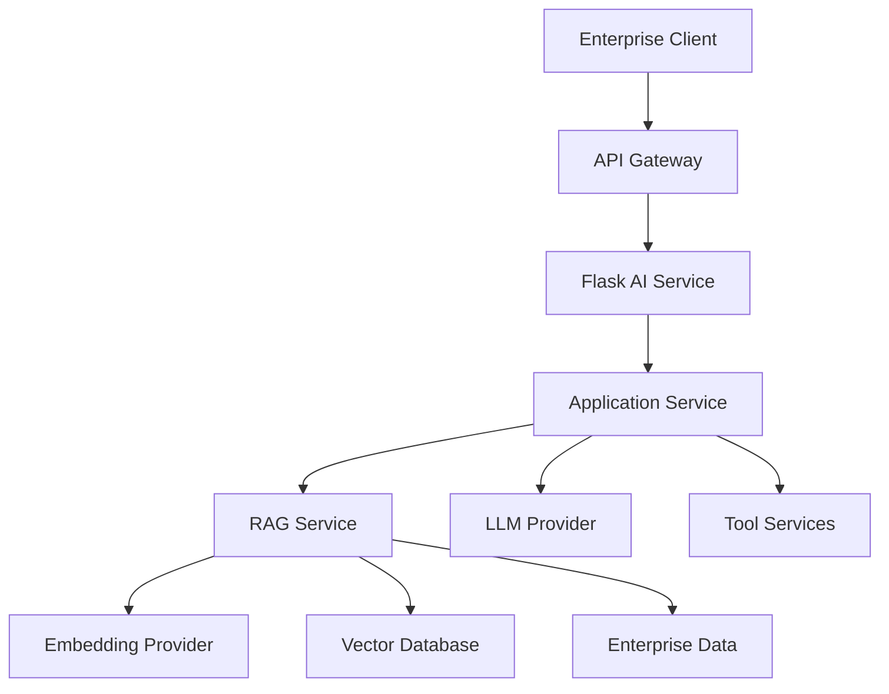

Flask should generally remain at the API boundary.

Business and AI capabilities should remain behind application services.

---

# 4. Installing Flask

Install Flask:

```bash
pip install flask
```

Verify:

```bash
python -c "import flask; print(flask.__version__)"
```

A typical AI API may also require:

```text
Flask
LLM SDK
Embedding SDK
Vector Database Client
Pydantic
Gunicorn
```

The exact dependencies depend on the implementation.

---

# 5. Project Structure

A simple AI API can start with:

```text
ai-flask-service/
│
├── app.py
├── requirements.txt
├── README.md
│
└── src/
    ├── services/
    │   ├── llm_service.py
    │   └── rag_service.py
    │
    ├── ports/
    │   ├── llm_provider.py
    │   ├── embedding_provider.py
    │   └── vector_store.py
    │
    └── adapters/
        ├── llm/
        ├── embeddings/
        └── vectorstores/
```

The important separation is:

```text
HTTP Layer
    ↓
Application Layer
    ↓
AI Capability Layer
    ↓
Infrastructure Adapters
```

---

# 6. Your First Flask API

A minimal Flask application:

```python
from flask import Flask, jsonify

app = Flask(__name__)


@app.get("/health")
def health():

    return jsonify({
        "status": "UP"
    })


if __name__ == "__main__":
    app.run()
```

The endpoint:

```http
GET /health
```

returns:

```json
{
  "status": "UP"
}
```

---

# 7. Flask Request Lifecycle

An AI API request can be visualized as:

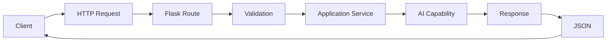

The Flask route should remain thin.

---

# 8. Creating an AI Endpoint

Suppose we have:

```python
def answer_question(question):

    return rag_service.answer(
        question
    )
```

We can expose it through:

```python
from flask import Flask, request, jsonify

app = Flask(__name__)


@app.post("/api/v1/ask")
def ask():

    data = request.get_json()

    question = data["question"]

    answer = answer_question(
        question
    )

    return jsonify({
        "answer": answer
    })
```

The API can now receive:

```json
{
  "question": "What is our leave policy?"
}
```

---

# 9. Why Use JSON?

AI APIs commonly use JSON because it provides a language-neutral interface.

A client could be:

```text
Java
Python
JavaScript
Go
C#
Mobile Application
Another Microservice
```

All can communicate with:

```http
POST /api/v1/ask
Content-Type: application/json
```

---

# 10. Designing the Request Contract

Instead of accepting arbitrary fields:

```json
{
  "anything": "..."
}
```

define a clear API contract.

Example:

```json
{
  "question": "What is our leave policy?",
  "conversation_id": "conv-123"
}
```

Potential fields:

```text
question
conversation_id
tenant_id
metadata
options
```

Not every field should necessarily be supplied directly by the client.

For example, authenticated identity and tenant information should normally come from trusted security context rather than arbitrary request fields.

---

# 11. Designing the Response Contract

A useful AI response can contain:

```json
{
  "answer": "Employees receive 25 days of annual leave.",
  "sources": [
    {
      "document": "employee-handbook.pdf",
      "section": "Annual Leave"
    }
  ],
  "metadata": {
    "model": "enterprise-model",
    "retrieval_count": 5
  }
}
```

This is more useful than:

```json
{
  "response": "..."
}
```

because enterprise applications often need citations and metadata.

---

# 12. Request Validation

Do not assume the client sends valid data.

Basic validation:

```python
from flask import request


def get_question():

    data = request.get_json()

    if not data:
        raise ValueError(
            "Request body is required."
        )

    question = data.get(
        "question"
    )

    if not question:
        raise ValueError(
            "Question is required."
        )

    return question
```

Production applications should use structured validation rather than relying entirely on manual checks.

---

# 13. Pydantic Request Models

Pydantic can provide explicit schemas.

```python
from pydantic import BaseModel


class AskRequest(BaseModel):

    question: str
    conversation_id: str | None = None
```

The API boundary can validate incoming data against this model.

This makes request contracts explicit.

---

# 14. Response Models

Similarly:

```python
class Source(BaseModel):

    document: str
    section: str | None = None


class AskResponse(BaseModel):

    answer: str
    sources: list[Source]
```

The application can produce a predictable structure.

---

# 15. Thin Controller Pattern

Avoid putting the entire RAG pipeline in the Flask route.

Bad:

```python
@app.post("/api/v1/ask")
def ask():

    # Load embedding model
    # Create embedding
    # Search vector DB
    # Build prompt
    # Call LLM
    # Parse response
    # Format citations
    # Return response
```

Prefer:

```python
@app.post("/api/v1/ask")
def ask():

    request_data = parse_request()

    result = ai_service.answer(
        request_data
    )

    return jsonify(
        result
    )
```

The route is responsible for HTTP concerns.

The application service is responsible for AI behavior.

---

# 16. Application Service

```python
class AIService:

    def __init__(
        self,
        rag_service
    ):

        self.rag_service = rag_service

    def answer(
        self,
        request
    ):

        return self.rag_service.answer(
            question=request.question,
            conversation_id=request.conversation_id
        )
```

The dependency flow becomes:

```text
Flask Controller
       ↓
AIService
       ↓
RagService
       ↓
Retriever + Prompt + LLM
```

---

# 17. Flask + RAG

A production-oriented RAG API can look like:

```text
POST /api/v1/rag/query
```

Request:

```json
{
  "question": "What is our parental leave policy?"
}
```

Response:

```json
{
  "answer": "Employees are eligible for...",
  "sources": [
    {
      "document": "employee-handbook.pdf",
      "page": 52
    }
  ]
}
```

---

# 18. Flask + RAG Architecture

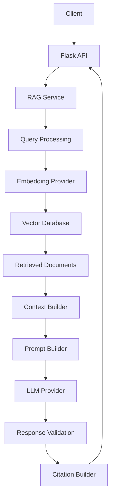

---

# 19. RAG Service Example

```python
class RagService:

    def __init__(
        self,
        retriever,
        prompt_builder,
        llm_provider
    ):

        self.retriever = retriever
        self.prompt_builder = prompt_builder
        self.llm_provider = llm_provider

    def answer(
        self,
        question
    ):

        documents = (
            self.retriever.retrieve(
                question
            )
        )

        context = "\n\n".join(
            document.content
            for document in documents
        )

        prompt = (
            self.prompt_builder.build(
                question=question,
                context=context
            )
        )

        response = (
            self.llm_provider.generate(
                prompt
            )
        )

        return {
            "answer": response,
            "sources": [
                document.metadata
                for document in documents
            ]
        }
```

The Flask API does not need to know how retrieval or generation works.

---

# 20. Capability-Based Interfaces

A provider abstraction can be used:

```python
from abc import ABC, abstractmethod


class LLMProvider(ABC):

    @abstractmethod
    def generate(
        self,
        prompt: str
    ):
        pass
```

Implementations can include:

```text
OpenAILLMProvider
AnthropicLLMProvider
WatsonXLLMProvider
GoogleLLMProvider
HuggingFaceLLMProvider
```

The Flask service depends on:

```text
LLMProvider
```

rather than a specific SDK.

---

# 21. Embedding Provider

Similarly:

```python
class EmbeddingProvider(ABC):

    @abstractmethod
    def embed_query(
        self,
        text: str
    ):
        pass

    @abstractmethod
    def embed_documents(
        self,
        documents: list[str]
    ):
        pass
```

This keeps the RAG service provider-independent.

---

# 22. Vector Store Interface

```python
class VectorStore(ABC):

    @abstractmethod
    def search(
        self,
        vector,
        top_k: int
    ):
        pass
```

Possible implementations:

```text
Qdrant
pgvector
Chroma
Milvus
Elasticsearch
```

The application depends on the capability rather than the database vendor.

---

# 23. Ports & Adapters Architecture

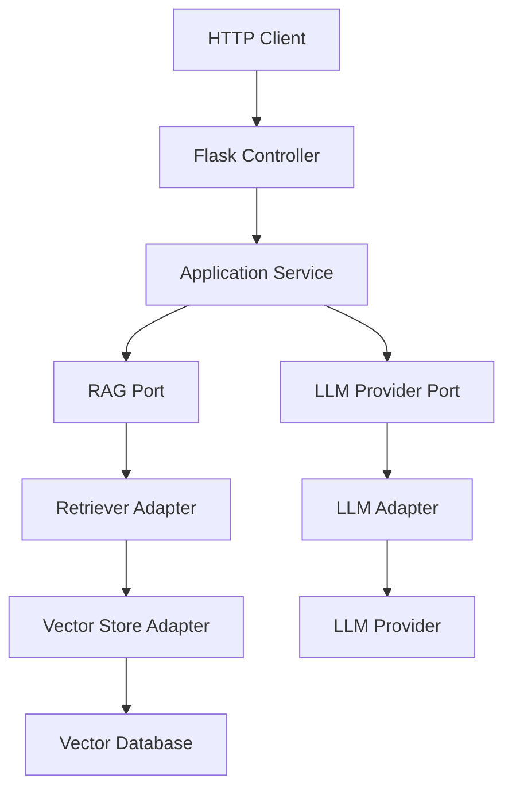

This makes the Flask API an adapter at the application boundary.

---

# 24. Flask Blueprint

As applications grow, routes can be organized using Blueprints.

Example:

```python
from flask import Blueprint

ai_api = Blueprint(
    "ai_api",
    __name__,
    url_prefix="/api/v1"
)
```

Then:

```python
@ai_api.post("/ask")
def ask():

    ...
```

The application can register the blueprint:

```python
app.register_blueprint(
    ai_api
)
```

This helps organize APIs by capability.

---

# 25. Capability-Based API Structure

A larger AI service might have:

```text
/api/v1/
│
├── /chat
├── /rag
├── /embeddings
├── /documents
├── /models
└── /health
```

Not every application needs all of these endpoints.

API boundaries should reflect actual capabilities.

---

# 26. API Versioning

Use versioned APIs:

```text
/api/v1/ask
```

rather than:

```text
/api/ask
```

When breaking changes are required:

```text
/api/v1/ask
/api/v2/ask
```

This helps clients migrate independently.

---

# 27. Chat API

A conversational API could be:

```http
POST /api/v1/chat
```

Request:

```json
{
  "message": "Can I carry unused leave forward?",
  "conversation_id": "conv-123"
}
```

Response:

```json
{
  "message": "Unused leave may be carried forward according to company policy.",
  "conversation_id": "conv-123",
  "sources": []
}
```

The conversation state should be managed by the application rather than relying solely on Flask process memory.

---

# 28. Conversation Architecture

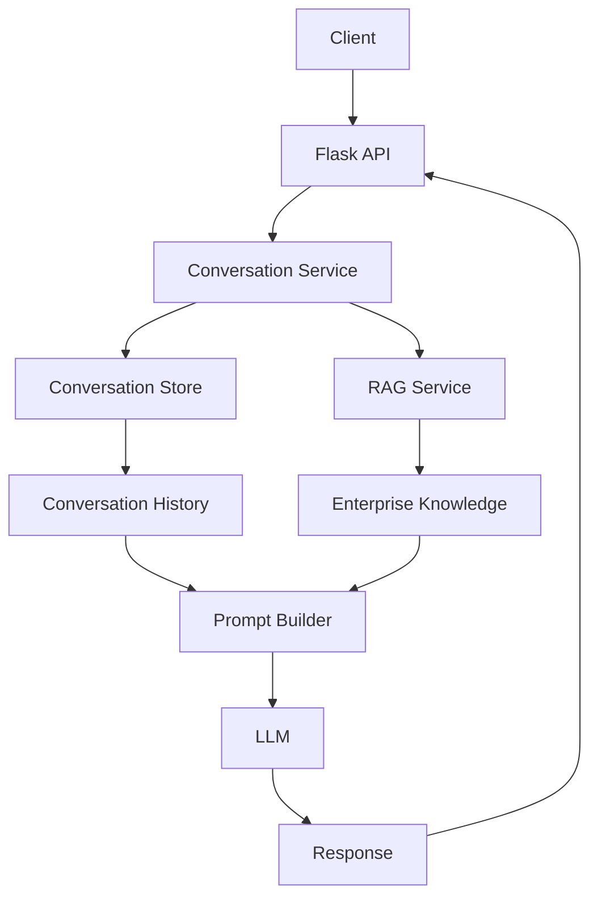

---

# 29. File Upload API

Document-based AI applications may expose:

```http
POST /api/v1/documents
```

The flow:

```text
Client
 ↓
Flask
 ↓
Upload Validation
 ↓
Object Storage
 ↓
Message Queue
 ↓
Document Processing
 ↓
Chunking
 ↓
Embedding
 ↓
Vector Store
```

Document ingestion should generally be asynchronous for large workloads.

---

# 30. File Upload Example

```python
from flask import request, jsonify


@app.post("/api/v1/documents")
def upload_document():

    file = request.files.get(
        "file"
    )

    if not file:
        return jsonify({
            "error": "File is required"
        }), 400

    document_id = (
        document_service.submit(
            file
        )
    )

    return jsonify({
        "document_id": document_id,
        "status": "ACCEPTED"
    }), 202
```

The `202 Accepted` response communicates that processing may continue asynchronously.

---

# 31. Asynchronous AI Processing

For expensive operations:

```text
HTTP Request
      ↓
Flask
      ↓
Queue
      ↓
Worker
      ↓
AI Processing
```

This is preferable to keeping an HTTP request open for long-running work.

---

# 32. Streaming LLM Responses

Some AI applications need incremental output.

```text
Client
  ↓
Flask
  ↓
LLM
  ↓
Token Stream
  ↓
Client
```

A streaming response can be produced using Flask's response streaming mechanisms.

Conceptually:

```python
from flask import Response


@app.post("/api/v1/chat/stream")
def chat_stream():

    def generate():

        for token in llm.stream(
            request.json["message"]
        ):

            yield token

    return Response(
        generate(),
        mimetype="text/plain"
    )
```

For production systems, the streaming protocol and response format should be explicitly designed.

---

# 33. Server-Sent Events

For browser-friendly streaming, Server-Sent Events can be considered.

Conceptually:

```text
Client
  ↓
HTTP Connection
  ↓
SSE Stream
  ↓
Token 1
Token 2
Token 3
...
```

An application may return:

```text
text/event-stream
```

with structured events.

---

# 34. Streaming vs Standard JSON

### Standard

```http
POST /api/v1/chat
```

```json
{
  "answer": "Complete answer..."
}
```

### Streaming

```http
POST /api/v1/chat/stream
```

```text
data: {"token":"Employees"}

data: {"token":" receive"}

data: {"token":" ..."}
```

Use streaming when perceived latency and conversational UX justify the added complexity.

---

# 35. Error Handling

AI applications can fail at multiple layers:

```text
Validation
Authentication
Authorization
Retriever
Vector Database
Embedding Provider
LLM Provider
Network
Timeout
Rate Limit
```

The API should return consistent errors.

Example:

```json
{
  "error": {
    "code": "MODEL_TIMEOUT",
    "message": "The AI service timed out.",
    "request_id": "req-123"
  }
}
```

---

# 36. HTTP Status Codes

Useful status codes include:

```text
200 → Successful request

201 → Resource created

202 → Accepted for asynchronous processing

400 → Invalid request

401 → Unauthenticated

403 → Unauthorized

404 → Resource not found

409 → Conflict

429 → Rate limited

500 → Internal server error

502 → Upstream provider failure

503 → Service unavailable

504 → Upstream timeout
```

The exact mapping should be consistent across the API.

---

# 37. Centralized Error Handling

Flask allows error handlers.

Example:

```python
@app.errorhandler(
    ValueError
)
def handle_value_error(error):

    return jsonify({
        "error": {
            "code": "INVALID_REQUEST",
            "message": str(error)
        }
    }), 400
```

A production application should define a consistent error model.

---

# 38. Request IDs

Every request should ideally have a correlation identifier.

```text
Client
 ↓
X-Request-ID
 ↓
Flask
 ↓
RAG
 ↓
Vector DB
 ↓
LLM
```

Example:

```text
req-8f72a1
```

This makes troubleshooting distributed AI requests much easier.

---

# 39. Observability

Track:

```text
Request Count
Error Rate
Latency
P50
P95
P99
Token Usage
LLM Latency
Retrieval Latency
Vector DB Latency
```

For RAG:

```text
Top-K
Retrieved Documents
Similarity Scores
Empty Retrieval Rate
Groundedness
Citation Accuracy
```

---

# 40. AI Request Trace

A useful trace:

```text
Request
 │
 ├── Authentication       4 ms
 │
 ├── Query Embedding     25 ms
 │
 ├── Vector Search       18 ms
 │
 ├── Prompt Construction  2 ms
 │
 ├── LLM Generation    820 ms
 │
 └── Response Validation  5 ms
```

Total latency:

```text
874 ms
```

This allows bottlenecks to be identified.

---

# 41. Logging

Example structured log:

```json
{
  "request_id": "req-123",
  "endpoint": "/api/v1/rag/query",
  "model": "enterprise-model",
  "retrieval_count": 5,
  "input_tokens": 920,
  "output_tokens": 140,
  "latency_ms": 1040
}
```

Do not log sensitive content without an explicit security and compliance strategy.

---

# 42. Authentication

A production AI API may integrate with:

```text
OAuth 2.0
OpenID Connect
JWT
Enterprise SSO
API Gateway
Identity Provider
```

The Flask application should receive trusted identity information from the authentication layer.

---

# 43. Authorization

Authentication answers:

```text
Who are you?
```

Authorization answers:

```text
What are you allowed to access?
```

For RAG:

```text
User Identity
      ↓
Authorization Policy
      ↓
Allowed Documents
      ↓
Retriever
      ↓
LLM
```

Unauthorized information should never be sent to the model.

---

# 44. Multi-Tenant AI APIs

A multi-tenant service may receive requests from:

```text
Tenant A
Tenant B
Tenant C
```

Data must remain isolated.

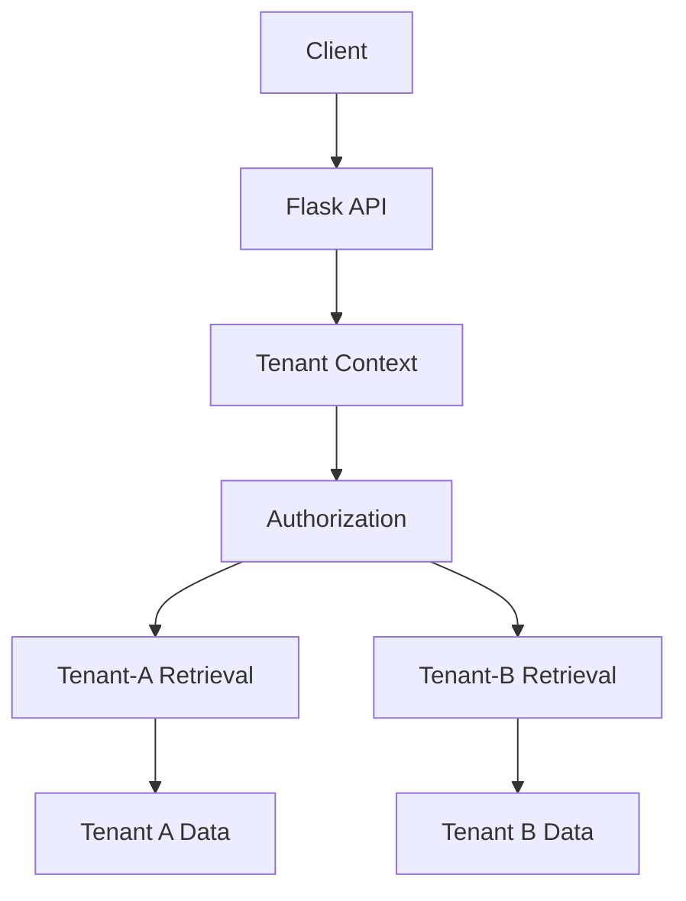

Tenant identity should come from trusted authentication context rather than an unverified request parameter.

---

# 45. Rate Limiting

AI APIs can be expensive.

Rate limiting can protect:

```text
LLM Quotas
System Capacity
Budget
Availability
```

Possible limits:

```text
Requests / Minute
Tokens / Minute
Requests / User
Requests / Tenant
```

A gateway or dedicated rate-limiting infrastructure can be preferable at enterprise scale.

---

# 46. Timeouts

AI requests may involve multiple dependencies.

```text
Flask
 ↓
Retriever
 ↓
Embedding
 ↓
Vector DB
 ↓
LLM
```

Each dependency should have an appropriate timeout.

Avoid requests that wait indefinitely for an upstream model.

---

# 47. Retry Strategy

Retries can be useful for transient failures.

However:

```text
LLM Failure
 ↓
Retry
 ↓
Retry
 ↓
Retry
```

can increase:

```text
Latency
Cost
Provider Load
```

Use bounded retries and distinguish transient errors from permanent errors.

---

# 48. Circuit Breaker Concept

When an upstream provider repeatedly fails:

```text
Flask
 ↓
LLM Provider
 ↓
Failures
```

a circuit breaker can temporarily stop sending requests.

```text
Closed
  ↓
Failures
  ↓
Open
  ↓
Temporary Recovery Period
  ↓
Half-Open
```

This prevents cascading failures.

---

# 49. Model Gateway

Flask can call a centralized model gateway:

```text
Flask AI Service
       ↓
Model Gateway
       ↓
 ┌─────┼─────────┐
 ↓     ↓         ↓
LLM A  LLM B    LLM C
```

The gateway can provide:

```text
Provider Abstraction
Model Routing
Fallback
Usage Tracking
Rate Limiting
Cost Tracking
```

This is particularly useful when multiple applications consume AI models.

---

# 50. Flask + Model Gateway

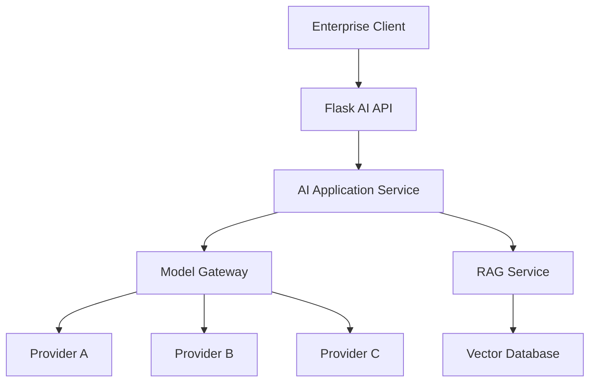

---

# 51. Configuration Management

Separate:

```text
Application Code
Configuration
Secrets
```

Example:

```text
FLASK_ENV
LLM_MODEL
VECTOR_STORE
RAG_TOP_K
LOG_LEVEL
```

Secrets:

```text
API Keys
Database Passwords
Signing Keys
OAuth Credentials
```

should be managed separately.

---

# 52. Environment Variables

Example:

```python
import os


MODEL_NAME = os.getenv(
    "LLM_MODEL",
    "default-model"
)

TOP_K = int(
    os.getenv(
        "RAG_TOP_K",
        "5"
    )
)
```

This allows the same application code to run across:

```text
Development
Staging
Production
```

---

# 53. Secrets

Never:

```python
API_KEY = "secret-value"
```

Prefer:

```python
API_KEY = os.environ[
    "LLM_API_KEY"
]
```

In production, use managed secret storage where possible.

---

# 54. Health Endpoints

A basic endpoint:

```http
GET /health
```

can return:

```json
{
  "status": "UP"
}
```

A readiness endpoint can provide a different purpose:

```http
GET /ready
```

For example:

```text
Application Started?
Dependencies Available?
Ready to Receive Traffic?
```

---

# 55. Liveness vs Readiness

### Liveness

```text
Is the process alive?
```

### Readiness

```text
Can the service currently handle traffic?
```

This distinction is important when deploying Flask applications on container orchestration platforms.

---

# 56. API Documentation

Enterprise APIs should have explicit contracts.

Useful approaches include:

```text
OpenAPI
Swagger UI
API Schemas
Versioned API Documentation
```

Document:

```text
Endpoints
Request Models
Response Models
Errors
Authentication
Examples
```

---

# 57. Example API Contract

```yaml
POST /api/v1/rag/query

Request:
  question: string
  conversation_id: string

Response:
  answer: string
  sources:
    - document: string
      page: integer
```

A formal OpenAPI definition can be generated or maintained for the service.

---

# 58. Testing the Flask AI API

Test at multiple levels.

```text
Unit Tests
     ↓
Service Tests
     ↓
API Tests
     ↓
Integration Tests
     ↓
AI Evaluation
```

Each tests something different.

---

# 59. Unit Testing

Example:

```python
def test_question_validation():

    with pytest.raises(
        ValueError
    ):

        validate_question("")
```

Unit tests should not require an actual LLM provider.

---

# 60. Mocking the LLM

Instead of calling a real model:

```python
mock_llm.generate.return_value = (
    "Test response"
)
```

This makes tests:

```text
Fast
Deterministic
Cheap
Repeatable
```

---

# 61. API Testing

Example:

```python
def test_health(client):

    response = client.get(
        "/health"
    )

    assert response.status_code == 200
```

For an AI endpoint:

```python
def test_ask(client):

    response = client.post(
        "/api/v1/ask",
        json={
            "question": "What is RAG?"
        }
    )

    assert response.status_code == 200
```

---

# 62. Integration Testing

Integration tests can verify:

```text
Flask
 ↓
RAG Service
 ↓
Vector Store
 ↓
LLM Adapter
```

Use test doubles or controlled test infrastructure where appropriate.

---

# 63. AI Evaluation

API tests only prove that the endpoint works.

They do not prove that the AI answer is good.

Therefore:

```text
API Tests
+
RAG Evaluation
+
LLM Evaluation
```

are all required for production AI systems.

Possible metrics:

```text
Answer Correctness
Groundedness
Citation Accuracy
Retrieval Recall
Retrieval Precision
Latency
Cost
```

---

# 64. Flask + LangChain

Flask can expose a LangChain pipeline:

```text
Client
 ↓
Flask
 ↓
LangChain Chain
 ↓
Retriever
 ↓
LLM
```

Example:

```python
@app.post("/api/v1/ask")
def ask():

    question = (
        request.json["question"]
    )

    result = chain.invoke({
        "question": question
    })

    return jsonify({
        "answer": result
    })
```

LangChain remains inside the application layer.

---

# 65. Flask + LlamaIndex

Similarly:

```text
Client
 ↓
Flask
 ↓
LlamaIndex Query Engine
 ↓
Retriever
 ↓
LLM
```

Example:

```python
@app.post("/api/v1/query")
def query():

    question = (
        request.json["question"]
    )

    response = (
        query_engine.query(
            question
        )
    )

    return jsonify({
        "answer": str(response)
    })
```

The framework is an implementation detail of the AI service.

---

# 66. Framework-Agnostic Architecture

A stronger architecture is:

```text
Flask
  ↓
Application Service
  ↓
RAG Capability
  ↓
Ports
  ↓
Adapters
```

LangChain and LlamaIndex can be introduced behind those boundaries where appropriate.

This prevents the web framework and AI framework from becoming inseparably coupled.

---

# 67. Flask + Gradio

The two technologies can coexist.

```text
                 AI Services
                     │
             ┌───────┴───────┐
             ↓               ↓
          Gradio           Flask
             ↓               ↓
        Human UI          REST API
```

For example:

```text
AI Engineering Team
       ↓
    Gradio
       ↓
   AI Service

Enterprise Application
       ↓
      Flask
       ↓
   AI Service
```

This provides different access patterns to the same capabilities.

---

# 68. Flask + React

A common architecture:

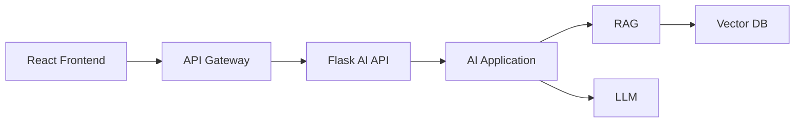

The frontend handles:

```text
User Experience
Navigation
Authentication Flow
Presentation
```

Flask handles:

```text
API
AI Orchestration
Validation
Business Integration
```

---

# 69. Flask + Spring Boot

In a Java-first enterprise environment, Flask can provide specialized Python AI capabilities.

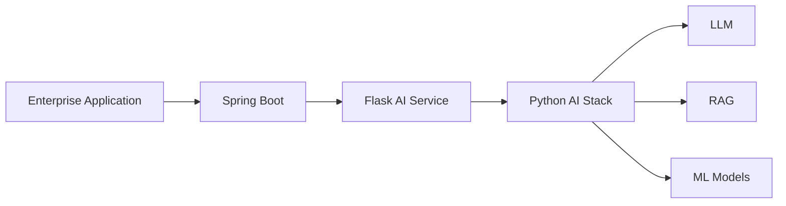

This can be useful when:

```text
Enterprise backend = Java
AI implementation = Python
```

However, adding a Python service should be justified by actual AI/ML requirements rather than technology preference alone.

---

# 70. Flask as an AI Microservice

A Flask service might expose:

```text
POST /api/v1/rag/query
POST /api/v1/chat
POST /api/v1/embeddings
POST /api/v1/documents
GET  /health
GET  /ready
```

The service boundary should be capability-driven.

Avoid creating a separate microservice for every small AI function without a clear operational reason.

---

# 71. Containerizing Flask

A simple Dockerfile:

```dockerfile
FROM python:3.12-slim

WORKDIR /app

COPY requirements.txt .

RUN pip install --no-cache-dir \
    -r requirements.txt

COPY . .

EXPOSE 8000

CMD [
    "gunicorn",
    "--bind",
    "0.0.0.0:8000",
    "app:app"
]
```

The exact Python version and dependencies should be selected based on compatibility testing.

---

# 72. Development Server vs Production Server

The Flask development server is useful for:

```text
Local Development
Testing
Debugging
```

It should not automatically be treated as the production serving architecture.

For production, use a production-capable WSGI server such as:

```text
Gunicorn
```

or another suitable deployment architecture.

---

# 73. Gunicorn

A typical command:

```bash
gunicorn \
  --bind 0.0.0.0:8000 \
  app:app
```

The structure:

```text
Gunicorn
   ↓
Flask Application
   ↓
AI Service
```

Worker configuration should be based on:

```text
CPU
Memory
Request Type
Concurrency
AI Backend Behavior
```

---

# 74. AI Workloads and Worker Design

Traditional Flask applications may use multiple workers to handle concurrent requests.

AI applications require additional consideration because:

```text
Models can consume significant memory.
LLM calls may be network-bound.
Local inference can be CPU/GPU-bound.
Large models may not fit in every worker.
```

Therefore blindly increasing worker count can increase resource consumption.

---

# 75. Container Architecture

```text
                 Load Balancer
                      ↓
                Flask Service
               /      |      \
              ↓       ↓       ↓
           Worker   Worker   Worker
              │       │       │
              └───────┼───────┘
                      ↓
                 AI Services
```

If model inference occurs inside each worker:

```text
Worker × Model Memory
```

must be considered.

For external model providers, the resource model is different.

---

# 76. Kubernetes Deployment

A containerized Flask AI service can run behind:

```text
Ingress
   ↓
Service
   ↓
Pods
```

Example:

```text
                    Ingress
                       ↓
                    Service
                       ↓
            ┌──────────┼──────────┐
            ↓          ↓          ↓
          Pod 1      Pod 2      Pod 3
            │          │          │
            └──────────┼──────────┘
                       ↓
                  AI Services
```

Cloud-specific deployment is covered separately in cloud-focused parts of the handbook.

---

# 77. Horizontal Scaling

Flask application instances should ideally be stateless.

```text
Client
  ↓
Load Balancer
  ↓
 ┌─────┬─────┬─────┐
 ↓     ↓     ↓
API-1 API-2 API-3
```

Shared state belongs in external systems:

```text
Database
Vector Store
Cache
Object Storage
Conversation Store
```

---

# 78. Caching

AI responses may sometimes be cacheable.

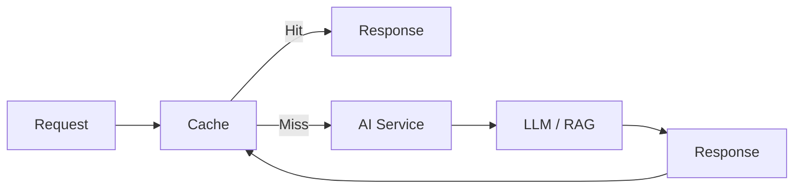

Caching must consider:

```text
User
Tenant
Authorization
Prompt Version
Model Version
Knowledge Version
```

Never share a response across incompatible authorization contexts.

---

# 79. Cost Management

AI APIs introduce cost dimensions such as:

```text
LLM Tokens
Embedding Tokens
Model Hosting
Vector Database
Storage
Network
Observability
```

Track usage by:

```text
Request
User
Application
Tenant
Model
```

Example:

```json
{
  "request_id": "req-123",
  "model": "model-x",
  "input_tokens": 1200,
  "output_tokens": 180,
  "estimated_cost": 0.004
}
```

---

# 80. Security Checklist

Before exposing a Flask AI API:

```text
[ ] Authentication configured

[ ] Authorization implemented

[ ] Tenant isolation considered

[ ] Input validation enabled

[ ] File upload validation enabled

[ ] Rate limiting configured

[ ] Secrets stored securely

[ ] TLS enabled

[ ] Sensitive logging reviewed

[ ] Prompt injection risks considered

[ ] Dependency vulnerabilities scanned

[ ] Network exposure reviewed
```

---

# 81. Performance Checklist

```text
[ ] Model initialization strategy defined

[ ] LLM latency measured

[ ] Retrieval latency measured

[ ] Embedding latency measured

[ ] Timeouts configured

[ ] Retry policy defined

[ ] Concurrency tested

[ ] Worker count tested

[ ] Context size controlled

[ ] Token usage measured

[ ] Caching evaluated

[ ] P95 latency monitored
```

---

# 82. API Design Checklist

```text
[ ] REST endpoints defined

[ ] API versioning defined

[ ] Request schemas defined

[ ] Response schemas defined

[ ] Error contract defined

[ ] Authentication defined

[ ] Authorization defined

[ ] Request IDs supported

[ ] Health endpoints implemented

[ ] API documentation maintained
```

---

# 83. Deployment Checklist

```text
[ ] requirements.txt created

[ ] Dockerfile created if required

[ ] Production WSGI server configured

[ ] Environment configuration separated

[ ] Secrets configured

[ ] Health checks configured

[ ] Logging configured

[ ] Monitoring configured

[ ] Scaling strategy defined

[ ] Rollback strategy defined

[ ] Dependency failures tested
```

---

# 84. Common Mistakes

## 84.1 Putting the RAG Pipeline in the Route

Avoid:

```python
@app.post("/ask")
def ask():

    # Everything happens here
```

Prefer:

```text
Route
 ↓
Application Service
 ↓
RAG
```

---

## 84.2 Using Global Mutable State

Avoid storing:

```text
Conversation State
User State
Tenant State
```

in process memory when the service needs to scale horizontally.

---

## 84.3 Loading Models Per Request

Avoid:

```python
@app.post("/predict")
def predict():

    model = load_model()

    ...
```

Prefer initialization during application startup where appropriate.

---

## 84.4 Hard-Coding API Keys

Never:

```python
API_KEY = "secret"
```

Use environment variables or managed secrets.

---

## 84.5 Exposing Internal Exceptions

Avoid returning:

```text
Traceback
Internal provider details
Secrets
Stack traces
```

to clients.

---

## 84.6 Blind Retries

Repeated LLM retries can increase:

```text
Cost
Latency
Load
```

Use bounded retry policies.

---

## 84.7 Treating Flask as the Entire Architecture

Flask is:

```text
Web / API Layer
```

It is not:

```text
Security Platform
Model Gateway
Vector Database
Evaluation Platform
Observability Platform
```

Those capabilities need appropriate architecture around the service.

---

# 85. Flask vs Gradio vs Enterprise Backend

```text
                    Primary Role

Gradio
  ↓
Interactive AI UI
Prototype
AI Workbench

Flask
  ↓
Python AI API
AI Microservice
REST Integration

Enterprise Backend
  ↓
Business Application
Authentication
Authorization
Transactions
Enterprise Integration
```

They can coexist.

---

# 86. Choosing the Right Pattern

### AI Prototype

```text
Python
 ↓
Gradio
```

### AI API

```text
Client
 ↓
Flask
 ↓
AI Service
```

### Enterprise Product

```text
React
 ↓
API Gateway
 ↓
Enterprise Backend
 ↓
AI Service
```

### Python AI Microservice

```text
Enterprise Backend
 ↓
Flask
 ↓
Python AI Stack
```

---

# 87. Flask + Gradio Combined Architecture

A development platform could expose both:

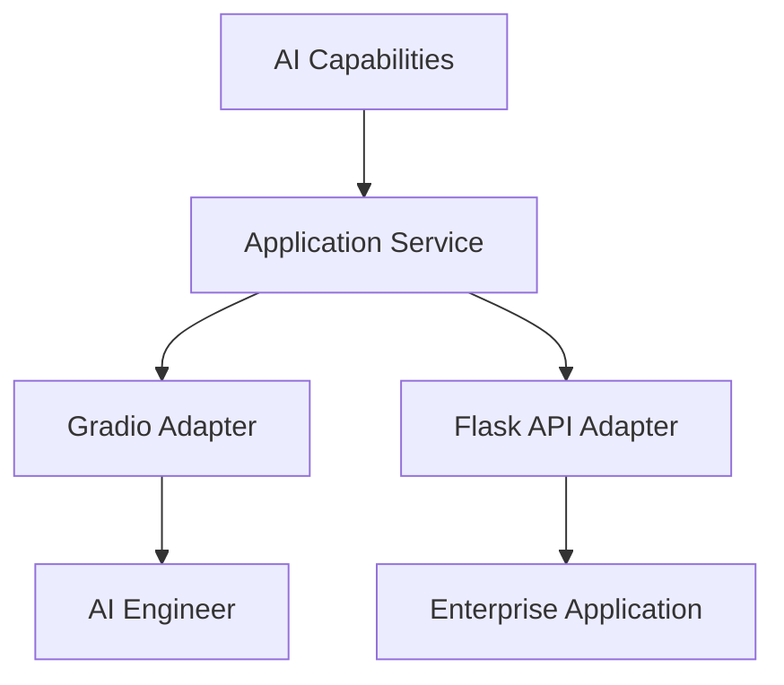

This keeps the AI capabilities reusable.

---

# 88. Production-Oriented Flask Architecture

A strong structure is:

```text
                    Clients
                       ↓
                 API Gateway
                       ↓
                  Flask API
                       ↓
               Application Layer
                       ↓
             AI Capability Layer
          ┌────────────┼────────────┐
          ↓            ↓            ↓
        RAG           LLM          Tools
          ↓            ↓
     Vector Store   Model Gateway
          ↓            ↓
    Enterprise Data  LLM Providers

             ┌───────────────────┐
             │ Platform          │
             │ Security         │
             │ Observability    │
             │ Evaluation       │
             │ Cost Management  │
             └───────────────────┘
```

---

# 89. End-to-End RAG API Request

Consider:

```text
"What is our parental leave policy?"
```

The request lifecycle:

```text
1. Client sends HTTP request.

2. API Gateway authenticates the request.

3. Flask receives the request.

4. Request schema is validated.

5. User identity is extracted.

6. Authorization context is established.

7. RAG Service receives the question.

8. Query embedding is generated.

9. Vector search is performed.

10. Authorization filters are applied.

11. Retrieved context is constructed.

12. Prompt is generated.

13. LLM is selected.

14. LLM generates the answer.

15. Response is validated.

16. Citations are attached.

17. Telemetry is recorded.

18. Flask returns the response.
```

---

# 90. Complete Architecture

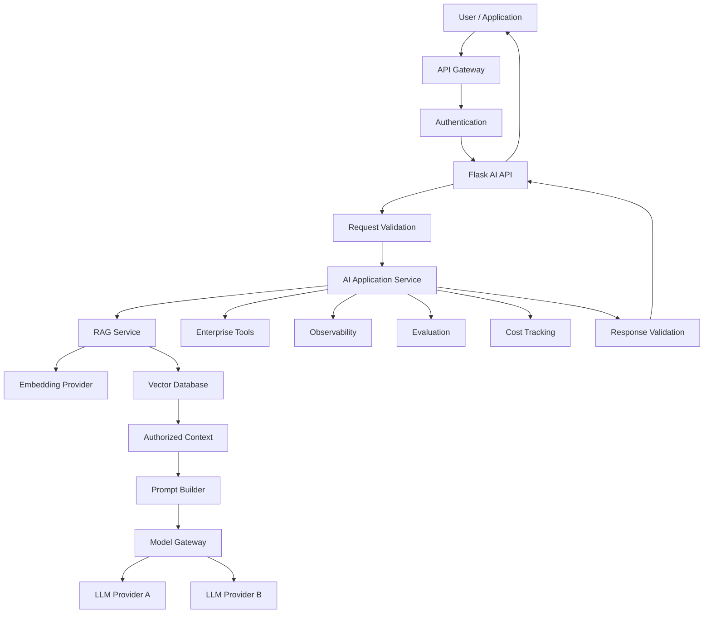

---

# 91. Architecture Principles

### Principle 1 — Keep Routes Thin

HTTP concerns belong in the Flask layer.

### Principle 2 — Separate AI Logic

RAG and model orchestration belong in application services.

### Principle 3 — Use Capability Interfaces

Depend on:

```text
LLMProvider
EmbeddingProvider
VectorStore
```

rather than specific vendors.

### Principle 4 — Keep State External

Use:

```text
Database
Cache
Vector Store
Object Storage
```

rather than process memory for scalable application state.

### Principle 5 — Secure Before Generation

Unauthorized data should never reach the model.

### Principle 6 — Observe the Complete Request

Measure:

```text
API
Retrieval
Model
Cost
Quality
```

### Principle 7 — Design for Failure

Expect:

```text
Timeouts
Provider Failures
Rate Limits
Network Failures
Invalid Responses
```

### Principle 8 — Start Simple

A small Flask AI service can evolve into a larger platform when justified.

---

# 92. Flask AI Service Maturity

A useful progression:

```text
Level 1
Simple Flask Endpoint
        ↓
Level 2
LLM API
        ↓
Level 3
RAG API
        ↓
Level 4
RAG + Validation + Observability
        ↓
Level 5
Authentication + Authorization
        ↓
Level 6
Containerized AI Microservice
        ↓
Level 7
Enterprise AI Platform Integration
```

This progression mirrors the evolution from prototype to production.

---

# 93. Portfolio Project

A strong portfolio project could be:

```text
Enterprise RAG API
```

Architecture:

```text
React / Postman
       ↓
Flask REST API
       ↓
RAG Service
 ┌─────┼─────────┐
 ↓     ↓         ↓
Embed Retriever LLM
       ↓
   Vector DB
       ↓
Enterprise Documents
```

Add:

```text
Docker
OpenAPI
Authentication
Observability
Evaluation
Tests
CI/CD
```

to demonstrate production-oriented engineering.

---

# 94. Suggested Project Structure

```text
enterprise-rag-api/
│
├── app.py
├── requirements.txt
├── Dockerfile
├── README.md
│
├── src/
│   ├── api/
│   │   ├── routes.py
│   │   └── schemas.py
│   │
│   ├── services/
│   │   ├── ai_service.py
│   │   └── rag_service.py
│   │
│   ├── ports/
│   │   ├── llm_provider.py
│   │   ├── embedding_provider.py
│   │   └── vector_store.py
│   │
│   └── adapters/
│       ├── llm/
│       ├── embeddings/
│       └── vectorstores/
│
├── tests/
│   ├── unit/
│   └── integration/
│
└── evaluation/
    └── datasets/
```

This demonstrates clear separation of concerns.

---

# 95. Flask and the Enterprise AI Engineering Roadmap

This chapter connects several concepts from Part IV:

```text
Prompt Engineering
       ↓
Embeddings
       ↓
Vector Databases
       ↓
Retrieval
       ↓
RAG
       ↓
Evaluation
       ↓
Enterprise Architecture
       ↓
Flask API
       ↓
Deployment
```

The chapter therefore serves as a practical bridge from:

```text
AI Concepts
```

to:

```text
AI Services
```

---

# 96. Gradio → Flask → Enterprise Application

The two deployment chapters form a useful progression:

```text
21 — Gradio

AI Capability
     ↓
Interactive UI
     ↓
Prototype / Workbench
```

followed by:

```text
22 — Flask

AI Capability
     ↓
REST API
     ↓
Backend Service
     ↓
Enterprise Integration
```

Together:

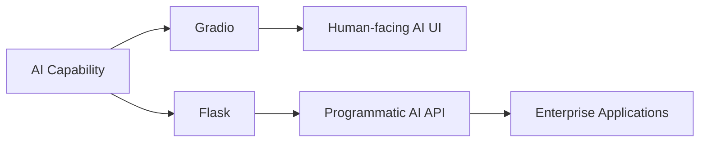

---

# 97. What Flask Does Not Replace

Flask does not replace:

```text
API Gateway
Identity Provider
Vector Database
Model Gateway
Message Queue
Object Storage
Observability Platform
Evaluation Platform
Secrets Manager
Container Platform
```

Instead:

```text
Flask
```

is one component inside the larger architecture.

---

# 98. Production Readiness Checklist

Before considering a Flask AI API production-ready:

```text
[ ] API contract defined

[ ] API versioning defined

[ ] Request validation implemented

[ ] Response schema defined

[ ] Error contract defined

[ ] Authentication implemented

[ ] Authorization implemented

[ ] Tenant isolation considered

[ ] Secrets managed securely

[ ] Rate limiting configured

[ ] Timeouts configured

[ ] Retry strategy defined

[ ] Circuit breaker considered

[ ] Request IDs implemented

[ ] Structured logging implemented

[ ] Metrics implemented

[ ] Distributed tracing considered

[ ] AI evaluation implemented

[ ] Cost tracking implemented

[ ] Health endpoints implemented

[ ] Production WSGI server configured

[ ] Container image tested

[ ] Scaling strategy defined

[ ] Backup / recovery strategy defined

[ ] Security testing completed
```

---

# 99. Key Takeaways

- Flask can expose Python-based AI capabilities through REST APIs.
- Flask is particularly useful when an AI capability needs to be consumed programmatically.
- Gradio and Flask serve different purposes and can coexist.
- Gradio is primarily useful for interactive AI interfaces, prototypes, and workbenches.
- Flask is useful for AI APIs, backend services, and Python-based AI microservices.
- Flask routes should remain thin.
- AI logic should live in application services.
- RAG should remain a reusable capability rather than being embedded directly inside HTTP routes.
- Request and response schemas should be explicit.
- Pydantic can be used for structured validation.
- API versioning helps evolve AI services safely.
- Blueprints can organize larger Flask APIs.
- Streaming can be useful for conversational AI applications.
- Long-running document ingestion should generally use asynchronous processing.
- Authentication and authorization should be handled as explicit architectural concerns.
- Unauthorized enterprise data must never reach the LLM.
- Multi-tenant systems require strong tenant isolation.
- Capability-based interfaces such as `LLMProvider`, `EmbeddingProvider`, and `VectorStore` reduce vendor coupling.
- Flask can integrate with LangChain and LlamaIndex without making either framework the entire architecture.
- Flask can act as a Python AI microservice behind a Java/Spring Boot enterprise application.
- Production AI APIs require more than Flask: gateways, identity, secrets, observability, evaluation, infrastructure, and governance remain important.
- The Flask development server should not be treated as the production serving architecture.
- Production deployments can use a WSGI server such as Gunicorn.
- Containerization allows Flask AI services to run consistently across environments.
- AI workloads require careful consideration of worker count, memory, model initialization, concurrency, and upstream model latency.
- Stateless Flask services are easier to scale horizontally.
- AI quality must be evaluated separately from API availability.
- Cost and token usage should be tracked as first-class production metrics.
- A well-designed Flask AI service can provide a clean boundary between enterprise applications and Python-based AI capabilities.

The central principle is:

> **Flask turns Python-based AI capabilities into consumable application services; production readiness comes from the architecture around Flask — security, validation, resilience, observability, evaluation, scalability, and well-defined AI capability boundaries.**

---

# 100. Chapter Navigation

## Part IV — Prompt Engineering & RAG Fundamentals

**Previous Chapter:** [21. Deploying AI Applications with Gradio](21-deploying-ai-applications-with-gradio.md)

**Current Chapter:** 22 — Deploying AI Applications with Flask

**Next:** Part IV Complete

### Part IV Chapters

1. [01. Introduction to Prompt Engineering](01-introduction-to-prompt-engineering.md)
2. [02. Prompt Engineering Fundamentals](02-prompt-engineering-fundamentals.md)
3. [03. Advanced Prompt Engineering](03-advanced-prompt-engineering.md)
4. [04. Prompt Design Patterns](04-prompt-design-patterns.md)
5. [05. Zero-shot, One-shot & Few-shot Prompting](05-zero-one-few-shot-prompting.md)
6. [06. Chain-of-Thought Prompting](06-chain-of-thought-prompting.md)
7. [07. ReAct Prompting](07-react-prompting.md)
8. [08. Structured Outputs & Output Parsing](08-structured-outputs-and-output-parsing.md)
9. [09. Function Calling & Tool Calling](09-function-calling-and-tool-calling.md)
10. [10. Embeddings in Practice](10-embeddings-in-practice.md)
11. [11. Document Processing & Vectorization](11-document-processing-and-vectorization.md)
12. [12. Document Chunking Strategies](12-document-chunking-strategies.md)
13. [13. Vector Database Fundamentals](13-vector-database-fundamentals.md)
14. [14. Similarity Search Techniques](14-similarity-search-techniques.md)
15. [15. RAG Pipeline Components](15-rag-pipeline-components.md)
16. [16. Retrieval and Generation Pipeline](16-retrieval-and-generation-pipeline.md)
17. [17. Vector Databases in RAG](17-vector-databases-in-rag.md)
18. [18. Building Your First RAG Pipeline](18-building-your-first-rag-pipeline.md)
19. [19. RAG Evaluation Fundamentals](19-rag-evaluation-fundamentals.md)
20. [20. Enterprise Generative AI Application Architecture](20-enterprise-generative-ai-application-architecture.md)
21. [21. Deploying AI Applications with Gradio](21-deploying-ai-applications-with-gradio.md)
22. **22. Deploying AI Applications with Flask**

---

# References

- Flask Documentation
- Flask API Documentation
- Flask Blueprints Documentation
- Flask Error Handling Documentation
- Flask Request / Response Documentation
- Pydantic Documentation
- Gunicorn Documentation
- OpenAPI Specification
- REST API Design Guidelines
- Docker Documentation
- Kubernetes Documentation
- OAuth 2.0 Documentation
- OpenID Connect Documentation
- OpenTelemetry Documentation
- LangChain Documentation
- LlamaIndex Documentation
- Retrieval-Augmented Generation Architecture Documentation
- Vector Database Documentation
- LLM Provider Documentation
- Enterprise AI Application Architecture Documentation

---

> **Enterprise AI Engineering Handbook**  
> *Building Production-Grade Enterprise AI Systems — One Chapter at a Time.*