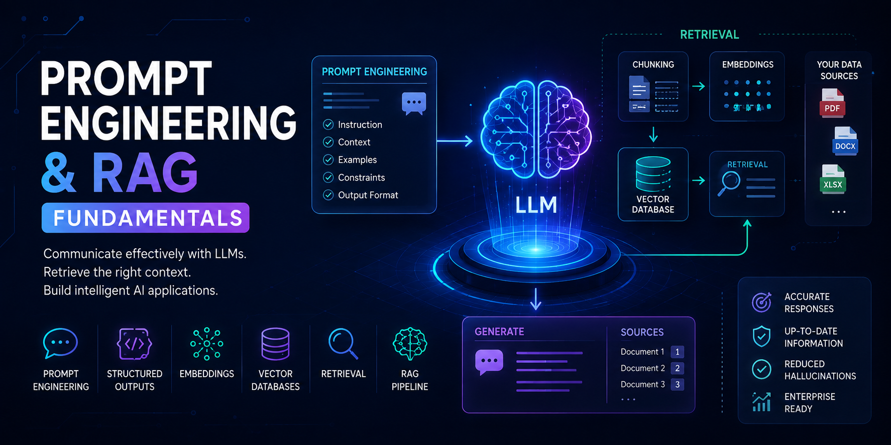

# Part IV — Prompt Engineering & RAG Fundamentals

> Learn how to effectively interact with Large Language Models (LLMs) using prompt engineering techniques and build Retrieval-Augmented Generation (RAG) applications powered by enterprise knowledge.

---

## 📖 Overview

Large Language Models (LLMs) have fundamentally changed how humans interact with software. However, building reliable AI applications requires far more than simply sending prompts to an LLM.

This module provides a production-focused introduction to Prompt Engineering and Retrieval-Augmented Generation (RAG). You'll learn how prompts influence model behavior, explore prompting techniques for different use cases, understand embeddings and vector databases, and build your first production-ready RAG pipelines.

Designed for software engineers, backend developers, cloud engineers, solution architects, and AI engineers, this module bridges the gap between Foundation Models and Enterprise AI applications by teaching how to build reliable, context-aware, and knowledge-driven AI systems.

---

## 🎯 Learning Outcomes

After completing this module, you will be able to:

- Understand how Large Language Models interpret prompts
- Design effective prompts for different AI tasks
- Apply Zero-shot, One-shot, and Few-shot prompting techniques
- Use Chain-of-Thought (CoT) and ReAct prompting strategies
- Generate structured outputs using JSON and schemas
- Understand Function Calling and Tool Calling concepts
- Build embeddings for semantic search
- Understand Vector Databases and similarity search
- Design efficient document chunking strategies
- Build end-to-end Retrieval-Augmented Generation (RAG) pipelines
- Evaluate and improve basic RAG applications

---

## 🛣️ Recommended Learning Path

This module is designed as a progressive learning journey. We recommend studying the chapters in the order presented, gradually progressing from prompt engineering fundamentals to building production-ready Retrieval-Augmented Generation (RAG) systems.

| Chapter | Status |
|---------|:------:|
| **[01. Introduction to Prompt Engineering](01-introduction-to-prompt-engineering.md)** | 🚧 |
| **[02. Prompt Engineering Fundamentals](02-prompt-engineering-fundamentals.md)** | 🚧 |
| **[03. Prompt Design Patterns](03-prompt-design-patterns.md)** | 🚧 |
| **[04. Zero-shot, One-shot & Few-shot Prompting](04-zero-one-few-shot-prompting.md)** | 🚧 |
| **[05. Chain-of-Thought (CoT) Prompting](05-chain-of-thought-prompting.md)** | 🚧 |
| **[06. ReAct Prompting](06-react-prompting.md)** | 🚧 |
| **[07. Structured Outputs](07-structured-outputs.md)** | 🚧 |
| **[08. Function Calling & Tool Calling](08-function-calling-and-tool-calling.md)** | 🚧 |
| **[09. Embeddings in Practice](09-embeddings-in-practice.md)** | 🚧 |
| **[10. Vector Databases](10-vector-databases.md)** | 🚧 |
| **[11. Document Chunking Strategies](11-document-chunking-strategies.md)** | 🚧 |
| **[12. Retrieval Fundamentals](12-retrieval-fundamentals.md)** | 🚧 |
| **[13. Building Your First RAG Pipeline](13-building-your-first-rag-pipeline.md)** | 🚧 |
| **[14. RAG Evaluation Fundamentals](14-rag-evaluation-fundamentals.md)** | 🚧 |
| **[15. Building Production RAG Applications](15-building-production-rag-applications.md)** | 🚧 |

---

## 🏢 Enterprise Perspective

Prompt Engineering and Retrieval-Augmented Generation have become essential building blocks for enterprise AI applications.

Some common enterprise applications include:

- Enterprise Knowledge Assistants
- Customer Support Chatbots
- Internal Documentation Search
- Intelligent Document Question Answering
- AI-Powered Search Engines
- Code Assistants
- Enterprise Copilots
- Research Assistants
- Legal & Compliance Assistants
- Healthcare Knowledge Systems
- Financial Advisory Assistants
- Internal Enterprise AI Platforms

Throughout this module, you'll learn how enterprise AI applications combine Prompt Engineering, embeddings, Vector Databases, and Retrieval-Augmented Generation to deliver reliable, accurate, and context-aware AI experiences.

The concepts learned in this module provide the foundation for the next module, where you'll explore advanced Retrieval-Augmented Generation architectures, optimization strategies, and enterprise-scale RAG systems.

---

## 🚀 Start Learning

Ready to build your first AI-powered applications?

➡️ Continue with **[01. Introduction to Prompt Engineering](01-introduction-to-prompt-engineering.md)**.

---

Fixed issue in navigation

> **Enterprise AI Engineering Handbook**  
> *Building Production-Grade Enterprise AI Systems — One Chapter at a Time.*