# Part IV — Prompt Engineering & RAG Fundamentals

> Learn how to effectively interact with Large Language Models (LLMs), design reliable prompts, and build foundational Retrieval-Augmented Generation (RAG) applications using enterprise knowledge.


---

## 📖 Overview

Large Language Models (LLMs) have fundamentally changed how humans interact with software. However, building reliable AI applications requires far more than simply sending prompts to an LLM.

This module introduces the core techniques required to build LLM-powered applications, starting with Prompt Engineering and progressing toward foundational Retrieval-Augmented Generation (RAG).

You'll learn how to design effective prompts, work with structured outputs and tool calling, understand embeddings and vector databases, process documents, perform similarity search, and assemble the components of a basic RAG pipeline.

The module also introduces practical LLM application development and deployment concepts, including structured output parsing, RAG pipeline components, enterprise Generative AI application architecture, and deploying simple AI applications with Gradio.

Frameworks such as LangChain and LlamaIndex may be used in selected implementation examples where they help explain a concept. Dedicated framework architecture, abstractions, comparisons, and selection are covered later in **Part VIII — AI Engineering Frameworks & Tooling**.

---

## 🎯 Learning Outcomes

After completing this module, you will be able to:

- Understand how Large Language Models interpret prompts
- Design effective prompts for different AI tasks
- Apply Zero-shot, One-shot, and Few-shot prompting techniques
- Apply advanced prompt engineering techniques
- Understand Chain-of-Thought (CoT) and ReAct prompting
- Generate structured outputs using JSON and schemas
- Parse structured LLM responses
- Understand Function Calling and Tool Calling concepts
- Understand the basic components of LLM applications
- Generate and use embeddings for semantic search
- Understand Vector Databases and similarity search
- Understand document processing and vectorization
- Design effective document chunking strategies
- Understand RAG pipeline components
- Build retrieval and generation pipelines
- Build a foundational RAG application
- Evaluate basic RAG systems
- Understand enterprise Generative AI application architecture
- Deploy a simple AI application using Gradio

---

## 🧭 Learning Journey

The module follows a progressive path:


The objective is to move from **understanding LLM interaction** to **building a complete foundational RAG application**.

---

## 🛣️ Recommended Learning Path

| Chapter | Status |
| --- | :---: |
| **[01. Introduction to Prompt Engineering](01-introduction-to-prompt-engineering.md)** | 🚧 |
| **[02. Prompt Engineering Fundamentals](02-prompt-engineering-fundamentals.md)** | 🚧 |
| **[03. Advanced Prompt Engineering](03-advanced-prompt-engineering.md)** | 🚧 |
| **[04. Prompt Design Patterns](04-prompt-design-patterns.md)** | 🚧 |
| **[05. Zero-shot, One-shot & Few-shot Prompting](05-zero-one-few-shot-prompting.md)** | 🚧 |
| **[06. Chain-of-Thought (CoT) Prompting](06-chain-of-thought-prompting.md)** | 🚧 |
| **[07. ReAct Prompting](07-react-prompting.md)** | 🚧 |
| **[08. Structured Outputs & Output Parsing](08-structured-outputs-and-output-parsing.md)** | 🚧 |
| **[09. Function Calling & Tool Calling](09-function-calling-and-tool-calling.md)** | 🚧 |
| **[10. Embeddings in Practice](10-embeddings-in-practice.md)** | 🚧 |
| **[11. Document Processing & Vectorization](11-document-processing-and-vectorization.md)** | 🚧 |
| **[12. Document Chunking Strategies](12-document-chunking-strategies.md)** | 🚧 |
| **[13. Vector Database Fundamentals](13-vector-database-fundamentals.md)** | 🚧 |
| **[14. Similarity Search Techniques](14-similarity-search-techniques.md)** | 🚧 |
| **[15. RAG Pipeline Components](15-rag-pipeline-components.md)** | 🚧 |
| **[16. Retrieval & Generation Pipeline](16-retrieval-and-generation-pipeline.md)** | 🚧 |
| **[17. Vector Databases in RAG](17-vector-databases-in-rag.md)** | 🚧 |
| **[18. Building Your First RAG Pipeline](18-building-your-first-rag-pipeline.md)** | 🚧 |
| **[19. RAG Evaluation Fundamentals](19-rag-evaluation-fundamentals.md)** | 🚧 |
| **[20. Enterprise Generative AI Application Architecture](20-enterprise-generative-ai-application-architecture.md)** | 🚧 |
| **[21. Deploying AI Applications with Gradio](21-deploying-ai-applications-with-gradio.md)** | 🚧 |

---

## 🧠 From Prompt to Application

A modern LLM application begins with a user request and progressively adds structure and context.

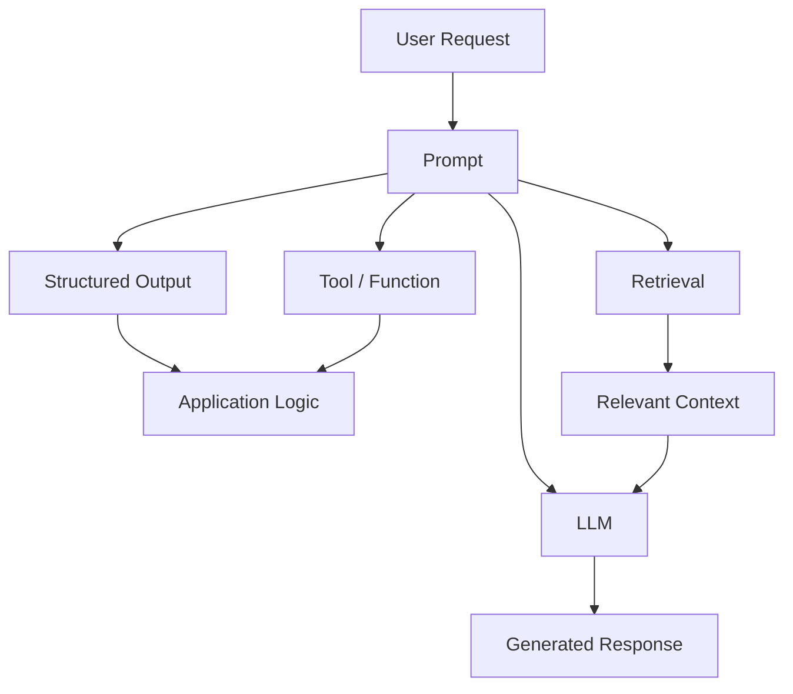

This module focuses on understanding these building blocks before combining them into larger AI application architectures.

---

# Prompt Engineering

## 🔹 Prompt Engineering Fundamentals

A prompt is more than a question.

A well-designed prompt can define:

```text
Role
 ↓
Task
 ↓
Context
 ↓
Constraints
 ↓
Output Format
```

A useful conceptual structure is:

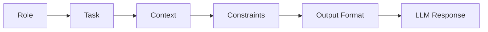

---

## 🔹 Prompt Design Patterns

Different tasks require different prompting strategies.

Common patterns include:

| Pattern | Primary Purpose |
| --- | --- |
| Zero-shot | Solve without examples |
| One-shot | Provide one example |
| Few-shot | Provide multiple examples |
| Role prompting | Establish behavior or expertise |
| Instruction prompting | Define the task |
| Structured prompting | Control output format |
| Decomposition | Break complex tasks into steps |
| ReAct | Combine reasoning with actions |

The objective is not to memorize patterns, but to understand **when each pattern is useful**.

---

## 🔹 Zero-shot, One-shot & Few-shot

The progression can be visualized as:

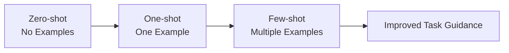

The amount of example information should be determined by the task rather than added automatically.

---

## 🔹 Chain-of-Thought

Chain-of-Thought prompting is used to encourage structured reasoning for tasks that benefit from intermediate reasoning.

Conceptually:

```text
Problem
   ↓
Reasoning Process
   ↓
Conclusion
```

In production systems, reasoning strategies should be evaluated based on:

```text
Accuracy
Latency
Cost
Reliability
Safety
```

The goal is improved task performance, not simply longer responses.

---

## 🔹 ReAct

ReAct combines reasoning with actions.

A simplified conceptual flow is:

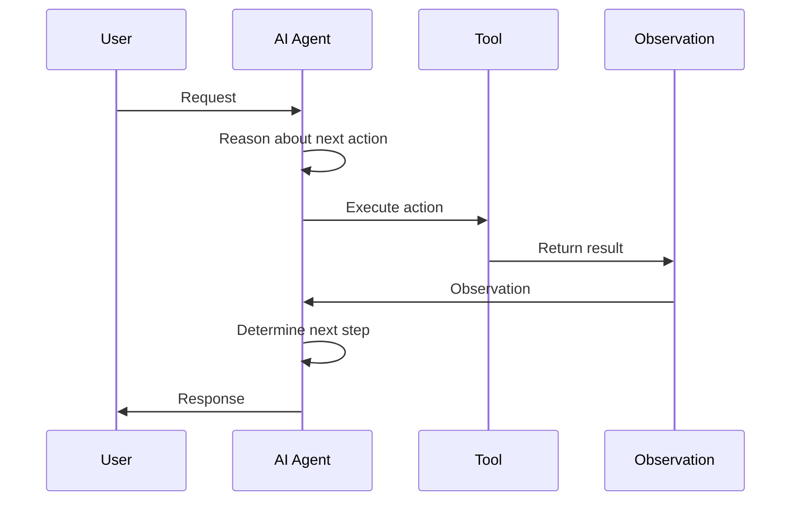

This introduces the foundation for later **AI Agent** concepts without turning Part IV into an Agent module.

---

# Structured LLM Outputs

## 🔹 Structured Outputs

LLMs often need to communicate with software systems rather than directly with humans.

Instead of:

```text
Free-form text
```

an application may require:

```json
{
  "name": "Mihir",
  "role": "Architect",
  "skills": [
    "Java",
    "Cloud",
    "AI"
  ]
}
```

The application can then validate and consume the result.

---

## 🔹 Structured Output Pipeline

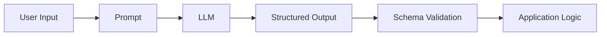

This establishes an important production principle:

> **LLM output should be treated as application data that requires validation.**

---

# Function Calling & Tool Calling

## 🔹 Function Calling

Function calling allows an LLM application to request execution of a predefined function.

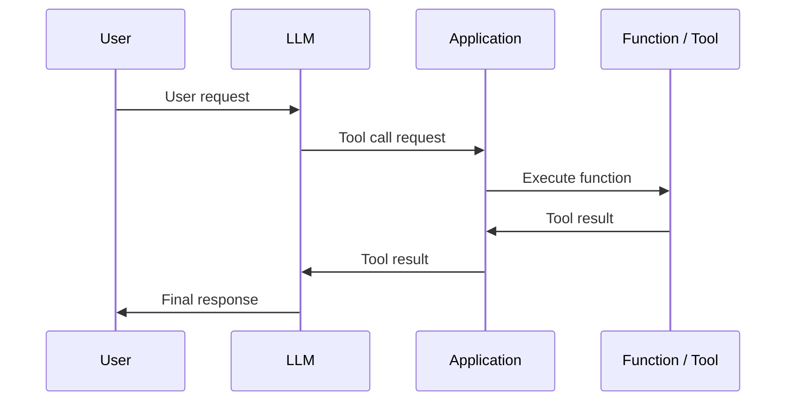

The important boundary is:

```text
LLM
 ↓
Request an action

Application
 ↓
Validate and authorize

Tool
 ↓
Execute
```

The LLM should not automatically be trusted with unrestricted application capabilities.

---

# Embeddings

## 🔹 Embeddings in Practice

Embeddings convert text into numerical representations that capture semantic relationships.

Conceptually:

```text
Text
 ↓
Embedding Model
 ↓
Vector
```

For example:

```text
"Java microservices"
        ↓
[0.21, -0.17, 0.84, ...]
```

The exact vector values depend on the embedding model.

---

## 🔹 Semantic Similarity

Semantically related text tends to have vectors that are closer according to the selected similarity measure.

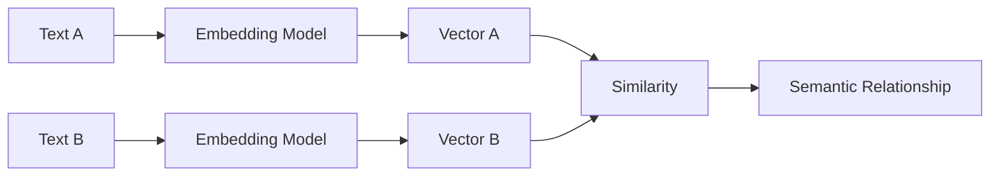

Embeddings provide the foundation for semantic retrieval.

---

# Document Processing

## 🔹 Document Processing & Vectorization

Enterprise knowledge usually begins as documents:

```text
PDF
DOCX
HTML
Markdown
TXT
Database Records
Web Content
```

A foundational processing pipeline is:

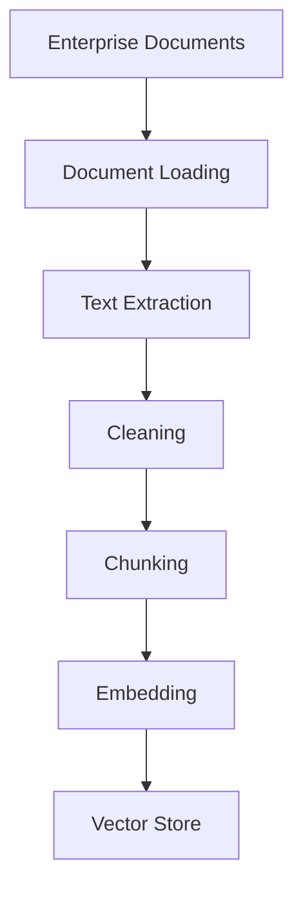

The quality of the downstream RAG system depends heavily on the quality of this preprocessing pipeline.

---

# Document Chunking

## 🔹 Chunking Strategies

Large documents are usually divided into smaller units before embedding.

```text
Document
   ↓
Sections
   ↓
Paragraphs
   ↓
Chunks
   ↓
Embeddings
```

A good chunking strategy should consider:

- Semantic boundaries
- Chunk size
- Context preservation
- Overlap
- Document structure
- Metadata

---

## 🔹 Basic Chunking Flow

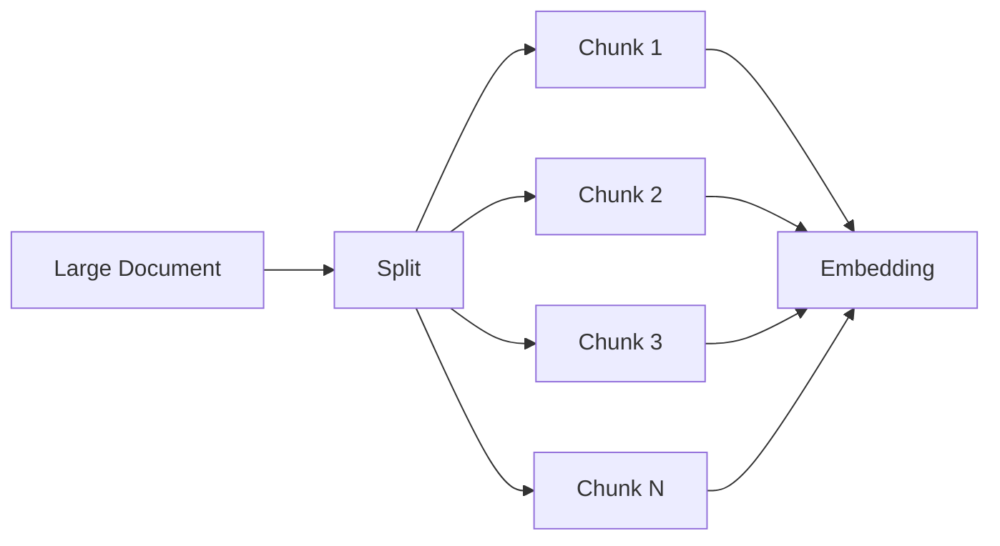

Advanced retrieval and chunking optimization are intentionally reserved for **Part V**.

---

# Vector Databases

## 🔹 Vector Database Fundamentals

A vector database stores and retrieves vector representations.

A simplified architecture is:

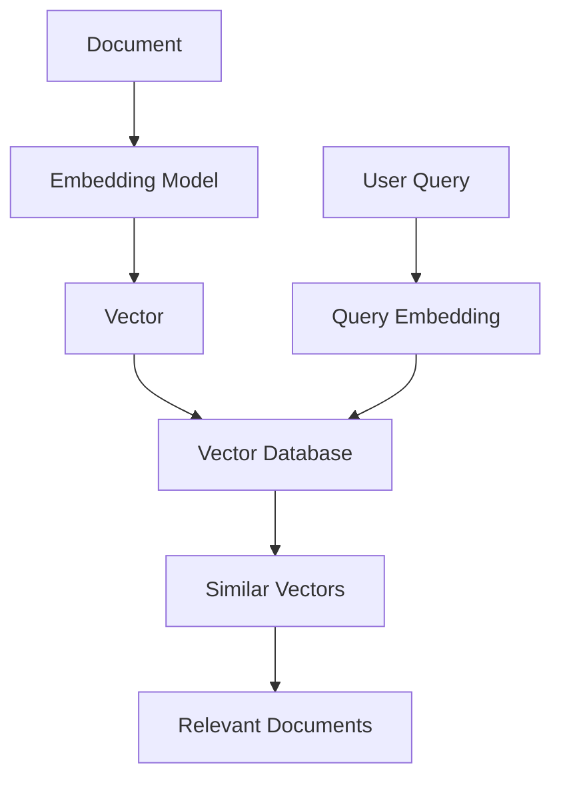

Common capabilities include:

- Vector storage
- Similarity search
- Metadata storage
- Filtering
- Retrieval

Specific technologies such as **ChromaDB** can be used in examples, but the underlying vector-database concepts remain framework and vendor independent.

---

# Similarity Search

## 🔹 Similarity Search Techniques

The goal of similarity search is to find vectors that are semantically related to the query vector.

Conceptually:

```text
Query
 ↓
Query Embedding
 ↓
Vector Search
 ↓
Similarity Score
 ↓
Top Relevant Documents
```

A simplified retrieval flow:

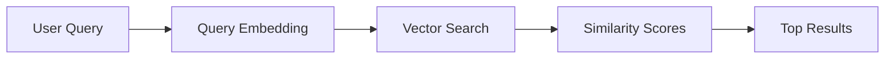

The exact similarity function and indexing strategy depend on the vector database and retrieval implementation.

---

# RAG Fundamentals

## 🔹 What Is RAG?

Retrieval-Augmented Generation combines:

```text
Retrieval
   +
Generation
```

Instead of relying only on the knowledge stored in model parameters:

```text
User Query
    ↓
LLM
    ↓
Answer
```

RAG adds external knowledge:

```text
User Query
    ↓
Retrieve Knowledge
    ↓
Relevant Context
    ↓
LLM
    ↓
Answer
```

---

## 🔹 RAG Pipeline Components

A foundational RAG system contains:

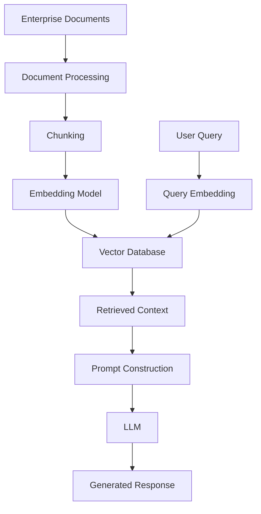

This is the core architecture that the reader should understand before moving into advanced RAG.

---

# Retrieval & Generation Pipeline

## 🔹 Retrieval Pipeline

The retrieval side is responsible for finding relevant information.

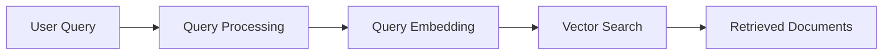

---

## 🔹 Generation Pipeline

The generation side combines the query and retrieved context.

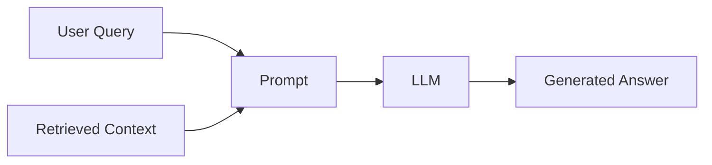

---

## 🔹 Complete RAG Pipeline

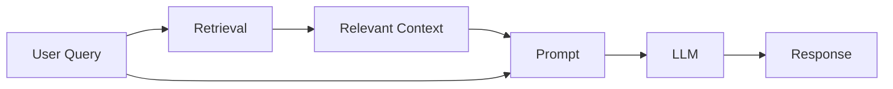

---

# Vector Databases in RAG

A vector database provides the retrieval layer of a basic RAG architecture.

```text
                 RAG SYSTEM
                     │
        ┌────────────┴────────────┐
        ↓                         ↓
   Knowledge Base             User Query
        ↓                         ↓
    Chunking                 Query Embedding
        ↓                         ↓
    Embeddings                    │
        ↓                         │
        └──────→ Vector DB ←──────┘
                     ↓
              Similarity Search
                     ↓
             Retrieved Context
                     ↓
                   LLM
                     ↓
                Response
```

The objective is to understand the role of the vector database rather than become dependent on a particular database technology.

---

# Building Your First RAG Pipeline

A simple RAG implementation can be viewed as:

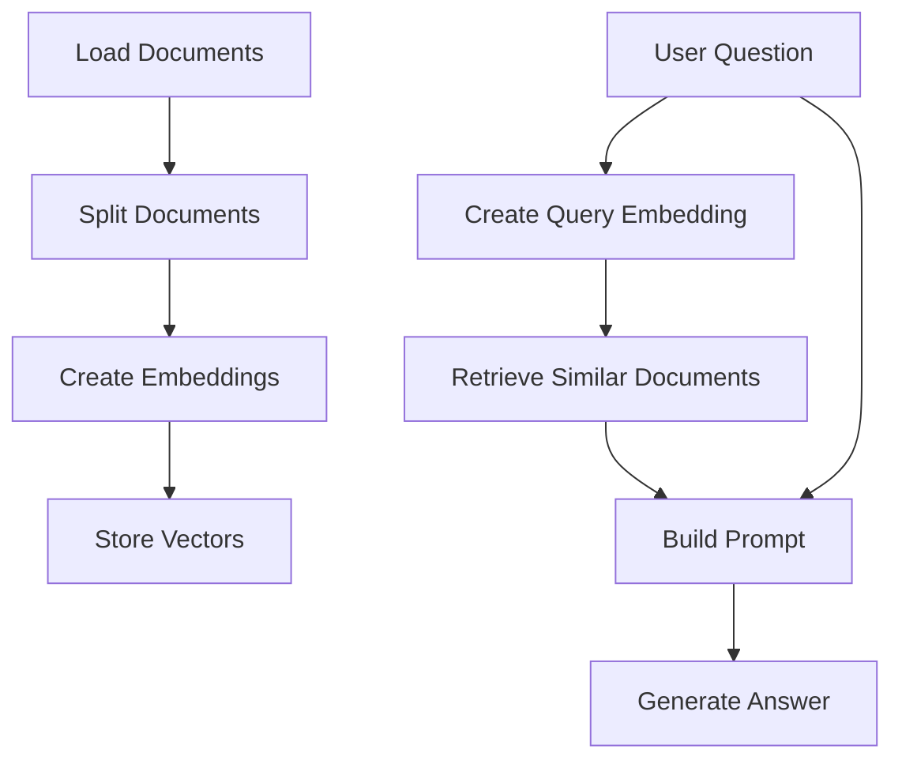

A framework implementation may use LangChain or LlamaIndex to compose these steps.

The important learning objective is to understand what the framework is doing underneath.

---

# RAG Evaluation Fundamentals

A RAG system should be evaluated at multiple stages.

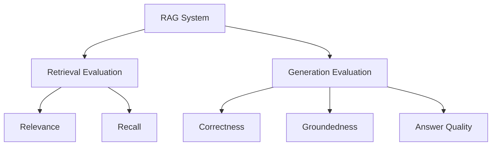

A basic evaluation framework should consider:

```text
Retrieval Quality
      +
Context Quality
      +
Generation Quality
      +
End-to-End Task Success
```

Advanced RAG evaluation techniques belong in **Part V**.

---

# Enterprise Generative AI Application Architecture

A foundational enterprise Generative AI application can be represented as:

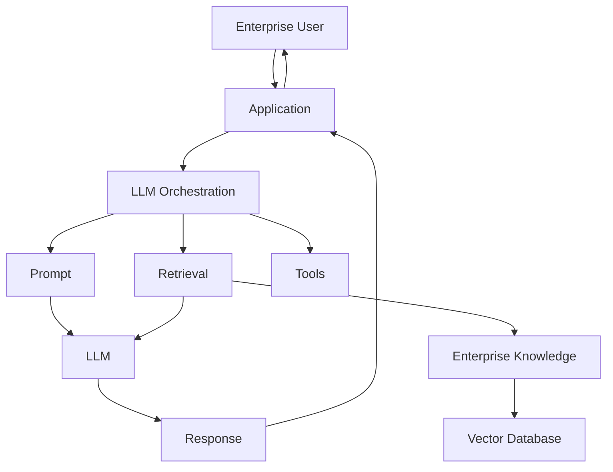

At this stage, the focus is on understanding the major application building blocks.

Advanced enterprise architecture, agent orchestration, security, observability, and large-scale deployment are covered in later Parts.

---

# Deploying AI Applications with Gradio

A simple AI application can expose the model pipeline through a user interface.

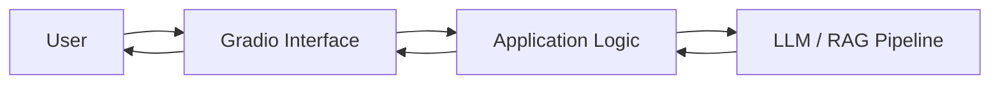

This demonstrates the transition:

```text
Model
 ↓
Application Logic
 ↓
User Interface
```

Gradio is used here as a lightweight deployment and demonstration mechanism.

---

# 🧩 Concept → Implementation → Application

Throughout Part IV, the preferred learning pattern is:

```mermaid
flowchart LR
    A["Concept"] --> B["Framework-Agnostic Explanation"]
    B --> C["Python Implementation"]
    C --> D["Optional Framework Example"]
    D --> E["Application"]
```

For example:

```text
RAG Concept
    ↓
Python RAG Pipeline
    ↓
LangChain / LlamaIndex Example
    ↓
Working Application
```

The framework is therefore an implementation aid, not the subject of the chapter.

---

# 🔗 Framework Boundary

Frameworks may appear in Part IV when they help explain implementation.

Examples include:

- LangChain
- LlamaIndex
- LCEL
- ChromaDB
- Hugging Face libraries
- LLM provider SDKs
- Gradio

However, Part IV does **not** attempt to comprehensively teach these frameworks.

The dedicated framework track appears later:

> **Part VIII — AI Engineering Frameworks & Tooling**

This keeps the learning progression framework-independent.

---

# 🏢 Enterprise Use Cases

Foundational LLM and RAG techniques can support:

- Enterprise Knowledge Assistants
- Internal Documentation Search
- Intelligent Document Q&A
- Customer Support Assistants
- Research Assistants
- Code Assistants
- Enterprise Search
- Compliance Knowledge Assistants
- Financial Knowledge Assistants
- Internal AI Platforms

A common pattern is:

```mermaid
flowchart LR
    A["Enterprise User"] --> B["AI Application"]
    B --> C["Retrieval"]
    C --> D["Enterprise Knowledge"]
    D --> C
    C --> E["LLM"]
    E --> F["Grounded Response"]
    F --> B
    B --> A
```

---

# 🧭 Part IV Scope

Part IV intentionally focuses on the **foundations**.

```text
Prompt Engineering
        ↓
Structured Outputs
        ↓
Function / Tool Calling
        ↓
Embeddings
        ↓
Document Processing
        ↓
Chunking
        ↓
Vector Databases
        ↓
Similarity Search
        ↓
RAG Components
        ↓
Basic Retrieval
        ↓
Generation
        ↓
Foundational RAG
        ↓
Basic Evaluation
        ↓
Simple Application Deployment
```

---

## What Comes Next?

Part IV establishes the foundation required for the next stage of the handbook.

### Part V — Advanced Retrieval-Augmented Generation

Part V moves from:

```text
Understand RAG
      ↓
Build Basic RAG
```

to:

```text
Optimize Retrieval
      ↓
Advanced Retrieval
      ↓
Enterprise RAG
      ↓
Production RAG
```

Topics such as:

- Hybrid Search
- Metadata Filtering
- Parent-Child Retrieval
- Multi-Vector Retrieval
- Multi-Query Retrieval
- Contextual Compression
- Re-ranking
- Graph RAG
- SQL RAG
- Knowledge Graphs
- Agentic RAG
- Advanced RAG Evaluation
- Performance Optimization
- Cost Optimization

are intentionally reserved for **Part V**.

---

## 🚀 Start Learning

Ready to start building LLM-powered applications?

➡️ Continue with **[01. Introduction to Prompt Engineering](01-introduction-to-prompt-engineering.md)**.

---

> **Enterprise AI Engineering Handbook**  
> *Building Production-Grade Enterprise AI Systems — One Chapter at a Time.*