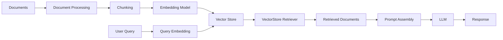
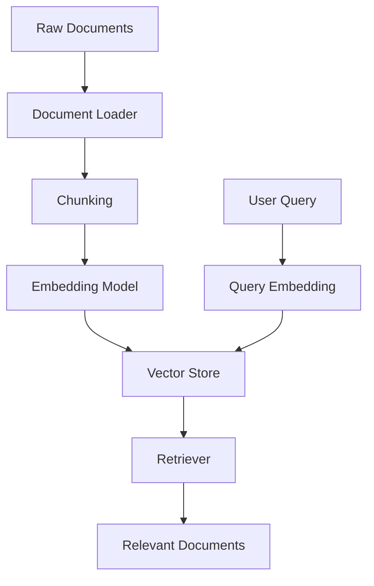
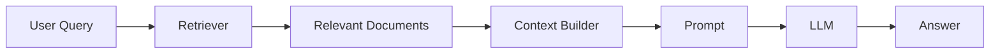
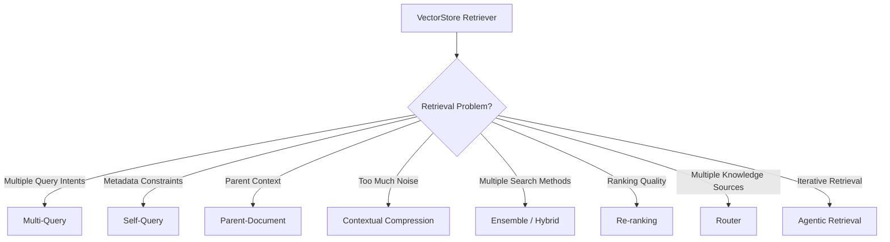
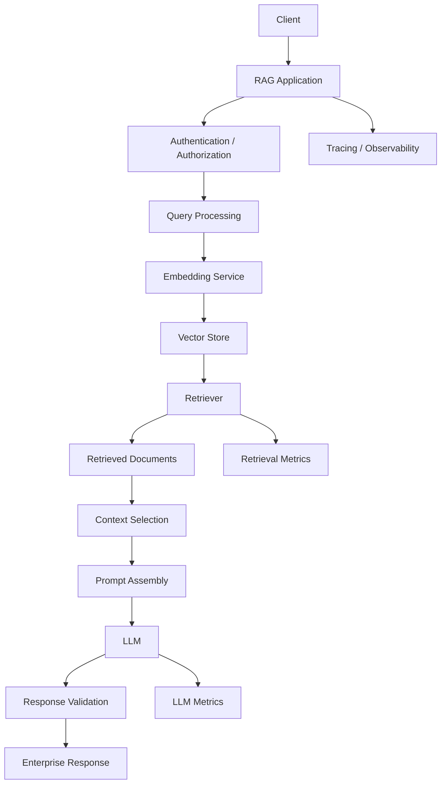
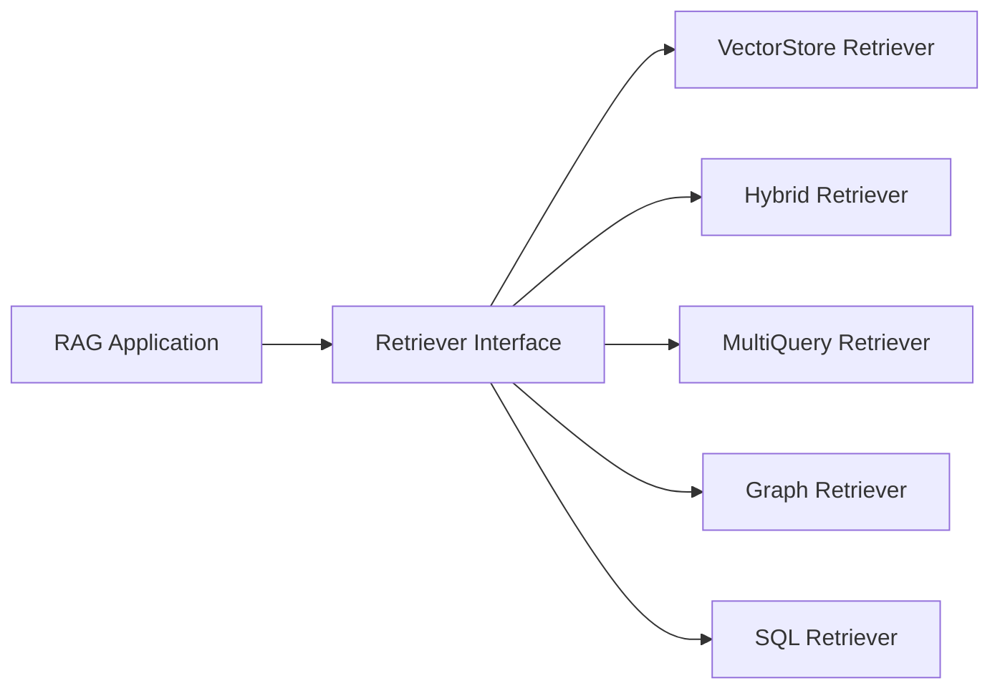

# VectorStore Retriever

## 📖 Overview

A **VectorStore Retriever** is one of the foundational retrieval mechanisms used in Retrieval-Augmented Generation (RAG) systems.

It connects a user query to a vector database by:

1. Converting the query into an embedding
2. Searching for semantically similar vectors
3. Returning the most relevant documents
4. Passing those documents to the downstream RAG pipeline

The basic architecture is:

```text
User Query
    ↓
Query Embedding
    ↓
Vector Similarity Search
    ↓
Top-K Documents
    ↓
Context
    ↓
LLM
    ↓
Response
```

A VectorStore Retriever therefore acts as the bridge between the **vector store** and the **RAG application**.

---

## 🎯 Learning Objectives

After completing this chapter, you will be able to:

- Understand what a VectorStore Retriever is
- Understand how vector retrieval works
- Understand the relationship between embeddings, vector stores, and retrievers
- Understand similarity search and Top-K retrieval
- Build a basic VectorStore Retriever
- Use metadata filters during retrieval
- Understand retrieval configuration
- Understand how retrieved documents become LLM context
- Distinguish a VectorStore from a Retriever
- Understand the limitations of basic vector retrieval
- Identify when more advanced retrieval techniques are required

---

# 1. Where the VectorStore Retriever Fits

A typical RAG system contains several stages:



The retriever is therefore **not the vector database itself**.

Instead:

```text
Vector Store
    ↓
Stores and searches vectors

Retriever
    ↓
Defines how relevant documents are retrieved
```

---

# 2. Vector Store vs Retriever

These two concepts are closely related but serve different purposes.

| Component | Responsibility |
|---|---|
| Embedding Model | Converts text into vectors |
| Vector Store | Stores vectors and performs similarity search |
| Retriever | Defines how documents should be retrieved |
| Prompt Builder | Converts retrieved documents into LLM context |
| LLM | Generates the final response |

A simplified architecture is:

```text
                  ┌──────────────────┐
                  │  Embedding Model │
                  └────────┬─────────┘
                           │
                           ↓
                    Query Embedding
                           │
                           ↓
                  ┌──────────────────┐
                  │   Vector Store   │
                  └────────┬─────────┘
                           │
                           ↓
                  Similar Documents
                           │
                           ↓
                  ┌──────────────────┐
                  │    Retriever     │
                  └────────┬─────────┘
                           │
                           ↓
                    Retrieved Docs
```

The distinction becomes important as RAG systems become more sophisticated.

---

# 3. What Is a Vector Store?

A vector store maintains vector representations of documents or document chunks.

Suppose we have:

```text
Document 1:
"Employees can work remotely up to three days per week."

Document 2:
"Employees must submit leave requests through the HR portal."

Document 3:
"Annual performance reviews are conducted in December."
```

After embedding:

```text
Document 1 → [0.12, -0.44, 0.81, ...]
Document 2 → [0.71,  0.15, -0.22, ...]
Document 3 → [-0.31, 0.82, 0.17, ...]
```

The vector store maintains these representations together with document information and metadata.

```text
Vector
  +
Document Content
  +
Metadata
```

---

# 4. What Is a Retriever?

A retriever provides a standard interface for obtaining relevant documents from a knowledge source.

Conceptually:

```python
documents = retriever.invoke(query)
```

The application does not necessarily need to know:

- how vectors are stored
- which similarity algorithm is used
- how the database performs the search
- how the underlying index is implemented

It simply asks:

```text
"Give me the documents relevant to this query."
```

This abstraction becomes particularly valuable when changing retrieval strategies.

---

# 5. Basic VectorStore Retrieval

The simplest retrieval process is:

```text
Query
 ↓
Embedding
 ↓
Vector Similarity Search
 ↓
Top-K
 ↓
Documents
```

For example:

```text
Query:

"What is the company's remote work policy?"
```

The query is converted into an embedding.

The vector store then searches for nearby vectors.

```text
Query Vector
     │
     │ similarity
     ↓
┌───────────────┐
│ Vector Store  │
├───────────────┤
│ Chunk A  0.91 │
│ Chunk B  0.84 │
│ Chunk C  0.78 │
│ Chunk D  0.42 │
│ Chunk E  0.31 │
└───────────────┘
```

If:

```text
Top-K = 3
```

the retriever returns:

```text
Chunk A
Chunk B
Chunk C
```

---

# 6. Similarity Search

The vector store determines how close the query vector is to stored document vectors.

Common similarity measures include:

- Cosine similarity
- Dot product
- Euclidean distance

The exact metric depends on the vector store and index configuration.

Conceptually:

```text
Query Vector
     ↓
Compare Against Stored Vectors
     ↓
Calculate Similarity / Distance
     ↓
Rank Candidates
     ↓
Return Top-K
```

### Important distinction

A high similarity score does **not automatically mean the retrieved document is factually sufficient**.

It means that the document is considered similar according to the configured retrieval mechanism.

This distinction becomes important later when we introduce:

- Re-ranking
- Contextual Compression
- RAG Evaluation
- Grounding
- Citation Validation

---

# 7. Top-K Retrieval

`k` controls how many documents are returned.

For example:

```python
retriever = vector_store.as_retriever(
    search_kwargs={"k": 5}
)
```

Conceptually:

```text
Vector Store
     ↓
1000 candidate chunks
     ↓
Similarity ranking
     ↓
Top 5
     ↓
Retriever
```

### Choosing K

There is no universally correct value for `k`.

| K | Advantage | Risk |
|---:|---|---|
| 1 | Low latency, small context | May miss important information |
| 3 | Small context | Limited recall |
| 5 | Common starting point | More context |
| 10 | Better recall | More noise and tokens |
| 20+ | High candidate recall | Context dilution and cost |

The correct value depends on:

- Document quality
- Chunk size
- Query complexity
- Embedding quality
- LLM context window
- Reranking strategy
- Application requirements

---

# 8. Basic LangChain Example

A VectorStore Retriever can be created using a vector store's retriever interface.

For example:

```python
from langchain_chroma import Chroma
from langchain_huggingface import HuggingFaceEmbeddings

embeddings = HuggingFaceEmbeddings(
    model_name="sentence-transformers/all-MiniLM-L6-v2"
)

vector_store = Chroma(
    collection_name="enterprise_docs",
    embedding_function=embeddings
)

retriever = vector_store.as_retriever(
    search_type="similarity",
    search_kwargs={
        "k": 5
    }
)

documents = retriever.invoke(
    "What is the company's remote work policy?"
)

for document in documents:
    print(document.page_content)
```

The important architectural point is:

```text
Embedding Model
      ↓
Vector Store
      ↓
Retriever
      ↓
Documents
```

The retriever hides the underlying search interaction from the application.

---

# 9. Adding Documents

Before retrieval can happen, documents must be indexed.

A simplified pipeline is:



Example:

```python
from langchain_chroma import Chroma

documents = [
    # Document objects created during ingestion
]

vector_store = Chroma.from_documents(
    documents=documents,
    embedding=embeddings,
    collection_name="enterprise_docs"
)
```

The ingestion pipeline and retrieval pipeline are separate concerns.

```text
INGESTION
─────────
Documents
   ↓
Chunking
   ↓
Embedding
   ↓
Vector Store


QUERY
─────
User Query
   ↓
Embedding
   ↓
Vector Search
   ↓
Retriever
```

---

# 10. Metadata

Vector stores commonly store metadata alongside vectors.

For example:

```json
{
  "department": "HR",
  "document_type": "policy",
  "country": "Germany",
  "year": 2026
}
```

This allows retrieval systems to combine:

```text
Semantic Similarity
        +
Metadata Constraints
```

Example:

```text
Query:
"What is the parental leave policy?"

Filter:
country = Germany
```

The conceptual search becomes:

```text
Query
  ↓
Semantic Search
  +
Metadata Filter
  ↓
Relevant HR Documents
```

Metadata-aware retrieval becomes particularly important in enterprise environments where users may only be authorized to access specific data.

---

# 11. Metadata Filtering Example

A simplified example:

```python
documents = vector_store.similarity_search(
    "What is the parental leave policy?",
    k=5,
    filter={
        "country": "Germany",
        "document_type": "policy"
    }
)
```

The exact filtering syntax depends on the vector-store implementation.

The architectural idea is more important:

```text
User Query
     ↓
Semantic Retrieval
     ↓
Metadata Filtering
     ↓
Authorized / Relevant Documents
```

> Metadata filtering should not be treated as a replacement for enterprise authorization. Application-level access control and data isolation must still be enforced.

---

# 12. Retriever Configuration

A retriever can expose configuration such as:

```text
Search Type
Top-K
Metadata Filters
Score Threshold
Search Parameters
```

Conceptually:

```python
retriever = vector_store.as_retriever(
    search_type="similarity",
    search_kwargs={
        "k": 5
    }
)
```

Different vector stores expose different configuration options.

Therefore, production applications should avoid assuming that every vector store supports identical parameters.

---

# 13. Similarity Search vs Similarity Search with Threshold

A basic similarity retriever may always return `k` documents.

For example:

```text
Query
 ↓
Top 5
 ↓
Return 5 documents
```

But what if none of those documents are actually relevant?

A score threshold can help:

```text
Query
 ↓
Candidate Search
 ↓
Similarity Score
 ↓
Threshold
 ↓
Relevant Documents
```

Conceptually:

```python
retriever = vector_store.as_retriever(
    search_type="similarity_score_threshold",
    search_kwargs={
        "score_threshold": 0.7,
        "k": 5
    }
)
```

The exact meaning and scale of the score depends on the vector store and similarity implementation.

Therefore:

> **Never assume that a score such as `0.7` has the same semantic meaning across different vector databases or retrieval implementations.**

This is an important production consideration.

---

# 14. Retrieval with Scores

Sometimes engineers need the similarity scores for debugging or evaluation.

```python
results = vector_store.similarity_search_with_score(
    "What is the remote work policy?",
    k=5
)

for document, score in results:
    print("Score:", score)
    print("Content:", document.page_content)
```

This can help diagnose:

```text
Query
 ↓
Retrieved Documents
 ↓
Similarity Scores
 ↓
Relevance Analysis
```

However, the meaning of the score depends on the underlying implementation.

Do not automatically interpret it as:

```text
0.91 = 91% relevant
```

A similarity score is generally **not a calibrated probability**.

---

# 15. Building a Simple RAG Pipeline

A VectorStore Retriever becomes useful when connected to an LLM.



A simplified implementation:

```python
query = "What is the remote work policy?"

documents = retriever.invoke(query)

context = "\n\n".join(
    document.page_content
    for document in documents
)

prompt = f"""
Answer the question using only the provided context.

Context:
{context}

Question:
{query}
"""

response = llm.invoke(prompt)

print(response)
```

The retriever therefore becomes the **knowledge access layer** of the RAG application.

---

# 16. Why Retrieval Quality Matters

Consider the question:

```text
"What is the parental leave policy for employees in Germany?"
```

Suppose retrieval returns:

```text
Chunk 1 → General leave policy
Chunk 2 → US parental leave
Chunk 3 → Employee benefits
Chunk 4 → Germany parental leave
Chunk 5 → Historical policy
```

The LLM receives all five chunks.

Even if the correct information is present, irrelevant context can make the generation process more difficult.

```text
Too Little Context
       ↓
Missing Information
       ↓
Poor Answer


Too Much Context
       ↓
Noise
       ↓
Context Competition
       ↓
Higher Token Cost
```

The goal is therefore not:

> Retrieve as many documents as possible.

The goal is:

> Retrieve the **smallest useful set of high-quality evidence** required to answer the query.

This principle becomes increasingly important in later chapters on:

- Re-ranking
- Contextual Compression
- Context Selection
- Prompt Assembly

---

# 17. VectorStore Retriever Limitations

Basic vector retrieval is powerful, but it has limitations.

### 1. Semantic similarity is not exact relevance

Two documents can be semantically similar but answer different questions.

```text
Query
 ↓
Semantic Similarity
 ↓
Similar ≠ Correct
```

### 2. One query may have multiple interpretations

For example:

```text
"What is the company's cloud strategy?"
```

This could refer to:

- Cloud architecture
- Cloud migration
- Cloud security
- Cloud cost strategy
- Cloud governance

A single embedding may not capture all possible retrieval intents.

This motivates **Multi-Query Retrieval**.

### 3. Keyword-heavy queries can be difficult

Queries containing:

```text
Product IDs
Error codes
Policy numbers
Technical identifiers
Exact names
```

may benefit from lexical retrieval.

This motivates **Hybrid Search**.

### 4. Retrieved documents may contain irrelevant content

This motivates:

```text
Contextual Compression
```

### 5. Top-K results may not be optimally ranked

This motivates:

```text
Re-ranking
```

### 6. Different questions may require different retrievers

This motivates:

```text
Router Retrieval
```

These techniques are covered in subsequent chapters.

---

# 18. When Should You Use a VectorStore Retriever?

A VectorStore Retriever is a good starting point when:

- The knowledge is primarily unstructured text
- Semantic similarity is useful
- A relatively simple retrieval strategy is sufficient
- The application needs a framework-independent retrieval abstraction
- The initial RAG system needs a strong baseline

Typical applications include:

```text
Enterprise Documentation
       ↓
Policy Search
       ↓
Knowledge Assistant
       ↓
Technical Support
       ↓
Internal Search
```

---

# 19. When Should You Move Beyond It?

A basic VectorStore Retriever may become insufficient when you encounter:

| Problem | Potential Next Step |
|---|---|
| Query has multiple meanings | Multi-Query Retrieval |
| Query contains metadata constraints | Self-Query / Metadata Retrieval |
| Parent context is important | Parent-Document Retrieval |
| Too much irrelevant text | Contextual Compression |
| Multiple retrieval methods are useful | Ensemble Retrieval |
| Semantic + keyword search needed | Hybrid Search |
| Search results need better ordering | Re-ranking |
| Different knowledge sources exist | Router Retrieval |
| Retrieval needs iterative reasoning | Agentic Retrieval |

This gives Part V a natural progression:



---

# 20. Production Considerations

A production VectorStore Retriever should be evaluated across several dimensions.

## Retrieval Quality

Monitor:

```text
Recall
Precision
Top-K relevance
Empty retrieval rate
Relevant-document coverage
```

## Latency

Measure:

```text
Embedding latency
Vector search latency
Database latency
Network latency
```

## Cost

Consider:

```text
Embedding cost
Vector database cost
Storage
Network
LLM context cost
```

## Scalability

Consider:

```text
Document count
Vector dimension
Index size
Concurrent queries
Query throughput
```

## Security

Consider:

```text
Tenant isolation
Metadata filtering
Authorization
Data access boundaries
Sensitive document handling
```

A production retrieval system should therefore be treated as an application component rather than simply a database lookup.

---

# 21. Production Architecture

A more complete enterprise architecture looks like:



The VectorStore Retriever sits in the middle of the architecture:

```text
Query Processing
      ↓
Embedding
      ↓
Vector Store
      ↓
Retriever
      ↓
Context
```

Everything downstream depends heavily on the quality of this retrieval stage.

---

# 22. Example: Enterprise Policy Search

Consider an enterprise HR assistant.

The knowledge base contains:

```text
hr/
├── leave-policy.pdf
├── parental-leave.pdf
├── remote-work-policy.pdf
├── travel-policy.pdf
└── benefits-guide.pdf
```

The user asks:

```text
"What is the parental leave policy?"
```

The retrieval flow becomes:

```text
User Query
    ↓
Query Embedding
    ↓
Vector Store
    ↓
Top-K Search
    ↓
Relevant HR Chunks
    ↓
Context Builder
    ↓
LLM
    ↓
Answer
```

Example retrieved content:

```text
Document: parental-leave.pdf
Section: Parental Leave
Page: 14

Employees meeting the eligibility requirements
may receive parental leave according to the
applicable company policy.
```

The LLM can then generate an answer grounded in that retrieved context.

Later, we can enhance the same system with:

```text
Metadata Filtering
        ↓
Re-ranking
        ↓
Citation
        ↓
Response Validation
```

---

# 23. A Framework-Agnostic Retriever Interface

For enterprise AI systems, it is useful to keep the application independent from a particular retrieval framework.

A simple interface might look like:

```python
from abc import ABC, abstractmethod
from typing import List


class Retriever(ABC):

    @abstractmethod
    def retrieve(self, query: str) -> List[dict]:
        pass
```

A vector-store implementation could then be:

```python
class VectorStoreRetriever(Retriever):

    def __init__(self, vector_store, top_k: int = 5):
        self.vector_store = vector_store
        self.top_k = top_k

    def retrieve(self, query: str) -> List[dict]:

        documents = self.vector_store.similarity_search(
            query,
            k=self.top_k
        )

        return [
            {
                "content": document.page_content,
                "metadata": document.metadata
            }
            for document in documents
        ]
```

This creates a useful architectural boundary:



The application depends on the **retrieval capability**, not a specific implementation.

This approach becomes particularly valuable when building enterprise AI platforms that may need different retrieval strategies for different workloads.

---

# 24. VectorStore Retriever vs Advanced Retrievers

| Capability | VectorStore Retriever | Advanced Retriever |
|---|---:|---:|
| Semantic Search | ✅ | ✅ |
| Top-K Retrieval | ✅ | ✅ |
| Metadata Filtering | Basic | Advanced |
| Multiple Queries | ❌ | ✅ |
| Hybrid Search | ❌ | ✅ |
| Re-ranking | ❌ | ✅ |
| Context Compression | ❌ | ✅ |
| Multi-Vector | ❌ | ✅ |
| Routing | ❌ | ✅ |
| Iterative Retrieval | ❌ | ✅ |
| Graph Retrieval | ❌ | ✅ |
| SQL Retrieval | ❌ | ✅ |

The VectorStore Retriever is therefore best understood as the **baseline retrieval building block** upon which more sophisticated retrieval systems can be constructed.

---

# 25. Common Mistakes

### Mistake 1 — Treating similarity as relevance

```text
Similarity Score
      ≠
Guaranteed Answer Correctness
```

### Mistake 2 — Using an arbitrary K

Do not assume:

```text
k = 5
```

is always optimal.

Measure retrieval quality.

### Mistake 3 — Ignoring chunk quality

Poor chunks produce poor retrieval.

```text
Bad Chunking
     ↓
Bad Embeddings
     ↓
Bad Retrieval
     ↓
Bad RAG
```

### Mistake 4 — Ignoring metadata

Enterprise documents often require:

```text
Department
Region
Tenant
Document Type
Version
Security Classification
```

### Mistake 5 — Sending every retrieved document to the LLM

More context is not automatically better.

```text
More Documents
      ↓
More Tokens
      ↓
More Noise
      ↓
Potentially Worse Answers
```

### Mistake 6 — Coupling the entire application to one framework

Prefer:

```text
Application
    ↓
Retriever Interface
    ↓
Implementation
```

instead of:

```text
Application
    ↓
Framework-Specific APIs Everywhere
```

---

# 26. Key Takeaways

- A VectorStore Retriever is a fundamental retrieval component in RAG.
- A Vector Store stores and searches vector representations; a Retriever provides the retrieval abstraction.
- Query embeddings are compared against stored document embeddings.
- Top-K retrieval determines how many candidates are returned.
- Similarity scores should not automatically be interpreted as probabilities.
- Metadata can improve enterprise retrieval precision and filtering.
- Basic vector retrieval is an excellent baseline for RAG systems.
- Retrieval quality strongly influences downstream generation quality.
- More retrieved context does not necessarily produce better answers.
- Production systems should measure retrieval quality, latency, cost, scalability, and security.
- VectorStore Retrieval provides the foundation for more advanced techniques.
- Multi-Query, Self-Query, Parent-Document, Hybrid, Re-ranking, Routing, and Agentic Retrieval address limitations of basic vector retrieval.
- A framework-independent Retriever interface can help keep enterprise applications decoupled from individual retrieval implementations.

---

# 🧭 Chapter Navigation

### Part V — Advanced Retrieval-Augmented Generation

**Previous:**  
[Part V Overview](../index.md)

**Next:**  
[02. Multi-Query Retriever](02-multi-query-retriever.md)

**Section:**  
01 — Core Retrieval Engineering

**Up Next**

```text
VectorStore Retriever
        ↓
Multi-Query Retriever
        ↓
Self-Query Retriever
        ↓
Parent-Document Retriever
        ↓
Retriever Comparison
```

---

> **Enterprise AI Engineering Handbook**  
> *Building Production-Grade Enterprise AI Systems — One Chapter at a Time.*