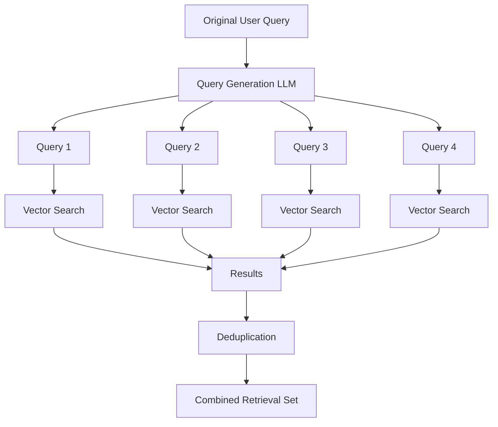
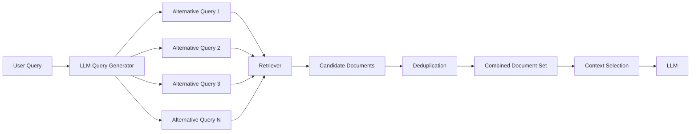
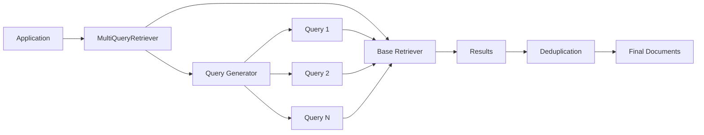
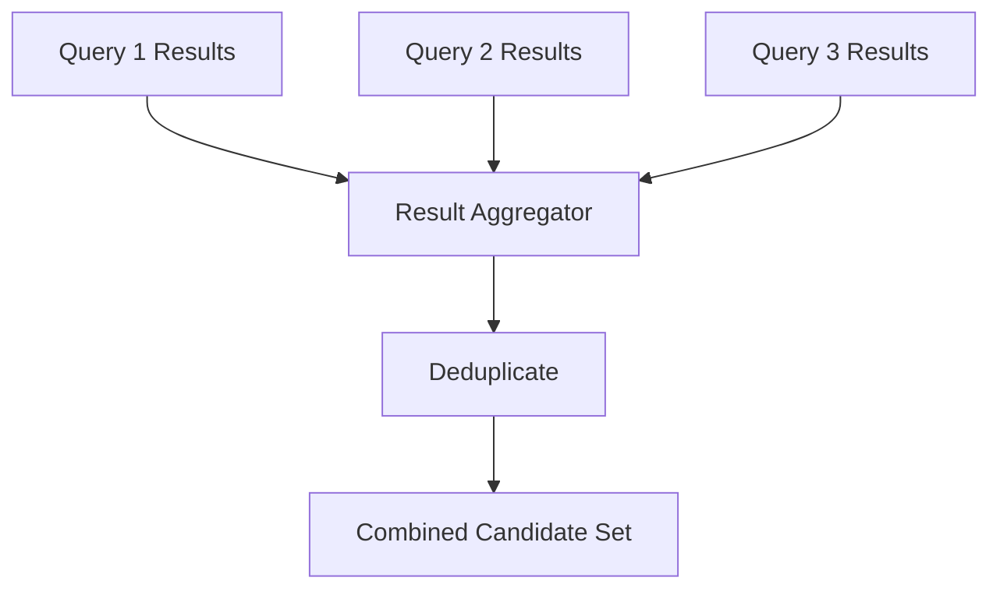
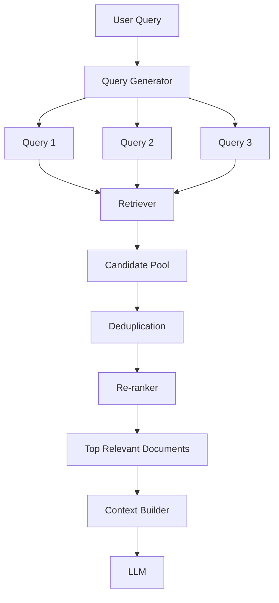
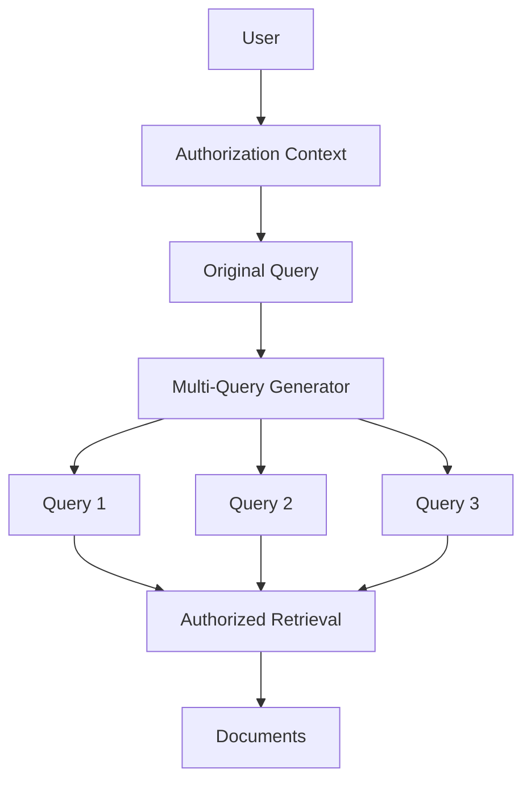
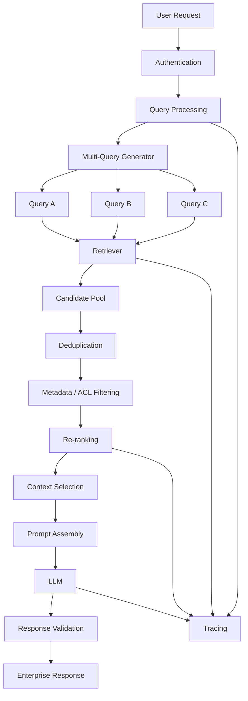
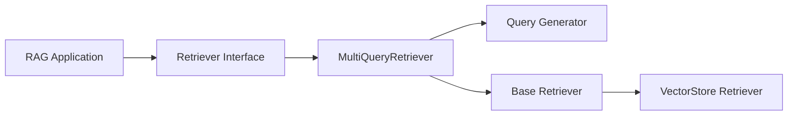

# Multi-Query Retriever

## 📖 Overview

A **Multi-Query Retriever** improves retrieval by generating multiple alternative queries from a single user question and using those queries to search the knowledge base.

A standard VectorStore Retriever performs:

```text
User Query
    ↓
Embedding
    ↓
Vector Search
    ↓
Top-K Documents
```

A Multi-Query Retriever changes this to:

```text
                     ┌── Query 1 ──→ Retrieval ──┐
                     │                            │
User Query ──→ LLM ──┼── Query 2 ──→ Retrieval ──┼──→ Combine
                     │                            │
                     └── Query 3 ──→ Retrieval ──┘
                                                  ↓
                                      Unique Relevant Documents
```

The key idea is:

> **One user question can have multiple semantic interpretations. Generate multiple perspectives, retrieve for each perspective, and combine the results.**

This is particularly useful when a query is ambiguous, underspecified, conversational, or likely to miss relevant documents when represented by only one embedding.

---

## 🎯 Learning Objectives

After completing this chapter, you will be able to:

- Understand the limitations of single-query retrieval
- Understand how Multi-Query Retrieval works
- Understand query expansion and query diversification
- Design a Multi-Query Retrieval pipeline
- Implement a Multi-Query Retriever
- Understand result aggregation and deduplication
- Understand the role of the LLM in query generation
- Configure the number of generated queries
- Evaluate Multi-Query Retrieval
- Understand its advantages and limitations
- Identify when Multi-Query Retrieval should be used
- Understand how Multi-Query Retrieval fits into production RAG

---

# 1. The Problem with Single-Query Retrieval

Consider the user query:

```text
"What is our cloud strategy?"
```

This query could refer to several different concepts:

```text
Cloud Strategy
    ├── Cloud Migration
    ├── Cloud Architecture
    ├── Cloud Security
    ├── Cloud Governance
    ├── Cloud Cost Optimization
    └── Multi-Cloud Strategy
```

A traditional VectorStore Retriever creates one embedding:

```text
"What is our cloud strategy?"
             ↓
       Query Embedding
             ↓
       Vector Search
             ↓
       Top-K Documents
```

The problem is that the embedding may not sufficiently represent every possible interpretation.

---

# 2. The Multi-Query Idea

Instead of searching with one query, the system asks an LLM to generate several alternative formulations.

For example:

### Original query

```text
"What is our cloud strategy?"
```

### Generated queries

```text
1. What is the company's cloud migration strategy?

2. What are the organization's cloud architecture principles?

3. What is the company's multi-cloud strategy?

4. What are the organization's cloud governance policies?

5. What is the company's approach to cloud security and cost management?
```

Each query is then used independently for retrieval.



---

# 3. Single Query vs Multi-Query

### Single-query retrieval

```text
Query
  ↓
Embedding
  ↓
Vector Search
  ↓
Top-K
```

### Multi-query retrieval

```text
                    ┌── Query A ──→ Search ──┐
                    │                         │
Original Query ─→ LLM ── Query B ──→ Search ──┼→ Combine
                    │                         │
                    ├── Query C ──→ Search ──┤
                    │                         │
                    └── Query D ──→ Search ──┘
```

The difference is:

```text
Single Query
     ↓
One representation of intent


Multi-Query
     ↓
Multiple representations of intent
```

---

# 4. Multi-Query Retrieval Pipeline

A complete pipeline looks like:



There are therefore two different LLM/retrieval responsibilities:

```text
Query Generation
       ↓
Improve Retrieval Coverage

Final Generation
       ↓
Answer the User
```

---

# 5. Why Multiple Queries Improve Retrieval

Consider an enterprise knowledge base:

```text
Documents
─────────
Cloud Migration Strategy
Cloud Architecture Standards
Cloud Security Policy
Cloud Governance Framework
Cloud Cost Optimization
Multi-Cloud Strategy
```

User:

```text
"How does our organization approach cloud?"
```

One query might retrieve:

```text
Cloud Migration Strategy
Cloud Architecture Standards
```

A Multi-Query Retriever could additionally retrieve:

```text
Cloud Governance Framework
Cloud Security Policy
Multi-Cloud Strategy
Cloud Cost Optimization
```

The result is greater retrieval coverage.

```text
Single Query
     ↓
Narrow Retrieval Space

Multi-Query
     ↓
Multiple Semantic Paths
     ↓
Broader Retrieval Coverage
```

---

# 6. Query Generation

The LLM receives the original query and a query-generation instruction.

Conceptually:

```text
System:

Generate several alternative search queries
that represent different interpretations of
the user's question.

User:

How does our organization approach cloud?
```

The LLM might produce:

```text
How does the company approach cloud migration?

What are the company's cloud architecture principles?

What is the organization's multi-cloud strategy?

What are the company's cloud governance policies?
```

The generated queries should ideally be:

- Relevant
- Diverse
- Concise
- Search-oriented
- Grounded in the original intent

---

# 7. Query Diversity

Generating the same query multiple times provides little benefit.

Bad example:

```text
Query 1:
What is the cloud strategy?

Query 2:
What is the company's cloud strategy?

Query 3:
What is the organization's cloud strategy?

Query 4:
Tell me about the cloud strategy.
```

These queries are linguistically different but semantically almost identical.

A better approach is to generate different retrieval perspectives:

```text
Query 1 → Cloud migration
Query 2 → Cloud architecture
Query 3 → Cloud governance
Query 4 → Multi-cloud
Query 5 → Cloud security
```

Therefore:

> **Query diversity matters as much as query count.**

---

# 8. Query Expansion vs Multi-Query Retrieval

These concepts are related but not identical.

| Technique | Purpose |
|---|---|
| Query Expansion | Add terms or concepts to a query |
| Query Rewriting | Transform the query into a better search query |
| Multi-Query Retrieval | Generate multiple alternative queries |
| Query Decomposition | Break one complex question into smaller questions |

Example:

```text
Original:
"What are the risks and costs of migrating our payment platform to AWS?"
```

### Query expansion

```text
AWS payment platform migration risks costs
```

### Query rewriting

```text
What are the financial and technical risks
of migrating the payment platform to AWS?
```

### Multi-query

```text
1. What are the technical risks of migrating
   the payment platform to AWS?

2. What are the expected costs of migrating
   the payment platform to AWS?

3. What are the operational risks of AWS migration?

4. What are the security risks of the migration?

5. What is the expected infrastructure cost?
```

### Query decomposition

```text
Question A:
What are the migration risks?

Question B:
What are the migration costs?
```

Multi-Query Retrieval therefore focuses specifically on **retrieving information through multiple alternative search formulations**.

---

# 9. Basic LangChain Implementation

LangChain provides a Multi-Query Retriever abstraction.

A simplified example:

```python
from langchain.retrievers.multi_query import MultiQueryRetriever

retriever = MultiQueryRetriever.from_llm(
    retriever=vector_store.as_retriever(
        search_kwargs={"k": 5}
    ),
    llm=llm
)

documents = retriever.invoke(
    "How does our organization approach cloud?"
)

for document in documents:
    print(document.page_content)
```

Conceptually:

```text
MultiQueryRetriever
        ↓
LLM
        ↓
Alternative Queries
        ↓
Base Retriever
        ↓
Documents
```

The important point is that the Multi-Query Retriever generally sits **above another retriever**.

```text
Multi-Query Retriever
        ↓
Base Retriever
        ↓
Vector Store
```

It is therefore a retrieval orchestration pattern rather than a replacement for the vector database.

---

# 10. Framework-Agnostic Implementation

A simple framework-independent implementation can make the architecture easier to understand.

```python
class MultiQueryRetriever:

    def __init__(
        self,
        query_generator,
        base_retriever
    ):
        self.query_generator = query_generator
        self.base_retriever = base_retriever

    def retrieve(self, query: str):

        queries = self.query_generator.generate(query)

        documents = []

        for generated_query in queries:
            results = self.base_retriever.retrieve(
                generated_query
            )

            documents.extend(results)

        return self._deduplicate(documents)

    def _deduplicate(self, documents):

        seen = set()
        unique_documents = []

        for document in documents:

            document_id = document.get("id")

            if document_id not in seen:
                seen.add(document_id)
                unique_documents.append(document)

        return unique_documents
```

Architecture:



This separation is valuable for enterprise AI architecture because the query-generation model and the retrieval implementation can evolve independently.

---

# 11. Result Aggregation

Each generated query produces its own result set.

For example:

```text
Query 1
 ├── Document A
 ├── Document B
 └── Document C

Query 2
 ├── Document B
 ├── Document D
 └── Document E

Query 3
 ├── Document A
 ├── Document E
 └── Document F
```

A naïve combination gives:

```text
A
B
C
B
D
E
A
E
F
```

The system therefore needs deduplication:

```text
A
B
C
D
E
F
```

Conceptually:



---

# 12. Deduplication

Documents may be returned by multiple generated queries.

A simple document identifier can be used:

```python
def deduplicate(documents):

    seen = set()
    unique = []

    for document in documents:

        doc_id = document.metadata.get(
            "document_id"
        )

        if doc_id not in seen:
            seen.add(doc_id)
            unique.append(document)

    return unique
```

In a production system, the identity might be based on:

```text
Document ID
Chunk ID
Document + Page
Content Hash
Stable Source Identifier
```

The correct identity strategy depends on the ingestion architecture.

---

# 13. The Importance of Result Ranking

Deduplication alone does not determine which documents should appear first.

Suppose:

```text
Query 1 → A, B, C
Query 2 → B, D, E
Query 3 → A, E, F
```

A document appearing across multiple query result sets may be a strong candidate.

```text
A → appears 2 times
B → appears 2 times
C → appears 1 time
D → appears 1 time
E → appears 2 times
F → appears 1 time
```

This provides one possible signal:

```text
Query Coverage
```

However, frequency alone is not a sufficient ranking strategy.

Production systems may combine:

```text
Similarity Score
+
Query Coverage
+
Metadata
+
Re-ranking Score
+
Business Rules
```

This becomes especially important when Multi-Query Retrieval is combined with **Re-ranking**, covered later in Part V.

---

# 14. Multi-Query with Re-ranking

A powerful production architecture is:



This creates a two-stage retrieval strategy:

```text
Stage 1
───────
Multi-Query Retrieval
        ↓
High Recall


Stage 2
───────
Re-ranking
        ↓
High Precision
```

This is often more useful than simply increasing `k`.

---

# 15. Multi-Query with Metadata Filtering

Multi-query retrieval can also be combined with metadata constraints.

Example:

```text
Original Query:

"What is our parental leave policy?"
```

Generated queries:

```text
1. What is the parental leave policy?

2. What are employee parental leave benefits?

3. What is the maternity and paternity leave policy?
```

Metadata constraint:

```text
country = Germany
department = HR
document_type = policy
```

Pipeline:

```text
Original Query
      ↓
Query Generation
      ↓
Multiple Queries
      ↓
Semantic Retrieval
      ↓
Metadata Filtering
      ↓
Candidate Documents
```

This is particularly useful for enterprise multi-tenant systems.

---

# 16. Multi-Query and Access Control

A critical production consideration is security.

Suppose the user asks:

```text
"What are the executive compensation policies?"
```

The system generates multiple queries.

Every generated query must still operate within the user's authorized data boundary.



The important principle is:

> Query expansion must never bypass authorization boundaries.

Security filtering should be enforced independently of the generated query text.

---

# 17. Controlling the Number of Queries

More queries do not automatically mean better retrieval.

For example:

```text
1 query
 ↓
1 retrieval operation

5 queries
 ↓
5 retrieval operations

10 queries
 ↓
10 retrieval operations
```

This can increase:

- Latency
- LLM query-generation cost
- Vector database load
- Result-processing overhead
- Context-management complexity

A production system therefore needs a balance:

```text
Retrieval Coverage
       ↕
Latency
       ↕
Cost
```

A typical starting configuration might be:

```text
3–5 generated queries
```

but this should be validated using the application's evaluation dataset rather than treated as a universal rule.

---

# 18. Failure Modes

Multi-Query Retrieval introduces new failure modes.

## Failure 1 — Query Drift

The generated query may move away from the user's actual intent.

```text
Original:
"What is the company's remote work policy?"

Generated:
"What are the future trends in remote work?"
```

The second query is related but not equivalent.

---

## Failure 2 — Redundant Queries

```text
Query 1:
Cloud migration strategy

Query 2:
Company cloud migration strategy

Query 3:
Cloud migration approach
```

These may retrieve almost identical results.

---

## Failure 3 — Hallucinated Search Concepts

The LLM may introduce concepts that were never present in the original question.

```text
Original:
"What is our cloud strategy?"

Generated:
"What is our Kubernetes migration strategy?"
```

If Kubernetes was never part of the user's intent, this can introduce retrieval drift.

---

## Failure 4 — Retrieval Explosion

If:

```text
10 queries × top_k=20
```

then the initial candidate pool could contain up to:

```text
200 retrieval results
```

before deduplication.

This increases downstream processing.

---

## Failure 5 — Duplicate Context

Multiple queries may retrieve the same chunks.

Without deduplication:

```text
Same Evidence
    ↓
Repeated Context
    ↓
More Tokens
    ↓
Higher Cost
```

---

# 19. When Multi-Query Retrieval Works Well

Multi-Query Retrieval is especially useful for:

### Ambiguous Queries

```text
"What is our cloud strategy?"
```

### Broad Questions

```text
"How do we manage enterprise security?"
```

### Conceptual Questions

```text
"What are the benefits of our platform?"
```

### Queries with Multiple Perspectives

```text
"What are the risks of moving the application to the cloud?"
```

Possible dimensions:

```text
Technical
Security
Financial
Operational
Compliance
```

---

# 20. When Multi-Query May Not Be Necessary

A simple vector retriever may be sufficient for highly specific questions.

Example:

```text
"What is the maximum number of vacation days
for employees in Germany?"
```

If the knowledge base contains a clearly indexed policy document, multiple generated queries may add unnecessary latency.

The principle is:

```text
Simple Query
     ↓
Simple Retrieval


Complex / Ambiguous Query
     ↓
Advanced Retrieval
```

Do not introduce Multi-Query Retrieval simply because it is available.

---

# 21. Multi-Query vs Other Retrieval Strategies

| Technique | Main Problem Solved |
|---|---|
| VectorStore Retriever | Basic semantic retrieval |
| Multi-Query | Multiple semantic interpretations |
| Self-Query | Metadata-aware queries |
| Parent-Document | Context preservation |
| Contextual Compression | Remove irrelevant content |
| Ensemble | Combine retrieval strategies |
| Hybrid Search | Semantic + lexical retrieval |
| Re-ranking | Improve candidate ordering |
| Router Retriever | Select retrieval source |
| Agentic Retrieval | Iterative retrieval decisions |

Multi-Query is therefore one component in the broader retrieval toolbox.

---

# 22. Multi-Query as a Recall Optimization

The central goal can be represented as:

```text
                    Retrieval Quality
                           │
             ┌─────────────┴─────────────┐
             ↓                           ↓
          Recall                      Precision
             │                           │
       Multi-Query                    Re-ranking
       Query Expansion                Filtering
       Query Rewriting                Scoring
```

Multi-Query Retrieval primarily helps increase the probability that relevant information appears in the candidate set.

It should therefore generally be thought of as a **recall-oriented retrieval technique**.

---

# 23. Production Architecture

A production Multi-Query RAG pipeline can look like:



Observability should capture:

```text
Original Query
Generated Queries
Number of Queries
Retrieval Latency per Query
Candidate Count
Deduplicated Count
Re-ranking Scores
Final Context
Token Usage
LLM Latency
Final Response
```

This makes debugging possible.

---

# 24. Evaluation

A Multi-Query Retriever should be evaluated against a baseline VectorStore Retriever.

### Baseline

```text
Query
 ↓
VectorStore Retriever
 ↓
Top-K
```

### Multi-Query

```text
Query
 ↓
Query Generator
 ↓
Multiple Queries
 ↓
Retrieval
 ↓
Aggregation
 ↓
Top-K
```

Compare:

| Metric | Baseline | Multi-Query |
|---|---:|---:|
| Recall@K | Measure | Measure |
| Precision@K | Measure | Measure |
| MRR | Measure | Measure |
| NDCG | Measure | Measure |
| Answer Correctness | Measure | Measure |
| Latency | Measure | Measure |
| Token Cost | Measure | Measure |
| Retrieval Operations | Measure | Measure |

The correct question is not:

> "Does Multi-Query retrieve more documents?"

It is:

> **"Does Multi-Query improve useful retrieval enough to justify its latency and cost?"**

---

# 25. Simple Evaluation Example

Suppose the evaluation dataset contains:

```text
100 questions
```

Baseline:

```text
Relevant answer retrieved:
82 / 100
```

Multi-Query:

```text
Relevant answer retrieved:
91 / 100
```

Then:

```text
Baseline Recall ≈ 82%
Multi-Query Recall ≈ 91%
```

But suppose latency changes from:

```text
300 ms
    ↓
850 ms
```

and query-generation cost also increases.

The production decision must consider the complete trade-off:

```text
+ Retrieval Quality
- Latency
- Cost
```

This is why evaluation and observability become essential in production RAG.

---

# 26. Practical Example

Consider an enterprise knowledge assistant.

### User

```text
"What are the risks of migrating our payment platform to the cloud?"
```

### Query Generator

```text
1. What are the technical risks of migrating
   the payment platform to the cloud?

2. What are the security risks associated
   with payment platform cloud migration?

3. What are the financial risks of migrating
   the payment platform?

4. What are the operational risks of cloud
   migration for payment systems?

5. What compliance risks exist when moving
   payment systems to the cloud?
```

### Retrieval

```text
Query 1 → Architecture Documents
Query 2 → Security Policies
Query 3 → Financial Analysis
Query 4 → Operations Documents
Query 5 → Compliance Policies
```

### Aggregation

```text
Architecture
Security
Finance
Operations
Compliance
       ↓
Candidate Pool
```

### Re-ranking

```text
Candidate Pool
       ↓
Re-ranker
       ↓
Most Relevant Evidence
```

### Generation

```text
Evidence
   ↓
Prompt Assembly
   ↓
LLM
   ↓
Grounded Response
```

This is where Multi-Query Retrieval becomes especially valuable: **one user question can require evidence from several knowledge perspectives.**

---

# 27. Multi-Query Retriever in an Enterprise Retrieval Abstraction

A capability-oriented enterprise architecture might define:

```python
from abc import ABC, abstractmethod
from typing import List


class Retriever(ABC):

    @abstractmethod
    def retrieve(self, query: str) -> List[dict]:
        pass
```

The Multi-Query Retriever can then compose another retriever:

```python
class MultiQueryRetriever(Retriever):

    def __init__(
        self,
        query_generator,
        base_retriever
    ):
        self.query_generator = query_generator
        self.base_retriever = base_retriever

    def retrieve(self, query: str):

        generated_queries = (
            self.query_generator.generate(query)
        )

        all_documents = []

        for generated_query in generated_queries:
            all_documents.extend(
                self.base_retriever.retrieve(
                    generated_query
                )
            )

        return self._deduplicate(all_documents)

    def _deduplicate(self, documents):

        seen = set()
        results = []

        for document in documents:

            key = document["id"]

            if key not in seen:
                seen.add(key)
                results.append(document)

        return results
```

This creates a composable architecture:



Later, the same composition model can support:

```text
MultiQuery
   ↓
Hybrid Retrieval
   ↓
Re-ranking
```

without changing the application-facing interface.

---

# 28. Design Principle

A useful enterprise design principle is:

> **Retrieval strategies should be composable capabilities rather than hard-coded application logic.**

For example:

```text
Retriever
   │
   ├── VectorStoreRetriever
   ├── MultiQueryRetriever
   ├── SelfQueryRetriever
   ├── ParentDocumentRetriever
   ├── HybridRetriever
   ├── EnsembleRetriever
   └── AgenticRetriever
```

This enables different applications to select different retrieval pipelines.

---

# 29. Key Takeaways

- Multi-Query Retrieval generates multiple search queries from one user query.
- It is designed primarily to improve retrieval coverage and recall.
- An LLM can generate alternative semantic perspectives.
- Each generated query is passed through a base retriever.
- Results are combined and usually deduplicated.
- Query diversity is more important than simply generating many queries.
- Multi-Query Retrieval is different from query expansion, rewriting, and decomposition.
- Multi-Query works particularly well for ambiguous and broad questions.
- It can be combined with metadata filtering and access-control constraints.
- Re-ranking can refine the larger candidate pool generated by Multi-Query Retrieval.
- Generating more queries increases latency and retrieval cost.
- Generated queries can suffer from query drift or hallucinated concepts.
- Authorization boundaries must apply to every generated query.
- Production systems should evaluate recall, precision, latency, cost, and answer quality.
- Multi-Query Retrieval should be introduced when its retrieval-quality improvement justifies its operational overhead.
- It can be implemented as a composable layer above a base Retriever.

The central idea is:

```text
One Query
    ↓
Multiple Retrieval Perspectives
    ↓
Broader Candidate Coverage
    ↓
Deduplication
    ↓
Re-ranking / Context Selection
    ↓
Better Evidence
    ↓
Better RAG Response
```

---

# 🧭 Chapter Navigation

### Part V — Advanced Retrieval-Augmented Generation

**Previous:**  
[01. VectorStore Retriever](01-vectorstore-retriever.md)

**Next:**  
[03. Self-Query Retriever](03-self-query-retriever.md)

**Section:**  
01 — Core Retrieval Engineering

### Retrieval Engineering Path

```text
01 VectorStore Retriever
          ↓
02 Multi-Query Retriever
          ↓
03 Self-Query Retriever
          ↓
04 Parent-Document Retriever
          ↓
05 Retriever Comparison
```

---

> **Enterprise AI Engineering Handbook**  
> *Building Production-Grade Enterprise AI Systems — One Chapter at a Time.*