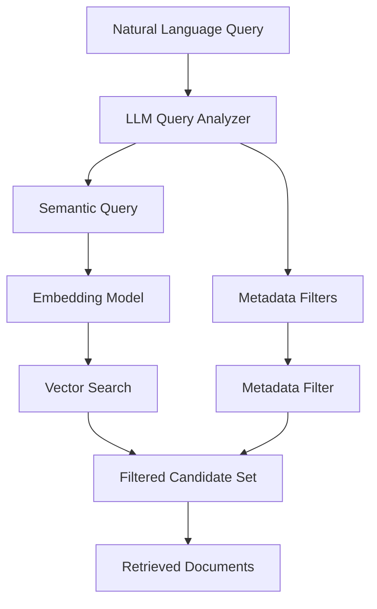
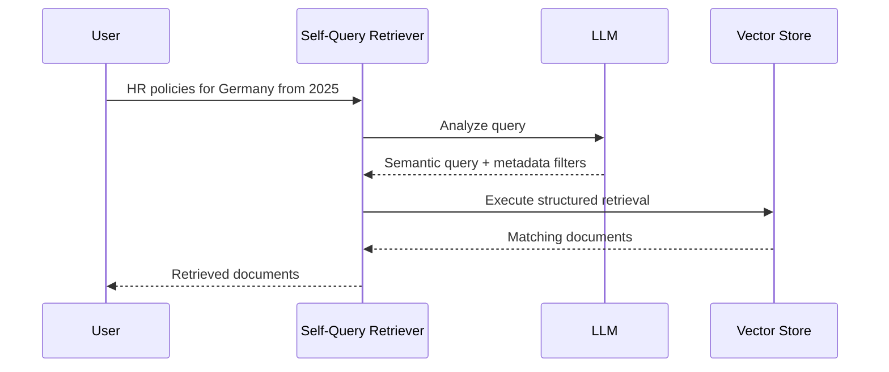
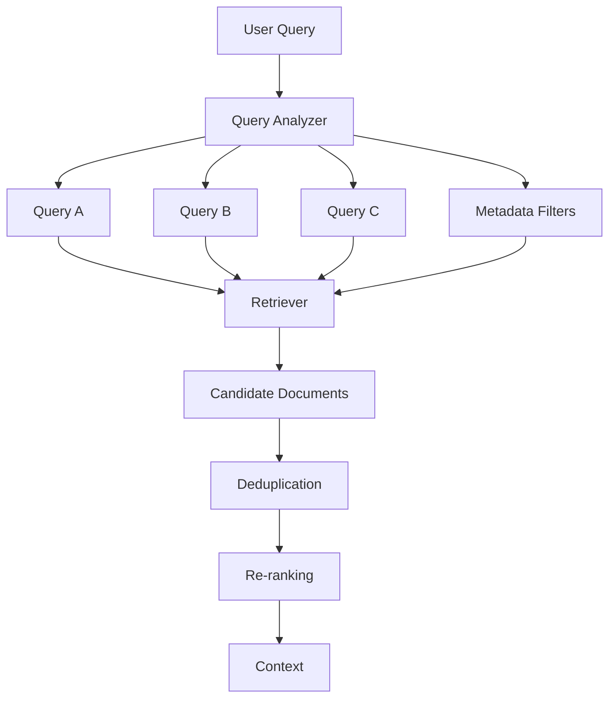
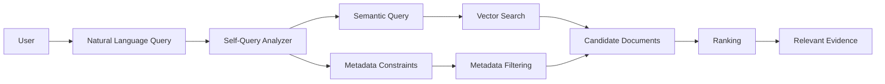
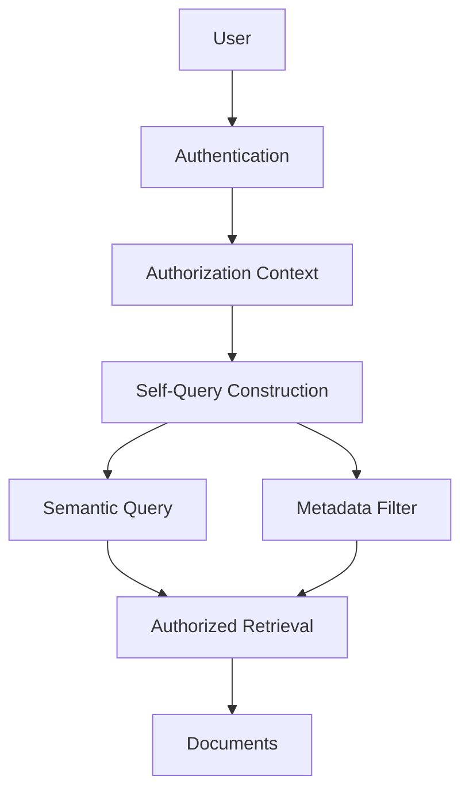
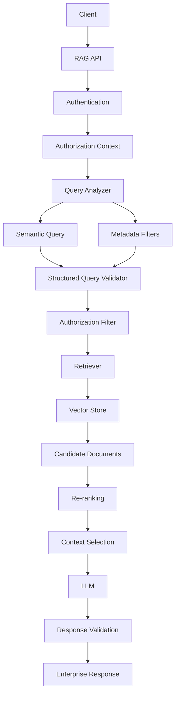
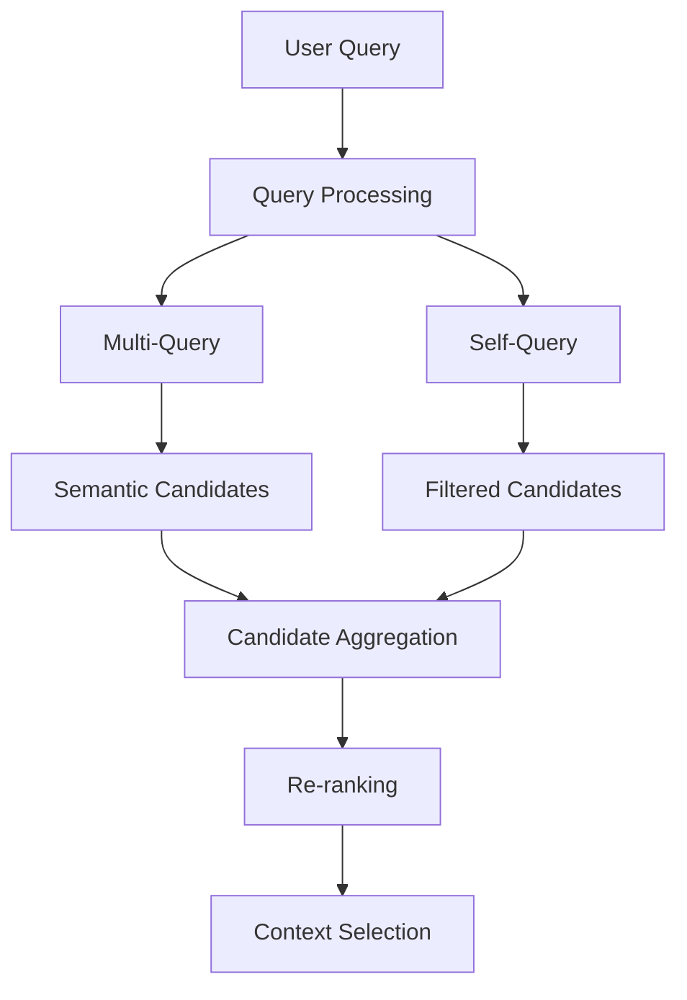

# Self-Query Retriever

## 📖 Overview

A **Self-Query Retriever** allows an AI application to translate a natural-language question into two complementary parts:

```text
Natural-Language Query
        ↓
┌─────────────────────────────┐
│ Query Understanding         │
├─────────────────────────────┤
│ Semantic Query              │
│ Metadata Filters            │
└─────────────────────────────┘
        ↓
Vector / Document Retrieval
```

A traditional VectorStore Retriever primarily asks:

> **Which documents are semantically similar to this query?**

A Self-Query Retriever additionally asks:

> **What structured constraints are expressed in this query?**

For example:

```text
"Find the 2025 HR policies for employees in Germany."
```

can be interpreted as:

```text
Semantic Query:
"HR policies for employees"

Metadata Filters:
country = Germany
year = 2025
document_type = policy
```

This makes Self-Query Retrieval particularly useful for **enterprise knowledge bases**, where documents contain rich metadata such as:

```text
Department
Country
Region
Document Type
Year
Product
Tenant
Security Classification
Version
```

---

## 🎯 Learning Objectives

After completing this chapter, you will be able to:

- Understand the Self-Query Retrieval pattern
- Distinguish semantic search from metadata filtering
- Understand how an LLM converts natural language into structured retrieval constraints
- Design a Self-Query Retriever pipeline
- Implement a basic Self-Query Retriever
- Understand metadata schemas
- Combine semantic search with metadata filtering
- Understand the importance of type-safe metadata handling
- Identify common Self-Query Retrieval failure modes
- Apply Self-Query Retrieval to enterprise knowledge systems
- Understand when Self-Query Retrieval is preferable to basic vector retrieval

---

# 1. The Problem with Basic Vector Retrieval

Consider an enterprise document repository:

```text
Documents
──────────────────────────────────────
Germany HR Policy — 2025
Germany HR Policy — 2024
US HR Policy — 2025
Germany Finance Policy — 2025
India HR Policy — 2025
```

Suppose the user asks:

```text
"Show me the HR policies for Germany from 2025."
```

A basic semantic retriever might retrieve:

```text
Germany HR Policy — 2025     ← Relevant
Germany HR Policy — 2024     ← Similar
US HR Policy — 2025          ← Similar
Germany Finance Policy — 2025
India HR Policy — 2025
```

Why?

Because semantic similarity alone does not necessarily enforce:

```text
country = Germany
year = 2025
document_type = HR policy
```

The query contains both:

```text
Semantic Intent
+
Structured Constraints
```

Self-Query Retrieval is designed to separate them.

---

# 2. Core Concept

The central idea is:

```text
User Query
    ↓
LLM Query Analyzer
    ↓
┌──────────────────────────┐
│ Query                    │
│                          │
│ "HR policies for         │
│  employees"              │
│                          │
│ Filters                  │
│ country = Germany        │
│ year = 2025              │
└──────────────────────────┘
    ↓
Vector Search + Metadata Filter
    ↓
Relevant Documents
```

So instead of treating the entire query as plain text, the system extracts its structured meaning.

---

# 3. Semantic Query vs Structured Filter

Consider:

```text
"Find architecture documents about Kubernetes
published after 2024 in the platform engineering team."
```

The query can be separated into:

### Semantic component

```text
architecture documents about Kubernetes
```

### Structured components

```text
year > 2024
team = platform engineering
```

The retrieval operation becomes:

```text
Semantic Search
        +
Metadata Filtering
        ↓
Relevant Documents
```

This distinction is fundamental.

---

# 4. Self-Query Retrieval Architecture



The LLM is therefore not generating the final answer.

It is helping construct a **structured retrieval request**.

```text
User
 ↓
Natural Language
 ↓
Query Understanding
 ↓
Structured Retrieval Request
 ↓
Retriever
 ↓
Documents
```

---

# 5. Why This Matters in Enterprise RAG

Enterprise documents frequently contain metadata.

For example:

```json
{
  "document_id": "HR-2025-001",
  "department": "HR",
  "country": "Germany",
  "document_type": "policy",
  "year": 2025,
  "classification": "internal"
}
```

A user may naturally express these constraints without explicitly using filter syntax.

```text
"Show me the internal HR policies
for Germany from 2025."
```

The application should ideally understand:

```text
department = HR
country = Germany
year = 2025
classification = internal
document_type = policy
```

This is where Self-Query Retrieval becomes valuable.

---

# 6. Metadata Schema

Self-Query Retrieval depends heavily on a well-defined metadata schema.

For example:

```python
metadata_schema = {
    "department": "string",
    "country": "string",
    "year": "integer",
    "document_type": "string",
    "classification": "string"
}
```

The LLM needs to understand:

```text
Field Name
Field Type
Field Meaning
Allowed Values
```

For example:

| Field | Type | Example |
|---|---|---|
| `department` | String | HR |
| `country` | String | Germany |
| `year` | Integer | 2025 |
| `document_type` | String | policy |
| `classification` | String | internal |

A good metadata schema significantly improves query interpretation.

---

# 7. Structured Query Representation

A Self-Query Retriever can conceptually transform:

```text
"Find HR policies for Germany from 2025."
```

into:

```json
{
  "query": "HR policies",
  "filter": {
    "department": "HR",
    "country": "Germany",
    "year": 2025
  }
}
```

The exact internal representation depends on the framework and vector store.

The important architectural concept is:

```text
Natural Language
       ↓
Structured Retrieval Request
       ↓
Semantic Query + Metadata Filter
```

---

# 8. Basic LangChain Example

LangChain provides a Self-Query Retriever abstraction.

A simplified example looks like:

```python
from langchain.retrievers.self_query.base import SelfQueryRetriever
from langchain.chains.query_constructor.base import AttributeInfo

metadata_field_info = [
    AttributeInfo(
        name="department",
        description="Department responsible for the document",
        type="string",
    ),
    AttributeInfo(
        name="country",
        description="Country associated with the document",
        type="string",
    ),
    AttributeInfo(
        name="year",
        description="Publication year",
        type="integer",
    ),
    AttributeInfo(
        name="document_type",
        description="Type of document",
        type="string",
    ),
]

retriever = SelfQueryRetriever.from_llm(
    llm=llm,
    vectorstore=vector_store,
    document_contents="Enterprise company documents",
    metadata_field_info=metadata_field_info,
)
```

Then the application can issue a natural-language query:

```python
documents = retriever.invoke(
    "Find HR policies for Germany from 2025."
)

for document in documents:
    print(document.page_content)
```

The important point is that the application does not need to manually construct:

```python
filter={
    "country": "Germany",
    "year": 2025
}
```

The Self-Query Retriever attempts to infer those constraints.

---

# 9. What Happens Internally?

Conceptually:



The process is:

```text
1. Receive natural-language query
2. Analyze query intent
3. Extract structured constraints
4. Build semantic query
5. Build metadata filter
6. Execute retrieval
7. Return documents
```

---

# 10. Example Query Transformations

### Example 1

```text
Find HR policies for Germany.
```

Possible interpretation:

```text
Query:
HR policies

Filter:
country = Germany
```

---

### Example 2

```text
Find finance reports from 2025.
```

Possible interpretation:

```text
Query:
finance reports

Filter:
year = 2025
```

---

### Example 3

```text
Find security documents created after 2024.
```

Possible interpretation:

```text
Query:
security documents

Filter:
year > 2024
```

---

### Example 4

```text
Find documents about Kubernetes
from the platform engineering team.
```

Possible interpretation:

```text
Query:
Kubernetes

Filter:
team = platform engineering
```

---

# 11. Comparison with Manual Filtering

Without Self-Query Retrieval:

```python
query = "HR policies"

filter = {
    "country": "Germany",
    "year": 2025
}

documents = vector_store.similarity_search(
    query,
    filter=filter
)
```

The application must explicitly determine the filters.

With Self-Query Retrieval:

```python
documents = retriever.invoke(
    "Find HR policies for Germany from 2025."
)
```

The retriever attempts to derive the filter from the natural-language request.

This provides a more natural interface for users.

---

# 12. Self-Query vs Multi-Query

Self-Query Retrieval and Multi-Query Retrieval solve different problems.

| Technique | Primary Goal |
|---|---|
| VectorStore Retriever | Semantic similarity |
| Multi-Query Retriever | Multiple semantic perspectives |
| Self-Query Retriever | Semantic query + metadata constraints |
| Parent-Document Retriever | Preserve parent context |

### Multi-Query

```text
Question
 ↓
Query A
Query B
Query C
 ↓
Multiple Retrieval Paths
```

### Self-Query

```text
Question
 ↓
Semantic Query
+
Metadata Filter
 ↓
Filtered Retrieval
```

The two techniques can also be combined.

---

# 13. Combining Multi-Query and Self-Query

A more advanced system could perform:

```text
User Query
     ↓
Query Analysis
     ↓
Multiple Search Perspectives
     ↓
Metadata Constraints
     ↓
Retrieval
     ↓
Deduplication
     ↓
Re-ranking
```

For example:

```text
"Find security policies for European
offices from 2025."
```

Potential queries:

```text
Security policies
Security controls
Security standards
```

With shared constraints:

```text
region = Europe
year = 2025
document_type = policy
```

Architecture:



This is a useful future composition pattern for enterprise RAG.

---

# 14. Supported Filter Operators

Depending on the vector database, filters may support operations such as:

```text
=
!=
>
>=
<
<=
IN
NOT IN
AND
OR
```

For example:

```json
{
  "year": {
    "$gte": 2025
  }
}
```

or:

```json
{
  "$and": [
    {
      "country": "Germany"
    },
    {
      "year": {
        "$gte": 2025
      }
    }
  ]
}
```

The exact syntax is **vector-store specific**.

Therefore, the retrieval abstraction should not assume that every database supports identical filter operators.

---

# 15. Metadata Types Matter

Consider:

```text
year = "2025"
```

versus:

```text
year = 2025
```

These are different data types.

If the metadata schema says:

```text
year → integer
```

then the retrieval layer should preserve that type.

This becomes particularly important for:

```text
Greater Than
Less Than
Date Ranges
Numeric Ranges
```

For example:

```text
"Documents after 2024"
```

requires an ordered comparison:

```text
year > 2024
```

A string-based representation may not behave as expected.

---

# 16. Dates and Ranges

Enterprise metadata frequently contains dates.

For example:

```json
{
  "created_at": "2026-02-15",
  "department": "Finance"
}
```

A natural-language query might be:

```text
"Show me finance reports created after January 2026."
```

The system may need to derive:

```text
Query:
finance reports

Filter:
created_at > 2026-01-31
```

Date handling requires careful normalization.

Production systems should define:

```text
Timezone
Date Format
Comparison Semantics
Inclusive / Exclusive Boundaries
```

rather than relying entirely on LLM interpretation.

---

# 17. Metadata Descriptions Are Important

Compare:

```python
AttributeInfo(
    name="year",
    description="Year",
    type="integer"
)
```

with:

```python
AttributeInfo(
    name="year",
    description=(
        "Four-digit publication year of the document. "
        "Use this field for date-based filtering."
    ),
    type="integer"
)
```

The second description provides more context.

Good metadata descriptions should explain:

```text
What the field represents
How it should be interpreted
What values it contains
```

This helps the query-construction model produce more reliable filters.

---

# 18. Metadata Cardinality

Not every metadata field is equally useful for filtering.

Consider:

```text
country
department
document_type
year
document_id
```

`country` may have:

```text
50–200 possible values
```

while `document_id` may have:

```text
Millions of unique values
```

High-cardinality fields can behave differently depending on the underlying database and index design.

Metadata design should therefore consider:

```text
Field Meaning
+
Cardinality
+
Filter Frequency
+
Indexing Strategy
+
Storage Cost
```

---

# 19. Enterprise Example

Imagine an organization with:

```text
50,000 Documents

Departments:
HR
Finance
Engineering
Legal
Security

Regions:
Europe
Asia
North America

Document Types:
Policy
Procedure
Report
Standard
Contract
```

A user asks:

```text
"Find the latest security policies
for European offices."
```

A Self-Query Retriever can conceptually derive:

```text
Semantic Query:
security policies

Filters:
region = Europe
document_type = policy
latest / highest applicable version
```

The retrieval flow becomes:



---

# 20. Self-Query and Authorization

Self-Query Retrieval must not be confused with authorization.

Suppose:

```text
User:
"What are the executive compensation policies?"
```

The system may derive:

```text
document_type = compensation
```

But that does **not** mean the user is allowed to retrieve those documents.

The architecture should enforce:



Security constraints should be applied independently.

A user-controlled or LLM-generated filter must never be considered an authorization mechanism.

---

# 21. Failure Modes

Self-Query Retrieval introduces several important failure modes.

## 21.1 Incorrect Filter Extraction

User:

```text
"Show me recent HR policies."
```

The LLM may incorrectly infer:

```text
year > 2025
```

when the application has no explicit definition of "recent".

The system should avoid pretending that vague language has a precise business meaning unless such semantics are defined.

---

## 21.2 Wrong Metadata Field

Suppose the metadata contains:

```text
department
business_unit
team
```

The LLM may confuse:

```text
team = HR
```

with:

```text
department = HR
```

Clear metadata descriptions are important.

---

## 21.3 Unsupported Operator

The query may require:

```text
year > 2024
```

but the vector store may not support that operation in the expected form.

The application needs validation before executing the filter.

---

## 21.4 Filter Over-Restriction

Suppose:

```text
User:
"Find documents about cloud security."
```

The system incorrectly generates:

```text
document_type = policy
```

The retrieval set becomes unnecessarily small.

```text
Incorrect Filter
      ↓
Candidate Loss
      ↓
Lower Recall
```

---

## 21.5 Filter Under-Restriction

The opposite problem is:

```text
User:
"Find security policies from Germany."
```

but the generated filter only contains:

```text
document_type = policy
```

The system may return policies from every country.

---

# 22. Validation Layer

A production Self-Query Retriever should validate the generated retrieval request.


Validation can check:

```text
Is the field valid?
Is the operator supported?
Is the value type correct?
Is the filter allowed?
Is the user authorized?
```

Only then should the query reach the data layer.

---

# 23. Framework-Agnostic Design

A framework-independent representation can be useful.

```python
from dataclasses import dataclass
from typing import Any


@dataclass
class QueryFilter:
    field: str
    operator: str
    value: Any


@dataclass
class StructuredQuery:
    query: str
    filters: list[QueryFilter]
```

Example:

```python
structured_query = StructuredQuery(
    query="HR policies",
    filters=[
        QueryFilter(
            field="country",
            operator="=",
            value="Germany"
        ),
        QueryFilter(
            field="year",
            operator="=",
            value=2025
        )
    ]
)
```

Then an adapter can translate this representation into the syntax required by the selected vector store.

```text
Application
     ↓
Structured Query
     ↓
Retriever Adapter
     ↓
Vector Store
```

This keeps the enterprise application less coupled to a particular database.

---

# 24. Production Architecture

A robust Self-Query Retrieval architecture might look like:



Important telemetry includes:

```text
Original Query
Structured Query
Generated Filters
Validation Failures
Rejected Filters
Retrieval Latency
Candidate Count
Final Result Count
Re-ranking Scores
```

---

# 25. Evaluation

Self-Query Retrieval should be evaluated at multiple levels.

### Query Construction

```text
Was the semantic query correct?
```

### Filter Extraction

```text
Were the correct metadata filters generated?
```

### Filter Execution

```text
Did the vector store apply them correctly?
```

### Retrieval Quality

```text
Did the final documents contain the required evidence?
```

### End-to-End Answer

```text
Did the RAG system answer correctly?
```

A useful evaluation structure is:

```text
Natural Language Query
        ↓
Structured Query Accuracy
        ↓
Retrieval Accuracy
        ↓
Answer Quality
```

---

# 26. Example Evaluation Dataset

A test case could look like:

```json
{
  "question": "Find HR policies for Germany from 2025.",
  "expected_query": "HR policies",
  "expected_filters": {
    "department": "HR",
    "country": "Germany",
    "year": 2025
  }
}
```

The system output can then be compared against the expected structure.

This allows automated regression testing.

```text
Golden Query
     ↓
Self-Query Retriever
     ↓
Generated Structured Query
     ↓
Compare
     ↓
Pass / Fail
```

---

# 27. When to Use Self-Query Retrieval

Self-Query Retrieval is particularly useful when:

- Documents contain meaningful metadata
- Users naturally express filtering constraints
- The knowledge base contains many similar documents
- Search needs both semantic and structured constraints
- Users should not need to understand filter syntax

Examples:

```text
"Show the latest finance reports from Europe."

"Find security policies for Germany."

"Show engineering documents published after 2025."

"Find contracts for customer ABC."

"Show internal policies for the HR department."
```

---

# 28. When Not to Use It

Self-Query Retrieval may be unnecessary when:

```text
Metadata is minimal
```

or:

```text
Queries rarely contain filters
```

or:

```text
The application already has structured search parameters
```

For example, if the UI already provides:

```text
Department: HR
Country: Germany
Year: 2025
```

then manually constructing filters may be simpler and more reliable than asking an LLM to infer them.

This is an important engineering principle:

> **Do not use an LLM to infer information that the application already knows explicitly.**

---

# 29. Self-Query vs UI Filters

Consider an enterprise search interface.

### Explicit UI filters

```text
Department  [HR ▼]
Country     [Germany ▼]
Year        [2025 ▼]

Search:
"Parental leave"
```

The application already has structured values.

There is little reason to use Self-Query for those fields.

### Natural-language interface

```text
"Find parental leave policies
for Germany from 2025."
```

Here Self-Query Retrieval can provide a better natural-language experience.

The decision is:

```text
Structured Input Available?
       │
       ├── Yes → Use Explicit Filters
       │
       └── No → Self-Query may help
```

---

# 30. Self-Query + Parent-Document Retrieval

These retrieval techniques can also be composed.

For example:

```text
User Query
    ↓
Self-Query
    ↓
Metadata Filtering
    ↓
Parent-Document Retrieval
    ↓
Relevant Parent Documents
```

This is useful when metadata determines **which documents** are relevant while parent-child retrieval determines **how much surrounding context** should be returned.

---

# 31. Self-Query + Re-ranking

Another production pattern is:

```text
Natural Language Query
       ↓
Self-Query
       ↓
Metadata Filtering
       ↓
Vector Search
       ↓
Candidate Set
       ↓
Re-ranking
       ↓
Final Context
```

Here:

```text
Self-Query
    ↓
Improves candidate filtering

Re-ranking
    ↓
Improves candidate ordering
```

These solve different problems and complement each other.

---

# 32. Common Design Mistakes

### Mistake 1 — Treating LLM-generated filters as trusted

Never assume:

```text
LLM Output = Valid Filter
```

Always validate.

---

### Mistake 2 — Poor metadata descriptions

Bad:

```text
year → Year
```

Better:

```text
year → Four-digit publication year
```

---

### Mistake 3 — Using vague metadata semantics

For example:

```text
recent
important
high priority
```

These need explicit business definitions if they are expected to become filters.

---

### Mistake 4 — Ignoring authorization

Metadata filtering does not replace:

```text
Authentication
Authorization
Tenant Isolation
Access Control
```

---

### Mistake 5 — Overusing Self-Query

If the application already has structured filters, use them directly.

---

### Mistake 6 — Ignoring vector-store limitations

Filter syntax and supported operators differ across databases.

Use an adapter or capability layer rather than assuming universal behavior.

---

# 33. Retrieval Strategy Evolution

We now have three retrieval patterns:

```text
01 VectorStore Retriever
        ↓
Basic semantic retrieval


02 Multi-Query Retriever
        ↓
Multiple semantic perspectives


03 Self-Query Retriever
        ↓
Semantic retrieval + metadata constraints
```

These patterns can eventually be composed:



This is where retrieval engineering starts moving from isolated techniques toward **composable retrieval architectures**.

---

# 34. Enterprise Design Principle

A useful production principle is:

> **Separate query understanding, authorization, retrieval, and ranking into distinct responsibilities.**

```text
Query Understanding
        ↓
Structured Query
        ↓
Validation
        ↓
Authorization
        ↓
Retrieval
        ↓
Ranking
        ↓
Context Selection
```

This separation makes the system:

- Easier to test
- Easier to observe
- Easier to secure
- Easier to replace
- Easier to scale

---

# 35. Key Takeaways

- Self-Query Retrieval converts natural-language questions into semantic queries plus structured metadata filters.
- It is especially useful for enterprise knowledge bases with rich metadata.
- It combines semantic search with structured filtering.
- Metadata schemas are critical to reliable Self-Query Retrieval.
- Metadata field names, descriptions, and types should be explicit.
- Generated filters should always be validated before execution.
- LLM-generated filters are not authorization mechanisms.
- Authorization must remain an independent application responsibility.
- Self-Query Retrieval differs from Multi-Query Retrieval.
- Multi-Query improves retrieval coverage through multiple semantic perspectives.
- Self-Query adds structured constraints to semantic retrieval.
- Self-Query can be combined with Multi-Query, Parent-Document Retrieval, Hybrid Search, and Re-ranking.
- If structured filters are already available from the UI or API, explicit filtering is usually preferable.
- Vector-store filter syntax is implementation-specific.
- Production systems should evaluate query construction, filter accuracy, retrieval quality, latency, and cost.
- Self-Query Retrieval is most valuable when users express structured constraints naturally in their questions.

The core pattern is:

```text
Natural Language
      ↓
Query Understanding
      ↓
┌─────────────────────┐
│ Semantic Query      │
│         +           │
│ Metadata Filters    │
└─────────────────────┘
      ↓
Validated Retrieval
      ↓
Relevant Documents
```

---

# 🧭 Chapter Navigation

### Part V — Advanced Retrieval-Augmented Generation

**Previous:**  
[02. Multi-Query Retriever](02-multi-query-retriever.md)

**Next:**  
[04. Parent-Document Retriever](04-parent-document-retriever.md)

**Section:**  
01 — Core Retrieval Engineering

### Retrieval Engineering Path

```text
01 VectorStore Retriever
          ↓
02 Multi-Query Retriever
          ↓
03 Self-Query Retriever
          ↓
04 Parent-Document Retriever
          ↓
05 Retriever Comparison
```

---

> **Enterprise AI Engineering Handbook**  
> *Building Production-Grade Enterprise AI Systems — One Chapter at a Time.*