# Parent-Document Retriever

## 📖 Overview

A **Parent-Document Retriever** solves an important RAG problem:

> **Small chunks are often better for retrieval, but larger parent documents are often better for understanding context.**

Traditional RAG commonly follows:

```text
Document
   ↓
Chunking
   ↓
Small Chunks
   ↓
Embeddings
   ↓
Vector Store
   ↓
Retrieve Chunks
   ↓
LLM
```

Small chunks improve retrieval precision because they represent focused pieces of information.

However, returning only a small chunk can remove important surrounding context.

Parent-Document Retrieval separates these two concerns:

```text
Small Child Chunk
        ↓
Used for Retrieval

Large Parent Document
        ↓
Used for Generation Context
```

The basic idea is:

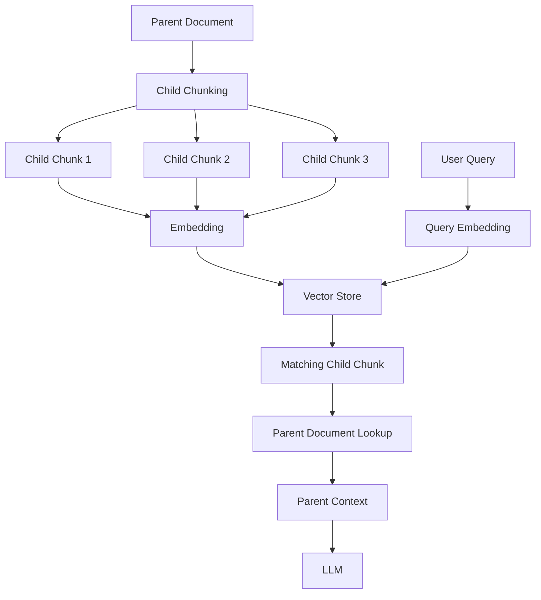

This allows the system to retrieve with **fine-grained precision** while generating with **richer context**.

---

## 🎯 Learning Objectives

After completing this chapter, you will be able to:

- Understand Parent-Document Retrieval
- Understand the difference between parent and child documents
- Understand why small chunks can improve retrieval
- Understand why larger context can improve generation
- Design a Parent-Document Retriever
- Understand parent-child relationships
- Implement a basic Parent-Document Retriever
- Understand metadata propagation
- Understand document and chunk identifiers
- Understand storage requirements
- Combine Parent-Document Retrieval with vector search
- Understand its relationship with hierarchical retrieval
- Identify common implementation mistakes
- Apply Parent-Document Retrieval to enterprise RAG systems

---

# 1. The Core Problem

Consider a policy document:

```text
Remote Work Policy

Section 1 — Eligibility
...

Section 2 — Working Arrangements
...

Section 3 — Office Attendance
...

Section 4 — Exceptions
...

Section 5 — Manager Responsibilities
...
```

Suppose the document is split into small chunks:

```text
Chunk 1:
Employees are eligible for remote work...

Chunk 2:
Employees may work remotely up to three days...

Chunk 3:
Managers may approve additional remote work...

Chunk 4:
Exceptions may apply to specific roles...
```

A user asks:

```text
"Who can approve additional remote work?"
```

The best matching chunk might be:

```text
Chunk 3
```

That is excellent for retrieval.

But perhaps the answer depends on information in:

```text
Section 2
+
Section 3
+
Section 4
```

Returning only Chunk 3 may lose important context.

---

# 2. Small Chunks vs Large Chunks

There is a fundamental trade-off.

### Small chunks

```text
Advantages
──────────
Focused semantic meaning
Better retrieval precision
Less irrelevant text
Smaller embeddings
```

But:

```text
Disadvantages
─────────────
Less surrounding context
May split related information
Can lose references
```

### Large chunks

```text
Advantages
──────────
More context
Preserve relationships
Better for complex explanations
```

But:

```text
Disadvantages
─────────────
Less precise retrieval
More irrelevant information
Larger embedding representation
More context tokens
```

Parent-Document Retrieval attempts to combine the advantages.

```text
Retrieval
    ↓
Small Child Chunk

Generation
    ↓
Larger Parent Context
```

---

# 3. Parent and Child Documents

The terminology is important.

### Parent

The larger logical unit.

Examples:

```text
Document
Section
Chapter
Policy Section
Product Manual Section
```

### Child

The smaller searchable unit.

Examples:

```text
Paragraph
Small Chunk
Subsection
Sentence Group
```

Relationship:

```text
Parent Document
│
├── Child Chunk 1
├── Child Chunk 2
├── Child Chunk 3
└── Child Chunk 4
```

The child is indexed for retrieval.

The parent is returned as context.

---

# 4. Basic Architecture

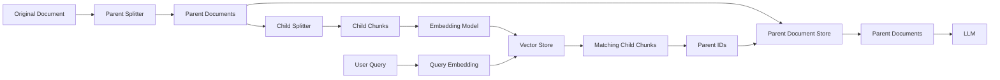

There are therefore two storage concerns:

```text
Vector Store
    ↓
Child chunks + embeddings

Parent Store
    ↓
Parent documents
```

---

# 5. Why Retrieve Children?

Suppose a parent document contains:

```text
10,000 words
```

and the user asks:

```text
"What is the maximum remote work allowance?"
```

Embedding the entire document may produce a broad representation.

Instead, the document can be divided:

```text
10,000-word Parent
        ↓
100 Child Chunks
        ↓
100 Embeddings
```

The query can then identify:

```text
Child Chunk 47
```

as the best semantic match.

The system then maps:

```text
Child Chunk 47
        ↓
Parent Document 12
```

and retrieves the larger parent context.

---

# 6. Parent-Child Mapping

Each child should maintain a reference to its parent.

For example:

```json
{
  "child_id": "chunk-047",
  "parent_id": "policy-012",
  "content": "Employees may work remotely...",
  "metadata": {
    "document_type": "policy",
    "department": "HR"
  }
}
```

The relationship is:

```text
child_id
   ↓
parent_id
   ↓
parent document
```

This identifier is essential for parent lookup.

---

# 7. Example

Suppose we have:

```text
Parent:
remote-work-policy

Children:

remote-work-policy#001
remote-work-policy#002
remote-work-policy#003
remote-work-policy#004
```

The query:

```text
"How many days can employees work remotely?"
```

retrieves:

```text
remote-work-policy#002
```

The system then performs:

```text
child_id
   ↓
parent_id
   ↓
remote-work-policy
```

and returns the parent context.

---

# 8. Standard RAG vs Parent-Document RAG

### Standard RAG

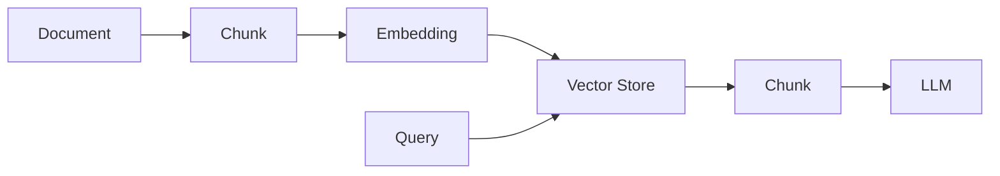

### Parent-Document RAG

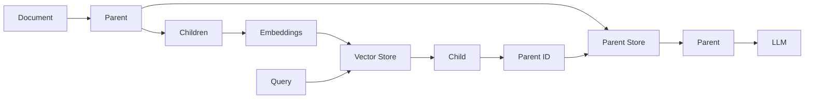

The key difference is:

```text
Standard RAG:
Retrieve → Generate from chunk

Parent-Document RAG:
Retrieve child → Recover parent → Generate from parent
```

---

# 9. Parent Size and Child Size

The most important design decisions are:

```text
Parent Size
+
Child Size
+
Overlap
```

For example:

```text
Parent:
1,500 tokens

Child:
300 tokens

Overlap:
50 tokens
```

This is only an example.

There is no universal optimal configuration.

The correct sizes depend on:

- Document structure
- Query type
- Embedding model
- LLM context window
- Retrieval quality
- Document semantics
- Expected answer complexity

---

# 10. Hierarchical Chunking

A document can be represented hierarchically:

```text
Document
   │
   ├── Section
   │     ├── Child Chunk
   │     ├── Child Chunk
   │     └── Child Chunk
   │
   ├── Section
   │     ├── Child Chunk
   │     └── Child Chunk
   │
   └── Section
         ├── Child Chunk
         └── Child Chunk
```

This creates a hierarchy:

```text
Document
   ↓
Parent
   ↓
Child
```

Parent-Document Retrieval is therefore closely related to **hierarchical retrieval**, although the implementation can be simpler.

---

# 11. LangChain Implementation

LangChain provides a `ParentDocumentRetriever` abstraction.

A simplified example:

```python
from langchain.retrievers import ParentDocumentRetriever
from langchain.storage import InMemoryStore
from langchain_chroma import Chroma

vectorstore = Chroma(
    collection_name="child_chunks",
    embedding_function=embeddings
)

store = InMemoryStore()

retriever = ParentDocumentRetriever(
    vectorstore=vectorstore,
    docstore=store,
    child_splitter=child_splitter,
    parent_splitter=parent_splitter
)
```

Documents can then be added:

```python
retriever.add_documents(documents)

results = retriever.invoke(
    "How many days can employees work remotely?"
)
```

The conceptual implementation is:

```text
Original Documents
        ↓
Parent Splitter
        ↓
Parent Documents
        ↓
Child Splitter
        ↓
Child Chunks
        ↓
Embedding
        ↓
Vector Store
```

At query time:

```text
Query
 ↓
Vector Search
 ↓
Child Chunk
 ↓
Parent ID
 ↓
Parent Store
 ↓
Parent Document
```

---

# 12. Parent Splitter

The parent splitter defines the larger retrieval context.

Example:

```python
from langchain_text_splitters import RecursiveCharacterTextSplitter

parent_splitter = RecursiveCharacterTextSplitter(
    chunk_size=2000,
    chunk_overlap=200
)
```

This might produce:

```text
Document
   ↓
Parent 1
Parent 2
Parent 3
...
```

The parent is not necessarily stored in the vector database.

It can be stored in a separate document store.

---

# 13. Child Splitter

The child splitter creates smaller searchable units.

```python
child_splitter = RecursiveCharacterTextSplitter(
    chunk_size=400,
    chunk_overlap=50
)
```

The relationship becomes:

```text
Parent 1
│
├── Child 1
├── Child 2
├── Child 3
└── Child 4
```

The child chunks are what the vector search indexes.

---

# 14. Why Two Splitters?

Using separate parent and child splitters provides control over two different objectives.

### Parent splitter

Optimizes:

```text
Context
Completeness
Semantic continuity
```

### Child splitter

Optimizes:

```text
Retrieval precision
Search granularity
Embedding quality
```

Therefore:

```text
Parent Splitter
      ↓
Context Optimization

Child Splitter
      ↓
Retrieval Optimization
```

This is one of the most important ideas in Parent-Document Retrieval.

---

# 15. Parent Document Store

The vector store and parent store serve different purposes.

```text
Vector Store
────────────
Child embeddings
Child content
Child metadata


Parent Store
────────────
Parent content
Parent metadata
```

Architecture:

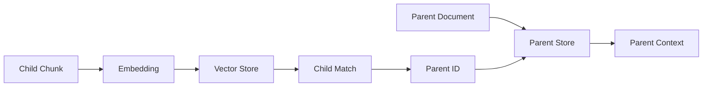

A production system may use:

```text
Vector Database
+
Document Database / Object Storage / Key-Value Store
```

depending on the application's requirements.

---

# 16. Metadata Propagation

Metadata should generally be associated with both parent and child representations.

Example:

### Parent

```json
{
  "parent_id": "policy-001",
  "department": "HR",
  "country": "Germany",
  "document_type": "policy",
  "year": 2026
}
```

### Child

```json
{
  "child_id": "policy-001-chunk-04",
  "parent_id": "policy-001",
  "department": "HR",
  "country": "Germany",
  "document_type": "policy",
  "year": 2026
}
```

This allows the child retrieval layer to apply metadata filters while still resolving the parent.

---

# 17. Parent-Document Retrieval with Metadata

Suppose the query is:

```text
"Find Germany HR policies about remote work."
```

The retrieval pipeline can be:

```text
Query
   ↓
Semantic Search
   +
Metadata Filter
   ↓
Child Chunks
   ↓
Parent IDs
   ↓
Parent Documents
```

This combines the concepts from the previous chapter:

```text
Self-Query
     +
Parent-Document Retrieval
```

A more advanced architecture becomes:

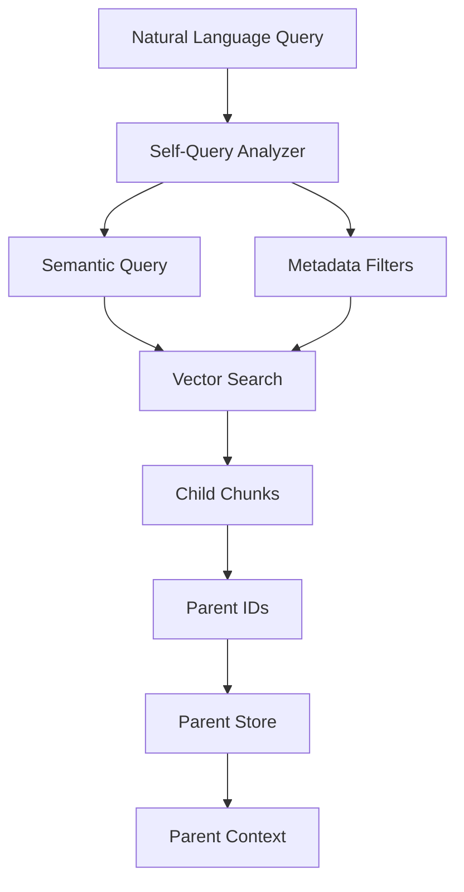

---

# 18. Multiple Child Matches

A query may match multiple children belonging to the same parent.

For example:

```text
Query
 ↓
Child 04 → Parent A
Child 07 → Parent A
Child 12 → Parent B
Child 18 → Parent C
```

If the application simply retrieves parents, it may end up with:

```text
Parent A
Parent A
Parent B
Parent C
```

The system should deduplicate parent IDs:

```text
Parent A
Parent B
Parent C
```

This is an important implementation detail.

---

# 19. Parent Expansion

Another design choice is how much parent context to return.

### Full parent

```text
Child Match
   ↓
Entire Parent
```

### Partial parent

```text
Child Match
   ↓
Relevant Parent Section
```

### Neighbor expansion

```text
Child Match
   ↓
Child
+
Previous Child
+
Next Child
```

The appropriate approach depends on document structure.

---

# 20. Parent Retrieval Does Not Always Mean "Entire Document"

A common misconception is:

```text
Parent = Entire Original Document
```

This is not necessary.

A parent could be:

```text
Entire Document
```

or:

```text
Document Section
```

or:

```text
Chapter
```

or:

```text
Policy Section
```

or:

```text
Product Manual Section
```

A better definition is:

> **A parent is the larger logical context associated with the retrieved child unit.**

---

# 21. Example: Technical Documentation

Suppose a technical manual contains:

```text
Kubernetes Deployment Guide

Chapter 1 — Architecture
Chapter 2 — Cluster Setup
Chapter 3 — Networking
Chapter 4 — Security
Chapter 5 — Monitoring
```

Each chapter can become a parent:

```text
Parent: Networking
   ├── Chunk 1
   ├── Chunk 2
   ├── Chunk 3
   └── Chunk 4
```

The query:

```text
"How does the ingress controller route traffic?"
```

might retrieve:

```text
Networking → Chunk 3
```

The system can then return:

```text
Networking Parent
```

instead of only the single chunk.

This can preserve definitions and related explanations.

---

# 22. Example: Enterprise Policy

Suppose:

```text
Parent:
Remote Work Policy — Section 4

Children:
4.1 Eligibility
4.2 Approval
4.3 Exceptions
4.4 Manager Responsibilities
```

The query:

```text
"Who approves exceptions to remote work?"
```

might match:

```text
4.3 Exceptions
```

The parent section can provide:

```text
Eligibility
Approval
Exceptions
Manager Responsibilities
```

This may provide the LLM with enough surrounding context to generate a more reliable answer.

---

# 23. Parent-Document Retrieval vs Larger Chunks

An obvious alternative is:

```text
Simply make the chunks larger.
```

For example:

```text
Chunk size = 2,000 tokens
```

This can work, but it introduces a trade-off:

```text
Large Chunk
    ↓
Better Context
    ↓
Potentially Worse Retrieval Precision
```

Parent-Document Retrieval separates:

```text
Search Granularity
        ≠
Context Granularity
```

This is its central architectural advantage.

---

# 24. Retrieval Granularity vs Generation Granularity

The concept can be visualized as:

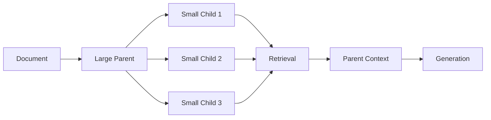

Therefore:

```text
Retrieval Granularity
        ↓
Fine

Generation Context
        ↓
Broader
```

This separation is one of the most useful patterns for enterprise RAG.

---

# 25. Parent-Document Retriever vs Multi-Query Retriever

These techniques solve different problems.

| Technique | Main Problem |
|---|---|
| VectorStore Retriever | Basic semantic retrieval |
| Multi-Query Retriever | Multiple query perspectives |
| Self-Query Retriever | Metadata-aware retrieval |
| Parent-Document Retriever | Retrieval precision vs context completeness |

### Multi-Query

```text
One Question
 ↓
Multiple Search Queries
 ↓
More Retrieval Coverage
```

### Parent-Document

```text
One Search Query
 ↓
Small Child Match
 ↓
Larger Parent Context
```

They can be combined.

---

# 26. Parent-Document Retriever with Multi-Query

A more advanced architecture:

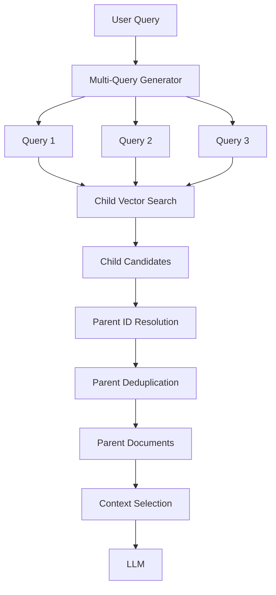

This combines:

```text
Multi-Query
+
Fine-Grained Child Retrieval
+
Parent Context
```

---

# 27. Parent-Document Retriever with Re-ranking

Another powerful architecture is:

```text
Query
 ↓
Child Retrieval
 ↓
Candidate Children
 ↓
Re-ranking
 ↓
Top Child Matches
 ↓
Parent Resolution
 ↓
Parent Context
```

Alternatively:

```text
Query
 ↓
Child Retrieval
 ↓
Parent Resolution
 ↓
Parent-Level Re-ranking
 ↓
Context
```

Which approach is better depends on:

- Number of candidate children
- Parent size
- Ranking model
- Retrieval latency
- Application requirements

This is a production architecture decision rather than a universal rule.

---

# 28. Storage Architecture

A production implementation may look like:

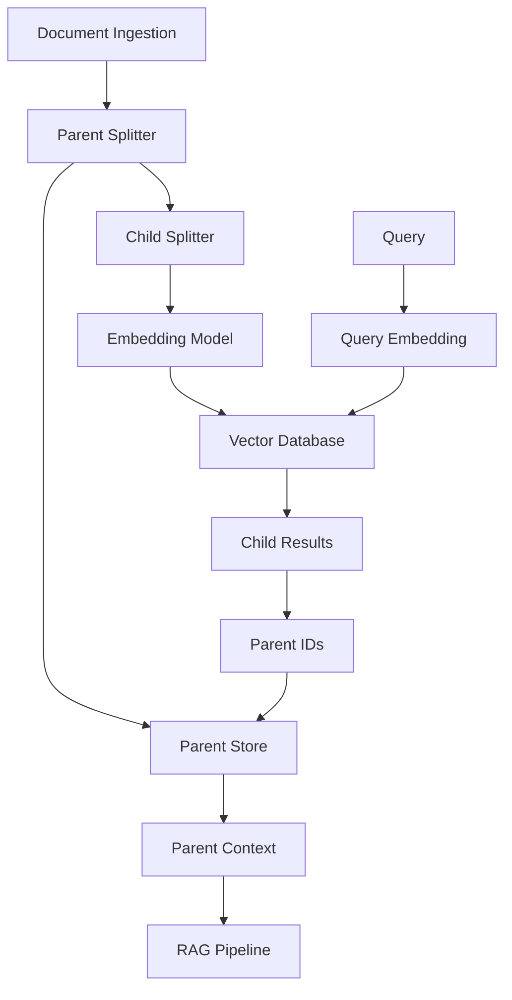

Possible storage technologies include:

```text
Vector Database
    ↓
FAISS
Chroma
Milvus
pgvector
Managed Vector Databases

Parent Store
    ↓
Object Storage
Document Database
Key-Value Store
Relational Database
```

The exact combination depends on the production architecture.

---

# 29. Performance Considerations

Parent-Document Retrieval introduces an additional lookup.

```text
Query
 ↓
Vector Search
 ↓
Child
 ↓
Parent Lookup
 ↓
Context
```

This means the system may have:

```text
Vector Search Latency
+
Parent Store Latency
```

For high-throughput systems, parent lookup should be designed carefully.

Potential optimizations include:

- Batch parent lookups
- Cache frequently accessed parents
- Store parent documents close to the retrieval service
- Use efficient parent identifiers
- Avoid unnecessary parent retrieval
- Deduplicate parent IDs before lookup

---

# 30. Parent Deduplication

Suppose retrieval returns:

```text
Child 1 → Parent A
Child 2 → Parent A
Child 3 → Parent B
Child 4 → Parent A
```

Instead of performing:

```text
Lookup Parent A
Lookup Parent A
Lookup Parent B
Lookup Parent A
```

the application should first derive:

```text
Parent A
Parent B
```

and then perform a batch lookup.

```python
parent_ids = list({
    document.metadata["parent_id"]
    for document in child_documents
})

parents = parent_store.get_many(parent_ids)
```

This can significantly reduce unnecessary storage calls.

---

# 31. Context Explosion

Parent retrieval introduces another important risk.

Suppose:

```text
Top-K children = 10
```

and each child belongs to a different parent:

```text
10 children
 ↓
10 parents
 ↓
10 large contexts
```

The context sent to the LLM may become too large.

Therefore:

```text
Child Retrieval
      ↓
Parent Resolution
      ↓
Context Selection
      ↓
LLM
```

is often better than:

```text
Child Retrieval
      ↓
All Parents
      ↓
LLM
```

Parent retrieval should therefore be followed by a **context selection strategy** when parent documents are large.

---

# 32. Parent Selection Strategies

Possible strategies include:

### Strategy 1 — Return all unique parents

```text
Children
 ↓
Unique Parents
 ↓
LLM
```

Simple but potentially expensive.

### Strategy 2 — Limit parent count

```text
Children
 ↓
Unique Parents
 ↓
Top N Parents
 ↓
LLM
```

### Strategy 3 — Re-rank parents

```text
Children
 ↓
Parent Resolution
 ↓
Parent Re-ranking
 ↓
Best Parents
 ↓
LLM
```

### Strategy 4 — Extract relevant sections

```text
Parent
 ↓
Relevant Section
 ↓
LLM
```

The right strategy depends on the application.

---

# 33. Metadata and Parent Context

Parent metadata can also be used to construct better prompts.

For example:

```json
{
  "document_title": "Remote Work Policy",
  "section": "Exceptions",
  "country": "Germany",
  "version": "2026.1"
}
```

The context builder can create:

```text
Source:
Remote Work Policy

Section:
Exceptions

Country:
Germany

Version:
2026.1

Content:
...
```

This improves traceability and can support citations later in the production RAG pipeline.

---

# 34. Framework-Agnostic Implementation

A simple abstraction can separate parent retrieval from the underlying storage technology.

```python
class ParentDocumentStore:

    def __init__(self, storage):
        self.storage = storage

    def get(self, parent_id):
        return self.storage.get(parent_id)

    def get_many(self, parent_ids):
        return self.storage.get_many(parent_ids)
```

The retriever can then compose:

```python
class ParentDocumentRetriever:

    def __init__(
        self,
        child_retriever,
        parent_store
    ):
        self.child_retriever = child_retriever
        self.parent_store = parent_store

    def retrieve(self, query):

        children = self.child_retriever.retrieve(query)

        parent_ids = list({
            child["metadata"]["parent_id"]
            for child in children
        })

        return self.parent_store.get_many(parent_ids)
```

Architecture:

```text
Application
     ↓
ParentDocumentRetriever
     ├── Child Retriever
     └── Parent Store
```

This keeps the architecture modular.

---

# 35. Testing Parent-Child Relationships

Parent-Document Retrieval should be tested during ingestion.

For each child:

```text
child_id
parent_id
content
metadata
```

must be valid.

A simple validation could be:

```python
for child in child_documents:

    assert child.metadata.get("parent_id")

    parent = parent_store.get(
        child.metadata["parent_id"]
    )

    assert parent is not None
```

This catches broken parent-child relationships before they reach production.

---

# 36. Common Mistakes

## Mistake 1 — Making parents too large

```text
Huge Parent
    ↓
Context Explosion
    ↓
High Token Cost
```

---

## Mistake 2 — Making children too small

```text
Tiny Child
    ↓
Insufficient Semantic Meaning
    ↓
Poor Embedding
    ↓
Poor Retrieval
```

---

## Mistake 3 — Losing parent IDs

Without:

```text
child → parent
```

the retrieval system cannot recover the parent context.

---

## Mistake 4 — Duplicating parents

Multiple children may map to the same parent.

Always deduplicate parent IDs.

---

## Mistake 5 — Returning every parent

Retrieving 20 children could produce 20 large parents.

Use context selection when necessary.

---

## Mistake 6 — Treating parent retrieval as a substitute for re-ranking

Parent retrieval solves:

```text
Context granularity
```

Re-ranking solves:

```text
Candidate ordering
```

They are complementary.

---

# 37. When Should You Use Parent-Document Retrieval?

It is particularly useful when:

- Documents contain logical sections
- Individual chunks are too small to answer questions independently
- Context from surrounding sections matters
- Retrieval precision benefits from smaller chunks
- Documents have strong parent-child structure
- Enterprise policies or technical manuals are being searched

Good examples include:

```text
Policy Documents
Technical Manuals
Product Documentation
Legal Documents
Compliance Documents
Research Papers
Engineering Documentation
Enterprise Procedures
```

---

# 38. When It May Not Be Necessary

You may not need Parent-Document Retrieval when:

```text
Documents are already short
```

or:

```text
Chunks are independently self-contained
```

or:

```text
Retrieval context is naturally small
```

For example:

```text
FAQ Dataset
```

where each record is:

```text
Question
+
Answer
```

may not benefit significantly from parent expansion.

---

# 39. Decision Flow

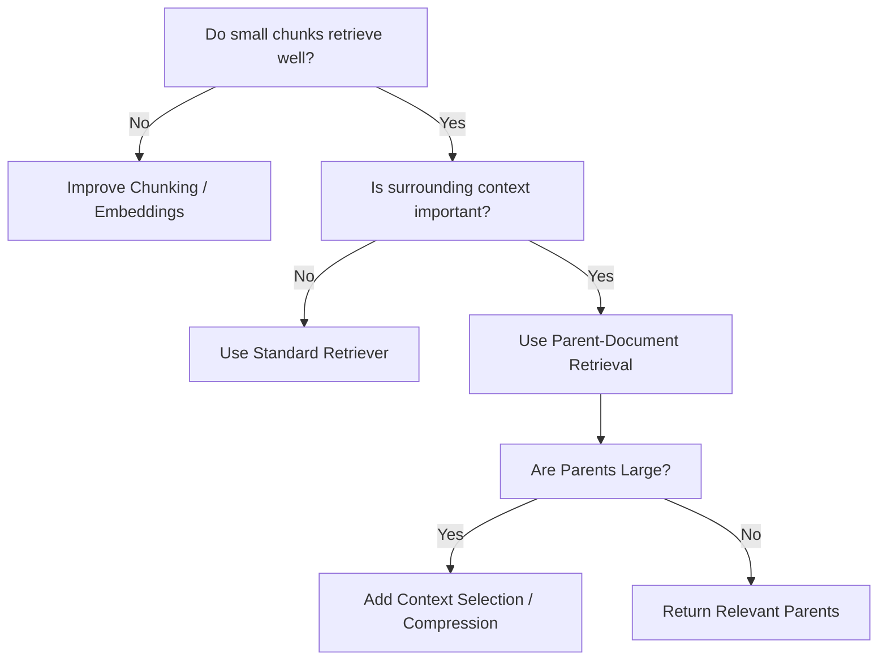

---

# 40. Production RAG Pattern

A mature production architecture can combine the retrieval techniques covered so far:

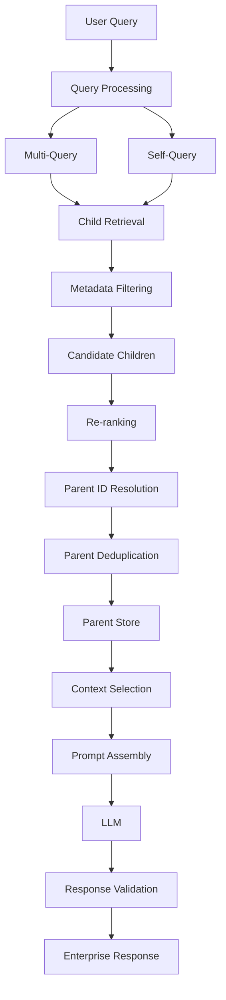

This demonstrates how retrieval techniques are **composable capabilities**, rather than isolated features.

---

# 41. Parent-Document Retrieval in an Enterprise Architecture

A production system can expose a generic interface:

```python
class Retriever:

    def retrieve(self, query: str):
        raise NotImplementedError
```

Different implementations can then provide:

```text
VectorStoreRetriever
MultiQueryRetriever
SelfQueryRetriever
ParentDocumentRetriever
HybridRetriever
RerankingRetriever
AgenticRetriever
```

The application does not need to know the internal retrieval strategy.

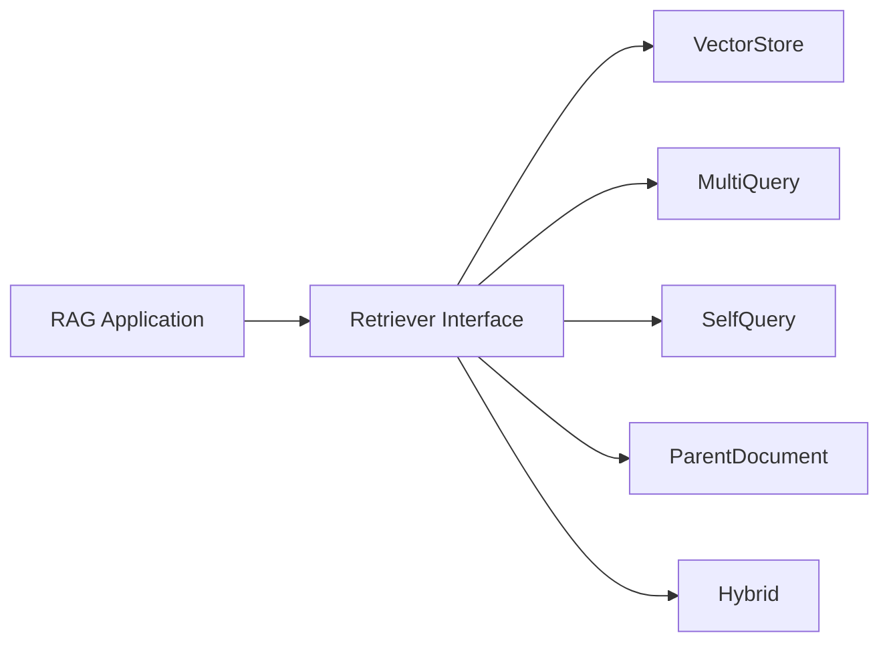

This is particularly useful for an enterprise AI platform where retrieval strategy may vary by use case.

---

# 42. Evaluation

Parent-Document Retrieval should be compared against a baseline.

### Baseline

```text
Vector Retrieval
 ↓
Child Chunk
 ↓
LLM
```

### Parent-Document Retrieval

```text
Vector Retrieval
 ↓
Child Chunk
 ↓
Parent Resolution
 ↓
Context Selection
 ↓
LLM
```

Measure:

| Metric | Baseline | Parent-Document |
|---|---:|---:|
| Retrieval Recall | Measure | Measure |
| Context Relevance | Measure | Measure |
| Answer Correctness | Measure | Measure |
| Faithfulness | Measure | Measure |
| Context Size | Measure | Measure |
| Latency | Measure | Measure |
| Token Usage | Measure | Measure |
| Cost | Measure | Measure |

The goal is not simply:

```text
More Context
```

but:

```text
Better Context
```

---

# 43. Practical Example

Consider an enterprise compliance system.

### Parent

```text
GDPR Data Retention Policy
Section 5 — Retention Requirements
```

### Child chunks

```text
Child 1:
Personal data must be retained...

Child 2:
Financial records must be retained...

Child 3:
Deletion requests must be processed...

Child 4:
Exceptions apply to legal holds...
```

User:

```text
"How long can financial records be retained?"
```

Retrieval:

```text
Query
 ↓
Child 2
 ↓
Parent: Section 5
 ↓
Full Retention Context
 ↓
LLM
```

The parent context may contain:

```text
General retention requirements
+
Financial record requirements
+
Exceptions
+
Legal holds
```

This can help the LLM distinguish the specific rule from its surrounding conditions.

---

# 44. The Central Design Principle

Parent-Document Retrieval can be summarized as:

```text
Search Small
     ↓
Understand Large
```

or:

```text
Small Units
    ↓
High Retrieval Precision

Large Context
    ↓
Better Understanding
```

This separation is one of the most important patterns for advanced RAG.

---

# 45. Key Takeaways

- Parent-Document Retrieval separates retrieval granularity from generation context.
- Small child chunks are indexed for precise retrieval.
- Larger parent documents provide richer context to the LLM.
- Every child should maintain a reliable parent identifier.
- Parent and child splitters can use different chunk sizes.
- The parent does not have to be the entire original document.
- Parents can represent sections, chapters, policies, or other logical units.
- Vector stores typically hold searchable child chunks.
- Parent documents can be stored separately in a document or key-value store.
- Parent IDs should be deduplicated before parent lookup.
- Large parent documents can cause context explosion.
- Context selection or compression may be necessary after parent resolution.
- Metadata should be propagated appropriately between parent and child representations.
- Parent-Document Retrieval complements Multi-Query, Self-Query, Hybrid Search, and Re-ranking.
- It is particularly useful for structured enterprise documents where surrounding context matters.
- It is not always necessary for short, self-contained documents.
- Production implementations should measure retrieval quality, context relevance, latency, token usage, and cost.
- A framework-independent abstraction makes Parent-Document Retrieval easier to integrate into enterprise AI platforms.

The core pattern is:

```text
                 DOCUMENT
                    │
                    ↓
              Parent Context
                    │
          ┌─────────┼─────────┐
          ↓         ↓         ↓
       Child 1   Child 2   Child 3
          │         │         │
          └─────────┼─────────┘
                    ↓
              Vector Search
                    ↓
             Matching Child
                    ↓
               Parent ID
                    ↓
             Parent Context
                    ↓
                   LLM
```

> **The goal is not to choose between small chunks and large context. Parent-Document Retrieval lets us use small chunks for retrieval and larger logical context for generation.**

---

# 🧭 Chapter Navigation

### Part V — Advanced Retrieval-Augmented Generation

**Previous:**  
[03. Self-Query Retriever](03-self-query-retriever.md)

**Next:**  
[05. Retriever Comparison](05-retriever-comparison.md)

**Section:**  
01 — Core Retrieval Engineering

### Retrieval Engineering Path

```text
01 VectorStore Retriever
          ↓
02 Multi-Query Retriever
          ↓
03 Self-Query Retriever
          ↓
04 Parent-Document Retriever
          ↓
05 Retriever Comparison
```

---

> **Enterprise AI Engineering Handbook**  
> *Building Production-Grade Enterprise AI Systems — One Chapter at a Time.*