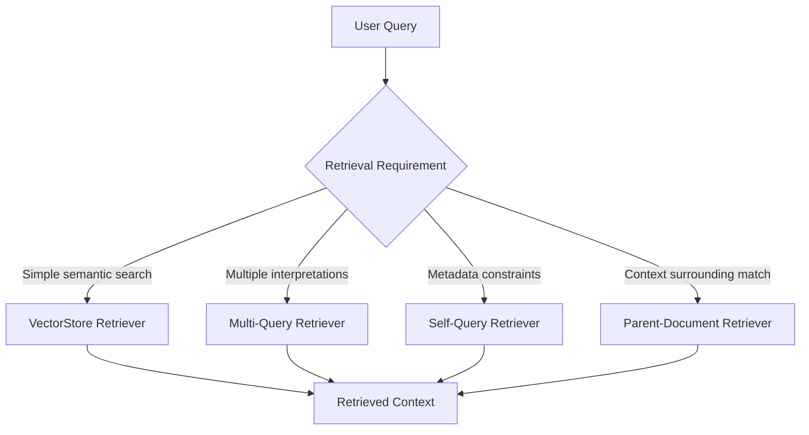
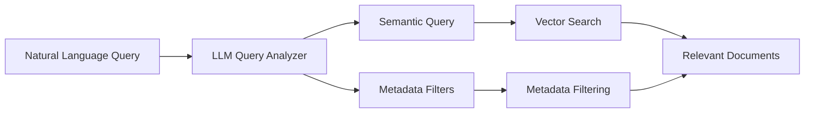
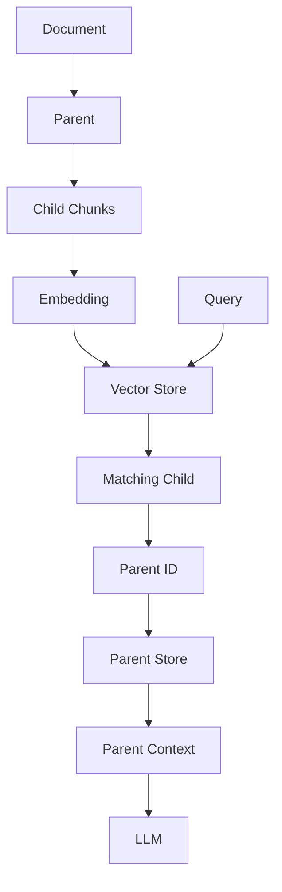
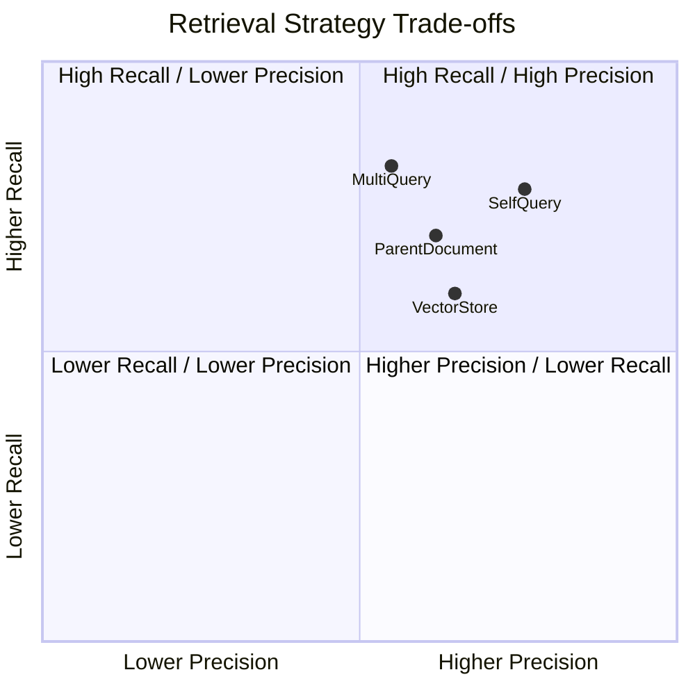
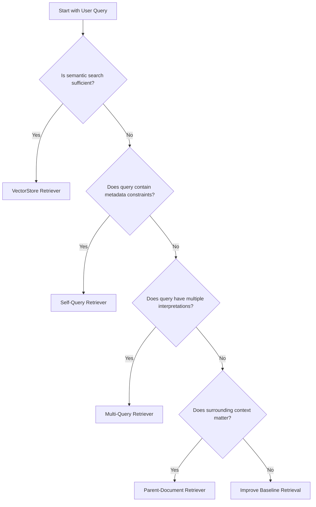
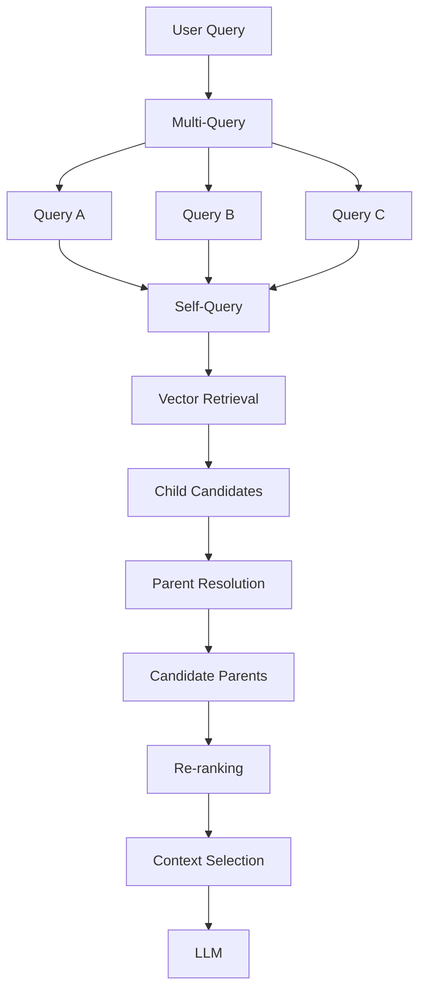
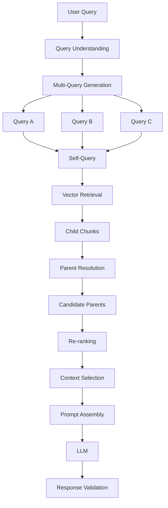
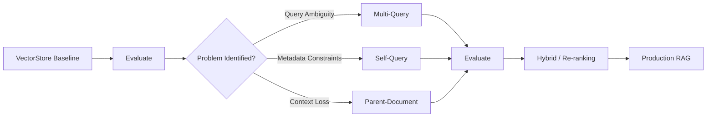
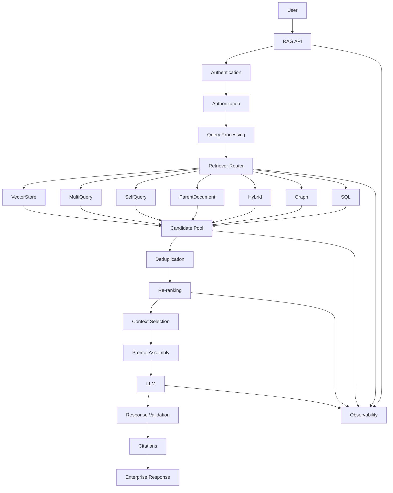

# Retriever Comparison

## 📖 Overview

Retrieval is one of the most important components of a Retrieval-Augmented Generation (RAG) system.

A basic RAG pipeline may begin with a simple **VectorStore Retriever**, but production systems often require different retrieval strategies depending on the nature of the query, document structure, metadata, and business requirements.

In the previous chapters, we explored:

```text
01 — VectorStore Retriever
02 — Multi-Query Retriever
03 — Self-Query Retriever
04 — Parent-Document Retriever
```

Each technique solves a different retrieval problem.

The goal of this chapter is to understand **when to use each retriever, what problem it solves, its trade-offs, and how these techniques can be composed into production retrieval architectures.**

---

## 🎯 Learning Objectives

After completing this chapter, you will be able to:

- Understand the role of different retriever strategies
- Compare VectorStore, Multi-Query, Self-Query, and Parent-Document retrieval
- Understand the strengths and limitations of each approach
- Select an appropriate retriever for a given problem
- Understand retrieval precision vs recall trade-offs
- Understand how retrievers can be composed
- Design a retrieval decision strategy
- Understand when to move from basic to advanced retrieval
- Evaluate retrieval strategies using production metrics
- Design a framework-agnostic retrieval architecture

---

# 1. Why Do We Need Multiple Retrievers?

A single retrieval strategy cannot optimally solve every retrieval problem.

Consider these queries:

```text
Query A:
"What is our remote work policy?"

Query B:
"What is our cloud strategy?"

Query C:
"Show HR policies for Germany from 2025."

Query D:
"Who is responsible for approving exceptions?"
```

Each query may require a different retrieval behavior.



The important architectural principle is:

> **Retriever selection should be driven by the retrieval problem, not by the popularity of a framework or technique.**

---

# 2. The Four Core Retrievers

We have now covered four foundational retrieval patterns.

| Retriever | Primary Purpose |
|---|---|
| VectorStore Retriever | Semantic similarity search |
| Multi-Query Retriever | Multiple semantic perspectives |
| Self-Query Retriever | Semantic search + metadata filtering |
| Parent-Document Retriever | Fine-grained retrieval + broader context |

A simplified view:

```text
VectorStore
     │
     ├── Basic Semantic Retrieval
     │
     ├── Multi-Query
     │      └── Multiple Query Perspectives
     │
     ├── Self-Query
     │      └── Semantic + Metadata Constraints
     │
     └── Parent-Document
            └── Child Retrieval + Parent Context
```

---

# 3. VectorStore Retriever

The VectorStore Retriever is the simplest baseline.

```text
User Query
    ↓
Embedding
    ↓
Vector Search
    ↓
Top-K Chunks
```

Example:

```python
retriever = vector_store.as_retriever(
    search_kwargs={
        "k": 5
    }
)

documents = retriever.invoke(
    "What is the remote work policy?"
)
```

### Best suited for

- Simple semantic questions
- Well-structured knowledge bases
- Short, self-contained chunks
- Initial RAG implementations
- Baseline retrieval evaluation

### Main limitation

```text
One Query
    ↓
One Semantic Representation
```

It may miss relevant information when the query is ambiguous or broad.

---

# 4. Multi-Query Retriever

Multi-Query Retrieval generates multiple alternative queries from the original user question.

```text
User Query
     ↓
LLM Query Generator
     ↓
┌────────┬────────┬────────┐
Query A  Query B  Query C
   ↓        ↓        ↓
 Search   Search   Search
   └────────┼────────┘
            ↓
      Candidate Pool
```

Example:

```text
Original:

"What are the risks of cloud migration?"
```

Generated queries:

```text
Technical risks of cloud migration
Security risks of cloud migration
Financial risks of cloud migration
Operational risks of cloud migration
```

### Best suited for

- Ambiguous questions
- Broad questions
- Multiple semantic perspectives
- Queries requiring evidence from different areas

### Main limitation

```text
More Queries
     ↓
More Retrieval Calls
     ↓
More Latency + Cost
```

It can also introduce query drift.

---

# 5. Self-Query Retriever

Self-Query Retrieval converts natural language into:

```text
Semantic Query
+
Metadata Filters
```

Example:

```text
"Find HR policies for Germany from 2025."
```

becomes conceptually:

```text
Query:
HR policies

Filters:
department = HR
country = Germany
year = 2025
```

Architecture:



### Best suited for

- Rich metadata
- Enterprise document repositories
- Natural-language filtering
- Multi-tenant knowledge bases
- Date, region, department, and document-type filtering

### Main limitation

The LLM can generate incorrect filters.

Therefore:

```text
LLM Output
    ↓
Validation
    ↓
Authorization
    ↓
Retrieval
```

should be used in production.

---

# 6. Parent-Document Retriever

Parent-Document Retrieval separates:

```text
Retrieval Granularity
```

from:

```text
Generation Context
```

The system retrieves a small child chunk:

```text
Query
 ↓
Child Chunk
```

and then resolves the parent:

```text
Child Chunk
     ↓
Parent ID
     ↓
Parent Document
```

Architecture:



### Best suited for

- Long documents
- Technical manuals
- Policies
- Legal documents
- Research documents
- Documents where surrounding context matters

### Main limitation

Large parents can create:

```text
Context Explosion
      ↓
More Tokens
      ↓
Higher Cost
      ↓
Potential Context Noise
```

---

# 7. Side-by-Side Comparison

| Capability | VectorStore | Multi-Query | Self-Query | Parent-Document |
|---|:---:|:---:|:---:|:---:|
| Semantic Search | ✅ | ✅ | ✅ | ✅ |
| Multiple Query Perspectives | ❌ | ✅ | ❌ | ❌ |
| Metadata Filtering | Basic | Possible | ✅ | Possible |
| Small Retrieval Units | ✅ | ✅ | ✅ | ✅ |
| Larger Generation Context | ❌ | ❌ | ❌ | ✅ |
| Query Generation LLM | ❌ | ✅ | ✅ | ❌ |
| Retrieval Coverage | Baseline | High | High with filters | Baseline |
| Context Preservation | Basic | Basic | Basic | High |
| Additional LLM Cost | ❌ | ✅ | ✅ | ❌ |
| Additional Storage | Usually no | No | No | Usually yes |
| Implementation Complexity | Low | Medium | Medium | Medium |

---

# 8. The Core Trade-Off

Retriever selection can be understood using two major dimensions:

```text
                     Retrieval Coverage
                            ↑
                            │
                Multi-Query │
                            │
              Self-Query    │
                            │
                            │
VectorStore ────────────────┼────────────→
                            │
                            │
                            │
                            │
                            ↓
```

But retrieval quality is not one-dimensional.

A production system needs to balance:

```text
Recall
Precision
Latency
Cost
Context Quality
Security
Scalability
```

Therefore, the "best" retriever is workload-specific.

---

# 9. Precision vs Recall

Retrieval systems often have a fundamental trade-off.

### Precision

How much of the retrieved information is relevant?

```text
Retrieved Documents
        ↓
Relevant Documents
```

High precision means:

```text
Less Noise
```

### Recall

How much of the relevant information was successfully retrieved?

```text
Relevant Documents
        ↓
Retrieved Relevant Documents
```

High recall means:

```text
Less Missing Evidence
```

A simplified view:



> The positions in this conceptual chart are illustrative rather than measured benchmark results.

In production, these values should be determined through evaluation.

---

# 10. Which Retriever Should You Start With?

For a new RAG application, a sensible progression is:

```text
Start
  ↓
VectorStore Retriever
  ↓
Evaluate
  ↓
Identify Retrieval Problem
  ↓
Add Specialized Retriever
```

For example:

```text
Baseline
   ↓
VectorStore
   ↓
Problem: Query Ambiguity
   ↓
Multi-Query

Problem: Metadata Constraints
   ↓
Self-Query

Problem: Context Loss
   ↓
Parent-Document
```

This is preferable to implementing every advanced technique immediately.

---

# 11. Decision Tree

A practical decision tree:



In practice, more than one answer can be true.

For example:

```text
Ambiguous query
+
Metadata constraints
+
Long documents
```

may require a composed retrieval pipeline.

---

# 12. Retriever Composition

The most important lesson from these chapters is that retrievers do not have to operate independently.

They can be composed.

For example:

```text
Multi-Query
     ↓
Self-Query
     ↓
Vector Retrieval
     ↓
Parent Resolution
     ↓
Re-ranking
```

Architecture:



This is closer to how enterprise retrieval architectures evolve.

---

# 13. Retrieval as a Pipeline

Instead of thinking:

```text
Which retriever should I use?
```

think:

```text
Which retrieval capabilities do I need?
```

For example:

```text
Query Understanding
        ↓
Query Expansion
        ↓
Metadata Filtering
        ↓
Semantic Retrieval
        ↓
Parent Resolution
        ↓
Re-ranking
        ↓
Context Compression
        ↓
Context Selection
```

Each stage addresses a different problem.

---

# 14. Capability-Based Retrieval Architecture

A framework-agnostic architecture might expose:

```python
class Retriever:

    def retrieve(self, query: str):
        raise NotImplementedError
```

Then specialized capabilities can implement the interface:

```python
class VectorStoreRetriever(Retriever):
    ...


class MultiQueryRetriever(Retriever):
    ...


class SelfQueryRetriever(Retriever):
    ...


class ParentDocumentRetriever(Retriever):
    ...
```

A higher-level pipeline can compose them:

```python
retrieval_pipeline = RetrievalPipeline(
    query_processor=query_processor,
    retriever=retriever,
    reranker=reranker,
    context_selector=context_selector
)
```

This keeps application logic independent of the retrieval implementation.

---

# 15. Retrieval Strategy Matrix

A useful engineering matrix is:

| Requirement | Recommended Starting Point |
|---|---|
| Simple semantic question | VectorStore |
| Broad question | Multi-Query |
| Ambiguous question | Multi-Query |
| Metadata constraints | Self-Query |
| Long documents | Parent-Document |
| Need surrounding context | Parent-Document |
| Multiple semantic perspectives | Multi-Query |
| Region / department / year filters | Self-Query |
| Small, self-contained documents | VectorStore |
| Large structured documents | Parent-Document |
| Multiple requirements | Composition |

This matrix should be treated as a starting point, not a fixed rule.

---

# 16. Example: HR Knowledge Assistant

Suppose an HR assistant contains:

```text
50,000 documents
```

with metadata:

```text
Country
Department
Document Type
Year
Version
```

User asks:

```text
"Find the latest German parental leave
policy and explain the exceptions."
```

This query has multiple requirements:

```text
German
   ↓
Metadata Constraint

Latest
   ↓
Version / Date Constraint

Parental Leave
   ↓
Semantic Retrieval

Exceptions
   ↓
Context Requirement
```

A composed architecture could be:

```text
Self-Query
     ↓
Metadata Filtering
     ↓
Vector Retrieval
     ↓
Parent Document
     ↓
Context Selection
```

---

# 17. Example: Architecture Knowledge Assistant

User:

```text
"What are the main risks of migrating
our payment platform to the cloud?"
```

This query has multiple dimensions:

```text
Technical
Security
Financial
Operational
Compliance
```

A suitable strategy could be:

```text
Multi-Query
     ↓
Multiple Perspectives
     ↓
Vector Retrieval
     ↓
Candidate Pool
     ↓
Re-ranking
```

Here Multi-Query improves retrieval coverage.

---

# 18. Example: Technical Documentation

User:

```text
"How does the API gateway authenticate
requests?"
```

If the documentation is organized into:

```text
Architecture
Authentication
Authorization
API Gateway
Security
Troubleshooting
```

and the relevant information is distributed across a section, Parent-Document Retrieval may be useful:

```text
Child Match
    ↓
Authentication Section
    ↓
Parent Context
    ↓
LLM
```

---

# 19. Combining All Four

A sophisticated pipeline can use all four techniques.



This is powerful but also significantly more complex.

Therefore:

> **Complexity should be introduced only when evaluation shows that the simpler architecture is insufficient.**

---

# 20. Complexity vs Benefit

Every retrieval enhancement introduces additional complexity.

```text
VectorStore
    ↓
Low Complexity

Multi-Query
    ↓
+ LLM Query Generation
+ Multiple Retrieval Calls

Self-Query
    ↓
+ Query Parsing
+ Filter Validation

Parent-Document
    ↓
+ Parent Store
+ Parent Resolution

Advanced Composition
    ↓
+ Multiple Dependencies
+ More Latency
+ More Observability Requirements
```

The engineering goal is not maximum complexity.

The goal is:

```text
Required Quality
      +
Acceptable Cost
      +
Acceptable Latency
      +
Operational Simplicity
```

---

# 21. Retrieval Decision Example

Consider three queries.

### Query A

```text
"What is the vacation policy?"
```

Recommended:

```text
VectorStore Retriever
```

---

### Query B

```text
"What are the security risks
of cloud migration?"
```

Recommended starting point:

```text
Multi-Query Retriever
```

Potential generated perspectives:

```text
Technical risks
Security risks
Operational risks
Compliance risks
```

---

### Query C

```text
"Find Germany HR policies from 2025."
```

Recommended:

```text
Self-Query Retriever
```

Potential filters:

```text
country = Germany
department = HR
year = 2025
```

---

### Query D

```text
"Explain the exception process
described in the remote-work policy."
```

Recommended:

```text
Parent-Document Retriever
```

because surrounding policy context may be important.

---

# 22. Retrieval Quality Metrics

Retriever comparison should be based on measurable outcomes.

Important retrieval metrics include:

### Recall@K

Measures whether relevant documents appear in the top K results.

```text
Relevant Retrieved
────────────────────
Total Relevant
```

### Precision@K

Measures how many of the top K results are relevant.

```text
Relevant Retrieved
────────────────────
Retrieved Documents
```

### MRR

Mean Reciprocal Rank measures how high the first relevant result appears.

### NDCG

Normalized Discounted Cumulative Gain evaluates ranking quality while giving higher weight to results near the top.

These metrics help determine whether a retrieval strategy actually improves retrieval.

---

# 23. End-to-End RAG Metrics

Retriever metrics alone are not enough.

The final system should also measure:

```text
Retrieval Quality
       ↓
Context Quality
       ↓
Answer Quality
```

Useful metrics include:

```text
Faithfulness
Answer Relevance
Context Relevance
Context Recall
Citation Accuracy
Groundedness
```

The exact evaluation framework can vary by system.

---

# 24. Latency Comparison

Conceptually:

```text
VectorStore

Query
 ↓
Embedding
 ↓
Search
 ↓
Response
```

Multi-Query:

```text
Query
 ↓
LLM Query Generation
 ↓
Search × N
 ↓
Aggregation
 ↓
Response
```

Self-Query:

```text
Query
 ↓
LLM Query Construction
 ↓
Validation
 ↓
Filtered Search
 ↓
Response
```

Parent-Document:

```text
Query
 ↓
Search
 ↓
Parent Lookup
 ↓
Response
```

Therefore, every advanced strategy can introduce additional latency.

Production systems should measure:

```text
P50
P95
P99
```

rather than relying only on average latency.

---

# 25. Cost Comparison

A simplified view:

| Retriever | LLM Cost | Retrieval Cost | Storage Complexity |
|---|---:|---:|---:|
| VectorStore | Low | Low | Low |
| Multi-Query | Higher | Higher | Low |
| Self-Query | Higher | Medium | Medium |
| Parent-Document | Low | Medium | Higher |

These are conceptual comparisons.

Actual costs depend on:

- Model choice
- Number of queries
- Vector database
- Document size
- Storage architecture
- Query volume
- Caching

---

# 26. Observability

Advanced retrieval requires strong observability.

At minimum, capture:

```text
Original Query
        ↓
Generated Queries
        ↓
Filters
        ↓
Retriever Type
        ↓
Retrieved Documents
        ↓
Scores
        ↓
Parent IDs
        ↓
Re-ranking
        ↓
Final Context
```

Example trace:

```text
trace_id: 8f3a21

query:
"Find German HR policies from 2025."

retriever:
SelfQueryRetriever

semantic_query:
"HR policies"

filters:
country = Germany
department = HR
year = 2025

candidate_count:
37

final_count:
5

latency:
428 ms
```

This information is extremely useful when diagnosing production retrieval failures.

---

# 27. Security Comparison

Retriever type does not determine authorization.

Every retriever should operate inside the same security boundary.

```text
Authentication
      ↓
Authorization
      ↓
Retrieval
```

This applies to:

```text
VectorStore
Multi-Query
Self-Query
Parent-Document
```

For Multi-Query:

```text
Every generated query
        ↓
Same authorization boundary
```

For Parent-Document:

```text
Child access
        ↓
Parent access
```

must also be validated.

A user should never gain access to a parent document merely because an authorized child matched.

---

# 28. Retriever Selection Principles

### Principle 1

Start with the simplest strategy that satisfies the requirements.

### Principle 2

Measure retrieval quality before adding complexity.

### Principle 3

Solve a specific retrieval problem with each technique.

### Principle 4

Keep retrieval capabilities composable.

### Principle 5

Separate retrieval from authorization.

### Principle 6

Treat generated queries and filters as untrusted intermediate data.

### Principle 7

Measure latency and cost alongside retrieval quality.

---

# 29. Recommended Evolution Path

A practical enterprise retrieval journey is:



This avoids premature optimization.

---

# 30. Beyond the Four Retrievers

These four retrievers are only the beginning of advanced retrieval engineering.

Later techniques can address additional problems:

```text
Hybrid Search
        ↓
Semantic + Keyword Retrieval

Re-ranking
        ↓
Better Candidate Ordering

Contextual Compression
        ↓
Reduce Context Noise

Graph RAG
        ↓
Relationship-Based Retrieval

SQL RAG
        ↓
Structured Data Retrieval

Knowledge Graphs
        ↓
Entity + Relationship Retrieval

Agentic RAG
        ↓
Iterative Retrieval Decisions
```

The important point is that these techniques build upon the retrieval foundations established here.

---

# 31. Production Retrieval Architecture

A mature enterprise architecture may eventually evolve into:



This is the direction toward **production retrieval engineering**.

---

# 32. Framework-Agnostic Retrieval Interface

An enterprise platform should ideally expose a stable abstraction.

```python
from abc import ABC, abstractmethod


class Retriever(ABC):

    @abstractmethod
    def retrieve(self, query: str):
        pass
```

Implementations can include:

```python
class VectorStoreRetriever(Retriever):
    ...


class MultiQueryRetriever(Retriever):
    ...


class SelfQueryRetriever(Retriever):
    ...


class ParentDocumentRetriever(Retriever):
    ...


class HybridRetriever(Retriever):
    ...


class GraphRetriever(Retriever):
    ...


class SQLRetriever(Retriever):
    ...
```

The application can therefore remain independent of the underlying framework.

```text
Enterprise RAG Application
           ↓
     Retriever Interface
           ↓
 ┌─────────┼─────────┐
 ↓         ↓         ↓
Vector   Hybrid    Graph
```

This is particularly useful when building reusable enterprise AI platforms.

---

# 33. Retrieval Strategy Cheat Sheet

```text
┌───────────────────────────────────────────────┐
│ RETRIEVER CHEAT SHEET                         │
├───────────────────────────────────────────────┤
│ VectorStore                                   │
│ → Simple semantic retrieval                   │
│                                               │
│ Multi-Query                                   │
│ → Multiple semantic perspectives              │
│                                               │
│ Self-Query                                    │
│ → Natural language + metadata filters         │
│                                               │
│ Parent-Document                               │
│ → Small retrieval + large context             │
│                                               │
│ Hybrid                                        │
│ → Semantic + lexical search                   │
│                                               │
│ Re-ranking                                    │
│ → Improve candidate ordering                  │
│                                               │
│ Graph RAG                                     │
│ → Relationship-based retrieval                │
│                                               │
│ SQL RAG                                       │
│ → Structured data retrieval                   │
└───────────────────────────────────────────────┘
```

---

# 34. Key Takeaways

- There is no universally best retriever.
- VectorStore Retrieval is the natural baseline.
- Multi-Query Retrieval improves retrieval coverage through multiple query perspectives.
- Self-Query Retrieval combines semantic search with structured metadata filtering.
- Parent-Document Retrieval separates retrieval granularity from generation context.
- Retriever selection should be driven by the problem being solved.
- Advanced retrievers can be composed into larger retrieval pipelines.
- More retrieval complexity does not automatically mean better results.
- Every advanced technique introduces additional latency, cost, or operational complexity.
- Retrieval quality should be evaluated using metrics such as Recall@K, Precision@K, MRR, and NDCG.
- End-to-end RAG quality must also be measured through context and answer-quality metrics.
- Authorization must remain independent of retrieval strategy.
- LLM-generated queries and filters should be treated as untrusted intermediate data.
- Parent documents must be protected by the same access-control model as child chunks.
- Production retrieval requires strong observability.
- Framework-independent retrieval interfaces help reduce application coupling.
- The four retrievers covered so far provide the foundation for more advanced techniques such as Hybrid Search, Re-ranking, Graph RAG, SQL RAG, and Agentic RAG.

The central engineering principle is:

```text
Don't ask:

"Which retriever is the best?"

Ask:

"What retrieval problem are we solving?"
                ↓
"What capability addresses it?"
                ↓
"Does evaluation prove the improvement?"
                ↓
"Is the additional complexity justified?"
```

---

# 🧭 Chapter Navigation

### Part V — Advanced Retrieval-Augmented Generation

**Previous:**  
[04. Parent-Document Retriever](04-parent-document-retriever.md)

**Next:**  
[Enterprise-retrieval-engineering/01 Contextual Compression Retriever](../02-enterprise-retrieval-engineering//01-contextual-compression-retriever.md)

**Section:**  
01 — Core Retrieval Engineering

### Retrieval Engineering Path

```text
01 VectorStore Retriever
          ↓
02 Multi-Query Retriever
          ↓
03 Self-Query Retriever
          ↓
04 Parent-Document Retriever
          ↓
05 Retriever Comparison
          ↓
06 Hybrid Search
```

---

> **Enterprise AI Engineering Handbook**  
> *Building Production-Grade Enterprise AI Systems — One Chapter at a Time.*