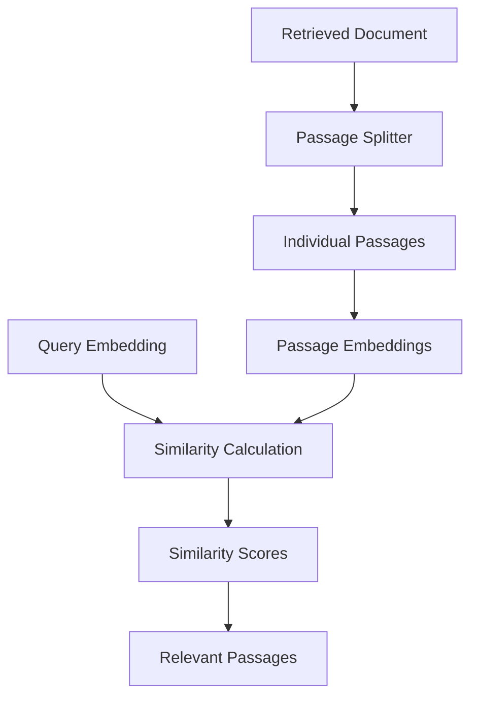
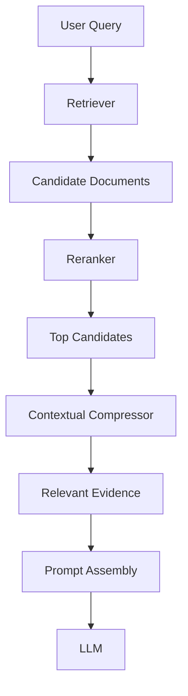
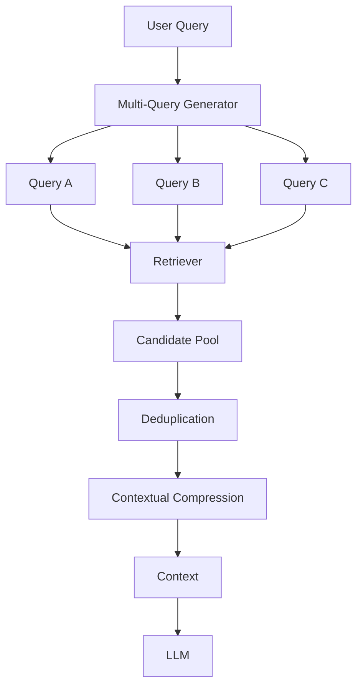
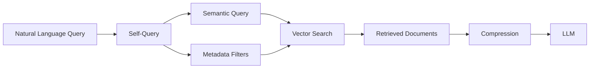
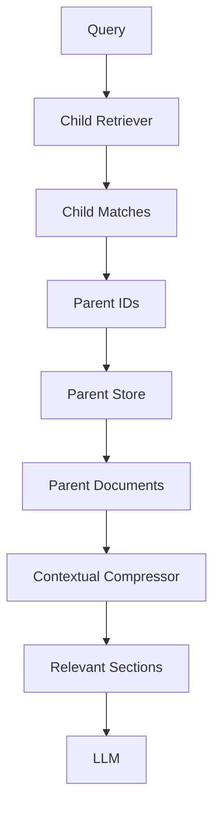
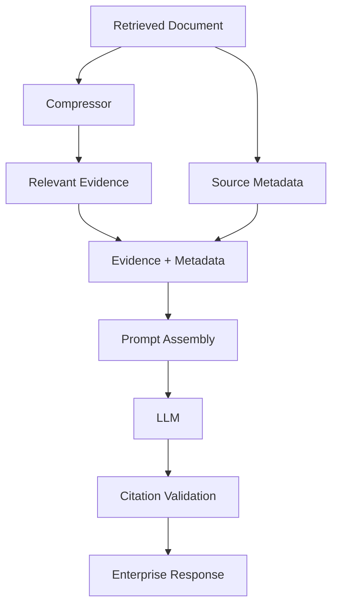
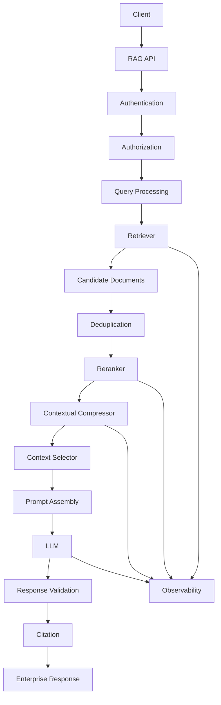
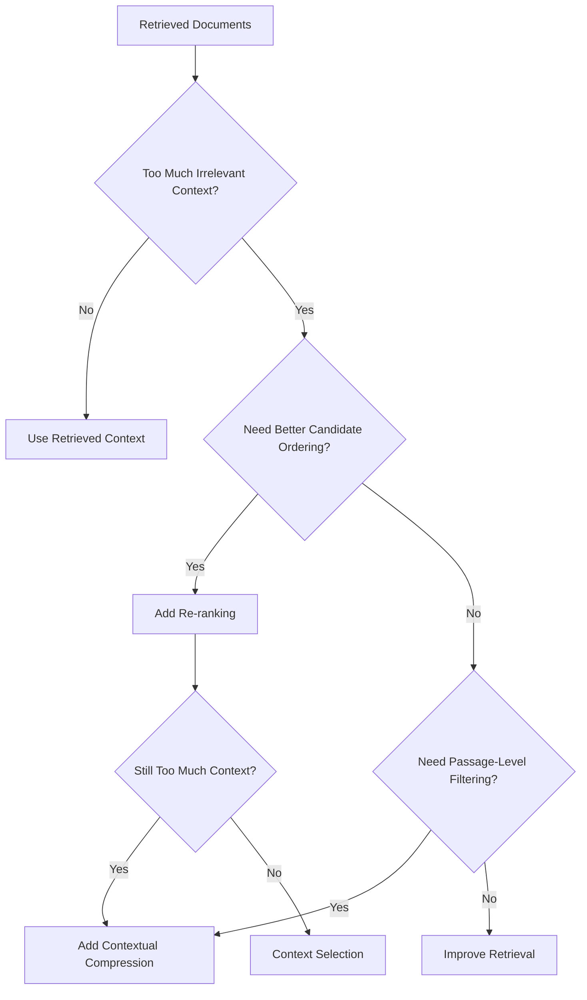

# Contextual Compression Retriever

## 📖 Overview

A **Contextual Compression Retriever** improves RAG retrieval by reducing irrelevant information from documents returned by a retriever.

A traditional retriever may successfully identify relevant documents, but those documents can still contain a large amount of information that is unrelated to the user's question.

For example:

```text
User Query

"What authentication mechanism is required
for production APIs?"
```

The retriever may return:

```text
Production API Security Guide
├── Authentication
├── Authorization
├── Network Security
├── Rate Limiting
├── Logging
├── Monitoring
├── Deployment
└── Incident Response
```

The document is relevant, but the LLM may only need:

```text
Authentication
Authorization
```

Contextual compression introduces an additional processing stage:

```text
Query
  ↓
Retriever
  ↓
Candidate Documents
  ↓
Contextual Compression
  ↓
Relevant Content
  ↓
LLM
```

The goal is not simply to retrieve fewer documents.

The goal is to provide the LLM with **more relevant context with less unnecessary information**.

---

## 🎯 Learning Objectives

After completing this chapter, you will be able to:

- Understand contextual compression in RAG
- Understand why retrieved documents may contain irrelevant information
- Differentiate retrieval from context compression
- Understand the role of a base retriever
- Understand document compressors
- Implement a contextual compression pipeline
- Understand embedding-based compression
- Understand LLM-based compression
- Understand reranking-based compression
- Combine compression with advanced retrievers
- Evaluate compression quality
- Identify common compression failure modes
- Design production-ready contextual compression architectures

---

# 1. The Context Problem in RAG

A basic RAG pipeline typically looks like:

```text
User Query
    ↓
Retriever
    ↓
Retrieved Documents
    ↓
Prompt
    ↓
LLM
    ↓
Response
```

Suppose the retriever returns:

```text
Document A → 1,800 tokens
Document B → 1,500 tokens
Document C → 1,700 tokens
Document D → 1,200 tokens
```

Total:

```text
6,200 tokens
```

But only:

```text
900 tokens
```

may actually be useful for answering the question.

The LLM still receives:

```text
6,200 tokens
```

unless the application introduces another mechanism to reduce the context.

This can lead to:

- Higher token usage
- Higher cost
- Higher latency
- More irrelevant context
- More context competition
- Lower answer quality

---

# 2. What Is Contextual Compression?

Contextual compression takes retrieved documents and keeps only the information relevant to the current query.

The basic architecture is:

```text
User Query
     ↓
Base Retriever
     ↓
Candidate Documents
     ↓
Contextual Compressor
     ↓
Compressed Context
     ↓
Prompt Assembly
     ↓
LLM
     ↓
Response
```

The important distinction is:

```text
Retriever
    ↓
Find potentially relevant information

Compressor
    ↓
Remove information that is not useful for this query
```

---

# 3. Retrieval vs Compression

Retrieval asks:

> "Which documents might contain the answer?"

Compression asks:

> "Which parts of those documents are useful for answering this specific query?"

Therefore:

```text
Retrieval
    ↓
Candidate Evidence

Compression
    ↓
Focused Evidence
```

This creates a two-stage retrieval architecture:

```text
Broad Retrieval
      ↓
Context Refinement
```

---

# 4. Why Do We Need Contextual Compression?

Consider an enterprise policy document:

```text
Remote Work Policy

1. Introduction
2. Eligibility
3. Working Arrangements
4. Approval Process
5. Exceptions
6. Security Requirements
7. Manager Responsibilities
8. Compliance
9. Reporting
```

User query:

```text
"Who approves exceptions to remote work?"
```

A retriever may return the entire policy.

But the answer may primarily exist in:

```text
Section 4 — Approval Process
Section 5 — Exceptions
Section 7 — Manager Responsibilities
```

Contextual compression can reduce:

```text
Entire Policy
```

to:

```text
Relevant Sections
```

This allows the generation layer to work with a smaller and more focused context.

---

# 5. Core Architecture


The architecture separates:

```text
Candidate Discovery
```

from:

```text
Evidence Refinement
```

This separation is important in production RAG systems because retrieval and context optimization have different responsibilities.

---

# 6. Contextual Compression Components

A typical implementation contains two primary components:

```text
Contextual Compression Retriever
        │
        ├── Base Retriever
        │
        └── Base Compressor
```

### Base Retriever

Responsible for:

```text
Query
 ↓
Candidate Documents
```

### Base Compressor

Responsible for:

```text
Candidate Documents
 ↓
Relevant Content
```

This allows compression to be added without completely redesigning the existing retrieval layer.

---

# 7. Basic LangChain Example

LangChain provides a `ContextualCompressionRetriever` abstraction.

A simplified example:

```python
from langchain.retrievers import ContextualCompressionRetriever

compression_retriever = ContextualCompressionRetriever(
    base_compressor=compressor,
    base_retriever=retriever
)

documents = compression_retriever.invoke(
    "What authentication mechanism is required?"
)

for document in documents:
    print(document.page_content)
```

The important architecture is:

```text
ContextualCompressionRetriever
            │
            ├── Base Retriever
            │
            └── Compressor
```

The application can continue using the retriever interface while the compression stage remains encapsulated.

---

# 8. Base Retriever

For example:

```python
base_retriever = vector_store.as_retriever(
    search_kwargs={
        "k": 10
    }
)
```

The pipeline becomes:

```text
Query
 ↓
Retrieve Top 10
 ↓
Compression
 ↓
Relevant Context
```

The advantage is that retrieval can remain relatively broad.

The compressor then controls what is actually passed forward.

---

# 9. Why Retrieve More Before Compressing?

Suppose:

```text
Top-K = 3
```

The correct evidence may not appear in those three documents.

Increasing retrieval to:

```text
Top-K = 10
```

can improve recall.

However, sending all 10 documents to the LLM may increase context size significantly.

Contextual compression provides a middle ground:

```text
Retrieve 10
     ↓
Compress
     ↓
Keep Relevant Evidence
     ↓
LLM
```

This gives the system an opportunity to optimize:

```text
Recall
+
Context Relevance
```

---

# 10. Extractive Compression

The simplest form of compression is **extractive compression**.

The system keeps relevant sentences or passages from the original document.

Example:

```text
Original Document

The platform supports OAuth 2.0 authentication.
Applications must register with the identity service.
API requests require valid access tokens.
Logs are retained for 90 days.
Monitoring is enabled across production environments.
```

Query:

```text
"How are API requests authenticated?"
```

Compressed context:

```text
The platform supports OAuth 2.0 authentication.

API requests require valid access tokens.
```

No new information is generated.

The compressor simply selects relevant evidence.

---

# 11. Why Extractive Compression Is Valuable

Extractive compression has an important advantage:

```text
Original Evidence
       ↓
Selected Evidence
```

rather than:

```text
Original Evidence
       ↓
Generated Summary
```

This reduces the risk of introducing new information.

For enterprise systems, this can be especially useful for:

```text
Legal
Compliance
Finance
Security
Healthcare
```

where preserving the exact source meaning is important.

---

# 12. Embedding-Based Compression

Another approach is to calculate semantic similarity between the query and smaller pieces of retrieved documents.

The pipeline becomes:



Conceptually:

```python
for passage in passages:

    score = similarity(
        query_embedding,
        passage_embedding
    )

    if score >= threshold:
        selected.append(passage)
```

---

# 13. Embedding Compression Example

Suppose the query is:

```text
"What is the API rate limit?"
```

Retrieved document contains:

```text
P1 → Authentication
P2 → Rate Limits
P3 → Logging
P4 → Deployment
P5 → Monitoring
```

Similarity scores:

```text
P1 → 0.42
P2 → 0.91
P3 → 0.31
P4 → 0.22
P5 → 0.37
```

If:

```text
threshold = 0.70
```

then:

```text
P2
```

is retained.

The compression flow becomes:

```text
Large Document
      ↓
Passages
      ↓
Embedding Similarity
      ↓
High-Scoring Passages
```

---

# 14. Similarity Thresholds

Embedding-based compression requires threshold tuning.

For example:

```text
threshold = 0.80
```

may remove too much information.

While:

```text
threshold = 0.40
```

may keep too much information.

There is no universal threshold.

It depends on:

- Embedding model
- Similarity metric
- Passage size
- Document type
- Query distribution
- Evaluation dataset

Therefore, threshold values should be established through evaluation rather than copied blindly between systems.

---

# 15. LLM-Based Compression

An LLM can also extract query-relevant information.

Conceptually:

```text
Query
+
Retrieved Document
        ↓
Compression LLM
        ↓
Relevant Evidence
```

A simple prompt might be:

```python
compression_prompt = """
Extract only the information relevant to the question.

Question:
{query}

Document:
{document}

Rules:
- Do not introduce new information.
- Do not infer missing facts.
- Preserve important conditions and exceptions.
- Preserve numbers and dates.
"""
```

The compressor is not supposed to answer the question.

It is supposed to extract evidence.

---

# 16. Compression LLM vs Answer LLM

It is important to separate these responsibilities.

### Compression LLM

```text
Document
   ↓
Relevant Evidence
```

### Answer LLM

```text
Relevant Evidence
   ↓
Final Answer
```

Architecture:


This separation can make the pipeline easier to reason about and evaluate.

---

# 17. Reranking-Based Compression

A reranker can score passages based on their relevance to the query.

For example:

```text
50 candidate passages
        ↓
Reranker
        ↓
Top 10 passages
```

Pipeline:


Reranking is often used before compression when the candidate set is large.

---

# 18. Reranking vs Compression

These concepts are related but different.

### Reranking

Changes the ordering:

```text
A
B
C
D
E

↓

C
A
E
B
D
```

### Compression

Reduces the content:

```text
A
B
C
D
E

↓

C
A
```

Therefore:

```text
Reranking
    ↓
Which candidates are most relevant?

Compression
    ↓
Which content should remain?
```

They can be used together.

---

# 19. Combined Reranking and Compression

A production pipeline could be:

```text
Query
 ↓
Retriever
 ↓
Candidate Documents
 ↓
Reranker
 ↓
Top Candidates
 ↓
Contextual Compressor
 ↓
Relevant Evidence
 ↓
LLM
```

Architecture:



This combination becomes increasingly useful as retrieval systems scale.

---

# 20. Contextual Compression with Multi-Query

Contextual compression can also be combined with Multi-Query Retrieval.

```text
User Query
    ↓
Multi-Query Generation
    ↓
Query A / B / C
    ↓
Multiple Retrieval Paths
    ↓
Candidate Pool
    ↓
Compression
    ↓
Final Context
```

Architecture:



This is useful when retrieval recall is important but the resulting candidate context is too large.

---

# 21. Contextual Compression with Self-Query

Self-Query Retrieval can be used before compression.

For example:

```text
"Find German HR policies from 2025
about parental leave."
```

Self-Query may produce:

```text
Semantic Query:
parental leave

Filters:
country = Germany
department = HR
year = 2025
```

Then:

```text
Self-Query
    ↓
Filtered Retrieval
    ↓
Contextual Compression
    ↓
LLM
```

Architecture:



This can reduce the amount of irrelevant content entering the compression stage.

---

# 22. Contextual Compression with Parent-Document Retrieval

Parent-Document Retrieval can also be combined with compression.

```text
Query
 ↓
Child Retrieval
 ↓
Parent Resolution
 ↓
Parent Documents
 ↓
Compression
 ↓
Relevant Parent Sections
 ↓
LLM
```

Architecture:



This can provide:

```text
Precise Retrieval
+
Broader Context
+
Controlled Context Size
```

---

# 23. Compression Ordering

There are multiple possible pipeline designs.

### Option A

```text
Retrieve
 ↓
Rerank
 ↓
Compress
```

### Option B

```text
Retrieve
 ↓
Compress
 ↓
Rerank
```

### Option C

```text
Retrieve
 ↓
Compress
 ↓
Context Selection
```

There is no universal ordering.

The correct architecture depends on:

- Candidate Count
- Compression Cost
- Reranker Cost
- Latency Requirements
- Context Size

For example, if a retriever returns thousands of candidates, an inexpensive filtering stage may be necessary before applying an expensive LLM compressor.

---

# 24. Contextual Compression and Chunking

Chunking and compression happen at different stages.

### Chunking

Usually occurs during ingestion:

```text
Document
 ↓
Chunks
 ↓
Embeddings
 ↓
Vector Store
```

### Compression

Occurs during retrieval:

```text
Query
 ↓
Retrieved Documents
 ↓
Relevant Content
```

Therefore:

```text
Chunking
    ↓
Controls retrieval units

Compression
    ↓
Controls generation context
```

---

# 25. Contextual Compression vs Summarization

These are also different.

### Summarization

```text
Document
 ↓
Summary
```

The objective is to represent the overall document.

### Contextual Compression

```text
Query + Document
 ↓
Query-Relevant Evidence
```

The objective is to preserve information relevant to the current query.

Therefore:

> Contextual compression is **query-aware**, while ordinary summarization does not necessarily depend on the user's question.

---

# 26. Compression and Information Loss

Compression introduces an important risk:

```text
Too Much Compression
        ↓
Evidence Loss
        ↓
Incorrect Answer
```

Consider:

```text
Employees may work remotely up to three days
per week, subject to manager approval.
```

An aggressive compressor might return:

```text
Employees may work remotely up to three days.
```

The condition:

```text
subject to manager approval
```

has been removed.

The meaning has changed.

Therefore, compression must preserve:

- Conditions
- Exceptions
- Restrictions
- Numbers
- Dates
- Thresholds
- Qualifications
- Definitions

---

# 27. Compression and Faithfulness

The compressor should not invent information.

Bad:

```text
Source:

Employees may work remotely up to three days.

Compressed:

Employees are entitled to three remote-work days.
```

The word:

```text
entitled
```

introduces a stronger interpretation.

Better:

```text
Employees may work remotely up to three days.
```

The compression stage should therefore behave as an **evidence transformation**, not an answer-generation stage.

---

# 28. High-Stakes Enterprise Applications

Contextual compression requires additional care for:

```text
Legal
Compliance
Financial
Healthcare
Security
```

A safer architecture may prefer:

```text
Retrieve
 ↓
Rerank
 ↓
Extractive Compression
 ↓
Citation
 ↓
LLM
 ↓
Response Validation
```

rather than unrestricted generative summarization.

The objective should be:

```text
Reduce Noise
without
Changing Meaning
```

---

# 29. Preserving Citations

Compression must preserve source metadata.

For example:

```json
{
  "content": "Employees may work remotely up to three days per week.",
  "source": "remote-work-policy.pdf",
  "page": 14,
  "section": "Working Arrangements"
}
```

The compressed context can retain:

```text
Source:
remote-work-policy.pdf

Page:
14

Section:
Working Arrangements

Content:
Employees may work remotely up to three days per week.
```

This allows downstream components to generate reliable citations.

---

# 30. Compression with Citation Metadata

Architecture:



The key rule is:

> **Compression should never break source traceability.**

---

# 31. Structured Compression Output

For production systems, structured output can be useful.

Example:

```json
{
  "relevant": true,
  "content": "Employees may work remotely up to three days per week, subject to manager approval.",
  "source": "remote-work-policy.pdf",
  "page": 14,
  "section": "Working Arrangements"
}
```

This gives downstream systems access to:

```text
Content
+
Source
+
Page
+
Section
```

rather than only an unstructured string.

---

# 32. Framework-Agnostic Compressor Interface

An enterprise AI platform can define a generic compressor interface.

```python
from abc import ABC, abstractmethod


class DocumentCompressor(ABC):

    @abstractmethod
    def compress(
        self,
        query: str,
        documents: list
    ) -> list:
        pass
```

Possible implementations:

```python
class EmbeddingCompressor(DocumentCompressor):
    ...


class RerankingCompressor(DocumentCompressor):
    ...


class LLMCompressor(DocumentCompressor):
    ...


class ExtractiveCompressor(DocumentCompressor):
    ...
```

This keeps the application independent from a particular AI framework.

---

# 33. Composable Retrieval Architecture

The retrieval architecture can now be expressed as capabilities:

```text
Retriever
    ↓
Candidate Documents
    ↓
Reranker
    ↓
Compressor
    ↓
Context Selector
    ↓
Prompt Builder
    ↓
LLM
```

Architecture:


Each component can be independently replaced.

This is a useful design for enterprise AI platforms.

---

# 34. Context Compression Metrics

Compression should not be evaluated only by how many tokens it removes.

Important metrics include:

```text
Compression Ratio
Context Relevance
Information Retention
Answer Accuracy
Faithfulness
Latency
Cost
```

### Compression Ratio

Conceptually:

```text
Compressed Tokens
──────────────────
Original Tokens
```

For example:

```text
Original Context = 5,000 tokens

Compressed Context = 1,000 tokens

Compression Ratio = 20%
```

But:

```text
Lower ratio
≠
Better system
```

If important evidence is removed, answer quality can decrease.

---

# 35. Quality vs Compression

The relationship can be visualized conceptually:

```text
Answer Quality
     ↑
     │
     │              ●
     │           ●
     │        ●
     │      ●
     │    ●
     │  ●
     │ ●
     └────────────────────────→
       Compression Aggressiveness
```

Initially:

```text
Compression
    ↓
Less Noise
    ↓
Better Context
```

Eventually:

```text
Compression
    ↓
Evidence Loss
    ↓
Lower Answer Quality
```

Therefore, the goal is:

> **Maximum useful context reduction without losing answer-critical evidence.**

---

# 36. Common Failure Modes

## 36.1 Over-Compression

```text
Too Much Information Removed
        ↓
Missing Evidence
        ↓
Incorrect Answer
```

---

## 36.2 Under-Compression

```text
Almost Entire Document Retained
        ↓
Minimal Token Savings
        ↓
Limited Benefit
```

---

## 36.3 Qualification Loss

Original:

```text
Employees may work remotely up to three days,
subject to manager approval.
```

Compressed:

```text
Employees may work remotely up to three days.
```

The qualification was lost.

---

## 36.4 Citation Loss

The compressor removes:

```text
Document
Page
Section
Chunk ID
```

making citation generation difficult.

---

## 36.5 Hallucinated Compression

The LLM compressor adds facts that were not present in the source.

This is especially dangerous for high-stakes applications.

---

# 37. Guardrails for LLM Compression

A production compression prompt should contain explicit constraints.

Example:

```text
You are a retrieval context compressor.

Given a user query and retrieved document:

1. Extract only information relevant to the query.
2. Do not introduce new facts.
3. Do not infer missing information.
4. Preserve numbers, dates, conditions,
   exceptions, and qualifications.
5. Preserve source metadata.
6. Do not answer the user's question.
7. If no relevant information exists,
   return no evidence.
```

The compressor should therefore be treated as:

```text
Evidence Extraction
```

rather than:

```text
Answer Generation
```

---

# 38. Production RAG Architecture

A mature enterprise architecture may look like:



Observability should span the complete pipeline:

```text
Retrieval
   ↓
Ranking
   ↓
Compression
   ↓
Generation
   ↓
Validation
```

---

# 39. Decision Flow



This highlights an important engineering principle:

> **Compression should solve a measured context problem rather than being added simply because it is an advanced technique.**

---

# 40. Production Checklist

Before deploying contextual compression:

```text
☐ Compression preserves source metadata
☐ Compression does not invent facts
☐ Conditions and exceptions are preserved
☐ Numeric values are preserved
☐ Dates are preserved
☐ Citation mapping is maintained
☐ Compression latency is measured
☐ Compression cost is measured
☐ Information loss is evaluated
☐ Empty compression results are handled
☐ High-stakes use cases have stronger validation
☐ Similarity thresholds are evaluated
☐ Retrieval baseline is available
☐ Answer quality is compared before and after compression
```

---

# 41. When to Use Contextual Compression

Contextual compression is especially useful when:

- Retrieved documents are large
- Retrieved chunks contain significant irrelevant information
- The application has strict context limits
- Token costs are important
- Retrieval recall needs to remain high
- Enterprise documents contain multiple unrelated sections
- The LLM performs poorly with noisy context

Typical use cases include:

```text
Enterprise Knowledge Assistants
Technical Documentation
Legal Document Search
Compliance Systems
Research Assistants
Financial Knowledge Systems
Security Knowledge Bases
Enterprise Copilots
```

---

# 42. When It May Not Be Necessary

Contextual compression may provide little benefit when:

```text
Documents are already very small
```

or:

```text
Retrieved chunks are highly focused
```

or:

```text
The context window is sufficiently large
```

or:

```text
Compression latency costs more than it saves
```

For example, a simple FAQ:

```text
Question
+
Answer
```

may already provide highly focused retrieval context.

---

# 43. Recommended Enterprise Pattern

A strong production starting architecture is:


The important point is that each layer has a clear responsibility:

```text
Retriever
→ Find candidates

Re-ranker
→ Order candidates

Compressor
→ Remove irrelevant content

Context Selector
→ Control final context

LLM
→ Generate answer
```

---

# 44. Key Takeaways

- Contextual Compression reduces irrelevant information from retrieved documents.
- Retrieval and compression solve different problems.
- A retriever finds potentially relevant documents.
- A compressor extracts or filters useful content from those documents.
- Extractive compression selects existing evidence without generating new facts.
- Embedding-based compression can filter passages using semantic similarity.
- LLM-based compression provides strong semantic understanding but adds cost and latency.
- Reranking and compression are complementary.
- Compression can be combined with Multi-Query Retrieval.
- Compression can be combined with Self-Query Retrieval.
- Compression can be combined with Parent-Document Retrieval.
- Compression should preserve conditions, exceptions, numbers, dates, and qualifications.
- Source metadata must survive compression for reliable citations.
- Compression should not be confused with chunking or summarization.
- Excessive compression can remove answer-critical evidence.
- Insufficient compression may provide little benefit.
- High-stakes systems should use conservative compression strategies and stronger validation.
- Production systems should measure compression ratio, context relevance, information retention, answer quality, latency, and cost.
- The objective is not maximum compression.
- The objective is **maximum useful context reduction without losing important evidence**.

The central pattern is:

```text
Retrieve Broadly
      ↓
Rank Candidates
      ↓
Compress Context
      ↓
Select Evidence
      ↓
Build Prompt
      ↓
Generate Answer
```

Or simply:

```text
Find More
    ↓
Keep What Matters
    ↓
Generate from Evidence
```

---

# 🧭 Chapter Navigation

### Part V — Advanced Retrieval-Augmented Generation

**Previous:**  
[05. Retriever Comparison](../01-core-retrieval-engineering/05-retriever-comparison.md)

**Next:**  
[02. Ensemble Retriever](02-ensemble-retriever.md)

**Section:**  
02 — Enterprise Retrieval Engineering

### Enterprise Retrieval Engineering Path

```text
01 Contextual Compression Retriever
              ↓
02 Hybrid Search
              ↓
03 Metadata Filtering
              ↓
04 Parent-Child Retrieval
              ↓
05 Multi-Vector Retrieval
              ↓
06 Re-ranking
```

---

> **Enterprise AI Engineering Handbook**  
> *Building Production-Grade Enterprise AI Systems — One Chapter at a Time.*