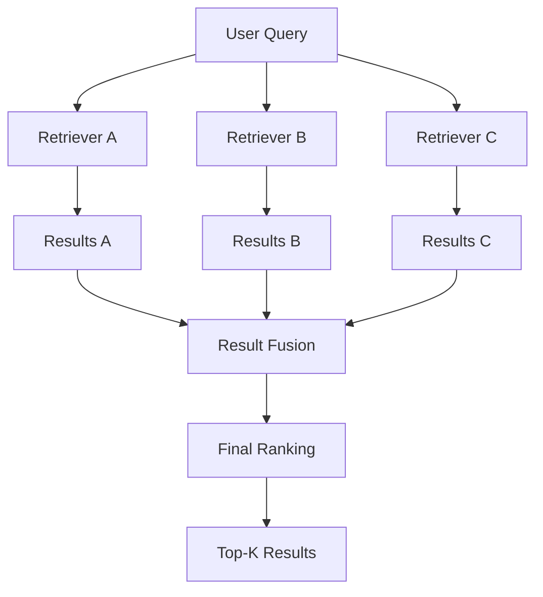
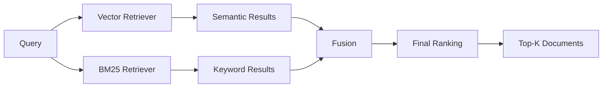
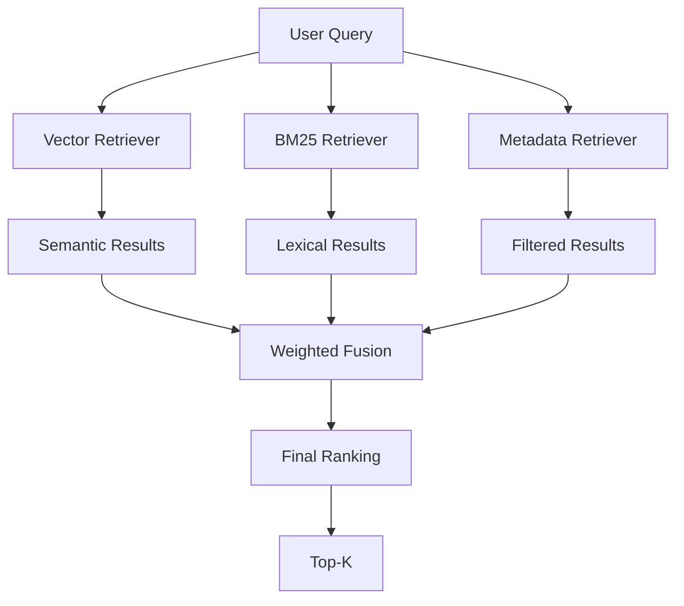
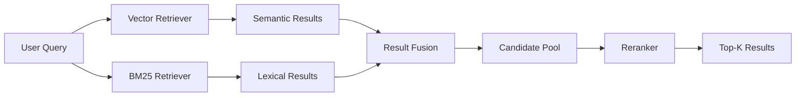
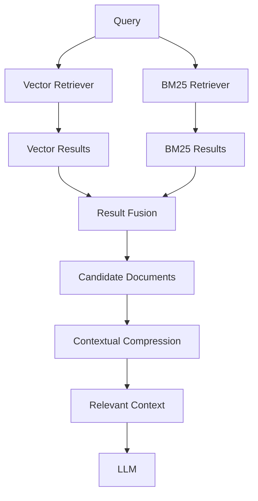
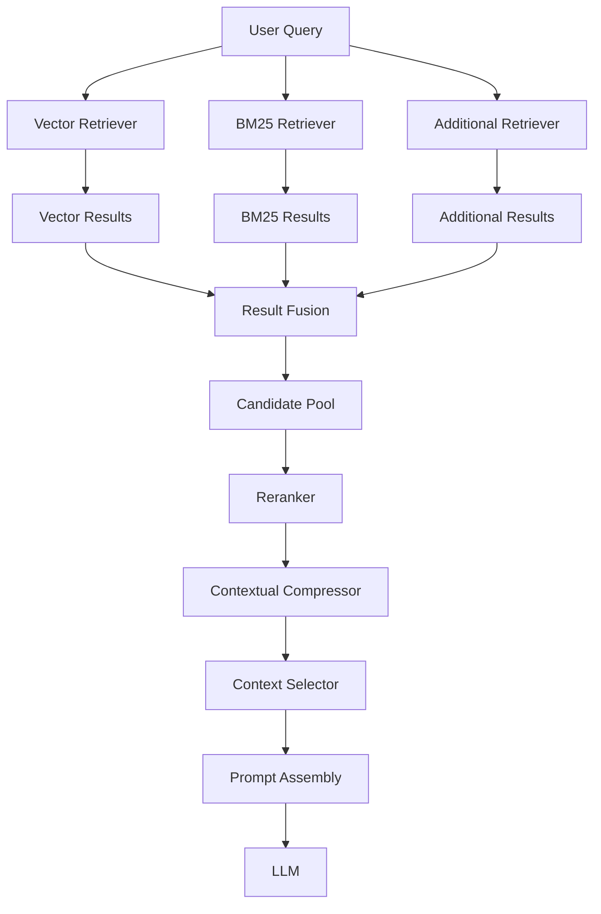
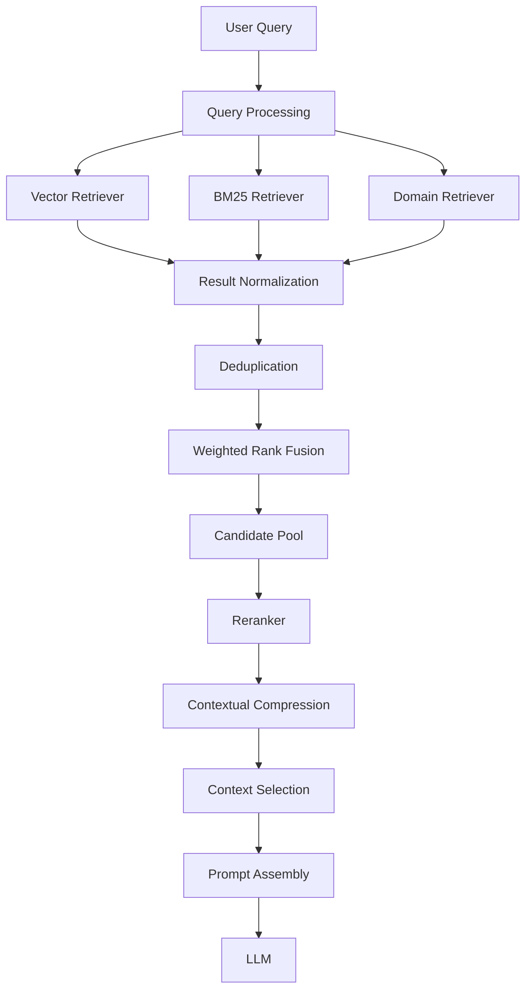
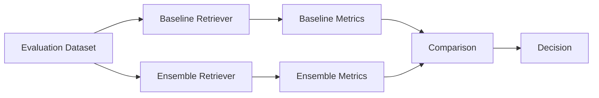

# Ensemble Retriever

## 📖 Overview

An **Ensemble Retriever** combines multiple retrieval strategies and merges their results to improve retrieval quality.

A single retriever often performs well for a particular type of query, but different retrieval techniques have different strengths.

For example:

- Vector search is strong at semantic similarity.
- BM25 is strong at exact keyword matching.
- Metadata filtering is strong when structured constraints are available.
- Specialized retrievers may perform better for particular document structures.

Instead of relying on one retrieval strategy, an ensemble retriever combines multiple retrievers:

```text
                    User Query
                        │
             ┌──────────┼──────────┐
             ↓          ↓          ↓
        Vector Search   BM25   Metadata Search
             │          │          │
             ↓          ↓          ↓
        Results A    Results B   Results C
             │          │          │
             └──────────┼──────────┘
                        ↓
                 Result Fusion
                        ↓
                 Final Ranking
                        ↓
                Retrieved Context
```

The central idea is:

> **Use multiple retrieval signals instead of depending on a single retrieval algorithm.**

---

## 🎯 Learning Objectives

After completing this chapter, you will be able to:

- Understand ensemble retrieval
- Understand why multiple retrievers can outperform a single retriever
- Compare semantic and lexical retrieval
- Understand rank fusion
- Understand Reciprocal Rank Fusion (RRF)
- Configure weighted retrievers
- Implement an ensemble retrieval pipeline
- Combine vector and BM25 retrieval
- Understand score normalization challenges
- Design framework-independent ensemble retrieval
- Evaluate ensemble retrieval quality
- Identify common failure modes
- Design production-ready ensemble retrieval architectures

---

# 1. Why Use Multiple Retrievers?

Consider the query:

```text
"What is OAuth 2.0?"
```

A semantic vector retriever may perform very well.

Now consider:

```text
"Show documents containing error code AUTH-401."
```

A lexical retriever such as BM25 may be better because the exact token:

```text
AUTH-401
```

is important.

Now consider:

```text
"Show HR policies for Germany created in 2025."
```

The query contains both:

```text
Semantic Intent
+
Structured Constraints
```

Different retrieval mechanisms may contribute different signals.

Therefore:

```text
Single Retriever
      ↓
One Retrieval Signal
```

versus:

```text
Multiple Retrievers
      ↓
Multiple Retrieval Signals
      ↓
Fused Result
```

---

# 2. Semantic vs Lexical Retrieval

Two of the most common retrieval approaches are:

### Semantic Retrieval

Uses embeddings to find conceptually similar content.

```text
Query
 ↓
Query Embedding
 ↓
Vector Search
 ↓
Semantically Similar Documents
```

Example:

```text
Query:
"How do I reset my password?"

Retrieved:
"Steps for recovering account credentials"
```

Even though the words differ, the meaning is similar.

---

### Lexical Retrieval

Uses keyword or term matching.

```text
Query
 ↓
Term Matching
 ↓
BM25 / Keyword Search
 ↓
Matching Documents
```

Example:

```text
Query:
"AUTH-401"

Retrieved:
"AUTH-401 authentication failure"
```

Exact terminology can be extremely important.

---

# 3. Why Combine Them?

Semantic retrieval can miss exact identifiers.

Lexical retrieval can miss semantic relationships.

Consider:

```text
Query:
"How can I recover access after forgetting my credentials?"
```

Semantic retrieval may find:

```text
"Password recovery procedure"
```

while lexical retrieval may focus on exact terms such as:

```text
"credentials"
"access"
"password"
```

Combining the two gives:

```text
Semantic Signal
       +
Lexical Signal
       ↓
Better Candidate Set
```

---

# 4. Ensemble Retrieval Architecture

A typical ensemble architecture looks like:



Each retriever operates independently.

The ensemble layer then combines the results.

---

# 5. Common Ensemble Combinations

Some common combinations include:

```text
Vector Search + BM25
```

```text
Dense Retrieval + Sparse Retrieval
```

```text
Vector Search + Metadata Filtering
```

```text
Multiple Vector Stores
```

```text
Multiple Embedding Models
```

```text
BM25 + Vector Search + Reranker
```

A production architecture may therefore look like:

```text
Query
  ↓
 ┌───────────────┐
 │               │
 ↓               ↓
Vector          BM25
Search          Search
 │               │
 └───────┬───────┘
         ↓
     Result Fusion
         ↓
      Re-ranking
         ↓
        Top-K
```

---

# 6. Basic LangChain Example

LangChain provides an ensemble retriever abstraction.

A simplified implementation:

```python
from langchain.retrievers import EnsembleRetriever

ensemble_retriever = EnsembleRetriever(
    retrievers=[
        vector_retriever,
        bm25_retriever
    ],
    weights=[
        0.7,
        0.3
    ]
)

documents = ensemble_retriever.invoke(
    "How do I configure OAuth authentication?"
)

for document in documents:
    print(document.page_content)
```

The important concept is:

```text
Vector Retriever
      │
      ├── Weight 0.7
      │
      ↓
Ensemble
      ↑
      │
      ├── Weight 0.3
      │
BM25 Retriever
```

The weights determine how strongly each retrieval strategy contributes to the final result.

---

# 7. Vector + BM25 Ensemble

One of the most useful combinations in RAG systems is:

```text
Dense Retrieval
+
Sparse Retrieval
```

For example:

```python
ensemble_retriever = EnsembleRetriever(
    retrievers=[
        vector_retriever,
        bm25_retriever
    ],
    weights=[0.7, 0.3]
)
```

Architecture:



This is commonly referred to as **hybrid retrieval**.

However, ensemble retrieval is the broader concept because it can combine more than just dense and sparse retrieval.

---

# 8. Understanding Retrieval Weights

Suppose we have:

```text
Vector Retriever = 0.7
BM25 Retriever   = 0.3
```

Conceptually:

```text
Final Retrieval Signal

70% Semantic
30% Lexical
```

Another configuration could be:

```text
Vector = 0.5
BM25   = 0.5
```

or:

```text
Vector = 0.3
BM25   = 0.7
```

The correct values depend on the query distribution and evaluation results.

There is no universally optimal weighting.

---

# 9. Weighting Strategy

A useful starting point might be:

```text
Semantic-heavy workload

Vector = 0.7
BM25   = 0.3
```

For identifier-heavy workloads:

```text
Exact-match-heavy workload

Vector = 0.4
BM25   = 0.6
```

For balanced workloads:

```text
Vector = 0.5
BM25   = 0.5
```

These should be treated as starting points rather than production defaults.

The final configuration should be determined through evaluation.

---

# 10. The Score Compatibility Problem

Different retrievers often produce different score ranges.

For example:

```text
Vector Search

Document A → 0.91
Document B → 0.87
Document C → 0.82
```

BM25 may produce:

```text
Document D → 14.8
Document E → 12.4
Document F → 10.2
```

Directly adding these values would be problematic.

```text
0.91 + 14.8
```

does not have a meaningful interpretation.

Therefore, ensemble systems need a way to combine retrieval signals.

---

# 11. Rank-Based Fusion

One solution is to use the **rank position** instead of raw retrieval scores.

For example:

```text
Vector Results

1. Document A
2. Document B
3. Document C
4. Document D
```

BM25 Results:

```text
1. Document C
2. Document A
3. Document E
4. Document B
```

Instead of comparing:

```text
0.91
vs
14.8
```

we compare:

```text
Rank 1
Rank 2
Rank 3
```

This makes different retrieval strategies easier to combine.

---

# 12. Reciprocal Rank Fusion

A common rank fusion method is **Reciprocal Rank Fusion (RRF)**.

The basic formula is:

```text
RRF(d) = Σ 1 / (k + rank(d))
```

where:

- `d` is a document
- `rank(d)` is the document's rank in a retriever
- `k` is a constant used to reduce the impact of very high rankings

Conceptually:

```text
Retriever A
      ↓
Rank List A
      │
      ├─────────────┐
      ↓             │
Retriever B         │
      ↓             │
Rank List B         │
      │             │
      └──────┬──────┘
             ↓
        RRF Fusion
             ↓
       Combined Ranking
```

---

# 13. RRF Example

Suppose:

```text
Vector Retriever

1. A
2. B
3. C
```

and:

```text
BM25 Retriever

1. C
2. A
3. D
```

Document `A` appears:

```text
Vector → Rank 1
BM25   → Rank 2
```

Document `C` appears:

```text
Vector → Rank 3
BM25   → Rank 1
```

Therefore both documents receive strong combined rankings.

This is one of the reasons RRF is useful:

> A document does not need to be ranked first by every retriever to become highly ranked in the combined result.

---

# 14. Rank Fusion Visualization

```text
                Vector       BM25
                  │           │
                  ↓           ↓
             Rank List A   Rank List B
                  │           │
                  └─────┬─────┘
                        ↓
                       RRF
                        ↓
                 Combined Scores
                        ↓
                  Final Ranking
```

The fusion stage effectively asks:

> "Which documents consistently appear near the top across multiple retrieval strategies?"

---

# 15. Weighted Ensemble

Not all retrievers need to have equal importance.

Suppose:

```text
Vector Retriever = 0.7
BM25 Retriever   = 0.3
```

The architecture becomes:

```text
                  Query
                    │
          ┌─────────┴─────────┐
          ↓                   ↓
      Vector                BM25
      Retriever             Retriever
          │                   │
       Weight               Weight
        0.7                   0.3
          │                   │
          └─────────┬─────────┘
                    ↓
                 Fusion
                    ↓
              Final Ranking
```

Weighted ensembles allow the system to reflect the characteristics of the workload.

---

# 16. Three-Retriever Ensemble

Ensemble retrieval is not limited to two retrievers.

For example:

```text
Vector Search
BM25
Metadata-Aware Search
```

Architecture:



Example weights:

```text
Vector    → 0.5
BM25      → 0.3
Metadata  → 0.2
```

The weights should again be validated through evaluation.

---

# 17. Ensemble with Multiple Vector Stores

An enterprise system may also combine different vector stores.

For example:

```text
Query
 ├── Product Knowledge Index
 ├── Technical Documentation Index
 └── Support Knowledge Index
```

Each index may have a different retrieval strategy.

```text
                Query
                  ↓
       ┌──────────┼──────────┐
       ↓          ↓          ↓
    Product     Technical   Support
    Retriever   Retriever   Retriever
       │          │          │
       └──────────┼──────────┘
                  ↓
              Fusion
                  ↓
             Final Results
```

This is particularly useful when enterprise knowledge is partitioned into different domains.

---

# 18. Domain-Specific Ensemble Retrieval

Consider an enterprise platform containing:

```text
HR Documents
Finance Documents
Engineering Documents
Legal Documents
```

A router or classifier may determine the likely domain.

Alternatively, an ensemble can search multiple domain indexes:

```text
Query
 ↓
 ┌────────┬──────────┬──────────┬────────┐
 ↓        ↓          ↓          ↓
HR      Finance   Engineering  Legal
 ↓        ↓          ↓          ↓
 └────────┴──────────┴──────────┴────────┘
                  ↓
                Fusion
                  ↓
             Final Results
```

This can increase recall when the query spans multiple domains.

---

# 19. Ensemble Retrieval vs Router Retrieval

These concepts should not be confused.

### Ensemble Retriever

Multiple retrievers are queried:

```text
Query
 ├── Retriever A
 ├── Retriever B
 └── Retriever C

All contribute results.
```

### Router Retriever

The system chooses one or more retrievers based on the query:

```text
Query
 ↓
Router
 ↓
Choose Retriever
 ↓
Retrieve
```

Therefore:

```text
Ensemble
→ Ask multiple retrievers

Router
→ Decide which retriever should answer
```

A router can itself be used together with an ensemble.

---

# 20. Ensemble + Reranking

A strong retrieval pipeline may combine ensemble retrieval with reranking.



The responsibilities are:

```text
Vector/BM25
→ Generate candidates

Fusion
→ Combine retrieval signals

Reranker
→ Perform deeper relevance evaluation
```

This is often stronger than simply increasing `k` on a single retriever.

---

# 21. Ensemble + Contextual Compression

Ensemble retrieval can also feed into contextual compression.

```text
Query
 ↓
Vector Retriever
 ↓
BM25 Retriever
 ↓
Result Fusion
 ↓
Top Candidates
 ↓
Contextual Compression
 ↓
Relevant Context
 ↓
LLM
```

Architecture:



This is useful when the ensemble improves recall but produces a large candidate context.

---

# 22. Ensemble + Reranking + Compression

A more advanced pipeline is:

```text
Query
 ↓
Multiple Retrievers
 ↓
Result Fusion
 ↓
Candidate Pool
 ↓
Reranking
 ↓
Contextual Compression
 ↓
Context Selection
 ↓
Prompt Assembly
 ↓
LLM
```

Architecture:



This creates a layered retrieval architecture:

```text
Recall
 ↓
Fusion
 ↓
Precision
 ↓
Compression
 ↓
Context Control
 ↓
Generation
```

---

# 23. BM25 Example

A simple BM25 retriever can be created from documents.

```python
from langchain_community.retrievers import BM25Retriever

bm25_retriever = BM25Retriever.from_documents(
    documents
)

bm25_retriever.k = 5

results = bm25_retriever.invoke(
    "OAuth authentication"
)
```

This gives the application a lexical retrieval path.

---

# 24. Combining BM25 and Vector Retrieval

A simplified example:

```python
from langchain.retrievers import EnsembleRetriever

vector_retriever = vector_store.as_retriever(
    search_kwargs={"k": 5}
)

bm25_retriever = BM25Retriever.from_documents(
    documents
)

bm25_retriever.k = 5

ensemble_retriever = EnsembleRetriever(
    retrievers=[
        vector_retriever,
        bm25_retriever
    ],
    weights=[
        0.7,
        0.3
    ]
)

results = ensemble_retriever.invoke(
    "OAuth authentication requirements"
)
```

The application now has a single retriever interface:

```text
ensemble_retriever
```

even though multiple retrieval systems are operating underneath it.

---

# 25. Framework-Agnostic Ensemble Interface

For an enterprise AI platform, it is useful to abstract the concept.

```python
from abc import ABC, abstractmethod


class Retriever(ABC):

    @abstractmethod
    def retrieve(
        self,
        query: str,
        top_k: int
    ) -> list:
        pass
```

An ensemble can then operate against this interface:

```python
class EnsembleRetriever(Retriever):

    def __init__(
        self,
        retrievers,
        weights
    ):
        self.retrievers = retrievers
        self.weights = weights

    def retrieve(
        self,
        query: str,
        top_k: int
    ) -> list:

        results = []

        for retriever, weight in zip(
            self.retrievers,
            self.weights
        ):
            results.extend(
                retriever.retrieve(
                    query,
                    top_k
                )
            )

        return self.fuse(results)
```

The key architectural principle is:

```text
Application
     ↓
Retriever Interface
     ↓
Ensemble Implementation
     ↓
Multiple Retrieval Providers
```

---

# 26. Deduplication

Different retrievers may return the same document.

For example:

```text
Vector:

A
B
C
D

BM25:

C
A
E
F
```

Without deduplication:

```text
A
B
C
D
C
A
E
F
```

A fusion layer should identify duplicates.

```text
A
B
C
D
E
F
```

Possible deduplication keys include:

- Document ID
- Chunk ID
- Source ID + page
- Content hash

Example:

```python
def deduplicate(documents):

    seen = set()
    unique = []

    for document in documents:

        document_id = document.metadata["chunk_id"]

        if document_id not in seen:
            seen.add(document_id)
            unique.append(document)

    return unique
```

---

# 27. Duplicate Content Problem

Duplicate results can distort the ensemble.

For example:

```text
Vector Retriever
→ Document A

BM25 Retriever
→ Document A

Retriever C
→ Document A
```

The same document may appear multiple times.

If the system treats each occurrence independently, the document may receive excessive influence.

Therefore:

```text
Retrieve
 ↓
Normalize IDs
 ↓
Deduplicate
 ↓
Fuse
```

is often safer.

---

# 28. Metadata Preservation

Ensemble retrieval should preserve metadata.

Example:

```python
{
    "content": "...",
    "metadata": {
        "source": "security-policy.pdf",
        "page": 14,
        "chunk_id": "security-14-03",
        "retriever": "bm25"
    }
}
```

The metadata can help with:

- Debugging
- Evaluation
- Citation
- Observability
- Retriever analysis

For production systems, consider adding:

```text
retriever_name
retriever_rank
retriever_score
fusion_score
```

---

# 29. Observability for Ensemble Retrieval

An ensemble system should make individual retriever contributions visible.

Example:

```text
Query
 ↓
Vector Retriever
 ├── 10 results
 ├── latency: 42 ms
 └── top score: 0.91

BM25 Retriever
 ├── 10 results
 ├── latency: 18 ms
 └── top score: 14.8

 ↓

Fusion
 ├── candidates: 20
 ├── duplicates: 6
 └── final candidates: 14

 ↓

Reranker
 └── top 5
```

This information is extremely useful when debugging retrieval quality.

---

# 30. Ensemble Retrieval Metrics

Important evaluation metrics include:

### Recall@K

Measures whether relevant documents appear in the top K results.

```text
Recall@K
```

is especially important when evaluating candidate generation.

---

### Precision@K

Measures how many of the retrieved documents are relevant.

```text
Precision@K
```

helps evaluate retrieval relevance.

---

### MRR

**Mean Reciprocal Rank** measures how highly the first relevant result appears.

```text
MRR
```

is useful when the first relevant document matters significantly.

---

### NDCG

**Normalized Discounted Cumulative Gain** considers both relevance and ranking position.

This is useful for comparing ranking quality across retrieval strategies.

---

# 31. Comparing Single vs Ensemble Retrieval

A useful evaluation experiment is:

```text
Baseline

Vector Retriever
     ↓
Evaluation
```

versus:

```text
Experiment

Vector + BM25
     ↓
Fusion
     ↓
Evaluation
```

Compare:

```text
Recall@5
Recall@10
MRR
NDCG
Latency
Cost
```

Example:

| Retrieval Strategy | Recall@10 | MRR | Latency |
|---|---:|---:|---:|
| Vector | 0.78 | 0.69 | 40 ms |
| BM25 | 0.71 | 0.63 | 20 ms |
| Ensemble | 0.86 | 0.77 | 58 ms |

The numbers above are illustrative.

The important point is to measure whether the additional retrieval strategy actually improves the system.

---

# 32. Query-Type Analysis

A useful production evaluation approach is to classify queries.

For example:

```text
Semantic Queries
Exact Identifier Queries
Short Queries
Long Queries
Technical Queries
Natural Language Questions
Metadata-Heavy Queries
```

Then compare retrieval performance.

Example:

| Query Type | Vector | BM25 | Ensemble |
|---|---:|---:|---:|
| Semantic | High | Medium | High |
| Exact Identifier | Medium | High | High |
| Technical | High | High | Very High |
| Metadata-heavy | Medium | Medium | High |

This helps determine whether ensemble retrieval provides meaningful value across different query classes.

---

# 33. Latency Considerations

Ensemble retrieval usually increases retrieval work.

For example:

```text
Vector Search = 40 ms
BM25         = 20 ms
Fusion        = 5 ms
```

Approximate pipeline:

```text
40 + 20 + 5
≈ 65 ms
```

If the retrievers run sequentially.

However, they can often be executed concurrently:

```text
                Query
                  │
          ┌───────┴───────┐
          ↓               ↓
      Vector             BM25
      40 ms              20 ms
          │               │
          └───────┬───────┘
                  ↓
                Fusion
```

The overall retrieval latency can then approach:

```text
max(40, 20) + fusion
```

rather than:

```text
40 + 20
```

This is an important production optimization.

---

# 34. Parallel Retrieval

Conceptually:

```python
from concurrent.futures import ThreadPoolExecutor


def retrieve_parallel(query):

    with ThreadPoolExecutor(
        max_workers=2
    ) as executor:

        vector_future = executor.submit(
            vector_retriever.invoke,
            query
        )

        bm25_future = executor.submit(
            bm25_retriever.invoke,
            query
        )

        vector_results = vector_future.result()
        bm25_results = bm25_future.result()

    return vector_results, bm25_results
```

Production implementations should use the concurrency model appropriate to the runtime and infrastructure.

---

# 35. When Ensemble Retrieval Helps Most

Ensemble retrieval is especially useful when:

- Queries contain exact identifiers
- Documents contain technical terminology
- Semantic and lexical signals are both important
- Different retrievers have complementary strengths
- Retrieval recall is insufficient
- The knowledge base contains heterogeneous documents
- Queries vary significantly in style
- A single retrieval strategy has known blind spots

---

# 36. When Ensemble Retrieval May Not Help

An ensemble may not be worthwhile when:

```text
The baseline retriever already performs extremely well
```

or:

```text
The second retriever adds little unique recall
```

or:

```text
The additional latency is unacceptable
```

or:

```text
The additional infrastructure cost outweighs the quality improvement
```

Therefore:

> **Do not add retrievers simply because more retrieval algorithms exist.**

Measure the incremental value.

---

# 37. Common Failure Modes

## 37.1 Poor Weight Selection

Incorrect weights may cause one retriever to dominate.

```text
Vector = 0.95
BM25   = 0.05
```

may effectively behave like a vector-only system.

---

## 37.2 Duplicate Results

Multiple retrievers may return the same chunks.

Without deduplication:

```text
Candidate Pool
    ↓
Duplicate Evidence
    ↓
Biased Ranking
```

---

## 37.3 Score Incompatibility

Raw scores from different retrievers may not be directly comparable.

```text
Vector Score → 0.92
BM25 Score   → 18.3
```

Rank-based fusion can help address this problem.

---

## 37.4 Increased Latency

More retrievers mean more retrieval operations.

```text
More Retrievers
      ↓
More Work
      ↓
Potentially Higher Latency
```

---

## 37.5 Increased Cost

Cloud-hosted retrieval services, rerankers, or additional model calls can increase operational cost.

---

## 37.6 No Measurable Quality Improvement

The most important failure mode:

```text
Complexity ↑
Cost ↑
Latency ↑

Quality
   ↓
No meaningful improvement
```

Always compare against a baseline.

---

# 38. Production Design Pattern

A practical enterprise architecture can look like:



This architecture separates:

```text
Candidate Generation
        ↓
Result Fusion
        ↓
Precision Optimization
        ↓
Context Optimization
        ↓
Generation
```

---

# 39. Enterprise Retrieval Interface

A production platform may expose a single interface:

```python
class EnterpriseRetriever:

    def retrieve(
        self,
        query: str,
        *,
        top_k: int = 10
    ):
        ...
```

Internally:

```text
EnterpriseRetriever
       │
       ├── VectorRetriever
       ├── BM25Retriever
       ├── MetadataRetriever
       └── DomainRetriever
              ↓
          Fusion Layer
              ↓
          Reranker
              ↓
          Context Selection
```

The application does not need to know which individual retrievers are being used.

This is useful for evolving retrieval architecture without changing downstream application code.

---

# 40. Configuration-Driven Ensemble

Retriever configuration can be externalized.

Example:

```yaml
retrieval:
  ensemble:
    enabled: true

    retrievers:
      - name: vector
        weight: 0.7
        top_k: 10

      - name: bm25
        weight: 0.3
        top_k: 10

    fusion:
      strategy: reciprocal_rank_fusion

    deduplication:
      enabled: true
```

This allows retrieval strategies and weights to be changed without modifying application logic.

---

# 41. Testing Ensemble Retrieval

A production test suite should include:

```text
Unit Tests
Integration Tests
Retrieval Evaluation
Regression Tests
Performance Tests
```

Example:

```python
def test_ensemble_returns_relevant_document():

    results = ensemble_retriever.invoke(
        "OAuth authentication"
    )

    assert len(results) > 0

    assert any(
        "OAuth" in doc.page_content
        for doc in results
    )
```

For production evaluation, use a curated query-answer-document dataset rather than relying only on assertions like the example above.

---

# 42. Ensemble Retrieval Evaluation Pipeline



Compare:

```text
Quality
Latency
Cost
Operational Complexity
```

The ensemble should be adopted only when the improvement justifies the additional complexity.

---

# 43. Recommended Starting Configuration

For a general enterprise knowledge assistant, a reasonable starting architecture is:

```text
Query
 ↓
Vector Retriever
 ↓
BM25 Retriever
 ↓
RRF / Weighted Fusion
 ↓
Deduplication
 ↓
Reranker
 ↓
Contextual Compression
 ↓
Prompt Assembly
 ↓
LLM
```

This should be treated as an architecture to evaluate rather than a universal production recipe.

---

# 44. Decision Framework

```text
Does the current retriever miss relevant documents?
                    │
              ┌─────┴─────┐
             No           Yes
             │             ↓
             │       Is the missing
             │       information lexical?
             │             │
             │        ┌────┴────┐
             │       Yes        No
             │        │          │
             │      Add BM25   Try another
             │                 retrieval signal
             │        │          │
             │        └────┬─────┘
             │             ↓
             │         Evaluate
             │             ↓
             └─────────────┤
                           ↓
                    Does quality improve?
                           │
                     ┌─────┴─────┐
                    Yes          No
                     │            │
              Keep Ensemble    Reconsider
```

The core engineering principle is:

> **Ensemble retrieval should be evidence-driven and evaluation-driven.**

---

# 45. Production Checklist

Before deploying an ensemble retriever:

```text
☐ Baseline retriever has been evaluated
☐ Additional retriever provides complementary recall
☐ Retriever weights are configurable
☐ Fusion strategy is defined
☐ Score incompatibility is handled
☐ Duplicate documents are removed
☐ Document IDs are normalized
☐ Source metadata is preserved
☐ Individual retriever latency is measured
☐ Fusion latency is measured
☐ Individual retriever errors are handled
☐ Parallel retrieval is considered
☐ Retrieval metrics are tracked
☐ Regression tests exist
☐ Cost impact is measured
☐ End-to-end RAG quality is evaluated
```

---

# 46. Key Takeaways

- Ensemble retrieval combines multiple retrieval strategies.
- Different retrievers provide different retrieval signals.
- Vector retrieval is strong for semantic similarity.
- BM25 is strong for lexical and exact-term matching.
- Combining dense and sparse retrieval can improve recall.
- Ensemble retrieval can combine more than two retrievers.
- Retrieval weights control the contribution of individual retrievers.
- Raw retrieval scores may not be directly comparable.
- Rank-based fusion provides a useful alternative.
- Reciprocal Rank Fusion is a common rank-fusion approach.
- Duplicate results should be removed before or during fusion.
- Metadata should be preserved throughout the retrieval pipeline.
- Ensemble retrieval can be combined with reranking.
- Ensemble retrieval can be combined with contextual compression.
- Parallel execution can reduce additional retrieval latency.
- More retrievers do not automatically mean better retrieval.
- Ensemble architectures should always be evaluated against a baseline.
- Production decisions should consider quality, latency, cost, and complexity together.

The central pattern is:

```text
Multiple Retrieval Signals
          ↓
       Fusion
          ↓
   Better Candidates
          ↓
      Re-ranking
          ↓
 Context Optimization
          ↓
       Generation
```

Or simply:

```text
Retrieve Differently
       ↓
Combine Intelligently
       ↓
Rank Carefully
       ↓
Generate from Better Evidence
```

---

# 🧭 Chapter Navigation

### Part V — Advanced Retrieval-Augmented Generation

**Previous:**  
[01. Contextual Compression Retriever](01-contextual-compression-retriever.md)

**Next:**  
[03. Multi-Vector Retriever](03-multivector-retriever.md)

**Section:**  
02 — Enterprise Retrieval Engineering

### Enterprise Retrieval Engineering Path

```text
01 Contextual Compression Retriever
              ↓
02 Ensemble Retriever
              ↓
03 Multi-Vector Retriever
              ↓
04 Time-Weighted Retriever
              ↓
05 Hybrid Search Retriever
              ↓
06 HyDE Retriever
              ↓
07 Router Retriever
              ↓
08 Multi-Stage Retrieval
              ↓
09 Agentic Retrieval
              ↓
10 Re-ranking Techniques
              ↓
11 MMR & Diversity-Aware Retrieval
              ↓
12 Metadata-Aware Retrieval
              ↓
13 Advanced Query Rewriting
```

---

> **Enterprise AI Engineering Handbook**  
> *Building Production-Grade Enterprise AI Systems — One Chapter at a Time.*