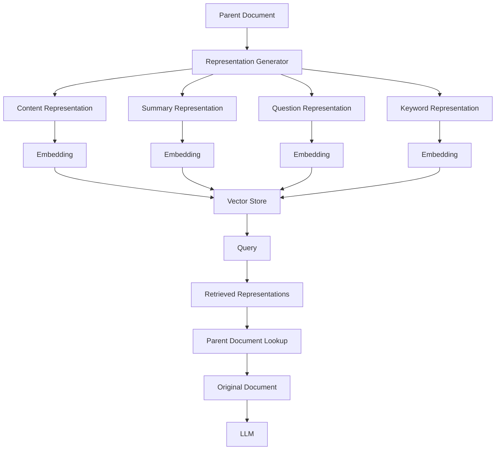
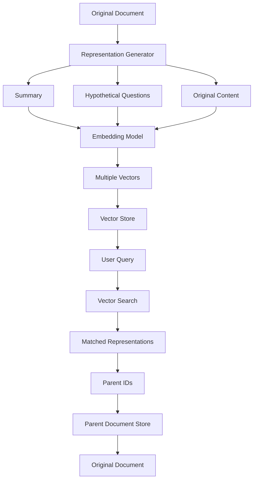
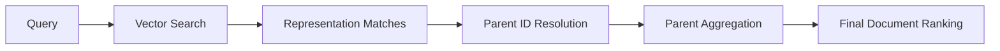
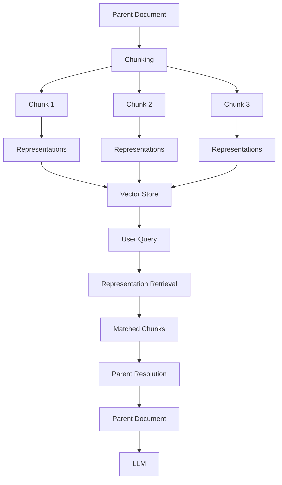
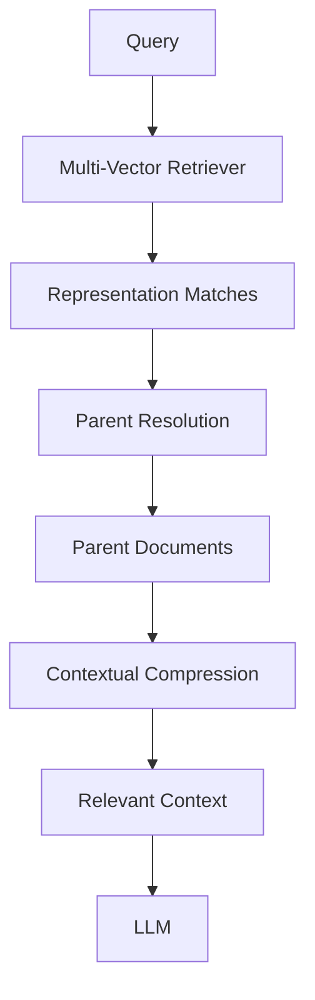
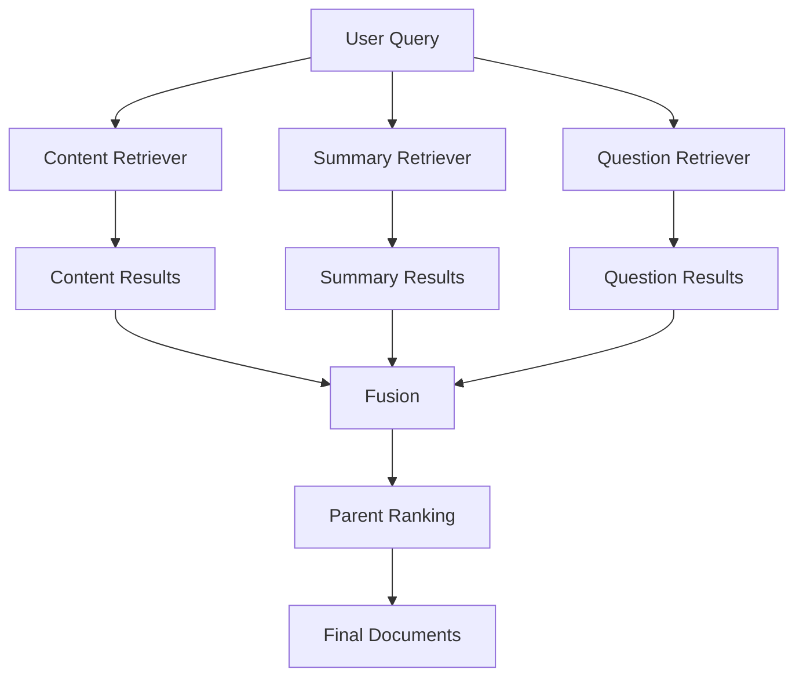
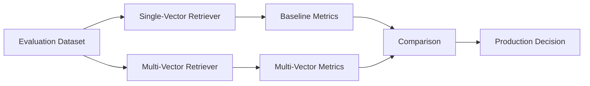
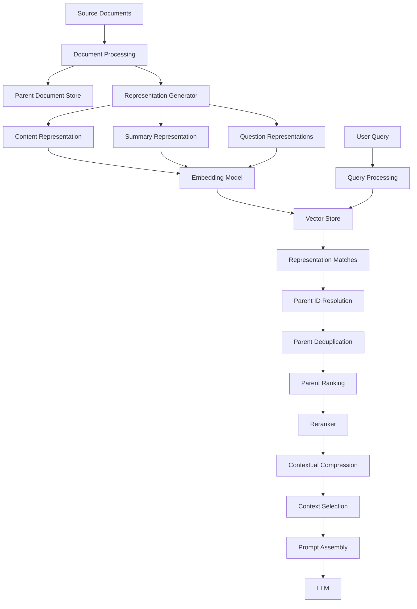
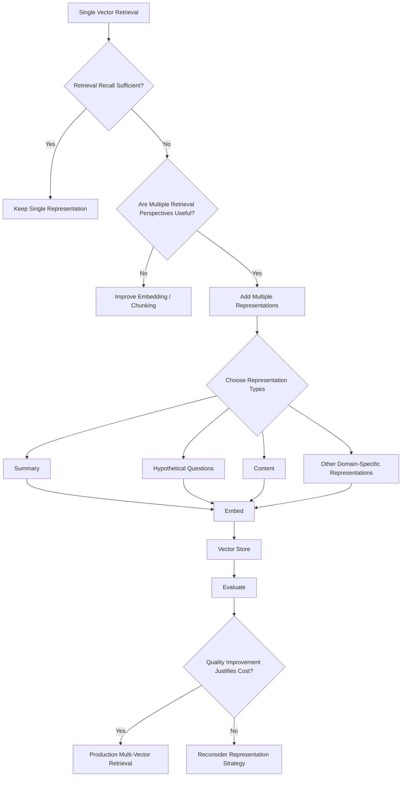

# Multi-Vector Retriever

## 📖 Overview

A **Multi-Vector Retriever** represents a single logical document using multiple vectors instead of relying on one embedding vector.

Traditional vector retrieval usually follows:

```text
Document
   ↓
Chunk
   ↓
Embedding
   ↓
Vector Store
```

A Multi-Vector Retriever expands this approach:

```text
                         Document
                            │
              ┌─────────────┼─────────────┐
              ↓             ↓             ↓
          Summary        Content       Questions
              ↓             ↓             ↓
          Vector A       Vector B       Vector C
              └─────────────┼─────────────┘
                            ↓
                       Vector Store
                            ↓
                           Query
                            ↓
                     Multiple Matches
                            ↓
                     Parent Document
                            ↓
                          LLM
```

The key idea is:

> **One document can have multiple representations optimized for different retrieval signals.**

This is particularly useful when a single embedding does not adequately represent all the ways users may search for a document.

---

## 🎯 Learning Objectives

After completing this chapter, you will be able to:

- Understand Multi-Vector Retrieval
- Understand why one vector may not be sufficient for complex documents
- Differentiate single-vector and multi-vector retrieval
- Understand parent-document and child-vector relationships
- Represent documents using summaries
- Represent documents using hypothetical questions
- Understand multiple embeddings per document
- Implement a Multi-Vector Retriever
- Understand document ID mapping
- Combine multiple retrieval representations
- Understand score and ranking considerations
- Combine Multi-Vector Retrieval with reranking
- Combine Multi-Vector Retrieval with contextual compression
- Design production-ready Multi-Vector Retrieval architectures
- Evaluate Multi-Vector Retrieval against a single-vector baseline

---

# 1. The Limitation of Single-Vector Retrieval

A traditional RAG ingestion pipeline often looks like:

```text
Document
   ↓
Chunking
   ↓
Embedding Model
   ↓
One Vector per Chunk
   ↓
Vector Database
```

For example:

```text
Document Chunk

"OAuth 2.0 authorization allows applications
to obtain access tokens from an authorization
server before accessing protected resources."
```

The embedding represents the semantic meaning of the chunk.

This works well for many queries.

However, users may ask questions in many different ways.

For example:

```text
"What is OAuth 2.0?"
```

```text
"How do applications obtain access tokens?"
```

```text
"Which protocol is used for delegated authorization?"
```

```text
"Explain authorization server flows."
```

A single vector may not represent all possible retrieval perspectives equally well.

---

# 2. Multi-Vector Retrieval Concept

Instead of creating one vector representation, we can create multiple representations.

For example:

```text
Document
   │
   ├── Original Content
   │
   ├── Summary
   │
   ├── Hypothetical Questions
   │
   ├── Keywords
   │
   └── Other Representations
```

Each representation can have its own embedding:

```text
Summary
   ↓
Embedding A

Content
   ↓
Embedding B

Question 1
   ↓
Embedding C

Question 2
   ↓
Embedding D
```

The vector store therefore contains multiple vectors that point back to the same logical document.

---

# 3. Core Architecture



The vector store primarily handles retrieval representations.

The original document is maintained separately or in a parent-document store.

---

# 4. Single Vector vs Multi-Vector

### Single-Vector Retrieval

```text
Document
   ↓
Embedding
   ↓
Vector Store
```

Example:

```text
Document A → Vector A
Document B → Vector B
Document C → Vector C
```

---

### Multi-Vector Retrieval

```text
Document A
   ├── Vector A1
   ├── Vector A2
   ├── Vector A3

Document B
   ├── Vector B1
   ├── Vector B2
   ├── Vector B3
```

The important distinction is:

```text
Single Vector
→ One representation per retrieval unit

Multi-Vector
→ Multiple representations per logical document
```

---

# 5. Why Multiple Representations Help

Consider a long technical document:

```text
Enterprise Authentication Architecture

Sections:

1. OAuth 2.0
2. OpenID Connect
3. Access Tokens
4. Refresh Tokens
5. Authorization Code Flow
6. Client Credentials Flow
7. Security Considerations
8. Token Validation
```

A summary may capture:

```text
Enterprise authentication architecture
covering OAuth 2.0, OpenID Connect,
token management, authorization flows,
and security considerations.
```

A generated question may be:

```text
"How does the authorization code flow work?"
```

Another question:

```text
"When should client credentials flow be used?"
```

These different representations expose different semantic paths to the same parent document.

---

# 6. Representation Types

Multi-Vector Retrieval can use several representation types.

Common examples include:

```text
Original Content
Summaries
Hypothetical Questions
Keywords
Entities
Metadata Descriptions
Generated Captions
Synthetic Queries
```

Conceptually:

```text
                Parent Document
                       │
       ┌───────────────┼───────────────┐
       ↓               ↓               ↓
    Summary         Questions       Content
       ↓               ↓               ↓
   Embedding        Embeddings     Embedding
       │               │               │
       └───────────────┼───────────────┘
                       ↓
                  Vector Store
```

---

# 7. Parent Document and Vector Representations

A common architecture maintains:

```text
Vector Store
```

for retrieval representations and:

```text
Document Store
```

for the original document.

For example:

```text
Vector Store

vector_001 → doc_100
vector_002 → doc_100
vector_003 → doc_100

vector_004 → doc_200
vector_005 → doc_200
```

The document store contains:

```text
doc_100 → Original Document A
doc_200 → Original Document B
```

The relationship is:

```text
Vector Representation
        ↓
Parent Document ID
        ↓
Original Document
```

---

# 8. Why Store the Parent ID?

Suppose the vector database returns:

```text
vector_002
```

The application needs to know which logical document produced that vector.

Metadata can therefore contain:

```json
{
  "vector_id": "vector_002",
  "parent_id": "doc_100",
  "representation_type": "question"
}
```

This allows the application to perform:

```text
Vector Match
     ↓
parent_id
     ↓
Parent Document Lookup
```

---

# 9. Basic Data Model

A simple representation could look like:

```python
class VectorRepresentation:

    def __init__(
        self,
        vector_id,
        parent_id,
        representation_type,
        content
    ):
        self.vector_id = vector_id
        self.parent_id = parent_id
        self.representation_type = representation_type
        self.content = content
```

Example:

```python
VectorRepresentation(
    vector_id="vec-001",
    parent_id="doc-100",
    representation_type="summary",
    content="OAuth 2.0 authentication architecture"
)
```

Another:

```python
VectorRepresentation(
    vector_id="vec-002",
    parent_id="doc-100",
    representation_type="question",
    content="How does OAuth 2.0 authorization work?"
)
```

Both representations point to:

```text
doc-100
```

---

# 10. Summary-Based Multi-Vector Retrieval

One common strategy is to generate a summary for each document.

```text
Original Document
        ↓
Summary Generator
        ↓
Summary
        ↓
Embedding
        ↓
Vector Store
```

The vector represents the summary rather than the complete document.

When a query matches the summary:

```text
Query
 ↓
Summary Vector Match
 ↓
Parent Document ID
 ↓
Original Document
```

This can be useful for large documents where a concise summary provides a stronger semantic representation.

---

# 11. Summary Example

Original document:

```text
Enterprise API Security Guide

This document explains authentication,
authorization, OAuth 2.0, OpenID Connect,
access tokens, refresh tokens, API gateways,
rate limiting, logging, monitoring, and
security best practices for production APIs.
```

Generated summary:

```text
Production API security covering OAuth 2.0,
OpenID Connect, tokens, authorization,
rate limiting, monitoring, and security
best practices.
```

The summary becomes a retrieval representation.

```text
Query
 ↓
Summary Embedding
 ↓
Vector Match
 ↓
Parent Document
```

---

# 12. Hypothetical Question Representations

Another powerful approach is to generate hypothetical questions that a document could answer.

For example:

```text
Document
   ↓
Question Generator
   ↓
Question 1
Question 2
Question 3
Question 4
   ↓
Embeddings
   ↓
Vector Store
```

For a document about OAuth:

```text
Question 1:
"What is OAuth 2.0?"

Question 2:
"How does OAuth authorization work?"

Question 3:
"How are access tokens obtained?"

Question 4:
"When should OAuth be used?"
```

Each question becomes a vector representation of the parent document.

---

# 13. Why Hypothetical Questions Can Help

Users naturally ask questions.

Documents are not necessarily written in question form.

For example:

```text
Document:

OAuth 2.0 defines an authorization framework...
```

User:

```text
"How does OAuth 2.0 work?"
```

A generated hypothetical question:

```text
"How does OAuth 2.0 work?"
```

can create a closer semantic representation.

The retrieval path becomes:

```text
User Query
     ↓
Question Embedding
     ↓
Similar Hypothetical Question
     ↓
Parent Document
```

---

# 14. Question Generation Example

A simple prompt could be:

```python
question_prompt = """
Generate five questions that this document
could answer.

Document:
{document}

Requirements:
- Questions should represent different user intents.
- Questions should be specific.
- Questions should not introduce information
  that is not present in the document.
"""
```

Example output:

```text
1. What is OAuth 2.0?
2. How does the authorization code flow work?
3. How are access tokens issued?
4. When should client credentials flow be used?
5. How should access tokens be validated?
```

Each question can then be embedded independently.

---

# 15. Multi-Vector Representation Pipeline



---

# 16. Multiple Vectors per Document

Suppose:

```text
Document A
```

produces:

```text
Summary A
Question A1
Question A2
Question A3
Content A
```

The vector store may contain:

```text
Vector 1 → Document A → Summary
Vector 2 → Document A → Question A1
Vector 3 → Document A → Question A2
Vector 4 → Document A → Question A3
Vector 5 → Document A → Content
```

Therefore:

```text
5 vectors
     ↓
1 logical document
```

This is the fundamental Multi-Vector Retrieval pattern.

---

# 17. Query-Time Retrieval

At query time:

```text
User Query
    ↓
Query Embedding
    ↓
Vector Search
    ↓
Top Representations
```

Example:

```text
Query:

"How does the authorization code flow work?"
```

Vector search might return:

```text
1. Question A2
2. Question B4
3. Summary A
4. Content C
```

The application then resolves:

```text
Question A2 → Document A
Summary A   → Document A
Content C   → Document C
```

After deduplication:

```text
Document A
Document C
```

The parent documents are returned to the generation layer.

---

# 18. Parent Deduplication

Multiple representations may point to the same parent.

For example:

```text
Vector Search Results

Question A1 → Document A
Question A2 → Document A
Summary A   → Document A
Question B1 → Document B
```

Without deduplication:

```text
Document A
Document A
Document A
Document B
```

With parent-level deduplication:

```text
Document A
Document B
```

This prevents one document from dominating the final context simply because it has more representations.

---

# 19. Parent-Level Ranking

A production Multi-Vector Retriever should consider how multiple representation matches affect parent ranking.

Suppose:

```text
Document A

Question A1 → 0.91
Question A2 → 0.86
Summary A   → 0.79
```

Document B:

```text
Question B1 → 0.88
Summary B   → 0.82
```

The system can aggregate these signals.

For example:

```text
Document A
→ max score = 0.91

Document B
→ max score = 0.88
```

Or use another aggregation strategy.

The important point is:

> **Representation-level retrieval eventually needs to become document-level ranking.**

---

# 20. Representation-Level vs Parent-Level Ranking

The retrieval process has two levels.

### Level 1 — Representation Retrieval

```text
Query
 ↓
Representation Vectors
 ↓
Top Matches
```

### Level 2 — Parent Resolution

```text
Top Representations
 ↓
Parent IDs
 ↓
Parent Ranking
 ↓
Final Documents
```

Architecture:



This distinction becomes important when multiple vectors belong to the same document.

---

# 21. Aggregation Strategies

Possible parent-level aggregation strategies include:

```text
Maximum Score
Average Score
Weighted Average
Top-N Representation Score
Reciprocal Rank Fusion
Weighted Rank Fusion
```

For example:

```text
Parent Score = max(
    representation scores
)
```

or:

```text
Parent Score =
0.6 × highest_score
+
0.4 × second_highest_score
```

The appropriate strategy depends on the representation types and evaluation results.

---

# 22. Representation-Type Weighting

Different representations may have different importance.

For example:

```text
Content Vector       → 0.3
Summary Vector       → 0.3
Question Vector      → 0.4
```

The system may therefore assign higher importance to generated question representations if they consistently improve query matching.

Conceptually:

```text
Query
 ↓
 ┌─────────────┬─────────────┬─────────────┐
 ↓             ↓             ↓
Content       Summary      Questions
 0.3           0.3            0.4
 └─────────────┴─────────────┴─────────────┘
                  ↓
             Parent Ranking
```

These values should be treated as configuration parameters to evaluate, not fixed defaults.

---

# 23. LangChain Multi-Vector Retriever

LangChain provides a `MultiVectorRetriever` abstraction.

A simplified example:

```python
from langchain.retrievers.multi_vector import MultiVectorRetriever
from langchain.storage import InMemoryByteStore

retriever = MultiVectorRetriever(
    vectorstore=vector_store,
    byte_store=InMemoryByteStore(),
    id_key="doc_id"
)
```

The important relationship is:

```text
Vector Store
     ↓
Representation Retrieval

Document Store
     ↓
Parent Document Retrieval
```

The `id_key` connects the vector representation to the original document.

---

# 24. Adding Parent Documents

A simplified pattern:

```python
from uuid import uuid4

doc_id = str(uuid4())

parent_document = {
    "id": doc_id,
    "content": original_content
}
```

Representations can then contain the same ID:

```python
summary_document.metadata["doc_id"] = doc_id
question_document.metadata["doc_id"] = doc_id
```

This creates:

```text
Summary Vector
      │
      └── doc_id
             ↓
        Parent Document

Question Vector
      │
      └── doc_id
             ↓
        Parent Document
```

---

# 25. Adding Multiple Representations

Example:

```python
representations = [
    summary_document,
    question_1,
    question_2,
    question_3
]

for representation in representations:
    representation.metadata["doc_id"] = doc_id

vector_store.add_documents(
    representations
)
```

The parent document is stored separately.

At query time:

```text
Vector Match
     ↓
doc_id
     ↓
Parent Store
     ↓
Original Document
```

---

# 26. End-to-End Example

Consider a document:

```text
Document ID:
security-001

Content:
Enterprise API Security Guide
```

Representations:

```text
Summary:
"Guide covering OAuth, tokens,
authorization, API security."

Question 1:
"How does OAuth authentication work?"

Question 2:
"How are access tokens validated?"

Question 3:
"What security controls are required
for production APIs?"
```

The vector store contains:

```text
summary-vector
question-vector-1
question-vector-2
question-vector-3
```

All point to:

```text
security-001
```

Query:

```text
"What controls should production APIs implement?"
```

Possible retrieval:

```text
question-vector-3
       ↓
security-001
       ↓
Parent Document
```

---

# 27. Multi-Vector Retrieval with Chunked Content

Multi-Vector Retrieval can also work with chunks.

Instead of:

```text
Document
 ↓
One Vector
```

we can use:

```text
Document
 ↓
Chunks
 ↓
Multiple Representations per Chunk
```

For example:

```text
Document
 ├── Chunk 1
 │    ├── Content Vector
 │    └── Summary Vector
 │
 ├── Chunk 2
 │    ├── Content Vector
 │    └── Question Vector
 │
 └── Chunk 3
      ├── Content Vector
      └── Question Vector
```

This creates a more granular representation structure.

---

# 28. Multi-Vector vs Parent-Document Retrieval

These approaches are related but not identical.

### Parent-Document Retrieval

Usually focuses on:

```text
Small Child Chunks
       ↓
Retrieve
       ↓
Return Larger Parent
```

### Multi-Vector Retrieval

Focuses on:

```text
Multiple Representations
       ↓
Retrieve Representation
       ↓
Resolve Parent
```

They can be combined.

For example:

```text
Question Representation
        ↓
Child Chunk
        ↓
Parent Document
```

This creates:

```text
Multiple Retrieval Signals
+
Parent Context
```

---

# 29. Multi-Vector + Parent Document Architecture



---

# 30. Multi-Vector + Reranking

A reranker can operate after representation retrieval.

```text
Query
 ↓
Multi-Vector Retrieval
 ↓
Candidate Representations
 ↓
Parent Resolution
 ↓
Candidate Documents
 ↓
Reranker
 ↓
Top Documents
```

Architecture:


This can help when multiple representation matches produce a broad candidate set.

---

# 31. Multi-Vector + Contextual Compression

Multi-Vector Retrieval can also be combined with contextual compression.

```text
Query
 ↓
Multi-Vector Retrieval
 ↓
Parent Documents
 ↓
Contextual Compression
 ↓
Relevant Sections
 ↓
LLM
```

Architecture:



This is useful when parent documents are significantly larger than the information actually required by the query.

---

# 32. Multi-Vector + Ensemble Retrieval

Multiple retrieval representations can themselves be treated as an ensemble.

For example:

```text
Content Retriever
Summary Retriever
Question Retriever
```

Architecture:



This approach makes the relationship between Multi-Vector Retrieval and Ensemble Retrieval explicit.

---

# 33. Multi-Vector + Hybrid Search

A production system can also combine:

```text
Dense Multi-Vector Retrieval
+
Sparse Retrieval
```

For example:

```text
                    Query
                      │
          ┌───────────┴───────────┐
          ↓                       ↓
   Multi-Vector Search         BM25
          │                       │
          ↓                       ↓
  Representation Results    Keyword Results
          │                       │
          └───────────┬───────────┘
                      ↓
                    Fusion
                      ↓
               Parent Ranking
```

This can provide:

```text
Semantic Matching
+
Representation Diversity
+
Exact Keyword Matching
```

---

# 34. Representation Generation Cost

Multi-Vector Retrieval introduces additional ingestion work.

For example:

```text
Single Vector

Document
 ↓
1 Embedding
```

Multi-Vector:

```text
Document
 ↓
Summary Generation
 ↓
Question Generation
 ↓
Multiple Embeddings
```

The ingestion pipeline may therefore become more expensive.

Example:

```text
1 Document
   ↓
1 Summary
   +
5 Questions
   +
Original Content
   ↓
7 Representations
   ↓
7 Embeddings
```

This creates additional:

- LLM generation cost
- Embedding cost
- Storage requirements
- Indexing time
- Metadata management

Therefore, the retrieval improvement must justify the additional ingestion complexity.

---

# 35. Storage Considerations

If a corpus contains:

```text
1,000,000 documents
```

and each document produces:

```text
1 content vector
1 summary vector
5 question vectors
```

then approximately:

```text
7,000,000 vectors
```

may need to be stored.

This affects:

```text
Storage
Index Size
Indexing Time
Search Latency
Backup Size
Infrastructure Cost
```

Multi-Vector Retrieval should therefore be designed with scale in mind.

---

# 36. Representation Explosion

A common mistake is generating too many representations.

For example:

```text
20 questions
+
5 summaries
+
10 keywords
+
multiple content vectors
```

can rapidly increase vector count.

More vectors do not automatically mean better retrieval.

The objective should be:

```text
Useful Representations
        ↓
Better Recall
        ↓
Controlled Cost
```

rather than:

```text
Maximum Number of Vectors
```

---

# 37. Representation Quality

Generated representations are only useful if they are high quality.

A poor generated question can introduce incorrect assumptions.

Example:

```text
Document:
OAuth supports authorization code flow.
```

Bad generated question:

```text
"How does OAuth guarantee security against all attacks?"
```

The document may not support that claim.

The representation generator should therefore remain grounded in the source document.

---

# 38. Guardrails for Representation Generation

A safe generation prompt could be:

```text
Generate retrieval representations for the document.

Rules:

1. Use only information present in the document.
2. Do not introduce unsupported facts.
3. Do not make assumptions.
4. Preserve important terminology.
5. Generate questions that the document can actually answer.
6. Avoid duplicate questions.
7. Keep representations concise and specific.
```

This reduces the risk of creating misleading retrieval vectors.

---

# 39. Metadata Design

A production vector representation should carry enough metadata to support traceability.

Example:

```json
{
  "doc_id": "doc-100",
  "representation_id": "rep-004",
  "representation_type": "question",
  "source": "security-guide.pdf",
  "page": 14,
  "section": "OAuth",
  "version": "v3"
}
```

Useful fields include:

```text
doc_id
representation_id
representation_type
source
page
section
version
created_at
```

This supports:

- Citation
- Debugging
- Evaluation
- Versioning
- Observability

---

# 40. Representation Lifecycle

Representations should have a lifecycle.

```text
Source Document
      ↓
Representation Generation
      ↓
Validation
      ↓
Embedding
      ↓
Indexing
      ↓
Retrieval
      ↓
Evaluation
```

When the source document changes:

```text
Document Updated
      ↓
Representations Invalidated
      ↓
Regeneration
      ↓
Re-Embedding
      ↓
Re-Indexing
```

This is important for enterprise knowledge systems.

---

# 41. Versioning

Consider:

```text
Document Version 1
```

producing:

```text
Summary V1
Questions V1
Vectors V1
```

After an update:

```text
Document Version 2
```

the representations should be regenerated.

A metadata model can contain:

```json
{
  "doc_id": "security-001",
  "document_version": "2",
  "representation_version": "2",
  "representation_type": "summary"
}
```

This prevents stale representations from being returned.

---

# 42. Multi-Vector Retrieval Evaluation

The correct baseline is:

```text
Single-Vector Retriever
```

The experiment is:

```text
Multi-Vector Retriever
```

Compare:

```text
Recall@K
Precision@K
MRR
NDCG
Answer Accuracy
Faithfulness
Latency
Storage
Indexing Cost
```

Architecture:



---

# 43. Retrieval Metrics

Important retrieval metrics include:

### Recall@K

Does the correct document appear in the retrieved candidates?

```text
Recall@K
```

is particularly important when Multi-Vector Retrieval is being used for candidate generation.

---

### MRR

Measures how highly the first relevant result appears.

```text
MRR
```

can show whether Multi-Vector Retrieval moves relevant documents closer to the top.

---

### NDCG

Measures ranking quality while considering relevance and position.

---

# 44. End-to-End RAG Evaluation

Retrieval quality is not the only consideration.

The final system should also evaluate:

```text
Question
 ↓
Multi-Vector Retrieval
 ↓
Context
 ↓
LLM
 ↓
Answer
```

Metrics may include:

```text
Answer Correctness
Faithfulness
Context Relevance
Citation Accuracy
Latency
Cost
```

A retrieval improvement is valuable only if it translates into meaningful downstream improvement.

---

# 45. Common Failure Modes

## 45.1 Too Many Representations

```text
More Representations
        ↓
More Storage
        ↓
More Retrieval Noise
```

---

## 45.2 Poor Generated Questions

Incorrect or unsupported questions can create misleading retrieval paths.

---

## 45.3 Duplicate Parent Documents

Multiple vectors can return the same parent.

```text
Representation A → Document X
Representation B → Document X
Representation C → Document X
```

Parent-level deduplication is required.

---

## 45.4 Parent Ranking Problems

A document with many representations may dominate simply because it has more vectors.

The system should carefully design parent-level aggregation.

---

## 45.5 Stale Representations

When source documents change, old summaries or questions can remain indexed.

This can produce stale retrieval results.

---

## 45.6 Increased Storage

Multiple vectors per document can significantly increase vector database size.

---

## 45.7 Increased Ingestion Cost

LLM-generated summaries and questions increase preprocessing cost.

---

## 45.8 Retrieval Latency

A larger vector index and more complex resolution logic can affect latency.

---

# 46. Production Architecture

A mature Multi-Vector Retrieval architecture can look like:



This architecture separates:

```text
Representation Generation
        ↓
Vector Retrieval
        ↓
Parent Resolution
        ↓
Ranking
        ↓
Context Optimization
        ↓
Generation
```

---

# 47. Enterprise Design Principle

The most important architectural principle is:

```text
Retrieval Representation
          ≠
Generation Context
```

A representation optimized for retrieval does not necessarily need to be sent to the LLM.

For example:

```text
Generated Question
```

may be excellent for retrieval.

But the LLM should receive:

```text
Original Source Content
```

rather than the generated question.

Therefore:

```text
Representation
→ Retrieve

Parent Document
→ Generate
```

This separation is fundamental to Multi-Vector Retrieval.

---

# 48. Decision Flow



---

# 49. When to Use Multi-Vector Retrieval

Multi-Vector Retrieval is especially useful when:

- Documents have multiple semantic aspects
- Queries can be phrased in many different ways
- Long documents are difficult to represent with one vector
- Synthetic questions improve retrieval recall
- Summaries provide useful high-level representations
- Different representations capture different retrieval intents
- Parent documents should be returned after representation-level retrieval
- Enterprise knowledge contains complex heterogeneous documents

Typical applications include:

```text
Enterprise Knowledge Assistants
Technical Documentation
Research Systems
Legal Document Search
Financial Knowledge Systems
Healthcare Knowledge Bases
Product Documentation
Enterprise Policy Search
```

---

# 50. When It May Not Be Necessary

Multi-Vector Retrieval may not be appropriate when:

```text
Documents are already small
```

or:

```text
Queries are simple and predictable
```

or:

```text
Single-vector retrieval already achieves strong recall
```

or:

```text
Additional ingestion cost is unacceptable
```

or:

```text
The additional representations do not improve evaluation metrics
```

A simpler architecture is often preferable when it already satisfies production requirements.

---

# 51. Recommended Starting Architecture

A practical starting point is:

```text
Parent Document
      ↓
 ┌────┴──────────┐
 ↓               ↓
Summary       Questions
 ↓               ↓
Embedding     Embeddings
 └───────┬───────┘
         ↓
    Vector Store
         ↓
       Query
         ↓
Representation Retrieval
         ↓
Parent Resolution
         ↓
Deduplication
         ↓
Reranking
         ↓
Contextual Compression
         ↓
LLM
```

This provides:

```text
Multiple Retrieval Perspectives
+
Parent-Level Context
+
Precision Optimization
+
Context Optimization
```

---

# 52. Production Checklist

Before deploying a Multi-Vector Retriever:

```text
☐ Single-vector baseline has been evaluated
☐ Representation types are clearly defined
☐ Generated representations are grounded in source documents
☐ Duplicate representations are controlled
☐ Parent IDs are stable
☐ Parent-level deduplication is implemented
☐ Parent ranking strategy is defined
☐ Representation metadata is preserved
☐ Source metadata is preserved
☐ Document versioning is supported
☐ Stale representations are removed
☐ Vector storage growth is measured
☐ Embedding costs are measured
☐ LLM representation-generation costs are measured
☐ Retrieval latency is measured
☐ End-to-end RAG quality is evaluated
☐ Citation traceability is preserved
☐ Regression tests are implemented
```

---

# 53. Key Takeaways

- Multi-Vector Retrieval represents a logical document using multiple vectors.
- A single document can have content, summary, question, and other retrieval representations.
- Multiple representations provide multiple semantic paths to the same document.
- Vector retrieval operates against representations rather than necessarily the final generation context.
- Parent IDs connect representations to original documents.
- Parent-level deduplication is essential.
- Parent-level ranking must account for multiple representation matches.
- Summaries can provide useful high-level retrieval representations.
- Hypothetical questions can align document representations with natural user queries.
- Multiple representations increase ingestion and storage costs.
- More vectors do not automatically mean better retrieval.
- Representation generation must remain grounded in source content.
- Multi-Vector Retrieval can be combined with Parent-Document Retrieval.
- It can also be combined with ensemble retrieval, reranking, hybrid search, and contextual compression.
- Generated retrieval representations should generally not replace source evidence during generation.
- Source metadata and document versioning are critical for enterprise systems.
- Multi-Vector Retrieval should be evaluated against a single-vector baseline.
- The objective is not to maximize the number of vectors.
- The objective is to create **useful retrieval representations that improve recall and relevance without introducing unnecessary operational complexity**.

The central pattern is:

```text
One Logical Document
        ↓
Multiple Retrieval Representations
        ↓
Multiple Vector Signals
        ↓
Representation Retrieval
        ↓
Parent Resolution
        ↓
Parent Ranking
        ↓
Context Optimization
        ↓
LLM
```

Or simply:

```text
Represent More Ways
       ↓
Retrieve Better
       ↓
Return the Original Evidence
```

---

# 🧭 Chapter Navigation

### Part V — Advanced Retrieval-Augmented Generation

**Previous:**  
[02. Ensemble Retriever](02-ensemble-retriever.md)

**Next:**  
[04. Time-Weighted Retriever](04-timeweighted-retriever.md)

**Section:**  
02 — Enterprise Retrieval Engineering

### Enterprise Retrieval Engineering Path

```text
01 Contextual Compression Retriever
              ↓
02 Ensemble Retriever
              ↓
03 Multi-Vector Retriever
              ↓
04 Time-Weighted Retriever
              ↓
05 Hybrid Search Retriever
              ↓
06 HyDE Retriever
              ↓
07 Router Retriever
              ↓
08 Multi-Stage Retrieval
              ↓
09 Agentic Retrieval
              ↓
10 Re-ranking Techniques
              ↓
11 MMR & Diversity-Aware Retrieval
              ↓
12 Metadata-Aware Retrieval
              ↓
13 Advanced Query Rewriting
```

---

> **Enterprise AI Engineering Handbook**  
> *Building Production-Grade Enterprise AI Systems — One Chapter at a Time.*