# Time-Weighted Retriever

## 📖 Overview

A **Time-Weighted Retriever** considers both **relevance** and **recency** when selecting documents.

Traditional vector retrieval primarily asks:

> "Which documents are most semantically similar to this query?"

Time-weighted retrieval adds another question:

> "How recent is this information?"

This is especially useful for knowledge bases where newer information should gradually become more important.

Examples include:

```text
News
Product Documentation
Support Tickets
Operational Knowledge
Incident Reports
Engineering Discussions
Policy Updates
Research Notes
Conversation History
```

The core idea is:

```text
Semantic Relevance
        +
Document Recency
        ↓
Time-Weighted Ranking
        ↓
Final Retrieved Context
```

---

## 🎯 Learning Objectives

After completing this chapter, you will be able to:

- Understand time-weighted retrieval
- Understand why recency matters in RAG
- Differentiate relevance ranking from recency-aware ranking
- Understand exponential time decay
- Configure decay parameters
- Combine semantic similarity with recency
- Implement time-weighted retrieval
- Understand the role of timestamps and metadata
- Combine time weighting with vector retrieval
- Combine time weighting with other retrieval strategies
- Understand common failure modes
- Design production-ready time-aware retrieval systems
- Evaluate retrieval quality across different time windows

---

# 1. Why Recency Matters

Consider an enterprise API policy.

```text
API Security Policy

2022 Version
→ OAuth 2.0
→ Token expiration: 24 hours

2024 Version
→ OAuth 2.0
→ Token expiration: 12 hours

2026 Version
→ OAuth 2.0
→ Token expiration: 1 hour
```

A semantic retriever may find all three documents because they discuss the same topic.

However, if the user asks:

```text
"What is the current token expiration policy?"
```

the latest version should normally receive higher priority.

Therefore:

```text
Semantic Similarity
        ↓
Find relevant documents

Recency
        ↓
Prefer newer information
```

---

# 2. Traditional Retrieval

A conventional vector retriever may rank documents based primarily on semantic similarity.

```text
Query
 ↓
Embedding
 ↓
Vector Search
 ↓
Similarity Score
 ↓
Top-K
```

Example:

```text
Document             Similarity

Policy 2022            0.94
Policy 2024            0.92
Policy 2026            0.89
```

A traditional retriever might return:

```text
2022
2024
2026
```

even though the 2026 document is the most current.

---

# 3. Time-Weighted Retrieval

Time-weighted retrieval introduces a temporal signal.

Conceptually:

```text
Final Score
=
Relevance
+
Recency Contribution
```

or, depending on the implementation:

```text
Final Score
=
Similarity × Recency Weight
```

The exact scoring model depends on the implementation.

The architecture becomes:

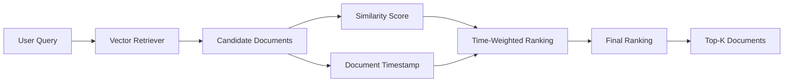

---

# 4. Core Concept

A time-weighted retriever uses:

```text
Relevance
    +
Age / Recency
```

to determine the final ranking.

For example:

```text
Document A
Similarity = High
Age = 4 years

Document B
Similarity = Slightly Lower
Age = 2 months
```

A time-aware system may prefer:

```text
Document B
```

if recency is sufficiently important.

---

# 5. Time Decay

The influence of a document can gradually decrease as it becomes older.

A common conceptual model is exponential decay:

```text
Recency Weight = e^(-λt)
```

where:

```text
t = age of document
λ = decay rate
```

The behavior is:

```text
New Document
     ↓
High Recency Weight

Older Document
     ↓
Lower Recency Weight
```

The decay should be selected according to the domain.

---

# 6. Decay Visualization

```text
Recency Weight
     ↑
1.0  ●
     │\
     │ \
0.8  │  ●
     │    \
0.6  │      ●
     │        \
0.4  │          ●
     │             \
0.2  │                ●
     │                   \
0.0  └────────────────────────→
       New              Older
```

The exact curve depends on the decay configuration.

The important idea is:

> **Older documents gradually lose temporal preference.**

---

# 7. Half-Life Concept

A useful way to reason about decay is **half-life**.

Suppose the recency weight has a half-life of:

```text
30 days
```

Then approximately:

```text
Age             Recency Weight

0 days             1.00
30 days            0.50
60 days            0.25
90 days            0.125
```

This does not necessarily mean the document becomes unusable.

It means its **recency contribution** decreases over time.

---

# 8. Why Half-Life Matters

Different domains require different temporal behavior.

### Breaking News

```text
Half-life:
Hours
```

### Incident Management

```text
Half-life:
Days
```

### Product Documentation

```text
Half-life:
Months
```

### Enterprise Policies

```text
Half-life:
Months / Years
```

### Historical Research

```text
Recency:
May have little or no importance
```

Therefore:

> **Time decay must be domain-specific.**

---

# 9. Time-Weighted Retrieval Architecture

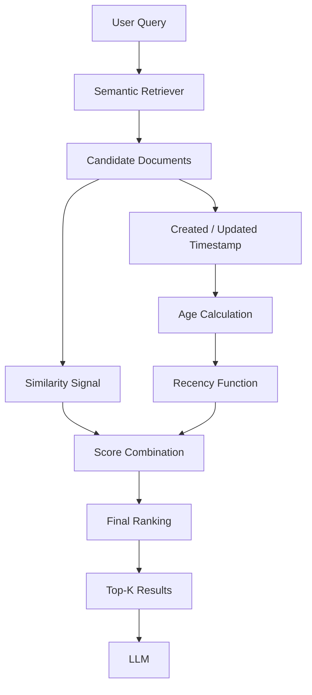

The retrieval system therefore adds a temporal ranking stage after candidate generation.

---

# 10. Timestamp Metadata

Time-weighted retrieval depends on reliable timestamps.

A document might contain:

```json
{
  "source": "api-security-policy.pdf",
  "created_at": "2024-05-12T10:30:00Z",
  "updated_at": "2026-07-20T09:15:00Z"
}
```

Possible temporal fields include:

```text
created_at
updated_at
published_at
effective_from
effective_until
last_modified
```

The correct field depends on the business meaning of "current."

---

# 11. Created Time vs Updated Time

These fields are not interchangeable.

Consider:

```text
Document created:
2022

Document updated:
2026
```

If the system uses:

```text
created_at
```

the document appears old.

If the business requirement is to prioritize the latest version, then:

```text
updated_at
```

may be more appropriate.

Therefore:

```text
Temporal Semantics
        ↓
Choose Correct Timestamp
```

---

# 12. Effective Dates

Enterprise systems often need more than timestamps.

For example:

```json
{
  "effective_from": "2026-07-01",
  "effective_until": null
}
```

A policy may have been created earlier but become effective later.

Therefore:

```text
Created Date
    ≠
Effective Date
```

For policies, contracts, pricing, and regulations, **effective dates** can be more important than modification dates.

---

# 13. Validity Windows

Some documents have explicit validity periods.

Example:

```text
Promotion Policy

Effective:
2026-08-01

Expires:
2026-08-31
```

A production retrieval system can use:

```text
Current Date
      ↓
Validity Check
      ↓
Eligible Documents
```

before applying semantic retrieval.

This is different from simply applying time decay.

---

# 14. Time-Weighted Retrieval vs Temporal Filtering

These concepts should be distinguished.

### Temporal Filtering

Hard constraint:

```text
Only documents from 2026
```

Documents outside the range are excluded.

```text
2025 → ❌
2026 → ✅
```

### Time Weighting

Soft preference:

```text
2025 → Lower Score
2026 → Higher Score
```

Older documents may still be returned if they are highly relevant.

Therefore:

```text
Filtering
→ Hard boundary

Weighting
→ Soft preference
```

---

# 15. Combining Filtering and Weighting

A production system can combine both.

```text
Query
 ↓
Temporal Filter
 ↓
Semantic Retrieval
 ↓
Time Weighting
 ↓
Final Ranking
```

For example:

```text
Filter:
effective_until >= today
```

then:

```text
Rank active documents
by relevance + recency
```

This can be safer for time-sensitive enterprise information.

---

# 16. LangChain Example

LangChain provides a time-weighted retriever abstraction.

A simplified example is:

```python
from langchain.retrievers import TimeWeightedVectorStoreRetriever

retriever = TimeWeightedVectorStoreRetriever(
    vectorstore=vector_store,
    decay_rate=0.01,
    k=5
)
```

Documents need temporal metadata so that their age can be considered.

For example:

```python
document.metadata = {
    "source": "engineering-notes.md",
    "created_at": "2026-08-01T10:00:00Z"
}
```

The exact metadata requirements depend on the framework version and implementation being used.

---

# 17. Adding Documents with Timestamps

Example:

```python
from datetime import datetime, timezone

document.metadata["created_at"] = (
    datetime.now(timezone.utc).isoformat()
)

vector_store.add_documents(
    [document]
)
```

The retrieval layer can then use temporal information during ranking.

For production systems, timestamps should preferably be assigned from authoritative ingestion metadata rather than generated arbitrarily during retrieval.

---

# 18. Basic Retrieval Example

```python
results = retriever.invoke(
    "What is the current deployment policy?"
)

for document in results:
    print(document.page_content)
    print(document.metadata)
```

The result can contain:

```text
Document Content
Source
Timestamp
Metadata
```

This allows downstream components to understand why a particular version was retrieved.

---

# 19. Relevance + Recency

Consider three documents:

```text
Document A
Similarity = 0.95
Age = 3 years

Document B
Similarity = 0.90
Age = 6 months

Document C
Similarity = 0.85
Age = 1 week
```

A purely semantic retriever may prefer:

```text
A
B
C
```

A time-aware retriever might prefer:

```text
B
C
A
```

depending on the decay configuration.

This illustrates the central trade-off:

```text
Semantic Relevance
        ↕
Temporal Freshness
```

---

# 20. The Freshness-Relevance Trade-Off

A document can be:

```text
Very Relevant
but Old
```

or:

```text
Very Recent
but Less Relevant
```

For example:

```text
Old Architecture Guide
Similarity = 0.97

New Release Note
Similarity = 0.83
```

If the query is:

```text
"What is the latest API behavior?"
```

the newer document may be more useful.

But if the query is:

```text
"What architecture was used in version 2?"
```

the older document may be exactly what the user needs.

Therefore, time weighting should never blindly replace relevance.

---

# 21. Query-Aware Temporal Behavior

Temporal importance can depend on the query.

Compare:

```text
"What is the current pricing?"
```

with:

```text
"What was the pricing in 2022?"
```

The first query requires:

```text
High Recency Preference
```

The second requires:

```text
Historical Relevance
```

Therefore, advanced systems may adapt temporal behavior based on query intent.

---

# 22. Query Intent and Recency

Conceptually:

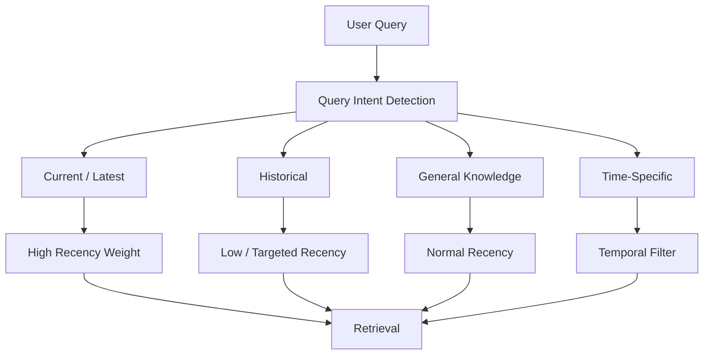

This is a more sophisticated approach than applying one decay rate to every query.

---

# 23. Explicit Temporal Queries

Queries often contain temporal language:

```text
latest
current
recent
today
this month
last year
in 2024
before 2022
after 2025
```

These terms can be extracted during query processing.

Example:

```text
"What changed in the API in 2026?"
```

Possible interpretation:

```text
Target Year = 2026
```

The system can then apply:

```text
Temporal Filter
+
Semantic Retrieval
```

rather than relying only on generic recency decay.

---

# 24. Time-Weighted Retrieval with Hybrid Search

Time weighting can be combined with lexical and semantic retrieval.

```text
Query
 ├── Vector Search
 ├── BM25
 └── Temporal Signal
          ↓
       Fusion
          ↓
     Final Ranking
```

Architecture:

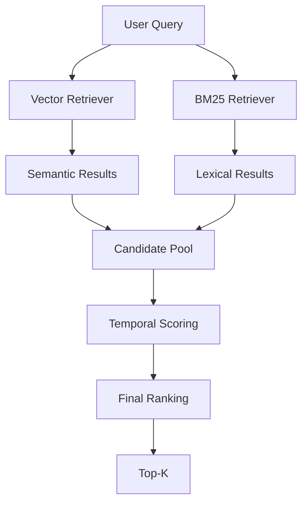

This can combine:

```text
Semantic Relevance
+
Keyword Relevance
+
Freshness
```

---

# 25. Time-Weighted Retrieval with Ensemble Retrieval

The temporal signal can also be added to an ensemble.

```text
Vector Retriever
BM25 Retriever
Domain Retriever
        ↓
Result Fusion
        ↓
Temporal Ranking
        ↓
Final Results
```

Alternatively, time-aware retrievers can participate as one of the ensemble components.

The architecture should be selected based on the scoring and evaluation strategy.

---

# 26. Time-Weighted Retrieval with Re-ranking

A reranker can be applied after temporal retrieval.

```text
Query
 ↓
Time-Weighted Retrieval
 ↓
Candidate Documents
 ↓
Reranker
 ↓
Top-K
```

Architecture:

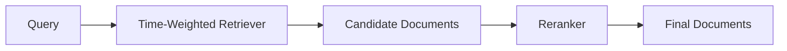

This allows:

```text
Retrieval
→ Relevance + Recency

Reranking
→ Deeper Query-Document Relevance
```

---

# 27. Time-Weighted Retrieval with Contextual Compression

A useful RAG pipeline is:

```text
Query
 ↓
Time-Weighted Retrieval
 ↓
Candidate Documents
 ↓
Contextual Compression
 ↓
Relevant Context
 ↓
LLM
```

Architecture:

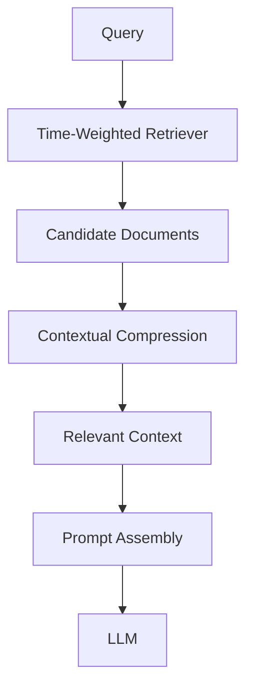

This is particularly useful when recent documents are large and contain substantial irrelevant information.

---

# 28. Time-Weighted Retrieval with Multi-Vector Retrieval

Multi-Vector Retrieval can provide multiple representations, while time weighting prioritizes newer documents.

```text
Query
 ↓
Multi-Vector Search
 ↓
Representation Matches
 ↓
Parent Resolution
 ↓
Temporal Ranking
 ↓
Final Documents
```

Architecture:

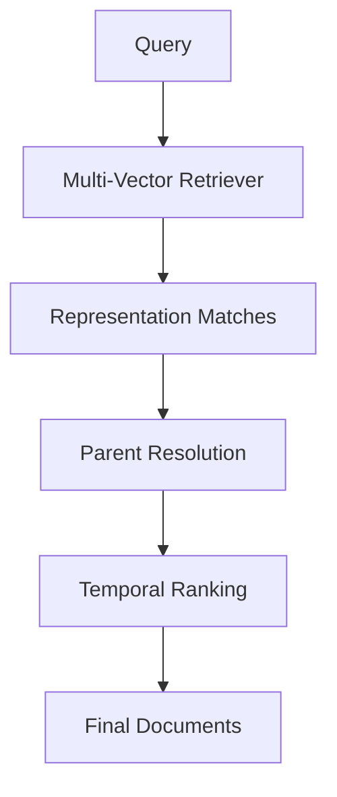

This can be useful when both:

```text
Multiple Semantic Representations
+
Document Freshness
```

matter.

---

# 29. Time-Weighted Retrieval with Parent Documents

For document versioning, the architecture can be:

```text
Query
 ↓
Child / Representation Retrieval
 ↓
Parent Documents
 ↓
Version Resolution
 ↓
Time-Aware Ranking
 ↓
Current Context
```

For example:

```text
Policy v1
Policy v2
Policy v3
```

The system can prefer:

```text
Policy v3
```

if it is the latest valid version.

---

# 30. Version-Aware Retrieval

Versioning is often more reliable than generic recency.

Example:

```json
{
  "document_id": "policy-100",
  "version": "3",
  "effective_from": "2026-07-01",
  "effective_until": null,
  "status": "active"
}
```

The retrieval pipeline can apply:

```text
Status = active
```

before ranking.

This prevents an outdated but recently modified draft from outranking the active policy.

---

# 31. Draft vs Published Documents

Consider:

```text
Policy A
Status = Published
Updated = 2026-08-01

Policy B
Status = Draft
Updated = 2026-08-10
```

A naive time-weighted system may prefer:

```text
Policy B
```

because it is newer.

But the enterprise application may need:

```text
Policy A
```

because it is the current published policy.

Therefore:

> **Recency is not the same as validity.**

This is a critical enterprise retrieval principle.

---

# 32. Temporal Metadata Model

A robust metadata model can include:

```json
{
  "document_id": "policy-100",
  "version": "3",
  "created_at": "2025-10-01T09:00:00Z",
  "updated_at": "2026-07-15T11:30:00Z",
  "effective_from": "2026-07-01T00:00:00Z",
  "effective_until": null,
  "status": "published"
}
```

This enables more precise temporal reasoning.

---

# 33. Temporal Retrieval Pipeline

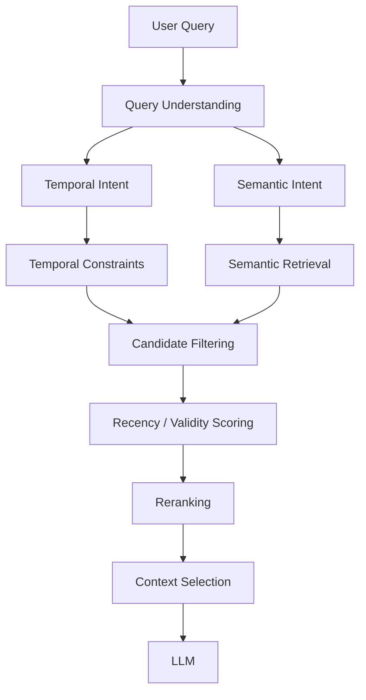

This architecture separates:

```text
Temporal Constraints
```

from:

```text
Temporal Preference
```

---

# 34. Decay Rate Selection

The decay rate determines how quickly old information loses temporal influence.

Conceptually:

```text
Low Decay
    ↓
Slow freshness decay
    ↓
Older documents remain competitive
```

While:

```text
High Decay
    ↓
Fast freshness decay
    ↓
New documents strongly preferred
```

Example:

```text
Slow-changing domain
→ Low decay

Fast-changing domain
→ Higher decay
```

The correct value should be established through evaluation.

---

# 35. Decay Configuration

Example configuration:

```yaml
retrieval:
  time_weighting:
    enabled: true
    decay_rate: 0.01
    timestamp_field: updated_at
    minimum_recency_weight: 0.1
```

An enterprise implementation may expose:

```text
decay_rate
timestamp_field
minimum_weight
time_window
```

as configuration rather than hard-coding them.

---

# 36. Domain-Specific Profiles

Different domains can use different temporal profiles.

Example:

```yaml
profiles:

  news:
    decay_rate: 0.20

  support:
    decay_rate: 0.05

  engineering:
    decay_rate: 0.01

  policies:
    decay_rate: 0.005
```

These numbers are illustrative.

The important architectural idea is:

```text
Domain
   ↓
Temporal Profile
   ↓
Retrieval Configuration
```

---

# 37. Query-Specific Time Windows

Instead of continuous decay, some applications use explicit windows.

For example:

```text
Current incidents:
Last 7 days
```

or:

```text
Recent product changes:
Last 90 days
```

The pipeline becomes:

```text
Query
 ↓
Time Window Extraction
 ↓
Temporal Filter
 ↓
Semantic Retrieval
```

This is often preferable when the user explicitly specifies a time range.

---

# 38. Temporal Filtering Example

Suppose:

```text
Query:
"What changed in the API during July 2026?"
```

The system can derive:

```text
start = 2026-07-01
end   = 2026-07-31
```

Then:

```python
documents = filter_by_date(
    documents,
    start_date="2026-07-01",
    end_date="2026-07-31"
)
```

Only after filtering should the system perform deeper ranking.

---

# 39. Historical Questions

Time weighting can become harmful for historical queries.

Example:

```text
"What authentication mechanism did the platform use in 2021?"
```

The latest document may describe:

```text
OAuth 2.1
```

while the 2021 document describes:

```text
OAuth 2.0
```

If recency dominates:

```text
Current Document
      ↓
Incorrect Historical Answer
```

Therefore, explicit historical intent should override generic recency preference.

---

# 40. Temporal Query Classification

A query classifier may identify:

```text
Current
Historical
Time-Specific
Time-Neutral
```

Example:

```text
"What is the current pricing?"
→ Current

"What was the pricing in 2022?"
→ Historical

"What changed between 2024 and 2026?"
→ Time-Specific

"How does OAuth work?"
→ Time-Neutral
```

This enables more appropriate retrieval behavior.

---

# 41. Time-Weighted Retrieval and Citations

Temporal retrieval makes source metadata especially important.

A response should ideally identify:

```text
Document
Version
Effective Date
Source
```

For example:

```text
Source:
API Security Policy

Version:
3

Effective:
July 1, 2026
```

This helps users understand why a newer policy was selected.

---

# 42. Temporal Citations

Example response context:

```json
{
  "content": "Production APIs require OAuth 2.0 access tokens.",
  "source": "api-security-policy.pdf",
  "version": "3",
  "effective_from": "2026-07-01",
  "page": 14
}
```

This is more useful than:

```json
{
  "content": "Production APIs require OAuth 2.0 access tokens."
}
```

because the temporal context is preserved.

---

# 43. Observability

Time-aware retrieval should expose temporal signals.

Example:

```text
Query
 ↓
Candidate Documents

Document A
Similarity: 0.94
Age: 720 days
Recency Weight: 0.18

Document B
Similarity: 0.89
Age: 30 days
Recency Weight: 0.74

Document C
Similarity: 0.86
Age: 7 days
Recency Weight: 0.91
```

This makes retrieval decisions explainable.

---

# 44. Retrieval Trace

A production trace could contain:

```json
{
  "query": "What is the current token policy?",
  "retriever": "time_weighted_vector",
  "candidates": 20,
  "timestamp_field": "updated_at",
  "decay_rate": 0.01,
  "top_result": {
    "document_id": "policy-100",
    "similarity": 0.89,
    "recency_weight": 0.92
  }
}
```

This is useful for:

```text
Debugging
Evaluation
Observability
Auditing
```

---

# 45. Evaluation Strategy

A time-weighted retriever should be evaluated against a baseline.

```text
Baseline:
Vector Retriever

Experiment:
Time-Weighted Retriever
```

Compare:

```text
Recall@K
MRR
NDCG
Answer Accuracy
Temporal Accuracy
Citation Accuracy
Latency
```

The key additional metric is:

```text
Temporal Correctness
```

Does the system retrieve the correct version or time period?

---

# 46. Temporal Evaluation Dataset

Create test cases such as:

```text
Query:
"What is the current API timeout?"

Expected:
2026 Policy
```

```text
Query:
"What was the API timeout in 2023?"

Expected:
2023 Policy
```

```text
Query:
"What changed between 2024 and 2026?"

Expected:
Both versions
```

This helps evaluate whether the system understands temporal intent rather than simply preferring newer documents.

---

# 47. Example Evaluation Table

| Query Type | Vector | Time-Weighted | Temporal Filter |
|---|---:|---:|---:|
| Current | 0.78 | 0.88 | 0.91 |
| Historical | 0.84 | 0.72 | 0.90 |
| Time-specific | 0.70 | 0.81 | 0.93 |
| Time-neutral | 0.87 | 0.86 | 0.84 |

The numbers are illustrative.

The important observation is that:

```text
No single temporal strategy
is optimal for every query type.
```

---

# 48. Common Failure Modes

## 48.1 Overweighting Recency

```text
Newer
≠
More Relevant
```

A recent document can still be unrelated.

---

## 48.2 Ignoring Historical Intent

A current document may incorrectly replace the historical document required by the user.

---

## 48.3 Wrong Timestamp

Using:

```text
created_at
```

when the business requirement is:

```text
effective_from
```

can produce incorrect results.

---

## 48.4 Draft Documents

A recently updated draft may outrank a valid published document.

---

## 48.5 Stale Metadata

Incorrect timestamps lead directly to incorrect temporal ranking.

---

## 48.6 Excessive Decay

If decay is too aggressive:

```text
Older Knowledge
     ↓
Rapidly Loses Influence
```

Important long-lived knowledge may disappear.

---

## 48.7 Insufficient Decay

If decay is too weak:

```text
Very Old Documents
     ↓
Remain Highly Competitive
```

The system may fail to prioritize current information.

---

# 49. Production Architecture

A mature enterprise temporal retrieval architecture can look like:

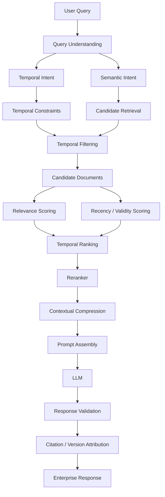

This architecture separates:

```text
Temporal Intent
        ↓
Temporal Constraints
        ↓
Retrieval
        ↓
Recency Preference
        ↓
Precision Optimization
        ↓
Generation
```

---

# 50. Framework-Agnostic Interface

An enterprise AI platform can define a temporal retrieval interface:

```python
from abc import ABC, abstractmethod


class TimeAwareRetriever(ABC):

    @abstractmethod
    def retrieve(
        self,
        query: str,
        top_k: int,
        *,
        timestamp_field: str = "updated_at"
    ) -> list:
        pass
```

Possible implementations:

```python
class VectorTimeWeightedRetriever(TimeAwareRetriever):
    ...


class HybridTimeWeightedRetriever(TimeAwareRetriever):
    ...


class VersionAwareRetriever(TimeAwareRetriever):
    ...
```

This allows the application to remain independent of the underlying retrieval framework.

---

# 51. Configuration-Driven Architecture

A production configuration might look like:

```yaml
retrieval:
  temporal:
    enabled: true

    timestamp_field: updated_at

    decay:
      strategy: exponential
      rate: 0.01

    validity:
      enabled: true

    versioning:
      enabled: true

    historical_queries:
      disable_recency_bias: true
```

This provides explicit control over temporal behavior.

---

# 52. Decision Framework

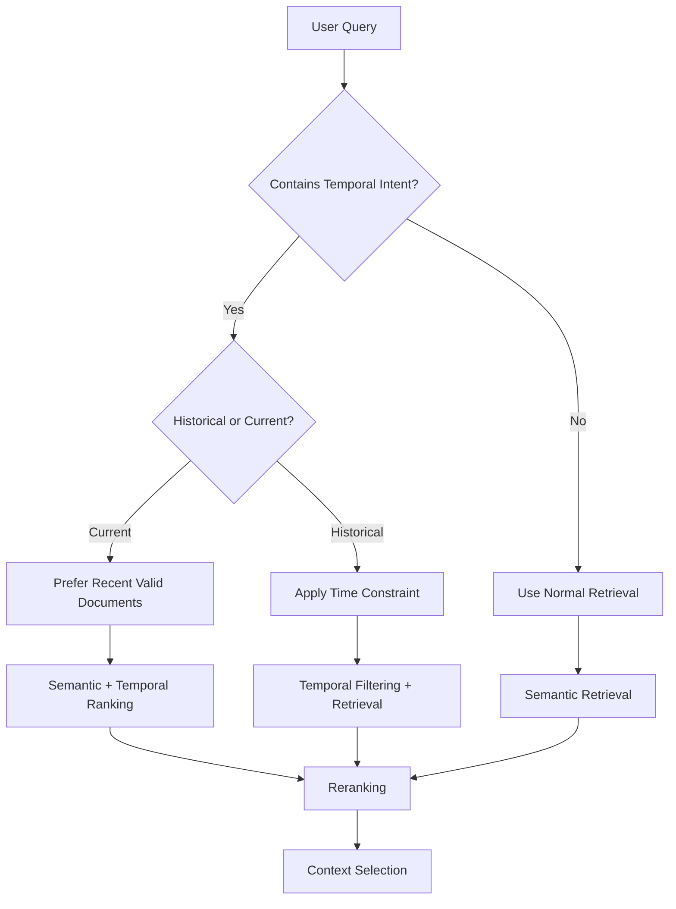

This avoids blindly applying recency to every query.

---

# 53. When to Use Time-Weighted Retrieval

It is particularly useful when:

- Information changes frequently
- Newer documents are generally more useful
- Knowledge bases contain multiple document versions
- Users frequently ask for current information
- Support knowledge evolves over time
- Engineering documentation changes frequently
- Operational information becomes stale
- Conversation or interaction history should favor recent information

Examples:

```text
Support Knowledge
Incident Management
Product Releases
Engineering Discussions
News
Operational Runbooks
Current Policies
```

---

# 54. When It May Not Be Appropriate

Time weighting may be less useful when:

```text
Knowledge is stable
```

or:

```text
Historical information is equally valuable
```

or:

```text
The query explicitly targets an older time period
```

or:

```text
Document validity is determined by status/version
rather than modification time
```

For example:

```text
Historical Research
Legal Archives
Academic Literature
Historical Policies
```

may require temporal filtering or explicit time targeting rather than generic recency decay.

---

# 55. Recommended Enterprise Pattern

A robust enterprise pattern is:

```text
Query
 ↓
Query Intent Detection
 ↓
Temporal Intent Detection
 ↓
Validity Filtering
 ↓
Semantic / Hybrid Retrieval
 ↓
Recency-Aware Ranking
 ↓
Reranking
 ↓
Contextual Compression
 ↓
Citation + Version Attribution
 ↓
LLM
```

Architecture:

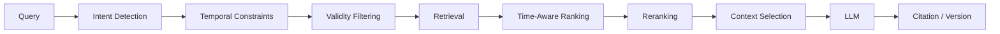

This is safer than simply applying a decay function to every retrieval request.

---

# 56. Production Checklist

Before deploying time-weighted retrieval:

```text
☐ Temporal requirements are clearly defined
☐ Correct timestamp field is selected
☐ Effective dates are considered where applicable
☐ Document validity is represented
☐ Published vs draft status is represented
☐ Version information is preserved
☐ Decay configuration is externalized
☐ Decay parameters are evaluated
☐ Historical queries are handled separately
☐ Explicit temporal filters are supported
☐ Source metadata is preserved
☐ Temporal signals are observable
☐ Retrieval baseline is available
☐ Temporal correctness is evaluated
☐ Latency impact is measured
☐ Cost impact is measured
☐ Regression tests cover current and historical queries
☐ Citation and version attribution are preserved
```

---

# 57. Key Takeaways

- Time-Weighted Retrieval combines relevance with temporal information.
- It is useful when newer information should receive greater preference.
- Recency should generally be treated as a ranking signal rather than an absolute replacement for relevance.
- Exponential decay is one common conceptual model for reducing the influence of older documents.
- Decay parameters should be selected according to the domain.
- Created, updated, published, and effective timestamps have different meanings.
- Recency is not the same as validity.
- A recently updated draft should not automatically outrank a current published policy.
- Temporal filtering and temporal weighting solve different problems.
- Explicit historical queries should not be blindly biased toward recent documents.
- Query intent can determine how strongly recency should influence retrieval.
- Time-aware retrieval can be combined with vector, BM25, ensemble, multi-vector, reranking, and contextual compression techniques.
- Temporal metadata should remain available for citations and auditing.
- Production systems should evaluate both retrieval quality and temporal correctness.
- The objective is not simply to retrieve the newest information.
- The objective is to retrieve the **most relevant information for the requested time context**.

The central pattern is:

```text
Understand Time Intent
        ↓
Apply Validity Constraints
        ↓
Retrieve Relevant Candidates
        ↓
Apply Temporal Preference
        ↓
Rank
        ↓
Generate from Correct Evidence
```

Or simply:

```text
Relevant
    +
Temporally Correct
    ↓
Better Enterprise Retrieval
```

---

# 🧭 Chapter Navigation

### Part V — Advanced Retrieval-Augmented Generation

**Previous:**  
[03. Multi-Vector Retriever](03-multivector-retriever.md)

**Next:**  
[05. Hybrid Search Retriever](05-hybrid-search-retriever.md)

**Section:**  
02 — Enterprise Retrieval Engineering

### Enterprise Retrieval Engineering Path

```text
01 Contextual Compression Retriever
              ↓
02 Ensemble Retriever
              ↓
03 Multi-Vector Retriever
              ↓
04 Time-Weighted Retriever
              ↓
05 Hybrid Search Retriever
              ↓
06 HyDE Retriever
              ↓
07 Router Retriever
              ↓
08 Multi-Stage Retrieval
              ↓
09 Agentic Retrieval
              ↓
10 Re-ranking Techniques
              ↓
11 MMR & Diversity-Aware Retrieval
              ↓
12 Metadata-Aware Retrieval
              ↓
13 Advanced Query Rewriting
```

---

> **Enterprise AI Engineering Handbook**  
> *Building Production-Grade Enterprise AI Systems — One Chapter at a Time.*