# Hybrid Search Retriever

## 📖 Overview

A **Hybrid Search Retriever** combines multiple retrieval signals—most commonly **dense vector search** and **sparse lexical search**—to improve both semantic understanding and exact-term matching.

Traditional vector retrieval is excellent at understanding meaning:

```text
"How can I regain access to my account?"
        ↓
"Password recovery procedure"
```

Lexical retrieval such as BM25 is strong at exact terminology:

```text
"AUTH-401"
        ↓
"AUTH-401 authentication failure"
```

Hybrid search combines both:

```text
                    User Query
                        │
              ┌─────────┴─────────┐
              ↓                   ↓
        Dense Retrieval      Sparse Retrieval
        Vector Search             BM25
              │                   │
              ↓                   ↓
       Semantic Results      Keyword Results
              │                   │
              └─────────┬─────────┘
                        ↓
                  Result Fusion
                        ↓
                  Final Ranking
                        ↓
                     Top-K
```

The core idea is:

> **Use semantic retrieval for meaning and lexical retrieval for exact terminology, then combine their signals into a stronger candidate ranking.**

---

## 🎯 Learning Objectives

After completing this chapter, you will be able to:

- Understand hybrid search
- Understand dense and sparse retrieval
- Understand why semantic search alone can miss important results
- Understand why lexical search alone can miss semantic relationships
- Compare BM25 and vector retrieval
- Understand score normalization
- Understand weighted score fusion
- Understand Reciprocal Rank Fusion
- Build a dense + sparse retrieval pipeline
- Implement hybrid retrieval using Python
- Understand metadata and filtering in hybrid search
- Combine hybrid search with reranking
- Combine hybrid search with Multi-Vector Retrieval
- Combine hybrid search with contextual compression
- Evaluate hybrid retrieval against single-retriever baselines
- Design production-grade hybrid retrieval architectures

---

# 1. What Is Hybrid Search?

Hybrid search combines different retrieval methods.

The most common architecture is:

```text
Dense Retrieval
+
Sparse Retrieval
```

### Dense Retrieval

Uses embeddings:

```text
Query
 ↓
Embedding
 ↓
Vector Search
 ↓
Semantic Similarity
```

### Sparse Retrieval

Uses lexical matching:

```text
Query
 ↓
Term Analysis
 ↓
BM25 / Sparse Index
 ↓
Keyword Relevance
```

Hybrid search combines the results.

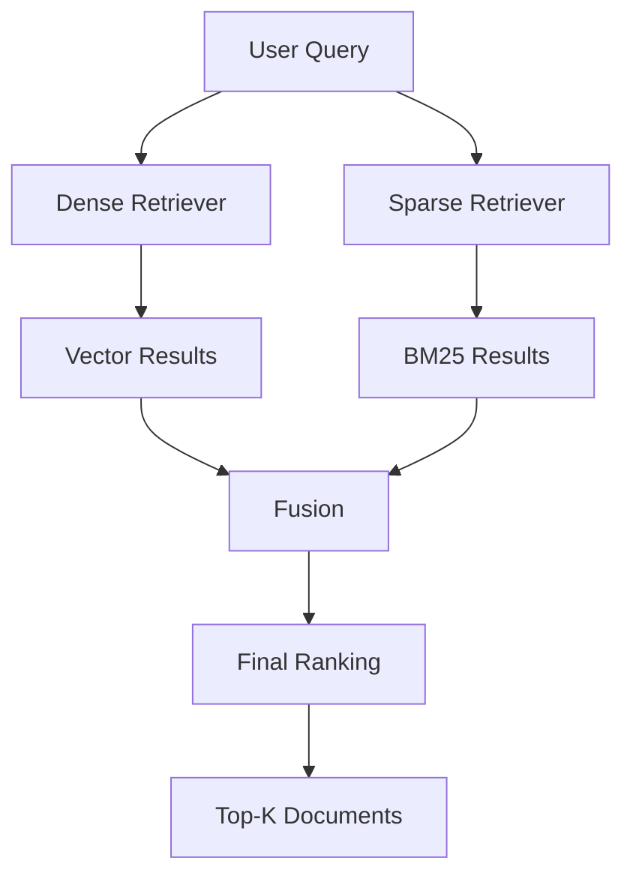

---

# 2. Why Dense Retrieval Alone Is Not Enough

Dense retrieval works by representing text as vectors.

For example:

```text
Query:
"How do I reset my password?"
```

may retrieve:

```text
"Steps for recovering account credentials"
```

even though the exact word "password" may not appear.

This is powerful.

However, consider:

```text
Query:
"Error AUTH-401"
```

The exact identifier:

```text
AUTH-401
```

may be extremely important.

A semantic embedding may not rank the exact document as highly as expected.

This is where lexical retrieval helps.

---

# 3. Why Sparse Retrieval Alone Is Not Enough

BM25 and other lexical retrieval methods are strong at exact terms.

For example:

```text
Query:
"OAuth 2.0 authorization code flow"
```

BM25 can match:

```text
OAuth
2.0
authorization
code
flow
```

But consider:

```text
Query:
"How can an application obtain permission
to access a user's resources?"
```

A document discussing:

```text
"OAuth authorization"
```

may be highly relevant even if the exact words do not overlap.

Dense retrieval can identify that semantic relationship.

Therefore:

```text
Sparse Retrieval
→ Exact Terms

Dense Retrieval
→ Semantic Meaning
```

---

# 4. Dense vs Sparse Retrieval

| Capability | Dense Retrieval | Sparse Retrieval |
|---|---|---|
| Semantic similarity | Strong | Limited |
| Exact keywords | Moderate | Strong |
| Product IDs | Can struggle | Strong |
| Error codes | Can struggle | Strong |
| Synonyms | Strong | Limited |
| Natural language queries | Strong | Moderate |
| Domain terminology | Strong | Strong |
| Infrastructure complexity | Vector index | Inverted index |
| Typical technology | Embeddings | BM25 / Sparse vectors |

Hybrid search attempts to combine the complementary strengths.

---

# 5. Dense Retrieval

A dense retriever converts text into a dense numerical vector.

Conceptually:

```text
Text
 ↓
Embedding Model
 ↓
[0.12, -0.43, 0.81, ...]
 ↓
Vector Database
```

At query time:

```text
User Query
 ↓
Query Embedding
 ↓
Similarity Search
 ↓
Top-K Documents
```

Common similarity functions include:

```text
Cosine Similarity
Dot Product
Euclidean Distance
```

---

# 6. Sparse Retrieval

Sparse retrieval represents documents using term-based signals.

A simplified representation might look like:

```text
Document:

OAuth authentication access token
```

Sparse representation:

```text
OAuth       → weight
authentication → weight
access      → weight
token       → weight
```

A query is matched using lexical statistics.

BM25 is one of the most common approaches.

---

# 7. BM25

BM25 considers factors such as:

```text
Term Frequency
Inverse Document Frequency
Document Length
```

Conceptually:

```text
Query
 ↓
Terms
 ↓
BM25 Scoring
 ↓
Ranked Documents
```

This makes BM25 especially useful for:

```text
Exact Terms
Identifiers
Error Codes
Product Names
Technical Keywords
Acronyms
```

---

# 8. Hybrid Search Architecture

A production-oriented hybrid retriever can look like:

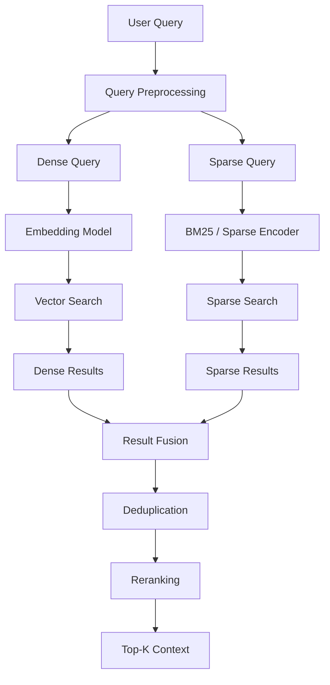

The two retrieval paths can run independently and then converge.

---

# 9. Basic Hybrid Pipeline

The simplest architecture is:

```text
Query
 ↓
 ┌───────────────┐
 │               │
 ↓               ↓
Dense           Sparse
Search          Search
 │               │
 ↓               ↓
Results         Results
 └───────┬───────┘
         ↓
       Fusion
         ↓
       Top-K
```

This is the fundamental hybrid search pattern.

---

# 10. Result Fusion

The retrieval systems produce different results.

Example:

### Dense

```text
1. Document A
2. Document B
3. Document C
4. Document D
```

### BM25

```text
1. Document C
2. Document A
3. Document E
4. Document F
```

Hybrid fusion combines these rankings:

```text
A
B
C
D
E
F
```

and calculates a combined ranking.

The fusion strategy is one of the most important parts of hybrid retrieval.

---

# 11. Fusion Strategy 1 — Weighted Scores

One approach is to combine normalized scores.

Conceptually:

```text
Hybrid Score
=
α × Dense Score
+
(1 - α) × Sparse Score
```

For example:

```text
α = 0.7
```

means:

```text
70% Dense
30% Sparse
```

Architecture:

```text
Dense Score
     │
   × 0.7
     │
     ├──────────┐
                ↓
             Combined
                ↑
     ├──────────┘
     │
Sparse Score
     │
   × 0.3
```

---

# 12. Why Score Normalization Matters

Dense and sparse scores often have different ranges.

For example:

```text
Dense:

Document A → 0.91
Document B → 0.87
Document C → 0.82
```

BM25:

```text
Document A → 12.4
Document B → 8.7
Document C → 6.1
```

Directly combining these values is problematic.

```text
0.91 + 12.4
```

does not provide a meaningful comparable signal.

Therefore, weighted score fusion usually requires normalization.

---

# 13. Score Normalization

Possible normalization techniques include:

```text
Min-Max Scaling
Z-Score Normalization
Softmax
Rank-Based Normalization
Domain-Specific Calibration
```

For example, Min-Max normalization:

```text
normalized_score =
(score - min)
/
(max - min)
```

After normalization:

```text
Dense:
0.91 → 0.95

Sparse:
12.4 → 1.00
```

The scores can then be combined more meaningfully.

---

# 14. Weighted Hybrid Scoring

Conceptually:

```text
Dense Normalized Score = 0.85
Sparse Normalized Score = 0.70

Dense Weight = 0.7
Sparse Weight = 0.3
```

Then:

```text
Hybrid Score
=
(0.7 × 0.85)
+
(0.3 × 0.70)
```

The important architecture is:

```text
Dense Score
      ↓
Normalization
      ↓
Weight
      │
      ├─────────→ Fusion
      │
Sparse Score
      ↓
Normalization
      ↓
Weight
```

---

# 15. Fusion Strategy 2 — Reciprocal Rank Fusion

Another common strategy is **Reciprocal Rank Fusion (RRF)**.

Instead of comparing raw scores, it combines rankings.

Conceptually:

```text
RRF(d)
=
Σ 1 / (k + rank(d))
```

This is useful because:

```text
Dense Score
```

and:

```text
BM25 Score
```

do not need to be directly comparable.

The retrievers contribute based on rank.

---

# 16. RRF Example

Dense results:

```text
1. A
2. B
3. C
4. D
```

Sparse results:

```text
1. C
2. A
3. E
4. B
```

Document A appears:

```text
Dense → Rank 1
Sparse → Rank 2
```

Document C:

```text
Dense → Rank 3
Sparse → Rank 1
```

Both receive strong combined ranking signals.

Architecture:

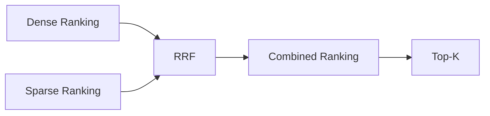

---

# 17. Weighted Fusion vs RRF

### Weighted Score Fusion

```text
Requires score normalization
```

Advantages:

- Allows explicit weighting
- Can represent confidence differences
- Can be tuned to domain behavior

Challenges:

- Score distributions differ
- Normalization can be difficult
- Scores may drift across systems

### RRF

```text
Uses ranking positions
```

Advantages:

- Does not require comparable raw scores
- Simple
- Robust across heterogeneous retrievers

Challenges:

- Loses some score information
- Requires careful rank-window selection
- May need additional weighting for specialized retrievers

---

# 18. Hybrid Search with BM25

A simple Python example:

```python
from langchain_community.retrievers import BM25Retriever

bm25_retriever = BM25Retriever.from_documents(
    documents
)

bm25_retriever.k = 10

results = bm25_retriever.invoke(
    "OAuth authentication"
)
```

This provides the sparse retrieval path.

The dense path may use:

```python
vector_retriever = vector_store.as_retriever(
    search_kwargs={"k": 10}
)
```

The two result sets can then be fused.

---

# 19. LangChain Ensemble-Based Hybrid Retrieval

A simple implementation can use the ensemble abstraction:

```python
from langchain.retrievers import EnsembleRetriever

hybrid_retriever = EnsembleRetriever(
    retrievers=[
        vector_retriever,
        bm25_retriever
    ],
    weights=[
        0.7,
        0.3
    ]
)

results = hybrid_retriever.invoke(
    "How does OAuth authentication work?"
)
```

Conceptually:

```text
Vector Retriever
      │
    0.7
      │
      ├───────┐
              ↓
          Ensemble
              ↑
      ├───────┘
      │
    0.3
      │
BM25 Retriever
```

The exact fusion behavior depends on the framework implementation and configuration.

---

# 20. Dense + Sparse Search with a Vector Database

Some vector databases support hybrid search directly.

Conceptually:

```text
                Query
                  │
          ┌───────┴───────┐
          ↓               ↓
      Dense Vector     Sparse Vector
          │               │
          └───────┬───────┘
                  ↓
             Hybrid Index
                  ↓
             Fused Ranking
                  ↓
                 Top-K
```

This can reduce application-side fusion complexity.

The exact API and supported sparse representation depend on the vector database.

---

# 21. Hybrid Search with Sparse Vectors

Sparse retrieval does not always have to mean BM25.

Modern retrieval systems may use sparse embedding models.

For example:

```text
Dense Encoder
      +
Sparse Encoder
```

Architecture:

```text
Document
 ├── Dense Representation
 └── Sparse Representation
```

At query time:

```text
Query
 ├── Dense Vector
 └── Sparse Vector
```

The two signals can then be combined.

---

# 22. Dense + Sparse Representation

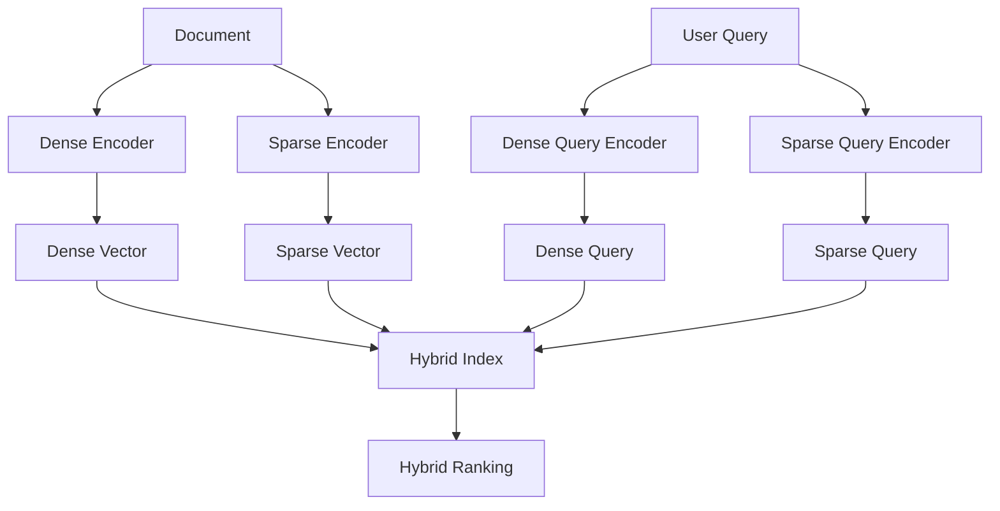

This architecture is increasingly common in modern search infrastructure.

---

# 23. Query Processing

The query should usually be sent through both retrieval paths.

Example:

```text
User Query:

"How do I troubleshoot AUTH-401
when using OAuth?"
```

Dense path:

```text
Query
 ↓
Embedding
 ↓
Semantic Search
```

Sparse path:

```text
Query
 ↓
Tokenization
 ↓
BM25 / Sparse Search
```

The exact identifier:

```text
AUTH-401
```

can strongly influence the sparse path.

The semantic concept:

```text
troubleshoot OAuth authentication
```

can influence the dense path.

---

# 24. Query Expansion

Hybrid retrieval can also benefit from query rewriting.

For example:

```text
Original Query:

"AUTH-401 OAuth issue"
```

Possible expanded query:

```text
AUTH-401
OAuth authentication
access token
authorization failure
```

The expanded query can improve lexical retrieval while the original query remains useful for semantic retrieval.

A possible architecture:

```text
User Query
 ↓
Query Processing
 ↓
 ┌──────────────┬──────────────┐
 ↓              ↓
Original       Expanded
Query          Query
 ↓              ↓
Dense          Sparse
Search         Search
```

---

# 25. Hybrid Search and Advanced Query Rewriting

Hybrid retrieval can be combined with query rewriting.

```text
Query
 ↓
Query Rewriting
 ↓
 ┌─────────────┬─────────────┐
 ↓             ↓
Dense Query   Sparse Query
 ↓             ↓
Retrieval     Retrieval
 └──────┬──────┘
        ↓
      Fusion
```

This becomes especially useful for:

```text
Ambiguous Queries
Short Queries
Technical Queries
Acronym-Heavy Queries
Multi-Intent Queries
```

---

# 26. Hybrid Search with Metadata Filtering

Metadata filters can be applied before or during retrieval.

Example query:

```text
"OAuth authentication"
```

Filter:

```text
department = engineering
language = English
status = published
```

Architecture:

```text
Query
 +
Metadata Filters
       ↓
Hybrid Retrieval
       ↓
Fusion
       ↓
Top-K
```

The distinction is important:

```text
Metadata Filter
→ Which documents are eligible?

Hybrid Search
→ Which eligible documents are most relevant?
```

---

# 27. Hybrid Search with Time Weighting

The temporal signal discussed in the previous chapter can also be incorporated.

```text
Dense Retrieval
Sparse Retrieval
Temporal Signal
       ↓
Fusion
       ↓
Final Ranking
```

Architecture:

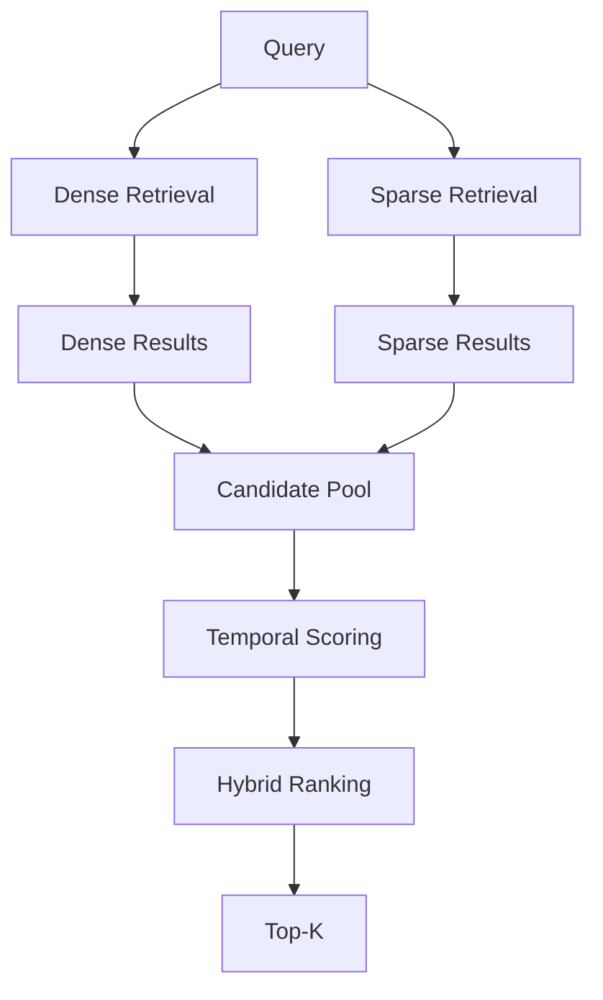

This can be useful for frequently changing enterprise knowledge.

---

# 28. Hybrid Search + Multi-Vector Retrieval

Hybrid retrieval can also be combined with Multi-Vector Retrieval.

```text
Dense Multi-Vector Retrieval
+
Sparse Retrieval
```

Architecture:

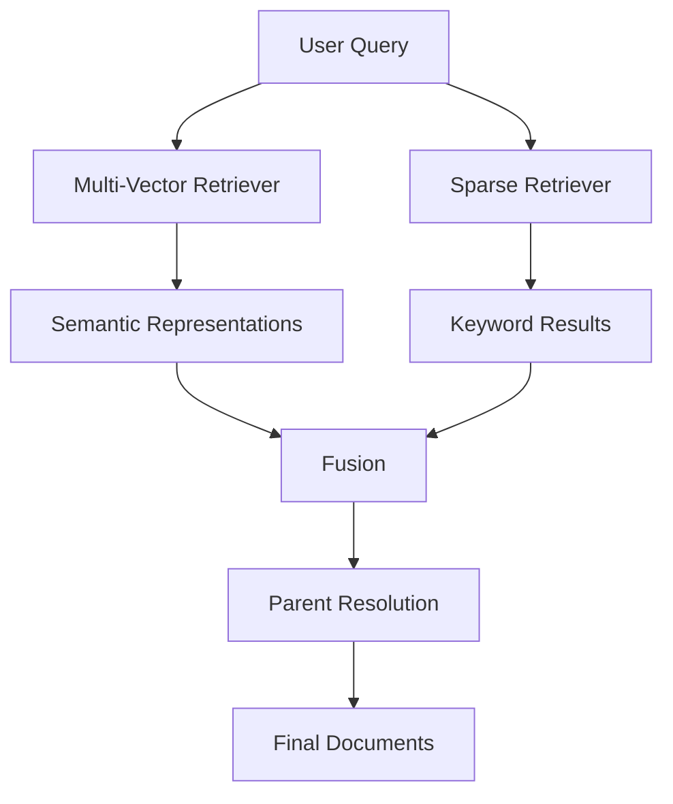

This provides:

```text
Multiple Semantic Representations
+
Exact-Term Matching
```

---

# 29. Hybrid Search + Reranking

Hybrid retrieval usually focuses on candidate generation.

A reranker can then improve precision.

```text
Query
 ↓
Dense Search
+
Sparse Search
 ↓
Fusion
 ↓
Candidate Pool
 ↓
Reranker
 ↓
Top-K
```

Architecture:

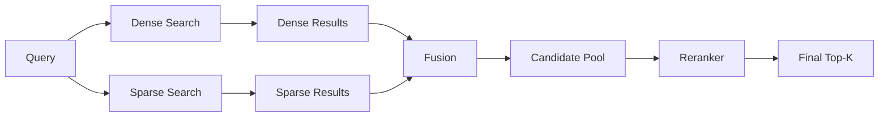

This creates a clear separation:

```text
Hybrid Retrieval
→ High Recall

Reranking
→ High Precision
```

---

# 30. Hybrid Search + Contextual Compression

A complete RAG retrieval pipeline can be:

```text
Query
 ↓
Dense + Sparse Retrieval
 ↓
Fusion
 ↓
Candidate Pool
 ↓
Reranking
 ↓
Contextual Compression
 ↓
Prompt Assembly
 ↓
LLM
```

Architecture:

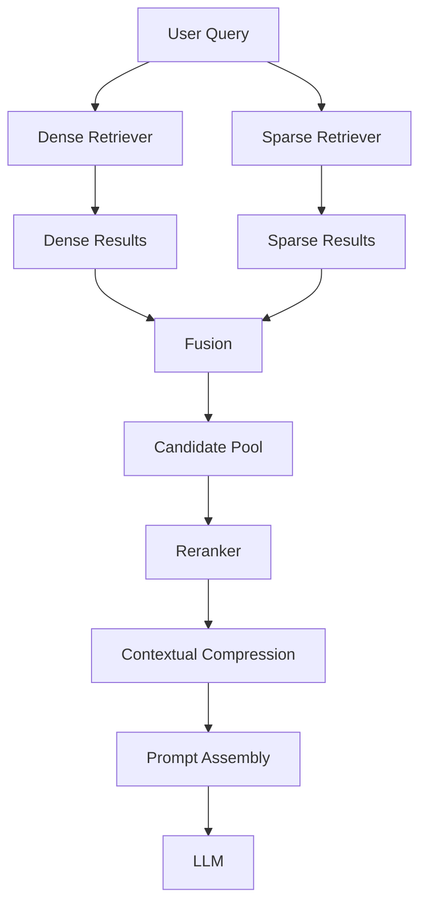

---

# 31. Hybrid Search and Citation

The hybrid retrieval layer should preserve source metadata.

Example:

```json
{
  "document_id": "doc-100",
  "source": "oauth-guide.pdf",
  "page": 18,
  "retrieval_sources": [
    "dense",
    "sparse"
  ]
}
```

This allows the application to explain:

```text
Which source was retrieved
Which page was used
Which document was selected
```

The user-facing answer should cite the original source rather than the retrieval mechanism.

---

# 32. Retrieval Provenance

A production system can preserve:

```text
Document ID
Chunk ID
Source
Page
Dense Rank
Sparse Rank
Dense Score
Sparse Score
Fusion Score
Reranker Score
```

Example:

```json
{
  "document_id": "doc-100",
  "dense_rank": 2,
  "sparse_rank": 1,
  "dense_score": 0.89,
  "sparse_score": 14.2,
  "fusion_score": 0.94
}
```

This is valuable for retrieval observability.

---

# 33. Deduplication

Dense and sparse retrieval may return the same document.

Example:

```text
Dense:

A
B
C

Sparse:

C
A
D
```

Without deduplication:

```text
A
B
C
C
A
D
```

The fusion layer should consolidate them:

```text
A
B
C
D
```

using a stable identifier such as:

```text
document_id
chunk_id
source + page
content hash
```

---

# 34. Parallel Retrieval

Dense and sparse retrieval can often execute concurrently.

Sequential:

```text
Dense
 ↓
Sparse
 ↓
Fusion
```

Parallel:

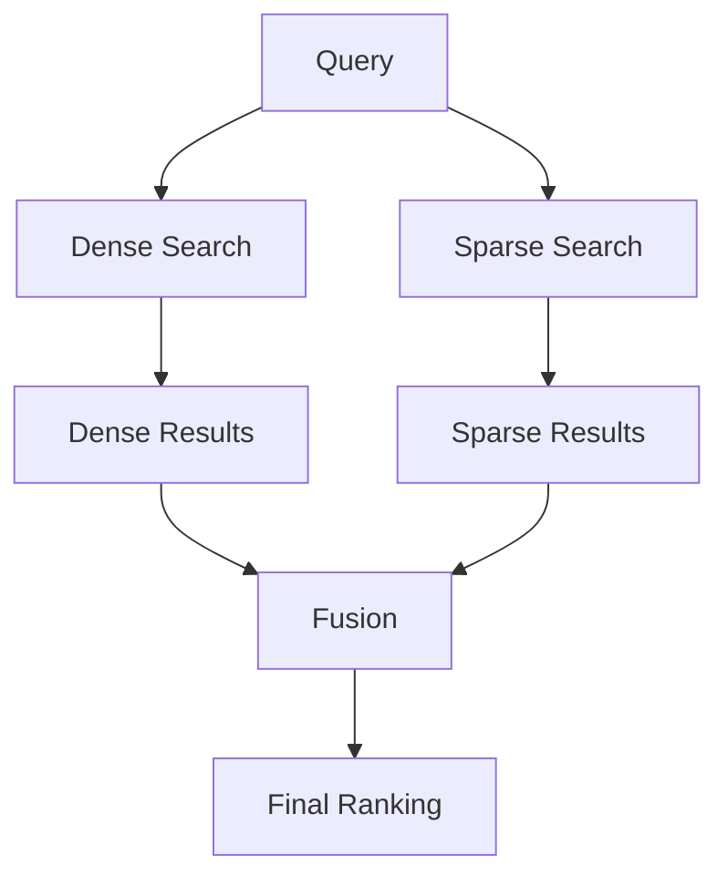

This can reduce end-to-end retrieval latency.

---

# 35. Python Parallel Example

A simplified example:

```python
from concurrent.futures import ThreadPoolExecutor


def hybrid_retrieve(query):

    with ThreadPoolExecutor(
        max_workers=2
    ) as executor:

        dense_future = executor.submit(
            vector_retriever.invoke,
            query
        )

        sparse_future = executor.submit(
            bm25_retriever.invoke,
            query
        )

        dense_results = dense_future.result()
        sparse_results = sparse_future.result()

    return dense_results, sparse_results
```

Production implementations should use the concurrency model appropriate to the application runtime and retrieval infrastructure.

---

# 36. Hybrid Retrieval Interface

A framework-independent abstraction can expose a simple interface:

```python
from abc import ABC, abstractmethod


class HybridRetriever(ABC):

    @abstractmethod
    def retrieve(
        self,
        query: str,
        top_k: int
    ) -> list:
        pass
```

An implementation can contain:

```text
Dense Retriever
Sparse Retriever
Fusion Strategy
Deduplication
Optional Reranker
```

Architecture:

```text
Application
     ↓
HybridRetriever Interface
     ↓
 ┌──────────────┬──────────────┐
 ↓              ↓
Dense          Sparse
Adapter        Adapter
 └──────┬───────┘
        ↓
      Fusion
```

---

# 37. Configuration-Driven Hybrid Retrieval

Example configuration:

```yaml
retrieval:
  hybrid:
    enabled: true

    dense:
      top_k: 20
      weight: 0.7

    sparse:
      top_k: 20
      weight: 0.3

    fusion:
      strategy: rrf

    deduplication:
      enabled: true

    reranking:
      enabled: true
      top_k: 5
```

This allows the retrieval architecture to evolve without changing application code.

---

# 38. Weight Tuning

Do not assume:

```text
Dense = 0.7
Sparse = 0.3
```

is always optimal.

Possible experiments:

```text
0.9 / 0.1
0.8 / 0.2
0.7 / 0.3
0.6 / 0.4
0.5 / 0.5
0.4 / 0.6
0.3 / 0.7
```

Evaluate each configuration.

The correct configuration depends on the query distribution and corpus.

---

# 39. Query-Type-Based Weighting

Different queries may benefit from different weighting.

### Semantic Query

```text
"How does distributed tracing work?"
```

Possible preference:

```text
Dense-heavy
```

### Identifier Query

```text
"AUTH-401"
```

Possible preference:

```text
Sparse-heavy
```

### Mixed Technical Query

```text
"How do I troubleshoot AUTH-401
in OAuth authentication?"
```

Possible preference:

```text
Balanced
```

This suggests an advanced architecture:

```text
Query
 ↓
Query Classification
 ↓
Dynamic Retrieval Weights
 ↓
Hybrid Search
```

---

# 40. Dynamic Hybrid Retrieval

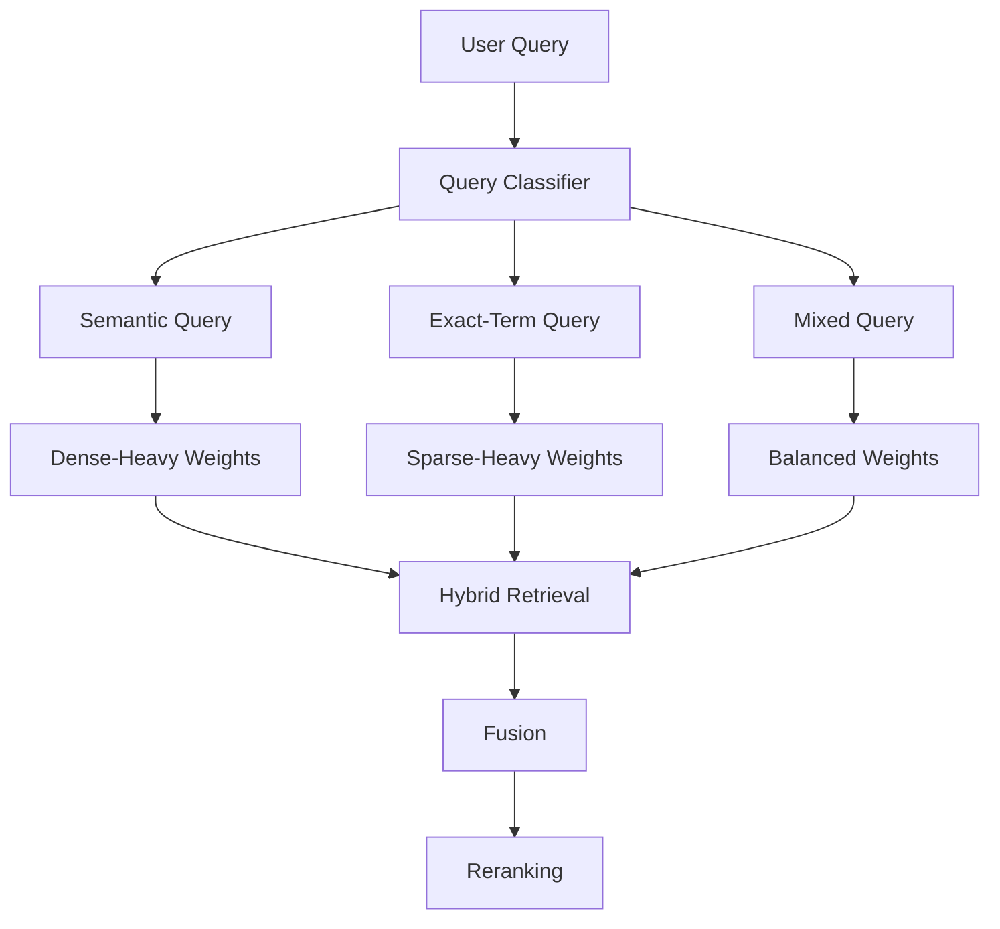

This can improve retrieval across heterogeneous query types.

However, dynamic weighting introduces additional system complexity and should be adopted only when evaluation demonstrates a benefit.

---

# 41. Hybrid Search Evaluation

The correct baseline should include:

```text
Dense Only
Sparse Only
Hybrid
```

Compare:

```text
Recall@K
Precision@K
MRR
NDCG
Latency
Cost
```

Architecture:

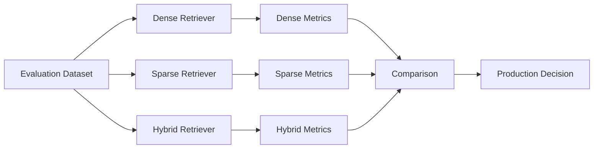

---

# 42. Example Evaluation

Illustrative numbers:

| Retriever | Recall@10 | MRR | Latency |
|---|---:|---:|---:|
| Dense | 0.78 | 0.69 | 40 ms |
| Sparse | 0.72 | 0.63 | 20 ms |
| Hybrid | 0.87 | 0.78 | 58 ms |

The important lesson is not the specific numbers.

The important question is:

```text
Does the additional latency and complexity
produce enough retrieval improvement?
```

---

# 43. Query-Level Evaluation

Aggregate metrics can hide important behavior.

Evaluate query categories separately:

```text
Semantic Queries
Exact Identifiers
Technical Queries
Short Queries
Long Queries
Acronym-Heavy Queries
Metadata-Heavy Queries
```

Example:

| Query Type | Dense | Sparse | Hybrid |
|---|---:|---:|---:|
| Semantic | High | Medium | High |
| Exact IDs | Medium | High | High |
| Technical | High | High | Very High |
| Short | Medium | High | High |

This helps identify where hybrid retrieval actually provides value.

---

# 44. End-to-End RAG Evaluation

Retrieval metrics alone are insufficient.

The complete pipeline should be evaluated:

```text
Query
 ↓
Hybrid Retrieval
 ↓
Context
 ↓
LLM
 ↓
Answer
```

Useful metrics include:

```text
Answer Correctness
Faithfulness
Context Relevance
Citation Accuracy
Latency
Cost
```

The ultimate goal is better AI application behavior, not simply higher retrieval scores.

---

# 45. Observability

A production hybrid retriever should expose both retrieval paths.

Example:

```text
Query:
"OAuth AUTH-401 troubleshooting"

Dense:
Top-K = 10
Latency = 38 ms

Sparse:
Top-K = 10
Latency = 17 ms

Fusion:
Candidates = 20
Duplicates = 7

Reranker:
Input = 13
Output = 5

Final:
Top-K = 5
```

This makes debugging significantly easier.

---

# 46. Retrieval Trace

A structured trace can contain:

```json
{
  "query": "OAuth AUTH-401 troubleshooting",
  "dense": {
    "top_k": 10,
    "latency_ms": 38
  },
  "sparse": {
    "top_k": 10,
    "latency_ms": 17
  },
  "fusion": {
    "strategy": "rrf",
    "candidate_count": 20,
    "duplicate_count": 7
  },
  "reranker": {
    "enabled": true,
    "top_k": 5
  }
}
```

This is useful for:

```text
RAG Observability
Debugging
Performance Optimization
Evaluation
Cost Analysis
```

---

# 47. Common Failure Modes

## 47.1 Poor Score Normalization

Incorrect normalization can allow one retriever to dominate.

```text
Dense Signal
      ↓
Too Weak

Sparse Signal
      ↓
Dominates
```

---

## 47.2 Incorrect Weights

Weights should be evaluated against real queries.

---

## 47.3 Duplicate Results

Dense and sparse retrieval frequently return overlapping documents.

Deduplication is necessary.

---

## 47.4 Too Many Candidates

Retrieving too many candidates can increase:

```text
Latency
Memory
Reranker Cost
Context Processing
```

---

## 47.5 Poor Sparse Index

BM25 quality depends heavily on:

```text
Tokenization
Language
Text normalization
Stop-word handling
Domain terminology
```

---

## 47.6 Poor Dense Embeddings

A weak embedding model can reduce the value of the dense retrieval path.

---

## 47.7 No Measurable Improvement

The most important failure mode is:

```text
Complexity ↑
Latency ↑
Cost ↑

Quality
   ↓
No meaningful improvement
```

Always compare against a strong baseline.

---

# 48. Language and Tokenization Considerations

Sparse retrieval depends heavily on tokenization.

For example:

```text
"OAuth2Client"
```

may be treated differently from:

```text
"OAuth 2 Client"
```

Similarly:

```text
AUTH-401
AUTH401
AUTH_401
```

may require normalization.

Domain-specific tokenization can therefore significantly affect lexical retrieval quality.

---

# 49. Domain-Specific Vocabulary

Enterprise systems often contain:

```text
Product IDs
Service Names
Error Codes
Acronyms
Internal Terminology
Database Tables
API Names
Ticket IDs
```

Sparse retrieval can be particularly valuable for these terms.

Example:

```text
Query:
"PaymentService PYMNT-409"
```

A hybrid retriever can use:

```text
Dense
→ Payment failure semantics

Sparse
→ Exact PYMNT-409
```

---

# 50. Hybrid Search for Technical Documentation

Technical documentation is an excellent use case.

Query:

```text
"How do I resolve Kubernetes
CrashLoopBackOff after deployment?"
```

Dense retrieval can understand:

```text
container restart
deployment failure
pod lifecycle
```

Sparse retrieval can match:

```text
CrashLoopBackOff
Kubernetes
```

The combination is stronger than either signal alone.

---

# 51. Hybrid Search for Enterprise Policies

Consider:

```text
"Germany employee travel policy
updated in 2026"
```

The query contains:

```text
Semantic Intent
Germany
employee travel
```

and potentially:

```text
Temporal Constraint
2026
```

A production system may combine:

```text
Metadata Filtering
+
Dense Retrieval
+
Sparse Retrieval
+
Temporal Ranking
```

This demonstrates that hybrid retrieval is one component within a larger retrieval architecture.

---

# 52. Hybrid Search with Advanced Retrieval

Hybrid retrieval can participate in a larger pipeline:

```text
Query
 ↓
Query Rewriting
 ↓
Metadata Filtering
 ↓
Dense + Sparse Retrieval
 ↓
Fusion
 ↓
Multi-Vector / Parent Resolution
 ↓
Reranking
 ↓
MMR
 ↓
Contextual Compression
 ↓
Prompt Assembly
 ↓
LLM
```

The important design principle is modularity.

Each stage should have a clear responsibility.

---

# 53. Production Architecture

A mature enterprise architecture can look like:

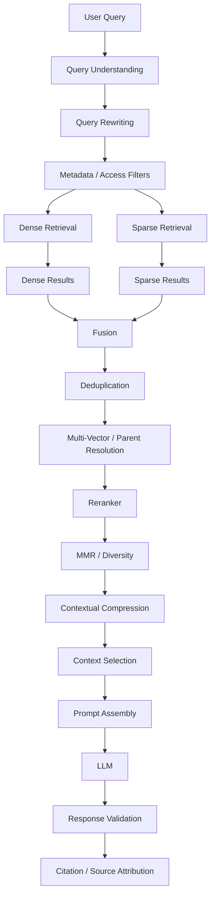

This represents hybrid search as a **candidate-generation layer**, rather than treating it as the entire RAG architecture.

---

# 54. Enterprise Design Principle

A useful architecture separation is:

```text
Dense Retriever
      ↓
Semantic Signal

Sparse Retriever
      ↓
Lexical Signal

Fusion
      ↓
Combined Candidate Set

Reranker
      ↓
Precision

Context Selection
      ↓
Generation Context
```

Each layer solves a different problem.

This makes the system easier to:

```text
Test
Observe
Tune
Scale
Replace
```

---

# 55. Framework-Agnostic Design

An enterprise AI platform should avoid exposing framework-specific retrieval details to business services.

Instead:

```text
Business Service
       ↓
EnterpriseRetriever
       ↓
Hybrid Retrieval Adapter
       ├── Dense Adapter
       └── Sparse Adapter
```

For example:

```python
class RetrievalProvider:

    def retrieve(
        self,
        query: str,
        top_k: int
    ):
        raise NotImplementedError
```

Then:

```python
class DenseRetrievalProvider(RetrievalProvider):
    ...


class SparseRetrievalProvider(RetrievalProvider):
    ...


class HybridRetrievalProvider(RetrievalProvider):
    ...
```

This aligns hybrid retrieval with a Ports & Adapters architecture.

---

# 56. Configuration Example

```yaml
retrieval:
  strategy: hybrid

  dense:
    provider: vector_store
    top_k: 20

  sparse:
    provider: bm25
    top_k: 20

  fusion:
    strategy: rrf

  deduplication:
    key: chunk_id

  reranking:
    enabled: true
    top_k: 8

  context:
    compression: true
```

The application can therefore change:

```text
BM25
→ Sparse Vector Search

RRF
→ Weighted Fusion
```

without changing business-level RAG logic.

---

# 57. Testing Strategy

A hybrid retrieval implementation should have several layers of tests.

### Unit Tests

Test:

```text
Score normalization
Fusion
Deduplication
Weighting
Ranking
```

### Integration Tests

Test:

```text
Dense backend
Sparse backend
Vector database
Search index
```

### Evaluation Tests

Test:

```text
Recall
MRR
NDCG
```

### End-to-End Tests

Test:

```text
Query
 ↓
Retrieval
 ↓
Context
 ↓
LLM
 ↓
Answer
```

---

# 58. Example Fusion Unit Test

```python
def test_hybrid_fusion_prefers_shared_results():

    dense_results = [
        "doc-a",
        "doc-b",
        "doc-c"
    ]

    sparse_results = [
        "doc-c",
        "doc-a",
        "doc-d"
    ]

    results = fuse_results(
        dense_results,
        sparse_results
    )

    assert "doc-a" in results
    assert "doc-c" in results
```

A production evaluation should use relevance-labeled datasets in addition to simple unit tests.

---

# 59. Decision Framework

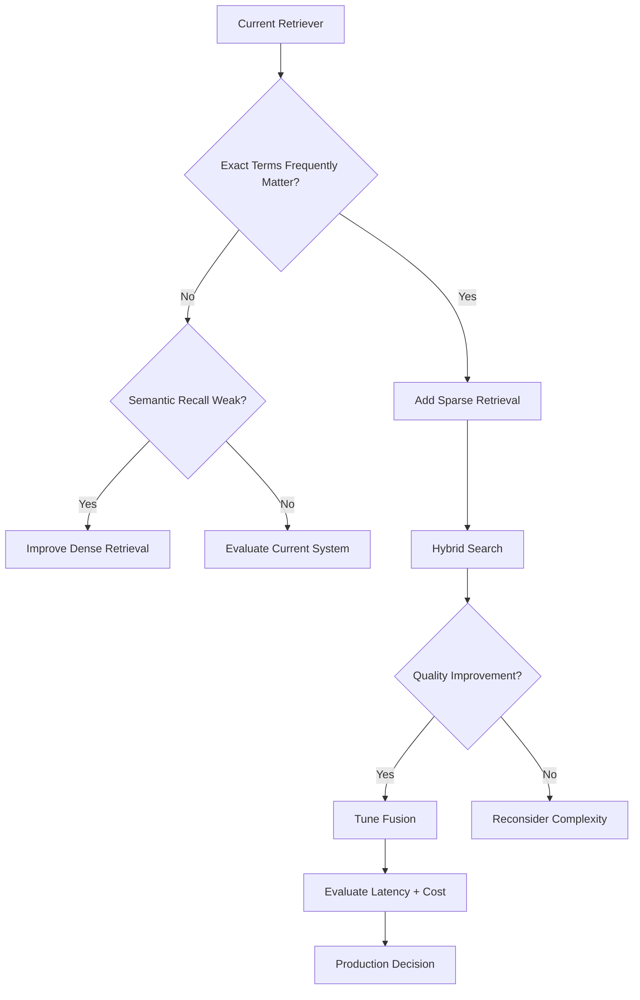

---

# 60. When Hybrid Search Is Most Useful

Hybrid search is particularly useful when:

- Exact terminology matters
- Semantic meaning also matters
- Documents contain technical identifiers
- Error codes are important
- Product names must match exactly
- Acronyms are common
- Users use both natural-language and keyword-style queries
- Enterprise documentation is heterogeneous
- Dense retrieval alone misses exact matches
- Sparse retrieval alone misses semantic relationships

Typical applications include:

```text
Enterprise Search
Technical Documentation
Developer Copilots
Customer Support
Product Search
Legal Search
Financial Research
Knowledge Assistants
Internal Enterprise Search
```

---

# 61. When Hybrid Search May Not Be Necessary

Hybrid search may not be justified when:

```text
Dense retrieval already achieves excellent recall
```

or:

```text
The corpus is extremely small
```

or:

```text
Queries are highly predictable
```

or:

```text
Exact-term matching has little value
```

or:

```text
The additional operational complexity outweighs the improvement
```

Always measure before adopting.

---

# 62. Recommended Enterprise Pattern

A practical enterprise architecture is:

```text
Query
 ↓
Query Understanding
 ↓
Metadata / Security Filters
 ↓
Dense + Sparse Retrieval
 ↓
Fusion
 ↓
Deduplication
 ↓
Reranking
 ↓
MMR / Diversity
 ↓
Contextual Compression
 ↓
Prompt Assembly
 ↓
LLM
 ↓
Response Validation
 ↓
Citation
```

The role of hybrid search is primarily:

```text
Dense
→ Semantic Recall

Sparse
→ Lexical Recall

Fusion
→ Unified Candidate Ranking
```

---

# 63. Production Checklist

Before deploying hybrid search:

```text
☐ Dense baseline has been evaluated
☐ Sparse baseline has been evaluated
☐ Hybrid retrieval has been evaluated
☐ Dense and sparse query paths are defined
☐ Score normalization is handled when required
☐ Fusion strategy is explicitly selected
☐ Retriever weights are configurable
☐ Duplicate results are removed
☐ Stable document/chunk IDs are available
☐ Metadata is preserved
☐ Parallel retrieval is considered
☐ Latency is measured independently for both retrievers
☐ Fusion latency is measured
☐ Reranker impact is measured
☐ Retrieval cost is measured
☐ Query-type performance is evaluated
☐ Technical identifiers are tested
☐ Historical/time-aware queries are tested where applicable
☐ Citation provenance is preserved
☐ Regression tests are implemented
☐ End-to-end RAG quality is evaluated
```

---

# 64. Key Takeaways

- Hybrid Search combines multiple retrieval signals.
- The most common combination is dense vector retrieval + sparse lexical retrieval.
- Dense retrieval is strong at semantic similarity.
- Sparse retrieval is strong at exact terminology.
- BM25 remains a useful lexical retrieval technique.
- Modern systems can also combine dense vectors with learned sparse representations.
- Raw dense and sparse scores usually should not be combined without appropriate normalization.
- Rank-based fusion such as RRF avoids direct score comparability problems.
- Weighted fusion provides explicit control over retrieval contributions.
- Dense and sparse retrieval can often execute in parallel.
- Deduplication is important because both retrievers may return the same documents.
- Query-specific weighting can improve performance for heterogeneous workloads.
- Hybrid retrieval works particularly well for technical and enterprise knowledge.
- Hybrid search can be combined with metadata filtering, time weighting, Multi-Vector Retrieval, reranking, MMR, and contextual compression.
- Hybrid retrieval is primarily a candidate-generation and ranking strategy.
- A reranker can provide an additional precision layer.
- Retrieval provenance should be preserved for observability and citation.
- Hybrid retrieval should always be evaluated against both dense-only and sparse-only baselines.
- More retrieval complexity is justified only when it produces measurable improvement.

The central pattern is:

```text
Dense Retrieval
      +
Sparse Retrieval
      ↓
    Fusion
      ↓
Better Candidate Recall
      ↓
   Reranking
      ↓
Better Precision
      ↓
Context Optimization
      ↓
Reliable Generation
```

Or simply:

```text
Understand Meaning
        +
Match Exact Terms
        ↓
     Hybrid Search
        ↓
   Better Retrieval
```

---

# 🧭 Chapter Navigation

### Part V — Advanced Retrieval-Augmented Generation

**Previous:**  
[04. Time-Weighted Retriever](04-timeweighted-retriever.md)

**Next:**  
[06. HyDE Retriever](06-hyde-retriever.md)

**Section:**  
02 — Enterprise Retrieval Engineering

### Enterprise Retrieval Engineering Path

```text
01 Contextual Compression Retriever
              ↓
02 Ensemble Retriever
              ↓
03 Multi-Vector Retriever
              ↓
04 Time-Weighted Retriever
              ↓
05 Hybrid Search Retriever
              ↓
06 HyDE Retriever
              ↓
07 Router Retriever
              ↓
08 Multi-Stage Retrieval
              ↓
09 Agentic Retrieval
              ↓
10 Re-ranking Techniques
              ↓
11 MMR & Diversity-Aware Retrieval
              ↓
12 Metadata-Aware Retrieval
              ↓
13 Advanced Query Rewriting
```

---

> **Enterprise AI Engineering Handbook**  
> *Building Production-Grade Enterprise AI Systems — One Chapter at a Time.*