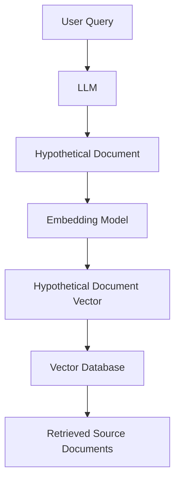
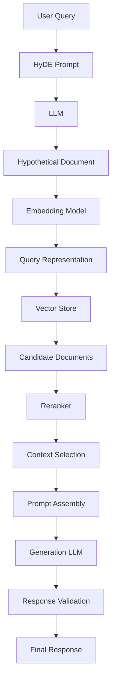
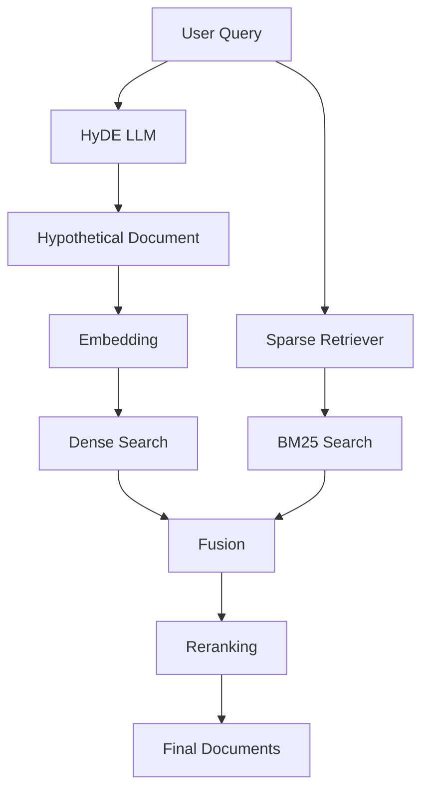
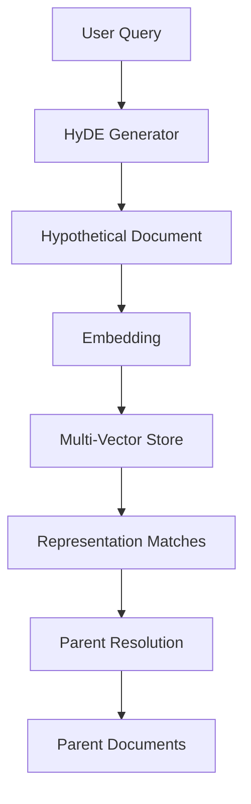
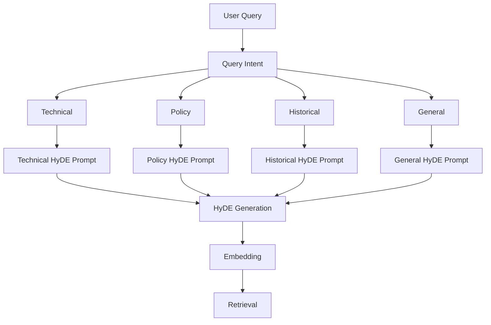
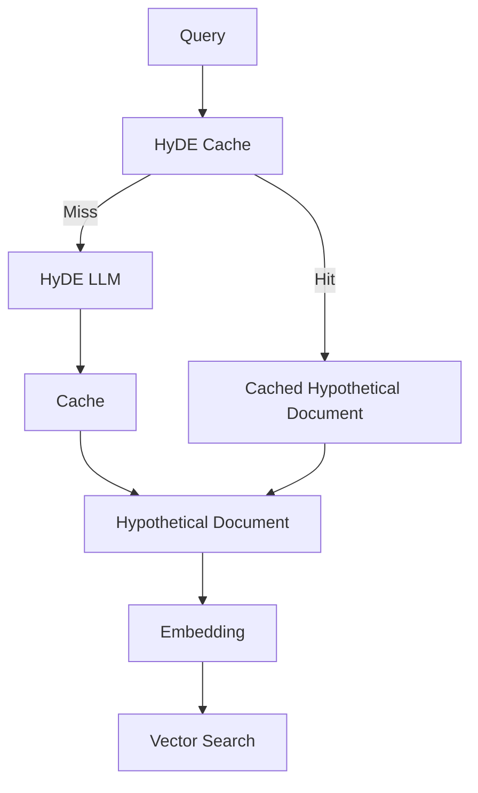
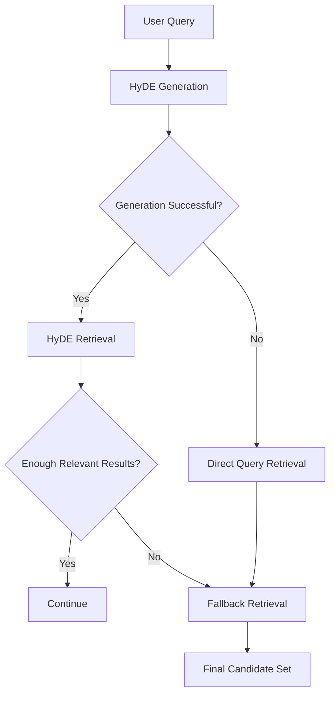
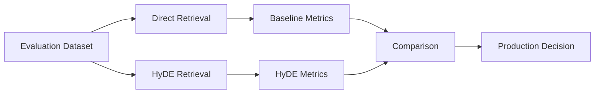
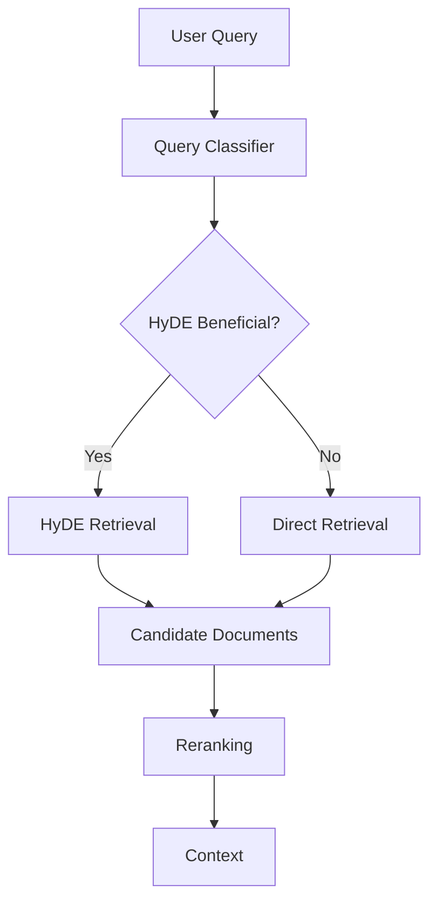
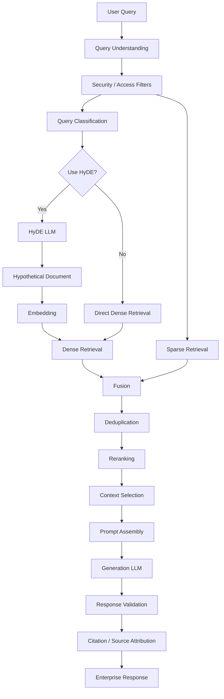

# HyDE Retriever

## 📖 Overview

**HyDE — Hypothetical Document Embeddings** is a retrieval technique that improves semantic search by generating a **hypothetical answer/document** from the user's query and then using that generated text to perform vector retrieval.

Instead of directly embedding:

```text
User Query
    ↓
Query Embedding
    ↓
Vector Search
```

HyDE introduces an intermediate representation:

```text
User Query
    ↓
LLM
    ↓
Hypothetical Document
    ↓
Embedding
    ↓
Vector Search
    ↓
Relevant Documents
```

The key idea is:

> **Search using an embedding of a hypothetical document rather than directly embedding the original query.**

The hypothetical document is used only as a **retrieval representation**. The final answer should still be generated from retrieved source documents.

---

## 🎯 Learning Objectives

After completing this chapter, you will be able to:

- Understand Hypothetical Document Embeddings
- Understand why direct query embedding can be insufficient
- Understand the HyDE retrieval pipeline
- Generate hypothetical documents using an LLM
- Embed hypothetical documents
- Retrieve source documents using HyDE
- Compare direct retrieval with HyDE retrieval
- Understand HyDE prompt design
- Combine HyDE with hybrid retrieval
- Combine HyDE with reranking
- Combine HyDE with Multi-Vector Retrieval
- Understand HyDE latency and cost implications
- Evaluate HyDE against a standard vector retriever
- Design production-oriented HyDE architectures

---

# 1. The Problem HyDE Tries to Solve

Traditional semantic retrieval embeds the user's query directly.

For example:

```text
Query:

"How can an application securely access
another service on behalf of a user?"
```

The embedding represents the query.

The vector database then searches for semantically similar chunks.

However, queries and documents often have very different linguistic structures.

```text
Query:
"How can an application access another
service on behalf of a user?"

Document:
"OAuth 2.0 is an authorization framework
that enables delegated access to protected
resources."
```

The concepts are related, but the language is different.

HyDE attempts to bridge this gap by generating a hypothetical document that resembles the type of content stored in the knowledge base.

---

# 2. Traditional Retrieval

The standard pipeline is:


Example:

```text
User Query
    ↓
"What is OAuth authorization?"
    ↓
Embedding
    ↓
Vector Search
    ↓
OAuth Documentation
```

This works well for many applications.

HyDE adds another semantic transformation.

---

# 3. HyDE Retrieval

The HyDE pipeline becomes:



The important distinction is:

```text
Traditional:

Query → Embedding → Search

HyDE:

Query → Hypothetical Document → Embedding → Search
```

---

# 4. What Is a Hypothetical Document?

A hypothetical document is generated by an LLM based on the user's query.

For example:

```text
Query:

"What is OAuth 2.0?"
```

The LLM might generate:

```text
OAuth 2.0 is an authorization framework that
allows applications to obtain limited access
to protected resources on behalf of a resource
owner without exposing the user's credentials.
```

This generated text is **not treated as authoritative evidence**.

It is used as a retrieval representation.

```text
Hypothetical Document
        ↓
Embedding
        ↓
Search
```

---

# 5. Why Generate a Document?

Documents in a knowledge base typically look like:

```text
Paragraphs
Technical explanations
Definitions
Procedures
Policies
Documentation
Research content
```

Queries often look like:

```text
Short questions
Keywords
Incomplete phrases
Conversational requests
```

HyDE transforms:

```text
Question-like Query
        ↓
Document-like Representation
```

This can reduce the representation gap between:

```text
Query Space
```

and:

```text
Document Space
```

---

# 6. Query-to-Document Transformation

The core concept can be visualized as:

```text
                 Query Space

        "How does OAuth work?"
                  │
                  ↓
                 LLM
                  │
                  ↓
          Hypothetical Answer
                  │
                  ↓
             Document Space
                  │
                  ↓
              Embedding
                  │
                  ↓
            Vector Search
```

The generated document attempts to contain concepts that are likely to appear in relevant source documents.

---

# 7. HyDE vs Direct Query Embedding

### Direct Retrieval

```text
Query
 ↓
Embedding
 ↓
Vector Search
 ↓
Documents
```

### HyDE

```text
Query
 ↓
LLM
 ↓
Hypothetical Document
 ↓
Embedding
 ↓
Vector Search
 ↓
Documents
```

The additional LLM step can improve retrieval in some query distributions, but it also introduces:

```text
Latency
Cost
Potential Hallucination
```

Therefore, HyDE should be evaluated rather than automatically applied.

---

# 8. HyDE Architecture



Notice that HyDE uses an LLM **before retrieval**, while another generation step may occur **after retrieval**.

---

# 9. Two LLM Roles

A production HyDE pipeline may have two conceptual LLM operations.

### Retrieval-Time Generation

```text
User Query
 ↓
HyDE LLM
 ↓
Hypothetical Document
```

### Answer Generation

```text
Retrieved Source Documents
 ↓
Generation LLM
 ↓
Final Answer
```

Therefore:

```text
HyDE LLM
→ Helps retrieve

Generation LLM
→ Helps answer
```

They may use the same underlying model, but they have different responsibilities.

---

# 10. Basic HyDE Prompt

A simple prompt can be:

```python
HYDE_PROMPT = """
Write a hypothetical document that would directly
answer the following question.

Question:
{query}

Generate a concise, information-rich passage.
Do not mention that the passage is hypothetical.
"""
```

For:

```text
"What is OAuth 2.0?"
```

the model produces a document-like response.

That response is then embedded.

---

# 11. Python Example

```python
query = "What is OAuth 2.0?"

hypothetical_document = llm.invoke(
    HYDE_PROMPT.format(query=query)
)

hypothetical_vector = embedding_model.embed_query(
    hypothetical_document
)

results = vector_store.similarity_search_by_vector(
    hypothetical_vector,
    k=5
)
```

The important flow is:

```text
Query
 ↓
LLM
 ↓
Hypothetical Document
 ↓
Embedding
 ↓
Vector Search
```

---

# 12. Simple HyDE Retriever

A framework-independent implementation could look like:

```python
class HyDERetriever:

    def __init__(
        self,
        llm,
        embedding_model,
        vector_store,
        top_k=5
    ):
        self.llm = llm
        self.embedding_model = embedding_model
        self.vector_store = vector_store
        self.top_k = top_k

    def retrieve(self, query: str):

        hypothetical_document = self.llm.invoke(
            self._build_prompt(query)
        )

        vector = self.embedding_model.embed_query(
            hypothetical_document
        )

        return self.vector_store.similarity_search_by_vector(
            vector,
            k=self.top_k
        )

    def _build_prompt(self, query):

        return f"""
        Generate a hypothetical document that
        could answer this question:

        {query}
        """
```

This keeps the retrieval logic separate from the application layer.

---

# 13. LangChain-Oriented Example

LangChain provides HyDE-style retrieval patterns that can be composed using its retrieval abstractions.

A simplified conceptual implementation:

```python
from langchain_core.prompts import PromptTemplate

prompt = PromptTemplate.from_template(
    """
    Write a hypothetical document that answers
    the following question:

    {question}
    """
)

hypothetical_document = llm.invoke(
    prompt.format(
        question=query
    )
)

results = vector_store.similarity_search(
    hypothetical_document,
    k=5
)
```

The important concept is not the specific framework API.

It is:

```text
Query
 ↓
LLM-generated hypothetical document
 ↓
Embedding
 ↓
Vector Retrieval
```

---

# 14. Multiple Hypothetical Documents

A single hypothetical document may not capture all possible interpretations of a query.

For example:

```text
Query:
"How can I improve API authentication?"
```

Possible interpretations:

```text
OAuth
API keys
JWT
mTLS
Identity providers
```

HyDE can generate multiple hypothetical documents.

```text
Query
 ↓
LLM
 ↓
 ┌───────────────┬───────────────┬───────────────┐
 ↓               ↓               ↓
Hypothesis 1   Hypothesis 2    Hypothesis 3
 ↓               ↓               ↓
Embedding      Embedding       Embedding
 └───────────────┼───────────────┘
                 ↓
             Retrieval
```

This can improve coverage for ambiguous queries.

---

# 15. Multi-HyDE Retrieval

Example:

```python
hypothetical_documents = llm.invoke(
    """
    Generate three different hypothetical
    answers to the following query.

    Query:
    {query}
    """
)
```

Each generated document can be embedded:

```python
vectors = [
    embedding_model.embed_query(doc)
    for doc in hypothetical_documents
]
```

Then retrieve for each vector:

```python
all_results = []

for vector in vectors:
    all_results.extend(
        vector_store.similarity_search_by_vector(
            vector,
            k=5
        )
    )
```

The final results should be deduplicated and ranked.

---

# 16. HyDE + Multi-Query Retrieval

HyDE and Multi-Query Retrieval solve related but different problems.

### Multi-Query

Generates:

```text
Multiple Queries
```

### HyDE

Generates:

```text
Hypothetical Documents
```

Architecture:

```text
                 User Query
                     │
          ┌──────────┴──────────┐
          ↓                     ↓
     Multi-Query             HyDE
          ↓                     ↓
   Query 1 / 2 / 3       Hypothetical Docs
          ↓                     ↓
      Retrieval             Retrieval
          └──────────┬──────────┘
                     ↓
                   Fusion
```

These techniques can be combined, but the added complexity should be justified through evaluation.

---

# 17. HyDE + Hybrid Search

HyDE can generate the dense retrieval representation while the original query is used for sparse retrieval.



This is particularly useful when:

```text
Semantic Retrieval
+
Exact Terminology
```

are both important.

The sparse path can preserve exact identifiers while HyDE improves the semantic retrieval representation.

---

# 18. HyDE + Reranking

A common production pipeline is:

```text
Query
 ↓
HyDE
 ↓
Dense Retrieval
 ↓
Candidate Pool
 ↓
Reranker
 ↓
Top-K
```

Architecture:


HyDE improves candidate generation.

The reranker then performs deeper query-document relevance scoring.

---

# 19. HyDE + Contextual Compression

The pipeline can continue with contextual compression:

```text
Query
 ↓
HyDE
 ↓
Vector Retrieval
 ↓
Reranking
 ↓
Contextual Compression
 ↓
Prompt Assembly
 ↓
LLM
```

This helps when retrieved documents are larger than the context actually required.

---

# 20. HyDE + Multi-Vector Retrieval

HyDE can also work with a Multi-Vector Retriever.

```text
Query
 ↓
HyDE Document
 ↓
Embedding
 ↓
Multi-Vector Search
 ↓
Representation Matches
 ↓
Parent Resolution
 ↓
Final Documents
```

Architecture:



This combines:

```text
Hypothetical Query-to-Document Alignment
+
Multiple Document Representations
```

---

# 21. HyDE + Hybrid + Reranking

A more advanced retrieval architecture can combine all three:

```text
User Query
    │
    ├──────────────→ Sparse Search
    │
    ↓
   HyDE
    ↓
Hypothetical Document
    ↓
Embedding
    ↓
Dense Search
    │
    └──────────────┐
                   ↓
                 Fusion
                   ↓
              Deduplication
                   ↓
                Reranker
                   ↓
             Context Selection
```

This can provide:

```text
Semantic Expansion
+
Exact-Term Retrieval
+
High-Precision Ranking
```

---

# 22. Why HyDE Can Improve Retrieval

The generated document can contain terms and concepts that are closer to the knowledge base.

Example:

```text
User Query:

"How do I let another application
access my user's resources?"
```

HyDE may generate:

```text
OAuth 2.0 provides delegated authorization
where an application can obtain an access token
to access protected resources on behalf of a user.
```

The hypothetical document contains:

```text
OAuth 2.0
delegated authorization
access token
protected resources
```

These concepts may align closely with enterprise documentation.

---

# 23. HyDE Does Not Need to Be Factually Correct

This is a subtle but important concept.

The hypothetical document is not the final answer.

Its primary purpose is:

```text
Create a useful retrieval representation
```

Therefore:

```text
Hypothetical Document
        ↓
Retrieval Representation
```

rather than:

```text
Hypothetical Document
        ↓
Authoritative Evidence
```

The final answer should be grounded in retrieved source documents.

---

# 24. Hallucination Risk

Because an LLM generates the hypothetical document, it can hallucinate.

Example:

```text
Query:
"What is the internal authentication mechanism?"
```

The model might invent:

```text
"Enterprise authentication uses
Acme Identity Protocol."
```

If that term does not exist in the knowledge base, the generated vector may move retrieval in the wrong direction.

Therefore:

```text
HyDE Generation
        ↓
Potential Hallucination
        ↓
Retrieval Drift
```

This is one of the main risks of HyDE.

---

# 25. Grounding the HyDE Prompt

A retrieval-oriented prompt should avoid unnecessary invention.

Example:

```python
HYDE_PROMPT = """
Generate a concise hypothetical passage that could
answer the user's question.

Use generally relevant technical concepts.
Do not invent company-specific facts,
identifiers, policies, or citations.

Question:
{query}
"""
```

This reduces the chance that the hypothetical representation becomes overly specific to unsupported information.

---

# 26. HyDE Prompt Design

A good HyDE prompt should define:

```text
Expected document style
Expected length
Domain
Specificity
Hallucination constraints
Output format
```

Example:

```text
Generate a concise technical passage.

Requirements:
- Focus on the user's question.
- Use standard terminology.
- Include concepts likely to occur in technical documentation.
- Avoid unsupported organization-specific details.
- Do not include citations.
- Return only the passage.

Question:
{query}
```

---

# 27. Domain-Specific HyDE

Different domains can use different prompts.

### Technical Documentation

```text
Generate a technical explanation using
standard software engineering terminology.
```

### Legal Knowledge

```text
Generate a hypothetical legal explanation
using neutral legal terminology.
```

### Financial Research

```text
Generate a concise financial research-style
passage describing the concepts relevant
to the question.
```

The prompt can influence the vocabulary used in the retrieval representation.

---

# 28. HyDE for Technical Queries

Consider:

```text
Query:

"Why does my Kubernetes pod keep restarting?"
```

HyDE may generate:

```text
A Kubernetes pod may repeatedly restart due to
CrashLoopBackOff, failing health probes, container
startup errors, resource limits, or application
exceptions.
```

This introduces useful retrieval terms:

```text
Kubernetes
pod
CrashLoopBackOff
health probes
startup errors
resource limits
application exceptions
```

The vector search can then locate relevant operational documentation.

---

# 29. HyDE for Enterprise Documentation

Query:

```text
"How do I request access to production?"
```

A generic HyDE response might mention:

```text
access approval
identity verification
role assignment
security controls
```

The retrieval system can then search enterprise documentation containing related concepts.

However, it should not invent:

```text
Internal approval workflow
Manager names
Ticket numbers
Specific systems
```

unless those are grounded in the query or other trusted context.

---

# 30. HyDE for Ambiguous Queries

Consider:

```text
"How do I secure my API?"
```

This could refer to:

```text
OAuth
JWT
API keys
mTLS
Rate limiting
WAF
Network security
```

A single HyDE document may focus on one interpretation.

Possible solution:

```text
Generate Multiple Hypothetical Documents
        ↓
Multiple Embeddings
        ↓
Retrieve Multiple Candidate Sets
        ↓
Fusion
```

This provides broader semantic coverage.

---

# 31. Query Intent + HyDE

An advanced architecture can first classify the query.



This adds complexity but can improve domain alignment for heterogeneous enterprise knowledge bases.

---

# 32. HyDE and Query Rewriting

HyDE is related to query rewriting but should not be treated as identical.

### Query Rewriting

```text
Original Query
 ↓
Improved Query
 ↓
Retrieval
```

### HyDE

```text
Original Query
 ↓
Hypothetical Document
 ↓
Embedding
 ↓
Retrieval
```

Query rewriting changes the search query.

HyDE changes the **representation used for vector search**.

---

# 33. HyDE and Multi-Query

### Multi-Query

```text
Query
 ↓
Query 1
Query 2
Query 3
 ↓
Retrieval
```

### HyDE

```text
Query
 ↓
Hypothetical Document
 ↓
Embedding
 ↓
Retrieval
```

### Combined

```text
Query
 ├── Multi-Query
 │      ↓
 │   Query Retrieval
 │
 └── HyDE
        ↓
   Hypothetical Retrieval
        ↓
      Fusion
```

This can increase recall, but also increases:

```text
LLM calls
Embedding calls
Retrieval calls
Latency
Cost
```

---

# 34. HyDE and Query Expansion

Traditional query expansion might produce:

```text
OAuth
authorization
access token
delegated access
```

HyDE instead produces a coherent passage:

```text
OAuth 2.0 enables delegated authorization
through access tokens that allow applications
to access protected resources on behalf of users.
```

The difference is:

```text
Keyword Expansion
        vs
Document-Like Expansion
```

---

# 35. HyDE with Metadata Filtering

HyDE should generally not replace metadata constraints.

Example:

```text
Query:
"How does the production deployment process work?"
```

Metadata:

```text
environment = production
department = engineering
status = published
```

Pipeline:

```text
Query
 ↓
Metadata Constraints
 ↓
HyDE Representation
 ↓
Dense Retrieval
 ↓
Reranking
```

This prevents semantic retrieval from searching outside the allowed knowledge scope.

---

# 36. HyDE with Access Control

Enterprise retrieval must enforce authorization independently of HyDE.

```text
User
 ↓
Authorization Context
 ↓
Security Filter
 ↓
HyDE / Retrieval
 ↓
Allowed Documents
```

The hypothetical document must never be allowed to bypass:

```text
ACL
RBAC
ABAC
Tenant Isolation
Document Permissions
```

Security filtering should be enforced against the actual source documents.

---

# 37. HyDE and Citations

The generated hypothetical document should not normally be cited.

Instead:

```text
HyDE Document
      ↓
Retrieval Only

Retrieved Source
      ↓
Citation
```

Architecture:


This preserves evidence traceability.

---

# 38. Retrieval Provenance

A production trace should record:

```text
Original Query
HyDE Prompt Version
Hypothetical Document
Embedding Model
Retrieved Documents
Scores
Reranker Results
Final Sources
```

Example:

```json
{
  "query": "What is OAuth 2.0?",
  "retrieval_strategy": "hyde",
  "embedding_model": "embedding-model",
  "candidate_count": 20,
  "reranked_count": 5
}
```

Whether the actual hypothetical text is retained should depend on privacy, logging, and operational requirements.

---

# 39. Latency Considerations

Traditional retrieval:

```text
Query
 ↓
Embedding
 ↓
Search
```

HyDE:

```text
Query
 ↓
LLM
 ↓
Embedding
 ↓
Search
```

Therefore:

```text
HyDE Latency
=
LLM Generation
+
Embedding
+
Retrieval
```

The additional LLM generation can become significant in interactive applications.

---

# 40. Cost Considerations

Traditional:

```text
1 Embedding
+
1 Retrieval
```

HyDE:

```text
1 LLM Generation
+
1 Embedding
+
1 Retrieval
```

Multi-HyDE:

```text
N LLM Generations
+
N Embeddings
+
N Retrievals
```

Therefore:

> **HyDE should be used where its retrieval improvement justifies its additional cost.**

---

# 41. Caching

HyDE can benefit from caching.

For repeated queries:

```text
Query
 ↓
Cache Lookup
 ↓
Existing Hypothetical Document
```

If no cached result exists:

```text
Query
 ↓
LLM
 ↓
Cache
 ↓
Embedding
```

Architecture:



Caching strategy should consider:

```text
Prompt Version
Model Version
Knowledge Domain
Query Normalization
```

---

# 42. Streaming Considerations

HyDE generation is usually an internal retrieval operation.

The generated hypothetical document does not need to be streamed to the user.

The user-facing stream should generally begin with the final generation stage:

```text
User Query
 ↓
HyDE
 ↓
Retrieval
 ↓
Context
 ↓
Final LLM
 ↓
Streaming Response
```

This keeps retrieval internals separate from the user experience.

---

# 43. Failure Handling

A production HyDE retriever should have fallback behavior.



Possible fallback:

```text
HyDE
 ↓
No useful results
 ↓
Direct Vector Retrieval
```

This prevents HyDE failures from becoming total retrieval failures.

---

# 44. HyDE Fallback Strategy

A practical retrieval policy could be:

```python
results = hyde_retriever.retrieve(query)

if not results:
    results = vector_retriever.invoke(query)
```

A more robust system can use a quality threshold:

```python
if max_score(results) < MIN_SCORE:
    results = direct_retriever.invoke(query)
```

The threshold should be calibrated using evaluation data rather than chosen arbitrarily.

---

# 45. HyDE Evaluation

The correct evaluation compares:

```text
Baseline:
Direct Vector Retrieval

Experiment:
HyDE Retrieval
```

Metrics:

```text
Recall@K
Precision@K
MRR
NDCG
Context Relevance
Answer Correctness
Faithfulness
Latency
Cost
```

Architecture:



---

# 46. Query-Level Evaluation

HyDE may work better for some queries than others.

Evaluate categories such as:

```text
Short Queries
Natural-Language Questions
Technical Queries
Ambiguous Queries
Long Queries
Keyword Queries
Exact Identifier Queries
```

For example:

```text
Semantic Question
→ HyDE may help

Exact Error Code
→ Sparse Retrieval may be better

Simple Query
→ Direct Retrieval may be sufficient
```

This can lead to selective HyDE usage.

---

# 47. Selective HyDE

Instead of applying HyDE to every query:

```text
Every Query
    ↓
HyDE
```

an advanced system can use:

```text
Query
 ↓
Query Classifier
 ↓
Should HyDE be used?
```

Architecture:



This can reduce cost and latency.

---

# 48. Query Types Suitable for HyDE

HyDE can be especially useful for:

```text
Natural-Language Questions
Conceptual Questions
Long-Form Questions
Research Questions
Semantic Queries
Queries with Large Vocabulary Mismatch
```

It may be less useful for:

```text
Exact IDs
Ticket Numbers
Error Codes
Product Codes
Highly Structured Filters
Simple Keyword Searches
```

For these, lexical or metadata retrieval may already be optimal.

---

# 49. HyDE + Sparse Retrieval for Exact Terms

A strong architecture for heterogeneous enterprise queries is:

```text
                 Query
                   │
          ┌────────┴────────┐
          ↓                 ↓
        HyDE              Sparse
          ↓                 ↓
       Dense             BM25
          ↓                 ↓
          └───────┬─────────┘
                  ↓
                Fusion
                  ↓
              Reranking
```

This allows:

```text
HyDE
→ Semantic retrieval

Sparse
→ Exact terminology
```

---

# 50. HyDE + Time-Aware Retrieval

HyDE can also be combined with the time-aware retrieval strategy from the previous chapter.

```text
Query
 ↓
HyDE
 ↓
Dense Retrieval
 ↓
Temporal Ranking
 ↓
Final Documents
```

Or:

```text
HyDE Dense Retrieval
+
Sparse Retrieval
+
Temporal Signal
```

This is useful for domains where:

```text
Semantic Relevance
+
Exact Terms
+
Freshness
```

are all important.

---

# 51. Production Architecture

A mature enterprise HyDE pipeline can look like:



This architecture keeps:

```text
HyDE
→ Retrieval representation

Source documents
→ Evidence

Generation LLM
→ Final answer
```

---

# 52. Framework-Agnostic Interface

An enterprise AI platform can expose:

```python
from abc import ABC, abstractmethod


class QueryRepresentationGenerator(ABC):

    @abstractmethod
    def generate(self, query: str) -> str:
        pass
```

HyDE implementation:

```python
class HyDERepresentationGenerator(
    QueryRepresentationGenerator
):

    def __init__(self, llm):
        self.llm = llm

    def generate(self, query: str) -> str:

        prompt = f"""
        Generate a concise hypothetical document
        that could answer this question:

        {query}
        """

        return self.llm.invoke(prompt)
```

Then:

```python
class HyDERetriever:

    def __init__(
        self,
        representation_generator,
        embedding_provider,
        vector_store
    ):
        self.generator = representation_generator
        self.embedding = embedding_provider
        self.vector_store = vector_store

    def retrieve(self, query, top_k=5):

        representation = (
            self.generator.generate(query)
        )

        vector = self.embedding.embed(
            representation
        )

        return self.vector_store.search(
            vector,
            top_k=top_k
        )
```

This keeps the architecture provider-independent.

---

# 53. Configuration Example

```yaml
retrieval:
  strategy: hyde

  hyde:
    enabled: true

    generation:
      model: retrieval-llm
      max_tokens: 300
      temperature: 0.0

    embedding:
      provider: embedding-provider

    retrieval:
      top_k: 20

    fallback:
      enabled: true
      strategy: direct-vector

  reranking:
    enabled: true
    top_k: 5
```

Configuration should be externalized so the strategy can be tuned without modifying business logic.

---

# 54. Testing Strategy

HyDE should be tested at multiple levels.

### Unit Tests

Test:

```text
Prompt construction
Representation generation
Fallback logic
Result deduplication
```

### Integration Tests

Test:

```text
LLM
Embedding Model
Vector Store
Retriever
```

### Retrieval Evaluation

Test:

```text
Recall@K
MRR
NDCG
```

### End-to-End Evaluation

Test:

```text
Answer Correctness
Faithfulness
Citation Accuracy
Latency
Cost
```

---

# 55. Example Unit Test

```python
def test_hyde_retriever_uses_hypothetical_document():

    query = "What is OAuth 2.0?"

    hypothetical = (
        "OAuth 2.0 is an authorization framework..."
    )

    embedding = embedding_model.embed_query(
        hypothetical
    )

    results = vector_store.similarity_search_by_vector(
        embedding,
        k=5
    )

    assert results
```

Production evaluation should additionally verify whether the retrieved documents are actually more relevant than those returned by direct retrieval.

---

# 56. Common Failure Modes

## 56.1 Hallucinated Retrieval Terms

The LLM may introduce concepts that do not exist in the source corpus.

```text
Query
 ↓
HyDE
 ↓
Invented Concept
 ↓
Wrong Retrieval
```

---

## 56.2 Retrieval Drift

The hypothetical document may answer a slightly different question.

```text
User Intent
    ↓
HyDE Interpretation
    ↓
Different Intent
```

---

## 56.3 Excessive Generation

A very long hypothetical document can introduce unnecessary concepts.

Prefer:

```text
Concise
Relevant
Information-Dense
```

representations.

---

## 56.4 High Latency

HyDE adds an LLM call before retrieval.

---

## 56.5 Increased Cost

Every HyDE query can require:

```text
LLM Generation
+
Embedding
+
Vector Search
```

---

## 56.6 Exact-Term Queries

HyDE may be less effective for:

```text
AUTH-401
INC-92817
PAY-409
```

because sparse retrieval can match these identifiers directly.

---

## 56.7 Overuse

Applying HyDE to every query can unnecessarily increase system complexity.

---

# 57. Observability

A HyDE retrieval trace can expose:

```text
Query
HyDE Enabled
HyDE Generation Latency
Embedding Latency
Retrieval Latency
Candidate Count
Reranker Latency
Final Candidate Count
Fallback Triggered
```

Example:

```json
{
  "query": "How does OAuth authorization work?",
  "hyde": {
    "enabled": true,
    "generation_latency_ms": 220
  },
  "embedding_latency_ms": 18,
  "retrieval_latency_ms": 35,
  "candidate_count": 20,
  "fallback": false
}
```

This makes the additional HyDE cost visible.

---

# 58. Cost Observability

A production system should track:

```text
HyDE LLM Tokens
Embedding Tokens
Retrieval Calls
Reranker Calls
Fallback Rate
Cost per Query
```

A useful metric is:

```text
Incremental HyDE Cost
=
HyDE Query Cost
-
Direct Retrieval Cost
```

Then compare it with:

```text
Retrieval Quality Improvement
```

---

# 59. Production Decision

The decision should be based on:

```text
Quality Improvement
        vs
Latency + Cost + Complexity
```

For example:

```text
Recall@10:
+8%

Latency:
+220 ms

Cost:
+35%
```

The organization must decide whether the retrieval improvement justifies those costs.

There is no universal answer.

---

# 60. When to Use HyDE

HyDE is worth evaluating when:

- Queries are natural-language questions
- Query and document vocabulary differ significantly
- Semantic retrieval recall is weak
- Users ask conceptual questions
- The corpus contains rich explanatory documents
- Direct query embeddings are not sufficiently effective
- Retrieval quality is more important than minimum latency

Typical use cases:

```text
Research Assistants
Technical Knowledge Systems
Enterprise Knowledge Assistants
Documentation Search
Academic Search
Long-Form Question Answering
```

---

# 61. When HyDE May Not Be Necessary

HyDE may not be appropriate when:

```text
Queries are simple
```

or:

```text
Exact keyword matching dominates
```

or:

```text
The vector retriever already performs extremely well
```

or:

```text
Latency requirements are very strict
```

or:

```text
LLM generation cost is unacceptable
```

or:

```text
The query contains exact identifiers
```

In these cases:

```text
Direct Vector Search
or
Sparse Search
or
Hybrid Search
```

may be better.

---

# 62. Recommended Enterprise Pattern

A practical enterprise architecture is:

```text
Query
 ↓
Security / Metadata Filters
 ↓
Query Classification
 ↓
 ┌─────────────────────────┐
 │                         │
 ↓                         ↓
HyDE Dense              Sparse Search
 │                         │
 ↓                         ↓
Dense Results           Sparse Results
 └────────────┬────────────┘
              ↓
            Fusion
              ↓
         Deduplication
              ↓
           Reranking
              ↓
      Context Optimization
              ↓
        Prompt Assembly
              ↓
              LLM
              ↓
      Response Validation
              ↓
           Citation
```

The key principle is:

> **HyDE should improve retrieval representation, not replace source-grounded generation.**

---

# 63. Production Checklist

Before deploying HyDE:

```text
☐ Direct vector retrieval baseline is available
☐ HyDE improvement has been measured
☐ HyDE prompt is versioned
☐ Hypothetical documents are concise
☐ Hallucination risk is considered
☐ Exact-term queries have a sparse fallback
☐ Security filters are applied independently
☐ Metadata filters remain authoritative
☐ Source documents remain the generation evidence
☐ HyDE latency is measured
☐ HyDE token cost is measured
☐ Embedding cost is measured
☐ Retrieval quality is evaluated
☐ Query categories are evaluated separately
☐ Fallback behavior is implemented
☐ Caching is considered
☐ Retrieval provenance is preserved
☐ Observability is implemented
☐ Citation provenance is preserved
☐ Regression tests are implemented
```

---

# 64. Key Takeaways

- **HyDE stands for Hypothetical Document Embeddings.**
- HyDE generates a hypothetical document from the user's query.
- The hypothetical document is embedded and used for vector retrieval.
- HyDE attempts to reduce the representation gap between queries and documents.
- The hypothetical document is a retrieval aid, not authoritative evidence.
- Final answers should be grounded in retrieved source documents.
- HyDE can improve retrieval for semantic and natural-language queries.
- HyDE may be less useful for exact identifiers and keyword-heavy queries.
- HyDE introduces additional LLM latency and cost.
- Multiple hypothetical documents can improve coverage for ambiguous queries.
- HyDE can be combined with hybrid retrieval.
- HyDE can be combined with Multi-Vector Retrieval.
- HyDE can be combined with reranking and contextual compression.
- Query classification can enable selective HyDE usage.
- Sparse retrieval provides a useful complementary path for exact terminology.
- Caching can reduce repeated HyDE generation cost.
- Fallback to direct retrieval improves system resilience.
- HyDE should be evaluated against a strong direct-retrieval baseline.
- The objective is not to generate a better answer before retrieval.
- The objective is to generate a **better retrieval representation**.

The central pattern is:

```text
User Query
     ↓
Hypothetical Document
     ↓
Embedding
     ↓
Semantic Retrieval
     ↓
Source Documents
     ↓
Reranking
     ↓
Context Selection
     ↓
Grounded Generation
```

Or simply:

```text
Query
  ↓
Imagine the Document
  ↓
Search for the Real Document
  ↓
Answer from Real Evidence
```

---

# 🧭 Chapter Navigation

### Part V — Advanced Retrieval-Augmented Generation

**Previous:**  
[05. Hybrid Search Retriever](05-hybrid-search-retriever.md)

**Next:**  
[07. Router Retriever](07-router-retriever.md)

**Section:**  
02 — Enterprise Retrieval Engineering

### Enterprise Retrieval Engineering Path

```text
01 Contextual Compression Retriever
              ↓
02 Ensemble Retriever
              ↓
03 Multi-Vector Retriever
              ↓
04 Time-Weighted Retriever
              ↓
05 Hybrid Search Retriever
              ↓
06 HyDE Retriever
              ↓
07 Router Retriever
              ↓
08 Multi-Stage Retrieval
              ↓
09 Agentic Retrieval
              ↓
10 Re-ranking Techniques
              ↓
11 MMR & Diversity-Aware Retrieval
              ↓
12 Metadata-Aware Retrieval
              ↓
13 Advanced Query Rewriting
```

---

> **Enterprise AI Engineering Handbook**  
> *Building Production-Grade Enterprise AI Systems — One Chapter at a Time.*