# Router Retriever

## 📖 Overview

A **Router Retriever** dynamically selects the most appropriate retriever, index, data source, or retrieval strategy based on the user's query.

Instead of forcing every query through the same retrieval pipeline:

```text
User Query
    ↓
One Retriever
    ↓
Documents
```

a Router Retriever introduces a decision layer:

```text
                         User Query
                              │
                              ↓
                       Query Analysis
                              │
                              ↓
                        Route Selection
                              │
             ┌────────────────┼────────────────┐
             ↓                ↓                ↓
        Vector Search      BM25 Search      SQL Search
             │                │                │
             └────────────────┼────────────────┘
                              ↓
                       Selected Results
                              ↓
                         Reranking
                              ↓
                           Context
```

The core idea is:

> **Different questions require different retrieval strategies.**

For example:

```text
"How does OAuth work?"
        ↓
Semantic / Vector Retriever

"What is error AUTH-401?"
        ↓
Hybrid / BM25 Retriever

"What was revenue in Q2?"
        ↓
SQL Retriever

"What does the architecture document say?"
        ↓
Document Retriever
```

A Router Retriever therefore acts as an intelligent **retrieval orchestration layer**.

---

## 🎯 Learning Objectives

After completing this chapter, you will be able to:

- Understand Router Retrievers
- Understand why a single retriever may not be sufficient
- Design query-based retrieval routing
- Route queries across different vector stores
- Route queries across different retrieval algorithms
- Route queries across structured and unstructured data
- Understand rule-based routing
- Understand LLM-based routing
- Understand semantic routing
- Build router retrievers using Python
- Understand LangChain-style routing patterns
- Combine routing with hybrid retrieval
- Combine routing with SQL RAG
- Combine routing with Graph RAG
- Combine routing with metadata filtering
- Design fallback strategies
- Evaluate routing accuracy
- Design production-grade retrieval routers

---

# 1. Why Do We Need Routing?

An enterprise knowledge platform rarely contains only one type of knowledge.

For example:

```text
Enterprise Knowledge Platform
│
├── Technical Documentation
├── HR Policies
├── Financial Data
├── Customer Tickets
├── Product Documentation
├── Security Policies
├── Operational Runbooks
└── Knowledge Graph
```

A single retrieval strategy may not work equally well for all of them.

Consider:

```text
Query 1:
"How does the payment service authenticate?"

Query 2:
"What was the revenue for Germany in Q2?"

Query 3:
"Which services depend on PaymentService?"

Query 4:
"What is the current leave policy?"
```

Potential retrieval strategies:

```text
Query 1 → Vector Retrieval

Query 2 → SQL Retrieval

Query 3 → Graph Retrieval

Query 4 → Policy / Metadata-Aware Retrieval
```

Routing allows the system to make that decision.

---

# 2. Single Retriever Architecture

A basic RAG system often looks like:

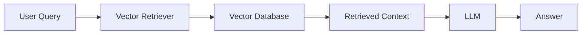

This is simple and effective for homogeneous knowledge.

However, enterprise knowledge is often heterogeneous.

---

# 3. Multi-Retriever Architecture

A more advanced system may contain:

```text
Vector Retriever
BM25 Retriever
Hybrid Retriever
SQL Retriever
Graph Retriever
Metadata Retriever
Document Retriever
```

Architecture:

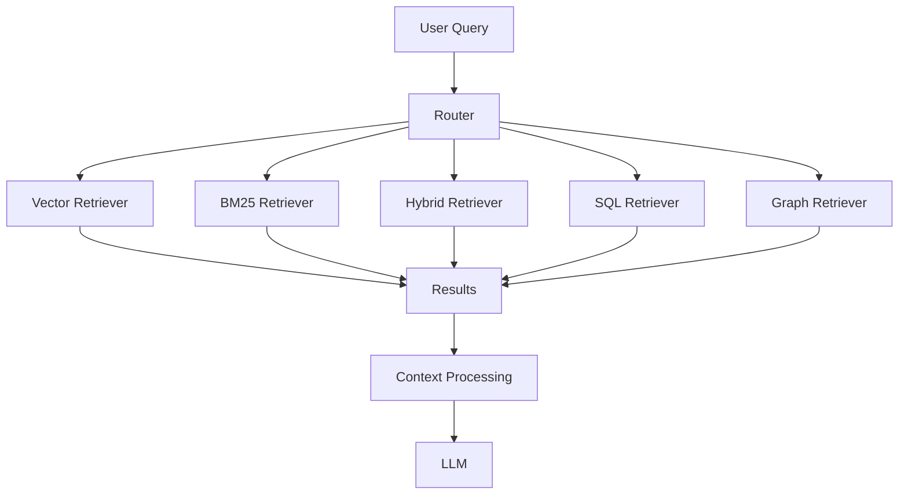

The router decides which path should handle the query.

---

# 4. Router Retriever

A Router Retriever can be viewed as:

```text
Query
 ↓
Classification
 ↓
Route
 ↓
Specialized Retriever
```

Conceptually:

```python
route = router.select(query)

retriever = retrievers[route]

results = retriever.retrieve(query)
```

The router does not necessarily retrieve documents itself.

Its primary responsibility is:

```text
Determine:
"Which retrieval capability should handle this query?"
```

---

# 5. Types of Routing

There are several routing approaches.

```text
Rule-Based Routing
        ↓
Keyword / Metadata Rules

Semantic Routing
        ↓
Embedding Similarity

LLM-Based Routing
        ↓
LLM Classification

Classifier-Based Routing
        ↓
ML Classification

Hybrid Routing
        ↓
Rules + Model + LLM
```

Each approach has different trade-offs.

---

# 6. Rule-Based Routing

The simplest router uses deterministic rules.

Example:

```python
def route_query(query: str):

    query_lower = query.lower()

    if "revenue" in query_lower:
        return "sql"

    if "dependency" in query_lower:
        return "graph"

    if "policy" in query_lower:
        return "policy"

    return "vector"
```

This is:

```text
Fast
Cheap
Deterministic
Easy to Debug
```

But it can become difficult to maintain as routing logic grows.

---

# 7. Rule-Based Routing Architecture

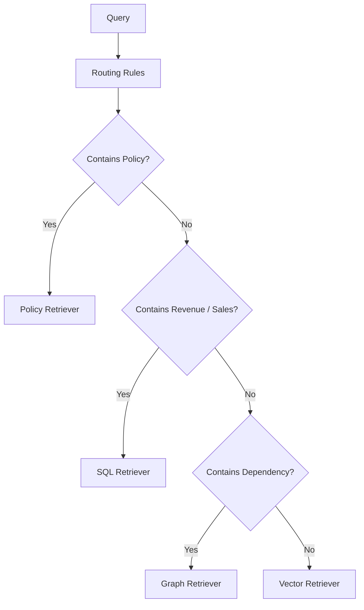

This works well when query categories are predictable.

---

# 8. Advantages of Rule-Based Routing

Advantages:

```text
Low latency
Low cost
Deterministic behavior
Easy testing
Easy auditing
Easy debugging
```

For enterprise applications, deterministic routing can be valuable for high-risk data domains.

For example:

```text
Financial Queries
        ↓
SQL Retriever
```

can be explicitly enforced.

---

# 9. Limitations of Rule-Based Routing

Keyword rules can be brittle.

For example:

```text
"What did the company earn last quarter?"
```

does not contain:

```text
revenue
```

but it is clearly a financial query.

Similarly:

```text
"Which services communicate with the payment component?"
```

may be a graph query even though it does not contain:

```text
dependency
```

This is where semantic or LLM-based routing can help.

---

# 10. Semantic Routing

Semantic routing uses embeddings to compare the query with route descriptions.

Example routes:

```text
Route A:
"Questions about technical documentation
and software concepts."

Route B:
"Questions requiring numerical business
data from databases."

Route C:
"Questions about relationships between
entities and systems."
```

The router embeds:

```text
User Query
```

and:

```text
Route Descriptions
```

Then selects the closest route.

---

# 11. Semantic Router Architecture

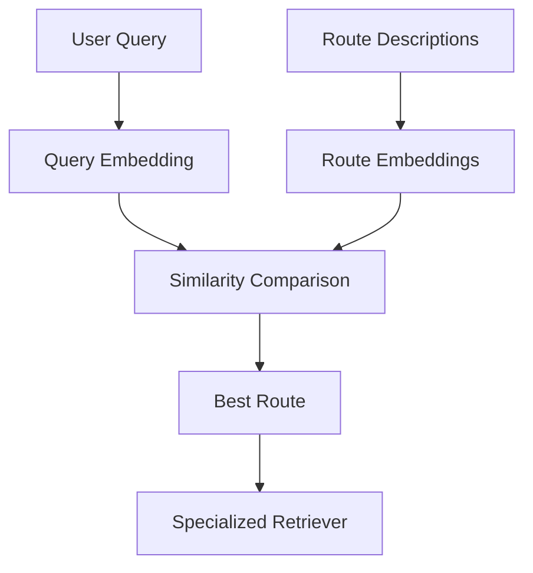

This avoids requiring exact keywords.

---

# 12. Semantic Routing Example

Suppose the available routes are:

```text
Technical Documentation
Financial Database
Enterprise Policies
Knowledge Graph
```

Query:

```text
"Which services depend on the payment API?"
```

The router may determine:

```text
Knowledge Graph
```

because the semantic meaning is about relationships.

Another query:

```text
"What was the transaction volume last month?"
```

may route to:

```text
Financial Database
```

---

# 13. Simple Semantic Router

```python
routes = {
    "technical": "technical software documentation",
    "financial": "financial business metrics and numbers",
    "policy": "enterprise policies and procedures",
    "graph": "relationships between entities and systems"
}
```

Generate embeddings:

```python
route_vectors = {
    name: embedding_model.embed_query(description)
    for name, description in routes.items()
}
```

Then:

```python
query_vector = embedding_model.embed_query(query)

route = max(
    route_vectors,
    key=lambda name:
        cosine_similarity(
            query_vector,
            route_vectors[name]
        )
)
```

This is a simplified implementation.

Production routing should also use thresholds and evaluation.

---

# 14. LLM-Based Routing

An LLM can classify the query.

Example:

```text
System:

Select the appropriate retrieval route.

Routes:
1. technical
2. financial
3. policy
4. graph
5. general

Return JSON only.
```

Query:

```text
"Which services depend on PaymentService?"
```

Output:

```json
{
  "route": "graph",
  "confidence": 0.94
}
```

The application can then invoke:

```text
Graph Retriever
```

---

# 15. Structured Router Output

A production router should avoid free-form text.

Prefer:

```json
{
  "route": "sql",
  "confidence": 0.92,
  "reason": "The query requests a numerical business metric."
}
```

Or, if reasoning should not be surfaced:

```json
{
  "route": "sql",
  "confidence": 0.92
}
```

The application should validate the output against an allowed route enumeration.

---

# 16. Router Schema

```python
from pydantic import BaseModel
from typing import Literal


class RouteDecision(BaseModel):

    route: Literal[
        "vector",
        "hybrid",
        "sql",
        "graph",
        "policy"
    ]

    confidence: float
```

Then:

```python
decision = router_llm.with_structured_output(
    RouteDecision
).invoke(query)
```

This creates a typed routing decision.

---

# 17. Why Structured Routing Matters

Without validation:

```text
LLM:
"Use the financial database because..."
```

The application must parse natural language.

With structured output:

```json
{
  "route": "sql"
}
```

the application can safely map:

```python
retriever = retrievers[decision.route]
```

This is much easier to validate and operate.

---

# 18. Router with Multiple Vector Stores

Routing does not always mean switching retrieval technologies.

It can also select among different vector stores.

Example:

```text
Technical Knowledge
        ↓
Technical Vector Store

HR Knowledge
        ↓
HR Vector Store

Legal Knowledge
        ↓
Legal Vector Store
```

Architecture:

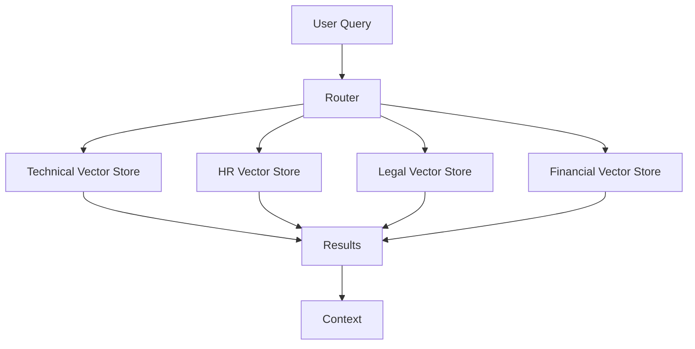

This is useful for domain isolation and governance.

---

# 19. Router with Different Retrieval Strategies

Another architecture is:

```text
Technical Query
→ Vector

Exact Error Code
→ Hybrid

Financial Metric
→ SQL

Entity Relationship
→ Graph
```

This is more powerful because the router selects **capabilities**, not merely databases.

---

# 20. Capability-Based Routing

An enterprise retrieval platform can define capabilities:

```text
SEMANTIC_SEARCH
LEXICAL_SEARCH
HYBRID_SEARCH
STRUCTURED_QUERY
GRAPH_QUERY
TEMPORAL_SEARCH
POLICY_SEARCH
```

The router maps:

```text
Query
 ↓
Required Capability
 ↓
Retriever
```

Example:

```python
capability = router.route(query)

retriever = registry.get(capability)

results = retriever.retrieve(query)
```

This architecture keeps routing independent of implementation details.

---

# 21. Retriever Registry

A registry can contain:

```python
retrievers = {
    "vector": vector_retriever,
    "hybrid": hybrid_retriever,
    "sql": sql_retriever,
    "graph": graph_retriever,
    "policy": policy_retriever
}
```

Then:

```python
route = router.route(query)

retriever = retrievers.get(route)

if retriever is None:
    raise ValueError(
        f"Unsupported route: {route}"
    )

results = retriever.retrieve(query)
```

This creates a clean extension point.

---

# 22. Router Architecture with Registry

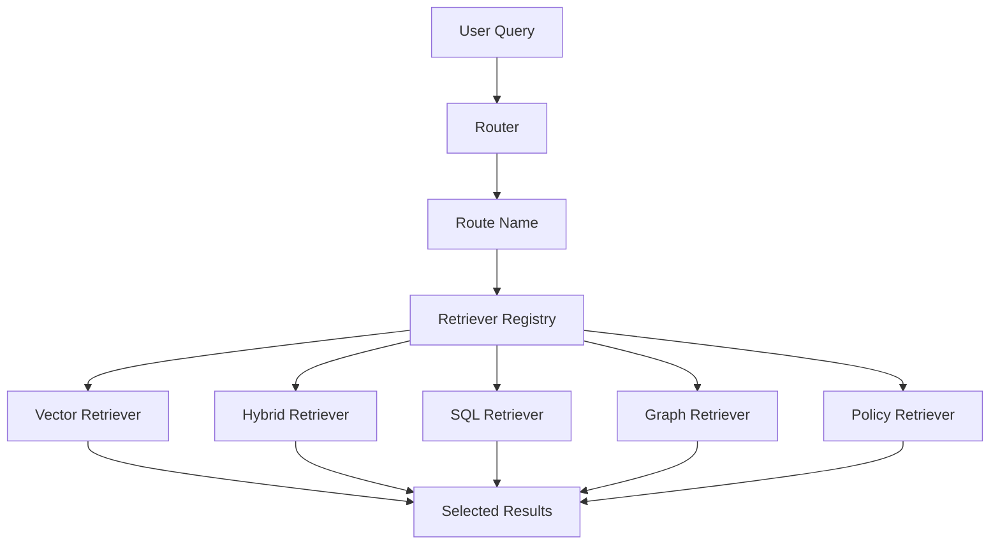

The registry decouples:

```text
Route Decision
```

from:

```text
Retriever Implementation
```

---

# 23. Router vs Ensemble Retriever

These two patterns should not be confused.

### Router

Usually selects:

```text
One or more appropriate retrieval paths
```

based on query characteristics.

```text
Query
 ↓
Router
 ↓
Retriever A
```

### Ensemble

Usually combines:

```text
Multiple retrieval signals
```

for the same query.

```text
Query
 ├── Retriever A
 ├── Retriever B
 └── Retriever C
        ↓
      Fusion
```

The distinction is:

```text
Router
→ Choose

Ensemble
→ Combine
```

---

# 24. Router vs Hybrid Search

Hybrid Search:

```text
Dense
+
Sparse
 ↓
Fusion
```

Router:

```text
Query
 ↓
Decision
 ↓
Appropriate Retriever
```

A router can actually route a query to a hybrid retriever.

```text
Technical Query
 ↓
Hybrid Retriever
```

while another query might go to:

```text
SQL Retriever
```

---

# 25. Router + Hybrid Search

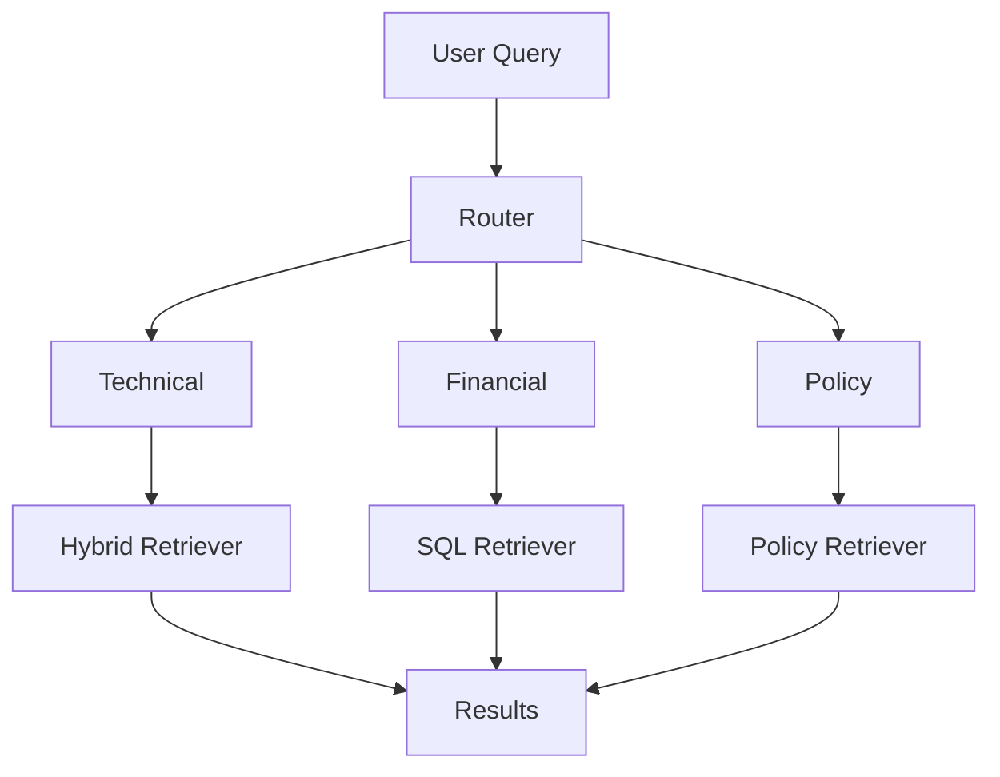

This is often a more realistic enterprise architecture.

---

# 26. Router + Time-Weighted Retrieval

A router can select a time-aware retriever for queries requiring recent information.

Example:

```text
"What is the latest deployment policy?"
```

Route:

```text
Policy + Current
```

Retrieval:

```text
Time-Weighted Policy Retriever
```

Architecture:

```text
Query
 ↓
Router
 ↓
Temporal / Policy Route
 ↓
Time-Weighted Retrieval
```

This shows that routing can select specialized combinations of retrieval capabilities.

---

# 27. Router + Reranking

The router should generally select the candidate-generation strategy.

Then reranking can be shared:

```text
Query
 ↓
Router
 ↓
Selected Retriever
 ↓
Candidate Documents
 ↓
Shared Reranker
 ↓
Top-K
```

Architecture:

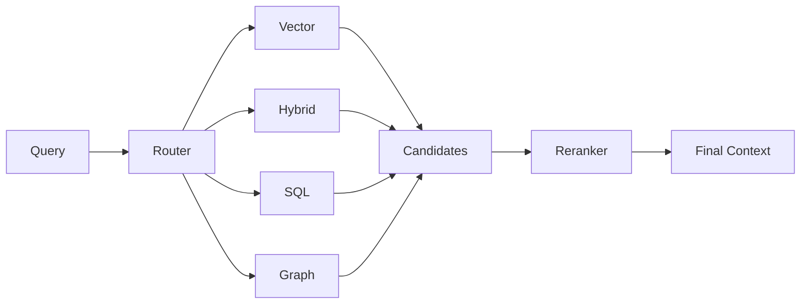

This avoids duplicating ranking logic across every retriever.

---

# 28. Router + Contextual Compression

After routing:

```text
Selected Retriever
 ↓
Candidate Documents
 ↓
Contextual Compression
 ↓
Context
```

Architecture:

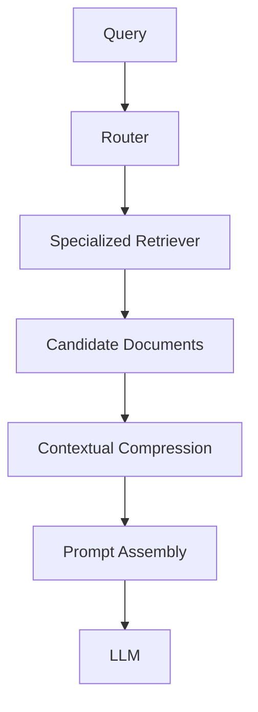

The compression layer can remain common across routes.

---

# 29. Router + SQL RAG

SQL queries require structured reasoning.

Example:

```text
"What was revenue by region in Q2?"
```

Routing:

```text
Query
 ↓
Router
 ↓
SQL
 ↓
Text-to-SQL
 ↓
Database
 ↓
Results
```

Architecture:

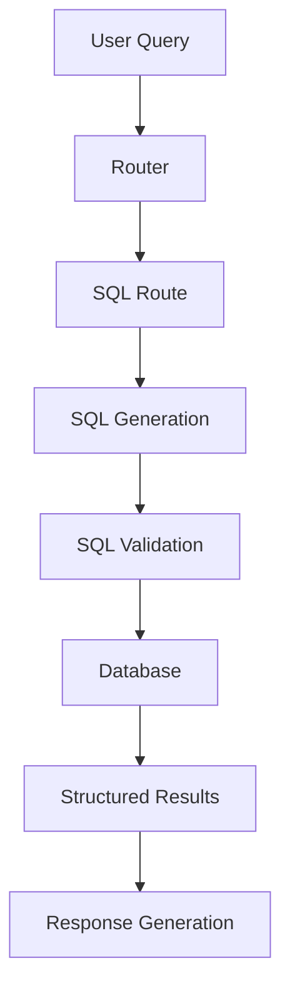

The router should not merely classify the query; the SQL path should still enforce:

```text
Schema Constraints
Authorization
Read-Only Controls
Query Validation
```

---

# 30. Router + Graph RAG

Graph questions often ask about relationships.

Example:

```text
"Which services depend on PaymentService?"
```

Routing:

```text
Query
 ↓
Router
 ↓
Graph
 ↓
Graph Query
 ↓
Graph Database
```

Architecture:

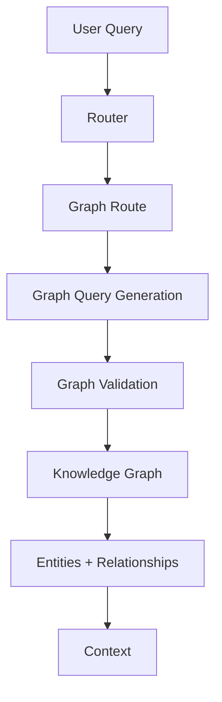

This prevents forcing relationship-heavy questions through ordinary vector retrieval.

---

# 31. Router + Multi-Vector Retrieval

A router can choose Multi-Vector Retrieval for document-heavy queries.

```text
Query
 ↓
Router
 ↓
Multi-Vector Retriever
 ↓
Representation Search
 ↓
Parent Resolution
 ↓
Documents
```

This is useful when the corpus contains:

```text
Summaries
Tables
Images
Chunks
Parent Documents
```

represented through multiple vectors.

---

# 32. Router + Hybrid + Graph + SQL

A mature enterprise retrieval platform can expose several retrieval capabilities:

```text
                 Query
                   │
                   ↓
                Router
                   │
       ┌───────────┼───────────┬───────────┐
       ↓           ↓           ↓           ↓
    Hybrid       Vector        SQL        Graph
       │           │           │           │
       └───────────┴───────────┴───────────┘
                       │
                    Results
                       ↓
                   Reranker
                       ↓
                  Context
```

This is the foundation of a heterogeneous enterprise retrieval platform.

---

# 33. Single Route vs Multiple Routes

A router does not always need to select exactly one retriever.

Some queries require multiple sources.

Example:

```text
"What changed in the payment service
and what was the resulting transaction impact?"
```

Potential routes:

```text
Technical Documentation
+
Financial Database
```

The router could return:

```json
{
  "routes": [
    "technical",
    "sql"
  ]
}
```

The application then executes both.

---

# 34. Multi-Route Architecture

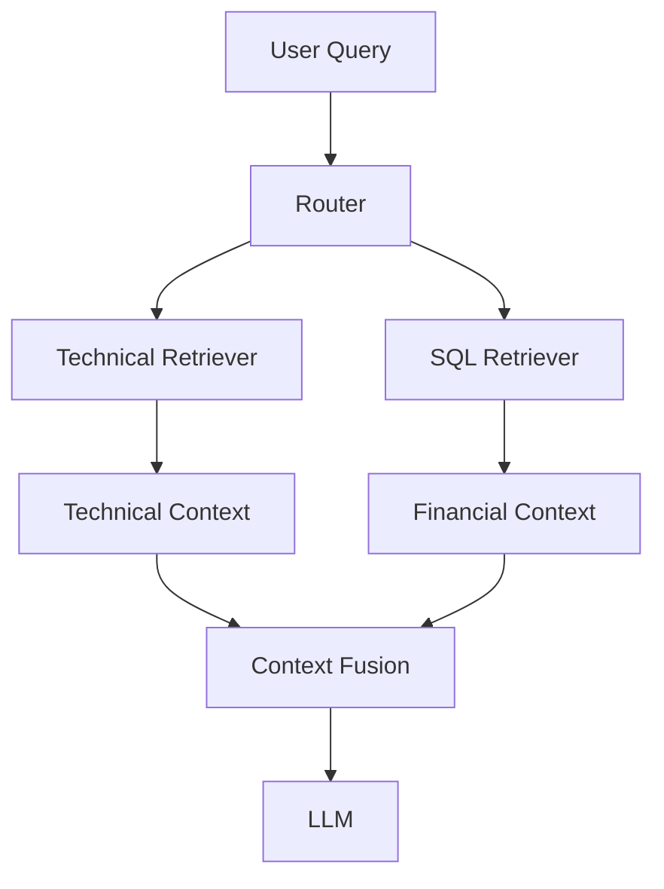

This becomes a retrieval orchestration problem rather than simple classification.

---

# 35. Parallel Multi-Route Retrieval

When multiple routes are selected, retrieval can happen concurrently.

```python
from concurrent.futures import ThreadPoolExecutor


def retrieve_from_routes(
    query,
    selected_routes,
    registry
):

    with ThreadPoolExecutor(
        max_workers=len(selected_routes)
    ) as executor:

        futures = [
            executor.submit(
                registry[route].retrieve,
                query
            )
            for route in selected_routes
        ]

        return [
            future.result()
            for future in futures
        ]
```

The final stage can then:

```text
Merge
 ↓
Deduplicate
 ↓
Rerank
 ↓
Select Context
```

---

# 36. Query Decomposition

Multi-route retrieval becomes more powerful when the query is decomposed.

Example:

```text
"What changed in the payment API
and how did it affect transaction volume?"
```

Decompose into:

```text
Question 1:
"What changed in the payment API?"
→ Technical Retriever

Question 2:
"How did transaction volume change?"
→ SQL Retriever
```

Architecture:

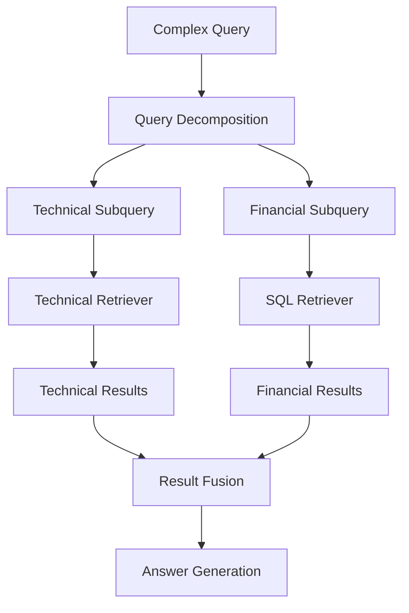

This moves toward more advanced agentic retrieval patterns.

---

# 37. Router Confidence

A router should ideally provide a confidence signal.

Example:

```json
{
  "route": "hybrid",
  "confidence": 0.91
}
```

Then:

```python
if decision.confidence < 0.70:
    route = "general"
```

This allows uncertain queries to use a safer fallback.

---

# 38. Confidence Thresholds

Example:

```text
Confidence >= 0.90
        ↓
Execute selected route

0.70 - 0.89
        ↓
Execute route + fallback candidate

< 0.70
        ↓
General / Hybrid Retrieval
```

These values are illustrative.

Thresholds should be determined through evaluation.

---

# 39. Fallback Routing

A production router should never assume perfect classification.

Architecture:

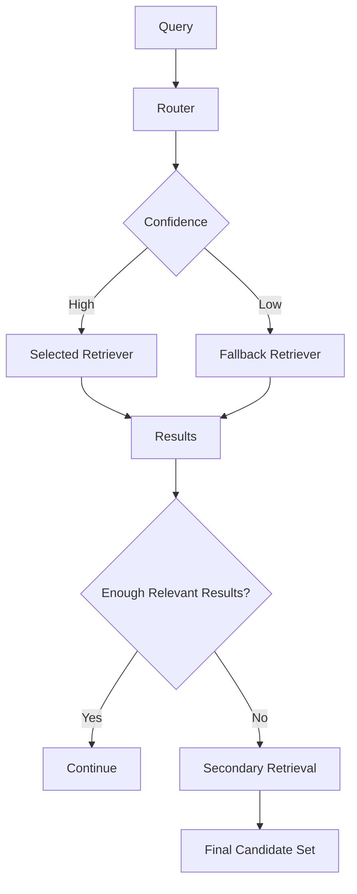

Common fallback:

```text
Hybrid Search
```

because it provides both semantic and lexical retrieval.

---

# 40. Router Failure Handling

Possible failures include:

```text
Invalid Route
Low Confidence
Retriever Unavailable
Timeout
No Results
Permission Denied
Malformed Structured Output
```

Each should have explicit behavior.

Example:

```python
try:

    decision = router.route(query)

    retriever = registry[decision.route]

    results = retriever.retrieve(query)

except Exception:

    results = fallback_retriever.retrieve(query)
```

Production systems should use more granular exception handling than this simplified example.

---

# 41. Retriever Availability

A route may be unavailable.

For example:

```text
Graph Database
     ↓
Unavailable
```

The router can fall back:

```text
Graph
 ↓
Vector / Hybrid
```

However, the system should be careful not to silently produce an answer that implies graph-level certainty when the graph source was unavailable.

The final response should reflect the actual evidence used.

---

# 42. Security-Aware Routing

Routing is also a security boundary.

Consider:

```text
User Query
 ↓
Router
 ↓
SQL Retriever
```

The SQL route must enforce:

```text
User Permissions
Database Permissions
Row-Level Security
Tenant Isolation
Allowed Tables
Read-Only Access
```

Likewise:

```text
Graph Retriever
```

must enforce graph-level access controls.

Routing should never bypass authorization.

---

# 43. Tenant-Aware Routing

In multi-tenant systems:

```text
Tenant A
 ↓
Tenant A Knowledge

Tenant B
 ↓
Tenant B Knowledge
```

The route selection should be combined with tenant context.

```text
User
+
Tenant
+
Query
 ↓
Router
 ↓
Authorized Retriever
```

This ensures retrieval remains isolated.

---

# 44. Domain Routing

A common enterprise architecture is:

```text
                    Enterprise AI
                          │
                        Router
                          │
        ┌─────────────────┼─────────────────┐
        ↓                 ↓                 ↓
    Engineering          HR             Finance
        │                 │                 │
        ↓                 ↓                 ↓
     Vector            Policy              SQL
```

Each domain can maintain:

```text
Own Data
Own Metadata
Own Security Rules
Own Retrieval Strategy
```

while the application exposes one unified AI interface.

---

# 45. Router as an Orchestration Layer

The router can become more than a classifier.

It can manage:

```text
Route Selection
Retriever Selection
Fallback
Parallel Execution
Result Fusion
Reranking
Context Selection
```

Architecture:

```text
User Query
     ↓
Retrieval Router
     ↓
Route Planning
     ↓
Retriever Execution
     ↓
Result Fusion
     ↓
Reranking
     ↓
Context Engineering
```

At this point, the router begins to resemble a retrieval orchestration component.

---

# 46. Router vs Agentic Retrieval

These concepts should remain distinct.

### Router

Usually performs:

```text
Classification
+
Route Selection
```

### Agentic Retrieval

Can perform:

```text
Planning
+
Tool Selection
+
Iterative Retrieval
+
Observation
+
Replanning
```

Therefore:

```text
Router
→ Which retriever?

Agentic Retrieval
→ What should I retrieve,
  in what order,
  and should I retrieve again?
```

Agentic Retrieval is covered later in this module.

---

# 47. Router + Agentic Retrieval

A router can still be the first stage:

```text
Query
 ↓
Router
 ↓
Agentic Retrieval
 ↓
Iterative Search
```

For example:

```text
Query
 ↓
Technical Route
 ↓
Agentic Technical Retriever
 ↓
Search Documentation
 ↓
Inspect Results
 ↓
Search Again
```

This provides a clean progression from:

```text
Static Routing
```

to:

```text
Dynamic Retrieval Planning
```

---

# 48. Router Prompt Design

An LLM router prompt should clearly define available routes.

Example:

```python
ROUTER_PROMPT = """
You are a retrieval router.

Available routes:

- vector:
  General semantic document retrieval.

- hybrid:
  Queries requiring semantic and exact-term retrieval.

- sql:
  Questions requiring structured numerical or
  relational database information.

- graph:
  Questions involving relationships between entities.

- policy:
  Enterprise policy and procedure questions.

Select the best route for the user query.

Return structured output only.

Query:
{query}
"""
```

Clear route descriptions reduce ambiguity.

---

# 49. Route Descriptions Should Be Distinct

Poor descriptions:

```text
Route A:
Documents

Route B:
Other documents

Route C:
More documents
```

Better:

```text
technical:
Software engineering documentation,
architecture, APIs, deployment and operations.

sql:
Structured business metrics, transactions,
aggregations and numerical reporting.

graph:
Entity relationships, dependencies,
connections and traversals.
```

The router needs meaningful boundaries.

---

# 50. Route Registry Metadata

A production route registry can contain:

```python
routes = {
    "technical": {
        "description": "Software engineering documentation",
        "retriever": technical_retriever
    },

    "financial": {
        "description": "Financial metrics and reporting",
        "retriever": sql_retriever
    },

    "graph": {
        "description": "Entity relationships and dependencies",
        "retriever": graph_retriever
    }
}
```

This allows routing configuration to remain centralized.

---

# 51. Configuration-Driven Router

Example:

```yaml
retrieval_router:

  default_route: hybrid

  routes:

    technical:
      retriever: vector
      collection: technical-docs

    policy:
      retriever: time-weighted
      collection: policies

    financial:
      retriever: sql
      database: finance

    graph:
      retriever: graph
      database: enterprise-graph

  fallback:
    route: hybrid

  confidence_threshold: 0.75
```

This makes routing behavior configurable.

---

# 52. Router Observability

A production router should record:

```text
Original Query
Selected Route
Confidence
Routing Latency
Retriever Used
Fallback Triggered
Retriever Latency
Result Count
Final Result Count
```

Example:

```json
{
  "query": "Which services depend on PaymentService?",
  "route": "graph",
  "confidence": 0.94,
  "routing_latency_ms": 22,
  "fallback": false,
  "result_count": 14
}
```

This allows operators to answer:

```text
Why did this query go to this retriever?
```

---

# 53. Routing Metrics

Useful routing metrics include:

```text
Route Accuracy
Fallback Rate
Low-Confidence Rate
Route Latency
Route Distribution
No-Result Rate
Incorrect-Route Rate
```

For example:

```text
Technical:
42%

Hybrid:
28%

SQL:
15%

Graph:
10%

Policy:
5%
```

An unexpected distribution may indicate:

```text
Poor classifier
Poor route definitions
Unexpected query patterns
```

---

# 54. Routing Evaluation Dataset

Create labeled queries:

| Query | Expected Route |
|---|---|
| How does OAuth work? | Vector |
| What is AUTH-401? | Hybrid |
| What was revenue in Q2? | SQL |
| Which services depend on PaymentService? | Graph |
| What is the current leave policy? | Policy |

Then evaluate:

```text
Expected Route
       vs
Predicted Route
```

---

# 55. Confusion Matrix

A router can be evaluated using a confusion matrix.

```text
                 Predicted
             V    H    S    G    P

Actual V     ✓    ?    ✗    ✗    ?

Actual H     ?    ✓    ✗    ✗    ?

Actual S     ✗    ✗    ✓    ?    ✗

Actual G     ✗    ✗    ?    ✓    ?

Actual P     ?    ?    ✗    ?    ✓
```

This identifies problematic route boundaries.

For example:

```text
Hybrid
   ↔
Vector
```

may be frequently confused.

---

# 56. Routing Accuracy Is Not Enough

Suppose:

```text
Router Accuracy = 95%
```

That sounds excellent.

But if the remaining 5% are:

```text
Financial queries
```

with sensitive or business-critical consequences, the risk may still be unacceptable.

Therefore evaluate:

```text
Route Accuracy
+
Business Impact
+
Retrieval Quality
+
Answer Quality
```

---

# 57. End-to-End Evaluation

The final evaluation should measure:

```text
Query
 ↓
Router
 ↓
Retriever
 ↓
Context
 ↓
LLM
 ↓
Answer
```

Metrics:

```text
Routing Accuracy
Retrieval Recall
Context Relevance
Answer Correctness
Faithfulness
Citation Accuracy
Latency
Cost
```

This provides a complete view of router effectiveness.

---

# 58. Router Cost

Different routes have different costs.

Example:

```text
Vector
→ Low

Hybrid
→ Medium

SQL
→ Medium

Graph
→ Medium

LLM-based Agentic Retrieval
→ High
```

The router therefore also becomes a cost-management mechanism.

A simple query should not necessarily trigger an expensive multi-stage retrieval workflow.

---

# 59. Latency-Aware Routing

A router can consider latency requirements.

For example:

```text
Simple Query
 ↓
Fast Vector Retrieval
```

while:

```text
Complex Research Query
 ↓
Multi-Stage Retrieval
```

This creates:

```text
Query Complexity
       ↓
Retrieval Strategy
       ↓
Latency / Quality Trade-off
```

---

# 60. Cost-Aware Routing

Conceptually:

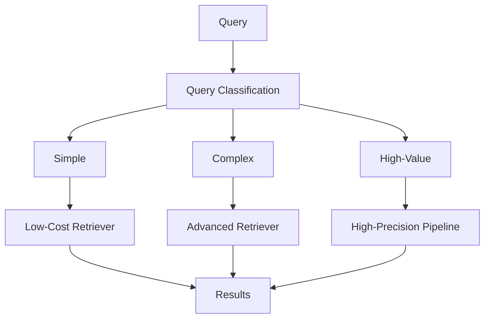

This can help control enterprise RAG operating costs.

---

# 61. Dynamic Route Escalation

Instead of starting with an expensive retriever:

```text
Query
 ↓
Fast Retriever
 ↓
Enough Relevant Results?
```

If yes:

```text
Return
```

If no:

```text
Escalate
 ↓
Hybrid
 ↓
Reranking
```

Architecture:

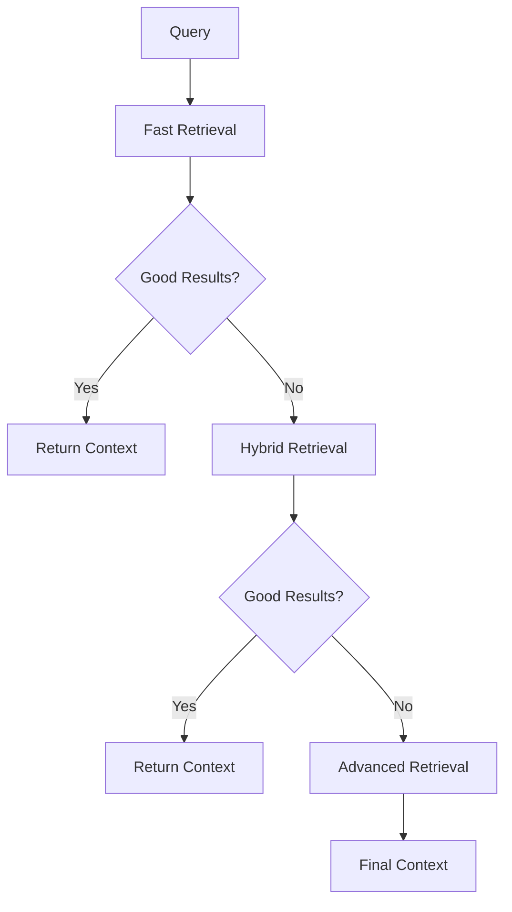

This is an important bridge toward multi-stage retrieval.

---

# 62. Router + Multi-Stage Retrieval

A router can select the initial retrieval pipeline.

Then the pipeline can escalate:

```text
Route
 ↓
Stage 1
 ↓
Quality Check
 ↓
Stage 2
 ↓
Quality Check
 ↓
Stage 3
```

For example:

```text
Vector
 ↓
Hybrid
 ↓
Reranker
 ↓
Agentic Retrieval
```

This provides adaptive retrieval depth.

---

# 63. Production Architecture

A mature enterprise router architecture can look like:

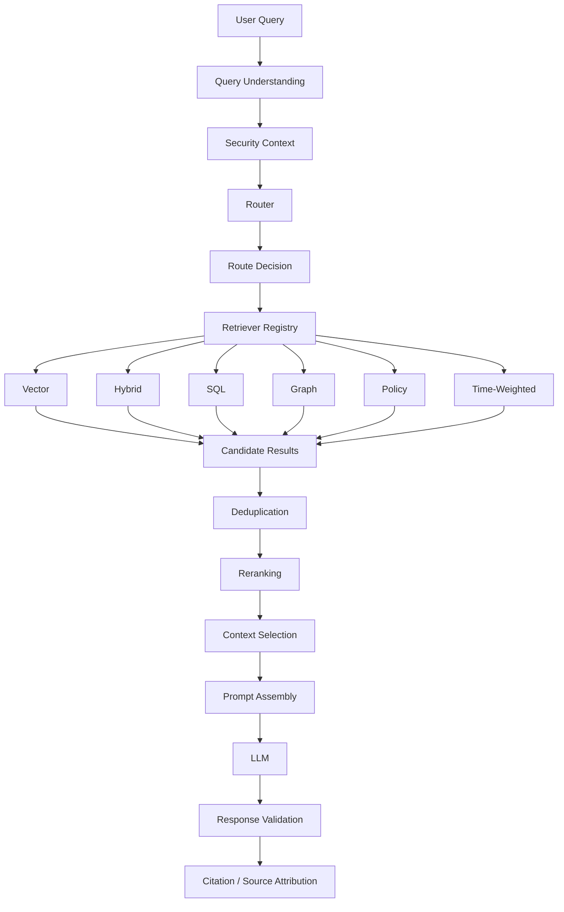

This creates a reusable enterprise retrieval platform.

---

# 64. Framework-Agnostic Design

The router should be independent from LangChain, LlamaIndex, or a specific vector database.

Define:

```python
class Retriever:

    def retrieve(
        self,
        query: str
    ):
        raise NotImplementedError
```

Then:

```python
class Router:

    def route(
        self,
        query: str
    ) -> str:
        raise NotImplementedError
```

And:

```python
class RetrievalOrchestrator:

    def __init__(
        self,
        router,
        retriever_registry
    ):
        self.router = router
        self.registry = retriever_registry

    def retrieve(self, query):

        route = self.router.route(query)

        retriever = self.registry[route]

        return retriever.retrieve(query)
```

This separation keeps the architecture portable.

---

# 65. Ports & Adapters Architecture

A production enterprise implementation can use:

```text
                  Application
                       │
                       ↓
             Retrieval Orchestrator
                       │
             ┌─────────┴─────────┐
             ↓                   ↓
          Router            Retriever Port
             │                   │
             ↓                   ↓
       Router Adapter      Retriever Adapters
                                 │
             ┌───────────────────┼─────────────────┐
             ↓                   ↓                 ↓
         Vector Adapter     SQL Adapter       Graph Adapter
```

The application should depend on capabilities rather than framework classes.

---

# 66. Example Capability Interfaces

```python
class SemanticRetriever:
    def retrieve(self, query, top_k):
        ...


class HybridRetriever:
    def retrieve(self, query, top_k):
        ...


class StructuredRetriever:
    def retrieve(self, query):
        ...


class GraphRetriever:
    def retrieve(self, query):
        ...
```

The router selects a capability.

This makes it possible to implement the capability using:

```text
LangChain
LlamaIndex
Native SDK
Custom Retrieval Engine
```

without changing the application contract.

---

# 67. Testing Strategy

### Unit Tests

Test:

```text
Route selection
Confidence thresholds
Fallback logic
Registry lookup
Invalid routes
```

### Integration Tests

Test:

```text
Router
Retriever
Vector Store
SQL Database
Graph Database
```

### Evaluation Tests

Test:

```text
Routing accuracy
Retrieval quality
Answer quality
```

### Security Tests

Test:

```text
Tenant isolation
Unauthorized routes
Restricted data
SQL permissions
Graph permissions
```

---

# 68. Example Router Test

```python
def test_financial_query_routes_to_sql():

    query = "What was revenue in Q2?"

    decision = router.route(query)

    assert decision.route == "sql"
```

Another:

```python
def test_dependency_query_routes_to_graph():

    query = (
        "Which services depend on PaymentService?"
    )

    decision = router.route(query)

    assert decision.route == "graph"
```

---

# 69. Common Failure Modes

## 69.1 Ambiguous Routes

If two route descriptions overlap heavily:

```text
technical
vs
hybrid
```

the router may behave unpredictably.

---

## 69.2 Incorrect Classification

The router sends:

```text
Financial Query
```

to:

```text
Vector Retriever
```

instead of:

```text
SQL Retriever
```

---

## 69.3 Over-Routing

Every query triggers a complex route-selection process.

This increases:

```text
Latency
Cost
Complexity
```

---

## 69.4 Under-Routing

Everything goes to:

```text
Default Vector Retriever
```

which defeats the purpose of routing.

---

## 69.5 Poor Fallback

A routing failure produces:

```text
No Answer
```

instead of:

```text
Fallback Retrieval
```

---

## 69.6 Security Bypass

Routing accidentally exposes a retriever to data the user is not authorized to access.

This is a critical production failure.

---

## 69.7 Route Explosion

Too many routes create:

```text
Complexity ↑
Classification Difficulty ↑
Maintenance Cost ↑
```

Start with meaningful capability boundaries.

---

# 70. Route Granularity

Avoid creating routes such as:

```text
oauth
kubernetes
docker
spring
python
java
...
```

unless there is a strong architectural reason.

Prefer capability or domain boundaries:

```text
Engineering
Finance
HR
Legal
Graph
Structured Data
```

A route should represent a meaningful retrieval strategy.

---

# 71. Default Route

A production router should usually have a default route.

Example:

```yaml
retrieval_router:
  default_route: hybrid
```

Why?

Because not every query will be confidently classified.

The default route can provide:

```text
Reasonable Recall
Semantic Search
Exact-Term Search
```

Hybrid retrieval is often a useful general fallback.

---

# 72. Router Decision Hierarchy

A robust architecture can use:

```text
1. Security / Access Rules
        ↓
2. Explicit Metadata Constraints
        ↓
3. Deterministic Routing Rules
        ↓
4. Semantic / LLM Routing
        ↓
5. Confidence Check
        ↓
6. Fallback Route
```

This creates a hierarchy where deterministic constraints can override probabilistic decisions.

---

# 73. Example Enterprise Decision Flow

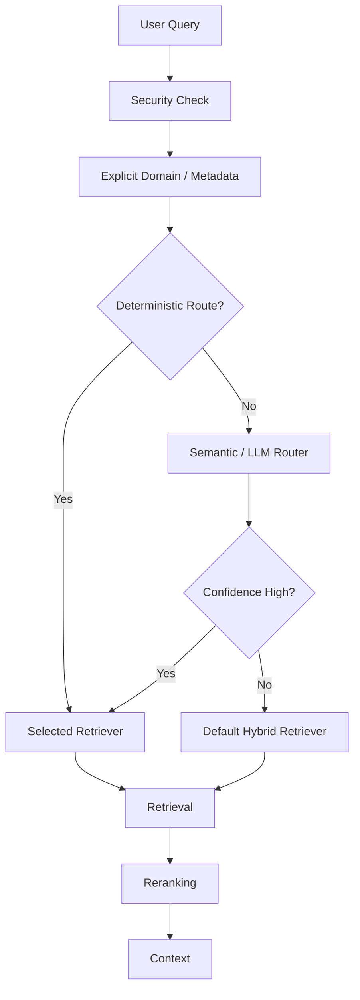

This is generally safer than allowing an LLM to make every retrieval decision.

---

# 74. When to Use Router Retrieval

Router retrieval is useful when:

- Multiple knowledge domains exist
- Different retrieval strategies are required
- Structured and unstructured data coexist
- Multiple vector stores exist
- Graph and SQL sources coexist with documents
- Different security boundaries exist
- Retrieval strategies have different latency/cost profiles
- Queries have distinct semantic categories

Typical applications:

```text
Enterprise Knowledge Platforms
Enterprise Copilots
Financial Assistants
Developer Assistants
Research Systems
Customer Support Platforms
Internal AI Portals
Multi-Domain RAG Systems
```

---

# 75. When Router Retrieval May Not Be Necessary

Do not introduce a router when:

```text
There is only one knowledge source
```

or:

```text
One retriever consistently performs well
```

or:

```text
The query distribution is very homogeneous
```

or:

```text
Routing complexity exceeds its benefits
```

A simple retriever is often better than an unnecessarily complicated architecture.

---

# 76. Recommended Enterprise Pattern

A practical enterprise architecture is:

```text
User Query
    ↓
Security / Tenant Context
    ↓
Query Understanding
    ↓
Router
    ↓
Retriever Registry
    ↓
Selected Retrieval Strategy
    ↓
Candidate Documents
    ↓
Reranking
    ↓
Context Selection
    ↓
Prompt Assembly
    ↓
LLM
    ↓
Response Validation
    ↓
Citation / Source Attribution
```

The router provides:

```text
Capability Selection
```

while the retrievers provide:

```text
Information Retrieval
```

and the downstream RAG pipeline provides:

```text
Context Engineering
+
Generation
+
Validation
```

---

# 77. Production Checklist

Before deploying a Router Retriever:

```text
☐ Route definitions are clearly separated
☐ Each route has a specific purpose
☐ Retriever capabilities are documented
☐ Default route exists
☐ Routing confidence is measured
☐ Low-confidence fallback exists
☐ Invalid routes are rejected
☐ Retriever registry is centralized
☐ Security checks occur before retrieval
☐ Tenant isolation is enforced
☐ Structured router output is validated
☐ SQL routes enforce database security
☐ Graph routes enforce graph security
☐ Multiple-route execution is controlled
☐ Retrieval timeouts are configured
☐ Route latency is observable
☐ Route distribution is monitored
☐ Routing accuracy is evaluated
☐ Retrieval quality is evaluated
☐ End-to-end answer quality is evaluated
☐ Cost per route is measured
☐ Fallback rate is monitored
☐ Regression tests cover route boundaries
☐ Route count is kept manageable
```

---

# 78. Key Takeaways

- A **Router Retriever** selects the most appropriate retrieval strategy for a query.
- Routing is useful when enterprise systems contain heterogeneous knowledge sources.
- A router can select different vector stores, retrieval algorithms, databases, or knowledge systems.
- Rule-based routing is fast, deterministic, and easy to audit.
- Semantic routing uses embeddings to match queries with route descriptions.
- LLM-based routing can understand more complex query intent.
- Structured outputs make LLM routing safer and easier to integrate.
- A retriever registry decouples route selection from retriever implementation.
- Router and Ensemble Retriever solve different problems.
- Router means **choose**; Ensemble means **combine**.
- Hybrid Search can itself be one of the routes.
- SQL RAG and Graph RAG are natural candidates for specialized routes.
- Multiple routes can be selected for complex queries.
- Query decomposition can enable multi-route retrieval.
- Confidence thresholds and fallback routes are important for production reliability.
- Security and tenant isolation must be enforced independently of routing decisions.
- Router observability should capture route, confidence, latency, fallback, and retrieval outcomes.
- Routing accuracy alone is insufficient; end-to-end retrieval and answer quality must also be evaluated.
- Too many routes create unnecessary complexity.
- A default route provides resilience for ambiguous queries.
- Routing can become a foundation for more advanced multi-stage and agentic retrieval systems.
- The router should select **capabilities**, not expose framework-specific implementation details.

The central pattern is:

```text
Understand the Query
        ↓
Select the Right Capability
        ↓
Execute Specialized Retrieval
        ↓
Rank the Evidence
        ↓
Build Context
        ↓
Generate a Grounded Answer
```

Or simply:

```text
Different Questions
        ↓
Different Retrieval Strategies
        ↓
Smart Routing
        ↓
Better Enterprise RAG
```

---

# 🧭 Chapter Navigation

### Part V — Advanced Retrieval-Augmented Generation

**Previous:**  
[06. HyDE Retriever](06-hyde-retriever.md)

**Next:**  
[08. Multi-Stage Retrieval](08-multi-stage-retrieval.md)

**Section:**  
02 — Enterprise Retrieval Engineering

### Enterprise Retrieval Engineering Path

```text
01 Contextual Compression Retriever
              ↓
02 Ensemble Retriever
              ↓
03 Multi-Vector Retriever
              ↓
04 Time-Weighted Retriever
              ↓
05 Hybrid Search Retriever
              ↓
06 HyDE Retriever
              ↓
07 Router Retriever
              ↓
08 Multi-Stage Retrieval
              ↓
09 Agentic Retrieval
              ↓
10 Re-ranking Techniques
              ↓
11 MMR & Diversity-Aware Retrieval
              ↓
12 Metadata-Aware Retrieval
              ↓
13 Advanced Query Rewriting
```

---

> **Enterprise AI Engineering Handbook**  
> *Building Production-Grade Enterprise AI Systems — One Chapter at a Time.*