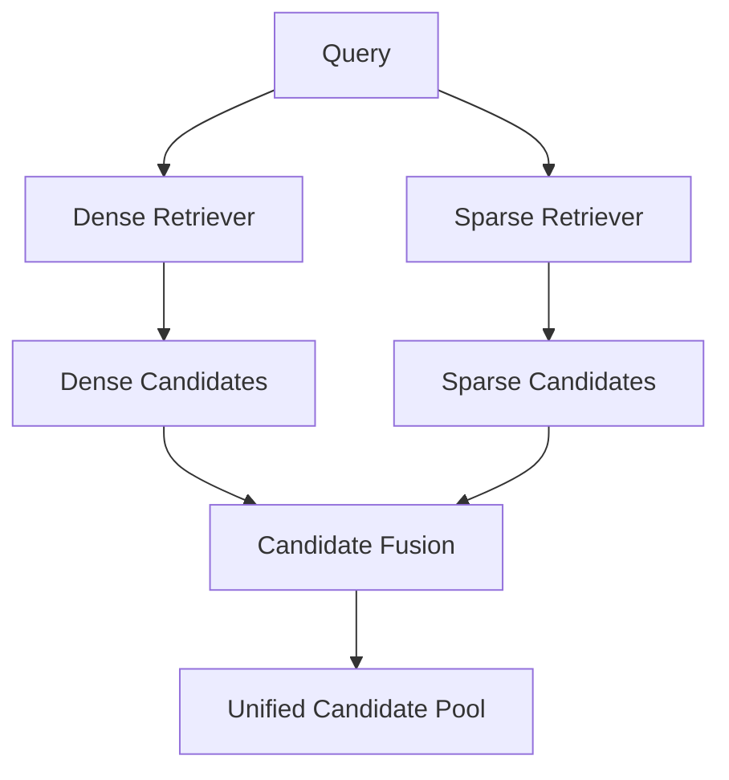
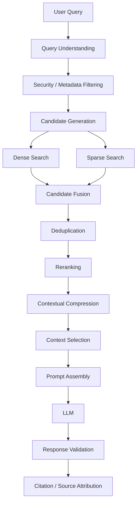
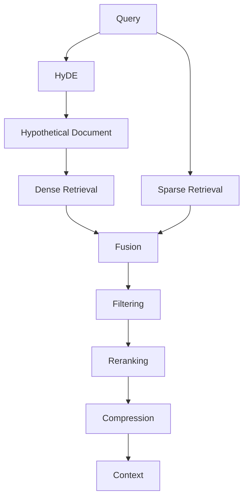
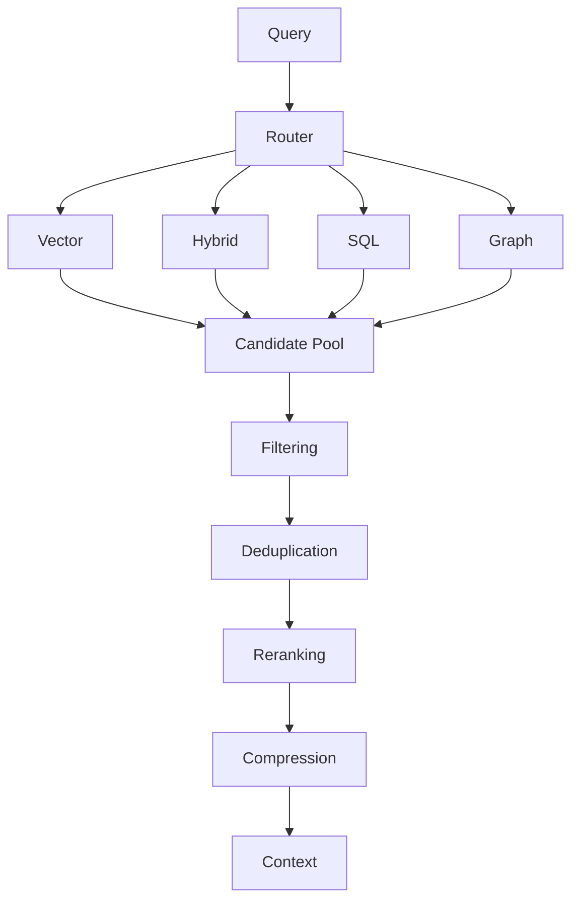
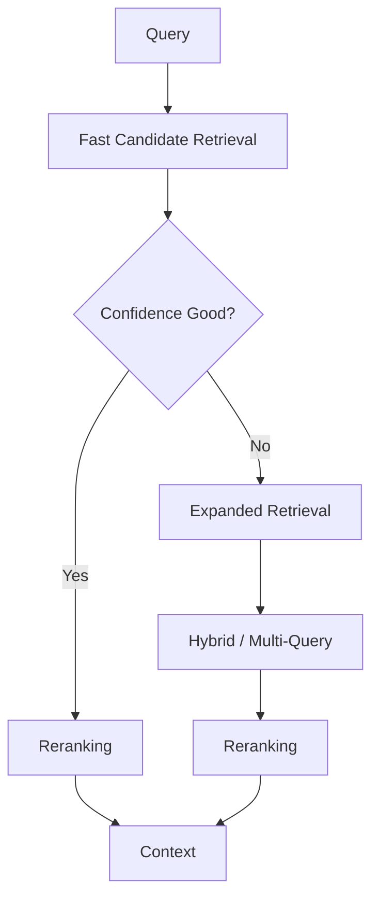
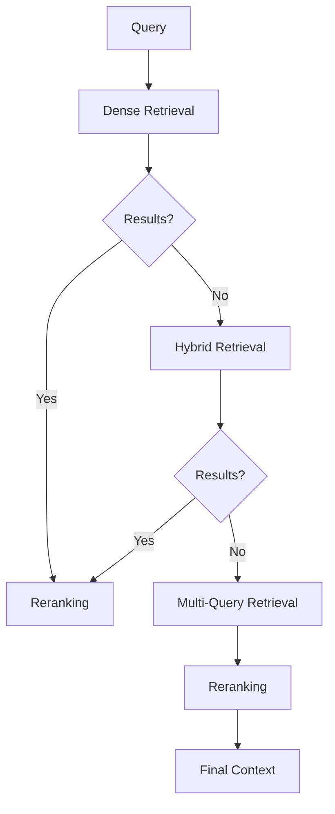
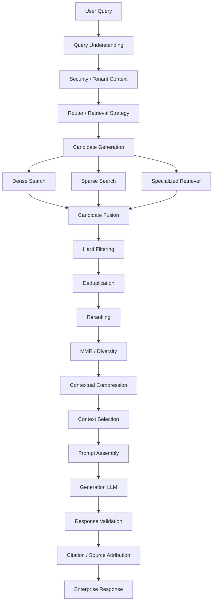
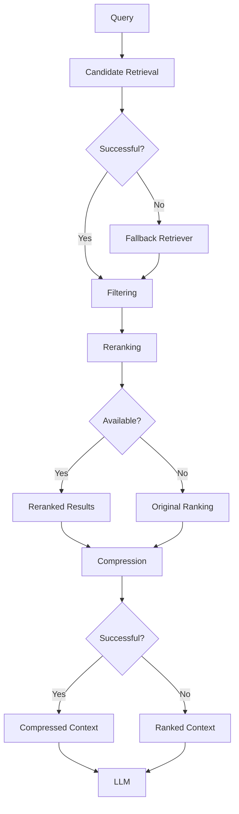

# Multi-Stage Retrieval

## 📖 Overview

**Multi-Stage Retrieval** is an advanced retrieval architecture in which documents are retrieved, filtered, scored, reranked, compressed, or refined through multiple sequential stages rather than relying on a single retrieval operation.

A basic retriever often follows:

```text
Query
  ↓
Vector Search
  ↓
Top-K Documents
```

A production retrieval pipeline may instead use:

```text
Query
  ↓
Stage 1 — Candidate Generation
  ↓
Stage 2 — Filtering / Deduplication
  ↓
Stage 3 — Reranking
  ↓
Stage 4 — Contextual Compression
  ↓
Stage 5 — Context Selection
  ↓
LLM
```

The core principle is:

> **Use inexpensive retrieval techniques to generate a broad candidate set, then progressively apply more expensive and precise techniques to produce a small, high-quality evidence set.**

This architecture provides a practical balance between:

```text
Recall
+
Precision
+
Latency
+
Cost
```

---

## 🎯 Learning Objectives

After completing this chapter, you will be able to:

- Understand multi-stage retrieval architecture
- Explain why a single retrieval stage may not be sufficient
- Design candidate-generation stages
- Design filtering and deduplication stages
- Apply reranking as a second-stage retrieval operation
- Apply contextual compression
- Select the final context for generation
- Combine dense and sparse retrieval
- Design multi-stage hybrid retrieval
- Understand early filtering and late filtering
- Implement multi-stage retrieval using Python
- Understand LangChain-style retrieval composition
- Combine multiple retrievers with rerankers
- Design fallback and escalation strategies
- Optimize retrieval latency and cost
- Evaluate each stage independently
- Build production-oriented multi-stage retrieval pipelines

---

# 1. Why Multi-Stage Retrieval?

A single retrieval method has competing objectives.

Suppose we retrieve:

```text
Top-K = 5
```

If K is too small:

```text
Recall ↓
```

Important documents may never enter the candidate set.

If K is too large:

```text
Noise ↑
Latency ↑
Reranking Cost ↑
Context Size ↑
```

Multi-stage retrieval solves this by separating:

```text
Candidate Recall
```

from:

```text
Final Precision
```

---

# 2. Candidate Generation vs Final Selection

This distinction is fundamental.

### Candidate Generation

Goal:

```text
Find as many potentially relevant documents
as possible.
```

Optimize for:

```text
Recall
```

### Final Selection

Goal:

```text
Keep only the most relevant documents.
```

Optimize for:

```text
Precision
```

Therefore:

```text
Candidate Generation
        ↓
Broad
Fast
High Recall

Final Selection
        ↓
Narrow
More Expensive
High Precision
```

---

# 3. Basic Retrieval

A traditional RAG system may use:


For example:

```python
documents = vector_store.similarity_search(
    query,
    k=5
)
```

This is simple.

But it places all retrieval responsibility on one operation.

---

# 4. Multi-Stage Retrieval

A multi-stage system separates retrieval into stages.


Each stage progressively reduces the candidate set.

Example:

```text
10,000 documents
      ↓
Candidate Retrieval
      ↓
200 candidates
      ↓
Filtering
      ↓
100 candidates
      ↓
Reranking
      ↓
20 candidates
      ↓
Compression
      ↓
8 final passages
      ↓
LLM
```

---

# 5. The Funnel Model

Multi-stage retrieval can be visualized as a funnel:

```text
                    1,000,000 Documents
                           │
                           ▼
                 ┌──────────────────┐
                 │ Candidate Search │
                 └──────────────────┘
                           │
                           ▼
                      1,000 Docs
                           │
                           ▼
                 ┌──────────────────┐
                 │ Metadata Filter  │
                 └──────────────────┘
                           │
                           ▼
                       300 Docs
                           │
                           ▼
                 ┌──────────────────┐
                 │     Reranker     │
                 └──────────────────┘
                           │
                           ▼
                        30 Docs
                           │
                           ▼
                 ┌──────────────────┐
                 │ Context Compress │
                 └──────────────────┘
                           │
                           ▼
                        8 Chunks
                           │
                           ▼
                         LLM
```

The retrieval system becomes progressively more selective.

---

# 6. Typical Multi-Stage Pipeline

A production-oriented pipeline can be:

```text
Stage 0
Query Understanding
        ↓
Stage 1
Candidate Generation
        ↓
Stage 2
Metadata / Security Filtering
        ↓
Stage 3
Deduplication
        ↓
Stage 4
Reranking
        ↓
Stage 5
Contextual Compression
        ↓
Stage 6
Context Selection
        ↓
Generation
```

Not every application requires every stage.

---

# 7. Stage 0 — Query Understanding

Before retrieval, the system can analyze the query.

For example:

```text
Query:
"Which services depend on PaymentService?"
```

Query understanding might identify:

```text
Intent = dependency lookup
Entity = PaymentService
Retrieval Type = graph
```

Another:

```text
"What is the OAuth authorization flow?"
```

might become:

```text
Intent = conceptual explanation
Retrieval Type = semantic
```

The router from the previous chapter can perform this role.

---

# 8. Stage 1 — Candidate Generation

The first retrieval stage should usually prioritize:

```text
Recall
```

rather than perfect ranking.

Example:

```python
candidates = vector_store.similarity_search(
    query,
    k=100
)
```

Instead of:

```python
k=5
```

The larger candidate pool gives later stages more opportunities to identify relevant documents.

---

# 9. Candidate Pool Size

Suppose:

```text
Stage 1:
Top-100
```

Then:

```text
100 candidates
      ↓
Reranker
      ↓
Top-20
```

This is common because rerankers are generally more computationally expensive than approximate nearest-neighbor retrieval.

The principle is:

```text
Cheap Search
→ Large Candidate Pool

Expensive Ranking
→ Small Final Pool
```

---

# 10. Dense Candidate Generation

Dense retrieval can generate candidates using embeddings.

```python
query_vector = embedding_model.embed_query(query)

candidates = vector_store.similarity_search_by_vector(
    query_vector,
    k=100
)
```

Dense retrieval is good at:

```text
Semantic similarity
Conceptual queries
Paraphrases
Natural-language questions
```

---

# 11. Sparse Candidate Generation

Sparse retrieval such as BM25 can generate another candidate set.

```python
bm25_results = bm25_retriever.invoke(
    query
)
```

This is useful for:

```text
Exact terms
Identifiers
Error codes
Product names
Technical terminology
```

---

# 12. Hybrid Candidate Generation

Dense and sparse retrieval can be combined.



Example:

```text
Dense → Top-100
Sparse → Top-100

        ↓

Fusion

        ↓

Top-150 Unique Candidates
```

The exact number depends on the fusion strategy.

---

# 13. Stage 2 — Filtering

Filtering removes candidates that should not participate in later stages.

Examples:

```text
Tenant
Department
Document Type
Language
Date
Security Classification
Publication Status
Region
Environment
```

Example:

```python
filtered = [
    doc for doc in candidates
    if doc.metadata.get("tenant") == tenant_id
]
```

In production, security filters should ideally be applied as early as possible and preferably at the data-access layer.

---

# 14. Security Filtering

Security filtering is not merely a relevance optimization.

It is a correctness and authorization requirement.

```text
Query
 ↓
Authorization Context
 ↓
Candidate Retrieval
 ↓
Authorized Documents Only
```

The system must not:

```text
Retrieve unauthorized documents
        ↓
Rerank them
        ↓
Accidentally expose them
```

Authorization boundaries must remain independent of ranking logic.

---

# 15. Metadata Filtering

Example:

```python
filters = {
    "department": "engineering",
    "status": "published"
}

results = vector_store.similarity_search(
    query,
    k=100,
    filter=filters
)
```

This is generally preferable to retrieving irrelevant documents and filtering them much later.

---

# 16. Early vs Late Filtering

### Early Filtering

```text
Query
 ↓
Metadata / Security Filter
 ↓
Retrieval
```

Advantages:

```text
Less data
Lower cost
Better isolation
```

### Late Filtering

```text
Query
 ↓
Retrieval
 ↓
Metadata Filter
```

This may be necessary for some retrieval systems, but it can waste computation.

The general principle is:

> **Apply deterministic constraints as early as the underlying retrieval system safely allows.**

---

# 17. Stage 3 — Deduplication

Multiple retrieval paths may return the same document.

For example:

```text
Dense Search
    ↓
Document A
Document B
Document C

BM25
    ↓
Document B
Document C
Document D
```

After fusion:

```text
A
B
B
C
C
D
```

Deduplication produces:

```text
A
B
C
D
```

---

# 18. Simple Deduplication

```python
unique_documents = {}

for document in candidates:

    document_id = document.metadata["document_id"]

    unique_documents[document_id] = document

candidates = list(unique_documents.values())
```

For chunk-level retrieval, use stable identifiers such as:

```text
document_id + chunk_id
```

or another deterministic content identity.

---

# 19. Parent-Document Deduplication

If several child chunks belong to the same parent document:

```text
Parent A
 ├── Chunk 1
 ├── Chunk 2
 └── Chunk 3
```

retrieval may return:

```text
Chunk 1
Chunk 2
Chunk 3
```

A later stage may consolidate these into:

```text
Parent A
```

This is particularly useful when using Parent-Document Retrieval.

---

# 20. Stage 4 — Reranking

Reranking is one of the most important second-stage retrieval techniques.

The first retriever may calculate:

```text
Embedding Similarity
```

A reranker can calculate:

```text
Query-Document Relevance
```

using a more computationally expensive model.

Pipeline:

```text
Query
 ↓
Top-100 Candidates
 ↓
Reranker
 ↓
Top-10
```

---

# 21. Why Rerank?

Suppose initial retrieval returns:

```text
1. Document A
2. Document B
3. Document C
4. Document D
5. Document E
```

The vector similarity score may not perfectly represent the actual relevance to the question.

A reranker can reorder them:

```text
1. Document D
2. Document A
3. Document E
4. Document C
5. Document B
```

The important point is:

```text
Candidate Retrieval
→ Broad relevance

Reranking
→ Fine-grained relevance
```

---

# 22. Reranking Architecture


Reranking is covered in greater depth in:

```text
10-reranking-techniques.md
```

Here it is treated as one stage of a broader retrieval architecture.

---

# 23. Reranking Code Example

```python
candidates = retriever.invoke(query)

reranked = reranker.rank(
    query=query,
    documents=candidates,
    top_k=10
)
```

A framework-specific implementation may differ, but the architectural pattern remains:

```text
Retriever
→ Candidate Pool

Reranker
→ Final Ranking
```

---

# 24. Stage 5 — Contextual Compression

Even highly relevant documents may contain unnecessary information.

Example:

```text
Document:
5000 tokens

Relevant section:
300 tokens
```

Contextual compression attempts to retain only information relevant to the query.

```text
Retrieved Document
        ↓
Compression
        ↓
Relevant Passage
```

---

# 25. Compression Architecture


This reduces:

```text
Context Size
Token Cost
Noise
```

while preserving relevant evidence.

---

# 26. Stage 6 — Context Selection

After reranking and compression, the system still needs to decide what goes into the final prompt.

Example:

```text
Top-20
 ↓
Compression
 ↓
12 passages
 ↓
Context Budget
 ↓
6 passages
```

Context selection should consider:

```text
Relevance
Diversity
Token Budget
Source Authority
Recency
Coverage
```

---

# 27. Context Budget

Suppose the application allows:

```text
Maximum Context = 8,000 tokens
```

The selection stage must ensure:

```text
Selected Context <= 8,000 tokens
```

Example:

```python
selected = []

token_count = 0

for document in ranked_documents:

    tokens = count_tokens(document.page_content)

    if token_count + tokens > MAX_CONTEXT_TOKENS:
        continue

    selected.append(document)
    token_count += tokens
```

A production implementation should use the actual tokenizer for the target model.

---

# 28. Stage 7 — Prompt Assembly

The selected evidence is then assembled into the generation prompt.

```text
System Instructions
        +
Conversation Context
        +
Retrieved Evidence
        +
User Question
```

Conceptually:

```text
Prompt Assembly
       ↓
Generation LLM
```

This stage connects advanced retrieval with context engineering.

---

# 29. Complete Pipeline



This is a production-oriented multi-stage RAG pipeline.

---

# 30. Multi-Stage Retrieval Example

Consider:

```text
Question:

"How does our payment service handle
OAuth token expiration?"
```

Stage 1:

```text
Dense Search
Top-100
```

Stage 2:

```text
Metadata:
department = engineering
status = published
```

Stage 3:

```text
Deduplicate
```

Stage 4:

```text
Rerank
Top-20
```

Stage 5:

```text
Compress
```

Stage 6:

```text
Select Top-5 passages
```

Stage 7:

```text
Generate grounded answer
```

---

# 31. Multi-Stage Retrieval with HyDE

HyDE can be inserted into Stage 1.

```text
Query
 ↓
HyDE
 ↓
Hypothetical Document
 ↓
Dense Candidate Generation
 ↓
Hybrid Fusion
 ↓
Reranking
 ↓
Compression
 ↓
Context
```

Architecture:



This demonstrates how the retrieval techniques in this section can compose into a larger pipeline.

---

# 32. Multi-Stage Retrieval with Router

The Router Retriever from the previous chapter can select the initial strategy.

```text
Query
 ↓
Router
 ↓
Selected Retriever
 ↓
Candidate Pool
 ↓
Reranking
 ↓
Compression
 ↓
Context
```

Example:

```text
Financial Query
 ↓
SQL Retriever

Technical Query
 ↓
Hybrid Retriever

Relationship Query
 ↓
Graph Retriever
```

The downstream stages can remain shared.

---

# 33. Router + Multi-Stage Retrieval



This creates a reusable retrieval orchestration architecture.

---

# 34. Multi-Stage Retrieval with Parent-Child Retrieval

Parent-Child retrieval can be implemented as an early retrieval stage.

```text
Query
 ↓
Child Chunk Search
 ↓
Relevant Child Chunks
 ↓
Parent Document Resolution
 ↓
Parent Documents
 ↓
Reranking
 ↓
Compression
```

This helps balance:

```text
Fine-Grained Retrieval
+
Broader Context
```

---

# 35. Multi-Stage Retrieval with Multi-Vector Retrieval

The first stage can retrieve different representations:

```text
Query
 ↓
Multi-Vector Search
 ↓
Summary / Chunk / Table / Image Representations
 ↓
Parent Resolution
 ↓
Reranking
 ↓
Context
```

This is useful when documents are represented through multiple semantic views.

---

# 36. Multi-Stage Retrieval with Time-Weighted Retrieval

For changing knowledge:

```text
Query
 ↓
Candidate Retrieval
 ↓
Relevance Score
+
Recency Score
 ↓
Final Ranking
```

Example:

```text
Document A
Relevance = High
Recency = Old

Document B
Relevance = Slightly Lower
Recency = Very Recent
```

A time-aware ranking stage can determine which document should be preferred.

---

# 37. Multi-Stage Retrieval with MMR

Maximum Marginal Relevance can be used after candidate retrieval.

Goal:

```text
Relevance
+
Diversity
```

Instead of returning:

```text
Chunk A1
Chunk A2
Chunk A3
Chunk A4
```

MMR may select:

```text
Chunk A1
Chunk B1
Chunk C1
Chunk A3
```

This improves contextual coverage.

MMR is covered separately in:

```text
11-mmr-and-diversity-aware-retrieval.md
```

---

# 38. Multi-Stage Retrieval with Metadata

Metadata can be applied at multiple stages.

### Stage 1

Use hard filters:

```text
tenant
access
document type
```

### Stage 2

Use ranking signals:

```text
department
date
authority
source
```

### Stage 3

Use context selection:

```text
source priority
recency
coverage
```

The key is to distinguish:

```text
Hard Constraints
```

from:

```text
Soft Ranking Signals
```

---

# 39. Hard Constraints vs Ranking Signals

### Hard Constraint

```text
User cannot access document
```

Result:

```text
Document excluded
```

### Ranking Signal

```text
Document is newer
```

Result:

```text
Document receives higher priority
```

This distinction is important for enterprise systems.

---

# 40. Parallel Retrieval

Some stages can execute in parallel.

For example:

```text
                Query
                  │
          ┌───────┴───────┐
          ↓               ↓
       Dense             BM25
          ↓               ↓
      Candidates       Candidates
          └───────┬───────┘
                  ↓
                Fusion
```

This reduces latency compared with sequentially executing independent candidate generators.

---

# 41. Async Retrieval

A simplified asynchronous implementation:

```python
import asyncio


async def retrieve_candidates(
    query,
    dense_retriever,
    sparse_retriever
):

    dense_task = dense_retriever.ainvoke(query)
    sparse_task = sparse_retriever.ainvoke(query)

    dense_results, sparse_results = await asyncio.gather(
        dense_task,
        sparse_task
    )

    return dense_results, sparse_results
```

The exact APIs depend on the framework.

The architectural principle is:

```text
Independent Candidate Generators
        ↓
Parallel Execution
        ↓
Fusion
```

---

# 42. Sequential vs Parallel Stages

Not every stage should run in parallel.

### Parallel

```text
Dense Retrieval
+
Sparse Retrieval
```

because they are independent.

### Sequential

```text
Candidate Retrieval
 ↓
Reranking
```

because reranking requires the candidate documents.

Therefore:

```text
Parallel Where Independent
Sequential Where Dependent
```

---

# 43. Latency Budget

A production pipeline should define a latency budget.

Example:

```text
Query Understanding       30 ms
Dense Retrieval           40 ms
Sparse Retrieval          30 ms
Fusion                    10 ms
Reranking                100 ms
Compression               60 ms
Context Selection         10 ms
--------------------------------
Retrieval Total          280 ms
```

These values are illustrative.

Actual latency depends on:

```text
Model
Hardware
Network
Corpus
Vector Database
Concurrency
Candidate Count
```

---

# 44. Candidate Count and Latency

Increasing candidate count generally increases downstream processing cost.

For example:

```text
Top-20
 ↓
Reranking

vs

Top-500
 ↓
Reranking
```

The second may provide higher recall but significantly increase reranking latency.

Therefore tune:

```text
Candidate K
Rerank K
Final K
```

independently.

---

# 45. Retrieval Depth

A useful model is:

```text
Candidate K
    >
Rerank K
    >
Final Context K
```

Example:

```text
100 candidates
      ↓
20 reranked
      ↓
8 selected
      ↓
LLM
```

This allows expensive operations to work on progressively smaller sets.

---

# 46. Adaptive Retrieval Depth

Not every query needs the same retrieval depth.

Simple query:

```text
Query
 ↓
Top-20
 ↓
Rerank Top-5
```

Complex query:

```text
Query
 ↓
Top-200
 ↓
Rerank Top-30
 ↓
Compression
 ↓
Top-10
```

An adaptive system can dynamically adjust retrieval depth based on:

```text
Query Complexity
Confidence
Initial Result Quality
Domain
Latency Budget
```

---

# 47. Escalation-Based Retrieval

A practical architecture:



This avoids running the most expensive pipeline for every query.

---

# 48. Retrieval Quality Gates

Each stage can have a quality gate.

```text
Candidate Generation
        ↓
Quality Gate
        ↓
Filtering
        ↓
Quality Gate
        ↓
Reranking
        ↓
Quality Gate
        ↓
Context Selection
```

For example:

```python
if not candidates:
    return fallback_retrieval(query)
```

Or:

```python
if top_score < MIN_RELEVANCE:
    expand_search()
```

---

# 49. No-Result Handling

A robust system should distinguish:

```text
No Documents Found
```

from:

```text
Documents Found But Low Relevance
```

These may require different actions.

### No Documents

```text
Expand Retrieval
```

### Low Relevance

```text
Try Alternate Retriever
```

---

# 50. Multi-Stage Fallback



This improves resilience.

---

# 51. Cost-Aware Pipeline

A production system should avoid unnecessarily expensive stages.

Example:

```text
Stage 1
Cheap Dense Search
        ↓
Stage 2
Metadata Filter
        ↓
Stage 3
Cheap Deduplication
        ↓
Stage 4
Expensive Reranker
        ↓
Stage 5
LLM Compression
```

Do not use an LLM to perform a task that can be solved with:

```text
Metadata
Rules
Simple Code
Database Filtering
```

---

# 52. LLM Usage in Multi-Stage Retrieval

LLMs can be used for:

```text
Query Understanding
Query Rewriting
HyDE
Contextual Compression
Final Generation
```

But they should be introduced selectively.

A good architecture is:

```text
Deterministic Operations
        ↓
Cheap Retrieval
        ↓
Expensive Ranking
        ↓
Selective LLM Operations
```

---

# 53. Production-Oriented Stage Selection

A practical hierarchy:

```text
Stage 1
Cheap + High Recall

Stage 2
Deterministic Constraints

Stage 3
Moderate-Cost Ranking

Stage 4
Expensive Semantic Refinement

Stage 5
Small Context Construction
```

This creates a cost-efficient retrieval funnel.

---

# 54. Python Pipeline Example

A simplified implementation:

```python
class MultiStageRetriever:

    def __init__(
        self,
        candidate_retriever,
        reranker,
        compressor,
        top_k=100,
        rerank_k=20,
        final_k=8
    ):
        self.candidate_retriever = candidate_retriever
        self.reranker = reranker
        self.compressor = compressor

        self.top_k = top_k
        self.rerank_k = rerank_k
        self.final_k = final_k

    def retrieve(self, query):

        # Stage 1
        candidates = self.candidate_retriever.retrieve(
            query,
            top_k=self.top_k
        )

        # Stage 2
        candidates = self._deduplicate(candidates)

        # Stage 3
        ranked = self.reranker.rank(
            query,
            candidates,
            top_k=self.rerank_k
        )

        # Stage 4
        compressed = self.compressor.compress(
            query,
            ranked
        )

        # Stage 5
        return compressed[:self.final_k]

    def _deduplicate(self, documents):

        seen = set()
        result = []

        for document in documents:

            doc_id = document.metadata["id"]

            if doc_id not in seen:
                seen.add(doc_id)
                result.append(document)

        return result
```

This is intentionally framework-independent.

---

# 55. More Production-Oriented Pipeline

A more realistic design separates stages.

```python
class RetrievalPipeline:

    def retrieve(self, query):

        candidates = self.candidate_generation(
            query
        )

        authorized = self.apply_security_filters(
            candidates
        )

        unique = self.deduplicate(
            authorized
        )

        ranked = self.rerank(
            query,
            unique
        )

        compressed = self.compress(
            query,
            ranked
        )

        context = self.select_context(
            compressed
        )

        return context
```

Each stage can be independently tested and observed.

---

# 56. Stage Interface

A generic stage interface can make the pipeline extensible.

```python
from abc import ABC, abstractmethod


class RetrievalStage(ABC):

    @abstractmethod
    def execute(self, query, documents):
        pass
```

Example:

```python
class DeduplicationStage(RetrievalStage):

    def execute(self, query, documents):

        seen = set()
        result = []

        for document in documents:

            document_id = document.metadata["id"]

            if document_id not in seen:
                seen.add(document_id)
                result.append(document)

        return result
```

This enables composition.

---

# 57. Pipeline Composition

```python
pipeline = [
    candidate_stage,
    filtering_stage,
    deduplication_stage,
    reranking_stage,
    compression_stage,
    context_selection_stage
]
```

Then:

```python
documents = None

for stage in pipeline:

    documents = stage.execute(
        query,
        documents
    )
```

In a real system, each stage may have a richer contract than this simplified example.

---

# 58. Stage Metadata

Each stage should expose operational information.

Example:

```json
{
  "stage": "reranking",
  "input_count": 100,
  "output_count": 20,
  "latency_ms": 82
}
```

A complete trace might look like:

```json
{
  "stages": [
    {
      "name": "dense_retrieval",
      "input": 100000,
      "output": 100
    },
    {
      "name": "filtering",
      "input": 100,
      "output": 80
    },
    {
      "name": "reranking",
      "input": 80,
      "output": 20
    },
    {
      "name": "compression",
      "input": 20,
      "output": 8
    }
  ]
}
```

This makes the pipeline observable.

---

# 59. Stage-Level Observability

Track:

```text
Input Count
Output Count
Latency
Error Count
Model Used
Token Usage
Cost
Scores
Fallbacks
```

This allows operators to identify bottlenecks.

For example:

```text
Candidate Retrieval:
100 docs

Reranking:
20 docs

Compression:
3 docs
```

If compression unexpectedly reduces:

```text
20 → 0
```

there may be a configuration problem.

---

# 60. Retrieval Score Monitoring

Scores can help identify retrieval degradation.

Example:

```text
Top Candidate Score = 0.91
```

versus:

```text
Top Candidate Score = 0.42
```

A sudden drop may indicate:

```text
Embedding model change
Corpus change
Chunking change
Query distribution change
Index issue
```

Score thresholds should be calibrated because scores are often model- and system-specific.

---

# 61. Evaluation by Stage

Do not evaluate only the final answer.

Evaluate:

```text
Stage 1:
Did relevant documents enter the candidate set?

Stage 2:
Were unauthorized documents removed?

Stage 3:
Were duplicates removed correctly?

Stage 4:
Did reranking improve relevance?

Stage 5:
Did compression preserve evidence?

Stage 6:
Did context selection retain the required information?
```

This creates much better debugging visibility.

---

# 62. Recall@K

Candidate generation should be evaluated heavily using recall.

```text
Recall@K =
Relevant Documents Retrieved
----------------------------
Relevant Documents Available
```

For example:

```text
Relevant Documents = 10
Retrieved Relevant = 9

Recall@100 = 90%
```

The candidate-generation stage should generally aim for high recall.

---

# 63. Precision@K

Later stages can focus more on precision.

```text
Precision@K =
Relevant Retrieved Documents
----------------------------
Total Retrieved Documents
```

For example:

```text
Top-10
8 relevant

Precision@10 = 80%
```

This is why:

```text
Candidate Generation
→ Recall

Reranking / Selection
→ Precision
```

is a useful mental model.

---

# 64. NDCG and MRR

Reranking can be evaluated using ranking metrics such as:

```text
MRR
NDCG@K
Precision@K
Recall@K
```

These measure not only whether relevant documents are retrieved, but how effectively they are ranked.

Reranking should ideally improve the ordering of relevant evidence.

---

# 65. End-to-End Evaluation

The final system should also evaluate:

```text
Answer Correctness
Faithfulness
Context Relevance
Citation Accuracy
Latency
Cost
```

The retrieval pipeline is successful only if improvements translate into better grounded responses.

---

# 66. A/B Evaluation

A useful production experiment is:

```text
Version A:
Single-Stage Vector Retrieval

Version B:
Multi-Stage Retrieval
```

Compare:

```text
Recall
Precision
Answer Quality
Citation Accuracy
Latency
Cost
```

This prevents architectural complexity from being introduced without measurable benefit.

---

# 67. Example Evaluation Matrix

| Pipeline | Recall@100 | NDCG@10 | Latency | Cost |
|---|---:|---:|---:|---:|
| Vector Only | 82% | 71% | Low | Low |
| Hybrid | 89% | 76% | Medium | Medium |
| Hybrid + Reranker | 91% | 86% | Higher | Higher |
| Multi-Stage | 94% | 89% | Higher | Higher |

These numbers are illustrative only.

Actual values must come from your evaluation dataset.

---

# 68. Common Failure Modes

## 68.1 Candidate Pool Too Small

```text
Top-5
 ↓
Reranker
```

If the relevant document is not among the five candidates, no later stage can recover it.

---

## 68.2 Candidate Pool Too Large

```text
Top-5000
 ↓
Reranker
```

This can create:

```text
Latency ↑
Cost ↑
Memory ↑
```

---

## 68.3 Over-Filtering

A valid document may be removed before reranking.

---

## 68.4 Under-Filtering

The reranker wastes resources processing irrelevant documents.

---

## 68.5 Poor Reranking

A weak reranker may make ranking worse.

---

## 68.6 Aggressive Compression

Compression can accidentally remove evidence needed to answer the question.

---

## 68.7 Context Overflow

Too many documents reach the final prompt.

---

## 68.8 Stage Explosion

Adding too many stages can create:

```text
Complexity ↑
Latency ↑
Cost ↑
Debugging Difficulty ↑
```

Multi-stage does not mean:

> "Use every retrieval technique available."

It means:

> **Use the minimum set of stages necessary to achieve the required quality.**

---

# 69. Choosing the Right Number of Stages

Start simple:

```text
Dense Retrieval
 ↓
Reranking
```

Then add:

```text
Metadata Filtering
```

when required.

Then:

```text
Hybrid Retrieval
```

if exact terms matter.

Then:

```text
Compression
```

if context noise becomes a problem.

Then:

```text
Advanced Retrieval
```

only when evaluation shows a measurable need.

---

# 70. A Practical Evolution Path

```text
Level 1

Vector Search
 ↓
LLM


Level 2

Vector Search
 ↓
Reranking
 ↓
LLM


Level 3

Hybrid Search
 ↓
Reranking
 ↓
LLM


Level 4

Hybrid
 ↓
Filtering
 ↓
Reranking
 ↓
Compression
 ↓
LLM


Level 5

Router
 ↓
Specialized Retrieval
 ↓
Multi-Stage Pipeline
 ↓
Reranking
 ↓
Context Engineering
 ↓
LLM
```

This provides a natural evolution toward enterprise RAG.

---

# 71. Production Architecture

A mature multi-stage retrieval architecture can look like:



This is a reusable production architecture rather than a single framework-specific implementation.

---

# 72. Production Design Principles

### Principle 1 — Recall First

Ensure relevant documents enter the candidate pool.

### Principle 2 — Precision Later

Use more expensive ranking techniques after candidate generation.

### Principle 3 — Filter Early

Apply deterministic constraints as early as safely possible.

### Principle 4 — Keep Stages Observable

Every stage should expose metrics.

### Principle 5 — Control Context

Do not pass the entire candidate pool to the LLM.

### Principle 6 — Measure Before Adding Complexity

Every stage should have a measurable purpose.

---

# 73. Cost Optimization

The most expensive operations should process the fewest documents.

Good:

```text
Vector Search
100 documents
       ↓
Reranker
20 documents
       ↓
LLM Compression
8 documents
```

Bad:

```text
Vector Search
100 documents
       ↓
LLM Compression
100 documents
       ↓
Reranker
80 documents
```

The second architecture spends expensive computation too early.

---

# 74. Latency Optimization

Use:

```text
Parallel Candidate Retrieval
Caching
Approximate Search
Early Filtering
Small Rerank Set
Batch Reranking
Selective Compression
Adaptive Retrieval
```

Avoid:

```text
Sequential independent retrieval
Unnecessarily large candidate pools
LLM calls for deterministic operations
```

---

# 75. Caching

Multi-stage pipelines can cache intermediate results.

Possible caches:

```text
Query Normalization
Embedding
Candidate Retrieval
HyDE Representation
Reranking
Final Context
```

For example:

```text
Query
 ↓
Embedding Cache
 ↓
Candidate Retrieval
```

Caching should account for:

```text
Model Version
Index Version
Prompt Version
Filter Context
Tenant
```

because stale retrieval results can be dangerous.

---

# 76. Versioning

Production pipelines should version:

```text
Embedding Model
Vector Index
Retriever Configuration
Reranker
HyDE Prompt
Routing Rules
Compression Prompt
Chunking Strategy
```

Example:

```json
{
  "embedding_version": "v3",
  "retriever_version": "v5",
  "reranker_version": "v2",
  "pipeline_version": "v7"
}
```

This makes evaluation and regression analysis reproducible.

---

# 77. Failure Isolation

Each stage should fail independently where possible.

For example:

```text
Compression Failure
        ↓
Use Original Ranked Documents
```

instead of:

```text
Compression Failure
        ↓
Entire RAG Request Fails
```

Similarly:

```text
Reranker Failure
        ↓
Use Candidate Retriever Ranking
```

This requires deliberate fallback design.

---

# 78. Resilient Multi-Stage Pipeline



This provides graceful degradation.

---

# 79. Framework-Oriented Example

A framework implementation may conceptually look like:

```python
candidate_retriever = hybrid_retriever

reranked_retriever = RerankingRetriever(
    base_retriever=candidate_retriever,
    reranker=reranker,
    top_k=10
)

compressed_retriever = CompressionRetriever(
    base_retriever=reranked_retriever,
    compressor=compressor
)

documents = compressed_retriever.invoke(query)
```

The exact class names differ across frameworks.

The architectural pattern is:

```text
Retriever
→ Reranker
→ Compressor
```

---

# 80. LangChain-Oriented Composition

A conceptual LangChain-style architecture can be represented as:

```python
base_retriever = vectorstore.as_retriever(
    search_kwargs={
        "k": 100
    }
)

reranking_retriever = (
    base_retriever
    # Apply reranking stage
)

compression_retriever = (
    reranking_retriever
    # Apply contextual compression
)
```

The important concept is composition rather than memorizing a framework-specific API.

For production applications, keep the application contract independent of framework-specific retriever classes.

---

# 81. Enterprise Retrieval Contract

A production retrieval service might expose:

```python
class RetrievalService:

    def retrieve(
        self,
        query: str,
        tenant_id: str,
        filters: dict | None = None,
        top_k: int = 8
    ):
        ...
```

Internally:

```text
RetrievalService
       ↓
Router
       ↓
Candidate Generator
       ↓
Filtering
       ↓
Reranking
       ↓
Compression
       ↓
Context Selection
```

This hides internal retrieval complexity from application services.

---

# 82. API Example

A retrieval API could return:

```json
{
  "query": "How does OAuth token expiration work?",
  "documents": [
    {
      "document_id": "doc-123",
      "chunk_id": "chunk-08",
      "score": 0.94,
      "source": "oauth-guide"
    }
  ],
  "retrieval": {
    "strategy": "multi-stage",
    "candidate_count": 100,
    "reranked_count": 20,
    "final_count": 8
  }
}
```

This makes retrieval behavior observable to downstream services.

---

# 83. Multi-Stage Retrieval and Enterprise Response

The retrieval pipeline ultimately supports:

```text
Evidence
 ↓
Context Engineering
 ↓
Grounded Generation
 ↓
Response Validation
 ↓
Citation
 ↓
Enterprise Response
```

Retrieval quality alone is not enough.

The final system must preserve:

```text
Evidence
Traceability
Authorization
Correctness
```

---

# 84. Relationship to Later Topics

This chapter provides the architecture that connects many advanced retrieval techniques.

```text
Vector Retriever
       ↓
Multi-Query
       ↓
Self-Query
       ↓
Parent Document
       ↓
Hybrid
       ↓
HyDE
       ↓
Router
       ↓
Multi-Stage Retrieval
       ↓
Agentic Retrieval
```

The later chapters can be understood as specialized techniques that can participate in this larger retrieval architecture.

---

# 85. Multi-Stage vs Agentic Retrieval

Multi-stage retrieval follows a predefined pipeline:

```text
Stage 1
 ↓
Stage 2
 ↓
Stage 3
 ↓
Stage 4
```

Agentic retrieval can dynamically decide:

```text
What should I retrieve?
 ↓
What did I find?
 ↓
What should I search next?
```

Therefore:

```text
Multi-Stage
→ Deterministic Pipeline

Agentic
→ Dynamic Retrieval Process
```

Multi-stage retrieval should generally be preferred when the retrieval workflow is predictable.

Agentic retrieval is useful when the system needs dynamic planning.

---

# 86. When to Use Multi-Stage Retrieval

Use multi-stage retrieval when:

- Candidate retrieval alone is insufficient
- Retrieval quality matters
- The corpus is large
- Reranking improves relevance
- Context contains significant noise
- Multiple retrieval strategies need to be combined
- Latency and cost need controlled trade-offs
- Enterprise security and metadata constraints exist
- The application requires observable retrieval stages

Typical applications:

```text
Enterprise Knowledge Assistants
Technical Documentation Search
Research Assistants
Legal Knowledge Systems
Financial Research
Developer Copilots
Customer Support
Enterprise Search
```

---

# 87. When Not to Use It

A multi-stage architecture may be unnecessary when:

```text
The corpus is very small
```

or:

```text
Simple vector retrieval already provides excellent results
```

or:

```text
Latency requirements are extremely strict
```

or:

```text
There is no measurable benefit from additional stages
```

Complexity should be justified by evaluation.

---

# 88. Production Checklist

Before deploying a multi-stage retrieval pipeline:

```text
☐ Candidate generation has high recall
☐ Candidate K is tuned
☐ Security filtering is enforced
☐ Tenant isolation is enforced
☐ Metadata filters are defined
☐ Deduplication is implemented
☐ Reranking is evaluated
☐ Rerank K is tuned
☐ Context compression is evaluated
☐ Context budget is enforced
☐ Final context selection is deterministic or observable
☐ Parallel retrieval is used where appropriate
☐ Stage timeouts are configured
☐ Fallback retrieval exists
☐ Stage-level metrics are collected
☐ Retrieval scores are monitored
☐ Token usage is monitored
☐ Cost is monitored
☐ Pipeline version is tracked
☐ Embedding/index versions are tracked
☐ Retrieval quality is evaluated
☐ End-to-end answer quality is evaluated
☐ Citation provenance is preserved
☐ Authorization is enforced independently of ranking
☐ Each stage has a measurable purpose
```

---

# 89. Key Takeaways

- Multi-stage retrieval separates **candidate generation** from **final evidence selection**.
- Early stages should generally optimize for recall.
- Later stages should generally optimize for precision.
- Candidate generation can use dense, sparse, hybrid, or specialized retrieval.
- Deterministic security and metadata constraints should be applied early where possible.
- Deduplication prevents repeated evidence from consuming retrieval and context budgets.
- Reranking provides more precise query-document relevance scoring.
- Contextual compression removes irrelevant information from retrieved documents.
- Context selection controls the final LLM token budget.
- Independent candidate retrievers can run in parallel.
- Candidate K, rerank K, and final context K should be tuned independently.
- Adaptive retrieval depth can improve the quality/cost trade-off.
- Fallback and escalation strategies improve resilience.
- Router Retriever can select the retrieval strategy that feeds a multi-stage pipeline.
- HyDE can be used during candidate generation.
- Hybrid retrieval can improve both semantic and exact-term coverage.
- MMR can improve diversity among final documents.
- Parent-Document and Multi-Vector retrieval can participate as candidate-generation stages.
- Multi-stage retrieval is deterministic and planned, while Agentic Retrieval is dynamic and iterative.
- Every stage should have a measurable purpose.
- The best production pipeline is not the one with the most stages; it is the one with the **right stages**.

The central pattern is:

```text
Broad Search
     ↓
Hard Constraints
     ↓
Candidate Fusion
     ↓
Deduplication
     ↓
Precise Ranking
     ↓
Context Compression
     ↓
Context Selection
     ↓
Grounded Generation
```

Or simply:

```text
Search Broadly
      ↓
Filter Safely
      ↓
Rank Precisely
      ↓
Compress Intelligently
      ↓
Generate from Evidence
```

---

# 🧭 Chapter Navigation

### Part V — Advanced Retrieval-Augmented Generation

**Previous:**  
[07. Router Retriever](07-router-retriever.md)

**Next:**  
[09. Agentic Retrieval](09-agentic-retrieval.md)

**Section:**  
02 — Enterprise Retrieval Engineering

### Enterprise Retrieval Engineering Path

```text
01 Contextual Compression Retriever
              ↓
02 Ensemble Retriever
              ↓
03 Multi-Vector Retriever
              ↓
04 Time-Weighted Retriever
              ↓
05 Hybrid Search Retriever
              ↓
06 HyDE Retriever
              ↓
07 Router Retriever
              ↓
08 Multi-Stage Retrieval
              ↓
09 Agentic Retrieval
              ↓
10 Re-ranking Techniques
              ↓
11 MMR & Diversity-Aware Retrieval
              ↓
12 Metadata-Aware Retrieval
              ↓
13 Advanced Query Rewriting
```

---

> **Enterprise AI Engineering Handbook**  
> *Building Production-Grade Enterprise AI Systems — One Chapter at a Time.*