# Agentic Retrieval

## 📖 Overview

**Agentic Retrieval** extends traditional retrieval pipelines by introducing an AI-driven decision-making loop that can dynamically determine:

- What information to retrieve
- Which retrieval strategy to use
- Which query to execute
- Whether additional retrieval is required
- Whether the retrieved evidence is sufficient
- How to refine the search
- When to stop retrieving

Traditional multi-stage retrieval follows a predefined pipeline:

```text
Query
  ↓
Retriever
  ↓
Reranker
  ↓
Context
```

Agentic Retrieval introduces dynamic control:

```text
Query
  ↓
Understand
  ↓
Plan
  ↓
Retrieve
  ↓
Observe
  ↓
Evaluate
  ↓
Refine
  ↓
Retrieve Again
  ↓
Sufficient Evidence?
  ↓
Generate
```

The key distinction is:

> **Multi-stage retrieval follows a predefined retrieval workflow, while Agentic Retrieval dynamically decides what to retrieve and what to do next based on the evidence it observes.**

Agentic Retrieval is therefore particularly useful for complex enterprise questions where a single retrieval operation may not provide sufficient evidence.

---

# 🎯 Learning Objectives

After completing this chapter, you will be able to:

- Understand Agentic Retrieval
- Explain the difference between traditional, multi-stage, and agentic retrieval
- Understand retrieval planning
- Understand retrieval agents and retrieval tools
- Design retrieval loops
- Implement iterative retrieval
- Implement query refinement
- Implement retrieval evaluation
- Implement evidence sufficiency checks
- Combine multiple retrieval tools
- Combine Agentic Retrieval with Router Retrieval
- Combine Agentic Retrieval with Hybrid Search
- Combine Agentic Retrieval with Graph RAG
- Combine Agentic Retrieval with SQL RAG
- Understand stopping criteria
- Handle retrieval failures
- Design production guardrails
- Implement observability for retrieval agents
- Evaluate Agentic Retrieval systems
- Understand when Agentic Retrieval should and should not be used

---

# 1. Traditional Retrieval

Traditional RAG usually follows:

```text
User Query
     ↓
Embedding
     ↓
Vector Search
     ↓
Top-K Documents
     ↓
LLM
     ↓
Answer
```

The retrieval process is mostly predetermined.

Example:

```python
documents = retriever.invoke(query)

answer = llm.invoke(
    build_prompt(
        query=query,
        documents=documents
    )
)
```

The system does not normally ask:

```text
Are these documents sufficient?

Should I search another source?

Should I rewrite the query?

Should I search again?
```

---

# 2. Multi-Stage Retrieval

Multi-stage retrieval adds multiple predefined operations:

```text
Query
 ↓
Candidate Generation
 ↓
Filtering
 ↓
Reranking
 ↓
Compression
 ↓
Context Selection
```

The stages are known before execution.

```text
Stage 1
 ↓
Stage 2
 ↓
Stage 3
 ↓
Stage 4
```

The pipeline itself generally does not dynamically decide that an entirely different retrieval strategy should be used.

---

# 3. Agentic Retrieval

Agentic Retrieval introduces dynamic decision-making.

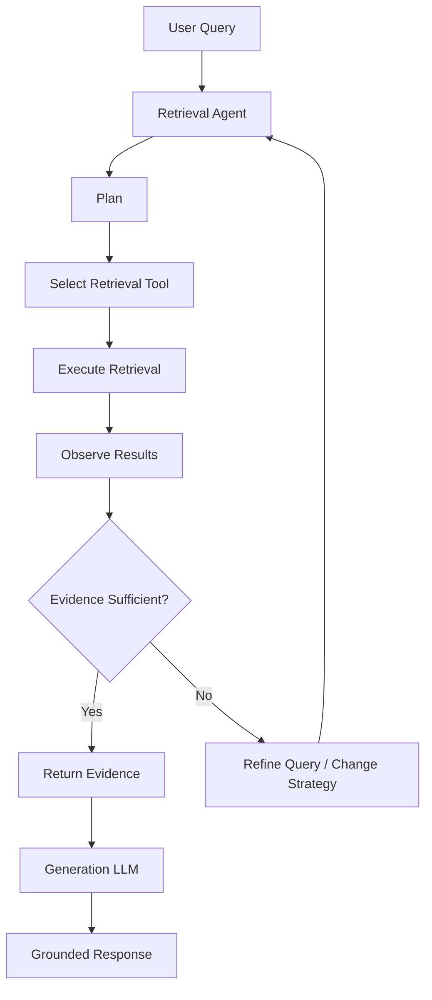

The agent can iterate until:

```text
Sufficient Evidence
```

or:

```text
Stopping Condition
```

is reached.

---

# 4. The Agentic Retrieval Loop

The central loop is:

```text
                         ┌──────────────┐
                         │    Query     │
                         └──────┬───────┘
                                ↓
                         ┌──────────────┐
                         │    Plan      │
                         └──────┬───────┘
                                ↓
                         ┌──────────────┐
                         │   Retrieve   │
                         └──────┬───────┘
                                ↓
                         ┌──────────────┐
                         │   Observe    │
                         └──────┬───────┘
                                ↓
                         ┌──────────────┐
                         │   Evaluate   │
                         └──────┬───────┘
                                ↓
                       ┌────────┴────────┐
                       ↓                 ↓
                  Sufficient?        Insufficient
                       ↓                 ↓
                    Finish        Refine / Search Again
                                         │
                                         └──────→ Plan
```

This is the defining characteristic of Agentic Retrieval.

---

# 5. Why Agentic Retrieval?

Some enterprise questions cannot be answered effectively with one retrieval operation.

Consider:

```text
"What changed in the payment service
after the migration, and did it affect
transaction processing?"
```

The system may need:

```text
1. Architecture documentation
2. Migration documentation
3. Deployment history
4. Operational data
5. Transaction metrics
```

A fixed retriever may not know how to connect these sources.

An agent can reason about the retrieval process:

```text
Question
 ↓
Need architecture information
 ↓
Retrieve architecture documents
 ↓
Need migration information
 ↓
Retrieve migration documents
 ↓
Need transaction metrics
 ↓
Query structured data
 ↓
Combine evidence
```

---

# 6. Complex Questions

Agentic Retrieval is especially useful for questions involving:

```text
Multiple documents
Multiple knowledge sources
Multiple retrieval strategies
Sequential dependencies
Query refinement
Evidence verification
Cross-domain research
```

For example:

```text
"Why did API latency increase after version 3.2?"
```

The agent may need:

```text
Release Notes
+
Architecture Documentation
+
Monitoring Data
+
Incident Reports
```

---

# 7. Agentic Retrieval vs Agentic AI

These concepts should remain distinct.

### Agentic Retrieval

The agent's primary responsibility is:

```text
Finding and validating information
```

### General AI Agent

The agent may:

```text
Retrieve
Plan
Call APIs
Modify Systems
Execute Workflows
Send Messages
Perform Actions
```

Therefore:

```text
Agentic Retrieval
→ Retrieval-focused agent

AI Agent
→ Broader autonomous system
```

This distinction is important for architecture and security.

---

# 8. Agentic Retrieval Components

A retrieval agent typically contains:

```text
┌─────────────────────────────┐
│      Retrieval Agent        │
├─────────────────────────────┤
│ Query Understanding         │
│ Planning                    │
│ Tool Selection              │
│ Query Generation            │
│ Retrieval Execution         │
│ Evidence Evaluation         │
│ Iteration                   │
│ Stopping Logic              │
└─────────────────────────────┘
```

Surrounding infrastructure includes:

```text
Retriever Tools
Vector Stores
Search Engines
SQL Databases
Knowledge Graphs
Document Stores
Rerankers
Observability
Security
```

---

# 9. Retrieval Tools

An agent needs tools through which it can access knowledge.

Example:

```python
tools = [
    vector_search_tool,
    hybrid_search_tool,
    sql_search_tool,
    graph_search_tool,
    document_search_tool
]
```

The agent decides which tool is appropriate.

---

# 10. Tool-Based Retrieval

Conceptually:

```text
User Query
     ↓
Agent
     ↓
┌──────────────┬──────────────┬──────────────┐
↓              ↓              ↓
Vector Tool   SQL Tool      Graph Tool
↓              ↓              ↓
Documents     Data          Relationships
```

The important architectural principle is:

> **The agent should interact with retrieval capabilities through controlled interfaces rather than directly accessing infrastructure.**

---

# 11. Retrieval Tool Contract

A retrieval tool should have a clear contract.

```python
class RetrievalTool:

    name: str
    description: str

    def execute(
        self,
        query: str,
        filters: dict | None = None
    ):
        raise NotImplementedError
```

Example:

```python
class VectorSearchTool(RetrievalTool):

    name = "vector_search"

    description = (
        "Search semantic enterprise documentation."
    )

    def execute(self, query, filters=None):

        return vector_store.search(
            query=query,
            filters=filters,
            top_k=20
        )
```

The agent does not need to know how the vector database works internally.

---

# 12. Capability-Based Retrieval Tools

Prefer capabilities such as:

```text
semantic_search
hybrid_search
structured_query
graph_search
policy_search
recent_documents
```

instead of exposing infrastructure directly:

```text
pinecone_tool
postgres_tool
neo4j_tool
```

The capability abstraction makes the system easier to evolve.

---

# 13. Agentic Retrieval Architecture

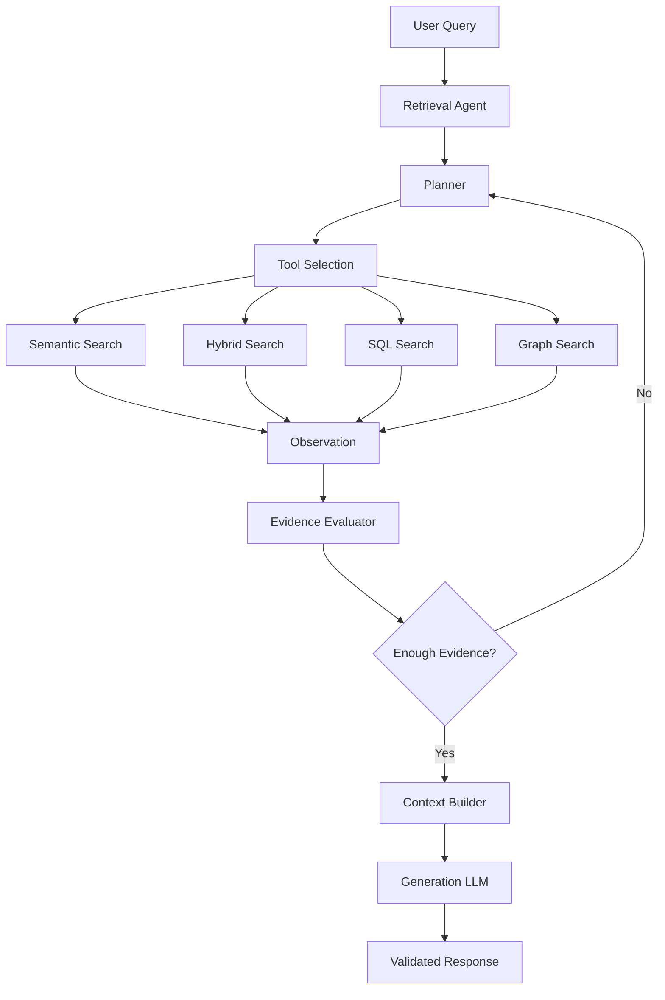

---

# 14. Query Planning

The agent can break a complex question into retrieval tasks.

Example:

```text
User:

"What changed in PaymentService after the
Kafka migration and did transaction latency increase?"
```

The agent may plan:

```text
Task 1:
Find PaymentService migration documentation.

Task 2:
Find Kafka migration release information.

Task 3:
Find transaction latency metrics.

Task 4:
Compare timeline and evidence.
```

The plan creates a retrieval strategy.

---

# 15. Query Decomposition

A complex question:

```text
"What changed in the payment platform and
why did transaction latency increase?"
```

can become:

```text
Subquery 1:
"What changes were made to the payment platform?"

Subquery 2:
"What happened to transaction latency?"

Subquery 3:
"What relationship exists between the changes
and latency?"
```

Each subquery may use a different retrieval source.

---

# 16. Decomposition Architecture

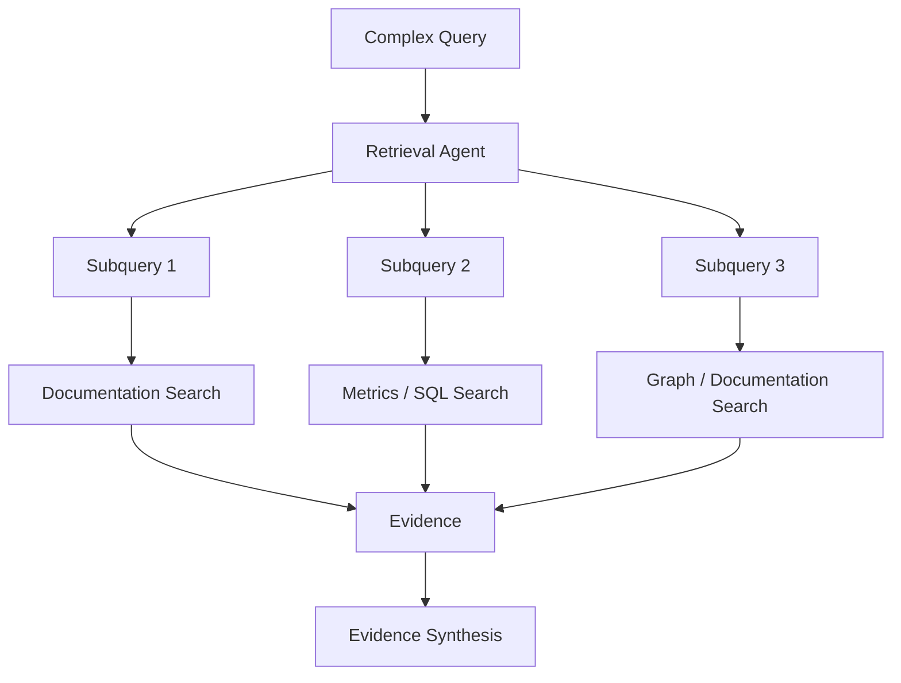

This is one of the most useful patterns for enterprise retrieval.

---

# 17. Sequential Retrieval

Sometimes one retrieval result determines the next query.

Example:

```text
Query
 ↓
Find service
 ↓
Identify dependency
 ↓
Search dependency documentation
 ↓
Find incident
 ↓
Search incident details
```

The retrieval path becomes:

```text
Query
 ↓
Observation
 ↓
New Query
 ↓
Observation
 ↓
New Query
```

This cannot always be represented effectively as a static retrieval pipeline.

---

# 18. Iterative Retrieval

A simplified loop:

```python
max_iterations = 4

for iteration in range(max_iterations):

    plan = agent.plan(query, evidence)

    result = execute_tool(
        plan.tool,
        plan.query
    )

    evidence.extend(result)

    if agent.is_sufficient(
        query,
        evidence
    ):
        break
```

The important safeguard is:

```text
Maximum Iterations
```

---

# 19. Retrieval State

The agent needs state.

Example:

```python
state = {
    "original_query": query,
    "subqueries": [],
    "retrieved_documents": [],
    "tool_calls": [],
    "observations": [],
    "iteration": 0
}
```

The state allows the agent to understand:

```text
What has already been searched?
What evidence has been found?
What remains unanswered?
```

---

# 20. Retrieval State Machine

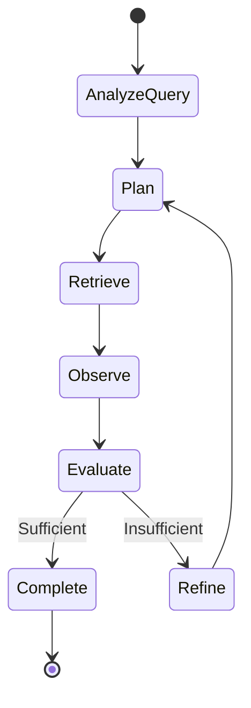

This provides a useful mental model for implementing Agentic Retrieval with workflow frameworks.

---

# 21. Evidence Sufficiency

The agent needs to determine:

```text
"Do I have enough evidence?"
```

Possible signals:

```text
Required entities found
Required subquestions answered
Relevant documents found
Evidence from authoritative sources
Confidence above threshold
No major information gaps
```

Example:

```python
def is_sufficient(evidence):

    if len(evidence) < 3:
        return False

    if not contains_required_entities(evidence):
        return False

    return relevance_score(evidence) > 0.80
```

Production systems should combine deterministic checks with model-based evaluation where appropriate.

---

# 22. Evidence Completeness

Suppose the question asks:

```text
"What changed, when did it change,
and what was the impact?"
```

The evidence must cover:

```text
What
When
Impact
```

If the retrieved evidence only explains:

```text
What
```

the agent should continue retrieval.

```text
Evidence Coverage:

What       ✓
When       ✗
Impact     ✗
```

This is better than simply checking whether any documents were retrieved.

---

# 23. Evidence Matrix

A useful representation is:

| Requirement | Evidence | Status |
|---|---|---|
| Change | Migration document | ✓ |
| Timeline | Release record | ✓ |
| Impact | Monitoring data | ✓ |
| Root cause | Incident report | ✗ |

The agent can identify:

```text
Missing:
Root Cause
```

and perform another retrieval operation.

---

# 24. Query Refinement

If retrieval fails:

```text
Original Query
 ↓
Poor Results
 ↓
Query Refinement
 ↓
New Retrieval
```

Example:

```text
Original:
"payment latency"

Refined:
"PaymentService transaction latency
after Kafka migration"
```

The refined query provides more retrieval-specific terminology.

---

# 25. Query Expansion

The agent may generate multiple search formulations.

```text
Original Query
       ↓
 ┌─────┼─────┐
 ↓     ↓     ↓
Query1 Query2 Query3
 ↓     ↓     ↓
Search Search Search
 └─────┼─────┘
       ↓
     Fusion
```

This overlaps with Multi-Query Retrieval.

The distinction is:

```text
Multi-Query Retriever
→ Predefined retrieval technique

Agentic Retrieval
→ Agent decides whether and when
  to generate additional queries
```

---

# 26. Agentic Retrieval + Multi-Query

The agent can decide:

```text
Initial Search
 ↓
Results insufficient
 ↓
Generate 3 additional queries
 ↓
Retrieve
 ↓
Fuse
```

This makes Multi-Query a tool available to the agent rather than a mandatory pipeline stage.

---

# 27. Agentic Retrieval + HyDE

The agent can also decide to use HyDE.

```text
Query
 ↓
Initial Retrieval
 ↓
Poor Semantic Recall
 ↓
Agent selects HyDE
 ↓
Hypothetical Document
 ↓
Vector Search
 ↓
Evidence
```

This allows expensive retrieval techniques to be used selectively.

---

# 28. Agentic Retrieval + Router

The Router Retriever can be exposed as a tool.

```text
Agent
 ↓
Router
 ↓
Selected Retriever
```

Or the agent can directly select retrieval capabilities.

```text
Agent
 ├── Vector Search
 ├── Hybrid Search
 ├── SQL
 └── Graph
```

A router is useful when route selection follows stable rules.

An agent is useful when retrieval strategy may need to change during execution.

---

# 29. Router vs Agent

### Router

```text
Query
 ↓
Select Route
 ↓
Execute
```

### Agent

```text
Query
 ↓
Plan
 ↓
Select Tool
 ↓
Observe
 ↓
Evaluate
 ↓
Select Another Tool
 ↓
Observe
```

The key difference is:

```text
Router
→ One routing decision

Agent
→ Potentially multiple dynamic decisions
```

---

# 30. Agentic Retrieval + SQL

Consider:

```text
"What was revenue for products affected
by the payment migration?"
```

The agent may need:

```text
Step 1:
Find products affected by migration.

Step 2:
Query revenue for those products.

Step 3:
Compare results.
```

Architecture:

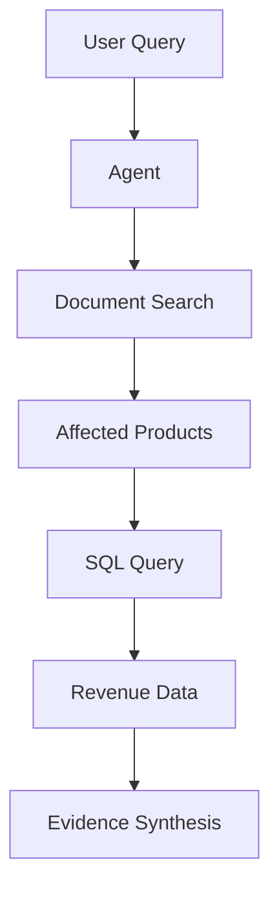

This is much more powerful than treating SQL as an isolated route.

---

# 31. Agentic Retrieval + Graph RAG

Example:

```text
"Which services depend on PaymentService
and which incidents affected those services?"
```

The agent can:

```text
1. Graph Search
2. Identify dependent services
3. Search incident documents
4. Correlate services with incidents
```

Architecture:

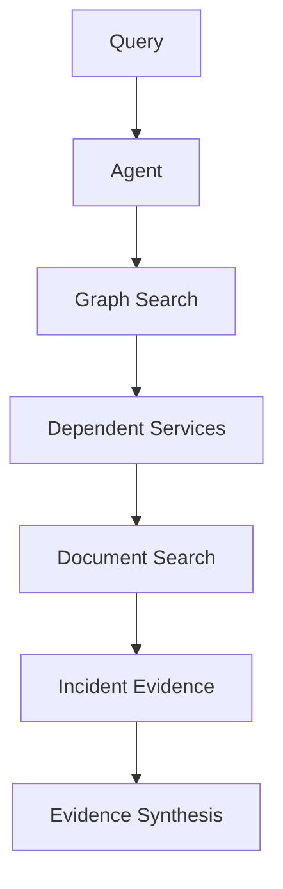

---

# 32. Cross-Source Retrieval

Agentic Retrieval becomes particularly valuable when evidence spans:

```text
Documents
+
SQL
+
Graph
+
Search Engine
+
APIs
```

Example:

```text
User Question
       ↓
Agent
       ↓
Documentation
       ↓
Graph
       ↓
Operational Data
       ↓
SQL
       ↓
Evidence Synthesis
```

This is a major enterprise use case.

---

# 33. Retrieval Planning Example

Query:

```text
"Why did customer payment failures increase
after the authentication migration?"
```

Possible plan:

```text
1. Search migration documentation.
2. Search incident reports.
3. Query payment failure metrics.
4. Identify authentication-related errors.
5. Correlate the timeline.
6. Determine whether evidence supports a relationship.
```

The agent should not assume causality merely because two events occurred around the same time.

---

# 34. Evidence Correlation

Agentic Retrieval can collect evidence from different sources:

```text
Migration:
2026-04-10

Failure Increase:
2026-04-11

Incident:
Authentication timeout

Metric:
Payment failures +18%
```

The agent can organize the evidence:

```text
Timeline
+
Technical Evidence
+
Operational Metrics
```

The final generation stage can then produce a grounded explanation.

---

# 35. Evidence Does Not Equal Causality

This is especially important for enterprise AI.

Finding:

```text
Event A
+
Event B
```

does not prove:

```text
A caused B
```

The retrieval agent should distinguish:

```text
Observed Evidence
```

from:

```text
Inference
```

and:

```text
Confirmed Cause
```

This is particularly important in:

```text
Finance
Healthcare
Legal
Operations
Security
```

---

# 36. Source Authority

Not all retrieved evidence should be treated equally.

Example:

```text
Official Policy
        > 
Internal Wiki
        >
Support Ticket
        >
User Discussion
```

The agent can consider source authority.

Example metadata:

```json
{
  "source_type": "official_policy",
  "authority_score": 1.0
}
```

This can be used during evidence selection.

---

# 37. Source-Aware Retrieval

The agent can prefer:

```text
Official Documentation
```

for policy questions.

For operational questions:

```text
Incident Reports
Monitoring Data
Runbooks
```

may be more authoritative.

The retrieval strategy should therefore consider:

```text
Query Intent
+
Source Authority
```

---

# 38. Agent Memory

Agentic Retrieval usually requires **task state**, not necessarily long-term conversational memory.

Short-term retrieval memory might contain:

```text
Original Query
Searches Performed
Documents Retrieved
Subqueries
Observations
Missing Information
```

This is enough for many retrieval tasks.

Do not introduce long-term memory unless the application actually requires it.

---

# 39. Retrieval Scratchpad

A conceptual state might look like:

```text
Goal:
Explain payment latency increase.

Completed:
✓ Migration documentation
✓ Deployment timeline

Missing:
✗ Monitoring evidence

Next Action:
Query latency metrics.
```

The internal reasoning mechanism should be implementation-specific.

The application only needs structured state such as:

```json
{
  "completed_tasks": [
    "migration_docs",
    "deployment_timeline"
  ],
  "missing_evidence": [
    "latency_metrics"
  ]
}
```

---

# 40. Tool Selection

The agent chooses tools based on their capabilities.

Example:

```text
Question:
"What was revenue?"

→ SQL

Question:
"Which services depend on X?"

→ Graph

Question:
"How does OAuth work?"

→ Vector / Hybrid

Question:
"What is the current policy?"

→ Policy / Time-Aware Search
```

The tool descriptions should clearly explain:

```text
When to use the tool
What data it accesses
What parameters it expects
What it returns
```

---

# 41. Tool Descriptions

Good:

```text
search_engineering_docs

Search published engineering documentation,
architecture decisions, deployment guides,
and operational runbooks.

Use for questions about software systems,
architecture, deployment, APIs, and operations.
```

Poor:

```text
search_docs

Search docs.
```

Clear descriptions improve tool selection.

---

# 42. Tool Input Validation

Do not allow unrestricted tool arguments.

Example:

```python
class SearchRequest(BaseModel):

    query: str
    top_k: int = 10

    @field_validator("top_k")
    def validate_top_k(cls, value):

        if value > 50:
            raise ValueError(
                "top_k exceeds maximum allowed value"
            )

        return value
```

Tool boundaries are critical for production systems.

---

# 43. Retrieval Guardrails

Agentic Retrieval requires stronger guardrails than static retrieval.

Guard:

```text
Maximum Iterations
Maximum Tool Calls
Maximum Token Usage
Maximum Query Length
Allowed Tools
Allowed Data Sources
Timeout
Budget
```

Example:

```python
MAX_ITERATIONS = 5
MAX_TOOL_CALLS = 10
MAX_RESULTS_PER_TOOL = 50
```

---

# 44. Maximum Iterations

Without an iteration limit:

```text
Retrieve
 ↓
Insufficient
 ↓
Retrieve
 ↓
Insufficient
 ↓
Retrieve
 ↓
...
```

The agent can loop indefinitely.

Therefore:

```text
Iteration Count >= MAX
        ↓
Stop
```

and return the best available evidence.

---

# 45. Maximum Tool Calls

A complex query might trigger:

```text
20 vector searches
10 SQL queries
15 graph queries
```

This creates:

```text
Latency ↑
Cost ↑
Load ↑
```

A production agent should enforce a tool-call budget.

---

# 46. Token Budget

Agentic Retrieval can consume tokens through:

```text
Planning
Tool Descriptions
Tool Results
Query Refinement
Evidence Evaluation
Final Generation
```

Therefore define:

```text
Retrieval Token Budget
```

separately from:

```text
Generation Token Budget
```

---

# 47. Cost Budget

A production agent can have:

```python
budget = {
    "max_iterations": 5,
    "max_tool_calls": 10,
    "max_llm_tokens": 6000,
    "max_retrieval_cost": 0.05
}
```

The exact limits depend on the application.

---

# 48. Time Budget

Example:

```text
Retrieval Budget = 1 second
```

If the agent reaches:

```text
950 ms
```

it should stop expensive retrieval and use the evidence already collected.

This prevents unpredictable latency.

---

# 49. Stopping Criteria

The agent can stop when:

```text
Evidence sufficient
```

or:

```text
Maximum iterations reached
```

or:

```text
Budget exhausted
```

or:

```text
No further useful retrieval possible
```

or:

```text
Required source unavailable
```

---

# 50. Stopping Decision

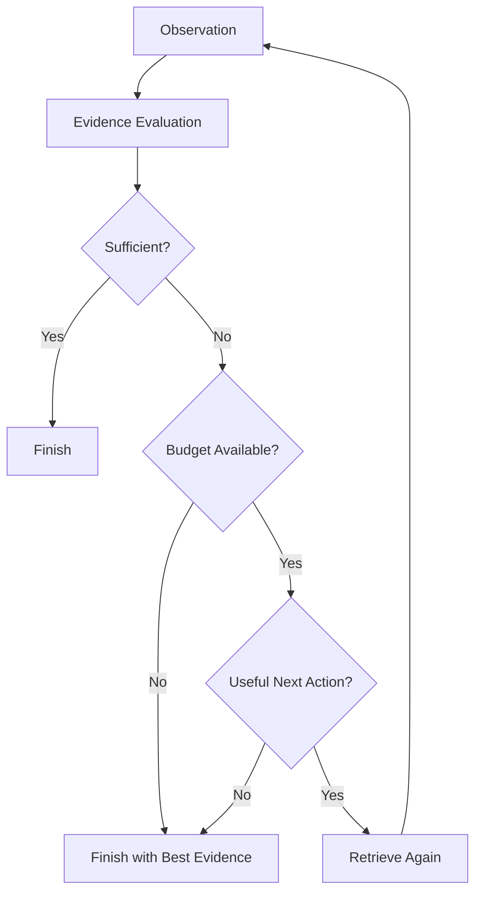

This makes the retrieval loop bounded and predictable.

---

# 51. Retrieval Quality Gate

A quality evaluator can score evidence.

Example:

```json
{
  "relevance": 0.91,
  "coverage": 0.84,
  "authority": 0.95,
  "sufficient": false
}
```

The agent sees:

```text
Relevance → High
Coverage → Medium
Authority → High
Sufficient → No
```

Therefore it searches for the missing evidence.

---

# 52. Evidence Coverage

A useful conceptual score:

```text
Evidence Coverage
=
Answered Requirements
---------------------
Total Requirements
```

For:

```text
"What changed, when, and what was the impact?"
```

if only:

```text
What
When
```

are answered:

```text
Coverage = 2 / 3
```

The agent can continue searching.

---

# 53. Query Planning vs Query Execution

Separate:

```text
Planning
```

from:

```text
Execution
```

Example:

```python
plan = agent.create_plan(query)

for step in plan.steps:

    result = execute_retrieval(step)

    state.add(result)
```

This improves observability and testing.

---

# 54. Plan Example

```json
{
  "steps": [
    {
      "goal": "Find migration details",
      "tool": "engineering_search"
    },
    {
      "goal": "Find latency metrics",
      "tool": "metrics_search"
    },
    {
      "goal": "Find related incidents",
      "tool": "incident_search"
    }
  ]
}
```

The plan itself should be validated before execution.

---

# 55. Dynamic Planning

Unlike static pipelines, the next step can depend on the previous result.

Example:

```text
Search migration docs
        ↓
Find migration version = 3.2
        ↓
Search incident reports for version 3.2
        ↓
Find incident INC-982
        ↓
Search incident details
```

The agent dynamically builds the retrieval path.

---

# 56. Retrieval Graph

The execution can be viewed as a graph:

```text
                    Query
                      │
                      ↓
                Migration Search
                      │
                      ↓
                 Version 3.2
                  /         \
                 ↓           ↓
        Incident Search   Release Search
                 ↓           ↓
             INC-982      Release Notes
                  \         /
                   ↓       ↓
                    Evidence
```

This is different from a simple linear retrieval pipeline.

---

# 57. Agentic Retrieval with Graph State

A workflow graph can represent:

```text
START
 ↓
Analyze
 ↓
Plan
 ↓
Retrieve
 ↓
Evaluate
 ├── Complete → END
 └── Continue → Refine → Retrieve
```

This pattern works well with graph-based orchestration frameworks.

---

# 58. LangGraph-Oriented Concept

A conceptual workflow:

```python
workflow.add_node(
    "planner",
    planner_node
)

workflow.add_node(
    "retriever",
    retrieval_node
)

workflow.add_node(
    "evaluator",
    evaluation_node
)

workflow.add_edge(
    "planner",
    "retriever"
)

workflow.add_edge(
    "retriever",
    "evaluator"
)
```

Conditional routing:

```python
workflow.add_conditional_edges(
    "evaluator",
    should_continue,
    {
        "continue": "planner",
        "finish": "answer"
    }
)
```

The exact implementation depends on the orchestration framework.

---

# 59. Agentic Retrieval with LlamaIndex

A conceptual architecture can expose retrievers as tools:

```text
Agent
 ↓
Retriever Tool
 ↓
LlamaIndex Retriever
 ↓
Documents
```

The important architectural boundary remains:

```text
Agent
→ Tool Interface
→ Retrieval Engine
```

rather than coupling the business application directly to framework internals.

---

# 60. Agentic Retrieval with LangChain

Similarly:

```text
Agent
 ↓
Retriever Tool
 ↓
LangChain Retriever
 ↓
Vector Store
```

The application should ideally keep the agent layer independent from framework-specific retrieval implementation.

---

# 61. Framework-Agnostic Architecture

A production system can define:

```python
class RetrievalCapability:

    def search(
        self,
        query: str,
        filters: dict | None = None
    ):
        raise NotImplementedError
```

Adapters implement:

```text
VectorSearchCapability
HybridSearchCapability
SQLSearchCapability
GraphSearchCapability
```

The agent sees:

```text
Capability Interface
```

not:

```text
Specific Framework
```

---

# 62. Retrieval Agent Interface

```python
class RetrievalAgent:

    def __init__(
        self,
        planner,
        tools,
        evaluator,
        budget
    ):
        self.planner = planner
        self.tools = tools
        self.evaluator = evaluator
        self.budget = budget

    def retrieve(self, query):

        state = RetrievalState(
            query=query
        )

        while not state.should_stop(
            self.budget
        ):

            plan = self.planner.plan(state)

            result = self.execute(plan)

            state.add(result)

            if self.evaluator.is_sufficient(
                state
            ):
                break

        return state.evidence
```

This is a simplified conceptual implementation.

---

# 63. Retrieval State Object

```python
from dataclasses import dataclass, field


@dataclass
class RetrievalState:

    query: str

    evidence: list = field(
        default_factory=list
    )

    tool_calls: list = field(
        default_factory=list
    )

    iteration: int = 0

    completed_tasks: list = field(
        default_factory=list
    )

    missing_information: list = field(
        default_factory=list
    )
```

Keeping state explicit makes the system easier to test.

---

# 64. Tool Execution Boundary

Do not allow the model to directly execute infrastructure operations.

Instead:

```text
LLM Decision
     ↓
Validated Tool Call
     ↓
Tool Adapter
     ↓
Infrastructure
```

For example:

```text
Agent
 ↓
SQL Tool
 ↓
SQL Validator
 ↓
Read-Only Database Connection
```

This creates an important security boundary.

---

# 65. SQL Guardrails

If Agentic Retrieval can call SQL:

```text
Agent
 ↓
Generated SQL
 ↓
SQL Parser / Validator
 ↓
Allowed Operations
 ↓
Read-Only Database
```

Reject:

```text
INSERT
UPDATE
DELETE
DROP
ALTER
```

unless the application explicitly requires them and has appropriate controls.

For retrieval-focused systems, read-only access is generally preferred.

---

# 66. Graph Query Guardrails

Similarly:

```text
Agent
 ↓
Graph Query
 ↓
Query Validation
 ↓
Allowed Graph Operations
 ↓
Graph Database
```

The agent should not have unrestricted access to graph mutation operations.

---

# 67. Document Search Guardrails

Document retrieval should enforce:

```text
Tenant
User
Role
Document ACL
Classification
Retention
```

before evidence enters the generation context.

---

# 68. Agentic Retrieval and Access Control

A critical principle:

> **The agent is not an authorization mechanism.**

The system should never rely on:

```text
LLM decides whether user can access document
```

Instead:

```text
Application Security Layer
        ↓
Authorized Retrieval
        ↓
Agent
```

The agent can decide what to search, but the retrieval infrastructure decides what the user is allowed to see.

---

# 69. Observability

Agentic Retrieval requires detailed tracing.

Track:

```text
Original Query
Plan
Tool Selected
Tool Input
Tool Output Count
Retrieval Scores
Iteration Number
Evidence State
Evaluation Result
Next Action
Stop Reason
Latency
Token Usage
Cost
```

Example:

```json
{
  "query": "Why did payment failures increase?",
  "iterations": 3,
  "tool_calls": [
    "migration_search",
    "incident_search",
    "metrics_search"
  ],
  "stop_reason": "evidence_sufficient"
}
```

---

# 70. Retrieval Trace

A useful trace:

```text
Iteration 1
├── Tool: migration_search
├── Results: 8
└── Missing: operational impact

Iteration 2
├── Tool: incident_search
├── Results: 5
└── Missing: quantitative impact

Iteration 3
├── Tool: metrics_search
├── Results: 3
└── Evidence: sufficient

STOP
```

This is extremely valuable for debugging.

---

# 71. Cost Observability

Track:

```text
Planning Tokens
Tool Selection Tokens
Query Rewrite Tokens
Tool Calls
Embedding Calls
Reranker Calls
Evaluation Calls
Final Generation Tokens
```

An agentic pipeline can become significantly more expensive than static retrieval.

---

# 72. Agentic Retrieval Cost Formula

Conceptually:

```text
Total Cost
=
Planning Cost
+
Retrieval Cost
+
Embedding Cost
+
Reranking Cost
+
Evaluation Cost
+
Generation Cost
```

As iteration count increases:

```text
Cost ↑
Latency ↑
```

Therefore:

```text
Agentic Retrieval
≠
Unlimited Retrieval
```

---

# 73. Latency

A static pipeline might have:

```text
Query
 ↓
Retrieve
 ↓
Generate
```

Agentic retrieval can have:

```text
Query
 ↓
Plan
 ↓
Retrieve
 ↓
Evaluate
 ↓
Retrieve
 ↓
Evaluate
 ↓
Generate
```

This can introduce substantial latency.

Use agentic retrieval when the additional reasoning and retrieval quality justify the cost.

---

# 74. Parallel Agentic Retrieval

An agent may identify independent tasks:

```text
Task A:
Search migration documents

Task B:
Search incident reports

Task C:
Query metrics
```

These can sometimes execute in parallel:

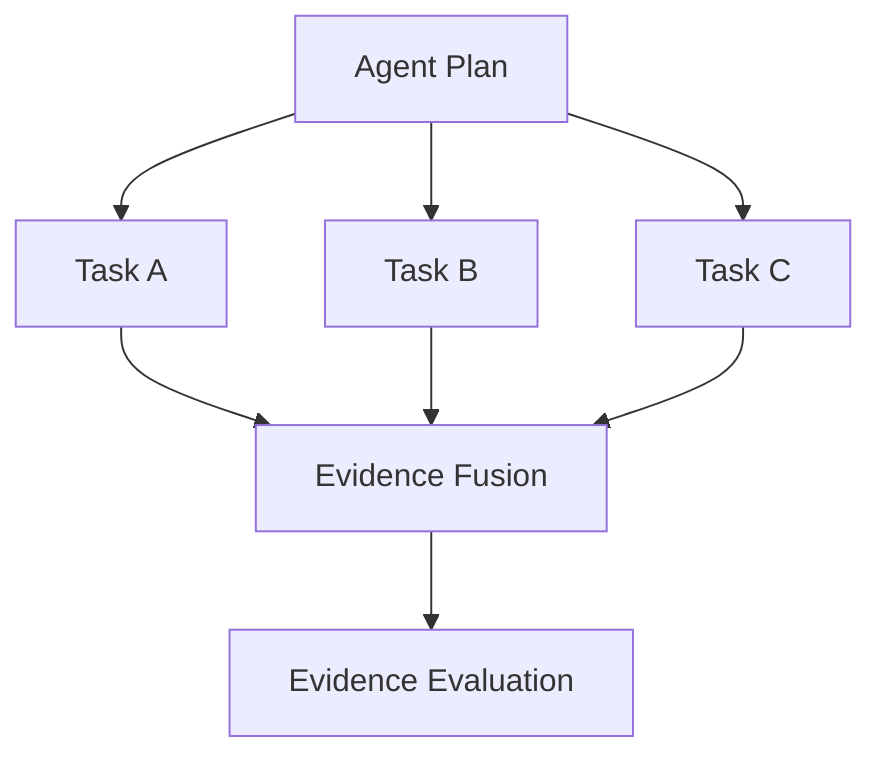

Parallel execution reduces latency.

However, dependent tasks should remain sequential.

---

# 75. Sequential Dependencies

Example:

```text
Find affected service
        ↓
Find incidents for service
        ↓
Find metrics for incident period
```

These cannot safely be parallelized because each step depends on the previous result.

Therefore the agent should understand:

```text
Independent Tasks
→ Parallel

Dependent Tasks
→ Sequential
```

---

# 76. Retrieval Planning with Dependencies

A plan can represent dependencies:

```json
{
  "tasks": [
    {
      "id": "find_service",
      "tool": "document_search"
    },
    {
      "id": "find_incidents",
      "tool": "incident_search",
      "depends_on": ["find_service"]
    },
    {
      "id": "find_metrics",
      "tool": "metrics_search",
      "depends_on": ["find_incidents"]
    }
  ]
}
```

This allows the orchestrator to execute the plan intelligently.

---

# 77. Agentic Retrieval Failure Modes

## 77.1 Infinite Loops

```text
Search
 ↓
Search Again
 ↓
Search Again
```

Prevent with:

```text
Max Iterations
Max Tool Calls
```

---

## 77.2 Tool Selection Errors

The agent chooses the wrong source.

---

## 77.3 Query Drift

The agent gradually moves away from the original question.

Maintain:

```text
Original Query
```

throughout the retrieval state.

---

## 77.4 Evidence Accumulation

The agent keeps collecting documents without improving evidence quality.

Use:

```text
Evidence Sufficiency
+
Marginal Utility
```

checks.

---

# 78. Marginal Retrieval Value

Suppose:

```text
Iteration 1:
Evidence Quality = 0.70

Iteration 2:
Evidence Quality = 0.84

Iteration 3:
Evidence Quality = 0.85

Iteration 4:
Evidence Quality = 0.85
```

Iteration 4 provides almost no improvement.

The agent should stop.

Conceptually:

```text
Marginal Gain
=
New Evidence Quality
-
Previous Evidence Quality
```

If:

```text
Marginal Gain < Threshold
```

stop retrieving.

---

# 79. Retrieval Saturation

A retrieval process can reach saturation:

```text
Search 1 → Significant Evidence
Search 2 → Significant Evidence
Search 3 → Small Improvement
Search 4 → No Improvement
```

Continuing beyond this point wastes:

```text
Time
Tokens
Cost
Infrastructure
```

---

# 80. Relevance Collapse

More retrieval does not always mean better retrieval.

Adding many documents can introduce:

```text
Noise
Contradictions
Redundant Evidence
Context Dilution
```

Therefore the agent should optimize:

```text
Evidence Quality
```

not:

```text
Evidence Quantity
```

---

# 81. Evidence Deduplication

Agentic retrieval may search the same source multiple times.

Example:

```text
Search 1:
Document A

Search 2:
Document A

Search 3:
Document A
```

Deduplicate evidence before final context assembly.

---

# 82. Contradictory Evidence

Different sources may disagree.

Example:

```text
Document A:
OAuth tokens expire after 60 minutes.

Document B:
OAuth tokens expire after 30 minutes.
```

The agent should not simply combine both statements.

It should identify:

```text
Conflict
```

and retrieve authoritative or newer evidence.

---

# 83. Conflict Resolution

Possible strategy:

```text
Conflict Detected
        ↓
Check Source Authority
        ↓
Check Publication Date
        ↓
Retrieve More Evidence
        ↓
Resolve / Report Uncertainty
```

This is particularly important for enterprise policies and changing technical documentation.

---

# 84. Source Recency

When information changes over time:

```text
Current Policy
```

should generally prefer:

```text
Latest Approved Version
```

over:

```text
Old Archived Version
```

The retrieval agent can use metadata and source authority to make better retrieval decisions.

---

# 85. Agentic Retrieval and Time-Weighted Search

An agent may determine:

```text
Question asks for current information
```

and select:

```text
Time-Weighted Retriever
```

rather than:

```text
General Vector Search
```

This is another example of dynamic retrieval strategy selection.

---

# 86. Agentic Retrieval and Hybrid Search

The agent may initially use:

```text
Vector Search
```

If exact terminology is missing:

```text
Switch to Hybrid Search
```

Example:

```text
Initial:
Semantic Search

Result:
Low exact-term coverage

Next:
Hybrid Search
```

This adaptive strategy can improve retrieval without running every retriever for every query.

---

# 87. Agentic Retrieval and Reranking

The agent can decide to rerank when:

```text
Candidate count is high
```

or:

```text
Initial scores are ambiguous
```

Pipeline:

```text
Retrieve
 ↓
Evaluate
 ↓
Need precision?
 ↓
Rerank
 ↓
Evaluate
```

This makes reranking conditional rather than mandatory.

---

# 88. Agentic Retrieval and Compression

Similarly:

```text
Large Documents
 ↓
Context Too Large
 ↓
Compression
```

If the retrieved documents are already concise:

```text
Compression may be unnecessary
```

This can reduce cost.

---

# 89. Adaptive Retrieval Pipeline

A sophisticated retrieval agent can dynamically construct:

```text
Query
 ↓
Vector Search
 ↓
Low Confidence
 ↓
Hybrid Search
 ↓
Many Candidates
 ↓
Reranking
 ↓
Large Context
 ↓
Compression
 ↓
Evidence Sufficient
 ↓
Finish
```

The pipeline is built dynamically from the agent's decisions.

---

# 90. Agentic Retrieval Architecture

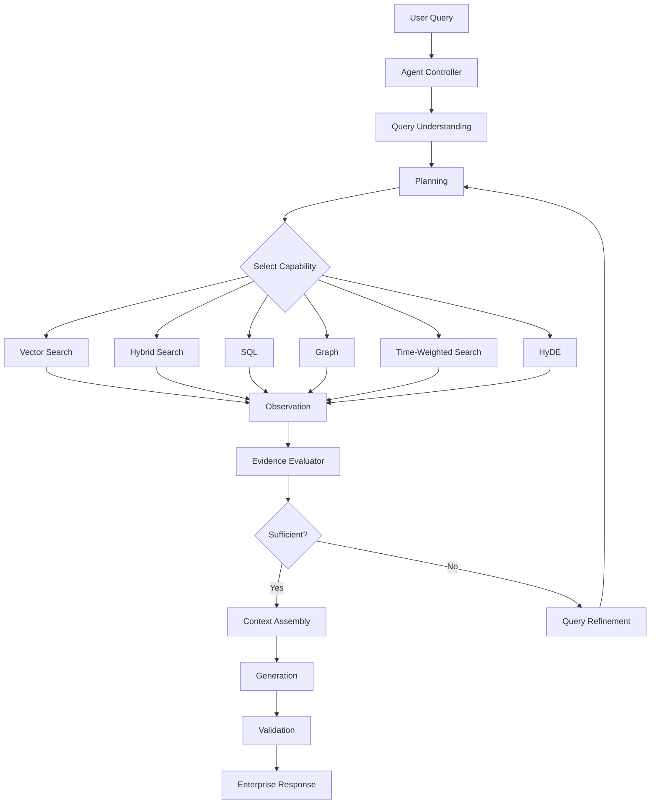

---

# 91. Production Agent Controller

A production architecture should separate:

```text
Agent Controller
```

from:

```text
Retrieval Tools
```

Example:

```python
class AgentController:

    def __init__(
        self,
        planner,
        evaluator,
        tool_registry,
        policy
    ):
        self.planner = planner
        self.evaluator = evaluator
        self.tools = tool_registry
        self.policy = policy
```

The controller manages:

```text
Planning
Policy
Budgets
Tool Selection
State
Stopping
```

---

# 92. Retrieval Policy

The agent should operate within a policy.

Example:

```python
class RetrievalPolicy:

    max_iterations = 5
    max_tool_calls = 10
    max_results = 50
    allow_sql = True
    allow_graph = True
    allow_external_search = False
```

The agent can select only tools permitted by policy.

---

# 93. Policy Enforcement

Never rely solely on the LLM to follow:

```text
"Do not use SQL."
```

Instead:

```text
Agent Decision
 ↓
Policy Enforcement
 ↓
Tool Availability
 ↓
Tool Execution
```

If SQL is disabled:

```python
if tool_name == "sql" and not policy.allow_sql:
    raise PermissionError(
        "SQL retrieval is disabled"
    )
```

---

# 94. Retrieval Budget Controller

A budget controller can enforce:

```python
class RetrievalBudget:

    def __init__(
        self,
        max_iterations=5,
        max_tool_calls=10
    ):
        self.max_iterations = max_iterations
        self.max_tool_calls = max_tool_calls
```

The agent checks the budget before every action.

This prevents runaway execution.

---

# 95. Observability Architecture

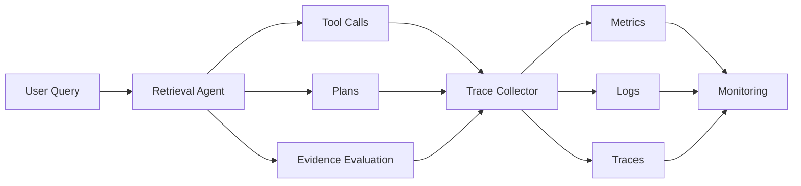

Agentic retrieval should be observable at the **decision level**, not just the HTTP request level.

---

# 96. Important Agent Metrics

Track:

```text
Iterations per Query
Tool Calls per Query
Retrieval Success Rate
No-Result Rate
Fallback Rate
Average Evidence Coverage
Average Retrieval Latency
P95 Retrieval Latency
Token Usage
Cost per Query
Early Stop Rate
Budget Exhaustion Rate
```

These metrics reveal whether the agent is efficient.

---

# 97. Retrieval Quality Metrics

Measure:

```text
Recall@K
Precision@K
MRR
NDCG
Context Relevance
Evidence Coverage
Citation Accuracy
Answer Faithfulness
Answer Correctness
```

Agentic Retrieval should be compared against:

```text
Static Retrieval Baseline
```

and:

```text
Multi-Stage Retrieval Baseline
```

---

# 98. Evaluation Dataset

Create questions requiring different retrieval behaviors.

### Simple

```text
"What is OAuth?"
```

### Multi-document

```text
"What changed across the last two releases?"
```

### Cross-source

```text
"Did the migration affect transaction volume?"
```

### Relationship

```text
"Which services depend on PaymentService?"
```

### Structured

```text
"What was revenue in Q2?"
```

### Ambiguous

```text
"How does authentication work?"
```

This helps determine where Agentic Retrieval actually provides value.

---

# 99. Baseline Comparison

Compare:

```text
A:
Vector Search

B:
Hybrid + Reranking

C:
Multi-Stage Retrieval

D:
Agentic Retrieval
```

Measure:

```text
Retrieval Quality
Answer Quality
Latency
Cost
Reliability
```

The goal is not automatically to choose D.

The goal is to identify:

> **Which architecture provides the required quality at an acceptable operational cost?**

---

# 100. When Agentic Retrieval Is Valuable

Agentic Retrieval is particularly useful when:

- Questions require multiple retrieval steps
- Multiple knowledge sources must be combined
- The next search depends on previous results
- Query decomposition is useful
- Evidence completeness matters
- Retrieval strategy must change dynamically
- Knowledge sources are heterogeneous
- Complex enterprise research is required
- Static retrieval pipelines repeatedly fail on complex questions

Typical use cases:

```text
Enterprise Research Assistants
Technical Investigation
Incident Analysis
Financial Research
Legal Research
Compliance Investigation
Complex Customer Support
Architecture Analysis
Cross-System Knowledge Assistants
```

---

# 101. When Agentic Retrieval Is Not Necessary

Avoid Agentic Retrieval when:

```text
Queries are simple
```

or:

```text
One retriever already provides excellent results
```

or:

```text
Latency requirements are extremely strict
```

or:

```text
The retrieval workflow is completely deterministic
```

or:

```text
The added cost cannot be justified
```

For many applications:

```text
Hybrid + Reranking
```

may be better than an agent.

---

# 102. Multi-Stage vs Agentic Retrieval

| Characteristic | Multi-Stage | Agentic |
|---|---|---|
| Pipeline | Predefined | Dynamic |
| Decision Making | Mostly static | Runtime |
| Query Refinement | Optional | Core capability |
| Tool Selection | Usually configured | Dynamic |
| Iteration | Limited | Native |
| Latency | Predictable | Variable |
| Cost | Predictable | Variable |
| Debugging | Easier | More complex |
| Best For | Known workflows | Complex research |

The important design principle is:

```text
Predictable Problem
→ Multi-Stage Retrieval

Dynamic Problem
→ Agentic Retrieval
```

---

# 103. Router vs Multi-Stage vs Agentic

These three patterns form a useful progression.

### Router

```text
Choose
```

### Multi-Stage

```text
Pipeline
```

### Agentic

```text
Choose
+
Execute
+
Observe
+
Adapt
```

Conceptually:

```text
Router
   ↓
Select Strategy

Multi-Stage
   ↓
Execute Strategy

Agentic
   ↓
Select → Execute → Observe → Adapt
```

---

# 104. Enterprise Architecture

A mature enterprise retrieval platform may combine all three:

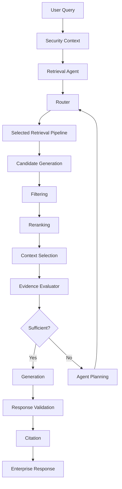

This is a powerful production architecture.

---

# 105. Production Guardrails

Before allowing an Agentic Retrieval system into production:

```text
☐ Maximum iterations configured
☐ Maximum tool calls configured
☐ Maximum token budget configured
☐ Maximum cost budget configured
☐ Tool allowlist configured
☐ Query length limits configured
☐ SQL access restricted
☐ Graph access restricted
☐ Tenant isolation enforced
☐ Document ACLs enforced
☐ Tool arguments validated
☐ Retrieval timeouts configured
☐ Fallback strategy implemented
☐ Evidence sufficiency implemented
☐ Evidence deduplication implemented
☐ Contradiction detection considered
☐ Source authority considered
☐ Original query preserved
☐ Agent state observable
☐ Tool calls traced
☐ Cost monitored
☐ Retrieval quality evaluated
☐ End-to-end answer quality evaluated
☐ Regression dataset maintained
```

---

# 106. Production Design Principles

### Principle 1 — Bound the Agent

Never allow unlimited iterations.

### Principle 2 — Control the Tools

The agent should access only approved retrieval capabilities.

### Principle 3 — Enforce Security Outside the LLM

Authorization must be deterministic.

### Principle 4 — Preserve Evidence

Every final claim should be traceable to retrieved evidence where required.

### Principle 5 — Evaluate Sufficiency

Do not stop simply because documents were retrieved.

### Principle 6 — Avoid Unnecessary Agentic Behavior

Use static retrieval when static retrieval is sufficient.

### Principle 7 — Measure the Agent

Track quality, latency, iterations, tool calls, and cost.

---

# 107. Common Anti-Patterns

## Anti-Pattern 1 — Agent for Every Query

```text
Simple Query
 ↓
Full Agent
 ↓
5 Tool Calls
```

This creates unnecessary cost.

---

## Anti-Pattern 2 — Unlimited Tool Access

```text
Agent
 ↓
Every Enterprise System
```

This creates major security risk.

---

## Anti-Pattern 3 — No Stop Condition

```text
Retrieve
 ↓
Retrieve
 ↓
Retrieve
...
```

This creates runaway execution.

---

## Anti-Pattern 4 — No Evidence Validation

The agent retrieves documents and assumes they are sufficient.

---

## Anti-Pattern 5 — Treating Agent Output as Evidence

Agent-generated reasoning is not equivalent to authoritative source evidence.

---

# 108. Recommended Enterprise Pattern

A practical architecture is:

```text
Simple Query
      ↓
Fast Retrieval
      ↓
Answer


Complex Query
      ↓
Router / Agent
      ↓
Retrieval Planning
      ↓
Specialized Retrieval
      ↓
Evidence Evaluation
      ↓
Additional Retrieval if Needed
      ↓
Reranking
      ↓
Context Selection
      ↓
Grounded Generation
```

This allows the system to remain efficient for simple queries while supporting complex investigations.

---

# 109. Key Takeaways

- Agentic Retrieval adds dynamic decision-making to retrieval systems.
- The agent can plan, select tools, retrieve, observe, evaluate, and refine.
- Agentic Retrieval is especially useful for complex multi-source questions.
- It can dynamically select Vector, Hybrid, SQL, Graph, HyDE, or other retrieval capabilities.
- Query decomposition allows complex questions to be split into specialized retrieval tasks.
- Retrieval state records what has already been searched and what evidence is still missing.
- Evidence sufficiency is a central component of Agentic Retrieval.
- Query refinement enables iterative search.
- Agentic Retrieval can combine multiple retrieval techniques dynamically.
- Router Retrieval selects a route; Agentic Retrieval can repeatedly adapt the route.
- Multi-Stage Retrieval follows a predefined workflow; Agentic Retrieval dynamically changes the workflow.
- Tool access must be controlled through capability-based interfaces.
- SQL and Graph tools require strict validation and authorization.
- The agent must never act as the authorization mechanism.
- Maximum iterations, tool calls, tokens, cost, and time should be bounded.
- Evidence quality matters more than evidence quantity.
- Retrieval saturation should trigger stopping.
- Contradictory evidence should be detected and handled explicitly.
- Source authority and recency should influence evidence selection where appropriate.
- Agentic Retrieval introduces additional latency and cost.
- Agentic Retrieval should be compared against strong static and multi-stage baselines.
- The best architecture is not necessarily the most autonomous one.
- Use Agentic Retrieval when **dynamic retrieval decisions provide measurable value**.

The central pattern is:

```text
Understand
    ↓
Plan
    ↓
Retrieve
    ↓
Observe
    ↓
Evaluate
    ↓
Refine
    ↓
Retrieve Again
    ↓
Evidence Sufficient
    ↓
Generate
```

Or simply:

```text
Don't just search.

Search → Observe → Learn → Search Again
```

---

# 🧭 Chapter Navigation

### Part V — Advanced Retrieval-Augmented Generation

**Previous:**  
[08. Multi-Stage Retrieval](08-multi-stage-retrieval.md)

**Next:**  
[10. Re-ranking Techniques](10-reranking-techniques.md)

**Section:**  
02 — Enterprise Retrieval Engineering

### Enterprise Retrieval Engineering Path

```text
01 Contextual Compression Retriever
              ↓
02 Ensemble Retriever
              ↓
03 Multi-Vector Retriever
              ↓
04 Time-Weighted Retriever
              ↓
05 Hybrid Search Retriever
              ↓
06 HyDE Retriever
              ↓
07 Router Retriever
              ↓
08 Multi-Stage Retrieval
              ↓
09 Agentic Retrieval
              ↓
10 Re-ranking Techniques
              ↓
11 MMR & Diversity-Aware Retrieval
              ↓
12 Metadata-Aware Retrieval
              ↓
13 Advanced Query Rewriting
```

---

> **Enterprise AI Engineering Handbook**  
> *Building Production-Grade Enterprise AI Systems — One Chapter at a Time.*