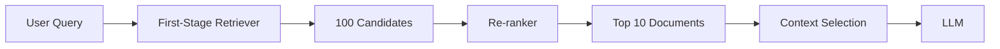
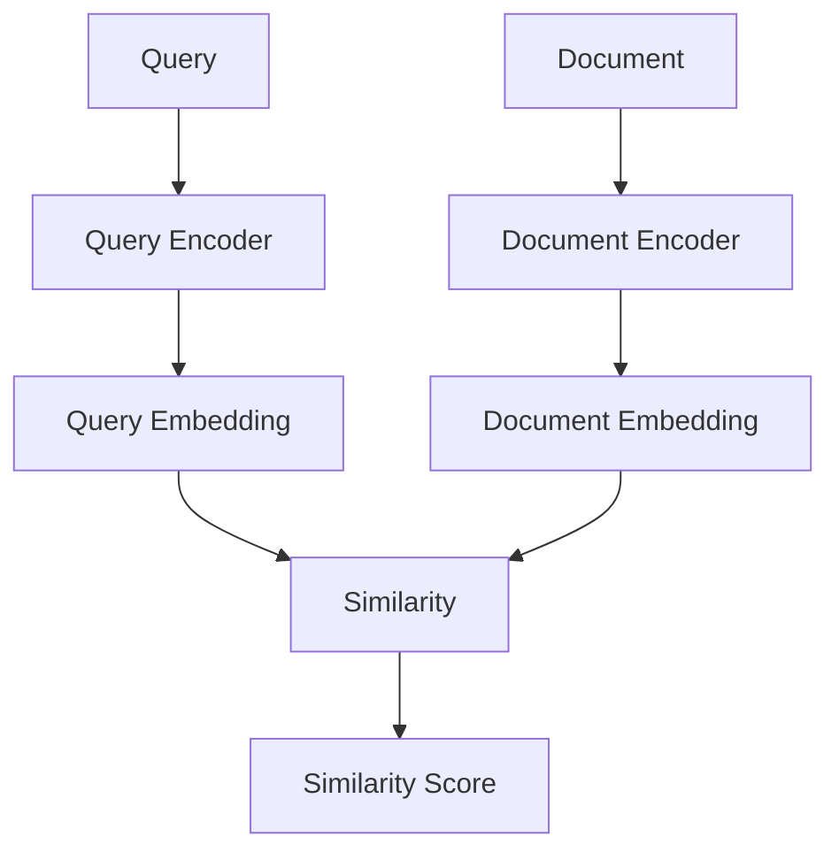
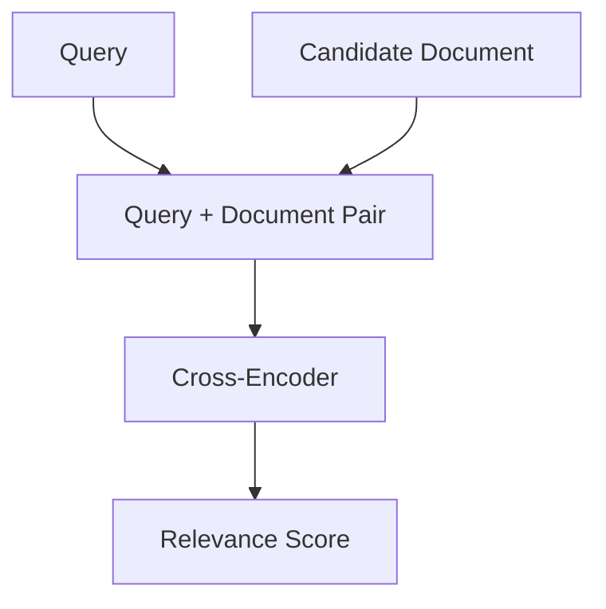
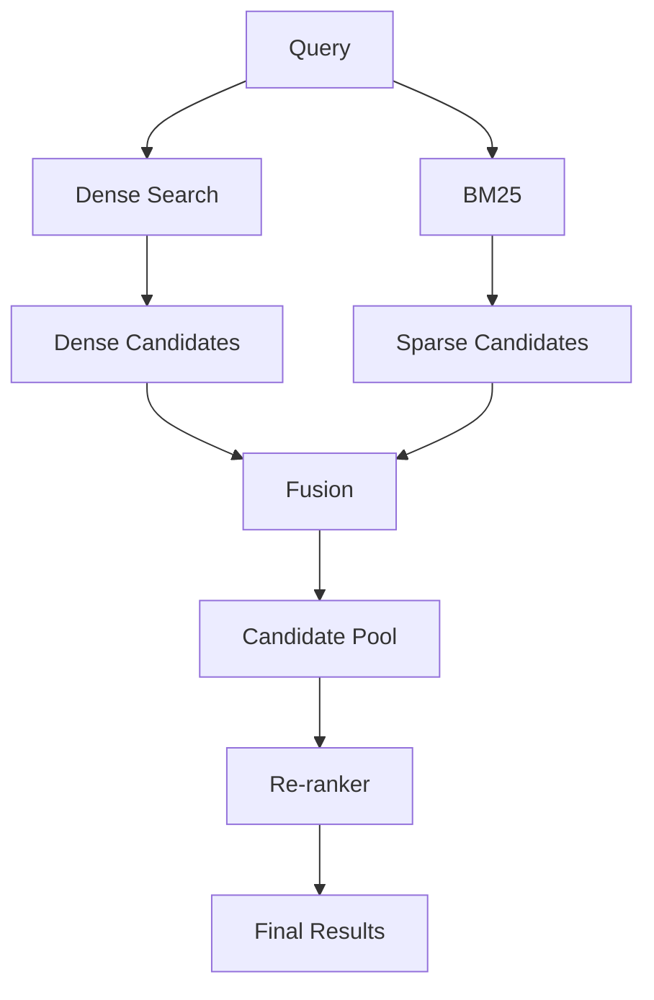
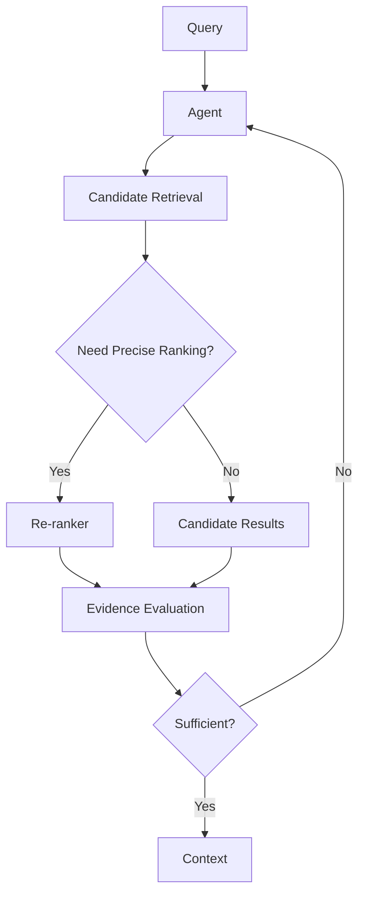
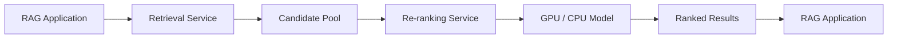
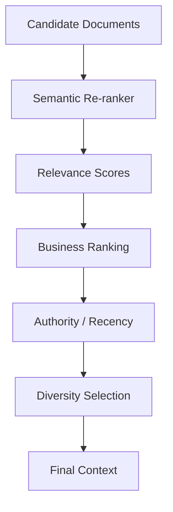
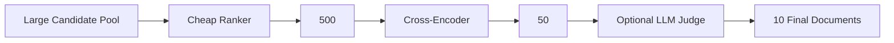
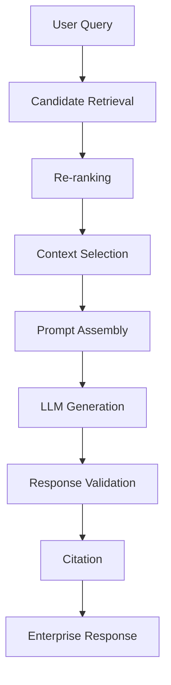
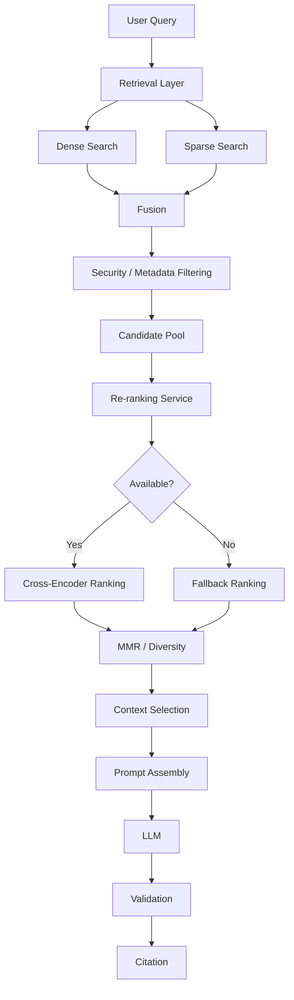

# Re-ranking Techniques

## 📖 Overview

**Re-ranking** is a second-stage retrieval technique used to improve the relevance of documents returned by an initial retriever.

A typical retrieval system works in two stages:

```text
User Query
    ↓
Candidate Retrieval
    ↓
Top-K Candidates
    ↓
Re-ranking
    ↓
Top-N Relevant Documents
    ↓
LLM
```

The initial retriever is optimized for **high recall and fast candidate generation**.

The re-ranker is optimized for **high precision and better query-document relevance ordering**.

This separation is fundamental to production RAG:

```text
Retrieve broadly
      ↓
Rank precisely
      ↓
Generate from the best evidence
```

---

## 🎯 Learning Objectives

After completing this chapter, you will be able to:

- Understand why re-ranking is required in RAG
- Understand first-stage retrieval vs second-stage ranking
- Understand bi-encoder and cross-encoder architectures
- Implement cross-encoder re-ranking
- Understand score-based re-ranking
- Combine dense and sparse retrieval with re-ranking
- Apply metadata-aware re-ranking
- Understand reciprocal rank fusion
- Understand weighted score fusion
- Implement multi-stage re-ranking
- Understand reranking thresholds
- Tune candidate count and final result count
- Evaluate re-ranking quality
- Understand latency and cost trade-offs
- Design production-grade re-ranking pipelines
- Implement fallback strategies
- Understand when re-ranking should and should not be used

---

# 1. Why Re-ranking?

A vector retriever usually calculates similarity between:

```text
Query Embedding
        +
Document Embedding
```

This is highly efficient.

However, the similarity score may not perfectly represent the relevance of a document to the complete query.

Consider:

```text
Query:

"How does the payment service handle
OAuth token expiration?"
```

Initial retrieval might return:

```text
1. OAuth overview
2. Payment authentication
3. OAuth token expiration
4. Payment API reference
5. Authentication troubleshooting
```

The document that directly explains token expiration may not necessarily have the highest embedding similarity.

A re-ranker can analyze the query and candidate document together and produce a more precise ranking.

---

# 2. First-Stage Retrieval

The first-stage retriever should generally optimize for:

```text
Speed
+
Recall
```

For example:

```text
1,000,000 documents
        ↓
Vector Search
        ↓
Top-100
```

The retriever does not need to perfectly rank those 100 documents.

It needs to ensure that the relevant documents have a good chance of entering the candidate set.

---

# 3. Second-Stage Ranking

The second stage focuses on:

```text
Precision
+
Ordering
```

Example:

```text
Top-100 Candidates
        ↓
Cross-Encoder
        ↓
Top-10
```

The re-ranker performs more detailed relevance analysis on a much smaller candidate set.

---

# 4. Retrieval vs Re-ranking



The architecture separates:

```text
Candidate Generation
```

from:

```text
Candidate Ordering
```

---

# 5. Why Not Re-rank the Entire Corpus?

Suppose:

```text
Corpus = 10,000,000 documents
```

A sophisticated re-ranker may need to evaluate:

```text
Query + Document
```

for every document.

That would be expensive.

Instead:

```text
10,000,000
      ↓
Fast Retrieval
      ↓
100
      ↓
Expensive Re-ranking
      ↓
10
```

This is the fundamental efficiency advantage of two-stage retrieval.

---

# 6. Two-Stage Retrieval Architecture

```text
                    ┌─────────────────────┐
                    │    Large Corpus     │
                    └──────────┬──────────┘
                               ↓
                    ┌─────────────────────┐
                    │ Candidate Retriever │
                    │  Fast / High Recall │
                    └──────────┬──────────┘
                               ↓
                         100 Candidates
                               ↓
                    ┌─────────────────────┐
                    │      Re-ranker      │
                    │ Precise / Expensive  │
                    └──────────┬──────────┘
                               ↓
                          Top 10 Results
                               ↓
                    ┌─────────────────────┐
                    │  Context Selection  │
                    └──────────┬──────────┘
                               ↓
                              LLM
```

---

# 7. Bi-Encoder Retrieval

Most dense retrieval systems use a bi-encoder architecture.

The query and document are encoded independently.

```text
Query
  ↓
Query Encoder
  ↓
Query Vector


Document
  ↓
Document Encoder
  ↓
Document Vector
```

Then:

```text
Similarity(Query Vector, Document Vector)
```

is calculated.

---

# 8. Bi-Encoder Architecture



The advantage is that document embeddings can be precomputed.

This makes large-scale vector search practical.

---

# 9. Limitation of Bi-Encoder Retrieval

The query and document are encoded independently:

```text
Query → Vector

Document → Vector
```

The model does not deeply process their interaction at retrieval time.

For many queries this is sufficient.

For nuanced questions, however, a more precise relevance model can improve ranking.

---

# 10. Cross-Encoder Re-ranking

A cross-encoder processes the query and document together.

```text
Query
+
Document
    ↓
Cross-Encoder
    ↓
Relevance Score
```

The model can directly analyze relationships between:

```text
Query Terms
Document Terms
Semantic Meaning
Context
```

---

# 11. Cross-Encoder Architecture



For multiple candidates:

```text
Query + Document 1 → Score
Query + Document 2 → Score
Query + Document 3 → Score
...
```

The candidates are then sorted by score.

---

# 12. Bi-Encoder vs Cross-Encoder

| Characteristic | Bi-Encoder | Cross-Encoder |
|---|---|---|
| Query Encoding | Independent | Joint |
| Document Encoding | Independent | Joint with query |
| Speed | Very Fast | Slower |
| Corpus Scale | Excellent | Poor for full corpus |
| Recall | High | Depends on candidates |
| Precision | Good | Usually better ranking |
| Embeddings | Precomputed | Query-dependent |
| Typical Usage | First Stage | Second Stage |

The ideal architecture often combines both.

---

# 13. The Two-Stage Pattern

```text
Bi-Encoder
    ↓
Fast Candidate Retrieval
    ↓
Cross-Encoder
    ↓
Precise Re-ranking
```

This pattern combines:

```text
Scale
+
Precision
```

---

# 14. Candidate Pool Size

The candidate pool is one of the most important tuning parameters.

Example:

```text
Vector Search:
Top-20
```

may miss relevant documents.

Increasing to:

```text
Top-100
```

may improve recall.

But:

```text
Top-1000
```

can make re-ranking expensive.

Therefore:

```text
Candidate K
```

must be evaluated experimentally.

---

# 15. Candidate K vs Final K

These values should be separate.

Example:

```text
Candidate K = 100
Re-rank K = 20
Final Context K = 8
```

Architecture:

```text
100
 ↓
20
 ↓
8
 ↓
LLM
```

The values are application-specific.

---

# 16. Basic Cross-Encoder Example

A common implementation uses a cross-encoder model.

```python
from sentence_transformers import CrossEncoder

model = CrossEncoder(
    "cross-encoder/ms-marco-MiniLM-L-6-v2"
)

query = "How does OAuth token expiration work?"

documents = [
    "OAuth is an authorization framework...",
    "Tokens expire after a configured period...",
    "Payment APIs provide authentication..."
]

pairs = [
    [query, document]
    for document in documents
]

scores = model.predict(pairs)

ranked = sorted(
    zip(documents, scores),
    key=lambda item: item[1],
    reverse=True
)

for document, score in ranked:
    print(score, document)
```

The exact model should be selected and evaluated for the target domain.

---

# 17. Re-ranking Function

A reusable implementation:

```python
def rerank(
    query,
    documents,
    reranker,
    top_k=10
):

    pairs = [
        [query, doc.page_content]
        for doc in documents
    ]

    scores = reranker.predict(pairs)

    ranked = sorted(
        zip(documents, scores),
        key=lambda x: x[1],
        reverse=True
    )

    return [
        document
        for document, score in ranked[:top_k]
    ]
```

---

# 18. Preserving Scores

In production systems, do not discard the score.

```python
def rerank(
    query,
    documents,
    reranker,
    top_k=10
):

    pairs = [
        [query, doc.page_content]
        for doc in documents
    ]

    scores = reranker.predict(pairs)

    ranked = sorted(
        zip(documents, scores),
        key=lambda x: x[1],
        reverse=True
    )

    return [
        {
            "document": document,
            "score": float(score)
        }
        for document, score in ranked[:top_k]
    ]
```

Scores are useful for:

```text
Thresholding
Observability
Evaluation
Debugging
Fallback Decisions
```

---

# 19. Score Thresholding

Instead of always returning:

```text
Top-10
```

the system can require:

```text
score >= threshold
```

Example:

```python
MIN_SCORE = 0.65

results = [
    item
    for item in ranked
    if item["score"] >= MIN_SCORE
]
```

Be careful:

> Re-ranking scores are often model-specific and should not be treated as universally calibrated probabilities.

Thresholds should be determined using an evaluation dataset.

---

# 20. Ranking vs Thresholding

These are different operations.

### Ranking

```text
Sort candidates
```

### Thresholding

```text
Remove candidates below an acceptable score
```

Pipeline:

```text
Candidates
 ↓
Score
 ↓
Sort
 ↓
Threshold
 ↓
Final Documents
```

---

# 21. Dense Retrieval + Re-ranking

A standard architecture:

```python
candidates = vector_store.similarity_search(
    query,
    k=100
)

ranked = rerank(
    query,
    candidates,
    reranker,
    top_k=10
)
```

Pipeline:

```text
Vector Search
     ↓
Top-100
     ↓
Cross-Encoder
     ↓
Top-10
```

This is often an excellent baseline for RAG systems.

---

# 22. Hybrid Search + Re-ranking

Hybrid search can improve candidate recall.



This architecture combines:

```text
Semantic Retrieval
+
Keyword Retrieval
+
Precise Re-ranking
```

---

# 23. Why Re-rank Hybrid Results?

Dense and sparse retrieval may produce different rankings.

Example:

```text
Dense:
A
B
C
D

BM25:
C
E
A
F
```

Fusion produces:

```text
A
B
C
D
E
F
```

The re-ranker can then determine which documents are truly most relevant to the query.

---

# 24. Reciprocal Rank Fusion

Reciprocal Rank Fusion (RRF) combines ranked lists.

A common formulation is:

```text
RRF(d) =
Σ 1 / (k + rank_i(d))
```

where:

```text
d = document
rank_i(d) = document rank in retriever i
k = smoothing constant
```


RRF is useful when combining:

```text
Dense Search
+
BM25
+
Other Ranked Retrievers
```

before the re-ranking stage.

---

# 25. Weighted Score Fusion

Another approach combines normalized scores.

Conceptually:

```text
Final Score =
α × Dense Score
+
β × Sparse Score
```


where:

```text
α + β = 1
```

The exact weighting should be tuned experimentally.

---

# 26. Score Normalization

Different retrieval systems may produce incompatible score ranges.

Example:

```text
Dense:
0.91
0.87
0.83

BM25:
14.2
11.8
8.9
```

These scores cannot simply be added.

They may require normalization before weighted fusion.

Possible approaches include:

```text
Min-Max Scaling
Z-Score Normalization
Rank-Based Fusion
```

RRF often avoids the need to directly compare raw score magnitudes.

---

# 27. Re-ranking with Metadata

Relevance is not always the only ranking factor.

Enterprise systems may consider:

```text
Semantic Relevance
+
Source Authority
+
Recency
+
Document Type
+
Business Priority
```

A conceptual score might be:

```text
Final Score =
0.70 × Semantic Relevance
+
0.15 × Authority
+
0.10 × Recency
+
0.05 × Business Priority
```

The weights are illustrative.

---

# 28. Metadata-Aware Ranking

Example:

```python
def business_score(
    semantic_score,
    authority_score,
    recency_score,
    priority_score
):

    return (
        0.70 * semantic_score
        + 0.15 * authority_score
        + 0.10 * recency_score
        + 0.05 * priority_score
    )
```

This should be applied carefully.

Hard authorization rules should remain separate from ranking.

---

# 29. Hard Filters vs Soft Ranking

### Hard Filter

```text
User does not have access
```

Result:

```text
Exclude document
```

### Soft Ranking

```text
Document is newer
```

Result:

```text
Increase priority
```

Never turn an authorization rule into a ranking signal.

---

# 30. Re-ranking and Time-Weighted Retrieval

Time-sensitive enterprise knowledge may require:

```text
Relevance
+
Recency
```

Example:

```text
Query:
"What is the current authentication policy?"
```

An older but semantically similar document should not automatically outrank the latest approved policy.

Pipeline:

```text
Candidate Retrieval
 ↓
Security Filter
 ↓
Relevance Ranking
 ↓
Recency / Authority Adjustment
 ↓
Final Ranking
```

---

# 31. Re-ranking and MMR

Relevance alone can produce redundant results.

Example:

```text
Chunk A1
Chunk A2
Chunk A3
Chunk A4
```

All may be highly relevant but describe the same paragraph.

MMR can introduce diversity:

```text
Chunk A1
Chunk B2
Chunk C1
Chunk A3
```

The pipeline becomes:

```text
Candidate Retrieval
 ↓
Re-ranking
 ↓
MMR / Diversity
 ↓
Context Selection
```

---

# 32. Re-ranking vs MMR

| Technique | Primary Goal |
|---|---|
| Re-ranking | Relevance |
| MMR | Relevance + Diversity |
| Metadata Ranking | Business / Contextual Priority |
| RRF | Rank Fusion |

They can be combined.

---

# 33. Multi-Stage Re-ranking

A production pipeline may have multiple ranking stages:

```text
1,000,000 Documents
        ↓
Vector Search
        ↓
500 Candidates
        ↓
Hybrid Fusion
        ↓
200 Candidates
        ↓
Cross-Encoder
        ↓
30 Documents
        ↓
MMR
        ↓
10 Documents
```

Each stage has a specific purpose.

---

# 34. Re-ranking After Parent Resolution

With Parent-Document Retrieval:

```text
Child Chunk Retrieval
        ↓
Relevant Child Chunks
        ↓
Parent Resolution
        ↓
Parent Documents
        ↓
Re-ranking
```

This prevents the final ranking from being based only on isolated child chunks.

---

# 35. Re-ranking with Multi-Vector Retrieval

Multi-vector retrieval can produce:

```text
Summary
Chunk
Table
Image Description
```

representations.

After candidate generation:

```text
Candidate Representations
        ↓
Parent Resolution
        ↓
Re-ranking
        ↓
Final Evidence
```

This is useful for complex documents.

---

# 36. Re-ranking After Multi-Query Retrieval

Multi-query retrieval produces multiple search results:

```text
Original Query
     ↓
Query 1
Query 2
Query 3
     ↓
Retrieval
     ↓
Fusion
     ↓
Re-ranking
```

The re-ranker can provide a common relevance model across the merged candidate set.

---

# 37. Re-ranking After HyDE

HyDE may produce:

```text
User Query
 ↓
Hypothetical Document
 ↓
Vector Search
 ↓
Candidates
 ↓
Re-ranker
```

The re-ranker then evaluates the actual:

```text
User Query
+
Retrieved Document
```

rather than relying only on the hypothetical representation.

---

# 38. Re-ranking and Agentic Retrieval

Agentic Retrieval can dynamically decide whether re-ranking is necessary.



This allows expensive re-ranking to be used selectively.

---

# 39. Re-ranking in Multi-Stage Retrieval

The previous chapter introduced:

```text
Candidate Generation
 ↓
Filtering
 ↓
Deduplication
 ↓
Re-ranking
 ↓
Compression
 ↓
Context Selection
```

Re-ranking is the **precision stage** in this architecture.

Its purpose is not to retrieve missing documents.

Its purpose is:

> **Improve the ordering and selection of documents already present in the candidate set.**

---

# 40. Re-ranking Cannot Recover Missing Documents

This is a critical limitation.

Suppose:

```text
Relevant Document X
```

is not included in:

```text
Top-100 Candidates
```

Then:

```text
Re-ranker
```

cannot rank it.

Therefore:

```text
Retrieval Recall
```

still matters.

The complete system requires:

```text
High Recall Candidate Generation
+
High Precision Re-ranking
```

---

# 41. Candidate Recall vs Re-ranking Precision

Think of the pipeline as:

```text
Corpus
  ↓
Recall-Oriented Retrieval
  ↓
Candidate Pool
  ↓
Precision-Oriented Ranking
  ↓
Final Evidence
```

If recall is poor:

```text
Excellent Re-ranker
+
Poor Candidate Retrieval
=
Poor Final Result
```

If re-ranking is poor:

```text
Excellent Candidate Retrieval
+
Poor Ranking
=
Noisy Final Context
```

Both stages matter.

---

# 42. Re-ranking Model Selection

When selecting a re-ranker consider:

```text
Domain
Languages
Query Type
Document Length
Latency
Throughput
Hardware
Model Size
Accuracy
Cost
```

A model that performs well on a public benchmark may not perform best on your enterprise corpus.

---

# 43. Domain-Specific Re-rankers

General-purpose models may struggle with:

```text
Legal terminology
Medical terminology
Financial terminology
Internal product names
Engineering identifiers
```

Evaluate models on your own data.

A domain-specific model may provide better ranking quality.

---

# 44. Multilingual Re-ranking

For multilingual applications, verify:

```text
Supported Languages
Cross-Lingual Retrieval
Query Language
Document Language
```

A multilingual embedding model does not automatically guarantee that the chosen re-ranker performs equally well across all languages.

---

# 45. Long Documents

Cross-encoders can become expensive for long documents.

Instead of:

```text
Query + 20,000-token Document
```

consider:

```text
Query
 ↓
Retrieve Relevant Chunks
 ↓
Re-rank Chunks
```

or:

```text
Document
 ↓
Relevant Passage Extraction
 ↓
Re-ranking
```

This also helps control latency.

---

# 46. Chunk Size and Re-ranking

Chunking affects ranking quality.

If chunks are:

```text
Too Small
```

they may lack context.

If chunks are:

```text
Too Large
```

the re-ranker may see too much irrelevant content.

Therefore:

```text
Chunking
+
Retrieval
+
Re-ranking
```

should be evaluated together.

---

# 47. Batch Re-ranking

Candidate documents can often be scored in batches.

```python
pairs = [
    [query, document.page_content]
    for document in documents
]

scores = reranker.predict(
    pairs,
    batch_size=32
)
```

Batching can improve throughput depending on the model and hardware.

---

# 48. GPU Re-ranking

For high-throughput systems:

```text
Application
 ↓
Retrieval Service
 ↓
GPU Re-ranking Service
 ↓
Ranked Results
```

A dedicated inference service can isolate:

```text
Model Loading
GPU Memory
Batching
Concurrency
```

from the application service.

---

# 49. Re-ranking Service Architecture



This is useful when multiple applications share the same re-ranking infrastructure.

---

# 50. Re-ranking API

A service might expose:

```http
POST /rerank
```

Request:

```json
{
  "query": "How does OAuth token expiration work?",
  "documents": [
    {
      "id": "doc-1",
      "text": "..."
    },
    {
      "id": "doc-2",
      "text": "..."
    }
  ],
  "top_k": 5
}
```

Response:

```json
{
  "results": [
    {
      "id": "doc-2",
      "score": 0.93
    },
    {
      "id": "doc-1",
      "score": 0.71
    }
  ]
}
```

The exact API contract should be designed around your platform requirements.

---

# 51. Flask Example

Since this handbook also covers Flask deployment, a simple re-ranking service can be exposed through Flask.

```python
from flask import Flask, request, jsonify
from sentence_transformers import CrossEncoder

app = Flask(__name__)

reranker = CrossEncoder(
    "cross-encoder/ms-marco-MiniLM-L-6-v2"
)


@app.post("/rerank")
def rerank_documents():

    payload = request.get_json()

    query = payload["query"]
    documents = payload["documents"]
    top_k = payload.get("top_k", 10)

    pairs = [
        [query, document["text"]]
        for document in documents
    ]

    scores = reranker.predict(pairs)

    results = sorted(
        zip(documents, scores),
        key=lambda item: item[1],
        reverse=True
    )

    return jsonify({
        "results": [
            {
                "id": document["id"],
                "score": float(score)
            }
            for document, score in results[:top_k]
        ]
    })
```

For production, add:

```text
Authentication
Authorization
Input Validation
Timeouts
Batching
Metrics
Tracing
Model Warmup
Health Checks
Rate Limiting
```

---

# 52. Re-ranking Service Health Check

Example:

```python
@app.get("/health")
def health():

    return {
        "status": "UP",
        "model": "cross-encoder"
    }
```

A production service should distinguish:

```text
Liveness
```

from:

```text
Readiness
```

when appropriate.

---

# 53. Re-ranking Latency

Suppose:

```text
Candidate Retrieval = 40 ms
Re-ranking = 120 ms
Generation = 700 ms
```

Total:

```text
≈ 860 ms
```

If re-ranking increases:

```text
120 ms → 400 ms
```

the user experience may degrade substantially.

Therefore re-ranking must be evaluated as part of the complete request path.

---

# 54. Re-ranking Cost

Cost depends on:

```text
Candidate Count
Model Size
Sequence Length
Hardware
Batch Size
Request Volume
```

Example:

```text
Top-20
```

is much cheaper to re-rank than:

```text
Top-500
```

The objective is:

```text
Enough Candidates
+
Acceptable Ranking Cost
```

---

# 55. Adaptive Candidate K

A sophisticated system can adjust candidate count.

Simple query:

```text
Top-50
```

Complex query:

```text
Top-200
```

Low confidence:

```text
Expand to Top-500
```

This can be combined with Agentic Retrieval.

---

# 56. Confidence-Based Re-ranking

Example:

```text
Initial Top Score = 0.92
Second Score      = 0.91
```

The ranking is ambiguous.

The system may benefit from stronger re-ranking.

If:

```text
Initial Top Score = 0.99
Second Score      = 0.40
```

additional ranking may provide little benefit.

This is an optimization strategy, not a universal rule.

---

# 57. Score Gap

A simple signal is:

```text
Score Gap =
Top Score - Second Score
```

Large gap:

```text
High confidence
```

Small gap:

```text
Ambiguous candidates
```

However, raw scores and gaps are model-specific and should be calibrated empirically.

---

# 58. Re-ranking Evaluation

Do not evaluate re-ranking only by:

```text
"Does the answer look better?"
```

Evaluate the ranking stage directly.

Useful metrics include:

```text
Recall@K
Precision@K
MRR
NDCG@K
Hit Rate
```

Then evaluate downstream:

```text
Context Relevance
Answer Faithfulness
Answer Correctness
Citation Accuracy
```

---

# 59. NDCG

Normalized Discounted Cumulative Gain rewards relevant documents appearing higher in the ranking.

Conceptually:

```text
Higher relevance
+
Higher position
=
Higher ranking quality
```

It is especially useful when documents have graded relevance.

---

# 60. MRR

Mean Reciprocal Rank focuses on the position of the first relevant result.

For a query:

```text
Relevant result at rank 1
```

the reciprocal rank is:

```text
1 / 1 = 1
```

At rank 5:

```text
1 / 5 = 0.2
```

MRR is useful when finding at least one highly relevant document is particularly important.

---

# 61. Re-ranking Evaluation Dataset

Create examples:

```json
{
  "query": "How does OAuth token expiration work?",
  "documents": [
    {
      "id": "a",
      "relevance": 1
    },
    {
      "id": "b",
      "relevance": 3
    },
    {
      "id": "c",
      "relevance": 0
    }
  ]
}
```

Use graded relevance when appropriate:

```text
0 = Not Relevant
1 = Slightly Relevant
2 = Relevant
3 = Highly Relevant
```

This enables NDCG-style evaluation.

---

# 62. Before vs After Re-ranking

Example:

```text
Initial Ranking

1. Document A
2. Document B
3. Document C
4. Document D
5. Document E
```

After re-ranking:

```text
1. Document C
2. Document A
3. Document E
4. Document D
5. Document B
```

If the ground-truth relevant document is C, the ranking has improved.

---

# 63. A/B Testing

Compare:

```text
Pipeline A:
Vector Retrieval → LLM

Pipeline B:
Vector Retrieval → Re-ranker → LLM
```

Measure:

```text
Retrieval Quality
Answer Quality
Latency
Cost
User Satisfaction
```

Do not assume re-ranking improves every workload.

---

# 64. Re-ranking Failure Modes

## 64.1 Missing Candidate

The relevant document never entered the candidate pool.

Solution:

```text
Improve first-stage recall.
```

---

## 64.2 Poor Re-ranker

The model ranks relevant documents incorrectly.

Solution:

```text
Evaluate alternative models.
```

---

## 64.3 Candidate Pool Too Small

The re-ranker has too little evidence to work with.

Solution:

```text
Increase candidate K.
```

---

## 64.4 Candidate Pool Too Large

Latency and cost increase.

Solution:

```text
Reduce candidate K.
```

---

## 64.5 Context Redundancy

Top-ranked documents repeat the same information.

Solution:

```text
Apply MMR or diversity-aware selection.
```

---

# 65. Re-ranking and Hallucination

Re-ranking can reduce hallucination risk indirectly.

Better ranking:

```text
More Relevant Evidence
        ↓
Better Context
        ↓
Better Grounding
        ↓
Potentially Fewer Unsupported Claims
```

However:

> Re-ranking does not guarantee factual correctness or eliminate hallucinations.

The final system still requires:

```text
Grounded Generation
+
Response Validation
+
Citation
```

---

# 66. Re-ranking and Citation

If final context comes from:

```text
Top-ranked Documents
```

their source metadata should be preserved.

Example:

```python
{
    "document_id": "doc-123",
    "chunk_id": "chunk-7",
    "score": 0.94,
    "source": "oauth-guide"
}
```

Do not discard provenance during re-ranking.

---

# 67. Re-ranking and Source Authority

Consider:

```text
Document A:
Internal Wiki
Relevance = 0.94

Document B:
Official Policy
Relevance = 0.91
```

For a policy question, Document B may deserve higher final priority.

This demonstrates why production ranking can involve:

```text
Semantic Relevance
+
Source Authority
```

rather than semantic score alone.

---

# 68. Enterprise Re-ranking

Enterprise systems may use:

```text
Semantic Relevance
+
Authority
+
Recency
+
Security
+
Business Priority
+
Diversity
```

Architecture:



Security authorization should remain a separate hard constraint.

---

# 69. Re-ranking Pipeline Contract

A clean service interface might be:

```python
class RerankingService:

    def rerank(
        self,
        query: str,
        documents: list,
        top_k: int
    ) -> list:
        ...
```

This allows different implementations:

```text
CrossEncoderReranker
LLMReranker
RuleBasedReranker
HybridReranker
CloudReranker
```

---

# 70. Capability-Based Architecture

The application should depend on:

```text
RerankingCapability
```

rather than:

```text
Specific Model
```

Example:

```python
class RerankingProvider:

    def rank(
        self,
        query,
        documents,
        top_k
    ):
        raise NotImplementedError
```

Implementations can include:

```text
LocalCrossEncoderProvider
CloudRerankingProvider
LLMRerankingProvider
```

This fits a provider-based enterprise architecture.

---

# 71. Reranking with LLMs

An LLM can also evaluate:

```text
Query
+
Document
```

and produce a relevance score.

Conceptually:

```text
Query
+
Document
 ↓
LLM
 ↓
Relevance Judgment
```

This can be powerful but usually has higher:

```text
Latency
Cost
Operational Complexity
```

than specialized cross-encoder models.

LLM-based reranking should therefore be evaluated against specialized rerankers.

---

# 72. Structured LLM Re-ranking

A structured approach:

```python
prompt = """
Evaluate the relevance of the document
to the query.

Return JSON:

{
  "relevance": 0-3,
  "reason": "..."
}
"""
```

Example output:

```json
{
  "relevance": 3,
  "reason": "The document directly explains OAuth token expiration."
}
```

The response should be schema-validated before use.

---

# 73. Cross-Encoder vs LLM Re-ranking

| Characteristic | Cross-Encoder | LLM |
|---|---|---|
| Latency | Lower | Higher |
| Cost | Lower | Higher |
| Ranking Scale | Better | Limited |
| Flexibility | Moderate | High |
| Structured Reasoning | Limited | Strong |
| Production Throughput | Excellent | More challenging |

For high-volume retrieval, specialized re-rankers are often a strong starting point.

---

# 74. When LLM Re-ranking Makes Sense

LLM re-ranking may be useful when:

```text
Complex relevance criteria
+
Small candidate pool
+
Low request volume
+
High-value queries
```

For example:

```text
Legal Research
Financial Research
Complex Architecture Analysis
```

Even then, measure the additional cost and latency.

---

# 75. Cascaded Re-ranking

A sophisticated architecture can use:

```text
Vector Search
 ↓
Cheap Ranker
 ↓
Cross-Encoder
 ↓
LLM Judge
```

Example:

```text
10,000 candidates
      ↓
Cheap scoring
      ↓
500
      ↓
Cross-Encoder
      ↓
50
      ↓
LLM Judge
      ↓
10
```

This is useful only when the additional quality justifies the complexity.

---

# 76. Cascaded Ranking



The guiding principle remains:

```text
Expensive models
→ Smaller candidate sets
```

---

# 77. Re-ranking and Context Engineering

The re-ranker determines which evidence deserves attention.

The next stage decides how that evidence is assembled:

```text
Re-ranking
 ↓
Context Selection
 ↓
Prompt Assembly
 ↓
LLM
```

Therefore ranking and context engineering should be designed together.

---

# 78. Position Bias

LLMs may not treat every context position equally.

Therefore:

```text
Top-ranked evidence
```

should generally be placed intentionally in the final context.

However, context ordering should be validated against the target model and application.

---

# 79. Context Ordering

Possible strategy:

```text
Most Relevant
 ↓
Supporting Evidence
 ↓
Additional Context
```

Another strategy may use:

```text
Question
 ↓
Relevant Evidence
 ↓
Supporting Evidence
```

The best strategy should be evaluated experimentally.

---

# 80. Re-ranking and Context Compression

A useful production pipeline:

```text
Top-100 Candidates
       ↓
Re-ranker
       ↓
Top-20
       ↓
Context Compression
       ↓
Top-8 Passages
       ↓
LLM
```

This prevents expensive compression from operating on an unnecessarily large candidate set.

---

# 81. Re-ranking and Response Validation

The complete pipeline can be:



Re-ranking is therefore one component of a larger production RAG architecture.

---

# 82. Production Observability

Track:

```text
Candidate Count
Reranked Count
Final Count
Reranker Model
Reranking Latency
Average Score
Top Score
Score Distribution
Threshold Rejections
Fallback Count
Token Usage
Cost
```

Example:

```json
{
  "stage": "reranking",
  "candidate_count": 100,
  "output_count": 10,
  "latency_ms": 118,
  "top_score": 0.94,
  "model": "cross-encoder"
}
```

---

# 83. Score Distribution Monitoring

Track score distributions over time.

Example:

```text
Normal:

0.85
0.81
0.79
0.76
```

Suddenly:

```text
0.43
0.41
0.38
0.35
```

Potential causes:

```text
Embedding model change
Reranker model change
Corpus change
Chunking change
Query distribution change
Index degradation
```

This is useful for production monitoring.

---

# 84. Model Versioning

Track:

```text
Reranker Model
Model Version
Tokenizer Version
Candidate Retriever Version
Embedding Model
Index Version
```

Example:

```json
{
  "retriever_version": "v4",
  "embedding_version": "v3",
  "reranker_version": "v2",
  "pipeline_version": "v7"
}
```

This is essential for reproducible evaluation.

---

# 85. Fallback Strategy

If the re-ranker fails:

```text
Candidate Retrieval
        ↓
Re-ranker Failure
        ↓
Use Original Ranking
        ↓
Context Selection
```

Do not necessarily fail the entire RAG request.

Example:

```python
try:

    ranked = reranker.rank(
        query,
        candidates
    )

except Exception:

    ranked = candidates
```

In production, the exception should also be:

```text
Logged
Traced
Metered
```

and the fallback should have appropriate safeguards.

---

# 86. Timeout Strategy

Set a timeout:

```python
ranked = reranker.rank(
    query,
    candidates,
    timeout_ms=150
)
```

If the timeout is exceeded:

```text
Fallback to candidate ranking
```

This prevents a ranking service from dominating the total request latency.

---

# 87. Circuit Breaker

For a remote re-ranking service:

```text
Application
 ↓
Reranker Service
```

repeated failures should trigger:

```text
Circuit Breaker
```

Then:

```text
Application
 ↓
Fallback Ranking
```

This protects the overall RAG service.

---

# 88. Production Re-ranking Architecture



---

# 89. Performance Optimization Checklist

```text
☐ Tune candidate K
☐ Tune final K
☐ Batch candidates
☐ Use GPU when justified
☐ Cache repeated queries
☐ Keep documents reasonably sized
☐ Apply security filters early
☐ Avoid unnecessary re-ranking
☐ Use timeout limits
☐ Implement fallback ranking
☐ Monitor P95 latency
☐ Monitor throughput
☐ Monitor model cost
```

---

# 90. Re-ranking Evaluation Checklist

```text
☐ Build relevance-labeled dataset
☐ Measure Recall@K
☐ Measure MRR
☐ Measure NDCG@K
☐ Compare baseline retrieval
☐ Compare candidate sizes
☐ Compare reranker models
☐ Evaluate latency
☐ Evaluate cost
☐ Evaluate downstream answer quality
☐ Evaluate citation quality
☐ Test domain-specific queries
☐ Test multilingual queries if required
```

---

# 91. Practical Tuning Strategy

Start with:

```text
Candidate K = 50
Final K = 5
```

Then experiment:

```text
Candidate K:
20
50
100
200

Final K:
3
5
8
10
```

Measure:

```text
Recall
NDCG
Answer Quality
Latency
Cost
```

Do not choose K values based solely on intuition.

---

# 92. Recommended Baseline

For many enterprise RAG systems, a strong baseline is:

```text
Hybrid Retrieval
       ↓
Top-100
       ↓
Cross-Encoder Re-ranking
       ↓
Top-10
       ↓
MMR / Context Selection
       ↓
LLM
```

Then evaluate whether additional techniques provide measurable improvement.

---

# 93. When to Use Re-ranking

Use re-ranking when:

- Initial retrieval returns noisy results
- Top results are often incorrectly ordered
- Search quality is more important than minimum latency
- Candidate pools can be kept reasonably small
- Enterprise questions require precise evidence
- Hybrid retrieval produces a broad candidate set
- You need better context selection
- Retrieval evaluation shows ranking weaknesses

---

# 94. When Re-ranking May Not Be Necessary

You may not need re-ranking when:

```text
Corpus is very small
```

or:

```text
Vector retrieval is already highly accurate
```

or:

```text
Latency budget is extremely tight
```

or:

```text
Candidate retrieval already produces excellent ordering
```

Always compare:

```text
Quality Improvement
```

against:

```text
Operational Cost
```

---

# 95. Common Anti-Patterns

### Anti-Pattern 1 — Re-ranking Too Many Documents

```text
Top-5000
 ↓
Cross-Encoder
```

Usually expensive.

---

### Anti-Pattern 2 — Candidate Pool Too Small

```text
Top-5
 ↓
Re-ranker
```

The relevant document may already be missing.

---

### Anti-Pattern 3 — Treating Score as Probability

```text
0.80 = 80% probability
```

This is generally unsafe unless explicitly calibrated.

---

### Anti-Pattern 4 — Ignoring Domain Evaluation

A model benchmark does not guarantee enterprise performance.

---

### Anti-Pattern 5 — Discarding Provenance

Never lose:

```text
Document ID
Chunk ID
Source
Metadata
```

during ranking.

---

# 96. Key Takeaways

- Re-ranking is a **second-stage retrieval technique**.
- First-stage retrieval should generally optimize for recall and speed.
- Re-ranking should generally optimize for precision and ordering.
- Bi-encoders are efficient for large-scale candidate retrieval.
- Cross-encoders provide deeper query-document interaction.
- Re-ranking cannot recover documents missing from the candidate pool.
- Candidate K and final K should be tuned independently.
- Hybrid retrieval followed by re-ranking is a strong production pattern.
- RRF can combine ranked results from different retrieval systems.
- Weighted score fusion can combine normalized retrieval scores.
- Metadata, authority, and recency can influence ranking when appropriate.
- Authorization must remain a hard constraint rather than a ranking signal.
- MMR can complement re-ranking by improving diversity.
- LLM-based re-ranking provides flexibility but usually increases cost and latency.
- Cascaded ranking can progressively apply more expensive ranking models.
- Re-ranking should preserve source and document provenance.
- Re-ranking quality should be evaluated using metrics such as NDCG, MRR, Precision@K, and Recall@K.
- The best candidate size depends on the corpus, retriever, re-ranker, and latency budget.
- Production systems should support timeouts and fallback ranking.
- Score thresholds must be calibrated using real evaluation data.
- Re-ranking should be treated as one component of the complete RAG pipeline.
- The objective is not simply higher ranking quality; it is **better grounded answers at an acceptable latency and cost**.

The central pattern is:

```text
Large Corpus
     ↓
Fast Retrieval
     ↓
Broad Candidate Pool
     ↓
Precise Re-ranking
     ↓
Small High-Quality Context
     ↓
Grounded Generation
```

Or:

```text
Retrieve for Recall.
Re-rank for Precision.
Generate from Evidence.
```

---

# 🧭 Chapter Navigation

### Part V — Advanced Retrieval-Augmented Generation

**Previous:**  
[09. Agentic Retrieval](09-agentic-retrieval.md)

**Next:**  
[11. MMR and Diversity-Aware Retrieval](11-mmr-and-diversity-aware-retrieval.md)

**Section:**  
02 — Enterprise Retrieval Engineering

### Enterprise Retrieval Engineering Path

```text
01 Contextual Compression Retriever
              ↓
02 Ensemble Retriever
              ↓
03 Multi-Vector Retriever
              ↓
04 Time-Weighted Retriever
              ↓
05 Hybrid Search Retriever
              ↓
06 HyDE Retriever
              ↓
07 Router Retriever
              ↓
08 Multi-Stage Retrieval
              ↓
09 Agentic Retrieval
              ↓
10 Re-ranking Techniques
              ↓
11 MMR & Diversity-Aware Retrieval
              ↓
12 Metadata-Aware Retrieval
              ↓
13 Advanced Query Rewriting
```

---

> **Enterprise AI Engineering Handbook**  
> *Building Production-Grade Enterprise AI Systems — One Chapter at a Time.*