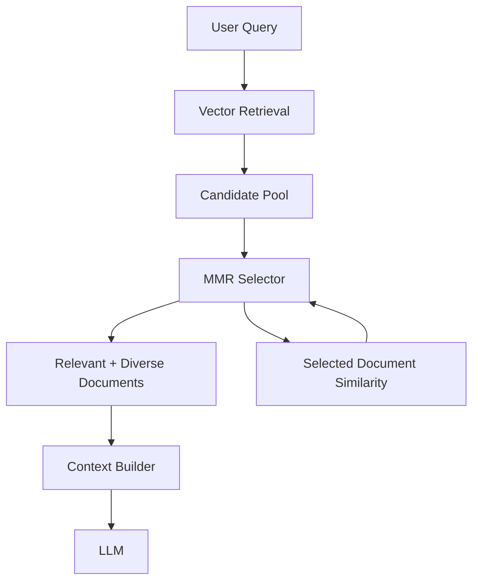
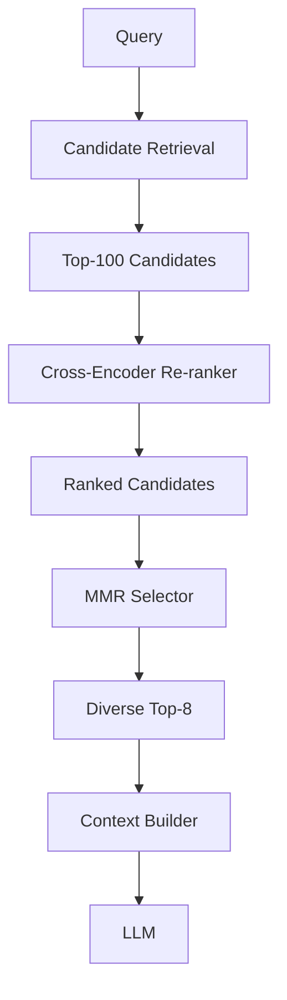
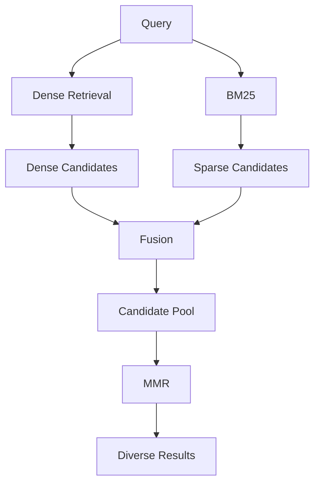
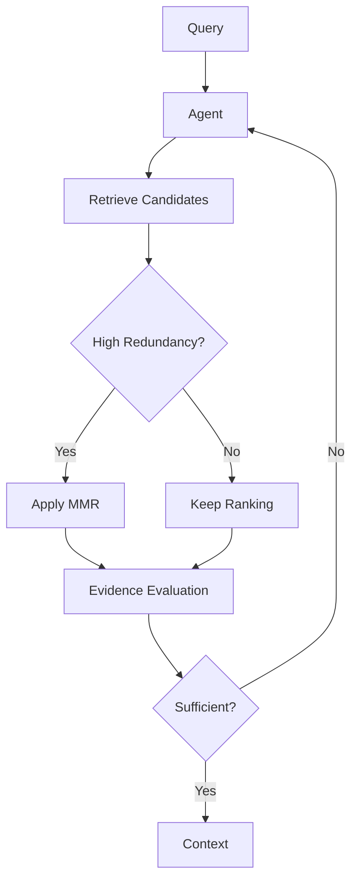
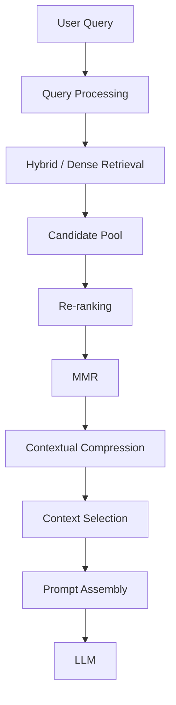

# MMR and Diversity-Aware Retrieval

## 📖 Overview

**Maximal Marginal Relevance (MMR)** is a retrieval and context-selection technique designed to balance two competing goals:

- **Relevance** — retrieve documents that are highly relevant to the user query.
- **Diversity** — avoid retrieving documents that contain essentially the same information.

A standard similarity search may return:

```text
Query
  ↓
Vector Search
  ↓
Top-K
  ↓
Chunk A
Chunk A2
Chunk A3
Chunk A4
Chunk B
```

Although all five chunks may be relevant, four of them may describe the same information.

MMR attempts to produce a more useful set:

```text
Query
  ↓
Candidate Retrieval
  ↓
MMR Selection
  ↓
Chunk A
Chunk B
Chunk C
Chunk D
  ↓
Context
  ↓
LLM
```

The central idea is:

> **Select documents that are relevant to the query while penalizing documents that are too similar to documents already selected.**

This is especially useful for RAG systems where the context window is limited and redundant chunks waste valuable context.

---

# 🎯 Learning Objectives

After completing this chapter, you will be able to:

- Understand the problem of redundant retrieval
- Understand Maximal Marginal Relevance
- Explain relevance vs diversity
- Understand the MMR scoring function
- Understand the lambda parameter
- Implement MMR retrieval
- Use MMR with vector databases
- Understand MMR candidate pools
- Compare similarity search with MMR
- Combine MMR with re-ranking
- Combine MMR with hybrid retrieval
- Apply MMR to RAG context selection
- Understand MMR limitations
- Tune MMR parameters
- Evaluate diversity-aware retrieval
- Design production-grade diversity-aware retrieval pipelines

---

# 1. The Redundancy Problem

Consider a document containing:

```text
Payment Authentication
```

After chunking, we might get:

```text
Chunk 1:
Payment authentication uses OAuth.

Chunk 2:
OAuth tokens authenticate payment requests.

Chunk 3:
Payment requests require valid OAuth tokens.

Chunk 4:
OAuth authentication protects payment APIs.

Chunk 5:
Payment failures may occur when OAuth tokens expire.
```

A vector search may return:

```text
1. Chunk 1
2. Chunk 2
3. Chunk 3
4. Chunk 4
5. Chunk 5
```

The first four chunks contain highly overlapping information.

The LLM receives:

```text
OAuth
OAuth
OAuth
OAuth
OAuth expiration
```

instead of broader evidence.

---

# 2. Context Redundancy

Redundant context creates several problems:

```text
Redundancy
   ↓
Less Information Diversity
   ↓
Wasted Context Window
   ↓
Less Space for Other Evidence
   ↓
Potentially Lower Answer Quality
```

The goal is therefore not:

```text
Retrieve the most similar documents.
```

The goal is:

```text
Retrieve the most useful set of documents.
```

---

# 3. Similarity Search vs MMR

### Similarity Search

Each document is independently ranked against the query.

```text
Query
 ↓
Similarity
 ↓
Document 1
Document 2
Document 3
Document 4
```

### MMR

Each selected document is evaluated against:

```text
Query relevance
+
Similarity to already selected documents
```

```text
Query
 ↓
Candidate Pool
 ↓
Select Relevant Document
 ↓
Penalize Redundancy
 ↓
Select Next Document
 ↓
Repeat
```

---

# 4. MMR Architecture



MMR is therefore an **iterative selection algorithm**.

---

# 5. The Core MMR Formula

The standard MMR objective is:


Where:

```text
Dᵢ = candidate document
Q  = user query
S  = documents already selected
λ  = relevance/diversity trade-off
```

The two terms represent:

```text
Query Relevance
       -
Redundancy
```

---

# 6. Understanding the Formula

The first term:

```text
λ × Sim(Document, Query)
```

rewards documents that are relevant to the query.

The second term:

```text
(1 - λ) × max Similarity(Document, Selected Documents)
```

penalizes documents that are too similar to information already selected.

Therefore:

```text
High Query Relevance
+
Low Redundancy
=
High MMR Score
```

---

# 7. The Lambda Parameter

The parameter:

```text
λ
```

controls the balance between relevance and diversity.

Conceptually:

```text
λ → 1
```

means:

```text
Prioritize Relevance
```

while:

```text
λ → 0
```

means:

```text
Prioritize Diversity
```

A common practical starting point is somewhere in the middle, but the correct value must be evaluated against the application's retrieval dataset.

---

# 8. Lambda Spectrum

```text
λ = 1.0
│
├── Strong relevance
├── Minimal diversity penalty
│
0.75
│
├── Relevance-oriented
│
0.50
│
├── Balanced
│
0.25
│
├── Diversity-oriented
│
0.0
│
└── Maximum diversity preference
```

Do not treat these values as universal defaults.

The optimal value depends on:

```text
Corpus
Chunking
Query Type
Candidate Pool
Final Context Size
```

---

# 9. Relevance vs Diversity

Think of MMR as a two-dimensional optimization problem.

```text
                  High Relevance
                       ↑
                       │
               A       │
                       │
           B           │
                       │
───────────────────────┼────────→ Diversity
                       │
       C               │
                       │
                       ↓
                  Low Relevance
```

The desired documents should provide:

```text
High Relevance
+
Useful Diversity
```

---

# 10. First Document Selection

Initially:

```text
Selected Documents = ∅
```

There is no redundancy penalty.

Therefore the first selected document is usually the document with the strongest query relevance.

```text
Query
 ↓
Candidate Scores
 ↓
Highest Relevant Candidate
 ↓
Selected
```

---

# 11. Second Document Selection

After selecting:

```text
Document A
```

the next document is evaluated using:

```text
Query Relevance
-
Similarity to Document A
```

Suppose:

```text
Document B
```

is almost identical to A.

Its MMR score is reduced.

Another document:

```text
Document C
```

may be slightly less relevant but provide different information.

MMR may select:

```text
A
C
```

instead of:

```text
A
B
```

---

# 12. Iterative MMR Selection

The process looks like:

```text
Candidate Pool
     ↓
Select Best
     ↓
Selected = A
     ↓
Calculate MMR
     ↓
Select Best Remaining
     ↓
Selected = A, C
     ↓
Calculate MMR
     ↓
Select Best Remaining
     ↓
Selected = A, C, D
```

The algorithm continues until:

```text
Final K
```

documents are selected.

---

# 13. MMR Selection Algorithm

```python
selected = []

while len(selected) < top_k:

    best_document = None
    best_score = float("-inf")

    for document in candidates:

        if document in selected:
            continue

        relevance = similarity(
            query,
            document
        )

        redundancy = max(
            similarity(
                document,
                selected_doc
            )
            for selected_doc in selected
        ) if selected else 0

        mmr_score = (
            lambda_value * relevance
            - (1 - lambda_value) * redundancy
        )

        if mmr_score > best_score:
            best_score = mmr_score
            best_document = document

    selected.append(best_document)
```

This is a simplified conceptual implementation.

Production vector stores may implement MMR more efficiently.

---

# 14. Handling the First Selection

The first document has no previously selected documents.

Therefore:

```python
if not selected:
    redundancy = 0
```

The first selection is driven primarily by:

```text
Query relevance
```

---

# 15. Complete Conceptual Implementation

```python
def mmr_select(
    query,
    candidates,
    similarity_query,
    similarity_document,
    top_k,
    lambda_value
):

    selected = []

    while len(selected) < top_k:

        best = None
        best_score = float("-inf")

        for candidate in candidates:

            if candidate in selected:
                continue

            relevance = similarity_query(
                query,
                candidate
            )

            if selected:

                redundancy = max(
                    similarity_document(
                        candidate,
                        selected_doc
                    )
                    for selected_doc in selected
                )

            else:
                redundancy = 0

            score = (
                lambda_value * relevance
                - (1 - lambda_value) * redundancy
            )

            if score > best_score:
                best_score = score
                best = candidate

        selected.append(best)

    return selected
```

---

# 16. Candidate Pool

MMR does not normally operate against the entire document corpus.

Instead:

```text
Large Corpus
    ↓
Initial Retrieval
    ↓
Candidate Pool
    ↓
MMR
    ↓
Final Results
```

For example:

```text
1,000,000 Documents
        ↓
Vector Search Top-100
        ↓
MMR
        ↓
Top-10
```

---

# 17. Candidate K vs Final K

Two parameters should be distinguished:

```text
Candidate K
```

and:

```text
Final K
```

Example:

```text
Candidate K = 100
Final K = 8
```

The candidate pool gives MMR enough alternatives to improve diversity.

If:

```text
Candidate K = Final K
```

there may be little room for meaningful diversity optimization.

---

# 18. Why Candidate Pool Matters

Suppose:

```text
Candidate K = 5
Final K = 5
```

MMR has no alternatives.

But:

```text
Candidate K = 100
Final K = 5
```

MMR can choose:

```text
Relevant + Diverse
```

documents from a much larger set.

Therefore:

```text
Candidate Recall
+
Diversity Selection
```

work together.

---

# 19. MMR Does Not Improve Recall

This is an important distinction.

If a relevant document is absent from:

```text
Candidate Pool
```

MMR cannot retrieve it.

Therefore:

```text
Retriever
→ Recall

MMR
→ Diversity-aware Selection
```

MMR should not be considered a replacement for a strong first-stage retriever.

---

# 20. Similarity Search Example

Imagine:

```text
Query:
"How does Kafka handle payment events?"
```

Initial retrieval:

```text
Rank 1 → Kafka payment events
Rank 2 → Kafka payment producer
Rank 3 → Kafka payment consumer
Rank 4 → Kafka payment events retry
Rank 5 → Kafka payment architecture
```

These may all be useful.

But if:

```text
Rank 1
Rank 2
Rank 3
```

contain nearly identical descriptions, MMR may choose a broader combination.

---

# 21. Example with Information Diversity

Potential documents:

```text
A → Payment event publishing
B → Payment event publishing
C → Retry handling
D → Consumer architecture
E → Kafka failure recovery
```

Similarity ranking:

```text
A
B
C
D
E
```

MMR might produce:

```text
A
C
D
E
```

The final context covers:

```text
Publishing
+
Retries
+
Consumer Architecture
+
Failure Recovery
```

instead of repeatedly covering publishing.

---

# 22. MMR and RAG Context

RAG systems have limited context budgets.

Suppose:

```text
Context Budget = 8 chunks
```

Returning:

```text
8 nearly identical chunks
```

is inefficient.

Instead:

```text
2 chunks → Primary answer
2 chunks → Supporting evidence
2 chunks → Related technical details
2 chunks → Edge cases
```

can provide broader evidence.

MMR helps move retrieval toward this behavior.

---

# 23. Context Window Efficiency

The goal is:

```text
Maximum Useful Information
```

within:

```text
Limited Context
```

Conceptually:

```text
Context Budget
┌───────────────────────────────┐
│ Relevant Information          │
│ Supporting Evidence           │
│ Diverse Evidence              │
│ Important Exceptions          │
└───────────────────────────────┘
```

MMR can improve the information density of this context.

---

# 24. MMR with Re-ranking

MMR and re-ranking solve related but different problems.

### Re-ranking

```text
Which candidate is most relevant?
```

### MMR

```text
Which set of candidates is both relevant
and non-redundant?
```

A useful pipeline is:

```text
Candidate Retrieval
      ↓
Re-ranking
      ↓
MMR / Diversity Selection
      ↓
Context
```

---

# 25. Re-ranking + MMR Architecture



The re-ranker improves:

```text
Ordering
```

while MMR improves:

```text
Set Diversity
```

---

# 26. Why MMR After Re-ranking?

Suppose re-ranking produces:

```text
1. A
2. A2
3. A3
4. B
5. C
```

The first three may be highly relevant but redundant.

MMR can select:

```text
A
B
C
```

rather than:

```text
A
A2
A3
```

This makes the final context more diverse.

---

# 27. MMR Before Re-ranking

Another architecture is:

```text
Candidate Retrieval
 ↓
MMR
 ↓
Re-ranking
```

This can be useful when:

```text
Candidate Pool is very large
```

and MMR reduces the number of candidates before an expensive re-ranker.

Example:

```text
Top-500
 ↓
MMR
 ↓
Top-100
 ↓
Cross-Encoder
 ↓
Top-10
```

The better ordering depends on:

```text
Quality
Latency
Candidate Size
Model Cost
```

---

# 28. Three-Stage Retrieval

A mature pipeline can use:

```text
Stage 1
Candidate Retrieval
        ↓
Stage 2
Re-ranking
        ↓
Stage 3
Diversity Selection
```

Example:

```text
1,000,000 Documents
        ↓
Hybrid Search
        ↓
500 Candidates
        ↓
Cross-Encoder
        ↓
100 Candidates
        ↓
MMR
        ↓
10 Documents
        ↓
LLM
```

---

# 29. MMR with Hybrid Search

Hybrid retrieval produces a candidate pool from:

```text
Dense Search
+
Sparse Search
```

Then MMR can select diverse candidates.



This is useful when the corpus contains both:

```text
Semantic Concepts
```

and:

```text
Exact Technical Terms
```

---

# 30. MMR with Multi-Query Retrieval

Multi-query retrieval produces several query formulations:

```text
Original Query
     ↓
Query 1
Query 2
Query 3
     ↓
Multiple Retrieval Results
     ↓
Candidate Fusion
     ↓
MMR
```

MMR can prevent the final context from being dominated by documents returned by one query variant.

---

# 31. MMR with Multi-Query Example

Query:

```text
"How does payment retry work?"
```

Generated queries:

```text
Q1:
Payment retry mechanism

Q2:
Payment failure recovery

Q3:
Transaction retry policy
```

The merged candidate set may contain duplicates.

MMR can select:

```text
Retry Mechanism
+
Failure Recovery
+
Transaction Policy
```

instead of repeated chunks about the same mechanism.

---

# 32. MMR with Parent-Document Retrieval

Parent-document retrieval introduces:

```text
Child Chunk
 ↓
Parent Document
```

A naive implementation may retrieve many child chunks from the same parent.

Example:

```text
Parent A
 ├── Chunk 1
 ├── Chunk 2
 ├── Chunk 3

Parent B
 └── Chunk 1
```

MMR can help increase diversity.

However, in some applications it may be better to apply diversity at the **parent-document level** rather than the child-chunk level.

---

# 33. Parent-Level Diversity

Instead of:

```text
Chunk A1
Chunk A2
Chunk A3
Chunk B1
```

select:

```text
Parent A
Parent B
Parent C
```

and then choose the most relevant chunks within each parent.

This can be more appropriate when documents represent distinct knowledge sources.

---

# 34. MMR with Multi-Vector Retrieval

Multi-vector retrieval may represent:

```text
Document Summary
Text Chunks
Tables
Images
Captions
```

The candidate pool may contain several representations of the same source.

MMR can reduce redundant representations.

Example:

```text
Document A Summary
Document A Chunk 1
Document A Chunk 2
Document B Chunk 1
Document C Table
```

A diversity-aware selector can provide broader evidence.

---

# 35. MMR with Contextual Compression

A possible pipeline:

```text
Candidate Retrieval
 ↓
Re-ranking
 ↓
MMR
 ↓
Contextual Compression
 ↓
Final Context
```

MMR determines:

```text
Which documents?
```

Compression determines:

```text
Which parts of those documents?
```

These are complementary operations.

---

# 36. MMR and Contextual Compression

Example:

```text
100 Candidates
 ↓
Re-ranking
 ↓
30 Candidates
 ↓
MMR
 ↓
10 Diverse Documents
 ↓
Compression
 ↓
Relevant Passages
 ↓
LLM
```

This reduces the amount of irrelevant content entering the final prompt.

---

# 37. MMR with Metadata Filtering

Metadata filters should generally happen before MMR.

Example:

```text
User Query
 ↓
Tenant Filter
 ↓
Access Control
 ↓
Date Filter
 ↓
Candidate Retrieval
 ↓
MMR
```

Security filtering must happen before any document is allowed into the selection process.

---

# 38. Security Is Not Diversity

Do not use MMR to implement access control.

Incorrect:

```text
MMR
 ↓
Remove unauthorized documents
```

Correct:

```text
Authorization Filter
 ↓
Only authorized documents
 ↓
MMR
```

MMR is a ranking/selection technique, not a security mechanism.

---

# 39. MMR and Metadata

Metadata can also be used for diversity.

For example:

```text
Source Diversity
```

may be desirable.

Suppose:

```text
10 retrieved chunks
```

all come from:

```text
One document
```

A system may prefer:

```text
Document A
Document B
Document C
```

when multiple independent sources are valuable.

---

# 40. Source Diversity

A diversity-aware strategy can consider:

```text
Semantic Diversity
+
Source Diversity
+
Topic Diversity
```

For example:

```text
Chunk similarity
+
Same document
+
Same section
```

can all be considered signals of redundancy.

---

# 41. Semantic Diversity vs Source Diversity

These should not be confused.

### Semantic Diversity

Documents discuss different information.

### Source Diversity

Documents originate from different sources.

Two documents may be:

```text
Semantically different
```

but belong to the same source.

Or:

```text
Semantically similar
```

but come from independent sources.

The correct strategy depends on the use case.

---

# 42. Diversity-Aware Selection

A production ranking system can conceptually score:

```text
Final Utility
=
Relevance
-
Redundancy
+
Source Diversity
```

The exact implementation should be carefully evaluated.

---

# 43. MMR with Source Penalties

A simplified custom approach:

```python
def source_penalty(
    candidate,
    selected
):

    if not selected:
        return 0

    same_source = sum(
        candidate.metadata["source"]
        == document.metadata["source"]
        for document in selected
    )

    return same_source
```

This can be combined with semantic redundancy.

However, arbitrary penalties can hurt retrieval quality, so they should be validated experimentally.

---

# 44. Diversity Constraints

Another approach is to define constraints.

Example:

```text
Maximum 3 chunks per document
```

or:

```text
At least 2 distinct sources
```

or:

```text
At most 2 chunks per section
```

This is different from pure MMR.

It is a **constrained selection strategy**.

---

# 45. MMR vs Hard Diversity Constraints

| Technique | Behavior |
|---|---|
| MMR | Soft diversity penalty |
| Source limit | Hard constraint |
| Parent limit | Hard constraint |
| Topic diversification | Soft or hard |
| Metadata penalty | Soft penalty |

MMR is often useful when you want flexibility rather than rigid rules.

---

# 46. MMR and Topic Diversity

Suppose a query asks:

```text
"What are the security risks of our payment API?"
```

Relevant topics may include:

```text
Authentication
Authorization
Encryption
Rate Limiting
Input Validation
Logging
```

A pure similarity search might focus heavily on:

```text
Authentication
```

MMR can encourage broader coverage if the candidate pool contains relevant evidence from other topics.

---

# 47. Topic Diversity Example

```text
Candidate Pool:

A → Authentication
B → Authentication
C → Encryption
D → Rate Limiting
E → Authorization
```

Similarity ranking:

```text
A
B
C
E
D
```

MMR may select:

```text
A
C
E
D
```

The final context covers more security dimensions.

---

# 48. MMR for Enterprise Research

MMR is particularly useful for:

```text
Research Assistants
Knowledge Assistants
Technical Documentation
Legal Research
Financial Research
Compliance
Incident Investigation
Architecture Analysis
```

because these tasks often require:

```text
Multiple Supporting Evidence Sources
```

rather than repeated copies of the same statement.

---

# 49. MMR for Technical Documentation

Question:

```text
"How should we deploy the payment service?"
```

Useful context may include:

```text
Deployment Guide
Architecture Documentation
Configuration Reference
Security Requirements
Troubleshooting Guide
```

MMR can help avoid returning five nearly identical deployment paragraphs.

---

# 50. MMR for Incident Investigation

Question:

```text
"Why did payment failures increase yesterday?"
```

Useful evidence may include:

```text
Incident Report
Deployment Record
Monitoring Data
Runbook
Architecture Documentation
```

Diverse retrieval can improve investigation coverage.

---

# 51. MMR for Policy Questions

Question:

```text
"What is the current password policy?"
```

In this case, diversity may be less important than:

```text
Authority
+
Recency
+
Exact Policy
```

Therefore:

```text
MMR may provide limited value.
```

The latest approved policy should dominate.

This demonstrates an important principle:

> **Diversity is useful only when diversity adds information value.**

---

# 52. MMR for FAQ Systems

For simple FAQ systems:

```text
Query
 ↓
Top-3 Similar Results
```

may already be sufficient.

Adding MMR can introduce less relevant but more diverse results.

Therefore always evaluate whether diversity improves the actual answer.

---

# 53. MMR Parameter Tuning

Important parameters include:

```text
Candidate K
Final K
Lambda
Similarity Function
Embedding Model
Chunk Size
Chunk Overlap
```

These parameters interact.

For example:

```text
Large chunks
+
High diversity pressure
```

may behave differently from:

```text
Small chunks
+
High relevance pressure
```

---

# 54. Lambda Tuning Experiment

Try:

```text
λ = 0.25
λ = 0.50
λ = 0.75
λ = 0.90
```

Measure:

```text
Retrieval Relevance
Redundancy
Coverage
Answer Quality
Latency
```

Then select the value based on evidence.

---

# 55. Candidate K Experiment

Try:

```text
K = 20
K = 50
K = 100
K = 200
```

Measure:

```text
Recall@K
Diversity
Final Answer Quality
Latency
```

Larger candidate pools provide MMR with more alternatives but increase computational cost.

---

# 56. Final K Experiment

Try:

```text
Final K = 3
Final K = 5
Final K = 8
Final K = 10
```

The optimal value depends on:

```text
Context Window
Query Complexity
Chunk Size
Generation Model
```

More documents do not automatically produce better answers.

---

# 57. Measuring Redundancy

One useful conceptual metric is average pairwise similarity.

For selected documents:

```text
D1
D2
D3
D4
```

calculate:

```text
Similarity(D1,D2)
Similarity(D1,D3)
Similarity(D1,D4)
...
```

Then calculate the average.

Lower average similarity generally indicates greater diversity.

---

# 58. Pairwise Redundancy

Conceptually:

```text
Redundancy =
Average Pairwise Similarity
```

Example:

```text
Similarity-based retrieval:

Average similarity = 0.86

MMR retrieval:

Average similarity = 0.58
```

The lower value indicates less redundancy.

However, lower similarity is not automatically better if it also reduces relevance.

---

# 59. Diversity vs Relevance Evaluation

A good evaluation should measure both:

```text
Relevance ↑
```

and:

```text
Redundancy ↓
```

A useful comparison:

| Strategy | Relevance | Redundancy | Coverage |
|---|---:|---:|---:|
| Similarity Search | High | High | Medium |
| MMR | High | Lower | Higher |
| Strong Diversity | Medium | Low | High |

The objective is not maximum diversity.

It is:

> **Maximum useful diversity while maintaining relevance.**

---

# 60. Coverage

Another useful metric is topic or requirement coverage.

Question:

```text
"What are the security risks of the payment API?"
```

Expected areas:

```text
Authentication
Authorization
Encryption
Rate Limiting
Validation
```

If the selected context covers:

```text
Authentication
Authorization
Encryption
```

then coverage is:

```text
3 / 5
```

MMR can potentially improve coverage by reducing redundant results.

---

# 61. Context Utility

A practical evaluation concept:

```text
Context Utility
=
Relevance
+
Coverage
+
Diversity
-
Noise
```

This is not a universal mathematical metric, but it is a useful design framework.

---

# 62. MMR Evaluation Dataset

Create queries with expected evidence categories.

Example:

```json
{
  "query": "What are the security risks of the payment API?",
  "required_topics": [
    "authentication",
    "authorization",
    "encryption",
    "rate_limiting"
  ]
}
```

Then evaluate whether the selected context covers the required topics.

---

# 63. Similarity Search Baseline

Always compare MMR against:

```text
Standard Similarity Search
```

Example experiment:

```text
Baseline:
Vector Search → Top-8

Candidate:
Vector Search → Top-50 → MMR → Top-8
```

Compare:

```text
Relevance
Coverage
Redundancy
Answer Quality
```

---

# 64. Re-ranking + MMR Baseline

A stronger comparison:

```text
Pipeline A:
Vector Search → Top-8

Pipeline B:
Vector Search → Re-ranking → Top-8

Pipeline C:
Vector Search → Re-ranking → MMR → Top-8
```

This reveals which stage provides actual value.

---

# 65. MMR and RAG Evaluation

Downstream evaluation should include:

```text
Context Relevance
Context Diversity
Context Coverage
Answer Faithfulness
Answer Correctness
Citation Accuracy
```

A retrieval technique is successful only if it improves the overall application or meets a clear operational objective.

---

# 66. MMR and Hallucination

MMR can reduce redundant context and increase evidence coverage.

Potential effect:

```text
Better Context Diversity
       ↓
Broader Evidence
       ↓
Better Grounding
```

However:

```text
MMR ≠ Hallucination Prevention
```

The final RAG system still requires:

```text
Grounded Generation
+
Response Validation
+
Citation
```

---

# 67. MMR and Context Window

Suppose the model has:

```text
Context Budget = 16,000 tokens
```

Retrieved chunks consume:

```text
Chunk A = 3,000
Chunk B = 3,000
Chunk C = 3,000
Chunk D = 3,000
Chunk E = 3,000
```

Five chunks consume:

```text
15,000 tokens
```

If A, B, and C are nearly identical, much of the context budget is wasted.

MMR can help select more complementary chunks.

---

# 68. Token-Aware Diversity

A production system can go beyond basic MMR.

Consider:

```text
Relevance
+
Diversity
+
Token Cost
```

A large document may be highly relevant but consume excessive context.

A smaller complementary document may provide more useful information per token.

This leads to:

```text
Token-Aware Context Selection
```

which can be implemented after basic MMR.

---

# 69. MMR with Document Length

Example:

```text
Document A
Relevance = 0.95
Tokens = 8,000

Document B
Relevance = 0.90
Tokens = 1,500
```

Depending on the context budget, Document B may provide better practical utility.

However, token cost should not override evidence importance blindly.

---

# 70. Diversity-Aware Context Optimization

A more advanced architecture:

```text
Candidate Retrieval
       ↓
Re-ranking
       ↓
MMR
       ↓
Token Budget Check
       ↓
Context Selection
```

This moves retrieval toward:

```text
Evidence Utility per Context Token
```

rather than simple Top-K retrieval.

---

# 71. MMR and Agentic Retrieval

Agentic Retrieval can dynamically decide whether MMR is useful.



This is useful when query types vary significantly.

---

# 72. Adaptive MMR

An adaptive system might use:

```text
Low redundancy
→ λ closer to relevance

High redundancy
→ stronger diversity pressure
```

Conceptually:

```text
Query with unique evidence
        ↓
Relevance-focused

Query with highly repetitive candidates
        ↓
Diversity-focused
```

The exact adaptation strategy should be validated empirically.

---

# 73. MMR with Agentic Retrieval

The agent may reason:

```text
Candidate results are repetitive.
```

Then:

```text
Apply MMR
```

Alternatively:

```text
Candidate results are insufficiently broad.
```

Then:

```text
Generate additional queries.
```

This distinction is important:

```text
Need different documents
→ Query expansion

Have enough documents but too much redundancy
→ MMR
```

---

# 74. MMR vs Query Expansion

### Query Expansion

Attempts to increase:

```text
Recall
```

### MMR

Attempts to improve:

```text
Selection Diversity
```

Pipeline:

```text
Low Recall
→ Query Expansion

High Redundancy
→ MMR
```

These techniques solve different problems.

---

# 75. MMR vs Re-ranking vs Query Rewriting

| Technique | Main Problem |
|---|---|
| Query Rewriting | Poor query formulation |
| Query Expansion | Poor recall |
| Re-ranking | Poor candidate ordering |
| MMR | Redundant candidate selection |
| Compression | Excess content inside selected documents |

A mature RAG system may use several of these techniques.

---

# 76. MMR and Advanced Retrieval Architecture



Each stage solves a different retrieval problem.

---

# 77. Production MMR Service

A capability-based interface:

```python
class DiversitySelector:

    def select(
        self,
        query,
        candidates,
        top_k,
        lambda_value
    ):
        raise NotImplementedError
```

Implementation:

```python
class MMRSelector(DiversitySelector):

    def select(
        self,
        query,
        candidates,
        top_k,
        lambda_value
    ):

        return mmr_select(
            query=query,
            candidates=candidates,
            top_k=top_k,
            lambda_value=lambda_value
        )
```

This keeps the application independent of the specific implementation.

---

# 78. Provider-Based Architecture

A production system can support:

```text
MMRSelector
CrossEncoderSelector
SourceDiversitySelector
HybridDiversitySelector
```

through:

```python
class DiversitySelectionProvider:

    def select(
        self,
        query,
        candidates,
        top_k
    ):
        ...
```

This is useful when different applications require different selection strategies.

---

# 79. Observability

Track:

```text
Candidate Count
Selected Count
Lambda
Initial Ranking
Final Ranking
Average Pairwise Similarity
Source Diversity
Topic Coverage
Selection Latency
Token Savings
```

Example:

```json
{
  "stage": "mmr",
  "candidate_count": 100,
  "selected_count": 8,
  "lambda": 0.65,
  "avg_pairwise_similarity": 0.54,
  "latency_ms": 8
}
```

---

# 80. Monitoring Redundancy

Track:

```text
Average Pairwise Similarity
```

before and after MMR.

Example:

```text
Before MMR:
0.84

After MMR:
0.57
```

If redundancy decreases but answer quality also decreases, the diversity pressure may be too strong.

---

# 81. Monitoring Relevance

Track:

```text
Average Relevance Score
```

alongside:

```text
Diversity Score
```

Avoid optimizing one metric in isolation.

A healthy system should aim for:

```text
High Relevance
+
Useful Diversity
```

---

# 82. Production Guardrails

```text
☐ Authorization applied before selection
☐ Candidate pool bounded
☐ Final K bounded
☐ Lambda configured
☐ Similarity model version tracked
☐ Retrieval model version tracked
☐ Selection latency monitored
☐ Redundancy monitored
☐ Relevance monitored
☐ Source diversity evaluated
☐ Context budget enforced
☐ Fallback strategy implemented
☐ Evaluation dataset maintained
```

---

# 83. Fallback Strategy

If MMR fails:

```text
Candidate Retrieval
       ↓
MMR Failure
       ↓
Fallback to Re-ranked Results
       ↓
Context Selection
```

Example:

```python
try:

    selected = mmr_selector.select(
        query,
        candidates,
        top_k=8,
        lambda_value=0.7
    )

except Exception:

    selected = candidates[:8]
```

The fallback should be observable and tested.

---

# 84. Performance Considerations

MMR requires repeated similarity calculations between:

```text
Candidate
```

and:

```text
Selected Documents
```

Therefore computational cost increases with:

```text
Candidate K
+
Final K
+
Embedding Dimension
```

For very large candidate sets, optimize through:

```text
Vectorized Operations
Batch Similarity
Precomputed Embeddings
Efficient Matrix Operations
```

---

# 85. Precomputed Embeddings

If candidate embeddings are already available:

```python
candidate_embeddings
```

and:

```python
query_embedding
```

can be reused.

This avoids repeatedly generating embeddings during MMR selection.

---

# 86. Vectorized Similarity

Instead of calculating similarities one by one:

```python
for candidate in candidates:
    similarity(...)
```

production implementations can use matrix operations.

Conceptually:

```text
Candidate Embeddings
        ↓
Similarity Matrix
        ↓
Fast MMR Selection
```

This can significantly improve throughput.

---

# 87. MMR Complexity

A simple implementation can approach:

```text
O(K × N)
```

similarity evaluations for:

```text
N = candidate count
K = selected count
```

With embedding operations and matrix calculations, actual runtime depends on implementation details.

The important engineering principle is:

> Keep the candidate pool bounded and optimize similarity calculations.

---

# 88. Caching

For repeated queries:

```text
Query
 ↓
Candidate Retrieval
 ↓
MMR
```

results may sometimes be cached.

However, caching must account for:

```text
User Permissions
Tenant
Index Version
Document Updates
Embedding Version
Ranking Configuration
Lambda
```

Never use a shared cache that bypasses authorization.

---

# 89. MMR and Multi-Tenant Systems

For enterprise multi-tenancy:

```text
User
 ↓
Tenant Context
 ↓
Authorization Filter
 ↓
Candidate Retrieval
 ↓
MMR
```

Never perform MMR over:

```text
All Tenants
```

and filter afterward.

The candidate set should already respect tenant boundaries.

---

# 90. MMR and Freshness

For dynamic knowledge:

```text
Candidate Retrieval
 ↓
Freshness Filtering
 ↓
MMR
```

or:

```text
Candidate Retrieval
 ↓
MMR
 ↓
Freshness-Aware Ranking
```

The correct order depends on whether freshness is:

```text
Hard Requirement
```

or:

```text
Soft Preference
```

For example:

```text
Current security policy
```

may require a hard freshness rule.

---

# 91. MMR and Authority

Similarly:

```text
Official Policy
```

should not be displaced by:

```text
Unofficial Discussion
```

simply because the discussion provides greater semantic diversity.

Therefore:

```text
Security
+
Authority
+
Freshness
```

may need to be applied before or alongside diversity selection.

---

# 92. Diversity Is Not Always Good

This is one of the most important lessons.

Suppose the question is:

```text
"What is the exact refund policy?"
```

The best context may be:

```text
Official Refund Policy
Official Refund Policy — Section 4
Official Refund Policy — Section 5
```

These are semantically similar but highly authoritative.

Aggressive diversity could replace them with:

```text
Customer FAQ
Internal Discussion
Old Documentation
```

which may actually reduce answer quality.

Therefore:

> **Diversity should serve the retrieval objective, not become the objective itself.**

---

# 93. Query-Type-Aware MMR

Different query classes may benefit from different selection strategies.

```text
Fact Lookup
→ Relevance-focused

Research Question
→ Diversity-focused

Policy Question
→ Authority + Recency

Troubleshooting
→ Diverse Evidence

Exact API Lookup
→ Relevance + Exact Match
```

This can be implemented through query classification or adaptive retrieval policies.

---

# 94. Query Classification

Conceptually:

```python
query_type = classify_query(query)

if query_type == "research":
    lambda_value = 0.55

elif query_type == "policy":
    lambda_value = 0.85

else:
    lambda_value = 0.70
```

The values above are illustrative only.

The correct configuration must be established through evaluation.

---

# 95. MMR and Enterprise Research

Research questions often require:

```text
Multiple Perspectives
+
Supporting Evidence
+
Independent Sources
```

MMR can help prevent the context from being dominated by a single document or viewpoint.

However, source authority and evidence quality should still be enforced.

---

# 96. MMR and Independent Evidence

For high-value questions, multiple independent sources can be useful.

Example:

```text
Source A → Architecture Document
Source B → Incident Report
Source C → Monitoring Data
```

This provides stronger evidence than:

```text
Source A
Source A
Source A
```

MMR can help when the candidate pool contains these complementary sources.

---

# 97. MMR and Evidence Triangulation

For some enterprise questions:

```text
Documentation
+
Operational Data
+
Incident Evidence
```

provide stronger support.

The retrieval architecture can therefore favor complementary evidence categories.

This is especially useful for:

```text
Root Cause Analysis
Compliance
Financial Research
Technical Investigation
```

---

# 98. MMR with Evidence Categories

A more advanced selector may consider:

```text
Relevance
+
Semantic Diversity
+
Evidence Category Diversity
```

For example:

```text
Architecture
Operational
Security
Business
```

This goes beyond standard MMR and should be treated as a custom diversity-aware strategy.

---

# 99. MMR and RAG Context Assembly

A practical pipeline:

```text
User Query
    ↓
Query Processing
    ↓
Candidate Retrieval
    ↓
Re-ranking
    ↓
MMR
    ↓
Context Compression
    ↓
Context Ordering
    ↓
Prompt Assembly
    ↓
LLM
```

This creates a clear separation between:

```text
Retrieval
Ranking
Diversity
Compression
Context Engineering
Generation
```

---

# 100. Recommended Enterprise Pattern

For a production RAG system:

```text
                User Query
                     ↓
              Security Context
                     ↓
             Query Processing
                     ↓
          Dense / Hybrid Retrieval
                     ↓
               Candidate Pool
                     ↓
                Re-ranking
                     ↓
                   MMR
                     ↓
          Contextual Compression
                     ↓
             Context Selection
                     ↓
              Prompt Assembly
                     ↓
                    LLM
                     ↓
             Response Validation
                     ↓
                 Citation
                     ↓
            Enterprise Response
```

Each stage has a different responsibility.

---

# 101. Similarity Search vs MMR vs Re-ranking

| Technique | Main Goal | Works On |
|---|---|---|
| Similarity Search | Find relevant candidates | Large corpus |
| Re-ranking | Improve relevance ordering | Candidate pool |
| MMR | Improve relevance + diversity | Candidate pool |
| Compression | Reduce unnecessary content | Selected documents |

These techniques are complementary.

---

# 102. MMR vs Re-ranking

The distinction is especially important.

### Re-ranking

```text
"What is the relevance of each document?"
```

### MMR

```text
"Which combination of documents gives
the best relevance/diversity trade-off?"
```

Re-ranking is primarily:

```text
Pointwise / pairwise document evaluation
```

MMR is:

```text
Set-aware selection
```

This makes MMR particularly useful for final context selection.

---

# 103. MMR as Set Selection

Traditional ranking:

```text
Document A → Score
Document B → Score
Document C → Score
```

MMR considers:

```text
Document A
+
Already Selected Documents
```

Therefore:

```text
Selection is context-dependent.
```

A document's value can change depending on what has already been selected.

This is one of the most important conceptual differences.

---

# 104. Example of Context-Dependent Selection

Suppose:

```text
A = 0.95 relevance
B = 0.94 relevance
C = 0.90 relevance
```

But:

```text
Similarity(A,B) = 0.98
Similarity(A,C) = 0.40
```

After selecting A:

```text
B
```

may receive a strong redundancy penalty.

Therefore:

```text
C
```

can be selected even though:

```text
C relevance < B relevance
```

because C contributes different information.

---

# 105. MMR Selection Table

| Document | Query Relevance | Similarity to Selected | MMR Preference |
|---|---:|---:|---|
| A | High | — | Select |
| B | Very High | Very High | Lower |
| C | High | Low | Higher |
| D | Medium | Low | Depends on λ |

This demonstrates the trade-off.

---

# 106. Practical Python Example

```python
documents = [
    "OAuth authentication for payments",
    "OAuth tokens authenticate payment requests",
    "Payment retry mechanisms",
    "Payment failure recovery",
    "Kafka payment event processing"
]

query = "How does payment authentication and failure recovery work?"
```

A similarity-only retriever may return:

```text
OAuth authentication
OAuth tokens
Payment retry
OAuth authentication details
```

MMR may produce:

```text
OAuth authentication
Payment retry
Payment failure recovery
Kafka payment processing
```

The second set provides broader coverage.

---

# 107. Practical LangChain-Style Example

Many retrieval frameworks expose MMR through a retriever configuration.

Conceptually:

```python
retriever = vector_store.as_retriever(
    search_type="mmr",
    search_kwargs={
        "k": 8,
        "fetch_k": 50,
        "lambda_mult": 0.7
    }
)
```

The important parameters are:

```text
k
→ Final documents

fetch_k
→ Candidate pool

lambda_mult
→ Relevance/diversity balance
```

Always verify the exact API for the framework and version used in your application.

---

# 108. Understanding `fetch_k`

A common MMR configuration contains:

```text
fetch_k
```

and:

```text
k
```

For example:

```python
search_kwargs = {
    "fetch_k": 50,
    "k": 8
}
```

Meaning conceptually:

```text
Retrieve 50 candidates
        ↓
Apply MMR
        ↓
Return 8
```

A larger `fetch_k` gives MMR more choices.

---

# 109. Understanding `lambda_mult`

A framework may expose:

```python
lambda_mult=0.7
```

Conceptually:

```text
Higher value
→ More relevance

Lower value
→ More diversity
```

Do not assume framework parameter names or exact score semantics are identical across libraries.

Always verify implementation details when moving between frameworks.

---

# 110. Production Tuning Example

Start with:

```python
search_kwargs = {
    "fetch_k": 50,
    "k": 8,
    "lambda_mult": 0.7
}
```

Then evaluate:

```text
fetch_k:
20 / 50 / 100

k:
5 / 8 / 10

lambda:
0.5 / 0.7 / 0.85
```

Measure:

```text
Relevance
Coverage
Redundancy
Answer Quality
Latency
```

---

# 111. MMR and Retrieval Testing

Test at three levels.

### Retrieval Level

```text
Are relevant documents selected?
```

### Context Level

```text
Is the context diverse and useful?
```

### Answer Level

```text
Does the final answer improve?
```

A change that improves retrieval diversity but harms answer correctness is not necessarily a successful change.

---

# 112. Regression Testing

Whenever you change:

```text
Embedding Model
Chunking
Retriever
Re-ranker
MMR Lambda
Candidate K
Final K
```

run the retrieval evaluation suite again.

Track:

```text
Baseline
vs
New Configuration
```

This prevents silent retrieval degradation.

---

# 113. A/B Testing MMR

Compare:

```text
A:
Similarity Search

B:
MMR

C:
Re-ranking

D:
Re-ranking + MMR
```

Measure:

```text
NDCG
MRR
Redundancy
Coverage
Answer Quality
Latency
Cost
```

The winning configuration should be based on the application's objectives.

---

# 114. MMR Production Checklist

```text
☐ Candidate pool configured
☐ Final K configured
☐ Lambda tuned
☐ Security filters applied first
☐ Metadata filters validated
☐ Re-ranking integration tested
☐ Diversity measured
☐ Relevance measured
☐ Context coverage measured
☐ Context token budget measured
☐ Source provenance preserved
☐ Fallback implemented
☐ Latency monitored
☐ Regression dataset maintained
☐ Query-type behavior evaluated
```

---

# 115. Key Takeaways

- MMR stands for **Maximal Marginal Relevance**.
- MMR balances relevance with diversity.
- Standard similarity search can return highly redundant chunks.
- MMR selects documents iteratively.
- The first selection is primarily relevance-driven.
- Subsequent selections are penalized for similarity to already selected documents.
- `λ` controls the relevance/diversity trade-off.
- Higher `λ` generally favors relevance.
- Lower `λ` generally favors diversity.
- MMR operates on a candidate pool rather than the entire corpus.
- MMR cannot recover documents missing from the candidate pool.
- Candidate K and final K should be tuned separately.
- Re-ranking and MMR solve different problems.
- Re-ranking improves document ordering.
- MMR improves the usefulness of the selected document set.
- MMR works well with dense retrieval, hybrid search, multi-query retrieval, and re-ranking.
- MMR can reduce redundant context in RAG applications.
- Source diversity and semantic diversity are different concepts.
- Hard authorization rules must be applied before diversity selection.
- Diversity should not override authority, freshness, or correctness requirements.
- MMR is particularly useful for research and multi-document questions.
- Simple fact lookup may not require MMR.
- MMR should be evaluated using relevance, diversity, coverage, answer quality, latency, and cost.
- Production implementations should monitor candidate count, lambda, redundancy, relevance, and selection latency.
- The best MMR configuration depends on the corpus and query distribution.
- MMR should be treated as a **context-selection optimization**, not a replacement for high-quality retrieval.

The central pattern is:

```text
Retrieve Broadly
       ↓
Rank Precisely
       ↓
Select Diversely
       ↓
Build Better Context
       ↓
Generate from Evidence
```

Or:

```text
Don't just retrieve the most similar documents.

Retrieve the most useful combination of relevant documents.
```

---

# 🧭 Chapter Navigation

### Part V — Advanced Retrieval-Augmented Generation

**Previous:**  
[10. Re-ranking Techniques](10-reranking-techniques.md)

**Next:**  
[12. Metadata-Aware Retrieval](12-metadata-aware-retrieval.md)

**Section:**  
02 — Enterprise Retrieval Engineering

### Enterprise Retrieval Engineering Path

```text
01 Contextual Compression Retriever
              ↓
02 Ensemble Retriever
              ↓
03 Multi-Vector Retriever
              ↓
04 Time-Weighted Retriever
              ↓
05 Hybrid Search Retriever
              ↓
06 HyDE Retriever
              ↓
07 Router Retriever
              ↓
08 Multi-Stage Retrieval
              ↓
09 Agentic Retrieval
              ↓
10 Re-ranking Techniques
              ↓
11 MMR & Diversity-Aware Retrieval
              ↓
12 Metadata-Aware Retrieval
              ↓
13 Advanced Query Rewriting
```

---

> **Enterprise AI Engineering Handbook**  
> *Building Production-Grade Enterprise AI Systems — One Chapter at a Time.*