# LlamaIndex Retrievers Overview

## 📖 Overview

**LlamaIndex** is a framework for building applications that connect Large Language Models (LLMs) with external data.

In Retrieval-Augmented Generation (RAG), LlamaIndex provides abstractions for:

```text
Documents
   ↓
Nodes
   ↓
Indexes
   ↓
Retrievers
   ↓
Query Engines
   ↓
Response Synthesis
```

While the previous chapters focused on retrieval engineering concepts and framework-independent architectures, this section focuses specifically on how **LlamaIndex implements and composes retrieval capabilities**.

The goal is not simply to learn individual LlamaIndex classes.

The goal is to understand:

```text
LlamaIndex Retrieval
        ↓
Indexes
        ↓
Retriever Abstractions
        ↓
Specialized Retrievers
        ↓
Composable Retrieval
        ↓
Enterprise RAG Architecture
```

---

# 🎯 Learning Objectives

After completing this chapter, you will be able to:

- Understand the LlamaIndex retrieval architecture
- Understand Documents, Nodes, Indexes, and Retrievers
- Understand how retrieval fits into the LlamaIndex query pipeline
- Understand the relationship between indexes and retrievers
- Identify major LlamaIndex retriever types
- Understand vector-based retrieval
- Understand keyword and BM25 retrieval
- Understand recursive retrieval
- Understand query fusion
- Understand document-summary retrieval
- Understand auto-merging retrieval
- Understand how LlamaIndex supports advanced RAG architectures
- Compare LlamaIndex retrieval concepts with generic RAG concepts
- Design framework-aware retrieval components
- Integrate LlamaIndex retrieval into enterprise RAG systems

---

# 1. LlamaIndex in the RAG Architecture

A typical RAG application looks like:

```text
                 ┌──────────────────┐
                 │    User Query    │
                 └────────┬─────────┘
                          ↓
                 ┌──────────────────┐
                 │ Query Processing │
                 └────────┬─────────┘
                          ↓
                 ┌──────────────────┐
                 │    Retriever     │
                 └────────┬─────────┘
                          ↓
                 ┌──────────────────┐
                 │ Retrieved Nodes  │
                 └────────┬─────────┘
                          ↓
                 ┌──────────────────┐
                 │ Context Builder  │
                 └────────┬─────────┘
                          ↓
                 ┌──────────────────┐
                 │       LLM        │
                 └────────┬─────────┘
                          ↓
                 ┌──────────────────┐
                 │     Response     │
                 └──────────────────┘
```

LlamaIndex provides abstractions for many of these stages.

---

# 2. High-Level LlamaIndex Architecture

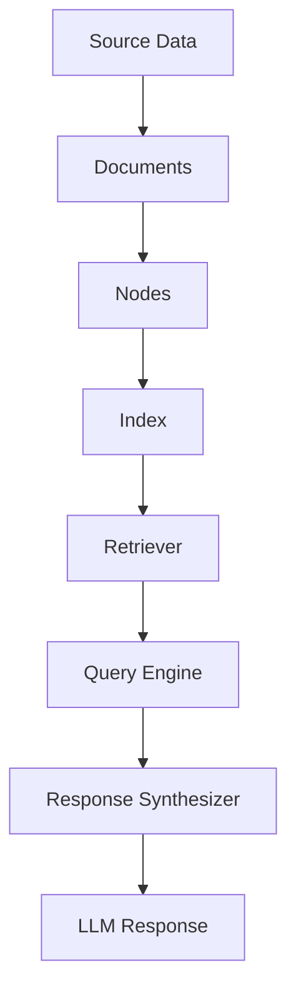

The important relationship is:

```text
Document
   ↓
Node
   ↓
Index
   ↓
Retriever
   ↓
Query Engine
```

---

# 3. Documents

A **Document** represents a source piece of information.

Sources can include:

```text
PDF
Web Page
Database
Markdown
Word Document
API
Cloud Storage
Enterprise Knowledge Base
```

Conceptually:

```python
from llama_index.core import Document

document = Document(
    text="""
    Payment authentication requires
    OAuth-based authorization.
    """
)
```

The document represents the source content before retrieval-specific processing.

---

# 4. Nodes

LlamaIndex works extensively with **Nodes**.

A document can be transformed into smaller units:

```text
Document
   ↓
Chunking
   ↓
Node 1
Node 2
Node 3
Node 4
```

A node typically contains:

```text
Text
+
Metadata
+
Relationships
+
Identifiers
```

Conceptually:

```python
from llama_index.core import Document
from llama_index.core.node_parser import SentenceSplitter

document = Document(
    text="Payment authentication requires OAuth..."
)

parser = SentenceSplitter(
    chunk_size=512,
    chunk_overlap=50
)

nodes = parser.get_nodes_from_documents(
    [document]
)
```

---

# 5. Nodes Are Central to Retrieval

Retrieval usually returns:

```text
Nodes
```

rather than entire documents.

For example:

```text
User Query
    ↓
Retriever
    ↓
Node 7
Node 19
Node 42
```

Each node can carry:

```text
Text
Score
Metadata
Source Reference
Parent Relationship
```

This is important for:

```text
Context Assembly
Citation
Parent Retrieval
Hierarchical Retrieval
Observability
```

---

# 6. Documents vs Nodes

| Concept | Purpose |
|---|---|
| Document | Represents source content |
| Node | Represents a retrievable unit |
| Metadata | Describes the content |
| Relationship | Connects nodes |
| Index | Organizes data for retrieval |
| Retriever | Finds relevant nodes |

Think of:

```text
Document
=
Source

Node
=
Retrieval Unit
```

---

# 7. What Is an Index?

An index organizes data so that it can be efficiently searched.

Conceptually:

```text
Documents
    ↓
Nodes
    ↓
Index
    ↓
Retriever
```

Different indexes can support different retrieval strategies.

Common LlamaIndex index concepts include:

```text
VectorStoreIndex
SummaryIndex
KeywordTableIndex
KnowledgeGraphIndex
```

The exact available classes and APIs can vary by LlamaIndex version.

---

# 8. Why Multiple Indexes?

Different information needs different retrieval strategies.

For example:

```text
Semantic Search
      ↓
Vector Index

Keyword Search
      ↓
Keyword / BM25

Document Summaries
      ↓
Summary Index

Graph Relationships
      ↓
Knowledge Graph
```

This leads to an important principle:

> **The index should match the retrieval problem.**

---

# 9. VectorStoreIndex

A vector index stores embeddings representing semantic meaning.

Architecture:

```text
Documents
   ↓
Nodes
   ↓
Embedding Model
   ↓
Vectors
   ↓
Vector Store
```

Query:

```text
User Query
   ↓
Query Embedding
   ↓
Similarity Search
   ↓
Relevant Nodes
```

---

# 10. Vector Retrieval

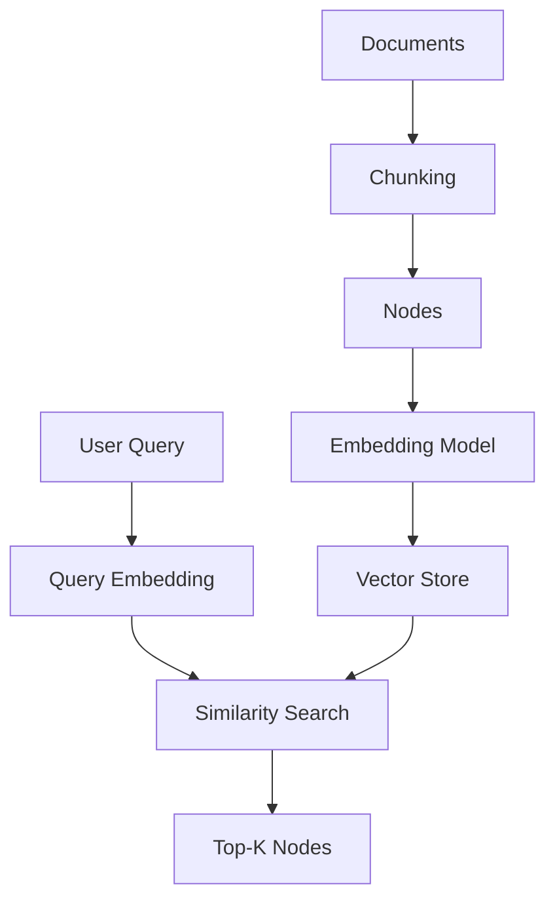

This is the standard semantic retrieval pattern.

---

# 11. Basic Vector Index Example

A simplified LlamaIndex example:

```python
from llama_index.core import VectorStoreIndex
from llama_index.core import Document

documents = [
    Document(
        text="Payment authentication uses OAuth."
    ),
    Document(
        text="Payment failures are retried."
    )
]

index = VectorStoreIndex.from_documents(
    documents
)

retriever = index.as_retriever(
    similarity_top_k=3
)

nodes = retriever.retrieve(
    "How does payment authentication work?"
)

for node in nodes:
    print(node.text)
```

The exact API may vary with the installed LlamaIndex version.

---

# 12. Retriever Abstraction

The important architectural concept is the retriever.

Conceptually:

```python
retriever.retrieve(query)
```

returns relevant nodes.

This provides an abstraction over:

```text
Vector Search
Keyword Search
Graph Search
Recursive Retrieval
Query Fusion
Summary Retrieval
```

The application can therefore work with a retrieval capability rather than directly managing every storage mechanism.

---

# 13. Retriever Architecture

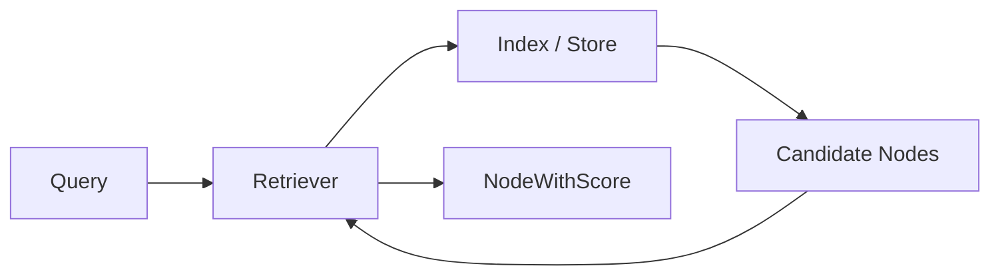

A retrieval result can contain:

```text
Node
+
Relevance Score
```

---

# 14. NodeWithScore

A retriever commonly returns a node together with a relevance score.

Conceptually:

```python
for result in nodes:
    print(result.node.text)
    print(result.score)
```

The score can later be used by:

```text
Ranking
Filtering
Thresholding
Evaluation
Observability
```

---

# 15. Retrieval Is Not Generation

This distinction is fundamental.

Retriever:

```text
Find evidence
```

LLM:

```text
Generate response
```

Therefore:

```text
Retriever
    ↓
Relevant Nodes
    ↓
Context
    ↓
LLM
    ↓
Answer
```

A retriever should not be responsible for generating the final response.

---

# 16. Retriever vs Query Engine

A retriever answers:

```text
"What information should I retrieve?"
```

A query engine typically handles a larger workflow:

```text
Query
 ↓
Retrieve
 ↓
Build Context
 ↓
Synthesize Response
```

Conceptually:

```text
Retriever
   ↓
Nodes

Query Engine
   ↓
Nodes
   ↓
Prompt
   ↓
LLM
   ↓
Response
```

---

# 17. LlamaIndex Query Pipeline

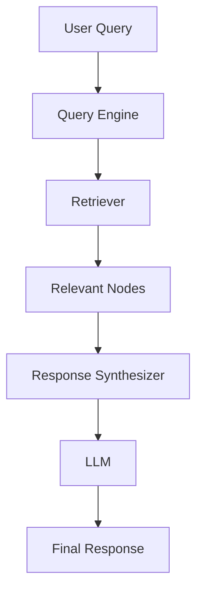

The retriever is therefore one component inside the larger RAG execution pipeline.

---

# 18. Retriever Types in This Section

This section will explore several LlamaIndex retrieval capabilities:

```text
Vector Index Retriever
        ↓
BM25 Retriever
        ↓
Document Summary Retriever
        ↓
Recursive Retriever
        ↓
Query Fusion Retriever
        ↓
Auto-Merging Retriever
```

These concepts progressively move from:

```text
Simple Retrieval
```

toward:

```text
Composable Retrieval
```

---

# 19. Vector Retrieval

Vector retrieval answers:

> "Which nodes are semantically similar to the query?"

Example:

```text
Query:
How does authentication work?

Retrieved:
OAuth authentication architecture
Token validation
Identity service
```

Even if the exact word:

```text
authentication
```

is not present in every retrieved node, semantic similarity can identify related content.

---

# 20. Keyword Retrieval

Keyword retrieval answers:

> "Which documents contain important query terms?"

Example:

```text
Query:
INC-10291 Kafka consumer failure
```

Keyword retrieval can be especially useful for:

```text
Identifiers
Error Codes
Product Names
API Names
Exact Terms
```

---

# 21. Why Vector Search Is Not Enough

Suppose the query is:

```text
"How was INC-10291 resolved?"
```

Dense retrieval may understand:

```text
incident resolution
Kafka failure
```

But exact matching of:

```text
INC-10291
```

can be extremely valuable.

This is one reason enterprise systems often combine:

```text
Dense Retrieval
+
Sparse Retrieval
```

---

# 22. LlamaIndex and Retrieval Composition

One of LlamaIndex's strengths is the ability to compose retrieval components.

Instead of:

```text
One Retriever
```

you can build:

```text
Retriever A
      +
Retriever B
      +
Retriever C
      ↓
Combined Retrieval Strategy
```

This becomes important in enterprise RAG.

---

# 23. Composable Retrieval

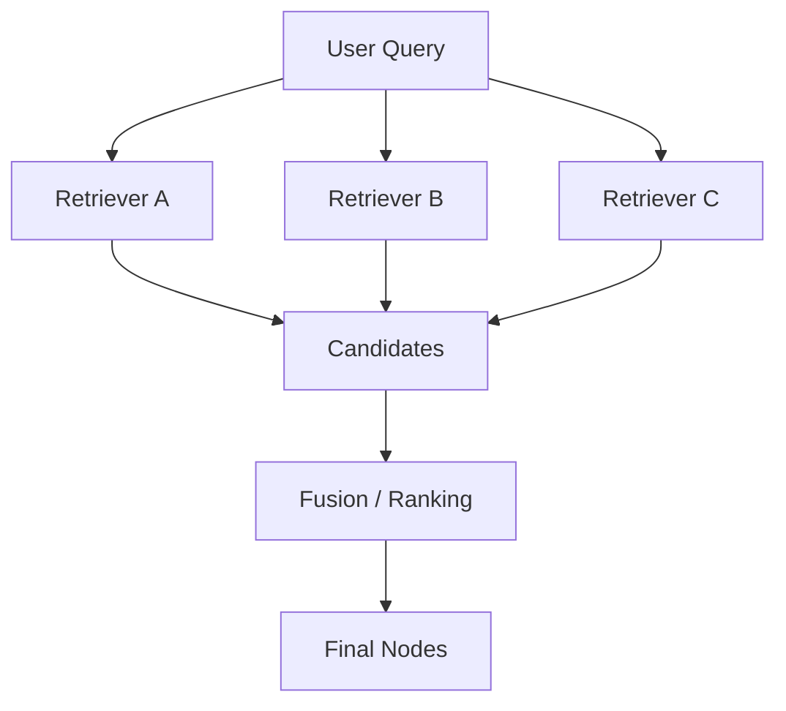

Possible components:

```text
Vector Retriever
BM25 Retriever
Metadata Retriever
Graph Retriever
SQL Retriever
```

---

# 24. Retrieval Abstraction

From an architecture perspective:

```text
Application
     ↓
Retriever Interface
     ↓
LlamaIndex Retriever
     ↓
Index / Vector Store
```

This is useful because the application does not need to know every internal retrieval implementation.

---

# 25. Generic Retrieval Interface

A framework-agnostic application might define:

```python
class Retriever:

    def retrieve(
        self,
        query: str,
        top_k: int
    ):
        raise NotImplementedError
```

A LlamaIndex adapter can implement that capability.

```python
class LlamaIndexRetrieverAdapter:

    def __init__(self, retriever):
        self.retriever = retriever

    def retrieve(self, query, top_k):
        return self.retriever.retrieve(query)
```

This keeps the application architecture independent from the framework.

---

# 26. Framework Adapter Architecture

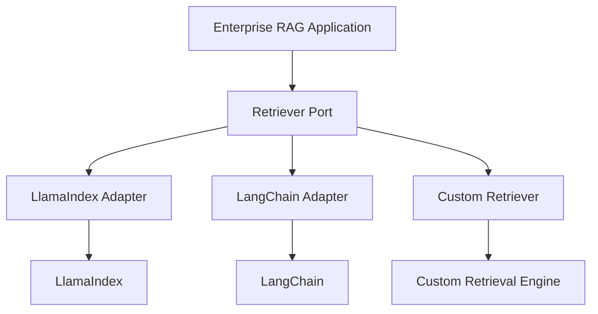

This architecture is particularly useful when building reusable enterprise AI platforms.

---

# 27. LlamaIndex Storage Context

LlamaIndex applications can separate:

```text
Index Definition
```

from:

```text
Storage
```

The storage layer may include:

```text
Vector Store
Document Store
Index Store
```

This separation allows persistence and integration with external storage systems.

---

# 28. Conceptual Storage Architecture

```text
                 ┌─────────────────┐
                 │     Index       │
                 └────────┬────────┘
                          ↓
        ┌─────────────────┼─────────────────┐
        ↓                 ↓                 ↓
 Vector Store       Document Store     Index Store
```

Each storage component has a different responsibility.

---

# 29. Vector Store

The vector store holds:

```text
Embeddings
```

and often associated:

```text
Metadata
Identifiers
```

Its primary responsibility is similarity retrieval.

---

# 30. Document Store

A document store can maintain:

```text
Nodes
Documents
Content
Relationships
```

This is useful when the retrieval process needs to resolve:

```text
Node
 ↓
Parent
 ↓
Original Document
```

---

# 31. Index Store

The index store can persist information about:

```text
Index Structures
```

This helps LlamaIndex applications reconstruct indexes without rebuilding everything from the source documents.

---

# 32. Separation of Concerns

A production architecture benefits from:

```text
Source Data
     ↓
Ingestion
     ↓
Node Store
     ↓
Index
     ↓
Retriever
     ↓
Query Engine
```

Each layer has a clear responsibility.

---

# 33. Metadata in LlamaIndex

Nodes can contain metadata.

Example:

```python
from llama_index.core import Document

document = Document(
    text="Payment authentication uses OAuth.",
    metadata={
        "department": "payments",
        "document_type": "architecture",
        "status": "approved"
    }
)
```

Metadata can later participate in retrieval filtering and downstream processing.

---

# 34. Metadata-Aware Retrieval

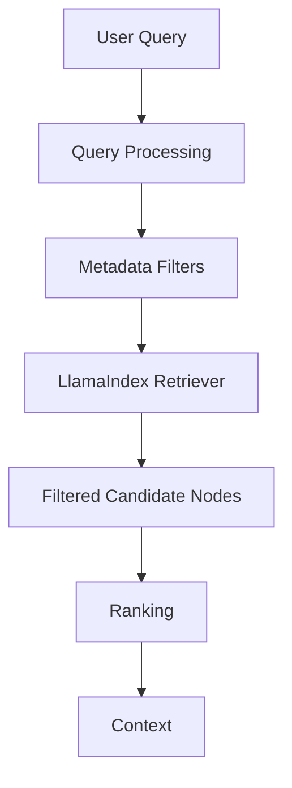

This connects the previous chapter's metadata-aware retrieval concepts with LlamaIndex.

---

# 35. Node Relationships

LlamaIndex nodes can represent relationships between content units.

Conceptually:

```text
Parent Node
     ↓
Child Node
     ↓
Related Node
```

Relationships can support advanced retrieval strategies.

For example:

```text
Retrieve small chunk
       ↓
Resolve parent
       ↓
Return larger context
```

---

# 36. Why Relationships Matter

A small chunk may be highly relevant:

```text
"OAuth tokens expire after 60 minutes."
```

But answering the question may require the larger section:

```text
Authentication
 ├── Token creation
 ├── Token validation
 ├── Token expiration
 └── Token refresh
```

Relationships help connect the retrieved fragment with surrounding context.

---

# 37. Recursive Retrieval

Recursive retrieval can follow relationships between retrieval objects.

Conceptually:

```text
Query
 ↓
Retrieve Node
 ↓
Follow Relationship
 ↓
Retrieve Parent / Related Node
 ↓
Expanded Context
```

This is particularly useful for:

```text
Hierarchical Documents
Knowledge Structures
Parent-Child Retrieval
Linked Data
```

The dedicated recursive retriever chapter will explore this in detail.

---

# 38. Query Fusion

Multiple retrieval queries can be combined.

Example:

```text
Original Query
      ↓
Query 1
Query 2
Query 3
      ↓
Multiple Retrievals
      ↓
Fusion
      ↓
Ranked Results
```

This improves coverage for ambiguous or complex questions.

---

# 39. Auto-Merging Retrieval

Auto-merging retrieval addresses hierarchical context.

Suppose:

```text
Document
 ├── Section A
 │    ├── Chunk 1
 │    ├── Chunk 2
 │    └── Chunk 3
 │
 └── Section B
      ├── Chunk 4
      └── Chunk 5
```

Retrieval may identify:

```text
Chunk 1
Chunk 2
```

Instead of returning only those fragments, the system can merge them into a larger parent context.

---

# 40. Hierarchical Retrieval

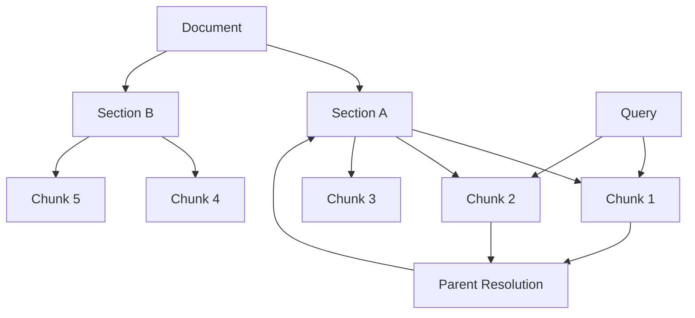

This improves contextual completeness.

---

# 41. LlamaIndex Retrieval Ecosystem

The retrieval ecosystem can be viewed as:

```text
                    LlamaIndex Retrieval
                           │
          ┌────────────────┼─────────────────┐
          ↓                ↓                 ↓
       Indexes          Retrievers        Query Engines
          │                │
     ┌────┼────┐      ┌────┼────┐
     ↓    ↓    ↓      ↓    ↓    ↓
  Vector Summary Keyword Recursive Fusion
```

This architecture allows retrieval to become composable.

---

# 42. Index vs Retriever

This distinction is extremely important.

### Index

Answers:

```text
How is information organized for retrieval?
```

### Retriever

Answers:

```text
How do we retrieve information from that organization?
```

For example:

```text
VectorStoreIndex
       ↓
Vector Retriever
```

The index provides the underlying structure.

The retriever defines the query-time retrieval behavior.

---

# 43. Retriever vs Query Engine

Another important distinction:

```text
Retriever
=
Evidence Discovery
```

while:

```text
Query Engine
=
Retrieval + Response Generation
```

Architecture:

```text
Query
 ↓
Retriever
 ↓
Nodes
 ↓
Response Synthesizer
 ↓
LLM
 ↓
Response
```

---

# 44. Retrieval vs Response Synthesis

A retrieval system should answer:

```text
Which evidence is relevant?
```

A response synthesizer answers:

```text
How should the evidence be transformed
into a response?
```

This separation is valuable for:

```text
Evaluation
Observability
Testing
Caching
Security
```

---

# 45. Retrieval Pipeline

A mature LlamaIndex pipeline may look like:

```text
Documents
   ↓
Node Parsing
   ↓
Indexing
   ↓
Retriever
   ↓
Candidate Nodes
   ↓
Postprocessing
   ↓
Context
   ↓
Response Synthesizer
   ↓
LLM
```

---

# 46. Node Postprocessors

Between retrieval and generation, additional processing may occur.

Conceptually:

```text
Retriever
   ↓
Node Postprocessors
   ↓
Context
```

Possible operations include:

```text
Filtering
Re-ranking
Compression
Metadata Processing
Similarity Thresholding
```

This connects LlamaIndex retrieval with the broader retrieval engineering techniques covered earlier.

---

# 47. Retrieval Score Threshold

A system may retrieve:

```text
Top-K = 10
```

but then remove low-confidence nodes:

```python
if result.score < threshold:
    continue
```

Conceptually:

```text
Retrieve Top-K
      ↓
Score Threshold
      ↓
Relevant Candidates
```

Thresholds should be calibrated rather than chosen arbitrarily.

---

# 48. LlamaIndex and Re-ranking

A LlamaIndex retrieval pipeline can be extended with re-ranking.

Architecture:

```text
Query
 ↓
Initial Retriever
 ↓
Top-50 Candidates
 ↓
Re-ranker
 ↓
Top-10
 ↓
Context
```

This follows the general retrieval architecture:

```text
High Recall
     ↓
High Precision
```

---

# 49. LlamaIndex and MMR

Maximum Marginal Relevance can be used to reduce redundancy.

Example:

```text
Retrieved:
A A A B C D
```

MMR may produce:

```text
A B C D
```

This is useful when multiple chunks contain almost identical information.

---

# 50. LlamaIndex and Hybrid Retrieval

Enterprise systems often combine:

```text
Vector Search
+
BM25
+
Metadata Filtering
+
Re-ranking
```

LlamaIndex can participate in this architecture through its retrieval abstractions and integrations.

The exact implementation depends on the configured retrievers and storage backends.

---

# 51. LlamaIndex Retrieval Composition

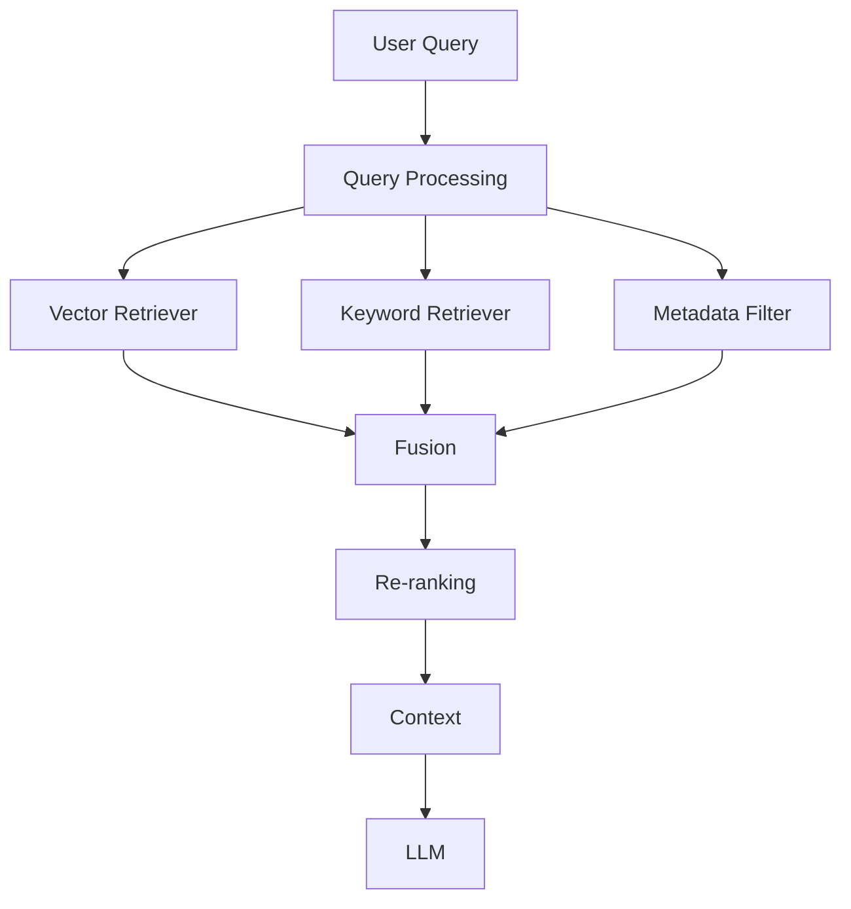

This is a practical enterprise retrieval pattern.

---

# 52. LlamaIndex and Enterprise RAG

A production enterprise architecture can be:

```text
                 User
                   ↓
             API Gateway
                   ↓
           Query Orchestrator
                   ↓
         ┌─────────┴──────────┐
         ↓                    ↓
  Security Context      Query Rewriting
         │                    │
         └─────────┬──────────┘
                   ↓
            LlamaIndex Layer
                   ↓
        ┌──────────┼──────────┐
        ↓          ↓          ↓
     Vector      BM25       Graph
    Retrieval   Retrieval   Retrieval
        └──────────┼──────────┘
                   ↓
               Fusion
                   ↓
               Re-ranking
                   ↓
                 MMR
                   ↓
          Context Engineering
                   ↓
              LLM / SLM
                   ↓
          Response Validation
                   ↓
               Citation
                   ↓
          Enterprise Response
```

LlamaIndex can therefore be one layer inside a larger enterprise architecture rather than the entire architecture.

---

# 53. Framework-Aware vs Framework-Agnostic Design

A useful engineering distinction:

### Framework-Agnostic

```text
Retriever
VectorStore
EmbeddingProvider
Reranker
MetadataFilter
```

### Framework Adapter

```text
LlamaIndexRetrieverAdapter
LlamaIndexVectorStoreAdapter
```

This allows an enterprise platform to support multiple frameworks.

---

# 54. Why This Matters

If application code directly depends on:

```python
from llama_index.core import VectorStoreIndex
```

throughout the codebase, migration becomes difficult.

Instead:

```text
Application
    ↓
Enterprise Retrieval Interface
    ↓
LlamaIndex Adapter
```

provides a cleaner architecture.

---

# 55. Ports & Adapters Pattern

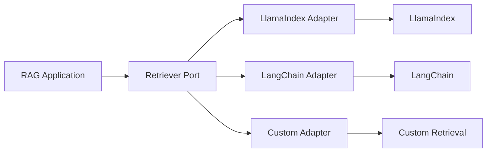

This is especially valuable for enterprise platforms where framework choices may evolve.

---

# 56. Capability-Based Retrieval

Instead of abstracting an entire framework, define capabilities:

```text
VectorRetriever
KeywordRetriever
MetadataRetriever
HybridRetriever
Reranker
QueryRewriter
ContextCompressor
```

Then map framework implementations to those capabilities.

---

# 57. Capability Example

```python
class VectorRetriever:

    def retrieve(
        self,
        query: str,
        top_k: int
    ):
        raise NotImplementedError
```

LlamaIndex implementation:

```python
class LlamaIndexVectorRetriever(
    VectorRetriever
):

    def __init__(self, retriever):
        self.retriever = retriever

    def retrieve(self, query, top_k):
        return self.retriever.retrieve(query)
```

This keeps the enterprise architecture focused on capabilities.

---

# 58. Retrieval Engineering Perspective

LlamaIndex should not be viewed merely as:

```text
"Another RAG framework."
```

It can be viewed as a toolkit for:

```text
Data Ingestion
+
Indexing
+
Retrieval
+
Composition
+
Response Synthesis
```

The important engineering question is:

> Which retrieval capability should be used for this information problem?

---

# 59. Choosing a Retrieval Strategy

| Requirement | Potential Strategy |
|---|---|
| Semantic similarity | Vector retrieval |
| Exact identifiers | BM25 / keyword |
| Hierarchical context | Auto-merging / recursive |
| Multiple query perspectives | Query fusion |
| Document-level summaries | Summary retrieval |
| Structured metadata | Metadata filtering |
| Diverse evidence | MMR |
| High precision | Re-ranking |
| Complex reasoning | Agentic retrieval |

These techniques can also be composed.

---

# 60. Example: Enterprise Payment Knowledge Base

Suppose the knowledge base contains:

```text
Architecture Documents
API Documentation
Incident Reports
Runbooks
Policies
Database Schemas
```

A single vector retriever may not be optimal.

Instead:

```text
Query
 ↓
Query Classification
 ↓
Router
 ├── API → API Retriever
 ├── Policy → Policy Retriever
 ├── Incident → Incident Retriever
 ├── Architecture → Vector Retriever
 └── Database → SQL Retriever
```

LlamaIndex retrieval components can participate in such an architecture.

---

# 61. Retrieval Router

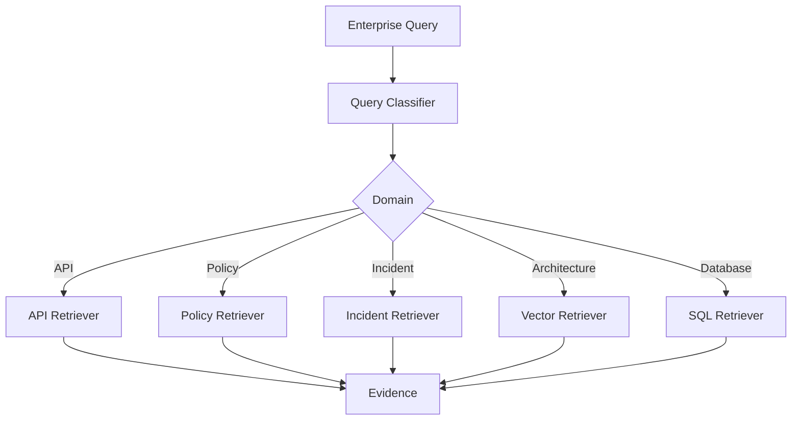

This architecture will become increasingly important in later chapters.

---

# 62. LlamaIndex as a Retrieval Layer

A useful mental model:

```text
Enterprise AI Application
            ↓
       Retrieval API
            ↓
      Retrieval Engine
            ↓
        LlamaIndex
            ↓
 ┌──────────┼───────────┐
 ↓          ↓           ↓
Index    Retriever   Postprocessor
```

LlamaIndex provides implementation capabilities while the enterprise application owns business rules.

---

# 63. What Should Stay Outside the Framework?

Enterprise concerns such as:

```text
Authentication
Authorization
Tenant Isolation
Business Policy
Cost Budgets
Audit Requirements
Compliance
Service-Level Objectives
```

should generally remain controlled by the application/platform architecture.

The framework should not become the security boundary.

---

# 64. Enterprise Security Boundary

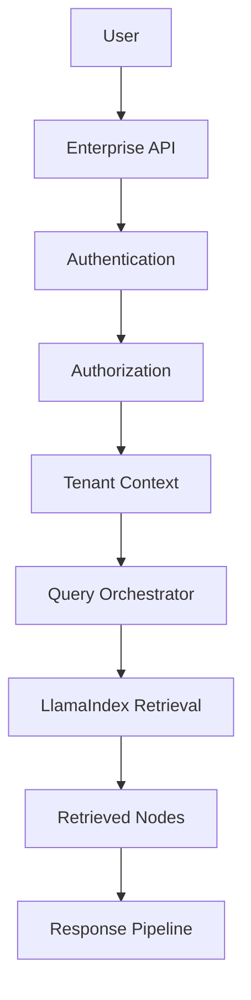

Security should be enforced before untrusted retrieval results can influence the response.

---

# 65. Observability

Production retrieval should capture:

```text
Query
Retriever
Index
Top-K
Scores
Metadata Filters
Latency
Candidate Count
Postprocessor
Final Nodes
LLM
```

Example trace:

```text
Query
 ↓
VectorStoreIndex
 ↓
Top-K = 20
 ↓
Metadata Filter
 ↓
Re-ranker
 ↓
Top-K = 8
 ↓
Context
```

---

# 66. Retrieval Evaluation

LlamaIndex retrieval should be evaluated independently from generation.

Measure:

```text
Precision@K
Recall@K
MRR
NDCG
Hit Rate
Context Relevance
```

Then evaluate generation:

```text
Faithfulness
Answer Relevance
Citation Accuracy
Correctness
```

Separating these metrics makes debugging much easier.

---

# 67. Retrieval Evaluation Flow

```text
Question
   ↓
Retriever
   ↓
Retrieved Nodes
   ↓
Retrieval Evaluation
   ↓
Context
   ↓
LLM
   ↓
Generation Evaluation
```

This distinction is fundamental to production RAG engineering.

---

# 68. LlamaIndex Retrieval Learning Path

This section progresses through:

```text
01 LlamaIndex Retrievers Overview
            ↓
02 LlamaIndex Indexes
            ↓
03 Vector Index Retriever
            ↓
04 BM25 Retriever
            ↓
05 Document Summary Retriever
            ↓
06 Recursive Retriever
            ↓
07 Query Fusion Retriever
            ↓
08 Auto-Merging Retriever
```

Each chapter builds on the concepts introduced here.

---

# 69. Recommended Mental Model

Think of LlamaIndex retrieval as:

```text
Source Data
    ↓
Documents
    ↓
Nodes
    ↓
Indexes
    ↓
Retrievers
    ↓
Postprocessors
    ↓
Context
    ↓
Response Synthesis
```

And think of enterprise retrieval as:

```text
Security
    +
Query Understanding
    +
Metadata
    +
Retrieval
    +
Ranking
    +
Context Engineering
    +
Validation
```

LlamaIndex provides tools for several of these layers, but the enterprise architecture should remain responsible for coordinating them.

---

# 70. Key Takeaways

- LlamaIndex provides abstractions for connecting LLMs with external data.
- Documents represent source information.
- Nodes are fundamental retrieval units.
- Metadata provides contextual information about nodes.
- Indexes organize information for efficient retrieval.
- Retrievers determine how relevant nodes are selected.
- Query engines combine retrieval with response synthesis.
- VectorStoreIndex supports semantic vector retrieval.
- Keyword retrieval is valuable for exact identifiers and terminology.
- Recursive retrieval can follow relationships between nodes.
- Query fusion can combine multiple retrieval perspectives.
- Auto-merging retrieval can reconstruct larger contextual structures.
- LlamaIndex supports composable retrieval architectures.
- Retrieval and generation should remain separate concerns.
- Retrieval results should be evaluated independently from generated answers.
- Metadata filtering can be combined with LlamaIndex retrieval.
- Re-ranking and MMR can be added after initial retrieval.
- Hybrid retrieval can combine dense and sparse search.
- LlamaIndex can serve as a retrieval implementation inside a larger enterprise architecture.
- Enterprise security, authorization, tenant isolation, and compliance should not depend solely on the framework.
- A framework-agnostic retrieval interface can prevent application-level coupling to LlamaIndex.
- Ports & Adapters architecture can allow LlamaIndex, LangChain, or custom retrieval implementations to coexist.
- Capability-based abstractions are often more useful than abstracting an entire framework.
- The objective is not to learn framework APIs in isolation.
- The objective is to understand how LlamaIndex retrieval capabilities map to production RAG requirements.

The core architecture is:

```text
                  USER QUERY
                      │
                      ▼
             ┌─────────────────┐
             │ Query Processing│
             └────────┬────────┘
                      │
                      ▼
             ┌─────────────────┐
             │    Retriever    │
             └────────┬────────┘
                      │
          ┌───────────┼───────────┐
          ▼           ▼           ▼
       Vector       Keyword     Graph /
       Search       Search      Structured
          │           │           │
          └───────────┼───────────┘
                      ▼
                  Candidates
                      │
                      ▼
                 Re-ranking
                      │
                      ▼
                    MMR
                      │
                      ▼
             Context Engineering
                      │
                      ▼
                     LLM
                      │
                      ▼
              Validated Response
```

> **The framework provides retrieval capabilities; the architecture determines how those capabilities become a production-grade RAG system.**

---

# 🧭 Chapter Navigation

### Part V — Advanced Retrieval-Augmented Generation

**Previous:**  
[13. Advanced Query Rewriting](../02-enterprise-retrieval-engineering/13-advanced-query-rewriting.md)

**Next:**  
[02. LlamaIndex Indexes](02-llamaindex-indexes.md)

**Section:**  
03 — LlamaIndex Retrieval Engineering

### LlamaIndex Retrieval Engineering Path

```text
01 LlamaIndex Retrievers Overview
              ↓
02 LlamaIndex Indexes
              ↓
03 Vector Index Retriever
              ↓
04 BM25 Retriever
              ↓
05 Document Summary Retriever
              ↓
06 Recursive Retriever
              ↓
07 Query Fusion Retriever
              ↓
08 Auto-Merging Retriever
              ↓
04 Vector Search Engineering
```

---

> **Enterprise AI Engineering Handbook**  
> *Building Production-Grade Enterprise AI Systems — One Chapter at a Time.*