# LlamaIndex Indexes

## 📖 Overview

In LlamaIndex, an **Index** is the data structure that organizes documents and nodes so they can be efficiently retrieved for downstream RAG workflows.

A useful mental model is:

```text
Source Data
    ↓
Documents
    ↓
Nodes
    ↓
Index
    ↓
Retriever
    ↓
Relevant Nodes
    ↓
Context
    ↓
LLM
```

The index is therefore an important boundary between:

```text
Ingestion
```

and:

```text
Retrieval
```

LlamaIndex provides different index structures for different retrieval requirements.

The most important concept is not simply memorizing index classes.

It is understanding:

> **Which index structure is appropriate for the information-retrieval problem being solved?**

---

# 🎯 Learning Objectives

After completing this chapter, you will be able to:

- Understand the purpose of indexes in LlamaIndex
- Understand the relationship between Documents, Nodes, Indexes, and Retrievers
- Understand `VectorStoreIndex`
- Understand `SummaryIndex`
- Understand keyword-oriented indexes
- Understand knowledge-graph-oriented indexing
- Understand how indexes interact with retrievers
- Understand index construction and persistence
- Understand index storage concepts
- Understand metadata and index design
- Understand how index choice affects retrieval
- Understand when to use vector, summary, keyword, or graph-oriented indexes
- Understand index composition in enterprise RAG
- Design framework-aware index adapters
- Avoid common index design mistakes

---

# 1. What Is an Index?

An index organizes information so that retrieval can happen efficiently.

Consider a large enterprise knowledge base:

```text
10,000 Documents
      ↓
500,000 Chunks
      ↓
Index
      ↓
Efficient Retrieval
```

Without an appropriate retrieval structure, searching the entire corpus for every query becomes inefficient.

An index provides a representation optimized for a particular retrieval strategy.

---

# 2. Index in the RAG Pipeline

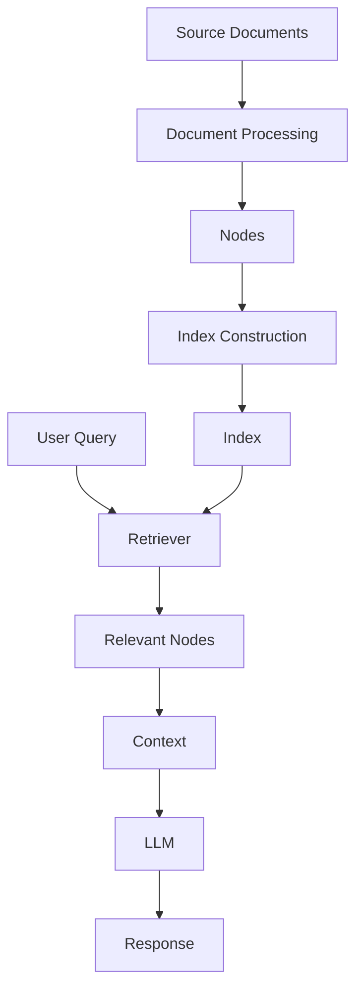

The index is queried indirectly through a retriever.

---

# 3. Documents → Nodes → Index

A common LlamaIndex ingestion flow is:

```text
Document
   ↓
Parsing
   ↓
Chunking
   ↓
Nodes
   ↓
Indexing
```

Example:

```text
Payment Architecture Document
             ↓
       Node Parser
             ↓
 ┌───────────┼───────────┐
 ↓           ↓           ↓
Node 1      Node 2      Node 3
             ↓
           Index
```

The exact indexing behavior depends on the selected index type.

---

# 4. Why Different Indexes?

Different retrieval problems require different structures.

For semantic retrieval:

```text
Vector Index
```

For summarization-oriented retrieval:

```text
Summary Index
```

For keyword-oriented retrieval:

```text
Keyword Index
```

For relationship-oriented retrieval:

```text
Knowledge Graph
```

Conceptually:

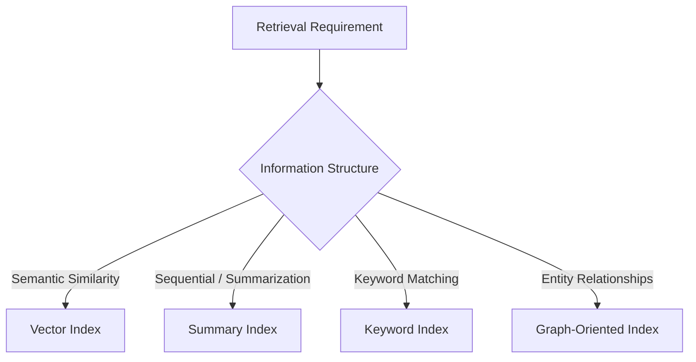

---

# 5. Major LlamaIndex Index Concepts

A practical overview includes:

```text
VectorStoreIndex
SummaryIndex
KeywordTableIndex
KnowledgeGraphIndex
```

The exact classes and available integrations can vary across LlamaIndex releases.

The important architectural distinction is:

```text
Vector
Summary
Keyword
Graph
```

Each represents information differently.

---

# 6. VectorStoreIndex

`VectorStoreIndex` is the most common index for modern semantic RAG.

Its architecture is:

```text
Documents
    ↓
Nodes
    ↓
Embedding Model
    ↓
Vectors
    ↓
Vector Store
```

Query:

```text
User Query
    ↓
Query Embedding
    ↓
Similarity Search
    ↓
Relevant Nodes
```

---

# 7. VectorStoreIndex Architecture

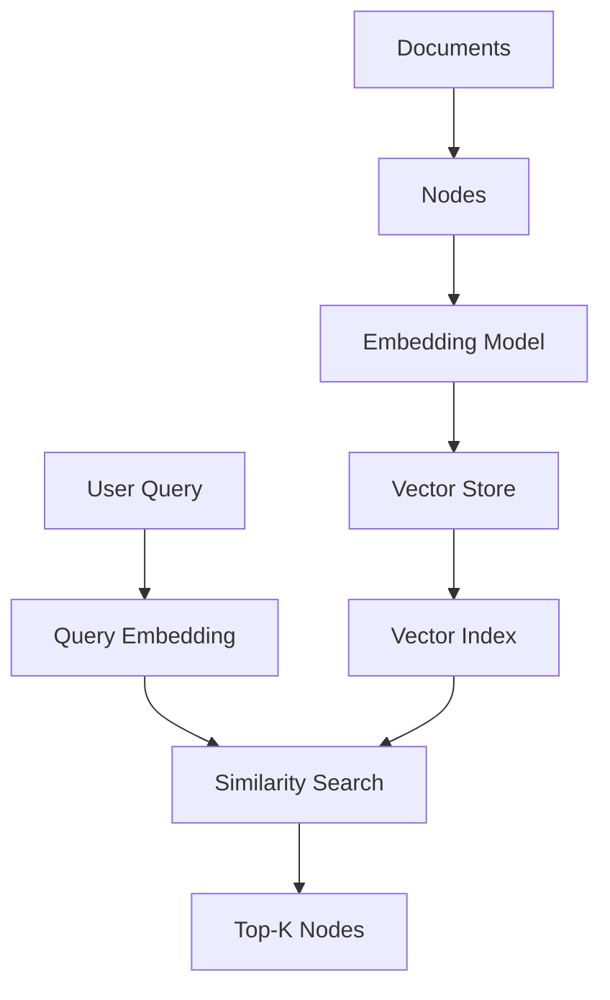

The vector index represents semantic relationships through embeddings.

---

# 8. Basic VectorStoreIndex Example

```python
from llama_index.core import (
    Document,
    VectorStoreIndex
)

documents = [
    Document(
        text="Payment authentication uses OAuth."
    ),
    Document(
        text="Payment failures are retried."
    )
]

index = VectorStoreIndex.from_documents(
    documents
)

retriever = index.as_retriever(
    similarity_top_k=3
)

results = retriever.retrieve(
    "How does payment authentication work?"
)

for result in results:
    print(result.node.text)
    print(result.score)
```

The exact API can vary with the LlamaIndex version and configured embedding/vector-store integration.

---

# 9. What Does VectorStoreIndex Store?

Conceptually, the retrieval system needs access to:

```text
Node
 ├── Text
 ├── Embedding
 ├── Metadata
 ├── ID
 └── Relationships
```

The vector store primarily provides efficient similarity search over embeddings, while associated document/node storage may be handled separately depending on the configuration.

---

# 10. Embedding Model and Index

The embedding model is critical.

During indexing:

```text
Node
 ↓
Embedding Model
 ↓
Vector
 ↓
Vector Store
```

During retrieval:

```text
Query
 ↓
Same / Compatible Embedding Model
 ↓
Query Vector
 ↓
Similarity Search
```

A mismatch between indexing and query embedding spaces can severely degrade retrieval.

---

# 11. Embedding Consistency

Suppose documents were indexed with:

```text
Embedding Model A
```

but queries are embedded with:

```text
Embedding Model B
```

The resulting vectors may not be directly compatible.

Production principle:

```text
Index Embedding Configuration
        =
Query Embedding Configuration
```

unless the retrieval architecture explicitly supports compatible embedding spaces.

---

# 12. Vector Dimension

Embedding models generate vectors with a specific dimension.

Example:

```text
Embedding
=
[0.12, -0.04, 0.88, ...]
```

with:

```text
dimension = N
```

The vector store/index configuration must support that dimensionality.

Changing the embedding model may require rebuilding the index.

---

# 13. Index Construction

A simplified indexing pipeline:

```text
Raw Documents
      ↓
Parse
      ↓
Chunk
      ↓
Create Nodes
      ↓
Generate Embeddings
      ↓
Store Vectors
      ↓
Persist Index
```

This is an ingestion-time operation.

It should generally not happen on every user query.

---

# 14. Indexing vs Retrieval Time

### Indexing Time

```text
Documents
 ↓
Nodes
 ↓
Embeddings
 ↓
Index
```

### Query Time

```text
Query
 ↓
Query Embedding
 ↓
Retriever
 ↓
Index
 ↓
Relevant Nodes
```

Separating these phases is fundamental to scalable RAG architecture.

---

# 15. SummaryIndex

A `SummaryIndex` organizes nodes in a way that supports retrieval through node traversal and response synthesis rather than relying primarily on vector similarity.

Conceptually:

```text
Documents
    ↓
Nodes
    ↓
Summary-Oriented Index
    ↓
Relevant / Traversed Nodes
    ↓
Response Synthesis
```

This can be useful when:

```text
The corpus is relatively small
+
The query requires broad context
+
Sequential or comprehensive processing is acceptable
```

---

# 16. SummaryIndex Mental Model

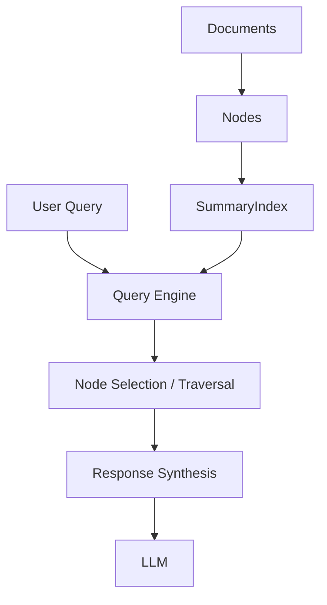

The important distinction is that this is not the same retrieval mechanism as dense vector similarity search.

---

# 17. When Summary-Oriented Retrieval Can Help

Consider a small document:

```text
Annual Architecture Report
```

A question may require information spread across:

```text
Section 1
Section 4
Section 7
Section 10
```

A broad retrieval/synthesis strategy may be more appropriate than retrieving only a handful of semantically similar chunks.

Potential use cases include:

```text
Small Documents
Reports
Long-form Analysis
Summarization
Global Document Understanding
```

---

# 18. SummaryIndex Trade-Off

The primary trade-off is:

```text
Broader Context
      ↓
Potentially Higher
Processing Cost
```

For large enterprise corpora, blindly processing many nodes for every query can become expensive.

Therefore:

```text
Small Corpus
→ Broad Processing May Be Acceptable

Large Corpus
→ Targeted Retrieval Usually Preferred
```

---

# 19. KeywordTableIndex

Keyword-oriented indexing focuses on explicit terms.

Conceptually:

```text
Document
   ↓
Nodes
   ↓
Keyword Extraction
   ↓
Keyword → Node Mapping
```

Query:

```text
"Kafka consumer retry"
```

may identify nodes associated with:

```text
Kafka
consumer
retry
```

---

# 20. Keyword Index Architecture

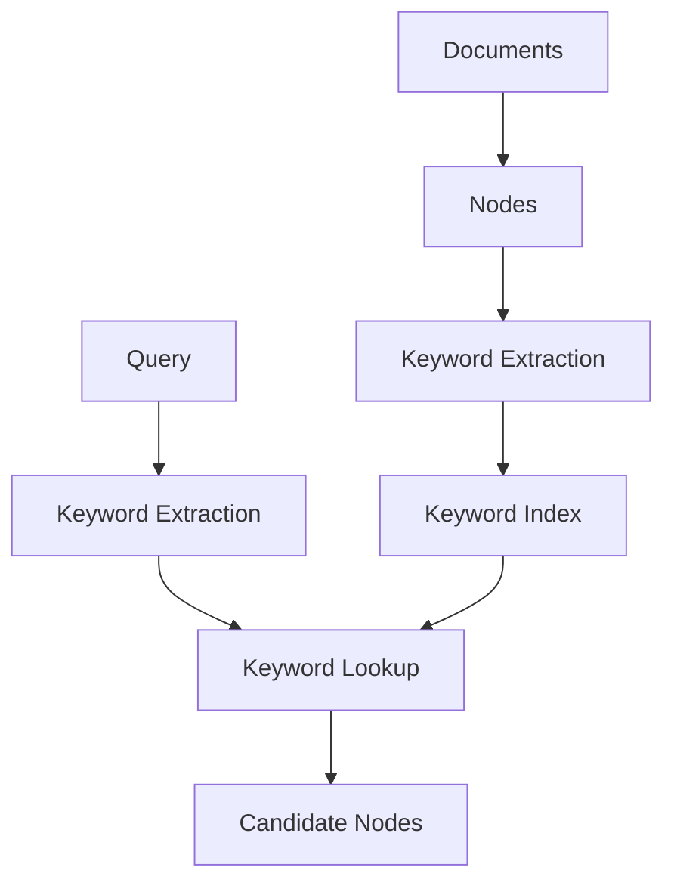

Keyword-oriented retrieval is particularly useful for exact terminology.

---

# 21. Why Keywords Still Matter

Enterprise knowledge bases contain many identifiers:

```text
INC-10291
PAY-8842
RFC-2026-17
payment-service-v3
OAuth2
AKS
EKS
```

Exact lexical matching can be extremely valuable.

Semantic search alone should not be assumed to be optimal for these cases.

---

# 22. Keyword vs Vector Retrieval

| Characteristic | Keyword | Vector |
|---|---|---|
| Exact identifiers | Strong | Variable |
| Semantic similarity | Limited | Strong |
| Synonyms | Limited | Strong |
| Acronyms | Strong | Variable |
| Natural language concepts | Moderate | Strong |
| Error codes | Strong | Variable |
| Vocabulary mismatch | Weak | Strong |

This is one reason enterprise RAG frequently uses hybrid retrieval.

---

# 23. Knowledge Graph-Oriented Indexing

Some information is inherently relational.

Example:

```text
Payment Service
      ↓ depends_on
Kafka
      ↓ deployed_on
Kubernetes
      ↓ hosted_on
AWS
```

A graph-oriented representation captures these relationships explicitly.

---

# 24. Graph Index Architecture

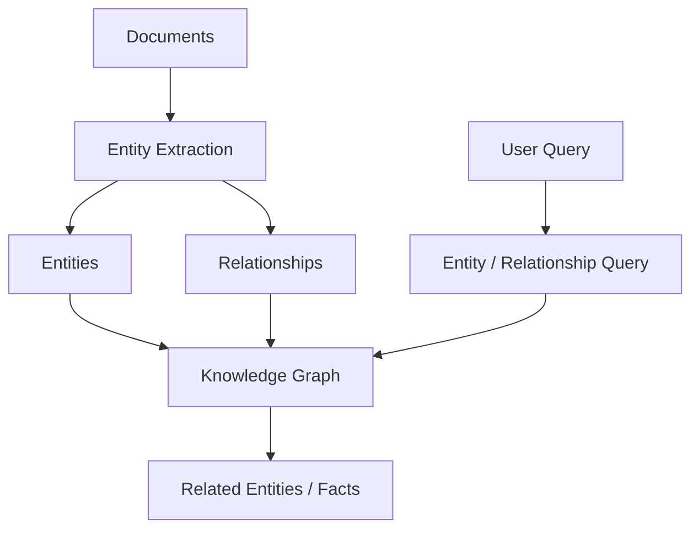

This differs from pure vector similarity.

---

# 25. Vector vs Graph Representation

Vector retrieval:

```text
"payment service authentication"
        ↓
Semantically similar nodes
```

Graph retrieval:

```text
payment-service
       ↓
uses
       ↓
authentication-service
```

The vector approach emphasizes:

```text
Similarity
```

The graph approach emphasizes:

```text
Relationships
```

---

# 26. Index Choice Is a Retrieval Decision

Do not ask:

> "Which LlamaIndex index should I always use?"

Ask:

> "What information structure does this problem require?"

For example:

```text
Semantic knowledge
→ Vector

Exact identifiers
→ Keyword / Hybrid

Broad document analysis
→ Summary-oriented

Relationships
→ Graph
```

---

# 27. Index + Retriever

An index does not necessarily mean the application directly queries the index.

The normal abstraction is:

```text
Index
 ↓
Retriever
 ↓
Nodes
```

Example:

```python
retriever = index.as_retriever(
    similarity_top_k=5
)

nodes = retriever.retrieve(
    query
)
```

The retriever becomes the query-time interface.

---

# 28. Why the Retriever Layer Matters

The retriever can add:

```text
Top-K
Filtering
Query Transformation
Scoring
Postprocessing
Composition
```

Therefore:

```text
Index
=
Data Organization

Retriever
=
Query-Time Retrieval Strategy
```

This distinction is fundamental.

---

# 29. Index and Query Engine

A query engine usually combines:

```text
Retriever
+
Response Synthesizer
+
LLM
```

Conceptually:

```text
Index
 ↓
Retriever
 ↓
Nodes
 ↓
Response Synthesizer
 ↓
LLM
 ↓
Response
```

This allows the same index to potentially support multiple query-time retrieval configurations.

---

# 30. Index Persistence

Large indexes should not normally be rebuilt every time an application starts.

Production flow:

```text
Initial Ingestion
      ↓
Build Index
      ↓
Persist
      ↓
Application Restart
      ↓
Load Existing Index
```

This reduces:

```text
Startup Time
Embedding Cost
Processing Cost
```

---

# 31. Storage Context

LlamaIndex supports storage abstractions for persisting components of an indexed system.

Conceptually:

```text
Storage Context
 ├── Vector Store
 ├── Document Store
 └── Index Store
```

The actual components used depend on the application configuration.

---

# 32. Persistent Architecture

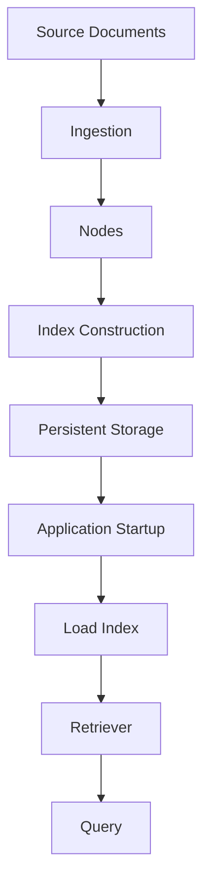

This separates one-time indexing from repeated retrieval.

---

# 33. Persistence Example

A simplified local persistence pattern can look like:

```python
from llama_index.core import (
    StorageContext,
    VectorStoreIndex,
    load_index_from_storage
)

storage_context = StorageContext.from_defaults(
    persist_dir="./storage"
)

index = load_index_from_storage(
    storage_context
)
```

The exact persistence configuration depends on the index and storage backend.

---

# 34. Persistence Directory

A local persistence directory may contain information needed to reconstruct the index and associated storage state.

Conceptually:

```text
storage/
 ├── index metadata
 ├── document/node data
 └── vector-store state
```

Do not assume every deployment stores every component locally; external vector stores may hold the vectors separately.

---

# 35. External Vector Store

Production deployments commonly use external vector databases.

Architecture:

```text
LlamaIndex
     ↓
Vector Store Integration
     ↓
External Vector Database
```

Examples of vector backends may include:

```text
Chroma
FAISS
Milvus
Pinecone
Qdrant
Weaviate
OpenSearch
```

The exact supported integration depends on the LlamaIndex ecosystem and deployed versions.

---

# 36. Enterprise Vector Architecture

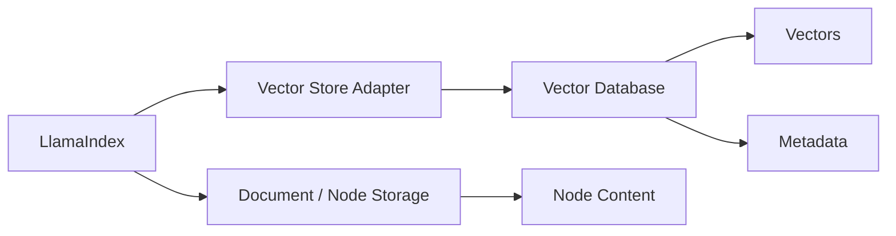

This separation allows:

```text
Application Framework
```

and:

```text
Storage Infrastructure
```

to evolve independently.

---

# 37. Index Construction with Custom Embeddings

A production application often configures its embedding model explicitly.

Conceptually:

```python
from llama_index.core import Settings

Settings.embed_model = embedding_model
```

Then:

```python
index = VectorStoreIndex.from_documents(
    documents
)
```

The important architectural principle is:

```text
Embedding Configuration
      ↓
Index Construction
```

must be deterministic and versioned.

---

# 38. Embedding Configuration as Infrastructure

Treat embedding configuration as part of the index contract.

Record:

```text
Embedding Model
Embedding Version
Dimension
Normalization
Distance Metric
Chunking Configuration
```

Example:

```json
{
  "embedding_model": "example-model",
  "dimension": 1536,
  "distance_metric": "cosine",
  "chunk_size": 512,
  "chunk_overlap": 50
}
```

---

# 39. Why Index Configuration Must Be Versioned

Suppose you change:

```text
Embedding Model
```

or:

```text
Chunk Size
```

the resulting vectors and retrieval behavior may change.

Therefore:

```text
Index Version
```

should capture the configuration that produced it.

Example:

```text
payment-kb-index-v4
```

---

# 40. Chunking and Index Quality

Index quality depends heavily on node quality.

Bad chunks:

```text
Random sentence fragments
```

can create poor embeddings.

Better:

```text
Semantically coherent sections
```

produce more meaningful retrieval units.

Therefore:

```text
Good Index
≠
Good Embeddings Alone
```

It depends on:

```text
Parsing
+
Chunking
+
Metadata
+
Embedding
+
Storage
```

---

# 41. Metadata During Indexing

Example:

```python
from llama_index.core import Document

document = Document(
    text="Payment authentication...",
    metadata={
        "department": "payments",
        "document_type": "architecture",
        "status": "approved",
        "region": "EU"
    }
)
```

Metadata becomes part of the retrieval context associated with the node.

---

# 42. Metadata and Index Design

Metadata can support:

```text
Filtering
Tenant Isolation
Document Type
Time Range
Business Domain
Source
Version
Status
```

For enterprise systems:

```text
Index
+
Metadata
```

should be designed together.

---

# 43. Tenant-Aware Indexing

A multi-tenant platform might store:

```text
Tenant A
 ├── Document 1
 ├── Document 2

Tenant B
 ├── Document 3
 ├── Document 4
```

Each node should carry tenant context:

```json
{
  "tenant_id": "tenant-a"
}
```

However, metadata is not itself an authorization system.

The application must enforce trusted tenant boundaries.

---

# 44. Tenant Isolation

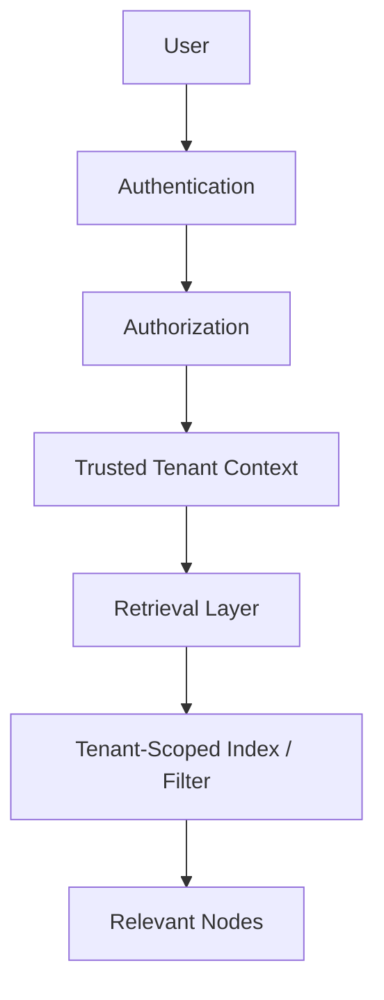

This prevents cross-tenant retrieval.

---

# 45. One Index or Multiple Indexes?

Enterprise systems may choose:

```text
One Shared Index
```

with:

```text
tenant_id metadata
```

or:

```text
Separate Index Per Tenant
```

The correct approach depends on:

```text
Scale
Isolation Requirements
Cost
Operational Complexity
Database Capabilities
Compliance
```

There is no universal answer.

---

# 46. Shared Index

```text
Enterprise Index
 ├── Tenant A
 ├── Tenant B
 ├── Tenant C
```

Advantages:

```text
Simpler Infrastructure
Potentially Lower Cost
Centralized Operations
```

Challenges:

```text
Isolation
Noisy Neighbors
Filter Correctness
Large Index Size
```

---

# 47. Tenant-Specific Indexes

```text
Tenant A → Index A
Tenant B → Index B
Tenant C → Index C
```

Advantages:

```text
Strong Isolation
Independent Scaling
Independent Lifecycle
```

Challenges:

```text
More Infrastructure
More Index Management
Higher Operational Cost
```

---

# 48. Index Sharding

Large systems may partition indexes by:

```text
Tenant
Region
Business Domain
Data Type
Time
```

Example:

```text
Global
 ├── EU
 │    ├── Payments
 │    └── Banking
 │
 └── US
      ├── Payments
      └── Banking
```

This can reduce search scope and support independent scaling.

---

# 49. Index Routing

Instead of searching every shard:

```text
Query
 ↓
Router
 ↓
Relevant Index
```

Example:

```text
Query:
"EU payment policy"

Router:
region = EU
domain = payments

        ↓

EU Payments Index
```

This can improve:

```text
Latency
Cost
Precision
Isolation
```

---

# 50. Index Routing Architecture

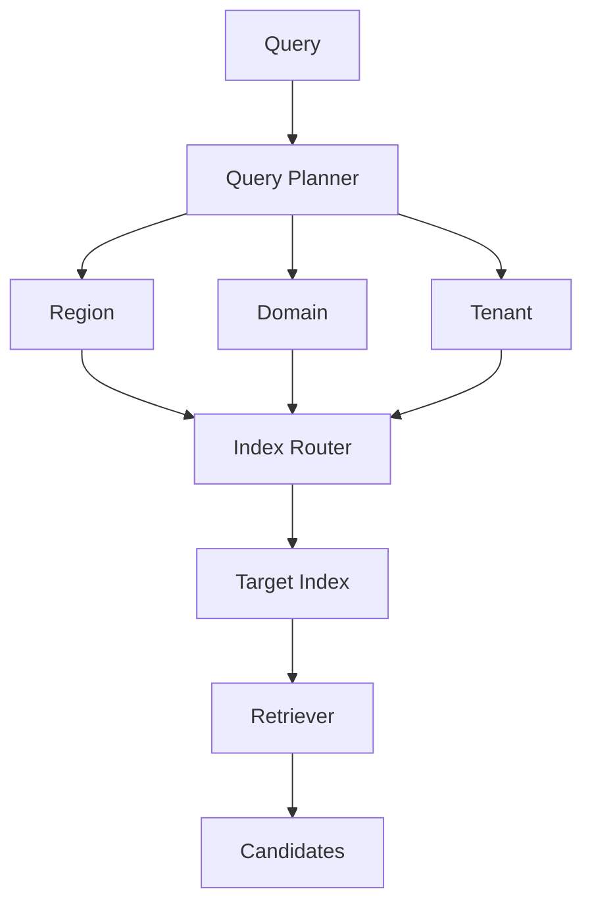

---

# 51. Multiple Indexes

A sophisticated RAG platform may maintain:

```text
Architecture Index
Policy Index
API Index
Incident Index
Database Index
```

The router determines where to search.

This is often more scalable than forcing every document into a single retrieval strategy.

---

# 52. Index Composition

Indexes can also be combined at query time.

```text
Query
 ├── Architecture Index
 ├── API Index
 └── Incident Index
        ↓
Candidate Fusion
        ↓
Re-ranking
```

This becomes an important pattern for enterprise RAG.

---

# 53. Index Composition Architecture

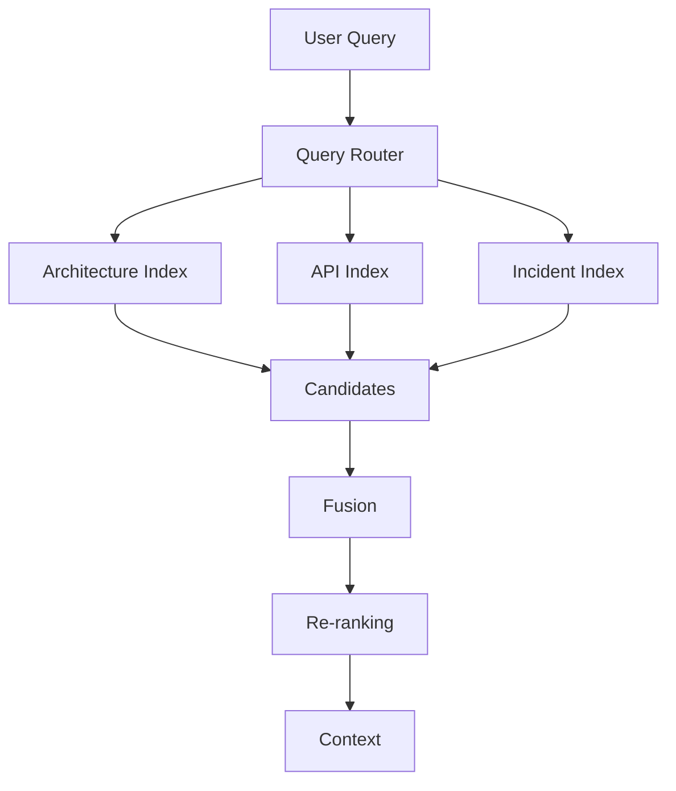

---

# 54. Index Lifecycle

Indexes should be treated as production assets.

Lifecycle:

```text
Create
 ↓
Validate
 ↓
Publish
 ↓
Serve
 ↓
Monitor
 ↓
Update
 ↓
Retire
```

This is especially important for enterprise knowledge bases.

---

# 55. Index Build Pipeline

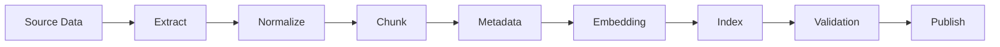

The index should be validated before becoming the active production version.

---

# 56. Blue-Green Index Deployment

A production system can maintain:

```text
Index V1 → Active
Index V2 → Candidate
```

Build:

```text
V2
```

validate it, then switch traffic:

```text
V1
 ↓
V2
```

This reduces deployment risk.

---

# 57. Index Versioning

Example:

```text
rag-index-v1
rag-index-v2
rag-index-v3
```

Each version may correspond to:

```text
Embedding Model
Chunking Strategy
Metadata Schema
Source Snapshot
Index Configuration
```

This makes rollback possible.

---

# 58. Index Rollback

If retrieval quality degrades:

```text
Production
   ↓
Index V3
   ↓
Quality Drop
   ↓
Rollback
   ↓
Index V2
```

This is much safer than rebuilding production data manually.

---

# 59. Index Validation

Before publishing an index, validate:

```text
Document Count
Node Count
Embedding Dimension
Metadata Completeness
Duplicate Rate
Missing Content
Search Quality
Latency
Security Isolation
```

Example:

```python
assert document_count > 0
assert node_count > 0
assert metadata_completeness > 0.95
```

Production validation should be significantly more comprehensive.

---

# 60. Index Health

Monitor:

```text
Index Size
Node Count
Vector Count
Metadata Coverage
Update Lag
Search Latency
No-Result Rate
Retrieval Quality
```

Example:

```text
Index Health
────────────────────────
Nodes              4.2M
Vectors            4.2M
Metadata Coverage  98.7%
Update Lag         4 min
P95 Search         110 ms
No-Result Rate     2.1%
```

---

# 61. Index Freshness

Enterprise knowledge changes continuously.

```text
Source
 ↓
Change
 ↓
Ingestion
 ↓
Re-index
 ↓
Production Index
```

Track:

```text
Source Timestamp
Index Timestamp
```

and calculate:

```text
Index Freshness Lag
```

---

# 62. Incremental Indexing

Rebuilding an entire enterprise index after every document change is expensive.

Instead:

```text
Changed Documents
       ↓
Changed Nodes
       ↓
Re-embed
       ↓
Update Index
```

This reduces:

```text
Embedding Cost
Processing Time
Deployment Time
```

---

# 63. Incremental Indexing Architecture

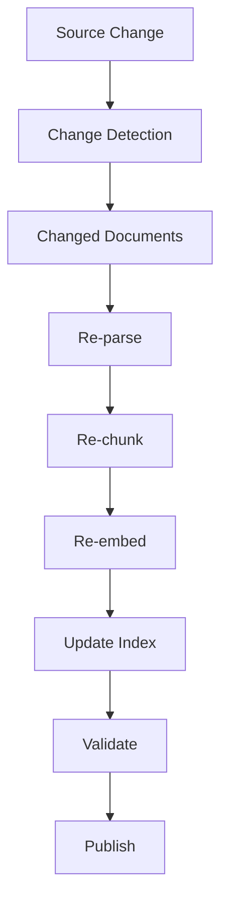

This is the preferred pattern for frequently changing knowledge bases.

---

# 64. Deleted Documents

Index lifecycle must also handle deletion.

Example:

```text
Source Document Deleted
       ↓
Change Event
       ↓
Identify Nodes
       ↓
Delete from Index
       ↓
Delete / Update Metadata
```

A stale document in the index can produce incorrect or unauthorized answers.

---

# 65. Document Version Changes

Suppose:

```text
Policy V1
```

becomes:

```text
Policy V2
```

The indexing system must decide whether to:

```text
Replace V1
```

or:

```text
Keep V1 as historical
+
Mark V2 as current
```

The decision depends on business requirements.

---

# 66. Current vs Historical Indexing

One possible design:

```text
Current Index
    ↓
Active Documents

Historical Index
    ↓
Archived Documents
```

Then:

```text
"Current policy"
```

routes to:

```text
Current Index
```

while:

```text
"What was the policy in 2024?"
```

can route to:

```text
Historical Index
```

---

# 67. Index and Retrieval Quality

A poor index can produce poor retrieval even when the retriever is correctly implemented.

Common causes:

```text
Bad Chunking
Bad Embeddings
Missing Metadata
Duplicate Nodes
Stale Documents
Wrong Index Type
Poor Source Parsing
```

Therefore retrieval quality is an end-to-end property.

---

# 68. Index Quality Equation

A useful conceptual model is:

```text
Retrieval Quality
=
Content Quality
+
Chunking Quality
+
Metadata Quality
+
Embedding Quality
+
Index Quality
+
Retriever Quality
```

These components interact rather than acting independently.

---

# 69. Index Selection Matrix

| Requirement | Preferred Index Concept |
|---|---|
| Semantic retrieval | VectorStoreIndex |
| Exact lexical matching | Keyword-oriented index |
| Broad node processing | SummaryIndex |
| Entity relationships | Graph-oriented index |
| Mixed retrieval | Multiple / composed indexes |
| Enterprise routing | Specialized indexes + router |

This is a conceptual guide, not a universal rule.

---

# 70. Vector Index Example: Architecture Documents

```python
documents = [
    Document(
        text="""
        The payment gateway uses Kafka
        for asynchronous transaction events.
        """,
        metadata={
            "document_type": "architecture",
            "service": "payment-gateway"
        }
    )
]

index = VectorStoreIndex.from_documents(
    documents
)
```

A vector index is useful because the query may use different wording:

```text
"How are payment events transported?"
```

while the document says:

```text
"Kafka is used for asynchronous transaction events."
```

---

# 71. Keyword Index Example

A keyword-oriented approach may be useful for:

```text
"payment-gateway-v3"
```

or:

```text
"INC-10291"
```

because exact terms are important.

This is one reason enterprise systems frequently combine:

```text
Vector Index
+
Keyword Retrieval
```

rather than relying on one index type.

---

# 72. Multiple Indexes for One Corpus

The same source documents can potentially contribute to multiple representations:

```text
Documents
   ├──→ Vector Index
   ├──→ Keyword Index
   ├──→ Summary Representation
   └──→ Knowledge Graph
```

At query time:

```text
Query
 ↓
Router
 ↓
One or More Indexes
 ↓
Fusion
```

This is a powerful enterprise architecture.

---

# 73. Multi-Index Architecture

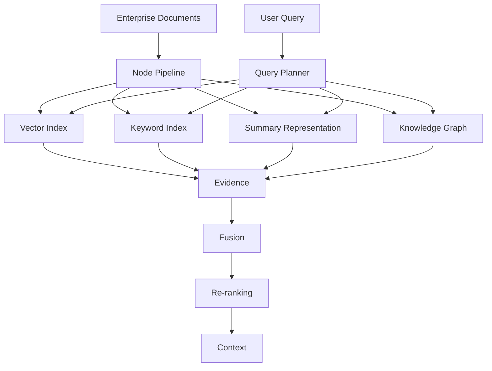

This moves beyond single-index RAG toward retrieval orchestration.

---

# 74. Indexes and Cost

Every additional index can introduce:

```text
Storage Cost
Embedding Cost
Processing Cost
Operational Complexity
Synchronization Cost
```

Therefore:

```text
More Indexes
≠
Automatically Better Retrieval
```

Only build indexes that solve real retrieval problems.

---

# 75. Indexes and Latency

Searching multiple indexes may increase latency.

Example:

```text
Vector Search     50 ms
Keyword Search    20 ms
Graph Search      80 ms
Fusion             5 ms
```

Potential pipeline latency:

```text
Parallel Search
≈ max(50, 20, 80) + fusion
```

versus:

```text
Sequential Search
≈ 50 + 20 + 80 + fusion
```

Parallel execution can help, but introduces infrastructure complexity.

---

# 76. Parallel Multi-Index Retrieval

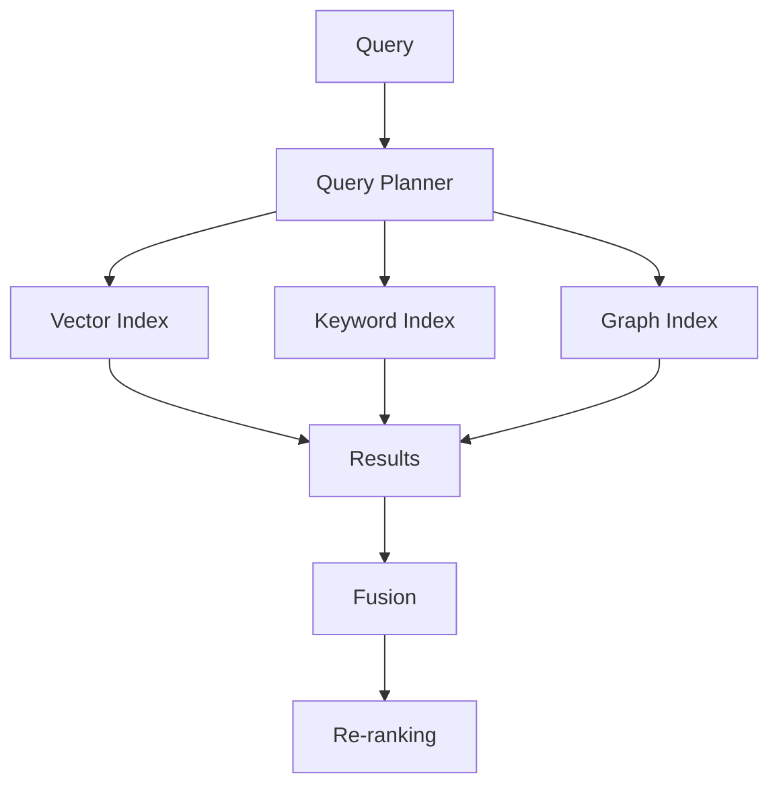

This is a common production pattern.

---

# 77. Index Failure Isolation

If one index is unavailable:

```text
Graph Index
    ↓
Unavailable
```

the system may still use:

```text
Vector Index
+
Keyword Index
```

if the business requirement allows degraded retrieval.

This is an important production resilience consideration.

---

# 78. Retrieval Fallback

```text
Primary Retriever
       ↓
Failure
       ↓
Fallback Retriever
       ↓
Response
```

Example:

```text
Hybrid Search
 ↓
Vector Backend Failure
 ↓
Keyword Retrieval
```

Fallback behavior should be explicit and observable.

---

# 79. Index Security

Indexes may contain sensitive information.

Security controls should include:

```text
Encryption
Access Control
Tenant Isolation
Audit Logging
Lifecycle Management
Deletion
```

Do not assume that embedding a document removes its sensitivity.

Embeddings and retrieved content can still represent sensitive information.

---

# 80. Index and Compliance

Enterprise requirements may include:

```text
Data Residency
Retention
Right to Delete
Auditability
Access Control
Encryption
```

Index architecture must support the required lifecycle.

Example:

```text
Document Deleted
 ↓
Node Deleted
 ↓
Vector Deleted
 ↓
Cache Invalidated
 ↓
Index Updated
```

---

# 81. Index and Data Deletion

Deletion is more complicated than deleting the original file.

You may need to remove:

```text
Document
Nodes
Embeddings
Metadata
Cache Entries
Search Index Entries
Graph Entities
```

A production ingestion pipeline should track these relationships.

---

# 82. Index Observability

Track:

```text
Index Build Time
Index Version
Document Count
Node Count
Embedding Count
Failed Documents
Failed Embeddings
Metadata Errors
Index Update Lag
```

Query-time metrics:

```text
Retrieval Latency
Top-K
Result Count
Score Distribution
No-Result Rate
```

---

# 83. Index Build Observability

Example:

```json
{
  "index_version": "payment-kb-v4",
  "documents": 120000,
  "nodes": 850000,
  "embeddings": 850000,
  "failed_documents": 42,
  "metadata_errors": 18,
  "build_duration_seconds": 8420
}
```

This makes index builds auditable and debuggable.

---

# 84. Index Evaluation

Before publishing an index:

```text
Build
 ↓
Evaluate
 ↓
Compare
 ↓
Publish
```

Compare:

```text
Index V1
vs
Index V2
```

using the same evaluation dataset.

Measure:

```text
Recall@K
MRR
NDCG
Context Relevance
Latency
Storage Cost
```

---

# 85. Index Experimentation

You may experiment with:

```text
Chunk Size
Chunk Overlap
Embedding Model
Embedding Dimension
Metadata Schema
Vector Database
Index Type
Top-K
```

Treat these as controlled experiments.

---

# 86. Index Experiment Matrix

| Version | Chunk Size | Embedding | Index | Recall@10 |
|---|---:|---|---|---:|
| V1 | 256 | Model A | Vector | 0.71 |
| V2 | 512 | Model A | Vector | 0.78 |
| V3 | 512 | Model B | Vector | 0.83 |
| V4 | 512 | Model B | Hybrid | 0.89 |

The values are illustrative.

The important idea is:

```text
Index Configuration
        ↓
Retrieval Evaluation
```

---

# 87. Index Rebuild Triggers

A full rebuild may be required after major changes such as:

```text
Embedding Model Change
Embedding Dimension Change
Chunking Strategy Change
Major Metadata Schema Change
Index Type Change
Source Reprocessing
```

Incremental updates are preferable for normal content changes when supported.

---

# 88. Index Build Pipeline in CI/CD

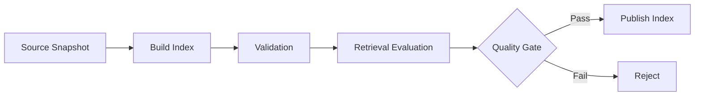

This brings retrieval engineering into a production deployment workflow.

---

# 89. Retrieval Quality Gate

Example:

```text
Recall@10 >= baseline
NDCG@10 >= baseline
No-result rate <= threshold
Security tests = 100% pass
Metadata completeness >= threshold
```

An index should not be promoted simply because it successfully built.

---

# 90. Index Registry

A production platform can maintain an index registry:

```json
{
  "name": "payment-knowledge",
  "active_version": "v4",
  "embedding_model": "model-b",
  "chunking_version": "v3",
  "created_at": "2026-08-10"
}
```

This supports:

```text
Versioning
Rollback
Auditability
Deployment
```

---

# 91. Index Registry Architecture

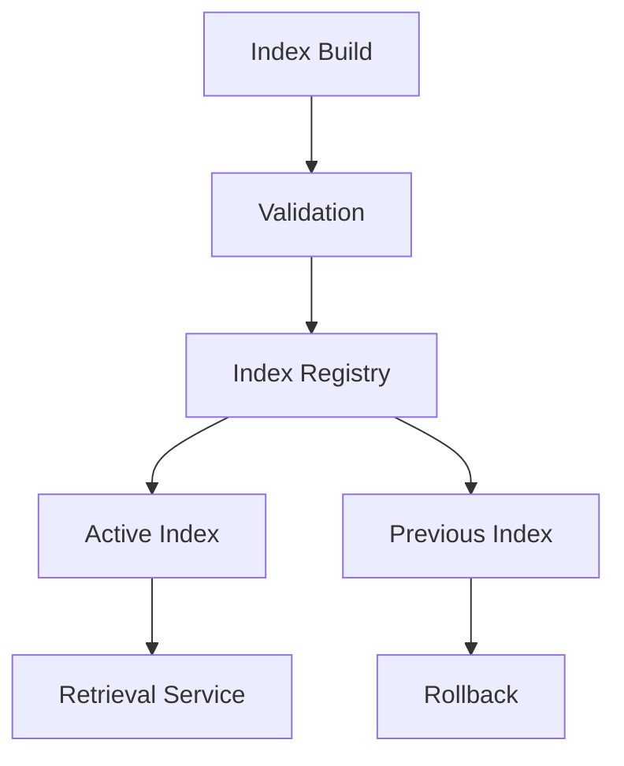

This is a useful production pattern.

---

# 92. Index Aliases

Instead of hardcoding:

```text
payment-kb-v4
```

applications can reference:

```text
payment-kb-current
```

The alias points to:

```text
v4
```

and can later switch to:

```text
v5
```

This simplifies deployment.

---

# 93. Index Warm-Up

After deployment, the system may need to:

```text
Load Index
Warm Connections
Initialize Embedding Model
Warm Vector Store
```

before accepting full traffic.

This reduces first-request latency.

---

# 94. Index Cold Start

A cold application may experience:

```text
Model Loading
+
Index Loading
+
Connection Setup
```

leading to high first-request latency.

Production systems can use:

```text
Warm Instances
Persistent Storage
Connection Pools
Preloaded Models
```

where appropriate.

---

# 95. Index Caching

Potential cache layers include:

```text
Query Rewrite Cache
Embedding Cache
Retrieval Cache
Response Cache
```

Example:

```text
Query
 ↓
Embedding Cache
 ↓
Retriever
 ↓
Result Cache
```

Cache keys must account for:

```text
Tenant
Authorization Context
Index Version
Embedding Version
Query
```

to avoid cross-context data leakage.

---

# 96. Index and Caching Security

Never use:

```text
query → cached results
```

without considering:

```text
tenant
user
role
authorization
index version
```

Two users asking the same query may have different permitted results.

---

# 97. Index and Metadata Filtering

A strong retrieval architecture is:

```text
Trusted Security Context
        ↓
Metadata Filter
        ↓
Index
        ↓
Retriever
        ↓
Ranking
```

not:

```text
Index
 ↓
Everything
 ↓
Security Filter Later
```

Security boundaries should be enforced as early as practical.

---

# 98. Index and Query Rewriting

The previous chapter introduced query rewriting.

The complete flow becomes:

```text
User Query
     ↓
Query Rewriting
     ↓
Metadata Extraction
     ↓
Retriever
     ↓
Index
     ↓
Candidates
```

The rewritten query should be optimized for the selected index.

---

# 99. Query Type → Index Type

Example:

```text
Query:
"How does OAuth authentication work?"

        ↓

Semantic Query
        ↓
Vector Index
```

Another:

```text
Query:
"What is INC-10291?"

        ↓

Exact Identifier
        ↓
Keyword / Hybrid Index
```

Another:

```text
Query:
"Which services depend on payment-service?"

        ↓

Relationship Query
        ↓
Graph Index
```

---

# 100. Query Planner + Index Router

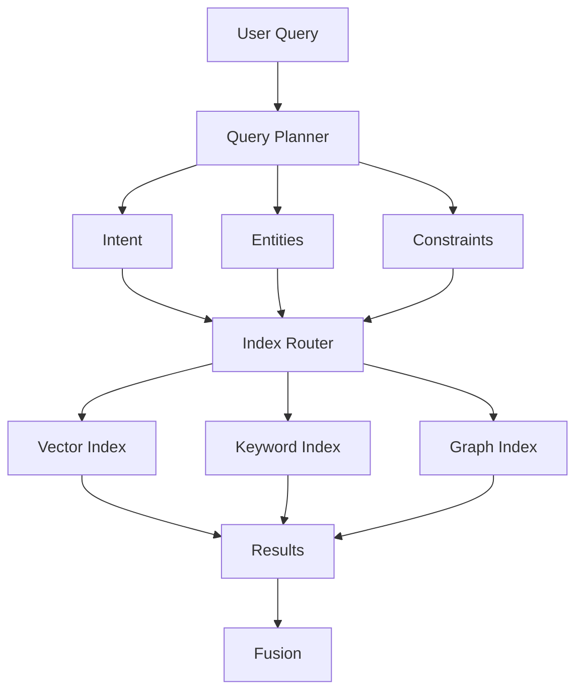

This architecture provides a foundation for multi-index enterprise retrieval.

---

# 101. Framework Adapter

If the enterprise application wants framework independence:

```python
class IndexProvider:

    def build(self, documents):
        raise NotImplementedError

    def load(self, version):
        raise NotImplementedError
```

Then:

```python
class LlamaIndexProvider(IndexProvider):

    def build(self, documents):
        ...
```

This prevents LlamaIndex-specific APIs from leaking throughout the application.

---

# 102. Capability-Based Index Architecture

Instead of exposing:

```text
LlamaIndexIndex
```

the enterprise platform can expose:

```text
SemanticIndex
KeywordIndex
GraphIndex
SummaryIndex
```

Then:

```text
LlamaIndex
```

becomes one implementation.

This keeps the architecture aligned with business capabilities rather than framework classes.

---

# 103. Example Architecture

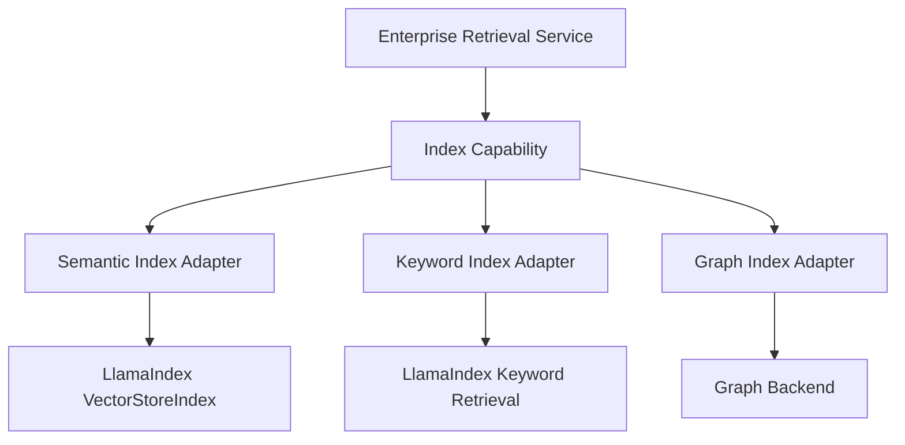

This architecture is easier to evolve.

---

# 104. Common Index Anti-Patterns

## Anti-Pattern 1 — One Index for Everything

```text
Everything
 ↓
One Vector Index
```

This may be too simplistic for complex enterprise knowledge.

---

## Anti-Pattern 2 — Rebuilding on Every Startup

```text
Application Start
 ↓
Re-embed Everything
```

This wastes time and money.

---

## Anti-Pattern 3 — No Index Versioning

Changing embeddings or chunking without tracking the resulting index makes debugging difficult.

---

# 105. Common Anti-Patterns — Continued

## Anti-Pattern 4 — Ignoring Metadata

A vector index without useful metadata can make:

```text
Filtering
Security
Citation
Routing
```

much harder.

---

## Anti-Pattern 5 — No Evaluation

An index that builds successfully can still produce poor retrieval.

---

## Anti-Pattern 6 — No Deletion Strategy

Deleted or revoked documents can remain searchable.

---

## Anti-Pattern 7 — Framework Coupling

Application logic directly depends on framework-specific index classes everywhere.

---

# 106. Production Checklist

```text
☐ Define retrieval requirements
☐ Choose appropriate index type
☐ Define node/chunk strategy
☐ Define metadata schema
☐ Configure embedding model
☐ Record embedding version
☐ Record vector dimension
☐ Define index version
☐ Persist index state
☐ Implement incremental updates
☐ Implement deletion
☐ Validate index before publication
☐ Evaluate retrieval quality
☐ Implement security isolation
☐ Monitor index freshness
☐ Monitor index health
☐ Support rollback
☐ Track index lineage
☐ Avoid unnecessary index duplication
☐ Keep application architecture framework-agnostic
```

---

# 107. Practical Decision Framework

When designing a new RAG system, ask:

### Question 1

Is the primary retrieval problem semantic?

```text
Yes
 ↓
Vector Index
```

### Question 2

Are exact identifiers important?

```text
Yes
 ↓
Keyword / Hybrid Retrieval
```

### Question 3

Does the question require relationships?

```text
Yes
 ↓
Graph-Oriented Retrieval
```

### Question 4

Does the query require broad document understanding?

```text
Yes
 ↓
Summary / Broad Retrieval Strategy
```

### Question 5

Do multiple retrieval strategies help?

```text
Yes
 ↓
Multi-Index / Composed Retrieval
```

---

# 108. Enterprise Index Strategy

A mature enterprise RAG platform may use:

```text
                 Enterprise Knowledge
                         │
          ┌──────────────┼──────────────┐
          ↓              ↓              ↓
      Documents       Databases       Graphs
          │              │              │
          ↓              ↓              ↓
     Vector Index     SQL Layer     Graph Index
          │              │              │
          └──────────────┼──────────────┘
                         ↓
                  Query Planner
                         ↓
                  Retrieval Router
                         ↓
                 Candidate Fusion
                         ↓
                     Re-ranking
                         ↓
                 Context Engineering
```

LlamaIndex can participate in multiple parts of this architecture.

---

# 109. Key Takeaways

- An index organizes information for efficient retrieval.
- LlamaIndex supports multiple index concepts for different information needs.
- `VectorStoreIndex` is central to semantic RAG.
- Vector indexes depend on compatible embedding configurations.
- Nodes are the fundamental units that indexes organize and retrieve.
- `SummaryIndex` supports broad or summary-oriented retrieval workflows.
- Keyword-oriented indexing is useful for exact terms and identifiers.
- Graph-oriented indexing represents entities and relationships.
- Index choice should follow the retrieval problem rather than framework popularity.
- Indexes and retrievers are different architectural concerns.
- An index organizes information; a retriever performs query-time retrieval.
- Query engines combine retrieval with response synthesis.
- Indexing occurs primarily during ingestion, while retrieval occurs at query time.
- Persistent indexes avoid rebuilding the corpus for every application startup.
- External vector stores can provide scalable persistence for embeddings.
- Metadata should be designed together with index architecture.
- Tenant isolation must be enforced by trusted application security controls.
- One shared index and multiple tenant-specific indexes have different trade-offs.
- Large systems may use index sharding and routing.
- Multiple specialized indexes can be composed into an enterprise retrieval system.
- Incremental indexing reduces the cost of frequent source changes.
- Deletion and document revocation are critical parts of index lifecycle management.
- Index versions enable safe deployments and rollback.
- Index quality depends on parsing, chunking, metadata, embeddings, and retrieval configuration.
- Indexes should be evaluated using retrieval metrics before production publication.
- Index build pipelines can use quality gates similar to software deployment pipelines.
- Index observability should track build health, freshness, size, failures, and retrieval performance.
- Caching must include security and index-version context.
- Enterprise applications should avoid becoming tightly coupled to framework-specific index classes.
- Capability-based index abstractions provide a cleaner architecture.
- LlamaIndex should be treated as an implementation toolkit inside the enterprise RAG architecture, not as the architecture itself.

The central model is:

```text
                 SOURCE KNOWLEDGE
                        │
                        ▼
                 Document Processing
                        │
                        ▼
                      Nodes
                        │
          ┌─────────────┼─────────────┐
          ▼             ▼             ▼
      Vector Index  Keyword Index  Graph Index
          │             │             │
          └─────────────┼─────────────┘
                        ▼
                 Query Planning
                        │
                        ▼
                  Retrieval Router
                        │
                        ▼
                 Candidate Results
                        │
                        ▼
                    Re-ranking
                        │
                        ▼
                 Context Selection
                        │
                        ▼
                       LLM
                        │
                        ▼
               Validated Enterprise
                     Response
```

> **An index is not simply a database of embeddings. It is a retrieval-oriented representation of enterprise knowledge.**

---

# 🧭 Chapter Navigation

### Part V — Advanced Retrieval-Augmented Generation

**Previous:**  
[01. LlamaIndex Retrievers Overview](01-llamaindex-retrievers-overview.md)

**Next:**  
[03. Vector Index Retriever](03-vector-index-retriever.md)

**Section:**  
03 — LlamaIndex Retrieval Engineering

### LlamaIndex Retrieval Engineering Path

```text
01 LlamaIndex Retrievers Overview
              ↓
02 LlamaIndex Indexes
              ↓
03 Vector Index Retriever
              ↓
04 BM25 Retriever
              ↓
05 Document Summary Retriever
              ↓
06 Recursive Retriever
              ↓
07 Query Fusion Retriever
              ↓
08 Auto-Merging Retriever
              ↓
04 Vector Search Engineering
```

---

> **Enterprise AI Engineering Handbook**  
> *Building Production-Grade Enterprise AI Systems — One Chapter at a Time.*