# Vector Index Retriever

## 📖 Overview

A **Vector Index Retriever** is one of the most fundamental retrieval mechanisms used in modern Retrieval-Augmented Generation (RAG).

It retrieves nodes by comparing the semantic representation of a user query with the semantic representations of indexed nodes.

The core flow is:

```text
Documents
    ↓
Nodes
    ↓
Embeddings
    ↓
Vector Index
    ↓
Vector Retriever
    ↓
Similarity Search
    ↓
Top-K Nodes
```

The important distinction is:

```text
Vector Index
    =
Stores / organizes vector representations

Vector Retriever
    =
Performs query-time retrieval
```

This chapter focuses on the **retriever layer** and how it works with LlamaIndex's vector indexing architecture.

---

# 🎯 Learning Objectives

After completing this chapter, you will be able to:

- Understand vector-based retrieval
- Understand how `VectorStoreIndex` works with a retriever
- Understand query and document embeddings
- Understand similarity search
- Understand Top-K retrieval
- Understand similarity scores
- Configure a vector retriever
- Apply metadata filters
- Understand similarity thresholds
- Understand retrieval latency and scalability
- Understand vector-store integration
- Debug poor vector retrieval
- Evaluate vector retrieval quality
- Design production-grade vector retrieval pipelines
- Understand where re-ranking, MMR, and hybrid retrieval fit
- Build framework-aware vector retriever adapters

---

# 1. What Is a Vector Retriever?

A vector retriever finds content based on **semantic similarity** rather than exact keyword matching.

Suppose the knowledge base contains:

```text
"Kafka is used for asynchronous payment events."
```

The user asks:

```text
"How are payment transactions communicated asynchronously?"
```

There may be little exact word overlap.

However, the semantic meaning is closely related.

Vector retrieval attempts to identify this relationship.

---

# 2. Core Architecture

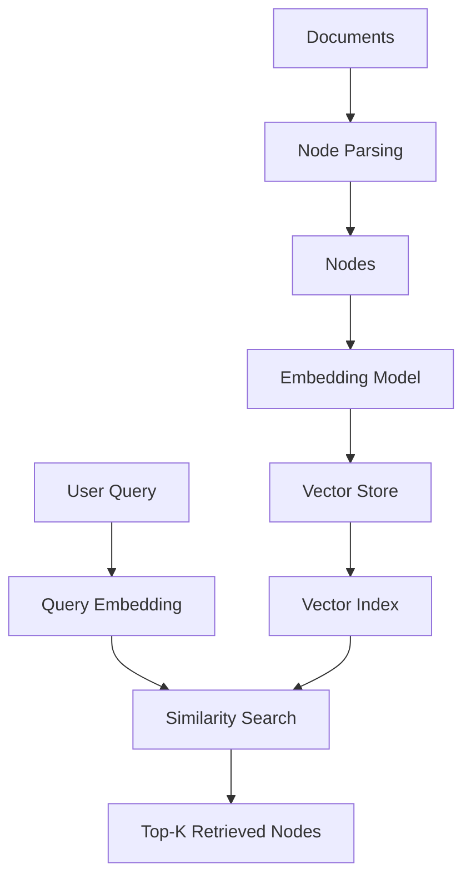

At indexing time:

```text
Node → Embedding → Vector Store
```

At query time:

```text
Query → Embedding → Similarity Search
```

---

# 3. The Fundamental Idea

A vector embedding converts text into a numerical representation.

Conceptually:

```text
"Payment authentication"
        ↓
[0.12, -0.42, 0.87, ...]
```

Another text:

```text
"OAuth-based payment authorization"
        ↓
[0.14, -0.39, 0.84, ...]
```

The vectors may be close in the embedding space.

Therefore:

```text
Semantic Similarity
        ↓
Vector Proximity
        ↓
Relevant Retrieval
```

---

# 4. Embedding Space

Imagine a simplified two-dimensional embedding space:

```text
                 Authentication
                      ●
                     ● ●
                    ●
                   
       Payments ● ● ●
              ●

                                      Database
                                         ●
                                        ● ●
```

Related concepts tend to appear closer together.

Real embedding models use hundreds or thousands of dimensions rather than two.

The two-dimensional diagram is only for visualization.

---

# 5. Document Embedding

During indexing:

```text
Node
 ↓
Embedding Model
 ↓
Document Vector
```

Example:

```python
text = """
OAuth tokens are used to authenticate
payment API requests.
"""

vector = embedding_model.embed(text)

print(len(vector))
```

The actual API depends on the embedding provider.

---

# 6. Query Embedding

At query time:

```text
User Query
 ↓
Same / Compatible Embedding Model
 ↓
Query Vector
```

Example:

```python
query = "How are payment APIs authenticated?"

query_vector = embedding_model.embed(
    query
)
```

The system then compares the query vector with indexed vectors.

---

# 7. Embedding Consistency

One of the most important production rules is:

```text
Document Embeddings
        ↓
Embedding Space
        ↑
Query Embeddings
```

The query and indexed content must use compatible embedding representations.

Avoid:

```text
Documents → Embedding Model A

Query → Unrelated Embedding Model B
```

unless the architecture explicitly supports compatible representations.

---

# 8. Vector Similarity

A retriever needs a way to measure how close two vectors are.

Common similarity/distance concepts include:

```text
Cosine Similarity
Dot Product
Euclidean Distance
```

The exact metric depends on the vector store and embedding configuration.

---

# 9. Cosine Similarity

Cosine similarity compares the angle between two vectors.

Conceptually:

```text
           Query Vector
                ↗
               /
              /
             /
            ●────────→ Document Vector
```

Vectors pointing in similar directions generally have high cosine similarity.

For normalized vectors, cosine similarity is commonly used for semantic retrieval.

---

# 10. Why Similarity Matters

Suppose:

```text
Query
=
"How does OAuth authentication work?"
```

Candidate nodes:

```text
Node A:
OAuth authentication uses access tokens.

Node B:
Kafka handles asynchronous events.

Node C:
The database uses PostgreSQL.
```

The retriever may rank:

```text
Node A → High similarity
Node B → Lower similarity
Node C → Low similarity
```

Then:

```text
Top-K
```

determines which nodes are returned.

---

# 11. Top-K Retrieval

Top-K means:

> Return the K highest-ranked candidates.

Example:

```python
retriever = index.as_retriever(
    similarity_top_k=5
)
```

Conceptually:

```text
1000 Candidate Nodes
        ↓
Similarity Search
        ↓
Rank
        ↓
Top 5
```

---

# 12. Top-K Architecture

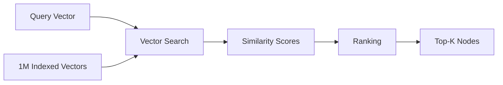

Top-K is one of the most important retrieval parameters.

---

# 13. Choosing K

A very small K:

```text
K = 2
```

may miss relevant evidence.

A very large K:

```text
K = 50
```

may introduce:

```text
Noise
Duplicate Content
Large Context
Higher LLM Cost
Higher Latency
```

Therefore:

```text
K
=
Retrieval Recall vs Context Quality Trade-off
```

---

# 14. Retrieval vs Context Size

Suppose:

```text
K = 20
```

and each chunk contains:

```text
500 tokens
```

Potential retrieved context:

```text
20 × 500
=
10,000 tokens
```

But not every retrieved chunk is necessarily useful.

This is why advanced systems often use:

```text
Initial Retrieval
      ↓
Re-ranking
      ↓
Filtering
      ↓
Context Selection
```

---

# 15. Basic LlamaIndex Vector Retriever

A typical LlamaIndex flow is:

```python
from llama_index.core import (
    Document,
    VectorStoreIndex
)

documents = [
    Document(
        text="""
        OAuth tokens authenticate
        payment API requests.
        """
    ),
    Document(
        text="""
        Kafka handles asynchronous
        payment events.
        """
    )
]

index = VectorStoreIndex.from_documents(
    documents
)

retriever = index.as_retriever(
    similarity_top_k=3
)

results = retriever.retrieve(
    "How are payment APIs authenticated?"
)

for result in results:
    print(result.node.text)
    print(result.score)
```

The exact API can vary depending on the LlamaIndex release and configured integrations.

---

# 16. What Does `as_retriever()` Do?

Conceptually:

```text
VectorStoreIndex
        ↓
as_retriever()
        ↓
Vector Retriever
```

The index provides the underlying vector representation and storage.

The retriever provides query-time behavior.

Therefore:

```python
index.as_retriever(...)
```

is an important boundary between:

```text
Indexing
```

and:

```text
Retrieval
```

---

# 17. Retriever Output

A vector retriever typically returns results containing:

```text
Node
+
Score
```

Conceptually:

```python
for result in results:
    node = result.node

    print(
        node.text,
        result.score
    )
```

The score can be useful for:

```text
Ranking
Filtering
Evaluation
Debugging
Observability
```

---

# 18. Retrieval Result Example

Conceptually:

```text
Result 1
──────────────
Score: 0.91

OAuth tokens authenticate
payment API requests.


Result 2
──────────────
Score: 0.78

Payment services use
secure authorization.


Result 3
──────────────
Score: 0.54

Kafka handles payment events.
```

The values above are illustrative.

Scores are not universally comparable across different embedding models, distance metrics, or retrieval systems.

---

# 19. Similarity Threshold

Top-K alone may return weak results.

For example:

```text
Top-K = 5
```

could return:

```text
0.92
0.88
0.81
0.43
0.21
```

The last result may not be relevant.

A threshold can help:

```text
Minimum Similarity
```

Conceptually:

```text
Retrieve
   ↓
Score Threshold
   ↓
Relevant Results
```

---

# 20. Threshold Trade-Off

Too high:

```text
Threshold = Very Strict
```

may cause:

```text
No Results
```

Too low:

```text
Threshold = Very Loose
```

may introduce:

```text
Noise
```

Therefore thresholds should be calibrated against evaluation data.

---

# 21. Retrieval Pipeline with Threshold

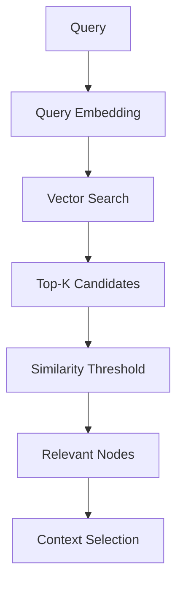

---

# 22. Metadata Filtering

Vector similarity does not always provide enough control.

Suppose an enterprise knowledge base contains:

```text
Department:
Payments
Security
HR

Region:
EU
US
India
```

A query may require:

```text
region = EU
department = payments
```

Metadata filtering can reduce the search scope.

---

# 23. Metadata-Aware Vector Retrieval

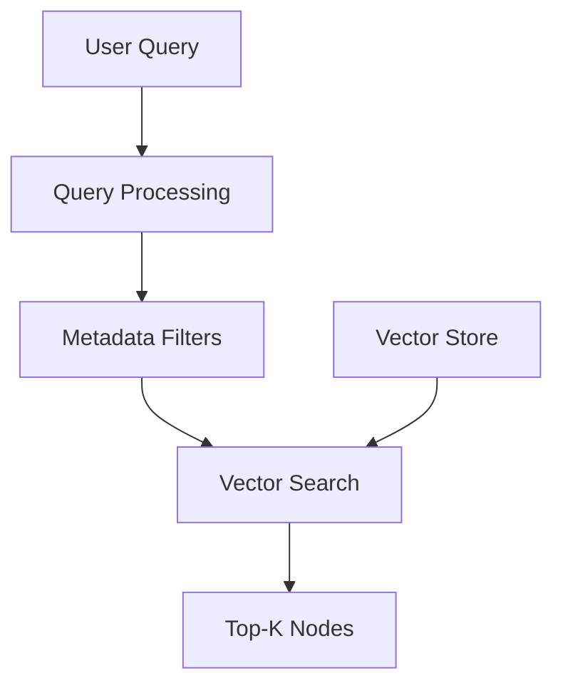

Conceptually:

```text
Semantic Similarity
+
Metadata Constraints
```

is much stronger than semantic similarity alone for many enterprise use cases.

---

# 24. Metadata Example

```python
document = Document(
    text="""
    OAuth tokens expire after
    sixty minutes.
    """,
    metadata={
        "department": "payments",
        "region": "EU",
        "document_type": "policy",
        "status": "approved"
    }
)
```

A retrieval system can use these attributes to narrow the candidate set.

---

# 25. Tenant-Aware Retrieval

For a multi-tenant enterprise application:

```text
User
 ↓
Tenant Context
 ↓
Metadata Filter
 ↓
Vector Retrieval
```

Example:

```text
tenant_id = tenant-a
```

should be applied using a trusted security context.

Do not rely on the user simply supplying:

```json
{
  "tenant_id": "tenant-a"
}
```

as an authorization mechanism.

---

# 26. Secure Retrieval Architecture

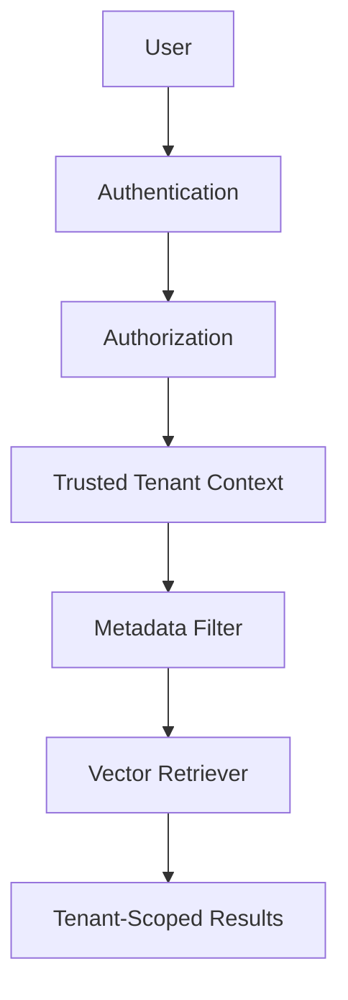

Security must be enforced by the application/platform boundary.

---

# 27. Vector Store

The retriever ultimately needs access to a vector storage system.

Conceptually:

```text
Vector Retriever
       ↓
Vector Store
       ↓
Vector Search
```

Possible vector stores include:

```text
Chroma
FAISS
Milvus
Qdrant
Pinecone
Weaviate
OpenSearch
```

The exact integration depends on the chosen LlamaIndex components and deployment architecture.

---

# 28. Vector Store vs Vector Index

These terms are often confused.

### Vector Store

Responsible primarily for:

```text
Persisting
Searching
Managing
```

vector representations.

### Vector Index

Provides an indexing abstraction over the stored information.

### Retriever

Executes query-time retrieval.

Conceptually:

```text
Vector Index
      ↓
Vector Store
      ↓
Vector Search
      ↓
Retriever
```

The precise implementation can vary.

---

# 29. Local vs Production Vector Stores

For experimentation:

```text
Local
 ├── FAISS
 └── Chroma
```

For larger production deployments:

```text
Managed / Distributed
 ├── Milvus
 ├── Qdrant
 ├── Pinecone
 ├── Weaviate
 └── OpenSearch
```

Selection should depend on:

```text
Scale
Latency
Filtering
Availability
Operations
Cost
Cloud Strategy
```

---

# 30. Retrieval Distance Metrics

Common metrics include:

```text
Cosine Similarity
Dot Product
Euclidean Distance
```

Be careful when interpreting scores.

For some systems:

```text
Higher = More Similar
```

while distance-based systems may use:

```text
Lower = More Similar
```

Never assume score direction without understanding the configured backend.

---

# 31. Normalization

Some embedding/vector configurations normalize vectors before similarity calculation.

Conceptually:

```text
Raw Vector
    ↓
Normalization
    ↓
Normalized Vector
    ↓
Similarity Search
```

Normalization behavior can affect score interpretation and retrieval quality.

Treat it as part of the index configuration.

---

# 32. Index Configuration Contract

A production vector index should track:

```text
Embedding Model
Embedding Version
Vector Dimension
Distance Metric
Normalization
Chunk Size
Chunk Overlap
Metadata Schema
Vector Store
Index Version
```

Example:

```json
{
  "index": "payment-kb-v3",
  "embedding_model": "embedding-model-v2",
  "dimension": 1536,
  "distance_metric": "cosine",
  "chunk_size": 512,
  "chunk_overlap": 50
}
```

---

# 33. Chunking Directly Affects Retrieval

Consider:

```text
Chunk A:
OAuth tokens expire after 60 minutes.
```

versus:

```text
Chunk B:
Authentication architecture...
OAuth...
Kafka...
Database...
Logging...
Security...
```

Chunk A is more focused.

Vector retrieval may therefore identify it more accurately for:

```text
"When do OAuth tokens expire?"
```

Good retrieval starts with good node construction.

---

# 34. Chunk Size Trade-Off

### Very Small Chunks

Advantages:

```text
High Precision
Focused Embeddings
```

Disadvantages:

```text
Lost Context
More Nodes
More Retrieval Candidates
```

### Very Large Chunks

Advantages:

```text
More Context
Fewer Nodes
```

Disadvantages:

```text
Lower Retrieval Precision
More Noise
Larger LLM Context
```

---

# 35. Chunking and Vector Retrieval

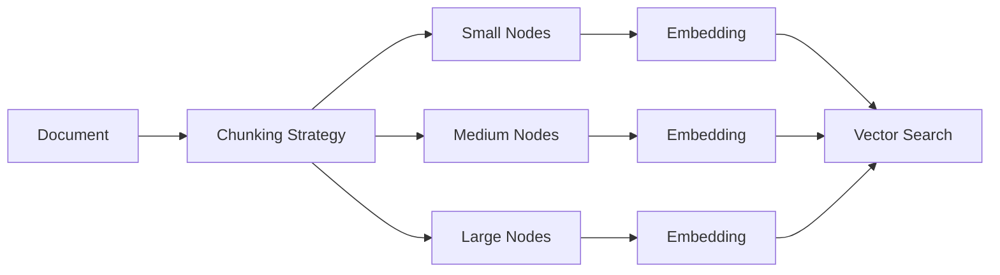

Chunking should be treated as a retrieval optimization parameter.

---

# 36. Retrieval Recall

A vector retriever should retrieve relevant information.

If the answer depends on:

```text
Node A
```

but the retriever returns:

```text
Node B
Node C
Node D
```

then generation cannot reliably recover the missing evidence.

This leads to:

```text
Retrieval Failure
        ↓
Generation Failure
```

---

# 37. Retrieval Precision

Suppose retrieval returns:

```text
A A A A B C D E F
```

where:

```text
A = Relevant
B-F = Noise
```

Precision is poor.

Too much irrelevant context can cause:

```text
Context Dilution
LLM Confusion
Higher Token Cost
Lower Answer Quality
```

---

# 38. Recall vs Precision

```text
Initial Retrieval
       ↓
Optimize for Recall
       ↓
Candidate Set
       ↓
Re-ranking / Filtering
       ↓
Optimize for Precision
       ↓
Final Context
```

This is a key production RAG pattern.

---

# 39. Vector Retriever as Stage One

A common architecture is:

```text
Query
 ↓
Vector Retriever
 ↓
Top-50
 ↓
Re-ranker
 ↓
Top-10
 ↓
Context Selection
 ↓
LLM
```

The vector retriever does not need to solve the entire retrieval problem.

It can serve as a **candidate generator**.

---

# 40. Candidate Generation

Why retrieve 50 instead of 5?

Because the first stage may prioritize:

```text
Recall
```

Then a second stage can prioritize:

```text
Precision
```

Architecture:

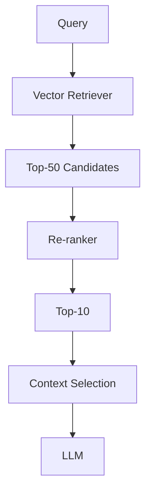

---

# 41. Re-ranking

A re-ranker can inspect:

```text
Query
+
Candidate Document
```

and estimate relevance more precisely than the initial vector search.

Example:

```text
Vector Retrieval
    ↓
50 candidates

Cross-Encoder / LLM Re-ranker
    ↓
10 candidates
```

Re-ranking is covered in detail in the enterprise retrieval engineering section.

---

# 42. MMR

Maximum Marginal Relevance can reduce redundancy.

Suppose retrieval returns:

```text
A
A'
A''
B
C
```

where:

```text
A, A', A''
```

contain nearly identical information.

MMR can favor:

```text
A
B
C
```

to improve diversity.

---

# 43. Vector Retriever + MMR

```text
Query
 ↓
Vector Search
 ↓
Candidate Pool
 ↓
MMR
 ↓
Diverse Results
```

This is useful when the knowledge base contains many overlapping chunks.

---

# 44. Hybrid Retrieval

Vector retrieval can be combined with keyword retrieval.

```text
Query
 ├──→ Dense / Vector Search
 └──→ Sparse / Keyword Search
              ↓
           Fusion
              ↓
          Re-ranking
```

This improves retrieval for:

```text
Natural Language
+
Exact Identifiers
```

---

# 45. Hybrid Architecture

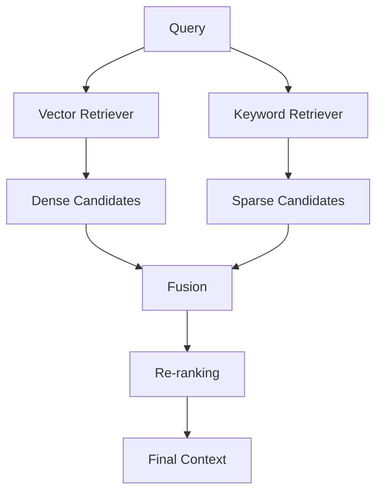

This is often more robust than vector-only retrieval in enterprise systems.

---

# 46. Multi-Query Retrieval

A single query may not capture all semantic interpretations.

Example:

```text
Original:
"How does payment authentication work?"
```

Generate:

```text
Query 1:
"How are payment requests authenticated?"

Query 2:
"What authorization mechanism protects payment APIs?"

Query 3:
"How are OAuth tokens used in payment services?"
```

Each query can be vector-searched.

---

# 47. Multi-Query + Vector Retrieval

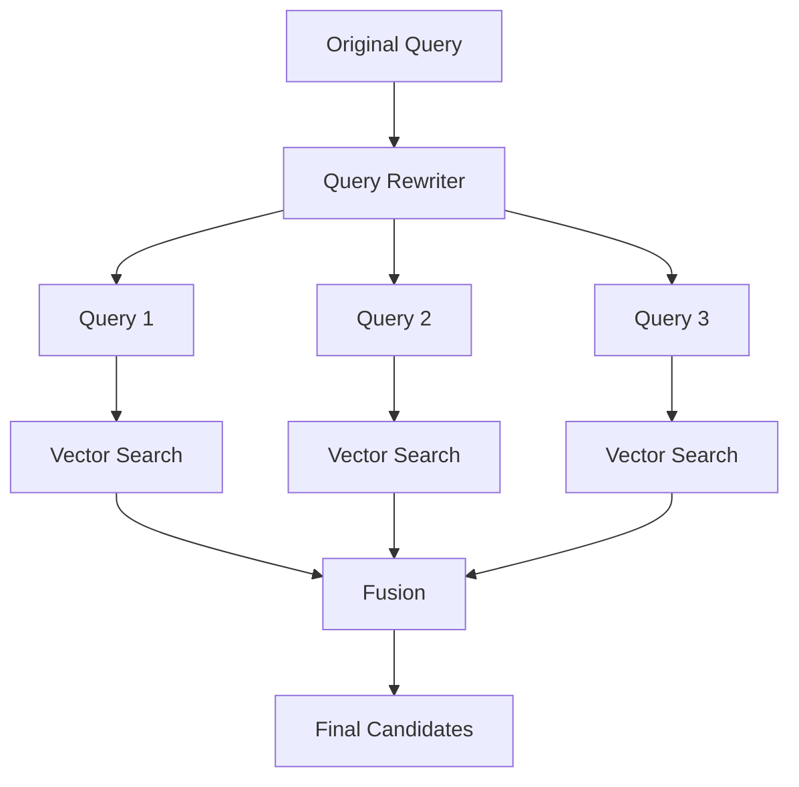

This can improve recall for complex questions.

---

# 48. Self-Query Retrieval

A user may ask:

```text
"Show approved payment architecture documents
from Europe."
```

The system can separate:

```text
Semantic Query:
payment architecture

Metadata:
status = approved
region = Europe
```

Then:

```text
Metadata Filter
+
Vector Search
```

This is more precise than treating the entire sentence as plain semantic text.

---

# 49. Vector Retrieval + Self Query

```text
User Query
      ↓
Query Understanding
      ↓
┌───────────────┬────────────────┐
│ Semantic Text │ Metadata       │
│ payment arch  │ region = EU    │
│               │ status=approved│
└───────┬───────┴───────┬────────┘
        ↓               ↓
   Vector Search   Metadata Filter
        └───────────┬───────────┘
                    ↓
               Final Results
```

---

# 50. Parent-Document Retrieval

Vector search may identify a small child chunk:

```text
Child Chunk
"OAuth tokens expire after 60 minutes."
```

But the LLM may need:

```text
Parent Section
Authentication Lifecycle
```

The architecture becomes:

```text
Vector Retrieval
      ↓
Child Node
      ↓
Parent Resolution
      ↓
Expanded Context
```

This improves context completeness.

---

# 51. Vector Retriever in a Parent-Child Architecture

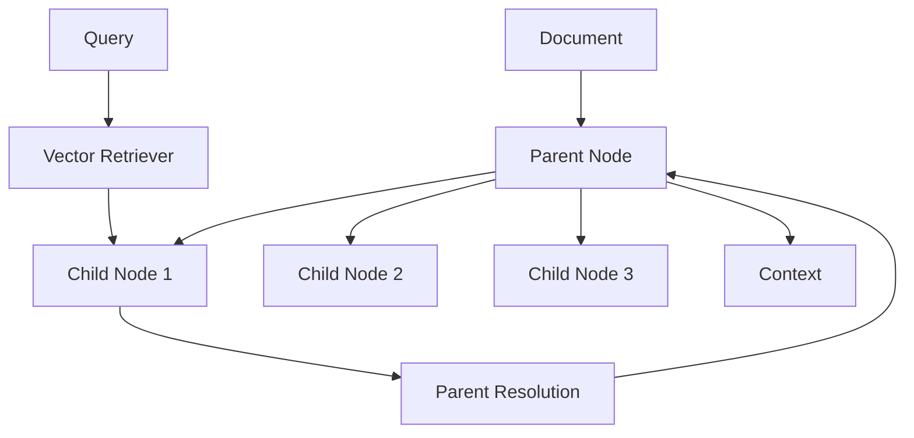

The vector retriever remains the initial candidate generator.

---

# 52. Query-Time Flow

A production vector retrieval request can look like:

```text
1. Receive Query
2. Authenticate User
3. Resolve Tenant
4. Normalize Query
5. Rewrite Query
6. Generate Query Embedding
7. Apply Metadata Filters
8. Search Vector Store
9. Retrieve Top-K
10. Apply Threshold
11. Re-rank
12. Remove Duplicates
13. Select Context
14. Generate Response
```

The vector retriever is only one stage in this larger workflow.

---

# 53. Query Embedding Latency

Retrieval latency includes more than vector database search.

Potential components:

```text
Query Processing
+
Embedding Generation
+
Network
+
Vector Search
+
Filtering
+
Postprocessing
```

Example:

```text
Embedding       30 ms
Network          5 ms
Vector Search   20 ms
Filtering        5 ms
----------------------
Total            60 ms
```

Values are illustrative.

---

# 54. Parallelization

If the architecture performs:

```text
Vector Search
+
Keyword Search
+
Graph Search
```

execute independent operations concurrently where appropriate.

```python
results = await asyncio.gather(
    vector_search(query),
    keyword_search(query),
    graph_search(query)
)
```

This can reduce wall-clock latency.

---

# 55. Vector Search at Scale

Imagine:

```text
10 million vectors
```

A brute-force comparison may be expensive.

Vector databases use specialized indexing techniques such as:

```text
HNSW
IVF
PQ
Other ANN techniques
```

These allow approximate nearest-neighbor retrieval at scale.

The detailed vector search engineering section covers these mechanisms.

---

# 56. Approximate Nearest Neighbor

Instead of:

```text
Compare query
against every vector
```

ANN methods attempt to find high-quality nearest neighbors more efficiently.

Conceptually:

```text
10M Vectors
     ↓
ANN Index
     ↓
Candidate Region
     ↓
Nearest Neighbors
```

Trade-off:

```text
Speed
vs
Exactness
```

---

# 57. Recall vs Latency in ANN

Increasing search effort can improve recall but increase latency.

Conceptually:

```text
Higher Search Effort
        ↓
Higher Recall
        ↓
Higher Latency
```

Production tuning therefore requires evaluation rather than blindly maximizing search parameters.

---

# 58. Vector Retriever Performance

Important metrics include:

```text
Embedding Latency
Search Latency
P50 Latency
P95 Latency
P99 Latency
Throughput
Recall@K
Result Count
No-Result Rate
```

Track these independently.

---

# 59. Observability

A production vector retrieval trace might look like:

```json
{
  "query": "How are payment APIs authenticated?",
  "retriever": "vector",
  "index_version": "payment-kb-v3",
  "top_k": 20,
  "results": 20,
  "filtered_results": 12,
  "reranked_results": 5,
  "latency_ms": 84
}
```

Do not log sensitive document content unnecessarily.

Prefer identifiers, scores, and controlled metadata.

---

# 60. Retrieval Debugging

When retrieval fails, inspect:

```text
Query
 ↓
Query Embedding
 ↓
Metadata Filter
 ↓
Vector Search
 ↓
Scores
 ↓
Retrieved Nodes
```

Ask:

```text
Did the correct document exist?
Did the correct node exist?
Was the node chunked correctly?
Was metadata filtering too strict?
Was the embedding model appropriate?
Was K too small?
Was the similarity threshold too high?
```

---

# 61. Common Vector Retrieval Failure

Suppose the correct node exists:

```text
Node 500
```

but retrieval returns:

```text
Node 2
Node 8
Node 13
```

Possible causes:

```text
Poor Chunking
Weak Embedding
Wrong Query
Insufficient K
Bad Metadata Filter
Index Configuration
```

Do not immediately blame the LLM.

---

# 62. Retrieval Debugging Matrix

| Problem | Potential Cause |
|---|---|
| Relevant document never retrieved | Chunking / embedding / index |
| Correct document retrieved but wrong chunk | Chunking |
| Relevant chunk ranked low | Embedding / retrieval |
| Too many irrelevant chunks | K too high / weak threshold |
| No results | Threshold / filters |
| Exact ID not found | Need keyword/hybrid search |
| Context duplicated | Need MMR / deduplication |
| Context too large | Lower K / compression |

---

# 63. Retrieval Evaluation Dataset

Create a benchmark containing:

```text
Question
Expected Source
Expected Node
Relevant Documents
```

Example:

```json
{
  "question": "How long do OAuth tokens remain valid?",
  "expected_source": "authentication-policy.pdf",
  "expected_topic": "token expiration"
}
```

Run the retriever against the same dataset after every index change.

---

# 64. Retrieval Metrics

Useful metrics include:

```text
Recall@K
Precision@K
MRR
NDCG
Hit Rate
```

### Recall@K

Did the relevant item appear within the top K?

### Precision@K

How many of the top K results were relevant?

### MRR

How early did the first relevant result appear?

### NDCG

How well were results ranked according to graded relevance?

---

# 65. Vector Retriever Evaluation

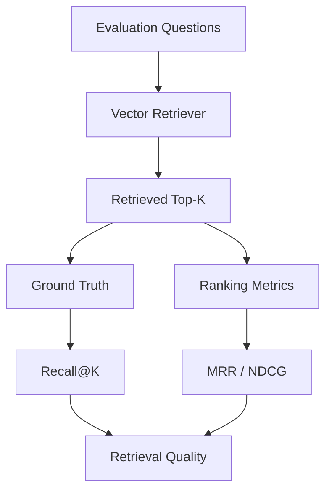

This allows index and retriever changes to be measured objectively.

---

# 66. A/B Testing Vector Retrieval

Suppose:

```text
Retriever A
Embedding Model A
K = 5
```

versus:

```text
Retriever B
Embedding Model B
K = 10
```

Run both against the same evaluation set.

Compare:

```text
Recall
Precision
MRR
Latency
Cost
```

Do not choose solely based on one metric.

---

# 67. Production Retrieval Quality

A production-quality vector retriever should optimize:

```text
Accuracy
+
Latency
+
Cost
+
Reliability
+
Security
```

A retriever with excellent recall but:

```text
5-second latency
```

may be unsuitable for interactive applications.

---

# 68. Cost Considerations

Costs can occur during:

```text
Embedding Generation
Vector Storage
Vector Search
Network
Re-ranking
LLM Context Processing
```

Reducing K can reduce downstream LLM token usage.

But:

```text
Too-small K
```

can reduce recall.

Therefore:

```text
Cost Optimization
≠
Always Reduce K
```

---

# 69. Caching

Useful caching opportunities include:

```text
Query Embedding Cache
Retrieval Result Cache
```

Example:

```text
Query
 ↓
Hash
 ↓
Embedding Cache
 ↓
Vector Search
```

Cache keys should include relevant configuration:

```text
Tenant
Index Version
Embedding Version
Query
Filters
```

---

# 70. Vector Retriever Security

Retrieved nodes may contain:

```text
Customer Data
Financial Information
Internal Architecture
Credentials
Confidential Policies
```

Never assume:

```text
Vector Search
=
Safe Search
```

Security must be enforced before retrieval results are exposed to the response layer.

---

# 71. Authorization-Aware Retrieval

```text
User
 ↓
Authorization
 ↓
Allowed Data Scope
 ↓
Metadata Filter
 ↓
Vector Retrieval
 ↓
Allowed Results
```

This is safer than:

```text
Retrieve Everything
 ↓
Ask LLM to ignore restricted data
```

The LLM should not be the primary authorization mechanism.

---

# 72. Multi-Tenant Vector Retrieval

For shared infrastructure:

```text
Vector Store
 ├── Tenant A
 ├── Tenant B
 └── Tenant C
```

query:

```text
Tenant A
```

must produce:

```text
Tenant A results only
```

The filter should come from trusted application context.

---

# 73. Vector Retriever + Response Generation

A complete RAG request:

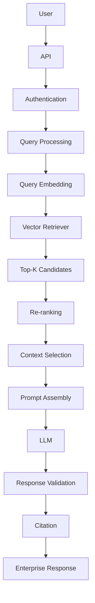

This shows where vector retrieval fits into production RAG.

---

# 74. Vector Retriever Does Not Solve Everything

A common mistake is:

```text
Vector Search
=
Complete RAG
```

It is not.

A production system may require:

```text
Query Rewriting
+
Vector Retrieval
+
Keyword Retrieval
+
Metadata Filtering
+
Re-ranking
+
MMR
+
Context Engineering
+
Response Validation
+
Citation
+
Observability
```

Vector retrieval is the foundation, not the complete architecture.

---

# 75. Framework-Agnostic Adapter

If the enterprise platform should not depend directly on LlamaIndex:

```python
class SemanticRetriever:

    def retrieve(
        self,
        query: str,
        top_k: int
    ):
        raise NotImplementedError
```

LlamaIndex implementation:

```python
class LlamaIndexSemanticRetriever(
    SemanticRetriever
):

    def __init__(self, retriever):
        self.retriever = retriever

    def retrieve(self, query, top_k):
        return self.retriever.retrieve(query)
```

This follows a capability-based architecture.

---

# 76. Ports & Adapters

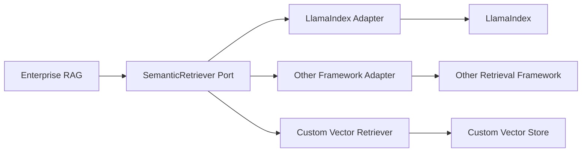

This makes the framework replaceable.

---

# 77. Production Configuration Example

A conceptual configuration:

```yaml
retrieval:
  strategy: vector

  top_k: 20

  similarity_threshold: 0.70

  embedding:
    model: embedding-model-v2
    dimension: 1536

  metadata:
    tenant_isolation: true

  reranking:
    enabled: true
    top_k: 5

  mmr:
    enabled: false
```

The values are illustrative.

Production values should be calibrated through evaluation.

---

# 78. Configuration Should Be Versioned

Avoid changing retrieval configuration silently.

Track:

```text
Retriever Version
Index Version
Embedding Version
Chunking Version
Top-K
Threshold
Metadata Rules
Re-ranker Version
```

Example:

```text
retrieval-config-v7
```

This helps reproduce production behavior.

---

# 79. Vector Retriever Deployment

A production deployment may look like:

```text
                    ┌───────────────┐
                    │ API Gateway   │
                    └───────┬───────┘
                            ↓
                    ┌───────────────┐
                    │ RAG Service   │
                    └───────┬───────┘
                            ↓
                    ┌───────────────┐
                    │ Query Service │
                    └───────┬───────┘
                            ↓
                    ┌───────────────┐
                    │ Vector Store  │
                    └───────────────┘
```

The embedding service may be deployed separately:

```text
Query
 ↓
Embedding Service
 ↓
Vector Retriever
```

---

# 80. Scaling Strategy

At scale, independently scale:

```text
API Layer
Embedding Service
Retrieval Service
Vector Database
LLM Gateway
```

This avoids forcing every component to scale identically.

---

# 81. Retrieval Service Boundary

A useful service boundary is:

```text
RAG Application
      ↓
Retrieval Service
      ↓
Vector Store
```

The retrieval service owns:

```text
Embedding
Filtering
Search
Ranking
Retrieval Observability
```

while the application owns:

```text
Business Workflow
Authorization
Response Policy
```

depending on architecture.

---

# 82. Enterprise Retrieval Service

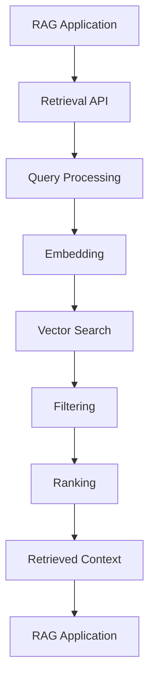

This allows retrieval to become a reusable enterprise capability.

---

# 83. Common Mistakes

## Mistake 1

Using only vector search for every query.

```text
Everything → Dense Search
```

Better:

```text
Dense
+
Sparse
+
Metadata
+
Specialized Retrieval
```

when justified.

---

## Mistake 2

Choosing K arbitrarily.

```text
K = 10
```

without evaluation.

Better:

```text
Benchmark
 ↓
Evaluate
 ↓
Tune K
```

---

# 84. Common Mistakes — Continued

## Mistake 3

Ignoring chunking.

Bad chunks produce bad retrieval.

---

## Mistake 4

Treating similarity scores as universal probabilities.

A score of:

```text
0.8
```

does not automatically mean:

```text
80% relevance
```

---

## Mistake 5

Using the LLM as an authorization layer.

Never rely on:

```text
"Ignore confidential documents."
```

as a security control.

---

# 85. Common Mistakes — Continued

## Mistake 6

Retrieving too many chunks.

This creates:

```text
Context Noise
Higher Cost
Higher Latency
Potential Confusion
```

---

## Mistake 7

Retrieving too few chunks.

This creates:

```text
Missing Evidence
Low Recall
Incomplete Answers
```

---

## Mistake 8

Not measuring retrieval independently.

Always separate:

```text
Retrieval Evaluation
```

from:

```text
Generation Evaluation
```

---

# 86. Practical Retrieval Checklist

```text
☐ Choose appropriate embedding model
☐ Keep query/document embedding spaces compatible
☐ Define chunking strategy
☐ Define metadata schema
☐ Configure vector store
☐ Configure Top-K
☐ Calibrate similarity threshold
☐ Test exact identifiers
☐ Test semantic queries
☐ Test ambiguous queries
☐ Test no-result queries
☐ Test authorization filters
☐ Measure Recall@K
☐ Measure Precision@K
☐ Measure MRR / NDCG
☐ Measure P95 latency
☐ Track index version
☐ Track embedding version
☐ Add observability
☐ Plan re-ranking
☐ Plan fallback behavior
```

---

# 87. Production Mental Model

The simplest vector retriever:

```text
Query
 ↓
Embedding
 ↓
Vector Search
 ↓
Top-K
```

A production vector retriever:

```text
User
 ↓
Authentication
 ↓
Authorization
 ↓
Query Understanding
 ↓
Query Rewriting
 ↓
Query Embedding
 ↓
Metadata Filtering
 ↓
Vector Search
 ↓
Candidate Retrieval
 ↓
Threshold
 ↓
Re-ranking
 ↓
MMR / Deduplication
 ↓
Context Selection
 ↓
LLM
```

This is the evolution from:

```text
Basic RAG
```

to:

```text
Production RAG
```

---

# 88. Key Takeaways

- A vector retriever retrieves nodes using semantic similarity.
- `VectorStoreIndex` provides the indexing foundation for vector-based retrieval in LlamaIndex.
- Nodes are transformed into embeddings during indexing.
- Queries are transformed into embeddings during retrieval.
- Query and document embeddings must use compatible representations.
- Vector search compares the query vector against indexed vectors.
- Top-K controls the number of initial candidates.
- Top-K should be tuned using evaluation rather than intuition.
- Similarity scores are ranking signals, not universal probabilities.
- Score direction depends on the underlying similarity/distance configuration.
- Metadata filtering can significantly improve enterprise retrieval.
- Tenant isolation should be enforced using trusted security context.
- Chunking has a major impact on vector retrieval quality.
- Vector retrieval is often the first-stage candidate generator.
- Re-ranking can improve precision after vector retrieval.
- MMR can reduce duplicate or highly similar results.
- Hybrid retrieval combines dense semantic search with sparse keyword search.
- Multi-query retrieval can improve recall for complex questions.
- Parent-child retrieval can restore broader context after retrieving a focused child node.
- ANN indexes enable scalable vector retrieval.
- Vector retrieval latency includes embedding, network, search, filtering, and postprocessing.
- Retrieval quality should be evaluated independently from LLM generation quality.
- Production systems should monitor recall, latency, no-result rate, and retrieval distributions.
- Index and retriever configurations should be versioned.
- Retrieval caches must account for tenant, authorization context, filters, and index version.
- Vector retrieval should be treated as one capability within a larger enterprise RAG architecture.
- LlamaIndex can be hidden behind a framework-agnostic semantic retrieval interface.
- Capability-based abstractions help prevent application-level framework coupling.

The central architecture is:

```text
                    USER QUERY
                         │
                         ▼
                 Query Understanding
                         │
                         ▼
                 Query Embedding
                         │
                         ▼
               Metadata / Security
                     Filtering
                         │
                         ▼
                  Vector Search
                         │
                         ▼
                    Top-K Nodes
                         │
                         ▼
                   Re-ranking
                         │
                         ▼
                  MMR / Filtering
                         │
                         ▼
                 Context Selection
                         │
                         ▼
                       LLM
                         │
                         ▼
               Validated Response
```

> **Vector retrieval is the candidate-generation foundation of many RAG systems, but production-quality retrieval requires much more than similarity search alone.**

---

# 🧭 Chapter Navigation

### Part V — Advanced Retrieval-Augmented Generation

**Previous:**  
[02. LlamaIndex Indexes](02-llamaindex-indexes.md)

**Next:**  
[04. BM25 Retriever](04-bm25-retriever.md)

**Section:**  
03 — LlamaIndex Retrieval Engineering

### LlamaIndex Retrieval Engineering Path

```text
01 LlamaIndex Retrievers Overview
              ↓
02 LlamaIndex Indexes
              ↓
03 Vector Index Retriever
              ↓
04 BM25 Retriever
              ↓
05 Document Summary Retriever
              ↓
06 Recursive Retriever
              ↓
07 Query Fusion Retriever
              ↓
08 Auto-Merging Retriever
              ↓
04 Vector Search Engineering
```

---

> **Enterprise AI Engineering Handbook**  
> *Building Production-Grade Enterprise AI Systems — One Chapter at a Time.*