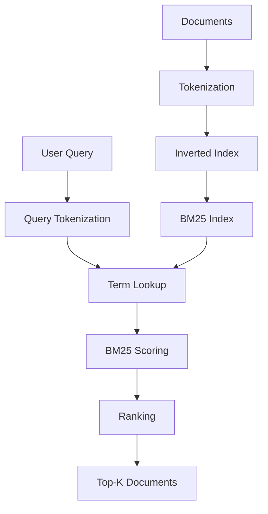
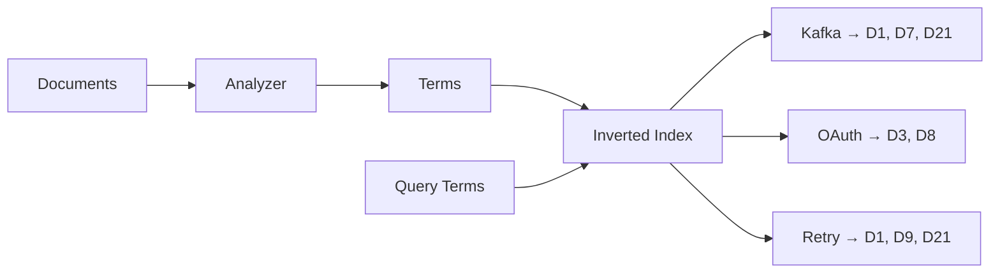
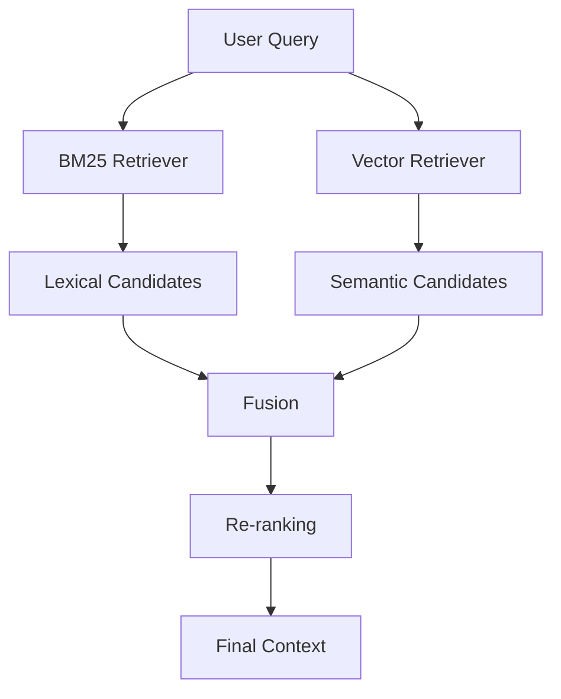
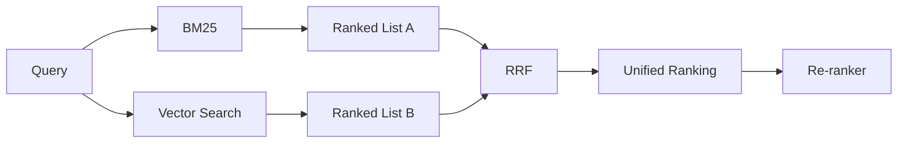
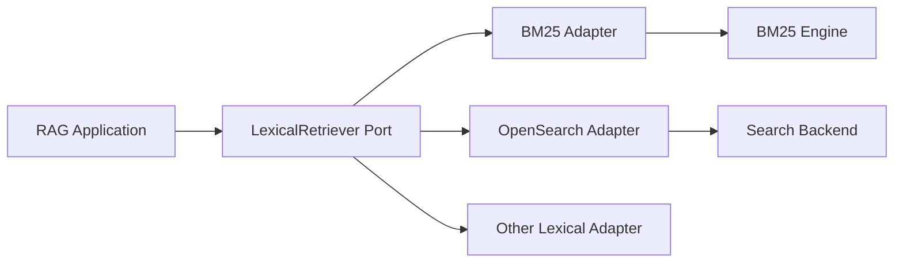
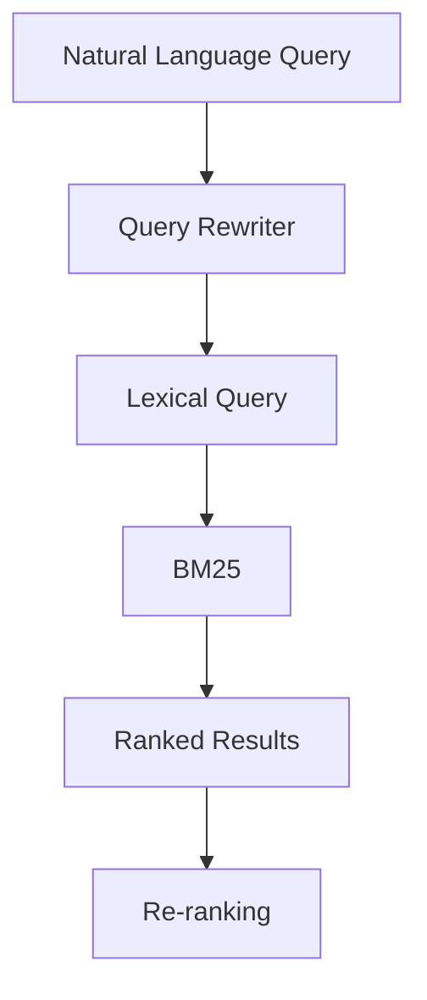
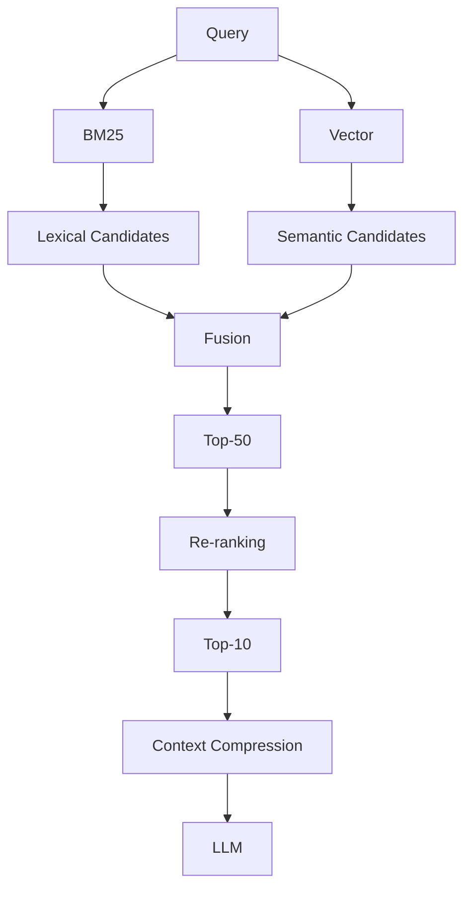
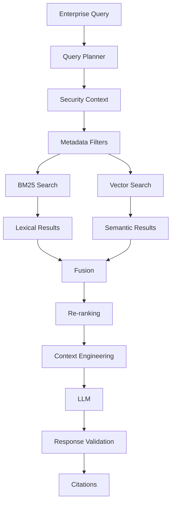

# BM25 Retriever

## 📖 Overview

**BM25** is a classical lexical information-retrieval algorithm that ranks documents based on how well their terms match the user's query.

Unlike dense vector retrieval, which represents text as embeddings, BM25 works directly with the **words and terms present in the query and documents**.

The fundamental flow is:

```text
Documents
    ↓
Tokenization
    ↓
Inverted Index
    ↓
BM25 Scoring
    ↓
Ranked Results
```

At query time:

```text
User Query
    ↓
Tokenization
    ↓
Term Matching
    ↓
BM25 Score
    ↓
Ranked Documents
    ↓
Top-K Results
```

BM25 remains highly relevant to modern enterprise RAG because exact lexical matching is extremely valuable for:

```text
Product IDs
Error Codes
API Names
Class Names
Database Tables
Policy Numbers
Ticket IDs
Version Numbers
Technical Terms
Acronyms
```

The key architectural idea is:

> **Dense retrieval is strong at semantic similarity; BM25 is strong at lexical precision.**

This makes BM25 an important building block for **hybrid retrieval**.

---

# 🎯 Learning Objectives

After completing this chapter, you will be able to:

- Understand lexical retrieval
- Understand BM25
- Understand TF-IDF and how BM25 improves upon it
- Understand term frequency
- Understand inverse document frequency
- Understand document-length normalization
- Understand BM25 parameters
- Understand inverted indexes
- Build a basic BM25 retriever
- Integrate BM25 with RAG
- Understand BM25 retrieval in LlamaIndex
- Compare BM25 with vector retrieval
- Understand hybrid search
- Understand BM25 limitations
- Tune BM25 for enterprise workloads
- Evaluate BM25 retrieval quality
- Design production lexical retrieval pipelines

---

# 1. What Is Lexical Retrieval?

Lexical retrieval searches for **terms that occur in the query and documents**.

Consider:

```text
Query:
"Kafka consumer retry policy"
```

A lexical retriever looks for documents containing terms such as:

```text
Kafka
consumer
retry
policy
```

The more important query terms a document contains, the higher it may rank.

---

# 2. Lexical vs Semantic Retrieval

Consider:

```text
Document:

"Kafka consumers automatically retry failed
message processing."
```

Query:

```text
"How are Kafka consumers retried?"
```

Lexical retrieval can work well because:

```text
Kafka
consumer
retry
```

appear directly or in closely related forms.

Now consider:

```text
Query:

"How does the system recover failed event processing?"
```

There may be little exact word overlap.

A dense vector retriever may perform better because it understands semantic similarity.

---

# 3. Core Difference

```text
BM25
 ↓
"What words match?"

Vector Search
 ↓
"What meanings are similar?"
```

This distinction is fundamental.

---

# 4. BM25 Architecture



BM25 does not require an embedding model.

---

# 5. Why BM25 Still Matters

Modern RAG systems often focus heavily on embeddings.

However, enterprise queries frequently contain exact identifiers.

Examples:

```text
INC-78421
PAY-2026-0045
OAuth2
KafkaConsumer
AKS-Cluster-01
HTTP-429
SpringBoot 3.4
```

A semantic embedding may understand these concepts imperfectly.

Lexical retrieval can directly match them.

---

# 6. Example: Error Codes

Suppose a document contains:

```text
HTTP 429 indicates that the client
has exceeded the API rate limit.
```

Query:

```text
"What does HTTP 429 mean?"
```

BM25 can strongly benefit from the exact match:

```text
HTTP
429
```

This is a classic lexical retrieval problem.

---

# 7. Example: Product Identifiers

Document:

```text
Product:
PAY-GW-2026

Version:
3.2.1
```

Query:

```text
"What is PAY-GW-2026?"
```

Exact lexical matching can be extremely effective.

---

# 8. BM25 Mental Model

A simplified ranking idea is:

```text
Document Score
    ≈
Term Importance
    ×
Term Frequency
    ×
Document Relevance
    ×
Length Normalization
```

The actual BM25 formula is more sophisticated.

---

# 9. TF-IDF Foundation

BM25 evolved from classical information retrieval techniques such as **TF-IDF**.

TF:

```text
Term Frequency
```

measures how frequently a term occurs in a document.

IDF:

```text
Inverse Document Frequency
```

measures how distinctive the term is across the corpus.

---

# 10. Term Frequency

Suppose:

```text
Document A:
Kafka Kafka Kafka Kafka
```

The term:

```text
Kafka
```

appears four times.

A basic TF concept is:

```text
TF(Kafka, Document A) = 4
```

More occurrences generally increase relevance.

But simply rewarding frequency has problems.

---

# 11. Why Raw Frequency Is Not Enough

Consider:

```text
Document A:
Kafka Kafka Kafka Kafka Kafka Kafka
```

and:

```text
Document B:
Kafka is used for event streaming.
```

Document A contains more occurrences but may not actually provide more useful information.

BM25 therefore uses **saturation**.

Repeated occurrences provide diminishing returns.

---

# 12. Term Frequency Saturation

Conceptually:

```text
1 occurrence
      ↓
Large relevance increase

2 occurrences
      ↓
Additional increase

10 occurrences
      ↓
Much smaller additional increase
```

This prevents documents from dominating merely because they repeat a term many times.

---

# 13. Inverse Document Frequency

Some words occur in many documents:

```text
system
service
application
data
```

They are less distinctive.

Other terms occur rarely:

```text
PAY-GW-2026
INC-78421
KafkaConsumer
```

These are more informative.

IDF captures this distinction.

---

# 14. IDF Intuition

```text
Common Term
"system"
     ↓
Low IDF

Rare Term
"PAY-GW-2026"
     ↓
High IDF
```

Therefore:

```text
Rare + Matching
=
Strong Signal
```

---

# 15. Document Frequency

Suppose the corpus contains:

```text
N = 1,000,000 documents
```

Term:

```text
"system"
```

appears in:

```text
500,000 documents
```

Term:

```text
"PAY-GW-2026"
```

appears in:

```text
15 documents
```

The second term carries much more discriminative information.

---

# 16. BM25 Formula

A common BM25 formulation is:

```text
                  IDF(t) × f(t,D) × (k₁ + 1)
score(D,Q) = Σ  ───────────────────────────────
             f(t,D) + k₁ × (1 - b + b × |D|/avgdl)
```

Where:

```text
t
=
Query term

D
=
Document

f(t,D)
=
Frequency of term t in document D

|D|
=
Document length

avgdl
=
Average document length

k₁
=
Term-frequency saturation parameter

b
=
Document-length normalization parameter
```

---

# 17. BM25 Formula Visualization


The formula captures three important ideas:

```text
1. Term importance
2. Term frequency saturation
3. Document-length normalization
```

---

# 18. BM25 Parameter `k₁`

`k₁` controls how quickly term-frequency contribution saturates.

Conceptually:

```text
Low k₁
 ↓
Faster saturation

High k₁
 ↓
More sensitivity to repeated terms
```

A commonly used starting value is around:

```text
k₁ ≈ 1.2 – 2.0
```

but this should be treated as a tuning starting point rather than a universal optimum.

---

# 19. BM25 Parameter `b`

`b` controls document-length normalization.

Conceptually:

```text
b = 0
```

means little/no length normalization.

```text
b = 1
```

means strong length normalization.

A commonly used starting point is:

```text
b ≈ 0.75
```

Again, production values should be evaluated against the actual corpus.

---

# 20. Why Document Length Matters

Suppose:

```text
Document A = 100 words
Document B = 10,000 words
```

Both contain:

```text
Kafka
```

If term frequency were treated without normalization, the longer document could gain an unfair advantage simply because it contains more words.

BM25 accounts for document length.

---

# 21. Document-Length Normalization

Conceptually:

```text
Short Document
     ↓
Term appears frequently
     ↓
Strong signal

Very Long Document
     ↓
Same term frequency
     ↓
Potentially weaker signal
```

This makes ranking more balanced.

---

# 22. BM25 Tokenization

Before retrieval, text is generally processed into terms.

Example:

```text
"Kafka consumers process events."
```

might become:

```text
[
  "kafka",
  "consumers",
  "process",
  "events"
]
```

Real tokenization depends on the implementation.

---

# 23. Stop Words

Some lexical retrieval systems remove common words such as:

```text
the
is
a
an
of
to
```

These terms often provide little retrieval value.

However, blindly removing words can be harmful in some domains.

For example:

```text
"not approved"
```

contains a meaningful negation.

Enterprise search pipelines should therefore treat stop-word configuration carefully.

---

# 24. Stemming and Lemmatization

Consider:

```text
authenticate
authenticated
authentication
```

A lexical system may treat these as different terms unless normalization is applied.

Possible approaches include:

```text
Stemming
Lemmatization
Morphological normalization
Analyzer-specific processing
```

But aggressive normalization can also remove useful distinctions.

---

# 25. Enterprise Tokenization

Technical corpora contain:

```text
API-123
HTTP-429
SpringBoot
KafkaConsumer
customer_id
payment-service-v2
```

A generic natural-language analyzer may not handle these perfectly.

Therefore enterprise lexical retrieval may require domain-specific analysis.

---

# 26. Inverted Index

BM25 commonly operates over an **inverted index**.

Instead of storing:

```text
Document → all words
```

the inverted index stores:

```text
Term → Documents containing term
```

Example:

```text
Kafka
 ├── Document 1
 ├── Document 7
 ├── Document 21
 └── Document 48
```

---

# 27. Inverted Index Architecture



This makes term lookup efficient.

---

# 28. BM25 Retrieval Flow

```text
Query
 ↓
Analyze
 ↓
Extract Terms
 ↓
Lookup Inverted Index
 ↓
Find Candidate Documents
 ↓
Calculate BM25 Scores
 ↓
Rank
 ↓
Top-K
```

This differs substantially from vector retrieval.

---

# 29. BM25 vs Vector Retrieval

| Capability | BM25 | Vector |
|---|---|---|
| Exact term matching | Excellent | Variable |
| Semantic similarity | Limited | Excellent |
| IDs / error codes | Excellent | Variable |
| Synonyms | Limited | Strong |
| Vocabulary mismatch | Weak | Strong |
| Explainability | Strong | Lower |
| Embedding required | No | Yes |
| Inverted index | Yes | No |
| Semantic paraphrases | Weak | Strong |

This is why the two approaches complement each other.

---

# 30. Example Comparison

Document:

```text
"Kafka consumers retry failed events."
```

Query A:

```text
"Kafka consumer retry"
```

BM25:

```text
Excellent
```

Query B:

```text
"How does the event system recover
when processing fails?"
```

Vector retrieval may have an advantage.

---

# 31. Exact Matching Strength

BM25 can be particularly useful for:

```text
"HTTP 500"
"INC-9182"
"PAY-1234"
"KafkaConsumer"
"customer_id"
"v2.4.1"
```

These are difficult cases where semantic retrieval may not always preserve exact lexical signals.

---

# 32. Semantic Matching Limitation

Suppose the document says:

```text
"Vehicle authorization requires an access token."
```

Query:

```text
"How does the system authenticate cars?"
```

The terms may not overlap strongly.

BM25 may perform poorly.

A dense retriever may identify the semantic relationship more effectively.

---

# 33. Hybrid Retrieval

The strongest enterprise architecture often combines:

```text
BM25
+
Vector Search
```

Architecture:



---

# 34. Why Hybrid Retrieval Works

BM25 provides:

```text
Exact lexical precision
```

Vector search provides:

```text
Semantic recall
```

Together:

```text
Lexical Signal
+
Semantic Signal
=
More Robust Retrieval
```

This is one of the most important enterprise RAG patterns.

---

# 35. Fusion Strategies

BM25 and vector results can be combined using:

```text
Weighted Score Fusion
Reciprocal Rank Fusion
Rank-based Fusion
Learned Fusion
```

A simple architecture:

```text
BM25 Results
     ↓
     ├────→ Fusion
     ↓
Vector Results
     ↓
```

Then:

```text
Fusion
 ↓
Re-ranking
```

---

# 36. Reciprocal Rank Fusion

A common rank-fusion approach is **Reciprocal Rank Fusion (RRF)**.

Conceptually:

```text
RRF(d)
=
Σ 1 / (k + rank(d))
```

The idea is to reward documents that appear near the top of multiple ranked lists.

This avoids requiring BM25 and vector scores to be directly comparable.

---

# 37. Why Rank Fusion Helps

Suppose:

```text
BM25:

A
B
C
D
```

Vector:

```text
C
A
E
B
```

Documents:

```text
A
B
C
```

appear strongly across both retrieval strategies.

Fusion can identify this consensus.

---

# 38. Hybrid Retrieval with RRF



---

# 39. BM25 in LlamaIndex

LlamaIndex can integrate with lexical retrieval components and external retrieval backends.

A practical enterprise architecture may look like:

```text
LlamaIndex
     ↓
BM25 Retriever
     ↓
Lexical Search Backend
```

The exact implementation depends on the LlamaIndex version and selected integration.

---

# 40. Basic BM25 Example

A simple Python implementation can be built using a BM25 library.

For example:

```python
from rank_bm25 import BM25Okapi

documents = [
    "Kafka consumers retry failed events.",
    "OAuth tokens authenticate payment APIs.",
    "PostgreSQL stores transaction records."
]

tokenized_documents = [
    document.lower().split()
    for document in documents
]

bm25 = BM25Okapi(
    tokenized_documents
)

query = "Kafka consumer retry"

tokenized_query = query.lower().split()

scores = bm25.get_scores(
    tokenized_query
)

print(scores)
```

The library shown here is a standalone BM25 implementation rather than a LlamaIndex-specific API.

---

# 41. Ranking Documents

```python
results = bm25.get_top_n(
    tokenized_query,
    documents,
    n=3
)

for document in results:
    print(document)
```

Conceptually:

```text
Query
 ↓
BM25
 ↓
Scores
 ↓
Top-N
```

---

# 42. LlamaIndex-Oriented Architecture

A framework-integrated design can expose:

```python
class BM25Retriever:

    def retrieve(self, query):
        ...
```

The application should ideally not need to know:

```text
Which BM25 library
Which tokenizer
Which backend
Which index implementation
```

Those should remain inside the adapter layer.

---

# 43. Capability-Based Retriever Interface

```python
from abc import ABC, abstractmethod


class LexicalRetriever(ABC):

    @abstractmethod
    def retrieve(
        self,
        query: str,
        top_k: int
    ):
        pass
```

Implementation:

```python
class BM25LexicalRetriever(
    LexicalRetriever
):

    def __init__(self, index):
        self.index = index

    def retrieve(self, query, top_k):
        return self.index.retrieve(
            query,
            top_k=top_k
        )
```

This keeps the application framework-agnostic.

---

# 44. Ports & Adapters Architecture



The enterprise application depends on:

```text
Lexical Retrieval Capability
```

rather than:

```text
BM25 implementation details
```

---

# 45. BM25 + Vector Adapter

A unified retrieval interface can expose:

```python
class Retriever:

    def retrieve(self, query):
        pass
```

Implementations:

```text
VectorRetriever
BM25Retriever
HybridRetriever
GraphRetriever
SQLRetriever
```

Then:

```text
Query
 ↓
Retrieval Strategy
 ↓
Selected Retriever
```

This fits naturally into an enterprise retrieval factory.

---

# 46. Retriever Factory

```python
class RetrieverType:
    VECTOR = "vector"
    BM25 = "bm25"
    HYBRID = "hybrid"
```

Factory:

```python
def create_retriever(
    retriever_type,
    config
):

    if retriever_type == "vector":
        return VectorRetriever(config)

    if retriever_type == "bm25":
        return BM25Retriever(config)

    if retriever_type == "hybrid":
        return HybridRetriever(config)

    raise ValueError(
        f"Unsupported retriever: {retriever_type}"
    )
```

This is a simple conceptual implementation.

---

# 47. BM25 Metadata Filtering

BM25 itself primarily scores lexical relevance.

Enterprise retrieval may still need:

```text
Tenant
Region
Department
Document Type
Security Classification
Date
Status
```

Therefore:

```text
Security / Metadata Scope
        ↓
BM25 Retrieval
```

or an index/backend capable of combining filtering and lexical scoring.

---

# 48. Filter Before Retrieval

Conceptually:

```text
Enterprise Corpus
      ↓
Security Scope
      ↓
Metadata Filter
      ↓
BM25 Candidate Search
      ↓
Ranking
```

This prevents irrelevant or unauthorized documents from entering the candidate pool.

---

# 49. BM25 + Metadata Example

Query:

```text
"payment authentication"
```

Filters:

```text
department = payments
region = EU
status = approved
```

The retrieval operation becomes:

```text
Lexical Matching
+
Metadata Constraints
```

This is much more useful in enterprise systems than unrestricted lexical search.

---

# 50. BM25 for Technical Documentation

BM25 is particularly effective for:

```text
API documentation
Error messages
Runbooks
Incident reports
Configuration guides
CLI documentation
Architecture references
```

because users frequently search using the exact terminology appearing in the source.

---

# 51. BM25 for Incident Management

Suppose an incident document contains:

```text
INC-2026-1842
HTTP 502
payment-gateway
Kafka consumer lag
```

Query:

```text
"INC-2026-1842"
```

A lexical retriever is extremely well suited to this problem.

---

# 52. BM25 for Code Search

Consider:

```text
Class:
PaymentAuthorizationService

Method:
authorizePayment()
```

Query:

```text
"authorizePayment"
```

BM25-style lexical retrieval can be very effective because the exact identifier is the key signal.

Dense retrieval can complement this for natural-language questions such as:

```text
"Where is payment authorization implemented?"
```

---

# 53. BM25 for Policy Search

Policy:

```text
"Refunds must be processed within 7 business days."
```

Query:

```text
"refund 7 business days"
```

BM25 can strongly match:

```text
refund
7
business
days
```

This is a useful lexical signal.

---

# 54. BM25 and Numeric Values

Numeric and version-sensitive queries require careful analyzer design.

Examples:

```text
7 days
HTTP 429
version 3.2.1
2026-08-01
```

A generic analyzer may tokenize these differently.

Production search systems should explicitly test:

```text
Numbers
Dates
Versions
IDs
Codes
```

---

# 55. BM25 and Acronyms

Enterprise documents frequently contain:

```text
RAG
LLM
IAM
RBAC
VPC
AKS
EKS
SQS
SNS
```

Lexical matching can preserve these exact terms.

This is another reason BM25 remains useful in technical knowledge bases.

---

# 56. Query Expansion

BM25 can benefit from query expansion.

Original:

```text
"authentication"
```

Possible related terms:

```text
OAuth
authorization
access token
identity
```

However, adding too many terms can introduce noise.

Query expansion should therefore be evaluated carefully.

---

# 57. Query Rewriting

A query can be rewritten for lexical retrieval.

User:

```text
"Why can't users log in?"
```

Lexical rewrite:

```text
login authentication authentication failure
```

The rewritten query can be passed to BM25.

This is particularly useful when the user's natural-language phrasing differs from enterprise terminology.

---

# 58. BM25 + Query Rewriting



---

# 59. BM25 and Multi-Query

Multiple lexical queries can also be generated:

```text
Query 1:
payment authentication

Query 2:
payment authorization

Query 3:
OAuth payment API
```

Each can retrieve candidates.

Then:

```text
Fusion
 ↓
Deduplication
 ↓
Re-ranking
```

This extends BM25 beyond simple single-query matching.

---

# 60. BM25 and MMR

BM25 can produce duplicate or highly similar documents.

Example:

```text
Policy A
Policy A - revision
Policy A - summary
Policy A - FAQ
```

MMR or deduplication can improve result diversity.

Architecture:

```text
BM25
 ↓
Candidates
 ↓
MMR / Deduplication
 ↓
Final Results
```

---

# 61. BM25 and Re-ranking

A strong lexical pipeline:

```text
Query
 ↓
BM25
 ↓
Top-50
 ↓
Cross-Encoder / LLM Re-ranker
 ↓
Top-5
```

BM25 provides:

```text
Fast Candidate Generation
```

The re-ranker provides:

```text
Higher Precision
```

---

# 62. Production Lexical Retrieval

A mature architecture can be:

```text
                   Query
                     │
                     ▼
              Query Processing
                     │
                     ▼
             Security Filtering
                     │
             ┌───────┴────────┐
             ▼                ▼
          BM25           Vector Search
             │                │
             ▼                ▼
        Lexical Top-K     Semantic Top-K
             │                │
             └───────┬────────┘
                     ▼
                   Fusion
                     │
                     ▼
                 Re-ranking
                     │
                     ▼
                Context
```

This is the core of hybrid enterprise retrieval.

---

# 63. BM25 Latency

BM25 is generally computationally efficient because it operates over an inverted index.

Potential pipeline:

```text
Query Analysis
     ↓
Term Lookup
     ↓
Candidate Retrieval
     ↓
Scoring
     ↓
Ranking
```

Latency depends on:

```text
Corpus Size
Query Complexity
Number of Matching Terms
Index Architecture
Filters
Hardware
Backend
```

---

# 64. BM25 Scalability

For large corpora, use a production search engine that provides:

```text
Distributed Indexing
Sharding
Replication
Caching
Filtering
Monitoring
```

Examples include systems based on:

```text
Lucene
OpenSearch
Elasticsearch
Solr
```

The appropriate platform depends on enterprise infrastructure and operational requirements.

---

# 65. BM25 and OpenSearch

A common enterprise architecture is:

```text
LlamaIndex
     ↓
Lexical Retriever Adapter
     ↓
OpenSearch
     ↓
BM25
```

OpenSearch can provide:

```text
BM25
Filtering
Faceting
Distributed Search
Operational Monitoring
```

The LlamaIndex integration should be treated as an adapter rather than embedding the entire search platform inside application logic.

---

# 66. BM25 vs Database `LIKE`

It is tempting to implement lexical retrieval with:

```sql
WHERE text LIKE '%keyword%'
```

This is generally not equivalent to BM25.

`LIKE` primarily performs pattern matching.

BM25 provides:

```text
Term Frequency
Inverse Document Frequency
Length Normalization
Ranking
```

Therefore:

```text
LIKE
≠
Search Engine Ranking
```

---

# 67. BM25 vs Full-Text Search

Database engines may provide full-text search features.

These can be useful for smaller applications.

However, production search requirements may require:

```text
Advanced Ranking
Distributed Search
Filtering
Faceting
Sharding
Operational Search
```

A dedicated search engine can be more appropriate at scale.

---

# 68. BM25 Limitations

BM25 does not inherently understand:

```text
Meaning
Intent
Synonyms
Paraphrases
Contextual Semantics
Relationships
```

For example:

```text
"car"
```

and:

```text
"automobile"
```

may not match strongly unless the retrieval pipeline handles synonyms or query expansion.

Dense retrieval can provide semantic matching.

---

# 69. BM25 Failure Cases

Query:

```text
"How can I make my vehicle faster?"
```

Document:

```text
"Automobile performance can be improved
through engine optimization."
```

Low lexical overlap may hurt BM25.

A vector retriever may perform better.

---

# 70. Dense Retrieval Failure Cases

Query:

```text
"INC-918274"
```

Document:

```text
Incident INC-918274 describes payment timeout failures.
```

Semantic retrieval may not always rank the exact identifier as strongly as lexical search.

BM25 provides an important complementary signal.

---

# 71. Best Practice

Do not ask:

```text
BM25 OR Vector?
```

For many enterprise applications, ask:

```text
Where should BM25 contribute to the retrieval pipeline?
```

The answer may be:

```text
BM25
+
Vector
+
Metadata
+
Re-ranking
```

---

# 72. Evaluation Dataset

Create queries covering:

```text
Exact identifiers
Natural language
Technical terms
Synonyms
Acronyms
Numbers
Versions
Multi-term queries
Long queries
Short queries
```

Example:

```json
[
  {
    "query": "HTTP 429",
    "type": "exact"
  },
  {
    "query": "How does API rate limiting work?",
    "type": "semantic"
  },
  {
    "query": "PAY-GW-2026",
    "type": "identifier"
  }
]
```

---

# 73. BM25 Evaluation

Measure:

```text
Recall@K
Precision@K
MRR
NDCG
Hit Rate
Latency
```

Compare:

```text
BM25
vs
Vector
vs
Hybrid
```

using the same evaluation dataset.

---

# 74. Example Evaluation Matrix

| Query Type | BM25 | Vector | Hybrid |
|---|---:|---:|---:|
| Exact ID | Strong | Variable | Strong |
| Error Code | Strong | Variable | Strong |
| Natural Language | Moderate | Strong | Strong |
| Synonym | Weak | Strong | Strong |
| Technical Term | Strong | Strong | Strong |
| Paraphrase | Weak | Strong | Strong |

The ratings are conceptual and should be validated against your own corpus.

---

# 75. BM25 Tuning

Tune:

```text
k₁
b
Analyzer
Tokenizer
Stop Words
Stemming
Synonyms
Top-K
Query Expansion
```

Do not tune parameters independently without measuring overall retrieval quality.

---

# 76. `k₁` Tuning Intuition

If the corpus contains:

```text
Short technical documents
```

repeated terms may carry meaningful signals.

If the corpus contains:

```text
Long documents
```

repetition may be less informative.

Therefore `k₁` should be evaluated against corpus characteristics.

---

# 77. `b` Tuning Intuition

If document lengths vary significantly:

```text
100 words
vs
20,000 words
```

length normalization can become important.

If documents are already highly uniform in size, aggressive normalization may provide less benefit.

---

# 78. Analyzer Tuning

For enterprise technical data, test:

```text
CamelCase
snake_case
hyphenated IDs
version numbers
HTTP codes
acronyms
file paths
class names
```

Example:

```text
PaymentAuthorizationService
```

should ideally remain searchable as a meaningful identifier.

---

# 79. BM25 Observability

Track:

```text
Query
Top-K
Matched Terms
Scores
Result Count
Latency
Index Version
Analyzer Version
```

Example:

```json
{
  "retriever": "bm25",
  "index_version": "docs-v8",
  "query_terms": [
    "http",
    "429"
  ],
  "top_k": 10,
  "result_count": 10,
  "latency_ms": 18
}
```

Avoid logging sensitive document content.

---

# 80. BM25 Monitoring

Important production metrics:

```text
P50 Latency
P95 Latency
P99 Latency
Zero-result Rate
Average Result Count
Score Distribution
Index Size
Index Freshness
Query Volume
Error Rate
```

For hybrid systems also monitor:

```text
BM25 Contribution
Vector Contribution
Fusion Behavior
```

---

# 81. BM25 Index Freshness

Enterprise search systems must update when source documents change.

```text
Source Change
     ↓
Indexer
     ↓
Tokenization
     ↓
Inverted Index Update
```

Track:

```text
Source Timestamp
Index Timestamp
```

to measure freshness.

---

# 82. Incremental BM25 Indexing

When one document changes:

```text
Document 481
     ↓
Re-tokenize
     ↓
Update postings
     ↓
Update BM25 statistics
```

A production search engine manages these index operations.

The important architectural principle is:

```text
Do not rebuild the entire corpus
for every small document change
```

unless there is a specific reason.

---

# 83. BM25 Deletion

If a document is deleted:

```text
Source Deleted
      ↓
Search Index Update
      ↓
Remove Document
      ↓
Update Index
```

Otherwise the document can remain searchable.

---

# 84. BM25 Security

Lexical search can expose the same sensitive information as vector search.

Security must cover:

```text
Documents
Index
Search API
Metadata
Queries
Logs
Caches
```

Do not assume:

```text
Search Index
=
Publicly Searchable Data
```

---

# 85. Tenant Isolation

A shared search index might contain:

```text
Tenant A
Tenant B
Tenant C
```

The query must include a trusted tenant filter:

```text
tenant_id = tenant-a
```

The filter must be generated by the application's security context.

---

# 86. BM25 in a Multi-Stage Retriever

A mature pipeline can use:

```text
Stage 1:
BM25 + Vector
        ↓
Stage 2:
Fusion
        ↓
Stage 3:
Re-ranking
        ↓
Stage 4:
Context Compression
```

This allows each component to specialize.

---

# 87. Multi-Stage Architecture



---

# 88. BM25 as Candidate Generator

BM25 does not necessarily need to produce the final five documents.

It can produce:

```text
Top-50
```

and allow:

```text
Re-ranker
```

to select:

```text
Top-5
```

This separates:

```text
Fast Retrieval
```

from:

```text
Precise Ranking
```

---

# 89. Hybrid Retrieval Decision

Use BM25 when:

```text
Exact terms matter
```

Use vector retrieval when:

```text
Meaning matters
```

Use hybrid retrieval when:

```text
Both matter
```

Example:

```text
"How does HTTP 429 rate limiting
work in the payment gateway?"
```

This contains:

```text
Exact signal:
HTTP 429
payment gateway

Semantic signal:
rate limiting behavior
```

Hybrid retrieval is ideal.

---

# 90. Enterprise Search Architecture



This is the practical role of BM25 in enterprise RAG.

---

# 91. Practical Configuration

A conceptual configuration might be:

```yaml
retrieval:
  lexical:
    enabled: true
    engine: bm25

    top_k: 50

    parameters:
      k1: 1.2
      b: 0.75

    analyzer:
      lowercase: true
      stemming: false

  hybrid:
    enabled: true
    fusion: rrf

  reranking:
    enabled: true
    top_k: 5
```

These values are starting points, not universal production defaults.

---

# 92. Testing BM25

Test at least:

```text
Exact match
Partial match
Case differences
Pluralization
Acronyms
Numbers
Versions
Identifiers
Long queries
Short queries
No-result queries
```

Example:

```text
Query:
HTTP 429

Expected:
Rate-limit documentation
```

---

# 93. BM25 Test Case

```python
def test_exact_error_code_retrieval():

    query = "HTTP 429"

    results = retriever.retrieve(
        query,
        top_k=5
    )

    assert any(
        "429" in result.text
        for result in results
    )
```

The exact assertion depends on your retrieval abstraction.

---

# 94. BM25 Regression Testing

Whenever changing:

```text
Analyzer
Tokenizer
k₁
b
Index
Query Rewriter
```

run the retrieval benchmark again.

Track:

```text
Previous Recall
New Recall
Previous Latency
New Latency
```

This prevents silent retrieval degradation.

---

# 95. BM25 Deployment Lifecycle

```text
Source Documents
      ↓
Analyzer
      ↓
BM25 Index
      ↓
Validation
      ↓
Retrieval Benchmark
      ↓
Quality Gate
      ↓
Publish
      ↓
Monitor
```

This is similar to an ML model deployment lifecycle.

---

# 96. BM25 Index Versioning

Example:

```text
knowledge-bm25-v1
knowledge-bm25-v2
knowledge-bm25-v3
```

Version changes may represent:

```text
Analyzer Update
Corpus Update
Synonym Update
Tokenizer Update
Ranking Configuration
```

Track these explicitly.

---

# 97. Blue-Green Search Index

```text
BM25 V1
   ↓
ACTIVE

BM25 V2
   ↓
CANDIDATE
```

After validation:

```text
V1
 ↓
V2
```

If retrieval quality drops:

```text
V2
 ↓
Rollback
 ↓
V1
```

---

# 98. Common Anti-Patterns

## Anti-Pattern 1 — Treating BM25 as Semantic Search

```text
BM25
=
Meaning Search
```

Incorrect.

BM25 is fundamentally lexical.

---

## Anti-Pattern 2 — Removing BM25 Because Embeddings Exist

Dense retrieval does not eliminate the value of exact lexical matching.

---

# 99. Common Anti-Patterns — Continued

## Anti-Pattern 3 — Using Default Tokenization Everywhere

Technical corpora may require custom analyzers.

---

## Anti-Pattern 4 — Ignoring Document Length

Document length can influence BM25 ranking.

---

## Anti-Pattern 5 — Treating Scores as Probabilities

```text
BM25 = 15
```

does not mean:

```text
15% relevant
```

Scores are ranking signals.

---

# 100. Common Anti-Patterns — Continued

## Anti-Pattern 6 — No Hybrid Evaluation

If hybrid retrieval is introduced, measure:

```text
BM25
Vector
Hybrid
```

independently.

---

## Anti-Pattern 7 — No Security Filter

Never search the entire enterprise corpus and hope the LLM removes unauthorized information.

---

# 101. Production Checklist

```text
☐ Define lexical retrieval use cases
☐ Identify exact-match requirements
☐ Select BM25 backend
☐ Define analyzer
☐ Define tokenizer
☐ Evaluate stemming
☐ Evaluate stop words
☐ Test identifiers
☐ Test numbers
☐ Test versions
☐ Configure k₁
☐ Configure b
☐ Configure Top-K
☐ Implement metadata filtering
☐ Implement tenant isolation
☐ Evaluate Recall@K
☐ Evaluate Precision@K
☐ Evaluate MRR / NDCG
☐ Measure P95 latency
☐ Monitor zero-result rate
☐ Version the index
☐ Version analyzer configuration
☐ Implement incremental updates
☐ Implement deletion
☐ Consider hybrid retrieval
☐ Consider re-ranking
```

---

# 102. Key Takeaways

- BM25 is a classical lexical retrieval algorithm.
- BM25 does not require embeddings.
- BM25 operates over terms and an inverted index.
- Term frequency contributes to relevance.
- BM25 applies term-frequency saturation.
- IDF gives greater importance to rare terms.
- Document-length normalization prevents long documents from receiving unfair advantages.
- `k₁` controls term-frequency saturation.
- `b` controls document-length normalization.
- Exact identifiers are one of BM25's strongest use cases.
- Error codes, API names, versions, and technical identifiers benefit from lexical retrieval.
- BM25 is weaker at semantic paraphrases and synonyms.
- Vector retrieval is stronger for semantic similarity.
- BM25 and vector retrieval complement each other.
- Hybrid retrieval is a strong enterprise RAG pattern.
- Reciprocal Rank Fusion can combine BM25 and vector rankings.
- BM25 can serve as a first-stage candidate generator.
- Re-ranking can improve final precision.
- MMR can reduce duplicate lexical results.
- Query rewriting can improve lexical retrieval.
- Enterprise analyzers should be tested against technical identifiers and terminology.
- Metadata filtering and tenant isolation remain important for BM25.
- BM25 scores should be treated as ranking signals rather than probabilities.
- Retrieval quality must be evaluated independently from LLM generation.
- Index freshness, latency, zero-result rate, and ranking quality should be monitored.
- BM25 indexes should support versioning, validation, rollback, and deletion.
- A capability-based `LexicalRetriever` abstraction keeps enterprise applications independent of a specific search engine.
- BM25 is not a replacement for vector retrieval; it is an important complementary retrieval capability.

The central architecture is:

```text
                    USER QUERY
                         │
                         ▼
                  Query Processing
                         │
                         ▼
                 Security Context
                         │
                         ▼
                 Metadata Filtering
                         │
                         ▼
                    ┌─────────┐
                    │  BM25   │
                    └────┬────┘
                         │
                         ▼
                  Lexical Candidates
                         │
                         ▼
                    Top-K Results
                         │
                         ▼
                Hybrid Fusion / MMR
                         │
                         ▼
                     Re-ranking
                         │
                         ▼
                  Context Selection
                         │
                         ▼
                        LLM
                         │
                         ▼
                Validated Response
```

> **BM25 provides the lexical precision that dense retrieval alone can miss. In enterprise RAG, the strongest architecture often combines lexical signals, semantic signals, metadata constraints, and re-ranking into a multi-stage retrieval pipeline.**

---

# 🧭 Chapter Navigation

### Part V — Advanced Retrieval-Augmented Generation

**Previous:**  
[03. Vector Index Retriever](03-vector-index-retriever.md)

**Next:**  
[05. Document Summary Retriever](05-document-summary-retriever.md)

**Section:**  
03 — LlamaIndex Retrieval Engineering

### LlamaIndex Retrieval Engineering Path

```text
01 LlamaIndex Retrievers Overview
              ↓
02 LlamaIndex Indexes
              ↓
03 Vector Index Retriever
              ↓
04 BM25 Retriever
              ↓
05 Document Summary Retriever
              ↓
06 Recursive Retriever
              ↓
07 Query Fusion Retriever
              ↓
08 Auto-Merging Retriever
              ↓
04 Vector Search Engineering
```

---

> **Enterprise AI Engineering Handbook**  
> *Building Production-Grade Enterprise AI Systems — One Chapter at a Time.*