# Document Summary Retriever

## 📖 Overview

The **Document Summary Retriever** is a retrieval strategy designed for cases where the system needs to identify relevant **documents first**, rather than immediately searching individual chunks across the entire corpus.

The central idea is:

```text
Large Documents
      ↓
Generate Document Summaries
      ↓
Index Summaries
      ↓
Query Summary Representation
      ↓
Select Relevant Documents
      ↓
Retrieve Nodes from Selected Documents
      ↓
Context
```

This is particularly useful when documents are large and each document contains many chunks.

Instead of asking:

```text
"Which individual chunks across the entire corpus are relevant?"
```

the system can first ask:

```text
"Which documents are relevant to this query?"
```

and then retrieve the nodes belonging to those selected documents.

LlamaIndex provides `DocumentSummaryIndex` for this style of retrieval. The index stores a summary for each document along with the nodes belonging to that document. Current LlamaIndex exposes both embedding-based and LLM-based retrieval modes through `as_retriever()`. :contentReference[oaicite:0]{index=0}

---

# 🎯 Learning Objectives

After completing this chapter, you will be able to:

- Understand document-level retrieval
- Understand the difference between document-level and chunk-level retrieval
- Understand `DocumentSummaryIndex`
- Understand how document summaries are generated
- Understand summary-based retrieval
- Understand embedding-based summary retrieval
- Understand LLM-based document selection
- Understand the relationship between summaries and source nodes
- Build a Document Summary Index
- Retrieve nodes from selected documents
- Understand when Document Summary Retrieval is useful
- Understand its latency and cost trade-offs
- Compare Document Summary Retrieval with VectorStoreIndex
- Understand hierarchical retrieval
- Combine document-level and chunk-level retrieval
- Evaluate summary-based retrieval
- Design production architectures using document-level retrieval

---

# 1. The Problem with Chunk-Only Retrieval

A traditional vector RAG pipeline looks like:

```text
Documents
    ↓
Chunking
    ↓
Nodes
    ↓
Embeddings
    ↓
Vector Store
```

At query time:

```text
Query
 ↓
Query Embedding
 ↓
Vector Search
 ↓
Top-K Chunks
```

This works well for many applications.

But consider a knowledge base containing:

```text
Document 1
 ├── 100 chunks

Document 2
 ├── 150 chunks

Document 3
 ├── 80 chunks

Document 4
 ├── 200 chunks
```

The retrieval system is effectively searching across:

```text
530 chunks
```

rather than reasoning first about:

```text
4 documents
```

---

# 2. Document-Level Retrieval

Document Summary Retrieval introduces an intermediate layer:

```text
Documents
    ↓
Document Summaries
    ↓
Document Selection
    ↓
Relevant Documents
    ↓
Document Nodes
    ↓
Final Context
```

The architecture becomes:

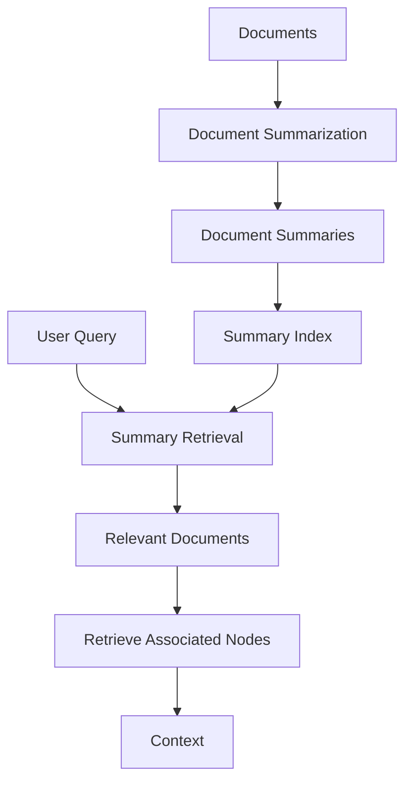

This is the core idea behind `DocumentSummaryIndex`.

---

# 3. What Is DocumentSummaryIndex?

`DocumentSummaryIndex` creates a summary representation for each document and maintains the relationship between that summary and the nodes belonging to the document.

Conceptually:

```text
Document A
    │
    ├── Summary A
    │
    ├── Node A1
    ├── Node A2
    └── Node A3

Document B
    │
    ├── Summary B
    │
    ├── Node B1
    ├── Node B2
    └── Node B3
```

The summary provides a document-level retrieval signal.

LlamaIndex's current API exposes `DocumentSummaryIndex` with options including whether summaries are embedded, and its `as_retriever()` supports embedding and LLM retrieval modes. :contentReference[oaicite:1]{index=1}

---

# 4. The Core Mental Model

Think of a document summary as a **routing representation**.

```text
                 QUERY
                   │
                   ▼
          Document-Level Search
                   │
        ┌──────────┼──────────┐
        ▼          ▼          ▼
     Doc A       Doc C      Doc F
        │          │          │
        └──────────┼──────────┘
                   ▼
             Source Nodes
                   │
                   ▼
              Final Context
```

The summary does not replace the source document.

It helps identify which document should be explored.

---

# 5. Document Summary vs Chunk Embedding

Traditional vector retrieval:

```text
Query
 ↓
Chunk Embedding
 ↓
Chunk Search
 ↓
Top-K Chunks
```

Document Summary Retrieval:

```text
Query
 ↓
Summary Representation
 ↓
Document Search
 ↓
Relevant Documents
 ↓
Source Nodes
```

The retrieval unit is therefore different.

---

# 6. Why Summaries Help

Consider a large architecture document:

```text
Payment Platform Architecture
```

It contains:

```text
Authentication
Authorization
Kafka
Database
Caching
Monitoring
Deployment
Disaster Recovery
```

A generated summary might capture:

```text
The document describes the architecture of a
payment platform, including authentication,
Kafka-based event processing, databases,
caching, monitoring, deployment, and disaster
recovery.
```

A query such as:

```text
"How is payment event processing implemented?"
```

may match the document summary strongly.

The system can then retrieve the relevant nodes from that document.

---

# 7. Document Summary Retrieval Architecture

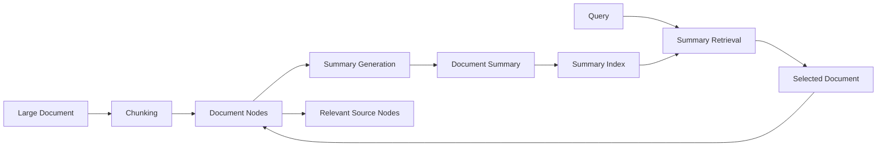

The important relationship is:

```text
Summary
   ↓
Document
   ↓
Nodes
```

---

# 8. Document Summary Index Construction

A simplified LlamaIndex example:

```python
from llama_index.core import (
    DocumentSummaryIndex
)

index = DocumentSummaryIndex.from_documents(
    documents
)
```

In current LlamaIndex, the index can be configured with the response synthesizer used to generate summaries and whether summaries should be embedded. :contentReference[oaicite:2]{index=2}

---

# 9. Configuring Summary Generation

Conceptually:

```python
from llama_index.core import (
    DocumentSummaryIndex,
    get_response_synthesizer
)

response_synthesizer = (
    get_response_synthesizer(
        response_mode="tree_summarize"
    )
)

index = DocumentSummaryIndex.from_documents(
    documents,
    response_synthesizer=response_synthesizer,
    show_progress=True
)
```

The exact configuration depends on the LlamaIndex version and configured LLM.

---

# 10. What Happens During Indexing?

Conceptually:

```text
Document
    ↓
Parse
    ↓
Nodes
    ↓
Summarization
    ↓
Document Summary
    ↓
Summary Representation
    ↓
Store Summary + Node Relationships
```

The summary is generated during **index construction**, not necessarily during every query.

This creates a deliberate trade-off:

```text
More Index-Time Work
        ↓
Potentially Less Query-Time Work
```

---

# 11. Index-Time vs Query-Time Cost

Traditional vector retrieval:

```text
Index Time:
Embedding generation

Query Time:
Query embedding
+
Vector search
```

Document Summary Retrieval:

```text
Index Time:
Document summarization
+
Optional summary embedding

Query Time:
Summary retrieval
+
Node retrieval
```

The index therefore shifts additional computation toward ingestion time.

---

# 12. Summary Generation Cost

If a corpus contains:

```text
10,000 documents
```

the system needs to create:

```text
10,000 document summaries
```

Depending on the implementation and document size, generating summaries may require significant LLM computation.

Therefore:

```text
Document Summary Index
```

should not automatically be considered cheaper than vector indexing.

It solves a different retrieval problem.

---

# 13. Important Trade-Off

```text
Index-Time Cost
        ↕
Query-Time Cost
```

Document Summary Retrieval can trade:

```text
Higher index-time processing
```

for:

```text
Document-level retrieval structure
```

This can be valuable for large, logically distinct documents.

---

# 14. Summary Retrieval Modes

Current LlamaIndex exposes two important retrieval modes for `DocumentSummaryIndex`:

```text
Embedding Retrieval
LLM Retrieval
```

The API routes these through:

```python
index.as_retriever(
    retriever_mode=...
)
```

The current implementation exposes `DocumentSummaryIndexEmbeddingRetriever` and `DocumentSummaryIndexLLMRetriever`. :contentReference[oaicite:3]{index=3}

---

# 15. Embedding-Based Summary Retrieval

The flow is:

```text
Document Summary
       ↓
Summary Embedding
       ↓
Summary Index

Query
       ↓
Query Embedding
       ↓
Summary Similarity Search
       ↓
Relevant Documents
```

This is conceptually similar to vector retrieval, but the indexed semantic representation is the **document summary** rather than every individual chunk.

---

# 16. Embedding Retrieval Architecture

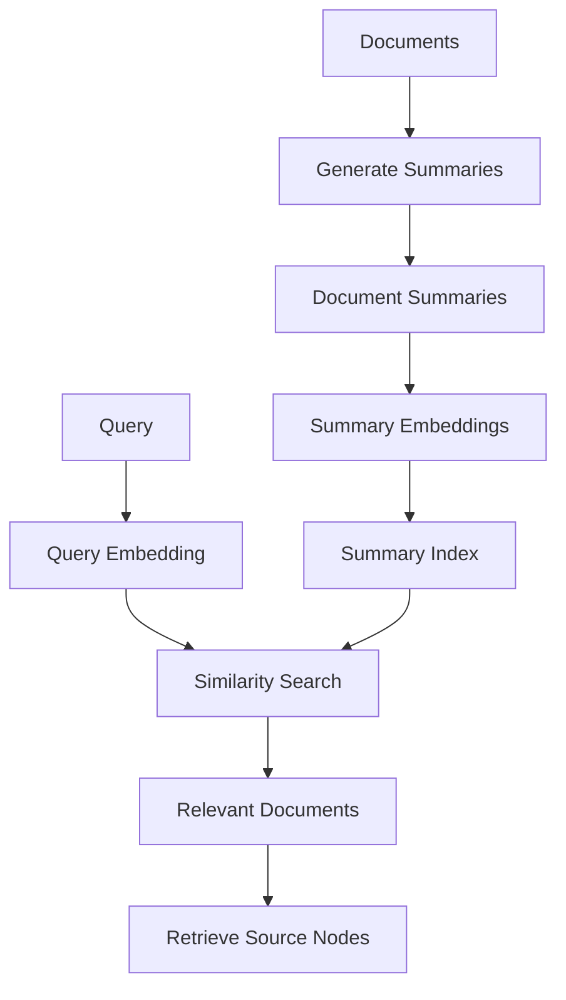

The current LlamaIndex API requires summaries to be embedded for the embedding-based retriever. :contentReference[oaicite:4]{index=4}

---

# 17. Basic Embedding Retriever

Conceptually:

```python
retriever = index.as_retriever(
    retriever_mode="embedding",
    similarity_top_k=3
)

results = retriever.retrieve(
    "How does the payment platform process events?"
)

for result in results:
    print(result.node.text)
```

The precise supported parameters can vary by version.

---

# 18. What Is Being Embedded?

This distinction is critical.

In a standard vector index:

```text
Node
 ↓
Embedding
```

In a document summary index:

```text
Document
 ↓
Summary
 ↓
Embedding
```

The summary becomes the retrieval representation.

---

# 19. Summary Representation

Suppose:

```text
Document A
```

contains:

```text
200 chunks
```

The summary index can create:

```text
Summary A
```

and use it to represent the entire document at retrieval time.

The query therefore first interacts with:

```text
Summary A
```

rather than all 200 chunks individually.

---

# 20. Document Selection

Suppose:

```text
Query:
"How does the payment platform handle
failed Kafka events?"
```

Summary retrieval may produce:

```text
Document A → 0.91
Document C → 0.84
Document F → 0.32
```

The selected documents can then contribute their source nodes.

The numerical scores are illustrative.

---

# 21. LLM-Based Summary Retrieval

The second major mode uses an LLM to select relevant documents based on their summaries.

Conceptually:

```text
Query
 ↓
LLM
 ↓
Inspect Document Summaries
 ↓
Select Relevant Documents
 ↓
Retrieve Associated Nodes
```

LlamaIndex exposes `DocumentSummaryIndexLLMRetriever` for this mode. :contentReference[oaicite:5]{index=5}

---

# 22. LLM Retriever Architecture

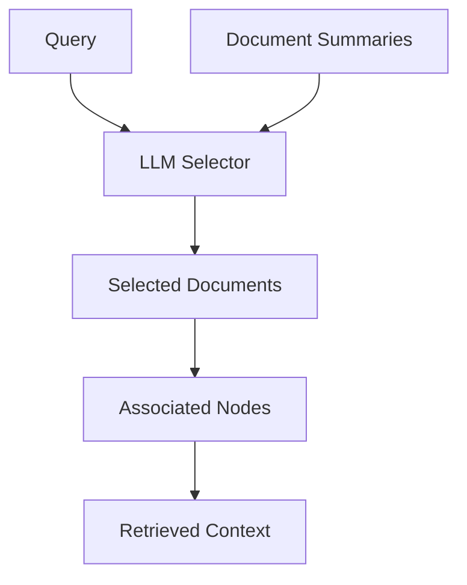

The LLM acts as the document-selection mechanism.

---

# 23. LLM-Based Retrieval Example

Conceptually:

```python
retriever = index.as_retriever(
    retriever_mode="llm"
)

results = retriever.retrieve(
    "Which document explains
     payment disaster recovery?"
)
```

The LLM evaluates the available document summaries and selects relevant documents.

---

# 24. Embedding vs LLM Retrieval

| Characteristic | Embedding Retrieval | LLM Retrieval |
|---|---|---|
| Selection mechanism | Embedding similarity | LLM reasoning |
| Summary embeddings | Required | Not necessarily |
| Query embedding | Required | No |
| Query-time model | Embedding model | LLM |
| Semantic understanding | Strong | Potentially stronger |
| Query-time cost | Lower | Higher |
| Determinism | Higher | Lower |
| Explainability | Similarity ranking | Selection reasoning |

The exact behavior depends on configuration and implementation.

---

# 25. When to Use Embedding Retrieval

Embedding-based summary retrieval is attractive when:

```text
Queries are frequent
+
Latency matters
+
Document summaries are stable
+
Semantic retrieval is sufficient
```

It allows the expensive summary creation step to happen during indexing.

---

# 26. When to Use LLM Retrieval

LLM-based selection can be useful when:

```text
Document summaries are complex
+
Queries require nuanced interpretation
+
Document-level reasoning matters
+
Query volume is manageable
```

However:

```text
LLM Retrieval
```

introduces additional query-time model cost and latency.

---

# 27. Document Summary Retriever vs Vector Retriever

Consider:

```text
100 documents
100 chunks each
=
10,000 chunks
```

Standard vector retrieval:

```text
Query
 ↓
Search 10,000 chunk vectors
```

Document summary retrieval:

```text
Query
 ↓
Search 100 document summaries
 ↓
Select relevant documents
 ↓
Retrieve nodes from selected documents
```

This changes the retrieval granularity.

---

# 28. Granularity

Think of retrieval granularity as:

```text
Document
   ↓
Section
   ↓
Chunk
   ↓
Sentence
```

Vector retrieval often operates at:

```text
Chunk level
```

Document Summary Retrieval begins at:

```text
Document level
```

This makes it particularly interesting for large multi-section documents.

---

# 29. Document-Level Routing

The summary can act as a routing layer:

```text
Query
 ↓
Document Summary Retrieval
 ↓
Relevant Document
 ↓
Detailed Retrieval
```

This is similar to a hierarchical search architecture.

---

# 30. Hierarchical Retrieval

A production system can use:

```text
Level 1:
Document Retrieval

Level 2:
Section Retrieval

Level 3:
Chunk Retrieval
```

Architecture:

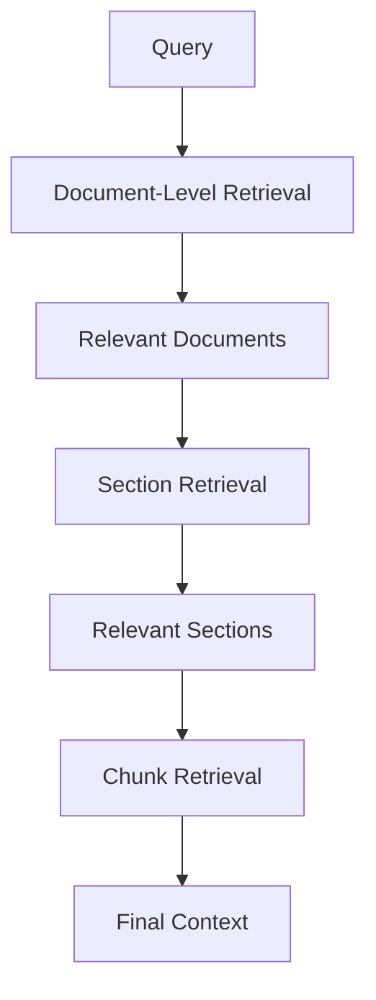

This reduces the search space progressively.

---

# 31. Document Summary as a Routing Index

This gives us a powerful architecture:

```text
Summary Index
      ↓
"Which document?"
      ↓
Document
      ↓
Vector Index / Retriever
      ↓
"Which chunks?"
```

Therefore:

```text
Document Summary Retrieval
```

does not need to replace vector retrieval.

It can **precede** it.

---

# 32. Two-Stage Retrieval

```text
Stage 1
Document Summary Retrieval
        ↓
Top-N Documents

Stage 2
Chunk-Level Vector Retrieval
        ↓
Top-K Chunks
```

This is a powerful enterprise pattern.

---

# 33. Two-Stage Architecture

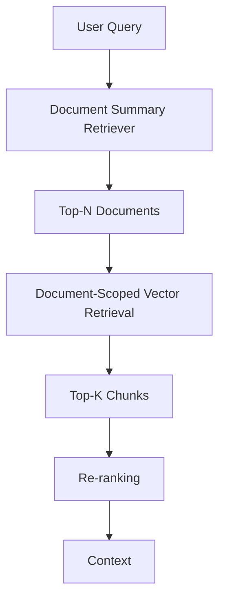

This combines document-level understanding with fine-grained semantic retrieval.

---

# 34. Why Hierarchical Retrieval Can Help

Suppose:

```text
1,000 Documents
```

and:

```text
1,000 chunks/document
```

Total:

```text
1,000,000 chunks
```

Instead of searching all:

```text
1,000,000 chunks
```

a document-level stage might select:

```text
Top 20 Documents
```

Then the second stage searches only:

```text
20,000 chunks
```

This can significantly reduce the candidate search space, depending on the storage architecture.

---

# 35. Important Caveat

Document-level filtering can also create **recall risk**.

Suppose the correct chunk is in:

```text
Document 900
```

but the summary retriever selects:

```text
Document 1
Document 4
Document 7
```

The correct chunk may never reach Stage 2.

Therefore:

```text
Stage 1 Recall
```

is critical.

---

# 36. Recall Bottleneck

In hierarchical retrieval:

```text
Stage 1
   ↓
Must include the correct document
   ↓
Stage 2
   ↓
Can find the correct chunk
```

If Stage 1 fails:

```text
Stage 2 cannot recover
```

This is a fundamental production consideration.

---

# 37. Top-N Document Selection

Suppose:

```text
Top-N Documents = 3
```

Potential problem:

```text
High Precision
+
Low Recall
```

Increasing:

```text
N = 10
```

may improve recall but increase downstream work.

Therefore:

```text
Document Top-N
```

must be tuned using evaluation data.

---

# 38. Document Summary Retrieval + Vector Retrieval

A sophisticated architecture:

```text
Query
 ↓
Document Summary Search
 ↓
Top-20 Documents
 ↓
Vector Search within documents
 ↓
Top-50 Chunks
 ↓
Re-ranking
 ↓
Top-10
```

This is a natural bridge between LlamaIndex index-level retrieval and enterprise retrieval engineering.

---

# 39. Document Summary Retrieval + BM25

Document-level retrieval can also be combined with lexical search:

```text
Query
 ├──→ Summary Retrieval
 └──→ BM25

        ↓

Document Candidates

        ↓

Chunk Retrieval
```

This can be useful when:

```text
Document names
+
Document summaries
+
Exact identifiers
```

all matter.

---

# 40. Multi-Stage Enterprise Architecture

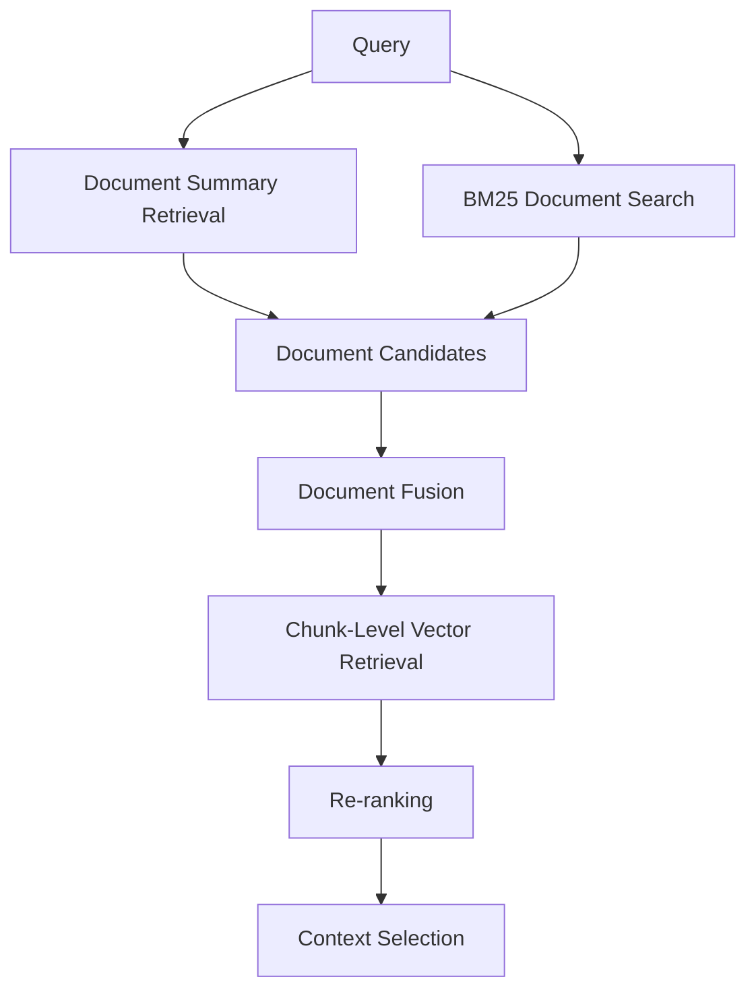

This is more sophisticated than a single vector index.

---

# 41. Summary Generation Strategy

A document summary can be generated using a summary prompt.

Conceptually:

```text
Summarize the document.

Capture:
- Main topic
- Important entities
- Key systems
- Important processes
- Major relationships
- Important terminology
```

The summary should be designed for **retrieval**, not merely human readability.

---

# 42. Retrieval-Oriented Summaries

A good retrieval summary should preserve:

```text
Entities
Topics
Systems
Technical Terms
Processes
Identifiers
Relationships
Business Concepts
```

Example:

```text
Document:
Payment Gateway Architecture

Summary:
Architecture of the payment gateway covering
OAuth authentication, Kafka event processing,
PostgreSQL transaction storage, Redis caching,
AWS deployment, monitoring, and disaster recovery.
```

This is more useful for retrieval than:

```text
"This document describes a payment system."
```

---

# 43. Summary Prompt Design

Conceptual prompt:

```text
Create a retrieval-oriented summary of the document.

Include:
1. Main subject
2. Important technical components
3. Business concepts
4. Important identifiers
5. Processes and workflows
6. Relationships between systems
7. Terms a user might search for

Do not omit domain-specific terminology.
```

This connects document summarization with prompt engineering.

---

# 44. Summary Quality Matters

Bad summary:

```text
"This document describes software."
```

Good summary:

```text
"This document describes the payment platform's
OAuth authentication, Kafka-based transaction
events, PostgreSQL storage, Redis caching,
AWS deployment architecture, and disaster
recovery strategy."
```

The second summary provides much stronger retrieval signals.

---

# 45. Summary Drift

Source document:

```text
Version 1
```

Summary:

```text
Generated from Version 1
```

Document later becomes:

```text
Version 2
```

but summary remains:

```text
Version 1 summary
```

Now retrieval can become stale.

Therefore:

```text
Document Update
 ↓
Summary Regeneration
```

should be part of the index lifecycle.

---

# 46. Summary Freshness

Track:

```text
document_version
summary_version
generated_at
```

Example:

```json
{
  "document_version": "v7",
  "summary_version": "v7",
  "generated_at": "2026-08-11T08:00:00Z"
}
```

This helps detect stale summaries.

---

# 47. Summary Index Lifecycle


The summary must evolve with the underlying document.

---

# 48. DocumentSummaryIndex and Source Nodes

The summary is not the final evidence.

The original nodes remain important.

The architecture is:

```text
Summary
   ↓
Document Selection
   ↓
Original Nodes
   ↓
Evidence
```

This is critical for RAG because the LLM should generally receive the **source evidence**, not only a generated summary.

---

# 49. Why Not Give Only the Summary to the LLM?

A generated summary may:

```text
Omit Details
Simplify Relationships
Lose Numbers
Miss Exceptions
Introduce Errors
```

Therefore:

```text
Summary
=
Retrieval Signal

Source Nodes
=
Evidence
```

This is one of the most important mental models for this chapter.

---

# 50. Evidence Flow

```text
Document
   │
   ├── Summary ───────→ Retrieval
   │
   └── Source Nodes ──→ Evidence
```

The summary helps find the document.

The original content supports the answer.

---

# 51. Document Summary Retriever and Citations

A production RAG system should retain:

```text
Document ID
Node ID
Source URI
Page
Section
Metadata
```

The summary index should therefore be connected to source metadata.

Example:

```json
{
  "document_id": "payment-architecture-001",
  "source": "architecture/payment.pdf",
  "page": 18,
  "section": "Kafka Event Processing"
}
```

This enables downstream citation generation.

---

# 52. Summary Retriever + Citation Pipeline

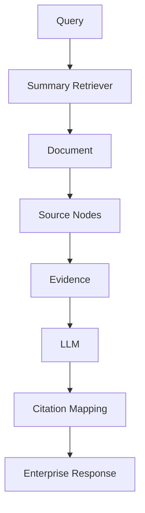

The retrieval layer should preserve provenance.

---

# 53. Large Documents

Document Summary Retrieval is particularly interesting when documents are:

```text
Large
Structured
Topic-rich
Logically self-contained
```

Examples:

```text
Architecture Documents
Technical Specifications
Annual Reports
Research Papers
Legal Documents
Product Manuals
Policy Collections
Large Design Documents
```

The technique is not limited to these categories.

---

# 54. Document-Level Cohesion

The strategy works best when a document represents a meaningful unit.

For example:

```text
Architecture Design A
```

is a coherent retrieval unit.

But a document containing:

```text
10 unrelated articles
```

may be a poor unit for summary-based retrieval.

The quality of the document boundary matters.

---

# 55. Document Boundaries

Good:

```text
One Architecture Document
One Policy
One Contract
One Research Paper
```

Potentially problematic:

```text
10,000 unrelated paragraphs
```

A summary becomes less useful as a routing representation when the document itself contains too many unrelated subjects.

---

# 56. Summary Index vs SummaryIndex

These names are easy to confuse.

### `SummaryIndex`

Conceptually:

```text
Collection of nodes
+
summary-oriented processing
```

### `DocumentSummaryIndex`

Conceptually:

```text
One summary representation per document
+
mapping to document nodes
```

The second is specifically document-oriented.

This distinction is important when designing retrieval architectures.

---

# 57. Document Summary vs SummaryIndex

| Feature | SummaryIndex | DocumentSummaryIndex |
|---|---|---|
| Primary unit | Nodes | Documents |
| Document-level summary | Not the core idea | Yes |
| Document selection | No | Yes |
| Node mapping | Direct | Document → nodes |
| Retrieval granularity | Node collection | Document first |
| Hierarchical use | Limited | Strong |
| Large document routing | Less targeted | Strong |

The exact behavior depends on the configured retriever.

---

# 58. Document Summary vs VectorStoreIndex

| Characteristic | VectorStoreIndex | DocumentSummaryIndex |
|---|---|---|
| Primary representation | Node embeddings | Document summaries |
| Retrieval level | Chunk/node | Document |
| Query embedding | Yes | Yes for embedding mode |
| LLM selection | Not inherently required | Supported |
| Fine-grained retrieval | Strong | Requires node retrieval after selection |
| Document routing | Limited | Strong |
| Index-time summarization | No | Yes |
| Hierarchical retrieval | Possible | Natural fit |

---

# 59. Use Case: Enterprise Architecture Repository

Imagine:

```text
2,000 architecture documents
```

Each document contains:

```text
100–500 chunks
```

A query:

```text
"Which architecture documents describe
Kafka-based payment event processing?"
```

Document Summary Retrieval can first identify:

```text
Payment Architecture
Transaction Processing Architecture
Event Platform Architecture
```

Then retrieve the detailed nodes.

---

# 60. Use Case: Legal Documents

Suppose:

```text
500 contracts
```

Each contract contains:

```text
100+ clauses
```

Query:

```text
"Which contracts contain termination clauses
related to regulatory changes?"
```

A document-level summary can help identify candidate contracts before searching their detailed clauses.

For legal systems, however, summary retrieval should not replace direct evidence retrieval or legal review.

---

# 61. Use Case: Technical Documentation

Knowledge base:

```text
Spring Boot Guide
Kafka Operations Manual
AWS Deployment Guide
Payment API Specification
Database Runbook
```

Query:

```text
"How do we recover Kafka consumer lag
during payment processing?"
```

Document summaries can quickly identify:

```text
Kafka Operations Manual
Payment Architecture Guide
```

Then chunk-level retrieval finds the precise instructions.

---

# 62. Use Case: Research Papers

Suppose:

```text
10,000 research papers
```

A query:

```text
"What approaches are used for graph-based RAG?"
```

Document summaries can act as a first-stage semantic routing mechanism.

Then:

```text
Selected Papers
 ↓
Relevant Sections
 ↓
Relevant Chunks
```

---

# 63. Use Case: Enterprise Policies

A policy repository might contain:

```text
Security Policy
Data Retention Policy
Payment Policy
Access Control Policy
Incident Management Policy
```

Query:

```text
"What policy governs retention of payment records?"
```

Document summary retrieval can identify:

```text
Payment Data Retention Policy
```

before detailed clause retrieval.

---

# 64. Summary Retrieval and Query Planning

Document summary retrieval can become part of a query planner.

```text
Query
 ↓
Query Classification
 ↓
Document-Level Retrieval
 ↓
Chunk-Level Retrieval
```

For broad questions:

```text
Document summaries
```

may be highly useful.

For exact IDs:

```text
BM25
```

may be more appropriate.

For semantic details:

```text
Vector retrieval
```

may be appropriate.

---

# 65. Query Router

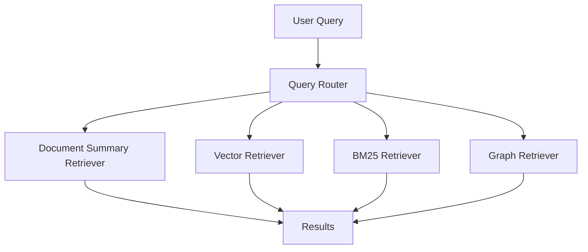

This is the beginning of a sophisticated enterprise retrieval architecture.

---

# 66. Document Summary Retrieval + Agentic Retrieval

An agent may decide:

```text
Which documents should I inspect?
```

using summaries.

Then:

```text
Which chunks should I inspect?
```

using vector retrieval.

This creates:

```text
Planning
 ↓
Document Selection
 ↓
Fine-Grained Retrieval
```

Document summaries therefore provide a useful abstraction for agentic retrieval.

---

# 67. Agentic Document Selection

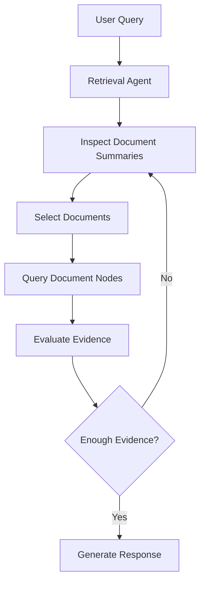

This is a conceptual architecture; the agentic behavior should be introduced only when the problem warrants it.

---

# 68. Summary Retrieval and Context Engineering

The retrieved nodes should not automatically all enter the prompt.

Pipeline:

```text
Document Selection
      ↓
Node Retrieval
      ↓
Relevance Filtering
      ↓
Deduplication
      ↓
Context Ordering
      ↓
Context Budget
      ↓
LLM
```

The summary stage is therefore only the beginning of context engineering.

---

# 69. Context Budget

Suppose:

```text
Top 5 Documents
```

each has:

```text
100 chunks
```

You should not necessarily send:

```text
500 chunks
```

to the LLM.

Instead:

```text
Documents
 ↓
Candidate Nodes
 ↓
Re-ranking
 ↓
Top 10–20 Nodes
 ↓
Context
```

This controls:

```text
Latency
Cost
Noise
```

---

# 70. Summary Retrieval + Re-ranking

A strong pipeline:

```text
Query
 ↓
Document Summary Retrieval
 ↓
Top-20 Documents
 ↓
Chunk Retrieval
 ↓
Top-50 Chunks
 ↓
Cross-Encoder Re-ranking
 ↓
Top-10 Chunks
 ↓
LLM
```

This separates:

```text
Document relevance
```

from:

```text
Passage relevance
```

---

# 71. Evaluation

Document Summary Retrieval should be evaluated at multiple levels.

### Stage 1

Did we select the correct document?

```text
Document Recall@K
```

### Stage 2

Did we select the correct chunk?

```text
Chunk Recall@K
```

### Final

Did the generated answer use the right evidence?

```text
Answer / Groundedness Evaluation
```

---

# 72. Hierarchical Retrieval Evaluation

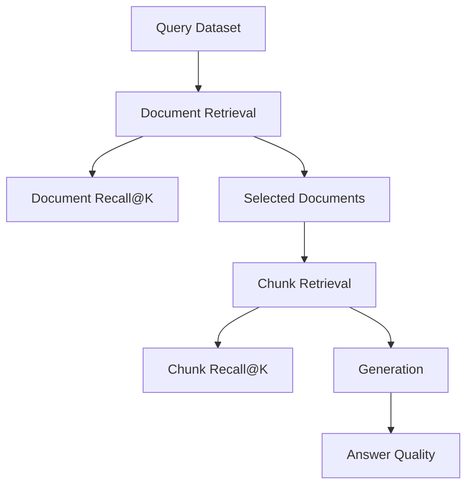

This makes it possible to locate where retrieval failures occur.

---

# 73. Document Recall

Suppose the correct document is:

```text
Document 27
```

and retrieval returns:

```text
Document 2
Document 9
Document 27
Document 31
```

Then:

```text
Document Recall@4 = Success
```

because the relevant document was included.

---

# 74. Stage-1 Recall Is Critical

Suppose:

```text
Document Recall@5 = 60%
```

Then even a perfect chunk retriever cannot recover the missing:

```text
40%
```

of queries whose correct document was not selected.

Therefore:

> **The first retrieval stage should be optimized for recall.**

---

# 75. Top-N Tuning

Evaluate:

```text
Top-1
Top-3
Top-5
Top-10
Top-20
```

Measure:

```text
Document Recall
Latency
Number of downstream nodes
LLM token cost
```

Example:

| Document Top-N | Recall@N | Relative Cost |
|---:|---:|---:|
| 1 | 62% | Low |
| 3 | 78% | Low |
| 5 | 87% | Medium |
| 10 | 94% | Higher |
| 20 | 97% | High |

Values are illustrative.

---

# 76. Summary Quality Evaluation

Evaluate whether the summary contains important retrieval concepts.

Example:

```text
Source Concepts:
Kafka
OAuth
PostgreSQL
Redis
AWS
Payment Events
```

Generated Summary:

```text
Kafka
OAuth
PostgreSQL
AWS
Payment Events
```

Missing:

```text
Redis
```

That omission can reduce retrieval quality for Redis-related queries.

---

# 77. Summary Coverage

A useful internal evaluation concept is:

```text
Summary Coverage
=
Important Source Concepts
represented in Summary
```

The summary does not need every detail.

It should preserve the information necessary to route queries correctly.

---

# 78. Summary Quality Pipeline

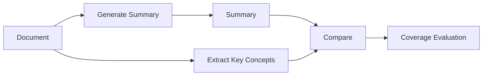

This can be part of an index-build quality gate.

---

# 79. Summary Generation Cost Optimization

Possible strategies:

```text
Use smaller summarization models
Batch processing
Async generation
Incremental updates
Cache summaries
Only summarize changed documents
```

For large corpora, summary generation should be treated as an ingestion pipeline rather than an interactive operation.

---

# 80. Incremental Summary Updates

If only one document changes:

```text
Document 501
    ↓
Changed
    ↓
Regenerate Summary 501
    ↓
Update Summary Index
```

Avoid:

```text
Re-summarize 100,000 documents
```

for a single document update.

---

# 81. Summary Versioning

Track:

```text
Document Version
Summary Version
Summary Model
Summary Prompt Version
Generated Timestamp
```

Example:

```json
{
  "document_id": "doc-501",
  "document_version": "v8",
  "summary_version": "v8",
  "summary_model": "model-x",
  "summary_prompt": "summary-prompt-v3"
}
```

This makes retrieval behavior reproducible.

---

# 82. Prompt Versioning

A summary generated with:

```text
Prompt V1
```

may differ from:

```text
Prompt V2
```

Therefore summary generation should be versioned like an ML/AI pipeline.

```text
Summary Prompt
       ↓
Summary Model
       ↓
Summary Version
```

---

# 83. Summary Index Observability

Monitor:

```text
Documents Indexed
Summaries Generated
Summary Failures
Summary Generation Latency
Summary Token Cost
Summary Freshness
Embedding Failures
Retrieval Latency
Document Recall
```

Example:

```json
{
  "index_version": "contracts-v5",
  "documents": 25000,
  "summaries": 24980,
  "summary_failures": 20,
  "summary_freshness_minutes": 12,
  "document_recall_at_5": 0.91
}
```

---

# 84. Failure Handling

Suppose summary generation fails:

```text
Document
   ↓
Summary Generation
   ↓
FAIL
```

Possible strategies:

```text
Retry
Fallback summarizer
Queue for later
Fallback to chunk-level retrieval
```

The appropriate strategy depends on business criticality.

---

# 85. Retrieval Fallback

A production system might use:

```text
Primary:
Document Summary Retrieval

Fallback:
Vector Retrieval
```

Architecture:

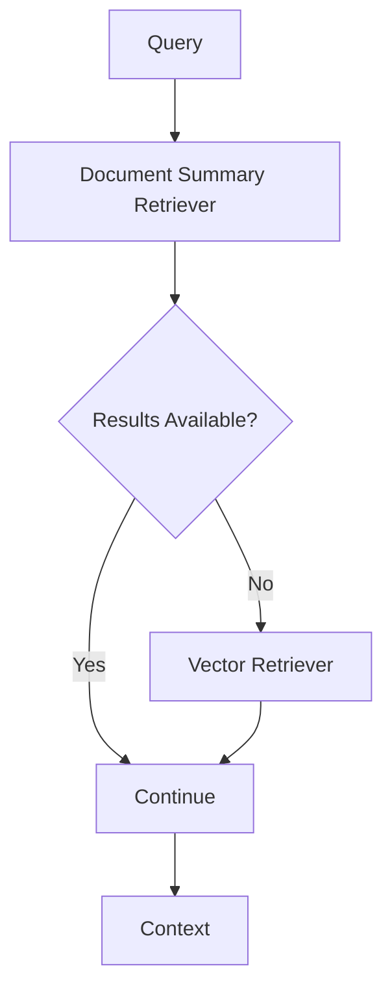

Fallback should be explicit and observable.

---

# 86. Security Considerations

Document summaries may themselves contain sensitive information.

For example:

```text
Original:
Confidential customer information

Summary:
Contains details about Customer X's financial
transaction architecture.
```

The summary is still sensitive.

Therefore:

```text
Summary Index
```

must follow the same security model as the underlying knowledge.

---

# 87. Tenant-Aware Summary Retrieval

A shared summary index may contain:

```text
Tenant A summaries
Tenant B summaries
Tenant C summaries
```

The retrieval scope must be restricted by trusted tenant context.

```text
User
 ↓
Authentication
 ↓
Tenant Context
 ↓
Summary Retrieval
 ↓
Tenant-Scoped Documents
```

---

# 88. Security Architecture

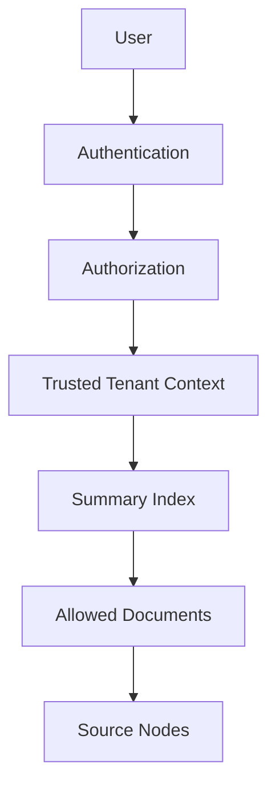

Do not rely on the LLM to enforce these boundaries.

---

# 89. Summary Retrieval and Citations

The summary is a retrieval mechanism.

The source node remains the evidence.

Therefore citations should point to:

```text
Source Document
+
Source Node
+
Page / Section
```

rather than only:

```text
Generated Summary
```

This improves traceability.

---

# 90. Summary Retrieval and Hallucination

Document summaries are generated by an LLM.

That introduces a potential failure mode:

```text
Source Document
      ↓
LLM Summary
      ↓
Incorrect Summary
      ↓
Wrong Document Selection
```

Therefore summary generation should be treated as a retrieval infrastructure component requiring validation.

---

# 91. Summary Hallucination Mitigation

Possible strategies:

```text
Use deterministic prompts
Structured summary fields
Source-grounded summarization
Summary validation
Concept coverage tests
Human review for critical corpora
```

For high-risk enterprise systems, summaries should not be treated as authoritative facts.

---

# 92. Structured Retrieval Summaries

Instead of generating only prose:

```text
"This document describes..."
```

consider a structured representation:

```json
{
  "title": "Payment Architecture",
  "domains": [
    "payments",
    "event processing"
  ],
  "systems": [
    "Kafka",
    "PostgreSQL",
    "Redis"
  ],
  "topics": [
    "OAuth",
    "authentication",
    "disaster recovery"
  ]
}
```

This can make retrieval-oriented metadata more explicit.

---

# 93. Summary + Metadata

A strong document representation can combine:

```text
Summary
+
Metadata
+
Entities
+
Keywords
```

Example:

```text
Document
 ├── Summary
 ├── Department
 ├── Region
 ├── Status
 ├── Entities
 └── Keywords
```

This creates richer document-level retrieval.

---

# 94. Document Summary as Knowledge Routing

A useful enterprise mental model is:

```text
Document Summary
=
Knowledge Routing Layer
```

It answers:

```text
Which document should I investigate?
```

not:

```text
What exact sentence answers the question?
```

The second question should usually be answered using source nodes.

---

# 95. Document Summary Retrieval vs Parent-Child Retrieval

These techniques solve related but different problems.

### Document Summary Retrieval

```text
Summary
 ↓
Document
 ↓
Nodes
```

### Parent-Child Retrieval

```text
Child
 ↓
Parent
```

The first operates primarily at the **document level**.

The second operates primarily at the **hierarchical node level**.

They can also be combined.

---

# 96. Combined Architecture

```text
Query
 ↓
Document Summary Retrieval
 ↓
Relevant Documents
 ↓
Child Vector Retrieval
 ↓
Parent Expansion
 ↓
Re-ranking
 ↓
Context
```

This can provide:

```text
Document-level routing
+
Fine-grained retrieval
+
Context restoration
```

---

# 97. Document Summary Retrieval + Multi-Vector

Another possibility:

```text
Document Summary
     ↓
Document Selection
     ↓
Multi-Vector Retrieval
     ↓
Fine-Grained Evidence
```

This is useful when different representations of the same document are maintained.

---

# 98. Document Summary Retrieval + Hybrid Search

A more advanced architecture:

```text
                 QUERY
                   │
          ┌────────┴────────┐
          ▼                 ▼
   Summary Retrieval       BM25
          │                 │
          └────────┬────────┘
                   ▼
             Document Fusion
                   │
                   ▼
          Vector Chunk Retrieval
                   │
                   ▼
               Re-ranking
                   │
                   ▼
                Context
```

This is a strong candidate architecture for complex enterprise knowledge bases.

---

# 99. Performance Considerations

Potential performance costs:

```text
Summary Generation
Summary Embedding
Summary Search
Node Retrieval
LLM Retrieval
```

Potential benefits:

```text
Reduced search space
Better document-level routing
Better large-document handling
Hierarchical retrieval
```

Always benchmark the complete pipeline.

---

# 100. Query Latency

Embedding-based:

```text
Query
 ↓
Query Embedding
 ↓
Summary Search
 ↓
Node Retrieval
```

LLM-based:

```text
Query
 ↓
LLM Document Selection
 ↓
Node Retrieval
```

The second may be more expensive because it introduces an LLM call.

---

# 101. Cost Model

Conceptually:

```text
Total Cost
=
Index Summary Cost
+
Summary Embedding Cost
+
Query Retrieval Cost
+
Node Retrieval Cost
+
LLM Generation Cost
```

For high-query-volume systems, moving more work to index time can sometimes be beneficial.

---

# 102. When Document Summary Retrieval Is a Good Fit

Consider it when:

```text
Documents are large
+
Documents are logically meaningful units
+
Queries often span document-level topics
+
Document routing improves retrieval
+
Index-time processing is acceptable
```

---

# 103. When It May Not Be a Good Fit

Avoid using it blindly when:

```text
Documents are tiny
+
Chunk-level retrieval already performs well
+
Documents change constantly
+
Summary generation cost is excessive
+
Queries depend on exact details
```

For exact identifiers, BM25 may be more appropriate.

For precise semantic passages, vector retrieval may be more direct.

---

# 104. Decision Matrix

| Requirement | Document Summary Retrieval |
|---|---|
| Large documents | Strong fit |
| Document-level routing | Excellent |
| Exact IDs | Weak alone |
| Fine-grained passage retrieval | Requires second stage |
| Semantic document selection | Strong |
| High query volume | Potentially useful |
| Constantly changing documents | More expensive |
| Small documents | Often unnecessary |
| Hierarchical retrieval | Excellent fit |

---

# 105. Production Architecture

A mature architecture might be:

```text
                         USER QUERY
                              │
                              ▼
                       Query Processing
                              │
                              ▼
                    Security / Tenant Scope
                              │
                              ▼
                   Document Summary Retrieval
                              │
                              ▼
                       Top-N Documents
                              │
                              ▼
                    Chunk-Level Retrieval
                              │
                  ┌───────────┼───────────┐
                  ▼           ▼           ▼
                Vector       BM25       Metadata
                  │           │           │
                  └───────────┼───────────┘
                              ▼
                            Fusion
                              │
                              ▼
                         Re-ranking
                              │
                              ▼
                      Context Selection
                              │
                              ▼
                             LLM
                              │
                              ▼
                    Response Validation
                              │
                              ▼
                          Citations
```

This demonstrates how Document Summary Retrieval fits into the larger enterprise retrieval architecture.

---

# 106. Framework-Agnostic Abstraction

An enterprise application should ideally expose a capability such as:

```python
class DocumentRetriever:

    def retrieve_documents(
        self,
        query: str,
        top_k: int
    ):
        raise NotImplementedError
```

Then:

```python
class LlamaIndexDocumentSummaryRetriever(
    DocumentRetriever
):

    def __init__(self, retriever):
        self.retriever = retriever

    def retrieve_documents(
        self,
        query,
        top_k
    ):
        return self.retriever.retrieve(query)
```

This keeps LlamaIndex-specific APIs inside the adapter layer.

---

# 107. Capability-Based Retrieval Architecture

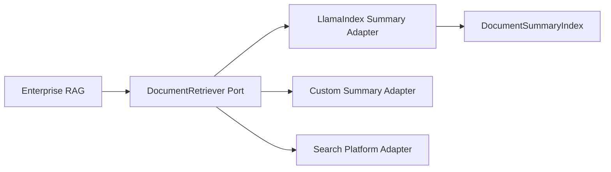

The enterprise application depends on:

```text
Document Retrieval Capability
```

rather than:

```text
LlamaIndex DocumentSummaryIndex
```

---

# 108. Retrieval Factory

A retrieval factory can expose:

```python
class RetrieverType:
    VECTOR = "vector"
    BM25 = "bm25"
    DOCUMENT_SUMMARY = "document_summary"
    HYBRID = "hybrid"
```

Factory:

```python
def create_retriever(
    retriever_type,
    config
):

    if retriever_type == "vector":
        return VectorRetriever(config)

    if retriever_type == "bm25":
        return BM25Retriever(config)

    if retriever_type == "document_summary":
        return DocumentSummaryRetriever(config)

    if retriever_type == "hybrid":
        return HybridRetriever(config)

    raise ValueError(
        f"Unsupported retriever: {retriever_type}"
    )
```

This provides a clean capability-based architecture.

---

# 109. Production Configuration

A conceptual configuration could be:

```yaml
retrieval:
  strategy: document_summary

  document_selection:
    top_k: 10

  chunk_retrieval:
    strategy: vector
    top_k: 50

  reranking:
    enabled: true
    top_k: 10

  security:
    tenant_isolation: true

  observability:
    enabled: true
```

These values are illustrative.

Production values should come from benchmark results.

---

# 110. Evaluation Pipeline

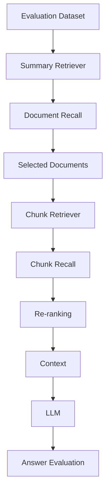

Evaluate every stage separately.

---

# 111. Production Checklist

```text
☐ Identify document-level retrieval use cases
☐ Define document boundaries
☐ Define node/chunk strategy
☐ Define summary generation strategy
☐ Define summary prompt
☐ Version summary prompt
☐ Version summary model
☐ Decide embedding vs LLM retrieval
☐ Configure summary embeddings if required
☐ Define document Top-N
☐ Measure document Recall@K
☐ Implement second-stage chunk retrieval
☐ Evaluate chunk Recall@K
☐ Add re-ranking
☐ Preserve source-node provenance
☐ Implement citations
☐ Implement tenant isolation
☐ Implement summary freshness tracking
☐ Implement incremental summary updates
☐ Handle document deletion
☐ Monitor summary generation failures
☐ Monitor retrieval latency
☐ Monitor summary quality
☐ Version the index
☐ Implement rollback
☐ Test fallback retrieval
```

---

# 112. Common Anti-Patterns

## Anti-Pattern 1 — Using Summaries as Final Evidence

```text
Summary
 ↓
LLM
```

without retrieving the original evidence.

Better:

```text
Summary
 ↓
Document
 ↓
Source Nodes
 ↓
LLM
```

---

# 113. Common Anti-Patterns — Continued

## Anti-Pattern 2 — Poor Summary Prompt

```text
"Summarize this document."
```

may produce a human-friendly summary that omits retrieval-critical terms.

Better:

```text
Retrieval-Oriented Summary
```

that preserves:

```text
Entities
Systems
Topics
Processes
Identifiers
```

---

# 114. Common Anti-Patterns — Continued

## Anti-Pattern 3 — Ignoring Summary Freshness

```text
Document V2
+
Summary V1
```

creates stale routing information.

---

## Anti-Pattern 4 — Selecting Too Few Documents

```text
Top-1
```

may provide excellent precision but poor recall.

---

# 115. Common Anti-Patterns — Continued

## Anti-Pattern 5 — Searching Only Summaries

A summary may identify the right document but not the exact evidence.

Always consider:

```text
Document Selection
+
Fine-Grained Retrieval
```

---

## Anti-Pattern 6 — No Evaluation

Do not assume:

```text
Better Summary
=
Better Retrieval
```

Measure it.

---

# 116. Key Takeaways

- `DocumentSummaryIndex` provides document-level retrieval through generated summaries.
- The core model is `Summary → Document → Nodes`.
- Document Summary Retrieval changes the retrieval granularity from chunks to documents.
- Summaries act primarily as routing/retrieval representations.
- Original source nodes remain the evidence used for final RAG responses.
- LlamaIndex supports embedding-based and LLM-based retrieval modes for `DocumentSummaryIndex`. :contentReference[oaicite:6]{index=6}
- Embedding retrieval searches the embedded document summaries.
- LLM retrieval uses an LLM to select relevant documents based on their summaries. :contentReference[oaicite:7]{index=7}
- Embedding-based retrieval requires summaries to be embedded. :contentReference[oaicite:8]{index=8}
- Document-level retrieval is particularly useful for large, logically coherent documents.
- Summary retrieval can act as the first stage of hierarchical retrieval.
- A second-stage chunk retriever can provide fine-grained evidence.
- Stage-one document recall is critical because later stages cannot retrieve evidence from a document that was excluded.
- Document Top-N should be tuned using evaluation data.
- Summary generation creates additional index-time cost.
- LLM-based retrieval introduces additional query-time model cost and latency.
- Summary quality directly affects document selection quality.
- Retrieval-oriented summaries should preserve domain-specific terminology.
- Summary prompts and models should be versioned.
- Summary freshness must track document changes.
- Document summaries can contain sensitive information and must follow the same security model as source data.
- Tenant isolation must be enforced through trusted application security context.
- Summary retrieval works well with vector, BM25, hybrid, parent-child, and re-ranking strategies.
- Document Summary Retrieval can be used as a routing layer rather than a replacement for fine-grained retrieval.
- Production systems should monitor summary generation, freshness, retrieval latency, document recall, and downstream chunk recall.
- Framework-specific implementations should be hidden behind capability-based retrieval interfaces.
- Document Summary Retrieval is most valuable when **document-level routing** provides a meaningful advantage over direct chunk-level retrieval.

The central mental model is:

```text
                       USER QUERY
                            │
                            ▼
                  Document Summary Search
                            │
                            ▼
                     Top-N Documents
                            │
                            ▼
                 Fine-Grained Retrieval
                            │
              ┌─────────────┼─────────────┐
              ▼             ▼             ▼
           Vector          BM25        Metadata
              │             │             │
              └─────────────┼─────────────┘
                            ▼
                         Fusion
                            │
                            ▼
                        Re-ranking
                            │
                            ▼
                    Context Selection
                            │
                            ▼
                           LLM
                            │
                            ▼
                    Validated Response
                            │
                            ▼
                        Citations
```

> **A Document Summary Retriever is best understood as a knowledge-routing layer: use the summary to identify the right document, then use the original source nodes to retrieve the evidence needed to answer the question.**

---

# 🧭 Chapter Navigation

### Part V — Advanced Retrieval-Augmented Generation

**Previous:**  
[04. BM25 Retriever](04-bm25-retriever.md)

**Next:**  
[06. Recursive Retriever](06-recursive-retriever.md)

**Section:**  
03 — LlamaIndex Retrieval Engineering

### LlamaIndex Retrieval Engineering Path

```text
01 LlamaIndex Retrievers Overview
              ↓
02 LlamaIndex Indexes
              ↓
03 Vector Index Retriever
              ↓
04 BM25 Retriever
              ↓
05 Document Summary Retriever
              ↓
06 Recursive Retriever
              ↓
07 Query Fusion Retriever
              ↓
08 Auto-Merging Retriever
              ↓
04 Vector Search Engineering
```

---

> **Enterprise AI Engineering Handbook**  
> *Building Production-Grade Enterprise AI Systems — One Chapter at a Time.*