# Recursive Retriever

## 📖 Overview

A **Recursive Retriever** is a retrieval strategy that allows the retrieval system to follow relationships between nodes and retrieve additional information connected to the initially retrieved results.

Instead of treating every retrieved node as an isolated piece of text, recursive retrieval understands that nodes can reference:

```text
Parent Nodes
Child Nodes
Related Nodes
Summary Nodes
Metadata Nodes
Generated Question Nodes
Other Retrieval Sources
```

The core idea is:

```text
Initial Retrieval
       ↓
Referenced Node
       ↓
Follow Relationship
       ↓
Retrieve Related Node
       ↓
Expand Context
```

LlamaIndex's `RecursiveRetriever` supports retrieval over node relationships and can recursively follow references from an initially retrieved node. LlamaIndex examples use this pattern for small-to-big retrieval, where smaller child chunks are indexed and linked back to larger parent chunks. :contentReference[oaicite:0]{index=0}

This makes recursive retrieval particularly useful for:

```text
Small-to-Big Retrieval
Parent-Child Retrieval
Hierarchical Documents
Summary → Source Retrieval
Generated Question → Source Retrieval
Multi-Representation Retrieval
Embedded Tables
Document Agents
```

---

# 🎯 Learning Objectives

After completing this chapter, you will be able to:

- Understand recursive retrieval
- Understand node references
- Understand parent-child relationships
- Understand child-to-parent retrieval
- Understand small-to-big retrieval
- Understand recursive traversal
- Understand node mappings
- Build a basic recursive retrieval architecture
- Understand recursive retrieval in LlamaIndex
- Combine vector search with recursive traversal
- Understand summary-to-source retrieval
- Understand multi-representation retrieval
- Understand recursive retrieval with tables
- Understand recursive retrieval with document agents
- Evaluate recursive retrieval
- Understand performance and cost trade-offs
- Design production-ready recursive retrieval systems

---

# 1. What Is Recursive Retrieval?

Traditional retrieval looks like:

```text
Query
 ↓
Retriever
 ↓
Nodes
```

Recursive retrieval adds another dimension:

```text
Query
 ↓
Retriever
 ↓
Initial Node
 ↓
Reference
 ↓
Related Node
 ↓
Reference
 ↓
Another Node
```

The retrieval process can therefore traverse a graph of related nodes.

---

# 2. Basic Mental Model

Imagine:

```text
Parent Node
     │
 ┌───┼───┐
 ↓   ↓   ↓
C1  C2  C3
```

The vector retriever may identify:

```text
C2
```

But C2 may not contain enough context.

Recursive retrieval follows:

```text
C2
 ↓
Parent
```

and returns:

```text
Parent
```

instead of using only the small child chunk.

---

# 3. Why Do We Need Recursive Retrieval?

Suppose a document contains:

```text
Authentication Architecture
```

and is split into:

```text
Parent Section
 ├── Child Chunk 1
 ├── Child Chunk 2
 ├── Child Chunk 3
 └── Child Chunk 4
```

The query:

```text
"How are OAuth tokens validated?"
```

may match:

```text
Child Chunk 2
```

But Child Chunk 2 might contain only:

```text
"Tokens are validated using the
authorization service."
```

The parent section may contain the broader architecture.

Recursive retrieval allows:

```text
Child 2
 ↓
Parent Section
```

to restore the missing context.

---

# 4. Recursive Retrieval Architecture

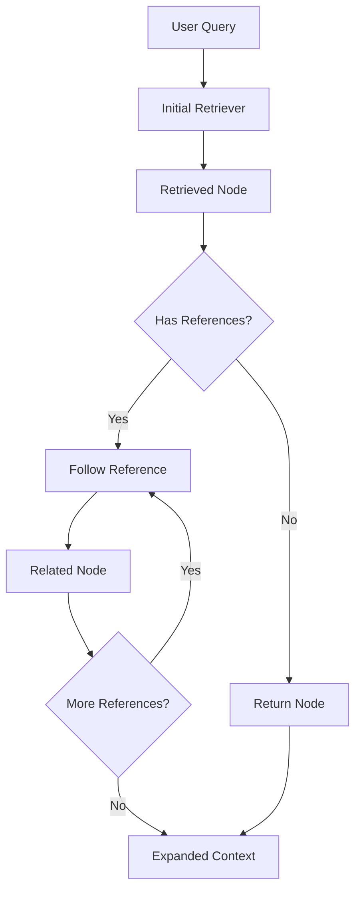

The important operation is:

```text
Retrieve
  ↓
Resolve Reference
  ↓
Retrieve Again
```

---

# 5. Node References

A node can contain a relationship to another node.

Conceptually:

```python
child.parent_id = parent.id
```

or:

```text
Child Node
   ↓
references
   ↓
Parent Node
```

The reference itself does not necessarily mean that the referenced node is automatically retrieved by a normal vector search.

The recursive retriever explicitly follows the relationship.

---

# 6. Node Graph

Consider:

```text
Document
   │
   ▼
Section
   │
   ├────→ Child Chunk 1
   │
   ├────→ Child Chunk 2
   │
   └────→ Child Chunk 3
```

This forms a node relationship graph.

Recursive retrieval can traverse this graph.

---

# 7. Parent-Child Relationship

A common structure is:

```text
Parent
 ├── Child A
 ├── Child B
 ├── Child C
 └── Child D
```

The retrieval direction can be:

```text
Child → Parent
```

This is particularly useful for **small-to-big retrieval**.

---

# 8. Small-to-Big Retrieval

The small-to-big pattern works like this:

```text
Large Parent Chunk
       ↓
Split into smaller children
       ↓
Index children
       ↓
Retrieve child
       ↓
Follow reference
       ↓
Return parent
```

LlamaIndex's recursive-retriever example explicitly demonstrates this pattern by subdividing parent chunks into child chunks, linking children to their parent, indexing the children, and recursively retrieving related nodes. :contentReference[oaicite:1]{index=1}

---

# 9. Small-to-Big Architecture

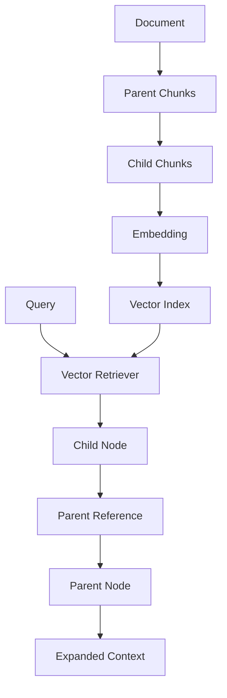

This architecture separates:

```text
Retrieval Granularity
```

from:

```text
Generation Context
```

---

# 10. Why Retrieve Small Chunks?

Small chunks can provide better retrieval precision.

Example:

```text
Child Chunk:
"OAuth tokens expire after 60 minutes."
```

This is highly focused.

A large parent:

```text
Authentication Architecture
```

may contain:

```text
OAuth
JWT
API Gateway
Identity Provider
Token Validation
Refresh Tokens
Logging
Monitoring
```

The small child is easier to match to the query.

---

# 11. Why Return the Parent?

The small child may not provide sufficient context.

Therefore:

```text
Search Small
       ↓
Understand Big
```

This is the central small-to-big principle.

---

# 12. Search Small, Generate Big

```text
Query
 ↓
Small Chunk Retrieval
 ↓
High Precision
 ↓
Parent Expansion
 ↓
More Context
 ↓
LLM
```

This is one of the most useful patterns for long enterprise documents.

---

# 13. Recursive Retriever vs Parent Document Retriever

These concepts are closely related.

### Parent Document Retrieval

```text
Child
 ↓
Parent
```

### Recursive Retrieval

```text
Node
 ↓
Reference
 ↓
Related Node
 ↓
Reference
 ↓
Another Node
```

Recursive retrieval is the more general mechanism.

Parent-child retrieval is one important use case.

---

# 14. Recursive Retrieval Can Traverse More Than Parents

A node could reference:

```text
Parent
Summary
Generated Questions
Table
Metadata Node
Another Representation
Document Agent
```

Therefore:

```text
Recursive Retrieval
```

is broader than:

```text
Parent Retrieval
```

---

# 15. Reference Graph

Example:

```text
          Parent
         /  |   \
        /   |    \
      C1    C2    C3
            |
            ↓
         Summary
            |
            ↓
        Related Node
```

A recursive retriever can follow these references according to the configured retrieval graph.

---

# 16. LlamaIndex RecursiveRetriever

LlamaIndex provides a `RecursiveRetriever` abstraction for recursively retrieving nodes through references.

A typical configuration conceptually looks like:

```python
recursive_retriever = RecursiveRetriever(
    "vector",
    retriever_dict={
        "vector": vector_retriever
    },
    node_dict=node_mappings
)
```

The LlamaIndex recursive-retriever examples use a retriever dictionary together with node mappings to resolve referenced nodes. :contentReference[oaicite:2]{index=2}

---

# 17. What Is `retriever_dict`?

Conceptually:

```text
Retriever ID
     ↓
Retriever Implementation
```

Example:

```python
retriever_dict = {
    "vector": vector_retriever
}
```

This allows the recursive system to know which retriever should be used for a particular retrieval step.

---

# 18. What Is `node_dict`?

A node dictionary can provide mappings such as:

```text
Node ID
   ↓
Node Object
```

Conceptually:

```python
node_dict = {
    "node-001": parent_node,
    "node-002": child_node
}
```

When recursive retrieval encounters a reference:

```text
node-002
```

it can resolve it to:

```text
child_node
```

---

# 19. Node Mapping


This is the mechanism that makes reference traversal possible.

---

# 20. Basic Recursive Retrieval Example

Conceptually:

```python
from llama_index.core.retrievers import RecursiveRetriever

recursive_retriever = RecursiveRetriever(
    "vector",
    retriever_dict={
        "vector": vector_retriever
    },
    node_dict=node_dict
)

results = recursive_retriever.retrieve(
    "How does OAuth token validation work?"
)

for result in results:
    print(result.node.text)
```

The exact imports and APIs can vary by LlamaIndex version.

---

# 21. Initial Retriever

The recursive retriever normally needs an initial retrieval mechanism.

For example:

```text
Vector Retriever
```

could identify:

```text
Child Node 17
```

Then:

```text
Recursive Retriever
```

follows the node reference.

Therefore:

```text
Recursive Retriever
=
Initial Retrieval
+
Reference Traversal
```

---

# 22. Initial Retrieval + Recursive Expansion

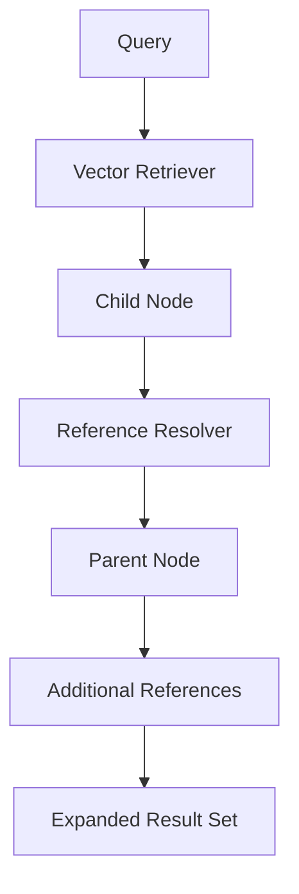

This is the simplest useful recursive architecture.

---

# 23. Recursive Depth

A recursive retriever may need a limit on how far it traverses.

Conceptually:

```text
depth = 0
```

means:

```text
Initial Result Only
```

while:

```text
depth = 1
```

means:

```text
Initial Result
+
One Reference Hop
```

and:

```text
depth = 2
```

means:

```text
Initial Result
+
Reference
+
Another Reference
```

The exact supported configuration depends on the implementation/version.

---

# 24. Why Limit Recursive Depth?

Without a limit, a highly connected node graph could cause:

```text
Too Many Nodes
High Latency
Large Context
Repeated Retrieval
Potential Cycles
```

Therefore:

```text
Recursive Traversal
```

should always be controlled.

---

# 25. Recursive Depth Example

```text
Depth 0

Child C2


Depth 1

Child C2
   ↓
Parent P1


Depth 2

Child C2
   ↓
Parent P1
   ↓
Related Node R1
```

The system should stop according to its traversal policy.

---

# 26. Cycle Detection

Consider:

```text
A → B
B → C
C → A
```

This creates a cycle.

A recursive retriever must avoid:

```text
A → B → C → A → B → C → ...
```

A visited-node set is a common conceptual safeguard:

```python
visited = set()

if node_id in visited:
    return

visited.add(node_id)
```

---

# 27. Recursive Traversal with Visited Nodes

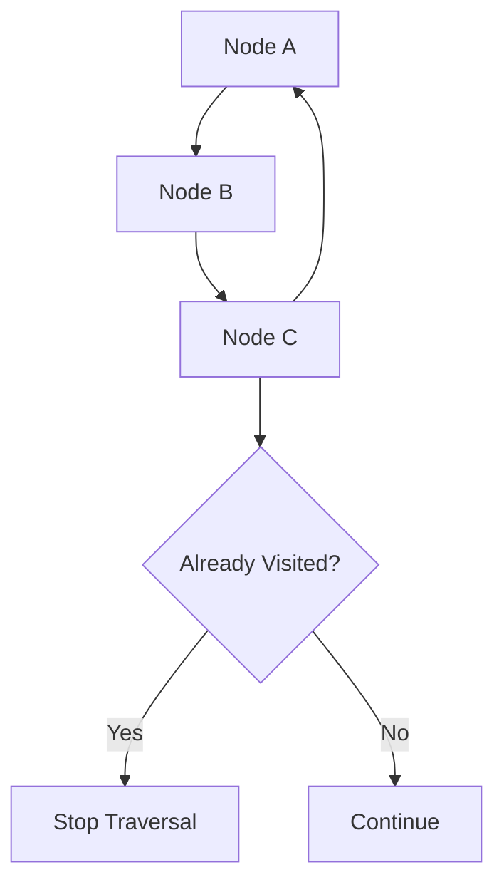

This prevents infinite traversal.

---

# 28. Recursive Retrieval Is Graph Traversal

A useful mental model is:

```text
Retriever
+
Graph Traversal
```

The graph may look like:

```text
Node A
 ├──→ Node B
 ├──→ Node C
 │      └──→ Node E
 └──→ Node D
```

The recursive retriever starts from a retrieved node and follows configured edges.

---

# 29. Retrieval Graph

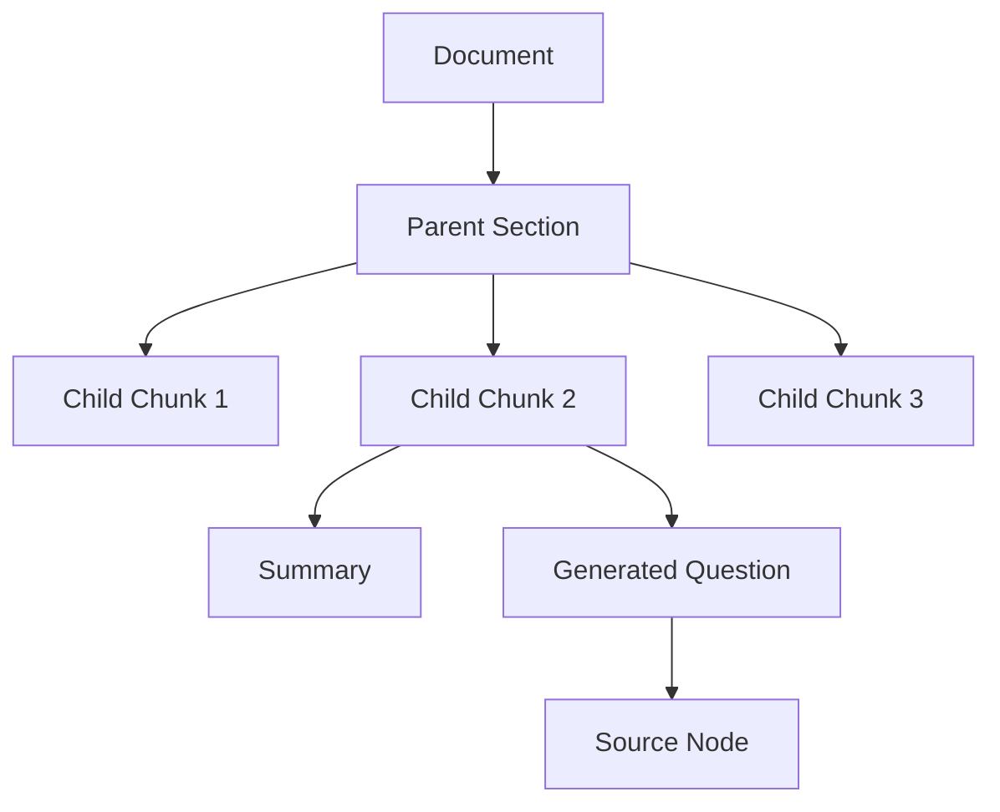

This demonstrates why recursive retrieval can support more than one representation of the same knowledge.

---

# 30. Multi-Representation Retrieval

A powerful pattern is to represent the same source information in multiple forms:

```text
Original Chunk
Summary
Generated Questions
Metadata
Parent Context
```

All representations can point back to:

```text
Canonical Source Node
```

Example:

```text
Generated Question
        ↓
Source Node

Summary
        ↓
Source Node

Child Chunk
        ↓
Parent Node
```

---

# 31. Why Multiple Representations Help

Different representations can be optimized for different retrieval behavior.

```text
Child Chunk
→ Precise semantic matching

Summary
→ Broad semantic matching

Generated Question
→ Query-style matching

Parent
→ Contextual synthesis

Source Node
→ Evidence
```

Recursive retrieval can connect these representations.

---

# 32. Summary → Source Retrieval

Suppose:

```text
Summary Node
```

is easy to retrieve.

But the LLM needs:

```text
Original Source Node
```

The relationship can be:

```text
Summary
   ↓
Source Node
```

The summary becomes the retrieval representation.

The source becomes the evidence.

---

# 33. Summary-Based Recursive Retrieval

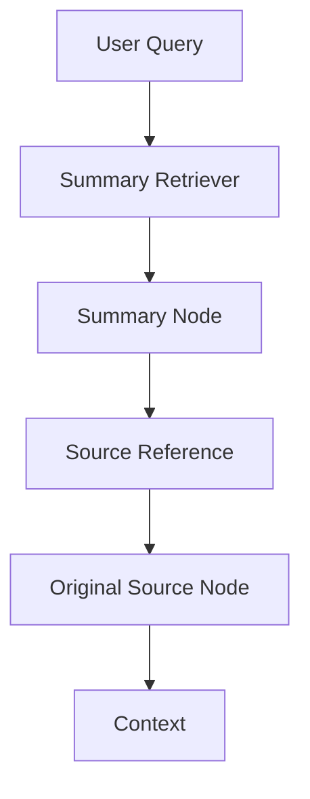

This is conceptually similar to the document-summary pattern discussed in the previous chapter, but recursive retrieval provides the explicit node-reference mechanism.

---

# 34. Generated Question → Source Retrieval

Another useful pattern:

```text
Source Node
     ↓
Generate Questions
     ↓
Question Nodes
```

At query time:

```text
User Query
     ↓
Question Node Retrieval
     ↓
Source Reference
     ↓
Source Node
```

This decouples:

```text
Retrieval Representation
```

from:

```text
Generation Representation
```

---

# 35. Generated Question Architecture

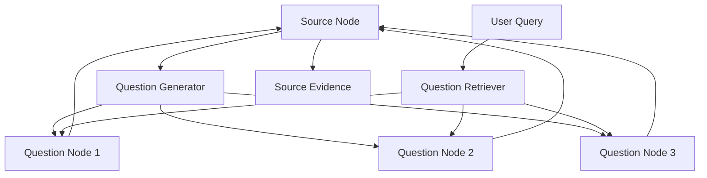

The user query searches generated questions, but the final result comes from the source node.

---

# 36. Decoupling Retrieval and Synthesis

This is one of the most important ideas behind recursive retrieval.

Traditional:

```text
Indexed Text
     =
Retrieved Text
```

Recursive retrieval allows:

```text
Indexed Representation
     ≠
Retrieved Evidence
```

For example:

```text
Summary
     ↓
Source Document
```

or:

```text
Question Representation
     ↓
Source Chunk
```

This is powerful for enterprise RAG.

---

# 37. Retrieval Representation vs Evidence

```text
                 Knowledge
                    │
          ┌─────────┼─────────┐
          ▼         ▼         ▼
       Summary   Question   Child Chunk
          │         │         │
          └─────────┼─────────┘
                    ▼
               Source Node
                    │
                    ▼
                  LLM
```

The retrieval representation is optimized for finding the information.

The source node is optimized for trustworthy synthesis.

---

# 38. Recursive Retrieval with Tables

Some documents contain:

```text
Text
+
Tables
```

A table may be represented as a separate node.

For example:

```text
Document
 ├── Text Node
 ├── Table Node
 └── Text Node
```

A text node can reference a table node.

Recursive retrieval can follow:

```text
Text
 ↓
Table
```

when the table contains relevant information.

LlamaIndex has demonstrated recursive retrieval with embedded tables by parsing document elements, creating node relationships, and recursively retrieving through those relationships. :contentReference[oaicite:3]{index=3}

---

# 39. Table Retrieval Architecture

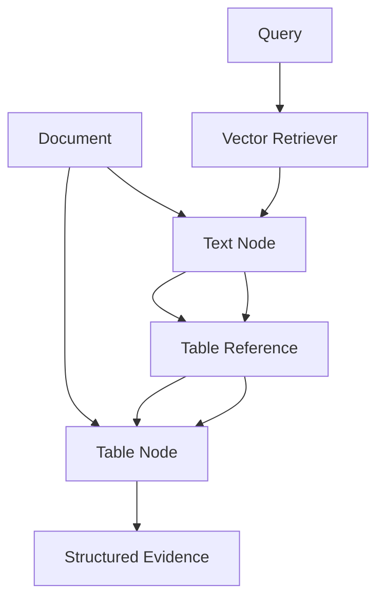

This can be useful for:

```text
Financial Reports
Product Specifications
Architecture Tables
Configuration Matrices
Benchmark Results
```

---

# 40. Why Tables Need Special Handling

Suppose the query is:

```text
"What was the payment TPS in 2025?"
```

The relevant information may exist in:

```text
Table Node
```

rather than:

```text
Text Chunk
```

Recursive references allow a text representation to point toward the table containing the actual evidence.

---

# 41. Recursive Retrieval with Heterogeneous Data

A knowledge base may contain:

```text
Text
Tables
Images
Summaries
Structured Data
Metadata
```

Recursive relationships can connect these representations.

```text
Text
 ↓
Table
 ↓
Metadata
```

or:

```text
Summary
 ↓
Source
 ↓
Table
```

This becomes especially useful in multimodal RAG.

---

# 42. Recursive Retriever + Document Agents

Recursive retrieval can also be combined with document agents.

The LlamaIndex documentation describes combining recursive retrieval with document agents for heterogeneous documents, allowing document-level summaries to guide retrieval and agents to perform tasks within selected documents. :contentReference[oaicite:4]{index=4}

Conceptually:

```text
Query
 ↓
Document Summary
 ↓
Relevant Document
 ↓
Document Agent
 ↓
Document Tools
```

---

# 43. Document Agent Architecture

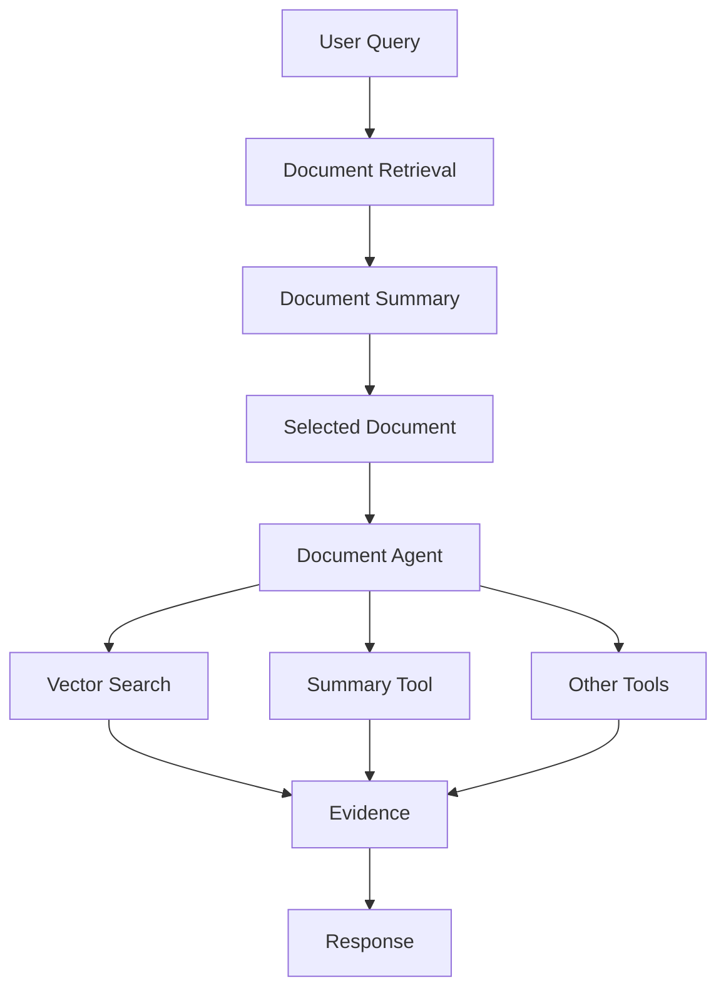

Recursive retrieval provides the bridge between retrieval representations and document-level capabilities.

---

# 44. Recursive Retrieval + Agentic Retrieval

A more advanced architecture:

```text
Query
 ↓
Retriever
 ↓
Candidate Node
 ↓
Referenced Document
 ↓
Agent
 ↓
Additional Retrieval
 ↓
Evidence
```

This can support dynamic retrieval workflows.

However, agentic behavior introduces additional:

```text
Latency
Cost
Complexity
Failure Modes
```

and should be introduced only where deterministic retrieval is insufficient.

---

# 45. Recursive Retrieval vs Router Retrieval

These are different concepts.

### Router Retriever

Chooses between:

```text
Retriever A
Retriever B
Retriever C
```

LlamaIndex's `RouterRetriever` selects one or multiple candidate retrievers based on a selector and retriever metadata. :contentReference[oaicite:5]{index=5}

### Recursive Retriever

Follows:

```text
Node A
 ↓
Reference
 ↓
Node B
```

Therefore:

```text
Router
=
Which retrieval strategy?

Recursive
=
Which connected node?
```

---

# 46. Router + Recursive Retrieval

They can also work together:

```text
Query
 ↓
Router
 ↓
Document Retriever
 ↓
Node
 ↓
Recursive Expansion
 ↓
Parent / Summary / Table
```

This creates a more capable retrieval architecture.

---

# 47. Recursive Retrieval vs Multi-Query

### Multi-Query

```text
One Query
 ↓
Query 1
Query 2
Query 3
 ↓
Multiple Searches
```

### Recursive Retrieval

```text
Initial Search
 ↓
Node
 ↓
Referenced Node
```

They solve different problems.

They can be combined.

---

# 48. Recursive + Multi-Query

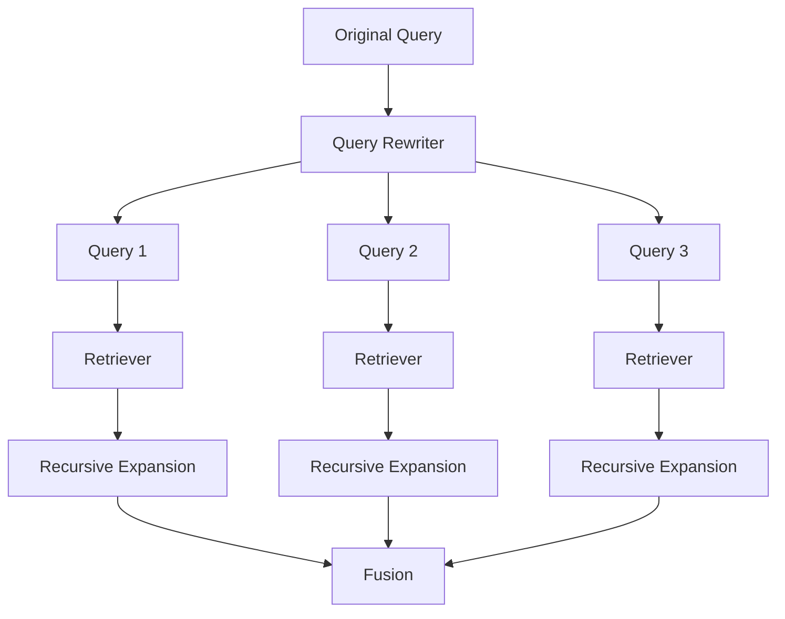

This can improve recall, but complexity increases quickly.

---

# 49. Recursive + Re-ranking

A useful pipeline is:

```text
Initial Retriever
      ↓
Top-20 Child Nodes
      ↓
Recursive Expansion
      ↓
Candidate Parents
      ↓
Re-ranking
      ↓
Top-5 Evidence
```

Re-ranking can remove parents that were expanded but are not actually useful for the query.

---

# 50. Recursive + MMR

Recursive expansion can produce duplicate context.

Example:

```text
Child A → Parent P
Child B → Parent P
Child C → Parent P
```

Without deduplication:

```text
Parent P
Parent P
Parent P
```

MMR or explicit node deduplication can solve this.

---

# 51. Deduplication

A simple strategy:

```python
unique_nodes = {}

for result in results:
    node_id = result.node.node_id
    unique_nodes[node_id] = result
```

Then:

```python
results = list(unique_nodes.values())
```

This is conceptual code; production systems should also define how scores are merged.

---

# 52. Recursive Retrieval and Context Explosion

Suppose:

```text
10 child nodes
```

each reference:

```text
1 parent
```

and each parent references:

```text
5 related nodes
```

Potential result count:

```text
10
+
10
+
50
=
70 nodes
```

This can quickly exceed the desired context budget.

Therefore recursive expansion must be controlled.

---

# 53. Context Budget

```text
Initial Retrieval
      ↓
Recursive Expansion
      ↓
Many Candidates
      ↓
Deduplicate
      ↓
Re-rank
      ↓
Context Budget
      ↓
LLM
```

Recursive retrieval should not mean:

```text
Retrieve Everything Connected
```

---

# 54. Recursive Expansion Policies

Possible policies include:

```text
Maximum Depth
Maximum Nodes
Reference Type Filter
Score Threshold
Per-Reference Limit
Total Token Budget
```

Example:

```yaml
recursive:
  max_depth: 2
  max_nodes: 30
  max_tokens: 8000
```

The values are illustrative.

---

# 55. Reference-Type Filtering

Suppose a node references:

```text
Parent
Summary
Table
Related Document
```

You may want:

```text
Parent
+
Table
```

but not:

```text
Related Document
```

Therefore recursive retrieval can conceptually use:

```text
Allowed Reference Types
```

to control traversal.

---

# 56. Recursive Traversal Policy

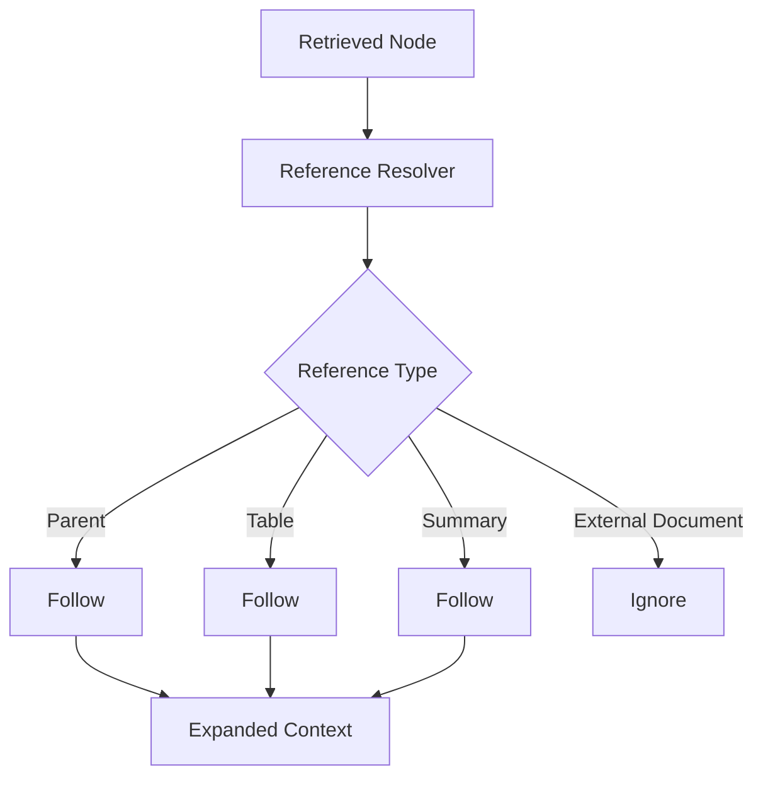

This prevents uncontrolled traversal.

---

# 57. Recursive Retrieval Quality

Recursive retrieval can improve:

```text
Context Completeness
Parent Context
Evidence Recovery
Document Structure Awareness
Multi-Representation Retrieval
```

But it can reduce quality if:

```text
Too many nodes
Wrong references
Poor node relationships
Stale references
Incorrect traversal
```

Therefore relationship quality is as important as vector quality.

---

# 58. Relationship Quality

A recursive system depends on:

```text
Node IDs
Reference IDs
Reference Types
Reference Direction
Reference Freshness
```

If:

```text
Child → Wrong Parent
```

then recursive retrieval produces incorrect context.

---

# 59. Reference Integrity

Treat node relationships similarly to database foreign keys.

Conceptually:

```text
Child.parent_id
       ↓
Must resolve
       ↓
Parent.id
```

Validation should detect:

```text
Missing References
Broken References
Duplicate IDs
Cycles
Orphan Nodes
```

---

# 60. Reference Validation

```python
for node in nodes:

    for ref in node.references:

        assert ref.node_id in node_dict
```

This is a simple conceptual validation.

Production validation should also check:

```text
Reference Type
Ownership
Version
Tenant
Lifecycle
```

---

# 61. Reference Versioning

Suppose:

```text
Parent V1
Child V1
```

then parent becomes:

```text
Parent V2
```

The child reference must point to the correct version.

Otherwise:

```text
Child V2
 ↓
Parent V1
```

can create inconsistent context.

---

# 62. Versioned Node Graph

```text
Document V3
   │
   ▼
Parent V3
   │
   ├── Child V3-A
   ├── Child V3-B
   └── Child V3-C
```

The node graph should be rebuilt or updated consistently when document versions change.

---

# 63. Tenant Isolation in Recursive Retrieval

This is especially important.

Suppose:

```text
Tenant A Child
      ↓
Parent Node
```

but the parent belongs to:

```text
Tenant B
```

Recursive traversal could accidentally cross tenant boundaries if relationships are not validated.

Therefore:

```text
Reference Traversal
+
Tenant Authorization
```

must be enforced together.

---

# 64. Secure Recursive Retrieval

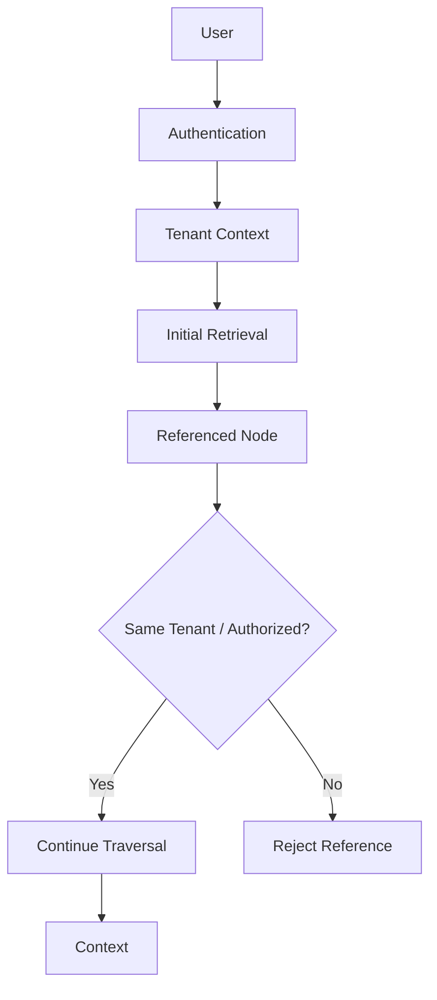

Do not assume that node references are automatically safe.

---

# 65. Recursive Retrieval and Provenance

Every expanded node should retain:

```text
Source Document
Node ID
Parent ID
Reference Path
Page
Section
Metadata
```

Example:

```json
{
  "node_id": "child-42",
  "parent_id": "section-8",
  "source": "payment-architecture.pdf",
  "reference_path": [
    "child-42",
    "section-8"
  ]
}
```

This enables traceable citations.

---

# 66. Reference Path

A recursive result can have:

```text
Query
 ↓
Child Node
 ↓
Parent
 ↓
Table
```

The provenance path becomes:

```text
child → parent → table
```

This is valuable for:

```text
Debugging
Citation
Observability
Evaluation
```

---

# 67. Recursive Retrieval Trace

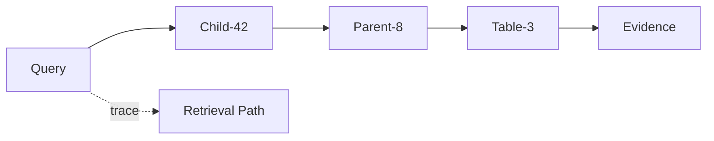

The retrieval path can be stored as trace metadata.

---

# 68. Recursive Retrieval Observability

Track:

```text
Initial Retriever
Initial Result Count
Recursive Depth
References Followed
Nodes Expanded
Duplicate Nodes
Cycles Detected
Final Result Count
Latency
```

Example:

```json
{
  "retriever": "recursive",
  "initial_results": 5,
  "max_depth": 2,
  "references_followed": 11,
  "nodes_expanded": 18,
  "duplicates_removed": 4,
  "latency_ms": 74
}
```

---

# 69. Recursive Retrieval Performance

Latency can come from:

```text
Initial Search
+
Reference Resolution
+
Additional Retrieval
+
Node Loading
+
Deduplication
+
Re-ranking
```

If references require remote calls:

```text
Network Latency
```

can become significant.

---

# 70. Parallel Recursive Expansion

If multiple references are independent:

```text
Parent
 ├── Child A
 ├── Child B
 └── Child C
```

the system can potentially resolve them concurrently.

Conceptually:

```python
results = await asyncio.gather(
    resolve("A"),
    resolve("B"),
    resolve("C")
)
```

This can reduce wall-clock latency.

---

# 71. Recursive Retrieval Cost

Potential costs include:

```text
Initial Embedding
Vector Search
Node Fetches
LLM Summary Generation
Additional Retrieval
Re-ranking
LLM Context Tokens
```

Therefore:

```text
Recursive
≠
Free Context Expansion
```

Every additional node has operational cost.

---

# 72. Recursive Retrieval Evaluation

Evaluate:

```text
Initial Recall
Recursive Recall
Context Precision
Context Recall
Answer Quality
Latency
Token Cost
```

Compare:

```text
Vector Only
```

against:

```text
Vector + Recursive
```

---

# 73. Evaluation Example

| Metric | Vector Only | Recursive |
|---|---:|---:|
| Recall@10 | 0.78 | 0.91 |
| Context Precision | 0.82 | 0.76 |
| Answer Quality | 0.80 | 0.88 |
| P95 Latency | 90 ms | 140 ms |
| Context Tokens | 3,000 | 5,200 |

Values are illustrative.

The goal is not to maximize one metric.

---

# 74. Recursive Retrieval Quality Trade-Off

```text
More Expansion
      ↓
Higher Context Recall
      ↓
Potentially More Noise
      ↓
Higher Token Cost
      ↓
Higher Latency
```

Therefore recursive depth and expansion limits should be tuned.

---

# 75. Small-to-Big Evaluation

Compare:

```text
Chunk Retrieval
```

against:

```text
Small-to-Big
```

Measure:

```text
Answer Completeness
Context Precision
Context Recall
Latency
Token Usage
```

This demonstrates whether parent expansion actually improves the application.

---

# 76. Recursive Retrieval for Long Documents

Long documents often benefit from:

```text
Small Child Chunks
+
Large Parent Sections
```

because:

```text
Child
=
Precise retrieval

Parent
=
Context
```

This creates a useful division of responsibilities.

---

# 77. Recursive Retrieval for PDFs

A PDF may be represented as:

```text
PDF
 ├── Page
 │    ├── Paragraph
 │    └── Table
 │
 ├── Page
 │    ├── Paragraph
 │    └── Table
```

Recursive references can connect:

```text
Paragraph
 ↓
Page
 ↓
Table
```

or:

```text
Child Chunk
 ↓
Section
 ↓
Page
```

This preserves document structure.

---

# 78. Recursive Retrieval for Documentation

Technical documentation can be represented as:

```text
Documentation
 ├── Chapter
 │    ├── Section
 │    │    ├── Chunk
 │    │    └── Code Example
```

A query may retrieve:

```text
Chunk
```

and recursively expand to:

```text
Section
```

for context.

---

# 79. Recursive Retrieval for Code

Code knowledge can be represented as:

```text
Repository
 ├── Module
 │    ├── Package
 │    │    ├── Class
 │    │    │    ├── Method
```

A query:

```text
"Where is payment authorization implemented?"
```

may retrieve:

```text
Method
```

then recursively resolve:

```text
Class
 ↓
Package
 ↓
Module
```

This provides structural context.

---

# 80. Recursive Retrieval for Enterprise Knowledge

A knowledge graph-like structure could be:

```text
Payment Service
      │
      ├── Architecture Document
      │
      ├── API Specification
      │
      ├── Runbook
      │
      ├── Incident
      │
      └── Database Schema
```

A retrieved node can lead to related enterprise knowledge.

---

# 81. Recursive Retrieval + Knowledge Graphs

Recursive node references can resemble a lightweight knowledge graph:

```text
Node
 ├── related_to
 ├── parent_of
 ├── summarized_by
 ├── represented_by
 └── contains
```

However:

```text
Recursive Node Graph
```

is not automatically equivalent to:

```text
Enterprise Knowledge Graph
```

A dedicated knowledge graph provides richer entity/relationship semantics.

---

# 82. Recursive Retrieval + Graph RAG

A production architecture can combine them:

```text
Vector Retrieval
      ↓
Recursive Node Expansion
      ↓
Knowledge Graph Traversal
      ↓
Evidence
```

This can support complex relational questions.

---

# 83. Recursive Retrieval + SQL

A retrieved node could reference:

```text
SQL Table
```

or:

```text
Database Schema
```

The system can then transition from:

```text
Unstructured Retrieval
```

to:

```text
Structured Retrieval
```

Example:

```text
Question
 ↓
Architecture Document
 ↓
Database Schema Reference
 ↓
SQL Retriever
 ↓
Structured Evidence
```

This is an advanced enterprise pattern.

---

# 84. Recursive Retrieval as a Retrieval Bridge

One of the strongest architectural uses is to bridge different retrieval mechanisms:

```text
Vector
 ↓
Recursive Reference
 ↓
BM25

or:

Vector
 ↓
Recursive Reference
 ↓
SQL

or:

Summary
 ↓
Recursive Reference
 ↓
Source Node
```

Therefore recursive retrieval can become a **retrieval orchestration mechanism**.

---

# 85. Multi-Stage Retrieval Architecture

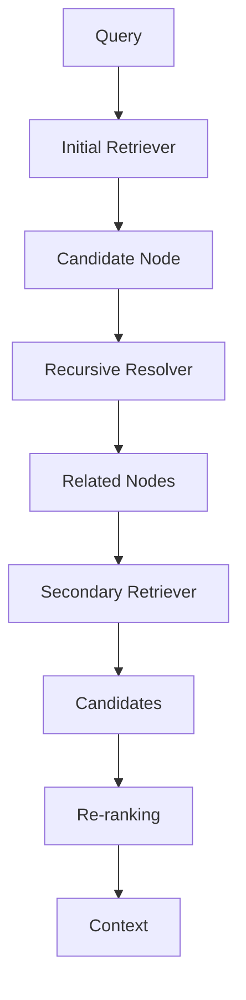

This is more powerful than simple parent expansion.

---

# 86. Recursive Retriever + Router

A router can decide:

```text
Which retriever should perform initial retrieval?
```

Recursive retrieval can decide:

```text
Which referenced node should be followed?
```

Combined:

```text
Query
 ↓
Router
 ↓
Retriever
 ↓
Node
 ↓
Recursive Traversal
 ↓
Additional Retrieval
```

This creates two levels of retrieval orchestration.

---

# 87. Recursive Retriever + Query Fusion

Another architecture:

```text
Query
 ↓
Query Fusion
 ↓
Multiple Initial Candidates
 ↓
Recursive Expansion
 ↓
Fusion
 ↓
Re-ranking
```

This can increase recall substantially, but should be used only when the additional complexity is justified.

---

# 88. Production Recursive Retrieval Pipeline

A mature pipeline might look like:

```text
User Query
    ↓
Authentication
    ↓
Authorization
    ↓
Query Processing
    ↓
Initial Retrieval
    ↓
Candidate Nodes
    ↓
Reference Resolution
    ↓
Recursive Expansion
    ↓
Tenant / Security Validation
    ↓
Deduplication
    ↓
Re-ranking
    ↓
Context Compression
    ↓
Context Selection
    ↓
Prompt Assembly
    ↓
LLM
    ↓
Response Validation
    ↓
Citation
```

Recursive retrieval is therefore one stage inside a larger RAG system.

---

# 89. Production Configuration

A conceptual configuration might look like:

```yaml
retrieval:
  strategy: recursive

  initial:
    strategy: vector
    top_k: 10

  recursive:
    max_depth: 2
    max_nodes: 30

    allowed_reference_types:
      - parent
      - source
      - table

  reranking:
    enabled: true
    top_k: 8

  context:
    max_tokens: 6000

  security:
    tenant_isolation: true
```

These values are illustrative.

They should be calibrated through evaluation.

---

# 90. Framework-Agnostic Abstraction

A production application can expose:

```python
class RecursiveRetriever:

    def retrieve(
        self,
        query: str
    ):
        raise NotImplementedError
```

LlamaIndex can be an adapter:

```python
class LlamaIndexRecursiveRetriever(
    RecursiveRetriever
):

    def __init__(self, retriever):
        self.retriever = retriever

    def retrieve(self, query):
        return self.retriever.retrieve(query)
```

The application should not depend directly on LlamaIndex internals.

---

# 91. Capability-Based Retrieval Architecture

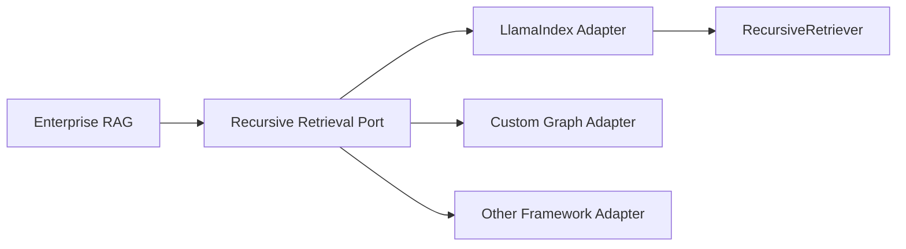

This follows a Ports & Adapters architecture.

---

# 92. Retriever Factory

A retrieval factory can expose:

```python
class RetrieverType:
    VECTOR = "vector"
    BM25 = "bm25"
    DOCUMENT_SUMMARY = "document_summary"
    RECURSIVE = "recursive"
    HYBRID = "hybrid"
```

Then:

```python
def create_retriever(
    retriever_type,
    config
):

    if retriever_type == "recursive":
        return RecursiveRetrieverAdapter(config)

    ...
```

This keeps retrieval strategy selection centralized.

---

# 93. Indexing Pipeline for Recursive Retrieval

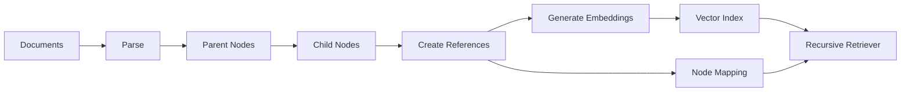

The important difference from normal vector indexing is:

```text
Node Relationships
```

must also be constructed and maintained.

---

# 94. Reference-Aware Ingestion

The ingestion pipeline should create:

```text
Node ID
Parent ID
Reference Type
Source Document
Metadata
```

Example:

```json
{
  "node_id": "child-17",
  "parent_id": "section-4",
  "reference_type": "parent",
  "document_id": "payment-001"
}
```

This becomes the foundation for recursive traversal.

---

# 95. Reference Graph Validation

Before publishing an index:

```text
☐ All node IDs unique
☐ All references resolvable
☐ No unintended cycles
☐ Parent-child relationships valid
☐ Tenant boundaries valid
☐ Version relationships valid
☐ Source metadata preserved
```

This should be part of the index quality gate.

---

# 96. Index Versioning

Recursive retrieval requires versioning not only the vectors but also the relationships.

Track:

```text
Index Version
Node Version
Embedding Version
Chunking Version
Reference Graph Version
Summary Version
```

A vector index can be correct while the reference graph is stale.

---

# 97. Reference Graph Freshness

Example:

```text
Document V4
 ↓
Parent V4
 ↓
Child V4
```

but reference graph still contains:

```text
Child V4 → Parent V3
```

This can produce incorrect context.

Therefore:

```text
Reference Graph
```

should be updated atomically or through a controlled publication process.

---

# 98. Blue-Green Recursive Index

```text
Recursive Index V1
       ↓
ACTIVE

Recursive Index V2
       ↓
CANDIDATE
```

Validate:

```text
Vector Search
+
Node References
+
Recursive Traversal
```

before switching production traffic.

---

# 99. Retrieval Failure Modes

### Failure 1

Correct child retrieved, parent missing.

Possible cause:

```text
Broken Reference
```

### Failure 2

Correct parent retrieved, unrelated children included.

Possible cause:

```text
Over-expansion
```

### Failure 3

Retrieval loops.

Possible cause:

```text
Cycle
```

### Failure 4

Wrong tenant data returned.

Possible cause:

```text
Reference Security Failure
```

---

# 100. Debugging Recursive Retrieval

Inspect the complete path:

```text
Query
 ↓
Initial Result
 ↓
Reference
 ↓
Expanded Node
 ↓
Reference
 ↓
Final Node
```

For each step capture:

```text
Node ID
Score
Reference Type
Depth
Source
Tenant
```

This makes recursive retrieval much easier to debug.

---

# 101. Retrieval Trace Example

```json
{
  "query": "How are OAuth tokens validated?",
  "steps": [
    {
      "node": "child-42",
      "depth": 0,
      "score": 0.91
    },
    {
      "node": "section-8",
      "depth": 1,
      "reference": "parent"
    }
  ]
}
```

This provides a clear retrieval explanation.

---

# 102. Recursive Retrieval Observability Dashboard

```text
Recursive Retrieval
────────────────────────────
Initial Recall       91%
Expansion Rate       2.4
Average Depth        1.3
Max Depth            2
Duplicate Rate       8%
Cycle Rate           0.01%
P95 Latency          145 ms
Context Tokens       4,200
```

These metrics are illustrative.

---

# 103. Cost Optimization

Reduce recursive cost through:

```text
Depth Limits
Reference Filtering
Top-K Limits
Node Deduplication
Caching
Parallel Resolution
Early Stopping
Re-ranking
```

Do not expand every reference automatically.

---

# 104. Early Stopping

Suppose the system already has:

```text
5 highly relevant evidence nodes
```

and the context budget is nearly full.

Additional recursive expansion may not be useful.

Conceptually:

```text
Enough Evidence?
      ↓
    Yes
      ↓
Stop Expansion
```

This is especially useful in agentic retrieval.

---

# 105. Caching References

If many queries repeatedly resolve:

```text
Child-42 → Parent-8
```

the mapping can be cached.

```text
Reference
 ↓
Cache
 ↓
Parent Node
```

Cache invalidation must account for:

```text
Index Version
Node Version
Tenant
Authorization Context
```

---

# 106. Recursive Retrieval and Context Compression

Recursive expansion can produce large parent nodes.

A compression stage can follow:

```text
Parent Node
 ↓
Contextual Compression
 ↓
Relevant Passage
```

This provides:

```text
Small Retrieval Unit
+
Large Context Recovery
+
Final Compression
```

---

# 107. Small-to-Big + Compression

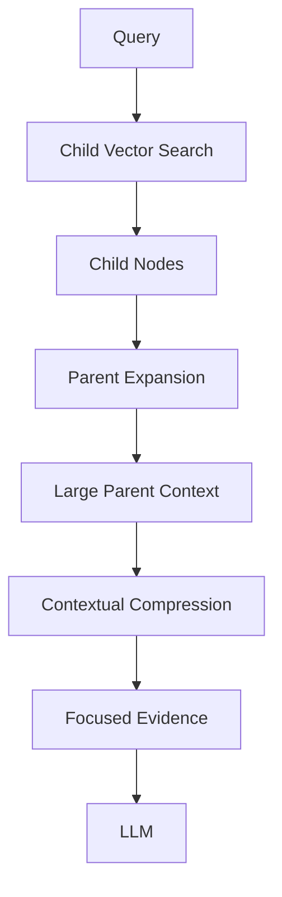

This is a strong enterprise pattern.

---

# 108. Recursive Retrieval and Citations

When a child retrieves a parent, preserve:

```text
Original Child
+
Expanded Parent
+
Source Document
+
Page / Section
```

The final citation should point to the authoritative source location.

Do not cite a generated summary when the answer was derived from the original source.

---

# 109. Recursive Retrieval and Response Validation

A response validation layer can verify:

```text
Answer Claims
      ↓
Retrieved Evidence
      ↓
Source Coverage
```

This becomes particularly important when recursive expansion retrieves context from multiple related nodes.

---

# 110. Recursive Retrieval and Enterprise Response

The final enterprise response can contain:

```text
Answer
Sources
Confidence
Document
Section
Page
```

Example:

```text
OAuth tokens are validated by the authorization
service before the payment request is processed.

Source:
Payment Architecture
Section: Authentication
Page: 18
```

The exact response format belongs to the application layer.

---

# 111. Common Anti-Patterns

## Anti-Pattern 1 — Recursive Everything

```text
Retrieve Node
 ↓
Follow Every Reference
 ↓
Follow Every Reference
 ↓
...
```

This causes:

```text
Context Explosion
Latency
Cost
Noise
```

---

# 112. Common Anti-Patterns — Continued

## Anti-Pattern 2 — No Reference Validation

Broken references can produce:

```text
Missing Context
Incorrect Context
Runtime Errors
```

---

## Anti-Pattern 3 — No Cycle Protection

A graph can contain cycles.

Always protect recursive traversal.

---

# 113. Common Anti-Patterns — Continued

## Anti-Pattern 4 — Returning Only the Parent

Parent expansion can restore context, but the exact child passage may still be important.

A better strategy may preserve:

```text
Child
+
Parent
```

depending on the response and context strategy.

---

## Anti-Pattern 5 — Ignoring Tenant Boundaries

References must not bypass authorization.

---

# 114. Common Anti-Patterns — Continued

## Anti-Pattern 6 — Treating Recursive Retrieval as Generation

Recursive retrieval finds and expands evidence.

It does not replace:

```text
Prompt Assembly
LLM Generation
Response Validation
Citation
```

---

## Anti-Pattern 7 — No Evaluation

Always compare:

```text
Vector Only
vs
Vector + Recursive
```

using a representative evaluation set.

---

# 115. Production Checklist

```text
☐ Define node hierarchy
☐ Define reference types
☐ Define canonical source nodes
☐ Define initial retriever
☐ Build node mappings
☐ Validate references
☐ Detect cycles
☐ Define maximum depth
☐ Define maximum expanded nodes
☐ Define reference-type filters
☐ Implement deduplication
☐ Preserve provenance
☐ Enforce tenant isolation
☐ Version the reference graph
☐ Measure initial Recall@K
☐ Measure recursive Recall@K
☐ Measure context precision
☐ Measure latency
☐ Measure token usage
☐ Add retrieval tracing
☐ Add failure handling
☐ Implement caching where useful
☐ Add re-ranking
☐ Add context compression
☐ Test deletion/update behavior
☐ Test rollback
```

---

# 116. Key Takeaways

- Recursive retrieval follows relationships between retrieved nodes.
- It extends normal retrieval from a flat result list into a connected node graph.
- LlamaIndex provides `RecursiveRetriever` for this pattern. :contentReference[oaicite:6]{index=6}
- Node references are the foundation of recursive retrieval.
- `retriever_dict` and node mappings are central concepts in LlamaIndex's recursive retrieval architecture. :contentReference[oaicite:7]{index=7}
- Small-to-big retrieval is one of the most important recursive retrieval patterns.
- Small child chunks provide precise retrieval signals.
- Parent nodes provide broader context for synthesis.
- Recursive retrieval can decouple retrieval representation from generation evidence.
- Summaries can point to source nodes.
- Generated questions can point to source nodes.
- Tables can be represented as separate nodes and reached through references.
- Recursive retrieval can work with heterogeneous document representations.
- Recursive retrieval can be combined with document agents for more advanced document-level reasoning. :contentReference[oaicite:8]{index=8}
- Recursive retrieval is different from router retrieval.
- Router retrieval chooses among retrievers; recursive retrieval follows node relationships. :contentReference[oaicite:9]{index=9}
- Recursive retrieval is different from multi-query retrieval.
- Recursive retrieval can be combined with vector, BM25, hybrid, multi-query, MMR, and re-ranking strategies.
- Recursive traversal should have explicit depth and expansion limits.
- Cycle detection is essential for graph-like node structures.
- Reference integrity is as important as vector index quality.
- Node references must respect tenant and authorization boundaries.
- Recursive retrieval can introduce significant context expansion.
- Deduplication is important when multiple nodes reference the same parent.
- Re-ranking and contextual compression can control recursive expansion.
- Retrieval traces should record node IDs, depth, reference paths, and expansion behavior.
- Recursive indexes require versioning of both vectors and node relationships.
- Document changes must update the reference graph consistently.
- Recursive retrieval should be evaluated independently from generation.
- Stage-one retrieval recall remains important because recursive expansion cannot recover a completely missed candidate.
- Recursive retrieval is best understood as a **retrieval graph traversal capability**, not merely a parent-child lookup.

The central architecture is:

```text
                         USER QUERY
                              │
                              ▼
                      Initial Retriever
                              │
                              ▼
                       Candidate Node
                              │
                              ▼
                    Reference Resolution
                              │
                    ┌─────────┼─────────┐
                    ▼         ▼         ▼
                 Parent     Summary    Table
                    │         │         │
                    └─────────┼─────────┘
                              ▼
                      Expanded Evidence
                              │
                              ▼
                         Deduplication
                              │
                              ▼
                          Re-ranking
                              │
                              ▼
                      Context Selection
                              │
                              ▼
                             LLM
                              │
                              ▼
                    Validated Response
                              │
                              ▼
                          Citations
```

> **Recursive retrieval separates the question of “what should be retrieved?” from “what context should ultimately be given to the LLM?” — enabling precise retrieval representations to resolve into richer, authoritative source context.**

---

# 🧭 Chapter Navigation

### Part V — Advanced Retrieval-Augmented Generation

**Previous:**  
[05. Document Summary Retriever](05-document-summary-retriever.md)

**Next:**  
[07. Query Fusion Retriever](07-query-fusion-retriever.md)

**Section:**  
03 — LlamaIndex Retrieval Engineering

### LlamaIndex Retrieval Engineering Path

```text
01 LlamaIndex Retrievers Overview
              ↓
02 LlamaIndex Indexes
              ↓
03 Vector Index Retriever
              ↓
04 BM25 Retriever
              ↓
05 Document Summary Retriever
              ↓
06 Recursive Retriever
              ↓
07 Query Fusion Retriever
              ↓
08 Auto-Merging Retriever
              ↓
04 Vector Search Engineering
```

---

> **Enterprise AI Engineering Handbook**  
> *Building Production-Grade Enterprise AI Systems — One Chapter at a Time.*