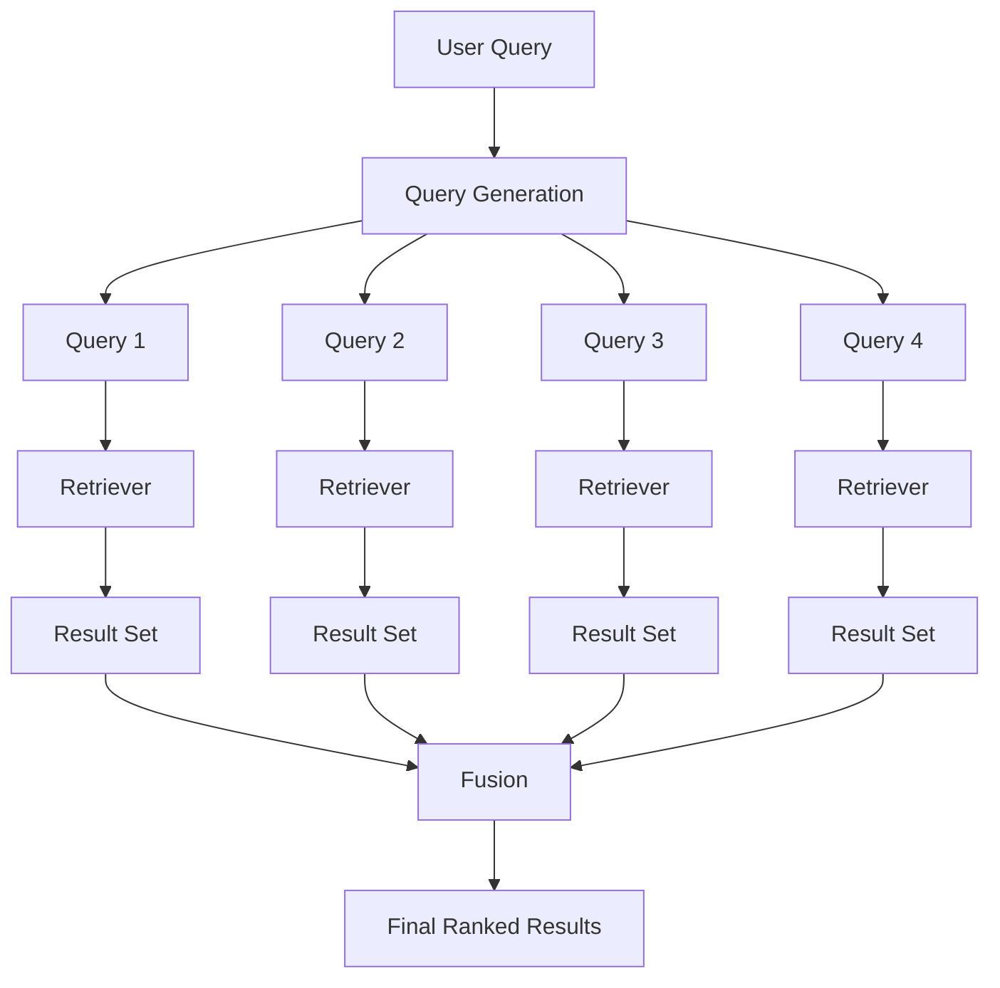
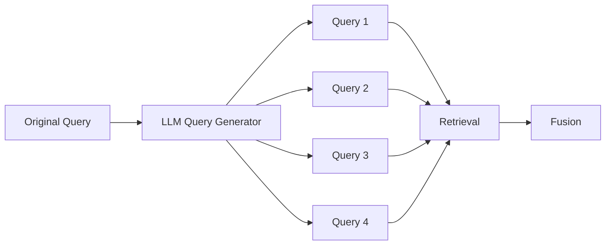
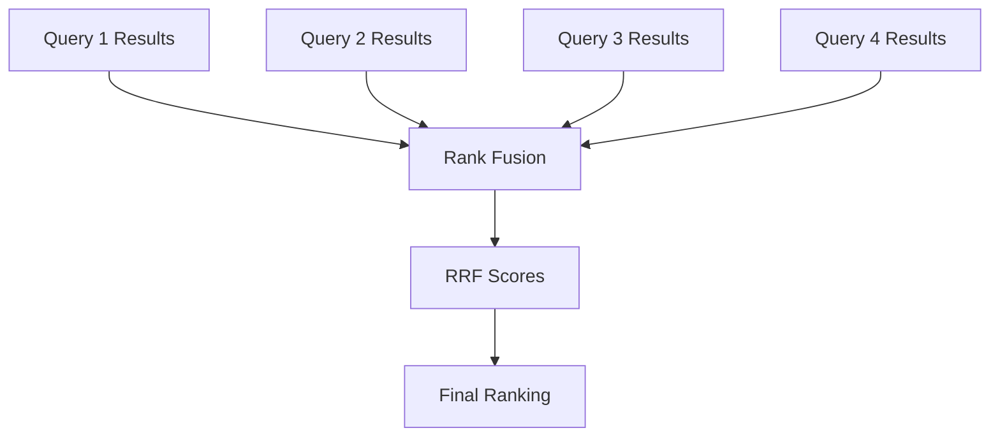
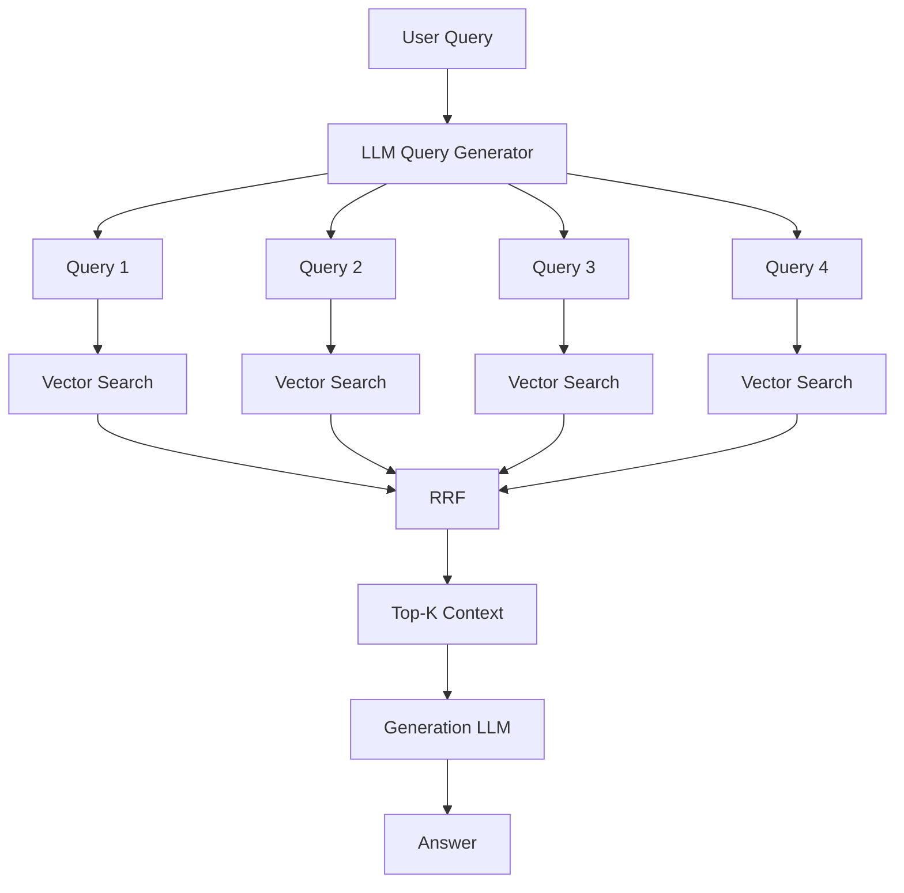
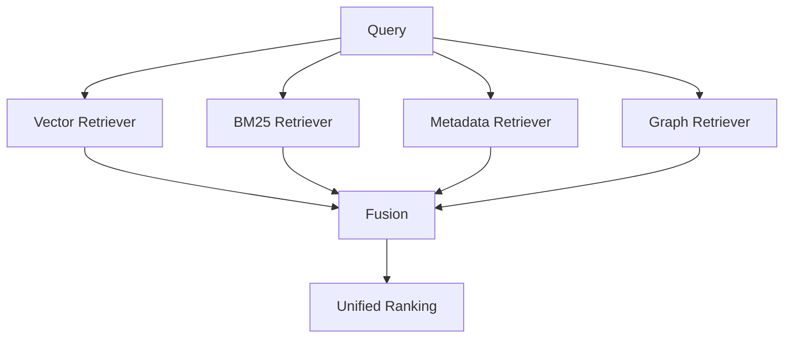
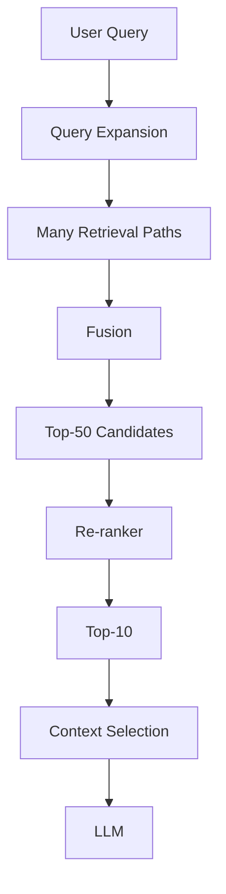
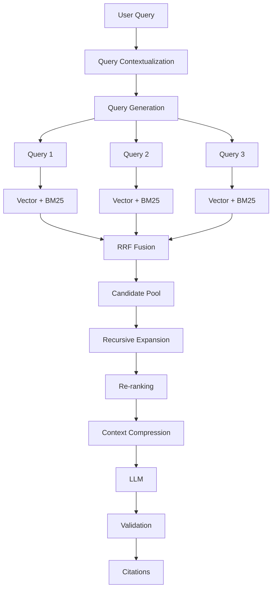
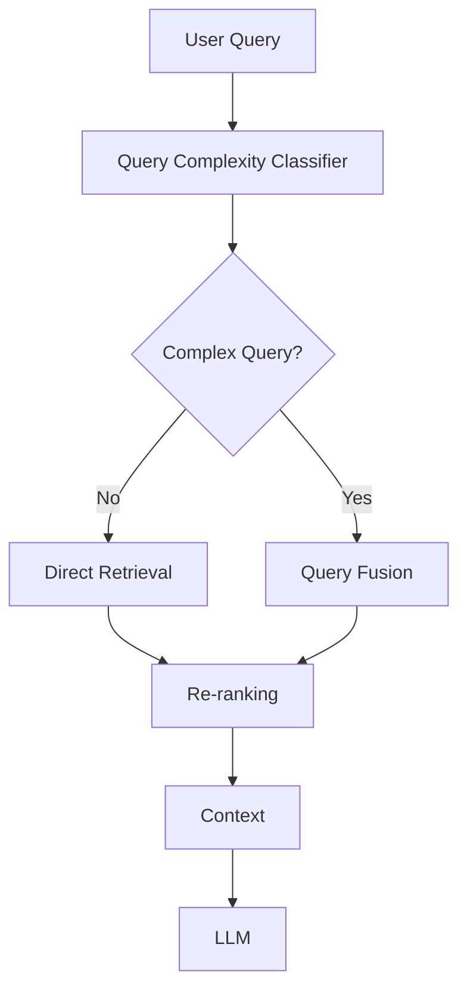
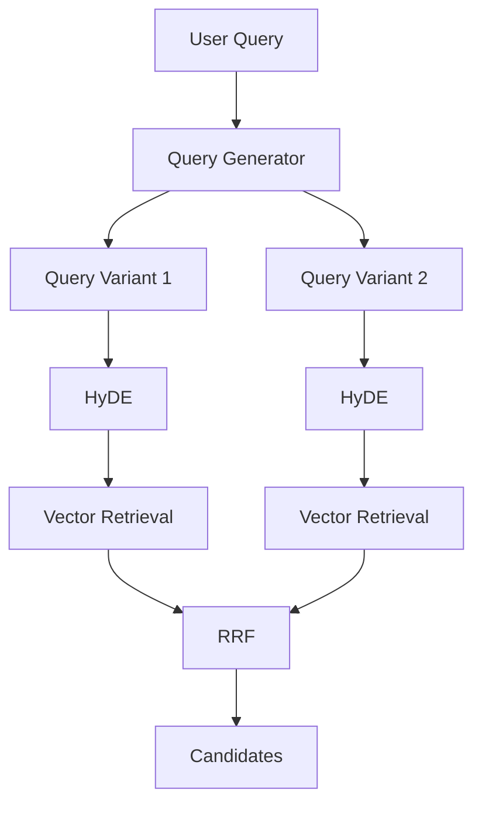
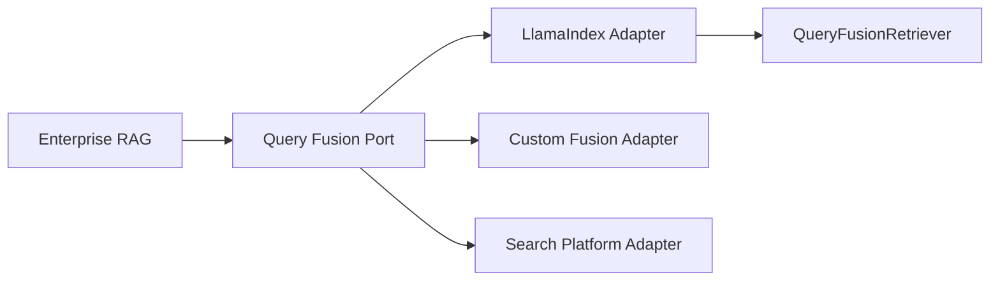

# Query Fusion Retriever

## 📖 Overview

A **Query Fusion Retriever** improves retrieval by generating or using multiple search perspectives for the same user question, retrieving candidates from those queries, and then combining the results into a single ranked result set.

Instead of relying on one retrieval path:

```text
User Query
    ↓
One Retriever
    ↓
Top-K Results
```

Query fusion follows:

```text
                         User Query
                              │
                              ▼
                       Query Generation
                              │
                ┌─────────────┼─────────────┐
                ▼             ▼             ▼
             Query 1       Query 2       Query 3
                │             │             │
                ▼             ▼             ▼
             Retrieve      Retrieve      Retrieve
                │             │             │
                └─────────────┼─────────────┘
                              ▼
                       Result Fusion
                              │
                              ▼
                         Final Top-K
```

LlamaIndex provides `QueryFusionRetriever`, which can combine multiple retrievers and optionally generate additional query variations. Its current API supports fusion modes including simple fusion, reciprocal-rank fusion, relative-score fusion, and distribution-based score fusion. :contentReference[oaicite:0]{index=0}

This makes Query Fusion an important building block for advanced RAG architectures where a single query representation may not adequately capture all relevant information.

---

# 🎯 Learning Objectives

After completing this chapter, you will be able to:

- Understand Query Fusion Retrieval
- Understand why a single query can produce incomplete retrieval
- Understand multi-query retrieval
- Understand query generation
- Understand query diversification
- Understand result-set fusion
- Understand Reciprocal Rank Fusion
- Understand score-based fusion
- Understand LlamaIndex `QueryFusionRetriever`
- Combine vector and keyword retrievers
- Build RAG-Fusion style pipelines
- Understand query expansion vs query fusion
- Understand how fusion improves recall
- Understand the limitations of query fusion
- Evaluate fused retrieval systems
- Optimize query count and retrieval depth
- Design production Query Fusion architectures

---

# 1. The Problem with Single-Query Retrieval

A traditional RAG system often performs:

```text
User Query
     ↓
Embedding
     ↓
Vector Search
     ↓
Top-K Chunks
```

This works well when the user's query closely matches the language used in the source documents.

But users may ask:

```text
"How can we make our payment platform
more resilient during Kafka failures?"
```

while the documentation says:

```text
"Event processing disaster recovery"
```

or:

```text
"Kafka consumer failure handling"
```

or:

```text
"Transaction processing fault tolerance"
```

A single embedding search may not retrieve all relevant perspectives.

---

# 2. Query Fusion

Query fusion introduces multiple retrieval perspectives:

```text
Original Query
     ↓
Query Variations
     │
     ├── Semantic Perspective
     ├── Technical Perspective
     ├── Business Perspective
     └── Alternative Wording
```

Each query retrieves independently.

Then:

```text
Multiple Result Sets
        ↓
      Fusion
        ↓
   Final Ranking
```

---

# 3. Basic Architecture



The important idea is:

```text
Query Diversity
+
Result Fusion
```

---

# 4. Query Fusion vs Multi-Query Retrieval

These terms are often used interchangeably, but there is a useful distinction.

### Multi-Query Retrieval

Focuses on:

```text
Generate Multiple Queries
```

### Query Fusion

Focuses on:

```text
Generate / use Multiple Queries
+
Retrieve Results
+
Combine Results
```

Therefore:

```text
Multi-Query
=
Query Expansion

Query Fusion
=
Query Expansion + Result Aggregation
```

---

# 5. Query Fusion Mental Model

Think of the system as asking several search specialists:

```text
Specialist A:
"What concepts are semantically related?"

Specialist B:
"What exact technical terminology is relevant?"

Specialist C:
"What alternative wording might appear?"

Specialist D:
"What business terminology could describe this?"
```

Then:

```text
All Specialists
      ↓
Candidate Pool
      ↓
Ranking
```

---

# 6. Why Multiple Queries Help

Consider:

```text
Query:
"How do we recover failed payment events?"
```

Possible generated queries:

```text
1. Payment event failure recovery

2. Kafka payment consumer recovery

3. Transaction event retry strategy

4. Payment event disaster recovery
```

Different queries may retrieve different documents.

---

# 7. Query Diversity

The goal is not:

```text
Query 1
=
Query 2
=
Query 3
```

The goal is:

```text
Query 1 ≠ Query 2 ≠ Query 3
```

while maintaining:

```text
Same Information Need
```

This creates a balance:

```text
Diversity
+
Relevance
```

---

# 8. Query Generation

An LLM can generate alternative queries.

Conceptual prompt:

```text
Generate alternative search queries for the
following information need.

Original question:
{query}

Generate diverse queries that preserve the
original intent while using different wording,
technical terminology, and perspectives.
```

For example:

```text
Original:
"How does our payment system recover from
Kafka failures?"
```

Generated:

```text
Kafka failure recovery in payment processing
Payment event retry mechanisms
Kafka consumer fault tolerance
Payment event disaster recovery
```

---

# 9. Query Generation Pipeline



The query-generation LLM is therefore used before the retrieval stage.

---

# 10. LlamaIndex QueryFusionRetriever

LlamaIndex exposes:

```python
from llama_index.core.retrievers import QueryFusionRetriever
```

A basic configuration can combine retrievers:

```python
retriever = QueryFusionRetriever(
    [vector_retriever, bm25_retriever],
    similarity_top_k=5,
    num_queries=4,
    mode="reciprocal_rerank",
    use_async=True,
    verbose=True,
)
```

LlamaIndex's documented examples use this pattern to combine a vector retriever and BM25 retriever while generating multiple queries. :contentReference[oaicite:1]{index=1}

---

# 11. What Does `num_queries` Mean?

Conceptually:

```python
num_queries=4
```

means the fusion retriever operates with multiple query variants.

LlamaIndex's implementation starts with the original query and can generate additional queries when `num_queries > 1`; setting it to `1` disables query generation in the documented examples. :contentReference[oaicite:2]{index=2}

Therefore:

```text
num_queries = 1
```

can represent:

```text
Original Query Only
```

while:

```text
num_queries > 1
```

enables query expansion.

---

# 12. Query Generation Example

Original:

```text
How does the payment platform handle
failed transactions?
```

Possible generated queries:

```text
Query 1:
Payment transaction failure handling

Query 2:
Failed payment retry mechanisms

Query 3:
Payment transaction recovery architecture

Query 4:
Payment failure fault tolerance
```

Each query can retrieve a different candidate set.

---

# 13. Independent Retrieval

Suppose:

```text
Query 1 → A, B, C

Query 2 → B, C, D

Query 3 → C, D, E

Query 4 → A, C, E
```

The system now has:

```text
A
B
C
D
E
```

with different ranking positions across result sets.

Fusion determines:

```text
Which nodes deserve the highest final rank?
```

---

# 14. Result Fusion

Conceptually:

```text
Result Set 1
       +
Result Set 2
       +
Result Set 3
       +
Result Set 4
       ↓
Candidate Pool
       ↓
Score / Rank Aggregation
       ↓
Final Ranking
```

This is the core operation.

---

# 15. Why Rank Fusion?

Different retrievers may produce incompatible scores.

For example:

```text
Vector Search:

A = 0.92
B = 0.87
C = 0.82
```

BM25:

```text
A = 14.8
B = 9.7
C = 7.2
```

These scores cannot safely be combined directly without normalization.

Rank-based fusion avoids depending heavily on raw score scales.

---

# 16. Reciprocal Rank Fusion

One of the most important fusion methods is:

```text
Reciprocal Rank Fusion
```

The basic idea is:

```text
Higher Rank
    ↓
Higher Contribution
```

A commonly used formulation is:

\[
RRF(d) = \sum_{r \in R} \frac{1}{k + rank_r(d)}
\]

where:

```text
d
=
Document / Node

R
=
Result lists

rank_r(d)
=
Rank of d in result list r

k
=
Constant controlling rank impact
```

LlamaIndex's implementation uses `k = 60` for its reciprocal rank fusion implementation. :contentReference[oaicite:3]{index=3}

---

# 17. RRF Example

Suppose:

```text
Document A
```

appears:

```text
Rank 1 in Query 1
Rank 3 in Query 2
Rank 2 in Query 3
```

Using:

```text
k = 60
```

its RRF contribution is:

\[
\frac{1}{60+1}
+
\frac{1}{60+3}
+
\frac{1}{60+2}
\]

So:

\[
RRF(A)
=
\frac{1}{61}
+
\frac{1}{63}
+
\frac{1}{62}
\]

The exact score is less important than the principle:

```text
Repeatedly high-ranked documents
receive strong fused scores.
```

---

# 18. Why RRF Works

Imagine:

```text
Query 1:
A
B
C

Query 2:
B
D
A

Query 3:
A
B
E
```

Document:

```text
A
```

appears near the top repeatedly.

Document:

```text
C
```

appears only once.

RRF naturally favors:

```text
A
```

because it consistently ranks well.

---

# 19. RRF Visualization



The important property is:

```text
Multiple Ranking Signals
        ↓
One Unified Ranking
```

---

# 20. LlamaIndex Fusion Modes

The current `QueryFusionRetriever` implementation supports:

```text
simple
reciprocal_rank
relative_score
dist_based_score
```

The exact enum/string representation depends on the installed version. :contentReference[oaicite:4]{index=4}

The commonly used mode in LlamaIndex examples is:

```python
mode="reciprocal_rerank"
```

which corresponds to reciprocal-rank fusion in the example APIs. :contentReference[oaicite:5]{index=5}

---

# 21. Simple Fusion

Simple fusion can be thought of as:

```text
Collect Results
 ↓
Merge
 ↓
Deduplicate
 ↓
Return Top-K
```

It is straightforward but does not exploit ranking information as deeply as RRF.

Use it when:

```text
Simplicity
+
Low complexity
```

are more important than sophisticated rank aggregation.

---

# 22. Relative Score Fusion

Relative score fusion attempts to combine scores after accounting for differences in score distributions.

Conceptually:

```text
Retriever A Scores
       ↓
Normalize / Adjust
       ↓
Retriever B Scores
       ↓
Normalize / Adjust
       ↓
Combined Score
```

This can be useful when score information is meaningful but raw score scales differ.

---

# 23. Distribution-Based Fusion

A distribution-based approach considers the distribution of scores from each result set rather than treating raw scores as directly comparable.

Conceptually:

```text
Result Distribution
       ↓
Score Transformation
       ↓
Normalized Signal
       ↓
Fusion
```

LlamaIndex exposes a distribution-based score option through its fusion implementation. :contentReference[oaicite:6]{index=6}

---

# 24. Query Fusion with One Retriever

Query fusion does not require multiple retrieval technologies.

You can have:

```text
Query 1
 ↓
Vector Retriever

Query 2
 ↓
Vector Retriever

Query 3
 ↓
Vector Retriever
```

and then fuse:

```text
Results
 ↓
RRF
```

This is essentially:

```text
RAG-Fusion
```

---

# 25. RAG-Fusion

A common RAG-Fusion architecture is:

```text
Original Query
      ↓
Generate Multiple Queries
      ↓
Retrieve for Each Query
      ↓
Reciprocal Rank Fusion
      ↓
Top Results
      ↓
LLM
```

The RAG-Fusion approach combines query generation with reciprocal-rank-based result fusion. :contentReference[oaicite:7]{index=7}

---

# 26. RAG-Fusion Architecture



---

# 27. Query Fusion vs Hybrid Search

These concepts are related but different.

### Hybrid Search

Combines different retrieval mechanisms:

```text
Vector
+
BM25
```

### Query Fusion

Combines:

```text
Multiple Queries
+
Multiple Result Lists
```

You can combine both.

---

# 28. Hybrid Query Fusion

```text
Query
 ↓
Generate Variants
 ↓
 ┌───────────────────────────┐
 │                           │
 ▼                           ▼
Vector Search               BM25
 │                           │
 └─────────────┬─────────────┘
               ▼
          Fusion / RRF
               ↓
         Final Results
```

This is much more powerful than either technique alone.

---

# 29. Vector + BM25 + Query Expansion

Suppose:

```text
4 generated queries
```

and:

```text
2 retrievers
```

Then conceptually:

```text
4 × 2 = 8 retrieval paths
```

Example:

```text
Query 1 → Vector + BM25
Query 2 → Vector + BM25
Query 3 → Vector + BM25
Query 4 → Vector + BM25
```

The resulting candidates can be fused into one ranked set.

---

# 30. Why This Improves Recall

Vector search is good at:

```text
Semantic similarity
```

BM25 is good at:

```text
Exact terms
Identifiers
Rare keywords
Technical names
```

Multiple query variants improve:

```text
Query coverage
```

Therefore:

```text
Semantic Diversity
+
Lexical Diversity
+
Query Diversity
```

can significantly improve candidate recall.

---

# 31. Example: Enterprise Query

User:

```text
"What controls prevent duplicate payment
transactions?"
```

Generated queries:

```text
Duplicate payment transaction prevention
Payment idempotency controls
Duplicate transaction detection
Payment request deduplication
```

Vector retrieval may discover:

```text
Idempotency Architecture
```

BM25 may discover:

```text
Payment Idempotency Key
```

Fusion combines them.

---

# 32. Query Diversity Strategies

Generated queries can vary by:

### Terminology

```text
payment failure
transaction failure
payment processing error
```

### Perspective

```text
technical
business
operational
security
```

### Granularity

```text
high-level architecture
specific implementation
operational procedure
```

### Retrieval vocabulary

```text
domain terms
abbreviations
synonyms
system names
```

---

# 33. Query Generation Prompt

A stronger prompt can explicitly request diversity:

```text
Generate 4 search queries for the information
need below.

Requirements:

1. Preserve the original intent.
2. Use different terminology.
3. Include technical synonyms.
4. Include domain-specific terminology.
5. Vary the level of abstraction.
6. Avoid duplicate queries.

Original question:
{query}
```

This is often better than simply:

```text
"Generate similar questions."
```

---

# 34. Query Generation Failure

Bad query generation:

```text
Original:
How does Kafka consumer recovery work?

Generated:
How does Kafka consumer recovery work?
Kafka consumer recovery process
Kafka consumer recovery mechanism
Kafka consumer recovery architecture
```

These queries have:

```text
Low Diversity
```

and provide limited additional retrieval value.

---

# 35. Better Query Diversity

```text
Kafka consumer recovery

Kafka consumer rebalance after failure

Kafka offset recovery strategy

Event processing fault tolerance
```

These queries cover:

```text
Exact Topic
Operational Behavior
Implementation Detail
Broader Concept
```

---

# 36. Query Drift

Query generation can also introduce unrelated concepts.

Original:

```text
How does payment failure recovery work?
```

Bad generated query:

```text
How do payment fraud detection systems work?
```

Now retrieval may drift toward:

```text
Fraud
```

instead of:

```text
Failure Recovery
```

Therefore query generation must preserve intent.

---

# 37. Query Drift Control

Use constraints:

```text
Preserve intent
Preserve domain
Do not introduce new entities
Do not introduce unrelated concepts
```

A generated query should be:

```text
Different wording
```

not:

```text
Different question
```

---

# 38. Query Validation

A production system can validate generated queries.

```text
Original Query
      ↓
Generate Variants
      ↓
Validate Relevance
      ↓
Remove Drifted Queries
      ↓
Retrieve
```

Validation can use:

```text
Embedding similarity
LLM classifier
Rule-based checks
Domain vocabulary
```

---

# 39. Query Count

More queries do not automatically mean better retrieval.

Consider:

```text
1 Query
 ↓
Low Cost

4 Queries
 ↓
Higher Recall

10 Queries
 ↓
Potentially More Noise + Cost
```

The optimal value should be determined experimentally.

---

# 40. Query Count Trade-Off

```text
Query Count
     ↑
     │
Recall ──────────────╮
                     │
                     ╰────
Cost ────────────────╮
                     ╰──────────
```

At some point:

```text
Marginal Recall Gain
<
Marginal Cost
```

That is where additional query generation becomes unattractive.

---

# 41. Query Fusion Latency

Without asynchronous retrieval:

```text
Query 1 → Search
Query 2 → Search
Query 3 → Search
Query 4 → Search
```

Potentially:

```text
Latency ≈ Q1 + Q2 + Q3 + Q4
```

With parallel execution:

```text
Q1 ──┐
Q2 ──┤
Q3 ──┼──→ Fusion
Q4 ──┘
```

Potentially:

```text
Latency ≈ max(Q1,Q2,Q3,Q4)
```

plus fusion overhead.

LlamaIndex's documented `QueryFusionRetriever` supports asynchronous execution through `use_async`. :contentReference[oaicite:8]{index=8}

---

# 42. Async Query Fusion

Conceptually:

```python
retriever = QueryFusionRetriever(
    retrievers,
    num_queries=4,
    use_async=True
)
```

This allows retrieval work to be executed asynchronously where supported.

Production behavior still depends on:

```text
Retriever implementation
Network
Vector database
Concurrency limits
LLM provider
```

---

# 43. Fusion with Different Retrievers

Example:

```text
Vector Retriever
BM25 Retriever
Metadata Retriever
Graph Retriever
```

Then:

```text
Query
 ↓
All Retrievers
 ↓
Multiple Result Sets
 ↓
Fusion
 ↓
Top-K
```

This is a strong enterprise retrieval architecture.

---

# 44. Multi-Retriever Fusion



Each retriever contributes a different retrieval signal.

---

# 45. Why Fuse Different Retrievers?

Because each retriever has different strengths.

| Retriever | Strength |
|---|---|
| Vector | Semantic similarity |
| BM25 | Exact terms |
| Metadata | Structured constraints |
| Graph | Relationships |
| Summary | Document-level routing |

Fusion can combine these signals.

---

# 46. Fusion Is Not the Same as Re-ranking

This distinction is important.

### Fusion

Combines multiple result lists:

```text
Results A
+
Results B
+
Results C
 ↓
Fusion
```

### Re-ranking

Usually takes a candidate set and evaluates each candidate against the query:

```text
Candidates
 ↓
Cross Encoder / LLM
 ↓
New Ranking
```

Therefore:

```text
Fusion
=
Aggregate retrieval signals

Re-ranking
=
Evaluate candidate relevance
```

---

# 47. Fusion + Re-ranking

A strong architecture:

```text
Query
 ↓
Query Expansion
 ↓
Vector + BM25
 ↓
RRF
 ↓
Top-50 Candidates
 ↓
Cross-Encoder
 ↓
Top-10
```

This is a common advanced retrieval pattern.

---

# 48. Candidate Funnel



The principle is:

```text
Broad Candidate Generation
        ↓
Aggressive Ranking
```

---

# 49. Fusion + MMR

After fusion, results may still be redundant.

Example:

```text
A1
A2
A3
A4
```

all contain nearly identical information.

MMR can improve diversity:

```text
Fused Candidates
 ↓
MMR
 ↓
Diverse Evidence
```

---

# 50. Fusion + MMR Architecture

```text
Multiple Queries
      ↓
Retrieval
      ↓
RRF
      ↓
Candidate Pool
      ↓
MMR
      ↓
Diverse Context
```

This is especially useful for broad questions.

---

# 51. Fusion + Metadata Filtering

A secure architecture should apply authorization filters early.

```text
User Query
 ↓
Tenant / ACL Filter
 ↓
Query Expansion
 ↓
Retrieval
 ↓
Fusion
```

Do not fuse unrestricted results and attempt to remove unauthorized data afterward.

---

# 52. Metadata-Aware Query Fusion

Suppose:

```text
Tenant = ACME
Region = EU
Document Type = Architecture
```

Each retrieval path should respect:

```text
tenant_id = ACME
region = EU
document_type = architecture
```

Then fusion operates only on authorized candidates.

---

# 53. Fusion + Document Summary Retrieval

Query fusion can operate at the document level:

```text
Query 1
 ↓
Document Summary Search

Query 2
 ↓
Document Summary Search

Query 3
 ↓
Document Summary Search
```

Then:

```text
RRF
 ↓
Top Documents
```

This can be followed by chunk retrieval.

---

# 54. Fusion + Recursive Retrieval

Another powerful pattern:

```text
Query Expansion
 ↓
Multiple Initial Results
 ↓
Fusion
 ↓
Recursive Expansion
 ↓
Parent / Table / Source
```

This combines:

```text
Query Diversity
+
Relationship Traversal
```

---

# 55. Advanced Retrieval Architecture



This is the direction toward production RAG retrieval engineering.

---

# 56. Query Fusion and Prompt Assembly

The final prompt should not contain every retrieved result.

Instead:

```text
Fused Candidates
      ↓
Filter
      ↓
Re-rank
      ↓
Select
      ↓
Compress
      ↓
Prompt Assembly
```

This avoids:

```text
Context Overload
```

---

# 57. Context Selection

A production context selector can consider:

```text
Relevance
Diversity
Source Authority
Recency
Token Cost
Document Coverage
```

Example:

```text
Score =
Relevance
+
Authority
+
Diversity
-
Redundancy
```

The exact formula should be calibrated experimentally.

---

# 58. Query Fusion and Source Diversity

Suppose:

```text
Query 1
```

retrieves:

```text
Architecture Guide
```

and:

```text
Query 2
```

retrieves:

```text
Operations Runbook
```

Both may be useful.

Fusion should not accidentally return:

```text
Architecture Guide
Architecture Guide
Architecture Guide
```

while excluding:

```text
Operations Runbook
```

if the question requires operational context.

---

# 59. Fusion and Diversity

This is why:

```text
Fusion
+
MMR
```

can be powerful.

Fusion provides:

```text
Cross-query relevance
```

MMR provides:

```text
Context diversity
```

---

# 60. RRF Score Interpretation

Do not treat RRF scores as:

```text
Probability
```

They are ranking scores.

For example:

```text
0.041
```

does not mean:

```text
4.1% probability of relevance
```

It means the document accumulated a particular fusion score based on its rankings.

---

# 61. Ranking Stability

Fusion can improve ranking stability when a document appears consistently across retrieval paths.

Example:

```text
Query 1 → Rank 2
Query 2 → Rank 4
Query 3 → Rank 1
```

This repeated presence is a strong signal.

---

# 62. Outlier Protection

Suppose:

```text
Document A
```

is:

```text
Rank 1
```

for one query but absent everywhere else.

Another document:

```text
Document B
```

appears:

```text
Rank 3
Rank 4
Rank 2
```

RRF can favor B because it is consistently relevant across query perspectives.

This is one reason rank fusion can be robust against individual retrieval outliers.

---

# 63. RRF Parameter

LlamaIndex's implementation uses:

```text
k = 60
```

for reciprocal-rank fusion. :contentReference[oaicite:9]{index=9}

The parameter controls how strongly rank differences affect the final score.

Conceptually:

```text
Small k
 ↓
Rank differences matter more

Large k
 ↓
Rank differences are dampened
```

Do not assume the default is universally optimal.

---

# 64. RRF Limitations

RRF does not understand:

```text
Semantic meaning
```

directly.

It only aggregates:

```text
Rank positions
```

Therefore a poor query can still contribute noisy candidates.

This makes:

```text
Query Quality
```

important.

---

# 65. Fusion Failure Mode: Bad Query

Suppose generated query:

```text
Payment fraud detection
```

is unrelated to:

```text
Payment failure recovery
```

Its result set may introduce:

```text
Fraud documents
```

into the candidate pool.

Therefore:

```text
Better Fusion
```

cannot fully compensate for:

```text
Bad Query Generation
```

---

# 66. Fusion Failure Mode: Query Collapse

If generated queries are almost identical:

```text
Query 1
Query 2
Query 3
Query 4
```

all retrieve nearly identical results.

Then:

```text
Query Fusion
```

adds little value.

Measure query diversity.

---

# 67. Fusion Failure Mode: Candidate Explosion

Suppose:

```text
8 queries
×
50 results
```

creates:

```text
400 candidate results
```

before deduplication.

Then:

```text
Re-ranking
```

400 candidates can be expensive.

Use:

```text
Reasonable Query Count
+
Controlled Top-K
+
Early Deduplication
```

---

# 68. Candidate Deduplication

Fusion should identify the same underlying node across result sets.

Conceptually:

```text
Query 1 → Node A
Query 2 → Node A
Query 3 → Node A
```

should become:

```text
Node A
```

with an aggregated ranking signal.

The implementation must use a stable identity for the retrieved object.

---

# 69. Stable Node Identity

Recommended identifiers:

```text
node_id
document_id + chunk_id
canonical content ID
```

Avoid deduplicating purely on:

```text
Text similarity
```

because two distinct nodes may legitimately contain similar text.

---

# 70. Fusion and Duplicate Documents

Sometimes different chunks belong to:

```text
Same Document
```

but represent different evidence.

Therefore you may need two levels:

```text
Node Deduplication
```

and:

```text
Document Diversity
```

depending on the application.

---

# 71. Query Fusion Evaluation

Evaluate at least:

```text
Recall@K
Precision@K
MRR
nDCG
Context Recall
Context Precision
Answer Faithfulness
Answer Relevance
Latency
Cost
```

Compare:

```text
Baseline Vector Search
```

against:

```text
Query Fusion
```

and:

```text
Hybrid Query Fusion
```

---

# 72. Retrieval Evaluation Matrix

| System | Recall@10 | Precision@10 | P95 Latency | Cost |
|---|---:|---:|---:|---:|
| Vector | 0.78 | 0.82 | 80 ms | Low |
| Multi-Query | 0.86 | 0.79 | 130 ms | Medium |
| Vector + BM25 + RRF | 0.89 | 0.81 | 110 ms | Medium |
| Query + Hybrid + RRF | 0.93 | 0.80 | 180 ms | Higher |

Values are illustrative.

---

# 73. Measure Marginal Value

Do not ask only:

```text
"Does Query Fusion improve recall?"
```

Ask:

```text
How much recall improvement?
At what cost?
```

For example:

```text
Recall:
+7%

Latency:
+70%

LLM Cost:
+35%
```

The business decision depends on whether the improvement is worth the operational cost.

---

# 74. Adaptive Query Fusion

Not every query needs multiple generated queries.

Simple query:

```text
"What is OAuth?"
```

may not require:

```text
5 query variants
```

Complex query:

```text
"Compare our payment architecture's
Kafka failure recovery strategy with the
disaster recovery policy."
```

may benefit more.

Therefore:

```text
Query Complexity
       ↓
Fusion Decision
```

---

# 75. Adaptive Retrieval Architecture



This can reduce unnecessary query-generation cost.

---

# 76. Query Complexity Signals

Potential signals:

```text
Number of entities
Number of constraints
Comparison language
Temporal requirements
Multi-hop requirements
Ambiguous terminology
Question length
Domain complexity
```

These should be validated rather than assumed.

---

# 77. Query Fusion and Multi-Hop Questions

Consider:

```text
"Which service processes payment events
and how does it recover when Kafka fails?"
```

This contains:

```text
Service identification
+
Failure recovery
```

Multiple queries can expose different parts of the information need.

---

# 78. Query Decomposition vs Query Fusion

These are related but different.

### Query Fusion

```text
Same information need
Different formulations
```

### Query Decomposition

```text
Complex question
 ↓
Sub-question 1
Sub-question 2
```

Example:

```text
"What service processes payment events
and how does it recover from Kafka failures?"
```

decomposes into:

```text
1. Which service processes payment events?
2. How does it recover from Kafka failures?
```

Query fusion does not necessarily decompose the question.

---

# 79. Query Fusion + Decomposition

Advanced architecture:

```text
Complex Query
      ↓
Query Planner
      ↓
Sub-Questions
      ↓
Multiple Query Variants
      ↓
Retrieval
      ↓
Fusion
```

This is appropriate for more complex agentic RAG systems.

---

# 80. Query Fusion + HyDE

Another advanced combination:

```text
Original Query
      ↓
HyDE
      ↓
Hypothetical Answer
      ↓
Embedding
      ↓
Retrieval
```

You can also generate:

```text
Multiple Hypothetical Answers
```

and fuse their retrieval results.

This increases complexity and should be benchmarked.

---

# 81. Query Fusion + HyDE Architecture



This is an advanced retrieval pattern rather than a default architecture.

---

# 82. Query Fusion + Reranking

The recommended candidate funnel is often:

```text
Query Expansion
      ↓
Broad Retrieval
      ↓
Fusion
      ↓
Wide Candidate Set
      ↓
Re-ranking
      ↓
Small Context
```

This separates:

```text
Recall
```

from:

```text
Precision
```

---

# 83. Query Fusion + Observability

Monitor:

```text
Original Query
Generated Queries
Query Count
Query Generation Latency
Retriever Latency
Result Counts
Fusion Mode
Fused Candidates
Final Ranking
Duplicates
Reranking Latency
Token Cost
```

Example:

```json
{
  "query_count": 4,
  "retrievers": [
    "vector",
    "bm25"
  ],
  "fusion": "reciprocal_rank",
  "initial_candidates": 160,
  "unique_candidates": 82,
  "reranked_candidates": 50,
  "final_context": 8
}
```

---

# 84. Query Trace

A production trace can look like:

```text
Query
 │
 ├── Q1
 │    ├── Vector
 │    └── BM25
 │
 ├── Q2
 │    ├── Vector
 │    └── BM25
 │
 ├── Q3
 │    ├── Vector
 │    └── BM25
 │
 └── Q4
      ├── Vector
      └── BM25
           │
           ▼
          RRF
           │
           ▼
        Re-ranker
           │
           ▼
        Context
```

This trace makes retrieval debugging significantly easier.

---

# 85. Production Security

Query generation should not bypass:

```text
Authentication
Authorization
Tenant Filters
Document ACLs
Data Classification
```

The generated queries should run within the same security scope as the original query.

---

# 86. Prompt Injection Consideration

Retrieved documents may contain malicious text.

Query fusion does not solve:

```text
Prompt Injection
```

The retrieval system should treat retrieved content as untrusted data.

The downstream architecture should include:

```text
Retrieval
 ↓
Content Trust Boundary
 ↓
Prompt Assembly
 ↓
LLM
 ↓
Validation
```

---

# 87. Cost Optimization Strategies

Use:

```text
Adaptive Query Count
Query Caching
Prompt Caching
Parallel Retrieval
Smaller Query-Generation Model
Query Templates
Early Deduplication
Candidate Limits
```

Avoid generating many queries when a direct search is already strong.

---

# 88. Query Cache

A cache can store:

```text
Original Query
 ↓
Generated Query Variants
```

for repeated requests.

Example:

```python
cache_key = hash(
    normalized_query
)

cached_queries = cache.get(cache_key)
```

The cache should account for:

```text
Prompt Version
Model Version
Tenant
Language
Domain
```

where relevant.

---

# 89. Query Generation Model Selection

The query-generation model does not necessarily need to be the same model used for final answer generation.

Architecture:

```text
Small / Fast LLM
       ↓
Query Generation

Large / High-Quality LLM
       ↓
Final Answer
```

This can reduce cost and latency.

---

# 90. Query Fusion in Enterprise RAG

A production architecture can use:

```text
Fast Query Generator
        ↓
3–5 Queries
        ↓
Hybrid Retrieval
        ↓
RRF
        ↓
Re-ranking
        ↓
Context Compression
        ↓
Prompt Assembly
        ↓
LLM
        ↓
Response Validation
        ↓
Citation
```

This aligns Query Fusion with the larger production RAG engineering lifecycle.

---

# 91. Framework-Agnostic Abstraction

A capability interface might be:

```python
class QueryFusionRetriever:

    def retrieve(
        self,
        query: str,
        top_k: int
    ):
        raise NotImplementedError
```

An implementation can use LlamaIndex:

```python
class LlamaIndexQueryFusionRetriever:

    def __init__(self, retriever):
        self.retriever = retriever

    def retrieve(self, query, top_k):
        return self.retriever.retrieve(query)
```

The application layer should depend on:

```text
Retrieval Capability
```

rather than the framework implementation.

---

# 92. Capability-Based Architecture



This keeps framework-specific behavior at the adapter boundary.

---

# 93. Retrieval Factory

A centralized factory can expose:

```python
class RetrieverType:
    VECTOR = "vector"
    BM25 = "bm25"
    HYBRID = "hybrid"
    RECURSIVE = "recursive"
    QUERY_FUSION = "query_fusion"
```

Then:

```python
def create_retriever(
    retriever_type,
    config
):

    if retriever_type == "query_fusion":
        return QueryFusionRetrieverAdapter(config)

    ...
```

This allows retrieval strategies to evolve without changing the application layer.

---

# 94. Production Configuration

A conceptual configuration:

```yaml
retrieval:
  strategy: query_fusion

  query_generation:
    enabled: true
    num_queries: 4

  retrievers:
    - vector
    - bm25

  fusion:
    strategy: reciprocal_rank
    top_k: 50

  reranking:
    enabled: true
    top_k: 10

  context:
    max_tokens: 6000

  observability:
    enabled: true
```

These values are illustrative.

Production values should come from evaluation and load testing.

---

# 95. Query Fusion Decision Matrix

| Requirement | Query Fusion |
|---|---|
| Improve retrieval recall | Strong |
| Different query wording | Excellent |
| Hybrid retrieval | Strong |
| Exact keyword matching | Strong with BM25 |
| Semantic retrieval | Strong with vectors |
| Simple low-latency query | Often unnecessary |
| Complex enterprise queries | Strong |
| High query volume | Requires optimization |
| Re-ranking | Works well together |
| MMR | Works well together |
| Agentic retrieval | Can be combined |
| Graph retrieval | Can be combined |

---

# 96. When Query Fusion Is a Good Fit

Use Query Fusion when:

```text
Queries are ambiguous
+
Terminology varies
+
Multiple retrieval signals are useful
+
Recall is insufficient
+
The additional latency/cost is acceptable
```

---

# 97. When Query Fusion May Not Be Necessary

Avoid automatically applying it to:

```text
Simple factual queries
Exact identifiers
Very short lookups
Highly deterministic searches
Low-latency workloads
```

For example:

```text
"API-78421"
```

may be better served by:

```text
BM25 / exact search
```

than by generating multiple semantic queries.

---

# 98. Common Anti-Patterns

## Anti-Pattern 1 — Generate Too Many Queries

```text
20 queries
×
Multiple retrievers
```

can create unnecessary cost.

---

# 99. Common Anti-Patterns — Continued

## Anti-Pattern 2 — Duplicate Queries

If all generated queries are nearly identical:

```text
Fusion
```

provides little additional value.

---

## Anti-Pattern 3 — Query Drift

Generated queries that introduce unrelated concepts can reduce precision.

---

# 100. Common Anti-Patterns — Continued

## Anti-Pattern 4 — No Fusion Evaluation

Do not assume:

```text
More Queries
=
Better Retrieval
```

Measure:

```text
Recall
Precision
Latency
Cost
```

---

# 101. Common Anti-Patterns — Continued

## Anti-Pattern 5 — Fuse and Send Everything to the LLM

Fusion should produce:

```text
Candidate Pool
```

not:

```text
Final Context
```

Use:

```text
Re-ranking
+
Context Selection
+
Compression
```

before generation.

---

# 102. Common Anti-Patterns — Continued

## Anti-Pattern 6 — Ignore Security

All generated queries must remain inside:

```text
Tenant
+
ACL
+
Authorization
```

boundaries.

---

# 103. Production Checklist

```text
☐ Define the retrieval problem
☐ Establish a single-query baseline
☐ Define query-generation strategy
☐ Define query diversity requirements
☐ Control query count
☐ Validate generated queries
☐ Choose retrieval backends
☐ Configure vector retrieval
☐ Configure BM25 where useful
☐ Choose fusion strategy
☐ Configure RRF / score fusion
☐ Deduplicate candidates
☐ Measure Recall@K
☐ Measure Precision@K
☐ Add re-ranking
☐ Add MMR where appropriate
☐ Control candidate count
☐ Implement asynchronous retrieval
☐ Add caching
☐ Monitor query-generation cost
☐ Monitor retrieval latency
☐ Track generated queries
☐ Track fusion behavior
☐ Preserve source provenance
☐ Enforce tenant isolation
☐ Add evaluation datasets
☐ Compare against baseline
☐ Implement adaptive query counts
☐ Add fallback retrieval
```

---

# 104. Key Takeaways

- Query Fusion Retrieval combines multiple retrieval perspectives into a unified result set.
- It can improve recall when one query formulation is insufficient.
- Query generation creates alternative representations of the same information need.
- Query diversity is more important than simply increasing query count.
- Query drift can reduce precision.
- Query fusion can use one retriever across multiple query variants.
- It can also combine fundamentally different retrievers such as vector search and BM25.
- LlamaIndex provides `QueryFusionRetriever`. :contentReference[oaicite:10]{index=10}
- LlamaIndex supports multiple fusion modes, including simple, reciprocal-rank, relative-score, and distribution-based score fusion. :contentReference[oaicite:11]{index=11}
- LlamaIndex examples demonstrate combining vector and BM25 retrievers with Query Fusion. :contentReference[oaicite:12]{index=12}
- LlamaIndex supports asynchronous retrieval through `use_async`. :contentReference[oaicite:13]{index=13}
- RRF aggregates rank positions rather than relying directly on incompatible raw score scales.
- LlamaIndex's RRF implementation uses `k = 60` in its implementation. :contentReference[oaicite:14]{index=14}
- Query Fusion and Hybrid Search are different concepts but can be combined.
- Query Fusion and Re-ranking solve different stages of retrieval.
- Query Fusion improves candidate generation; re-ranking improves candidate ordering.
- MMR can be added after fusion to improve evidence diversity.
- Recursive Retrieval can be combined with Query Fusion to expand connected evidence.
- Document Summary Retrieval can be combined with Query Fusion for document-level routing.
- Query Fusion can be combined with HyDE, query decomposition, graph retrieval, and agentic retrieval.
- Query count should be tuned according to recall, latency, and cost.
- Simple queries often do not justify multi-query expansion.
- Complex enterprise queries are more likely to benefit from fusion.
- Generated queries should remain within the same security and authorization scope as the original query.
- Query Fusion should be evaluated against a strong single-query baseline.
- Production systems should observe generated queries, retrieval paths, fusion behavior, latency, token cost, and final context quality.
- Query Fusion should produce a **candidate pool**, not automatically become the final LLM context.

The central mental model is:

```text
                         USER QUERY
                              │
                              ▼
                      Query Generation
                              │
              ┌───────────────┼───────────────┐
              ▼               ▼               ▼
           Query 1         Query 2         Query 3
              │               │               │
              ▼               ▼               ▼
        Vector + BM25   Vector + BM25   Vector + BM25
              │               │               │
              └───────────────┼───────────────┘
                              ▼
                         Deduplication
                              │
                              ▼
                       Rank / Score Fusion
                              │
                              ▼
                      Candidate Pool
                              │
                              ▼
                         Re-ranking
                              │
                              ▼
                       MMR / Diversity
                              │
                              ▼
                     Context Selection
                              │
                              ▼
                             LLM
                              │
                              ▼
                   Response Validation
                              │
                              ▼
                          Citations
```

> **Query Fusion turns retrieval from a single search attempt into a coordinated search strategy: generate diverse views of the information need, retrieve broadly, fuse the evidence, and then apply precision-oriented ranking before generation.**

---

# 🧭 Chapter Navigation

### Part V — Advanced Retrieval-Augmented Generation

**Previous:**  
[06. Recursive Retriever](06-recursive-retriever.md)

**Next:**  
[08. Auto-Merging Retriever](08-auto-merging-retriever.md)

**Section:**  
03 — LlamaIndex Retrieval Engineering

### LlamaIndex Retrieval Engineering Path

```text
01 LlamaIndex Retrievers Overview
              ↓
02 LlamaIndex Indexes
              ↓
03 Vector Index Retriever
              ↓
04 BM25 Retriever
              ↓
05 Document Summary Retriever
              ↓
06 Recursive Retriever
              ↓
07 Query Fusion Retriever
              ↓
08 Auto-Merging Retriever
              ↓
04 Vector Search Engineering
```

---

> **Enterprise AI Engineering Handbook**  
> *Building Production-Grade Enterprise AI Systems — One Chapter at a Time.*