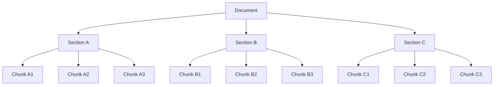
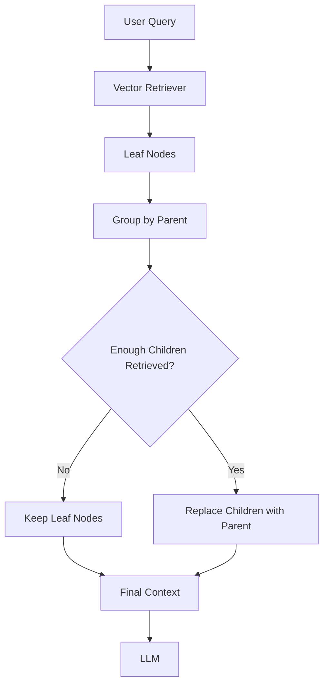
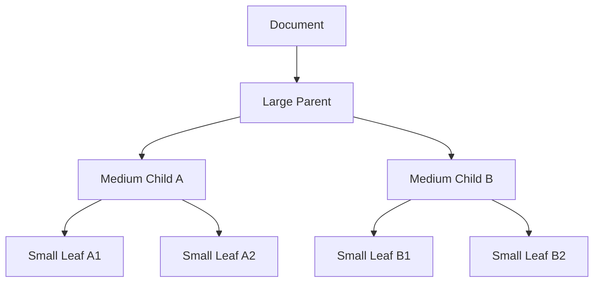
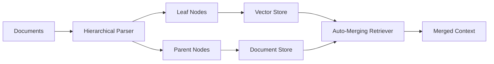
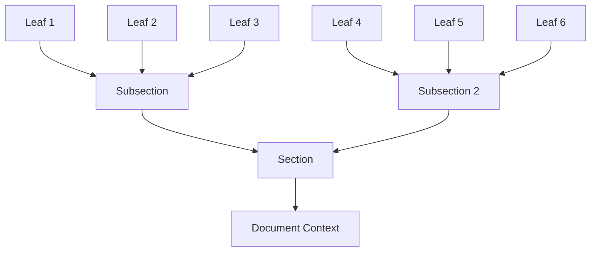
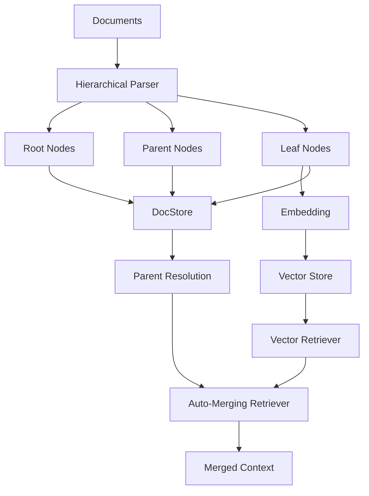
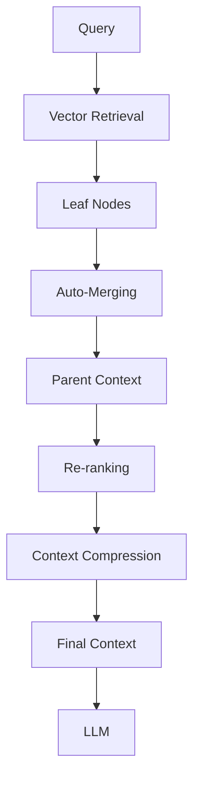
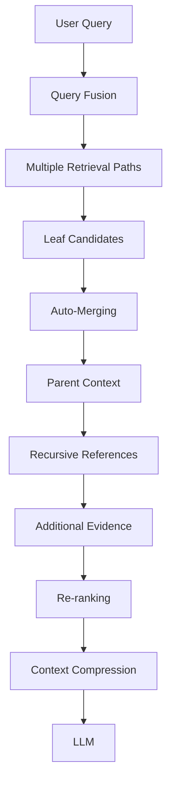
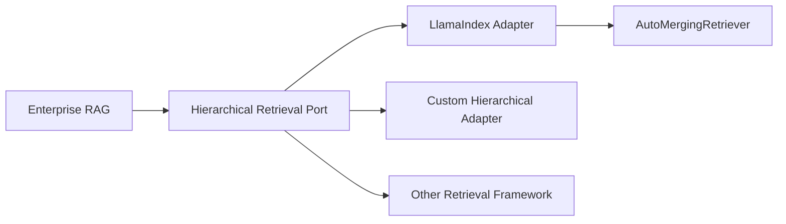
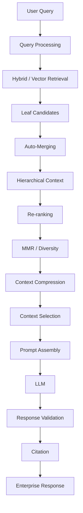

# Auto-Merging Retriever

## 📖 Overview

The **Auto-Merging Retriever** is an advanced retrieval strategy that starts with fine-grained leaf nodes and automatically merges related retrieved nodes into their larger parent context when enough child nodes from the same parent are retrieved.

The core problem it solves is:

```text
Small chunks
    ↓
Excellent retrieval precision
    ↓
But insufficient context
```

Auto-merging provides a mechanism to move from:

```text
Fine-grained retrieval
        ↓
Parent-level context
```

without always returning the entire parent document.

LlamaIndex describes `AutoMergingRetriever` as a retriever that first retrieves chunks from a vector store and then attempts to merge those chunks into a larger parent context. The merge occurs when a sufficient proportion of a parent's child nodes have been retrieved. :contentReference[oaicite:0]{index=0}

This makes Auto-Merging particularly useful for:

```text
Hierarchical Documents
Small-to-Big Retrieval
Long Technical Documents
Enterprise Policies
Architecture Documents
Legal Documents
Research Papers
Financial Reports
Documentation
```

---

# 🎯 Learning Objectives

After completing this chapter, you will be able to:

- Understand Auto-Merging Retrieval
- Understand hierarchical node structures
- Understand leaf nodes and parent nodes
- Understand coarse-to-fine document hierarchies
- Understand automatic parent-context merging
- Understand the merge threshold
- Understand `HierarchicalNodeParser`
- Build an Auto-Merging Retriever using LlamaIndex
- Understand vector-store and docstore responsibilities
- Compare Auto-Merging with Recursive Retrieval
- Compare Auto-Merging with Parent Document Retrieval
- Combine Auto-Merging with re-ranking
- Combine Auto-Merging with contextual compression
- Understand context expansion trade-offs
- Evaluate Auto-Merging Retrieval
- Design production-ready hierarchical retrieval systems

---

# 1. The Problem

Consider a large enterprise document:

```text
Payment Architecture
│
├── Authentication
├── Payment Processing
├── Event Processing
├── Failure Recovery
└── Observability
```

Suppose:

```text
Event Processing
```

is split into:

```text
Parent Section
│
├── Child A
├── Child B
├── Child C
├── Child D
└── Child E
```

The vector database indexes the small children.

A query may retrieve:

```text
Child B
Child C
Child D
```

Individually, these chunks may be useful.

But returning only:

```text
B + C + D
```

may not provide the complete section context.

Auto-Merging asks:

```text
"Have enough children from the same parent
been retrieved that the parent should replace
those individual children?"
```

---

# 2. Core Mental Model

The basic idea is:

```text
Retrieve Small
     ↓
Detect Related Children
     ↓
Check Parent Coverage
     ↓
Merge
     ↓
Return Larger Context
```

Instead of:

```text
Query
 ↓
Leaf Nodes
 ↓
LLM
```

we get:

```text
Query
 ↓
Leaf Nodes
 ↓
Parent Coverage Check
 ↓
Auto-Merge
 ↓
Parent Context
 ↓
LLM
```

---

# 3. Hierarchical Retrieval

A hierarchical document can be represented as:

```text
Document
│
├── Section A
│   ├── Chunk A1
│   ├── Chunk A2
│   └── Chunk A3
│
├── Section B
│   ├── Chunk B1
│   ├── Chunk B2
│   └── Chunk B3
│
└── Section C
    ├── Chunk C1
    ├── Chunk C2
    └── Chunk C3
```

The leaf nodes are the smallest retrieval units.

The parent nodes provide broader context.

---

# 4. Hierarchical Node Graph



This hierarchy is the foundation of Auto-Merging Retrieval.

---

# 5. Leaf Nodes

A **leaf node** is a node that has no children.

For example:

```text
Section A
├── Chunk A1 ← leaf
├── Chunk A2 ← leaf
└── Chunk A3 ← leaf
```

The vector index typically retrieves these leaf nodes first.

LlamaIndex's Auto-Merging example uses `HierarchicalNodeParser` to construct the hierarchy and indexes the leaf nodes in the vector store while storing the broader hierarchy in the document store. :contentReference[oaicite:1]{index=1}

---

# 6. Parent Nodes

A parent node contains a broader section of the original document.

Example:

```text
Parent:
"Payment Event Processing"

Children:

A1:
"Kafka producers publish payment events."

A2:
"Consumers process events asynchronously."

A3:
"Failed events are retried using backoff."
```

The parent contains the combined context.

---

# 7. Why Index Leaf Nodes?

Suppose:

```text
Parent = 2,000 tokens
```

and:

```text
Child = 200 tokens
```

The child provides much more precise semantic matching.

Instead of embedding:

```text
Large 2,000-token section
```

we embed:

```text
Small 200-token chunks
```

This allows retrieval to focus on the relevant passage.

---

# 8. Why Not Return Only Leaf Nodes?

Because a leaf node may lack context.

Example:

```text
"Retry processing is performed after failure."
```

Without the parent, we may not know:

```text
What is being retried?
Which service?
Which event?
What failure?
What retry policy?
```

The parent can restore that context.

---

# 9. Small-to-Big Retrieval

Auto-Merging is a form of:

```text
Small-to-Big Retrieval
```

The process is:

```text
Small chunks
    ↓
Retrieve precisely
    ↓
Identify parent coverage
    ↓
Merge into larger context
```

The distinction is important:

```text
Small
=
Search representation

Big
=
Context representation
```

---

# 10. Auto-Merging Architecture



This is the central architecture of Auto-Merging Retrieval.

---

# 11. The Merge Decision

Suppose a parent has:

```text
5 children
```

and retrieval returns:

```text
Child 1
Child 2
Child 3
```

Then:

```text
Retrieved Children = 3
Total Children = 5
```

Coverage:

```text
3 / 5 = 60%
```

If the configured merge threshold is:

```text
50%
```

the parent can be considered for merging.

Conceptually:

```text
Child 1
Child 2
Child 3
   ↓
Parent
```

---

# 12. Merge Threshold

The important concept is:

```text
simple_ratio_thresh
```

LlamaIndex's `AutoMergingRetriever` exposes a `simple_ratio_thresh` parameter that controls the threshold used when deciding whether retrieved children should be merged into a parent. :contentReference[oaicite:2]{index=2}

Conceptually:

\[
Coverage(parent)=
\frac{\text{Retrieved Children}}
{\text{Total Children}}
\]

If:

\[
Coverage(parent) \geq Threshold
\]

then:

```text
Merge Children
     ↓
Parent Context
```

---

# 13. Threshold Example

Suppose:

```text
Parent
├── C1
├── C2
├── C3
├── C4
└── C5
```

Retrieved:

```text
C1
C2
C4
```

Coverage:

```text
3 / 5 = 60%
```

If:

```text
threshold = 0.5
```

then:

```text
60% >= 50%
```

so the parent can be merged.

---

# 14. Threshold Visualization

```text
Parent has 5 children

C1 ████████████████████ Retrieved
C2 ████████████████████ Retrieved
C3                    Not Retrieved
C4 ████████████████████ Retrieved
C5                    Not Retrieved

Coverage = 3 / 5 = 60%

Threshold = 50%

60% > 50%
      ↓
MERGE
```

---

# 15. What Happens After Merging?

Suppose:

```text
Retrieved:
C1
C2
C4
```

The system may return:

```text
Parent P
```

instead of:

```text
C1
C2
C4
```

This prevents fragmented context.

---

# 16. Auto-Merging vs Manual Parent Retrieval

### Parent Document Retrieval

```text
Retrieve Child
     ↓
Always Return Parent
```

### Auto-Merging

```text
Retrieve Child
     ↓
Check Parent Coverage
     ↓
Merge Only When Appropriate
```

This makes Auto-Merging more selective.

---

# 17. Auto-Merging vs Recursive Retrieval

These techniques are related but have different goals.

### Recursive Retrieval

```text
Node
 ↓
Reference
 ↓
Related Node
 ↓
Reference
 ↓
Another Node
```

### Auto-Merging

```text
Leaf Nodes
 ↓
Group by Parent
 ↓
Check Coverage
 ↓
Merge
```

Recursive retrieval emphasizes:

```text
Graph Traversal
```

Auto-Merging emphasizes:

```text
Hierarchical Context Consolidation
```

---

# 18. Auto-Merging vs Recursive Retriever

| Capability | Recursive Retriever | Auto-Merging Retriever |
|---|---|---|
| Node references | Strong | Strong |
| Parent traversal | Yes | Yes |
| Arbitrary graph traversal | Yes | Limited |
| Parent coverage threshold | Not core concept | Core concept |
| Hierarchical chunks | Useful | Excellent |
| Small-to-big retrieval | Yes | Excellent |
| Automatic merging | Not primary goal | Core capability |
| Graph relationships | Strong | More hierarchical |

---

# 19. Auto-Merging vs Query Fusion

These solve completely different problems.

### Query Fusion

```text
Multiple Queries
 ↓
Multiple Retrievals
 ↓
Fusion
```

### Auto-Merging

```text
Retrieved Children
 ↓
Parent Coverage
 ↓
Merge
```

They can be combined.

---

# 20. Query Fusion + Auto-Merging

A powerful pipeline:

```text
User Query
    ↓
Query Fusion
    ↓
Multiple Retrieval Paths
    ↓
Leaf Candidates
    ↓
Auto-Merging
    ↓
Parent Context
    ↓
Re-ranking
    ↓
LLM
```

This combines:

```text
Query Diversity
+
Hierarchical Context
```

---

# 21. Auto-Merging + Hybrid Search

Another architecture:

```text
Query
 ↓
Vector Search
 +
BM25
 ↓
Candidate Leaves
 ↓
Fusion
 ↓
Auto-Merging
 ↓
Parent Context
```

This can improve:

```text
Recall
+
Context completeness
```

---

# 22. HierarchicalNodeParser

LlamaIndex provides:

```python
HierarchicalNodeParser
```

for constructing hierarchical nodes from documents.

The documented Auto-Merging example describes a hierarchy with coarse-to-fine chunk sizes and parent-child relationships. The example defaults to levels using chunk sizes of approximately:

```text
2048
 ↓
512
 ↓
128
```

with the smallest nodes serving as leaf nodes. :contentReference[oaicite:3]{index=3}

These values are examples rather than universal production settings.

---

# 23. Coarse-to-Fine Hierarchy

Conceptually:

```text
Level 1
Large Context
2048 tokens

        ↓

Level 2
Medium Context
512 tokens

        ↓

Level 3
Fine Context
128 tokens
```

The structure becomes:

```text
Large
 └── Medium
      └── Small
```

---

# 24. Hierarchical Chunking



The leaf nodes are optimized for retrieval.

The parent nodes are optimized for context.

---

# 25. HierarchicalNodeParser Example

```python
from llama_index.core.node_parser import HierarchicalNodeParser

node_parser = HierarchicalNodeParser.from_defaults(
    chunk_sizes=[2048, 512, 128]
)

nodes = node_parser.get_nodes_from_documents(
    documents
)
```

The exact API can vary with the installed LlamaIndex version.

The important concept is:

```text
Document
 ↓
Hierarchical Nodes
 ↓
Parent-Child Relationships
```

---

# 26. Extracting Leaf Nodes

LlamaIndex provides helpers such as:

```python
from llama_index.core.node_parser import get_leaf_nodes

leaf_nodes = get_leaf_nodes(nodes)
```

The documented Auto-Merging example uses leaf nodes as the vector-indexed retrieval units. :contentReference[oaicite:4]{index=4}

---

# 27. Root Nodes

The broader hierarchy can also contain root nodes.

Conceptually:

```python
from llama_index.core.node_parser import get_root_nodes

root_nodes = get_root_nodes(nodes)
```

The root nodes represent the highest-level nodes in the hierarchy.

---

# 28. Storage Architecture

A common architecture is:

```text
Leaf Nodes
     ↓
Vector Store

Parent Nodes
     ↓
DocStore
```

The vector store handles:

```text
Similarity Search
```

The docstore handles:

```text
Parent Node Resolution
```

LlamaIndex's Auto-Merging example stores the complete hierarchy in a document store while creating the vector index from leaf nodes. :contentReference[oaicite:5]{index=5}

---

# 29. Storage Architecture Diagram



This separation is critical.

---

# 30. Why Store Parents Separately?

The parent nodes do not necessarily need to participate directly in vector search.

Instead:

```text
Leaf
 ↓
Vector Search
```

finds the relevant region.

Then:

```text
Leaf
 ↓
Parent Reference
 ↓
DocStore
```

retrieves the larger context.

This reduces the retrieval search space while preserving hierarchy.

---

# 31. StorageContext

A conceptual LlamaIndex setup:

```python
from llama_index.core import StorageContext
from llama_index.core.storage.docstore import SimpleDocumentStore

docstore = SimpleDocumentStore()

storage_context = StorageContext.from_defaults(
    docstore=docstore
)

docstore.add_documents(nodes)
```

The hierarchy can then be resolved during retrieval.

---

# 32. VectorStoreIndex

The leaf nodes can be indexed:

```python
from llama_index.core import VectorStoreIndex

index = VectorStoreIndex(
    leaf_nodes,
    storage_context=storage_context
)
```

This means:

```text
Only leaf nodes
```

are directly used for the vector index in this pattern.

---

# 33. Creating the Vector Retriever

```python
vector_retriever = index.as_retriever(
    similarity_top_k=10
)
```

The initial search produces:

```text
Leaf Nodes
```

which are then passed to:

```text
AutoMergingRetriever
```

---

# 34. AutoMergingRetriever

Conceptually:

```python
from llama_index.core.retrievers import AutoMergingRetriever

retriever = AutoMergingRetriever(
    vector_retriever,
    storage_context,
    simple_ratio_thresh=0.5,
    verbose=True
)
```

The current API exposes the vector retriever, storage context, merge threshold, and verbosity as key configuration points. :contentReference[oaicite:6]{index=6}

---

# 35. Querying the Retriever

```python
results = retriever.retrieve(
    "How does payment event recovery work?"
)

for result in results:
    print(result.node.get_content())
```

The system first retrieves leaf nodes.

Then it determines whether enough children belong to a common parent to justify merging.

---

# 36. End-to-End Example

```python
from llama_index.core import (
    Document,
    VectorStoreIndex,
    StorageContext
)

from llama_index.core.node_parser import (
    HierarchicalNodeParser,
    get_leaf_nodes
)

from llama_index.core.retrievers import (
    AutoMergingRetriever
)

documents = [
    Document(
        text="""
        Payment systems process events through
        asynchronous Kafka consumers.

        Failed events are retried using an
        exponential backoff strategy.

        Dead-letter queues are used when retries
        are exhausted.
        """
    )
]

parser = HierarchicalNodeParser.from_defaults(
    chunk_sizes=[512, 128]
)

nodes = parser.get_nodes_from_documents(
    documents
)

leaf_nodes = get_leaf_nodes(nodes)

storage_context = StorageContext.from_defaults()

storage_context.docstore.add_documents(nodes)

index = VectorStoreIndex(
    leaf_nodes,
    storage_context=storage_context
)

base_retriever = index.as_retriever(
    similarity_top_k=5
)

retriever = AutoMergingRetriever(
    base_retriever,
    storage_context,
    simple_ratio_thresh=0.5
)

results = retriever.retrieve(
    "How are failed payment events recovered?"
)

for result in results:
    print(result.node.get_content())
```

The example is intentionally simplified to demonstrate the architecture.

---

# 37. What the Retriever Is Doing

Conceptually:

```text
Query
 ↓
Vector Search
 ↓
Leaf 1
Leaf 2
Leaf 3
Leaf 4
 ↓
Identify Parents
 ↓
Calculate Coverage
 ↓
Merge Where Threshold Is Met
 ↓
Return Context
```

The merge decision is therefore dynamic.

---

# 38. Auto-Merging Example

Suppose:

```text
Parent P1
├── C1
├── C2
├── C3
└── C4
```

Initial retrieval:

```text
C1
C2
C3
```

Coverage:

```text
3 / 4 = 75%
```

With:

```text
threshold = 50%
```

the parent becomes a strong candidate for merging.

---

# 39. Another Example

Parent:

```text
P2
├── C5
├── C6
├── C7
├── C8
└── C9
```

Retrieved:

```text
C5
```

Coverage:

```text
1 / 5 = 20%
```

With:

```text
threshold = 50%
```

the parent should generally not be merged.

The system can retain:

```text
C5
```

because only a small portion of the parent was retrieved.

---

# 40. Why This Is Better Than Always Returning Parents

Consider:

```text
Parent = 2,000 tokens
Child = 150 tokens
```

If only one child is relevant:

```text
Return Child
```

may be more efficient.

If most children are relevant:

```text
Return Parent
```

may be better.

Auto-Merging dynamically chooses between these behaviors.

---

# 41. Adaptive Context Granularity

This creates:

```text
Query-specific Context Granularity
```

For one query:

```text
Leaf
```

may be sufficient.

For another:

```text
Parent
```

may be necessary.

Therefore:

```text
Retrieval granularity
```

becomes dynamic rather than fixed.

---

# 42. Context Granularity

```text
                 More Context
                     ↑
                     │
Document ────────────┤
Section ─────────────┤
Parent ──────────────┤
Child ───────────────┤
Leaf ────────────────┤
                     │
                     └──── More Precision
```

Auto-Merging dynamically balances:

```text
Precision
+
Context
```

---

# 43. Auto-Merging with Multi-Level Hierarchies

Consider:

```text
Document
   ↓
Section
   ↓
Subsection
   ↓
Paragraph
   ↓
Sentence Chunk
```

The system can progressively merge.

Example:

```text
Sentence Chunks
       ↓
Subsection
       ↓
Section
```

depending on retrieved coverage.

---

# 44. Recursive Auto-Merging

This is where the term **recursive merging** becomes important.

Suppose:

```text
Document
  ↓
Section
  ↓
Subsection
  ↓
Leaf
```

If enough leaves are retrieved:

```text
Leaf → Subsection
```

Then enough subsections may support:

```text
Subsection → Section
```

This allows hierarchical context consolidation.

The LlamaIndex documentation describes Auto-Merging as recursively merging subsets of leaf nodes that reference a parent once a threshold is exceeded. :contentReference[oaicite:7]{index=7}

---

# 45. Recursive Merge Diagram



The hierarchy allows merging at multiple levels.

---

# 46. Multi-Level Example

```text
Document
│
├── Section A
│   ├── Subsection A1
│   │   ├── Leaf 1
│   │   ├── Leaf 2
│   │   └── Leaf 3
│   │
│   └── Subsection A2
│       ├── Leaf 4
│       ├── Leaf 5
│       └── Leaf 6
```

Suppose:

```text
Leaf 1
Leaf 2
Leaf 3
```

are retrieved.

The system can merge:

```text
Leaf 1 + Leaf 2 + Leaf 3
        ↓
Subsection A1
```

---

# 47. Next-Level Merge

Suppose:

```text
Subsection A1
+
Subsection A2
```

become sufficiently represented.

Then:

```text
Subsection A1
Subsection A2
       ↓
Section A
```

can become the appropriate context.

This is why hierarchical retrieval can scale across large documents.

---

# 48. Auto-Merging as Hierarchical Evidence Aggregation

A useful mental model:

```text
Leaf Evidence
     ↓
Aggregate
     ↓
Parent Evidence
     ↓
Aggregate
     ↓
Section Evidence
```

The system progressively converts:

```text
Fine-grained evidence
```

into:

```text
Contextual evidence
```

---

# 49. Auto-Merging and Token Efficiency

Suppose:

```text
Parent = 2,000 tokens
```

but only:

```text
3 children × 128 tokens
```

are relevant.

Returning the entire parent could introduce unnecessary content.

Auto-Merging only promotes to the parent when the retrieved child coverage justifies it.

Therefore:

```text
Precision
+
Context
+
Token Efficiency
```

can be balanced.

---

# 50. Context Expansion Trade-Off

```text
Leaf Only
│
├── High precision
├── Low context
└── Low token cost

Parent Merge
│
├── More context
├── Potentially more noise
└── Higher token cost
```

The threshold controls where the system moves along this trade-off.

---

# 51. Threshold Too Low

Suppose:

```text
threshold = 0.2
```

Only a small percentage of children needs to be retrieved.

Potential result:

```text
Parent expansion happens frequently.
```

This can cause:

```text
More tokens
More noise
More latency
```

---

# 52. Threshold Too High

Suppose:

```text
threshold = 0.9
```

The system requires almost the entire parent to be retrieved.

Potential result:

```text
Parent merging rarely occurs.
```

Then the system behaves closer to:

```text
Leaf Retrieval
```

---

# 53. Threshold Tuning

The threshold should be evaluated against:

```text
Context Recall
Context Precision
Answer Quality
Latency
Token Usage
```

A useful experiment:

```text
0.25
0.50
0.75
```

and compare performance.

Do not assume:

```text
0.5
```

is optimal for every dataset.

---

# 54. Threshold Experiment

| Threshold | Context Recall | Context Precision | Tokens | Latency |
|---|---:|---:|---:|---:|
| 0.25 | 0.93 | 0.70 | 6,800 | 155 ms |
| 0.50 | 0.90 | 0.78 | 5,000 | 130 ms |
| 0.75 | 0.84 | 0.84 | 3,800 | 112 ms |

Values are illustrative.

The best threshold depends on application requirements.

---

# 55. Hierarchy Design Matters

Auto-Merging cannot compensate for a poor hierarchy.

Bad:

```text
Parent = 20,000 tokens
Child = 50 tokens
```

This may create:

```text
Huge parent context
```

Good:

```text
Parent = coherent section
Child = focused retrieval unit
```

The hierarchy should reflect document semantics.

---

# 56. Semantic Parent Boundaries

Prefer parents such as:

```text
Architecture Section
Policy Section
API Section
Configuration Section
Operational Procedure
```

rather than arbitrary boundaries.

A parent should represent a meaningful unit of context.

---

# 57. Chunk Hierarchy Example

For technical documentation:

```text
Document
│
├── Authentication
│   ├── OAuth
│   │   ├── Token Issuance
│   │   ├── Token Validation
│   │   └── Token Refresh
│   │
│   └── API Keys
│
└── Authorization
```

This hierarchy is semantically meaningful.

---

# 58. Auto-Merging for Enterprise Documents

Consider an enterprise policy:

```text
Security Policy
│
├── Identity Management
│
├── Access Control
│
├── Encryption
│
├── Incident Response
│
└── Data Retention
```

Each section can contain:

```text
Subsections
+
Leaf Chunks
```

Auto-Merging can return:

```text
Relevant subsection
```

instead of:

```text
Entire policy
```

---

# 59. Auto-Merging for Legal Documents

Legal documents often contain:

```text
Article
 ↓
Section
 ↓
Clause
 ↓
Sub-clause
```

A query may match several clauses from one section.

Auto-Merging can reconstruct:

```text
Relevant Section
```

when enough clauses are retrieved.

This can preserve legal context without always passing the complete document.

---

# 60. Auto-Merging for Research Papers

Research papers often have:

```text
Paper
 ↓
Section
 ↓
Subsection
 ↓
Paragraph
```

A query about:

```text
experimental methodology
```

may retrieve several paragraphs.

Auto-Merging can consolidate them into:

```text
Methodology Section
```

when retrieval coverage is sufficient.

---

# 61. Auto-Merging for API Documentation

API documentation can be hierarchical:

```text
API
 ↓
Resource
 ↓
Endpoint
 ↓
Description
 ↓
Parameter
```

If multiple parameter descriptions are retrieved, the larger endpoint context may become useful.

---

# 62. Auto-Merging for Financial Reports

Financial reports often contain:

```text
Report
 ↓
Financial Statement
 ↓
Section
 ↓
Line Items
```

A query may retrieve several line items.

Merging into the section can preserve:

```text
Metric
+
Period
+
Business Context
```

---

# 63. Auto-Merging + Tables

Tables should be treated carefully.

Suppose:

```text
Parent Section
├── Text Chunk
├── Table Description
├── Table Row
└── Table Row
```

If multiple table-related nodes are retrieved, merging into the parent can restore explanatory context.

However, the actual table data may need to remain separately accessible.

---

# 64. Auto-Merging + Multimodal Documents

A hierarchy could include:

```text
Document
├── Text
├── Image
├── Table
└── Caption
```

A retrieval system may retrieve:

```text
Caption
```

and use the hierarchy to locate:

```text
Image
```

or:

```text
Parent Section
```

This requires multimodal-aware node relationships.

---

# 65. Auto-Merging + Metadata

Parent and child nodes should preserve:

```text
document_id
tenant_id
section
page
source
version
access_control
```

When a parent is merged, metadata must remain consistent.

---

# 66. Security Consideration

Never assume:

```text
Child is authorized
```

means:

```text
Parent is authorized
```

Always validate authorization when expanding from child to parent.

Example:

```text
Child Node
 ↓
Parent Node
 ↓
ACL Check
 ↓
Allowed?
```

---

# 67. Tenant Isolation

Suppose:

```text
Tenant A
 └── Child A1
      ↓
Parent A
```

The parent must belong to:

```text
Tenant A
```

and must be accessible to the requesting principal.

Recursive context expansion should never bypass tenant isolation.

---

# 68. Version Consistency

Consider:

```text
Parent V2
Children V2
```

If the child points to:

```text
Parent V1
```

Auto-Merging can produce stale context.

Therefore:

```text
Node Version
+
Parent Version
+
Index Version
```

must be consistent.

---

# 69. Indexing Pipeline



This illustrates the separation between:

```text
Search Index
```

and:

```text
Hierarchy Storage
```

---

# 70. Retrieval Pipeline

```text
User Query
     ↓
Embedding
     ↓
Vector Search
     ↓
Leaf Nodes
     ↓
Group by Parent
     ↓
Calculate Coverage
     ↓
Merge Qualified Parents
     ↓
Deduplicate
     ↓
Re-rank
     ↓
Context Selection
     ↓
LLM
```

---

# 71. Auto-Merging + Re-ranking

A recommended architecture:

```text
Vector Retrieval
      ↓
Leaf Candidates
      ↓
Auto-Merging
      ↓
Parent Candidates
      ↓
Re-ranking
      ↓
Top Evidence
```

Alternatively, depending on the application:

```text
Vector Retrieval
      ↓
Re-ranking Leaves
      ↓
Auto-Merging
      ↓
Context Selection
```

The correct order should be benchmarked.

---

# 72. Auto-Merging + Contextual Compression

A parent may be:

```text
2,000 tokens
```

but only:

```text
500 tokens
```

may be relevant.

Therefore:

```text
Auto-Merge
 ↓
Parent Context
 ↓
Contextual Compression
 ↓
Relevant Evidence
```

can provide a strong balance.

---

# 73. Auto-Merging + Re-ranking + Compression



This is a strong enterprise retrieval pipeline.

---

# 74. Auto-Merging + MMR

Auto-Merging can produce multiple parent contexts that overlap.

Example:

```text
Parent A
Parent A
Parent B
Parent C
```

After deduplication:

```text
A
B
C
```

MMR can then encourage:

```text
Diverse Parents
```

rather than redundant ones.

---

# 75. Auto-Merging + Query Fusion

A complete advanced pipeline:

```text
User Query
 ↓
Generate Query Variants
 ↓
Vector + BM25
 ↓
RRF
 ↓
Leaf Candidates
 ↓
Auto-Merging
 ↓
Re-ranking
 ↓
MMR
 ↓
Context Compression
 ↓
LLM
```

This combines several advanced retrieval capabilities covered in this section.

---

# 76. Auto-Merging + Recursive Retrieval

The techniques can also complement each other.

```text
Query
 ↓
Auto-Merging
 ↓
Parent Node
 ↓
Recursive Reference
 ↓
Table / Source / Related Node
```

This is useful when hierarchy alone does not capture every relationship.

---

# 77. Auto-Merging vs Recursive Expansion

The difference can be summarized as:

```text
Auto-Merging
"Have enough children been retrieved
to promote their parent?"

Recursive Retrieval
"What other nodes can I reach
from this node?"
```

This is an important architectural distinction.

---

# 78. Auto-Merging + Query Fusion + Recursive

An advanced retrieval architecture:



This should not be the default for every application.

Complexity should be justified by evaluation.

---

# 79. Context Explosion Risk

Auto-Merging can increase context size.

Example:

```text
10 leaf nodes
 ↓
3 parents
 ↓
3 × 2,000 tokens
 ↓
6,000 tokens
```

If the model context budget is:

```text
4,000 tokens
```

the pipeline has a problem.

Therefore:

```text
Merge
 ↓
Context Budget
```

must be enforced.

---

# 80. Context Budgeting

A production system should define:

```yaml
context:
  max_tokens: 6000
  max_parent_nodes: 5
  max_leaf_nodes: 20
```

These values are illustrative.

The context manager should enforce the limits after merging.

---

# 81. Parent Selection

If several parents qualify:

```text
Parent A
Parent B
Parent C
Parent D
```

select based on:

```text
Relevance
Coverage
Source Authority
Recency
Diversity
Token Cost
```

The parent with the highest coverage is not automatically the best parent.

---

# 82. Merge Score

A production system could consider:

```text
MergeScore =
Retrieval Relevance
+
Child Coverage
+
Source Authority
-
Token Cost
```

This is a conceptual design, not a built-in LlamaIndex formula.

The goal is to make the merge decision more application-aware.

---

# 83. Child Coverage vs Relevance

Suppose:

```text
Parent A
5 children
4 retrieved
```

Coverage:

```text
80%
```

Parent B:

```text
10 children
6 retrieved
```

Coverage:

```text
60%
```

Parent A has higher coverage.

But suppose:

```text
Parent B's children
```

have much stronger relevance scores.

Therefore:

```text
Coverage
```

should not necessarily be the only signal.

---

# 84. Retrieval Score Preservation

When merging:

```text
Child A score = 0.94
Child B score = 0.91
Child C score = 0.88
```

the parent should retain useful retrieval information.

Possible strategies include:

```text
Maximum Child Score
Average Child Score
Weighted Coverage
Aggregate Relevance
```

The exact scoring strategy is implementation-specific.

---

# 85. Production Auto-Merging Strategy

A mature implementation can use:

```text
Leaf Retrieval
       ↓
Candidate Grouping
       ↓
Parent Coverage
       ↓
Relevance Threshold
       ↓
Authorization
       ↓
Parent Expansion
       ↓
Deduplication
       ↓
Re-ranking
       ↓
Context Budget
```

This makes Auto-Merging part of a controlled retrieval pipeline.

---

# 86. Evaluation Dataset

Create questions covering:

```text
Single-chunk questions
Multi-chunk questions
Cross-section questions
Long-context questions
Table questions
Hierarchical questions
Ambiguous questions
Multi-hop questions
```

Then compare:

```text
Leaf Retrieval
```

against:

```text
Auto-Merging
```

---

# 87. Evaluation Metrics

Measure:

```text
Recall@K
Precision@K
MRR
nDCG
Context Recall
Context Precision
Answer Relevance
Faithfulness
Latency
Token Usage
Cost
```

The most important comparison is:

```text
Does Auto-Merging improve answer quality
enough to justify additional context?
```

---

# 88. Example Evaluation

| Retrieval Strategy | Context Recall | Context Precision | Tokens | P95 Latency |
|---|---:|---:|---:|---:|
| Leaf Only | 0.81 | 0.88 | 2,100 | 90 ms |
| Parent Always | 0.94 | 0.65 | 7,200 | 145 ms |
| Auto-Merging | 0.91 | 0.81 | 4,500 | 120 ms |

Values are illustrative.

Auto-Merging aims for the middle ground:

```text
More context than leaf-only
```

without:

```text
Always returning large parents
```

---

# 89. Measuring Merge Rate

Track:

```text
Total Retrievals
```

and:

```text
Retrievals That Triggered Merge
```

Then:

\[
MergeRate =
\frac{MergedQueries}{TotalQueries}
\]

Example:

```text
10,000 queries
3,200 merged

Merge Rate = 32%
```

This helps understand system behavior.

---

# 90. Observability Metrics

Track:

```text
Leaf Results
Parent Candidates
Merge Count
Merge Rate
Average Coverage
Maximum Coverage
Merged Token Count
Unmerged Token Count
P95 Retrieval Latency
P95 Context Size
```

---

# 91. Auto-Merging Trace

Example:

```json
{
  "query": "How does payment retry work?",
  "leaf_nodes": 5,
  "parent_candidates": 2,
  "merged_parents": 1,
  "merge_ratio": 0.75,
  "context_tokens": 4200,
  "latency_ms": 118
}
```

This provides visibility into why the context became larger.

---

# 92. Debugging Auto-Merging

When an answer is wrong, inspect:

```text
1. Which leaves were retrieved?
2. Which parents were identified?
3. What was the child coverage?
4. Which threshold was applied?
5. Which parents were merged?
6. Was authorization checked?
7. How large was the final context?
8. Was the context re-ranked?
```

This is much more useful than looking only at the final LLM response.

---

# 93. Common Failure Mode — Bad Hierarchy

If:

```text
Parent
```

contains unrelated topics:

```text
Authentication
+
Payments
+
Monitoring
+
Deployment
```

then auto-merging may introduce irrelevant information.

Therefore:

```text
Hierarchy Quality
```

directly affects retrieval quality.

---

# 94. Common Failure Mode — Tiny Leaves

If leaf nodes are too small:

```text
One sentence
```

the vector search may become noisy.

Potential result:

```text
Too many leaf candidates
```

and unnecessary merging.

---

# 95. Common Failure Mode — Huge Parents

If parents are too large:

```text
10,000+ tokens
```

then merging can create:

```text
Context Explosion
```

Parents should represent coherent context boundaries.

---

# 96. Common Failure Mode — Threshold Too Low

A low threshold causes:

```text
Frequent merging
```

which can increase:

```text
Noise
Latency
Tokens
Cost
```

---

# 97. Common Failure Mode — Threshold Too High

A high threshold causes:

```text
Rare merging
```

which reduces the benefit of hierarchical context.

---

# 98. Common Failure Mode — Stale References

When documents are updated:

```text
Child V2
 ↓
Parent V1
```

can result in inconsistent retrieval.

The hierarchy should be versioned together.

---

# 99. Common Failure Mode — Security Bypass

A child may be authorized while its parent is not.

Never allow:

```text
Child Access
 ↓
Automatic Parent Access
```

without authorization validation.

---

# 100. Common Anti-Patterns

## Anti-Pattern 1 — Always Merge

```text
Every Child
 ↓
Parent
```

This removes the adaptive benefit of Auto-Merging.

---

## Anti-Pattern 2 — Never Merge

This effectively reduces the system to:

```text
Leaf Retrieval
```

---

# 101. Common Anti-Patterns — Continued

## Anti-Pattern 3 — Huge Parent Nodes

Avoid:

```text
Entire Document
```

as the default parent.

Prefer:

```text
Semantic Section
```

or:

```text
Logical Context Unit
```

---

## Anti-Pattern 4 — Ignore Token Budget

Always enforce:

```text
Maximum Context
```

after merging.

---

# 102. Common Anti-Patterns — Continued

## Anti-Pattern 5 — No Baseline

Always compare against:

```text
Leaf-only retrieval
```

to determine whether Auto-Merging actually improves results.

---

## Anti-Pattern 6 — Treat Threshold as Universal

The threshold is a tuning parameter.

It should be evaluated for:

```text
Dataset
Document Structure
Query Distribution
LLM
Context Window
```

---

# 103. Production Checklist

```text
☐ Define semantic document hierarchy
☐ Define parent-child relationships
☐ Choose leaf chunk size
☐ Choose parent chunk sizes
☐ Build hierarchical nodes
☐ Validate node relationships
☐ Index leaf nodes
☐ Store hierarchy in docstore
☐ Configure similarity top-k
☐ Configure merge threshold
☐ Enforce tenant isolation
☐ Validate authorization during expansion
☐ Implement deduplication
☐ Define context budget
☐ Add re-ranking
☐ Add contextual compression
☐ Measure merge rate
☐ Measure context recall
☐ Measure context precision
☐ Measure answer quality
☐ Measure latency
☐ Measure token usage
☐ Version the hierarchy
☐ Test document updates
☐ Test document deletion
☐ Test stale references
☐ Add retrieval tracing
☐ Add fallback behavior
☐ Benchmark against leaf-only retrieval
```

---

# 104. Framework-Agnostic Abstraction

A production application can define:

```python
class HierarchicalRetriever:

    def retrieve(self, query: str):
        raise NotImplementedError
```

Then:

```python
class AutoMergingRetrieverAdapter(
    HierarchicalRetriever
):

    def __init__(self, retriever):
        self.retriever = retriever

    def retrieve(self, query):
        return self.retriever.retrieve(query)
```

The application should depend on:

```text
Hierarchical Retrieval Capability
```

rather than directly depending on framework internals.

---

# 105. Capability-Based Architecture



This keeps framework-specific implementations isolated.

---

# 106. Retriever Factory

A centralized retrieval factory might contain:

```python
class RetrieverType:
    VECTOR = "vector"
    BM25 = "bm25"
    RECURSIVE = "recursive"
    QUERY_FUSION = "query_fusion"
    AUTO_MERGING = "auto_merging"
```

Then:

```python
def create_retriever(
    retriever_type,
    config
):

    if retriever_type == "auto_merging":
        return AutoMergingRetrieverAdapter(config)

    ...
```

This makes retrieval strategies replaceable.

---

# 107. Production Retrieval Architecture



This places Auto-Merging correctly within the larger production RAG pipeline.

---

# 108. Auto-Merging Decision Flow

```text
                 Query
                   │
                   ▼
             Leaf Retrieval
                   │
                   ▼
             Group by Parent
                   │
                   ▼
          Calculate Child Coverage
                   │
             ┌─────┴─────┐
             │           │
          Below         Above
        Threshold     Threshold
             │           │
             ▼           ▼
        Keep Leaves    Merge Parent
             │           │
             └─────┬─────┘
                   ▼
              Candidate Set
                   │
                   ▼
               Re-ranking
                   │
                   ▼
              Context Budget
                   │
                   ▼
                  LLM
```

---

# 109. Key Architectural Principle

Auto-Merging separates:

```text
Retrieval Granularity
```

from:

```text
Generation Granularity
```

The vector store can search:

```text
Small leaf nodes
```

while the LLM receives:

```text
Larger coherent parent context
```

when retrieval evidence supports that expansion.

---

# 110. Auto-Merging vs Fixed Chunking

Traditional RAG:

```text
Fixed Chunk
 ↓
Retrieve
 ↓
LLM
```

Hierarchical Auto-Merging:

```text
Leaf Chunk
 ↓
Retrieve
 ↓
Evaluate Coverage
 ↓
Adaptive Parent Expansion
 ↓
LLM
```

This makes context size query-dependent.

---

# 111. Auto-Merging and Retrieval Precision

The leaf nodes should be optimized for:

```text
Semantic Retrieval
```

The parents should be optimized for:

```text
Context Coherence
```

This separation is a major architectural advantage.

---

# 112. Auto-Merging and Context Precision

The system should avoid blindly replacing all retrieved children with parents.

Instead:

```text
Is the parent sufficiently represented?
        │
        ├── No → Keep relevant leaves
        │
        └── Yes → Merge parent
```

This protects context precision.

---

# 113. Auto-Merging and Context Recall

When multiple children from the same parent are retrieved:

```text
C1
C2
C3
```

the parent may contain:

```text
C1
C2
C3
+
Important surrounding context
```

Merging therefore improves context completeness.

---

# 114. Auto-Merging as Adaptive Small-to-Big

The pattern can be summarized:

```text
Small
 ↓
Search
 ↓
Measure Coverage
 ↓
Big
 ↓
Synthesize
```

The key difference from fixed parent retrieval is:

```text
Big is selected conditionally.
```

---

# 115. Production Optimization Strategy

A strong enterprise configuration might use:

```text
Leaf Retrieval
     ↓
Top 20
     ↓
Auto-Merging
     ↓
Max 5 Parents
     ↓
Cross-Encoder
     ↓
Top 8
     ↓
Compression
     ↓
Context ≤ 6K tokens
```

The exact values must be benchmarked.

---

# 116. Recommended Evaluation Experiment

Build three systems:

### Baseline

```text
Vector → Leaf → LLM
```

### Parent Retrieval

```text
Vector → Parent → LLM
```

### Auto-Merging

```text
Vector → Leaf → Auto-Merge → LLM
```

Then compare:

```text
Accuracy
Recall
Precision
Tokens
Latency
Cost
```

This provides clear evidence for whether Auto-Merging is worth adopting.

---

# 117. Advanced Comparison

| Architecture | Retrieval Precision | Context Completeness | Complexity | Token Efficiency |
|---|---|---|---|---|
| Leaf Only | High | Medium/Low | Low | High |
| Always Parent | Medium | High | Low | Low |
| Recursive | High | High | High | Variable |
| Auto-Merging | High | High | Medium | High/Medium |
| Auto-Merging + Reranking | Very High | High | High | Medium |
| Auto-Merging + Compression | Very High | High | High | High |

The values are qualitative and application-dependent.

---

# 118. When to Use Auto-Merging

Auto-Merging is particularly useful when:

```text
Documents have natural hierarchy
+
Leaf chunks are useful retrieval units
+
Parent context is important
+
Returning full parents for every match is expensive
```

Excellent candidates include:

```text
Technical Documentation
Architecture Documents
Policies
Research Papers
Legal Documents
Financial Reports
Long PDFs
Enterprise Manuals
```

---

# 119. When Not to Use It

It may not be necessary when:

```text
Documents are already small
+
Chunks are naturally self-contained
+
No meaningful hierarchy exists
+
Queries typically require only one small passage
```

In such cases:

```text
Simple Vector Retrieval
```

may be sufficient.

---

# 120. Auto-Merging in the Enterprise AI Roadmap

Auto-Merging sits naturally after:

```text
Vector Index Retrieval
        ↓
BM25
        ↓
Document Summary Retrieval
        ↓
Recursive Retrieval
        ↓
Query Fusion
        ↓
Auto-Merging
```

It prepares the foundation for more advanced retrieval engineering:

```text
Auto-Merging
        ↓
FAISS
        ↓
HNSW
        ↓
Graph RAG
        ↓
Knowledge Graphs
        ↓
SQL RAG
        ↓
Multimodal RAG
        ↓
Agentic RAG
```

---

# 121. Key Takeaways

- Auto-Merging Retriever dynamically consolidates retrieved leaf nodes into larger parent contexts.
- LlamaIndex provides `AutoMergingRetriever` for this hierarchical retrieval pattern. :contentReference[oaicite:8]{index=8}
- The technique is based on hierarchical node relationships.
- Leaf nodes are typically used as the primary vector-search units in the documented LlamaIndex pattern. :contentReference[oaicite:9]{index=9}
- Parent nodes are stored separately so they can be resolved when merging is triggered.
- `HierarchicalNodeParser` can construct coarse-to-fine node hierarchies. :contentReference[oaicite:10]{index=10}
- The merge threshold controls how much of a parent's child set must be retrieved before parent expansion occurs.
- The threshold should be tuned experimentally.
- Low thresholds can cause excessive context expansion.
- High thresholds can prevent useful parent reconstruction.
- Auto-Merging is a form of adaptive small-to-big retrieval.
- It is different from always returning a parent document.
- It is different from Recursive Retrieval.
- Recursive Retrieval focuses on following references.
- Auto-Merging focuses on consolidating sufficiently represented hierarchical children.
- Auto-Merging can work with Query Fusion.
- Auto-Merging can work with Hybrid Search.
- Auto-Merging can work with Re-ranking.
- Auto-Merging can work with MMR.
- Auto-Merging can work with Contextual Compression.
- Hierarchy quality is critical to retrieval quality.
- Parents should represent coherent semantic context.
- Leaf nodes should be optimized for precise retrieval.
- Parent nodes should be optimized for contextual synthesis.
- Authorization must be enforced during parent expansion.
- Tenant isolation must be preserved across parent-child relationships.
- Node and hierarchy versions must remain consistent.
- Context budgets must be enforced after merging.
- Auto-Merging should be evaluated against leaf-only and always-parent baselines.
- Production systems should monitor merge rate, coverage, context size, latency, and token cost.
- Auto-Merging is best understood as **adaptive hierarchical context reconstruction**.

The central mental model is:

```text
                         USER QUERY
                              │
                              ▼
                       Leaf Retrieval
                              │
                              ▼
                       Candidate Leaves
                              │
                              ▼
                       Group by Parent
                              │
                              ▼
                    Calculate Child Coverage
                              │
                    ┌─────────┴─────────┐
                    │                   │
              Below Threshold      Above Threshold
                    │                   │
                    ▼                   ▼
              Keep Leaf Nodes      Merge Parent
                    │                   │
                    └─────────┬─────────┘
                              ▼
                       Candidate Context
                              │
                              ▼
                          Re-ranking
                              │
                              ▼
                    Context Compression
                              │
                              ▼
                       Context Selection
                              │
                              ▼
                             LLM
                              │
                              ▼
                     Validated Response
                              │
                              ▼
                           Citation
```

> **Auto-Merging Retrieval gives RAG systems adaptive context granularity: search with small, precise leaf nodes, then promote them into coherent parent context only when the retrieved evidence justifies the expansion.**

---

# 🧭 Chapter Navigation

### Part V — Advanced Retrieval-Augmented Generation

**Previous:**  
[07. Query Fusion Retriever](07-query-fusion-retriever.md)

**Next:**  
[04. Vector Search Engineering](../04-vector-search-engineering/01-faiss-fundamentals.md)

**Section:**  
03 — LlamaIndex Retrieval Engineering

### LlamaIndex Retrieval Engineering Path

```text
01 LlamaIndex Retrievers Overview
              ↓
02 LlamaIndex Indexes
              ↓
03 Vector Index Retriever
              ↓
04 BM25 Retriever
              ↓
05 Document Summary Retriever
              ↓
06 Recursive Retriever
              ↓
07 Query Fusion Retriever
              ↓
08 Auto-Merging Retriever
              ↓
04 Vector Search Engineering
```

---

> **Enterprise AI Engineering Handbook**  
> *Building Production-Grade Enterprise AI Systems — One Chapter at a Time.*