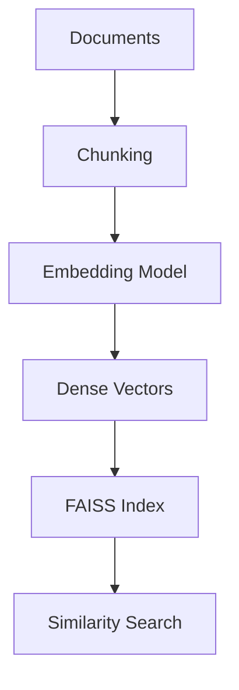

# 01. FAISS Fundamentals

## 📖 Overview

FAISS is a library for efficient similarity search over dense vectors.

### Python Example

```python
import faiss
import numpy as np

dimension = 384

index = faiss.IndexFlatL2(dimension)

vectors = np.random.random(
    (1000, dimension)
).astype("float32")

index.add(vectors)

query = np.random.random(
    (1, dimension)
).astype("float32")

distances, ids = index.search(query, 5)

print(ids)
print(distances)
```

### Architecture



### Key Takeaways

- FAISS provides vector similarity search.
- Flat indexes provide exact search.
- HNSW and IVF provide approximate search.
- `IndexFlatIP` can support cosine similarity with normalized vectors.
- FAISS should normally be treated as a retrieval infrastructure component rather than a complete enterprise database.

---

# 🧭 Chapter Navigation

**Previous:**  
[08. Auto-Merging Retriever](../03-llamaindex-retrieval-engineering/08-auto-merging-retriever.md)

**Next:**  
[02. FAISS Indexes](02-faiss-indexes.md)

> **Enterprise AI Engineering Handbook**  
> *Building Production-Grade Enterprise AI Systems — One Chapter at a Time.*