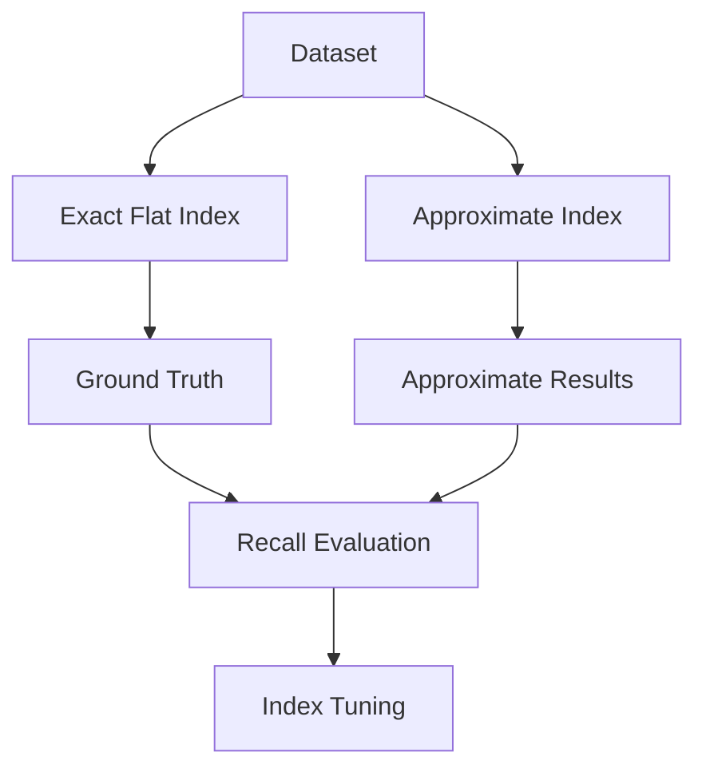
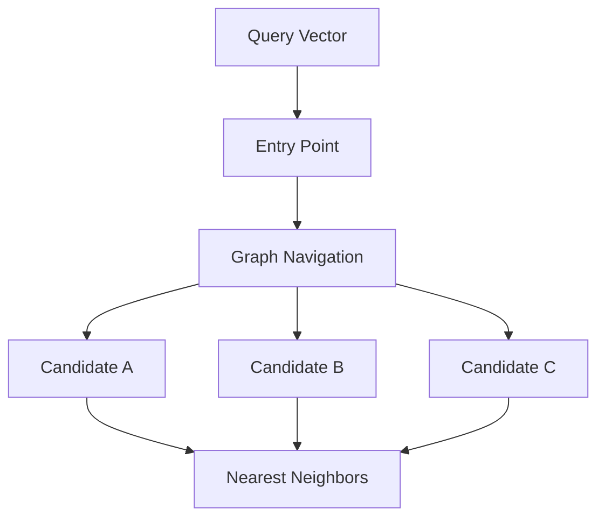
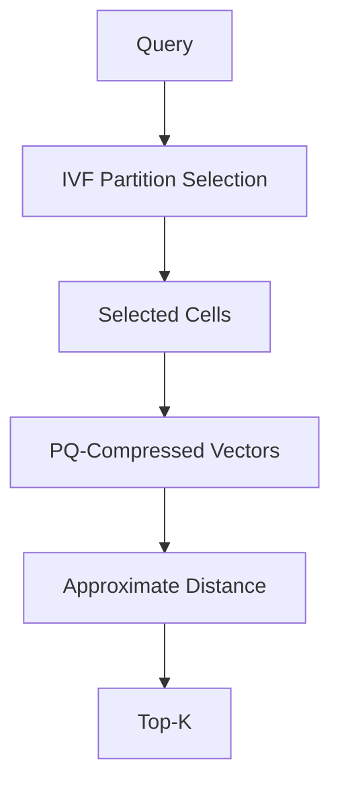
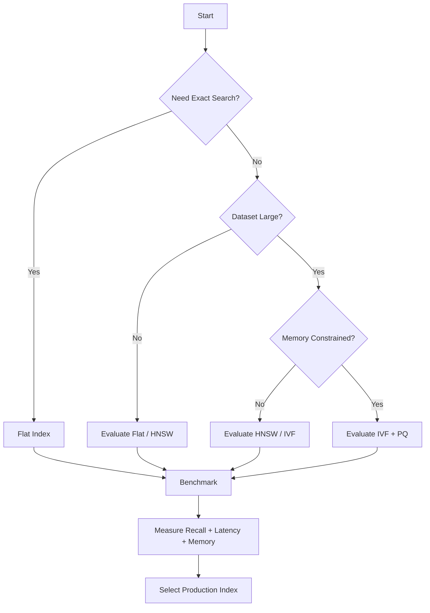
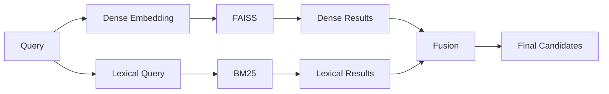
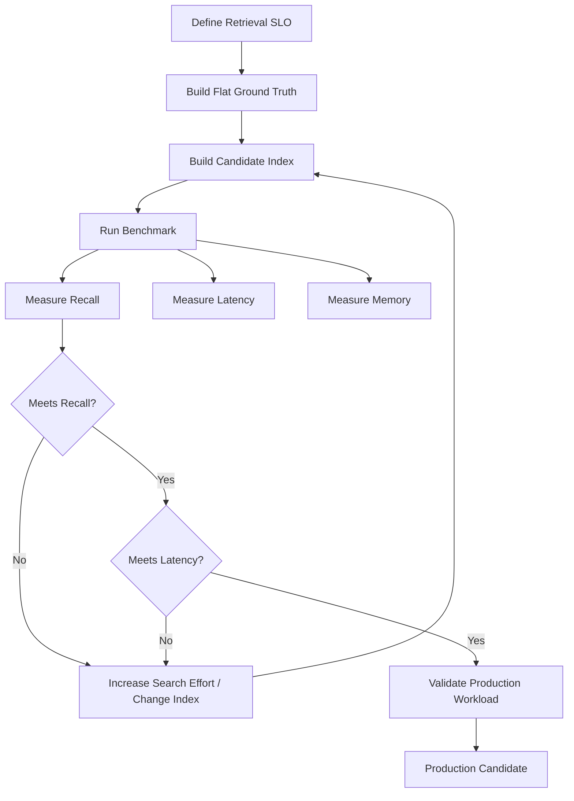
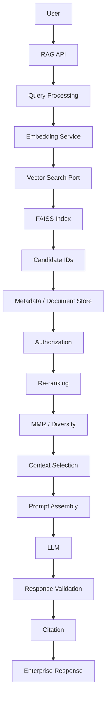
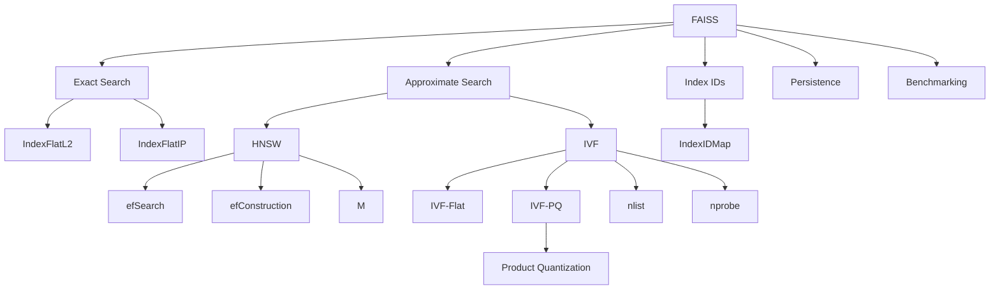

# 02. FAISS Indexes

> **Category:** Vector Search Engineering  
> **Module:** Part V — Advanced Retrieval-Augmented Generation  
> **Difficulty:** Advanced

---

## 📖 Overview

A FAISS index is the core data structure used by FAISS to organize vectors and perform similarity search.

In the previous chapter, we introduced FAISS and the basic `IndexFlatL2` and `IndexFlatIP` indexes.

This chapter goes one level deeper.

The key idea is:

> **Different FAISS indexes make different trade-offs between recall, latency, memory consumption, indexing time, and scalability.**

A production RAG system therefore should not simply ask:

```text
"Which FAISS index should I use?"
```

It should ask:

```text
Dataset Size
+
Vector Dimension
+
Recall Requirement
+
Latency SLO
+
Memory Budget
+
Update Frequency
+
Hardware
+
Operational Constraints
        ↓
Index Selection
```

---

# 🎯 Learning Objectives

After completing this chapter, you will be able to:

- Understand the FAISS index hierarchy
- Understand flat indexes
- Understand exact vector search
- Understand `IndexFlatL2`
- Understand `IndexFlatIP`
- Understand ID-based indexes
- Understand HNSW indexes
- Understand IVF indexes
- Understand IVF training
- Understand `nlist`
- Understand `nprobe`
- Understand Product Quantization
- Understand Scalar Quantization
- Understand composite FAISS indexes
- Understand index factory strings
- Compare common FAISS indexes
- Understand memory and latency trade-offs
- Select an index based on workload requirements
- Benchmark indexes using recall and latency
- Understand how indexes fit into enterprise RAG

---

# 🧠 1. What Is a FAISS Index?

A FAISS index is a data structure that stores vectors and provides search operations over them.

Conceptually:

```text
Embedding Vectors
       │
       ▼
┌──────────────────┐
│   FAISS Index    │
│                  │
│ Vector Storage   │
│ Search Structure │
│ Search Algorithm │
└────────┬─────────┘
         │
         ▼
      Top-K
```

Different indexes organize the same vector data differently.

For example:

```text
Flat
    ↓
Compare against all vectors

HNSW
    ↓
Navigate a graph

IVF
    ↓
Search selected partitions

PQ
    ↓
Search compressed representations
```

---

# 🔢 2. Why Multiple Index Types?

Imagine a dataset containing:

```text
10,000 vectors
```

A simple flat index may be completely acceptable.

Now consider:

```text
100,000,000 vectors
```

Exhaustively comparing a query against every vector becomes increasingly expensive.

Therefore, FAISS provides multiple indexing strategies.

The fundamental trade-off is:

```text
                         Accuracy
                            ▲
                            │
                            │
                 Flat       │
                            │
              HNSW / IVF    │
                            │
                 IVF-PQ     │
                            │
                            └──────────────────►
                                  Efficiency
```

The optimal point depends on the application.

---

# 🏗️ 3. FAISS Index Family

A simplified view of the FAISS index ecosystem is:

```text
FAISS Index
│
├── Flat
│   ├── IndexFlatL2
│   └── IndexFlatIP
│
├── ID Mapping
│   ├── IndexIDMap
│   └── IndexIDMap2
│
├── Graph-Based
│   └── HNSW
│
├── Inverted File
│   └── IVF
│
├── Quantization
│   ├── PQ
│   └── Scalar Quantization
│
└── Composite
    ├── IVF + Flat
    ├── IVF + PQ
    └── IVF + HNSW
```

The important distinction is that these are not simply different APIs.

They represent different retrieval algorithms.

---

# 🧱 4. Flat Indexes

A flat index stores vectors directly and performs exhaustive search.

The two most common forms are:

```text
IndexFlatL2
IndexFlatIP
```

They provide exact nearest-neighbor search.

---

# 📐 5. `IndexFlatL2`

```python
import faiss

dimension = 384

index = faiss.IndexFlatL2(
    dimension
)
```

The index uses squared Euclidean distance.

Search:

```python
distances, ids = index.search(
    query_vectors,
    5
)
```

The returned distances are:

```text
Lower
=
Better
```

---

# 🔵 6. `IndexFlatIP`

For inner-product similarity:

```python
import faiss

dimension = 384

index = faiss.IndexFlatIP(
    dimension
)
```

Search:

```python
scores, ids = index.search(
    query_vectors,
    5
)
```

The returned scores are:

```text
Higher
=
Better
```

---

# 🟢 7. Cosine Similarity Using Flat Index

FAISS does not need a separate cosine index.

Cosine similarity can be implemented using:

```text
L2 Normalization
       ↓
IndexFlatIP
```

Example:

```python
import faiss
import numpy as np

dimension = 384

vectors = np.random.random(
    (10000, dimension)
).astype("float32")

faiss.normalize_L2(vectors)

index = faiss.IndexFlatIP(
    dimension
)

index.add(vectors)

query = np.random.random(
    (1, dimension)
).astype("float32")

faiss.normalize_L2(query)

scores, ids = index.search(
    query,
    10
)
```

---

# 📊 8. Flat Index Characteristics

| Property | Flat Index |
|---|---|
| Search Type | Exact |
| Recall | Maximum |
| Training | Not required |
| Implementation | Simple |
| Memory | High for large datasets |
| Latency | Increases with dataset size |
| Best Use | Baselines / smaller datasets |

Flat indexes are extremely important because they provide a ground-truth reference for evaluating approximate indexes.

---

# 🧪 9. Flat Index as Ground Truth

Suppose we have:

```text
1,000,000 vectors
```

We can build:

```text
Exact Flat Index
```

and:

```text
Approximate Index
```

Then compare their results.



This is one of the most important uses of flat indexes in production engineering.

---

# 🆔 10. ID-Based Indexes

FAISS can associate vectors with application-level IDs.

For example:

```text
Vector Position
      ↓
Application Document ID
```

Instead of relying only on:

```text
0
1
2
3
```

you may want:

```text
100001
100002
100003
```

or another application-defined identifier.

---

# 🔗 11. `IndexIDMap`

Example:

```python
base_index = faiss.IndexFlatIP(
    dimension
)

index = faiss.IndexIDMap(
    base_index
)
```

Then:

```python
ids = np.array(
    [1001, 1002, 1003],
    dtype="int64"
)

index.add_with_ids(
    vectors,
    ids
)
```

This creates a mapping between:

```text
FAISS Vector
      │
      ▼
Application ID
```

---

# 🆔 12. `IndexIDMap2`

FAISS also provides:

```python
index = faiss.IndexIDMap2(
    base_index
)
```

The ID mapping layer becomes particularly useful when the application needs explicit identifiers rather than positional vector IDs.

In enterprise RAG, those IDs can map to:

```text
Document ID
Chunk ID
Page
Tenant
Version
Source
```

---

# 🧩 13. Metadata Mapping

A common architecture is:


FAISS returns vector identifiers.

The application resolves those identifiers into business objects.

---

# 🌐 14. HNSW Index

HNSW stands for:

> **Hierarchical Navigable Small World**

It is a graph-based approximate nearest-neighbor search algorithm.

Instead of comparing a query against every vector, HNSW navigates a graph of connected vectors.

Conceptually:

```text
                 A
              /     \
             B       C
           /  \       \
          D    E       F
              / \
             G   H
```

The query starts from an entry point and navigates through the graph toward increasingly similar vectors.

---

# 🏗️ 15. HNSW Architecture



HNSW attempts to reduce the number of vectors that must be evaluated.

---

# 🧠 16. HNSW Parameters

Important HNSW parameters include:

```text
M
efConstruction
efSearch
```

### `M`

Controls the number of graph connections.

Higher values can improve graph connectivity but increase memory usage.

### `efConstruction`

Controls the effort used while constructing the graph.

Higher values can improve graph quality but increase build time.

### `efSearch`

Controls the amount of search effort.

Higher values generally improve recall but increase search latency.

---

# ⚖️ 17. HNSW Trade-Off

```text
efSearch ↑
    │
    ├── Recall ↑
    └── Latency ↑
```

Similarly:

```text
M ↑
    │
    ├── Graph Connectivity ↑
    ├── Memory ↑
    └── Build Cost ↑
```

These parameters should be tuned using representative production workloads.

---

# 🧪 18. HNSW Example

A basic HNSW index can be created using:

```python
import faiss

dimension = 384

index = faiss.IndexHNSWFlat(
    dimension,
    32
)
```

Here:

```text
dimension = 384
M = 32
```

A search can then be performed with:

```python
distances, ids = index.search(
    query,
    10
)
```

---

# ⚙️ 19. HNSW Search Parameter

The search effort can be adjusted through the HNSW search configuration.

Conceptually:

```python
index.hnsw.efSearch = 64
```

Increasing search effort can improve recall.

But:

```text
Recall ↑
Latency ↑
```

is the important production trade-off.

---

# 🗃️ 20. IVF Index

IVF stands for:

> **Inverted File**

IVF partitions the vector space into multiple regions.

Instead of searching all vectors:

```text
All Vectors
```

the query first identifies relevant partitions.

Then only those partitions are searched.

---

# 🧭 21. IVF Architecture

```text
                  Vector Space

┌──────────┬──────────┬──────────┐
│          │          │          │
│    C1    │    C2    │    C3    │
│          │          │          │
├──────────┼──────────┼──────────┤
│          │          │          │
│    C4    │    C5    │    C6    │
│          │          │          │
└──────────┴──────────┴──────────┘

                    Query
                      ●
                      │
                      ▼
               Relevant Cells
```

Only selected cells are searched.

---

# 🧮 22. IVF Training

Unlike a flat index, IVF generally requires a training phase.

Example:

```python
quantizer = faiss.IndexFlatL2(
    dimension
)

index = faiss.IndexIVFFlat(
    quantizer,
    dimension,
    nlist
)
```

Before adding vectors:

```python
index.train(
    training_vectors
)
```

Then:

```python
index.add(
    vectors
)
```

The lifecycle becomes:

```text
Training Vectors
       ↓
     train()
       ↓
Learn Partitions
       ↓
     add()
       ↓
Production Vectors
```

---

# 🔢 23. `nlist`

`nlist` determines the number of IVF partitions.

Example:

```python
nlist = 100
```

means the vector space is partitioned into approximately:

```text
100 cells
```

Conceptually:

```text
All Vectors
     ↓
 ┌───┬───┬───┬───┐
 │ C1│ C2│ C3│...│
 └───┴───┴───┴───┘
```

---

# 🔎 24. `nprobe`

`nprobe` determines how many IVF cells are searched for a query.

Example:

```python
index.nprobe = 10
```

means:

```text
100 total cells
       ↓
Search 10 cells
```

Increasing `nprobe` generally improves recall but increases latency.

---

# ⚖️ 25. `nlist` vs `nprobe`

| Parameter | Purpose | Higher Value |
|---|---|---|
| `nlist` | Number of partitions | More granular partitioning |
| `nprobe` | Cells searched per query | Higher recall / latency |

A useful mental model:

```text
nlist
=
How finely do we partition the data?

nprobe
=
How much of those partitions do we search?
```

---

# 🧪 26. IVF Example

```python
import faiss
import numpy as np

dimension = 384
nlist = 100

quantizer = faiss.IndexFlatL2(
    dimension
)

index = faiss.IndexIVFFlat(
    quantizer,
    dimension,
    nlist,
    faiss.METRIC_L2
)

training_vectors = np.random.random(
    (10000, dimension)
).astype("float32")

index.train(
    training_vectors
)

vectors = np.random.random(
    (100000, dimension)
).astype("float32")

index.add(vectors)

index.nprobe = 10

query = np.random.random(
    (1, dimension)
).astype("float32")

distances, ids = index.search(
    query,
    10
)
```

---

# 🧠 27. IVF Mental Model

Think of IVF as:

```text
1,000,000 vectors
       ↓
100 partitions
       ↓
Query identifies relevant partitions
       ↓
Search 10 partitions
       ↓
Candidate vectors
       ↓
Top-K
```

Instead of searching:

```text
1,000,000 vectors
```

the system searches a much smaller candidate region.

---

# 📊 28. IVF Recall Trade-Off

```text
nprobe = 1

Fast
 ↓
Lower Recall
```

```text
nprobe = 10

Balanced
 ↓
Higher Recall
 ↓
Higher Latency
```

```text
nprobe = 100

Near Exhaustive
 ↓
Very High Recall
 ↓
Higher Search Cost
```

The exact behavior depends on dataset distribution and index configuration.

---

# 🗜️ 29. Product Quantization

Product Quantization, or PQ, compresses vectors.

The main idea is:

```text
Large Vector
     ↓
Split into Subvectors
     ↓
Quantize Each Subvector
     ↓
Compact Representation
```

Example:

```text
Original:

[ x1 x2 x3 x4 x5 x6 x7 x8 ]

             ↓

Split:

[ x1 x2 ] [ x3 x4 ] [ x5 x6 ] [ x7 x8 ]

             ↓

Quantized:

[ c1 ] [ c2 ] [ c3 ] [ c4 ]
```

---

# 💾 30. Why Quantization?

Raw float32 vectors require:

```text
4 bytes
per dimension
```

For very large datasets, memory consumption can become significant.

Quantization reduces the representation size.

The trade-off is:

```text
Memory ↓
Storage ↓
Potential Search Efficiency ↑
        │
        ▼
Approximation Error ↑
        │
        ▼
Recall may ↓
```

---

# 🔢 31. Scalar Quantization

Scalar quantization compresses vector components individually.

Conceptually:

```text
float32
   ↓
Reduced Precision
   ↓
Compressed Representation
```

This can reduce memory usage while maintaining reasonable retrieval quality depending on the workload.

---

# 🧩 32. Composite Indexes

FAISS becomes especially powerful when multiple techniques are combined.

Examples:

```text
IVF + Flat
IVF + PQ
IVF + Scalar Quantization
IVF + HNSW
```

The architecture can become:

```text
Query
  ↓
Partition Selection
  ↓
Candidate Retrieval
  ↓
Compressed Distance Computation
  ↓
Top-K
```

---

# 🏗️ 33. IVF + Flat

An IVF-Flat index combines:

```text
IVF
+
Exact vector representation inside selected cells
```

Conceptually:

```text
All Vectors
     ↓
IVF Partitioning
     ↓
Selected Cells
     ↓
Flat Search Inside Cells
     ↓
Top-K
```

This provides a useful compromise between exhaustive search and heavily compressed retrieval.

---

# 🗜️ 34. IVF + PQ

IVF-PQ combines:

```text
IVF
+
Product Quantization
```

Architecture:



This can significantly reduce memory requirements for large datasets.

---

# 🧠 35. Composite Index Mental Model

Think of a composite index as:

```text
First Stage
---------
Where should I search?

        ↓

Second Stage
---------
How should I represent/search vectors efficiently?

        ↓

Final Stage
---------
Which candidates are closest?
```

For example:

```text
IVF
 ↓
PQ
 ↓
Distance Search
```

---

# 🧭 36. FAISS Index Factory

FAISS provides an index-factory mechanism that can describe complex indexes using strings.

Example:

```python
index = faiss.index_factory(
    dimension,
    "IVF100,Flat",
    faiss.METRIC_L2
)
```

Another conceptual form is:

```text
IVF100,PQ16
```

The factory syntax is useful because complex index configurations can be expressed declaratively.

---

# 🏭 37. Index Factory Mental Model

```text
"IVF100,Flat"
       │
       ├── IVF
       │
       ├── 100 partitions
       │
       └── Flat vectors
```

Similarly:

```text
"IVF100,PQ16"
       │
       ├── IVF
       ├── 100 partitions
       └── PQ compression
```

Always validate the exact factory configuration against the FAISS version being used.

---

# 📋 38. Index Comparison

| Index | Search | Training | Memory | Scalability | Typical Use |
|---|---|---|---|---|---|
| Flat L2 | Exact | No | High | Low-Medium | Baseline |
| Flat IP | Exact | No | High | Low-Medium | Semantic Search |
| HNSW | Approximate | No | Higher | High | Low-latency ANN |
| IVF-Flat | Approximate | Yes | Medium-High | High | Large Search |
| IVF-PQ | Approximate | Yes | Low | Very High | Large-scale Search |
| Scalar Quantization | Approximate | Depends | Lower | High | Memory Optimization |

This table is a conceptual starting point rather than a universal benchmark.

---

# 📈 39. Dataset Size and Index Choice

A simplified decision model:

```text
Small Dataset
      ↓
Flat
```

```text
Medium Dataset
      ↓
Flat / HNSW
```

```text
Large Dataset
      ↓
HNSW / IVF
```

```text
Very Large + Memory Constraint
      ↓
IVF + PQ / Quantization
```

But the final choice should always be validated through benchmarking.

---

# 🏎️ 40. Latency vs Recall

Every approximate index introduces tuning opportunities.

```text
                    Recall
                      ▲
                      │
              ●       │
            ●         │
          ●           │
        ●             │
      ●               │
      └────────────────────►
              Latency
```

A production engineer wants a point that satisfies:

```text
Recall ≥ Required Threshold
```

while also satisfying:

```text
P95 Latency ≤ SLO
```

and:

```text
Memory ≤ Infrastructure Budget
```

---

# 📊 41. Benchmarking Indexes

A meaningful benchmark should compare:

```text
Index
├── Recall@K
├── P50 latency
├── P95 latency
├── P99 latency
├── QPS
├── Memory
├── Index Size
├── Build Time
└── Search Parameters
```

Example:

| Index | Recall@10 | P95 | Memory |
|---|---:|---:|---:|
| Flat | 1.00 | 120 ms | High |
| HNSW | 0.97 | 12 ms | High |
| IVF-Flat | 0.94 | 8 ms | Medium |
| IVF-PQ | 0.90 | 5 ms | Low |

The numbers above are illustrative only.

---

# 🧪 42. Benchmark Harness

A basic benchmark can look like:

```python
import time
import numpy as np

def benchmark(index, queries, k):

    start = time.perf_counter()

    distances, ids = index.search(
        queries,
        k
    )

    elapsed = (
        time.perf_counter() - start
    )

    return {
        "queries": len(queries),
        "seconds": elapsed,
        "qps": len(queries) / elapsed
    }
```

For production benchmarking, measure individual query latency distributions rather than only total batch time.

---

# 🎯 43. Recall Evaluation

Suppose an exact Flat index provides:

```text
Ground Truth
```

and an approximate index provides:

```text
Candidate Results
```

Then:

```text
Ground Truth
     +
Approximate Results
     ↓
Recall@K
```

Example:

```text
Ground Truth:
A B C D E

Approximate:
A B C F G

Overlap = 3

Recall@5 = 3 / 5 = 0.60
```

---

# 🧠 44. Why Flat Still Matters

Flat indexes may look inefficient compared with ANN indexes.

But they are extremely important for:

```text
Ground Truth
Evaluation
Debugging
Small Datasets
Regression Testing
Index Tuning
```

Therefore:

```text
Flat
```

should not be dismissed as merely a beginner index.

It is an important engineering reference point.

---

# 🧩 45. Index Selection Framework

Use this decision process:



---

# 🏢 46. FAISS Indexes in RAG

In RAG, the index sits inside the retrieval layer.

```text
Documents
    ↓
Chunking
    ↓
Embedding
    ↓
FAISS Index
    ↓
Candidate Retrieval
    ↓
Re-ranking
    ↓
Context Selection
    ↓
Prompt Assembly
    ↓
LLM
```

The FAISS index determines how candidate vectors are retrieved.

---

# 🔄 47. Multi-Stage Retrieval

A production retrieval pipeline may use:

```text
FAISS
 ↓
Top 100
 ↓
Re-ranking
 ↓
Top 20
 ↓
MMR
 ↓
Top 10
 ↓
Context Selection
 ↓
Top 5
```

This is often more effective than trying to make the initial vector index perform every retrieval decision.

---

# 🔀 48. Hybrid Retrieval

A FAISS index can also participate in hybrid retrieval:



This combines semantic and lexical retrieval.

---

# 🏷️ 49. Metadata-Aware Retrieval

FAISS index selection must also be considered alongside metadata filtering.

A production request may contain:

```text
tenant_id = enterprise-42
department = finance
region = EU
document_type = policy
```

The architecture becomes:

```text
Query
 ↓
Vector Search
 ↓
Candidate IDs
 ↓
Metadata / Authorization
 ↓
Filtered Candidates
```

Security filtering must be designed carefully so unauthorized content does not reach the generation stage.

---

# 👥 50. Multi-Tenant Indexing

Possible strategies include:

```text
Tenant
   ↓
Separate FAISS Index
```

or:

```text
Shared FAISS Index
       ↓
Metadata Mapping
       ↓
Tenant Filtering
```

or:

```text
Tenant
   ↓
Partition / Shard
   ↓
FAISS Index
```

The correct approach depends on:

```text
Tenant Count
Data Volume
Isolation Requirements
Latency
Memory
Operational Complexity
```

---

# 🔄 51. Index Versioning

Production FAISS indexes should be versioned.

Example:

```text
rag-index-v1
rag-index-v2
rag-index-v3
```

Each version should identify:

```text
Embedding Model
Embedding Dimension
Chunking Version
Index Type
Index Parameters
Document Snapshot
```

Example:

```json
{
  "index_version": "v3",
  "embedding_model": "embedding-v2",
  "dimension": 1536,
  "index_type": "IVF-PQ",
  "nlist": 4096,
  "nprobe": 32,
  "chunking_version": "v4"
}
```

---

# 🚦 52. Blue-Green Index Deployment

A production migration can follow:

```text
Existing Index
     │
     │ serving
     ▼
Production Traffic

New Index
     │
     ▼
Build
     ↓
Validate
     ↓
Benchmark
     ↓
Shadow Test
     ↓
Production Switch
```

This avoids rebuilding the active index destructively.

---

# 💾 53. Index Persistence

Persist an index:

```python
faiss.write_index(
    index,
    "index.faiss"
)
```

Reload it:

```python
index = faiss.read_index(
    "index.faiss"
)
```

Production storage might look like:

```text
rag-index-v3/
│
├── index.faiss
├── manifest.json
├── metadata.json
└── checksum.sha256
```

---

# 🔐 54. Index Artifact Integrity

Before loading an index:

```text
Checksum
   ↓
Manifest
   ↓
Dimension
   ↓
Embedding Model
   ↓
Index Configuration
   ↓
Load
```

This helps prevent:

```text
Wrong Index
Wrong Embedding Model
Wrong Dimension
Wrong Configuration
```

from silently entering production.

---

# 🧮 55. Memory Considerations

For raw float32 vectors:

```text
Memory
≈
Vector Count
×
Dimension
×
4 bytes
```

Example:

```text
1,000,000 vectors
1536 dimensions
```

approximately requires:

```text
1,000,000
× 1536
× 4

≈ 6.144 GB
```

before additional index structures and application overhead.

Quantization can significantly reduce this requirement.

---

# 🗜️ 56. Quantization Trade-Off

```text
Float32
   ↓
High Precision
   ↓
High Memory

Quantized
   ↓
Lower Precision
   ↓
Lower Memory
   ↓
Potential Recall Loss
```

Therefore:

```text
Memory
  ↕
Recall
  ↕
Latency
```

must be evaluated together.

---

# ⚙️ 57. Hardware Considerations

Index selection can depend on:

```text
CPU
RAM
GPU
GPU Memory
Storage
Network
Query Volume
```

For example:

```text
CPU-heavy workload
      ↓
HNSW / IVF evaluation
```

while GPU acceleration may be useful for:

```text
Large-scale batch search
High-throughput workloads
Large vector datasets
```

The exact architecture should be benchmarked against the target hardware.

---

# 📈 58. Throughput vs Latency

These are different measurements.

Latency asks:

```text
How long does one query take?
```

Throughput asks:

```text
How many queries can the system process?
```

A batch benchmark may show high throughput while hiding poor individual-query tail latency.

Therefore production testing should measure both.

---

# ⏱️ 59. Tail Latency

Do not rely only on average latency.

Measure:

```text
P50
P95
P99
```

Example:

```text
P50 = 8 ms
P95 = 18 ms
P99 = 45 ms
```

If the RAG API has a strict latency SLO, P95/P99 may be more important than average latency.

---

# 🔬 60. Production Benchmark Matrix

A useful benchmark matrix could be:

```text
Dataset Size
├── 100K
├── 1M
├── 10M
└── 100M

Index
├── Flat
├── HNSW
├── IVF-Flat
└── IVF-PQ

Metrics
├── Recall@5
├── Recall@10
├── P50
├── P95
├── P99
├── QPS
└── Memory
```

This provides a more meaningful basis for architectural decisions.

---

# 🧠 61. Choosing Between HNSW and IVF

A simplified comparison:

| Characteristic | HNSW | IVF |
|---|---|---|
| Algorithm | Graph | Partitioning |
| Training | Usually not required | Required |
| Search Parameter | `efSearch` | `nprobe` |
| Memory | Can be high | Tunable |
| Search | Graph navigation | Selected partitions |
| Tuning | Graph parameters | Partition parameters |
| Best Fit | Low-latency ANN | Large-scale partitioned search |

Neither is universally superior.

---

# 🧩 62. Choosing Between IVF-Flat and IVF-PQ

```text
IVF-Flat
    ↓
Higher Vector Fidelity
    ↓
Higher Memory
```

```text
IVF-PQ
    ↓
Compressed Vectors
    ↓
Lower Memory
    ↓
Potential Recall Reduction
```

If memory is abundant and recall is critical:

```text
IVF-Flat
```

may be a strong candidate.

If the dataset is extremely large and memory is constrained:

```text
IVF-PQ
```

may be worth evaluating.

---

# 🧪 63. Index Tuning Workflow



---

# 🧪 64. Example Tuning

Suppose:

```text
Required Recall@10 >= 95%
Required P95 <= 20 ms
```

Test:

```text
Configuration A
Recall = 89%
P95 = 8 ms

Configuration B
Recall = 95%
P95 = 16 ms

Configuration C
Recall = 98%
P95 = 32 ms
```

The likely candidate is:

```text
Configuration B
```

because it satisfies both SLOs.

The fastest configuration is not automatically the best configuration.

---

# 🚨 65. Common Mistake — Choosing by Popularity

Avoid:

```text
"HNSW is popular, so use HNSW."
```

or:

```text
"IVF-PQ is scalable, so use IVF-PQ."
```

Instead:

```text
Requirements
    ↓
Candidates
    ↓
Benchmark
    ↓
Production SLO
    ↓
Decision
```

---

# 🚨 66. Common Mistake — Skipping Training

For indexes that require training:

```python
index.add(vectors)
```

before:

```python
index.train(training_vectors)
```

is incorrect.

The correct lifecycle is:

```text
train()
  ↓
add()
  ↓
search()
```

---

# 🚨 67. Common Mistake — Confusing `nlist` and `nprobe`

Remember:

```text
nlist
=
Number of IVF partitions
```

while:

```text
nprobe
=
Number of partitions searched per query
```

A simple mental model:

```text
nlist = 1000
nprobe = 20

1000 total cells
       ↓
20 cells searched
```

---

# 🚨 68. Common Mistake — Optimizing Only Memory

A compressed index may reduce:

```text
Memory
```

but potentially reduce:

```text
Recall
```

Therefore:

```text
Memory Optimization
```

must always be evaluated against:

```text
Retrieval Quality
```

---

# 🚨 69. Common Mistake — No Exact Baseline

Without a Flat baseline:

```text
ANN Recall
```

cannot be meaningfully evaluated against exact nearest neighbors.

Always establish:

```text
Flat Index
     ↓
Ground Truth
```

before tuning an approximate index.

---

# 🚨 70. Common Mistake — Using Only Average Latency

Average latency can hide:

```text
P95
P99
```

tail behavior.

Production retrieval systems should measure the complete latency distribution.

---

# 🏢 71. Enterprise Retrieval Architecture



---

# 🧩 72. Capability-Based Vector Search

The application should depend on a capability:

```python
class VectorSearchProvider:

    def search(
        self,
        query_vector,
        top_k
    ):
        raise NotImplementedError
```

A FAISS implementation:

```python
class FaissVectorSearchProvider(
    VectorSearchProvider
):

    def __init__(self, index):
        self.index = index

    def search(
        self,
        query_vector,
        top_k
    ):
        return self.index.search(
            query_vector,
            top_k
        )
```

This creates:

```text
Application
     ↓
VectorSearchProvider
     ↓
FAISS Adapter
```

instead of coupling the entire application directly to FAISS.

---

# 🏛️ 73. Ports & Adapters Perspective

```text
Application Layer
       │
       ▼
VectorSearchPort
       │
       ▼
FAISS Adapter
       │
       ▼
FAISS Index
```

This architecture allows the underlying retrieval technology to evolve.

For example:

```text
FAISS
  ↓
Milvus
  ↓
Chroma
  ↓
Managed Vector Database
```

without forcing major changes in the application layer.

---

# 🔄 74. Index Migration

A production migration can look like:

```text
FAISS Index V1
      │
      │ serving
      ▼
Production

FAISS Index V2
      │
      ├── Build
      ├── Validate
      ├── Benchmark
      └── Shadow Test
             │
             ▼
        Traffic Switch
```

The application should not need to know the internal construction details of the new index.

---

# 📊 75. Index Observability

Track:

```text
index_version
index_type
embedding_model
embedding_dimension
search_metric
top_k
search_parameter
candidate_count
search_latency
```

For example:

```json
{
  "index_version": "v17",
  "index_type": "HNSW",
  "embedding_model": "embedding-v3",
  "dimension": 1536,
  "top_k": 50,
  "ef_search": 64,
  "latency_ms": 12
}
```

This makes retrieval behavior explainable.

---

# 🔍 76. Debugging Retrieval

When a RAG response is poor, ask:

```text
Was the query embedded correctly?
        ↓
Did the correct index receive it?
        ↓
Was the metric correct?
        ↓
Was normalization correct?
        ↓
Was the search parameter appropriate?
        ↓
Were relevant candidates retrieved?
        ↓
Did metadata filtering remove them?
        ↓
Did re-ranking remove them?
        ↓
Did context selection remove them?
```

The index is only one stage of the complete retrieval chain.

---

# 🧠 77. Retrieval Quality Is a Pipeline Property

A common misconception is:

```text
Better Index
=
Better RAG
```

In reality:

```text
RAG Quality
=
Embedding Quality
+
Chunking Quality
+
Retrieval Quality
+
Filtering Quality
+
Ranking Quality
+
Context Quality
+
Generation Quality
```

Therefore index selection should be evaluated as part of the complete retrieval pipeline.

---

# 📌 78. Key Takeaways

- A FAISS index determines how vectors are stored and searched.
- Different indexes provide different accuracy, latency, memory, and scalability trade-offs.
- Flat indexes perform exact search.
- `IndexFlatL2` uses squared L2 distance.
- `IndexFlatIP` uses inner-product similarity.
- Cosine similarity can be implemented with normalized vectors and inner product.
- Flat indexes are valuable as ground-truth references.
- `IndexIDMap` and `IndexIDMap2` provide application-level vector identifiers.
- HNSW is a graph-based approximate nearest-neighbor approach.
- HNSW tuning includes parameters such as `M`, `efConstruction`, and `efSearch`.
- IVF partitions vector space into multiple cells.
- IVF normally requires training before vectors are added.
- `nlist` controls the number of IVF partitions.
- `nprobe` controls how many partitions are searched.
- Increasing search effort generally improves recall while increasing latency.
- Product Quantization compresses vector representations.
- Scalar quantization can reduce memory usage through reduced precision.
- Composite indexes combine multiple indexing techniques.
- IVF-Flat combines partitioning with full vector representations.
- IVF-PQ combines partitioning with product quantization.
- Index factory strings can describe complex FAISS index configurations.
- Index selection should be benchmark-driven.
- Recall, latency, memory, throughput, build time, and update behavior should all be considered.
- Exact Flat search is an important benchmark baseline even when production uses ANN.
- Production RAG systems should version indexes and embedding models.
- FAISS should normally be hidden behind a retrieval capability or infrastructure adapter.
- Metadata, authorization, multi-tenancy, persistence, observability, and disaster recovery must be handled as part of the larger architecture.
- The best FAISS index is the one that satisfies the actual production SLOs.

---

# 🏭 79. Production Checklist

```text
☐ Identify dataset size
☐ Identify vector dimension
☐ Identify embedding model
☐ Select similarity metric
☐ Establish Flat ground truth
☐ Define Recall@K target
☐ Define P95 latency target
☐ Define P99 latency target
☐ Define memory budget
☐ Define throughput target

☐ Evaluate Flat
☐ Evaluate HNSW
☐ Evaluate IVF
☐ Evaluate IVF-Flat
☐ Evaluate IVF-PQ where appropriate
☐ Evaluate quantization where appropriate

☐ Tune HNSW parameters
☐ Tune IVF nlist
☐ Tune IVF nprobe
☐ Tune PQ configuration

☐ Benchmark Recall
☐ Benchmark latency
☐ Benchmark throughput
☐ Benchmark memory
☐ Benchmark build time

☐ Version index
☐ Version embedding model
☐ Store index manifest
☐ Store index checksum
☐ Define rebuild strategy
☐ Define migration strategy
☐ Define rollback strategy
☐ Define backup strategy

☐ Add retrieval observability
☐ Track index version
☐ Track search parameters
☐ Track retrieval latency
☐ Track candidate count
☐ Validate authorization
☐ Validate tenant isolation
☐ Test failure recovery
```

---

# 🔬 80. Practical Engineering Exercise

Build and compare four indexes over the same dataset:

```text
Dataset:
100,000 vectors

Dimension:
384

Top-K:
10
```

Implement:

```text
1. IndexFlatL2
2. HNSW
3. IVF-Flat
4. IVF-PQ
```

For each index measure:

```text
Recall@10
P50
P95
P99
QPS
Memory
Index Size
Build Time
```

Create a comparison table:

| Index | Recall@10 | P95 | Memory | QPS |
|---|---:|---:|---:|---:|
| Flat | | | | |
| HNSW | | | | |
| IVF-Flat | | | | |
| IVF-PQ | | | | |

Then answer:

```text
Which index provides the best recall?

Which index provides the lowest latency?

Which index uses the least memory?

Which index satisfies the production SLO?

Which trade-off would you choose?
```

---

# 🚀 81. Recommended Learning Progression

The Vector Search Engineering sequence now becomes:

```text
01. FAISS Fundamentals
        ↓
02. FAISS Indexes
        ↓
03. IVF and HNSW
        ↓
04. FAISS vs Chroma vs Milvus
```

The distinction is important:

```text
Chapter 01
Understand FAISS
        ↓
Chapter 02
Understand Index Families
        ↓
Chapter 03
Deep Dive into ANN Algorithms
        ↓
Chapter 04
Compare Vector Search Technologies
```

---

# 🗺️ 82. Concept Map



---

# 💡 Final Mental Model

```text
                         FAISS INDEXES
                              │
          ┌───────────────────┼───────────────────┐
          │                   │                   │
          ▼                   ▼                   ▼
        EXACT                ANN              COMPRESSED
          │                   │                   │
          ▼                   ▼                   ▼
      Flat L2             HNSW / IVF          PQ / SQ
      Flat IP                  │                   │
          │                    │                   │
          └────────────┬───────┴───────────────────┘
                       ▼
                 Retrieval Results
                       │
                       ▼
                 RAG Pipeline
                       │
                       ▼
                 Re-ranking
                       │
                       ▼
                Context Selection
                       │
                       ▼
                      LLM
```

The key architectural principle is:

> **FAISS index selection is an engineering optimization problem, not an API-selection problem.**

A production system must balance:

```text
Recall
+
Latency
+
Memory
+
Throughput
+
Build Cost
+
Update Cost
+
Operational Complexity
```

against the application's actual requirements.

---

# 🧭 Chapter Navigation

### Part V — Advanced Retrieval-Augmented Generation

**Previous:**  
[01. FAISS Fundamentals](01-faiss-fundamentals.md)

**Next:**  
[03. IVF and HNSW](03-ivf-and-hnsw.md)

**Section:**  
04 — Vector Search Engineering

### Vector Search Engineering Path

```text
01 FAISS Fundamentals
        ↓
02 FAISS Indexes
        ↓
03 IVF and HNSW
        ↓
04 FAISS vs Chroma vs Milvus
```

---

> **Enterprise AI Engineering Handbook**  
> *Building Production-Grade Enterprise AI Systems — One Chapter at a Time.*