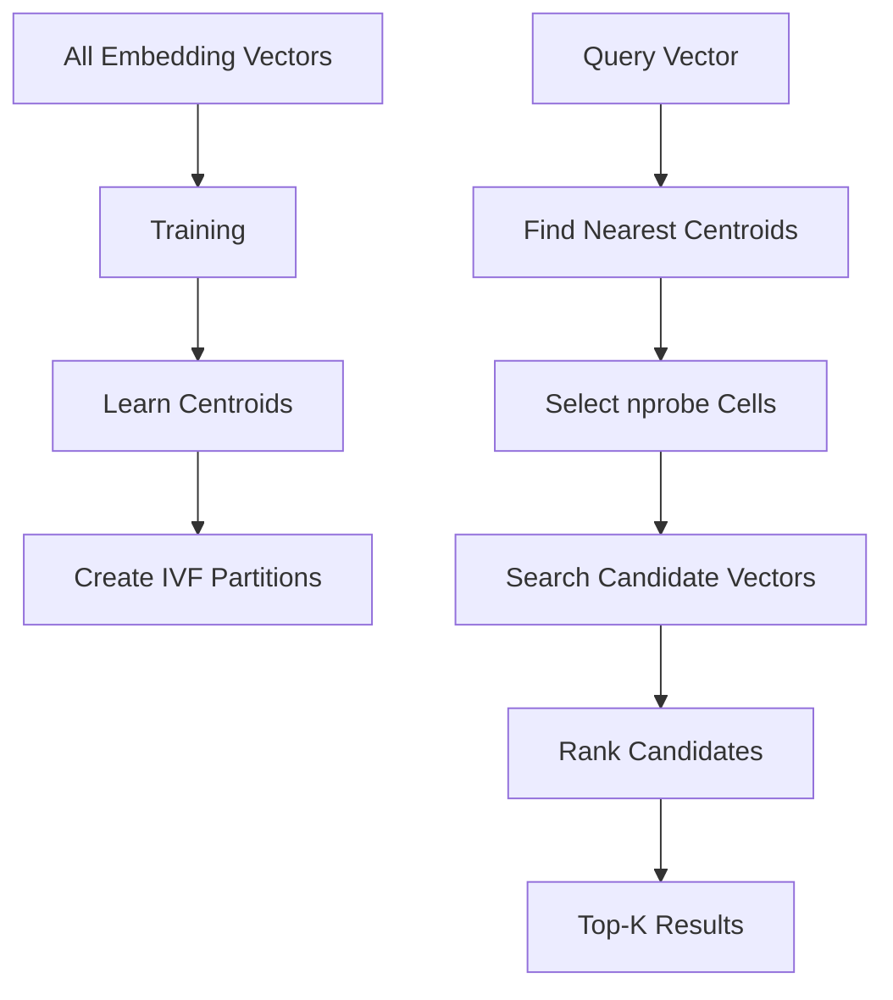
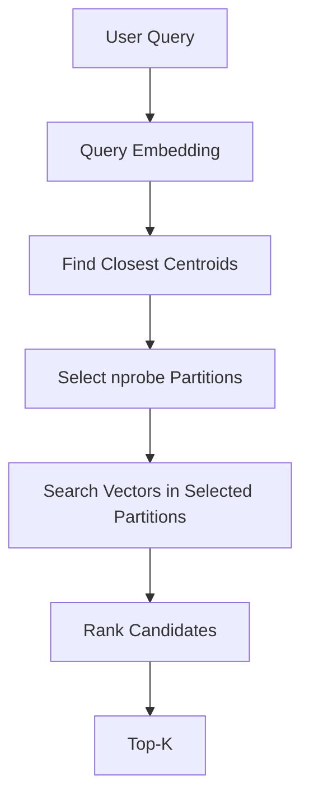
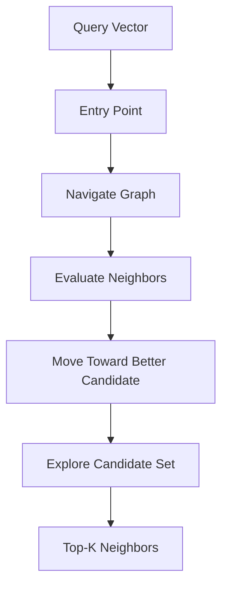
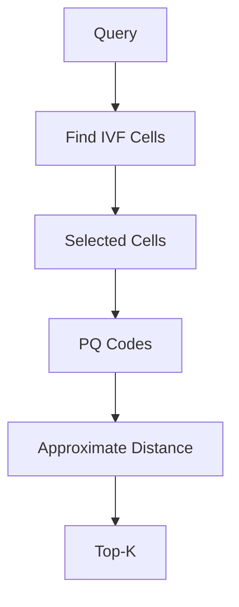
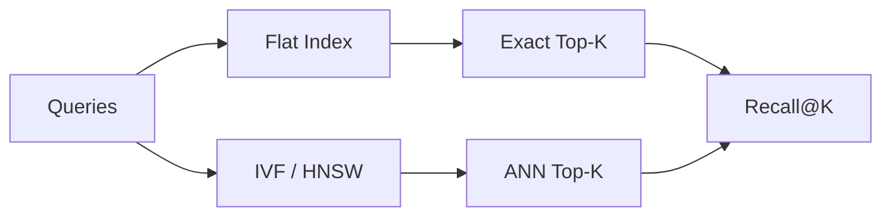
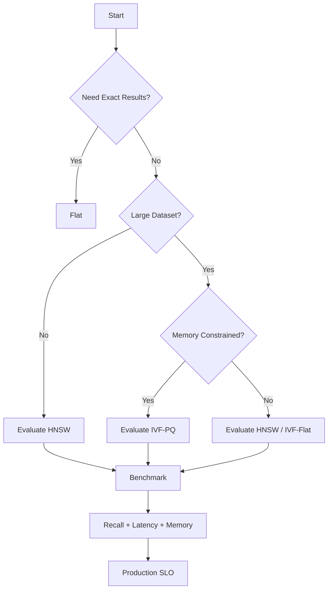
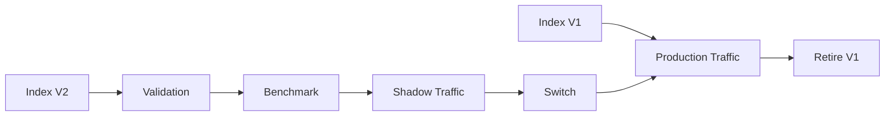
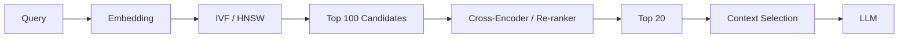
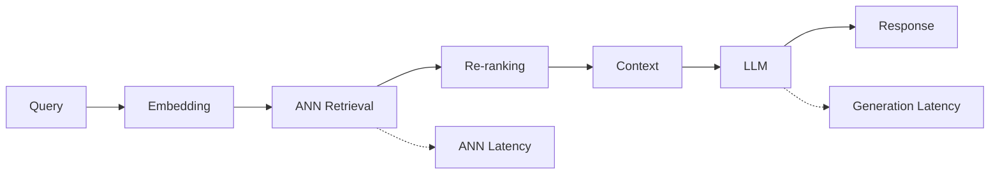
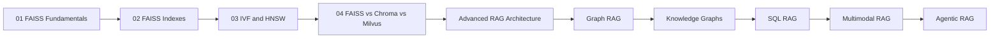

# 03. IVF and HNSW

> **Category:** Vector Search Engineering  
> **Module:** Part V — Advanced Retrieval-Augmented Generation  
> **Difficulty:** Advanced

---

## 📖 Overview

Modern RAG systems can contain millions or even billions of embedding vectors.

Searching every vector for every query provides excellent accuracy, but the computational cost grows with the size of the vector collection.

This is where **Approximate Nearest Neighbor (ANN)** techniques become important.

Two of the most important ANN approaches available in FAISS are:

- **IVF — Inverted File Index**
- **HNSW — Hierarchical Navigable Small World Graph**

Both approaches reduce the amount of search performed for every query, but they do so in fundamentally different ways.

```text
                         Vector Search
                              │
                ┌─────────────┴─────────────┐
                │                           │
                ▼                           ▼
          Exact Search                  ANN Search
                │                           │
                ▼                    ┌──────┴──────┐
             Flat                   IVF           HNSW
                                      │             │
                                      ▼             ▼
                                  Partition       Graph
                                   Search        Navigation
```

The central engineering trade-off is:

```text
Search Speed
     ↕
Recall
     ↕
Memory
```

---

# 🎯 Learning Objectives

After completing this chapter, you will be able to:

- Understand Approximate Nearest Neighbor search
- Understand why ANN is required at scale
- Understand the architecture of IVF
- Understand IVF training
- Understand centroids
- Understand `nlist`
- Understand `nprobe`
- Understand IVF search flow
- Understand HNSW graph-based retrieval
- Understand HNSW layers
- Understand `M`
- Understand `efConstruction`
- Understand `efSearch`
- Understand HNSW search behavior
- Compare IVF and HNSW
- Understand IVF-Flat
- Understand IVF-PQ
- Tune ANN indexes
- Benchmark recall and latency
- Select between IVF and HNSW
- Understand production considerations
- Integrate ANN indexes into enterprise RAG

---

# 🧠 1. Why Approximate Search?

Consider a vector database containing:

```text
10,000 vectors
```

A flat index can compare the query against all vectors.

This may be perfectly acceptable.

Now consider:

```text
100,000,000 vectors
```

An exhaustive search would require the system to evaluate an enormous number of vector comparisons for every query.

The fundamental problem becomes:

```text
Dataset Size
     ↓
Number of Comparisons
     ↓
Search Cost
     ↓
Latency
```

ANN algorithms attempt to reduce the search space.

---

# 🔎 2. Exact vs Approximate Search

## Exact Search

```text
Query
  │
  ├── Compare V1
  ├── Compare V2
  ├── Compare V3
  ├── ...
  └── Compare VN
          │
          ▼
       Top-K
```

Every vector is considered.

---

## Approximate Search

```text
Query
  │
  ▼
Identify Relevant Search Region
  │
  ▼
Search Candidate Vectors
  │
  ▼
Top-K
```

The system intentionally avoids examining the entire dataset.

This can dramatically reduce latency.

---

# ⚖️ 3. ANN Trade-Off

The goal is not simply:

```text
Fastest Search
```

The actual objective is:

```text
High Recall
+
Low Latency
+
Acceptable Memory
+
High Throughput
```

A useful mental model is:

```text
                    Recall
                      ▲
                      │
                      │       ●
                      │     ●
                      │   ●
                      │ ●
                      └──────────────────►
                             Latency
```

Moving toward higher recall generally requires more search effort.

---

# 🏗️ 4. Two Major ANN Strategies

IVF and HNSW solve the search problem differently.

```text
IVF
 │
 ├── Partition vector space
 ├── Find relevant partitions
 └── Search vectors in those partitions


HNSW
 │
 ├── Build a graph
 ├── Navigate graph
 └── Search promising neighbors
```

The distinction is:

```text
IVF
=
Where should I search?

HNSW
=
Which neighboring vectors should I explore?
```

---

# 🗃️ 5. IVF — Inverted File Index

IVF stands for:

> **Inverted File**

The fundamental idea is to divide the vector space into multiple partitions, also called cells.

Suppose we have:

```text
1,000,000 vectors
```

We could create:

```text
1,000 partitions
```

Instead of searching:

```text
1,000,000 vectors
```

the query searches only a subset of the partitions.

---

# 🧭 6. IVF Concept

Imagine the vector space as:

```text
┌────────────┬────────────┬────────────┐
│            │            │            │
│   Cell 1   │   Cell 2   │   Cell 3   │
│            │            │            │
├────────────┼────────────┼────────────┤
│            │            │            │
│   Cell 4   │   Cell 5   │   Cell 6   │
│            │            │            │
├────────────┼────────────┼────────────┤
│            │            │            │
│   Cell 7   │   Cell 8   │   Cell 9   │
│            │            │            │
└────────────┴────────────┴────────────┘

                       ● Query
```

The query does not need to search every cell.

It first identifies the cells closest to the query.

---

# 🧩 7. IVF Architecture



---

# 🎓 8. IVF Training

IVF needs to learn how to partition the vector space.

This is normally performed using a clustering process.

Conceptually:

```text
Training Vectors
       │
       ▼
Clustering
       │
       ▼
Centroids
       │
       ▼
Vector Partitions
```

The centroids act as representative points for the partitions.

---

# 📍 9. Centroids

Suppose we create four clusters:

```text
Cluster A → Centroid A
Cluster B → Centroid B
Cluster C → Centroid C
Cluster D → Centroid D
```

Conceptually:

```text
      ● ● ●
    ●   A   ●

                 ● ●
               ●  B ●

       ●
     ● C ●

                         ● ●
                       ●  D
```

Every vector is associated with a nearby centroid.

---

# 🔢 10. `nlist`

The number of IVF partitions is controlled by:

```text
nlist
```

Example:

```python
nlist = 100
```

means the IVF index is configured with:

```text
100 partitions
```

A simplified representation:

```text
                 IVF
                  │
        ┌─────────┼─────────┐
        ▼         ▼         ▼
      Cell 1    Cell 2    Cell 3
        ...
      Cell 100
```

---

# ⚙️ 11. Creating an IVF Index

```python
import faiss

dimension = 384
nlist = 100

quantizer = faiss.IndexFlatL2(
    dimension
)

index = faiss.IndexIVFFlat(
    quantizer,
    dimension,
    nlist,
    faiss.METRIC_L2
)
```

The `quantizer` is used to identify the closest IVF centroids.

---

# 🎓 12. Training the IVF Index

Before adding production vectors:

```python
index.train(
    training_vectors
)
```

Then:

```python
index.add(
    vectors
)
```

The lifecycle is:

```text
Training Data
      │
      ▼
 index.train()
      │
      ▼
Learn IVF Structure
      │
      ▼
 index.add()
      │
      ▼
Store Production Vectors
```

---

# 🚨 13. Training Is Not Adding

These operations have different purposes.

### `train()`

Learns the index structure.

```python
index.train(
    training_vectors
)
```

### `add()`

Adds production vectors.

```python
index.add(
    vectors
)
```

Therefore:

```text
train()
=
Learn

add()
=
Store
```

---

# 📊 14. Choosing Training Data

Training vectors should be representative of the production data.

For example, if your enterprise knowledge base contains:

```text
Financial Documents
Technical Documents
Legal Documents
Product Documents
Support Documents
```

the training dataset should ideally represent these distributions.

Poor training data can lead to poor partitions.

---

# 🔎 15. `nprobe`

Once the IVF index has been trained, the query needs to determine how many partitions to search.

This is controlled by:

```python
index.nprobe = 10
```

If:

```text
nlist = 100
nprobe = 10
```

then:

```text
100 total partitions
       ↓
Search 10 partitions
```

---

# ⚖️ 16. `nprobe` Trade-Off

```text
nprobe ↑
    │
    ├── Search More Partitions
    ├── Recall ↑
    └── Latency ↑
```

Conversely:

```text
nprobe ↓
    │
    ├── Search Fewer Partitions
    ├── Latency ↓
    └── Recall may ↓
```

This is one of the most important IVF tuning parameters.

---

# 📐 17. `nlist` vs `nprobe`

The difference can be remembered as:

```text
nlist
=
How many partitions exist?

nprobe
=
How many partitions do I search?
```

Example:

```text
nlist = 4096
nprobe = 32
```

means:

```text
4096 total partitions

32 partitions searched per query
```

---

# 🔄 18. IVF Query Flow



This is the fundamental IVF retrieval process.

---

# 🧮 19. IVF Example

Suppose:

```text
Vectors = 1,000,000
nlist = 1,000
nprobe = 10
```

A simplified mental model is:

```text
1,000,000 vectors
       ↓
1,000 partitions
       ↓
~1,000 vectors / partition
       ↓
10 partitions searched
       ↓
~10,000 candidate vectors
```

The actual distribution will not necessarily be perfectly uniform.

But the example demonstrates the fundamental search-space reduction.

---

# 📈 20. Increasing `nprobe`

Suppose:

```text
nlist = 1000
```

Compare:

```text
nprobe = 5
nprobe = 20
nprobe = 100
```

Conceptually:

```text
nprobe = 5
   ↓
Very small search region
   ↓
Fast
   ↓
Potentially lower recall


nprobe = 20
   ↓
Moderate search region
   ↓
Balanced


nprobe = 100
   ↓
Large search region
   ↓
Higher recall
   ↓
Higher latency
```

---

# 🧪 21. IVF Benchmarking

A useful experiment is:

```text
Fixed Dataset
Fixed Queries
Fixed K

nprobe = 1
nprobe = 2
nprobe = 4
nprobe = 8
nprobe = 16
nprobe = 32
nprobe = 64
```

Measure:

```text
Recall@K
P50
P95
P99
QPS
```

Then select a configuration that meets the production SLO.

---

# 📊 22. Example IVF Tuning Table

| `nprobe` | Recall@10 | P95 Latency |
|---:|---:|---:|
| 1 | 0.82 | 4 ms |
| 4 | 0.89 | 5 ms |
| 8 | 0.93 | 7 ms |
| 16 | 0.96 | 11 ms |
| 32 | 0.98 | 18 ms |
| 64 | 0.99 | 32 ms |

The numbers are illustrative.

If the SLO is:

```text
Recall@10 >= 0.95
P95 <= 20 ms
```

then:

```text
nprobe = 16
```

would be a reasonable candidate in this example.

---

# 🌐 23. HNSW

HNSW stands for:

> **Hierarchical Navigable Small World**

HNSW uses a graph structure to perform approximate nearest-neighbor search.

Each vector becomes a node.

Nodes are connected to other nearby nodes.

---

# 🕸️ 24. HNSW Graph

A simplified graph:

```text
                A
              /   \
             B     C
            / \     \
           D   E     F
              / \
             G   H
```

The query enters the graph and navigates toward increasingly relevant nodes.

---

# 🏗️ 25. HNSW Architecture



Unlike IVF, HNSW does not partition the vector space into independent cells.

---

# 🏔️ 26. Why "Hierarchical"?

HNSW contains multiple graph layers.

Conceptually:

```text
Layer 2

        A -------- C


Layer 1

    A ---- B ---- C ---- F


Layer 0

A -- B -- D -- E -- C -- F -- G -- H
```

Higher layers contain fewer nodes and provide long-distance navigation.

Lower layers contain more detailed connectivity.

---

# 🧭 27. HNSW Search Strategy

The query starts at a high level:

```text
Query
  ↓
Top Layer
  ↓
Find Better Region
  ↓
Move Down
  ↓
Next Layer
  ↓
Refine Search
  ↓
Layer 0
  ↓
Final Neighbors
```

This hierarchical structure allows efficient navigation through a large graph.

---

# 🔍 28. HNSW Search Intuition

Imagine searching for a location on a large map.

Instead of checking every house:

```text
World
 ↓
Country
 ↓
City
 ↓
District
 ↓
Street
 ↓
Building
```

HNSW uses a similar high-level intuition:

```text
Coarse Navigation
      ↓
Finer Navigation
      ↓
Nearest Neighbors
```

---

# 🔢 29. HNSW Parameter — `M`

`M` controls the approximate number of graph connections per node.

Example:

```python
index = faiss.IndexHNSWFlat(
    dimension,
    32
)
```

Here:

```text
M = 32
```

Higher `M` generally means:

```text
More Connections
      ↓
Better Graph Connectivity
      ↓
Potentially Higher Recall
      ↓
More Memory
```

---

# 🏗️ 30. HNSW `efConstruction`

`efConstruction` controls the effort used while constructing the graph.

Conceptually:

```text
efConstruction ↑
       │
       ├── More Build Work
       ├── Better Graph Quality
       └── Potentially Better Recall
```

Example:

```python
index.hnsw.efConstruction = 200
```

The exact API and behavior should be validated against the FAISS version being deployed.

---

# 🔎 31. HNSW `efSearch`

`efSearch` controls the amount of work performed during search.

Example:

```python
index.hnsw.efSearch = 64
```

Conceptually:

```text
efSearch ↑
    │
    ├── More Candidates Explored
    ├── Recall ↑
    └── Latency ↑
```

This makes `efSearch` an important runtime tuning parameter.

---

# ⚖️ 32. HNSW Parameter Summary

| Parameter | Controls | Increasing It |
|---|---|---|
| `M` | Graph connectivity | Memory ↑ |
| `efConstruction` | Build effort | Build time ↑ |
| `efSearch` | Search effort | Recall ↑ / Latency ↑ |

A useful mental model:

```text
M
=
How connected is the graph?

efConstruction
=
How carefully do we build it?

efSearch
=
How hard do we search it?
```

---

# 🧪 33. HNSW Example

```python
import faiss
import numpy as np

dimension = 384

index = faiss.IndexHNSWFlat(
    dimension,
    32
)

index.hnsw.efConstruction = 200
index.hnsw.efSearch = 64

vectors = np.random.random(
    (100000, dimension)
).astype("float32")

index.add(vectors)

query = np.random.random(
    (1, dimension)
).astype("float32")

distances, ids = index.search(
    query,
    10
)
```

---

# 🔄 34. HNSW Search Flow

```text
Query
  │
  ▼
Entry Point
  │
  ▼
High-Level Graph
  │
  ▼
Find Better Region
  │
  ▼
Move to Lower Level
  │
  ▼
Explore Neighbors
  │
  ▼
Candidate Set
  │
  ▼
Top-K
```

---

# 🧠 35. IVF vs HNSW — Fundamental Difference

The most important conceptual difference is:

```text
IVF
    ↓
Partition the search space
```

versus:

```text
HNSW
    ↓
Navigate a graph
```

Visually:

```text
IVF:

┌────┬────┬────┐
│ C1 │ C2 │ C3 │
├────┼────┼────┤
│ C4 │ C5 │ C6 │
└────┴────┴────┘


HNSW:

      A
     / \
    B   C
   / \   \
  D   E   F
```

---

# 📊 36. IVF vs HNSW

| Characteristic | IVF | HNSW |
|---|---|---|
| Core Structure | Partitions | Graph |
| Training | Required | Not normally required |
| Main Search Parameter | `nprobe` | `efSearch` |
| Build Parameter | `nlist` | `M`, `efConstruction` |
| Search Strategy | Selected cells | Graph navigation |
| Memory | Tunable | Can be high |
| Build Complexity | Moderate | Higher |
| Search Latency | Very low to low | Low |
| Recall Tuning | `nprobe` | `efSearch` |
| Compression | Works well with PQ | Separate techniques |
| Dynamic Updates | Depends on design | Often convenient |
| Best Use | Large-scale partitioned search | Low-latency ANN |

The actual performance depends heavily on the dataset and hardware.

---

# 🎯 37. IVF and HNSW Recall

Both methods can achieve high recall.

For IVF:

```text
Increase nprobe
       ↓
Search More Cells
       ↓
Recall ↑
```

For HNSW:

```text
Increase efSearch
       ↓
Explore More Candidates
       ↓
Recall ↑
```

The tuning mechanism differs, but the principle is similar.

---

# ⏱️ 38. IVF and HNSW Latency

A conceptual comparison:

```text
                 Latency
                    ▲
                    │
              Flat  │
                    │
             IVF    │
                    │
            HNSW    │
                    │
                    └──────────────► Dataset Size
```

This is only a conceptual illustration.

Real performance can vary substantially depending on:

```text
Dataset Distribution
Vector Dimension
Hardware
Index Parameters
Query Distribution
Concurrency
```

---

# 🧮 39. IVF-Flat

IVF can be combined with exact vector representations within the selected partitions.

```text
IVF
 ↓
Select Partitions
 ↓
Flat Search Inside Partitions
 ↓
Top-K
```

Example:

```python
index = faiss.IndexIVFFlat(
    quantizer,
    dimension,
    nlist,
    faiss.METRIC_L2
)
```

This is often a useful first ANN configuration to benchmark.

---

# 🗜️ 40. IVF-PQ

IVF can also be combined with Product Quantization.

```text
IVF
 ↓
Selected Partitions
 ↓
PQ-Compressed Vectors
 ↓
Approximate Distance
 ↓
Top-K
```

Conceptually:



IVF-PQ is particularly interesting when memory pressure becomes a major constraint.

---

# 🗜️ 41. Why Combine IVF and PQ?

IVF solves:

```text
Search Space Reduction
```

PQ solves:

```text
Memory Reduction
```

Together:

```text
IVF
+
PQ
=
Search Space Reduction
+
Vector Compression
```

This makes IVF-PQ useful for very large vector collections.

---

# ⚖️ 42. IVF-Flat vs IVF-PQ

| Characteristic | IVF-Flat | IVF-PQ |
|---|---|---|
| Vector Representation | Full | Compressed |
| Memory | Higher | Lower |
| Recall | Generally Higher | Potentially Lower |
| Search | Approximate | More Approximate |
| Complexity | Lower | Higher |
| Large Dataset Suitability | High | Very High |
| Memory-Constrained Workloads | Moderate | Strong Candidate |

---

# 🧠 43. HNSW Memory Considerations

HNSW stores graph connectivity in addition to vectors.

Therefore memory usage includes:

```text
Vector Storage
+
Graph Connections
+
Index Metadata
```

Higher `M` increases graph connectivity and therefore can increase memory consumption.

This is an important consideration for very large datasets.

---

# 📦 44. IVF Memory Considerations

IVF stores:

```text
Centroids
+
Vector Data
+
Partition Structures
```

When combined with PQ:

```text
Centroids
+
Compressed Vector Codes
+
Partition Structures
```

This can dramatically reduce memory requirements compared with storing every vector as full precision.

---

# 🔬 45. Ground Truth with Flat Search

The correct way to evaluate IVF/HNSW recall is to compare against an exact baseline.



For example:

```text
Flat:
A B C D E

HNSW:
A B C F G
```

Then:

```text
Recall@5
=
3 / 5
=
60%
```

---

# 📊 46. Benchmark Matrix

A useful benchmark should vary search parameters.

For IVF:

```text
nprobe:
1
2
4
8
16
32
64
```

For HNSW:

```text
efSearch:
16
32
64
128
256
```

For each configuration measure:

```text
Recall@K
P50
P95
P99
QPS
Memory
```

---

# 🧪 47. Example Benchmark Table

| Index | Parameter | Recall@10 | P95 |
|---|---:|---:|---:|
| IVF | nprobe=4 | 0.89 | 5 ms |
| IVF | nprobe=16 | 0.96 | 11 ms |
| IVF | nprobe=32 | 0.98 | 18 ms |
| HNSW | efSearch=32 | 0.92 | 6 ms |
| HNSW | efSearch=64 | 0.96 | 10 ms |
| HNSW | efSearch=128 | 0.99 | 18 ms |

These numbers are illustrative and must not be treated as universal benchmarks.

---

# 🏎️ 48. Selecting an ANN Configuration

Suppose the application requires:

```text
Recall@10 >= 95%

P95 <= 20 ms
```

Potential configurations:

```text
IVF
nprobe=16
Recall = 96%
P95 = 11 ms

HNSW
efSearch=64
Recall = 96%
P95 = 10 ms
```

Both may satisfy the SLO.

Now compare:

```text
Memory
Build Time
Operational Complexity
Update Requirements
Throughput
```

The decision should be based on the complete workload.

---

# 🧭 49. Decision Framework



---

# 🏢 50. IVF and HNSW in Enterprise RAG

An enterprise RAG pipeline might be:

```text
User Query
     ↓
Authentication
     ↓
Query Processing
     ↓
Embedding
     ↓
ANN Retrieval
     │
     ├── IVF
     │
     └── HNSW
     ↓
Candidate IDs
     ↓
Metadata Resolution
     ↓
Authorization
     ↓
Re-ranking
     ↓
MMR
     ↓
Context Selection
     ↓
Prompt Assembly
     ↓
LLM
     ↓
Response Validation
     ↓
Citation
     ↓
Enterprise Response
```

---

# 🔐 51. Security and ANN Retrieval

ANN retrieval creates an important enterprise security concern.

Suppose a shared index contains:

```text
Tenant A
Tenant B
Tenant C
```

A query from Tenant A must not accidentally retrieve:

```text
Tenant B document
```

Therefore, ANN retrieval must be combined with:

```text
Tenant Isolation
+
Metadata Filtering
+
Authorization
```

The model should never receive unauthorized content.

---

# 👥 52. Multi-Tenant Architecture

Possible approaches include:

```text
Approach 1
──────────
One index per tenant
```

```text
Approach 2
──────────
Shared index
+
Tenant-aware filtering
```

```text
Approach 3
──────────
Tenant shards
+
Multiple indexes
```

The choice depends on:

```text
Tenant Count
Data Size
Security Isolation
Latency
Memory
Operational Cost
```

---

# 🔄 53. Index Updates

Production systems must consider how vectors change.

For example:

```text
Document Updated
       ↓
New Embedding
       ↓
Index Update
```

With IVF:

```text
Training
   ↓
Add
   ↓
Search
```

With HNSW:

```text
Graph
   ↓
Add Vector
   ↓
Update Graph
```

Update behavior should be tested against the actual FAISS version and chosen index.

---

# 🗑️ 54. Deletes

Document deletion creates another concern.

Example:

```text
Document A
   ↓
Chunk 1
Chunk 2
Chunk 3
```

If Document A is deleted:

```text
Chunk 1
Chunk 2
Chunk 3
```

must no longer be returned to the application.

A production architecture therefore needs:

```text
Vector Index
+
ID Mapping
+
Document State
+
Deletion Strategy
```

---

# 🔁 55. Rebuild Strategy

A robust strategy is:

```text
Current Index
     │
     │ serving
     ▼
Production

New Snapshot
     ↓
Build New Index
     ↓
Benchmark
     ↓
Validate
     ↓
Publish
     ↓
Switch Traffic
     ↓
Retire Old Index
```

This avoids destructive in-place rebuilds.

---

# 🚦 56. Blue-Green ANN Deployment



This approach makes ANN index migration safer.

---

# 📦 57. Index Manifest

A production ANN index should have metadata describing its configuration.

Example:

```json
{
  "index_version": "v8",
  "index_type": "IVF-PQ",
  "dimension": 1536,
  "metric": "cosine",
  "normalized": true,
  "nlist": 4096,
  "nprobe": 32,
  "embedding_model": "embedding-v3",
  "chunking_version": "chunk-v4"
}
```

For HNSW:

```json
{
  "index_version": "v9",
  "index_type": "HNSW",
  "dimension": 1536,
  "metric": "cosine",
  "M": 32,
  "efConstruction": 200,
  "efSearch": 64,
  "embedding_model": "embedding-v3"
}
```

---

# 🔍 58. Observability

Production ANN retrieval should expose metrics such as:

```text
index_version
index_type
search_parameter
top_k
candidate_count
search_latency
embedding_latency
retrieval_latency
empty_result_rate
```

For IVF:

```text
nprobe
```

should be observable.

For HNSW:

```text
efSearch
```

should be observable.

This makes retrieval behavior easier to debug.

---

# 📈 59. Retrieval Quality Monitoring

A production system should track:

```text
Recall@K
Precision@K
MRR
NDCG
Context Relevance
Answer Groundedness
```

The exact metrics depend on the evaluation methodology.

The important point is that:

```text
ANN Latency
```

should never be optimized independently from:

```text
Retrieval Quality
```

---

# 🧠 60. ANN Is Only One Retrieval Stage

A common architecture is:

```text
1M vectors
    ↓
ANN
    ↓
Top 100
    ↓
Re-ranking
    ↓
Top 20
    ↓
MMR
    ↓
Top 10
    ↓
Context Selection
    ↓
Top 5
```

ANN provides efficient candidate generation.

A later stage can perform more expensive relevance evaluation.

---

# 🔀 61. ANN + Re-ranking



This is a common production retrieval pattern.

---

# 🧩 62. ANN + Hybrid Search

Dense ANN retrieval can be combined with lexical retrieval.

```text
                   Query
                     │
           ┌─────────┴─────────┐
           ▼                   ▼
       Dense Query         Lexical Query
           │                   │
           ▼                   ▼
      IVF / HNSW              BM25
           │                   │
           ▼                   ▼
      Dense Results       Lexical Results
           │                   │
           └─────────┬─────────┘
                     ▼
                  Fusion
                     ↓
                Candidates
```

This helps when semantic similarity and exact keyword matching provide complementary signals.

---

# 🧠 63. ANN + Query Rewriting

Query rewriting can improve ANN retrieval.

```text
Original Query
      ↓
Query Rewriter
      ↓
Q1 ──→ ANN
Q2 ──→ ANN
Q3 ──→ ANN
      ↓
Result Fusion
      ↓
Candidates
```

This becomes particularly useful for ambiguous or conversational queries.

---

# 🏗️ 64. Capability-Based Retrieval

The application should not need to know whether it is using IVF or HNSW.

Define:

```python
class VectorSearchProvider:

    def search(
        self,
        query_vector,
        top_k
    ):
        raise NotImplementedError
```

Then:

```text
Application
      ↓
VectorSearchProvider
      ↓
      ├── FaissIVFAdapter
      └── FaissHNSWAdapter
```

This supports infrastructure-level experimentation without changing application logic.

---

# 🏛️ 65. Ports & Adapters

```text
                    Application
                         │
                         ▼
                 VectorSearchPort
                         │
              ┌──────────┴──────────┐
              ▼                     ▼
         IVF Adapter           HNSW Adapter
              │                     │
              ▼                     ▼
        FAISS IVF              FAISS HNSW
```

This architecture allows the retrieval strategy to change while keeping the application contract stable.

---

# 🔬 66. Production Experimentation

A mature retrieval platform can expose configuration:

```yaml
retrieval:
  strategy: hnsw

  hnsw:
    m: 32
    ef-search: 64
    ef-construction: 200
```

or:

```yaml
retrieval:
  strategy: ivf

  ivf:
    nlist: 4096
    nprobe: 32
```

This allows controlled experimentation.

---

# 🧪 67. A/B Testing Retrieval Strategies

For mature systems:

```text
Traffic
   │
   ├── 90% → Current Index
   │
   └── 10% → Candidate Index
```

Measure:

```text
Recall
Latency
User Feedback
Answer Quality
Cost
Error Rate
```

This provides evidence for production migration.

---

# 🚨 68. Common Mistake — Treating ANN as Exact

ANN is approximate.

It may return:

```text
Near-nearest neighbors
```

rather than:

```text
Exact nearest neighbors
```

Therefore always evaluate:

```text
ANN
vs
Flat Ground Truth
```

---

# 🚨 69. Common Mistake — Too Small `nprobe`

A very small `nprobe` may produce excellent latency but poor recall.

Example:

```text
nprobe = 1
```

may be too aggressive for some datasets.

Never choose `nprobe` without measurement.

---

# 🚨 70. Common Mistake — Excessive `nprobe`

The opposite problem also exists.

```text
nprobe ≈ nlist
```

means the search approaches exhaustive behavior.

You may lose much of the performance advantage of IVF.

---

# 🚨 71. Common Mistake — Poor IVF Training

If the training data does not represent production vectors:

```text
Poor Centroids
      ↓
Poor Partitions
      ↓
Poor Candidate Retrieval
      ↓
Poor Recall
```

Training quality therefore matters.

---

# 🚨 72. Common Mistake — Ignoring HNSW Memory

Increasing:

```text
M
```

can improve graph connectivity but also increase memory requirements.

At large scale, memory must be benchmarked.

---

# 🚨 73. Common Mistake — Excessive `efSearch`

Increasing:

```text
efSearch
```

can improve recall.

But if it is set excessively high:

```text
Recall improvement
     ↓
Marginal
```

while:

```text
Latency
     ↓
Significantly higher
```

Always tune against an SLO.

---

# 🚨 74. Common Mistake — Comparing Only One Dataset

ANN behavior depends heavily on:

```text
Vector Distribution
Dataset Size
Dimension
Query Distribution
```

A configuration that works on:

```text
100K vectors
```

may behave differently on:

```text
100M vectors
```

Always benchmark at representative scale.

---

# 🚨 75. Common Mistake — Ignoring Query Distribution

Production queries are not necessarily uniformly distributed.

For example:

```text
80% common queries
15% moderate queries
5% rare queries
```

The index should be evaluated using realistic query distributions.

---

# 🚨 76. Common Mistake — Optimizing Only Vector Search

The complete RAG latency may be:

```text
Embedding       = 20 ms
ANN Retrieval   = 8 ms
Re-ranking      = 30 ms
Context Build   = 5 ms
LLM             = 800 ms
```

Optimizing ANN from:

```text
8 ms → 4 ms
```

may have limited overall impact.

Production optimization must consider the complete pipeline.

---

# 📊 77. End-to-End RAG Latency



Measure each stage independently.

---

# 💰 78. Cost Considerations

ANN optimization can affect:

```text
CPU
Memory
GPU
Storage
Index Build Time
Query Throughput
```

For example:

```text
HNSW
+
High M
```

may require more memory.

While:

```text
IVF-PQ
```

may reduce memory but increase approximation complexity.

The cheapest architecture is not necessarily the one with the lowest vector-search latency.

---

# 🏢 79. Enterprise Decision Matrix

| Requirement | Candidate |
|---|---|
| Exact ground truth | Flat |
| Low-latency ANN | HNSW |
| Large partitioned dataset | IVF |
| Memory constrained | IVF-PQ |
| Simple ANN deployment | HNSW |
| Tunable partition search | IVF |
| Strong recall baseline | Flat |
| Large-scale compressed retrieval | IVF-PQ |
| Dynamic experimentation | HNSW / IVF depending on workload |

These are starting points, not universal rules.

---

# 🧭 80. Practical Selection Guide

### Choose Flat when:

```text
Dataset is relatively small
OR
You need exact search
OR
You need ground truth
```

### Evaluate HNSW when:

```text
Low latency matters
AND
Memory is available
AND
Graph-based ANN is suitable
```

### Evaluate IVF when:

```text
Dataset is large
AND
Partition-based search fits the workload
```

### Evaluate IVF-PQ when:

```text
Dataset is very large
AND
Memory is a major constraint
AND
Some approximation is acceptable
```

---

# 🧪 81. Practical Engineering Exercise

Build a benchmark using:

```text
Dataset:
1,000,000 vectors

Dimension:
384

Queries:
1,000

Top-K:
10
```

Compare:

```text
1. IndexFlatL2
2. IndexHNSWFlat
3. IndexIVFFlat
4. IndexIVFPQ
```

For HNSW test:

```text
efSearch:
32
64
128
256
```

For IVF test:

```text
nprobe:
1
4
8
16
32
64
```

Measure:

```text
Recall@10
P50
P95
P99
QPS
Memory
Build Time
```

---

# 📋 82. Benchmark Report

Create a table such as:

| Index | Configuration | Recall@10 | P95 | P99 | QPS | Memory |
|---|---|---:|---:|---:|---:|---:|
| Flat | — | | | | | |
| HNSW | efSearch=32 | | | | | |
| HNSW | efSearch=64 | | | | | |
| HNSW | efSearch=128 | | | | | |
| IVF | nprobe=8 | | | | | |
| IVF | nprobe=16 | | | | | |
| IVF | nprobe=32 | | | | | |
| IVF-PQ | nprobe=32 | | | | | |

Then identify:

```text
Best Recall
Best Latency
Best Memory
Best Throughput
Best Production Trade-Off
```

---

# 🔬 83. Production SLO Exercise

Assume:

```text
Recall@10 >= 95%

P95 <= 20 ms

P99 <= 50 ms

Memory <= 16 GB
```

Evaluate all configurations.

The final decision should be:

```text
Not:
"Which index is fastest?"

But:
"Which index satisfies all production constraints?"
```

---

# 📚 84. Key Takeaways

- ANN reduces the amount of search required compared with exhaustive search.
- IVF partitions vector space into multiple cells.
- IVF uses centroids to identify relevant partitions.
- `nlist` controls the number of IVF partitions.
- `nprobe` controls how many partitions are searched.
- IVF normally requires a training phase.
- `train()` learns the index structure.
- `add()` stores production vectors.
- Increasing `nprobe` generally improves recall while increasing latency.
- HNSW uses a graph-based retrieval strategy.
- HNSW contains hierarchical graph layers.
- HNSW uses graph navigation instead of partition selection.
- `M` controls graph connectivity.
- `efConstruction` controls graph construction effort.
- `efSearch` controls search effort.
- Increasing `efSearch` generally improves recall while increasing latency.
- IVF and HNSW provide different approaches to approximate retrieval.
- IVF can be combined with Flat storage.
- IVF can be combined with Product Quantization.
- IVF-PQ can significantly reduce memory requirements.
- Flat search remains essential for ground-truth evaluation.
- ANN indexes should be benchmarked against exact search.
- Recall@K, P50, P95, P99, QPS, memory, and build time are important benchmark metrics.
- Search parameters should be tuned against production SLOs.
- ANN index selection depends on dataset size, vector dimension, query distribution, hardware, memory, latency, recall, and update requirements.
- ANN retrieval is only one stage of a production RAG pipeline.
- Re-ranking can improve precision after ANN candidate generation.
- Hybrid retrieval can combine ANN with lexical search.
- Metadata and authorization must be considered alongside ANN retrieval.
- Production indexes should be versioned and deployed safely.
- Index configuration should be observable.
- The best ANN configuration is the one that satisfies the complete production workload.

---

# 🏭 85. Production Checklist

```text
☐ Define dataset size
☐ Define vector dimension
☐ Define embedding model
☐ Define similarity metric
☐ Define Recall@K target
☐ Define P95 latency target
☐ Define P99 latency target
☐ Define memory budget
☐ Define throughput requirement

☐ Build exact Flat baseline
☐ Measure ground-truth results

☐ Evaluate IVF
☐ Select representative training data
☐ Tune nlist
☐ Tune nprobe

☐ Evaluate HNSW
☐ Tune M
☐ Tune efConstruction
☐ Tune efSearch

☐ Evaluate IVF-Flat
☐ Evaluate IVF-PQ if required

☐ Measure Recall@K
☐ Measure P50
☐ Measure P95
☐ Measure P99
☐ Measure QPS
☐ Measure Memory
☐ Measure Build Time

☐ Test realistic query distribution
☐ Test realistic dataset scale
☐ Test concurrency
☐ Test failure scenarios

☐ Version index
☐ Version embedding model
☐ Store index manifest
☐ Define rebuild strategy
☐ Define rollback strategy
☐ Define backup strategy

☐ Add index observability
☐ Track search parameters
☐ Track retrieval latency
☐ Track candidate counts
☐ Validate tenant isolation
☐ Validate authorization
```

---

# 🗺️ 86. Vector Search Engineering Progression



The progression is:

```text
FAISS Fundamentals
       ↓
Index Families
       ↓
ANN Algorithms
       ↓
Vector Database Comparison
       ↓
Advanced RAG Architecture
```

---

# 💡 Final Mental Model

```text
                       VECTOR SEARCH
                            │
                 ┌──────────┴──────────┐
                 │                     │
                 ▼                     ▼
              EXACT                  ANN
                 │                     │
                 ▼              ┌──────┴──────┐
               FLAT            IVF           HNSW
                                  │             │
                                  ▼             ▼
                              Centroids       Graph
                                  │             │
                              nprobe        efSearch
                                  │             │
                                  └──────┬──────┘
                                         ▼
                                   Top-K Candidates
                                         │
                                         ▼
                                      Re-ranking
                                         │
                                         ▼
                                  Context Selection
                                         │
                                         ▼
                                         LLM
```

The essential distinction is:

> **IVF reduces the search space by partitioning vectors into cells, while HNSW reduces the search space by navigating a hierarchical graph.**

Both are powerful ANN techniques, but neither should be selected solely because it is popular or fast in a benchmark.

The production decision should be based on:

```text
Recall
+
Latency
+
Memory
+
Throughput
+
Build Cost
+
Update Requirements
+
Dataset Characteristics
+
Production SLOs
```

---

# 🧭 Chapter Navigation

### Part V — Advanced Retrieval-Augmented Generation

**Previous:**  
[02. FAISS Indexes](02-faiss-indexes.md)

**Next:**  
[04. FAISS vs Chroma vs Milvus](04-faiss-vs-chromadb-vs-milvus.md)

**Section:**  
04 — Vector Search Engineering

### Vector Search Engineering Path

```text
01 FAISS Fundamentals
        ↓
02 FAISS Indexes
        ↓
03 IVF and HNSW
        ↓
04 FAISS vs Chroma vs Milvus
```

---

> **Enterprise AI Engineering Handbook**  
> *Building Production-Grade Enterprise AI Systems — One Chapter at a Time.*