# 04. FAISS vs ChromaDB vs Milvus

> **Category:** Vector Search Engineering  
> **Module:** Part V — Advanced Retrieval-Augmented Generation  
> **Difficulty:** Advanced

---

## 📖 Overview

FAISS, ChromaDB, and Milvus are widely used technologies for vector search and Retrieval-Augmented Generation systems.

However, they solve different levels of the infrastructure problem.

A common mistake is to compare them as if they were interchangeable products:

```text
FAISS = Vector Search Library

ChromaDB = Developer-Friendly Vector Database

Milvus = Distributed Production Vector Database
```

The better question is:

> **Which vector retrieval architecture best matches the scale, operational requirements, deployment model, and production SLOs of the application?**

This chapter compares the three technologies from an engineering and enterprise RAG perspective.

---

# 🎯 Learning Objectives

After completing this chapter, you will be able to:

- Understand the architectural differences between FAISS, ChromaDB, and Milvus
- Understand FAISS as a vector search library
- Understand ChromaDB as a vector database
- Understand Milvus as a distributed vector database
- Compare storage and persistence models
- Compare indexing capabilities
- Compare metadata filtering
- Compare scalability
- Compare deployment models
- Compare operational complexity
- Understand when to use each technology
- Understand how each fits into RAG architectures
- Understand production migration considerations
- Select an appropriate vector search technology for an enterprise workload

---

# 🧠 1. The Core Difference

The most important distinction is:

```text
FAISS
  ↓
Search Engine / Library

ChromaDB
  ↓
Vector Database

Milvus
  ↓
Distributed Vector Database
```

Conceptually:

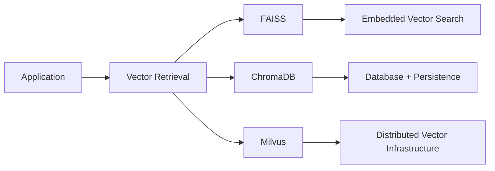

This difference affects:

```text
Deployment
Storage
Scaling
Networking
Metadata
Operations
High Availability
Multi-Tenancy
```

---

# 🏗️ 2. FAISS

FAISS stands for:

> **Facebook AI Similarity Search**

FAISS is primarily a library for efficient similarity search and clustering of dense vectors.

A typical architecture is:

```text
Application
     │
     ▼
FAISS Library
     │
     ▼
FAISS Index
     │
     ▼
Vector Search
```

FAISS does not attempt to be a complete database platform.

The application is generally responsible for:

```text
Persistence
Metadata
Authorization
API Layer
Multi-Tenancy
Replication
Backups
Index Lifecycle
```

---

# 🧩 3. FAISS Architecture

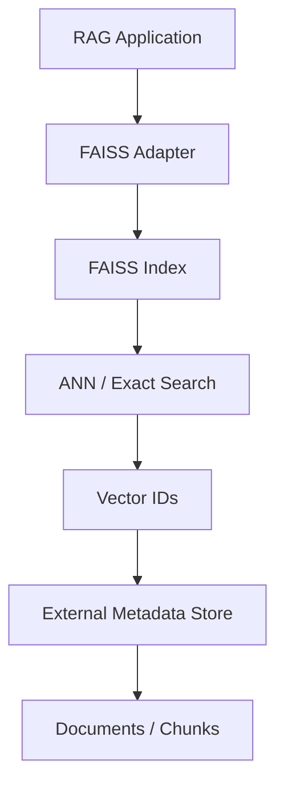

This makes FAISS particularly attractive when the engineering team wants direct control over the retrieval layer.

---

# 🗃️ 4. ChromaDB

ChromaDB is designed to provide a developer-friendly vector database experience.

Conceptually:

```text
Application
     │
     ▼
ChromaDB
     │
     ├── Collections
     ├── Embeddings
     ├── Documents
     ├── Metadata
     └── Query
```

Compared with a raw FAISS integration, more database-oriented capabilities are available directly through the vector store abstraction.

---

# 🏗️ 5. ChromaDB Architecture

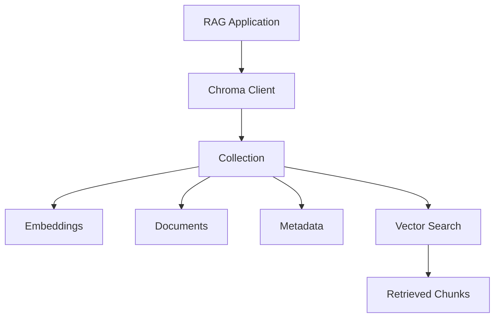

This makes ChromaDB convenient for:

```text
Local RAG
Prototypes
Development
Small-to-medium applications
AI experimentation
```

---

# 🌐 6. Milvus

Milvus is designed as a vector database for large-scale vector search workloads.

Its architecture is more infrastructure-oriented than a local embedded vector library.

Conceptually:

```text
Application
      │
      ▼
Milvus API
      │
      ▼
Distributed Vector Database
      │
 ┌────┼────┐
 ▼    ▼    ▼
Data  Index Query
      │
      ▼
Vector Storage
```

Milvus is particularly relevant when requirements include:

```text
Large Vector Collections
Distributed Deployment
High Throughput
Horizontal Scaling
Production Operations
```

---

# 🏢 7. Milvus Enterprise Architecture

A conceptual deployment:

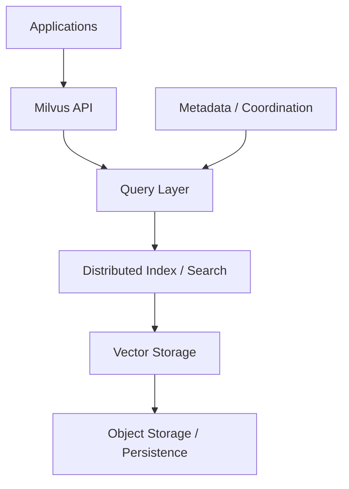

The exact internal architecture depends on the Milvus deployment model and version.

The important architectural distinction is that Milvus is designed to operate as a database service rather than simply as an in-process search library.

---

# 📊 8. High-Level Comparison

| Capability | FAISS | ChromaDB | Milvus |
|---|---|---|---|
| Primary Role | Vector search library | Vector database | Distributed vector database |
| Embedded Usage | Strong | Strong | Limited compared with embedded libraries |
| Persistence | Application-managed | Built-in database persistence model | Database-managed |
| Metadata | Usually external | Built-in | Built-in |
| Distributed Search | Application architecture | More limited | Strong |
| Horizontal Scaling | Application-managed | Depends on deployment | Strong |
| Operational Complexity | Low initially | Low-Medium | Higher |
| ANN Algorithms | Extensive | Managed abstraction | Extensive |
| Enterprise Scale | Possible with custom architecture | Depends on workload | Strong candidate |
| Learning Curve | Medium | Low | Medium-High |
| Best Fit | Custom retrieval systems | RAG development | Large-scale production |

This is a conceptual architectural comparison, not a universal performance benchmark.

---

# 🧱 9. Library vs Database

The simplest distinction is:

```text
FAISS
=
"You build the surrounding system."

ChromaDB
=
"Use a vector database abstraction."

Milvus
=
"Operate vector search as scalable infrastructure."
```

This distinction becomes increasingly important as the system grows.

---

# 🔌 10. Application Integration

### FAISS

```text
Application
    │
    ├── Embeddings
    ├── FAISS
    ├── Metadata Store
    ├── API
    └── Security
```

### ChromaDB

```text
Application
    │
    ▼
ChromaDB
    │
    ├── Embeddings
    ├── Documents
    └── Metadata
```

### Milvus

```text
Application
    │
    ▼
Milvus Service
    │
    ├── Vector Search
    ├── Metadata
    ├── Persistence
    └── Distributed Infrastructure
```

---

# 💾 11. Persistence

Persistence is an important architectural difference.

With FAISS:

```python
faiss.write_index(
    index,
    "index.faiss"
)
```

The application manages the lifecycle of the index artifact.

With a vector database:

```text
Application
     ↓
Database
     ↓
Persistent Storage
```

The database handles much more of the persistence lifecycle.

---

# 🗂️ 12. Metadata

A production RAG system rarely stores only vectors.

A chunk might contain:

```json
{
  "chunk_id": "chunk-1842",
  "document_id": "doc-102",
  "tenant_id": "enterprise-7",
  "department": "finance",
  "region": "EU",
  "document_type": "policy",
  "version": "v4"
}
```

The vector search layer therefore needs to work with:

```text
Vector
+
Metadata
+
Document Identity
```

---

# 🔍 13. Metadata with FAISS

FAISS itself is primarily focused on vector search.

Therefore an application may maintain:

```text
FAISS
  │
  ▼
Vector ID
  │
  ▼
Metadata Store
  │
  ▼
Document
```

For example:

```python
results = index.search(
    query_vector,
    20
)

ids = results[1]
```

Then the application resolves those IDs.

---

# 🗃️ 14. Metadata with Vector Databases

A vector database provides a more integrated model:

```text
Collection
│
├── Vector
├── Document
├── Metadata
└── ID
```

The application can perform vector retrieval together with database-oriented filtering.

This reduces the amount of infrastructure the application must build itself.

---

# 🔐 15. Enterprise Metadata Filtering

Consider:

```text
tenant_id = "tenant-42"
department = "finance"
classification = "internal"
```

The retrieval pipeline becomes:

```text
Query
  ↓
Vector Search
  ↓
Metadata Filtering
  ↓
Authorization
  ↓
Candidates
```

This is especially important in enterprise RAG.

---

# 🏢 16. Multi-Tenancy

Enterprise applications often serve multiple tenants.

Possible FAISS architecture:

```text
Tenant A
   ↓
FAISS Index A

Tenant B
   ↓
FAISS Index B
```

or:

```text
Shared FAISS Index
        ↓
Metadata Mapping
        ↓
Tenant Filtering
```

With a vector database, multi-tenancy can be represented through database collections, partitions, namespaces, metadata, or other supported mechanisms depending on the technology and deployment.

---

# 📈 17. Scaling

The scaling model is one of the biggest differences.

### FAISS

```text
Scale
  ↓
Application Architecture
  ↓
Sharding / Replication
  ↓
Custom Infrastructure
```

### ChromaDB

```text
Scale
  ↓
Database Deployment
  ↓
Infrastructure Constraints
```

### Milvus

```text
Scale
  ↓
Distributed Vector Database
  ↓
Horizontal Infrastructure
```

Milvus is therefore particularly interesting for workloads where distributed vector search becomes a first-class infrastructure requirement.

---

# 🧩 18. Scaling Mental Model

```text
              Scale
                ▲
                │
                │             Milvus
                │              ●
                │
                │        ChromaDB
                │           ●
                │
                │   FAISS
                │     ●
                └────────────────────►
                       Operational Complexity
```

This is a conceptual diagram rather than a quantitative benchmark.

---

# ⚡ 19. Latency

Latency depends on many factors:

```text
Index Type
+
Dataset Size
+
Vector Dimension
+
Hardware
+
Network
+
Concurrency
+
Search Parameters
```

FAISS can have very low retrieval overhead because it can run directly inside the application process.

A database introduces network and service-layer considerations.

However, a production vector database may provide capabilities that outweigh this additional infrastructure layer.

---

# 🧠 20. Embedded vs Service Architecture

This is one of the most important architectural decisions.

### Embedded

```text
RAG Application
     │
     ├── Embedding Model
     ├── FAISS
     └── Metadata Store
```

### Service-Based

```text
RAG Application
       │
       ▼
Vector Database
       │
       ▼
Vector Infrastructure
```

The choice affects:

```text
Latency
Scaling
Operations
Availability
Deployment
Cost
```

---

# 🏃 21. Development Experience

For rapid experimentation:

```text
Python
  ↓
Embeddings
  ↓
ChromaDB
  ↓
RAG Prototype
```

can be very convenient.

FAISS is also straightforward when the developer wants direct control over the index.

Milvus introduces more infrastructure concepts but provides capabilities suitable for larger systems.

---

# 🧪 22. Simple FAISS Example

```python
import faiss
import numpy as np

dimension = 384

index = faiss.IndexFlatIP(
    dimension
)

vectors = np.random.random(
    (10000, dimension)
).astype("float32")

faiss.normalize_L2(
    vectors
)

index.add(vectors)

query = np.random.random(
    (1, dimension)
).astype("float32"
)

faiss.normalize_L2(
    query
)

scores, ids = index.search(
    query,
    5
)
```

The application directly controls the index.

---

# 🧪 23. Simple ChromaDB Example

A conceptual ChromaDB workflow looks like:

```python
import chromadb

client = chromadb.PersistentClient(
    path="./chroma-data"
)

collection = client.get_or_create_collection(
    name="enterprise-documents"
)

collection.add(
    ids=["doc-1", "doc-2"],
    documents=[
        "Enterprise AI architecture",
        "Production RAG engineering"
    ],
    metadatas=[
        {"department": "engineering"},
        {"department": "architecture"}
    ]
)

results = collection.query(
    query_texts=[
        "How do I build RAG?"
    ],
    n_results=5
)
```

The database-oriented abstraction is visible:

```text
Collection
+
Documents
+
Metadata
+
Query
```

---

# 🧪 24. Simple Milvus Workflow

A conceptual Milvus workflow looks like:

```python
from pymilvus import MilvusClient

client = MilvusClient(
    uri="http://localhost:19530"
)

client.create_collection(
    collection_name="enterprise_documents",
    dimension=384
)
```

The application communicates with Milvus as a database service.

The exact schema and index configuration depend on the chosen Milvus version and deployment architecture.

---

# 🔄 25. RAG Architecture Comparison

## FAISS-Based RAG

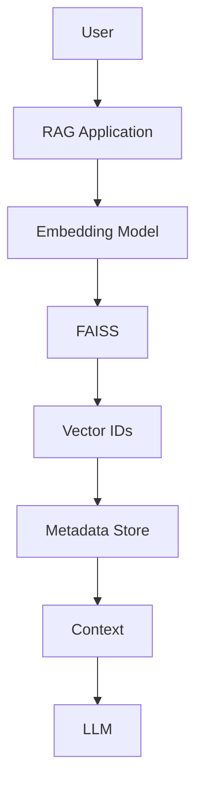

---

## ChromaDB-Based RAG

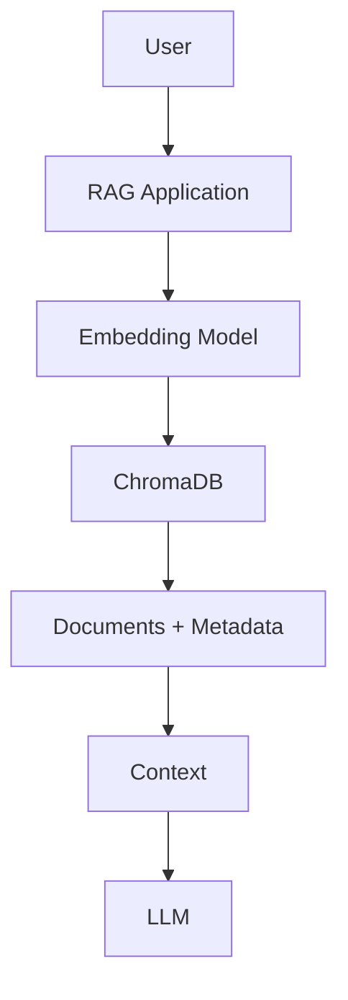

---

## Milvus-Based RAG

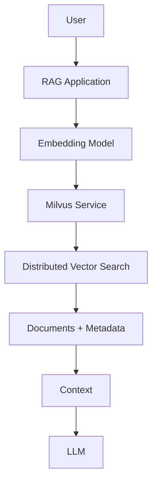

---

# 🧩 26. Production RAG Architecture

A mature system may look like:

```text
                         User
                           │
                           ▼
                     API Gateway
                           │
                           ▼
                    RAG Application
                           │
              ┌────────────┴────────────┐
              │                         │
              ▼                         ▼
        Query Processing           Embedding Service
                                        │
                                        ▼
                               Vector Search Layer
                                        │
                    ┌───────────────────┼──────────────────┐
                    │                   │                  │
                    ▼                   ▼                  ▼
                  FAISS              ChromaDB            Milvus
                    │                   │                  │
                    └───────────────────┼──────────────────┘
                                        ▼
                                  Candidate Results
                                        │
                                        ▼
                                   Re-ranking
                                        │
                                        ▼
                                 Context Selection
                                        │
                                        ▼
                                  Prompt Assembly
                                        │
                                        ▼
                                       LLM
                                        │
                                        ▼
                              Response Validation
                                        │
                                        ▼
                                    Citation
                                        │
                                        ▼
                               Enterprise Response
```

---

# 🏗️ 27. Architecture Is More Important Than the Tool

A common mistake is:

```text
Choose Vector DB
       ↓
Build RAG
```

A better approach is:

```text
Define Requirements
       ↓
Define Retrieval Contract
       ↓
Define Data Model
       ↓
Define Security Model
       ↓
Define Scaling Model
       ↓
Evaluate Vector Technology
       ↓
Benchmark
       ↓
Select
```

The vector database should fit the architecture rather than dictate it.

---

# 🔌 28. Capability-Based Vector Search

Your application should ideally depend on a capability interface:

```python
class VectorSearchProvider:

    def search(
        self,
        query_vector,
        top_k,
        filters=None
    ):
        raise NotImplementedError
```

Implementations can include:

```text
VectorSearchProvider
        │
        ├── FaissVectorSearchProvider
        ├── ChromaVectorSearchProvider
        └── MilvusVectorSearchProvider
```

This is particularly useful for enterprise AI platforms.

---

# 🏛️ 29. Ports & Adapters Architecture

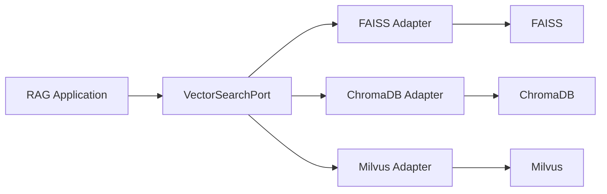

The application depends on:

```text
VectorSearchPort
```

rather than:

```text
FAISS
ChromaDB
Milvus
```

directly.

---

# 🔄 30. Why This Matters

Suppose a prototype starts with:

```text
ChromaDB
```

and later requires:

```text
Milvus
```

A tightly coupled application may require substantial changes.

A capability-based design can instead perform:

```text
Chroma Adapter
      ↓
Milvus Adapter
```

while keeping:

```text
RAG Application
      ↓
VectorSearchPort
```

stable.

---

# 📦 31. Vector Store Contract

A useful production abstraction might include:

```python
class VectorStore:

    def add(self, records):
        ...

    def delete(self, ids):
        ...

    def search(
        self,
        query_vector,
        top_k,
        filters=None
    ):
        ...

    def health(self):
        ...

    def get_by_id(self, record_id):
        ...
```

The interface should expose application capabilities rather than leaking provider-specific APIs.

---

# 🧠 32. Do Not Abstract Everything

Avoid creating an abstraction that simply mirrors every underlying SDK method.

Bad:

```python
vector_store.index_factory(...)
vector_store.nprobe(...)
vector_store.hnsw(...)
vector_store.collection(...)
vector_store.partition(...)
```

This creates a lowest-common-denominator abstraction or leaks implementation details.

Better:

```python
search(...)
add(...)
delete(...)
get(...)
health(...)
```

The infrastructure adapter handles provider-specific behavior internally.

---

# 🔍 33. Retrieval Contract

The application should care about:

```text
Query
Top-K
Filters
Results
Scores
Metadata
```

For example:

```python
results = vector_store.search(
    query_vector=query_vector,
    top_k=20,
    filters={
        "tenant_id": "tenant-42"
    }
)
```

The adapter decides how the underlying technology implements the search.

---

# 🧩 34. FAISS Adapter

```python
class FaissVectorSearchProvider:

    def __init__(
        self,
        index,
        metadata_store
    ):
        self.index = index
        self.metadata_store = metadata_store

    def search(
        self,
        query_vector,
        top_k,
        filters=None
    ):
        scores, ids = self.index.search(
            query_vector,
            top_k
        )

        return self.metadata_store.resolve(
            ids,
            filters
        )
```

This keeps FAISS-specific details inside the adapter.

---

# 🧩 35. Database Adapter

The same application contract could be implemented with ChromaDB or Milvus.

```python
class VectorSearchProvider:

    def search(
        self,
        query_vector,
        top_k,
        filters=None
    ):
        raise NotImplementedError
```

The application remains unaware of whether the provider is:

```text
FAISS
ChromaDB
Milvus
```

---

# 🏢 36. Enterprise Requirements

Before selecting a vector technology, define:

```text
Dataset Size
Vector Dimension
Query Volume
Latency SLO
Recall Target
Memory Budget
Storage Requirements
Update Frequency
Delete Requirements
Metadata Filtering
Tenant Isolation
High Availability
Backup
Disaster Recovery
Observability
Security
Cost
```

---

# 📈 37. Dataset Size

A simplified decision model:

```text
Small
  ↓
FAISS / ChromaDB

Medium
  ↓
FAISS / ChromaDB / Milvus

Large
  ↓
Evaluate Milvus / distributed vector infrastructure

Very Large
  ↓
Distributed architecture becomes increasingly important
```

These boundaries are workload-dependent and should not be treated as fixed product limits.

---

# ⚡ 38. Latency Requirements

If the application requires extremely low retrieval latency:

```text
Embedded Search
```

can eliminate some service/network overhead.

FAISS can therefore be attractive.

However:

```text
Low Latency
```

must be evaluated together with:

```text
Availability
Scaling
Operational Complexity
```

---

# 📊 39. Throughput Requirements

A production workload may require:

```text
10 QPS
```

or:

```text
10,000 QPS
```

The correct technology cannot be selected without testing:

```text
Concurrent Queries
+
Dataset Size
+
Hardware
+
Index Configuration
```

Always benchmark under realistic concurrency.

---

# 💾 40. Memory Requirements

For a raw float32 vector:

```text
Memory
≈
Number of Vectors
×
Dimensions
×
4 bytes
```

Example:

```text
1,000,000 vectors
1536 dimensions
```

approximately:

```text
1,000,000
× 1536
× 4

≈ 6.14 GB
```

This does not include:

```text
Index Structures
Metadata
Runtime Memory
Application Memory
Database Overhead
```

---

# 🔎 41. Search Algorithm Choice

FAISS provides direct access to index types such as:

```text
Flat
HNSW
IVF
IVF-Flat
IVF-PQ
```

Vector databases may expose different abstractions over their supported indexes.

Therefore the comparison should include:

```text
Which ANN algorithms are available?

Which parameters can be tuned?

Can indexes be changed independently?

Can the system support multiple indexes?

How are indexes rebuilt?
```

---

# 🧪 42. Benchmarking Methodology

Do not compare technologies using:

```text
One query
+
One laptop
+
One dataset
```

Instead:

```text
Representative Dataset
        ↓
Representative Queries
        ↓
Representative Hardware
        ↓
Representative Concurrency
        ↓
Benchmark
```

Measure:

```text
Recall@K
P50
P95
P99
QPS
Memory
Index Build Time
Storage
Operational Cost
```

---

# 📋 43. Benchmark Matrix

| Technology | Dataset | Recall@10 | P95 | QPS | Memory |
|---|---|---:|---:|---:|---:|
| FAISS | 1M | | | | |
| ChromaDB | 1M | | | | |
| Milvus | 1M | | | | |
| FAISS | 10M | | | | |
| ChromaDB | 10M | | | | |
| Milvus | 10M | | | | |

Populate this table with measurements from your target environment.

Do not use generic internet benchmarks as a substitute for workload-specific testing.

---

# 🧪 44. Benchmark Scenarios

At minimum test:

```text
Scenario 1
Small dataset
Low concurrency

Scenario 2
Medium dataset
Medium concurrency

Scenario 3
Large dataset
High concurrency

Scenario 4
Metadata-heavy filtering

Scenario 5
Multi-tenant retrieval

Scenario 6
High update rate
```

This exposes different architectural strengths and weaknesses.

---

# 🔐 45. Security Comparison

Security is not simply:

```text
Does the vector store support authentication?
```

The real enterprise question is:

```text
Can the architecture guarantee that
unauthorized vectors never reach the LLM?
```

The complete pipeline should enforce:

```text
Identity
 ↓
Tenant
 ↓
Authorization
 ↓
Metadata Filter
 ↓
Vector Retrieval
 ↓
Re-ranking
 ↓
Context
 ↓
LLM
```

---

# 👥 46. Multi-Tenant Design

### Isolated Indexes

```text
Tenant A → Index A
Tenant B → Index B
Tenant C → Index C
```

Advantages:

```text
Strong Isolation
Independent Lifecycle
```

Costs:

```text
More Indexes
More Memory
More Operations
```

---

### Shared Index

```text
Shared Index
     ↓
Metadata
     ↓
Tenant Filter
```

Advantages:

```text
Fewer Indexes
Better Resource Utilization
```

Risks:

```text
Filtering Errors
Isolation Complexity
```

The choice depends on the security model and operational requirements.

---

# 🔄 47. Data Lifecycle

Enterprise RAG requires more than search.

Consider:

```text
Create
 ↓
Embed
 ↓
Index
 ↓
Update
 ↓
Re-index
 ↓
Delete
 ↓
Archive
```

The chosen vector technology should fit this lifecycle.

---

# 🗑️ 48. Delete Semantics

Deleting a document may require removing many chunks.

```text
Document
 │
 ├── Chunk 1
 ├── Chunk 2
 ├── Chunk 3
 └── Chunk 4
```

A production system needs:

```text
Document ID
Chunk IDs
Index IDs
Metadata
Deletion State
```

This is easier to manage when the vector layer has strong record-oriented database capabilities.

With FAISS, the surrounding application often needs to manage more of this lifecycle.

---

# 🔄 49. Re-indexing

Embedding models evolve.

For example:

```text
Embedding Model V1
       ↓
Embedding Model V2
```

The vector dimension or embedding distribution may change.

This can require:

```text
Re-embedding
       ↓
New Index
       ↓
Validation
       ↓
Migration
```

The vector store should be treated as a versioned infrastructure component.

---

# 🚦 50. Blue-Green Index Migration

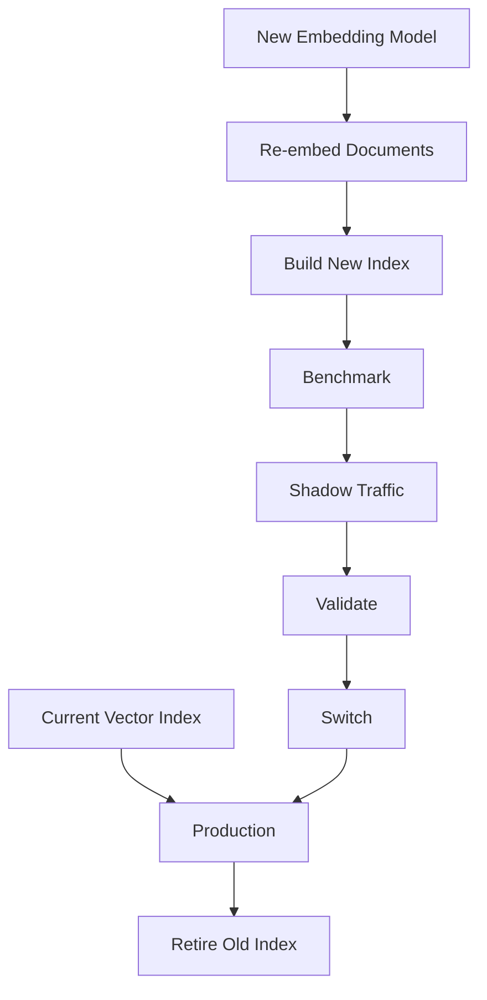

This pattern reduces migration risk.

---

# 📦 51. Index Version Manifest

Store:

```json
{
  "index_version": "v12",
  "embedding_model": "embedding-v4",
  "dimension": 1536,
  "metric": "cosine",
  "chunking_version": "v5",
  "created_at": "2026-08-11T10:00:00Z"
}
```

The exact metadata should match your deployment requirements.

---

# 👀 52. Observability

Track:

```text
vector_store
index_version
embedding_model
query_latency
search_latency
top_k
candidate_count
empty_result_rate
filter_usage
tenant
```

For ANN indexes additionally track:

```text
nprobe
efSearch
```

where applicable.

---

# 📊 53. RAG Observability

Vector retrieval is only one part of RAG observability.

A production trace might be:

```text
Request
 │
 ├── Query Processing
 │
 ├── Embedding
 │
 ├── Vector Search
 │
 ├── Re-ranking
 │
 ├── Context Selection
 │
 ├── Prompt Assembly
 │
 ├── LLM
 │
 ├── Response Validation
 │
 └── Citation
```

Each stage should have:

```text
Latency
Status
Input/Output Metadata
Error
Cost
```

---

# 🧠 54. Cost Comparison

Vector infrastructure costs come from:

```text
Compute
+
Memory
+
Storage
+
Network
+
Index Building
+
Operations
+
Engineering Time
```

FAISS can appear inexpensive because it is a library.

But the surrounding infrastructure may require:

```text
Metadata DB
API Layer
Replication
Backups
Monitoring
Scaling
```

Therefore:

> **Technology price is not the same as total cost of ownership.**

---

# 💰 55. Total Cost of Ownership

Consider:

```text
TCO
=
Infrastructure Cost
+
Operations Cost
+
Engineering Cost
+
Migration Cost
+
Failure Cost
```

A more operationally sophisticated vector database may have higher infrastructure cost but lower application-level engineering effort.

Conversely, FAISS may provide excellent control and performance but require more custom infrastructure.

---

# 🧩 56. When FAISS Is a Strong Choice

FAISS is particularly attractive when:

```text
You need direct index control
+
You want low-level ANN tuning
+
You can manage surrounding infrastructure
+
The retrieval workload is tightly integrated with the application
```

Examples:

```text
Research
Offline Retrieval
Custom RAG Engines
Embedded Search
High-Control AI Infrastructure
```

---

# 🧩 57. When ChromaDB Is a Strong Choice

ChromaDB can be attractive when:

```text
Developer productivity matters
+
You want a straightforward vector database abstraction
+
The application is local or moderate-scale
+
You are building RAG prototypes or applications
```

Examples:

```text
Local RAG
Proof of Concept
AI Assistant
Document Q&A
Developer Tools
```

---

# 🧩 58. When Milvus Is a Strong Choice

Milvus becomes particularly interesting when:

```text
Vector data is large
+
Distributed infrastructure is required
+
High throughput matters
+
Horizontal scaling matters
+
Vector search is a core platform capability
```

Examples:

```text
Enterprise Search
Large Knowledge Bases
Recommendation Systems
Semantic Search Platforms
Large-Scale RAG
```

---

# 🏢 59. Enterprise Decision Matrix

| Requirement | FAISS | ChromaDB | Milvus |
|---|:---:|:---:|:---:|
| Fast local prototype | ⭐⭐⭐ | ⭐⭐⭐ | ⭐ |
| Direct index control | ⭐⭐⭐ | ⭐⭐ | ⭐⭐ |
| Simple application integration | ⭐⭐ | ⭐⭐⭐ | ⭐⭐ |
| Built-in vector DB model | ⭐ | ⭐⭐⭐ | ⭐⭐⭐ |
| Distributed architecture | Custom | Deployment-dependent | ⭐⭐⭐ |
| Large-scale search | ⭐⭐ | ⭐⭐ | ⭐⭐⭐ |
| Operational simplicity | ⭐⭐⭐ | ⭐⭐⭐ | ⭐ |
| Custom retrieval engine | ⭐⭐⭐ | ⭐⭐ | ⭐⭐ |
| Enterprise infrastructure | ⭐⭐ | ⭐⭐ | ⭐⭐⭐ |
| Learning RAG quickly | ⭐⭐ | ⭐⭐⭐ | ⭐⭐ |

These ratings are qualitative architectural guidance, not benchmark scores.

---

# 🧭 60. Decision Tree

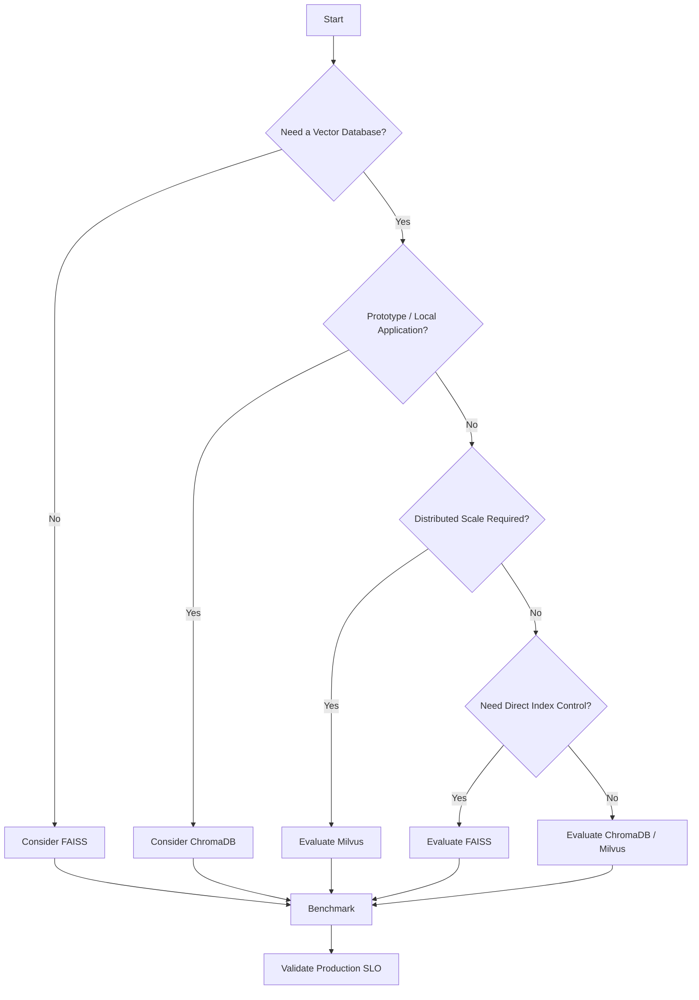

---

# 🏗️ 61. Architecture Selection by Stage

A realistic evolution might be:

```text
Stage 1
───────
Prototype

Python
+
ChromaDB


Stage 2
───────
Application

FAISS / ChromaDB
+
Metadata Store


Stage 3
───────
Production

Vector Database
+
Distributed Infrastructure


Stage 4
───────
Enterprise Platform

Milvus / Managed Vector Infrastructure
+
Multi-Tenancy
+
Observability
+
Governance
```

This is an example evolution path, not a mandatory migration sequence.

---

# 🔄 62. Prototype → Production

Do not assume:

```text
Prototype Technology
=
Production Technology
```

Instead:

```text
Prototype
   ↓
Validate Product
   ↓
Measure Workload
   ↓
Define SLO
   ↓
Evaluate Production Infrastructure
   ↓
Migrate if Required
```

---

# 🧪 63. Migration from FAISS to a Vector Database

A typical migration:

```text
Existing FAISS
     │
     ▼
Extract Documents + Metadata
     │
     ▼
Generate / Preserve Embeddings
     │
     ▼
Load into Vector Database
     │
     ▼
Build Target Index
     │
     ▼
Run Recall Comparison
     │
     ▼
Run Latency Benchmark
     │
     ▼
Shadow Traffic
     │
     ▼
Production Cutover
```

---

# 🧪 64. Migration Validation

Before switching:

```text
☐ Same embedding model
☐ Same vector dimension
☐ Same similarity metric
☐ Same chunking
☐ Same metadata
☐ Same filters
☐ Recall validated
☐ Latency validated
☐ Security validated
☐ Multi-tenancy validated
☐ Failure recovery tested
```

---

# 🔀 65. Hybrid Architecture

It is also possible to use multiple technologies.

For example:

```text
Online Retrieval
       ↓
Milvus

Offline Evaluation
       ↓
FAISS
```

Or:

```text
Prototype
       ↓
ChromaDB

Benchmark / Algorithm Research
       ↓
FAISS

Production
       ↓
Milvus
```

This allows each technology to be used where it provides the greatest value.

---

# 🧠 66. Why FAISS Remains Important

Even when a production system uses a vector database, FAISS remains valuable for:

```text
ANN Research
Index Experimentation
Ground Truth
Offline Evaluation
Benchmarking
Custom Retrieval
Algorithm Development
```

Therefore learning FAISS provides strong foundational vector-search knowledge.

---

# 🔬 67. Vector Database Abstraction

A production architecture can define:

```python
class VectorStore:

    def add(self, records):
        ...

    def delete(self, ids):
        ...

    def search(
        self,
        query_vector,
        top_k,
        filters=None
    ):
        ...

    def health(self):
        ...
```

Implementations:

```text
VectorStore
   │
   ├── FAISS
   ├── ChromaDB
   └── Milvus
```

The application depends on the capability rather than the infrastructure implementation.

---

# 🏛️ 68. Enterprise AI Starter Integration

A vector store factory can follow:

```python
class VectorStoreFactory:

    @staticmethod
    def create(config):

        if config.provider == "faiss":
            return FaissVectorStore(config)

        if config.provider == "chroma":
            return ChromaVectorStore(config)

        if config.provider == "milvus":
            return MilvusVectorStore(config)

        raise ValueError(
            "Unsupported vector store"
        )
```

The important design principle is:

```text
Factory
   ↓
Provider
   ↓
Adapter
   ↓
Infrastructure
```

---

# 🧩 69. Configuration-Driven Retrieval

Example:

```yaml
vector-store:
  provider: milvus

  search:
    top-k: 50

  filters:
    enabled: true
```

For a local environment:

```yaml
vector-store:
  provider: chroma
```

For an embedded experiment:

```yaml
vector-store:
  provider: faiss
```

The application logic remains stable.

---

# 🔄 70. Provider Selection

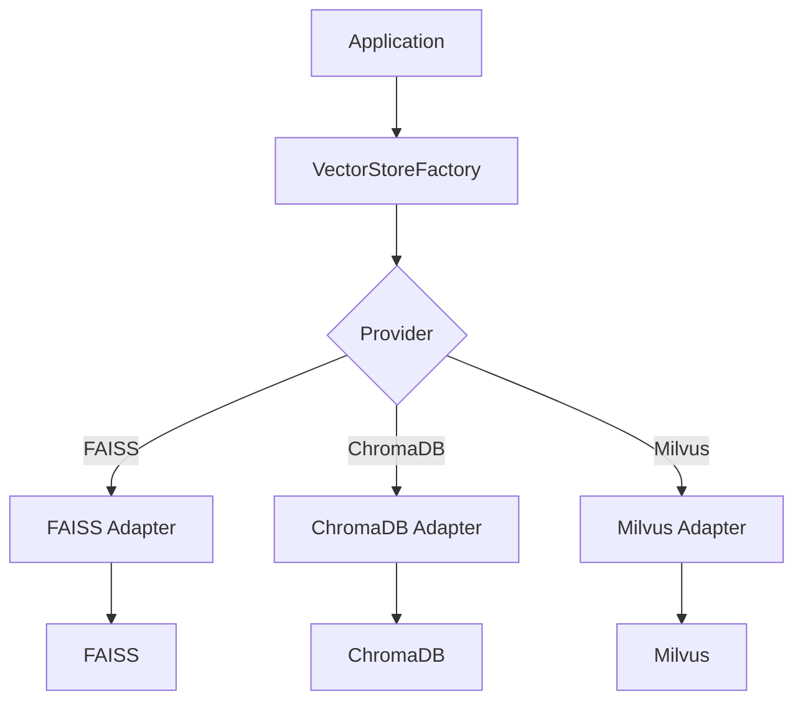

This approach aligns well with a framework-agnostic enterprise retrieval architecture.

---

# 🚨 71. Common Mistake — Comparing Product Names

Avoid:

```text
FAISS vs ChromaDB vs Milvus
```

as if they were exactly equivalent.

Instead compare:

```text
Search Engine
vs
Vector Database
vs
Distributed Vector Database
```

Then evaluate the architecture each one enables.

---

# 🚨 72. Common Mistake — Choosing Based on Benchmark Alone

A benchmark may show:

```text
FAISS = fastest
```

But production may require:

```text
Multi-Tenancy
Backups
HA
Metadata
Scaling
Operations
```

Therefore:

```text
Benchmark Performance
≠
Complete Production Suitability
```

---

# 🚨 73. Common Mistake — Ignoring Operational Cost

A lightweight library may appear cheaper.

But if you must build:

```text
Replication
Monitoring
Backup
Metadata
Authorization
Scaling
Deployment
```

the engineering cost can become significant.

---

# 🚨 74. Common Mistake — Over-Engineering Early

The opposite mistake is:

```text
Simple RAG
   ↓
Immediately deploy distributed vector database
```

If the application has:

```text
Small Dataset
Low Traffic
Simple Requirements
```

a simpler architecture may be more appropriate.

---

# 🚨 75. Common Mistake — No Migration Strategy

Vector infrastructure may need to change because of:

```text
Dataset Growth
Traffic Growth
Latency SLO
Tenant Growth
Operational Requirements
```

Therefore design the retrieval layer so migration is possible.

---

# 📊 76. Comparison Summary

```text
                         FAISS
                           │
                Low-Level Vector Search
                           │
                           ▼
                     High Control


                       ChromaDB
                           │
                  Developer-Friendly
                           │
                           ▼
                     Simple RAG


                        Milvus
                           │
                  Distributed Vector DB
                           │
                           ▼
                  Large-Scale Retrieval
```

---

# 🧠 77. Final Selection Framework

Ask these questions in order:

```text
1. How large is the dataset?

2. How many queries per second?

3. What is the latency SLO?

4. What recall is required?

5. How frequently does data change?

6. How important is metadata filtering?

7. What are the tenant isolation requirements?

8. Do we need distributed search?

9. Who manages backups and replication?

10. What is the infrastructure budget?

11. What is the engineering capacity?

12. Do we need direct ANN index control?
```

Then:

```text
Requirements
      ↓
Architecture
      ↓
Candidate Technologies
      ↓
Benchmark
      ↓
Production SLO
      ↓
Technology Selection
```

---

# 📚 78. Key Takeaways

- FAISS is primarily a vector similarity-search library.
- ChromaDB provides a developer-friendly vector database abstraction.
- Milvus is designed for distributed vector database workloads.
- FAISS gives engineers direct control over vector indexes.
- ChromaDB simplifies local and application-level RAG development.
- Milvus is a strong candidate for large-scale distributed vector retrieval.
- FAISS often requires the application to manage surrounding infrastructure.
- Vector databases provide more integrated data and metadata management.
- Distributed vector databases address scaling and operational requirements beyond a local index.
- There is no universally best vector store.
- Dataset size alone should not determine technology selection.
- Query volume, latency, recall, memory, metadata, security, scaling, and operations all matter.
- Vector search should be hidden behind a capability-based interface in enterprise applications.
- Ports & Adapters architecture can isolate provider-specific implementations.
- FAISS, ChromaDB, and Milvus can all be implemented behind a common application contract.
- A provider factory can select the implementation based on configuration.
- Prototype and production technologies do not necessarily need to be the same.
- FAISS remains valuable for benchmarking, research, and exact ground-truth evaluation.
- Production migration should use controlled validation and preferably blue-green or shadow deployment.
- Security and tenant isolation must be considered part of retrieval architecture.
- Total cost of ownership includes infrastructure, operations, engineering, and migration costs.
- Technology selection should be benchmark-driven and SLO-driven.
- The correct vector technology is the one that fits the complete enterprise architecture.

---

# 🏭 79. Production Checklist

```text
☐ Define dataset size
☐ Define vector dimension
☐ Define embedding model
☐ Define query volume
☐ Define Recall@K target
☐ Define P95 latency
☐ Define P99 latency
☐ Define memory budget
☐ Define storage requirements

☐ Define update frequency
☐ Define delete requirements
☐ Define metadata requirements
☐ Define filtering requirements
☐ Define tenant isolation
☐ Define security requirements
☐ Define availability requirements
☐ Define backup requirements
☐ Define disaster recovery requirements

☐ Evaluate FAISS
☐ Evaluate ChromaDB
☐ Evaluate Milvus

☐ Benchmark Recall
☐ Benchmark P50
☐ Benchmark P95
☐ Benchmark P99
☐ Benchmark QPS
☐ Benchmark Memory
☐ Benchmark Index Build Time
☐ Benchmark Storage

☐ Test realistic concurrency
☐ Test realistic query distribution
☐ Test realistic dataset scale
☐ Test metadata filtering
☐ Test multi-tenant retrieval
☐ Test failure scenarios

☐ Define VectorStore interface
☐ Define provider adapters
☐ Define provider factory
☐ Define configuration model

☐ Version indexes
☐ Version embedding models
☐ Store index manifests
☐ Define rebuild strategy
☐ Define migration strategy
☐ Define rollback strategy

☐ Add retrieval observability
☐ Track provider
☐ Track index version
☐ Track search latency
☐ Track candidate count
☐ Track empty-result rate
☐ Track retrieval errors
```

---

# 🧪 80. Practical Engineering Exercise

Build the same RAG retrieval workload using:

```text
Implementation 1
FAISS

Implementation 2
ChromaDB

Implementation 3
Milvus
```

Use:

```text
Same Documents
Same Chunking
Same Embedding Model
Same Vector Dimension
Same Query Set
Same Top-K
```

Then measure:

```text
Recall@10
P50
P95
P99
QPS
Memory
Storage
Index Build Time
Update Performance
```

Create:

| Capability | FAISS | ChromaDB | Milvus |
|---|---|---|---|
| Vector Search | | | |
| Metadata Filtering | | | |
| Persistence | | | |
| Scaling | | | |
| Multi-Tenancy | | | |
| Updates | | | |
| Deletes | | | |
| Observability | | | |
| Operational Complexity | | | |
| Cost | | | |

The objective is not to identify a universal winner.

The objective is to identify:

> **Which architecture is the best fit for the target workload?**

---

# 🗺️ 81. Vector Search Engineering Complete

The Vector Search Engineering section now provides a progression from low-level vector search to technology selection:


The learning progression is:

```text
Understand Vector Search
        ↓
Understand Indexes
        ↓
Understand ANN
        ↓
Understand Vector Infrastructure
        ↓
Select Technology
        ↓
Build Production RAG
```

---

# 💡 Final Mental Model

```text
                         VECTOR RETRIEVAL
                               │
              ┌────────────────┼────────────────┐
              │                │                │
              ▼                ▼                ▼
            FAISS           ChromaDB          Milvus
              │                │                │
              ▼                ▼                ▼
       Search Library     Vector Database   Distributed DB
              │                │                │
              ▼                ▼                ▼
        High Control      Easy RAG Dev      Large Scale
              │                │                │
              └────────────────┼────────────────┘
                               ▼
                       Common Retrieval Port
                               │
                               ▼
                         RAG Application
                               │
                               ▼
                          Re-ranking
                               │
                               ▼
                       Context Engineering
                               │
                               ▼
                              LLM
                               │
                               ▼
                    Enterprise Response
```

The most important principle is:

> **Do not choose a vector technology first and design the architecture around it. Define the retrieval requirements first, then select the technology that satisfies the production workload.**

FAISS provides deep control over vector search.

ChromaDB provides a developer-friendly vector database experience.

Milvus provides a strong foundation for distributed, large-scale vector retrieval.

The enterprise engineer's responsibility is not to know which tool is "best."

It is to know:

```text
When
Why
Where
How
At What Scale
Under Which SLO
```

each technology should be used.

---

# 🧭 Chapter Navigation

### Part V — Advanced Retrieval-Augmented Generation

**Previous:**  
[03. IVF and HNSW](03-ivf-and-hnsw.md)

**Next:**  
[01. Advanced RAG Architecture](../05-advanced-rag-architecture/01-advanced-rag-architecture.md)

**Section:**  
04 — Vector Search Engineering

### Vector Search Engineering Path

```text
01 FAISS Fundamentals
        ↓
02 FAISS Indexes
        ↓
03 IVF and HNSW
        ↓
04 FAISS vs ChromaDB vs Milvus
        ↓
05 Advanced RAG Architecture
```

---

> **Enterprise AI Engineering Handbook**  
> *Building Production-Grade Enterprise AI Systems — One Chapter at a Time.*