# 01. Advanced RAG Architecture

> **Category:** Advanced RAG Architecture  
> **Module:** Part V — Advanced Retrieval-Augmented Generation  
> **Difficulty:** Advanced

---

## 📖 Overview

Basic Retrieval-Augmented Generation demonstrates a simple idea:

```text
User Query
    ↓
Retrieve Documents
    ↓
Send Context to LLM
    ↓
Generate Answer
```

Production RAG systems are significantly more sophisticated.

Enterprise applications must deal with:

- Large knowledge bases
- Multiple retrieval strategies
- Metadata filtering
- Query rewriting
- Hybrid search
- Re-ranking
- Context selection
- Multiple data sources
- Structured and unstructured data
- Access control
- Citations
- Response validation
- Observability
- Latency
- Cost
- Multi-tenancy
- Continuous data updates

A production RAG architecture therefore looks more like:

```text
                         User
                           │
                           ▼
                    API / Gateway
                           │
                           ▼
                    Query Processing
                           │
                           ▼
                   Query Understanding
                           │
              ┌────────────┴────────────┐
              │                         │
              ▼                         ▼
        Query Rewriting          Metadata Extraction
              │                         │
              └────────────┬────────────┘
                           ▼
                  Retrieval Orchestration
                           │
          ┌────────────────┼─────────────────┐
          │                │                 │
          ▼                ▼                 ▼
       Dense            Lexical           Structured
       Search           Search              Search
          │                │                 │
          └────────────────┼─────────────────┘
                           ▼
                    Result Fusion
                           │
                           ▼
                      Re-ranking
                           │
                           ▼
                   Context Selection
                           │
                           ▼
                  Context Engineering
                           │
                           ▼
                    Prompt Assembly
                           │
                           ▼
                         LLM
                           │
             ┌─────────────┼─────────────┐
             │             │             │
             ▼             ▼             ▼
          Validate      Citation      Guardrails
             │             │             │
             └─────────────┼─────────────┘
                           ▼
                  Enterprise Response
```

This chapter establishes the architectural foundation for the advanced RAG topics that follow.

---

# 🎯 Learning Objectives

After completing this chapter, you will be able to:

- Understand advanced RAG architecture
- Distinguish basic RAG from production RAG
- Design a modular RAG pipeline
- Understand query processing
- Understand retrieval orchestration
- Combine multiple retrieval strategies
- Understand candidate generation
- Understand result fusion
- Understand re-ranking
- Understand context selection
- Understand context engineering
- Understand prompt assembly
- Understand response validation
- Understand citation architecture
- Understand enterprise response generation
- Design observability into RAG systems
- Design secure multi-tenant RAG systems
- Understand latency and cost boundaries
- Apply Ports & Adapters architecture to RAG
- Design provider-agnostic retrieval components
- Build an architecture that can evolve toward Graph RAG, SQL RAG, Multimodal RAG, and Agentic RAG

---

# 🧠 1. What Is Advanced RAG?

Basic RAG focuses primarily on:

```text
Retrieve
+
Generate
```

Advanced RAG treats retrieval and generation as a complete engineering system.

```text
Advanced RAG
=
Query Engineering
+
Retrieval Engineering
+
Context Engineering
+
Generation
+
Validation
+
Observability
+
Security
+
Optimization
```

The goal is not simply to retrieve documents.

The goal is:

> **Retrieve the right evidence, construct the right context, generate a grounded response, validate it, and return it safely and efficiently.**

---

# 🔄 2. Basic RAG vs Advanced RAG

## Basic RAG

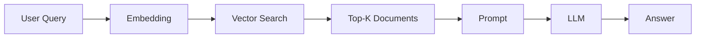

This architecture is useful for learning the fundamental RAG pattern.

---

## Advanced RAG

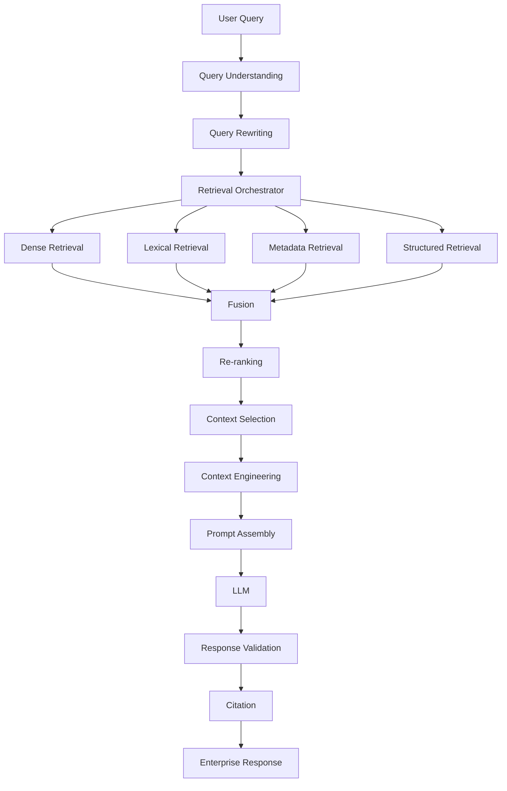

The difference is architectural depth.

---

# 🏗️ 3. The Advanced RAG Pipeline

A useful production mental model is:

```text
1. Request
2. Authentication
3. Query Understanding
4. Query Rewriting
5. Retrieval Planning
6. Candidate Generation
7. Result Fusion
8. Re-ranking
9. Context Selection
10. Context Engineering
11. Prompt Assembly
12. LLM Generation
13. Response Validation
14. Citation
15. Enterprise Response
16. Observability
```

---

# 🧩 4. RAG as a Pipeline

Each stage should have a clear responsibility.

```text
┌───────────────────────────────────────────────────────────┐
│                       RAG SYSTEM                          │
├───────────────────────────────────────────────────────────┤
│                                                           │
│ Query → Retrieve → Rank → Select → Generate → Validate   │
│                                                           │
└───────────────────────────────────────────────────────────┘
```

This separation makes the system:

```text
Testable
Observable
Replaceable
Scalable
Maintainable
```

---

# 🏛️ 5. Layered RAG Architecture

A production architecture can be divided into layers:

```text
┌───────────────────────────────────────┐
│ API / Experience Layer               │
├───────────────────────────────────────┤
│ RAG Orchestration Layer              │
├───────────────────────────────────────┤
│ Query Engineering Layer              │
├───────────────────────────────────────┤
│ Retrieval Layer                      │
├───────────────────────────────────────┤
│ Ranking Layer                        │
├───────────────────────────────────────┤
│ Context Engineering Layer            │
├───────────────────────────────────────┤
│ Generation Layer                     │
├───────────────────────────────────────┤
│ Validation & Citation Layer          │
├───────────────────────────────────────┤
│ Observability & Governance           │
├───────────────────────────────────────┤
│ Infrastructure / Data Layer          │
└───────────────────────────────────────┘
```

Each layer should expose well-defined contracts.

---

# 🔌 6. Ports & Adapters Architecture

RAG systems should avoid tightly coupling the application to a particular:

```text
LLM
Embedding Model
Vector Database
Retriever
Re-ranker
Document Store
```

Instead:

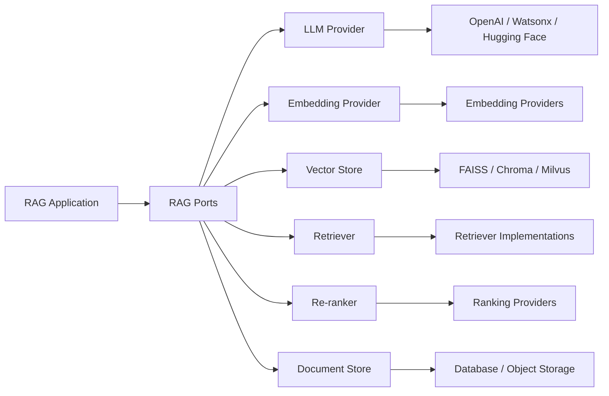

This enables infrastructure changes without rewriting the application.

---

# 🧱 7. RAG Orchestrator

The orchestrator coordinates the complete workflow.

Conceptually:

```python
class RAGOrchestrator:

    def answer(self, request):

        query = self.query_processor.process(
            request
        )

        candidates = self.retriever.retrieve(
            query
        )

        ranked = self.reranker.rank(
            query,
            candidates
        )

        context = self.context_selector.select(
            ranked
        )

        prompt = self.prompt_assembler.build(
            query,
            context
        )

        response = self.llm.generate(
            prompt
        )

        return self.validator.validate(
            response,
            context
        )
```

The orchestrator should coordinate capabilities rather than implement every detail itself.

---

# 🧠 8. Query Understanding

A user query may be incomplete:

```text
"What is the refund policy?"
```

A production system may need to understand:

```text
Intent:
Refund policy

Tenant:
Acme

Department:
Finance

Region:
EU

Document Type:
Policy

Time:
Current version
```

Query understanding can therefore produce structured retrieval instructions.

---

# 🔍 9. Query Processing

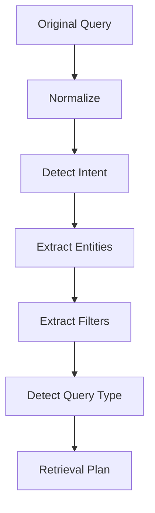

The output might be:

```json
{
  "query": "refund policy",
  "intent": "policy_lookup",
  "filters": {
    "department": "finance",
    "region": "EU"
  },
  "requires_current_version": true
}
```

---

# ✏️ 10. Query Rewriting

User queries are often conversational.

Example:

```text
User:
"What about the second one?"
```

The system needs conversation context to determine what:

```text
"the second one"
```

means.

A rewritten query might become:

```text
"Explain the second refund policy exception."
```

---

# 🔄 11. Query Rewriting Pipeline

```text
Conversation
     ↓
Current Query
     ↓
Query Rewriter
     ↓
Standalone Query
     ↓
Retriever
```

This improves retrieval quality for:

```text
Follow-up Questions
Pronouns
Ambiguous Queries
Conversational Queries
Short Queries
```

---

# 🔀 12. Multiple Retrieval Strategies

Advanced RAG rarely depends on a single retrieval strategy.

A system may combine:

```text
Dense Retrieval
+
BM25
+
Metadata Filtering
+
SQL Retrieval
+
Graph Retrieval
```

For example:

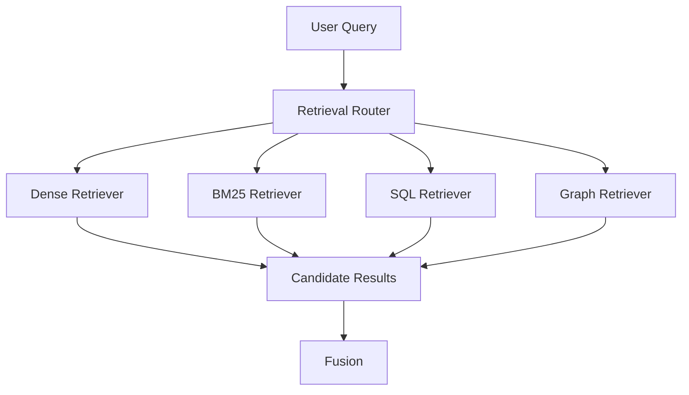

---

# 🧭 13. Retrieval Orchestration

The retrieval orchestrator decides:

```text
Which retriever?
How many candidates?
Which filters?
Which query?
What order?
```

Example:

```python
plan = RetrievalPlan(
    retrievers=[
        "dense",
        "bm25"
    ],
    top_k=50,
    filters={
        "tenant_id": tenant_id
    }
)
```

---

# 🔀 14. Hybrid Retrieval

Hybrid retrieval combines different retrieval signals.

```text
                  Query
                    │
          ┌─────────┴─────────┐
          ▼                   ▼
     Dense Search          BM25
          │                   │
          ▼                   ▼
    Semantic Results     Keyword Results
          │                   │
          └─────────┬─────────┘
                    ▼
                 Fusion
                    │
                    ▼
               Candidates
```

Dense retrieval is useful for:

```text
Semantic Similarity
Paraphrases
Conceptual Queries
```

Lexical retrieval is useful for:

```text
Exact Terms
Product IDs
Error Codes
Names
Technical Identifiers
```

---

# 🧮 15. Result Fusion

Suppose:

```text
Dense:
A
B
C
D

BM25:
B
C
E
F
```

Fusion combines the signals.

A common strategy is:

```text
A → Dense Score
B → Dense + BM25
C → Dense + BM25
E → BM25
F → BM25
```

The goal is to produce a better candidate set.

---

# 🏆 16. Re-ranking

Initial retrieval optimizes for:

```text
Recall
```

Re-ranking optimizes more heavily for:

```text
Precision
```

Pipeline:

```text
Query
 ↓
Retrieve 100
 ↓
Re-ranker
 ↓
Top 20
```

---

# 🔍 17. Retrieval vs Re-ranking

```text
Retriever
=
Fast
+
Broad
+
High Recall
```

```text
Re-ranker
=
More Expensive
+
More Precise
+
Smaller Candidate Set
```

Therefore:

```text
Fast Retrieval
       ↓
Expensive Ranking
```

is often a strong architecture.

---

# 📊 18. Candidate Funnel

A production RAG system can progressively reduce candidates:

```text
1,000,000 vectors
        ↓
ANN
        ↓
Top 100
        ↓
Hybrid Fusion
        ↓
Top 50
        ↓
Re-ranking
        ↓
Top 20
        ↓
MMR / Diversity
        ↓
Top 10
        ↓
Context Selection
        ↓
Top 5
```

This is a **retrieval funnel**.

---

# 🎯 19. Context Selection

Retrieving documents does not mean all retrieved documents should be sent to the LLM.

Suppose:

```text
Top 20 retrieved chunks
```

The LLM may only need:

```text
Top 5–8 chunks
```

Context selection considers:

```text
Relevance
Diversity
Token Budget
Source Quality
Recency
Authorization
Document Priority
```

---

# 🧠 20. Context Engineering

Context engineering is broader than simply retrieving documents.

It includes:

```text
What information enters the context?
How is it ordered?
How is it labeled?
How much is included?
What should be excluded?
What instructions surround it?
```

A useful mental model:

```text
Context
=
Relevant Evidence
+
Metadata
+
Conversation State
+
Task Instructions
```

---

# 📦 21. Context Structure

Instead of passing raw text:

```text
some random paragraph...
another paragraph...
```

structure the context:

```text
SOURCE 1
Document: Security Policy
Section: Authentication
Date: 2026
Content:
...

SOURCE 2
Document: Access Policy
Section: Authorization
Date: 2026
Content:
...
```

Structured context can make provenance and citation easier.

---

# 📐 22. Context Ordering

The order of retrieved information can affect generation.

A production system can use:

```text
Most Relevant
      ↓
Supporting Evidence
      ↓
Secondary Evidence
```

rather than blindly preserving database order.

---

# 🧹 23. Context Compression

Retrieved chunks may contain irrelevant material.

Context compression can reduce:

```text
5000 tokens
```

to:

```text
1500 relevant tokens
```

Conceptually:

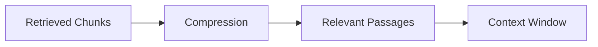

This can improve both:

```text
Latency
Cost
```

while potentially improving signal-to-noise ratio.

---

# 🧩 24. Prompt Assembly

The prompt should be assembled from structured components.

```text
System Instructions
        +
Conversation Context
        +
User Query
        +
Retrieved Evidence
        +
Response Rules
        +
Citation Rules
```

Conceptually:

```text
┌─────────────────────────────┐
│ System Instructions         │
├─────────────────────────────┤
│ Conversation                │
├─────────────────────────────┤
│ User Query                  │
├─────────────────────────────┤
│ Retrieved Context           │
├─────────────────────────────┤
│ Output Requirements         │
├─────────────────────────────┤
│ Citation Requirements       │
└─────────────────────────────┘
```

---

# 🛡️ 25. Grounded Generation

The model should be instructed to prioritize retrieved evidence.

Example:

```text
Answer using the supplied evidence.

If the evidence does not support the answer,
state that the information is not available.

Do not invent facts.
```

The prompt alone does not guarantee grounding.

Grounding must be supported by:

```text
Retrieval
+
Context Engineering
+
Validation
```

---

# 🔎 26. Response Validation

After generation:

```text
LLM Response
     ↓
Validation
     ↓
Pass / Fail
```

Possible checks:

```text
Is the answer grounded?
Are required citations present?
Does the answer contain unsupported claims?
Does it follow the output schema?
Does it violate policy?
```

---

# 📚 27. Citation Architecture

A production RAG system should preserve provenance.

```text
Chunk
 │
 ├── document_id
 ├── chunk_id
 ├── source
 ├── page
 ├── section
 └── metadata
```

Then:

```text
Retrieved Evidence
        ↓
LLM Response
        ↓
Citation Resolver
        ↓
Source References
```

---

# 🔗 28. Citation Flow

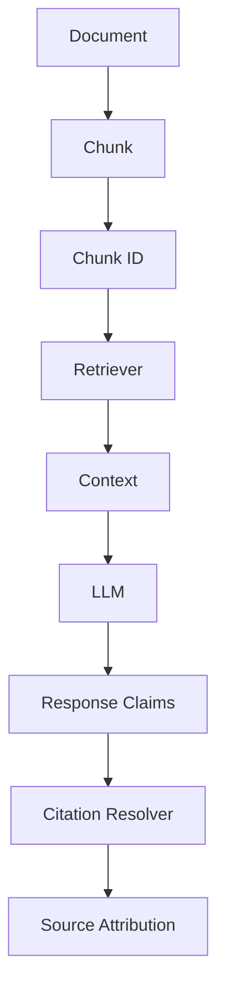

This makes citations a first-class architectural concern rather than a UI afterthought.

---

# 🏢 29. Enterprise Response

The final response may need to include:

```text
Answer
+
Citations
+
Confidence / Limitations
+
Source Information
+
Warnings
```

Example:

```text
Answer:
The refund window is 30 days.

Source:
Customer Refund Policy
Section: Refund Eligibility
Version: 2026

Citation:
[Policy-2026 / Section 4.2]
```

The exact response format depends on the enterprise application.

---

# 🔐 30. Security Architecture

Security must exist before retrieval.

```text
User Identity
      ↓
Authentication
      ↓
Authorization
      ↓
Tenant Resolution
      ↓
Retrieval Filters
      ↓
Retriever
      ↓
Context
      ↓
LLM
```

The LLM must never become the authorization layer.

---

# 🚨 31. Security Anti-Pattern

Bad architecture:

```text
Retrieve Everything
       ↓
Send Everything to LLM
       ↓
Ask LLM:
"Don't show unauthorized information."
```

This is unsafe.

The correct approach is:

```text
Authorization
      ↓
Filtered Retrieval
      ↓
Authorized Context
      ↓
LLM
```

---

# 👥 32. Multi-Tenant RAG

For a multi-tenant platform:

```text
Request
  ↓
Tenant Resolver
  ↓
Tenant Context
  ↓
Metadata Filter
  ↓
Retriever
```

Example:

```python
filters = {
    "tenant_id": request.tenant_id,
    "classification": "internal"
}
```

The filter must be enforced by trusted application infrastructure.

---

# 🧱 33. Data Layer

A production RAG platform can contain several data systems:

```text
                 Data Layer
                     │
      ┌──────────────┼──────────────┐
      │              │              │
      ▼              ▼              ▼
Vector Store     Document DB    Object Storage
      │              │              │
      ▼              ▼              ▼
Embeddings       Metadata       Raw Documents
```

Additional systems may include:

```text
SQL Database
Search Engine
Knowledge Graph
Cache
Feature Store
```

---

# 🗃️ 34. Multi-Source RAG

Enterprise knowledge rarely exists in one database.

Sources may include:

```text
PDF
Word
Web Pages
Confluence
SharePoint
Git Repositories
SQL
CRM
Tickets
Email
Knowledge Graph
```

The RAG architecture should normalize these sources into retrieval capabilities.

---

# 🌐 35. Multi-Source Retrieval

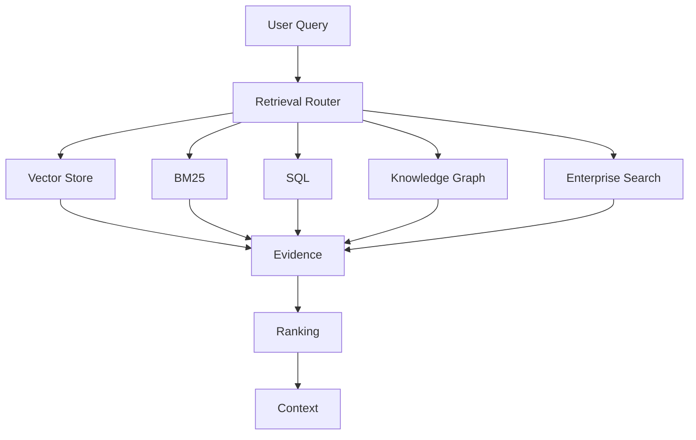

This architecture prepares the system for:

```text
Graph RAG
SQL RAG
Multimodal RAG
Agentic RAG
```

---

# 🧭 36. Retrieval Router

A retrieval router determines which retrieval strategy is appropriate.

Example:

```text
Query:
"What is our customer churn rate?"

        ↓

SQL Retriever
```

Whereas:

```text
Query:
"What is the incident response procedure?"

        ↓

Document Retriever
```

And:

```text
Query:
"How are these two systems related?"

        ↓

Graph Retriever
```

---

# 🧠 37. Query Classification

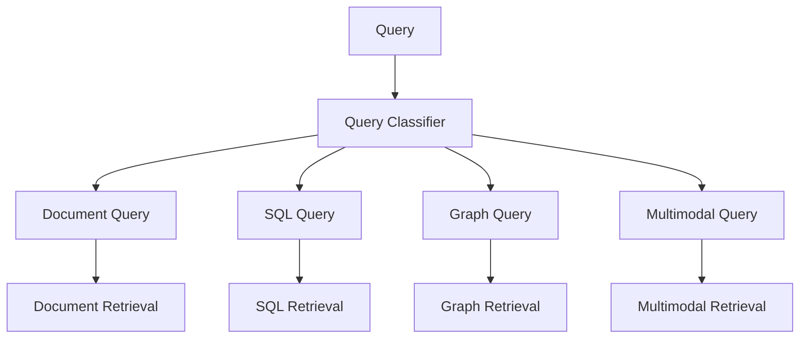

The router can use:

```text
Rules
+
Classifiers
+
LLM-based Routing
```

---

# 🤖 38. Agentic RAG

Advanced systems may dynamically decide:

```text
Search
↓
Inspect Results
↓
Search Again
↓
Use Tool
↓
Validate
↓
Answer
```

Instead of:

```text
Query
↓
One Retrieval
↓
Answer
```

Agentic RAG is therefore an extension of the retrieval orchestration model.

---

# 🔄 39. Agentic Retrieval Loop

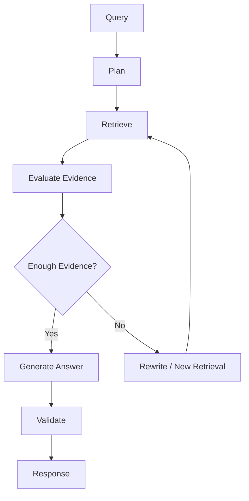

The loop should have:

```text
Maximum Iterations
Timeout
Cost Budget
Tool Restrictions
```

---

# ⏱️ 40. Latency Architecture

A RAG request can have:

```text
Query Processing     20 ms
Embedding            30 ms
Retrieval            15 ms
Re-ranking           40 ms
Context Processing   20 ms
LLM                  900 ms
Validation            50 ms
```

Total:

```text
≈ 1075 ms
```

This illustrates why every stage should be measurable.

---

# 📊 41. Latency Budget

Define budgets:

```text
Query Processing
≤ 50 ms

Retrieval
≤ 100 ms

Re-ranking
≤ 150 ms

Context Processing
≤ 100 ms

LLM
≤ 1500 ms
```

The actual values depend on the application.

The architectural principle is:

> **Every stage should have an explicit latency budget.**

---

# 💰 42. Cost Architecture

RAG cost comes from:

```text
Embedding
+
Vector Search
+
Re-ranking
+
LLM Input Tokens
+
LLM Output Tokens
+
Storage
+
Infrastructure
```

Context size directly affects LLM input cost.

Therefore:

```text
Better Retrieval
       ↓
Less Irrelevant Context
       ↓
Fewer Tokens
       ↓
Lower Cost
```

---

# 🧮 43. Context Budget

Suppose:

```text
Maximum Context = 8,000 tokens
```

The context selector might allocate:

```text
System Instructions = 800
Conversation         = 1,000
Retrieved Context   = 5,000
User Query          = 300
Response Reserve    = 900
```

Total:

```text
8,000 tokens
```

This should be treated as a budget rather than an unlimited container.

---

# 🧠 44. Context Selection Algorithm

Conceptually:

```python
def select_context(
    candidates,
    token_budget
):

    selected = []
    tokens = 0

    for candidate in candidates:

        if tokens + candidate.tokens > token_budget:
            continue

        selected.append(candidate)
        tokens += candidate.tokens

    return selected
```

A production implementation should consider:

```text
Relevance
Diversity
Source Quality
Recency
Token Cost
```

rather than simply selecting the first chunks.

---

# 🎯 45. MMR and Diversity

If the top results are nearly identical:

```text
Chunk A
Chunk B
Chunk C
Chunk D
```

the LLM receives redundant information.

MMR can promote diversity:

```text
Relevant
+
Non-Redundant
```

Conceptually:

```text
Candidate Pool
      ↓
Relevance
      +
Diversity
      ↓
Final Context
```

---

# 🧩 46. Advanced Retrieval Funnel

A strong enterprise architecture can be:

```text
User Query
     ↓
Query Understanding
     ↓
Query Rewriting
     ↓
Metadata Filtering
     ↓
Dense Retrieval
     +
BM25
     +
Structured Retrieval
     ↓
Fusion
     ↓
Top 100
     ↓
Re-ranking
     ↓
Top 30
     ↓
MMR
     ↓
Top 15
     ↓
Context Compression
     ↓
Top 8
     ↓
Prompt Assembly
     ↓
LLM
```

This architecture balances:

```text
Recall
Precision
Diversity
Token Budget
Latency
```

---

# 🏗️ 47. Production RAG Reference Architecture

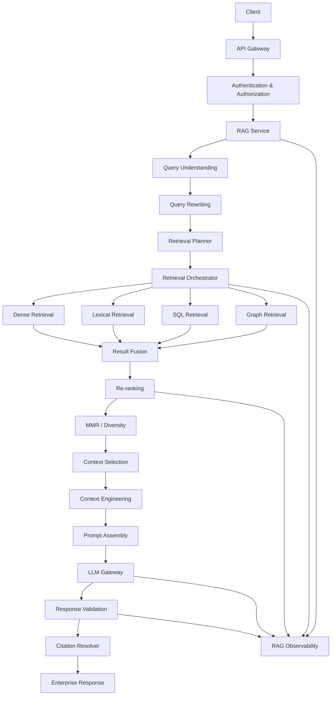

---

# 🧱 48. Service Boundaries

A large production system may separate:

```text
API Service
Query Service
Retrieval Service
Ranking Service
LLM Gateway
Document Service
Evaluation Service
Observability Platform
```

However, not every deployment needs independent microservices.

A smaller application may use:

```text
One RAG Service
+
Modular Internal Components
```

The service boundary should follow actual scaling and ownership requirements.

---

# 🏢 49. Modular Monolith vs Microservices

### Modular RAG Application

```text
RAG Service
│
├── Query Module
├── Retrieval Module
├── Ranking Module
├── Context Module
├── Generation Module
└── Validation Module
```

### Distributed RAG Platform

```text
API Service
     │
     ├── Query Service
     ├── Retrieval Service
     ├── Ranking Service
     ├── LLM Gateway
     └── Validation Service
```

Start with modularity.

Introduce distributed boundaries when there is a real operational reason.

---

# 🔌 50. LLM Gateway

The application should ideally avoid directly coupling itself to one model provider.

```text
RAG Application
      ↓
LLM Gateway
      ↓
 ┌────┼─────┐
 ▼    ▼     ▼
OpenAI Watsonx Other
```

The gateway can provide:

```text
Provider Routing
Fallback
Retries
Rate Limits
Token Accounting
Observability
Model Selection
```

---

# 🧠 51. Model Routing

Different tasks may use different models.

```text
Query Rewriting
      ↓
Small Model

Re-ranking
      ↓
Specialized Model

Answer Generation
      ↓
Large Model
```

This can reduce cost and latency.

---

# 🗂️ 52. Embedding Gateway

Similarly:

```text
RAG Application
      ↓
Embedding Provider
      ↓
 ┌────┼─────┐
 ▼    ▼     ▼
OpenAI HF Watsonx
```

The application should depend on:

```python
class EmbeddingProvider:

    def embed(self, texts):
        ...
```

rather than directly calling a provider SDK.

---

# 🔄 53. Provider-Agnostic Architecture

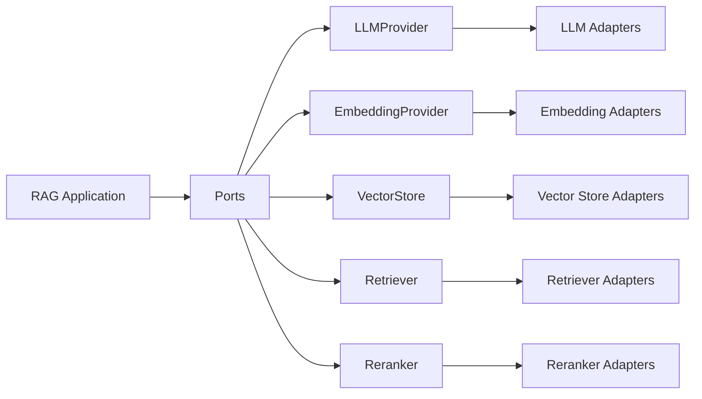

This is especially useful when building reusable enterprise AI infrastructure.

---

# 🧪 54. Testing Architecture

Advanced RAG requires multiple levels of testing.

```text
Unit Tests
    ↓
Component Tests
    ↓
Retrieval Tests
    ↓
Evaluation Tests
    ↓
Integration Tests
    ↓
Load Tests
    ↓
Production Monitoring
```

---

# 🔍 55. Retrieval Testing

Test:

```text
Query
Expected Documents
Retrieved Documents
```

Example:

```python
assert "policy-2026" in retrieved_ids
```

Metrics can include:

```text
Recall@K
Precision@K
MRR
NDCG
```

---

# 🧪 56. End-to-End RAG Testing

A complete test can evaluate:

```text
Question
   ↓
Retrieval
   ↓
Context
   ↓
Answer
   ↓
Citation
```

Test dimensions:

```text
Retrieval Quality
Groundedness
Answer Correctness
Citation Accuracy
Latency
Cost
```

---

# 📈 57. RAG Evaluation Loop

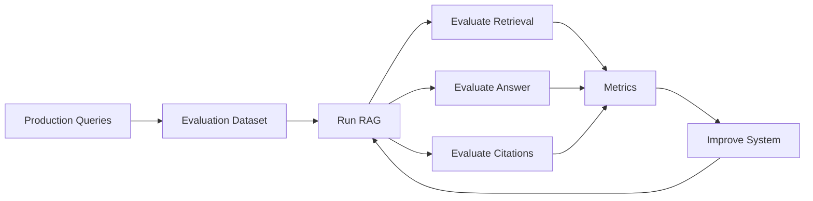

Evaluation should be continuous rather than a one-time activity.

---

# 👀 58. Observability Architecture

Production RAG should produce traces like:

```text
Trace ID
 │
 ├── Query Processing
 │
 ├── Embedding
 │
 ├── Retrieval
 │    ├── Dense
 │    ├── BM25
 │    └── SQL
 │
 ├── Fusion
 │
 ├── Re-ranking
 │
 ├── Context Selection
 │
 ├── Prompt
 │
 ├── LLM
 │
 ├── Validation
 │
 └── Citation
```

This allows engineers to answer:

```text
Why was this answer generated?
```

---

# 🔎 59. Retrieval Debugging

Suppose the final answer is incorrect.

Possible root causes:

```text
Query Rewriting
      ↓
Wrong Query

OR

Retrieval
      ↓
Wrong Documents

OR

Ranking
      ↓
Correct Document Ranked Too Low

OR

Context Selection
      ↓
Correct Evidence Removed

OR

LLM
      ↓
Unsupported Generation
```

Without stage-level observability, debugging becomes guesswork.

---

# 🧠 60. RAG Failure Taxonomy

```text
Query Failure
      ↓
Retrieval Failure
      ↓
Ranking Failure
      ↓
Context Failure
      ↓
Generation Failure
      ↓
Validation Failure
```

Each failure should have different diagnostics.

---

# 🚨 61. Common Failure — Retrieve Too Much

Bad:

```text
Top 100
  ↓
LLM
```

Potential problems:

```text
Token Cost ↑
Noise ↑
Latency ↑
Conflicting Evidence ↑
```

Better:

```text
Top 100
   ↓
Re-rank
   ↓
Top 20
   ↓
Select Context
   ↓
LLM
```

---

# 🚨 62. Common Failure — Retrieve Too Little

Bad:

```text
Top 2
```

may miss relevant evidence.

The system should tune:

```text
Candidate K
+
Re-ranking K
+
Final Context K
```

independently.

---

# 🚨 63. Common Failure — No Query Rewriting

A conversational query:

```text
"What about the previous policy?"
```

may retrieve poor results without conversation-aware rewriting.

---

# 🚨 64. Common Failure — No Metadata Filtering

Without metadata:

```text
Query
 ↓
All Tenants
 ↓
Vector Search
```

This creates security and relevance risks.

Instead:

```text
Tenant Filter
 ↓
Vector Search
```

---

# 🚨 65. Common Failure — No Re-ranking

Vector similarity is not always equivalent to:

```text
Answer Relevance
```

A re-ranker can improve candidate ordering after broad retrieval.

---

# 🚨 66. Common Failure — No Response Validation

Never assume:

```text
LLM Response
=
Correct Response
```

The system should validate:

```text
Schema
Grounding
Citations
Policy
```

where applicable.

---

# 🚨 67. Common Failure — No Citation Provenance

If the system cannot identify:

```text
Which document?
Which chunk?
Which section?
```

supported the response, trustworthy enterprise citation becomes difficult.

---

# 💰 68. Performance Optimization

Advanced RAG performance should be optimized stage by stage.

```text
Query
 ↓
Embedding
 ↓
Retrieval
 ↓
Re-ranking
 ↓
Context
 ↓
LLM
```

Optimization techniques include:

```text
Caching
Parallel Retrieval
Candidate Reduction
Model Routing
Context Compression
Streaming
Batching
Connection Pooling
```

---

# ⚡ 69. Parallel Retrieval

Instead of:

```text
Dense
 ↓
BM25
 ↓
SQL
```

execute independent retrieval operations concurrently:

```text
             Query
               │
      ┌────────┼────────┐
      ▼        ▼        ▼
    Dense     BM25     SQL
      │        │        │
      └────────┼────────┘
               ▼
             Fusion
```

This can reduce wall-clock latency.

---

# 💾 70. Caching

Potential cache layers:

```text
Query Cache
Embedding Cache
Retrieval Cache
Re-ranking Cache
LLM Response Cache
```

Example:

```text
Repeated Query
      ↓
Cache Hit
      ↓
Skip Expensive Work
```

Caching must account for:

```text
Tenant
Authorization
Document Version
Prompt Version
Model Version
```

---

# 🔄 71. Data Freshness

Enterprise RAG must answer:

```text
How fresh is the retrieved information?
```

A document update may require:

```text
Document Change
      ↓
Chunk Re-generation
      ↓
Embedding
      ↓
Index Update
      ↓
Cache Invalidation
```

---

# 🕒 72. Temporal Retrieval

Some applications require:

```text
Current Policy
```

rather than:

```text
Historical Policy
```

Therefore retrieval may need:

```text
effective_date
version
status
updated_at
```

Example:

```json
{
  "document_id": "policy-42",
  "version": "v7",
  "effective_date": "2026-01-01",
  "status": "active"
}
```

---

# 🧩 73. Advanced RAG Architecture Components

The architecture can be summarized as:

```text
                    ADVANCED RAG
                         │
       ┌─────────────────┼──────────────────┐
       │                 │                  │
       ▼                 ▼                  ▼
 Query Engineering   Retrieval          Generation
       │                 │                  │
       ├─ Rewrite        ├─ Dense          ├─ Prompt
       ├─ Expand         ├─ BM25           ├─ LLM
       ├─ Route          ├─ Hybrid         └─ Streaming
       └─ Filter         ├─ Graph
                         ├─ SQL
                         ├─ Rerank
                         └─ MMR
       │
       └───────────────────────────────────────
                         │
                         ▼
                  Context Engineering
                         │
                 ┌───────┼────────┐
                 ▼       ▼        ▼
              Select  Compress  Order
                 │       │        │
                 └───────┼────────┘
                         ▼
                   Validation
                         │
                  ┌──────┼──────┐
                  ▼      ▼      ▼
              Grounding Citation Schema
                         │
                         ▼
                Enterprise Response
```

---

# 🏢 74. Enterprise RAG Reference Model

A mature enterprise architecture should provide:

```text
                    ┌─────────────────────┐
                    │     Experience      │
                    │ Chat / API / Copilot│
                    └──────────┬──────────┘
                               │
                               ▼
                    ┌─────────────────────┐
                    │   RAG Orchestrator  │
                    └──────────┬──────────┘
                               │
        ┌──────────────────────┼──────────────────────┐
        │                      │                      │
        ▼                      ▼                      ▼
 Query Engineering       Retrieval Engineering   LLM Gateway
        │                      │                      │
        ▼                      ▼                      ▼
 Rewriting               Dense / Hybrid          Model Routing
 Expansion               Graph / SQL             Fallback
 Filtering               Re-ranking              Token Tracking
        │                      │                      │
        └──────────────────────┼──────────────────────┘
                               ▼
                     Context Engineering
                               │
                               ▼
                      Response Validation
                               │
                    ┌──────────┴──────────┐
                    ▼                     ▼
                Citation             Guardrails
                    │                     │
                    └──────────┬──────────┘
                               ▼
                      Enterprise Response
```

---

# 🔐 75. Governance

Enterprise RAG should consider:

```text
Data Governance
Model Governance
Access Control
Audit Logging
PII Protection
Data Residency
Retention
Versioning
Prompt Governance
Evaluation Governance
```

The RAG pipeline becomes part of the enterprise AI governance boundary.

---

# 📝 76. Auditability

For important enterprise responses, record:

```text
Request ID
User ID
Tenant
Query
Query Rewrite
Retriever
Retrieved IDs
Ranking
Context
Model
Prompt Version
Response
Citations
Validation Result
Latency
Cost
```

Sensitive content should be logged according to the organization's data governance policies.

---

# 🧩 77. RAG Configuration

Avoid hard-coding retrieval behavior.

Example:

```yaml
rag:
  retrieval:
    top-k: 50

  reranking:
    enabled: true
    top-k: 20

  context:
    max-tokens: 6000

  generation:
    temperature: 0.1

  citations:
    enabled: true

  validation:
    enabled: true
```

This enables controlled experimentation.

---

# 🧪 78. Feature Flags

Advanced RAG features can be introduced progressively:

```yaml
features:
  hybrid-search: true
  reranking: true
  mmr: true
  query-rewriting: true
  graph-rag: false
  agentic-rag: false
```

This allows safe production rollout.

---

# 🚦 79. Production Rollout

A mature deployment strategy:

```text
Development
    ↓
Offline Evaluation
    ↓
Integration Testing
    ↓
Shadow Traffic
    ↓
5% Traffic
    ↓
25% Traffic
    ↓
50% Traffic
    ↓
100% Traffic
```

At each stage monitor:

```text
Latency
Errors
Retrieval Quality
Answer Quality
Cost
User Feedback
```

---

# 🧠 80. Architecture Evolution

A RAG system can evolve progressively:

```text
Level 1
Basic RAG
     ↓
Level 2
Hybrid Retrieval
     ↓
Level 3
Re-ranking
     ↓
Level 4
Query Engineering
     ↓
Level 5
Advanced Retrieval
     ↓
Level 6
Graph / SQL / Multimodal
     ↓
Level 7
Agentic RAG
     ↓
Level 8
Production RAG Platform
```

Do not implement every advanced technique on day one.

---

# 🗺️ 81. Advanced RAG Roadmap

This chapter establishes the foundation for the next chapters:

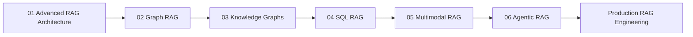

---

# 📚 82. Key Takeaways

- Advanced RAG is a complete engineering system rather than a simple retrieval-plus-generation pipeline.
- Production RAG should separate query processing, retrieval, ranking, context engineering, generation, and validation.
- Query understanding can extract intent, entities, filters, and retrieval requirements.
- Query rewriting can improve retrieval for conversational and ambiguous questions.
- Retrieval orchestration allows multiple retrieval strategies to work together.
- Dense retrieval provides semantic matching.
- Lexical retrieval provides strong exact-term matching.
- Hybrid retrieval combines complementary signals.
- Result fusion combines candidates from multiple retrieval systems.
- Re-ranking improves candidate ordering after broad retrieval.
- MMR can improve context diversity.
- Context selection controls what information reaches the LLM.
- Context engineering controls how retrieved evidence is structured and presented.
- Prompt assembly should be a dedicated capability.
- Response validation should happen after generation.
- Citation and provenance should be preserved throughout the retrieval pipeline.
- Authorization must happen before sensitive information reaches the LLM.
- Multi-tenant systems require trusted tenant-aware filtering.
- Enterprise RAG may retrieve from vector stores, search engines, SQL systems, knowledge graphs, and other sources.
- Retrieval routing can select the appropriate retrieval strategy for each query.
- Agentic RAG can introduce iterative retrieval and reasoning loops.
- Latency should be budgeted across every pipeline stage.
- Context size directly affects LLM cost.
- Caching can reduce repeated computation.
- Data freshness and index updates are important production concerns.
- Observability should expose the complete RAG trace.
- RAG failures should be classified by pipeline stage.
- Provider abstractions help keep the application independent of infrastructure vendors.
- Ports & Adapters architecture is well suited to enterprise RAG platforms.
- Production RAG should evolve incrementally rather than adopting every advanced capability simultaneously.

---

# 🏭 83. Production Checklist

```text
☐ Define RAG use case
☐ Define users
☐ Define tenants
☐ Define security requirements
☐ Define latency SLO
☐ Define cost budget
☐ Define quality targets

☐ Implement query understanding
☐ Implement query rewriting
☐ Implement metadata filtering
☐ Implement retrieval orchestration

☐ Evaluate dense retrieval
☐ Evaluate lexical retrieval
☐ Evaluate hybrid retrieval

☐ Implement candidate fusion
☐ Implement re-ranking
☐ Evaluate MMR
☐ Implement context selection
☐ Implement context compression

☐ Implement prompt assembly
☐ Implement LLM gateway
☐ Implement response validation
☐ Implement citation resolution

☐ Add authentication
☐ Add authorization
☐ Add tenant isolation
☐ Add audit logging

☐ Add retrieval metrics
☐ Add generation metrics
☐ Add latency metrics
☐ Add cost metrics
☐ Add distributed tracing

☐ Create evaluation dataset
☐ Measure Recall@K
☐ Measure MRR
☐ Measure NDCG
☐ Measure answer correctness
☐ Measure groundedness
☐ Measure citation accuracy

☐ Define index versioning
☐ Define embedding versioning
☐ Define prompt versioning
☐ Define migration strategy
☐ Define rollback strategy

☐ Load test
☐ Failure test
☐ Security test
☐ Multi-tenant test

☐ Shadow deploy
☐ Canary deploy
☐ Monitor
☐ Iterate
```

---

# 🧪 84. Practical Architecture Exercise

Design an enterprise RAG application for:

```text
Enterprise Knowledge Assistant
```

Requirements:

```text
10 million document chunks
Multiple tenants
PDF + Word + Web + SQL
Hybrid Search
Re-ranking
Citations
Access Control
P95 < 2 seconds
```

Design:

```text
1. Query Layer
2. Retrieval Layer
3. Ranking Layer
4. Context Layer
5. LLM Layer
6. Validation Layer
7. Citation Layer
8. Observability Layer
9. Security Layer
```

Then document:

```text
Why each component exists
What interface it exposes
What technology implements it
What metric monitors it
What happens when it fails
```

---

# 🧠 85. Architecture Review Questions

Before calling a RAG system production-ready, ask:

### Query

```text
Can conversational queries be rewritten?
Can metadata filters be extracted?
Can query intent be detected?
```

### Retrieval

```text
Can multiple retrievers run?
Can retrieval be routed?
Can hybrid search be used?
Can candidates be fused?
```

### Ranking

```text
Is re-ranking supported?
Can ranking be evaluated independently?
```

### Context

```text
Is context selected intelligently?
Is token budget enforced?
Is redundancy controlled?
```

### Generation

```text
Can the LLM provider be changed?
Is model routing possible?
Is token usage tracked?
```

### Validation

```text
Are responses grounded?
Are citations validated?
Are structured outputs validated?
```

### Security

```text
Is authorization enforced before retrieval?
Is tenant isolation enforced?
```

### Operations

```text
Can the complete RAG trace be observed?
Can index versions be identified?
Can failures be diagnosed?
```

---

# 💡 Final Mental Model

```text
                         ADVANCED RAG
                              │
                              ▼
                         User Query
                              │
                              ▼
                    Query Understanding
                              │
                              ▼
                       Query Rewriting
                              │
                              ▼
                    Retrieval Planning
                              │
          ┌───────────────────┼───────────────────┐
          ▼                   ▼                   ▼
       Dense                Lexical            Structured
      Retrieval             Search              Search
          │                   │                   │
          └───────────────────┼───────────────────┘
                              ▼
                            Fusion
                              │
                              ▼
                         Re-ranking
                              │
                              ▼
                         MMR / Diversity
                              │
                              ▼
                     Context Selection
                              │
                              ▼
                    Context Engineering
                              │
                              ▼
                       Prompt Assembly
                              │
                              ▼
                             LLM
                              │
                              ▼
                     Response Validation
                              │
                  ┌───────────┴───────────┐
                  ▼                       ▼
              Citation                Guardrails
                  │                       │
                  └───────────┬───────────┘
                              ▼
                     Enterprise Response
                              │
                              ▼
                       Observability
```

The central principle of advanced RAG is:

> **Retrieval is not the final objective. The objective is to transform a user request into trustworthy, relevant, authorized evidence and use that evidence to produce a validated enterprise response.**

A production RAG system therefore optimizes across:

```text
                    ┌─────────────┐
                    │   QUALITY   │
                    └──────┬──────┘
                           │
          ┌────────────────┼────────────────┐
          │                │                │
          ▼                ▼                ▼
      Relevance        Grounding        Citation
          │                │                │
          └────────────────┼────────────────┘
                           ▼
                    Enterprise RAG
                           ▲
          ┌────────────────┼────────────────┐
          │                │                │
          ▼                ▼                ▼
       LATENCY           COST           SECURITY
```

The strongest RAG architecture is not the one with the most components.

It is the one where:

```text
Every component
      ↓
Has a clear responsibility
      ↓
Has a measurable outcome
      ↓
Has a defined failure mode
      ↓
Can be replaced independently
      ↓
Supports the production SLO
```

---

# 🧭 Chapter Navigation

### Part V — Advanced Retrieval-Augmented Generation

**Previous:**  
[04. FAISS vs ChromaDB vs Milvus](../04-vector-search-engineering/04-faiss-vs-chromadb-vs-milvus.md)

**Next:**  
[02. Graph RAG](02-graph-rag.md)

**Section:**  
05 — Advanced RAG Architecture

### Advanced RAG Architecture Path

```text
01 Advanced RAG Architecture
        ↓
02 Graph RAG
        ↓
03 Knowledge Graphs for RAG
        ↓
04 SQL RAG
        ↓
05 Multimodal RAG
        ↓
06 Agentic RAG
```

---

> **Enterprise AI Engineering Handbook**  
> *Building Production-Grade Enterprise AI Systems — One Chapter at a Time.*