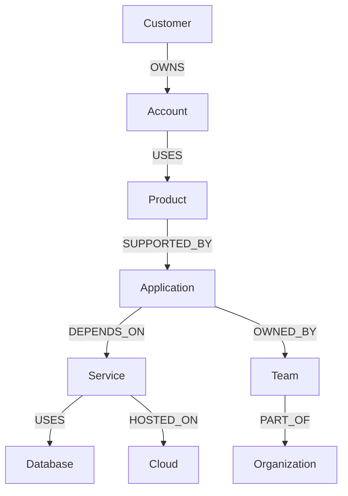
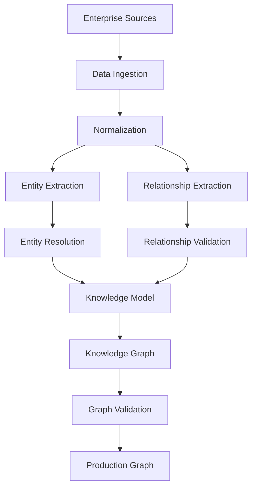
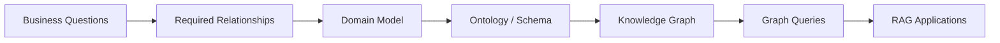
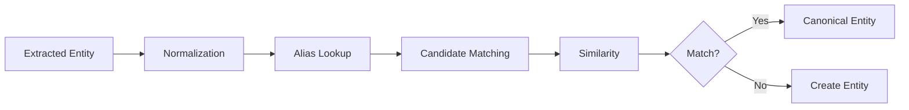
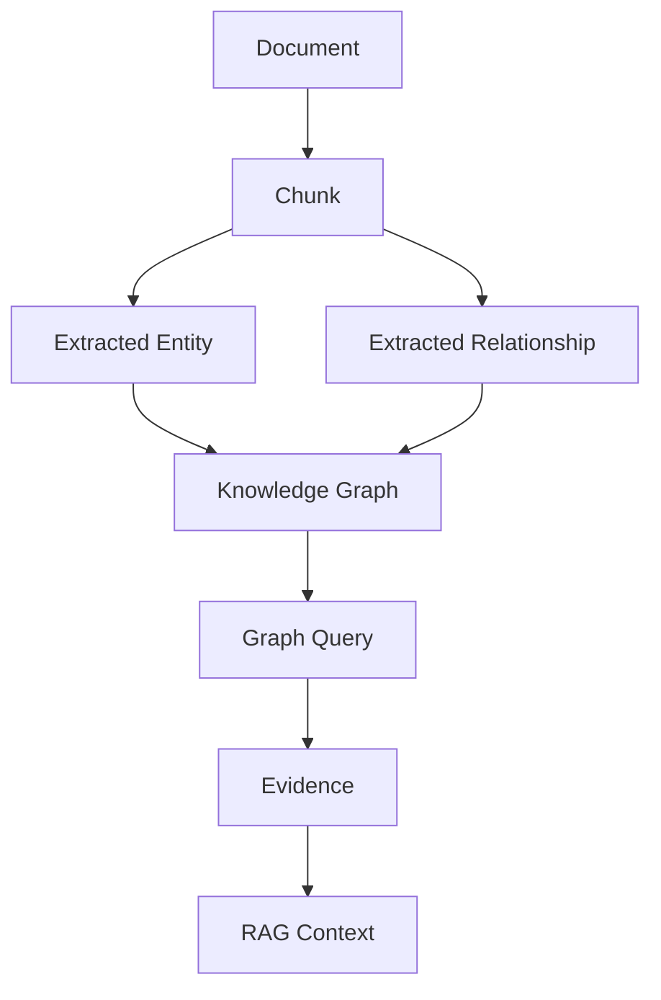
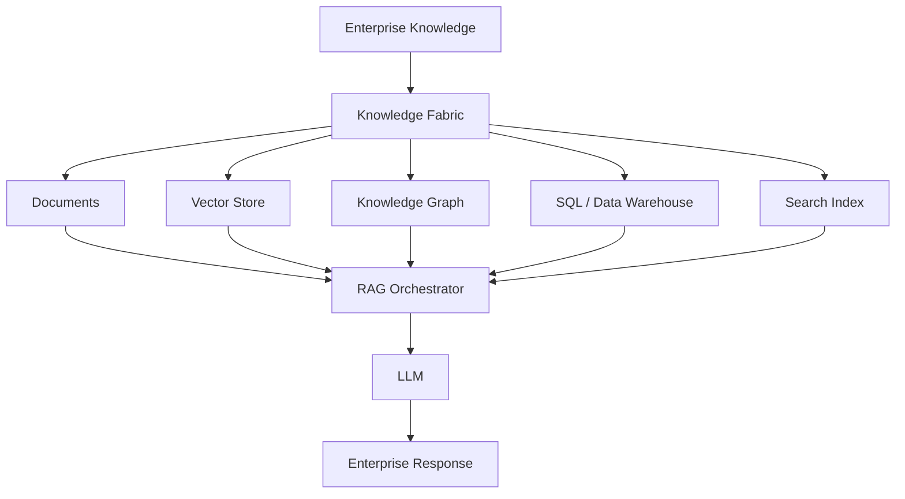
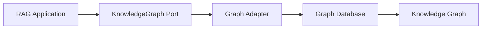
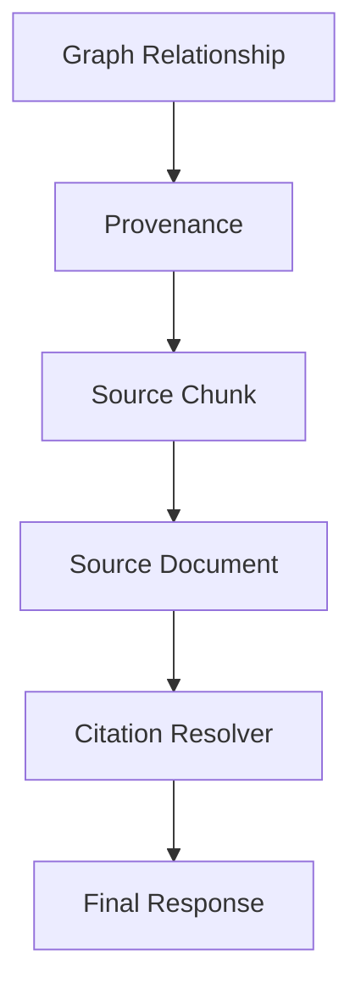
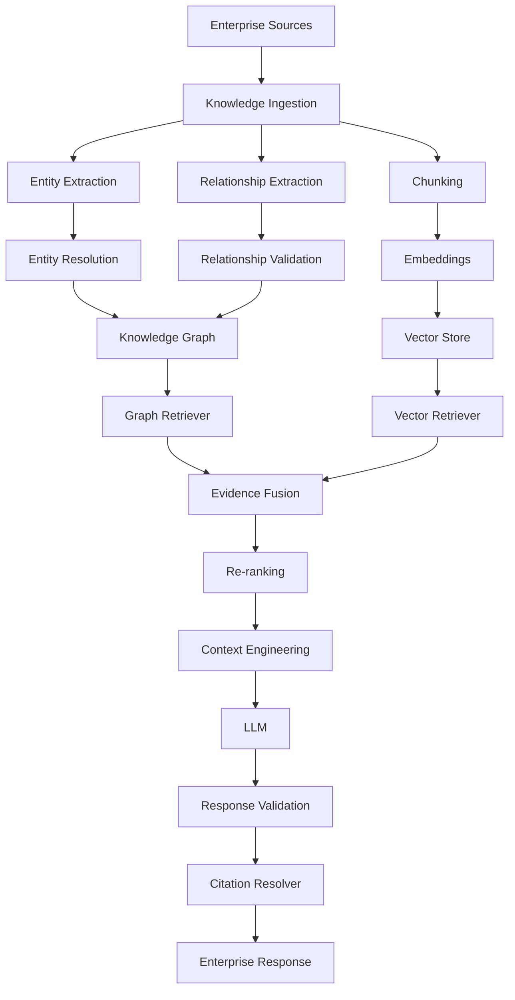

# 03. Knowledge Graphs for RAG

> **Category:** Advanced RAG Architecture  
> **Module:** Part V — Advanced Retrieval-Augmented Generation  
> **Difficulty:** Advanced

---

## 📖 Overview

A **Knowledge Graph** provides the structured knowledge layer behind Graph RAG systems.

While **Graph RAG** focuses on how graph-based retrieval is used inside a RAG pipeline, **Knowledge Graphs for RAG** focuses on how enterprise knowledge is modeled, constructed, governed, connected, queried, and maintained.

A useful distinction is:

```text
Knowledge Graph
        │
        │ provides structured knowledge
        ▼
Graph Retrieval
        │
        │ retrieves entities + relationships
        ▼
Graph RAG
        │
        │ combines retrieved knowledge with
        │ documents / vectors / structured data
        ▼
LLM
        │
        ▼
Enterprise Response
```

A knowledge graph represents enterprise knowledge using:

```text
Entities
+
Relationships
+
Properties
+
Constraints
+
Provenance
+
Temporal Information
+
Ontology / Schema
```

For enterprise AI systems, this creates a structured knowledge layer that can complement:

```text
Vector Stores
+
Document Stores
+
SQL Databases
+
Search Engines
+
LLMs
```

---

# 🎯 Learning Objectives

After completing this chapter, you will be able to:

- Understand Knowledge Graphs
- Understand the difference between Knowledge Graphs and Graph RAG
- Understand entities, relationships, properties, and triples
- Understand property graphs
- Understand RDF graphs
- Understand ontologies
- Understand schemas
- Design enterprise knowledge models
- Build knowledge graphs from unstructured documents
- Extract entities and relationships using LLMs
- Resolve duplicate entities
- Link entities to canonical identities
- Preserve source provenance
- Model temporal knowledge
- Handle graph updates and deletions
- Query knowledge graphs
- Integrate knowledge graphs with RAG
- Combine knowledge graphs with vector databases
- Design enterprise Knowledge Graph RAG architectures
- Understand graph security and governance
- Evaluate knowledge graph quality
- Monitor graph freshness and reliability
- Understand production Knowledge Graph lifecycle management

---

# 🧠 1. What Is a Knowledge Graph?

A Knowledge Graph represents knowledge as connected entities and relationships.

At the simplest level:

```text
Entity
   │
Relationship
   │
Entity
```

For example:

```text
Acme
  │
  │ OWNS
  ▼
Payment Platform
  │
  │ DEPENDS_ON
  ▼
Payment Service
```

The graph captures not only the entities but also the relationships between them.

---

# 🔗 2. Knowledge Graph Mental Model

A Knowledge Graph can be viewed as:

```text
                    KNOWLEDGE GRAPH
                           │
          ┌────────────────┼────────────────┐
          │                │                │
          ▼                ▼                ▼
       Entities       Relationships     Properties
          │                │                │
          └────────────────┼────────────────┘
                           ▼
                       Knowledge
                           │
                           ▼
                     Graph Queries
                           │
                           ▼
                    Graph Retrieval
                           │
                           ▼
                         RAG
```

---

# 🧩 3. Core Components

A Knowledge Graph typically contains:

```text
1. Entities
2. Relationships
3. Properties
4. Identifiers
5. Ontology / Schema
6. Provenance
7. Temporal information
8. Constraints
```

These components together provide a structured representation of enterprise knowledge.

---

# 🧱 4. Entities

An entity represents something that exists in the knowledge domain.

Examples:

```text
Person
Organization
Customer
Application
Service
Database
Product
Cloud Resource
Policy
Regulation
Location
Project
Document
```

Example:

```json
{
  "id": "service-payment",
  "type": "Service",
  "name": "Payment Service"
}
```

---

# 🔗 5. Relationships

Relationships connect entities.

Examples:

```text
OWNS
USES
DEPENDS_ON
WORKS_FOR
MANAGES
HOSTED_ON
LOCATED_IN
IMPLEMENTS
APPLIES_TO
RELATED_TO
```

Example:

```text
Payment Platform
        │
        │ DEPENDS_ON
        ▼
Payment Service
```

---

# 🏷️ 6. Properties

Entities and relationships can have properties.

Example entity:

```json
{
  "id": "service-payment",
  "type": "Service",
  "name": "Payment Service",
  "version": "4.2",
  "status": "active",
  "criticality": "high"
}
```

Properties allow the graph to represent richer knowledge than simple connections.

---

# 🧩 7. Relationship Properties

Relationships can also contain metadata.

Example:

```json
{
  "source": "application-a",
  "relationship": "DEPENDS_ON",
  "target": "payment-service",
  "criticality": "high",
  "since": "2025-01-01"
}
```

This allows relationships to carry information such as:

```text
Criticality
Effective Date
Confidence
Source
Status
Ownership
Version
```

---

# 🔺 8. Knowledge Graph Triples

A fundamental representation is:

```text
Subject
Predicate
Object
```

For example:

```text
Payment Service
     │
     │ dependsOn
     ▼
Authentication Service
```

Represented as:

```text
PaymentService
    dependsOn
AuthenticationService
```

Another example:

```text
PaymentService
    hostedOn
AWS
```

---

# 🔷 9. RDF Graph

RDF represents knowledge primarily through triples:

```text
Subject → Predicate → Object
```

Example:

```text
PaymentService → dependsOn → AuthService
PaymentService → hostedOn → AWS
PaymentService → uses → PostgreSQL
```

RDF is particularly useful where semantic interoperability and ontology-driven modeling are important.

---

# 🏗️ 10. Property Graph

A property graph uses:

```text
Nodes
+
Edges
+
Properties
```

Example:

```text
(:Service {
    id: "payment-service",
    name: "Payment Service",
    version: "4.2"
})
```

Relationship:

```text
(:Application)
    -[:DEPENDS_ON {
        criticality: "high"
    }]->
(:Service)
```

Property graphs are often intuitive for application and dependency modeling.

---

# 🔍 11. RDF vs Property Graph

| Aspect | RDF | Property Graph |
|---|---|---|
| Basic representation | Triples | Nodes + Edges |
| Semantic modeling | Strong | Flexible |
| Properties | Additional triples | Native |
| Ontology support | Strong | Possible |
| Query style | SPARQL | Graph query languages |
| Developer accessibility | Moderate | Often intuitive |
| Semantic Web | Strong | Less central |
| Enterprise dependency modeling | Strong | Strong |

Neither model is universally better.

The correct choice depends on:

```text
Domain
+
Existing Data
+
Query Requirements
+
Governance
+
Tooling
+
Interoperability
```

---

# 🧠 12. Knowledge Graph vs Graph Database

These terms are related but not identical.

### Knowledge Graph

Focuses on:

```text
Knowledge Representation
+
Meaning
+
Relationships
+
Semantics
```

### Graph Database

Focuses on:

```text
Storage
+
Indexing
+
Graph Queries
+
Graph Traversal
```

A graph database can store a knowledge graph.

Conceptually:

```text
Knowledge Graph
      │
      ▼
Graph Database
      │
      ▼
Graph Query Engine
```

---

# 🧠 13. Knowledge Graph vs Graph RAG

These concepts should not be confused.

```text
Knowledge Graph
    =
Structured Knowledge Representation
```

```text
Graph RAG
    =
RAG Architecture Using Graph-Based Knowledge
```

The relationship is:

```text
Knowledge Graph
       │
       ▼
Graph Retrieval
       │
       ▼
Graph RAG
       │
       ▼
LLM
```

A Knowledge Graph can therefore exist independently of RAG.

---

# 🏢 14. Enterprise Knowledge Graph

An enterprise Knowledge Graph can connect:

```text
People
Organizations
Customers
Applications
Services
Databases
Policies
Documents
Projects
Products
Cloud Resources
Regulations
```

Example:



This creates a connected enterprise knowledge model.

---

# 🧩 15. Why Knowledge Graphs Matter for Enterprise AI

Enterprise knowledge is rarely isolated.

For example:

```text
Customer
   ↓
Account
   ↓
Product
   ↓
Application
   ↓
Service
   ↓
Database
   ↓
Cloud
```

Traditional document retrieval may find information about each component.

A Knowledge Graph makes the relationships explicit.

This supports questions such as:

```text
Which applications support this customer?

Which services are affected by this database?

Which teams own applications using this service?

Which regulations apply to this business process?
```

---

# 📚 16. Knowledge Graph Construction

A Knowledge Graph can be built from:

```text
Structured Data
+
Semi-Structured Data
+
Unstructured Data
```

Sources may include:

```text
PDF
Word
HTML
Wiki
Email
CRM
ERP
SQL
CSV
JSON
APIs
Code Repositories
Ticketing Systems
```

---

# 🏗️ 17. Knowledge Graph Construction Pipeline



---

# 📄 18. Structured vs Unstructured Sources

### Structured

```text
SQL
CSV
JSON
CRM
ERP
```

These often already contain:

```text
Identifiers
Relationships
Attributes
```

### Unstructured

```text
PDF
Email
Documents
Web Pages
Tickets
```

These require additional extraction.

---

# 🤖 19. LLM-Assisted Knowledge Extraction

LLMs can transform unstructured text into structured knowledge.

Input:

```text
"Acme's payment platform runs on AWS.
The platform uses PostgreSQL and depends
on the authentication service."
```

Potential entities:

```text
Acme
Payment Platform
AWS
PostgreSQL
Authentication Service
```

Potential relationships:

```text
Payment Platform → HOSTED_ON → AWS

Payment Platform → USES → PostgreSQL

Payment Platform → DEPENDS_ON → Authentication Service
```

---

# 🧾 20. Structured Extraction

A constrained output format is preferable.

Example:

```json
{
  "entities": [
    {
      "name": "Acme",
      "type": "Organization"
    },
    {
      "name": "Payment Platform",
      "type": "Application"
    },
    {
      "name": "AWS",
      "type": "CloudProvider"
    },
    {
      "name": "PostgreSQL",
      "type": "Database"
    },
    {
      "name": "Authentication Service",
      "type": "Service"
    }
  ],
  "relationships": [
    {
      "source": "Payment Platform",
      "type": "HOSTED_ON",
      "target": "AWS"
    },
    {
      "source": "Payment Platform",
      "type": "USES",
      "target": "PostgreSQL"
    },
    {
      "source": "Payment Platform",
      "type": "DEPENDS_ON",
      "target": "Authentication Service"
    }
  ]
}
```

---

# ⚠️ 21. Extraction Is Not Truth

LLM extraction can produce:

```text
Incorrect Entity
Incorrect Relationship
Missing Entity
Duplicate Entity
Hallucinated Relationship
Wrong Entity Type
```

Therefore:

```text
LLM Extraction
      ↓
Validation
      ↓
Normalization
      ↓
Entity Resolution
      ↓
Graph
```

should be preferred.

---

# 🧪 22. Extraction Validation

Validation can use:

```text
Schema Validation
+
Type Validation
+
Relationship Constraints
+
Business Rules
+
Source Evidence
```

Example:

```text
Application
   DEPENDS_ON
Service
```

may be valid.

But:

```text
Database
   DEPENDS_ON
Person
```

may violate the domain model.

---

# 🧠 23. Ontology

An ontology defines concepts and relationships in a domain.

It can describe:

```text
What entities exist?
What properties do they have?
What relationships are valid?
How are concepts related?
```

Example:

```text
Application
   │
   ├── DEPENDS_ON → Service
   ├── OWNED_BY → Team
   └── HOSTED_ON → CloudResource
```

---

# 🧩 24. Ontology vs Schema

These terms are related but not identical.

### Schema

Defines:

```text
Structure
Fields
Types
Constraints
```

### Ontology

Defines:

```text
Concepts
Relationships
Meaning
Semantics
Domain Rules
```

A simplified view:

```text
Schema
  ↓
How data is structured

Ontology
  ↓
What the data means
```

---

# 🏗️ 25. Enterprise Ontology

An enterprise ontology might contain:

```text
BusinessDomain
Organization
Team
Person
Customer
Product
Application
Service
Database
CloudResource
Policy
Regulation
Document
```

Relationships:

```text
PART_OF
OWNS
MANAGES
USES
DEPENDS_ON
HOSTED_ON
APPLIES_TO
DEFINED_BY
SUPPORTS
```

---

# 🧭 26. Domain-Driven Knowledge Modeling

A good enterprise graph should start with domain questions.

Instead of:

```text
"What data can we put into a graph?"
```

ask:

```text
"What questions must the graph answer?"
```

For example:

```text
Which applications depend on this service?

Which customers use this product?

Which regulations apply to this process?
```

Then model the entities and relationships required to answer those questions.

---

# 🔎 27. Query-Driven Graph Design



This prevents unnecessary graph complexity.

---

# 🧩 28. Entity Resolution

Enterprise data often contains multiple representations of the same entity.

Example:

```text
Amazon Web Services
AWS
AWS Cloud
Amazon AWS
```

These should ideally resolve to:

```text
Canonical Entity:
Amazon Web Services
```

---

# 🔄 29. Entity Resolution Pipeline



---

# 🆔 30. Canonical Entity IDs

Every important entity should have a stable identifier.

Example:

```json
{
  "entity_id": "cloud-provider-aws",
  "canonical_name": "Amazon Web Services",
  "type": "CloudProvider",
  "aliases": [
    "AWS",
    "AWS Cloud"
  ]
}
```

Applications should use:

```text
entity_id
```

rather than relying only on display names.

---

# 🧠 31. Entity Linking

Entity resolution generally operates during graph construction.

Entity linking can also occur during query processing.

Example query:

```text
"Which services run on AWS?"
```

The system needs to link:

```text
AWS
```

to:

```text
cloud-provider-aws
```

before querying the graph.

---

# 🔍 32. Query-Time Entity Linking

```text
User Query
     ↓
Entity Extraction
     ↓
Candidate Entities
     ↓
Alias Matching
     ↓
Semantic Matching
     ↓
Canonical Entity ID
     ↓
Graph Query
```

This is essential for reliable graph retrieval.

---

# 📚 33. Provenance

Enterprise knowledge should preserve where information came from.

A graph relationship:

```text
Payment Service
   DEPENDS_ON
Auth Service
```

should ideally have:

```text
Source Document
Page
Section
Chunk
Extraction Method
Timestamp
Confidence
Version
```

---

# 🔗 34. Provenance Model



This creates a traceable path:

```text
Answer
 ↓
Graph Relationship
 ↓
Evidence
 ↓
Source Document
```

---

# 🧾 35. Relationship Provenance

Example:

```json
{
  "source": "payment-service",
  "relationship": "DEPENDS_ON",
  "target": "auth-service",
  "provenance": {
    "document_id": "architecture-2026",
    "chunk_id": "chunk-183",
    "page": 14,
    "extracted_at": "2026-08-10",
    "confidence": 0.94
  }
}
```

The exact confidence mechanism depends on the implementation.

---

# 🕒 36. Temporal Knowledge

Enterprise knowledge changes over time.

Example:

```text
Application A
    │
    │ OWNED_BY
    ▼
Team A
```

Later:

```text
Application A
    │
    │ OWNED_BY
    ▼
Team B
```

A production Knowledge Graph should be able to represent the change.

---

# 📅 37. Temporal Relationships

Example:

```json
{
  "source": "application-a",
  "relationship": "OWNED_BY",
  "target": "team-b",
  "valid_from": "2026-01-01",
  "valid_to": null
}
```

Historical relationships can therefore be preserved.

---

# 🧠 38. Bitemporal Knowledge

For sophisticated enterprise systems, two time dimensions can matter:

```text
Valid Time
+
Transaction Time
```

### Valid Time

When the fact was true in the real world.

### Transaction Time

When the system learned or stored the fact.

Example:

```text
Ownership changed:
January 1

Graph updated:
January 5
```

These are different timestamps.

---

# 🔄 39. Knowledge Graph Lifecycle

A production graph follows a lifecycle:

```text
Ingest
  ↓
Extract
  ↓
Normalize
  ↓
Resolve
  ↓
Validate
  ↓
Publish
  ↓
Query
  ↓
Monitor
  ↓
Update
  ↓
Retire
```

---

# 🏗️ 40. Incremental Updates

A production graph should not always require full reconstruction.

When a document changes:

```text
Changed Document
       ↓
Identify Affected Chunks
       ↓
Extract New Knowledge
       ↓
Compare Existing Knowledge
       ↓
Update Graph
       ↓
Update Provenance
```

---

# 🔄 41. Change Detection

```text
Document Version 1
        ↓
Document Version 2
        ↓
Diff
        ↓
Changed Content
        ↓
Affected Entities
        ↓
Affected Relationships
```

This supports efficient incremental graph updates.

---

# 🗑️ 42. Deletions

Deletion is often overlooked.

If a source document is removed:

```text
Document
   ↓
Evidence
   ↓
Relationship
```

the system must determine whether the relationship should:

```text
Delete
Invalidate
Expire
Retain with Historical Provenance
```

The correct behavior depends on the domain.

---

# 🧩 43. Confidence-Aware Knowledge

Not every extracted fact has equal confidence.

Example:

```text
Relationship
    DEPENDS_ON
Confidence:
    High
```

Another:

```text
Relationship
    RELATED_TO
Confidence:
    Low
```

Confidence can be used as a retrieval or validation signal.

---

# 📊 44. Knowledge Quality Dimensions

A production Knowledge Graph should be evaluated across:

```text
Accuracy
Completeness
Consistency
Freshness
Coverage
Provenance
Entity Resolution
Relationship Quality
```

---

# 🧪 45. Entity Quality

Measure:

```text
Entity Precision
Entity Recall
Entity Classification Accuracy
Duplicate Rate
Resolution Accuracy
```

Example:

```text
Expected:
AWS

Retrieved:
AWS Cloud

Canonical:
Amazon Web Services
```

The evaluation should consider whether the system correctly resolved the entity.

---

# 🔗 46. Relationship Quality

Measure:

```text
Relationship Precision
Relationship Recall
Relationship Type Accuracy
Source Attribution
Temporal Accuracy
```

Incorrect relationships can be more damaging than missing relationships because they can create false paths.

---

# 🧠 47. Graph Completeness

A graph may contain:

```text
Application A
Application B
Application C
```

but be missing:

```text
Application B
    DEPENDS_ON
Payment Service
```

The graph may therefore be structurally valid but incomplete.

Completeness is an important enterprise quality dimension.

---

# 🧩 48. Graph Consistency

Example:

```text
Application A
   DEPENDS_ON
Service B
```

and elsewhere:

```text
Service B
   DOES_NOT_EXIST
```

or:

```text
Application A
   DEPENDS_ON
Service B
```

while Service B is marked:

```text
status = deleted
```

Graph consistency rules can detect such issues.

---

# 🔍 49. Constraint Validation

Knowledge graphs can use constraints such as:

```text
Application DEPENDS_ON Service
Service USES Database
Application OWNED_BY Team
Team PART_OF Organization
```

Invalid relationships should be rejected or flagged.

---

# 🧠 50. Graph Governance

Enterprise Knowledge Graphs require governance.

Governance includes:

```text
Ownership
Schema Management
Ontology Management
Data Quality
Access Control
Change Management
Versioning
Audit
Retention
```

---

# 🏢 51. Data Ownership

Each domain should ideally have an owner.

Example:

```text
Payments Domain
    │
    ├── Application Knowledge
    ├── Service Knowledge
    └── Dependency Knowledge

Owner:
Payments Architecture Team
```

This improves accountability.

---

# 🔐 52. Security

Knowledge Graphs can expose sensitive information.

Examples:

```text
Employee Relationships
Customer Relationships
System Dependencies
Security Vulnerabilities
Contracts
Internal Architecture
```

Therefore security must apply to:

```text
Nodes
Edges
Properties
Queries
Source Documents
```

---

# 👥 53. Fine-Grained Authorization

A user may be allowed to see:

```text
Application A
```

but not:

```text
Application A
   DEPENDS_ON
Sensitive Internal Service
```

Authorization should therefore be evaluated before returning graph data.

---

# 🏢 54. Multi-Tenant Knowledge Graph

A shared graph may contain:

```text
Tenant A
 ├── Customers
 ├── Applications
 └── Services

Tenant B
 ├── Customers
 ├── Applications
 └── Services
```

Tenant boundaries should be enforced at the retrieval layer.

```python
graph.search(
    entity="payment-service",
    tenant_id="tenant-a"
)
```

Do not depend on the LLM to enforce tenant isolation.

---

# 🔗 55. Knowledge Graph + Vector Store

Knowledge Graphs and vector databases solve different problems.

```text
Knowledge Graph
    ↓
Relationships + Structured Knowledge

Vector Store
    ↓
Semantic Similarity + Unstructured Evidence
```

Together:

```text
                Query
                  │
          ┌───────┴────────┐
          ▼                ▼
     Vector Store      Knowledge Graph
          │                │
          ▼                ▼
   Semantic Evidence   Structured Knowledge
          │                │
          └───────┬────────┘
                  ▼
             Evidence Fusion
                  │
                  ▼
                 LLM
```

---

# 🧠 56. Why Store Both?

Suppose we have:

```text
Payment Service
```

The graph knows:

```text
Payment Service
    DEPENDS_ON
Auth Service
```

The vector store contains:

```text
Authentication Architecture.pdf
```

The graph provides:

```text
Relationship
```

The document provides:

```text
Detailed Explanation
```

Together they provide stronger context.

---

# 🔎 57. Graph Retrieval + Vector Retrieval

Example query:

```text
"Which applications depend on Payment Service
and why do they depend on it?"
```

Graph retrieval:

```text
Application A
Application B
Application C
```

Vector retrieval:

```text
Payment Architecture
Service Documentation
Dependency Documentation
```

Combined context:

```text
Relationships
+
Explanations
+
Evidence
```

---

# 🧩 58. Knowledge Graph + SQL

Many enterprises already have structured data in relational databases.

Example:

```text
Customer
Account
Transaction
Product
```

SQL can answer:

```text
Aggregation
Filtering
Transactions
Exact Structured Queries
```

The graph can answer:

```text
Relationships
Multi-Hop Dependencies
Entity Networks
```

A production architecture can therefore use:

```text
Graph
+
SQL
+
Vector
```

---

# 🏗️ 59. Enterprise Knowledge Fabric

A mature architecture can combine multiple knowledge systems:



The goal is not to replace every data system with a graph.

The goal is to expose the right knowledge source for the question.

---

# 🧠 60. Knowledge Graph as a Semantic Layer

A Knowledge Graph can act as a semantic layer between:

```text
Raw Enterprise Data
        ↓
Knowledge Model
        ↓
Applications
```

This allows applications to work with concepts such as:

```text
Customer
Application
Service
Product
Policy
Regulation
```

rather than understanding every underlying data source.

---

# 🔌 61. Knowledge Graph Abstraction

A RAG application can expose a provider-neutral interface:

```python
class KnowledgeGraph:

    def find_entity(self, name):
        raise NotImplementedError

    def find_relationships(self, entity_id):
        raise NotImplementedError

    def traverse(
        self,
        entity_id,
        max_depth=2
    ):
        raise NotImplementedError

    def query(self, query):
        raise NotImplementedError
```

The application remains independent of the underlying graph technology.

---

# 🏛️ 62. Ports & Adapters Architecture



Possible adapters may include:

```text
Property Graph Adapter
RDF Adapter
Enterprise Graph Adapter
```

This keeps infrastructure concerns outside the domain layer.

---

# 🧠 63. Knowledge Graph Query Layer

A production abstraction may expose operations such as:

```python
class KnowledgeGraphPort:

    def resolve_entity(self, reference):
        ...

    def get_neighbors(self, entity_id, filters=None):
        ...

    def find_path(
        self,
        source,
        target,
        max_depth=3
    ):
        ...

    def find_related_entities(
        self,
        entity_id,
        relationship_types=None
    ):
        ...
```

This allows the RAG orchestrator to remain graph-technology agnostic.

---

# 🔎 64. Query Patterns

Common Knowledge Graph query patterns include:

### Direct Relationship

```text
Who owns Application A?
```

### One-Hop

```text
Which services does Application A use?
```

### Multi-Hop

```text
Which databases are indirectly used by Application A?
```

### Path Query

```text
How is Customer A connected to Product B?
```

### Neighborhood

```text
What is connected to Service X?
```

### Pattern Matching

```text
Find applications that:
- depend on Service X
- are owned by Team Y
- run in AWS
```

---

# 🧭 65. Multi-Hop Query

Consider:

```text
Customer
   ↓
Application
   ↓
Service
   ↓
Database
```

Question:

```text
"Which database does this customer indirectly depend on?"
```

The answer requires:

```text
Customer
 → Application
 → Service
 → Database
```

This is a natural Knowledge Graph query.

---

# 🧠 66. Path-Based Reasoning

A path can provide an explanation:

```text
Customer A
   │
   │ USES
   ▼
Application A
   │
   │ DEPENDS_ON
   ▼
Payment Service
   │
   │ USES
   ▼
PostgreSQL
```

The path itself becomes evidence.

---

# 🔍 67. Graph Context Representation

Instead of sending only raw graph structures to the LLM, convert them into readable context.

Example:

```text
ENTITY:
Payment Service

RELATIONSHIPS:
- Application A depends on Payment Service.
- Application B depends on Payment Service.
- Payment Service uses PostgreSQL.
- Payment Service is hosted on AWS.

SOURCES:
- architecture.pdf, section 4.2
- dependency.md, section 7
```

This is easier for the LLM to consume.

---

# 🧩 68. Graph Context Serialization

Possible formats:

### Structured JSON

```json
{
  "entities": [
    "Payment Service",
    "PostgreSQL",
    "AWS"
  ],
  "relationships": [
    {
      "source": "Payment Service",
      "type": "USES",
      "target": "PostgreSQL"
    }
  ]
}
```

### Text

```text
Payment Service USES PostgreSQL.
Payment Service HOSTED_ON AWS.
```

### Tables

```text
| Source | Relationship | Target |
|---|---|---|
| Payment Service | USES | PostgreSQL |
| Payment Service | HOSTED_ON | AWS |
```

The format should match the downstream reasoning requirements.

---

# 🧠 69. Graph Context Compression

Large graph neighborhoods can overwhelm the context window.

Instead of:

```text
500 Nodes
+
1200 Edges
```

use:

```text
Relevant Subgraph
+
Important Paths
+
Summaries
+
Supporting Evidence
```

Possible pipeline:

```text
Large Graph
   ↓
Filter
   ↓
Rank
   ↓
Compress
   ↓
Context
```

---

# 🔀 70. Graph + Re-ranking

Graph retrieval can produce many candidate relationships.

A ranking stage can consider:

```text
Entity Relevance
Relationship Relevance
Path Length
Evidence Quality
Source Authority
Recency
Confidence
User Permissions
```

Example:

```text
Candidate Path A
Score = High

Candidate Path B
Score = Medium

Candidate Path C
Score = Low
```

Only the strongest evidence should be passed downstream.

---

# 🧠 71. Graph-Aware Context Engineering

Context engineering can include:

```text
Entity Selection
Relationship Selection
Path Selection
Evidence Selection
Ordering
Deduplication
Compression
```

Example:

```text
Question
 ↓
Relevant Entities
 ↓
Relevant Relationships
 ↓
Relevant Documents
 ↓
Context Ranking
 ↓
Context Compression
 ↓
Prompt
```

---

# 🛡️ 72. Provenance-Aware Generation

A production system should distinguish:

```text
Graph Fact
```

from:

```text
LLM Inference
```

Example:

```text
Known:
Application A depends on Payment Service.

Supported:
Payment Service uses PostgreSQL.

Inference:
Application A therefore indirectly uses PostgreSQL.
```

The system should not present inferred facts as directly sourced facts unless the inference is explicitly supported.

---

# 🔎 73. Citation Architecture



This enables:

```text
Claim
 ↓
Relationship
 ↓
Evidence
 ↓
Citation
```

---

# 🧠 74. Knowledge Graph and Hallucination

A Knowledge Graph can reduce unsupported relationship generation when retrieval is grounded.

But:

```text
Graph Quality
       ↓
Retrieval Quality
       ↓
Context Quality
       ↓
Answer Quality
```

If the graph contains incorrect information:

```text
Wrong Graph
    ↓
Wrong Retrieval
    ↓
Wrong Context
    ↓
Wrong Answer
```

Therefore a graph is not automatically a source of truth.

---

# 🧪 75. Knowledge Graph Evaluation

Evaluation should operate at multiple levels.

```text
Level 1
Entity Quality

Level 2
Relationship Quality

Level 3
Graph Completeness

Level 4
Retrieval Quality

Level 5
Answer Quality
```

---

# 📊 76. Entity Evaluation

Possible metrics:

```text
Precision
Recall
F1
Duplicate Rate
Resolution Accuracy
Classification Accuracy
```

---

# 🔗 77. Relationship Evaluation

Measure:

```text
Relationship Precision
Relationship Recall
Relationship F1
Relationship Type Accuracy
Source Attribution Accuracy
```

---

# 🧠 78. Graph Retrieval Evaluation

For graph retrieval:

```text
Recall@K
Precision@K
MRR
NDCG
Path Accuracy
Entity Retrieval Accuracy
```

For multi-hop queries:

```text
Expected Path
       vs
Retrieved Path
```

---

# 📝 79. End-to-End Evaluation

A Knowledge Graph RAG application should also evaluate:

```text
Answer Correctness
Groundedness
Completeness
Citation Accuracy
Faithfulness
Latency
Cost
```

---

# 🧪 80. Example Evaluation Dataset

```json
{
  "question": "Which applications depend on Payment Service?",
  "expected_entities": [
    "Application A",
    "Application B"
  ],
  "expected_relationship": "DEPENDS_ON",
  "expected_target": "Payment Service",
  "expected_sources": [
    "architecture-2026"
  ]
}
```

This can be used for regression testing.

---

# 🔄 81. Graph Regression Testing

Whenever the graph pipeline changes:

```text
Extraction Model
        ↓
Entity Resolver
        ↓
Schema
        ↓
Graph Builder
```

run the evaluation dataset again.

This helps detect:

```text
Entity Regression
Relationship Regression
Coverage Regression
Retrieval Regression
```

---

# 📈 82. Knowledge Graph Observability

Production monitoring should include:

```text
Graph Size
Entity Count
Relationship Count
New Entities
Deleted Entities
Updated Relationships
Extraction Errors
Resolution Errors
Validation Errors
Stale Entities
Query Latency
Traversal Depth
```

---

# 👀 83. Graph Health Dashboard

Example:

| Metric | Purpose |
|---|---|
| Entity Count | Graph size |
| Relationship Count | Connectivity |
| Duplicate Entity Rate | Resolution quality |
| Extraction Error Rate | Pipeline quality |
| Stale Entity Count | Freshness |
| Validation Failure Rate | Data quality |
| Query Latency | Performance |
| Empty Query Rate | Coverage |
| Provenance Coverage | Explainability |

---

# 🕒 84. Freshness

Knowledge freshness matters.

Example:

```text
Service Ownership
```

may change frequently.

A graph should track:

```text
last_updated
valid_from
valid_to
source_version
```

This allows retrieval systems to prefer current knowledge.

---

# ⚡ 85. Performance Optimization

Graph performance can be improved using:

```text
Indexes
Query Optimization
Bounded Traversal
Caching
Precomputed Relationships
Materialized Views
Graph Partitioning
Query Routing
```

---

# 🧠 86. Graph Indexing

Indexes can improve lookup of:

```text
Entity ID
Entity Name
Alias
Entity Type
Important Properties
```

For example:

```text
"Payment Service"
```

should quickly resolve to:

```text
service-payment
```

rather than scanning the entire graph.

---

# ⚡ 87. Query Caching

Repeated graph queries can be cached.

```text
Query
 ↓
Cache
 ├── Hit → Result
 └── Miss
       ↓
    Graph Query
       ↓
     Cache
```

Cache keys should consider:

```text
Tenant
User Authorization
Query
Graph Version
Filters
```

---

# 🧩 88. Graph Partitioning

Large enterprise graphs may be partitioned by:

```text
Tenant
Business Domain
Geography
Organization
Environment
```

Example:

```text
Enterprise Graph
 ├── Payments
 ├── Banking
 ├── Insurance
 └── Telecom
```

Partitioning strategy depends on query patterns and infrastructure.

---

# 💰 89. Cost Considerations

Knowledge Graph systems introduce costs for:

```text
Data Ingestion
Entity Extraction
Relationship Extraction
Entity Resolution
Graph Storage
Graph Queries
Graph Maintenance
Evaluation
Observability
```

The architecture should therefore justify graph complexity through measurable business value.

---

# 🧩 90. Knowledge Graph Failure Modes

Common failures include:

```text
Incorrect Entity Extraction
Incorrect Relationship Extraction
Duplicate Entities
Incorrect Entity Resolution
Stale Knowledge
Missing Relationships
Invalid Relationships
Schema Drift
Ontology Drift
Missing Provenance
Unauthorized Graph Access
Excessive Traversal
Graph Query Bottlenecks
```

---

# 🚨 91. Schema Drift

Enterprise domains evolve.

For example:

```text
Old:
Application → DEPENDS_ON → Service
```

Later:

```text
Application → DEPENDS_ON → API
```

If the schema evolves without migration and compatibility planning, graph queries can become unreliable.

---

# 🧠 92. Ontology Evolution

An ontology may evolve:

```text
CloudResource
```

becomes:

```text
ComputeResource
StorageResource
NetworkResource
```

Migration should preserve:

```text
Existing Data
Existing Queries
Historical Knowledge
Compatibility
```

---

# 🏢 93. Knowledge Graph Governance Model

A mature governance model can define:

```text
Domain Owner
     ↓
Ontology Owner
     ↓
Data Steward
     ↓
Graph Engineering Team
     ↓
RAG Application Team
```

Responsibilities should be explicit.

---

# 🛡️ 94. Auditability

Enterprise systems should be able to answer:

```text
Who created this fact?

Which source produced it?

When was it created?

Which extraction model produced it?

When was it last updated?

Who changed it?

Which version was active?
```

This is particularly important for regulated environments.

---

# 🧠 95. Knowledge Graph + Agentic RAG

An agent can use the Knowledge Graph as a tool:

```text
Agent
 │
 ├── Search
 │
 ├── Vector Retrieval
 │
 ├── Knowledge Graph
 │
 ├── SQL
 │
 └── Other Tools
```

The agent can decide:

```text
Relationship Question
       ↓
Knowledge Graph
```

or:

```text
Semantic Question
       ↓
Vector Search
```

or:

```text
Structured Aggregation
       ↓
SQL
```

---

# 🤖 96. Knowledge Graph Tool

A graph tool might expose:

```python
class KnowledgeGraphTool:

    def resolve_entity(self, name):
        ...

    def get_relationships(self, entity_id):
        ...

    def find_path(self, source, target):
        ...

    def search_subgraph(
        self,
        entity_id,
        max_depth=2
    ):
        ...
```

The agent interacts with a stable capability rather than directly manipulating graph infrastructure.

---

# 🏗️ 97. Enterprise Knowledge Graph RAG

A production architecture can look like:



---

# 🔄 98. End-to-End Knowledge Graph RAG Flow

```text
                ENTERPRISE SOURCES
                       │
                       ▼
                 INGESTION
                       │
              ┌────────┴────────┐
              ▼                 ▼
        Unstructured        Structured
              │                 │
              ▼                 ▼
       Entity / Relation      Mapping
         Extraction             │
              │                 │
              └────────┬────────┘
                       ▼
                Entity Resolution
                       │
                       ▼
                Graph Validation
                       │
                       ▼
                KNOWLEDGE GRAPH
                       │
                       ▼
                  Graph Query
                       │
                       ▼
                 Relevant Graph
                       │
                       ├───────────────┐
                       ▼               ▼
                 Graph Evidence   Vector Evidence
                       │               │
                       └───────┬───────┘
                               ▼
                         Evidence Fusion
                               │
                               ▼
                           Re-ranking
                               │
                               ▼
                      Context Engineering
                               │
                               ▼
                              LLM
                               │
                       ┌───────┴────────┐
                       ▼                ▼
                   Validation        Citation
                       │                │
                       └───────┬────────┘
                               ▼
                     ENTERPRISE RESPONSE
```

---

# 🧪 99. Practical Exercise

Build a small enterprise Knowledge Graph.

## Entities

```text
Organization
Team
Application
Service
Database
Cloud
Document
```

## Relationships

```text
PART_OF
OWNS
DEPENDS_ON
USES
HOSTED_ON
SUPPORTED_BY
```

---

# 🏗️ 100. Example Graph

```text
Acme
 │
 └── OWNS
       │
       ▼
Payment Platform
       │
       ├── DEPENDS_ON ──► Payment Service
       │                       │
       │                       ├── USES ──► PostgreSQL
       │                       │
       │                       └── HOSTED_ON ──► AWS
       │
       └── OWNS ──► Payments Team
```

---

# 🔎 101. Questions to Test

Try answering:

```text
1. Who owns Payment Platform?

2. Which service does Payment Platform depend on?

3. Which database does Payment Service use?

4. Where is Payment Service hosted?

5. Which team owns Payment Platform?

6. What path connects Payment Platform to AWS?

7. Which source documents support these relationships?
```

---

# 📚 102. Add Source Evidence

Associate:

```text
architecture.pdf
```

with:

```text
Payment Platform
DEPENDS_ON
Payment Service
```

Associate:

```text
infrastructure.pdf
```

with:

```text
Payment Service
HOSTED_ON
AWS
```

Now the graph contains both:

```text
Knowledge
+
Evidence
```

---

# 🧪 103. Add Vector Retrieval

Add:

```text
payment-architecture.pdf
payment-runbook.pdf
cloud-infrastructure.pdf
security-policy.pdf
```

Create vector embeddings.

Then ask:

```text
"Which services support Payment Platform,
where are they hosted, and what authentication
mechanism do they use?"
```

Graph retrieval can provide:

```text
Services
Dependencies
Hosting
```

Vector retrieval can provide:

```text
Authentication Details
Architecture Explanation
Supporting Documentation
```

---

# 📊 104. Compare Retrieval Architectures

Test three architectures:

```text
A. Vector RAG

B. Graph RAG

C. Hybrid Graph + Vector RAG
```

Compare:

```text
Accuracy
Recall
Groundedness
Citation Quality
Latency
Cost
```

The purpose is to understand when the graph actually adds value.

---

# 🧠 105. Production Design Principles

### Principle 1 — Model Business Questions

Start from:

```text
What questions must the system answer?
```

---

### Principle 2 — Use Stable IDs

Do not rely only on display names.

---

### Principle 3 — Preserve Provenance

Every important fact should be traceable.

---

### Principle 4 — Validate Extracted Knowledge

LLM output is not automatically authoritative.

---

### Principle 5 — Design for Change

Enterprise knowledge changes continuously.

---

### Principle 6 — Separate Knowledge from Retrieval

```text
Knowledge Graph
```

should not be tightly coupled to:

```text
RAG Application
```

---

### Principle 7 — Combine Knowledge Sources

Use:

```text
Graph
+
Vector
+
SQL
+
Search
```

where appropriate.

---

### Principle 8 — Secure Before Retrieval

Authorization should happen before sensitive graph data reaches the LLM.

---

### Principle 9 — Measure Graph Quality

Monitor:

```text
Accuracy
Completeness
Freshness
Consistency
```

---

### Principle 10 — Avoid Graph-First Thinking

The graph should solve a retrieval or knowledge problem.

It should not exist simply because:

```text
"Enterprise AI needs a Knowledge Graph."
```

---

# 📋 106. Production Checklist

```text
☐ Identify graph use cases
☐ Identify relationship-heavy questions
☐ Define business domains
☐ Define entities
☐ Define relationships
☐ Define properties
☐ Define identifiers

☐ Define ontology
☐ Define graph schema
☐ Define constraints
☐ Define domain ownership

☐ Identify source systems
☐ Build ingestion pipeline
☐ Normalize data
☐ Extract entities
☐ Extract relationships
☐ Resolve entities
☐ Validate relationships

☐ Preserve provenance
☐ Store source identifiers
☐ Store chunk identifiers
☐ Store timestamps
☐ Store versions
☐ Track extraction metadata

☐ Support incremental updates
☐ Support deletions
☐ Support temporal knowledge
☐ Handle schema evolution
☐ Handle ontology evolution

☐ Implement graph queries
☐ Implement entity linking
☐ Implement bounded traversal
☐ Implement query filtering
☐ Implement graph caching

☐ Integrate vector retrieval
☐ Integrate SQL where appropriate
☐ Implement evidence fusion
☐ Implement context engineering
☐ Implement re-ranking

☐ Implement citation resolution
☐ Implement response validation

☐ Implement authentication
☐ Implement authorization
☐ Implement tenant isolation
☐ Protect sensitive relationships

☐ Evaluate entity extraction
☐ Evaluate relationship extraction
☐ Evaluate entity resolution
☐ Evaluate graph completeness
☐ Evaluate retrieval quality
☐ Evaluate answer quality

☐ Monitor graph freshness
☐ Monitor graph quality
☐ Monitor query latency
☐ Monitor graph size
☐ Monitor extraction failures
☐ Monitor resolution failures

☐ Implement graph versioning
☐ Implement audit trails
☐ Implement regression tests
☐ Load test graph queries
☐ Security test graph access
```

---

# 📚 107. Key Takeaways

- A Knowledge Graph represents enterprise knowledge as entities, relationships, properties, and supporting metadata.
- Graph RAG is an application architecture that can use a Knowledge Graph for retrieval.
- A Knowledge Graph and Graph RAG are related but different concepts.
- Graph databases provide storage and query capabilities for graph structures.
- Property graphs and RDF provide different approaches to graph modeling.
- RDF represents knowledge primarily through subject-predicate-object triples.
- Property graphs represent nodes and edges with native properties.
- Ontologies define concepts, semantics, and valid relationships.
- Schemas define structural expectations and constraints.
- Enterprise graph design should begin with business questions.
- Entity resolution is essential for avoiding duplicate entities.
- Entity linking connects query references to canonical graph entities.
- Stable entity IDs improve consistency across systems.
- LLMs can assist with entity and relationship extraction.
- LLM extraction must be validated before becoming trusted enterprise knowledge.
- Provenance connects graph facts back to source documents and chunks.
- Temporal modeling allows historical knowledge to be represented.
- Incremental graph updates reduce the cost of maintaining large graphs.
- Deletion and invalidation strategies are essential for production systems.
- Graph quality depends on accuracy, completeness, consistency, freshness, and provenance.
- Knowledge Graphs can complement vector stores rather than replace them.
- Graph + Vector RAG combines structured relationship knowledge with semantic document evidence.
- SQL remains valuable for exact structured queries and aggregation.
- A Knowledge Graph can act as a semantic layer across enterprise systems.
- Provider-agnostic graph interfaces help maintain clean application architecture.
- Ports & Adapters can isolate graph infrastructure from the RAG domain.
- Security must cover nodes, relationships, properties, queries, and source documents.
- Multi-tenant graphs require trusted tenant-aware authorization.
- Knowledge Graphs require governance, ownership, versioning, and auditing.
- Production systems require graph observability and regression testing.
- The graph should be introduced when relationships provide meaningful value to the application's questions.

---

# 🧠 Final Mental Model

```text
                         ENTERPRISE KNOWLEDGE
                                  │
                ┌─────────────────┼─────────────────┐
                ▼                 ▼                 ▼
            Documents          SQL/Data          APIs
                │                 │                 │
                └─────────────────┼─────────────────┘
                                  ▼
                            KNOWLEDGE MODEL
                                  │
                    ┌─────────────┴─────────────┐
                    ▼                           ▼
                Ontology                    Schema
                    │                           │
                    └─────────────┬─────────────┘
                                  ▼
                         KNOWLEDGE GRAPH
                                  │
             ┌────────────────────┼────────────────────┐
             ▼                    ▼                    ▼
          Entities          Relationships          Properties
             │                    │                    │
             └────────────────────┼────────────────────┘
                                  ▼
                             Provenance
                                  │
                                  ▼
                           Graph Retrieval
                                  │
                 ┌────────────────┼────────────────┐
                 ▼                ▼                ▼
              Graph            Vector             SQL
            Evidence          Evidence          Evidence
                 │                │                │
                 └────────────────┼────────────────┘
                                  ▼
                           Evidence Fusion
                                  │
                                  ▼
                         Context Engineering
                                  │
                                  ▼
                                 LLM
                                  │
                         ┌────────┴────────┐
                         ▼                 ▼
                    Validation          Citation
                         │                 │
                         └────────┬────────┘
                                  ▼
                       Enterprise Response
```

The central idea is:

> **A Knowledge Graph provides the structured semantic layer that connects enterprise entities, relationships, properties, and evidence. Graph RAG uses that structured knowledge during retrieval, while vector stores, SQL systems, and documents provide complementary forms of evidence.**

The mature enterprise architecture is therefore not:

```text
Knowledge Graph
       OR
Vector Database
```

but:

```text
Knowledge Graph
      +
Vector Store
      +
SQL / Structured Data
      +
Source Documents
      +
Provenance
      +
Security
      +
Evaluation
      +
Observability
```

This creates a **knowledge-centric RAG architecture** capable of answering both:

```text
"What does the documentation say?"
```

and:

```text
"How are these entities connected?"
```

That combination is especially powerful for enterprise knowledge assistants, dependency analysis, compliance systems, customer 360 platforms, developer intelligence, and other relationship-heavy AI applications.

---

# 🧭 Chapter Navigation

### Part V — Advanced Retrieval-Augmented Generation

**Previous:**  
[02. Graph RAG](02-graph-rag.md)

**Next:**  
[04. SQL RAG](04-sql-rag.md)

**Section:**  
05 — Advanced RAG Architecture

### Advanced RAG Architecture Path

```text
01 Advanced RAG Architecture
        ↓
02 Graph RAG
        ↓
03 Knowledge Graphs for RAG
        ↓
04 SQL RAG
        ↓
05 Multimodal RAG
        ↓
06 Agentic RAG
```

---

> **Enterprise AI Engineering Handbook**  
> *Building Production-Grade Enterprise AI Systems — One Chapter at a Time.*