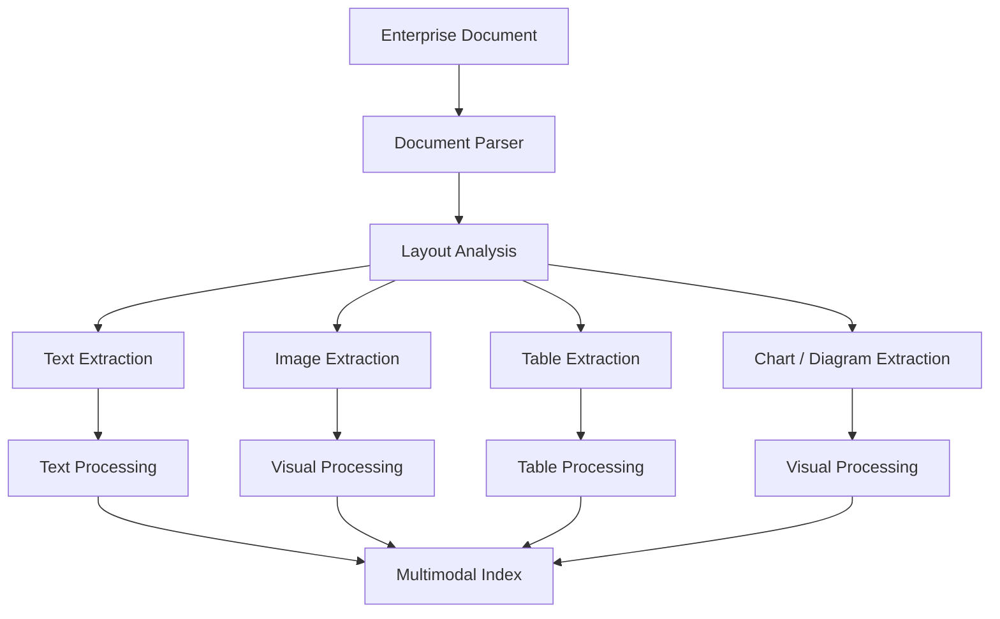
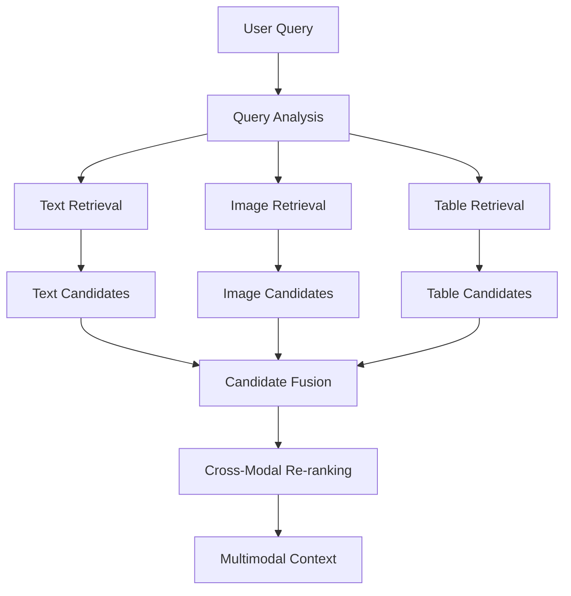
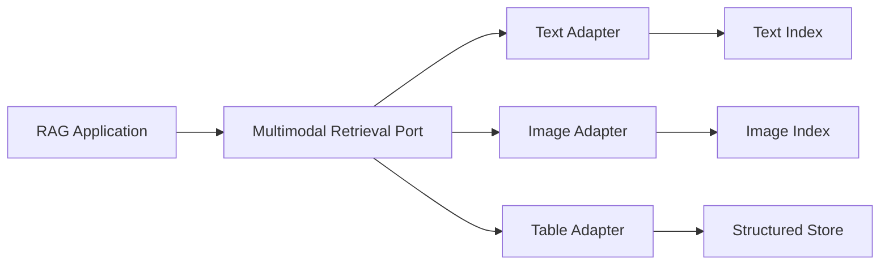
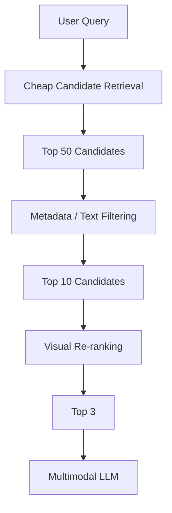
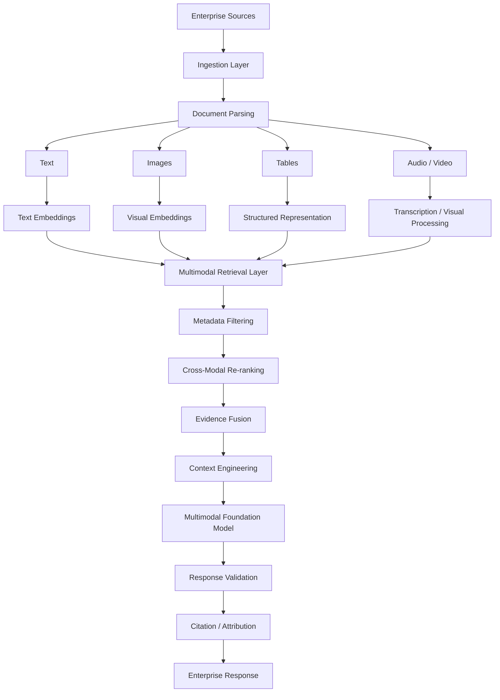
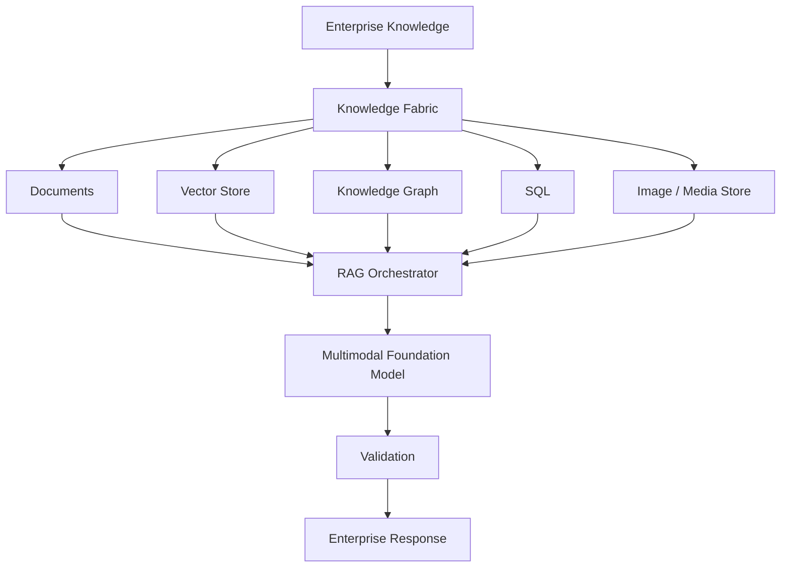

# 05. Multimodal RAG

> **Category:** Advanced RAG Architecture  
> **Module:** Part V — Advanced Retrieval-Augmented Generation  
> **Difficulty:** Advanced

---

## 📖 Overview

Traditional Retrieval-Augmented Generation (RAG) systems are primarily designed around text:

```text
Documents
   ↓
Text Extraction
   ↓
Chunking
   ↓
Embeddings
   ↓
Vector Retrieval
   ↓
LLM
```

Enterprise knowledge, however, is rarely text-only.

Important information can exist in:

```text
Text
Images
Tables
Charts
Diagrams
Screenshots
Scanned Documents
Audio
Video
Presentations
Technical Drawings
Forms
Invoices
Contracts
```

A **Multimodal RAG** system extends RAG so that retrieval and generation can work across multiple information modalities.

Instead of treating every document as plain text, Multimodal RAG preserves and retrieves the different forms of evidence contained in enterprise knowledge.

The architecture therefore becomes:

```text
                    Enterprise Knowledge
                            │
       ┌────────────┬───────┼────────┬───────────┐
       ▼            ▼       ▼        ▼           ▼
      Text        Images   Tables   Audio       Video
       │            │       │        │           │
       └────────────┴───────┼────────┴───────────┘
                            ▼
                    Multimodal Retrieval
                            │
                            ▼
                     Context Assembly
                            │
                            ▼
                   Multimodal Foundation Model
                            │
                            ▼
                    Enterprise Response
```

The goal is not simply to "put images into a prompt."

The goal is to build a **production-grade retrieval architecture that understands, indexes, retrieves, grounds, validates, and cites multimodal enterprise knowledge.**

---

# 🎯 Learning Objectives

After completing this chapter, you will be able to:

- Understand Multimodal RAG
- Understand why text-only RAG is insufficient for many enterprise workloads
- Understand multimodal documents
- Understand multimodal ingestion pipelines
- Extract text, images, tables, and layout information
- Understand OCR in Multimodal RAG
- Understand image embeddings
- Understand multimodal embeddings
- Understand cross-modal retrieval
- Understand image-to-text retrieval
- Understand text-to-image retrieval
- Understand image-to-image retrieval
- Understand multimodal chunking
- Understand document layout preservation
- Understand table-aware retrieval
- Understand chart and diagram retrieval
- Understand visual document retrieval
- Design multimodal vector stores
- Combine text and image retrieval
- Build multimodal context
- Use multimodal foundation models
- Handle scanned documents
- Handle PDFs containing images and tables
- Build multimodal enterprise RAG pipelines
- Combine Multimodal RAG with Graph RAG and SQL RAG
- Design multimodal citation and provenance
- Secure multimodal data
- Evaluate multimodal retrieval and generation
- Optimize multimodal RAG latency and cost
- Design production Multimodal RAG systems

---

# 🧠 1. What Is Multimodal RAG?

Multimodal RAG is a RAG architecture that retrieves and uses information from multiple modalities.

For example:

```text
Text
Images
Tables
Charts
Diagrams
Audio
Video
```

A user may ask:

```text
"According to the architecture diagram,
which service communicates with the payment gateway?"
```

A text-only RAG system may fail if the relationship exists only inside the diagram.

A Multimodal RAG system can retrieve:

```text
Architecture Diagram
+
Related Documentation
```

and provide both to the model.

---

# 🔎 2. Traditional RAG vs Multimodal RAG

## Traditional Text RAG

```text
Document
   ↓
Text Extraction
   ↓
Chunking
   ↓
Text Embedding
   ↓
Vector Search
   ↓
Text Context
   ↓
LLM
```

## Multimodal RAG

```text
Document
   ↓
Multimodal Parsing
   ↓
┌─────────────┬─────────────┬─────────────┐
▼             ▼             ▼
Text         Images       Tables
│             │             │
▼             ▼             ▼
Embeddings   Embeddings   Structured Index
└─────────────┴─────────────┘
              │
              ▼
       Multimodal Retrieval
              │
              ▼
       Multimodal Context
              │
              ▼
       Multimodal Model
```

---

# 🧩 3. What Makes Enterprise Data Multimodal?

Consider a technical architecture document.

It may contain:

```text
Title
Paragraphs
Architecture Diagram
Tables
Code Snippets
Screenshots
Sequence Diagram
Deployment Diagram
```

A text extractor may capture:

```text
Title
Paragraphs
Table Text
Code
```

but completely miss the meaning of:

```text
Architecture Diagram
Sequence Diagram
Deployment Diagram
```

Multimodal RAG attempts to preserve these relationships.

---

# 📚 4. Common Enterprise Multimodal Sources

Typical sources include:

```text
PDF
PowerPoint
Word Documents
Scanned Documents
Images
Architecture Diagrams
Technical Drawings
Invoices
Receipts
Contracts
Forms
Dashboards
Screenshots
Product Catalogs
Medical Images
Satellite Images
Video Recordings
Audio Recordings
```

---

# 🧠 5. Multimodal RAG Mental Model

A useful mental model is:

```text
                    USER QUERY
                         │
                         ▼
                 QUERY UNDERSTANDING
                         │
                         ▼
                 MODALITY ANALYSIS
                         │
             ┌───────────┼───────────┐
             ▼           ▼           ▼
           TEXT        IMAGE       TABLE
             │           │           │
             └───────────┼───────────┘
                         ▼
                MULTIMODAL RETRIEVAL
                         │
                         ▼
                 EVIDENCE FUSION
                         │
                         ▼
                CONTEXT ENGINEERING
                         │
                         ▼
                MULTIMODAL MODEL
                         │
                         ▼
                 VALIDATED RESPONSE
```

---

# 🧩 6. Multimodal Data Model

A multimodal document should not necessarily be represented as one large blob.

Instead:

```text
Document
│
├── Text Blocks
├── Images
├── Tables
├── Charts
├── Diagrams
├── Metadata
└── Layout
```

Each component can have its own representation.

---

# 🏗️ 7. Multimodal Document Representation

Example:

```json
{
  "document_id": "architecture-001",
  "page": 12,
  "elements": [
    {
      "type": "text",
      "content": "Payment architecture"
    },
    {
      "type": "image",
      "asset_id": "img-128"
    },
    {
      "type": "table",
      "asset_id": "table-22"
    }
  ]
}
```

This preserves the document structure.

---

# 📐 8. Layout Matters

Consider:

```text
             Architecture Diagram

Service A ───────► Service B
    │                   │
    ▼                   ▼
Database A          Database B
```

The text alone:

```text
Service A
Service B
Database A
Database B
```

does not preserve the relationships represented spatially.

Layout-aware processing is therefore important for many enterprise documents.

---

# 🧠 9. Document Layout

A document parser may identify:

```text
Title
Paragraph
Heading
Table
Figure
Caption
Footer
Header
Page Number
Code Block
```

The ingestion system can preserve:

```text
Bounding Box
Page Number
Element Type
Reading Order
Parent Section
```

---

# 🏗️ 10. Multimodal Ingestion Pipeline



---

# 🔍 11. OCR

OCR stands for:

```text
Optical Character Recognition
```

OCR converts text contained in images into machine-readable text.

Example:

```text
Scanned Invoice
      ↓
      OCR
      ↓
Invoice Number: INV-1028
Amount: ₹42,000
Customer: Acme
```

OCR is particularly important for:

```text
Scanned PDFs
Invoices
Forms
Receipts
Historical Documents
Screenshots
```

---

# 🧠 12. OCR Is Not Document Understanding

OCR provides:

```text
Text
```

but does not necessarily understand:

```text
Layout
Relationships
Tables
Meaning
Visual Context
```

For example:

```text
Customer: Acme

Amount: ₹42,000
```

may be extracted correctly, but the system may still need layout information to determine which value belongs to which field in a complex form.

---

# 🧩 13. OCR + Layout Understanding

A stronger pipeline is:

```text
Image
 ↓
OCR
 ↓
Bounding Boxes
 ↓
Layout Analysis
 ↓
Semantic Structure
```

Example:

```json
{
  "text": "₹42,000",
  "bbox": [320, 480, 430, 520],
  "type": "amount",
  "page": 2
}
```

---

# 🖼️ 14. Image Embeddings

Images can be represented as vectors.

Conceptually:

```text
Image
 ↓
Vision Encoder
 ↓
Embedding Vector
```

Example:

```text
Architecture Diagram
       ↓
[0.12, -0.31, 0.84, ...]
```

This allows image similarity search.

---

# 🔗 15. Multimodal Embeddings

A multimodal embedding model can map different modalities into a compatible semantic space.

Conceptually:

```text
Text ──────► Embedding Space
Image ─────► Embedding Space
```

Then:

```text
"Payment architecture"
```

can potentially retrieve:

```text
Architecture Diagram
```

even though the query and retrieved object have different modalities.

---

# 🧠 16. Cross-Modal Retrieval

Cross-modal retrieval means the query and result can use different modalities.

Examples:

```text
Text → Image
Text → Table
Text → Diagram
Image → Text
Image → Image
```

Example:

```text
Query:
"Payment gateway architecture"

        ↓

Retrieved:
architecture-diagram.png
```

---

# 🔎 17. Text-to-Image Retrieval

```text
Text Query
   ↓
Text Embedding
   ↓
Multimodal Vector Search
   ↓
Image Embedding
   ↓
Architecture Diagram
```

This is useful for:

```text
Architecture Search
Product Image Search
Technical Drawing Search
Visual Knowledge Bases
```

---

# 🖼️ 18. Image-to-Text Retrieval

Example:

```text
User uploads:
Architecture Diagram

        ↓

Visual Embedding

        ↓

Retrieve:
Architecture Documentation
Runbook
API Documentation
```

This allows visual information to become a retrieval signal.

---

# 🖼️ 19. Image-to-Image Retrieval

Example:

```text
Uploaded:
Product Image

       ↓

Image Embedding

       ↓

Similar Product Images
```

This can support:

```text
Visual Product Search
Duplicate Detection
Document Similarity
Visual Knowledge Bases
```

---

# 📊 20. Table Retrieval

Tables require special treatment.

Consider:

```text
| Product | Revenue | Growth |
|---------|---------|--------|
| A       | 10M     | 12%    |
| B       | 8M      | 17%    |
```

Naively embedding the table as plain text may lose:

```text
Column Relationships
Row Structure
Numeric Semantics
```

A better architecture can preserve both:

```text
Table Structure
+
Natural Language Representation
```

---

# 🧩 21. Table-Aware Representation

Example:

```json
{
  "type": "table",
  "columns": [
    "Product",
    "Revenue",
    "Growth"
  ],
  "rows": [
    ["A", "10M", "12%"],
    ["B", "8M", "17%"]
  ]
}
```

The system can additionally generate a textual representation for semantic retrieval.

---

# 📈 22. Charts

Charts contain information that may not exist directly as text.

Example:

```text
Sales Trend
   │
   │       ╭───╮
   │    ╭──╯   │
   │ ╭──╯      ╰───
   └────────────────
       Jan Feb Mar
```

Text extraction might only capture:

```text
Sales Trend
Jan
Feb
Mar
```

The actual trend must be understood visually or reconstructed from structured chart data.

---

# 🧠 23. Chart Understanding

A multimodal pipeline may extract:

```text
Chart Type
Title
Axes
Legend
Labels
Data Points
Trend
Annotations
```

The representation could be:

```json
{
  "chart_type": "line",
  "title": "Monthly Sales",
  "x_axis": ["Jan", "Feb", "Mar"],
  "trend": "increasing"
}
```

---

# 🖼️ 24. Diagram Understanding

Enterprise diagrams may represent:

```text
Architecture
Data Flow
Network
Sequence
State
Deployment
Business Process
```

A multimodal model can analyze:

```text
Nodes
Edges
Labels
Spatial Relationships
Visual Grouping
```

---

# 🏗️ 25. Architecture Diagram Example

```text
        ┌─────────────┐
        │   Client    │
        └──────┬──────┘
               │
               ▼
        ┌─────────────┐
        │ API Gateway │
        └──────┬──────┘
               │
       ┌───────┴───────┐
       ▼               ▼
 ┌──────────┐    ┌──────────┐
 │ Payment  │    │  Auth    │
 │ Service  │    │ Service  │
 └────┬─────┘    └──────────┘
      │
      ▼
 ┌──────────┐
 │PostgreSQL│
 └──────────┘
```

The graph of relationships may be:

```text
Client
  ↓
API Gateway
  ↓
Payment Service
  ↓
PostgreSQL

API Gateway
  ↓
Auth Service
```

A multimodal system can retrieve the diagram and derive these relationships.

---

# 🔗 26. Multimodal RAG and Knowledge Graphs

Visual relationships can be transformed into graph knowledge.

```text
Architecture Diagram
        ↓
Vision Understanding
        ↓
Entity Extraction
        ↓
Relationship Extraction
        ↓
Knowledge Graph
```

Example:

```text
Payment Service
    DEPENDS_ON
PostgreSQL
```

This connects Multimodal RAG with Knowledge Graph RAG.

---

# 🧠 27. Multimodal RAG and SQL

Tables and charts may contain structured information.

For example:

```text
Financial Report
     ↓
Table
     ↓
Revenue by Region
```

A production system may transform the information into:

```text
Structured Data
```

and store it in SQL.

Then:

```text
Multimodal Source
       ↓
Table Extraction
       ↓
SQL
```

can enable exact analytical queries.

---

# 🔀 28. Multimodal + SQL + Graph + Vector

A mature enterprise system may combine:

```text
                    Enterprise Query
                           │
             ┌─────────────┼─────────────┐
             ▼             ▼             ▼
          Vector          SQL          Graph
             │             │             │
             ▼             ▼             ▼
           Text          Tables     Relationships
             │             │             │
             └─────────────┼─────────────┘
                           │
                           ▼
                       Multimodal
                       Evidence
                           │
                           ▼
                          LLM
```

This creates a broader **enterprise knowledge fabric**.

---

# 🧩 29. Multimodal Chunking

Traditional chunking:

```text
Document
 ↓
Text Chunks
```

Multimodal chunking may preserve:

```text
Text Chunk
+
Related Image
+
Related Table
+
Caption
+
Page
+
Section
```

Example:

```json
{
  "chunk_id": "chunk-102",
  "text": "Payment architecture...",
  "images": [
    "architecture-12.png"
  ],
  "tables": [
    "dependency-table-12"
  ],
  "page": 12,
  "section": "Payment Architecture"
}
```

---

# 🧠 30. Parent-Child Multimodal Retrieval

A child chunk may represent:

```text
Paragraph
```

while the parent context contains:

```text
Section
+
Diagram
+
Table
```

Retrieval can find the child and return the parent multimodal context.

```text
Query
 ↓
Child Retrieval
 ↓
Parent Document Context
 ↓
Text + Image + Table
 ↓
LLM
```

---

# 🔎 31. Caption-Based Image Retrieval

Images can be enriched with generated captions.

Example:

```text
Image:
architecture.png
```

Caption:

```text
"Microservices architecture showing an API Gateway
connected to Payment and Authentication services."
```

Then:

```text
Caption
 ↓
Text Embedding
 ↓
Vector Store
```

can support image retrieval.

---

# 🧠 32. Image Metadata

Useful image metadata includes:

```text
Document ID
Page
Section
Image Type
Caption
Bounding Box
Creation Date
Source
Access Policy
Related Text
Related Entities
```

---

# 🧩 33. Multimodal Index

A production index may contain:

```text
Text Index
Image Index
Table Index
Metadata Index
```

or a unified multimodal vector index.

Conceptually:

```text
                  Multimodal Index
                         │
        ┌────────────────┼────────────────┐
        ▼                ▼                ▼
     Text Vectors    Image Vectors    Metadata
        │                │                │
        └────────────────┼────────────────┘
                         ▼
                   Retrieval Layer
```

---

# 🏗️ 34. Unified vs Separate Indexes

## Unified Index

```text
Text
Image
Table
   ↓
Shared Embedding Space
```

Advantages:

```text
Cross-Modal Search
Simpler Retrieval Model
```

## Separate Indexes

```text
Text Index
Image Index
Table Index
```

Advantages:

```text
Modality-Specific Optimization
Independent Scaling
Specialized Retrieval
```

A hybrid approach is often useful.

---

# 🔀 35. Hybrid Multimodal Retrieval



---

# 🧠 36. Modality-Aware Query Routing

Not every query needs every modality.

Example:

```text
"What does the refund policy say?"
        ↓
Text

"Show the architecture diagram for payments."
        ↓
Image

"What was revenue in Q2?"
        ↓
SQL / Table

"Which service connects to the payment gateway?"
        ↓
Graph + Image + Text
```

The query planner should determine which modalities are relevant.

---

# 🔎 37. Modality Router

```python
class ModalityRouter:

    def route(self, query):
        """
        Return required retrieval modalities.
        """
        raise NotImplementedError
```

Possible result:

```python
[
    "text",
    "image",
    "table"
]
```

---

# 🏗️ 38. Multimodal Retriever Interface

A capability-oriented architecture can expose:

```python
class MultimodalRetriever:

    def retrieve(
        self,
        query,
        modalities=None,
        filters=None,
        top_k=10
    ):
        raise NotImplementedError
```

This keeps the application independent of a specific retrieval implementation.

---

# 🏛️ 39. Ports & Adapters Architecture



The application layer should depend on capabilities rather than infrastructure SDKs.

---

# 🧠 40. Multimodal Foundation Models

A multimodal model can process multiple input types.

Conceptually:

```text
Text
Image
Audio
Video
   │
   ▼
Multimodal Model
   │
   ▼
Reasoning / Generation
```

For RAG, retrieved evidence may therefore include:

```text
Text Chunks
+
Images
+
Tables
```

in a single model request.

---

# 🔗 41. Multimodal Context

Instead of:

```text
CONTEXT:
Text only
```

a prompt may contain:

```text
TEXT:
Payment service documentation...

IMAGE:
Architecture diagram...

TABLE:
Service dependencies...
```

The model can reason over the combined evidence.

---

# 🧠 42. Context Ordering

Context ordering matters.

A possible structure:

```text
SYSTEM INSTRUCTIONS

USER QUESTION

RELEVANT TEXT

RELEVANT TABLES

RELEVANT IMAGES

SOURCE METADATA

RESPONSE REQUIREMENTS
```

The exact structure depends on the model and workload.

---

# 🧩 43. Visual Context Selection

Do not blindly pass every retrieved image.

Use:

```text
Relevance
+
Resolution
+
Page Relationship
+
Entity Relationship
+
Source Quality
```

Example:

```text
10 retrieved images
       ↓
Visual Re-ranking
       ↓
Top 2 relevant diagrams
       ↓
LLM
```

---

# 🔍 44. Image Re-ranking

Candidate images can be ranked using:

```text
Text-Image Similarity
+
Metadata
+
Entity Match
+
Section Match
+
Recency
```

Example:

```text
Image A → 0.94
Image B → 0.82
Image C → 0.63
```

Only the strongest candidates need to reach the generation stage.

---

# 🧠 45. Multimodal Evidence Fusion

Different modalities can provide different evidence.

Example:

```text
Text:
"Payment Service uses PostgreSQL."

Image:
Architecture diagram showing
Payment Service → PostgreSQL.

Graph:
PaymentService --USES--> PostgreSQL.
```

The system can combine:

```text
Text Evidence
+
Visual Evidence
+
Graph Evidence
```

to improve grounding.

---

# 🛡️ 46. Evidence Agreement

A production system can detect whether different evidence sources agree.

```text
Text:
Payment Service → PostgreSQL

Image:
Payment Service → PostgreSQL

Graph:
Payment Service → PostgreSQL
```

Agreement:

```text
High Confidence
```

But:

```text
Text:
Payment Service → MySQL

Image:
Payment Service → PostgreSQL
```

requires additional validation.

---

# ⚠️ 47. Conflicting Multimodal Evidence

Enterprise documents may contain contradictory information.

Example:

```text
Old Architecture Diagram
        ↓
MySQL

New Architecture Document
        ↓
PostgreSQL
```

A production system should consider:

```text
Source Authority
+
Document Version
+
Timestamp
+
Validity
```

rather than simply combining both.

---

# 🕒 48. Multimodal Freshness

Visual documents can become stale.

Example:

```text
Architecture Diagram
Version 1
```

may no longer represent:

```text
Current Architecture
```

Metadata should include:

```text
Version
Created At
Updated At
Effective Date
Status
```

---

# 📚 49. Document Versioning

A useful model:

```text
Architecture Document
      │
      ├── v1
      ├── v2
      └── v3
```

Retrieval should normally prefer:

```text
Current Approved Version
```

unless the user explicitly requests historical information.

---

# 🧠 50. Multimodal Provenance

Every visual evidence item should retain:

```text
Document ID
Page
Element ID
Bounding Box
Source URI / Reference
Version
Timestamp
Extraction Method
```

Example:

```json
{
  "asset_id": "image-928",
  "document_id": "architecture-v4",
  "page": 12,
  "section": "Payment Architecture",
  "bbox": [120, 240, 980, 740],
  "version": "4.0"
}
```

---

# 🔗 51. Multimodal Citations

Text citations:

```text
Document → Page → Section
```

Image citations:

```text
Document → Page → Figure
```

Table citations:

```text
Document → Page → Table
```

The final response should preserve the connection between the generated claim and its evidence.

---

# 🧾 52. Citation Example

Response:

```text
The Payment Service communicates with the
Authentication Service through the API Gateway.
```

Evidence:

```text
Architecture Document
Page 12
Figure 3
```

This is stronger than simply citing:

```text
architecture.pdf
```

---

# 🧠 53. Multimodal RAG Grounding

Grounding means that generated claims should be supported by retrieved evidence.

For example:

```text
Claim:
Payment Service uses PostgreSQL.

Evidence:
Architecture Diagram
+
Architecture Documentation
```

The generation layer should avoid adding unsupported details.

---

# 🚨 54. Multimodal Hallucination

Multimodal models can hallucinate:

```text
Objects
Relationships
Numbers
Text
Chart Trends
Labels
```

For example:

```text
Image:
No database shown

Model:
"The diagram shows PostgreSQL."
```

This is a visual hallucination.

---

# 🛡️ 55. Multimodal Response Validation

Validation can compare generated claims against:

```text
Retrieved Text
Retrieved Tables
Retrieved Images
Retrieved Graph Facts
```

Conceptually:

```text
Response
 ↓
Claim Extraction
 ↓
Evidence Matching
 ↓
Unsupported Claim Detection
 ↓
Correction / Rejection
```

---

# 🧠 56. Table Grounding

If a model answers:

```text
"Revenue was ₹12.4 million."
```

the system should be able to identify:

```text
Table
Row
Column
Value
```

as evidence.

---

# 📈 57. Chart Grounding

If a model says:

```text
"Revenue increased continuously during Q1."
```

the evidence should point to:

```text
Chart
+
Relevant Series
+
Time Range
```

rather than only the surrounding text.

---

# 🧩 58. Multimodal Response Contract

A structured internal response can contain:

```json
{
  "answer": "...",
  "claims": [
    {
      "text": "Payment Service uses PostgreSQL.",
      "evidence": [
        {
          "type": "image",
          "asset_id": "architecture-12"
        },
        {
          "type": "text",
          "chunk_id": "chunk-812"
        }
      ]
    }
  ]
}
```

This supports downstream validation and citation.

---

# 🔐 59. Multimodal Security

Images and documents may contain sensitive information.

Examples:

```text
Screenshots
Credentials
Customer Data
Internal Architecture
Financial Information
Personal Information
Security Diagrams
```

Security controls should apply to:

```text
Original Assets
Extracted Text
Embeddings
Metadata
Retrieved Context
Model Inputs
Generated Outputs
```

---

# 🛡️ 60. Image-Level Authorization

A user may be allowed to access:

```text
Architecture Overview
```

but not:

```text
Security Architecture Diagram
```

Therefore authorization should be evaluated at the asset level.

---

# 👥 61. Multi-Tenant Multimodal RAG

Tenant boundaries should be preserved across:

```text
Documents
Images
Tables
Embeddings
Metadata
Graph Entities
SQL Data
```

Example:

```text
Tenant A
 ├── Text
 ├── Images
 ├── Tables
 └── Graph Data

Tenant B
 ├── Text
 ├── Images
 ├── Tables
 └── Graph Data
```

Cross-tenant retrieval must be prevented.

---

# 🧠 62. Multimodal PII

PII may exist inside images even when metadata contains no obvious PII.

For example:

```text
Screenshot
   ↓
Customer Name
Account Number
Phone Number
```

OCR can expose this information.

Therefore security and privacy scanning should consider both:

```text
Extracted Text
+
Visual Content
```

---

# 🧪 63. Multimodal Evaluation

Evaluation should cover multiple layers:

```text
Document Parsing
OCR
Image Retrieval
Text Retrieval
Table Retrieval
Cross-Modal Retrieval
Evidence Fusion
Answer Generation
Citation
```

---

# 📊 64. Retrieval Metrics

For retrieval:

```text
Recall@K
Precision@K
MRR
NDCG
```

For image retrieval:

```text
Text-to-Image Recall@K
Image-to-Text Recall@K
Image-to-Image Recall@K
```

---

# 🧠 65. Visual Question Answering Evaluation

For visual questions:

```text
Question
+
Image
→
Expected Answer
```

Example:

```text
Question:
Which service is connected to PostgreSQL?

Image:
Architecture Diagram

Expected:
Payment Service
```

---

# 📊 66. Multimodal Groundedness

Evaluate:

```text
Is the answer supported by the image?

Is the answer supported by the table?

Is the answer supported by the text?

Are citations pointing to the correct evidence?
```

---

# 🧪 67. Multimodal Evaluation Dataset

Example:

```json
{
  "question": "Which service uses PostgreSQL?",
  "image": "architecture-12.png",
  "expected_answer": "Payment Service",
  "evidence": {
    "page": 12,
    "figure": 3
  }
}
```

A production evaluation set should include:

```text
Easy Visual Questions
Complex Diagrams
Tables
Charts
OCR Cases
Cross-Modal Questions
Conflicting Evidence
Low-Quality Images
```

---

# 🚨 68. Multimodal Failure Modes

Common failures include:

```text
OCR Errors
Image Retrieval Failure
Incorrect Image Interpretation
Wrong Table Extraction
Layout Loss
Chart Misinterpretation
Incorrect Cross-Modal Linking
Stale Visual Evidence
Missing Provenance
Visual Hallucination
Context Overflow
High Inference Cost
```

---

# 🧩 69. Low-Resolution Images

Poor image quality can cause:

```text
Unreadable Text
Missing Labels
Incorrect Diagram Interpretation
```

A preprocessing pipeline may use:

```text
Resolution Detection
+
Selective Upscaling
+
Cropping
+
OCR
```

Only apply expensive processing where required.

---

# 🖼️ 70. Image Cropping

Instead of passing a full page:

```text
Page
 ├── Header
 ├── Paragraph
 ├── Diagram
 ├── Footer
```

retrieve only:

```text
Relevant Diagram Region
```

This can reduce:

```text
Visual Noise
Inference Cost
Context Size
```

---

# 🔍 71. Region-Level Retrieval

A document image can be divided into regions:

```text
Page
│
├── Region A → Text
├── Region B → Table
├── Region C → Diagram
└── Region D → Caption
```

Each region can have independent metadata and embeddings.

---

# 🧠 72. Visual Chunking

Visual chunking is analogous to text chunking.

```text
Text:
Paragraph Chunk

Image:
Region Chunk

Table:
Table Chunk

Diagram:
Diagram Chunk
```

The retrieval layer can then operate at the appropriate granularity.

---

# 🧩 73. Multimodal Parent-Child Retrieval

```text
Parent:
Page 12

Children:
 ├── Paragraph 12.1
 ├── Diagram 12.1
 ├── Table 12.1
 └── Caption 12.1
```

A query may retrieve:

```text
Diagram 12.1
```

but return:

```text
Diagram
+
Caption
+
Related Paragraph
```

This provides richer context.

---

# ⚡ 74. Performance Optimization

Multimodal processing can be expensive.

Optimization areas include:

```text
OCR
Image Embeddings
Visual Embeddings
Vision Model Calls
Image Storage
Network Transfer
Context Size
```

---

# 💰 75. Cost Optimization

Avoid sending every image to a multimodal model.

Use a funnel:

```text
Broad Retrieval
      ↓
Metadata Filtering
      ↓
Text / Caption Retrieval
      ↓
Visual Re-ranking
      ↓
Top Images
      ↓
Vision Model
```

This reduces expensive inference.

---

# ⚡ 76. Two-Stage Multimodal Retrieval



This is usually more scalable than sending dozens of images directly to the model.

---

# 🧠 77. Modality-Specific Caching

Cache:

```text
OCR Results
Image Embeddings
Generated Captions
Table Extraction
Vision Analysis
```

For immutable documents:

```text
Process Once
+
Reuse Many Times
```

---

# 🗄️ 78. Asset Storage

Original assets should generally be stored separately from embeddings.

```text
Object Storage
   │
   ├── Original PDF
   ├── Images
   ├── Cropped Regions
   └── Extracted Assets

Vector Store
   │
   └── Embeddings + Metadata
```

The vector store should not necessarily become the primary binary asset store.

---

# 🧩 79. Multimodal Metadata

Useful metadata:

```text
asset_id
document_id
page
section
modality
mime_type
caption
entities
created_at
updated_at
version
tenant_id
access_policy
source_uri
```

---

# 🏗️ 80. Production Multimodal RAG Architecture



---

# 🔄 81. End-to-End Multimodal RAG

```text
                     ENTERPRISE SOURCES
                             │
             ┌───────────────┼───────────────┐
             ▼               ▼               ▼
           Text            Images          Tables
             │               │               │
             ▼               ▼               ▼
       Text Parsing      Vision/OCR      Table Parsing
             │               │               │
             └───────────────┼───────────────┘
                             ▼
                    Multimodal Indexing
                             │
                             ▼
                       Query Analysis
                             │
              ┌──────────────┼──────────────┐
              ▼              ▼              ▼
            Text           Image          Table
          Retrieval       Retrieval      Retrieval
              │              │              │
              └──────────────┼──────────────┘
                             ▼
                     Candidate Fusion
                             │
                             ▼
                      Re-ranking
                             │
                             ▼
                   Evidence Selection
                             │
                             ▼
                  Multimodal Context
                             │
                             ▼
                    Multimodal LLM
                             │
                    ┌────────┴────────┐
                    ▼                 ▼
                Validation         Citation
                    │                 │
                    └────────┬────────┘
                             ▼
                   Enterprise Response
```

---

# 🧠 82. Multimodal RAG + Agentic RAG

Agents can use modality-specific tools.

```text
Agent
 │
 ├── Text Search
 │
 ├── Image Search
 │
 ├── Table / SQL Tool
 │
 ├── Knowledge Graph
 │
 ├── OCR
 │
 └── Vision Analysis
```

Example:

```text
User:
"Analyze the architecture diagram and
identify the database used by Payment Service."

Agent
 ↓
Image Retrieval
 ↓
Vision Analysis
 ↓
Knowledge Graph Verification
 ↓
Response
```

---

# 🔗 83. Multimodal RAG + Knowledge Graph

A diagram can become graph evidence:

```text
Image
 ↓
Vision Model
 ↓
Entities
 ↓
Relationships
 ↓
Knowledge Graph
```

The graph can then be queried independently.

This creates a pipeline:

```text
Visual Knowledge
       ↓
Structured Knowledge
       ↓
Graph Retrieval
       ↓
RAG
```

---

# 🔀 84. Multimodal RAG + SQL

Tables can become structured data:

```text
PDF Table
   ↓
Table Extraction
   ↓
Validation
   ↓
Structured Data
   ↓
SQL
```

This allows questions such as:

```text
"What was the highest revenue region
in the annual report?"
```

to be answered using exact structured computation rather than visual approximation.

---

# 🏢 85. Enterprise Multimodal Knowledge Fabric



---

# 🧠 86. Multimodal Query Router

A production router may classify queries into:

```text
TEXT_ONLY
IMAGE_REQUIRED
TABLE_REQUIRED
GRAPH_REQUIRED
SQL_REQUIRED
MULTIMODAL
```

Example:

```python
class QueryModality:

    TEXT_ONLY = "text"
    IMAGE = "image"
    TABLE = "table"
    GRAPH = "graph"
    SQL = "sql"
    MULTIMODAL = "multimodal"
```

---

# 🧩 87. Capability-Based Architecture

Rather than coupling the application to one multimodal provider:

```python
class VisionProvider:

    def analyze_image(self, image, prompt):
        raise NotImplementedError


class OCRProvider:

    def extract_text(self, image):
        raise NotImplementedError


class EmbeddingProvider:

    def embed_text(self, text):
        raise NotImplementedError

    def embed_image(self, image):
        raise NotImplementedError
```

Cloud- or model-specific implementations can sit behind these interfaces.

---

# 🏛️ 88. Ports & Adapters

```text
                    Application
                         │
              ┌──────────┼──────────┐
              ▼          ▼          ▼
          VisionPort  OCRPort  EmbeddingPort
              │          │          │
              ▼          ▼          ▼
          Adapter A   Adapter B   Adapter C
              │          │          │
              └──────────┼──────────┘
                         ▼
                  AI / Cloud Services
```

This keeps the application architecture portable.

---

# 🧪 89. Practical Exercise

Build a multimodal document collection:

```text
architecture.pdf
annual-report.pdf
invoice-samples.pdf
product-catalog.pdf
```

Extract:

```text
Text
Images
Tables
Metadata
```

Then index them.

---

# 🔎 90. Practice Queries

Test:

```text
1. Find the architecture diagram for the payment platform.

2. Which service connects to PostgreSQL?

3. What does the architecture diagram show?

4. What was the highest-revenue region?

5. Find the invoice containing customer Acme.

6. What amount appears on the invoice?

7. Which database is shown in the deployment diagram?

8. Compare the architecture in version 2 and version 3.
```

---

# 🧪 91. Compare Retrieval Strategies

Implement:

```text
A. Text-only RAG

B. Image-only Retrieval

C. Text + Image Retrieval

D. Text + Image + Table Retrieval

E. Text + Image + Table + Graph
```

Measure:

```text
Retrieval Recall
Answer Accuracy
Groundedness
Citation Accuracy
Latency
Cost
```

---

# 📊 92. Example Evaluation Matrix

| Architecture | Retrieval | Grounding | Latency | Cost |
|---|---|---|---|---|
| Text RAG | Text | Medium | Low | Low |
| Image Retrieval | Visual | Medium | Medium | Medium |
| Text + Image | High | High | Medium | Medium |
| Text + Image + Table | High | High | Medium | Medium |
| Full Multimodal + Graph + SQL | Very High | Very High | High | High |

The exact results depend on the dataset and implementation.

---

# 🚨 93. Common Mistakes

## Mistake 1 — Converting Everything to Text

This can destroy visual relationships.

---

## Mistake 2 — Sending Every Image to the LLM

This increases:

```text
Latency
Cost
Context Noise
```

---

## Mistake 3 — Ignoring Layout

Spatial relationships can contain important meaning.

---

## Mistake 4 — Treating OCR as Complete Understanding

OCR provides text, not complete visual semantics.

---

## Mistake 5 — Ignoring Tables

Tables should often be represented structurally.

---

## Mistake 6 — Ignoring Provenance

Visual evidence should be traceable to:

```text
Document
Page
Figure
Region
```

---

## Mistake 7 — Ignoring Versioning

Old diagrams can produce incorrect answers.

---

## Mistake 8 — Trusting Vision Models Blindly

Visual models can hallucinate objects and relationships.

---

## Mistake 9 — Ignoring Security

Images can contain highly sensitive information.

---

## Mistake 10 — Building Multimodal Infrastructure Without a Use Case

Multimodal processing can be expensive.

Start with a measurable business requirement.

---

# 🧠 94. Design Principles

### Principle 1 — Preserve Modality

Do not convert everything to text if visual structure carries meaning.

---

### Principle 2 — Retrieve Before Reasoning

Use retrieval to reduce the amount of visual and textual information sent to the model.

---

### Principle 3 — Use the Right Representation

```text
Text → Text Embedding
Image → Visual Embedding
Table → Structured Representation
Graph → Relationship Representation
```

---

### Principle 4 — Preserve Layout

Page and region relationships can be critical.

---

### Principle 5 — Preserve Provenance

Every multimodal asset should be traceable.

---

### Principle 6 — Route by Modality

Do not perform expensive visual reasoning when text retrieval is sufficient.

---

### Principle 7 — Validate Visual Claims

Multimodal models can hallucinate.

---

### Principle 8 — Combine Modalities

Different modalities often provide complementary evidence.

---

### Principle 9 — Secure Every Representation

Protect:

```text
Original
OCR
Embedding
Metadata
Retrieved Context
```

---

### Principle 10 — Optimize the Expensive Path

Use:

```text
Filtering
Caching
Re-ranking
Cropping
Batching
```

before expensive multimodal inference.

---

# 📋 95. Production Checklist

```text
☐ Identify multimodal use cases
☐ Identify supported modalities
☐ Identify source systems
☐ Identify document types

☐ Implement document parsing
☐ Implement layout extraction
☐ Implement OCR
☐ Implement image extraction
☐ Implement table extraction
☐ Implement chart extraction
☐ Implement diagram extraction

☐ Preserve page information
☐ Preserve bounding boxes
☐ Preserve section relationships
☐ Preserve captions
☐ Preserve document versions

☐ Generate text embeddings
☐ Generate image embeddings
☐ Define multimodal embedding strategy
☐ Build multimodal indexes
☐ Build metadata indexes

☐ Implement text retrieval
☐ Implement image retrieval
☐ Implement table retrieval
☐ Implement cross-modal retrieval
☐ Implement modality routing
☐ Implement candidate fusion
☐ Implement re-ranking

☐ Implement multimodal context assembly
☐ Implement visual context selection
☐ Implement context compression

☐ Implement vision model integration
☐ Implement response validation
☐ Implement citation resolution
☐ Implement provenance tracking

☐ Implement authentication
☐ Implement authorization
☐ Implement tenant isolation
☐ Protect sensitive images
☐ Protect OCR output
☐ Protect embeddings

☐ Implement asset versioning
☐ Implement freshness tracking
☐ Implement deletion handling

☐ Evaluate OCR quality
☐ Evaluate image retrieval
☐ Evaluate text retrieval
☐ Evaluate table retrieval
☐ Evaluate cross-modal retrieval
☐ Evaluate groundedness
☐ Evaluate citation accuracy

☐ Monitor retrieval latency
☐ Monitor vision inference latency
☐ Monitor OCR latency
☐ Monitor model cost
☐ Monitor context size
☐ Monitor failed retrievals

☐ Cache embeddings
☐ Cache OCR
☐ Cache image analysis
☐ Use candidate filtering
☐ Use visual re-ranking
☐ Control multimodal model calls

☐ Build regression datasets
☐ Test conflicting evidence
☐ Test stale documents
☐ Test low-quality images
☐ Test security boundaries
```

---

# 📚 96. Key Takeaways

- Multimodal RAG extends RAG beyond text-only knowledge.
- Enterprise knowledge often exists in images, tables, charts, diagrams, audio, and video.
- OCR is important for scanned documents but does not replace visual understanding.
- Layout information can be critical for preserving document meaning.
- Images can be represented using visual embeddings.
- Multimodal embeddings can enable cross-modal retrieval.
- Text-to-image retrieval allows natural-language queries to find visual evidence.
- Image-to-text retrieval allows visual inputs to retrieve textual documentation.
- Image-to-image retrieval supports visual similarity use cases.
- Tables should often retain their structural representation.
- Charts and diagrams can contain information that plain text extraction loses.
- Multimodal chunking should preserve relationships between text, images, tables, captions, and sections.
- Parent-child retrieval can return richer multimodal context.
- Caption generation can make visual assets easier to retrieve.
- Separate or unified multimodal indexes can be used depending on requirements.
- Modality-aware routing can reduce unnecessary inference cost.
- Cross-modal re-ranking can improve retrieval quality.
- Multimodal evidence should preserve provenance.
- Visual evidence should be linked to document, page, figure, or region.
- Multimodal models can hallucinate visual facts and therefore require grounding and validation.
- Conflicting visual and textual evidence should be resolved using source authority, version, and temporal metadata.
- Knowledge Graphs can represent relationships extracted from diagrams and visual documents.
- SQL can provide exact structured computation for information extracted from tables.
- Multimodal RAG can therefore work together with Vector RAG, Graph RAG, and SQL RAG.
- Security must apply to original assets, OCR, embeddings, metadata, and retrieved context.
- Multimodal RAG can be significantly more expensive than text-only RAG.
- Candidate filtering, caching, cropping, and re-ranking help control cost.
- Production Multimodal RAG requires evaluation, observability, provenance, security, and governance.

---

# 🧠 Final Mental Model

```text
                         ENTERPRISE KNOWLEDGE
                                  │
       ┌──────────────┬───────────┼───────────┬──────────────┐
       ▼              ▼           ▼           ▼              ▼
      TEXT          IMAGES      TABLES      AUDIO          VIDEO
       │              │           │           │              │
       ▼              ▼           ▼           ▼              ▼
    Parsing          OCR      Extraction  Transcription   Processing
       │              │           │           │              │
       └──────────────┴───────────┼───────────┴──────────────┘
                                  ▼
                         MULTIMODAL INDEXING
                                  │
                     ┌────────────┼────────────┐
                     ▼            ▼            ▼
                  Text Index   Image Index  Structured Index
                     │            │            │
                     └────────────┼────────────┘
                                  ▼
                           QUERY ANALYSIS
                                  │
                                  ▼
                         MODALITY ROUTING
                                  │
               ┌──────────────────┼──────────────────┐
               ▼                  ▼                  ▼
             Text              Image              Table
           Retrieval          Retrieval          Retrieval
               │                  │                  │
               └──────────────────┼──────────────────┘
                                  ▼
                         CANDIDATE FUSION
                                  │
                                  ▼
                         CROSS-MODAL RANKING
                                  │
                                  ▼
                       EVIDENCE SELECTION
                                  │
                                  ▼
                       CONTEXT ENGINEERING
                                  │
                                  ▼
                     MULTIMODAL FOUNDATION MODEL
                                  │
                       ┌──────────┴──────────┐
                       ▼                     ▼
                   Validation             Citation
                       │                     │
                       └──────────┬──────────┘
                                  ▼
                        ENTERPRISE RESPONSE
```

The central idea is:

> **Multimodal RAG preserves and retrieves knowledge in the form in which it actually exists, rather than forcing every enterprise artifact into plain text.**

A mature enterprise architecture therefore becomes:

```text
                  Enterprise Knowledge
                          │
        ┌─────────────────┼─────────────────┐
        ▼                 ▼                 ▼
     Documents          Images            Tables
        │                 │                 │
        ▼                 ▼                 ▼
   Vector Search      Visual Search      SQL
        │                 │                 │
        └─────────────────┼─────────────────┘
                          │
             ┌────────────┴────────────┐
             ▼                         ▼
      Knowledge Graph             Other Sources
             │                         │
             └────────────┬────────────┘
                          ▼
                   Evidence Fusion
                          │
                          ▼
                 Context Engineering
                          │
                          ▼
                Multimodal Foundation Model
                          │
                          ▼
                  Response Validation
                          │
                          ▼
                  Citation / Attribution
                          │
                          ▼
                  Enterprise Response
```

The important architectural principle is:

```text
                    RIGHT KNOWLEDGE
                           │
                           ▼
                    RIGHT MODALITY
                           │
                           ▼
                    RIGHT RETRIEVER
                           │
                           ▼
                    RIGHT EVIDENCE
                           │
                           ▼
                  MULTIMODAL REASONING
                           │
                           ▼
                  VALIDATED RESPONSE
```

Multimodal RAG is therefore not simply:

```text
RAG + Images
```

It is a broader retrieval architecture that combines:

```text
Multimodal Ingestion
+
Layout Understanding
+
Modality-Specific Indexing
+
Cross-Modal Retrieval
+
Evidence Fusion
+
Multimodal Reasoning
+
Provenance
+
Validation
+
Security
+
Observability
```

This makes Multimodal RAG particularly valuable for enterprise applications involving technical documentation, architecture repositories, financial reports, invoices, contracts, product catalogs, dashboards, engineering documents, visual knowledge bases, and other domains where critical information exists outside plain text.

---

# 🧭 Chapter Navigation

### Part V — Advanced Retrieval-Augmented Generation

**Previous:**  
[04. SQL RAG](04-sql-rag.md)

**Next:**  
[06. Agentic RAG](06-agentic-rag.md)

**Section:**  
05 — Advanced RAG Architecture

### Advanced RAG Architecture Path

```text
01 Advanced RAG Architecture
        ↓
02 Graph RAG
        ↓
03 Knowledge Graphs for RAG
        ↓
04 SQL RAG
        ↓
05 Multimodal RAG
        ↓
06 Agentic RAG
```

---

> **Enterprise AI Engineering Handbook**  
> *Building Production-Grade Enterprise AI Systems — One Chapter at a Time.*