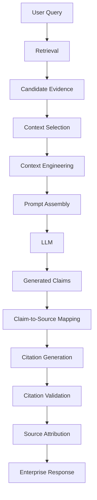
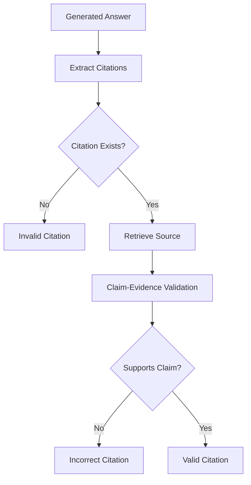
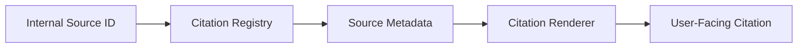
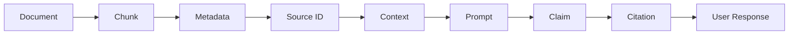
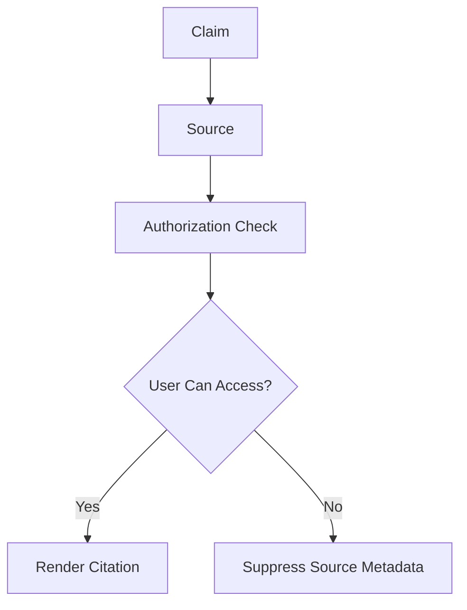

# 04. Citation and Source Attribution

> **Category:** Production RAG Engineering  
> **Module:** Part V — Advanced Retrieval-Augmented Generation  
> **Difficulty:** Advanced

---

## 📖 Overview

A production RAG system should not only provide an answer.

It should also be able to answer:

> **"Where did this answer come from?"**

Citation and source attribution connect generated claims back to the evidence used by the system.

A trustworthy enterprise RAG response should therefore establish a traceable relationship:

```text
User Query
    ↓
Retrieved Evidence
    ↓
Selected Context
    ↓
Generated Claims
    ↓
Citations
    ↓
Source Attribution
    ↓
Enterprise Response
```

Without source attribution, users may have difficulty determining:

- whether an answer is grounded,
- which document supports a claim,
- whether the source is authoritative,
- whether the information is current,
- whether multiple sources agree,
- and whether the generated answer can be audited.

The core principle is:

> **Every important factual claim should be traceable to the evidence that supports it.**

---

# 🎯 Learning Objectives

After completing this chapter, you will be able to:

- Understand citation in RAG systems
- Understand source attribution
- Understand claim-to-source mapping
- Design citation-aware RAG pipelines
- Generate citation identifiers
- Preserve source provenance
- Implement citation metadata
- Implement claim-level citations
- Implement paragraph-level citations
- Implement answer-level citations
- Validate citation references
- Validate citation correctness
- Validate citation completeness
- Handle multiple supporting sources
- Handle conflicting sources
- Handle source authority
- Handle source freshness
- Handle document versions
- Handle page-level citations
- Handle section-level citations
- Handle line-level citations
- Design citation-aware prompts
- Build citation-aware response schemas
- Implement citation extraction
- Implement citation validation
- Build enterprise source attribution
- Design citation observability
- Evaluate citation quality
- Build production-grade citation architecture

---

# 🧠 1. What Is Citation in RAG?

Citation connects a generated statement to supporting evidence.

Example:

```text
The payment service supports approximately
10,000 transactions per second. [S1]
```

Where:

```text
[S1]
Payment Architecture Document
Section: Performance
```

The citation provides traceability.

---

# 🧩 2. Source Attribution

Source attribution provides additional information about the evidence.

Instead of:

```text
[S1]
```

the system may expose:

```text
[S1]
Payment Architecture Document
Version 4.2
Section: Performance
Updated: 2026-05-14
```

This makes the source useful to the user.

---

# 🧠 3. Citation vs Source Attribution

These concepts are related but different.

### Citation

Answers:

```text
Which source supports this claim?
```

### Source Attribution

Answers:

```text
What exactly is this source?
```

A production system generally needs both.

```text
Claim
 ↓
Citation
 ↓
Source
 ↓
Metadata
```

---

# 🏗️ 4. Citation Architecture



---

# 🧠 5. Why Citations Matter

Citations improve:

```text
Trust
Transparency
Auditability
Debugging
Explainability
Compliance
User Verification
```

They also make RAG systems easier to evaluate.

---

# 🧠 6. Citation as a Provenance Chain

A citation should be part of a larger lineage:

```text
User Query
    ↓
Retrieval Query
    ↓
Retriever
    ↓
Document
    ↓
Chunk
    ↓
Context Selection
    ↓
Generated Claim
    ↓
Citation
```

This is stronger than simply storing:

```text
source = document.pdf
```

---

# 🧩 7. Provenance Model

```text
Source
  │
  ├── Document ID
  ├── Version
  ├── Author
  ├── Created Date
  ├── Updated Date
  ├── Effective Date
  ├── Section
  ├── Page
  └── Chunk
```

The citation can reference the appropriate level.

---

# 🧠 8. Citation Granularity

Citations can exist at multiple levels:

```text
Document
Section
Page
Paragraph
Sentence
Claim
```

For enterprise RAG, claim-level or sentence-level citations are often the most precise.

---

# 📊 9. Citation Granularity

| Level | Precision | Complexity |
|---|---:|---:|
| Answer | Low | Low |
| Paragraph | Medium | Low |
| Sentence | High | Medium |
| Claim | Very High | High |
| Page | Medium | Low |
| Line | Very High | High |

The correct level depends on the application.

---

# 🧠 10. Answer-Level Citation

Example:

```text
The payment system uses PostgreSQL and supports
10,000 TPS. [S1]
```

Advantages:

```text
Simple
Readable
Low Overhead
```

Disadvantage:

```text
It may be unclear which part of the answer
is supported by the source.
```

---

# 🧠 11. Paragraph-Level Citation

```text
The payment system uses PostgreSQL and supports
10,000 TPS. [S1]

The platform uses Kafka for asynchronous event
processing. [S2]
```

This provides better traceability.

---

# 🧠 12. Claim-Level Citation

```text
The payment system uses PostgreSQL. [S1]

The system supports approximately 10,000 TPS. [S2]

Kafka is used for asynchronous event processing. [S3]
```

This is highly traceable.

---

# 🧠 13. Multiple Sources

A claim may be supported by multiple sources.

```text
The platform supports approximately 10,000 TPS. [S1][S3]
```

This can indicate:

```text
Independent Confirmation
+
Multiple Evidence Sources
```

---

# 🧩 14. Multi-Source Claim Mapping

```text
Claim C1
 ├── S1
 └── S3

Claim C2
 └── S2

Claim C3
 ├── S4
 ├── S5
 └── S6
```

---

# 🧠 15. Citation Data Model

A citation should contain more than a display string.

```python
from dataclasses import dataclass


@dataclass
class Citation:

    citation_id: str

    source_id: str

    document_id: str

    title: str

    page: int | None = None

    section: str | None = None

    chunk_id: str | None = None
```

---

# 🧩 16. Source Model

```python
@dataclass
class Source:

    source_id: str

    document_id: str

    title: str

    uri: str | None

    version: str | None

    author: str | None

    page: int | None

    section: str | None

    created_at: str | None

    updated_at: str | None

    effective_date: str | None
```

---

# 🧠 17. Claim Model

```python
@dataclass
class Claim:

    claim_id: str

    text: str

    source_ids: list[str]

    confidence: float

    grounded: bool
```

This creates an explicit:

```text
Claim → Evidence
```

relationship.

---

# 🧠 18. Citation Mapping

```python
claim_sources = {
    "C1": ["S1"],
    "C2": ["S2", "S3"],
    "C3": ["S4"]
}
```

This mapping can be generated during response processing.

---

# 🧠 19. Citation Pipeline

```text
Retrieved Documents
       ↓
Context Engineering
       ↓
Source IDs Assigned
       ↓
Prompt Assembly
       ↓
LLM Generation
       ↓
Claim Extraction
       ↓
Claim-Evidence Matching
       ↓
Citation Assignment
       ↓
Citation Validation
       ↓
Final Response
```

---

# 🧩 20. Stable Source IDs

Source identifiers should be stable throughout the request.

Example:

```text
S1
S2
S3
```

The same IDs should survive:

```text
Retrieval
Context Selection
Prompt Assembly
Generation
Validation
Citation Rendering
```

---

# 🧠 21. Why Stable IDs Matter

Without stable identifiers:

```text
Retriever:
doc_45

Prompt:
source_3

Validator:
chunk_91

UI:
document_7
```

Mapping becomes difficult.

A consistent internal identity simplifies:

```text
Traceability
Validation
Debugging
Observability
```

---

# 🧩 22. Citation Registry

A request-scoped citation registry can maintain source information.

```python
class CitationRegistry:

    def __init__(self):

        self.sources = {}

    def register(
        self,
        source
    ):

        self.sources[
            source.source_id
        ] = source

    def get(
        self,
        source_id
    ):

        return self.sources.get(
            source_id
        )
```

---

# 🧠 23. Request-Scoped Citation Registry

```text
Request
  │
  ▼
Citation Registry
  │
  ├── S1 → Document A
  ├── S2 → Document B
  ├── S3 → Document C
  └── S4 → Document D
```

This avoids repeatedly reconstructing source metadata.

---

# 🧠 24. Citation-Aware Context

Context should carry source identity.

```text
<source id="S1">

Title:
Payment Architecture

Section:
Performance

Content:
The payment service supports approximately
10,000 TPS.

</source>
```

The model can then associate claims with source identifiers.

---

# 🧩 25. Citation-Aware Prompt

```text
Use only the supplied evidence.

When making factual claims, include the
corresponding source identifier.

Available sources:

<S1>
Title: Payment Architecture
Section: Performance
Content:
The payment service supports approximately
10,000 TPS.
</S1>

<S2>
Title: Event Architecture
Section: Messaging
Content:
Kafka is used for asynchronous event processing.
</S2>
```

---

# 🧠 26. Response Contract

A structured response can explicitly represent citations.

```json
{
  "answer": "The payment service supports approximately 10,000 TPS.",
  "claims": [
    {
      "text": "The payment service supports approximately 10,000 TPS.",
      "source_ids": ["S1"]
    }
  ]
}
```

This is easier to validate than free-form citation text.

---

# 🧩 27. Structured Citation Response

```json
{
  "answer": "The platform uses PostgreSQL and Kafka.",
  "claims": [
    {
      "text": "The platform uses PostgreSQL.",
      "source_ids": ["S1"]
    },
    {
      "text": "The platform uses Kafka.",
      "source_ids": ["S2"]
    }
  ]
}
```

---

# 🧠 28. Structured vs Inline Citations

### Inline

```text
The platform uses Kafka. [S2]
```

### Structured

```json
{
  "claim": "The platform uses Kafka.",
  "sources": ["S2"]
}
```

### Hybrid

```text
The platform uses Kafka. [S2]
```

plus:

```json
{
  "sources": {
    "S2": {
      "title": "Event Architecture",
      "section": "Messaging"
    }
  }
}
```

A hybrid approach is often useful for enterprise applications.

---

# 🧠 29. Citation Generation Strategies

There are several approaches.

### Strategy 1 — Model-Generated Citations

The model selects:

```text
[S1]
[S2]
```

### Strategy 2 — Post-Generation Citation Mapping

The model generates claims.

A separate system maps:

```text
Claim → Evidence
```

### Strategy 3 — Structured Claim Generation

The model produces:

```text
Claim
+
Source IDs
```

### Strategy 4 — Hybrid

Use model-generated citations plus deterministic validation.

---

# 🧠 30. Model-Generated Citation Risk

A model can produce:

```text
[S99]
```

even when only:

```text
S1
S2
S3
```

exist.

Therefore:

> **Never trust citation identifiers generated by the model without validation.**

---

# 🧩 31. Citation Validation



---

# 🧠 32. Citation Existence Validation

Example:

```text
Available:
S1
S2
S3

Response:
The system uses Kafka. [S7]
```

Result:

```text
❌ S7 does not exist
```

---

# 🧠 33. Citation Membership Validation

Even if:

```text
S7
```

exists somewhere in the knowledge base, it should not automatically be considered valid.

The citation should generally belong to the evidence available for the current request.

```text
Global Knowledge Base
        ↓
Retrieved Evidence
        ↓
Allowed Citation Set
```

---

# 🧩 34. Allowed Citation Set

```python
allowed_sources = {
    "S1",
    "S2",
    "S3"
}
```

Then:

```python
if citation_id not in allowed_sources:

    raise InvalidCitation(
        citation_id
    )
```

---

# 🧠 35. Citation Correctness

Existence is not enough.

Example:

```text
S1:
Database:
PostgreSQL
```

Response:

```text
The system uses PostgreSQL. [S1]
```

Correct.

But:

```text
The system uses MySQL. [S1]
```

Incorrect.

The source exists, but it does not support the claim.

---

# 🧠 36. Citation Completeness

A response can contain citations but still have uncited factual claims.

Example:

```text
The system uses PostgreSQL. [S1]

It supports 10,000 TPS.

Kafka handles messaging. [S2]
```

If citation is required for factual claims:

```text
10,000 TPS
```

is missing attribution.

---

# 🧠 37. Citation Coverage

A useful metric:

```text
Cited Supported Claims
───────────────────────
Total Factual Claims
```

Example:

```text
9 cited claims
10 factual claims

Citation Coverage = 90%
```

---

# 🧠 38. Citation Accuracy

Another useful metric:

```text
Correctly Supported Citations
──────────────────────────────
Total Citations
```

Example:

```text
18 correct citations
20 total citations

Citation Accuracy = 90%
```

---

# 🧠 39. Citation Coverage vs Accuracy

These are different.

| Metric | Meaning |
|---|---|
| Citation Coverage | Were claims cited? |
| Citation Accuracy | Did citations actually support claims? |
| Citation Validity | Do cited source IDs exist? |
| Source Quality | Are cited sources authoritative? |

A mature RAG system should track all of them.

---

# 🧠 40. Citation Source Quality

Not all sources are equally trustworthy.

Example:

```text
Official Policy
    ↓
Approved Architecture
    ↓
Official Documentation
    ↓
Internal Wiki
    ↓
User Comment
```

Citation quality should consider source authority.

---

# 🧠 41. Source Authority

A source object can contain:

```python
authority_score = 0.95
```

Then citation metadata can expose:

```text
Source:
Approved Security Policy

Authority:
High
```

The actual scoring policy should be enterprise-specific.

---

# 🧠 42. Source Freshness

A citation should also preserve temporal information.

```text
Title:
Payment Policy

Version:
4.2

Effective:
2026-05-01

Updated:
2026-05-14
```

This helps users judge whether the source is current.

---

# 🧩 43. Version-Aware Citation

```text
[S1]
Payment Policy
Version 4.2
Effective: 2026-05-01
```

This is better than:

```text
Payment Policy
```

when policies have multiple versions.

---

# 🧠 44. Historical Citation

Question:

```text
What was the refund policy in 2024?
```

Citation:

```text
[S7]
Refund Policy
Version 2.1
Effective: 2024-01-01
```

The system should not substitute:

```text
Current Version
```

unless the question asks for current policy.

---

# 🧠 45. Page-Level Citation

For PDF or document-based systems:

```text
[S1, Page 18]
```

can provide useful precision.

Metadata:

```json
{
  "source_id": "S1",
  "page": 18
}
```

---

# 🧠 46. Section-Level Citation

```text
[S1, Section 4.2]
```

This is especially useful for:

```text
Policies
Technical Documentation
Standards
Contracts
Architecture Documents
```

---

# 🧠 47. Line-Level Citation

For source systems that support line-level provenance:

```text
[S1, Lines 120–137]
```

This gives high traceability.

It can be particularly useful for:

```text
Code
Configuration
Structured Documents
Technical Documentation
```

---

# 🧩 48. Citation Location Model

```python
@dataclass
class CitationLocation:

    page: int | None = None

    section: str | None = None

    start_line: int | None = None

    end_line: int | None = None

    character_start: int | None = None

    character_end: int | None = None
```

---

# 🧠 49. Document Chunk Provenance

Every chunk should ideally preserve:

```text
Document ID
Chunk ID
Page
Section
Character Range
Heading
Source URI
Version
```

Example:

```json
{
  "document_id": "DOC-1042",
  "chunk_id": "DOC-1042-C17",
  "page": 18,
  "section": "4.2 Certificate Lifecycle"
}
```

---

# 🧠 50. Citation Rendering

Internal citation:

```text
S1
```

User-facing citation:

```text
Payment Security Policy — Section 4.2
```

The rendering layer should transform internal identifiers into user-friendly source references.

---

# 🧩 51. Citation Rendering Layer



---

# 🧠 52. Citation UI

A user-facing answer may show:

```text
The payment service supports approximately
10,000 TPS. [1]

Sources:

[1] Payment Architecture — Performance
    Version 4.2
```

The citation can link to the source if the application supports it.

---

# 🧠 53. Citation Links

A source reference can contain:

```text
Document URI
Page Anchor
Section Anchor
Deep Link
Document ID
```

Example:

```text
https://knowledge.example.com/docs/payment-architecture#performance
```

The actual link should be generated from trusted source metadata.

---

# 🧠 54. Secure Citation Links

Never blindly expose internal source URLs.

Before returning a source link:

```text
Check User Authorization
        ↓
Check Source Visibility
        ↓
Generate Authorized Link
```

This prevents citation metadata from becoming an information leak.

---

# 🧠 55. Source Attribution Response

Example:

```json
{
  "answer": "The payment service supports approximately 10,000 TPS.",
  "citations": [
    {
      "id": "S1",
      "title": "Payment Architecture",
      "section": "Performance",
      "version": "4.2"
    }
  ]
}
```

---

# 🧠 56. Enterprise Source Object

A richer response can expose:

```json
{
  "id": "S1",
  "title": "Payment Architecture",
  "document_id": "DOC-1042",
  "document_type": "architecture",
  "section": "Performance",
  "page": 18,
  "version": "4.2",
  "effective_date": "2026-05-01",
  "authority": "approved",
  "updated_at": "2026-05-14"
}
```

Only expose fields appropriate for the user and security context.

---

# 🧠 57. Citation-Aware Response Schema

```python
from pydantic import BaseModel


class SourceReference(BaseModel):

    id: str

    title: str

    section: str | None = None

    page: int | None = None


class Claim(BaseModel):

    text: str

    source_ids: list[str]


class EnterpriseResponse(BaseModel):

    answer: str

    claims: list[Claim]

    sources: list[SourceReference]
```

---

# 🧠 58. Claim-to-Source Mapping Service

```python
class ClaimSourceMapper:

    def map(
        self,
        claims,
        sources
    ):

        mappings = {}

        for claim in claims:

            mappings[
                claim.id
            ] = self.find_supporting_sources(
                claim,
                sources
            )

        return mappings
```

---

# 🧠 59. Evidence Matching

Possible signals:

```text
Semantic Similarity
Keyword Matching
NLI / Entailment
Entity Matching
Numerical Matching
Metadata Matching
```

A production implementation may combine several signals.

---

# 🧠 60. Numerical Claim Validation

Numbers deserve special treatment.

Evidence:

```text
10,000 TPS
```

Response:

```text
12,000 TPS [S1]
```

Semantic similarity might consider these highly related.

But:

```text
10,000 ≠ 12,000
```

A citation validator should therefore use exact or tolerance-aware numerical checks where appropriate.

---

# 🧠 61. Date Validation

Evidence:

```text
Effective:
2026-05-01
```

Response:

```text
Effective:
2026-06-01
```

The validator should detect the mismatch.

---

# 🧠 62. Identifier Validation

Important identifiers include:

```text
Policy IDs
Incident IDs
Transaction IDs
Version Numbers
Product IDs
API Versions
```

Example:

```text
INC-1042
```

should not silently become:

```text
INC-1043
```

---

# 🧠 63. Exact Fact Preservation

Citation systems should protect:

```text
Numbers
Dates
Identifiers
Names
Versions
Thresholds
Exceptions
```

These are common sources of subtle hallucination.

---

# 🧠 64. Citation and Source Hierarchy

Source hierarchy can be represented:

```text
Enterprise Policy
      ↓
Approved Architecture
      ↓
Official Documentation
      ↓
Operational Documentation
      ↓
Internal Notes
      ↓
Unverified Content
```

When multiple sources support a claim, higher-authority sources may be preferred.

---

# 🧠 65. Conflicting Sources

Example:

```text
[S1]
PostgreSQL

[S2]
MySQL
```

The system should not automatically cite both as if they agree.

Instead:

```text
Conflict Detected
        ↓
Version
        ↓
Environment
        ↓
Effective Date
        ↓
Authority
        ↓
Resolution
```

---

# 🧩 66. Conflict-Aware Attribution

```text
The architecture documentation indicates PostgreSQL [S1],
while an older deployment document references MySQL [S2].
The current approved architecture identifies PostgreSQL
as the production database.
```

This is much safer than silently selecting one source.

---

# 🧠 67. Citation for Comparative Answers

Question:

```text
Compare AWS and Azure deployment architectures.
```

Citation structure:

```text
AWS:
ECS is used for container orchestration. [S1]

Azure:
AKS is used for container orchestration. [S2]
```

Each claim should be tied to the appropriate source.

---

# 🧠 68. Citation for Multi-Hop RAG

Multi-hop retrieval may produce:

```text
Hop 1 → Incident
Hop 2 → Service
Hop 3 → Deployment
Hop 4 → Root Cause
```

The final answer can attribute each claim:

```text
The incident affected the payment service. [S1]

The payment service depends on the authentication service. [S2]

The issue started after deployment v4.3. [S3]
```

---

# 🧠 69. Citation for Graph RAG

Graph RAG may produce:

```text
Service A
   ↓ depends_on
Service B
   ↓ deployed_by
Team C
```

Citation should preserve the underlying evidence.

```text
Payment Service depends on Authentication Service. [G1]
```

Where:

```text
G1:
Graph relationship:
Payment Service → depends_on → Authentication Service
```

---

# 🧠 70. Citation for SQL RAG

SQL RAG produces structured evidence.

Example:

```text
Average transaction latency:
142 ms
```

Citation should identify:

```text
Database
Table
Query
Execution Time
Timestamp
```

Example:

```json
{
  "source_id": "SQL1",
  "type": "sql",
  "database": "analytics",
  "query_id": "Q-1042",
  "executed_at": "2026-08-11T10:30:00"
}
```

---

# 🧠 71. Citation for Multimodal RAG

Evidence may come from:

```text
Text
Image
Table
Chart
PDF
Audio
Video
```

Source attribution should preserve modality.

Example:

```text
The architecture diagram shows the payment
service communicating with Kafka. [IMG1]
```

---

# 🧩 72. Multimodal Source Model

```python
@dataclass
class SourceReference:

    id: str

    source_type: str

    title: str

    uri: str | None

    page: int | None = None

    region: str | None = None
```

For images:

```text
region:
x=120,y=240,w=450,h=280
```

where supported by the source system.

---

# 🧠 73. Citation for Code RAG

Example:

```text
The payment service validates the transaction
before publishing the event. [C1]
```

Source:

```text
Repository:
payment-service

File:
PaymentService.java

Method:
processPayment()

Lines:
120–167
```

This provides strong developer-oriented attribution.

---

# 🧠 74. Citation for Configuration RAG

Example:

```text
The service timeout is configured as 30 seconds. [CFG1]
```

Source:

```text
application.yml
Line 42
```

This is especially useful for operational assistants.

---

# 🧠 75. Citation for Enterprise Knowledge Graphs

A graph source may require attribution of:

```text
Entity
Relationship
Property
Source
```

Example:

```text
Payment Service
    ↓ depends_on
Authentication Service
```

Source:

```text
Architecture Repository
```

---

# 🧠 76. Citation Preservation Through Compression

Suppose:

```text
S1
S2
S3
```

are compressed into:

```text
Payment service uses PostgreSQL and Kafka.
```

The system should retain:

```text
Source IDs:
S1
S2
```

Compression must not destroy provenance.

---

# 🧩 77. Provenance-Preserving Compression

```python
compressed = {
    "content": (
        "Payment service uses PostgreSQL "
        "and Kafka."
    ),
    "source_ids": [
        "S1",
        "S2"
    ]
}
```

---

# 🧠 78. Citation Propagation

Citation metadata should survive:

```text
Chunk
 ↓
Parent Context
 ↓
Compression
 ↓
Context Assembly
 ↓
Generation
 ↓
Validation
 ↓
Response
```

This is called:

```text
Provenance Propagation
```

---

# 🧠 79. Citation Metadata Pipeline



---

# 🧠 80. Citation Validation Layers

A production citation validator should check:

```text
1. Citation Syntax
2. Citation ID
3. Source Membership
4. Source Availability
5. Claim Support
6. Citation Coverage
7. Source Authority
8. Source Freshness
9. Authorization
10. Link Safety
```

---

# 🧩 81. Citation Validator Interface

```python
class CitationValidator:

    def validate(
        self,
        response,
        claims,
        sources
    ):
        raise NotImplementedError
```

---

# 🧠 82. Basic Citation Validator

```python
class BasicCitationValidator:

    def validate(
        self,
        citation_id,
        allowed_sources
    ):

        if citation_id not in allowed_sources:

            return False

        return True
```

This validates existence only.

Production systems need semantic validation too.

---

# 🧠 83. Advanced Citation Validator

```python
class ProductionCitationValidator:

    def validate(
        self,
        claims,
        sources
    ):

        results = []

        for claim in claims:

            citations = claim.source_ids

            if not citations:
                results.append(
                    "Missing citation"
                )
                continue

            for source_id in citations:

                if source_id not in sources:

                    results.append(
                        f"Unknown source: {source_id}"
                    )

        return results
```

---

# 🧠 84. Citation Coverage Validator

```python
class CitationCoverageValidator:

    def validate(
        self,
        claims
    ):

        uncited = [
            claim
            for claim in claims
            if not claim.source_ids
        ]

        return uncited
```

---

# 🧠 85. Citation Correctness Validator

Conceptually:

```python
class CitationCorrectnessValidator:

    def validate(
        self,
        claim,
        source
    ):

        score = entailment_score(
            source.content,
            claim.text
        )

        return score >= 0.85
```

The threshold should be calibrated using evaluation data.

---

# 🧠 86. Citation Quality Score

A conceptual score:

```text
Citation Quality
=
Validity
+
Correctness
+
Coverage
+
Authority
+
Freshness
```

The exact formula should be defined by the application.

---

# 📊 87. Citation Metrics

Important metrics:

```text
Citation Validity
Citation Accuracy
Citation Coverage
Citation Completeness
Source Authority
Source Freshness
Citation Click-Through Rate
Citation Verification Rate
```

---

# 🧠 88. Citation Validity

```text
Valid Citations
───────────────
Total Citations
```

Invalid citations include:

```text
Unknown Source
Malformed ID
Unauthorized Source
Unavailable Source
```

---

# 🧠 89. Citation Accuracy

```text
Correctly Supported Citations
──────────────────────────────
Total Citations
```

This measures whether the source actually supports the claim.

---

# 🧠 90. Citation Coverage

```text
Cited Factual Claims
────────────────────
Total Factual Claims
```

This measures whether claims received citations.

---

# 🧠 91. Source Authority Metric

A system can track:

```text
High Authority Sources
───────────────────────
Total Cited Sources
```

This helps identify whether the RAG system relies too heavily on weak sources.

---

# 🧠 92. Source Freshness Metric

Track:

```text
Average Age of Cited Sources
```

or:

```text
Percentage of citations
from current approved sources
```

This is particularly useful for:

```text
Policies
Operations
Pricing
Product Documentation
Compliance
```

---

# 🧠 93. Citation Observability

Track every citation event:

```json
{
  "request_id": "REQ-1042",
  "claim_id": "C7",
  "source_id": "S3",
  "retriever": "hybrid",
  "citation_valid": true,
  "citation_supported": true,
  "authority": 0.95,
  "freshness": 0.91
}
```

This enables production analysis.

---

# 🧠 94. Citation Debugging

When a user reports:

```text
"This citation is wrong."
```

the system should be able to inspect:

```text
Query
 ↓
Retrieved Source
 ↓
Selected Context
 ↓
Generated Claim
 ↓
Citation Mapping
 ↓
Rendered Citation
```

This makes citation bugs diagnosable.

---

# 🧩 95. Citation Trace

```text
REQ-1042

Query:
"What database does Payment Service use?"

Retriever:
Hybrid Search

Selected:
S1

Claim:
"Payment Service uses PostgreSQL."

Citation:
[S1]

Source:
Payment Architecture v4.2

Validation:
SUPPORTED
```

---

# 🧠 96. Citation Security

Citations can leak information.

Example:

```text
Answer:
No salary information was found.

Source:
Internal HR Confidential Document
```

Even revealing the existence of the source may be sensitive.

Therefore:

> **Source attribution must respect authorization and information-disclosure policies.**

---

# 🧩 97. Secure Citation Flow



---

# 🧠 98. Citation Redaction

Some metadata may need to be hidden.

Internal:

```text
Document:
M&A Strategy — Confidential

Path:
/internal/mna/2026/strategy.pdf
```

External response:

```text
Internal corporate source
```

The user may receive the claim but not the sensitive document path.

---

# 🧠 99. Citation UX

Good citations should be:

```text
Relevant
Readable
Clickable
Specific
Consistent
Secure
```

Avoid:

```text
[SOURCE_3827182]
```

when the UI can display:

```text
Payment Architecture — Performance
```

---

# 🧠 100. Citation Display

Example:

```text
The payment service supports approximately
10,000 TPS. [1]

Sources

[1] Payment Architecture
    Section: Performance
    Version: 4.2
```

A UI can make `[1]` clickable.

---

# 🧠 101. Citation Grouping

If several claims use the same source:

```text
The platform uses PostgreSQL [1] and Kafka [1].
```

The UI can show the source once.

---

# 🧩 102. Source Deduplication

```python
sources = [
    "S1",
    "S1",
    "S2"
]

unique_sources = list(
    dict.fromkeys(sources)
)
```

This prevents repeated source cards.

---

# 🧠 103. Citation Ordering

Sources can be ordered by:

```text
First Appearance
Relevance
Authority
Frequency
Document Order
```

For user readability:

```text
First Appearance
```

is often intuitive.

---

# 🧠 104. Citation Numbering

Internal IDs:

```text
S1
S7
S13
```

User-facing numbering:

```text
[1]
[2]
[3]
```

The rendering layer can map:

```text
S7 → [2]
```

without changing internal identity.

---

# 🧩 105. Citation Rendering Map

```python
citation_map = {
    "S1": 1,
    "S7": 2,
    "S13": 3
}
```

Response:

```text
PostgreSQL [1]
Kafka [2]
Architecture Version [3]
```

---

# 🧠 106. Citation Formats

Common formats:

```text
[1]
[S1]
[1, 2]
(Smith, 2025)
Document: Payment Architecture
```

Enterprise RAG systems should choose one consistent format.

---

# 🧠 107. Machine-Readable Citations

For APIs, prefer structured citations.

```json
{
  "source_id": "S1",
  "claim_id": "C1"
}
```

The UI can then decide how to render them.

---

# 🧠 108. Human-Readable Citations

For end users:

```text
[1] Payment Architecture — Performance
```

This provides readability without exposing internal implementation details.

---

# 🧠 109. Citation-Aware Enterprise API

```json
{
  "answer": "The payment service supports approximately 10,000 TPS.",
  "citations": [
    {
      "id": 1,
      "title": "Payment Architecture",
      "section": "Performance",
      "page": 18
    }
  ]
}
```

---

# 🧠 110. Citation-Aware Backend Architecture

```text
RAG Orchestrator
      │
      ├── Retriever
      │
      ├── Context Engineer
      │
      ├── Prompt Builder
      │
      ├── LLM
      │
      ├── Claim Extractor
      │
      ├── Citation Mapper
      │
      ├── Citation Validator
      │
      └── Source Registry
```

---

# 🧩 111. Citation Service

```python
class CitationService:

    def generate(
        self,
        claims,
        sources
    ):

        mappings = {}

        for claim in claims:

            mappings[
                claim.claim_id
            ] = self.find_sources(
                claim,
                sources
            )

        return mappings
```

---

# 🧠 112. Citation Registry Architecture

```text
                    ┌──────────────────┐
                    │  Source Registry │
                    └────────┬─────────┘
                             │
             ┌───────────────┼───────────────┐
             ▼               ▼               ▼
           S1              S2              S3
             │               │               │
             ▼               ▼               ▼
        Document A      Document B      Document C
             │               │               │
             └───────────────┼───────────────┘
                             ▼
                     Citation Mapper
                             │
                             ▼
                          Claims
                             │
                             ▼
                     Citation Validator
```

---

# 🧠 113. Citation and Context Engineering

Citation quality starts before generation.

Context engineering must preserve:

```text
Source ID
Document ID
Chunk ID
Page
Section
Version
Authority
Freshness
```

If this metadata is lost during context engineering, citation quality will suffer later.

---

# 🧠 114. Citation and Response Validation

The previous chapter established:

```text
Response Validation
```

This chapter specializes that layer into:

```text
Claim
 ↓
Source
 ↓
Citation
 ↓
Validation
```

Together:

```text
Response Validation
        │
        ├── Schema
        ├── Security
        ├── Grounding
        ├── Completeness
        ├── Consistency
        │
        └── Citation Validation
```

---

# 🧠 115. Citation and RAG Evaluation

Citation should be included in RAG evaluation.

Evaluate:

```text
Citation Validity
Citation Accuracy
Citation Coverage
Source Quality
Source Freshness
Citation Completeness
```

Do not measure only:

```text
Answer Accuracy
```

---

# 🧪 116. Citation Evaluation Dataset

Create test cases containing:

```text
Question
Evidence
Expected Claims
Expected Sources
Expected Citation Locations
Expected Source Metadata
```

Example:

```json
{
  "question": "What database does Payment Service use?",
  "expected_claim": "Payment Service uses PostgreSQL.",
  "expected_sources": ["S1"]
}
```

---

# 🧪 117. Citation Regression Testing

Test after changing:

```text
Retriever
Chunking
Context Selection
Prompt
Model
Citation Mapper
Validator
Source Ranking
```

Measure:

```text
Citation Accuracy
Citation Coverage
Citation Validity
Groundedness
```

---

# 🧪 118. Citation Test Cases

```text
☐ Valid citation
☐ Missing citation
☐ Unknown citation
☐ Unauthorized citation
☐ Citation to irrelevant source
☐ Citation to contradictory source
☐ Multiple supporting sources
☐ Duplicate sources
☐ Historical source
☐ Outdated source
☐ Conflicting versions
☐ Page citation
☐ Section citation
☐ Line citation
☐ SQL source
☐ Graph source
☐ Multimodal source
☐ Code source
```

---

# 🧠 119. Citation Failure Modes

Common failures:

```text
Hallucinated Citation IDs
Wrong Source
Missing Citation
Citation to Weak Source
Outdated Source
Unauthorized Source
Citation Scope Too Broad
Citation Scope Too Narrow
Broken Source Link
Lost Provenance
Incorrect Page
Incorrect Version
Unsupported Claim
Conflicting Evidence
```

---

# 🚨 120. Failure: Hallucinated Citation

Response:

```text
The platform uses Kafka. [S99]
```

But:

```text
S99 does not exist.
```

Solution:

```text
Strict Citation Registry
+
Citation Validation
```

---

# 🚨 121. Failure: Citation Exists but Is Wrong

```text
Claim:
PostgreSQL

Citation:
S2

S2:
Kafka architecture
```

Solution:

```text
Claim-Evidence Validation
```

---

# 🚨 122. Failure: Missing Citation

```text
The service supports 10,000 TPS.
```

Solution:

```text
Citation Coverage Validator
```

---

# 🚨 123. Failure: Outdated Citation

```text
Current Policy:
Version 4.2

Response:
Version 2.1 [S7]
```

Solution:

```text
Version-Aware Source Ranking
+
Freshness Validation
```

---

# 🚨 124. Failure: Unauthorized Citation

```text
Source:
Confidential HR document
```

Even if the source supports the answer:

```text
❌ Do not expose it.
```

Solution:

```text
Authorization-Aware Citation Rendering
```

---

# 🚨 125. Failure: Broken Link

Citation:

```text
[1]
```

opens:

```text
404
```

The source reference should be validated before being presented.

---

# 🧠 126. Citation Link Validation

```python
class CitationLinkValidator:

    def validate(
        self,
        citation
    ):

        if not citation.uri:
            return True

        return self.is_authorized(
            citation.uri
        )
```

A production implementation should also handle link lifecycle and source availability.

---

# 🧠 127. Citation Security Principle

Never expose:

```text
Internal Storage Paths
Private URLs
Credentials
Access Tokens
Sensitive Metadata
Unauthorized Document Names
```

through citation rendering.

---

# 🏢 128. Enterprise Citation Architecture

```text
                           USER
                            │
                            ▼
                     ┌────────────┐
                     │ RAG SYSTEM │
                     └─────┬──────┘
                           │
                           ▼
                      RETRIEVAL
                           │
                           ▼
                  CONTEXT ENGINEERING
                           │
                           ▼
                    PROMPT ASSEMBLY
                           │
                           ▼
                         LLM
                           │
                           ▼
                    GENERATED ANSWER
                           │
                           ▼
                    CLAIM EXTRACTION
                           │
                           ▼
                 CLAIM-SOURCE MAPPING
                           │
                           ▼
                   CITATION SERVICE
                           │
                    ┌──────┴──────┐
                    ▼             ▼
             SOURCE REGISTRY   VALIDATOR
                    │             │
                    └──────┬──────┘
                           ▼
                  AUTHORIZATION CHECK
                           │
                           ▼
                    CITATION RENDERER
                           │
                           ▼
                  ENTERPRISE RESPONSE
```

---

# 🧠 129. Production Citation Flow

```text
Retrieve
   ↓
Assign Source IDs
   ↓
Preserve Provenance
   ↓
Select Context
   ↓
Assemble Prompt
   ↓
Generate Claims
   ↓
Map Claims to Evidence
   ↓
Generate Citations
   ↓
Validate Citation IDs
   ↓
Validate Source Membership
   ↓
Validate Claim Support
   ↓
Validate Citation Coverage
   ↓
Validate Authorization
   ↓
Render User-Friendly Citations
   ↓
Enterprise Response
```

---

# 🧠 130. Production Design Principles

### Principle 1 — Every Important Claim Should Be Traceable

```text
Claim → Source
```

---

### Principle 2 — Preserve Provenance End-to-End

```text
Document
 ↓
Chunk
 ↓
Context
 ↓
Claim
 ↓
Citation
```

---

### Principle 3 — Never Trust Model-Generated Citation IDs

Always validate them.

---

### Principle 4 — Citation Presence Is Not Citation Correctness

A citation must support the claim.

---

### Principle 5 — Preserve Source Metadata

Keep:

```text
Version
Date
Page
Section
Authority
```

when relevant.

---

### Principle 6 — Respect Authorization

A citation can leak sensitive information.

---

### Principle 7 — Validate Numerical and Temporal Claims Carefully

Similarity alone is insufficient for exact facts.

---

### Principle 8 — Support Multiple Sources

Some claims require independent corroboration.

---

### Principle 9 — Handle Conflicting Sources Explicitly

Do not silently combine contradictory evidence.

---

### Principle 10 — Keep Internal and External Source Models Separate

Internal provenance can be richer than what is exposed to users.

---

### Principle 11 — Make Citations Machine-Readable

APIs should return structured citation metadata.

---

### Principle 12 — Make Citations Human-Friendly

Users should be able to understand and verify the source.

---

# 📊 131. Production Metrics

Track:

```text
Citation Validity Rate
Citation Accuracy
Citation Coverage
Citation Completeness
Source Authority
Source Freshness
Unauthorized Citation Rate
Broken Citation Rate
Citation Rendering Latency
Citation Verification Rate
```

---

# 📈 132. Example Citation Dashboard

```text
┌─────────────────────────────────────────┐
│       RAG CITATION QUALITY              │
├─────────────────────────────────────────┤
│ Citation Validity          99.6%         │
│ Citation Accuracy          97.8%         │
│ Citation Coverage          96.9%         │
│ Source Authority           94.2%         │
│ Current Source Usage       98.1%         │
│ Broken Links                0.1%         │
│ Unauthorized Citations      0.0%         │
└─────────────────────────────────────────┘
```

These are illustrative values only.

---

# 🧪 133. Practical Project

Build a **Citation and Source Attribution Service** for an enterprise RAG application.

### Input

```text
User Query
+
Generated Response
+
Retrieved Evidence
```

### Processing

```text
Claim Extraction
      ↓
Claim-Evidence Matching
      ↓
Citation Assignment
      ↓
Citation Validation
      ↓
Authorization
      ↓
Citation Rendering
```

### Output

```json
{
  "answer": "The payment service uses PostgreSQL. [1]",
  "citations": [
    {
      "id": 1,
      "title": "Payment Architecture",
      "section": "Database Architecture",
      "page": 18
    }
  ]
}
```

---

# 🧪 134. Advanced Implementation Exercise

Implement:

```text
CitationRegistry
CitationService
ClaimExtractor
ClaimSourceMapper
CitationValidator
CitationCoverageValidator
CitationCorrectnessValidator
CitationLinkValidator
SourceAuthorityResolver
SourceFreshnessResolver
CitationRenderer
```

Architecture:

```text
                    CitationService
                           │
              ┌────────────┼────────────┐
              ▼            ▼            ▼
        ClaimExtractor   Registry    Validator
              │            │            │
              └────────────┼────────────┘
                           ▼
                   Claim-Source Map
                           │
                           ▼
                  Citation Renderer
                           │
                           ▼
                  Enterprise Response
```

---

# 🧪 135. Advanced Citation Exercise

Extend the system to support:

```text
☐ Claim-level citations
☐ Page citations
☐ Section citations
☐ Line citations
☐ Multiple source citations
☐ Historical citations
☐ Version-aware citations
☐ SQL citations
☐ Graph citations
☐ Code citations
☐ Multimodal citations
☐ Authorization-aware citations
☐ Citation conflict detection
☐ Citation observability
```

---

# 🧠 136. Example End-to-End Response

### User

```text
What database does the payment service use?
```

### Evidence

```text
[S1]

Document:
Payment Architecture

Version:
4.2

Section:
Database Architecture

Content:
The payment service uses PostgreSQL.
```

### Generated Claim

```text
The payment service uses PostgreSQL.
```

### Citation Mapping

```text
C1 → S1
```

### Final Response

```text
The payment service uses PostgreSQL. [1]

Source:

[1] Payment Architecture
    Section: Database Architecture
    Version: 4.2
```

---

# 🧠 137. Example Multi-Claim Response

```text
The payment service uses PostgreSQL. [1]

It communicates asynchronously through Kafka. [2]

The architecture documentation specifies a
10,000 TPS throughput target. [3]
```

Source list:

```text
[1] Payment Architecture — Database
[2] Event Architecture — Messaging
[3] Performance Architecture — Throughput
```

Each claim has a clear evidence relationship.

---

# 🧠 138. Example Conflicting Sources

```text
The current approved architecture specifies
PostgreSQL as the production database. [1]

An older deployment document references MySQL. [2]

The discrepancy appears to reflect an earlier
architecture version.
```

This is more trustworthy than:

```text
The system uses PostgreSQL and MySQL.
```

without explaining the conflict.

---

# 🧠 139. Example Historical Source

```text
In 2024, the refund period was 14 days. [1]

The current policy has since changed to 30 days. [2]
```

Sources:

```text
[1] Refund Policy — Version 2.0 — Effective 2024
[2] Refund Policy — Version 4.2 — Current
```

This demonstrates temporal source attribution.

---

# 🧠 140. Example SQL Citation

```text
The average transaction latency was 142 ms
during the measured period. [1]
```

Source:

```text
[1]
Analytics Database
Query: Q-1042
Executed: 2026-08-11 10:30 UTC
```

---

# 🧠 141. Example Code Citation

```text
The payment service validates the transaction
before publishing the event. [1]
```

Source:

```text
[1]
payment-service
PaymentService.java
processPayment()
Lines 120–167
Commit: a8d219
```

---

# 🧠 142. Example Multimodal Citation

```text
The architecture diagram shows the payment
service communicating with Kafka. [1]
```

Source:

```text
[1]
System Architecture Diagram
Page 12
Region: Payment → Kafka
```

---

# 🧠 143. Final Mental Model

```text
                         USER QUERY
                              │
                              ▼
                         RETRIEVAL
                              │
                              ▼
                    SELECTED EVIDENCE
                              │
                              ▼
                     SOURCE REGISTRY
                              │
                              ▼
                      CONTEXT ENGINE
                              │
                              ▼
                       PROMPT ASSEMBLY
                              │
                              ▼
                      FOUNDATION MODEL
                              │
                              ▼
                       GENERATED CLAIMS
                              │
                              ▼
                   CLAIM-EVIDENCE MAPPING
                              │
                              ▼
                      CITATION SERVICE
                              │
                 ┌────────────┼────────────┐
                 ▼            ▼            ▼
              VALIDITY    CORRECTNESS   COVERAGE
                 │            │            │
                 └────────────┼────────────┘
                              ▼
                       AUTHORIZATION
                              │
                              ▼
                      SOURCE ATTRIBUTION
                              │
                              ▼
                      CITATION RENDERING
                              │
                              ▼
                    ENTERPRISE RESPONSE
```

The essential relationship is:

```text
Document
   ↓
Chunk
   ↓
Evidence
   ↓
Claim
   ↓
Citation
   ↓
Source Attribution
   ↓
User
```

A production RAG system should make this chain observable and verifiable.

---

# 📚 144. Key Takeaways

- Citation connects generated claims to supporting evidence.
- Source attribution explains what the supporting source actually is.
- Citation is part of the larger provenance chain.
- Source IDs should remain stable throughout the RAG request.
- Provenance must survive retrieval, context engineering, compression, generation, and validation.
- Claim-level citations provide stronger traceability than answer-level citations.
- A claim may be supported by multiple sources.
- Citation existence does not guarantee citation correctness.
- Citation presence does not guarantee citation completeness.
- Every important factual claim should have appropriate attribution when the application requires citations.
- Source authority should be considered when multiple sources are available.
- Source freshness is important for policies, operations, pricing, and changing enterprise knowledge.
- Version-aware citations are essential when documents evolve over time.
- Historical questions require historical source attribution.
- Page, section, and line-level citations can provide stronger verification.
- SQL, Graph, Code, and Multimodal RAG require modality-aware source metadata.
- Numerical values, dates, identifiers, and versions require careful validation.
- Model-generated citation IDs should never be trusted without validation.
- Citation links must respect user authorization.
- Source metadata itself can become sensitive information.
- Internal provenance can be richer than the user-facing citation.
- Structured citation objects make enterprise APIs easier to consume.
- Human-readable citations improve user trust and verification.
- Citation accuracy and citation coverage should be evaluated separately.
- Citation observability enables debugging of the complete claim-to-source chain.
- Citation regression tests should be part of RAG evaluation.
- Citation quality is a core component of trustworthy enterprise RAG.
- The objective is not simply to "add references."
- The objective is to create a **verifiable chain between enterprise evidence and every important generated claim**.

---

# 🧭 Production RAG Mental Model

```text
┌─────────────────────────────────────────────┐
│              ENTERPRISE RAG                │
├─────────────────────────────────────────────┤
│                                             │
│  RETRIEVAL                                  │
│      ↓                                      │
│  CONTEXT SELECTION                          │
│      ↓                                      │
│  CONTEXT ENGINEERING                        │
│      ↓                                      │
│  PROMPT ASSEMBLY                            │
│      ↓                                      │
│  GENERATION                                 │
│      ↓                                      │
│  RESPONSE VALIDATION                        │
│      ↓                                      │
│  CLAIM EXTRACTION                            │
│      ↓                                      │
│  CLAIM → EVIDENCE                           │
│      ↓                                      │
│  CITATION GENERATION                        │
│      ↓                                      │
│  CITATION VALIDATION                        │
│      ↓                                      │
│  SOURCE ATTRIBUTION                         │
│      ↓                                      │
│  AUTHORIZATION                              │
│      ↓                                      │
│  ENTERPRISE RESPONSE                        │
│                                             │
└─────────────────────────────────────────────┘
```

The key principle:

> **A trustworthy RAG answer is not just a generated response. It is a generated response with a verifiable evidence trail.**

---

# 🧭 Chapter Navigation

### Part V — Advanced Retrieval-Augmented Generation

**Previous:**  
[03. Response Validation](03-response-validation.md)

**Next:**  
[05. Enterprise Response](05-enterprise-response.md)

**Section:**  
06 — Production RAG Engineering

### Production RAG Engineering Path

```text
01 Prompt Assembly
        ↓
02 Context Selection & Context Engineering
        ↓
03 Response Validation
        ↓
04 Citation & Source Attribution
        ↓
05 Enterprise Response
        ↓
06 RAG Evaluation & Benchmarking
        ↓
07 RAG Observability
        ↓
08 RAG Performance Optimization
        ↓
09 RAG Cost Optimization
        ↓
10 Production Retrieval Architecture
        ↓
11 Building Production RAG Systems
```

---

> **Enterprise AI Engineering Handbook**  
> *Building Production-Grade Enterprise AI Systems — One Chapter at a Time.*