# 05. Enterprise Response

> **Category:** Production RAG Engineering  
> **Module:** Part V — Advanced Retrieval-Augmented Generation  
> **Difficulty:** Advanced

---

## 📖 Overview

A production RAG system should not stop at:

```text
LLM → Answer
```

Enterprise AI requires an additional response engineering layer that transforms validated model output into a response that is:

```text
Grounded
Cited
Secure
Authorized
Consistent
Structured
Actionable
Explainable
Auditable
```

The **Enterprise Response Layer** is the final application-facing boundary between the AI system and the user.

```text
User Query
    ↓
Retrieval
    ↓
Context Engineering
    ↓
Prompt Assembly
    ↓
Foundation Model
    ↓
Response Validation
    ↓
Citation & Source Attribution
    ↓
┌─────────────────────────────┐
│    ENTERPRISE RESPONSE      │
│                             │
│ Security                    │
│ Authorization               │
│ Sanitization                │
│ Formatting                  │
│ Citations                   │
│ Confidence                  │
│ Warnings                    │
│ Provenance                  │
│ Business Context            │
└──────────────┬──────────────┘
               ↓
            User/API
```

The central principle is:

> **An enterprise response is not simply what the model generated. It is the validated, authorized, cited, policy-compliant, application-ready representation of the model's answer.**

---

# 🎯 Learning Objectives

After completing this chapter, you will be able to:

- Understand enterprise response engineering
- Design an enterprise response layer
- Separate model output from user-facing responses
- Build structured enterprise responses
- Design response contracts
- Implement response sanitization
- Implement response normalization
- Implement response formatting
- Handle citations and source references
- Handle confidence and uncertainty
- Handle partial answers
- Handle abstention
- Handle warnings
- Handle conflicting evidence
- Handle authorization boundaries
- Handle sensitive information
- Implement response redaction
- Design enterprise response policies
- Design response templates
- Design role-aware responses
- Design audience-aware responses
- Design API-friendly responses
- Design UI-friendly responses
- Design machine-readable responses
- Design human-readable responses
- Build response metadata
- Implement response lineage
- Implement response versioning
- Design enterprise response observability
- Design error and fallback responses
- Build production-grade enterprise response architecture

---

# 🧠 1. What Is an Enterprise Response?

An enterprise response is the final representation of AI-generated information after:

```text
Generation
+
Validation
+
Grounding
+
Citation
+
Authorization
+
Sanitization
+
Formatting
```

It may contain:

```text
Answer
Citations
Warnings
Confidence
Sources
Metadata
Actions
```

Example:

```json
{
  "answer": "The payment service uses PostgreSQL.",
  "citations": [
    {
      "id": 1,
      "title": "Payment Architecture",
      "section": "Database Architecture"
    }
  ],
  "confidence": 0.96,
  "warnings": []
}
```

---

# 🧠 2. Model Response vs Enterprise Response

These should not be treated as the same object.

### Model Response

```text
The payment service uses PostgreSQL.
```

### Enterprise Response

```text
Answer:
The payment service uses PostgreSQL.

Source:
[1] Payment Architecture
Section: Database Architecture
Version: 4.2

Confidence:
High

Validation:
Grounded
```

The second representation is much more useful for an enterprise application.

---

# 🏗️ 3. Enterprise Response Pipeline

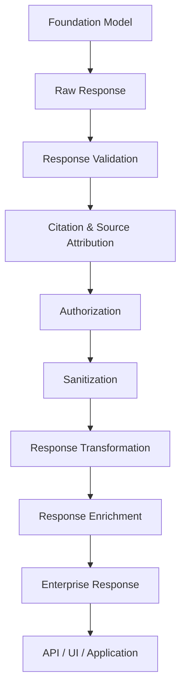

---

# 🧠 4. Why Enterprise Response Engineering Matters

A raw model response may not satisfy enterprise requirements.

For example:

```text
Raw Answer:
"The payment outage was caused by a certificate issue."
```

An enterprise system may additionally need:

```text
Source
Version
Timestamp
Confidence
Warning
Authorization
Trace ID
```

This makes the answer:

```text
Verifiable
Auditable
Operationally useful
```

---

# 🧠 5. Enterprise Response Responsibilities

The response layer can be responsible for:

```text
Validation Result Handling
Citation Rendering
Source Attribution
Authorization
Redaction
Formatting
Confidence
Warnings
Error Handling
Abstention
Response Contracts
Metadata
Observability
```

---

# 🧩 6. Enterprise Response Architecture

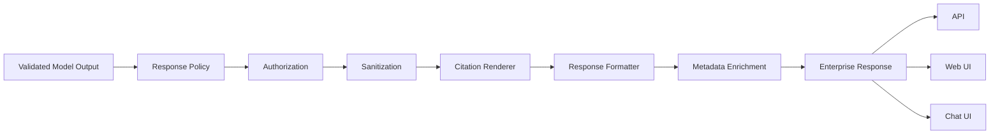

---

# 🧠 7. Response Contract

A production response should have a predictable contract.

Example:

```json
{
  "answer": "string",
  "citations": [],
  "warnings": [],
  "confidence": 0.0,
  "status": "COMPLETED"
}
```

This allows downstream systems to consume the response consistently.

---

# 🧩 8. Enterprise Response Schema

```python
from pydantic import BaseModel, Field


class Citation(BaseModel):

    id: int

    title: str

    section: str | None = None

    page: int | None = None


class EnterpriseResponse(BaseModel):

    answer: str

    citations: list[Citation]

    warnings: list[str]

    confidence: float = Field(
        ge=0,
        le=1
    )

    status: str
```

---

# 🧠 9. Response Status

Useful response states include:

```text
COMPLETED
PARTIAL
ABSTAINED
REQUIRES_CLARIFICATION
FAILED
BLOCKED
```

Example:

```json
{
  "status": "PARTIAL"
}
```

indicates that the system could answer only part of the request.

---

# 🧠 10. Response Status vs HTTP Status

These are different concepts.

HTTP:

```text
200
400
401
403
500
```

Application response:

```text
COMPLETED
PARTIAL
ABSTAINED
```

A successful HTTP request may still contain:

```text
ABSTAINED
```

because the AI system intentionally could not provide a reliable answer.

---

# 🧩 11. Response Envelope

A useful enterprise API pattern:

```json
{
  "request_id": "REQ-1042",
  "status": "COMPLETED",
  "response": {
    "answer": "The payment service uses PostgreSQL.",
    "citations": [
      {
        "id": 1,
        "title": "Payment Architecture"
      }
    ]
  },
  "metadata": {
    "model": "enterprise-model",
    "timestamp": "2026-08-11T10:30:00Z"
  }
}
```

---

# 🧠 12. Response Envelope Architecture

```text
Enterprise Response
│
├── Request Metadata
│
├── Status
│
├── Answer
│
├── Citations
│
├── Warnings
│
├── Confidence
│
├── Actions
│
└── Response Metadata
```

---

# 🧠 13. Request Metadata

Useful internal metadata:

```text
Request ID
Conversation ID
Tenant ID
User Context
Timestamp
Model
Prompt Version
Retrieval Strategy
```

Not all metadata should be exposed to users.

---

# 🔐 14. Tenant-Aware Responses

Enterprise applications may support multiple tenants.

```text
Tenant A
    ↓
Tenant A Knowledge
    ↓
Tenant A Response
```

The response layer must prevent:

```text
Tenant A
   ↓
Tenant B Data
```

from appearing in the final response.

---

# 🧠 15. Role-Aware Responses

Different users may need different levels of information.

Example:

```text
Employee
Manager
Administrator
Auditor
Customer
```

The underlying answer may be similar, but:

```text
Visible Sources
Visible Metadata
Available Actions
```

can differ.

---

# 🧩 16. Role-Aware Response Flow

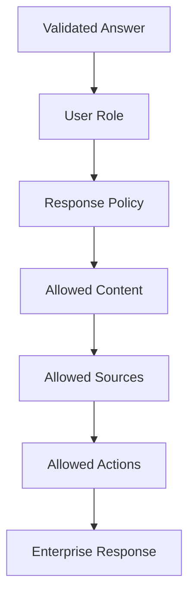

---

# 🧠 17. Audience-Aware Responses

The same information may need different presentation.

### Developer

```text
PaymentService.processPayment()
uses PostgreSQL and publishes
PaymentProcessedEvent through Kafka.
```

### Executive

```text
The payment platform uses PostgreSQL
and Kafka to support transaction processing.
```

### Customer

```text
Your payment was processed successfully.
```

Enterprise response engineering should therefore be audience-aware.

---

# 🧠 18. Response Profiles

Define reusable profiles:

```text
DEVELOPER
EXECUTIVE
CUSTOMER
OPERATIONS
LEGAL
COMPLIANCE
ANALYST
ADMINISTRATOR
```

Example:

```yaml
response_profile:
  name: executive

  verbosity: concise

  citations:
    enabled: true

  technical_details:
    enabled: false

  metadata:
    enabled: false
```

---

# 🧠 19. Response Policy

A response policy defines:

```text
What can be shown?
How much?
To whom?
In what format?
With which citations?
With which warnings?
```

Example:

```python
@dataclass
class ResponsePolicy:

    show_citations: bool

    show_source_metadata: bool

    show_confidence: bool

    allow_partial_answers: bool

    allow_abstention: bool

    max_length: int
```

---

# 🧠 20. Response Sanitization

Before returning a response:

```text
Validated Response
       ↓
Sanitization
       ↓
Final Response
```

Sanitization may remove:

```text
Secrets
PII
Internal IDs
System Prompts
Debug Information
Private URLs
```

---

# 🧩 21. Sanitization Pipeline

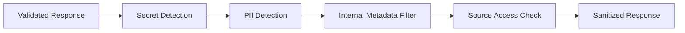

---

# 🧠 22. Secret Detection

Potential secrets:

```text
API Keys
Access Tokens
Passwords
Private Keys
Connection Strings
Cloud Credentials
```

Example:

```python
SECRET_PATTERNS = [
    r"AKIA[0-9A-Z]{16}",
    r"Bearer\s+[A-Za-z0-9._-]+"
]
```

The actual patterns should be adapted to the organization's security standards.

---

# 🧠 23. PII Detection

Potential PII:

```text
Email Addresses
Phone Numbers
Addresses
Government IDs
Customer IDs
Financial Data
```

The system may:

```text
Redact
Mask
Reject
```

depending on policy.

---

# 🧩 24. Redaction

Example:

```text
Original:

Customer email:
mihir@example.com
```

Sanitized:

```text
Customer email:
[REDACTED]
```

Or:

```text
m***@example.com
```

depending on the application's requirements.

---

# 🧠 25. Redaction Policy

```yaml
redaction:
  email:
    action: mask

  phone:
    action: mask

  api_key:
    action: reject

  password:
    action: reject

  internal_path:
    action: remove
```

---

# 🧠 26. Response Normalization

Normalization converts different model outputs into a consistent structure.

```text
Model A
   ↓
Text

Model B
   ↓
JSON

Model C
   ↓
Structured Object

        ↓

Enterprise Response Model
```

This is important in multi-model systems.

---

# 🧩 27. Response Normalizer

```python
class ResponseNormalizer:

    def normalize(
        self,
        model_response
    ):

        return EnterpriseResponse(
            answer=extract_answer(
                model_response
            ),
            citations=extract_citations(
                model_response
            ),
            warnings=[],
            confidence=extract_confidence(
                model_response
            ),
            status="COMPLETED"
        )
```

---

# 🧠 28. Provider-Agnostic Response Model

A production architecture should avoid exposing provider-specific response formats to business logic.

```text
OpenAI Response
      │
Azure Model Response
      │
AWS Model Response
      │
Hugging Face Response
      │
      ▼
Response Adapter
      │
      ▼
Enterprise Response Model
```

---

# 🧩 29. Provider Adapter Architecture

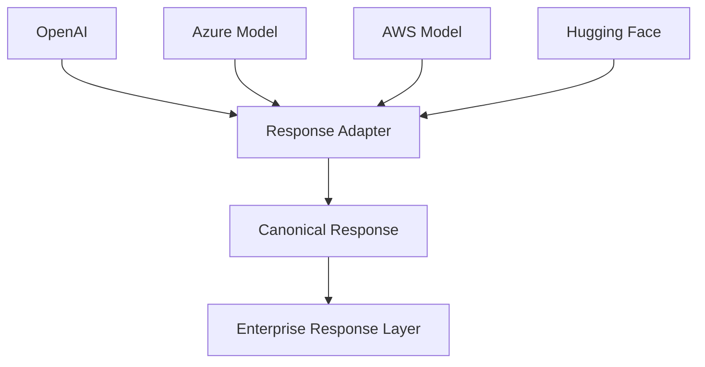

---

# 🧠 30. Canonical Response Model

```python
@dataclass
class CanonicalResponse:

    text: str

    claims: list

    citations: list

    confidence: float | None

    finish_reason: str | None

    model: str

    usage: dict
```

This gives the application a consistent internal representation.

---

# 🧠 31. Enterprise Response vs Canonical Response

### Canonical Response

Internal model-independent representation.

### Enterprise Response

User/application-facing representation.

```text
Provider Response
       ↓
Canonical Response
       ↓
Validation
       ↓
Enterprise Response
```

---

# 🧠 32. Response Formatting

Formatting should be separated from generation.

The same validated answer can be rendered as:

```text
Markdown
JSON
HTML
Plain Text
UI Components
```

---

# 🧩 33. Response Renderer

```python
class ResponseRenderer:

    def render(
        self,
        response,
        format
    ):

        if format == "json":
            return self.render_json(
                response
            )

        if format == "markdown":
            return self.render_markdown(
                response
            )

        return self.render_text(
            response
        )
```

---

# 🧠 34. Markdown Response

```markdown
## Answer

The payment service uses PostgreSQL.

### Sources

- Payment Architecture — Database Architecture
```

---

# 🧠 35. JSON Response

```json
{
  "answer": "The payment service uses PostgreSQL.",
  "citations": [
    {
      "id": 1,
      "title": "Payment Architecture",
      "section": "Database Architecture"
    }
  ]
}
```

---

# 🧠 36. UI Response

A frontend may render:

```text
┌─────────────────────────────────────┐
│ Answer                              │
│                                     │
│ The payment service uses PostgreSQL.│
│                                     │
│ Sources                             │
│ [1] Payment Architecture            │
│     Database Architecture           │
└─────────────────────────────────────┘
```

The backend should provide structured data rather than hard-code UI rendering.

---

# 🧠 37. Response Sections

A standard enterprise response can use:

```text
Answer
Evidence
Sources
Warnings
Confidence
Recommended Actions
```

Example:

```text
Answer
  ↓
Sources
  ↓
Warnings
  ↓
Actions
```

Not every response needs every section.

---

# 🧠 38. Concise vs Detailed Response

Response length should depend on:

```text
User Request
User Role
Query Complexity
Response Policy
Application
```

Example:

```text
Simple Question
→ Short Answer
```

versus:

```text
Architecture Analysis
→ Detailed Explanation + Sources
```

---

# 🧠 39. Response Verbosity Policy

```yaml
verbosity:
  level: concise

  simple_question:
    max_words: 150

  complex_analysis:
    max_words: 1200
```

Values are illustrative.

---

# 🧠 40. Answer First Principle

For enterprise assistants:

```text
Direct Answer
      ↓
Supporting Explanation
      ↓
Sources
```

is often more useful than:

```text
Long Explanation
      ↓
Answer
```

---

# 🧩 41. Enterprise Response Template

```text
## Answer

{{answer}}

## Sources

{{citations}}

## Notes

{{warnings}}
```

For simple answers:

```text
{{answer}} [1]
```

may be enough.

---

# 🧠 42. Confidence Presentation

Confidence should not always be shown as:

```text
Confidence: 0.94
```

Users may interpret numeric confidence incorrectly.

Possible alternatives:

```text
High confidence
Moderate confidence
Limited evidence
```

or:

```text
Well supported by available sources.
```

---

# 🧠 43. Confidence Policy

```yaml
confidence:
  0.90:
    label: high

  0.70:
    label: moderate

  0.00:
    label: low
```

Thresholds should be calibrated using actual evaluation data.

---

# 🧠 44. Evidence-Based Confidence

Confidence should consider:

```text
Grounding
Citation Quality
Source Authority
Source Agreement
Coverage
Freshness
```

Not merely:

```text
LLM-generated confidence
```

---

# 🧠 45. Uncertainty Handling

A good enterprise response distinguishes:

```text
Known
Likely
Uncertain
Unknown
```

Example:

```text
Known:
The incident started at 14:35.

Uncertain:
The deployment may have contributed to the issue.

Unknown:
The exact financial impact is not available.
```

---

# 🧩 46. Uncertainty-Aware Response

```text
## Answer

The incident began at approximately 14:35 [1].

The available evidence indicates that deployment
v4.3 may have contributed to the incident [2].

The available sources do not provide a reliable
financial-impact figure.
```

This is preferable to false certainty.

---

# 🧠 47. Partial Responses

A query can contain multiple requirements:

```text
Root Cause
Impact
Remediation
```

Evidence may support:

```text
Root Cause
Remediation
```

but not:

```text
Impact
```

The enterprise response should clearly identify the gap.

---

# 🧩 48. Partial Response Example

```text
## Answer

The outage was caused by certificate expiration [1].
Automated certificate rotation was introduced as the
remediation [2].

The available evidence does not provide a reliable
customer-impact figure.
```

---

# 🧠 49. Abstention

A mature AI system should be able to refuse to fabricate information.

```text
"I don't have sufficient reliable evidence
to answer that question."
```

This is a valid enterprise response state.

---

# 🧠 50. Abstention Reasons

Possible reasons:

```text
NO_EVIDENCE
INSUFFICIENT_EVIDENCE
CONFLICTING_EVIDENCE
UNAUTHORIZED_INFORMATION
POLICY_BLOCKED
LOW_CONFIDENCE
VALIDATION_FAILURE
```

---

# 🧩 51. Abstention Response

```json
{
  "status": "ABSTAINED",
  "answer": "I could not find sufficient reliable evidence to answer this question.",
  "citations": [],
  "warnings": [
    "Available sources did not provide sufficient evidence."
  ]
}
```

---

# 🧠 52. Clarification Responses

Sometimes the query itself is ambiguous.

Example:

```text
"What's the current architecture?"
```

Could mean:

```text
Application Architecture
Cloud Architecture
Data Architecture
Security Architecture
```

The system may respond:

```text
Could you clarify whether you mean the application,
cloud, data, or security architecture?
```

---

# 🧠 53. Clarification State

```text
REQUIRES_CLARIFICATION
```

Example:

```json
{
  "status": "REQUIRES_CLARIFICATION",
  "answer": "Do you mean the application or cloud architecture?"
}
```

---

# 🧠 54. Conflict Responses

When evidence conflicts:

```text
The current approved architecture identifies
PostgreSQL as the production database [1].

An older deployment document references MySQL [2].

The discrepancy appears to be version-related.
```

This provides transparency.

---

# 🧠 55. Enterprise Response and Citations

Citations should be integrated into the final response rather than added as an afterthought.

```text
Answer
  │
  ├── Claim → Citation
  ├── Claim → Citation
  └── Claim → Citation
```

---

# 🧠 56. Enterprise Response and Validation

The final response should only be constructed after:

```text
Schema Validation
Grounding Validation
Citation Validation
Security Validation
Policy Validation
Completeness Validation
```

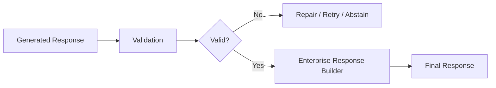

---

# 🧠 57. Response Builder

```python
class EnterpriseResponseBuilder:

    def build(
        self,
        validated_response,
        citations,
        policy
    ):

        response = {
            "answer": validated_response.answer,
            "citations": self.render_citations(
                citations,
                policy
            ),
            "warnings": validated_response.warnings,
            "status": validated_response.status
        }

        return self.sanitize(
            response,
            policy
        )
```

---

# 🧠 58. Response Policy Engine

The policy engine can determine:

```text
Allowed Fields
Allowed Sources
Allowed Actions
Allowed Metadata
Allowed Response Length
Allowed Citations
```

Example:

```python
class ResponsePolicyEngine:

    def evaluate(
        self,
        user,
        response
    ):

        return {
            "show_sources": True,
            "show_confidence": False,
            "allow_actions": False
        }
```

---

# 🧠 59. Policy-Driven Response

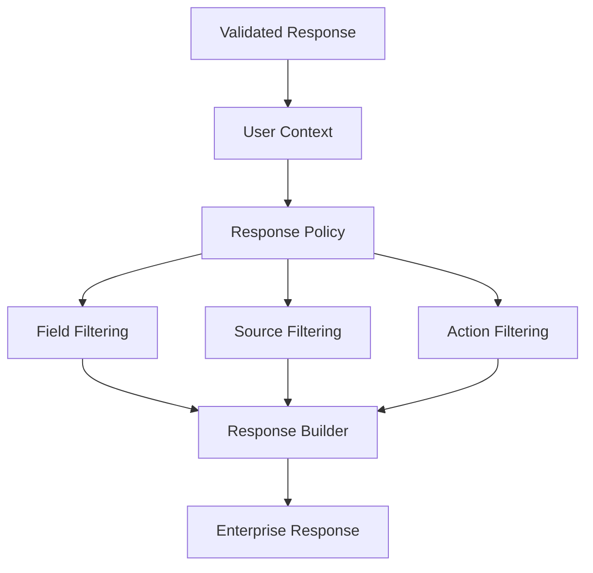

---

# 🔐 60. Authorization Boundary

Authorization should be applied to:

```text
Evidence
Sources
Metadata
Response
Actions
```

Not just retrieval.

```text
Retrieval Authorization
+
Response Authorization
```

provides defense in depth.

---

# 🧠 61. Response Data Classification

Enterprise responses can classify content:

```text
PUBLIC
INTERNAL
CONFIDENTIAL
RESTRICTED
```

Example:

```json
{
  "classification": "INTERNAL"
}
```

The classification itself may be internal-only metadata.

---

# 🧠 62. Data Classification Policy

```yaml
classification:
  public:
    allowed_roles:
      - customer
      - employee

  internal:
    allowed_roles:
      - employee
      - manager

  confidential:
    allowed_roles:
      - manager
      - administrator
```

The actual policy must come from the enterprise's security model.

---

# 🧠 63. Response Redaction Pipeline

```text
Generated Answer
      ↓
Validation
      ↓
Authorization
      ↓
PII Detection
      ↓
Secret Detection
      ↓
Policy Filter
      ↓
Redaction
      ↓
Enterprise Response
```

---

# 🧠 64. Redaction vs Rejection

### Redaction

Use when:

```text
The answer remains useful without the sensitive value.
```

Example:

```text
Customer email:
[REDACTED]
```

### Rejection

Use when:

```text
The entire answer is unsafe.
```

Example:

```text
Unauthorized confidential information.
```

---

# 🧠 65. Enterprise Response Metadata

Useful metadata:

```text
Request ID
Response ID
Timestamp
Model
Prompt Version
Retrieval Strategy
Source Count
Citation Count
Validation Status
Latency
Token Usage
```

Keep operational metadata separate from user-visible content.

---

# 🧩 66. Response Metadata Model

```python
@dataclass
class ResponseMetadata:

    request_id: str

    response_id: str

    model: str

    prompt_version: str

    retrieval_strategy: str

    source_count: int

    citation_count: int

    latency_ms: int

    input_tokens: int

    output_tokens: int
```

---

# 🧠 67. Response Lineage

The final response should ideally be traceable to:

```text
Request
 ↓
Query
 ↓
Retrieval
 ↓
Evidence
 ↓
Context
 ↓
Prompt
 ↓
Model
 ↓
Claims
 ↓
Citations
 ↓
Validation
 ↓
Response
```

---

# 🧠 68. Response ID

Every production response should have a traceable identifier.

Example:

```text
REQ-1042
RESP-9F31
```

This allows support and engineering teams to investigate issues.

---

# 🧠 69. Distributed Tracing

A production AI system may use:

```text
trace_id
span_id
request_id
```

Example:

```text
Trace:
TRC-1042

Spans:

retrieval
context-selection
prompt-assembly
generation
validation
citation
response
```

---

# 🧩 70. Response Observability

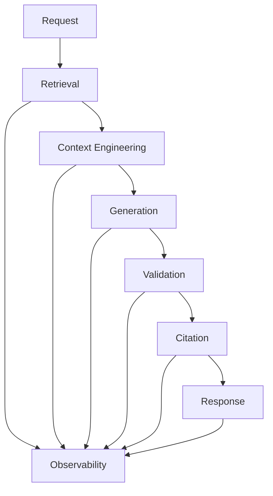

---

# 🧠 71. Response Logging

Log enough information to debug:

```text
Request ID
Response ID
Status
Validation Result
Citation Count
Source IDs
Latency
Model
Prompt Version
```

Avoid logging:

```text
Passwords
Tokens
Sensitive PII
Confidential Content
```

unless explicitly permitted and securely controlled.

---

# 🧠 72. Response Metrics

Track:

```text
Response Success Rate
Partial Response Rate
Abstention Rate
Clarification Rate
Validation Failure Rate
Redaction Rate
Citation Coverage
Grounding Score
Response Latency
Response Cost
```

---

# 🧠 73. Response Latency

End-to-end latency:

```text
Retrieval
+
Context Engineering
+
Generation
+
Validation
+
Citation
+
Response Transformation
```

The enterprise response layer should not become an unnecessary bottleneck.

---

# 🧠 74. Response Cost

Total cost includes:

```text
Embedding Cost
+
Retrieval Cost
+
Reranking Cost
+
Generation Cost
+
Validation Cost
+
Repair Cost
+
Storage / Observability Cost
```

Response engineering must fit within the overall cost budget.

---

# 🧠 75. Response Caching

Some enterprise applications can cache:

```text
Validated Responses
Source Metadata
Formatting
```

But caching should consider:

```text
User
Tenant
Authorization
Data Freshness
Query
Policy
```

---

# 🔐 76. Authorization-Aware Caching

Never use:

```text
Global Response Cache
```

for sensitive enterprise information without appropriate isolation.

Instead:

```text
Tenant
+
User / Role
+
Query
+
Policy
```

should influence cache eligibility.

---

# 🧠 77. Response Versioning

Enterprise applications evolve.

Track:

```text
Response Schema Version
Prompt Version
Policy Version
Citation Renderer Version
```

Example:

```json
{
  "schema_version": "1.2",
  "policy_version": "3.1"
}
```

---

# 🧠 78. Backward Compatibility

API consumers may depend on response fields.

Therefore:

```text
Schema Evolution
```

should be managed deliberately.

Possible strategy:

```text
v1
v2
```

with compatibility guarantees.

---

# 🧩 79. Versioned Response Contract

```yaml
response:
  schema_version: "1.2"

  fields:
    answer:
      required: true

    citations:
      required: true

    warnings:
      required: false
```

---

# 🧠 80. Response Error Model

A production API should return structured errors.

```json
{
  "status": "FAILED",
  "error": {
    "code": "RAG_VALIDATION_FAILED",
    "message": "The generated response could not be validated."
  }
}
```

Avoid exposing internal stack traces.

---

# 🧠 81. Error Categories

Useful error codes:

```text
RAG_NO_EVIDENCE
RAG_VALIDATION_FAILED
RAG_CITATION_FAILED
RAG_POLICY_BLOCKED
RAG_UNAUTHORIZED
RAG_TIMEOUT
RAG_MODEL_FAILURE
RAG_CONTEXT_LIMIT
RAG_RESPONSE_INVALID
```

---

# 🧩 82. Error Handling Flow

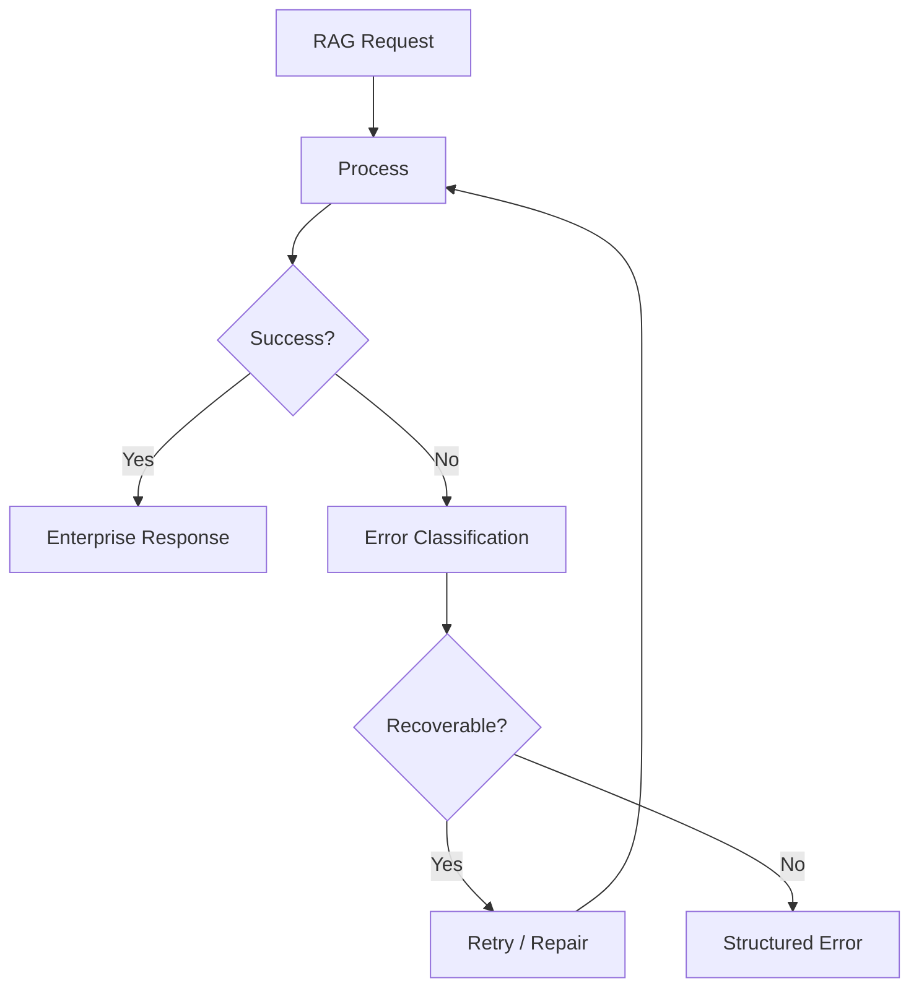

---

# 🧠 83. User-Friendly Errors

Internal:

```text
RAG_VALIDATION_FAILED:
Grounding score below threshold 0.72.
```

User-facing:

```text
I couldn't generate a sufficiently reliable
answer from the available sources.
```

Do not expose unnecessary internal implementation details.

---

# 🧠 84. Actionable Responses

Enterprise assistants may provide actions:

```text
Create Ticket
Open Document
Run Query
Escalate
Schedule Review
Generate Report
```

Actions should be treated as structured output rather than uncontrolled model instructions.

---

# 🧩 85. Action Model

```python
@dataclass
class ResponseAction:

    action_id: str

    action_type: str

    label: str

    parameters: dict

    requires_confirmation: bool
```

---

# 🔐 86. Action Authorization

Never allow the model to directly execute arbitrary actions.

```text
LLM
 ↓
Proposed Action
 ↓
Validation
 ↓
Authorization
 ↓
Confirmation
 ↓
Execution
```

---

# 🧠 87. Action-Aware Response

```json
{
  "answer": "The incident remains unresolved.",
  "actions": [
    {
      "id": "create-ticket",
      "label": "Create Incident Ticket",
      "requires_confirmation": true
    }
  ]
}
```

---

# 🧠 88. Enterprise Response for Support Systems

Example:

```text
## Issue

Payment failures increased after deployment v4.3.

## Likely Cause

Certificate expiration [1].

## Recommended Action

Verify certificate rotation configuration.

## Sources

[1] Incident Report — INC-1042
```

This is more operationally useful than a plain answer.

---

# 🧠 89. Enterprise Response for Executives

```text
## Summary

A payment outage occurred due to certificate expiration [1].

## Impact

Approximately 12,430 transactions were affected [2].

## Remediation

Automated certificate rotation was introduced [3].
```

The same evidence can support a different response profile.

---

# 🧠 90. Enterprise Response for Developers

```text
## Root Cause

Certificate expiration caused authentication failures [1].

## Affected Component

Payment Service

## Remediation

Automated certificate rotation was implemented [2].

## Technical References

- PaymentService
- CertificateManager
- Authentication Service
```

---

# 🧠 91. Enterprise Response for Customers

```text
We experienced a temporary payment-processing issue
and have applied a fix.

Your payment can be retried safely.
```

Only information authorized for customers should be included.

---

# 🧠 92. Response Personalization

Personalization can influence:

```text
Tone
Verbosity
Language
Formatting
Technical Depth
Available Actions
```

But personalization should not override:

```text
Grounding
Security
Authorization
Policy
```

---

# 🧠 93. Language-Aware Response

A response service can support:

```text
English
German
French
Spanish
Hindi
```

The response should preserve:

```text
Numbers
Dates
Citations
Source Names
Technical Identifiers
```

during translation.

---

# 🧠 94. Translation Safety

Do not translate technical identifiers incorrectly.

Example:

```text
PaymentService
POST /payments
INC-1042
PostgreSQL
```

These should remain stable.

---

# 🧠 95. Response Localization

Localization may include:

```text
Date Format
Number Format
Currency
Language
Timezone
```

Example:

```text
10,000 TPS
```

should not become an ambiguous localized representation.

---

# 🧠 96. Response Formatting and Markdown

For knowledge assistants, Markdown can provide:

```text
Headings
Lists
Tables
Code Blocks
Links
Citations
```

The formatter should ensure the generated content does not break the application's UI.

---

# 🧠 97. Markdown Sanitization

Potential issues:

```text
Malformed Links
Unsafe HTML
Embedded Scripts
Unexpected Iframes
```

A production UI should sanitize rendered Markdown.

---

# 🧠 98. HTML Safety

Never blindly render model-generated HTML.

Use:

```text
Sanitization
Allowlist
Content Security Policy
```

where appropriate.

---

# 🧠 99. Structured Tables

For structured comparisons:

```text
| Service | Database | Messaging |
|---|---|---|
| Payment | PostgreSQL | Kafka |
```

The backend can return structured data rather than forcing the model to construct arbitrary HTML.

---

# 🧠 100. Response Transformation

A useful pipeline:

```text
Canonical Response
       ↓
Validation
       ↓
Policy
       ↓
Sanitization
       ↓
Transformation
       ↓
Rendering
       ↓
Enterprise Response
```

---

# 🧩 101. Response Transformer

```python
class ResponseTransformer:

    def transform(
        self,
        response,
        policy
    ):

        response = self.filter_fields(
            response,
            policy
        )

        response = self.redact(
            response,
            policy
        )

        response = self.normalize(
            response
        )

        return response
```

---

# 🧠 102. Response Builder Architecture

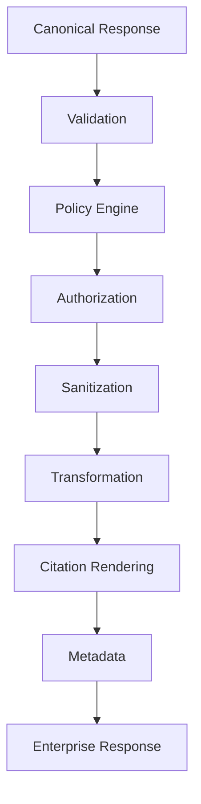

---

# 🧠 103. Enterprise Response Service

```python
class EnterpriseResponseService:

    def build(
        self,
        canonical_response,
        user_context,
        policy
    ):

        self.validate(
            canonical_response
        )

        authorized = self.authorize(
            canonical_response,
            user_context
        )

        sanitized = self.sanitize(
            authorized
        )

        transformed = self.transform(
            sanitized,
            policy
        )

        return self.render(
            transformed,
            policy
        )
```

---

# 🧠 104. Response Service Responsibilities

The service should coordinate:

```text
Validation
Authorization
Sanitization
Transformation
Citation Rendering
Policy
Metadata
```

It should not own:

```text
Retrieval
Embedding
Vector Search
Model Training
```

Those belong to other layers.

---

# 🏗️ 105. Layered Architecture

```text
┌────────────────────────────────────────┐
│          Presentation Layer            │
├────────────────────────────────────────┤
│       Enterprise Response Layer        │
├────────────────────────────────────────┤
│       Validation / Citation Layer      │
├────────────────────────────────────────┤
│        Context Engineering Layer       │
├────────────────────────────────────────┤
│          Retrieval Layer               │
├────────────────────────────────────────┤
│       Knowledge / Data Layer            │
└────────────────────────────────────────┘
```

This separation improves maintainability.

---

# 🧠 106. Response Layer in Hexagonal Architecture

For a backend service:

```text
             ┌─────────────────────┐
             │     REST / API      │
             └──────────┬──────────┘
                        │
                        ▼
             ┌─────────────────────┐
             │ Response Use Case   │
             └──────────┬──────────┘
                        │
                        ▼
             ┌─────────────────────┐
             │ Enterprise Response │
             │     Service         │
             └──────────┬──────────┘
                        │
         ┌──────────────┼──────────────┐
         ▼              ▼              ▼
     Validator       Citation       Policy
       Port            Port           Port
```

---

# 🧠 107. Capability-Based Interfaces

A production architecture can expose capabilities:

```java
public interface ResponseValidator {

    ValidationResult validate(
        CanonicalResponse response
    );
}
```

```java
public interface CitationProvider {

    List<Citation> resolve(
        List<Claim> claims
    );
}
```

```java
public interface ResponsePolicy {

    ResponsePolicyDecision evaluate(
        UserContext user,
        CanonicalResponse response
    );
}
```

---

# 🧠 108. Response Adapter

Cloud or model-specific components should remain outside the core response domain.

```text
AWS Model Adapter
Azure Model Adapter
OpenAI Adapter
Hugging Face Adapter
        ↓
Canonical Response
        ↓
Enterprise Response Core
```

This preserves provider independence.

---

# 🧠 109. Enterprise Response and Multi-Model Systems

Different models may produce:

```text
Different JSON
Different Metadata
Different Finish Reasons
Different Citation Formats
Different Tool Outputs
```

Normalize them before enterprise response construction.

```text
Provider Output
      ↓
Provider Adapter
      ↓
Canonical Response
      ↓
Enterprise Response
```

---

# 🧠 110. Response Contract Testing

Every model/provider should be tested against the canonical response contract.

```text
Model A
   ↓
Contract Test

Model B
   ↓
Contract Test

Model C
   ↓
Contract Test
```

This prevents provider-specific behavior from leaking into application logic.

---

# 🧪 111. Enterprise Response Test Matrix

| Scenario | Expected |
|---|---|
| Valid grounded answer | Completed |
| Partial evidence | Partial |
| No evidence | Abstained |
| Ambiguous query | Clarification |
| Unauthorized source | Blocked |
| PII detected | Redacted / Blocked |
| Secret detected | Blocked |
| Invalid citation | Repair / Reject |
| Conflicting sources | Warning / Clarification |
| Model timeout | Failed / Retry |
| Schema failure | Repair / Retry |
| Business rule failure | Reject |

---

# 🧪 112. Response Regression Testing

Test after changes to:

```text
Prompt
Model
Retriever
Context Engineering
Citation Service
Validation
Response Policy
Formatter
```

Measure:

```text
Response Accuracy
Groundedness
Citation Accuracy
Security
Latency
Cost
```

---

# 🧠 113. Golden Responses

A golden dataset can contain:

```text
Input Query
Expected Response State
Expected Claims
Expected Sources
Expected Warnings
Expected Actions
```

Example:

```json
{
  "query": "What database does the payment service use?",
  "expected_status": "COMPLETED",
  "expected_sources": ["S1"]
}
```

---

# 🧠 114. Response Quality Evaluation

Evaluate:

```text
Correctness
Groundedness
Completeness
Citation Accuracy
Source Quality
Clarity
Conciseness
Policy Compliance
```

---

# 🧠 115. Response Quality vs Model Quality

A high-quality model does not guarantee a high-quality enterprise response.

```text
Model Quality
      +
Retrieval Quality
      +
Context Quality
      +
Validation Quality
      +
Response Engineering
      =
Enterprise AI Quality
```

---

# 🧠 116. Enterprise Response Failure Modes

Common failures:

```text
Raw Model Output Exposed
Missing Citations
Incorrect Citations
Unauthorized Information
PII Leakage
Secret Leakage
Internal Metadata Leakage
Poor Formatting
False Confidence
No Abstention
Incomplete Answer
Unclear Errors
Inconsistent API Contract
Provider-Specific Output
Uncontrolled Actions
```

---

# 🚨 117. Failure: Raw Model Output

```text
LLM
 ↓
User
```

Problem:

```text
No validation
No policy
No citation
No security
```

Solution:

```text
Enterprise Response Layer
```

---

# 🚨 118. Failure: False Confidence

Bad:

```text
Confidence: 99%
```

when evidence is weak.

Solution:

```text
Evidence-Based Confidence
+
Calibrated Thresholds
```

---

# 🚨 119. Failure: Internal Metadata Leakage

Bad:

```text
Source:
s3://prod-sensitive-bucket/finance/internal/...
```

Solution:

```text
User-Friendly Source Metadata
```

---

# 🚨 120. Failure: Unauthorized Action

Bad:

```text
LLM:
Delete the customer account.
```

Solution:

```text
Proposed Action
 ↓
Authorization
 ↓
Confirmation
 ↓
Execution
```

---

# 🧠 121. Response Actions as a Security Boundary

Treat actions as more sensitive than informational responses.

```text
Informational Answer
      ↓
Validation
      ↓
Return

Action
      ↓
Validation
      ↓
Authorization
      ↓
Confirmation
      ↓
Execution
```

---

# 🧠 122. Response Observability

Track:

```text
Request ID
Response ID
Status
Model
Prompt Version
Validation Result
Citation Count
Source Count
Policy Decision
Redactions
Latency
Tokens
Cost
```

---

# 📊 123. Enterprise Response Dashboard

```text
┌─────────────────────────────────────────┐
│       ENTERPRISE RESPONSE HEALTH        │
├─────────────────────────────────────────┤
│ Completed Responses        96.2%         │
│ Partial Responses           1.8%         │
│ Abstentions                 1.1%         │
│ Clarifications              0.6%         │
│ Policy Blocks               0.2%         │
│ Validation Failures         0.1%         │
│ Citation Coverage          97.4%         │
│ Avg Latency                1.8 sec       │
└─────────────────────────────────────────┘
```

Values are illustrative only.

---

# 🧠 124. Response SLOs

Possible enterprise SLOs:

```text
99% schema-valid responses
99% citation-valid responses
99.9% authorization safety
< 2 sec p95 response latency
< 1% unexpected abstention
```

Actual targets must reflect the application's requirements.

---

# 🧠 125. Response Reliability

Reliability is more than uptime.

A useful mental model:

```text
Reliable AI Response
=
Correct
+
Grounded
+
Authorized
+
Cited
+
Consistent
+
Available
```

---

# 🧠 126. Response Governance

Enterprise response policies should be governed like other production policies.

Track:

```text
Policy Version
Owner
Effective Date
Change History
Approval
Deployment Status
```

---

# 🧠 127. Response Policy Versioning

```json
{
  "policy_version": "3.2",
  "effective_date": "2026-08-01",
  "approved_by": "AI Governance"
}
```

Internal governance metadata should not necessarily be exposed to users.

---

# 🧠 128. Auditability

For regulated systems, the response pipeline should preserve:

```text
Question
Evidence
Prompt
Model
Response
Citations
Validation
Policy Decision
Final Response
```

This creates an auditable AI interaction.

---

# 🧩 129. Audit Trail

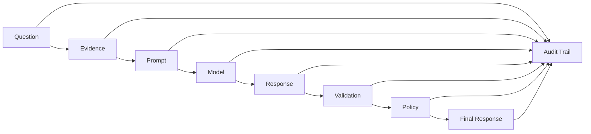

---

# 🧠 130. Enterprise Response Architecture

```text
                         USER
                           │
                           ▼
                  ┌─────────────────┐
                  │   AI GATEWAY    │
                  └────────┬────────┘
                           │
                           ▼
                  ┌─────────────────┐
                  │ RAG ORCHESTRATOR│
                  └────────┬────────┘
                           │
                           ▼
                     RETRIEVAL
                           │
                           ▼
                CONTEXT ENGINEERING
                           │
                           ▼
                  PROMPT ASSEMBLY
                           │
                           ▼
                    FOUNDATION MODEL
                           │
                           ▼
                   RESPONSE VALIDATION
                           │
                           ▼
                 CITATION ATTRIBUTION
                           │
                           ▼
                  ┌──────────────────┐
                  │ RESPONSE POLICY  │
                  └────────┬─────────┘
                           │
                           ▼
                     AUTHORIZATION
                           │
                           ▼
                     SANITIZATION
                           │
                           ▼
                 RESPONSE TRANSFORMER
                           │
                           ▼
                  ENTERPRISE RESPONSE
                           │
              ┌────────────┼────────────┐
              ▼            ▼            ▼
             API           UI          CHAT
```

---

# 🧠 131. Enterprise Response Service Example

```python
class EnterpriseResponseService:

    def __init__(
        self,
        validator,
        citation_service,
        policy_engine,
        sanitizer,
        renderer
    ):

        self.validator = validator
        self.citation_service = citation_service
        self.policy_engine = policy_engine
        self.sanitizer = sanitizer
        self.renderer = renderer

    def build(
        self,
        canonical_response,
        user_context
    ):

        validation = self.validator.validate(
            canonical_response
        )

        if not validation.accepted:
            return self.handle_failure(
                validation
            )

        citations = (
            self.citation_service.resolve(
                canonical_response.claims
            )
        )

        policy = self.policy_engine.evaluate(
            user_context,
            canonical_response
        )

        authorized = self.apply_policy(
            canonical_response,
            citations,
            policy
        )

        sanitized = self.sanitizer.sanitize(
            authorized
        )

        return self.renderer.render(
            sanitized,
            policy
        )
```

---

# 🧠 132. Enterprise Response Decision Tree

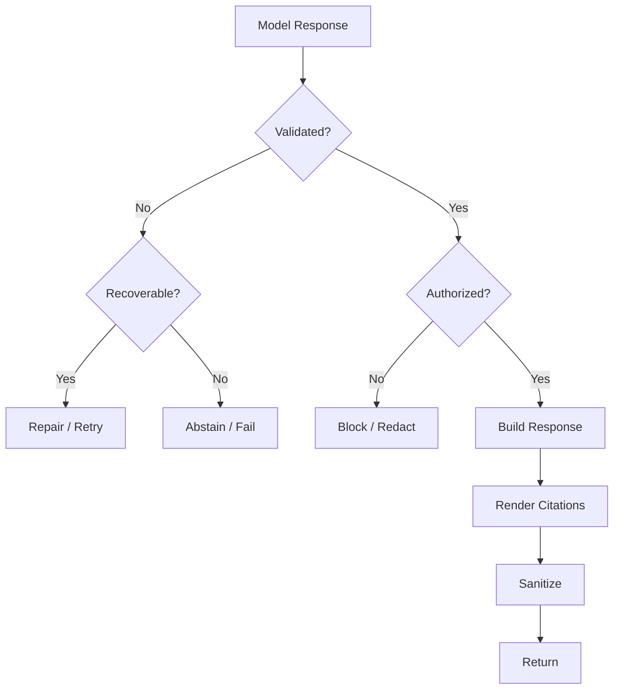

---

# 🧠 133. Enterprise Response Patterns

## Pattern 1 — Direct Answer

```text
Answer + Citation
```

Best for:

```text
Simple factual queries
```

---

## Pattern 2 — Answer + Evidence

```text
Answer
+
Supporting Evidence
+
Sources
```

Best for:

```text
Research
Analysis
Architecture
```

---

## Pattern 3 — Answer + Warning

```text
Answer
+
Warning
+
Source
```

Best for:

```text
Conflicting or incomplete evidence
```

---

## Pattern 4 — Partial Answer

```text
Known
+
Unknown
```

Best for:

```text
Incomplete evidence
```

---

## Pattern 5 — Clarification

```text
Ambiguity
+
Question
```

Best for:

```text
Underspecified queries
```

---

## Pattern 6 — Abstention

```text
Insufficient Evidence
```

Best for:

```text
High-risk unsupported questions
```

---

# 🧠 134. Enterprise Response Selection

```text
Query
 ↓
Evidence
 ↓
Validation
 ↓
Policy
 ↓
Response State

              ┌───────────────┐
              │               │
              ▼               ▼
          Sufficient       Insufficient
          Evidence         Evidence
              │               │
              ▼               ▼
          Complete         Partial
              │               │
              ▼               ▼
          Answer           Abstain
```

---

# 🧠 135. Response State Machine

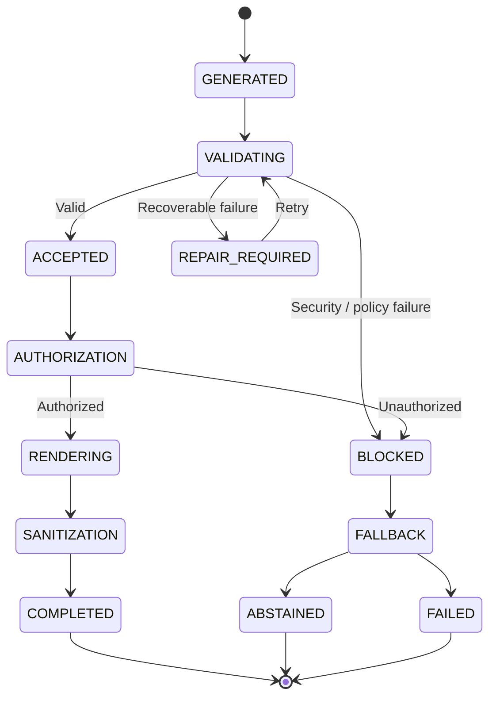

---

# 🧠 136. Production Design Principles

### Principle 1 — Separate Model Output From Enterprise Response

```text
LLM Output
≠
Final Response
```

---

### Principle 2 — Use a Canonical Internal Model

Provider-specific output should be normalized before entering business logic.

---

### Principle 3 — Make the Response Contract Explicit

Downstream systems should know what to expect.

---

### Principle 4 — Validate Before Rendering

Never format an unvalidated answer as a trusted enterprise response.

---

### Principle 5 — Preserve Provenance

Citations and source metadata should survive all transformations.

---

### Principle 6 — Apply Authorization at the Final Boundary

Even grounded information may be unauthorized.

---

### Principle 7 — Sanitize Before Returning

Never expose secrets, PII, or internal implementation details unintentionally.

---

### Principle 8 — Support Abstention

A reliable AI system knows when it does not know.

---

### Principle 9 — Distinguish Partial Answers From Complete Answers

Do not hide missing evidence.

---

### Principle 10 — Make Response Policies Configurable

Different applications and users require different response profiles.

---

### Principle 11 — Keep Actions Separate From Information

Actions require stronger validation and authorization.

---

### Principle 12 — Make the Response Observable

Track enough lineage to explain how the response was produced.

---

### Principle 13 — Keep User Experience Separate From Core AI Logic

The same enterprise response should be renderable through:

```text
API
Web
Chat
Mobile
CLI
```

---

# 📋 137. Production Checklist

```text
☐ Define canonical response model
☐ Define enterprise response schema
☐ Define response status values
☐ Define response policy
☐ Define response profiles

☐ Normalize provider responses
☐ Validate response schema
☐ Validate grounding
☐ Validate citations
☐ Validate completeness
☐ Validate consistency

☐ Validate authorization
☐ Validate tenant isolation
☐ Detect PII
☐ Detect secrets
☐ Sanitize internal metadata
☐ Sanitize source links

☐ Implement citation rendering
☐ Implement source attribution
☐ Preserve provenance
☐ Preserve source versions
☐ Preserve source locations

☐ Implement confidence handling
☐ Implement uncertainty handling
☐ Implement partial responses
☐ Implement abstention
☐ Implement clarification

☐ Implement response formatting
☐ Implement Markdown rendering
☐ Implement JSON rendering
☐ Implement UI-friendly structures

☐ Implement structured errors
☐ Implement retry
☐ Implement repair
☐ Implement fallback

☐ Implement action validation
☐ Implement action authorization
☐ Implement confirmation for sensitive actions

☐ Implement request IDs
☐ Implement response IDs
☐ Implement tracing
☐ Implement audit logging

☐ Track latency
☐ Track token usage
☐ Track response cost
☐ Track validation failures
☐ Track citation coverage
☐ Track abstention rate

☐ Create golden datasets
☐ Create adversarial tests
☐ Create regression tests
☐ Test provider compatibility
☐ Test policy changes
☐ Test schema evolution
```

---

# 🧪 138. Practical Project

Build an **Enterprise Response Gateway**.

### Input

```text
Canonical Model Response
+
Validation Result
+
Citations
+
User Context
+
Response Policy
```

### Processing

```text
Validation
    ↓
Authorization
    ↓
Policy Evaluation
    ↓
Sanitization
    ↓
Citation Rendering
    ↓
Response Transformation
    ↓
Metadata
```

### Output

```json
{
  "request_id": "REQ-1042",
  "status": "COMPLETED",
  "response": {
    "answer": "The payment service uses PostgreSQL.",
    "citations": [
      {
        "id": 1,
        "title": "Payment Architecture",
        "section": "Database Architecture"
      }
    ],
    "warnings": []
  }
}
```

---

# 🧪 139. Advanced Exercise

Extend the gateway to support:

```text
☐ Multiple model providers
☐ Multiple response profiles
☐ Role-aware responses
☐ Tenant-aware responses
☐ Citation rendering
☐ Source authorization
☐ PII redaction
☐ Secret detection
☐ Confidence policies
☐ Abstention
☐ Partial answers
☐ Clarification
☐ Structured actions
☐ Action authorization
☐ Audit trail
☐ Response versioning
☐ API versioning
☐ Response observability
```

---

# 🧠 140. Example End-to-End Response

### Query

```text
What caused the payment outage?
```

### Evidence

```text
[S1]
Incident Report

The outage was caused by certificate expiration.
```

### Validated Claim

```text
The payment outage was caused by certificate expiration.
```

### Enterprise Response

```text
## Answer

The payment outage was caused by certificate expiration. [1]

## Source

[1] Incident Report
    Section: Root Cause
```

Internal metadata:

```json
{
  "request_id": "REQ-1042",
  "response_id": "RESP-9F31",
  "validation": "PASSED",
  "grounding": 0.97,
  "citation_accuracy": 1.0
}
```

The internal metadata does not need to be exposed to the user.

---

# 🧠 141. Example Partial Response

```text
## Answer

The outage was caused by certificate expiration [1].

The available evidence does not provide a reliable
financial-impact figure.

## Source

[1] Incident Report — Root Cause
```

Status:

```text
PARTIAL
```

---

# 🧠 142. Example Abstention

```text
## Answer

I couldn't find sufficient reliable evidence to
determine the financial impact of the incident.

The available sources contain operational details
but do not provide a verified financial-impact figure.
```

Status:

```text
ABSTAINED
```

---

# 🧠 143. Example Clarification

```text
Your question could refer to the application,
cloud, data, or security architecture.

Which architecture would you like me to analyze?
```

Status:

```text
REQUIRES_CLARIFICATION
```

---

# 🧠 144. Example Conflicting Evidence

```text
## Answer

The current approved architecture identifies
PostgreSQL as the production database [1].

An older deployment document references MySQL [2].
The difference appears to be related to an earlier
architecture version.
```

Status:

```text
COMPLETED_WITH_WARNING
```

---

# 🧠 145. Enterprise Response Contract Example

```json
{
  "request_id": "REQ-1042",
  "response_id": "RESP-9F31",
  "status": "COMPLETED",

  "response": {
    "answer": "The payment service uses PostgreSQL.",
    "citations": [
      {
        "id": 1,
        "title": "Payment Architecture",
        "section": "Database Architecture",
        "page": 18
      }
    ],
    "warnings": [],
    "actions": []
  },

  "metadata": {
    "schema_version": "1.2",
    "model": "enterprise-model"
  }
}
```

---

# 🧠 146. Final Production Flow

```text
                        USER
                         │
                         ▼
                    USER QUERY
                         │
                         ▼
                    RETRIEVAL
                         │
                         ▼
               CONTEXT ENGINEERING
                         │
                         ▼
                 PROMPT ASSEMBLY
                         │
                         ▼
                 FOUNDATION MODEL
                         │
                         ▼
                  RAW RESPONSE
                         │
                         ▼
              RESPONSE VALIDATION
                         │
                         ▼
             CITATION & ATTRIBUTION
                         │
                         ▼
                RESPONSE POLICY
                         │
                         ▼
                 AUTHORIZATION
                         │
                         ▼
                  SANITIZATION
                         │
                         ▼
                 RESPONSE BUILDER
                         │
                         ▼
                 RESPONSE RENDERER
                         │
          ┌──────────────┼──────────────┐
          ▼              ▼              ▼
         JSON          MARKDOWN         UI
          │              │              │
          └──────────────┼──────────────┘
                         ▼
                       USER
```

---

# 📚 147. Key Takeaways

- An enterprise response is more than raw LLM output.
- The response layer is the final application-facing boundary of a RAG system.
- Model output should be normalized into a canonical response representation.
- Enterprise responses should follow explicit response contracts.
- Response status should distinguish completed, partial, abstained, clarification, blocked, and failed states.
- HTTP success does not necessarily mean AI success.
- Response policies should control what users can see and how it is presented.
- Authorization should be enforced at the final response boundary.
- Tenant isolation must be preserved through response construction.
- Citations should be rendered from validated source metadata.
- Source attribution should respect authorization.
- PII and secrets should be detected and sanitized before responses are returned.
- Internal implementation metadata should not accidentally leak to users.
- Confidence should be evidence-based and calibrated.
- Uncertainty should be communicated explicitly.
- Partial answers are preferable to fabricated complete answers.
- Abstention is a valid production response state.
- Ambiguous questions may require clarification rather than guessing.
- Conflicting evidence should be surfaced when it cannot be safely resolved.
- Response formatting should be separated from AI reasoning.
- Provider-specific model responses should be normalized before entering application logic.
- Structured actions require stronger validation and authorization than informational responses.
- Response metadata enables observability and auditing.
- Response IDs and trace IDs make production troubleshooting possible.
- Response schemas should be versioned.
- Error responses should be structured and user-safe.
- Response caching must respect authorization, tenant, freshness, and policy boundaries.
- Enterprise response quality should be evaluated independently from raw model quality.
- A production response should be **grounded, authorized, cited, sanitized, policy-compliant, observable, and application-ready**.

---

# 🧠 Final Mental Model

```text
                    ┌──────────────────────┐
                    │      USER QUERY      │
                    └──────────┬───────────┘
                               │
                               ▼
                    ┌──────────────────────┐
                    │      RETRIEVAL       │
                    └──────────┬───────────┘
                               │
                               ▼
                    ┌──────────────────────┐
                    │ CONTEXT ENGINEERING  │
                    └──────────┬───────────┘
                               │
                               ▼
                    ┌──────────────────────┐
                    │   PROMPT ASSEMBLY    │
                    └──────────┬───────────┘
                               │
                               ▼
                    ┌──────────────────────┐
                    │   FOUNDATION MODEL   │
                    └──────────┬───────────┘
                               │
                               ▼
                    ┌──────────────────────┐
                    │ RESPONSE VALIDATION  │
                    └──────────┬───────────┘
                               │
                               ▼
                    ┌──────────────────────┐
                    │ CITATION / PROVENANCE│
                    └──────────┬───────────┘
                               │
                               ▼
                    ┌──────────────────────┐
                    │    POLICY ENGINE     │
                    └──────────┬───────────┘
                               │
                               ▼
                    ┌──────────────────────┐
                    │    AUTHORIZATION     │
                    └──────────┬───────────┘
                               │
                               ▼
                    ┌──────────────────────┐
                    │     SANITIZATION     │
                    └──────────┬───────────┘
                               │
                               ▼
                    ┌──────────────────────┐
                    │  RESPONSE BUILDER    │
                    └──────────┬───────────┘
                               │
                     ┌─────────┼─────────┐
                     ▼         ▼         ▼
                   JSON    Markdown      UI
                     │         │         │
                     └─────────┼─────────┘
                               ▼
                    ┌──────────────────────┐
                    │   ENTERPRISE USER    │
                    └──────────────────────┘
```

The key architectural distinction is:

```text
LLM
 ↓
"Generated Content"

Response Validation
 ↓
"Is it trustworthy?"

Citation & Attribution
 ↓
"Can we prove where it came from?"

Enterprise Response
 ↓
"Can this safely and usefully be delivered
to this particular user?"
```

Therefore:

> **Enterprise Response Engineering transforms validated AI output into a secure, authorized, cited, policy-compliant, observable, and application-ready enterprise response.**

---

# 🧭 Chapter Navigation

### Part V — Advanced Retrieval-Augmented Generation

**Previous:**  
[04. Citation and Source Attribution](04-citation-and-source-attribution.md)

**Next:**  
[06. RAG Evaluation and Benchmarking](06-rag-evaluation-and-benchmarking.md)

**Section:**  
06 — Production RAG Engineering

### Production RAG Engineering Path

```text
01 Prompt Assembly
        ↓
02 Context Selection & Context Engineering
        ↓
03 Response Validation
        ↓
04 Citation & Source Attribution
        ↓
05 Enterprise Response
        ↓
06 RAG Evaluation & Benchmarking
        ↓
07 RAG Observability
        ↓
08 RAG Performance Optimization
        ↓
09 RAG Cost Optimization
        ↓
10 Production Retrieval Architecture
        ↓
11 Building Production RAG Systems
```

---

> **Enterprise AI Engineering Handbook**  
> *Building Production-Grade Enterprise AI Systems — One Chapter at a Time.*