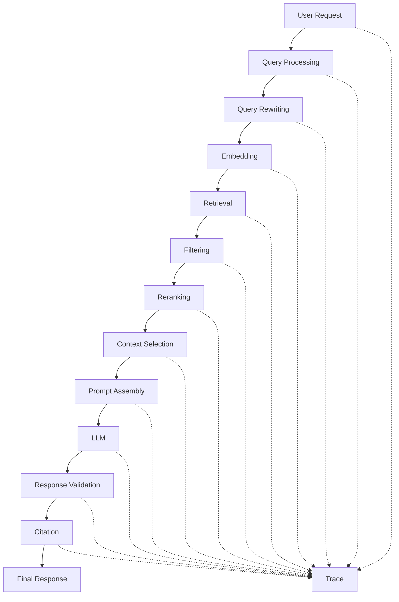
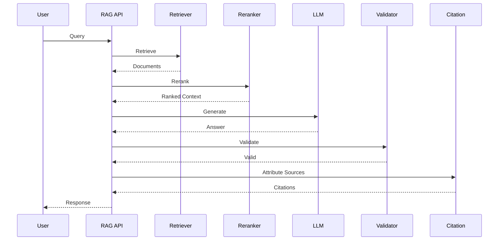
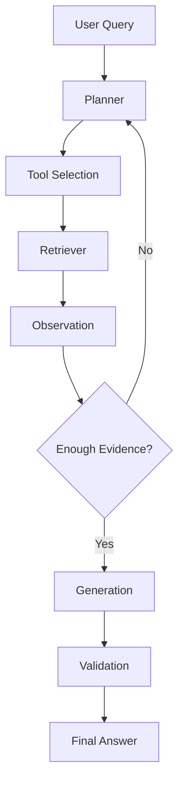
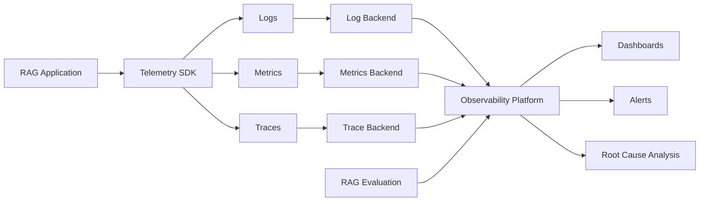
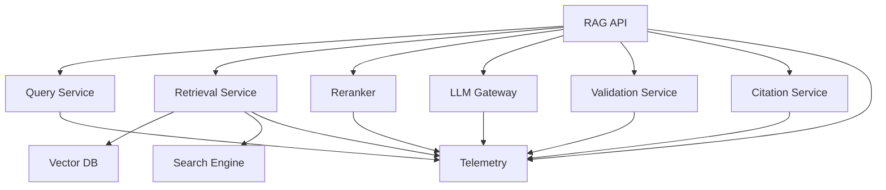
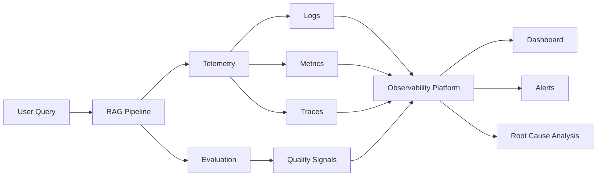
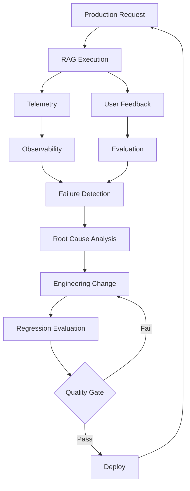

# 07. RAG Observability

> **Category:** Production RAG Engineering  
> **Module:** Part V — Advanced Retrieval-Augmented Generation  
> **Difficulty:** Advanced

---

## 📖 Overview

A production RAG system is not observable simply because application logs exist.

Enterprise RAG introduces a multi-stage execution pipeline:

```text
User Query
    ↓
Query Processing
    ↓
Query Rewriting
    ↓
Embedding
    ↓
Retrieval
    ↓
Filtering
    ↓
Reranking
    ↓
Context Selection
    ↓
Prompt Assembly
    ↓
LLM Generation
    ↓
Response Validation
    ↓
Citation
    ↓
Enterprise Response
```

When a user receives a poor answer, engineers need to determine:

```text
Was the query rewritten incorrectly?

Did embedding fail?

Did retrieval return the wrong documents?

Did metadata filtering remove valid evidence?

Did reranking select poor results?

Was useful context discarded?

Was the prompt assembled incorrectly?

Did the LLM hallucinate?

Did response validation fail?

Were citations incorrect?

Was the request slow because of retrieval or generation?

Why did token usage increase?

Why did cost increase?
```

Traditional application logs are often insufficient to answer these questions.

Production RAG therefore requires **end-to-end observability across the complete retrieval, reasoning, generation, and response pipeline**.

The objective is not simply to collect more logs.

The objective is to create a system where every important RAG decision can be:

```text
Observed
    ↓
Traced
    ↓
Measured
    ↓
Correlated
    ↓
Debugged
    ↓
Optimized
```

> **Production RAG observability connects system execution with answer quality, performance, cost, security, and user experience.**

---

# 🎯 Learning Objectives

After completing this chapter, you will be able to:

- Understand observability in RAG systems
- Understand RAG observability vs traditional application observability
- Design end-to-end RAG traces
- Design RAG spans
- Trace retrieval pipelines
- Trace reranking
- Trace query rewriting
- Trace context selection
- Trace prompt assembly
- Trace LLM calls
- Trace response validation
- Trace citation generation
- Capture token usage
- Monitor latency
- Monitor throughput
- Monitor errors
- Monitor retries
- Monitor fallbacks
- Monitor retrieval quality signals
- Monitor context quality signals
- Monitor generation quality signals
- Monitor citation quality signals
- Monitor cost
- Implement structured logging
- Implement distributed tracing
- Design RAG-specific metrics
- Design RAG dashboards
- Build production alerts
- Perform trace-based debugging
- Correlate quality with infrastructure metrics
- Detect RAG regressions
- Detect retrieval failures
- Detect model failures
- Detect prompt failures
- Detect cost anomalies
- Detect latency regressions
- Implement tenant-aware observability
- Design privacy-aware observability
- Build enterprise-grade RAG observability architecture

---

# 🧠 1. What Is RAG Observability?

RAG observability is the ability to understand:

```text
What happened?
Why did it happen?
Where did it happen?
How long did it take?
How much did it cost?
What evidence was used?
What answer was generated?
Was the answer trustworthy?
```

A useful model is:

```text
RAG Observability
       │
       ├── Logs
       ├── Metrics
       ├── Traces
       ├── Events
       ├── Quality Signals
       ├── Cost Signals
       └── Security Signals
```

---

# 🧠 2. Traditional Observability vs RAG Observability

Traditional backend observability often focuses on:

```text
CPU
Memory
Latency
HTTP Errors
Database Errors
Throughput
```

RAG requires those metrics plus AI-specific signals:

```text
Retrieved Documents
Retrieval Scores
Reranker Scores
Context Size
Prompt Size
LLM Tokens
Model
Temperature
Citations
Grounding
Faithfulness
Answer Quality
Cost
```

---

# 🧠 3. The Three Pillars

The classic observability model is:

```text
                 OBSERVABILITY
                      │
          ┌───────────┼───────────┐
          ▼           ▼           ▼
        LOGS       METRICS      TRACES
```

For RAG, extend this with:

```text
                 RAG OBSERVABILITY
                       │
       ┌───────────────┼────────────────┐
       ▼               ▼                ▼
     Logs            Metrics          Traces
       │               │                │
       └───────────────┼────────────────┘
                       ▼
                 AI QUALITY
                       │
          ┌────────────┼────────────┐
          ▼            ▼            ▼
      Retrieval     Generation    Citation
       Quality       Quality       Quality
```

---

# 🧠 4. Logs

Logs answer:

> What happened?

Example:

```text
INFO retrieval completed
query_id=Q123
top_k=10
results=10
latency_ms=82
```

Logs are useful for:

```text
Errors
Warnings
Important decisions
Audit events
Fallbacks
Security events
```

---

# 🧠 5. Metrics

Metrics answer:

> How often and how much?

Examples:

```text
RAG requests / second
p95 latency
retrieval failure rate
average top-K
average context tokens
LLM tokens
cost / request
citation coverage
```

Metrics are ideal for:

```text
Dashboards
Alerts
Capacity Planning
Trend Analysis
SLOs
```

---

# 🧠 6. Traces

Traces answer:

> What happened during this particular request?

Example:

```text
Trace
 │
 ├── Query Processing       12 ms
 ├── Embedding              25 ms
 ├── Vector Search          42 ms
 ├── BM25 Search            31 ms
 ├── Reranking              88 ms
 ├── Context Selection      14 ms
 ├── LLM                   920 ms
 ├── Validation             18 ms
 └── Citation               11 ms
```

---

# 🧠 7. Why Traces Matter

Suppose:

```text
Total Latency = 1.8 seconds
```

Without tracing:

```text
Why?
```

With tracing:

```text
Embedding       20 ms
Retrieval       60 ms
Reranking      140 ms
LLM           1450 ms
Validation      30 ms
```

The bottleneck becomes obvious.

---

# 🧠 8. End-to-End RAG Trace



---

# 🧠 9. Trace and Span

A trace represents the complete request.

A span represents one operation.

```text
Trace
│
├── Query Processing Span
├── Embedding Span
├── Retrieval Span
├── Reranking Span
├── Context Span
├── Prompt Span
├── LLM Span
├── Validation Span
└── Citation Span
```

---

# 🧠 10. Parent-Child Spans

```text
RAG Request
    │
    ├── Retrieval
    │     ├── Vector Search
    │     └── BM25 Search
    │
    ├── Reranking
    │
    ├── Generation
    │     └── LLM Call
    │
    └── Validation
```

This allows engineers to see both:

```text
High-Level Flow
+
Detailed Execution
```

---

# 🧠 11. RAG Trace Context

A trace should propagate through services:

```text
API Gateway
    ↓
RAG Service
    ↓
Retrieval Service
    ↓
Vector DB
    ↓
Reranker Service
    ↓
LLM Gateway
    ↓
Validation Service
```

The same trace context should be maintained where supported.

---

# 🧠 12. Trace ID

Every request should have a unique trace identifier.

```text
trace_id:
4c9d8c7e-91f1-4a87-a9f3-12c8a71f10e3
```

Use it to correlate:

```text
Logs
Metrics
Spans
Errors
Evaluation
User Feedback
```

---

# 🧠 13. Request ID vs Trace ID

They solve different problems.

```text
Request ID
    ↓
Identify an individual request

Trace ID
    ↓
Follow execution across services
```

A single user request may cross multiple microservices.

---

# 🧠 14. Correlation IDs

Useful identifiers include:

```text
trace_id
request_id
conversation_id
session_id
tenant_id
user_id
evaluation_id
experiment_id
```

Be careful with:

```text
PII
Sensitive User Data
Secrets
Authentication Tokens
```

These should not be blindly logged.

---

# 🧠 15. RAG Trace Data

A RAG trace can capture:

```json
{
  "trace_id": "abc-123",
  "request_id": "req-901",
  "model": "enterprise-llm",
  "retriever": "hybrid",
  "top_k": 10,
  "context_tokens": 4200,
  "input_tokens": 5100,
  "output_tokens": 340,
  "latency_ms": 1820
}
```

---

# 🧠 16. Query Processing Observability

Track:

```text
Original Query
Query Type
Query Length
Language
Query Rewrite
Number of Generated Queries
Classification
Routing Decision
```

Example:

```text
Original:
"What DB does payment use?"

Rewritten:
"payment service database technology"

Queries Generated:
3
```

---

# 🧠 17. Query Rewrite Observability

For advanced query rewriting:

```text
Original Query
      ↓
Rewritten Query
      ↓
Retriever
```

Capture:

```text
Rewrite Strategy
Rewrite Count
Rewrite Latency
Rewrite Tokens
Rewrite Model
```

---

# 🧠 18. Multi-Query Observability

Example:

```text
Original Query
      │
      ├── Query A
      ├── Query B
      └── Query C
```

Track:

```text
Generated Queries
Successful Queries
Duplicate Queries
Retrieval Results per Query
Final Merged Results
```

---

# 🧠 19. Embedding Observability

Track:

```text
Embedding Model
Embedding Dimensions
Batch Size
Latency
Request Count
Failure Rate
Token Usage
```

Example:

```text
Embedding Model:
text-embedding-model-v3

Dimensions:
1536

Latency:
24 ms
```

---

# 🧠 20. Retrieval Observability

Track:

```text
Retriever Type
Top-K
Returned Results
Search Latency
Search Score
Index
Collection
Filter
```

Example:

```text
Retriever:
Hybrid

Top-K:
20

Returned:
20

Latency:
72 ms
```

---

# 🧠 21. Retrieval Score Distribution

Scores can help detect retrieval problems.

```text
Score
1.0 ┤
0.8 ┤       ●
0.6 ┤    ●  ●  ●
0.4 ┤ ●  ●  ●  ●
0.2 ┤ ●  ●  ●  ●
    └────────────────
      1  2  3  4  5
          Rank
```

A sudden drop in score distribution may indicate:

```text
Query Drift
Embedding Problem
Index Problem
Corpus Change
```

---

# 🧠 22. Retrieval Score Observability

Track:

```text
Top-1 Score
Top-K Average Score
Score Variance
Minimum Score
Score Gap
```

Example:

```text
Top-1 = 0.91
Top-5 Avg = 0.78
Top-10 Avg = 0.61
```

These are diagnostic signals, not universal quality guarantees.

---

# 🧠 23. Retrieval Result Observability

Track:

```text
Document ID
Chunk ID
Score
Rank
Source
Metadata
Timestamp
Retriever
```

Example:

```json
{
  "document_id": "DOC-1024",
  "chunk_id": "C-17",
  "rank": 1,
  "score": 0.91,
  "source": "architecture-guide"
}
```

---

# 🧠 24. Metadata Filtering Observability

Track:

```text
Filter Applied
Filter Fields
Filter Values
Documents Before Filter
Documents After Filter
```

Example:

```text
Before Filter: 100
After Filter:  18
```

If this suddenly becomes:

```text
Before Filter: 100
After Filter:   0
```

it may indicate a filtering problem.

---

# 🧠 25. Tenant-Aware Retrieval Observability

For enterprise systems:

```text
Tenant A
   ↓
Tenant A Documents
```

must remain isolated.

Observe:

```text
tenant_id
filter_policy
collection
authorization decision
```

Never expose sensitive tenant data through unrestricted logs.

---

# 🧠 26. Reranking Observability

Track:

```text
Input Candidates
Output Candidates
Reranker Model
Reranker Latency
Score Distribution
Top-N
```

Example:

```text
Candidates:
50

After Reranking:
5

Latency:
94 ms
```

---

# 🧠 27. Reranking Score Changes

Useful diagnostic:

```text
Before:

D1 → 0.61
D2 → 0.83
D3 → 0.74

After:

D2 → 0.96
D3 → 0.88
D1 → 0.62
```

This can help diagnose ranking behavior.

---

# 🧠 28. Context Selection Observability

Track:

```text
Retrieved Chunks
Selected Chunks
Removed Chunks
Context Tokens
Compression Ratio
Context Ordering
```

Example:

```text
Retrieved:
20 chunks

Selected:
6 chunks

Context:
4,200 tokens
```

---

# 🧠 29. Context Compression Ratio

A useful operational signal:

```text
Compression Ratio
=
Selected Context Size
────────────────────
Original Context Size
```

Example:

```text
Original = 12,000 tokens
Selected = 4,000 tokens

Ratio = 33.3%
```

---

# 🧠 30. Prompt Observability

Track:

```text
Prompt Version
Prompt Template
System Prompt Version
Context Tokens
Instruction Tokens
Total Input Tokens
```

Avoid storing sensitive raw prompts unless required and appropriately protected.

---

# 🧠 31. Prompt Versioning

Example:

```text
prompt_version:
rag-enterprise-v12
```

When answer quality changes:

```text
Model unchanged
Retriever unchanged
Prompt changed
```

the prompt becomes a candidate cause.

---

# 🧠 32. LLM Observability

Track:

```text
Provider
Model
Model Version
Temperature
Max Tokens
Input Tokens
Output Tokens
Total Tokens
Latency
Time to First Token
Finish Reason
Errors
Retries
```

---

# 🧠 33. LLM Latency

Separate:

```text
Time to First Token
```

from:

```text
Total Generation Time
```

This helps distinguish:

```text
Startup Latency
+
Generation Throughput
```

---

# 🧠 34. Token Observability

Track:

```text
Query Tokens
Context Tokens
Prompt Tokens
Input Tokens
Output Tokens
Total Tokens
```

Example:

```text
Input:
5,200

Output:
380

Total:
5,580
```

---

# 🧠 35. Token Growth Detection

Monitor:

```text
Average Context Tokens
```

over time.

Example:

```text
Week 1 → 3,200
Week 2 → 4,100
Week 3 → 6,800
```

Possible causes:

```text
Top-K Increase
Chunk Size Increase
Context Selection Failure
Prompt Growth
Duplicate Retrieval
```

---

# 🧠 36. Cost Observability

Track:

```text
Embedding Cost
Retrieval Cost
Reranker Cost
LLM Input Cost
LLM Output Cost
Evaluation Cost
Infrastructure Cost
```

---

# 🧠 37. Cost Per Request

Example:

```text
Embedding       $0.0002
Reranking       $0.0015
LLM Input       $0.0120
LLM Output      $0.0030
Infrastructure  $0.0010
-----------------------
Total           $0.0177
```

---

# 🧠 38. Cost by Tenant

Enterprise systems may require:

```text
Tenant A → $120
Tenant B → $480
Tenant C → $75
```

This helps with:

```text
Chargeback
Cost Allocation
Optimization
Usage Governance
```

---

# 🧠 39. Cost by Model

```text
Model A
    ↓
$0.012 / request

Model B
    ↓
$0.028 / request
```

Compare:

```text
Quality
Latency
Cost
```

rather than cost alone.

---

# 🧠 40. RAG Error Observability

Classify failures:

```text
QUERY_ERROR
EMBEDDING_ERROR
RETRIEVAL_ERROR
FILTER_ERROR
RERANKING_ERROR
CONTEXT_ERROR
PROMPT_ERROR
LLM_ERROR
VALIDATION_ERROR
CITATION_ERROR
TIMEOUT
RATE_LIMIT
SECURITY_ERROR
```

---

# 🧠 41. Error Rate

Track:

```text
Failed Requests
────────────────
Total Requests
```

But also classify errors.

An overall:

```text
Error Rate = 1%
```

does not tell you whether the failures are:

```text
LLM Timeout
```

or:

```text
Authorization Failure
```

---

# 🧠 42. Retry Observability

Track:

```text
Retry Count
Retry Reason
Retry Latency
Retry Success
Retry Cost
```

Example:

```text
Attempt 1 → Timeout
Attempt 2 → Success
```

Retries can improve reliability but increase:

```text
Latency
Cost
Load
```

---

# 🧠 43. Fallback Observability

Example:

```text
Primary LLM
    ↓
Failure
    ↓
Fallback LLM
```

Track:

```text
Fallback Rate
Fallback Reason
Fallback Model
Fallback Latency
Fallback Quality
Fallback Cost
```

---

# 🧠 44. Circuit Breaker Observability

For external services:

```text
LLM
Vector DB
Reranker
Embedding Service
```

track:

```text
Circuit State
Open Count
Half-Open Attempts
Recovery Time
```

---

# 🧠 45. RAG SLOs

Production RAG can define SLOs such as:

```text
Availability >= 99.9%

p95 Latency <= 2 seconds

Error Rate <= 0.5%

Citation Accuracy >= 95%

Faithfulness >= 90%
```

Quality thresholds should be defined according to the application and risk level.

---

# 🧠 46. Quality SLOs

Unlike traditional services, RAG can have AI quality SLOs:

```text
Faithfulness
Citation Accuracy
Answer Relevance
Retrieval Recall
Abstention Accuracy
```

This creates:

```text
Reliability SLO
+
AI Quality SLO
```

---

# 🧠 47. Error Budget

Traditional:

```text
Availability Error Budget
```

RAG can also track:

```text
Quality Error Budget
```

Example:

```text
Target Faithfulness:
95%

Allowed degradation:
5%
```

---

# 🧠 48. RAG Health Score

A dashboard may combine:

```text
Availability
Latency
Retrieval
Grounding
Citation
Cost
```

into a health view.

However:

> Do not hide critical failures behind a single aggregate health score.

---

# 🧠 49. RAG Observability Dashboard

```text
┌─────────────────────────────────────────────┐
│              RAG OVERVIEW                  │
├─────────────────────────────────────────────┤
│ Requests/sec                  142           │
│ p95 Latency                  1.82s          │
│ Error Rate                   0.31%          │
│                                             │
│ Retrieval Recall              93.1%          │
│ Faithfulness                  95.7%          │
│ Citation Accuracy             97.2%         │
│                                             │
│ Avg Context Tokens            4,210         │
│ Avg Total Tokens              5,020         │
│ Cost / Request                $0.018        │
│                                             │
│ Fallback Rate                  0.8%          │
│ Abstention Rate                3.2%          │
└─────────────────────────────────────────────┘
```

Values are illustrative.

---

# 🧠 50. Retrieval Dashboard

```text
┌─────────────────────────────────────┐
│       RETRIEVAL OBSERVABILITY       │
├─────────────────────────────────────┤
│ Recall@5                 88.4%       │
│ Recall@10                94.1%       │
│ Hit Rate                 96.2%       │
│ MRR                      81.7%       │
│ NDCG@5                   79.8%       │
│                                     │
│ Avg Top-1 Score           0.91       │
│ Avg Top-K Score           0.74       │
│ Avg Results                10        │
│ Retrieval p95             96 ms      │
└─────────────────────────────────────┘
```

---

# 🧠 51. Generation Dashboard

```text
┌─────────────────────────────────────┐
│       GENERATION QUALITY            │
├─────────────────────────────────────┤
│ Faithfulness              95.7%     │
│ Answer Relevance          93.8%     │
│ Completeness              91.2%     │
│ Groundedness              96.1%     │
│ Citation Accuracy         97.2%     │
│ Citation Coverage         95.9%     │
└─────────────────────────────────────┘
```

---

# 🧠 52. Latency Dashboard

```text
Total p95 Latency
        │
        ├── Query Processing     20ms
        ├── Embedding            35ms
        ├── Retrieval            70ms
        ├── Reranking           120ms
        ├── Context              15ms
        ├── LLM               1,420ms
        ├── Validation            25ms
        └── Citation              12ms
```

---

# 🧠 53. Cost Dashboard

```text
Monthly Cost
│
├── LLM                  68%
├── Embeddings           12%
├── Reranking             8%
├── Vector DB             7%
└── Observability         5%
```

This helps prioritize optimization.

---

# 🧠 54. Trace Visualization

A production trace might look like:

```text
TRACE: 4c9d8c7e

0ms ───────────────────────────────────────── 1800ms

Query       ███
Embedding      ████
Retrieval          ███████
Reranking                ███████████
Context                          ███
Prompt                             ███
LLM                                  █████████████████
Validation                                             ██
Citation                                               ██
```

This quickly exposes latency bottlenecks.

---

# 🧠 55. Trace Waterfall



---

# 🧠 56. Span Attributes

A retrieval span may include:

```text
retriever.type
retriever.top_k
retriever.index
retriever.collection
retriever.filter
retriever.result_count
retriever.latency_ms
```

A generation span:

```text
llm.provider
llm.model
llm.temperature
llm.input_tokens
llm.output_tokens
llm.total_tokens
llm.latency_ms
llm.finish_reason
```

---

# 🧠 57. Span Events

Events can record important moments:

```text
query_rewritten
retrieval_completed
reranking_completed
context_compressed
llm_retry
validation_failed
citation_added
fallback_triggered
```

---

# 🧠 58. Structured Logging

Prefer structured logs:

```json
{
  "timestamp": "2026-08-11T10:15:30Z",
  "level": "INFO",
  "service": "rag-service",
  "trace_id": "abc123",
  "event": "retrieval_completed",
  "retriever": "hybrid",
  "top_k": 10,
  "result_count": 10,
  "latency_ms": 72
}
```

Structured logs are easier to query and aggregate.

---

# 🧠 59. Bad Logging

Avoid:

```text
INFO:
User asked something and retrieval happened
```

This is difficult to search or aggregate.

Prefer:

```text
event=retrieval_completed
trace_id=abc123
retriever=hybrid
top_k=10
latency_ms=72
```

---

# 🧠 60. Sensitive Data Logging

Never blindly log:

```text
Passwords
API Keys
Access Tokens
Secrets
Payment Data
Personal Data
Private Documents
```

RAG systems may process highly sensitive enterprise information.

---

# 🧠 61. Prompt Logging Strategy

Possible levels:

```text
Level 0
No prompt content

Level 1
Metadata only

Level 2
Redacted prompt

Level 3
Encrypted prompt storage

Level 4
Full prompt with strict access controls
```

Choose based on:

```text
Security
Compliance
Debugging Requirements
```

---

# 🧠 62. Document Logging Strategy

Avoid storing complete sensitive documents inside traces.

Instead capture:

```text
Document ID
Chunk ID
Source
Rank
Score
Metadata Hash
```

Example:

```json
{
  "document_id": "DOC-1024",
  "chunk_id": "C-17",
  "rank": 1,
  "score": 0.91
}
```

---

# 🧠 63. Trace Sampling

Tracing every request can be expensive.

Possible strategies:

```text
100% Errors
100% High-Latency Requests
100% Security Events
10% Normal Requests
1% Low-Value Requests
```

Actual sampling should depend on system requirements.

---

# 🧠 64. Tail-Based Sampling

Instead of deciding sampling before seeing the result:

```text
Request
   ↓
Trace
   ↓
Inspect Outcome
   ↓
Sample?
```

Keep traces with:

```text
High Latency
Errors
Poor Quality
Fallbacks
Security Events
```

---

# 🧠 65. Quality-Based Sampling

A powerful RAG-specific strategy:

```text
Low Quality
    ↓
Keep Trace

High Quality
    ↓
Lower Sampling Probability
```

Possible triggers:

```text
Low Retrieval Score
Low Groundedness
Low Citation Coverage
User Negative Feedback
Abstention
```

---

# 🧠 66. User Feedback Observability

Capture:

```text
Thumbs Up
Thumbs Down
Regenerate
Copy
Citation Click
Follow-Up Question
Escalation
```

User behavior can become an important quality signal.

---

# 🧠 67. Feedback Correlation

Correlate:

```text
User Feedback
      +
Trace
      +
Retrieval
      +
Generation
```

Example:

```text
Negative Feedback
      ↓
Trace ID
      ↓
Retrieval Recall Low
      ↓
Likely Retrieval Failure
```

---

# 🧠 68. Citation Click Observability

If citations are interactive:

```text
Citation Presented
      ↓
User Clicked?
      ↓
Source Opened?
```

Track:

```text
Citation Click Rate
Citation Source
Citation Position
```

This can help understand whether users trust and use citations.

---

# 🧠 69. Conversation Observability

For conversational RAG:

```text
Session
  │
  ├── Turn 1
  ├── Turn 2
  ├── Turn 3
  └── Turn 4
```

Track:

```text
Conversation Length
Context Growth
Memory Usage
Retrieval Changes
Follow-Up Queries
```

---

# 🧠 70. Conversation Context Growth

Long conversations can create:

```text
Token Growth
Latency Growth
Cost Growth
Context Noise
```

Monitor:

```text
Conversation Tokens
Memory Tokens
Retrieved Tokens
Total Prompt Tokens
```

---

# 🧠 71. Memory Observability

For memory-enabled RAG:

```text
Memory Read
Memory Write
Memory Retrieval
Memory Relevance
Memory Size
Memory Latency
```

---

# 🧠 72. Agentic RAG Observability

Agentic RAG requires additional tracing:

```text
Plan
 ↓
Tool Selection
 ↓
Tool Call
 ↓
Observation
 ↓
Replan
 ↓
Tool Call
 ↓
Final Answer
```

---

# 🧩 73. Agentic RAG Trace



Track:

```text
Planning Steps
Tool Calls
Retrieval Calls
Replanning
Loop Count
Token Usage
Latency
Cost
```

---

# 🧠 74. Graph RAG Observability

Track:

```text
Entities Retrieved
Relationships Retrieved
Graph Traversal Depth
Nodes Visited
Edges Visited
Subgraph Size
Graph Query Latency
```

Example:

```text
Start Entity:
PaymentService

Traversal:
3 hops

Nodes:
42

Edges:
57
```

---

# 🧠 75. SQL RAG Observability

Track:

```text
Generated SQL
Schema Selected
Tables
Columns
Execution Time
Rows Returned
Query Success
Validation Result
```

Do not expose sensitive SQL or data without appropriate controls.

---

# 🧠 76. SQL Safety Observability

Track whether generated SQL attempted:

```text
DROP
DELETE
UPDATE
INSERT
Unauthorized Tables
Cross-Tenant Access
```

Production SQL RAG should have explicit read/write policies.

---

# 🧠 77. Multimodal RAG Observability

Track:

```text
Image ID
Document ID
OCR
Vision Model
Image Embedding
Text Embedding
Cross-Modal Retrieval
Visual Context
```

---

# 🧠 78. Evaluation + Observability

These systems complement each other.

```text
Observability
    ↓
"What happened?"

Evaluation
    ↓
"Was it good?"
```

Together:

```text
Trace
  ↓
Failure
  ↓
Evaluation
  ↓
Root Cause
```

---

# 🧠 79. Quality-Trace Correlation

Suppose:

```text
Faithfulness ↓
```

Trace analysis may show:

```text
Top-1 Retrieval Score ↓
```

which may show:

```text
Embedding Model Changed
```

The chain becomes:

```text
Model Change
    ↓
Embedding Change
    ↓
Retrieval Degradation
    ↓
Context Degradation
    ↓
Faithfulness Degradation
```

This is the real value of RAG observability.

---

# 🧠 80. Root Cause Analysis

A production debugging workflow:

```text
User Complaint
      ↓
Find Trace
      ↓
Inspect Latency
      ↓
Inspect Retrieval
      ↓
Inspect Ranking
      ↓
Inspect Context
      ↓
Inspect Prompt
      ↓
Inspect LLM
      ↓
Inspect Validation
      ↓
Inspect Citation
```

---

# 🧠 81. Retrieval Failure Debugging

```text
Wrong Answer
     ↓
Trace
     ↓
Retrieved Documents
     ↓
Relevant Document Missing
     ↓
Retrieval Failure
```

Potential causes:

```text
Bad Embeddings
Wrong Chunking
Wrong Metadata Filter
Low Top-K
Poor Query Rewrite
Index Problem
```

---

# 🧠 82. Generation Failure Debugging

```text
Correct Evidence
      ↓
Correct Context
      ↓
Incorrect Answer
```

Possible causes:

```text
Prompt Problem
Model Problem
Context Ordering
Instruction Conflict
Context Overload
```

---

# 🧠 83. Citation Failure Debugging

```text
Correct Answer
      ↓
Wrong Citation
```

Potential causes:

```text
Citation Mapping
Claim Extraction
Source Tracking
Response Transformation
```

---

# 🧠 84. Latency Failure Debugging

```text
p95 Latency ↑
      ↓
Trace
      ↓
LLM Span = 1.5s
      ↓
Generation Bottleneck
```

or:

```text
Reranker Span = 900ms
```

The optimization target becomes obvious.

---

# 🧠 85. Cost Failure Debugging

```text
Cost ↑
  ↓
Token Usage ↑
  ↓
Context Tokens ↑
  ↓
Top-K ↑
```

Possible root cause:

```text
Retrieval Configuration Changed
```

---

# 🧠 86. Observability Data Model

A useful conceptual model:

```text
Trace
 │
 ├── Request
 │
 ├── Query
 │
 ├── Retrieval
 │     ├── Documents
 │     └── Scores
 │
 ├── Context
 │
 ├── Prompt
 │
 ├── LLM
 │
 ├── Validation
 │
 ├── Citation
 │
 ├── Metrics
 │
 └── Feedback
```

---

# 🧠 87. Event Model

Example:

```json
{
  "event": "reranking_completed",
  "trace_id": "abc123",
  "candidate_count": 50,
  "selected_count": 5,
  "latency_ms": 94
}
```

---

# 🧠 88. Metric Types

Use:

```text
Counter
Gauge
Histogram
Distribution
```

Examples:

### Counter

```text
rag_requests_total
```

### Gauge

```text
active_rag_requests
```

### Histogram

```text
rag_latency_seconds
```

### Distribution

```text
context_token_distribution
```

---

# 🧠 89. RAG Counters

Useful counters:

```text
rag_requests_total
rag_errors_total
retrieval_requests_total
retrieval_failures_total
llm_requests_total
llm_failures_total
fallbacks_total
validation_failures_total
citation_failures_total
```

---

# 🧠 90. RAG Histograms

Useful histograms:

```text
rag_latency
retrieval_latency
reranking_latency
llm_latency
context_tokens
input_tokens
output_tokens
cost_per_request
```

---

# 🧠 91. Prometheus-Style Metrics

Example:

```text
rag_requests_total{
  service="rag-api",
  environment="prod"
}
```

Latency:

```text
rag_request_duration_seconds{
  service="rag-api"
}
```

Retrieval:

```text
rag_retrieval_duration_seconds{
  retriever="hybrid"
}
```

---

# 🧠 92. Metric Cardinality

Be careful with labels.

Bad:

```text
user_id
query
document_id
conversation_id
```

as high-cardinality metric labels.

This can create huge metric stores.

Prefer:

```text
service
environment
model
retriever
region
```

and keep high-cardinality identifiers in traces/logs.

---

# 🧠 93. Logs vs Metrics vs Traces

| Data | Best For |
|---|---|
| Logs | Detailed events |
| Metrics | Trends and alerts |
| Traces | Request-level debugging |
| Evaluation | Quality measurement |
| Feedback | User experience |

---

# 🧠 94. Observability Architecture



---

# 🧠 95. OpenTelemetry Concept

An enterprise RAG architecture can use an open telemetry standard for:

```text
Traces
Metrics
Logs
```

The application instruments:

```text
API
Retriever
Vector DB
Reranker
LLM
Validation
Citation
```

and exports telemetry to the organization's observability platform.

---

# 🧠 96. Instrumentation Strategy

Instrument at these boundaries:

```text
HTTP
Database
Vector Store
Message Queue
LLM Provider
External APIs
```

and RAG-specific boundaries:

```text
Query
Retrieval
Reranking
Context
Generation
Validation
Citation
```

---

# 🧠 97. Custom RAG Spans

Examples:

```text
rag.query
rag.rewrite
rag.embedding
rag.retrieve
rag.rerank
rag.context
rag.prompt
rag.generate
rag.validate
rag.citation
```

These provide a consistent vocabulary.

---

# 🧠 98. Trace Naming

Good:

```text
rag.retrieve
rag.rerank
rag.generate
```

Avoid inconsistent names such as:

```text
search_docs
retrieveStuff
vectorSearch2
doRagSearch
```

A consistent naming convention improves observability across teams.

---

# 🧠 99. Production RAG Trace

```text
TRACE
│
├── rag.query
│     └── query classification
│
├── rag.rewrite
│     ├── query-1
│     ├── query-2
│     └── query-3
│
├── rag.embedding
│
├── rag.retrieve
│     ├── dense
│     └── sparse
│
├── rag.rerank
│
├── rag.context
│
├── rag.prompt
│
├── rag.generate
│
├── rag.validate
│
└── rag.citation
```

---

# 🧠 100. Distributed RAG

In a microservice architecture:

```text
Client
  ↓
API Gateway
  ↓
RAG Orchestrator
  ↓
Retrieval Service
  ↓
Vector Service
  ↓
Reranker
  ↓
LLM Gateway
  ↓
Validation Service
```

Trace context should propagate across the service boundaries.

---

# 🧠 101. Service Dependency Map



---

# 🧠 102. Dependency Observability

Monitor:

```text
Availability
Latency
Error Rate
Rate Limits
Retries
Circuit Breakers
```

for:

```text
Vector DB
Search Engine
Embedding Service
Reranker
LLM Provider
```

---

# 🧠 103. External LLM Provider Monitoring

Track:

```text
Provider
Model
Region
Request Count
Latency
Errors
Rate Limits
Token Usage
Cost
Fallbacks
```

---

# 🧠 104. Model Routing Observability

For multi-model RAG:

```text
Simple Query
   ↓
Small Model

Complex Query
   ↓
Large Model
```

Track:

```text
Routing Decision
Model Selected
Quality
Latency
Cost
Fallback
```

---

# 🧠 105. Multi-Model RAG

Example:

```text
Query Classifier
       │
       ├── Simple → Model A
       │
       ├── Complex → Model B
       │
       └── Multimodal → Model C
```

Observability must explain:

```text
Why was this model selected?
```

---

# 🧠 106. Router Observability

Track:

```text
Route
Reason
Confidence
Selected Model
Selected Retriever
Latency
Cost
```

---

# 🧠 107. Cache Observability

RAG systems often use:

```text
Embedding Cache
Retrieval Cache
LLM Response Cache
Prompt Cache
```

Track:

```text
Cache Hits
Cache Misses
Hit Rate
Saved Tokens
Saved Cost
Latency Reduction
```

---

# 🧠 108. Cache Hit Rate

```text
Cache Hits
──────────
Total Requests
```

Example:

```text
Cache Hits = 7,500
Requests   = 10,000

Hit Rate = 75%
```

---

# 🧠 109. Cache Correctness

A cache hit is useful only if the cached result remains valid.

Track:

```text
Cache Age
Source Version
Knowledge Version
Invalidations
Stale Responses
```

---

# 🧠 110. Knowledge Base Observability

RAG quality depends on the knowledge base.

Monitor:

```text
Documents
Chunks
Embeddings
Index Size
Ingestion Failures
Duplicate Documents
Stale Documents
Deleted Documents
```

---

# 🧠 111. Ingestion Observability

```text
Document
   ↓
Parsing
   ↓
Chunking
   ↓
Metadata
   ↓
Embedding
   ↓
Indexing
```

Track each stage.

---

# 🧠 112. Ingestion Trace

```text
DOC-1024

Parsing        120 ms
Chunking        20 ms
Embedding      240 ms
Indexing       110 ms

Total           490 ms
```

---

# 🧠 113. Data Freshness

Monitor:

```text
Document Updated
      ↓
Indexed
      ↓
Available for Retrieval
```

Measure:

```text
Freshness Lag
```

Example:

```text
Source Update:
10:00

Indexed:
10:03

Freshness Lag:
3 minutes
```

---

# 🧠 114. Stale Knowledge Detection

Track:

```text
Document Age
Index Age
Last Refresh
Last Successful Ingestion
```

This is particularly important for:

```text
Policies
Pricing
Configuration
Operational Runbooks
Compliance Documents
```

---

# 🧠 115. Knowledge Graph Observability

Track:

```text
Nodes
Edges
Entity Extraction
Relationship Extraction
Graph Updates
Graph Query Latency
Graph Traversal
```

---

# 🧠 116. Graph Update Monitoring

```text
Documents
    ↓
Entity Extraction
    ↓
Relationship Extraction
    ↓
Knowledge Graph
```

Failures at any stage can affect Graph RAG.

---

# 🧠 117. SQL RAG Observability

Monitor:

```text
Question
Schema Retrieval
SQL Generation
SQL Validation
SQL Execution
Result Size
Answer Generation
```

This creates a full SQL RAG trace.

---

# 🧠 118. Security Observability

Enterprise RAG must observe:

```text
Authorization Decisions
Tenant Filters
Access Denials
Prompt Injection Detection
Sensitive Data Detection
Policy Violations
```

---

# 🧠 119. Prompt Injection Events

Example:

```text
event:
prompt_injection_detected

trace_id:
abc123

source:
retrieved_document

action:
blocked
```

Security events should be highly visible.

---

# 🧠 120. Data Leakage Monitoring

Monitor whether responses expose:

```text
Unauthorized Documents
Secrets
PII
Credentials
Internal URLs
Private Business Data
```

---

# 🧠 121. Auditability

For regulated enterprise systems, maintain appropriate audit information:

```text
Who requested
When requested
What system version
What sources were used
What policies applied
What response was produced
```

Do not retain more sensitive content than necessary.

---

# 🧠 122. Observability Retention

Not every telemetry type needs the same retention.

Example:

```text
Metrics:
90 days

Traces:
30 days

Debug Logs:
7 days

Audit Events:
Longer according to policy
```

Retention should follow:

```text
Compliance
Security
Cost
Operational Requirements
```

---

# 🧠 123. Observability Cost

Observability itself can become expensive.

Costs include:

```text
Log Storage
Trace Storage
Metric Storage
LLM Evaluation
Dashboard Infrastructure
Data Transfer
```

Avoid logging everything blindly.

---

# 🧠 124. High-Value Telemetry

Prioritize:

```text
Errors
Slow Requests
Low-Quality Requests
Security Events
Fallbacks
Cost Anomalies
Retrieval Failures
```

---

# 🧠 125. Low-Value Telemetry

Avoid excessive:

```text
Duplicate Logs
Large Documents
Repeated Prompts
Repeated Context
High-Cardinality Metrics
```

---

# 🧠 126. Observability Governance

Define:

```text
What is logged?
What is traced?
What is sampled?
What is retained?
Who can access it?
How is it redacted?
```

---

# 🧠 127. PII Redaction

Before telemetry storage:

```text
User Input
   ↓
PII Detection
   ↓
Redaction
   ↓
Telemetry
```

Example:

```text
Email:
mihir@example.com

Stored:
[REDACTED_EMAIL]
```

Use an appropriate enterprise redaction mechanism.

---

# 🧠 128. Secrets Redaction

Never expose:

```text
API Keys
Bearer Tokens
Passwords
Private Keys
Connection Strings
```

in:

```text
Logs
Traces
Metrics
Evaluation Data
```

---

# 🧠 129. Access Control

Observability systems themselves contain sensitive information.

Use:

```text
RBAC
Least Privilege
Tenant Isolation
Audit Logs
Encryption
```

---

# 🧠 130. Enterprise Observability Architecture

```text
                        USERS
                          │
                          ▼
                   ┌─────────────┐
                   │  RAG API    │
                   └──────┬──────┘
                          │
                          ▼
                 ┌─────────────────┐
                 │ RAG ORCHESTRATOR│
                 └────────┬────────┘
                          │
       ┌──────────────────┼──────────────────┐
       ▼                  ▼                  ▼
   Retrieval           Reranking          LLM
       │                  │                  │
       └──────────────────┼──────────────────┘
                          ▼
                  Response Validation
                          │
                          ▼
                      Citation
                          │
                          ▼
                      RESPONSE

                          │
                          ▼
                 ┌─────────────────┐
                 │ TELEMETRY LAYER │
                 └────────┬────────┘
                          │
          ┌───────────────┼───────────────┐
          ▼               ▼               ▼
        Logs            Metrics         Traces
          │               │               │
          └───────────────┼───────────────┘
                          ▼
                ┌──────────────────┐
                │ OBSERVABILITY    │
                │ PLATFORM         │
                └────────┬─────────┘
                         │
          ┌──────────────┼──────────────┐
          ▼              ▼              ▼
      Dashboard        Alerts       Analytics
                         │
                         ▼
                   Root Cause
                         │
                         ▼
                  System Improvement
```

---

# 🧠 131. RAG Observability Data Flow



---

# 🧠 132. RAG Observability Golden Signals

Traditional services often monitor:

```text
Latency
Traffic
Errors
Saturation
```

RAG should extend this to:

```text
Latency
Traffic
Errors
Saturation

+

Retrieval Quality
Context Quality
Generation Quality
Citation Quality
Token Usage
Cost
```

---

# 🧠 133. RAG Golden Signals

```text
                 RAG GOLDEN SIGNALS
                         │
       ┌─────────────────┼─────────────────┐
       ▼                 ▼                 ▼
    System             AI Quality        Economics
       │                 │                 │
    Latency          Retrieval          Tokens
    Traffic          Grounding          Cost
    Errors           Citation           Model Usage
    Saturation       Relevance
                     Completeness
```

---

# 🧠 134. RAG Health Model

```text
System Health
      │
      ├── Availability
      ├── Latency
      ├── Errors
      ├── Retrieval
      ├── Generation
      ├── Grounding
      ├── Citation
      ├── Security
      └── Cost
```

---

# 🧠 135. Alerting

Alerts should be actionable.

Bad:

```text
RAG problem!
```

Good:

```text
ALERT:
RAG p95 latency exceeded SLO.

Current:
3.2 seconds

Target:
2.0 seconds

Primary contributor:
Reranker latency

Trace samples:
Available
```

---

# 🧠 136. Quality Alert

```text
ALERT:
Faithfulness degradation detected.

Current:
88.7%

Baseline:
95.1%

Change:
-6.4 percentage points

Potential correlation:
Embedding model changed 2 hours ago.
```

---

# 🧠 137. Cost Alert

```text
ALERT:
Average RAG cost increased by 42%.

Previous:
$0.018/request

Current:
$0.025/request

Primary signal:
Context tokens +61%
```

---

# 🧠 138. Retrieval Alert

```text
ALERT:
Recall proxy degradation detected.

Top-1 retrieval score:
0.91 → 0.63

Affected retriever:
hybrid-v3

Affected tenant:
tenant-group-a
```

---

# 🧠 139. Alert Severity

Use severity levels:

```text
INFO
WARNING
CRITICAL
```

Example:

```text
WARNING:
p95 latency > 2 seconds

CRITICAL:
Tenant isolation violation detected
```

---

# 🧠 140. Alert Fatigue

Too many alerts create:

```text
Alert Fatigue
    ↓
Ignored Alerts
    ↓
Missed Incidents
```

Only alert when:

```text
Action is Required
```

---

# 🧠 141. Trace-Based Debugging Workflow

```text
1. Find affected request
        ↓
2. Open trace
        ↓
3. Check total latency
        ↓
4. Inspect retrieval
        ↓
5. Inspect ranking
        ↓
6. Inspect context
        ↓
7. Inspect prompt
        ↓
8. Inspect LLM
        ↓
9. Inspect validation
        ↓
10. Inspect citations
        ↓
11. Compare evaluation score
        ↓
12. Identify root cause
```

---

# 🧠 142. Incident Example

User reports:

```text
"The assistant gave an outdated policy."
```

Trace:

```text
Query
 ↓
Retrieval
 ↓
Old document ranked #1
 ↓
New document ranked #8
 ↓
Context selection selected #1
 ↓
LLM generated answer
```

Root cause:

```text
Retrieval / freshness ranking problem
```

not necessarily:

```text
LLM hallucination
```

---

# 🧠 143. Another Incident

User reports:

```text
"The answer is wrong."
```

Trace:

```text
Retrieval → Correct
Reranking → Correct
Context → Correct
LLM → Incorrect
```

Root cause:

```text
Generation failure
```

---

# 🧠 144. Another Incident

User reports:

```text
"The answer is correct but citation is wrong."
```

Trace:

```text
Retrieval → Correct
Generation → Correct
Citation Mapping → Incorrect
```

Root cause:

```text
Citation subsystem
```

---

# 🧠 145. Observability and RAG Evaluation

```text
                   RAG REQUEST
                        │
          ┌─────────────┴─────────────┐
          ▼                           ▼
    OBSERVABILITY                 EVALUATION
          │                           │
     What happened?              Was it good?
          │                           │
     Trace / Logs               Quality Metrics
     Metrics                    Judge
          │                     Human Review
          └─────────────┬─────────────┘
                        ▼
                   ROOT CAUSE
                        │
                        ▼
                 SYSTEM IMPROVEMENT
```

---

# 🧠 146. Production Feedback Loop



---

# 🧠 147. Production RAG Observability Checklist

```text
☐ Trace every important RAG stage
☐ Propagate trace context across services
☐ Use structured logging
☐ Define RAG-specific metrics
☐ Monitor p50/p95/p99 latency
☐ Monitor throughput
☐ Monitor error rates
☐ Monitor retries
☐ Monitor fallbacks
☐ Monitor circuit breakers

☐ Monitor query rewriting
☐ Monitor embedding
☐ Monitor retrieval
☐ Monitor retrieval scores
☐ Monitor metadata filtering
☐ Monitor reranking
☐ Monitor context selection
☐ Monitor context size
☐ Monitor prompt version
☐ Monitor LLM calls
☐ Monitor token usage
☐ Monitor validation
☐ Monitor citations

☐ Monitor retrieval quality
☐ Monitor grounding
☐ Monitor faithfulness
☐ Monitor answer relevance
☐ Monitor citation accuracy
☐ Monitor citation coverage

☐ Monitor cost
☐ Monitor cost by model
☐ Monitor cost by tenant
☐ Monitor cost anomalies

☐ Monitor knowledge freshness
☐ Monitor ingestion failures
☐ Monitor index health
☐ Monitor stale documents

☐ Monitor prompt injection
☐ Monitor authorization
☐ Monitor tenant isolation
☐ Monitor sensitive data leakage

☐ Implement dashboards
☐ Implement alerts
☐ Implement trace sampling
☐ Implement quality-based sampling
☐ Implement PII redaction
☐ Implement secrets redaction
☐ Implement RBAC
☐ Implement retention policies

☐ Correlate traces with evaluations
☐ Correlate traces with user feedback
☐ Implement failure taxonomy
☐ Implement root-cause analysis
☐ Implement continuous improvement
```

---

# 🧪 148. Practical Project

Build a **Production RAG Observability Platform**.

The platform should capture:

```text
Query
Retrieval
Reranking
Context
Prompt
LLM
Validation
Citation
```

and expose:

```text
Logs
Metrics
Traces
Quality Signals
Cost Signals
Security Signals
```

---

# 🧪 149. Suggested Project Structure

```text
rag-observability/
│
├── instrumentation/
│   ├── query.py
│   ├── retrieval.py
│   ├── reranking.py
│   ├── context.py
│   ├── generation.py
│   ├── validation.py
│   └── citation.py
│
├── telemetry/
│   ├── logging/
│   ├── metrics/
│   └── tracing/
│
├── evaluation/
│   ├── quality/
│   ├── grounding/
│   └── citation/
│
├── dashboards/
│
├── alerts/
│
├── security/
│   ├── redaction/
│   └── access-control/
│
├── storage/
│
└── configuration/
```

---

# 🧪 150. Example Instrumentation

```python
class RAGRetriever:

    def retrieve(self, query):

        with tracer.start_as_current_span(
            "rag.retrieve"
        ) as span:

            span.set_attribute(
                "retriever.type",
                "hybrid"
            )

            span.set_attribute(
                "retriever.top_k",
                10
            )

            results = self.search(query)

            span.set_attribute(
                "retriever.result_count",
                len(results)
            )

            return results
```

---

# 🧪 151. LLM Instrumentation

```python
class LLMService:

    def generate(self, prompt):

        with tracer.start_as_current_span(
            "rag.generate"
        ) as span:

            response = self.llm.generate(
                prompt
            )

            span.set_attribute(
                "llm.model",
                self.model_name
            )

            span.set_attribute(
                "llm.input_tokens",
                response.input_tokens
            )

            span.set_attribute(
                "llm.output_tokens",
                response.output_tokens
            )

            return response
```

---

# 🧪 152. RAG Trace Record

```json
{
  "trace_id": "trace-001",

  "query": {
    "length": 42,
    "language": "en"
  },

  "retrieval": {
    "type": "hybrid",
    "top_k": 10,
    "latency_ms": 72
  },

  "reranking": {
    "enabled": true,
    "candidates": 50,
    "selected": 5,
    "latency_ms": 94
  },

  "context": {
    "chunks": 5,
    "tokens": 4200
  },

  "generation": {
    "model": "enterprise-llm",
    "input_tokens": 5100,
    "output_tokens": 340,
    "latency_ms": 1420
  },

  "citation": {
    "count": 3
  }
}
```

---

# 🧪 153. Example Metrics

```python
rag_requests = Counter(
    "rag_requests_total",
    "Total RAG requests"
)

rag_latency = Histogram(
    "rag_request_duration_seconds",
    "RAG request latency"
)

retrieval_latency = Histogram(
    "rag_retrieval_duration_seconds",
    "Retrieval latency"
)

llm_tokens = Counter(
    "rag_llm_tokens_total",
    "Total LLM tokens"
)
```

---

# 🧪 154. Observability Test

Create a test query:

```text
"What database does the payment service use?"
```

Expected trace:

```text
rag.query
    ↓
rag.embedding
    ↓
rag.retrieve
    ↓
rag.rerank
    ↓
rag.context
    ↓
rag.prompt
    ↓
rag.generate
    ↓
rag.validate
    ↓
rag.citation
```

---

# 🧪 155. Observability Acceptance Criteria

The project should be able to answer:

```text
What happened?

How long did it take?

Which documents were retrieved?

What scores did they receive?

Which documents were selected?

How many context tokens were used?

Which model generated the answer?

How many tokens were consumed?

How much did the request cost?

Were citations generated?

Was validation successful?

Did the request use a fallback?

Did the user provide negative feedback?
```

---

# 🧠 156. Advanced Production Exercise

Extend the platform to support:

```text
☐ Distributed tracing
☐ OpenTelemetry instrumentation
☐ Trace sampling
☐ Tail-based sampling
☐ Quality-based sampling
☐ Structured logs
☐ Prometheus metrics
☐ RAG dashboards
☐ Quality dashboards
☐ Cost dashboards
☐ Tenant dashboards
☐ Alerting
☐ Error budgets
☐ RAG SLOs
☐ User feedback correlation
☐ Evaluation correlation
☐ Failure taxonomy
☐ Root cause analysis
☐ Knowledge freshness
☐ Cache observability
☐ Multi-model routing
☐ Agentic RAG tracing
☐ Graph RAG tracing
☐ SQL RAG tracing
☐ Multimodal RAG tracing
☐ PII redaction
☐ Secret redaction
☐ RBAC
☐ Auditability
```

---

# 🧠 157. Production RAG Observability Maturity

### Level 1 — Application Logs

```text
Request
Error
Response
```

---

### Level 2 — Metrics

```text
Latency
Errors
Throughput
```

---

### Level 3 — Distributed Tracing

```text
End-to-End Request Trace
```

---

### Level 4 — RAG-Aware Observability

```text
Retrieval
Context
LLM
Tokens
Citations
```

---

### Level 5 — Quality Observability

```text
Grounding
Faithfulness
Citation
User Feedback
```

---

### Level 6 — Enterprise AI Observability

```text
Quality
+
Performance
+
Cost
+
Security
+
Governance
+
Continuous Evaluation
```

---

# 🧠 158. Observability Maturity Model

```text
                         Enterprise AI
                              ▲
                              │
                    Quality + Governance
                              │
                    RAG-Aware Telemetry
                              │
                     Distributed Tracing
                              │
                          Metrics
                              │
                            Logs
                              │
                              └──────────────►
```

---

# 🧠 159. Final Production Architecture

```text
                         USER
                           │
                           ▼
                    ┌────────────┐
                    │  RAG API   │
                    └─────┬──────┘
                          │
                          ▼
                 ┌─────────────────┐
                 │ RAG ORCHESTRATOR│
                 └────────┬────────┘
                          │
        ┌─────────────────┼─────────────────┐
        ▼                 ▼                 ▼
     Query             Retrieval          Model
        │                 │                 │
        ▼                 ▼                 ▼
    Rewrite            Reranker           LLM
                          │                 │
                          └────────┬────────┘
                                   ▼
                              Validation
                                   │
                                   ▼
                                Citation
                                   │
                                   ▼
                                Response

                                   │
                                   ▼
                         ┌──────────────────┐
                         │    TELEMETRY     │
                         └────────┬─────────┘
                                  │
                 ┌────────────────┼────────────────┐
                 ▼                ▼                ▼
               Logs            Metrics           Traces
                 │                │                │
                 └────────────────┼────────────────┘
                                  ▼
                         Observability Platform
                                  │
             ┌────────────────────┼────────────────────┐
             ▼                    ▼                    ▼
         Dashboard             Alerts              Analysis
             │                    │                    │
             └────────────────────┼────────────────────┘
                                  ▼
                           RAG Evaluation
                                  │
                                  ▼
                          Root Cause Analysis
                                  │
                                  ▼
                           System Improvement
                                  │
                                  ▼
                          Regression Testing
                                  │
                                  ▼
                              Deployment
```

---

# 🧠 160. Final Mental Model

```text
                         RAG OBSERVABILITY
                                │
        ┌───────────────────────┼───────────────────────┐
        ▼                       ▼                       ▼
      SYSTEM                  AI QUALITY             ECONOMICS
        │                       │                       │
    Latency                 Retrieval                Tokens
    Traffic                 Grounding                Cost
    Errors                  Faithfulness             Model Usage
    Saturation              Citation                 Cache
        │                    Relevance
        │                    Completeness
        └───────────────────────┼───────────────────────┘
                                │
                                ▼
                           SECURITY
                                │
                     ┌──────────┼──────────┐
                     ▼          ▼          ▼
                  Access     Leakage    Injection
                                │
                                ▼
                         USER EXPERIENCE
                                │
                     ┌──────────┼──────────┐
                     ▼          ▼          ▼
                  Feedback   Citations   Escalation
                                │
                                ▼
                         ROOT CAUSE ANALYSIS
                                │
                                ▼
                        CONTINUOUS IMPROVEMENT
```

The fundamental production loop is:

```text
Observe
   ↓
Measure
   ↓
Evaluate
   ↓
Correlate
   ↓
Diagnose
   ↓
Improve
   ↓
Benchmark
   ↓
Deploy
   ↓
Observe Again
```

> **Production RAG observability is not simply monitoring infrastructure. It is the engineering discipline that connects every retrieval, context, generation, citation, quality, cost, security, and user-experience signal into one explainable system.**

---

# 📚 161. Key Takeaways

- Logs tell you what happened.
- Metrics tell you what is happening at scale.
- Traces tell you how an individual request executed.
- RAG requires AI-specific observability in addition to infrastructure telemetry.
- Every major RAG stage should have appropriate telemetry.
- Query rewriting should be observable.
- Embedding generation should be observable.
- Retrieval should expose diagnostic metadata.
- Reranking should expose candidate and ranking information.
- Context selection should expose context size and selection behavior.
- Prompt versions should be tracked.
- LLM model, token, latency, and finish information should be captured.
- Response validation should generate observable events.
- Citation generation should be traceable.
- Retrieval quality should be correlated with final response quality.
- Token usage is both a performance and cost signal.
- Context growth can cause latency and cost regressions.
- RAG observability should include quality signals such as groundedness and faithfulness.
- User feedback can be correlated with traces to identify failure patterns.
- Production RAG requires observability for agentic workflows.
- Graph RAG requires graph-specific telemetry.
- SQL RAG requires SQL generation and execution telemetry.
- Multimodal RAG requires cross-modal telemetry.
- Enterprise systems require tenant-aware observability.
- Sensitive prompts and documents should not be blindly logged.
- PII and secrets must be appropriately redacted.
- Observability platforms themselves require access control.
- Trace sampling can reduce observability costs.
- Tail-based and quality-based sampling can preserve high-value traces.
- Knowledge-base freshness should be observable.
- Ingestion pipelines should be observable.
- Cache behavior should be observable.
- Model routing should be observable.
- Quality SLOs can complement traditional infrastructure SLOs.
- RAG error budgets can help manage AI quality degradation.
- Alerts should be actionable rather than noisy.
- Trace-based debugging enables root-cause analysis.
- Evaluation tells you whether the result was good.
- Observability tells you what happened.
- Combining both enables continuous RAG improvement.

---

# 🧭 162. Chapter Navigation

### Part V — Advanced Retrieval-Augmented Generation

**Previous:**  
[06. RAG Evaluation & Benchmarking](06-rag-evaluation-and-benchmarking.md)

**Next:**  
[08. RAG Performance Optimization](08-rag-performance-optimization.md)

**Section:**  
06 — Production RAG Engineering

### Production RAG Engineering Path

```text
01 Prompt Assembly
        ↓
02 Context Selection & Context Engineering
        ↓
03 Response Validation
        ↓
04 Citation & Source Attribution
        ↓
05 Enterprise Response
        ↓
06 RAG Evaluation & Benchmarking
        ↓
07 RAG Observability
        ↓
08 RAG Performance Optimization
        ↓
09 RAG Cost Optimization
        ↓
10 Production Retrieval Architecture
        ↓
11 Building Production RAG Systems
```

---

> **Enterprise AI Engineering Handbook**  
> *Building Production-Grade Enterprise AI Systems — One Chapter at a Time.*