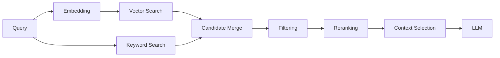
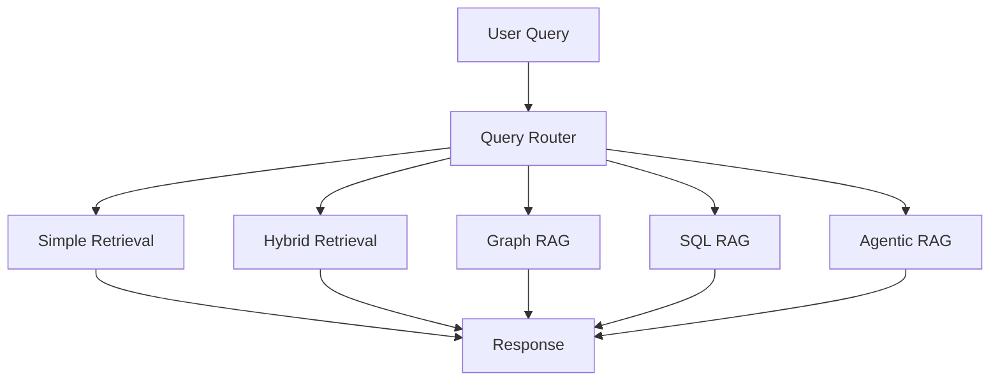
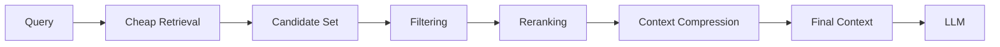
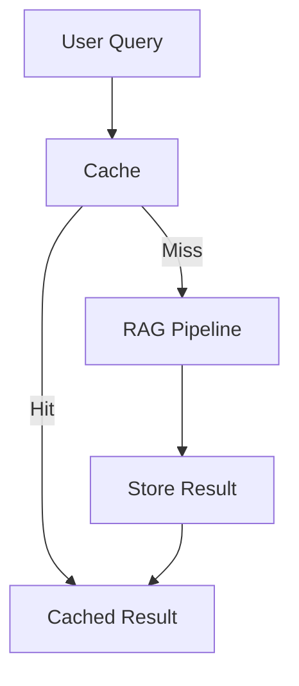
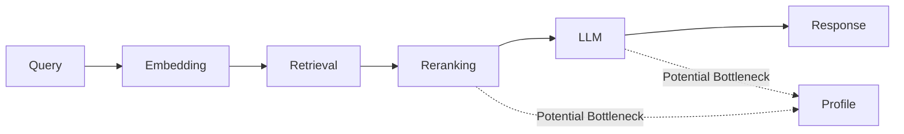
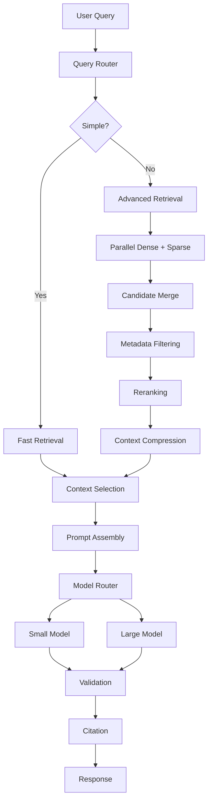

# 08. RAG Performance Optimization

> **Category:** Production RAG Engineering  
> **Module:** Part V — Advanced Retrieval-Augmented Generation  
> **Difficulty:** Advanced

---

## 📖 Overview

A RAG system can be functionally correct and still fail in production because it is:

- Too slow
- Too expensive
- Difficult to scale
- Inefficient with context
- Over-fetching documents
- Performing unnecessary model calls
- Saturating vector databases
- Generating excessive tokens
- Performing redundant retrieval
- Using expensive models for simple requests

Production RAG performance optimization is therefore not a single optimization technique.

It is a systematic engineering discipline covering the complete pipeline:

```text
User Query
    ↓
Query Processing
    ↓
Query Rewriting
    ↓
Embedding
    ↓
Retrieval
    ↓
Filtering
    ↓
Reranking
    ↓
Context Selection
    ↓
Prompt Assembly
    ↓
LLM Generation
    ↓
Validation
    ↓
Citation
    ↓
Response
```

The goal is to optimize the complete system across:

```text
Latency
Throughput
Accuracy
Context Efficiency
Token Usage
Cost
Scalability
Reliability
Resource Utilization
```

> **The fastest RAG system is not necessarily the one with the fastest individual component. It is the system that minimizes unnecessary work while preserving answer quality.**

---

# 🎯 Learning Objectives

After completing this chapter, you will be able to:

- Understand RAG performance bottlenecks
- Decompose end-to-end RAG latency
- Optimize retrieval latency
- Optimize embedding generation
- Optimize vector search
- Optimize hybrid retrieval
- Optimize reranking
- Optimize context selection
- Reduce unnecessary context
- Optimize prompt construction
- Reduce LLM latency
- Optimize token usage
- Implement caching
- Implement parallel retrieval
- Implement asynchronous processing
- Optimize batching
- Optimize model selection
- Implement query routing
- Optimize top-K
- Optimize reranking candidates
- Optimize context windows
- Optimize vector indexes
- Optimize database connections
- Improve throughput
- Control concurrency
- Optimize resource utilization
- Design performance SLOs
- Perform latency profiling
- Perform capacity planning
- Build production performance dashboards
- Balance latency, quality, and cost

---

# 🧠 1. What Is RAG Performance Optimization?

RAG performance optimization means improving the system's:

```text
Response Time
        +
Throughput
        +
Resource Efficiency
        +
Cost
        +
Scalability
```

while maintaining acceptable:

```text
Retrieval Quality
Answer Quality
Grounding
Citation Quality
Reliability
```

A useful objective is:

```text
Performance Optimization
        =
Latency ↓
Cost ↓
Resource Usage ↓
Throughput ↑
Quality ↔
```

---

# 🧠 2. Performance Is a Multi-Dimensional Problem

Do not define performance as latency alone.

```text
                 RAG PERFORMANCE
                       │
       ┌───────────────┼────────────────┐
       ▼               ▼                ▼
    Latency         Throughput         Cost
       │               │                │
       ▼               ▼                ▼
   p50/p95/p99      req/sec          $/request
                       │
                       ▼
                  Scalability
                       │
                       ▼
                    Quality
```

---

# 🧠 3. End-to-End Latency

A simplified model:

```text
T_total =
T_query
+ T_embedding
+ T_retrieval
+ T_reranking
+ T_context
+ T_prompt
+ T_generation
+ T_validation
+ T_citation
```


The first optimization step is therefore:

> **Measure before optimizing.**

---

# 🧠 4. Latency Waterfall

```text
Query Processing       ███                         20 ms
Embedding              █████                       35 ms
Retrieval              ███████                     70 ms
Reranking              ███████████                120 ms
Context Selection      ██                          15 ms
Prompt Assembly        ██                          10 ms
LLM Generation         █████████████████████    1420 ms
Validation              ███                        25 ms
Citation                ██                         12 ms
────────────────────────────────────────────────────
Total                                           1727 ms
```

The largest component should usually receive the most attention.

---

# 🧠 5. Latency Percentiles

Average latency is not enough.

Monitor:

```text
p50
p75
p90
p95
p99
```

Example:

```text
p50 = 0.9 s
p95 = 2.1 s
p99 = 4.8 s
```

A good average can hide poor tail latency.

---

# 🧠 6. Why p95 and p99 Matter

Suppose:

```text
999 requests → 1 second
1 request    → 30 seconds
```

The average may still appear reasonable.

But that one slow request represents a serious tail-latency problem.

Production systems therefore optimize:

```text
p95
p99
```

for predictable user experience.

---

# 🧠 7. Performance Optimization Framework

Use this loop:

```text
Measure
   ↓
Profile
   ↓
Identify Bottleneck
   ↓
Form Hypothesis
   ↓
Optimize
   ↓
Benchmark
   ↓
Evaluate Quality
   ↓
Deploy
   ↓
Monitor
```

Never optimize blindly.

---

# 🧠 8. RAG Performance Bottlenecks

Common bottlenecks include:

```text
Slow Embeddings
Slow Vector Search
Large Top-K
Expensive Reranking
Large Context
Large Prompt
Slow LLM
Repeated LLM Calls
Sequential Retrieval
Database Saturation
Network Latency
Excessive Serialization
Poor Caching
High Concurrency
```

---

# 🧠 9. Retrieval Pipeline



Every stage can become a bottleneck.

---

# 🧠 10. The Optimization Principle

A powerful production rule:

```text
Do Less Work
        ↓
Do Necessary Work in Parallel
        ↓
Use the Cheapest Suitable Component
        ↓
Cache Reusable Results
        ↓
Measure Quality
```

---

# 🧠 11. Optimize the Critical Path

The critical path is the sequence of operations that determines response time.

Example:

```text
Query
 ↓
Embedding
 ↓
Retrieval
 ↓
Reranking
 ↓
LLM
```

If independent operations exist:

```text
Dense Retrieval
Sparse Retrieval
```

do not unnecessarily execute them sequentially.

---

# 🧠 12. Sequential vs Parallel Retrieval

### Sequential

```text
Query
  ↓
Dense Search
  ↓
Sparse Search
  ↓
Merge
```

Latency:

```text
T = T_dense + T_sparse
```

### Parallel

```text
             ┌── Dense Search ──┐
Query ───────┤                  ├── Merge
             └── Sparse Search ─┘
```

Latency becomes approximately:

```text
T ≈ max(T_dense, T_sparse) + T_merge
```


---

# 🧠 13. Parallel Retrieval

```python
from concurrent.futures import ThreadPoolExecutor


def retrieve(query):

    with ThreadPoolExecutor(max_workers=2) as executor:

        dense_future = executor.submit(
            dense_retriever.retrieve,
            query
        )

        sparse_future = executor.submit(
            sparse_retriever.retrieve,
            query
        )

        dense_results = dense_future.result()
        sparse_results = sparse_future.result()

    return merge_results(
        dense_results,
        sparse_results
    )
```

Use concurrency carefully according to the client, database, and service behavior.

---

# 🧠 14. Async Retrieval

For I/O-heavy systems:

```python
import asyncio


async def retrieve(query):

    dense_task = asyncio.create_task(
        dense_retriever.retrieve(query)
    )

    sparse_task = asyncio.create_task(
        sparse_retriever.retrieve(query)
    )

    dense, sparse = await asyncio.gather(
        dense_task,
        sparse_task
    )

    return merge_results(dense, sparse)
```

---

# 🧠 15. Parallelism Trade-Off

Parallelism can reduce latency but increase:

```text
Concurrent Connections
CPU
Memory
Database Load
Network Load
```

Therefore:

```text
Latency ↓
Resource Consumption ↑
```

Concurrency must be bounded.

---

# 🧠 16. Concurrency Control

Use:

```text
Connection Pools
Semaphore
Rate Limiter
Bulkhead
Circuit Breaker
Queue
```

Example:

```python
import asyncio

semaphore = asyncio.Semaphore(20)


async def safe_retrieve(query):

    async with semaphore:
        return await retriever.retrieve(query)
```

---

# 🧠 17. Top-K Optimization

A larger K is not always better.

```text
K = 5
K = 10
K = 20
K = 50
K = 100
```

Increasing K can improve recall but increases:

```text
Search Work
Network Transfer
Reranking Work
Context Processing
Tokens
Cost
Latency
```

---

# 🧠 18. Retrieval Top-K Trade-Off

```text
                 Retrieval Quality
                       ▲
                       │        ───────
                       │      /
                       │    /
                       │  /
                       │ /
                       └──────────────────► K
```

The improvement often diminishes after a certain point.

---

# 🧠 19. Candidate K vs Final K

Separate:

```text
Retrieval K
```

from:

```text
Final Context K
```

Example:

```text
Retrieve:
50

Rerank:
50

Select:
6
```

This is often more effective than sending all 50 documents to the LLM.

---

# 🧠 20. Adaptive Top-K

Instead of always using:

```text
K = 10
```

adapt K based on query characteristics.

```text
Simple Query
    ↓
K = 5

Complex Query
    ↓
K = 15

Highly Ambiguous Query
    ↓
K = 25
```

---

# 🧠 21. Score-Based Retrieval Cutoff

Instead of selecting only by fixed K:

```text
Retrieve candidates
       ↓
Score threshold
       ↓
Keep relevant results
```

Example:

```text
D1 = 0.94  ✓
D2 = 0.89  ✓
D3 = 0.83  ✓
D4 = 0.51  ✗
D5 = 0.47  ✗
```

Thresholds must be calibrated for the retrieval system.

---

# 🧠 22. Dynamic Retrieval

A more advanced pipeline:

```text
Query
  ↓
Initial Retrieval
  ↓
Are results sufficient?
  │
  ├── Yes → Continue
  │
  └── No → Expand Retrieval
```

This avoids expensive retrieval for easy queries.

---

# 🧠 23. Early Exit

Example:

```text
Query
 ↓
Fast Retrieval
 ↓
Confidence High?
 ├── Yes → Generate
 └── No  → Rerank / Expand
```

This is a powerful optimization.

---

# 🧠 24. Query Classification

Before expensive processing:

```text
Query Classifier
       │
       ├── FAQ
       ├── Simple Search
       ├── Complex RAG
       ├── SQL
       ├── Graph
       └── Multimodal
```

Simple requests can bypass unnecessary stages.

---

# 🧠 25. Router-Based Optimization



The objective:

> **Use the simplest pipeline that can reliably answer the query.**

---

# 🧠 26. Query Rewriting Cost

Query rewriting improves retrieval but adds latency.

```text
Original Query
      ↓
LLM Rewrite
      ↓
Retrieval
```

If rewriting costs:

```text
250 ms
```

for every request, it may become a major bottleneck.

---

# 🧠 27. Conditional Query Rewriting

```text
Query
 ↓
Is query ambiguous?
 │
 ├── No → Retrieve directly
 │
 └── Yes → Rewrite
```

This avoids unnecessary LLM calls.

---

# 🧠 28. Multi-Query Optimization

Multi-query retrieval:

```text
Original
 ├── Query A
 ├── Query B
 ├── Query C
 └── Query D
```

can improve recall but increases:

```text
Embedding Calls
Search Calls
Merge Work
Reranking Candidates
```

Use it selectively.

---

# 🧠 29. Multi-Query Parallelization

```text
                 ┌── Query A ── Search ──┐
                 ├── Query B ── Search ──┤
Original Query ──┼── Query C ── Search ──┼── Merge
                 └── Query D ── Search ──┘
```

Parallelize independent searches.

---

# 🧠 30. Embedding Optimization

Embedding latency can be reduced using:

```text
Batching
Caching
Smaller Embedding Models
Parallel Requests
Connection Reuse
Local Embedding Models
```

---

# 🧠 31. Embedding Batching

Instead of:

```text
Request 1 → Embed
Request 2 → Embed
Request 3 → Embed
Request 4 → Embed
```

batch:

```text
Batch
 ├── Text 1
 ├── Text 2
 ├── Text 3
 └── Text 4
        ↓
Embedding Model
```

This is particularly important during ingestion.

---

# 🧠 32. Query Embedding Cache

Queries can sometimes repeat.

```text
Query
 ↓
Hash
 ↓
Cache?
 ├── Hit → Reuse Embedding
 └── Miss → Generate
```

---

# 🧠 33. Embedding Cache Example

```python
def get_embedding(query):

    key = hash_query(query)

    cached = cache.get(key)

    if cached:
        return cached

    embedding = embedding_model.embed(query)

    cache.set(key, embedding)

    return embedding
```

Use appropriate invalidation/versioning.

---

# 🧠 34. Embedding Model Selection

Larger models may provide better embeddings but can increase:

```text
Latency
Cost
Memory
Infrastructure Requirements
```

Evaluate:

```text
Retrieval Quality
Latency
Cost
```

together.

---

# 🧠 35. Vector Search Optimization

Vector search performance depends on:

```text
Index Type
Vector Dimension
Dataset Size
Search Parameters
Hardware
Memory
Concurrency
Filtering
```

---

# 🧠 36. ANN Search

Approximate Nearest Neighbor search trades exactness for speed.

```text
Exact Search
     ↓
High Recall
High Cost

ANN Search
     ↓
Lower Search Cost
Very Fast
Potential Recall Trade-Off
```

---

# 🧠 37. Index Selection

Common structures include:

```text
Flat
IVF
HNSW
PQ
IVF + PQ
```

Selection depends on:

```text
Dataset Size
Latency Target
Recall Target
Memory Budget
Update Frequency
```

---

# 🧠 38. Flat Search

```text
Query
 ↓
Compare against every vector
 ↓
Top-K
```

Complexity grows with dataset size.

Good for:

```text
Small Datasets
High Recall Requirements
Benchmarking
```

---

# 🧠 39. HNSW

HNSW creates a graph-based search structure.

```text
Layer 3      A -------- D
             \          /
Layer 2       B ---- C
                \    /
Layer 1      E -- F -- G -- H
```

Search navigates the graph rather than scanning every vector.

---

# 🧠 40. HNSW Search Parameters

Common parameters include:

```text
M
efConstruction
efSearch
```

Increasing search effort can improve recall but increase latency.

---

# 🧠 41. efSearch Trade-Off

```text
efSearch ↑
    │
    ├── Recall ↑
    └── Latency ↑
```

Tune against a benchmark rather than choosing arbitrary values.

---

# 🧠 42. Vector Dimension

Higher dimensions can increase:

```text
Memory
Distance Computation
Network Transfer
Index Size
```

But reducing dimensions can affect retrieval quality.

Therefore:

```text
Dimension ↓
Cost ↓
Latency ↓
Potential Recall ↓
```

---

# 🧠 43. Quantization

Quantization reduces representation size.

```text
FP32
 ↓
FP16
 ↓
INT8
 ↓
Lower Precision
```

Potential benefits:

```text
Memory ↓
Storage ↓
Latency ↓
Cost ↓
```

Potential trade-off:

```text
Retrieval Quality ↓
```

Benchmark before production adoption.

---

# 🧠 44. Vector Database Optimization

Optimize:

```text
Connection Pool
Indexes
Partitions
Sharding
Replication
Filtering
Payload Size
Batch Operations
```

---

# 🧠 45. Connection Pooling

Bad:

```text
Request
 ↓
Create DB Connection
 ↓
Query
 ↓
Close
```

Better:

```text
Connection Pool
 ├── Connection 1
 ├── Connection 2
 ├── Connection 3
 └── Connection N
```

Reuse connections.

---

# 🧠 46. Retrieval Payload Optimization

Avoid returning unnecessary data.

Bad:

```text
Vector
Full Document
Large Metadata
Binary Data
```

if only:

```text
Document ID
Chunk Text
Score
Metadata
```

is needed.

---

# 🧠 47. Hybrid Search Optimization

Hybrid retrieval:

```text
Dense Search
+
Sparse Search
```

can improve quality but adds work.

Optimize using:

```text
Parallel Search
Candidate Limits
Efficient Merge
Score Normalization
Selective Reranking
```

---

# 🧠 48. Hybrid Retrieval Pipeline

```text
                  Query
                    │
          ┌─────────┴─────────┐
          ▼                   ▼
      Dense Search        Sparse Search
          │                   │
          └─────────┬─────────┘
                    ▼
                Merge
                    ↓
                Rerank
                    ↓
               Top-N Context
```

---

# 🧠 49. Reranking Cost

Reranking is often more expensive than initial retrieval.

Example:

```text
Vector Search:
50 ms

Reranker:
180 ms
```

If you rerank:

```text
1000 candidates
```

the cost can become significant.

---

# 🧠 50. Candidate Reduction

Instead of:

```text
Retrieve 1000
 ↓
Rerank 1000
```

use:

```text
Dense → 50
Sparse → 50
Merge → 80
Rerank → 50
Select → 6
```

This reduces reranking work.

---

# 🧠 51. Two-Stage Retrieval

```text
Stage 1
Fast Retrieval
     ↓
Top 50
     ↓
Stage 2
Expensive Reranking
     ↓
Top 6
```

This is a common production architecture.

---

# 🧠 52. Multi-Stage Retrieval



Each stage reduces the amount of data passed to the next expensive stage.

---

# 🧠 53. Reranker Batching

When reranking multiple candidates:

```text
Candidate 1
Candidate 2
Candidate 3
...
Candidate N
```

batch them when supported.

This can improve accelerator utilization and reduce per-request overhead.

---

# 🧠 54. Reranker Selection

Possible options:

```text
Cross Encoder
LLM Reranker
Lightweight Neural Reranker
Rule-Based Reranker
```

Use the least expensive mechanism that meets the quality target.

---

# 🧠 55. Context Optimization

One of the most important RAG optimizations is:

> **Do not send irrelevant context to the LLM.**

Large context can cause:

```text
Latency ↑
Token Cost ↑
Noise ↑
Attention Competition ↑
```

---

# 🧠 56. Context Compression

```text
Retrieved Context
      ↓
Relevant Information
      ↓
Compressed Context
      ↓
LLM
```

Example:

```text
12,000 tokens
      ↓
4,000 tokens
```

---

# 🧠 57. Context Selection

Use:

```text
Relevance
Diversity
Recency
Metadata
Authority
Token Budget
```

to select final context.

---

# 🧠 58. Context Token Budget

Define:

```text
Maximum Context Tokens
```

Example:

```text
Context Budget = 6,000 tokens
```

Selection should respect the budget.

---

# 🧠 59. Token Budgeting

A useful conceptual budget:

```text
Model Context Window
        │
        ├── System Prompt
        ├── User Query
        ├── Retrieved Context
        ├── Conversation Memory
        └── Output Budget
```

If context grows excessively:

```text
Output Capacity ↓
Cost ↑
Latency ↑
```

---

# 🧠 60. Context Ordering

Ordering can affect generation quality.

Possible strategy:

```text
Most Relevant
      ↓
Supporting Evidence
      ↓
Additional Context
```

or an empirically tested ordering strategy.

Do not assume one ordering works universally.

---

# 🧠 61. Duplicate Context Removal

Retrieval systems may return:

```text
Chunk A
Chunk A
Chunk B
Chunk C
Chunk B
```

Deduplicate before generation.

```python
def deduplicate(chunks):

    seen = set()
    result = []

    for chunk in chunks:

        if chunk.id not in seen:
            seen.add(chunk.id)
            result.append(chunk)

    return result
```

---

# 🧠 62. Parent-Child Retrieval Optimization

Parent-child retrieval can provide:

```text
Small Child Chunk
        ↓
Find Relevant Parent
        ↓
Return Appropriate Context
```

Optimization:

```text
Search Small Chunks
+
Return Only Necessary Parent Context
```

rather than sending entire documents.

---

# 🧠 63. MMR Optimization

MMR can reduce redundant context.

```text
Relevance
    +
Diversity
```

Instead of:

```text
Top 5 almost identical chunks
```

you may select:

```text
5 complementary chunks
```

This can improve context efficiency.

---

# 🧠 64. Context Diversity

Example:

```text
D1 → Payment architecture
D2 → Payment architecture
D3 → Payment architecture
D4 → Database configuration
D5 → Error handling
```

A diversity-aware selection can provide broader evidence.

---

# 🧠 65. Prompt Optimization

Prompt construction has two goals:

```text
Quality
+
Efficiency
```

Avoid:

```text
Repeated Instructions
Repeated Context
Unused Examples
Excessive Formatting
```

---

# 🧠 66. Prompt Template Optimization

Bad:

```text
Very long system prompt
+
Repeated instructions
+
Repeated examples
+
Large context
```

Better:

```text
Compact instructions
+
Relevant context
+
Explicit response contract
```

---

# 🧠 67. Prompt Caching

If supported by the model provider:

```text
Static Prompt Prefix
       ↓
Cache
       ↓
Dynamic User Query
```

Potential benefits:

```text
Latency ↓
Cost ↓
```

---

# 🧠 68. Static vs Dynamic Prompt Content

Separate:

```text
Static
 ├── System Instructions
 ├── Response Schema
 └── Policy

Dynamic
 ├── Query
 ├── Context
 └── Conversation
```

This makes caching and prompt management easier.

---

# 🧠 69. LLM Latency Optimization

LLM latency can be influenced by:

```text
Model Size
Input Tokens
Output Tokens
Provider
Region
Concurrency
Batching
Streaming
Network
```

---

# 🧠 70. Model Routing

Use different models for different workloads:

```text
Simple Query
    ↓
Small Model

Complex Reasoning
    ↓
Large Model
```

The objective is:

```text
Quality Target
      +
Minimum Cost
      +
Acceptable Latency
```

---

# 🧠 71. Model Cascade

```text
Small Model
    ↓
Confidence?
 ├── High → Answer
 └── Low  → Large Model
```

This can reduce average cost and latency.

---

# 🧠 72. Streaming

Without streaming:

```text
Request
   ↓
Wait
   ↓
Complete Response
```

With streaming:

```text
Request
   ↓
First Token
   ↓
Token
   ↓
Token
   ↓
Token
   ↓
Complete
```

Streaming improves perceived latency even when total generation time remains similar.

---

# 🧠 73. Time to First Token

Track:

```text
TTFT
```

separately from:

```text
Total Generation Time
```

Example:

```text
TTFT = 300 ms
Total = 1.8 s
```

A system may feel responsive despite a longer total generation time.

---

# 🧠 74. Output Token Optimization

Large answers increase:

```text
Latency
Cost
```

Use:

```text
Max Output Tokens
Response Schema
Concise Instructions
```

where appropriate.

---

# 🧠 75. Structured Output

If the application requires a fixed response:

```json
{
  "answer": "...",
  "sources": [],
  "confidence": 0.92
}
```

Structured output can reduce unnecessary generation and downstream parsing work.

---

# 🧠 76. Validation Optimization

Validation itself can add latency.

Avoid:

```text
LLM Generation
    ↓
Large Second LLM
    ↓
Validation
```

for every low-risk query unless justified.

Possible strategies:

```text
Rule-Based Validation
Cheap Model
Selective Validation
High-Risk Validation
```

---

# 🧠 77. Selective Validation

```text
Response
   ↓
Risk Classifier
   │
   ├── Low Risk → Lightweight Validation
   │
   └── High Risk → Deep Validation
```

---

# 🧠 78. Citation Optimization

Citation generation can be optimized by maintaining source IDs throughout the pipeline.

Instead of reconstructing citations:

```text
LLM Answer
     ↓
Search Sources Again
     ↓
Map Citations
```

carry:

```text
chunk_id
document_id
source_url
metadata
```

through the pipeline.

---

# 🧠 79. End-to-End Source Tracking

```text
Retriever
   ↓
Chunk
   ↓
Reranker
   ↓
Context
   ↓
Prompt
   ↓
LLM
   ↓
Citation
```

The source identity should remain attached to the context object.

---

# 🧠 80. Caching

Caching is one of the most effective RAG optimizations.

Possible cache layers:

```text
Query Cache
Embedding Cache
Retrieval Cache
Reranking Cache
Prompt Cache
LLM Response Cache
```

---

# 🧠 81. Cache Architecture



---

# 🧠 82. Retrieval Cache

Cache:

```text
Normalized Query
+
Retriever Version
+
Index Version
+
Filter
```

Example key:

```text
hash(
  query
  + retriever_version
  + index_version
  + metadata_filter
)
```

---

# 🧠 83. Cache Invalidation

The biggest cache problem:

```text
Stale Data
```

Invalidate when:

```text
Index Changes
Document Changes
Embedding Model Changes
Retriever Configuration Changes
```

---

# 🧠 84. Cache Versioning

Use:

```text
embedding:v3
retriever:v5
index:v12
prompt:v8
```

This makes invalidation more deterministic.

---

# 🧠 85. Semantic Cache

A semantic cache attempts to reuse results for semantically similar queries.

```text
Query A:
"What DB does payments use?"

Query B:
"Which database is used by the payment service?"
```

These may be semantically similar.

But semantic caching must consider:

```text
Freshness
Tenant
Authorization
Knowledge Version
Query Intent
```

---

# 🧠 86. Semantic Cache Risk

Two queries may be similar but require different answers.

Therefore:

```text
Semantic Similarity
≠
Semantic Equivalence
```

Use conservative thresholds and evaluate carefully.

---

# 🧠 87. Cache by Tenant

Never allow:

```text
Tenant A
    ↓
Cache
    ↓
Tenant B
```

to reuse unauthorized data.

Cache keys should include appropriate isolation dimensions.

---

# 🧠 88. Batch Processing

Batching can improve:

```text
Embedding
Reranking
Evaluation
Indexing
```

Example:

```text
100 documents

Single:
100 model calls

Batch:
10 batches
```

The optimal batch size depends on infrastructure and model behavior.

---

# 🧠 89. Ingestion Performance

Production ingestion:

```text
Documents
   ↓
Parsing
   ↓
Chunking
   ↓
Embedding
   ↓
Indexing
```

Optimize using:

```text
Parallel Parsing
Batch Embedding
Batch Indexing
Incremental Updates
Backpressure
```

---

# 🧠 90. Incremental Indexing

Avoid rebuilding the complete index when only a few documents changed.

```text
100,000 documents
        ↓
10 changed
        ↓
Update 10
```

instead of:

```text
Re-index 100,000
```

---

# 🧠 91. Incremental Embedding

Track document versions:

```text
DOC-001 v1
DOC-001 v2
```

Only regenerate embeddings when relevant content changes.

---

# 🧠 92. Change Detection

Use:

```text
Content Hash
```

Example:

```python
import hashlib


def content_hash(text):

    return hashlib.sha256(
        text.encode("utf-8")
    ).hexdigest()
```

If the hash is unchanged:

```text
Skip Re-Embedding
```

---

# 🧠 93. Index Build Optimization

For large ingestion jobs:

```text
Parse
  ↓
Chunk
  ↓
Batch Embedding
  ↓
Bulk Index
```

Avoid one-document-at-a-time indexing.

---

# 🧠 94. Bulk Indexing

Instead of:

```text
Insert chunk
Insert chunk
Insert chunk
...
```

use:

```text
Batch
 ↓
Bulk Insert
```

This reduces network and transaction overhead.

---

# 🧠 95. Database Optimization

Monitor:

```text
CPU
Memory
IOPS
Connections
Query Latency
Cache Hit Rate
Index Size
Storage
```

---

# 🧠 96. Vector DB Saturation

Symptoms:

```text
Latency ↑
Queue Depth ↑
CPU ↑
Connection Usage ↑
```

Possible solutions:

```text
Scaling
Sharding
Index Tuning
Connection Pooling
Query Reduction
Caching
```

---

# 🧠 97. Horizontal Scaling

```text
                Load Balancer
                     │
          ┌──────────┼──────────┐
          ▼          ▼          ▼
       RAG-1      RAG-2      RAG-3
          │          │          │
          └──────────┼──────────┘
                     ▼
                Vector DB
```

Stateless RAG services scale more easily.

---

# 🧠 98. Autoscaling

Scale based on:

```text
CPU
Memory
Request Rate
Queue Depth
Latency
Concurrent Requests
```

For AI systems also consider:

```text
LLM Rate Limits
GPU Utilization
Token Throughput
```

---

# 🧠 99. Backpressure

When downstream services cannot keep up:

```text
Requests
   ↓
Queue
   ↓
Controlled Processing
```

Without backpressure:

```text
Load ↑
 ↓
Concurrency ↑
 ↓
Resource Exhaustion
 ↓
Failure
```

---

# 🧠 100. Load Shedding

Under extreme load:

```text
Low Priority Requests
        ↓
Rejected / Deferred
```

while protecting:

```text
Critical Requests
```

---

# 🧠 101. Rate Limiting

Apply limits at:

```text
User
Tenant
API
Model
Retriever
Provider
```

Example:

```text
Tenant A:
100 requests/minute
```

---

# 🧠 102. Resource Isolation

Use separate resource pools for:

```text
Interactive RAG
Batch RAG
Evaluation
Ingestion
Background Jobs
```

This prevents batch workloads from degrading interactive traffic.

---

# 🧠 103. Priority Queues

```text
Priority 1
Production User Query

Priority 2
Internal Query

Priority 3
Evaluation

Priority 4
Batch Processing
```

---

# 🧠 104. Network Optimization

RAG often crosses:

```text
API
Vector DB
Reranker
LLM Provider
Storage
```

Network latency can accumulate.

Reduce it using:

```text
Same Region
Connection Reuse
Compression
Payload Reduction
Private Networking
```

---

# 🧠 105. Region Selection

If the application runs in:

```text
India
```

but the LLM endpoint is far away:

```text
Application
   ↓
Long Network Distance
   ↓
LLM
```

latency increases.

Use an appropriate region/provider architecture while respecting:

```text
Data Residency
Compliance
Availability
Cost
```

---

# 🧠 106. Serialization Optimization

Avoid transferring unnecessary:

```text
Vectors
Large Metadata
Full Documents
Binary Content
```

between services.

Prefer compact payloads.

---

# 🧠 107. Compression

Compression can reduce:

```text
Network Transfer
Storage
```

but adds:

```text
CPU
Compression/Decompression Latency
```

Benchmark the trade-off.

---

# 🧠 108. Retrieval Result Payload

Prefer:

```json
{
  "id": "chunk-123",
  "score": 0.92,
  "text": "...",
  "metadata": {
    "source": "policy.pdf"
  }
}
```

instead of transferring the entire source document when it is not needed.

---

# 🧠 109. Observability Overhead

Instrumentation itself consumes:

```text
CPU
Memory
Network
Storage
```

Optimize telemetry using:

```text
Sampling
Aggregation
Selective Payload Capture
Retention Policies
```

---

# 🧠 110. Performance vs Quality

The key trade-off:

```text
                 Quality
                    ▲
                    │
              ●     │
          ●         │
       ●            │
    ●               │
──────────────────────────────►
              Latency
```

The goal is not:

```text
Minimum Latency
```

but:

```text
Best Quality
within acceptable latency and cost.
```

---

# 🧠 111. Quality-Latency-Cost Triangle

```text
                  QUALITY
                    ▲
                   / \
                  /   \
                 /     \
                /       \
               ▼─────────▼
           LATENCY      COST
```

Optimizing one dimension can affect the others.

---

# 🧠 112. Example Trade-Off

Option A:

```text
Fast Retrieval
No Reranker
Small Context
Small LLM

Latency:
700 ms

Cost:
Low

Quality:
82%
```

Option B:

```text
Hybrid Retrieval
Reranking
Context Compression
Large LLM

Latency:
1800 ms

Cost:
Higher

Quality:
94%
```

The correct choice depends on the product SLO and risk profile.

---

# 🧠 113. Performance Budget

Define a latency budget:

```text
Total Budget = 2 seconds
```

Example:

```text
Query Processing       50 ms
Embedding              100 ms
Retrieval              200 ms
Reranking              250 ms
Context                 50 ms
LLM                   1200 ms
Validation             100 ms
Citation                50 ms
--------------------------------
Total                 2000 ms
```

---

# 🧠 114. Budget Violation

If:

```text
LLM = 1600 ms
```

then other stages cannot consume unlimited latency.

The budget forces architectural discipline.

---

# 🧠 115. Throughput

Throughput is often measured as:

```text
Requests / second
```

For LLM systems also monitor:

```text
Tokens / second
```

---

# 🧠 116. Retrieval Throughput

Example:

```text
Vector Search:
2,000 queries/sec

Reranker:
500 queries/sec

LLM:
100 requests/sec
```

The LLM becomes the bottleneck.

---

# 🧠 117. Bottleneck Identification



Always profile the actual workload.

---

# 🧠 118. Queueing Effects

As utilization approaches capacity:

```text
Utilization ↑
      ↓
Queue Time ↑
      ↓
Latency ↑
```

A component operating near saturation can cause dramatic tail latency.

---

# 🧠 119. Capacity Planning

Estimate:

```text
Peak Requests/sec
Average Requests/sec
Average Tokens/request
Peak Tokens/sec
Concurrency
```

Then size:

```text
RAG Services
Vector DB
Reranker
LLM Capacity
```

---

# 🧠 120. Load Testing

Test:

```text
10 RPS
50 RPS
100 RPS
500 RPS
```

and observe:

```text
p50
p95
p99
Errors
CPU
Memory
Connections
Tokens
Cost
```

---

# 🧠 121. Stress Testing

Push beyond expected capacity.

```text
Normal
   ↓
Peak
   ↓
Stress
   ↓
Failure
```

Find:

```text
Breaking Point
Recovery Behavior
Degradation Pattern
```

---

# 🧠 122. Performance Regression Testing

Every major change should be benchmarked.

Example:

```text
Baseline
   ↓
Change Retriever
   ↓
Benchmark
   ↓
Quality Evaluation
   ↓
Compare
```

---

# 🧠 123. Benchmark Table

| Configuration | p95 Latency | Recall@10 | Tokens | Cost |
|---|---:|---:|---:|---:|
| Dense | 620 ms | 88% | 4,800 | Low |
| Hybrid | 710 ms | 93% | 5,000 | Medium |
| Hybrid + Reranker | 920 ms | 96% | 4,300 | Higher |
| Hybrid + Reranker + Compression | 980 ms | 96% | 3,100 | Medium |

Illustrative values only.

---

# 🧠 124. A/B Performance Testing

Compare:

```text
Version A
```

against:

```text
Version B
```

using:

```text
Latency
Quality
Cost
User Feedback
```

---

# 🧠 125. Canary Deployment

```text
Production
   │
   ├── 95% → Version A
   └── 5%  → Version B
```

Monitor:

```text
Latency
Errors
Quality
Cost
```

Increase traffic only if healthy.

---

# 🧠 126. Performance Optimization Experiment

Example:

```text
Hypothesis:

Reducing reranker candidates
from 100 → 40
will reduce latency
without significant recall loss.
```

Experiment:

```text
Baseline:
100 candidates

Variant:
40 candidates
```

Measure:

```text
Latency
Recall
NDCG
Answer Quality
Cost
```

---

# 🧠 127. Performance Optimization Notebook

```python
experiments = [
    {
        "name": "reranker_candidates_100",
        "candidates": 100
    },
    {
        "name": "reranker_candidates_40",
        "candidates": 40
    }
]
```

Run the same evaluation set against both.

---

# 🧠 128. Optimization Scorecard

| Dimension | Baseline | Optimized | Change |
|---|---:|---:|---:|
| p95 Latency | 2.1s | 1.4s | -33% |
| Recall@10 | 94% | 93% | -1 pp |
| Faithfulness | 95% | 95% | 0 |
| Tokens | 5,400 | 3,600 | -33% |
| Cost | $0.025 | $0.017 | -32% |

The objective is not necessarily to maximize every metric independently.

---

# 🧠 129. Common Optimization Mistakes

### Mistake 1

```text
Increase Top-K
```

without measuring context quality.

---

### Mistake 2

```text
Use a larger model
```

for every query.

---

### Mistake 3

```text
Add more retrieval stages
```

without considering latency.

---

### Mistake 4

```text
Enable multi-query
```

for every request.

---

### Mistake 5

```text
Rerank hundreds of documents
```

without candidate reduction.

---

### Mistake 6

```text
Cache everything
```

without invalidation.

---

### Mistake 7

```text
Optimize latency
```

without measuring quality.

---

# 🧠 130. Over-Optimization

A system can become:

```text
Extremely Fast
```

but:

```text
Wrong
```

Example:

```text
Top-K:
2

Reranker:
Disabled

Context:
Tiny

LLM:
Small
```

Latency may be excellent while answer quality collapses.

---

# 🧠 131. Under-Optimization

The opposite:

```text
Top-K:
100

Reranker:
100

Context:
20,000 tokens

LLM:
Largest Model

Validation:
2 additional LLM calls
```

Quality may improve slightly while:

```text
Latency
Cost
Complexity
```

explode.

---

# 🧠 132. Optimization Priority

A practical order:

```text
1. Measure
2. Remove unnecessary work
3. Parallelize independent work
4. Reduce candidate volume
5. Optimize context
6. Cache reusable work
7. Optimize model selection
8. Optimize infrastructure
9. Fine-tune low-level components
```

---

# 🧠 133. Remove Unnecessary Work

Ask:

```text
Do we need query rewriting?

Do we need multi-query?

Do we need reranking?

Do we need a second validation model?

Do we need 20 documents?

Do we need 8,000 context tokens?

Do we need the largest model?
```

The cheapest optimization is often:

> **Not performing the operation at all.**

---

# 🧠 134. Performance Architecture



---

# 🧠 135. Production Performance Architecture

The key architectural principles are:

```text
Fast Path
+
Adaptive Path
+
Parallel Retrieval
+
Candidate Reduction
+
Context Budget
+
Caching
+
Model Routing
+
Bounded Concurrency
+
Observability
```

---

# 🧪 136. Practical Project

Build a:

> **Production RAG Performance Optimization Lab**

Start with:

```text
Baseline RAG
```

then progressively optimize it.

---

# 🧪 137. Baseline Architecture

```text
Query
 ↓
Embedding
 ↓
Vector Search
 ↓
Top-10
 ↓
LLM
 ↓
Response
```

Measure:

```text
p50
p95
p99
Recall
Tokens
Cost
```

---

# 🧪 138. Optimization Stage 1

Add:

```text
Caching
```

Measure:

```text
Cache Hit Rate
Latency
Cost
```

---

# 🧪 139. Optimization Stage 2

Add:

```text
Parallel Dense + Sparse Retrieval
```

Measure:

```text
Retrieval Latency
Recall
```

---

# 🧪 140. Optimization Stage 3

Add:

```text
Reranking
```

Measure:

```text
Quality
Latency
```

---

# 🧪 141. Optimization Stage 4

Add:

```text
Context Compression
```

Measure:

```text
Context Tokens
LLM Latency
Cost
Faithfulness
```

---

# 🧪 142. Optimization Stage 5

Add:

```text
Model Router
```

Measure:

```text
Model Distribution
Latency
Cost
Quality
```

---

# 🧪 143. Optimization Stage 6

Add:

```text
Adaptive Retrieval
```

Architecture:

```text
Query
 ↓
Initial Retrieval
 ↓
Confidence
 │
 ├── High → Generate
 │
 └── Low → Rerank / Expand
```

---

# 🧪 144. Optimization Experiment Matrix

| Experiment | Latency | Recall | Tokens | Cost | Quality |
|---|---:|---:|---:|---:|---:|
| Baseline | — | — | — | — | — |
| Cache | — | — | — | — | — |
| Parallel Retrieval | — | — | — | — | — |
| Reranking | — | — | — | — | — |
| Compression | — | — | — | — | — |
| Model Routing | — | — | — | — | — |
| Adaptive Retrieval | — | — | — | — | — |

Populate using actual benchmark results.

---

# 🧪 145. Performance Test Dataset

Create representative query categories:

```text
Simple FAQ
Technical Query
Multi-hop Query
Ambiguous Query
Long Query
Short Query
SQL Query
Graph Query
No-Answer Query
High-Context Query
```

Do not benchmark using only easy questions.

---

# 🧪 146. Performance Test Harness

```python
def benchmark(rag, queries):

    results = []

    for query in queries:

        result = rag.answer(query)

        results.append({
            "query": query,
            "latency_ms": result.latency_ms,
            "input_tokens": result.input_tokens,
            "output_tokens": result.output_tokens,
            "cost": result.cost
        })

    return results
```

---

# 🧪 147. Performance Metrics

Calculate:

```text
p50 latency
p95 latency
p99 latency

Average retrieval latency
Average reranking latency
Average generation latency

Average context tokens
Average input tokens
Average output tokens

Cost/request
Requests/second
```

---

# 🧪 148. Quality Metrics

Do not optimize without measuring:

```text
Recall@K
MRR
NDCG
Answer Relevance
Faithfulness
Groundedness
Citation Accuracy
Citation Coverage
```

---

# 🧪 149. Final Benchmark

The optimized system should answer:

```text
Did latency improve?

Did throughput improve?

Did token usage decrease?

Did cost decrease?

Did retrieval quality remain acceptable?

Did answer quality remain acceptable?

Did citation quality remain acceptable?

Did infrastructure utilization improve?
```

---

# 🧠 150. Production Performance Checklist

```text
☐ Measure end-to-end latency
☐ Measure p50
☐ Measure p95
☐ Measure p99
☐ Profile every RAG stage
☐ Identify critical path
☐ Remove unnecessary operations

☐ Parallelize independent retrieval
☐ Use bounded concurrency
☐ Optimize embedding
☐ Batch embeddings
☐ Cache embeddings
☐ Optimize vector indexes
☐ Tune ANN parameters
☐ Optimize vector DB connections
☐ Reduce retrieval payloads

☐ Tune Top-K
☐ Separate candidate K from final K
☐ Use adaptive retrieval
☐ Use score thresholds where appropriate
☐ Reduce reranker candidates
☐ Batch reranking
☐ Optimize hybrid retrieval

☐ Deduplicate context
☐ Compress context
☐ Set context budgets
☐ Optimize context ordering
☐ Remove irrelevant chunks
☐ Track context tokens

☐ Optimize prompts
☐ Version prompts
☐ Use prompt caching where appropriate
☐ Reduce repeated instructions

☐ Optimize LLM selection
☐ Use model routing
☐ Use model cascades where appropriate
☐ Stream responses
☐ Track TTFT
☐ Limit output tokens

☐ Cache retrieval results
☐ Cache reusable computations
☐ Version caches
☐ Implement invalidation
☐ Preserve tenant isolation

☐ Optimize ingestion
☐ Batch indexing
☐ Incrementally update indexes
☐ Avoid unnecessary re-embedding
☐ Use content hashes

☐ Control database connections
☐ Control concurrency
☐ Implement backpressure
☐ Implement rate limits
☐ Implement load shedding
☐ Separate workloads
☐ Configure autoscaling

☐ Load test
☐ Stress test
☐ Capacity test
☐ Regression test
☐ Canary performance changes

☐ Monitor latency
☐ Monitor throughput
☐ Monitor cost
☐ Monitor token usage
☐ Monitor retrieval quality
☐ Monitor answer quality

☐ Compare optimization experiments
☐ Preserve quality SLOs
☐ Document performance budgets
☐ Monitor production regressions
```

---

# 🧠 151. Performance Optimization Mental Model

```text
                    RAG PERFORMANCE
                           │
        ┌──────────────────┼──────────────────┐
        ▼                  ▼                  ▼
      LATENCY           THROUGHPUT           COST
        │                  │                  │
        ▼                  ▼                  ▼
    Critical Path      Concurrency         Tokens
    Parallelism        Batching            Models
    Caching            Scaling             Caching
        │                  │                  │
        └──────────────────┼──────────────────┘
                           ▼
                       QUALITY
                           │
             ┌─────────────┼─────────────┐
             ▼             ▼             ▼
         Retrieval      Generation    Citation
           Quality        Quality       Quality
                           │
                           ▼
                       RELIABILITY
                           │
                           ▼
                    PRODUCTION SLOs
```

---

# 🧠 152. Final Mental Model

The complete optimization loop is:

```text
                   PRODUCTION RAG
                         │
                         ▼
                      MEASURE
                         │
                         ▼
                      PROFILE
                         │
                         ▼
                  FIND BOTTLENECK
                         │
                         ▼
                REMOVE UNNECESSARY WORK
                         │
                         ▼
                 PARALLELIZE WORK
                         │
                         ▼
                  REDUCE DATA FLOW
                         │
                         ▼
                      CACHE
                         │
                         ▼
                 OPTIMIZE COMPONENTS
                         │
                         ▼
                 OPTIMIZE MODEL ROUTING
                         │
                         ▼
                  BENCHMARK QUALITY
                         │
                         ▼
                    LOAD TEST
                         │
                         ▼
                     DEPLOY
                         │
                         ▼
                    OBSERVE
                         │
                         └───────────────►
```

The fundamental production principle is:

> **Do the minimum amount of computation necessary to produce the required quality within the required latency and cost budget.**

---

# 📚 153. Key Takeaways

- RAG performance is broader than latency.
- Optimize latency, throughput, cost, scalability, and resource utilization together.
- Always measure before optimizing.
- Use distributed tracing to identify the real bottleneck.
- Monitor p50, p95, and p99 latency.
- Optimize the critical path.
- Parallelize independent retrieval operations.
- Bound concurrency to protect downstream services.
- Do not blindly increase Top-K.
- Separate retrieval candidates from final context.
- Use adaptive retrieval when appropriate.
- Use early exits when confidence is sufficient.
- Query rewriting should be conditional when possible.
- Multi-query retrieval should be used selectively.
- Batch embedding operations.
- Cache repeated query embeddings.
- Optimize vector indexes according to recall and latency requirements.
- ANN indexes trade some exactness for performance.
- HNSW search parameters require workload-specific tuning.
- Quantization can reduce memory and latency but requires quality benchmarking.
- Reduce retrieval payload sizes.
- Use connection pooling.
- Parallelize dense and sparse retrieval.
- Reduce reranking candidates before expensive reranking.
- Batch reranking when supported.
- Context optimization is one of the most important RAG performance techniques.
- Remove duplicate and irrelevant context.
- Use context budgets.
- Context compression can reduce token usage and latency.
- Optimize prompt size.
- Track prompt versions.
- Use prompt caching where appropriate.
- Track LLM time to first token separately from total generation time.
- Use model routing when different queries have different complexity.
- Streaming improves perceived responsiveness.
- Limit unnecessary output tokens.
- Use selective validation for appropriate workloads.
- Preserve source identity throughout the pipeline for efficient citation.
- Caching can significantly reduce repeated work.
- Cache invalidation and versioning are essential.
- Semantic caching requires careful handling of freshness and authorization.
- Batch ingestion and indexing.
- Use incremental indexing instead of rebuilding everything.
- Avoid unnecessary re-embedding.
- Use content hashes for change detection.
- Control vector database connections and concurrency.
- Use backpressure during overload.
- Separate interactive, batch, ingestion, and evaluation workloads.
- Use autoscaling based on actual workload characteristics.
- Network locality can materially affect RAG latency.
- Observability itself has a performance and cost footprint.
- Performance optimization must preserve retrieval and answer quality.
- Quality, latency, and cost form a continuous engineering trade-off.
- Benchmark every significant optimization.
- Use canary deployment for high-impact performance changes.
- Performance regression testing should become part of the production lifecycle.
- The best optimization is often eliminating unnecessary work.

---

# 🧭 154. Chapter Navigation

### Part V — Advanced Retrieval-Augmented Generation

**Previous:**  
[07. RAG Observability](07-rag-observability.md)

**Next:**  
[09. RAG Cost Optimization](09-rag-cost-optimization.md)

**Section:**  
06 — Production RAG Engineering

### Production RAG Engineering Path

```text
01 Prompt Assembly
        ↓
02 Context Selection & Context Engineering
        ↓
03 Response Validation
        ↓
04 Citation & Source Attribution
        ↓
05 Enterprise Response
        ↓
06 RAG Evaluation & Benchmarking
        ↓
07 RAG Observability
        ↓
08 RAG Performance Optimization
        ↓
09 RAG Cost Optimization
        ↓
10 Production Retrieval Architecture
        ↓
11 Building Production RAG Systems
```

---

> **Enterprise AI Engineering Handbook**  
> *Building Production-Grade Enterprise AI Systems — One Chapter at a Time.*