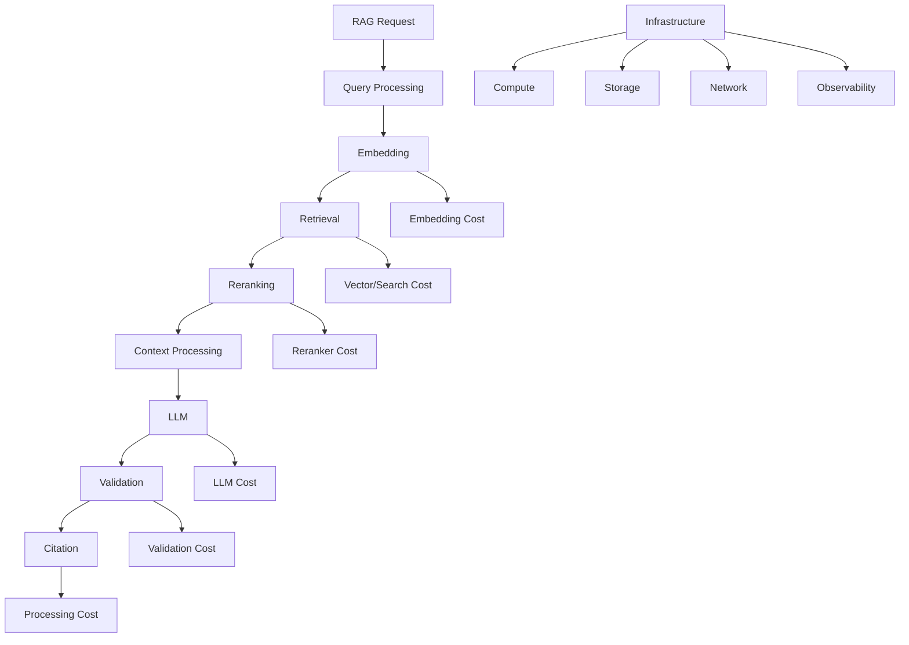
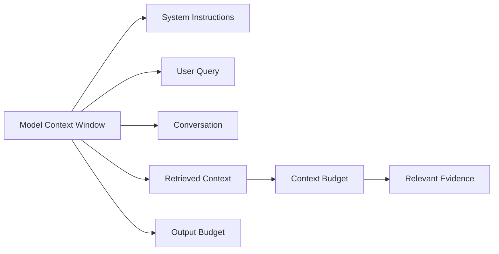
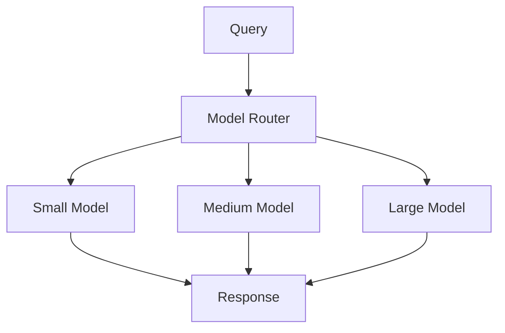
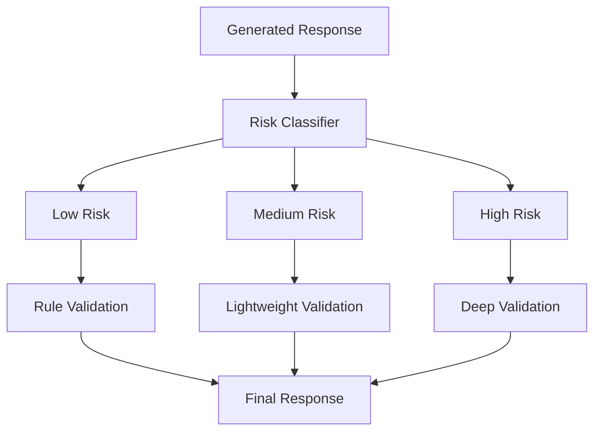
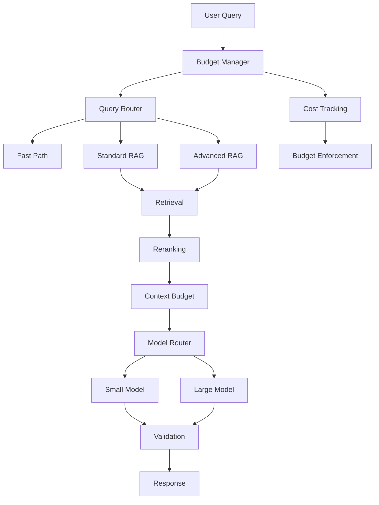
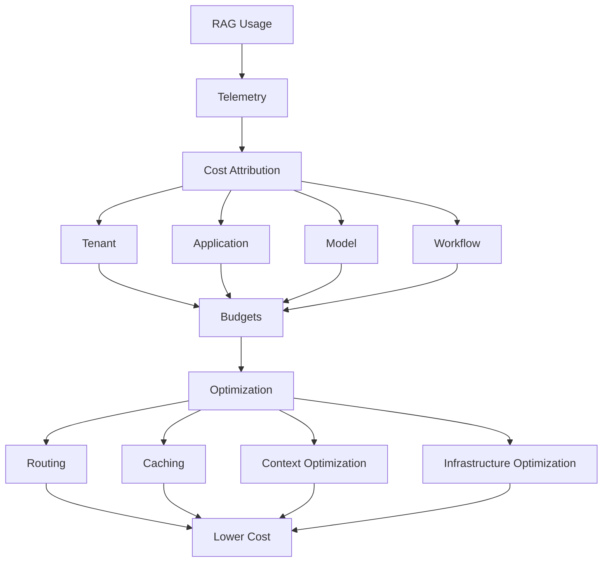

# 09. RAG Cost Optimization

> **Category:** Production RAG Engineering  
> **Module:** Part V — Advanced Retrieval-Augmented Generation  
> **Difficulty:** Advanced

---

## 📖 Overview

A production RAG system must be optimized not only for accuracy and latency, but also for **economic efficiency**.

A system that produces excellent answers but costs:

```text
$0.50 per request
```

may not be viable when serving:

```text
10,000 requests/day
```

Similarly, a system that is inexpensive but produces poor answers creates operational and business risk.

Production RAG cost optimization therefore focuses on the complete cost chain:

```text
User Query
    ↓
Query Processing
    ↓
Embedding
    ↓
Retrieval
    ↓
Reranking
    ↓
Context Processing
    ↓
Prompt Assembly
    ↓
LLM Generation
    ↓
Validation
    ↓
Citation
    ↓
Observability
```

The objective is:

```text
Quality
   +
Performance
   +
Reliability
   +
Security
   +
Cost Efficiency
```

A useful production principle is:

> **Do not minimize cost blindly. Minimize the cost of achieving the required quality, latency, and reliability.**

---

# 🎯 Learning Objectives

After completing this chapter, you will be able to:

- Understand RAG cost architecture
- Identify major RAG cost drivers
- Calculate cost per request
- Calculate cost per user
- Calculate cost per tenant
- Calculate cost per workflow
- Understand LLM token economics
- Optimize input token usage
- Optimize output token usage
- Optimize retrieval costs
- Optimize embedding costs
- Optimize reranking costs
- Optimize validation costs
- Optimize agentic RAG costs
- Optimize Graph RAG costs
- Optimize SQL RAG costs
- Optimize multimodal RAG costs
- Implement caching strategies
- Implement model routing
- Implement model cascading
- Implement adaptive retrieval
- Reduce unnecessary LLM calls
- Optimize context size
- Optimize prompt size
- Optimize infrastructure costs
- Optimize vector database costs
- Optimize observability costs
- Implement cost budgets
- Implement cost guardrails
- Implement tenant-level cost controls
- Build cost dashboards
- Detect cost anomalies
- Perform cost attribution
- Perform cost forecasting
- Design cost-aware RAG architectures

---

# 🧠 1. What Is RAG Cost Optimization?

RAG cost optimization is the process of reducing the resources required to serve RAG requests while preserving acceptable:

```text
Answer Quality
Latency
Reliability
Security
```

A simplified objective is:

```text
Cost ↓
Quality ↔
Latency ↔
Reliability ↔
```

---

# 🧠 2. RAG Cost Is More Than LLM Cost

A common mistake is:

```text
RAG Cost = LLM Cost
```

In reality:

```text
Total RAG Cost
       │
       ├── LLM
       ├── Embeddings
       ├── Reranking
       ├── Vector Database
       ├── Search Infrastructure
       ├── Compute
       ├── Storage
       ├── Network
       ├── Observability
       ├── Evaluation
       └── Background Processing
```

---

# 🧠 3. Cost Architecture



---

# 🧠 4. Cost Categories

A practical classification:

```text
Variable Cost
    ↓
Cost changes with requests/tokens

Fixed Cost
    ↓
Infrastructure that exists regardless of request volume

Semi-Variable Cost
    ↓
Resources that scale with workload
```

Examples:

### Variable

```text
LLM Tokens
Embedding Requests
Reranker Requests
Evaluation Calls
```

### Fixed

```text
Base Infrastructure
Monitoring Platform
Reserved Capacity
```

### Semi-Variable

```text
Vector DB
Compute
Storage
Network
```

---

# 🧠 5. Cost Per Request

A simplified model:

```text
C_request =
C_embedding
+ C_retrieval
+ C_reranking
+ C_context
+ C_generation
+ C_validation
+ C_observability
+ C_infrastructure
```


---

# 🧠 6. LLM Cost

LLM cost is commonly driven by:

```text
Input Tokens
+
Output Tokens
```

Conceptually:

```text
LLM Cost
=
Input Tokens × Input Price
+
Output Tokens × Output Price
```


Actual pricing varies by provider, model, region, and pricing program.

---

# 🧠 7. RAG Token Composition

A request may contain:

```text
System Prompt
+
User Query
+
Conversation History
+
Retrieved Context
+
Tool Results
+
Output
```

Therefore:

```text
Input Tokens
=
Instructions
+
Query
+
History
+
Context
+
Tools
```

---

# 🧠 8. Context Is Often the Largest Optimization Opportunity

Example:

```text
System Prompt       1,000 tokens
User Query            100 tokens
Conversation         900 tokens
Retrieved Context   8,000 tokens
───────────────────────────────
Input               10,000 tokens
```

If the context is reduced:

```text
8,000 → 3,000 tokens
```

the input token cost can fall significantly.

---

# 🧠 9. Context Cost

```text
Retrieved Documents
        ↓
Filtering
        ↓
Reranking
        ↓
Compression
        ↓
Final Context
        ↓
LLM
```

The goal is not:

```text
Retrieve Maximum Context
```

but:

```text
Retrieve Sufficient Evidence
```

---

# 🧠 10. Context Efficiency

A useful conceptual metric:

```text
Context Efficiency
=
Useful Evidence
──────────────────
Context Tokens
```

Higher is generally better.

This is not a universal standardized metric; use it as an engineering diagnostic.

---

# 🧠 11. Context Waste

Example:

```text
Context:
10,000 tokens

Useful:
3,000 tokens

Potentially irrelevant:
7,000 tokens
```

The system is paying for:

```text
10,000
```

while deriving useful information from approximately:

```text
3,000
```

---

# 🧠 12. Context Optimization

Use:

```text
Top-K Tuning
+
Reranking
+
MMR
+
Context Compression
+
Deduplication
+
Metadata Filtering
+
Token Budgeting
```

---

# 🧠 13. Token Budget

Define:

```text
Maximum Context Tokens
```

Example:

```text
Context Budget = 4,000
```

Then:

```text
Retrieved Candidates
        ↓
Rank
        ↓
Select
        ↓
Fit within Budget
```

---

# 🧠 14. Token Budget Architecture



---

# 🧠 15. Dynamic Context Budget

Not every query needs the same amount of context.

```text
Simple FAQ
    ↓
2,000 tokens

Technical Query
    ↓
4,000 tokens

Complex Multi-Hop Query
    ↓
8,000 tokens
```

Use adaptive budgets where appropriate.

---

# 🧠 16. Cost of Top-K

Increasing K can increase:

```text
Retrieval Work
Reranking Work
Context Tokens
LLM Input Cost
LLM Latency
```

Example:

```text
K = 5
    ↓
2,500 tokens

K = 20
    ↓
10,000 tokens
```

The quality improvement may not justify the additional cost.

---

# 🧠 17. Cost-Aware Top-K

Instead of:

```text
Always K = 20
```

use:

```text
Simple Query → K = 5
Complex Query → K = 10
High Uncertainty → K = 20
```

---

# 🧠 18. Adaptive Retrieval

```text
Query
 ↓
Retrieve Small Candidate Set
 ↓
Confidence Check
 │
 ├── High Confidence → Generate
 │
 └── Low Confidence → Expand Retrieval
```

This reduces expensive work for easy queries.

---

# 🧠 19. Early Exit

Example:

```text
Initial Retrieval
      ↓
Top Result Score = 0.94
      ↓
Evidence Sufficient?
      │
      ├── Yes → Generate
      └── No  → Expand
```

Use calibrated signals rather than arbitrary score thresholds.

---

# 🧠 20. Query Rewriting Cost

Query rewriting may require an LLM.

```text
User Query
    ↓
Rewrite Model
    ↓
Retrieval
```

If rewriting costs:

```text
$0.002/request
```

and is executed:

```text
1,000,000 times
```

the rewriting layer alone contributes:

```text
$2,000
```

before the main generation cost.

---

# 🧠 21. Conditional Query Rewriting

```text
Query
 ↓
Complexity Detector
 │
 ├── Simple → Direct Retrieval
 │
 └── Complex → Query Rewrite
```

This can significantly reduce unnecessary model calls.

---

# 🧠 22. Multi-Query Cost

Multi-query:

```text
Original
 ├── Query A
 ├── Query B
 ├── Query C
 └── Query D
```

may multiply:

```text
Embedding Calls
Retrieval Calls
Reranking Candidates
Network Requests
```

Use it when the quality improvement justifies the additional cost.

---

# 🧠 23. Multi-Query Cost Optimization

```text
Query
 ↓
Determine Need
 │
 ├── Low Ambiguity → Single Query
 │
 └── High Ambiguity → Multi-Query
```

---

# 🧠 24. Embedding Cost

Embedding cost can come from:

```text
Document Ingestion
Query Embeddings
Re-indexing
Evaluation
```

Query embeddings happen frequently.

Document embeddings can become expensive during large ingestion operations.

---

# 🧠 25. Embedding Cost Optimization

Use:

```text
Batching
Caching
Incremental Embedding
Change Detection
Smaller Models
Local Models
```

where quality requirements permit.

---

# 🧠 26. Avoid Re-Embedding Unchanged Documents

Use content hashes:

```python
import hashlib


def content_hash(text):

    return hashlib.sha256(
        text.encode("utf-8")
    ).hexdigest()
```

Pipeline:

```text
Document
   ↓
Hash
   ↓
Compare Previous Hash
   │
   ├── Same → Skip
   └── Changed → Re-Embed
```

---

# 🧠 27. Incremental Indexing

Bad:

```text
1,000,000 documents
        ↓
Document changes
        ↓
Re-embed 1,000,000
```

Better:

```text
1,000,000 documents
        ↓
500 changed
        ↓
Re-embed 500
```

---

# 🧠 28. Batch Embedding

```text
Document 1 ┐
Document 2 │
Document 3 ├── Batch → Embedding Model
Document 4 │
Document 5 ┘
```

Batching can reduce per-request overhead and improve accelerator utilization.

---

# 🧠 29. Embedding Model Economics

Compare:

```text
Model A
Quality = 91%
Cost = Low

Model B
Quality = 94%
Cost = Medium

Model C
Quality = 96%
Cost = High
```

Choose based on:

```text
Required Retrieval Quality
+
Cost Budget
+
Latency Target
```

---

# 🧠 30. Local vs Hosted Embeddings

### Hosted

```text
Application
    ↓
External Embedding API
```

Costs may include:

```text
API Usage
Network
```

### Local

```text
Application
    ↓
Local Embedding Model
```

Costs shift toward:

```text
Compute
GPU/CPU
Memory
Operations
```

Neither is universally cheaper.

---

# 🧠 31. Reranking Cost

Rerankers can be expensive because they may evaluate many query-document pairs.

Conceptually:

```text
Cost ∝ Number of Candidates
```


---

# 🧠 32. Candidate Reduction

Instead of:

```text
Retrieve 500
 ↓
Rerank 500
```

use:

```text
Dense Retrieval → 30
Sparse Retrieval → 30
Merge → 50
Rerank → 50
Select → 6
```

---

# 🧠 33. Reranker Selection

Possible options:

```text
Lightweight Reranker
Cross-Encoder
LLM Reranker
```

Use the least expensive approach that meets the quality requirement.

---

# 🧠 34. Selective Reranking

```text
Query
 ↓
Initial Retrieval
 ↓
Confidence
 │
 ├── High → Skip Reranker
 │
 └── Low → Rerank
```

This can reduce average cost.

---

# 🧠 35. LLM Cost

LLM cost often dominates production RAG economics.

```text
RAG Request
     │
     ▼
┌──────────────────────────┐
│        LLM COST          │
├──────────────────────────┤
│ Input Tokens             │
│ Output Tokens            │
│ Number of Calls          │
│ Model Selection          │
│ Retries                  │
│ Validation Calls         │
│ Agent Tool Calls         │
└──────────────────────────┘
```

---

# 🧠 36. Reduce Number of LLM Calls

One of the strongest cost optimizations:

```text
Do not call an LLM unless necessary.
```

Example:

```text
Query
 ↓
Classifier
 │
 ├── FAQ → Cached Answer
 ├── Search → Retrieval + Small LLM
 ├── Complex → Large LLM
 └── SQL → SQL Pipeline
```

---

# 🧠 37. Model Routing



The router should consider:

```text
Complexity
Risk
Latency
Cost
Required Reasoning
```

---

# 🧠 38. Model Cascade

```text
Small Model
     ↓
Confidence
 │
 ├── High → Final Answer
 │
 └── Low → Large Model
```

Average cost can decrease if most queries are successfully handled by the smaller model.

---

# 🧠 39. Model Routing Example

```text
FAQ
   ↓
Small Model

Technical Design
   ↓
Medium Model

Complex Multi-Hop Reasoning
   ↓
Large Model
```

---

# 🧠 40. Model Routing Economics

Suppose:

```text
80% queries → Small Model
20% queries → Large Model
```

instead of:

```text
100% → Large Model
```

the average cost can be substantially lower, assuming quality remains acceptable.

---

# 🧠 41. Output Token Optimization

Output tokens directly affect:

```text
Cost
Latency
```

Use:

```text
Response Length Policies
Max Output Tokens
Structured Output
Concise Instructions
```

---

# 🧠 42. Output Budget

```text
Simple Answer
    ↓
200 tokens

Technical Explanation
    ↓
800 tokens

Detailed Analysis
    ↓
1500 tokens
```

Do not allocate the maximum output budget to every request.

---

# 🧠 43. Response Contract

Example:

```text
Answer:
Maximum 5 bullet points.

Citations:
Only sources actually used.

Do not repeat the question.
```

This reduces unnecessary output.

---

# 🧠 44. Prompt Optimization

Prompt cost includes:

```text
System Prompt
Examples
Instructions
Context
Conversation History
Tool Results
```

Reduce:

```text
Repeated Instructions
Unused Examples
Duplicate Context
Excessive Formatting
```

---

# 🧠 45. Prompt Versioning

Use:

```text
prompt-v1
prompt-v2
prompt-v3
```

Measure:

```text
Quality
Tokens
Latency
Cost
```

A shorter prompt is not automatically better if quality drops.

---

# 🧠 46. Prompt Caching

If supported by the model/provider:

```text
Static Prompt Prefix
        ↓
Cache
        ↓
Dynamic Context + Query
```

Potentially reduces:

```text
Cost
Latency
```

---

# 🧠 47. Conversation Cost

Conversational RAG can become expensive because history grows.

```text
Turn 1 → 500 tokens
Turn 2 → 1,200 tokens
Turn 3 → 2,500 tokens
Turn 4 → 4,500 tokens
Turn 5 → 7,000 tokens
```

---

# 🧠 48. Conversation Compression

Instead of passing all history:

```text
Full History
     ↓
Conversation Summary
     ↓
Relevant Recent Turns
     ↓
LLM
```

---

# 🧠 49. Memory Budget

Set:

```text
Maximum Conversation Context
```

Use:

```text
Summary
+
Relevant Turns
+
Current Query
```

rather than blindly sending the complete conversation.

---

# 🧠 50. Semantic Conversation Selection

Retrieve only relevant historical messages:

```text
Conversation Memory
        ↓
Semantic Search
        ↓
Relevant Turns
        ↓
Prompt
```

This reduces token usage.

---

# 🧠 51. Retrieval Cache

Cache retrieval results for repeated requests.

Key should account for:

```text
Normalized Query
Retriever Version
Index Version
Metadata Filter
Tenant
Authorization Context
```

---

# 🧠 52. Cache Economics

If:

```text
100,000 requests
```

and:

```text
30% cache hits
```

then:

```text
30,000 requests
```

may avoid some downstream computation.

Actual savings depend on what the cache bypasses.

---

# 🧠 53. Semantic Cache

Example:

```text
Query A:
"What database does payment use?"

Query B:
"Which DB is used by payments?"
```

Potentially reuse the result.

But semantic caching must validate:

```text
Intent
Freshness
Authorization
Tenant
Knowledge Version
```

---

# 🧠 54. Cache Invalidation

Invalidate when:

```text
Document Changes
Index Changes
Embedding Changes
Prompt Changes
Retriever Changes
Authorization Changes
```

---

# 🧠 55. Cache Versioning

Example:

```text
tenant-a:
index:v12
retriever:v5
prompt:v8
embedding:v3
```

This prevents stale results from older pipeline versions.

---

# 🧠 56. Tenant Cost Attribution

Enterprise RAG should answer:

```text
How much does Tenant A cost?

How much does Tenant B cost?

Which tenant consumes the most tokens?

Which tenant generates the most expensive requests?
```

---

# 🧠 57. Cost Per Tenant

Example:

```text
Tenant A → $120/month
Tenant B → $480/month
Tenant C → $75/month
```

This enables:

```text
Chargeback
Budgeting
Quota Management
Optimization
```

---

# 🧠 58. Cost Per User

Track:

```text
Requests/User
Tokens/User
Cost/User
Model Usage/User
```

Avoid exposing user-level data broadly; apply appropriate privacy and access controls.

---

# 🧠 59. Cost by Application

Enterprise platforms may host:

```text
Support Copilot
Developer Assistant
Legal Assistant
Finance Assistant
Research Assistant
```

Track cost separately.

```text
Application
    ↓
Requests
    ↓
Tokens
    ↓
Cost
```

---

# 🧠 60. Cost by Workflow

A single application may have:

```text
Simple Search
Complex RAG
Agentic RAG
Graph RAG
SQL RAG
Document Analysis
```

Each can have a different cost profile.

---

# 🧠 61. Cost by Model

Track:

```text
Model A
Model B
Model C
```

with:

```text
Requests
Tokens
Latency
Quality
Cost
```

---

# 🧠 62. Cost by Provider

For multi-cloud enterprise systems:

```text
AWS
Azure
GCP
External Providers
Self-Hosted Models
```

compare:

```text
Cost
Latency
Quality
Availability
```

---

# 🧠 63. Reranking Cost by Query

Some queries may require:

```text
No Reranking
```

others:

```text
50 candidates
```

and complex queries:

```text
100 candidates
```

Use query-aware policies.

---

# 🧠 64. Agentic RAG Cost

Agentic RAG can multiply cost.

```text
User Query
   ↓
Planner
   ↓
Tool
   ↓
Observation
   ↓
Planner
   ↓
Tool
   ↓
Observation
   ↓
LLM
```

Potentially:

```text
Multiple LLM Calls
+
Multiple Retrieval Calls
+
Multiple Tool Calls
```

---

# 🧠 65. Agentic RAG Cost Guardrails

Define:

```text
Max Iterations
Max Tool Calls
Max Tokens
Max Execution Time
Max Cost
```

Example:

```text
Max Steps = 5
Max Tools = 8
Max Cost = $0.10
```

---

# 🧠 66. Agentic Early Termination

```text
Agent
 ↓
Evidence Sufficient?
 │
 ├── Yes → Final Answer
 └── No → Continue
```

Avoid unnecessary planning loops.

---

# 🧠 67. Agentic Loop Detection

Potential problem:

```text
Plan
 ↓
Search
 ↓
Plan
 ↓
Search
 ↓
Plan
 ↓
Search
```

Use:

```text
Iteration Limit
Repeated Action Detection
Budget Limit
```

---

# 🧠 68. Graph RAG Cost

Graph RAG may require:

```text
Graph Query
Entity Retrieval
Relationship Traversal
Subgraph Construction
LLM Reasoning
```

Cost can increase with traversal depth.

---

# 🧠 69. Graph Traversal Budget

Instead of:

```text
Unlimited Traversal
```

use:

```text
Maximum Hops
Maximum Nodes
Maximum Edges
Maximum Graph Query Time
```

---

# 🧠 70. SQL RAG Cost

SQL RAG can generate expensive queries.

Potential risks:

```text
Large Table Scan
Complex Join
Repeated Query
Unbounded Result Set
```

Use:

```text
Query Limits
Timeouts
Read-Only Access
Pagination
Query Validation
```

---

# 🧠 71. SQL Result Budget

Instead of:

```text
100,000 rows
```

use:

```text
Top-N
Aggregations
Pagination
Server-Side Filtering
```

Only return data required for reasoning.

---

# 🧠 72. Multimodal RAG Cost

Multimodal workloads may involve:

```text
OCR
Vision Models
Image Embeddings
Text Embeddings
Image Storage
Large Context
```

Optimize using:

```text
Selective OCR
Image Resizing
Compression
Cached Embeddings
Model Routing
```

---

# 🧠 73. Image Processing Cost

Avoid processing every image at maximum resolution.

```text
Image
 ↓
Determine Required Resolution
 ↓
Resize
 ↓
Vision Model
```

---

# 🧠 74. Validation Cost

If every answer invokes:

```text
Primary LLM
+
Validation LLM
+
Citation LLM
```

the cost can multiply.

Possible alternatives:

```text
Rules
+
Cheap Model
+
Selective Deep Validation
```

---

# 🧠 75. Risk-Based Validation



---

# 🧠 76. Cost-Aware Citation

Citations should ideally be produced using source metadata already carried through the pipeline.

```text
Retriever
 ↓
Chunk Metadata
 ↓
Context
 ↓
Response
 ↓
Citation
```

Avoid unnecessary additional LLM calls just to reconstruct sources.

---

# 🧠 77. Infrastructure Cost

Infrastructure includes:

```text
RAG Compute
Vector DB
Search Engine
Object Storage
Databases
GPU
Load Balancers
Network
Observability
```

---

# 🧠 78. Compute Optimization

Optimize:

```text
CPU Utilization
Memory
GPU Utilization
Autoscaling
Instance Size
Workload Scheduling
```

---

# 🧠 79. CPU vs GPU

Use GPU when:

```text
High Model Throughput
Large Embedding Workloads
Local Reranking
Local LLM Inference
```

CPU may be more appropriate for:

```text
Lightweight Retrieval
Metadata Filtering
Small Embedding Models
Low-Volume Workloads
```

---

# 🧠 80. GPU Utilization

Poor:

```text
GPU Utilization = 15%
```

while paying for a large GPU.

Potential solutions:

```text
Batching
Smaller GPU
Higher Concurrency
Model Quantization
Autoscaling
```

---

# 🧠 81. Autoscaling

Scale based on:

```text
Requests/sec
Queue Depth
CPU
Memory
GPU
Token Throughput
Latency
```

---

# 🧠 82. Scale-to-Zero

For workloads that are:

```text
Low Traffic
Batch
Development
Evaluation
```

scale-to-zero or scheduled compute can reduce infrastructure cost where supported.

---

# 🧠 83. Vector Database Cost

Vector DB cost depends on:

```text
Data Size
Vector Dimensions
Replication
Queries
Storage
Compute
Index Type
High Availability
```

---

# 🧠 84. Vector Storage Optimization

Reduce:

```text
Vector Dimensions
Duplicate Vectors
Unused Metadata
Old Versions
Redundant Indexes
```

where quality and operational requirements permit.

---

# 🧠 85. Data Lifecycle

Implement:

```text
Hot
 ↓
Warm
 ↓
Cold
 ↓
Archive
 ↓
Delete
```

Not every document needs identical storage characteristics.

---

# 🧠 86. Document Retention

Enterprise knowledge bases may contain:

```text
Active Documents
Historical Documents
Expired Documents
Archived Documents
```

Remove expired data from the active retrieval path when policy allows.

---

# 🧠 87. Storage Tiering

```text
Hot Knowledge
    ↓
Fast Vector Search

Cold Knowledge
    ↓
Lower-Cost Storage
```

Retrieve cold data only when required.

---

# 🧠 88. Network Cost

Network costs may come from:

```text
LLM API Calls
Vector DB
Object Storage
Cross-Region Traffic
Microservice Calls
Telemetry
```

Reduce unnecessary payloads and cross-region communication.

---

# 🧠 89. Region Optimization

Choose infrastructure locations based on:

```text
Latency
Data Residency
Compliance
Availability
Provider Pricing
```

Do not optimize cost by violating data residency or regulatory requirements.

---

# 🧠 90. Observability Cost

Observability can become expensive when capturing:

```text
Full Prompts
Full Context
Full Documents
Every Trace
Every Token
```

Use:

```text
Sampling
Redaction
Aggregation
Retention
Selective Payload Capture
```

---

# 🧠 91. Evaluation Cost

RAG evaluation can itself consume LLM calls.

```text
Production Dataset
      ↓
Evaluation Model
      ↓
Scores
```

Large evaluation suites can become expensive.

---

# 🧠 92. Evaluation Sampling

Instead of evaluating:

```text
100% of requests
```

consider:

```text
100% Critical Requests
100% Failures
100% Low-Quality Signals
Sample Normal Requests
```

The right sampling policy depends on the application's risk.

---

# 🧠 93. Continuous Evaluation Cost

Use:

```text
Offline Evaluation
+
Production Sampling
+
Human Review
```

rather than evaluating every request with expensive models.

---

# 🧠 94. Cost-Aware Evaluation

Prioritize:

```text
New Model
New Retriever
New Prompt
New Knowledge Base
High-Risk Domain
Production Regression
```

---

# 🧠 95. Cost Anomaly Detection

Monitor:

```text
Average Cost / Request
Tokens / Request
Requests / Tenant
Model Distribution
Cache Hit Rate
```

---

# 🧠 96. Cost Spike Example

```text
Normal:

$0.018/request

Suddenly:

$0.031/request
```

Investigate:

```text
Context Tokens ↑
Model Routing Changed
Reranking Enabled
Validation Added
Cache Hit Rate ↓
```

---

# 🧠 97. Cost Dashboard

```text
┌──────────────────────────────────────────────┐
│              RAG COST DASHBOARD             │
├──────────────────────────────────────────────┤
│ Requests/day                    120,000      │
│ Avg Cost/request                $0.018       │
│ Daily Cost                      $2,160       │
│ Monthly Forecast                $64,800      │
│                                              │
│ LLM                              69%         │
│ Embeddings                       11%         │
│ Reranking                         7%         │
│ Vector DB                         6%         │
│ Infrastructure                    4%         │
│ Observability                     3%         │
│                                              │
│ Cache Hit Rate                   31%         │
│ Avg Context Tokens              3,900        │
│ Avg Output Tokens                 420        │
└──────────────────────────────────────────────┘
```

Values are illustrative.

---

# 🧠 98. Cost Breakdown

```text
                    TOTAL COST
                         │
        ┌────────────────┼────────────────┐
        ▼                ▼                ▼
       AI              DATA             PLATFORM
        │                │                │
    LLM Tokens       Vector DB         Compute
    Embeddings       Storage           Network
    Reranker         Search            Observability
    Evaluation       Object Storage
```

---

# 🧠 99. Cost per Request Formula

If:

```text
Daily Cost = $2,160
Daily Requests = 120,000
```

then:

```text
Cost/request
=
2160 / 120000
=
$0.018
```


---

# 🧠 100. Monthly Cost Forecast

A simple estimate:

```text
Monthly Cost
=
Average Daily Cost × Number of Days
```


Example:

```text
$2,160 × 30
=
$64,800
```

This is a simple forecast and does not account for traffic growth or tiered pricing.

---

# 🧠 101. Cost Forecasting

Forecast using:

```text
Requests
+
Tokens
+
Model Mix
+
Infrastructure
```

Example:

```text
Current:
100K requests/day

Projected:
200K requests/day
```

But cost may not exactly double if:

```text
Caching improves
Model mix changes
Reserved capacity applies
```

---

# 🧠 102. Cost Elasticity

Measure:

```text
Traffic +10%
Cost +?
```

A highly elastic architecture may scale cost almost linearly.

An optimized architecture can sometimes achieve:

```text
Traffic ↑
Cost ↑ slower than traffic
```

through:

```text
Caching
Batching
Autoscaling
Efficient Models
```

---

# 🧠 103. Cost per Successful Answer

A more useful business metric than raw cost:

```text
Cost per Successful Answer
=
Total Cost
────────────────────
Successful Answers
```

This captures quality.

---

# 🧠 104. Cost per High-Quality Answer

Example:

```text
Total Cost:
$10,000

High-Quality Answers:
800,000
```

Then:

```text
$10,000 / 800,000
=
$0.0125
```

---

# 🧠 105. Quality-Adjusted Cost

Conceptually:

```text
Quality-Adjusted Cost
=
Cost
────────────
Quality Score
```

This can help compare architectures.

However, quality scores must be defined consistently.

---

# 🧠 106. Cost vs Quality

```text
Quality
  ▲
  │                 ●
  │             ●
  │         ●
  │      ●
  │   ●
  └────────────────────────► Cost
```

There is often a point of diminishing returns.

---

# 🧠 107. Diminishing Returns

Example:

```text
Cost       Quality

$0.01       85%
$0.015      91%
$0.02       94%
$0.04       95%
$0.08       95.5%
```

The additional:

```text
$0.04
```

may not justify:

```text
+0.5%
```

depending on the use case.

---

# 🧠 108. Cost Optimization Frontier

```text
                 Quality
                    ▲
                    │
                    │       ●
                    │     ●
                    │   ●
                    │ ●
                    └──────────────────► Cost
```

The goal is to operate near an efficient frontier rather than blindly choosing the cheapest or most accurate configuration.

---

# 🧠 109. Cost Guardrails

Production systems should have limits:

```text
Max Cost / Request
Max Tokens / Request
Max Agent Iterations
Max Tool Calls
Max Retrieval Candidates
Max Context Tokens
```

---

# 🧠 110. Request Budget

Example:

```text
Request Budget = $0.10
```

Pipeline:

```text
Query
 ↓
Budget Check
 ↓
Retrieval
 ↓
Reranking
 ↓
Generation
 ↓
Remaining Budget?
```

---

# 🧠 111. Budget-Aware Routing

```text
Budget = $0.10

Small Model:
$0.01

Reranker:
$0.02

Large Model:
$0.08
```

If the request has already consumed:

```text
$0.07
```

a cheaper path may be selected.

---

# 🧠 112. Agent Cost Budget

```text
Agent
 │
 ├── Step 1 → $0.01
 ├── Step 2 → $0.02
 ├── Step 3 → $0.02
 └── Step 4 → $0.03
              │
              ▼
           $0.08
              │
              ▼
        Budget = $0.10
```

Next expensive action may be blocked.

---

# 🧠 113. Tenant Budgets

Example:

```text
Tenant A
Monthly Budget:
$5,000

Tenant B
Monthly Budget:
$2,000
```

Use:

```text
Quota
Warning Threshold
Hard Limit
```

according to business policy.

---

# 🧠 114. Soft vs Hard Budgets

### Soft Budget

```text
80%
 ↓
Warning
```

### Hard Budget

```text
100%
 ↓
Block / Degrade
```

---

# 🧠 115. Graceful Degradation

When budget is constrained:

```text
Large Model
    ↓
Small Model
```

or:

```text
Advanced RAG
    ↓
Fast Retrieval
```

or:

```text
Deep Validation
    ↓
Light Validation
```

---

# 🧠 116. Cost-Aware Architecture



---

# 🧠 117. Cost-Aware Retrieval

A production retriever should consider:

```text
Quality
Latency
Cost
```

not only:

```text
Similarity Score
```

---

# 🧠 118. Cost-Aware Query Routing

```text
Query
 │
 ├── Cheap Route
 │
 ├── Standard Route
 │
 └── Expensive Route
```

Use the expensive route only when required.

---

# 🧠 119. Cost-Aware Validation

```text
Low Risk
  ↓
No expensive validator

Medium Risk
  ↓
Cheap validator

High Risk
  ↓
Deep validator
```

---

# 🧠 120. Cost-Aware Agentic RAG

Agent should understand:

```text
Remaining Budget
Remaining Steps
Remaining Tokens
```

Example:

```json
{
  "max_cost": 0.10,
  "spent": 0.063,
  "remaining": 0.037,
  "max_steps": 5,
  "steps_used": 3
}
```

---

# 🧠 121. Cost-Aware Graph RAG

Use:

```text
Maximum Hops
Maximum Nodes
Maximum Edges
Maximum Query Time
```

to prevent runaway graph exploration.

---

# 🧠 122. Cost-Aware SQL RAG

Use:

```text
Query Timeout
Row Limit
Read-Only Mode
Cost Estimation
Execution Plan
```

where supported.

---

# 🧠 123. Cost-Aware Multimodal RAG

Use:

```text
Image Resolution Policy
OCR Selection
Vision Model Routing
Image Cache
Embedding Cache
```

---

# 🧠 124. Cost-Aware Evaluation

Prioritize evaluation of:

```text
New Models
New Prompts
New Retrieval
High-Risk Queries
Production Failures
User Negative Feedback
```

---

# 🧠 125. Cost Optimization by Layer

```text
Layer                Optimization

Query                Routing / Rewrite selectively
Embedding            Cache / Batch
Retrieval            Top-K / ANN
Hybrid               Parallel / Candidate reduction
Reranking            Smaller candidate set
Context              Compression / Deduplication
Prompt               Shorter / Cache
LLM                  Model routing
Validation           Risk-based
Citation             Metadata propagation
Agent                Step budgets
Graph                Traversal limits
SQL                  Query limits
Multimodal           Resolution / routing
Infrastructure       Autoscaling
Observability         Sampling
```

---

# 🧠 126. Cost Optimization Priority

A practical sequence:

```text
1. Measure total cost
2. Identify largest cost component
3. Reduce unnecessary work
4. Reduce token volume
5. Reduce number of model calls
6. Add caching
7. Introduce model routing
8. Optimize retrieval
9. Optimize infrastructure
10. Add budget guardrails
11. Continuously benchmark
```

---

# 🧠 127. Cost Optimization Example

Baseline:

```text
Top-K              = 20
Reranker           = 20
Context            = 8,000 tokens
LLM                = Large
Validation         = Large LLM
Cache              = None
```

Optimized:

```text
Top-K              = Adaptive
Reranker           = Selective
Context            = 4,000 tokens
LLM                = Routed
Validation         = Risk-Based
Cache              = Enabled
```

---

# 🧠 128. Example Cost Comparison

| Configuration | Tokens | LLM Calls | Avg Cost | p95 Latency |
|---|---:|---:|---:|---:|
| Baseline | 8,500 | 3 | $0.052 | 2.8s |
| Context Optimized | 5,000 | 3 | $0.035 | 2.2s |
| Model Routing | 5,000 | 2 | $0.021 | 1.7s |
| Cached + Routed | 5,000 | 1.4 avg | $0.015 | 1.3s |

Values are illustrative.

---

# 🧠 129. Cost Optimization Experiment

Hypothesis:

```text
Reducing context from 8K
to 4K tokens will reduce cost
without materially reducing quality.
```

Measure:

```text
Cost
Latency
Faithfulness
Answer Relevance
Citation Accuracy
```

---

# 🧠 130. Cost Experiment Matrix

| Experiment | Cost | Latency | Quality | Decision |
|---|---:|---:|---:|---|
| Baseline | — | — | — | — |
| Context Reduction | — | — | — | — |
| Smaller Model | — | — | — | — |
| Caching | — | — | — | — |
| Selective Reranking | — | — | — | — |
| Model Routing | — | — | — | — |
| Adaptive Retrieval | — | — | — | — |

Populate using real benchmarks.

---

# 🧪 131. Practical Project

Build a:

> **Production RAG Cost Optimization Lab**

Start with a baseline RAG system and progressively optimize:

```text
Token Usage
LLM Calls
Retrieval
Reranking
Context
Caching
Model Selection
Infrastructure
```

---

# 🧪 132. Baseline Project

```text
Query
 ↓
Embedding
 ↓
Vector Search
 ↓
Top-10
 ↓
Reranking
 ↓
Large LLM
 ↓
Validation LLM
 ↓
Response
```

Measure:

```text
Cost
Latency
Tokens
Quality
```

---

# 🧪 133. Optimization Stage 1 — Context

Change:

```text
10 chunks
```

to:

```text
Adaptive context selection
```

Measure:

```text
Tokens
Cost
Quality
```

---

# 🧪 134. Optimization Stage 2 — Reranking

Change:

```text
Rerank 100
```

to:

```text
Retrieve 50
Rerank 30
Select 6
```

Measure:

```text
Latency
Cost
Recall
Answer Quality
```

---

# 🧪 135. Optimization Stage 3 — Model Routing

```text
Simple
 ↓
Small Model

Complex
 ↓
Large Model
```

Measure:

```text
Model Distribution
Cost
Quality
Latency
```

---

# 🧪 136. Optimization Stage 4 — Caching

Add:

```text
Embedding Cache
Retrieval Cache
Semantic Cache
```

Measure:

```text
Hit Rate
Cost Reduction
Latency Reduction
```

---

# 🧪 137. Optimization Stage 5 — Adaptive Retrieval

```text
Initial Retrieval
      ↓
Confidence
 │
 ├── High → Generate
 └── Low → Expand
```

Measure:

```text
Average Retrieval Work
Cost
Recall
Quality
```

---

# 🧪 138. Optimization Stage 6 — Budget Guardrails

Implement:

```text
Max Cost
Max Tokens
Max LLM Calls
Max Retrieval Candidates
Max Agent Steps
```

Test:

```text
Normal Query
Complex Query
Adversarial Query
Runaway Agent
```

---

# 🧪 139. Cost Test Dataset

Include:

```text
Simple Queries
Complex Queries
Long Queries
Multi-Hop Queries
No-Answer Queries
Repeated Queries
Ambiguous Queries
SQL Queries
Graph Queries
Multimodal Queries
Agentic Queries
```

---

# 🧪 140. Cost Benchmark Harness

```python
def benchmark_cost(rag, queries):

    results = []

    for query in queries:

        result = rag.answer(query)

        results.append({
            "query": query,
            "cost": result.cost,
            "latency_ms": result.latency_ms,
            "input_tokens": result.input_tokens,
            "output_tokens": result.output_tokens,
            "llm_calls": result.llm_calls
        })

    return results
```

---

# 🧪 141. Cost Metrics

Track:

```text
Cost / Request
Cost / Successful Answer
Cost / High-Quality Answer
Cost / Tenant
Cost / User
Cost / Workflow
Cost / Model
Cost / Provider
```

---

# 🧪 142. Token Metrics

Track:

```text
Input Tokens
Output Tokens
Context Tokens
Conversation Tokens
Tool Tokens
Total Tokens
```

---

# 🧪 143. Model Metrics

Track:

```text
Model
Requests
Tokens
Latency
Quality
Cost
Fallback Rate
```

---

# 🧪 144. Cache Metrics

Track:

```text
Cache Hit Rate
Cache Miss Rate
Saved Requests
Saved Tokens
Saved Cost
Stale Results
Invalidations
```

---

# 🧪 145. Budget Metrics

Track:

```text
Budget Utilization
Requests Over Budget
Soft Limit Warnings
Hard Limit Blocks
Graceful Degradations
```

---

# 🧪 146. Cost Dashboard

A production dashboard should show:

```text
┌────────────────────────────────────────────┐
│             COST OVERVIEW                 │
├────────────────────────────────────────────┤
│ Daily Cost                    $2,160      │
│ Monthly Forecast             $64,800      │
│ Cost / Request                 $0.018      │
│ Cost / Success                 $0.021      │
│                                            │
│ Input Tokens                    4,100      │
│ Output Tokens                     390      │
│ Cache Hit Rate                    31%      │
│                                            │
│ LLM                             69%        │
│ Embedding                       11%        │
│ Reranking                        7%        │
│ Vector DB                        6%        │
│ Infra                            4%        │
│ Observability                    3%        │
└────────────────────────────────────────────┘
```

Illustrative values.

---

# 🧪 147. Tenant Cost Dashboard

```text
Tenant      Requests     Tokens       Cost

Tenant A      40K        120M       $1,200
Tenant B      20K         90M         $900
Tenant C      10K         30M         $300
```

This enables chargeback and optimization.

---

# 🧪 148. Cost Anomaly Detection

Alert when:

```text
Cost/request > baseline × 1.30
```

or:

```text
Daily cost > expected budget
```

or:

```text
Token usage increases unexpectedly
```

---

# 🧪 149. Example Cost Alert

```text
ALERT: RAG cost anomaly

Average cost/request:
$0.018

Current:
$0.029

Increase:
61%

Primary signal:
Context tokens +72%

Possible cause:
Top-K configuration changed.
```

---

# 🧠 150. Cost Governance

Enterprise RAG should define:

```text
Budget
Quota
Model Policy
Token Policy
Retention Policy
Cache Policy
Routing Policy
```

---

# 🧠 151. Model Governance

Define:

```text
Approved Models
Maximum Model Tier
Allowed Providers
Allowed Regions
Fallback Models
```

---

# 🧠 152. Cost Governance by Risk

Different workloads can have different budgets:

```text
Low Risk
   ↓
Low-Cost Model

Medium Risk
   ↓
Standard Model

High Risk
   ↓
Premium Model + Validation
```

---

# 🧠 153. FinOps for RAG

RAG can adopt FinOps principles:

```text
Visibility
      ↓
Allocation
      ↓
Optimization
      ↓
Governance
      ↓
Continuous Improvement
```

---

# 🧠 154. RAG FinOps Architecture



---

# 🧠 155. Production Cost Optimization Architecture

```text
                         USER
                           │
                           ▼
                    ┌─────────────┐
                    │ RAG API     │
                    └──────┬──────┘
                           │
                           ▼
                  ┌─────────────────┐
                  │ Budget Manager  │
                  └────────┬────────┘
                           │
                           ▼
                    Query Router
                           │
              ┌────────────┼────────────┐
              ▼            ▼            ▼
           Fast Path    Standard     Advanced
              │            │            │
              └────────────┼────────────┘
                           ▼
                      Retrieval
                           │
                           ▼
                       Reranking
                           │
                           ▼
                    Context Budget
                           │
                           ▼
                      Model Router
                           │
                  ┌────────┴────────┐
                  ▼                 ▼
              Small LLM         Large LLM
                  │                 │
                  └────────┬────────┘
                           ▼
                       Validation
                           │
                           ▼
                        Citation
                           │
                           ▼
                       Response

                           │
                           ▼
                    Cost Telemetry
                           │
              ┌────────────┼────────────┐
              ▼            ▼            ▼
           Tenant       Model        Workflow
            Cost         Cost           Cost
              │            │            │
              └────────────┼────────────┘
                           ▼
                    Cost Dashboard
                           │
                           ▼
                     Optimization
```

---

# 🧠 156. Cost Optimization Maturity

### Level 1 — Basic Visibility

```text
Track LLM Cost
```

### Level 2 — Token Visibility

```text
Input
Output
Context
```

### Level 3 — Component Cost

```text
Embedding
Retrieval
Reranking
LLM
```

### Level 4 — Cost Attribution

```text
Tenant
User
Application
Workflow
```

### Level 5 — Cost Controls

```text
Budgets
Quotas
Guardrails
```

### Level 6 — Cost-Aware RAG

```text
Adaptive Retrieval
Model Routing
Caching
Context Optimization
```

### Level 7 — Autonomous Optimization

```text
Measure
   ↓
Detect
   ↓
Optimize
   ↓
Benchmark
   ↓
Deploy
```

---

# 🧠 157. Cost Optimization Mental Model

```text
                         RAG COST
                            │
       ┌────────────────────┼────────────────────┐
       ▼                    ▼                    ▼
      AI                  DATA                PLATFORM
       │                    │                    │
      LLM               Vector DB            Compute
      Embedding         Storage              Network
      Reranker          Search               Observability
      Evaluation
       │                    │                    │
       └────────────────────┼────────────────────┘
                            ▼
                       COST CONTROL
                            │
              ┌─────────────┼─────────────┐
              ▼             ▼             ▼
           Reduce         Reuse         Route
           Work           Work          Work
              │             │             │
              └─────────────┼─────────────┘
                            ▼
                       COST / QUALITY
```

---

# 🧠 158. Final Cost Optimization Loop

```text
Measure
   ↓
Attribute
   ↓
Find Largest Cost Driver
   ↓
Remove Unnecessary Work
   ↓
Reduce Tokens
   ↓
Reduce Model Calls
   ↓
Cache
   ↓
Route
   ↓
Optimize Infrastructure
   ↓
Apply Budgets
   ↓
Benchmark Quality
   ↓
Deploy
   ↓
Monitor
   ↓
Repeat
```

---

# 🧠 159. Production Principles

### Principle 1

> **The cheapest request is the request you do not need to execute.**

Use:

```text
Cache
Early Exit
Routing
Deduplication
```

---

### Principle 2

> **The second-cheapest request is the one executed with the smallest suitable model.**

---

### Principle 3

> **Context is a cost center.**

Do not treat retrieved tokens as free.

---

### Principle 4

> **Every additional RAG stage has an economic cost.**

Before adding:

```text
Reranking
Query Rewriting
Validation
Agent Planning
```

measure the quality improvement.

---

### Principle 5

> **Optimize cost per successful answer, not cost per request alone.**

---

# 🧠 160. Production RAG Cost Checklist

```text
☐ Calculate cost/request
☐ Calculate cost/successful answer
☐ Calculate cost/high-quality answer
☐ Track LLM input tokens
☐ Track LLM output tokens
☐ Track context tokens
☐ Track conversation tokens
☐ Track embedding cost
☐ Track reranking cost
☐ Track retrieval infrastructure
☐ Track vector DB cost
☐ Track compute cost
☐ Track network cost
☐ Track observability cost
☐ Track evaluation cost

☐ Optimize context size
☐ Optimize Top-K
☐ Optimize reranking candidates
☐ Optimize query rewriting
☐ Optimize multi-query
☐ Batch embeddings
☐ Cache embeddings
☐ Incrementally embed documents
☐ Use content hashes
☐ Optimize vector indexes

☐ Cache retrieval
☐ Implement semantic cache where appropriate
☐ Version caches
☐ Implement cache invalidation
☐ Preserve tenant isolation

☐ Implement model routing
☐ Implement model cascades
☐ Use smaller models where appropriate
☐ Limit output tokens
☐ Optimize prompts
☐ Use prompt caching where appropriate

☐ Implement selective validation
☐ Optimize citation processing
☐ Limit agent iterations
☐ Limit agent tool calls
☐ Limit agent token budgets
☐ Limit Graph RAG traversal
☐ Limit SQL result sets
☐ Optimize multimodal processing

☐ Optimize compute
☐ Optimize GPU utilization
☐ Optimize vector DB
☐ Optimize storage
☐ Optimize network
☐ Implement autoscaling
☐ Separate workloads
☐ Implement backpressure

☐ Implement tenant budgets
☐ Implement application budgets
☐ Implement workflow budgets
☐ Implement request budgets
☐ Implement soft limits
☐ Implement hard limits
☐ Implement graceful degradation

☐ Build cost dashboards
☐ Build tenant dashboards
☐ Build model dashboards
☐ Build workflow dashboards
☐ Detect anomalies
☐ Forecast costs
☐ Benchmark optimizations
☐ Monitor quality regressions
☐ Review cost continuously
```

---

# 📚 161. Key Takeaways

- RAG cost is broader than LLM API cost.
- Cost should be measured across the entire architecture.
- LLM tokens are often a major cost driver.
- Context size is one of the most important optimization opportunities.
- Reduce unnecessary context before reducing model quality.
- Do not blindly increase Top-K.
- Use adaptive retrieval where appropriate.
- Query rewriting should be conditional when possible.
- Multi-query retrieval should justify its additional cost.
- Batch embedding operations.
- Cache repeated embeddings.
- Avoid re-embedding unchanged documents.
- Use incremental indexing.
- Use content hashes for change detection.
- Reranking cost grows with candidate volume.
- Reduce candidates before expensive reranking.
- Selective reranking can reduce cost.
- Model routing can significantly reduce average LLM cost.
- Model cascades can use expensive models only when required.
- Output token limits reduce both cost and latency.
- Prompt optimization reduces unnecessary input tokens.
- Conversation compression controls growing history cost.
- Retrieval caching can avoid repeated downstream computation.
- Semantic caching requires careful freshness and authorization controls.
- Cache versioning is essential.
- Tenant isolation must apply to caches.
- Agentic RAG requires explicit cost budgets.
- Agent loops must have limits.
- Graph traversal should have bounded depth and result size.
- SQL RAG requires execution and result-size controls.
- Multimodal RAG requires image and vision cost controls.
- Validation should be risk-based where appropriate.
- Citation processing should reuse source metadata.
- Infrastructure cost matters alongside model cost.
- Vector DB cost depends on storage, compute, replication, and workload.
- Autoscaling can reduce idle infrastructure costs.
- Storage tiering can reduce long-term knowledge-base costs.
- Observability can itself become a significant cost center.
- Evaluation should be sampled intelligently where appropriate.
- Cost should be attributable by tenant, application, model, and workflow.
- Cost budgets provide predictable governance.
- Cost guardrails protect against runaway agentic or high-token requests.
- Graceful degradation allows systems to remain useful under budget constraints.
- RAG FinOps combines visibility, allocation, optimization, and governance.
- Cost optimization must preserve quality and reliability.
- The correct target is not minimum cost.
- The correct target is **minimum cost for the required production quality and service level**.

---

# 🧭 162. Chapter Navigation

### Part V — Advanced Retrieval-Augmented Generation

**Previous:**  
[08. RAG Performance Optimization](08-rag-performance-optimization.md)

**Next:**  
[10. Production Retrieval Architecture](10-production-retrieval-architecture.md)

**Section:**  
06 — Production RAG Engineering

### Production RAG Engineering Path

```text
01 Prompt Assembly
        ↓
02 Context Selection & Context Engineering
        ↓
03 Response Validation
        ↓
04 Citation & Source Attribution
        ↓
05 Enterprise Response
        ↓
06 RAG Evaluation & Benchmarking
        ↓
07 RAG Observability
        ↓
08 RAG Performance Optimization
        ↓
09 RAG Cost Optimization
        ↓
10 Production Retrieval Architecture
        ↓
11 Building Production RAG Systems
```

---

> **Enterprise AI Engineering Handbook**  
> *Building Production-Grade Enterprise AI Systems — One Chapter at a Time.*