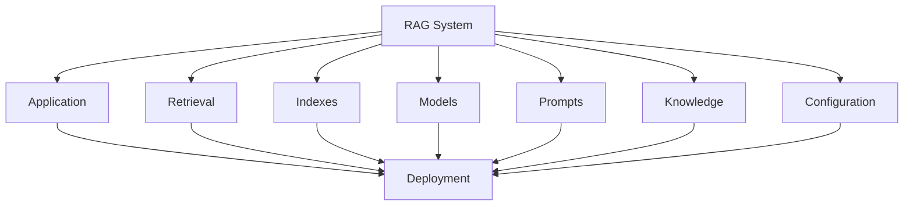
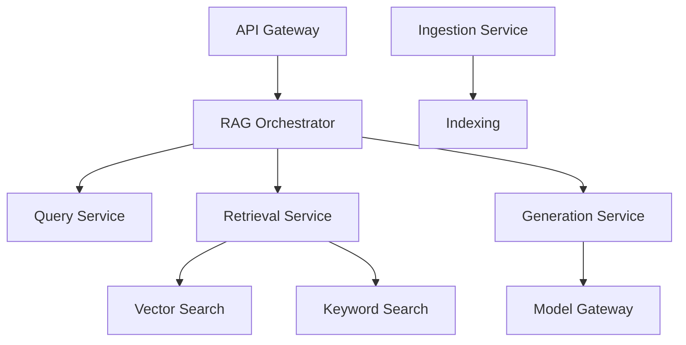
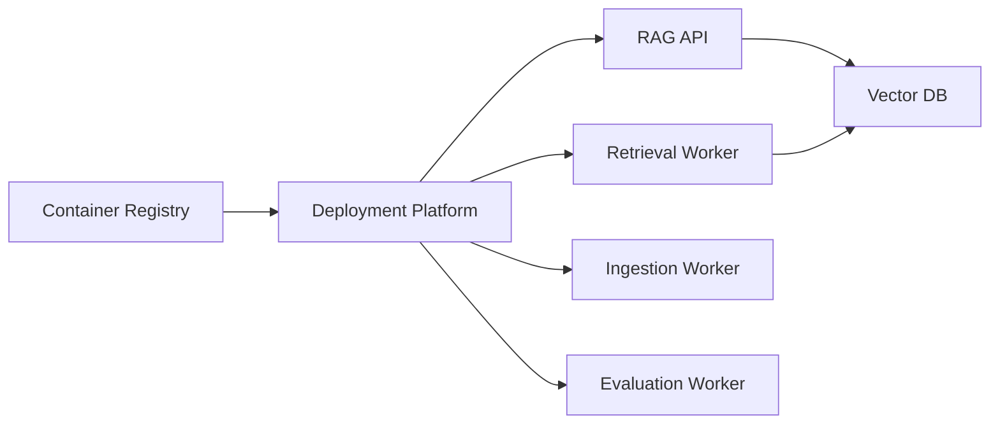
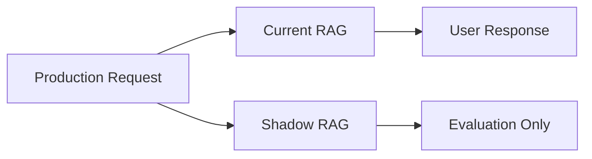
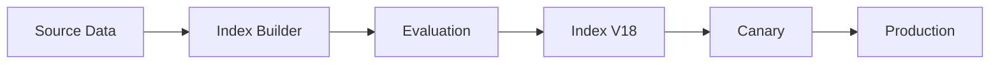
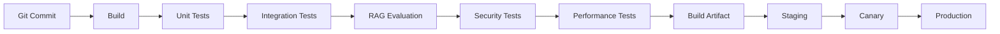
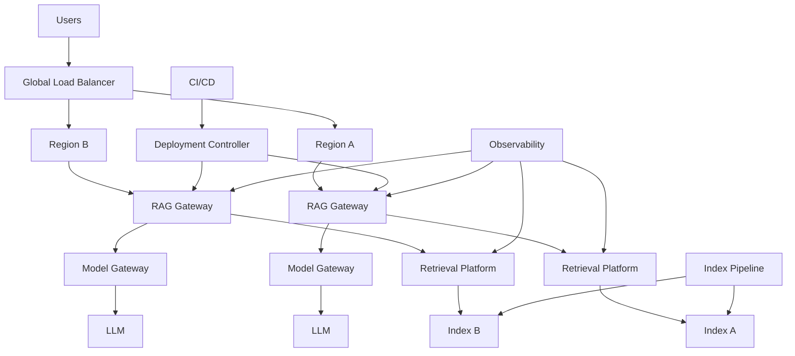
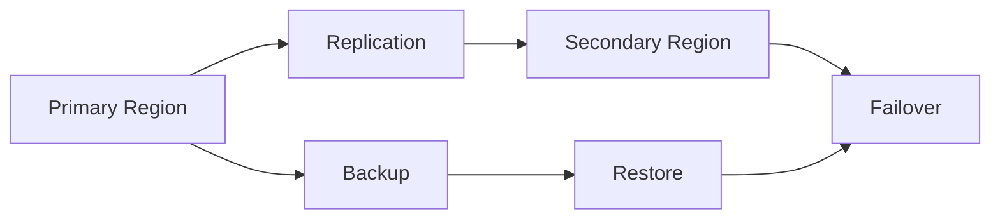

# 12. RAG Deployment Patterns

> **Category:** Production RAG Engineering  
> **Module:** Part VI — Production Deployment  
> **Difficulty:** Advanced

---

## 📖 Overview

Deploying a RAG system is not simply a matter of running an API and connecting it to a vector database.

A production RAG deployment must account for:

```text
Application Deployment
        ↓
Retrieval Deployment
        ↓
Index Deployment
        ↓
Model Deployment
        ↓
Knowledge Deployment
        ↓
Configuration Deployment
        ↓
Observability
        ↓
Security
        ↓
Scalability
        ↓
Rollback
```

Different workloads require different deployment patterns.

For example:

```text
Small Internal RAG
    → Single Service

Enterprise RAG
    → Microservices

High-Traffic RAG
    → Horizontally Scaled Services

High-Risk RAG
    → Canary / Blue-Green

Global RAG
    → Multi-Region

Frequently Changing RAG
    → Independent Index Deployment
```

The goal is not to choose the most complex deployment pattern.

The goal is to choose the **simplest deployment architecture that satisfies the required quality, availability, latency, security, scalability, and cost objectives.**

---

# 🎯 Learning Objectives

After completing this chapter, you will be able to:

- Understand major RAG deployment patterns
- Design monolithic RAG deployments
- Design modular RAG deployments
- Design microservice-based RAG platforms
- Understand serverless RAG deployment
- Deploy RAG using containers
- Deploy RAG using Kubernetes
- Design blue-green deployments
- Design rolling deployments
- Design canary deployments
- Design shadow deployments
- Design A/B deployments
- Design multi-region RAG
- Design active-active architectures
- Design active-passive architectures
- Deploy retrieval and generation independently
- Deploy indexes independently from application code
- Design model rollout strategies
- Design embedding migration strategies
- Design zero-downtime RAG deployments
- Design rollback mechanisms
- Design disaster recovery
- Design deployment pipelines
- Build CI/CD quality gates
- Design environment strategies
- Understand infrastructure-as-code for RAG
- Design deployment observability
- Choose appropriate deployment patterns based on workload requirements

---

# 🧠 1. Why RAG Deployment Is Different

Traditional backend deployment often looks like:

```text
Code
 ↓
Build
 ↓
Test
 ↓
Deploy
```

RAG introduces additional deployable components:

```text
Application
Retriever
Embedding Model
Vector Index
Keyword Index
Reranker
Prompt
LLM
Knowledge Base
Configuration
Evaluation Dataset
```

Therefore:

```text
RAG Deployment
≠
Application Deployment
```

It is a coordinated deployment of multiple versioned artifacts.

---

# 🧠 2. RAG Deployment Surface



---

# 🧠 3. Version Everything

A production RAG deployment should identify:

```text
Application Version
Retriever Version
Embedding Version
Index Version
Reranker Version
Prompt Version
LLM Version
Configuration Version
Knowledge Version
```

Example:

```json
{
  "application": "v12",
  "retriever": "v8",
  "embedding": "v4",
  "index": "v17",
  "reranker": "v3",
  "prompt": "v9",
  "model": "model-x",
  "configuration": "v11"
}
```

This enables:

```text
Traceability
Reproducibility
Rollback
Debugging
Evaluation
```

---

# 🧠 4. Deployment Units

A mature RAG platform may have:

```text
API Service
Query Service
Retrieval Service
Reranking Service
Generation Service
Ingestion Worker
Indexing Worker
Evaluation Service
```

Not every system needs all of them as separate services.

---

# 🧠 5. Deployment Granularity

There are several options:

```text
Single Process
     ↓
Modular Monolith
     ↓
Multiple Services
     ↓
Distributed Platform
```

Choose based on:

```text
Scale
Team Size
Operational Complexity
Latency
Independent Scaling
Security
Cost
```

---

# 🧠 6. Pattern 1 — Monolithic RAG

The simplest deployment:

```text
                 RAG Application
                       │
       ┌───────────────┼───────────────┐
       ▼               ▼               ▼
   Retrieval        Context          LLM
       │               │               │
       └───────────────┼───────────────┘
                       ▼
                    Response
```

Everything runs inside one application.

---

# 🧠 7. Monolithic Deployment

```text
Docker Container
       │
       ├── API
       ├── Retrieval
       ├── Prompt
       ├── Validation
       └── Generation
```

External:

```text
Vector DB
Object Storage
LLM Provider
Cache
```

---

# 🧠 8. Advantages of Monolithic RAG

```text
Simple
Easy to Develop
Easy to Debug
Low Operational Overhead
Low Network Overhead
Easy Local Deployment
```

---

# 🧠 9. Limitations

```text
Independent Scaling is Difficult
Large Deployment Unit
Higher Blast Radius
Retrieval and Generation Coupled
Harder Provider Isolation
```

---

# 🧠 10. When to Use

Good for:

```text
Prototype
Small Internal Tool
Low Traffic
Single Team
Early Production
```

Avoid unnecessary microservices at this stage.

---

# 🧠 11. Pattern 2 — Modular Monolith

A stronger intermediate architecture:

```text
                 RAG Application
                       │
       ┌───────────────┼───────────────┐
       ▼               ▼               ▼
 Query Module    Retrieval Module   Generation
       │               │               │
       └───────────────┼───────────────┘
                       ▼
                   Response
```

The modules have explicit interfaces but run in one process.

---

# 🧠 12. Why Modular Monolith?

It provides:

```text
Low Operational Complexity
+
Strong Architectural Boundaries
```

without immediately introducing distributed-system complexity.

---

# 🧠 13. Pattern 3 — Microservice RAG

At larger scale:



---

# 🧠 14. Microservice Boundaries

Potential services:

```text
Query Service
Retrieval Service
Reranking Service
Context Service
Generation Service
Ingestion Service
Indexing Service
Evaluation Service
```

But do not split services purely because components exist.

---

# 🧠 15. Independent Scaling

One of the strongest reasons for service separation:

```text
Retrieval:
10,000 req/s

Generation:
500 req/s
```

They have very different scaling characteristics.

---

# 🧠 16. Microservice Trade-Off

Benefits:

```text
Independent Scaling
Independent Deployment
Fault Isolation
Technology Flexibility
Team Ownership
```

Costs:

```text
Network Latency
Distributed Tracing
Operational Complexity
Service Discovery
Failure Handling
Deployment Complexity
```

---

# 🧠 17. Pattern 4 — Retrieval as a Platform

Multiple applications can consume a shared retrieval platform.

```text
             Retrieval Platform
                    │
        ┌───────────┼───────────┐
        ▼           ▼           ▼
      Chat        Copilot      Agent
        │           │           │
        └───────────┼───────────┘
                    ▼
                 Evidence
```

---

# 🧠 18. Why Retrieval Platform?

Centralize:

```text
Security
Retrieval
Ranking
Metadata
Tenant Isolation
Observability
Evaluation
```

Applications focus on business capabilities.

---

# 🧠 19. Pattern 5 — Serverless RAG

A serverless deployment may use:

```text
API Gateway
     ↓
Function / Container
     ↓
Vector Search
     ↓
LLM
```

Ingestion:

```text
Object Storage
     ↓
Event
     ↓
Function
     ↓
Embedding
     ↓
Index
```

---

# 🧠 20. Serverless Advantages

```text
No Server Management
Automatic Scaling
Pay Per Use
Fast Initial Deployment
Good for Variable Traffic
```

---

# 🧠 21. Serverless Limitations

Potential issues:

```text
Cold Starts
Execution Limits
Concurrency Limits
Long-Running Processing
Connection Management
Vendor Coupling
```

---

# 🧠 22. Good Serverless Workloads

```text
Low / Variable Traffic
Event-Driven Ingestion
Document Processing
Lightweight APIs
Scheduled Evaluation
```

---

# 🧠 23. Pattern 6 — Containerized RAG

A common production pattern:

```text
Docker
   ↓
Container Registry
   ↓
Container Platform
```

Possible platforms:

```text
ECS
EKS
AKS
GKE
Cloud Run
OpenShift
```

---

# 🧠 24. Container Architecture



---

# 🧠 25. Why Containers?

Containers provide:

```text
Consistent Runtime
Portable Deployment
Dependency Isolation
Horizontal Scaling
CI/CD Integration
```

---

# 🧠 26. Pattern 7 — Kubernetes RAG

For complex enterprise environments:

```text
Kubernetes Cluster
│
├── RAG API
├── Retrieval Service
├── Reranker
├── Ingestion Workers
├── Indexing Workers
└── Evaluation Workers
```

External:

```text
Vector DB
Object Storage
LLM
Cache
Observability
```

---

# 🧠 27. Kubernetes Scaling

```text
              Load Balancer
                    │
          ┌─────────┼─────────┐
          ▼         ▼         ▼
        Pod 1     Pod 2     Pod 3
          │         │         │
          └─────────┼─────────┘
                    ▼
                Retrieval
```

Autoscaling can respond to:

```text
CPU
Memory
Request Rate
Queue Depth
Custom Metrics
```

---

# 🧠 28. Kubernetes Advantages

```text
Horizontal Scaling
Self-Healing
Rolling Deployments
Service Discovery
Resource Isolation
Declarative Configuration
```

---

# 🧠 29. Kubernetes Challenges

```text
Operational Complexity
Networking
Security
Observability
Cluster Management
Cost
```

Do not use Kubernetes merely because it is available.

---

# 🧠 30. Pattern 8 — Rolling Deployment

Replace instances gradually.

```text
Version 1:

Pod A
Pod B
Pod C
Pod D

        ↓

Update A

Pod A = V2
Pod B = V1
Pod C = V1
Pod D = V1

        ↓

Update B

Pod A = V2
Pod B = V2
Pod C = V1
Pod D = V1
```

Eventually:

```text
100% V2
```

---

# 🧠 31. Rolling Deployment Advantages

```text
Simple
Low Infrastructure Overhead
No Full Duplicate Environment
Continuous Availability
```

---

# 🧠 32. Rolling Deployment Risk

During rollout:

```text
V1 + V2
```

may run simultaneously.

Therefore:

```text
API Contracts
Configuration
Database Schema
Prompt Contracts
Retriever Contracts
```

must remain compatible.

---

# 🧠 33. Pattern 9 — Blue-Green Deployment

Maintain two environments:

```text
Blue = Current
Green = New
```

```text
                 Load Balancer
                      │
                ┌─────┴─────┐
                ▼           ▼
              Blue        Green
              V1            V2
```

Traffic initially:

```text
100% → Blue
```

After validation:

```text
100% → Green
```

---

# 🧠 34. Blue-Green Advantages

```text
Fast Rollback
Clean Environment
Easy Validation
Low Deployment Risk
```

---

# 🧠 35. Blue-Green RAG

Blue and Green may contain:

```text
Application
Retriever
Prompt
Configuration
```

But index deployment requires additional planning.

---

# 🧠 36. Index Blue-Green

```text
Production
    │
    ▼
Index V10

Build
    │
    ▼
Index V11
    │
    ▼
Validate
    │
    ▼
Switch
```

This allows index rollback independently from application rollback.

---

# 🧠 37. Pattern 10 — Canary Deployment

Send a small percentage of traffic to the new version.

```text
                  Traffic
                     │
              ┌──────┴──────┐
              ▼             ▼
           V1 = 95%      V2 = 5%
```

Monitor:

```text
Latency
Errors
Retrieval Quality
Answer Quality
Cost
```

---

# 🧠 38. Canary for RAG

Canary changes can include:

```text
Retriever
Embedding Model
Reranker
Prompt
LLM
Index
```

---

# 🧠 39. Quality-Aware Canary

Traditional canary:

```text
Error Rate
Latency
```

RAG canary should additionally monitor:

```text
Recall
Groundedness
Citation Accuracy
No-Answer Rate
User Feedback
```

---

# 🧠 40. Canary Promotion

```text
5%
 ↓
10%
 ↓
25%
 ↓
50%
 ↓
100%
```

Promotion should stop if quality or operational metrics degrade.

---

# 🧠 41. Pattern 11 — Shadow Deployment

The new version receives copied traffic but does not affect the user response.



---

# 🧠 42. Shadow Deployment Benefits

Useful for testing:

```text
New Retriever
New Model
New Prompt
New Index
```

against real production queries.

---

# 🧠 43. Shadow Deployment Risk

Shadow systems still consume:

```text
Compute
Embedding
Reranking
LLM
Network
```

Therefore cost must be controlled.

---

# 🧠 44. Pattern 12 — A/B Deployment

Different users receive different versions.

```text
Users
  │
  ├── Group A → RAG V1
  │
  └── Group B → RAG V2
```

Compare:

```text
Quality
Latency
Cost
Engagement
User Satisfaction
```

---

# 🧠 45. A/B Testing in RAG

Possible experiments:

```text
Prompt A vs Prompt B
Retriever A vs Retriever B
Chunking A vs Chunking B
Reranker A vs Reranker B
Model A vs Model B
```

---

# 🧠 46. Pattern 13 — Multi-Region

Global systems may deploy RAG into multiple regions.

```text
                 Global Router
                       │
            ┌──────────┴──────────┐
            ▼                     ▼
         Region A              Region B
            │                     │
         RAG Stack              RAG Stack
            │                     │
         Index A                Index B
```

---

# 🧠 47. Why Multi-Region?

Reasons include:

```text
Low Latency
High Availability
Data Residency
Disaster Recovery
Business Continuity
```

---

# 🧠 48. Active-Active

Both regions serve traffic:

```text
             Global Router
                /      \
               ▼        ▼
          Region A    Region B
            50%         50%
```

Advantages:

```text
High Availability
Load Distribution
Low Regional Latency
```

Challenges:

```text
Data Synchronization
Index Consistency
Operational Complexity
```

---

# 🧠 49. Active-Passive

One region serves traffic.

```text
Primary
  │
  ▼
Production

Secondary
  │
  ▼
Standby
```

During failure:

```text
Primary
   ↓
Failure
   ↓
Failover
   ↓
Secondary
```

---

# 🧠 50. Active-Active vs Active-Passive

| Pattern | Availability | Complexity | Cost |
|---|---|---|---|
| Active-Active | Very High | High | High |
| Active-Passive | High | Medium | Medium |
| Single Region | Lower | Low | Lower |

Choose based on business requirements.

---

# 🧠 51. Multi-Region Index Strategy

Possible approaches:

```text
Replicated Index
```

or:

```text
Region-Specific Index
```

or:

```text
Shared Global Index
```

Selection depends on:

```text
Data Residency
Freshness
Latency
Cost
Consistency
```

---

# 🧠 52. Pattern 14 — Edge / Regional Retrieval

For latency-sensitive workloads:

```text
User
 ↓
Nearest Region
 ↓
Regional Retrieval
 ↓
Regional Index
```

Useful when:

```text
Global Users
Low Latency Requirements
Regional Data
```

---

# 🧠 53. Pattern 15 — Dedicated Tenant Deployment

For high-value enterprise tenants:

```text
Tenant A
 ├── RAG API
 ├── Index
 └── Storage

Tenant B
 ├── RAG API
 ├── Index
 └── Storage
```

Benefits:

```text
Strong Isolation
Dedicated Performance
Custom Configuration
```

Cost:

```text
Higher Infrastructure Cost
```

---

# 🧠 54. Pattern 16 — Shared RAG Platform

Multiple tenants share infrastructure:

```text
                RAG Platform
                     │
       ┌─────────────┼─────────────┐
       ▼             ▼             ▼
    Tenant A      Tenant B      Tenant C
```

Isolation occurs through:

```text
Tenant ID
Metadata
ACL
Policy
Cache
```

---

# 🧠 55. Hybrid Tenant Deployment

A mature enterprise platform can use:

```text
Small Tenants
    ↓
Shared Infrastructure

Large / Regulated Tenants
    ↓
Dedicated Infrastructure
```

This balances:

```text
Isolation
Cost
Scale
```

---

# 🧠 56. Pattern 17 — Independent Index Deployment

Do not necessarily deploy the index together with application code.

```text
Application V12
      │
      ▼
Index V17
```

The two can evolve independently.

---

# 🧠 57. Why Independent Index Deployment?

Useful when:

```text
Documents Change Frequently
Embedding Changes
Chunking Changes
Index Optimization
```

---

# 🧠 58. Index Deployment Pipeline



---

# 🧠 59. Embedding Migration

Changing embeddings can require re-indexing.

```text
Embedding V1
     ↓
New Embedding V2
     ↓
Re-Embed Documents
     ↓
Build New Index
     ↓
Evaluate
     ↓
Deploy
```

Do not blindly replace the existing index.

---

# 🧠 60. Dual-Index Migration

During migration:

```text
Query
 ├── Index V1
 └── Index V2
```

Compare:

```text
Recall
Latency
Results
```

Then switch traffic.

---

# 🧠 61. Pattern 18 — Dual Read

Both systems are queried:

```text
Request
 ├── Old Retrieval
 └── New Retrieval

       ↓

Comparison
```

Useful for:

```text
Retriever Migration
Vector DB Migration
Embedding Migration
```

---

# 🧠 62. Pattern 19 — Dual Write

During migration:

```text
New Document
    │
    ├── Old Index
    └── New Index
```

This helps keep both indexes current.

Use carefully because it increases:

```text
Cost
Complexity
Failure Modes
```

---

# 🧠 63. Migration Strategy

A safer migration:

```text
Build New
   ↓
Backfill
   ↓
Dual Write
   ↓
Dual Read
   ↓
Compare
   ↓
Canary
   ↓
Switch
   ↓
Retire Old
```

---

# 🧠 64. Pattern 20 — Immutable Deployment

Treat deployment artifacts as immutable:

```text
Application Image
Prompt Version
Index Version
Model Version
Configuration Version
```

Do not modify deployed artifacts in place.

---

# 🧠 65. Reproducible Deployment

Given:

```text
Code Version
Index Version
Model Version
Configuration Version
```

you should be able to reconstruct the deployment.

---

# 🧠 66. Deployment Manifest

Example:

```yaml
application:
  version: v12

retriever:
  version: v8

embedding:
  version: v4

index:
  version: v17

reranker:
  version: v3

prompt:
  version: v9

model:
  version: model-x
```

---

# 🧠 67. Deployment Metadata

Expose deployment information through:

```text
Health Endpoint
Metadata Endpoint
Logs
Tracing
Response Metadata
```

Example:

```json
{
  "application_version": "v12",
  "retriever_version": "v8",
  "index_version": "v17"
}
```

---

# 🧠 68. Environment Strategy

Use:

```text
Development
       ↓
Integration
       ↓
Staging
       ↓
Production
```

Each environment should have appropriate:

```text
Configuration
Data
Credentials
Indexes
Models
Scale
```

---

# 🧠 69. Development Environment

Optimize for:

```text
Speed
Low Cost
Developer Productivity
```

Possible:

```text
Local Vector Store
Local Model
Mock LLM
Small Dataset
```

---

# 🧠 70. Staging Environment

Should resemble production enough to validate:

```text
Networking
Authentication
Retrieval
Indexes
Models
Observability
Deployment
```

---

# 🧠 71. Production Environment

Requires:

```text
High Availability
Security
Monitoring
Alerting
Backups
Scaling
Disaster Recovery
```

---

# 🧠 72. Configuration Promotion

Do not copy configuration manually.

Use:

```text
Git
 ↓
CI/CD
 ↓
Environment Configuration
```

---

# 🧠 73. Secrets Promotion

Never move secrets through Git.

Use:

```text
Secrets Manager
Vault
Cloud Secret Store
Workload Identity
```

---

# 🧠 74. CI/CD Pipeline



---

# 🧠 75. RAG-Specific Quality Gate

Traditional deployment:

```text
Tests Pass
   ↓
Deploy
```

RAG deployment:

```text
Tests
 ↓
Retrieval Evaluation
 ↓
Generation Evaluation
 ↓
Citation Evaluation
 ↓
Security
 ↓
Performance
 ↓
Deploy
```

---

# 🧠 76. Deployment Gate Example

```text
Recall@10 >= target
AND
Groundedness >= target
AND
Citation Accuracy >= target
AND
p95 <= target
AND
Cost/request <= target
```

If any critical condition fails:

```text
Deployment Blocked
```

---

# 🧠 77. Deployment Observability

Monitor deployment impact:

```text
Before Deployment
        ↓
Baseline
        ↓
Deploy
        ↓
Compare
        ↓
Decision
```

---

# 🧠 78. Deployment Dashboard

Track:

```text
Traffic
Errors
Latency
Retrieval Quality
Groundedness
Citation Quality
Token Usage
Cost
```

---

# 🧠 79. Rollback Strategy

Rollback may involve:

```text
Application
Retriever
Prompt
Model
Index
Configuration
```

These should not necessarily be rolled back together.

---

# 🧠 80. Application Rollback

```text
V12
 ↓
Problem
 ↓
V11
```

Simple if deployments are immutable.

---

# 🧠 81. Index Rollback

```text
Index V17
 ↓
Quality Regression
 ↓
Index V16
```

Traffic can be switched back.

---

# 🧠 82. Prompt Rollback

```text
Prompt V9
 ↓
Grounding Regression
 ↓
Prompt V8
```

Prompt versioning makes this possible.

---

# 🧠 83. Model Rollback

```text
Model B
 ↓
Latency / Quality Problem
 ↓
Model A
```

Use model gateways where possible to simplify routing.

---

# 🧠 84. Partial Rollback

A powerful production capability:

```text
Application → V12
Retriever   → V8
Index       → V16
Prompt      → V8
Model       → A
```

The system does not need to roll back every component.

---

# 🧠 85. Zero-Downtime Deployment

A production RAG deployment should ideally maintain:

```text
Traffic
  ↓
Healthy Version
```

while replacing components.

Use:

```text
Rolling
Blue-Green
Canary
```

depending on risk.

---

# 🧠 86. Deployment Compatibility

During rollout:

```text
V1 + V2
```

may coexist.

Therefore ensure compatibility between:

```text
API
Retriever Contract
Index Schema
Metadata Schema
Configuration
Prompt Variables
```

---

# 🧠 87. Schema Evolution

Example:

```text
Metadata V1
    ↓
Metadata V2
```

New fields should ideally be introduced compatibly before old fields are removed.

---

# 🧠 88. Expand-and-Contract

A safer migration pattern:

```text
Expand
 ↓
Support Old + New
 ↓
Migrate
 ↓
Switch
 ↓
Contract
```

Example:

```text
Add New Metadata Field
        ↓
Deploy Consumers
        ↓
Populate Field
        ↓
Switch Retrieval
        ↓
Remove Old Field
```

---

# 🧠 89. Deployment Blast Radius

Not every change should affect:

```text
100% Users
100% Tenants
100% Regions
```

Use:

```text
Canary
Tenant-Based Rollout
Region-Based Rollout
Feature Flag
```

---

# 🧠 90. Tenant-Based Rollout

```text
Tenant A → V2
Tenant B → V1
Tenant C → V1
```

Useful for enterprise platforms.

---

# 🧠 91. Region-Based Rollout

```text
Region A → V2
Region B → V1
Region C → V1
```

Useful for global systems.

---

# 🧠 92. Feature Flag Rollout

```text
hybrid_retrieval:
  enabled: true
```

Roll out gradually:

```text
5%
10%
25%
50%
100%
```

---

# 🧠 93. Model Deployment Patterns

Models can be deployed through:

```text
Managed API
Model Gateway
Dedicated Inference Service
GPU Cluster
Serverless Inference
```

---

# 🧠 94. Managed Model Deployment

```text
RAG Application
      ↓
Managed LLM API
```

Advantages:

```text
Low Operational Complexity
Elastic Scaling
No GPU Management
```

---

# 🧠 95. Self-Hosted Model Deployment

```text
RAG
 ↓
Inference Gateway
 ↓
GPU Cluster
 ↓
Model
```

Benefits:

```text
Control
Customization
Potential Cost Efficiency at Scale
Data Residency
```

Challenges:

```text
GPU Cost
Scaling
Model Serving
Patch Management
Capacity Planning
```

---

# 🧠 96. Model Canary

```text
Model A → 95%
Model B → 5%
```

Compare:

```text
Quality
Latency
Tokens
Cost
Failure Rate
```

---

# 🧠 97. Prompt Deployment

Prompts should be treated as versioned artifacts.

```text
Prompt V1
Prompt V2
Prompt V3
```

Deploy independently when architecture permits.

---

# 🧠 98. Prompt Canary

```text
Users
 ├── Prompt V1
 └── Prompt V2
```

Evaluate:

```text
Groundedness
Relevance
Citation
Safety
```

---

# 🧠 99. Retrieval Deployment

Retrieval components can also be independently deployed:

```text
Retriever V7
     ↓
Retriever V8
```

Use:

```text
Shadow
Canary
A/B
```

before full rollout.

---

# 🧠 100. Deployment Pattern Selection

Use the following mental model:

```text
Small System
    ↓
Monolith

Growing System
    ↓
Modular Monolith

Independent Scaling Required
    ↓
Microservices

Variable / Event-Driven Workload
    ↓
Serverless

Complex Enterprise Platform
    ↓
Containers / Kubernetes

High Deployment Risk
    ↓
Canary / Blue-Green

Global Availability
    ↓
Multi-Region

Migration
    ↓
Dual Read / Dual Write
```

---

# 🧠 101. Deployment Decision Matrix

| Requirement | Recommended Pattern |
|---|---|
| Simple application | Monolith |
| Strong modularity | Modular Monolith |
| Independent scaling | Microservices |
| Event-driven workload | Serverless / Workers |
| Enterprise platform | Containers / Kubernetes |
| Low deployment risk | Blue-Green |
| Gradual rollout | Canary |
| Production comparison | Shadow |
| Experimentation | A/B |
| Global availability | Multi-Region |
| High isolation tenant | Dedicated |
| Migration | Dual Read / Dual Write |
| Independent index lifecycle | Separate Index Deployment |

---

# 🧠 102. Deployment Architecture by Maturity

### Stage 1

```text
Docker
 ↓
RAG API
 ↓
Vector DB
 ↓
LLM
```

### Stage 2

```text
API
 ↓
Retrieval
 ↓
Generation
```

### Stage 3

```text
API
 ↓
Retrieval Platform
 ↓
Model Gateway
```

### Stage 4

```text
Multi-Tenant
+
Canary
+
Evaluation
+
Observability
```

### Stage 5

```text
Multi-Region
+
Independent Index
+
Automated Quality Gates
+
Continuous Deployment
```

---

# 🧠 103. Production Deployment Architecture



---

# 🧠 104. Production Deployment Workflow

```text
Developer
   ↓
Git
   ↓
CI
   ↓
Unit Tests
   ↓
Integration Tests
   ↓
RAG Evaluation
   ↓
Security Tests
   ↓
Performance Tests
   ↓
Artifact
   ↓
Staging
   ↓
Canary
   ↓
Production
   ↓
Observe
   ↓
Promote / Rollback
```

---

# 🧠 105. Deployment Safety

Every production deployment should answer:

```text
What changed?

Who receives the change?

How do we measure impact?

How quickly can we rollback?

What happens to existing requests?

What happens to indexes?

What happens to cached results?

What happens if the new version fails?
```

---

# 🧠 106. Cache During Deployment

Deployment can create stale caches.

Example:

```text
Retriever V7
 ↓
Cache V7 Results

Deploy Retriever V8
```

Cache keys should include version information where appropriate:

```text
query
+
retriever_version
+
index_version
```

---

# 🧠 107. Deployment and Index Compatibility

Avoid:

```text
Application V2
      ↓
Expects metadata V2

Index V1
      ↓
Only contains metadata V1
```

This creates runtime failures.

Use:

```text
Schema Compatibility
```

during transitions.

---

# 🧠 108. Deployment and Freshness

Application deployment does not automatically mean:

```text
Knowledge Updated
```

Keep separate lifecycles:

```text
Application Deployment
Knowledge Deployment
Index Deployment
```

---

# 🧠 109. Knowledge Deployment

A document update may follow:

```text
Source
 ↓
Ingestion
 ↓
Processing
 ↓
Indexing
 ↓
Validation
 ↓
Available
```

This is a deployment of knowledge rather than application code.

---

# 🧠 110. Knowledge Canary

For high-risk knowledge changes:

```text
New Knowledge
      ↓
Shadow Index
      ↓
Evaluate
      ↓
Production
```

Useful for:

```text
Policy Changes
Legal Documents
Regulated Knowledge
```

---

# 🧠 111. Regulated RAG Deployment

Regulated systems may require:

```text
Approval
Audit
Versioning
Data Residency
Change Control
Rollback
Evidence
```

---

# 🧠 112. Approval Workflow

```text
Change
 ↓
Evaluation
 ↓
Security Review
 ↓
Business Approval
 ↓
Deployment
 ↓
Audit
```

---

# 🧠 113. GitOps

For Kubernetes-based environments:

```text
Git
 ↓
Desired State
 ↓
Deployment Controller
 ↓
Cluster
```

Benefits:

```text
Auditability
Reproducibility
Declarative Deployment
Rollback
```

---

# 🧠 114. Infrastructure as Code

Infrastructure should be versioned:

```text
Terraform
CloudFormation
Pulumi
```

Example:

```text
Network
Compute
Storage
Vector DB
Cache
IAM
Monitoring
```

---

# 🧠 115. Deployment as Code

The same principle applies to:

```text
Application
Infrastructure
Configuration
Prompts
Indexes
Evaluation
```

---

# 🧠 116. Immutable Artifacts

Examples:

```text
Docker Image: sha256:...
Index: index-v17
Prompt: prompt-v9
Model: model-x-v4
```

Avoid mutable production artifacts.

---

# 🧠 117. Disaster Recovery Deployment

A recovery architecture should define:

```text
Primary
Secondary
Backup
Restore
Failover
Failback
```

---

# 🧠 118. RAG Disaster Recovery



---

# 🧠 119. RPO / RTO

Define:

```text
RPO
Maximum acceptable data loss

RTO
Maximum acceptable recovery time
```

Example:

```text
RPO = 15 minutes
RTO = 30 minutes
```

These are illustrative.

---

# 🧠 120. Deployment Observability Checklist

```text
☐ Deployment version tracked
☐ Traffic split visible
☐ Error rate monitored
☐ Latency monitored
☐ Retrieval quality monitored
☐ Groundedness monitored
☐ Citation quality monitored
☐ Token usage monitored
☐ Cost monitored
☐ Index version tracked
☐ Rollback available
```

---

# 🧪 121. Practical Project

Build a deployment platform for:

> **Production RAG Application**

Support:

```text
Docker
CI/CD
Staging
Canary
Blue-Green
Index Versioning
Prompt Versioning
Model Routing
Rollback
Observability
```

---

# 🧪 122. Suggested Repository

```text
production-rag-deployment/
│
├── application/
│   ├── rag-api/
│   ├── retrieval/
│   └── generation/
│
├── deployment/
│   ├── docker/
│   ├── kubernetes/
│   ├── helm/
│   └── manifests/
│
├── infrastructure/
│   └── terraform/
│
├── ci/
│   ├── build.yaml
│   ├── test.yaml
│   └── deploy.yaml
│
├── evaluation/
│   ├── datasets/
│   └── gates/
│
├── indexes/
│   ├── v1/
│   └── v2/
│
└── docs/
    ├── architecture/
    ├── deployment/
    └── runbooks/
```

---

# 🧪 123. Deployment Exercise

Implement:

```text
Version 1
 ↓
Production

Version 2
 ↓
Staging
 ↓
Evaluation
 ↓
Canary 5%
 ↓
Canary 25%
 ↓
Canary 50%
 ↓
100%
```

Then deliberately introduce:

```text
Higher Latency
```

and verify:

```text
Monitoring
 ↓
Alert
 ↓
Rollback
```

---

# 🧪 124. Index Deployment Exercise

Create:

```text
Index V1
```

Then:

```text
Index V2
```

with an improved chunking strategy.

Perform:

```text
Backfill
 ↓
Offline Evaluation
 ↓
Dual Read
 ↓
Compare
 ↓
Canary
 ↓
Switch
```

---

# 🧪 125. Model Deployment Exercise

Compare:

```text
Model A
vs
Model B
```

using:

```text
Shadow Traffic
```

Measure:

```text
Latency
Quality
Groundedness
Citation
Cost
```

---

# 🧪 126. Multi-Region Exercise

Deploy:

```text
Region A
Region B
```

Test:

```text
Region A Failure
```

Verify:

```text
Traffic → Region B
```

---

# 🧠 127. Deployment Anti-Patterns

### Anti-Pattern 1

```text
Deploy directly to 100%
```

without evaluation or canary for high-risk changes.

---

### Anti-Pattern 2

```text
Application + Index + Prompt + Model
```

all changed simultaneously without version tracking.

---

### Anti-Pattern 3

```text
Mutable Production Index
```

with no version or rollback capability.

---

### Anti-Pattern 4

```text
No Health Checks
```

---

### Anti-Pattern 5

```text
No Deployment Observability
```

---

### Anti-Pattern 6

```text
No Rollback
```

---

### Anti-Pattern 7

```text
Production and Development
sharing the same data
```

---

### Anti-Pattern 8

```text
Manual Production Changes
```

with no audit trail.

---

# 🧠 128. Deployment Design Principles

### Principle 1 — Deploy Small Changes

```text
Small Change
 ↓
Small Blast Radius
 ↓
Easy Diagnosis
```

---

### Principle 2 — Separate Lifecycles

Treat these independently:

```text
Application
Index
Knowledge
Model
Prompt
```

---

### Principle 3 — Automate Quality Gates

```text
Evaluation
 ↓
Deployment Decision
```

---

### Principle 4 — Make Rollback Easy

Rollback should be:

```text
Fast
Tested
Automated
Observable
```

---

### Principle 5 — Prefer Progressive Delivery

```text
Shadow
 ↓
Canary
 ↓
Progressive Rollout
 ↓
Full Production
```

---

### Principle 6 — Observe Quality

Traditional deployment metrics are not enough.

Track:

```text
Latency
+
Errors
+
Retrieval Quality
+
Groundedness
+
Citation Quality
```

---

# 🧠 129. Deployment Pattern Summary

```text
MONOLITH
    ↓
Simple

MODULAR MONOLITH
    ↓
Structured

MICROSERVICES
    ↓
Independent Scaling

SERVERLESS
    ↓
Variable / Event-Driven

CONTAINERS
    ↓
Portable Production

KUBERNETES
    ↓
Complex Enterprise Platform

ROLLING
    ↓
Incremental Replacement

BLUE-GREEN
    ↓
Fast Rollback

CANARY
    ↓
Controlled Risk

SHADOW
    ↓
Production Comparison

A/B
    ↓
Experimentation

ACTIVE-ACTIVE
    ↓
High Availability

ACTIVE-PASSIVE
    ↓
Disaster Recovery

DUAL READ
    ↓
Migration

DUAL WRITE
    ↓
Migration Synchronization
```

---

# 🧠 130. Final Mental Model

Production RAG deployment should be viewed as:

```text
                    RAG DEPLOYMENT
                          │
        ┌─────────────────┼─────────────────┐
        ▼                 ▼                 ▼
    APPLICATION         INDEX             MODEL
        │                 │                 │
     Version           Version           Version
        │                 │                 │
        └─────────────────┼─────────────────┘
                          ▼
                    CONFIGURATION
                          │
                          ▼
                    CI / CD PIPELINE
                          │
                          ▼
                       STAGING
                          │
                          ▼
                      EVALUATION
                          │
                          ▼
                       CANARY
                          │
                    ┌─────┴─────┐
                    ▼           ▼
                  PASS         FAIL
                    │           │
                    ▼           ▼
                PROMOTE      ROLLBACK
                    │
                    ▼
                 PRODUCTION
                    │
                    ▼
                OBSERVABILITY
                    │
                    ▼
              CONTINUOUS IMPROVEMENT
```

---

# 🧠 131. Deployment Formula

A useful conceptual model:

```text
Safe RAG Deployment
=
Versioning
+
Evaluation
+
Progressive Delivery
+
Observability
+
Rollback
```

---

# 🧠 132. What Makes RAG Deployment Production-Grade?

A production deployment should answer:

```text
What changed?

Which version is running?

Which index is active?

Which model is active?

Which users receive the change?

How was the change evaluated?

What is the blast radius?

How do we monitor quality?

How do we rollback?

Can we reproduce the deployment?

Can we recover from regional failure?
```

If these questions cannot be answered, the deployment architecture is not mature enough.

---

# 📚 133. Key Takeaways

- RAG deployment involves more than deploying an application.
- Application, retrieval, index, model, prompt, knowledge, and configuration have different lifecycles.
- Version every important RAG artifact.
- Monolithic RAG is appropriate for simple systems.
- Modular monoliths provide strong boundaries without distributed-system overhead.
- Microservices become useful when components require independent scaling or ownership.
- Retrieval can be exposed as a shared platform capability.
- Serverless is useful for variable and event-driven workloads.
- Containers provide portability and predictable runtime environments.
- Kubernetes is useful for complex enterprise platforms but introduces significant operational complexity.
- Rolling deployments provide incremental replacement.
- Blue-green deployments provide clean environments and fast rollback.
- Canary deployments reduce blast radius.
- Shadow deployments allow production comparison without affecting users.
- A/B deployments enable controlled experimentation.
- Multi-region deployments improve availability and latency but increase complexity.
- Active-active architectures provide high availability at higher operational cost.
- Active-passive architectures simplify disaster recovery.
- Dedicated tenant deployment provides strong isolation at higher cost.
- Shared tenant deployment improves infrastructure efficiency but requires strong isolation controls.
- Hybrid tenant deployment balances cost and isolation.
- Indexes should have independent versioning and deployment lifecycles.
- Embedding migrations should use controlled index migration strategies.
- Dual-read and dual-write patterns can help during large migrations.
- RAG deployments should use immutable artifacts where practical.
- CI/CD pipelines should include retrieval and generation evaluation, not just unit tests.
- Quality gates should include retrieval quality, groundedness, citation quality, latency, and cost.
- Progressive delivery is particularly valuable for high-risk RAG changes.
- Deployment observability must measure AI-specific quality signals.
- Rollback should be possible for application, retriever, index, prompt, model, and configuration independently where architecture permits.
- Schema evolution must maintain compatibility during rolling deployments.
- Knowledge deployment and application deployment should be treated as separate lifecycles.
- Infrastructure should be managed through infrastructure-as-code.
- Secrets should never be stored in source control.
- Production deployments should be observable, reproducible, auditable, and reversible.
- The correct deployment pattern depends on scale, availability, security, latency, team capability, cost, and business risk.
- The objective is not the most sophisticated deployment architecture.
- The objective is **safe, measurable, repeatable, scalable, and reversible RAG delivery**.

---

# 🧭 134. Chapter Navigation

### Part VI — Production RAG Deployment & Operations

**Previous:**  
[11. Building Production RAG Systems](11-building-production-rag-systems.md)

**Next:**  
[13. RAG Caching Strategies](13-rag-caching-strategies.md)

### Production RAG Engineering Path

```text
01 Prompt Assembly
        ↓
02 Context Selection & Context Engineering
        ↓
03 Response Validation
        ↓
04 Citation & Source Attribution
        ↓
05 Enterprise Response
        ↓
06 RAG Evaluation & Benchmarking
        ↓
07 RAG Observability
        ↓
08 RAG Performance Optimization
        ↓
09 RAG Cost Optimization
        ↓
10 Production Retrieval Architecture
        ↓
11 Building Production RAG Systems
        ↓
12 RAG Deployment Patterns
        ↓
13 RAG Caching Strategies
        ↓
14 Multi-Tenant RAG
        ↓
15 RAG Testing Frameworks
        ↓
16 RAG Failure Patterns
```

---

> **Enterprise AI Engineering Handbook**  
> *Building Production-Grade Enterprise AI Systems — One Chapter at a Time.*