# 13. RAG Caching Strategies

> **Category:** Production RAG Engineering  
> **Module:** Part VI — Production Deployment  
> **Difficulty:** Advanced

---

## 📖 Overview

Caching is one of the most important techniques for making production RAG systems:

```text
Faster
Cheaper
More Scalable
More Resilient
```

A naive RAG request may execute:

```text
User Query
    ↓
Query Processing
    ↓
Embedding
    ↓
Vector Search
    ↓
Keyword Search
    ↓
Fusion
    ↓
Reranking
    ↓
Context Assembly
    ↓
LLM
    ↓
Validation
```

If the same or similar request is repeated, executing every stage again can waste:

```text
Latency
CPU
GPU
LLM Tokens
Embedding Calls
Reranking Calls
Database Capacity
Money
```

A production RAG architecture should therefore consider caching at multiple levels:

```text
                    RAG CACHE LAYERS
                           │
       ┌───────────────────┼───────────────────┐
       ▼                   ▼                   ▼
 Embedding Cache      Retrieval Cache      Rerank Cache
       │                   │                   │
       └───────────────────┼───────────────────┘
                           ▼
                    Context Cache
                           │
                           ▼
                    Semantic Cache
                           │
                           ▼
                    Response Cache
```

However:

> **Caching in RAG is harder than caching a normal API response because knowledge, authorization, indexes, models, prompts, and retrieval strategies can all change.**

The core challenge is therefore:

```text
Cache Hit Rate
        +
Correctness
        +
Freshness
        +
Security
        +
Cost
```

---

# 🎯 Learning Objectives

After completing this chapter, you will be able to:

- Understand why caching is important in RAG
- Identify different RAG caching layers
- Design embedding caches
- Design retrieval caches
- Design reranking caches
- Design context caches
- Design semantic caches
- Design response caches
- Design tenant-aware caches
- Design authorization-aware caches
- Design version-aware cache keys
- Select appropriate TTL strategies
- Design cache invalidation
- Handle document updates
- Handle index updates
- Handle embedding model changes
- Handle prompt changes
- Prevent cache stampedes
- Handle cache penetration
- Handle cache avalanche
- Use cache warming
- Use distributed caching
- Understand cache consistency
- Measure cache effectiveness
- Optimize cache cost
- Design cache observability
- Integrate caching with CI/CD
- Design production-grade RAG caching architecture

---

# 🧠 1. Why Cache RAG?

Consider a request:

```text
Query
 ↓
Embedding API
 ↓
Vector DB
 ↓
Keyword Search
 ↓
Reranker
 ↓
LLM
```

Suppose:

```text
Embedding = 20 ms
Retrieval = 100 ms
Reranking = 150 ms
LLM = 1,200 ms
```

Total:

```text
≈ 1,470 ms
```

A cache hit could reduce the request to:

```text
≈ 10–50 ms
```

depending on the cache layer.

---

# 🧠 2. RAG Cost Model

A simplified request cost can be viewed as:

```text
Total Cost
=
Embedding Cost
+
Retrieval Cost
+
Reranking Cost
+
LLM Cost
+
Infrastructure Cost
```

Caching can reduce repeated execution of some or all of these stages.

---

# 🧠 3. RAG Cache Taxonomy

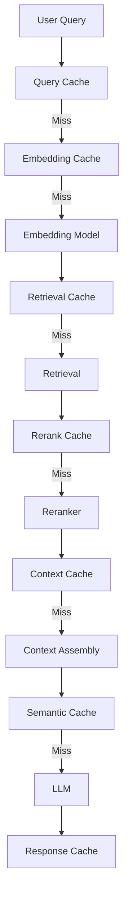

Different cache layers solve different problems.

---

# 🧠 4. Main RAG Cache Layers

A production RAG platform may use:

```text
1. Document Cache
2. Parsing Cache
3. Embedding Cache
4. Query Embedding Cache
5. Retrieval Cache
6. Reranking Cache
7. Context Cache
8. Semantic Cache
9. Response Cache
10. Model Output Cache
```

Not every system needs all of them.

---

# 🧠 5. Cache Placement

A useful architecture:

```text
                     USER
                       │
                       ▼
                 Response Cache
                       │
                 ┌─────┴─────┐
                 │            │
               Hit           Miss
                 │            │
                 ▼            ▼
             RESPONSE    Semantic Cache
                              │
                        ┌─────┴─────┐
                        │           │
                       Hit         Miss
                        │           │
                        ▼           ▼
                    RESPONSE    Retrieval
                                    │
                          ┌─────────┼─────────┐
                          ▼         ▼         ▼
                       Embedding Retrieval Rerank
                         Cache     Cache     Cache
```

---

# 🧠 6. Cache Layer Selection

Do not cache everything.

Ask:

```text
Is this operation expensive?

Is the result reusable?

How frequently does the input repeat?

How frequently does the result change?

Is the result security-sensitive?

Can stale data be tolerated?

What is the cost of storing it?
```

---

# 🧠 7. Embedding Cache

Embedding generation is often deterministic for:

```text
Same Model
+
Same Input
+
Same Configuration
```

Therefore:

```text
Text
 ↓
Hash
 ↓
Cache
```

---

# 🧠 8. Embedding Cache Architecture

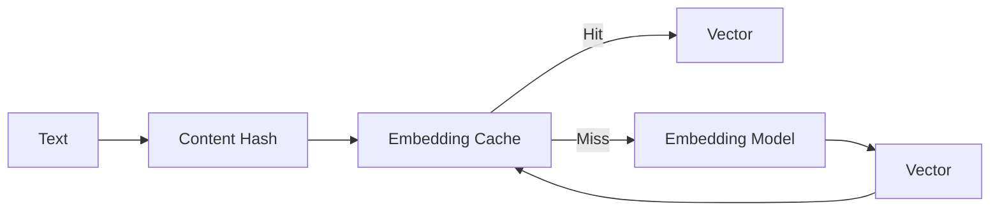

---

# 🧠 9. Embedding Cache Key

A weak key:

```text
hash(text)
```

A stronger key:

```text
hash(
    text
    +
    embedding_model
    +
    model_version
    +
    preprocessing_version
)
```

Example:

```text
embedding:v4:
model=text-embedding-x:
hash=abc123
```

---

# 🧠 10. Why Model Version Matters

Suppose:

```text
Embedding Model V1
```

creates:

```text
Vector A
```

Then:

```text
Embedding Model V2
```

creates:

```text
Vector B
```

The old cache must not accidentally return:

```text
Vector A
```

for a V2 request.

---

# 🧠 11. Embedding Cache Scope

Embedding caches are often good candidates for broader reuse because the vector represents content rather than a user's authorization.

However, sensitive systems should still consider:

```text
Tenant Isolation
Data Classification
Encryption
Access Policies
```

especially when cached content itself is stored.

---

# 🧠 12. Query Embedding Cache

User queries can also be cached:

```text
Query
 ↓
Embedding Cache
 ↓
Vector
```

This is useful when:

```text
Repeated Queries
FAQ Workloads
High Query Volume
```

---

# 🧠 13. Retrieval Cache

Retrieval caching stores search results:

```text
Query
 ↓
Retriever
 ↓
Top-K Documents
```

Cache:

```text
Document IDs
Chunk IDs
Scores
Metadata
```

---

# 🧠 14. Retrieval Cache Architecture

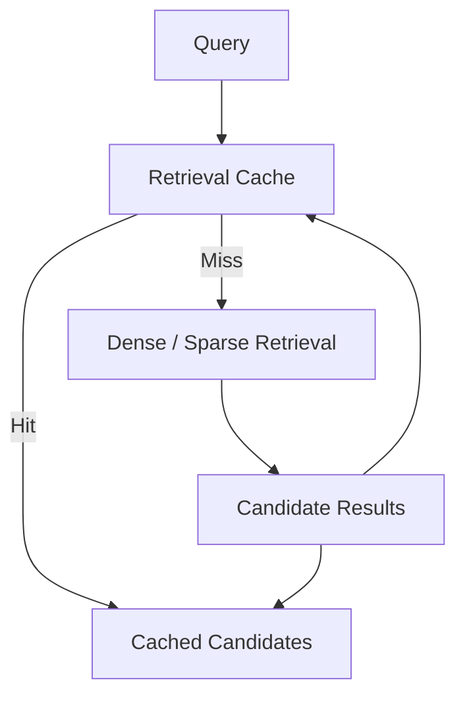

---

# 🧠 15. Retrieval Cache Key

A production retrieval key should include the parameters that influence the result.

Example:

```text
query
+
tenant
+
filters
+
retriever_version
+
index_version
+
embedding_version
+
top_k
```

Conceptually:

```text
retrieval_key =
hash(
    query
    +
    tenant_id
    +
    filters
    +
    retriever_version
    +
    index_version
    +
    top_k
)
```

---

# 🧠 16. Why Index Version Matters

Suppose:

```text
Index V10
```

returns:

```text
Document A
Document B
```

After deployment:

```text
Index V11
```

returns:

```text
Document C
Document D
```

An old retrieval cache must not silently override the new index.

---

# 🧠 17. Reranking Cache

Reranking can be expensive.

Example:

```text
100 Candidates
       ↓
Cross Encoder
       ↓
Top 10
```

If the same candidate set is reranked repeatedly:

```text
Cache
```

can avoid repeated computation.

---

# 🧠 18. Reranking Cache Key

Include:

```text
Query
Candidate IDs
Candidate Content Version
Reranker Version
Reranking Configuration
```

Example:

```text
rerank_key =
hash(
    query
    +
    candidate_ids
    +
    reranker_version
    +
    config_version
)
```

---

# 🧠 19. Context Cache

Context assembly may include:

```text
Deduplication
MMR
Compression
Ordering
Token Budget
Source Selection
```

The resulting evidence package can be cached.

```text
Candidates
 ↓
Context Engine
 ↓
Evidence Package
```

---

# 🧠 20. Context Cache Risk

Context can become stale when:

```text
Document Changes
Index Changes
Authorization Changes
Retrieval Strategy Changes
Context Strategy Changes
```

Therefore context caches need stronger invalidation/versioning than simple application caches.

---

# 🧠 21. Semantic Cache

A semantic cache attempts to reuse results for:

```text
Similar Queries
```

rather than exact queries.

Example:

```text
"What is the refund period?"

"What is the refund time limit?"
```

These may be semantically equivalent.

---

# 🧠 22. Exact Cache vs Semantic Cache

### Exact Cache

```text
Query A
   ↓
Exact Key
   ↓
Response A
```

### Semantic Cache

```text
Query A
   ↓
Embedding
   ↓
Nearest Cached Query
   ↓
Similarity Check
   ↓
Cached Response
```

---

# 🧠 23. Semantic Cache Architecture

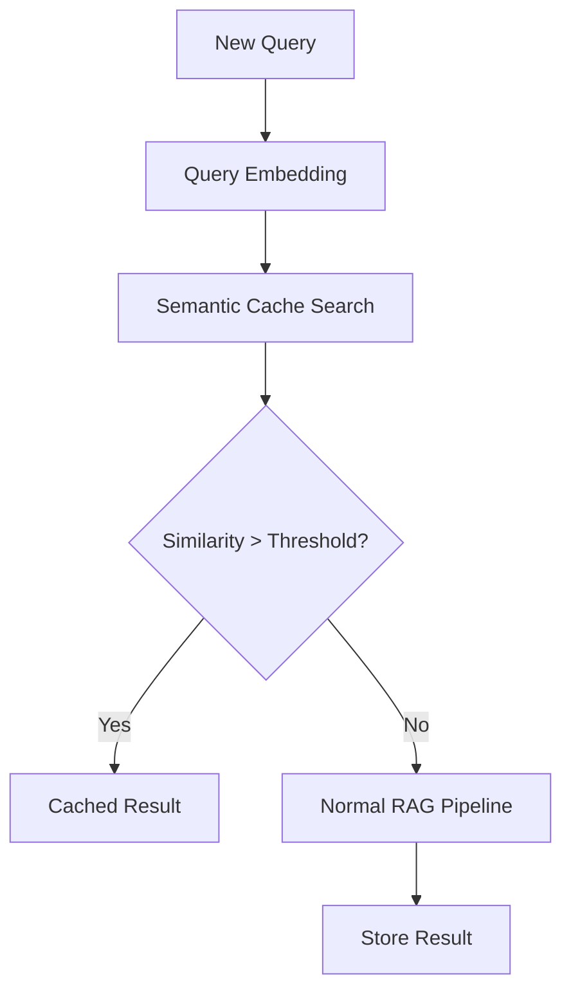

---

# 🧠 24. Semantic Cache Threshold

A semantic cache requires a similarity threshold.

Conceptually:

```text
similarity(query, cached_query) >= threshold
```


where:

```text
q  = current query
q_c = cached query
τ  = similarity threshold
```

A threshold that is too low may return incorrect answers.

A threshold that is too high reduces cache hits.

---

# 🧠 25. Semantic Cache Is Not Always Safe

Consider:

```text
"What is the current interest rate?"
```

and:

```text
"What was the interest rate in 2024?"
```

These may be semantically similar but require different answers.

Therefore semantic caching should consider:

```text
Time
Filters
Tenant
User Context
Document Version
Query Intent
```

---

# 🧠 26. Response Cache

The simplest cache:

```text
Query
 ↓
Complete Response
```

Example:

```text
FAQ
 ↓
Cached Answer
```

---

# 🧠 27. Response Cache Architecture

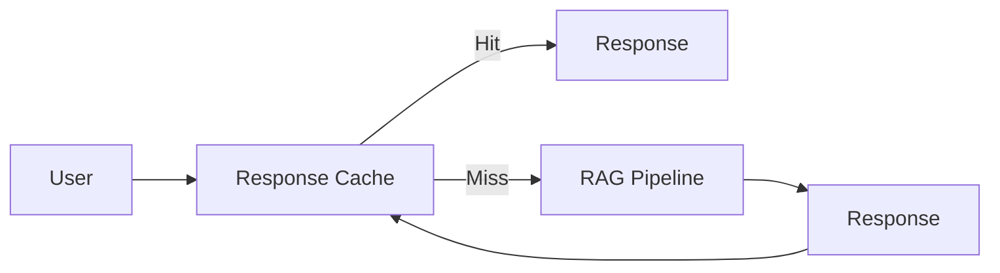

---

# 🧠 28. Response Cache Key

A production response cache should consider:

```text
Query
Tenant
Authorization Scope
Prompt Version
Model Version
Retriever Version
Index Version
Language
Application Version
```

Potentially:

```text
Conversation State
User Preferences
```

if the response depends on them.

---

# 🧠 29. Response Cache Security

This is one of the most important caching concerns.

Unsafe:

```text
Global Query Cache
```

Example:

```text
User A
 ↓
"What is the salary policy?"
 ↓
Cached Response
```

Then:

```text
User B
 ↓
Same Query
 ↓
Cached Response
```

If access scopes differ, User B may receive unauthorized information.

---

# 🧠 30. Tenant-Aware Caching

Use:

```text
tenant_id
```

as part of the cache key.

Example:

```text
tenant-a:query-hash
tenant-b:query-hash
```

---

# 🧠 31. Authorization-Aware Cache

Tenant ID alone may not be enough.

Two users in the same tenant may have different permissions.

A stronger cache scope can include:

```text
Tenant
+
Role
+
Permission Set
+
Security Context
```

or a stable authorization-scope identifier.

---

# 🧠 32. Cache Isolation Strategies

### Strategy 1 — Shared Cache + Strong Key

```text
Shared Redis
   ↓
Tenant-Aware Keys
```

### Strategy 2 — Namespace Isolation

```text
tenant-a/*
tenant-b/*
```

### Strategy 3 — Dedicated Cache

```text
Tenant A → Cache A
Tenant B → Cache B
```

---

# 🧠 33. Shared vs Dedicated Cache

| Strategy | Cost | Isolation | Complexity |
|---|---:|---:|---:|
| Shared | Low | Medium | Low |
| Namespaced | Medium | High | Medium |
| Dedicated | High | Very High | High |

The appropriate choice depends on:

```text
Security
Compliance
Tenant Size
Cost
Performance
```

---

# 🧠 34. Cache TTL

TTL means:

```text
Time To Live
```

Example:

```text
Cache Entry
   ↓
TTL = 10 minutes
   ↓
Expiration
```

---

# 🧠 35. TTL Strategy by Cache Type

A possible starting point:

```text
Embedding Cache
→ Long TTL

Retrieval Cache
→ Short / Medium TTL

Reranking Cache
→ Short / Medium TTL

Semantic Cache
→ Short / Medium TTL

Response Cache
→ Depends heavily on freshness requirements
```

These are starting points, not universal values.

---

# 🧠 36. Freshness-Based TTL

Instead of one global TTL:

```text
Static Policy
→ Long TTL

Frequently Changing Data
→ Short TTL

Real-Time Data
→ Very Short TTL / No Cache
```

---

# 🧠 37. Data Volatility

Classify knowledge:

```text
LOW VOLATILITY
Policies
Documentation

MEDIUM VOLATILITY
Product Information

HIGH VOLATILITY
Inventory
Prices
Transactions

REAL-TIME
Account Balance
Market Data
Live Status
```

Caching strategy should reflect volatility.

---

# 🧠 38. Cacheability Matrix

| Data | Cache? | Typical Strategy |
|---|---|---|
| Static Documentation | Yes | Long TTL |
| Enterprise Policies | Yes | Version-aware |
| Product Documentation | Yes | Version-aware |
| Frequently Updated Data | Carefully | Short TTL |
| Transaction Data | Carefully | Very short / bypass |
| User-Specific Data | Carefully | User-scoped |
| Highly Sensitive Data | Restricted | Strong isolation |
| Real-Time Data | Usually limited | Bypass / short TTL |

---

# 🧠 39. Cache Invalidation

One of the hardest problems in production RAG is:

```text
When should cached information stop being trusted?
```

Potential invalidation triggers:

```text
Document Update
Document Delete
Index Update
Embedding Model Update
Retriever Update
Reranker Update
Prompt Update
Model Update
Authorization Update
Tenant Policy Update
```

---

# 🧠 40. Invalidation Strategies

Common approaches:

```text
TTL
Explicit Invalidation
Versioned Keys
Event-Driven Invalidation
Write-Through
Write-Behind
Cache Busting
```

---

# 🧠 41. Versioned Cache Keys

One of the safest techniques:

```text
retrieval:v17:<hash>
```

When the index changes:

```text
retrieval:v18:<hash>
```

Old entries naturally become unused.

---

# 🧠 42. Versioned Cache Architecture

```text
Index V17
   ↓
Cache Namespace V17

Index V18
   ↓
Cache Namespace V18
```

No need to delete every old entry immediately.

---

# 🧠 43. Event-Driven Invalidation


---

# 🧠 44. Document-Level Invalidation

Suppose:

```text
Document D123
```

changes.

Invalidate cache entries referencing:

```text
D123
```

This requires maintaining relationships:

```text
Cache Entry
      ↓
Document IDs
```

---

# 🧠 45. Invalidation Granularity

Possible levels:

```text
Entire Cache
      ↓
Tenant
      ↓
Index
      ↓
Document
      ↓
Chunk
```

Smaller invalidation scope generally reduces unnecessary cache misses but increases implementation complexity.

---

# 🧠 46. Cache Invalidation Architecture

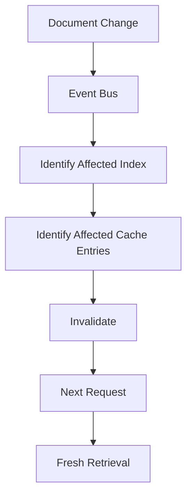

---

# 🧠 47. Cache Stampede

A cache stampede occurs when many requests simultaneously miss the same cache entry.

```text
1000 Requests
      │
      ▼
Cache Miss
      │
      ├── Retrieval
      ├── Retrieval
      ├── Retrieval
      ├── Retrieval
      └── ...
```

This can overload:

```text
Vector DB
Embedding API
Reranker
LLM
```

---

# 🧠 48. Preventing Cache Stampede

Use:

```text
Request Coalescing
Single Flight
Distributed Lock
Jittered TTL
Probabilistic Refresh
Background Refresh
```

---

# 🧠 49. Request Coalescing

```text
Request A ─┐
Request B ─┤
Request C ─┼──→ One Computation
Request D ─┤
Request E ─┘
```

Other requests wait for the same result.

---

# 🧠 50. Single-Flight Pattern

Conceptually:

```python
if cache.exists(key):
    return cache.get(key)

if computation_in_progress(key):
    return await existing_computation(key)

create_computation(key)

result = compute()

cache.set(key, result)

return result
```

---

# 🧠 51. Distributed Lock

For distributed applications:

```text
Request A
 ↓
Acquire Lock
 ↓
Compute
 ↓
Store Cache
 ↓
Release Lock
```

Other requests:

```text
Request B
 ↓
Lock Exists
 ↓
Wait
```

Use carefully to avoid deadlocks and excessive waiting.

---

# 🧠 52. TTL Jitter

If many entries expire simultaneously:

```text
10:00:00
   ↓
Millions of Expirations
```

This can create a load spike.

Instead:

```text
TTL = Base TTL + Random Jitter
```

---

# 🧠 53. Cache Avalanche

A cache avalanche occurs when many entries expire or become invalid at once.

Example:

```text
10,000,000 Entries
        ↓
Same TTL
        ↓
Expiration
        ↓
Database Overload
```

Mitigation:

```text
TTL Jitter
Staggered Expiration
Background Refresh
Versioned Namespaces
```

---

# 🧠 54. Cache Penetration

Cache penetration occurs when requests repeatedly ask for data that does not exist.

```text
Query
 ↓
Cache Miss
 ↓
Database Miss
```

Repeated malicious or invalid queries can overload the backend.

---

# 🧠 55. Cache Penetration Mitigation

Use:

```text
Negative Caching
Input Validation
Rate Limiting
Query Limits
```

Example:

```text
No Evidence
 ↓
Cache "No Result"
 ↓
Short TTL
```

---

# 🧠 56. Negative Caching

Example:

```text
Query:
"Unknown internal policy XYZ123"
```

If retrieval repeatedly returns no evidence:

```text
Cache:
NO_RESULT
```

for a short TTL.

Do not use a long TTL because knowledge may later appear.

---

# 🧠 57. Semantic Cache False Positive

Suppose:

```text
Q1:
"What is the refund policy?"

Q2:
"What was the refund policy in 2023?"
```

A naive semantic cache may consider them similar.

Result:

```text
Wrong Historical Answer
```

Therefore semantic caches should incorporate:

```text
Temporal Constraints
Metadata Filters
Intent
Tenant
Authorization
```

---

# 🧠 58. Semantic Cache Guardrails

A semantic cache hit should satisfy:

```text
Semantic Similarity
+
Same Tenant
+
Compatible Authorization
+
Compatible Filters
+
Compatible Time Scope
+
Compatible Knowledge Version
```

---

# 🧠 59. Query Normalization

Before exact caching, normalize queries.

Examples:

```text
"How many retries are allowed?"

"How many retry attempts are allowed?"
```

Depending on application semantics, normalization may include:

```text
Whitespace
Case
Punctuation
Language
Canonical Terms
```

Do not normalize away meaningful information.

---

# 🧠 60. Query Fingerprinting

Create a stable representation:

```python
import hashlib


def fingerprint(query: str) -> str:

    normalized = query.strip().lower()

    return hashlib.sha256(
        normalized.encode("utf-8")
    ).hexdigest()
```

Production implementations should normalize according to domain semantics.

---

# 🧠 61. Cache Key Design

A general cache key:

```text
CACHE KEY
=
Input
+
Context
+
Version
+
Policy
```

For example:

```text
query
+
tenant
+
authorization_scope
+
retriever_version
+
index_version
+
prompt_version
+
model_version
```

---

# 🧠 62. Cache Key Hierarchy

```text
rag:
  tenant-a:
    retrieval:
      index-v17:
        retriever-v8:
          <query-hash>
```

This makes operational inspection easier.

---

# 🧠 63. Cache Namespaces

Possible namespaces:

```text
embedding:
retrieval:
rerank:
context:
semantic:
response:
```

Example:

```text
embedding:v4:...
retrieval:v17:...
rerank:v3:...
response:v12:...
```

---

# 🧠 64. Distributed Cache

A distributed cache such as Redis can provide:

```text
Shared Cache
Low Latency
TTL
Atomic Operations
Distributed Locks
Pub/Sub
```

Typical architecture:

```text
RAG API 1 ─┐
RAG API 2 ─┼──→ Redis
RAG API 3 ─┘
```

---

# 🧠 65. Local vs Distributed Cache

### Local Cache

```text
Service Instance
      ↓
Memory Cache
```

Advantages:

```text
Very Fast
Simple
```

Limitations:

```text
Not Shared
Evaporates on Restart
Inconsistent Across Instances
```

### Distributed Cache

```text
Multiple Services
      ↓
Shared Cache
```

Advantages:

```text
Shared
Persistent-ish
Centralized
```

Trade-off:

```text
Network Hop
Operational Cost
Dependency
```

---

# 🧠 66. Two-Level Cache

A powerful architecture:

```text
Request
   ↓
L1 Local Cache
   │
   ├── Hit → Return
   │
   └── Miss
         ↓
     L2 Distributed Cache
         │
         ├── Hit → Populate L1
         │
         └── Miss → Compute
```

---

# 🧠 67. Two-Level Cache

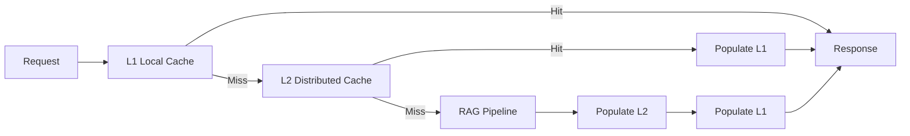

---

# 🧠 68. Cache Serialization

Cache entries may contain:

```text
JSON
Protocol Buffers
MessagePack
Compressed Binary
```

Choose based on:

```text
Latency
Size
Compatibility
Language Support
```

---

# 🧠 69. What Should Be Cached?

Good candidates:

```text
Embeddings
Stable Retrieval Results
Reranking Results
Stable Evidence Packages
Repeated FAQ Responses
```

Poor candidates:

```text
Highly Dynamic Data
User-Specific Sensitive Results
Frequently Changing Transaction Data
```

---

# 🧠 70. Cache Compression

Large cached evidence can consume significant memory.

Use compression when:

```text
Payload Large
Network Cost High
CPU Available
```

Trade-off:

```text
Memory ↓
Network ↓
CPU ↑
```

---

# 🧠 71. Cache Warming

Pre-populate frequently requested entries.

```text
Known Popular Queries
        ↓
Cache Warmup
        ↓
Production Traffic
```

Useful for:

```text
Known FAQs
Morning Traffic
Product Launches
Policy Portals
```

---

# 🧠 72. Cache Warming Pipeline

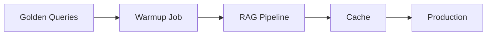

---

# 🧠 73. Cache Refresh

Instead of waiting for expiration:

```text
Cache Entry
   ↓
Near Expiration
   ↓
Background Refresh
```

Users continue receiving the previous valid value while the new result is computed.

---

# 🧠 74. Stale-While-Revalidate

Conceptually:

```text
Request
 ↓
Cached Value Exists
 ↓
Return Cached Value
 ↓
Refresh in Background
```

Useful when:

```text
Small Staleness Allowed
Low Latency Important
```

Avoid for strict real-time or highly regulated data where stale information is unacceptable.

---

# 🧠 75. Cache Consistency Models

Possible models:

```text
Strong Consistency
Eventual Consistency
Bounded Staleness
```

RAG often uses:

```text
Eventual Consistency
```

for knowledge indexes and caches.

But some security-related state may require stronger guarantees.

---

# 🧠 76. Security State Should Not Be Stale

Be particularly careful with:

```text
User Revocation
Role Changes
Permission Changes
Tenant Suspension
Document Access Changes
```

A stale authorization cache can become a security vulnerability.

---

# 🧠 77. Authorization Cache

If authorization decisions are cached:

```text
User
+
Resource
+
Policy Version
```

should be considered in the key.

Also define:

```text
Short TTL
Explicit Invalidation
Policy Versioning
```

for sensitive environments.

---

# 🧠 78. Cache and Document Updates

Suppose:

```text
Document V1
 ↓
Cached Response
```

Then:

```text
Document V2
```

is published.

Potential stale path:

```text
Document V2
      ↓
Index V2
      ↓
Cache still contains V1
      ↓
Wrong response
```

Therefore:

```text
Knowledge Update
 ↓
Index Update
 ↓
Cache Invalidation / Version Switch
```

---

# 🧠 79. Cache and Prompt Updates

If:

```text
Prompt V1
```

produces:

```text
Response V1
```

then:

```text
Prompt V2
```

should not necessarily reuse the old response.

Use:

```text
prompt_version
```

in the response cache key.

---

# 🧠 80. Cache and Model Updates

Similarly:

```text
Model V1
```

and:

```text
Model V2
```

may generate different outputs.

Therefore include:

```text
model_version
```

where response correctness depends on it.

---

# 🧠 81. Cache and Retriever Updates

Changing:

```text
Retriever
```

can change:

```text
Evidence
```

Therefore retrieval caches should include:

```text
retriever_version
```

---

# 🧠 82. Cache and Context Strategy

Changing:

```text
MMR
Top-K
Compression
Ordering
Context Budget
```

can change final evidence.

Therefore context cache keys should include:

```text
context_strategy_version
```

---

# 🧠 83. Cache Dependency Graph

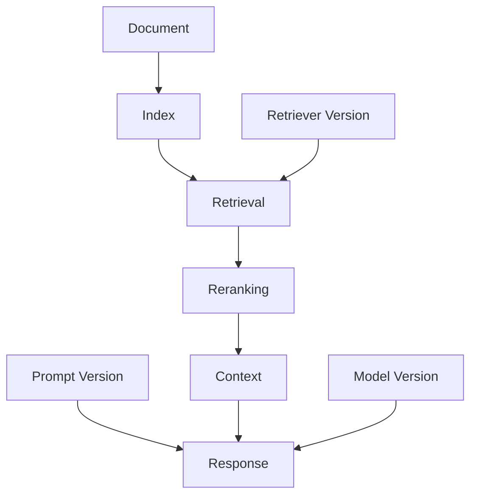

A cache should be invalidated when one of its dependencies changes.

---

# 🧠 84. Dependency-Aware Cache

Think of a cached response as:

```text
Response
  │
  ├── Query
  ├── Tenant
  ├── Authorization
  ├── Retrieval
  ├── Index
  ├── Context
  ├── Prompt
  └── Model
```

Changing any critical dependency may invalidate the result.

---

# 🧠 85. Cache Dependency Fingerprint

A practical pattern:

```text
dependency_fingerprint =
hash(
    index_version
    +
    retriever_version
    +
    prompt_version
    +
    model_version
    +
    policy_version
)
```

Use the fingerprint as part of the cache key.

---

# 🧠 86. Cache Hit Rate

Basic metric:

```text
Cache Hit Rate
=
Cache Hits
/
Total Requests
```


Example:

```text
Hits = 8,000
Requests = 10,000

Hit Rate = 80%
```

---

# 🧠 87. Cache Miss Rate

```text
Miss Rate
=
1 - Hit Rate
```

Example:

```text
Hit Rate = 80%

Miss Rate = 20%
```

---

# 🧠 88. Cache Effectiveness

Hit rate alone is not enough.

Consider:

```text
Cache Hit Rate
+
Latency Saved
+
Cost Saved
+
Backend Load Reduced
```

A cache with:

```text
95% Hit Rate
```

may still be poor if the cached operation is cheap.

---

# 🧠 89. Cache Metrics

Monitor:

```text
Hit Rate
Miss Rate
Eviction Rate
Entry Count
Memory Usage
Latency
Refresh Rate
Invalidation Rate
Error Rate
Stampede Events
```

---

# 🧠 90. RAG-Specific Cache Metrics

Track:

```text
Embedding Cache Hit Rate
Retrieval Cache Hit Rate
Reranking Cache Hit Rate
Semantic Cache Hit Rate
Response Cache Hit Rate
```

Also:

```text
Tokens Avoided
LLM Calls Avoided
Retrieval Calls Avoided
Cost Avoided
```

---

# 🧠 91. Cost Savings

Approximate:

```text
Cache Savings
=
Avoided Compute Cost
+
Avoided Model Cost
+
Avoided Infrastructure Cost
```

Track actual savings rather than assuming every cache hit has the same value.

---

# 🧠 92. Cache Latency

Track:

```text
L1 Latency
L2 Latency
Cache Miss Latency
Backend Latency
```

The cache itself must not become a bottleneck.

---

# 🧠 93. Cache Capacity Planning

Estimate:

```text
Entries
×
Average Entry Size
×
Replication Factor
```

plus overhead.

---

# 🧠 94. Example

Suppose:

```text
1,000,000 entries
Average size = 4 KB
```

Raw payload:

```text
≈ 4 GB
```

Actual memory requirement is higher due to:

```text
Keys
Metadata
Serialization
Replication
Eviction Overhead
```

---

# 🧠 95. Cache Eviction

Common policies:

```text
LRU
LFU
FIFO
TTL
```

### LRU

```text
Least Recently Used
```

Good for workloads where recent queries are more likely to repeat.

### LFU

```text
Least Frequently Used
```

Useful when popular queries should remain cached.

---

# 🧠 96. RAG Cache Eviction Strategy

A combination can be useful:

```text
TTL
+
LRU
```

For example:

```text
TTL controls freshness
LRU controls memory
```

---

# 🧠 97. Cache Admission

Not every result deserves caching.

Example:

```text
One-Time Query
   ↓
Do Not Cache

Frequently Repeated Query
   ↓
Cache
```

Potential admission signals:

```text
Frequency
Cost
Latency
Stability
```

---

# 🧠 98. Cost-Aware Cache Admission

Cache expensive operations first.

Example:

```text
Cheap Retrieval
→ Low Priority

Expensive Reranking
→ High Priority

Expensive LLM Response
→ High Priority
```

---

# 🧠 99. Query Frequency

A simple strategy:

```text
First Request
 ↓
Compute

Second Request
 ↓
Compute

Third Request
 ↓
Cache

Repeated Requests
 ↓
Cache
```

This avoids filling the cache with one-time queries.

---

# 🧠 100. Cache Pollution

Cache pollution occurs when low-value entries consume memory.

Examples:

```text
Random Queries
Bot Traffic
One-Time Queries
Malicious Cache-Fill Requests
```

Mitigate with:

```text
Admission Policies
Rate Limits
Authentication
Frequency Thresholds
```

---

# 🧠 101. Bot Traffic

Bots can generate:

```text
Thousands of Unique Queries
```

which can cause:

```text
Low Hit Rate
High Memory Usage
Backend Load
```

Use:

```text
Rate Limiting
Bot Detection
Authentication
Query Limits
```

---

# 🧠 102. Cache Security

Protect cached data with:

```text
Encryption
Authentication
Network Isolation
Access Controls
Tenant Isolation
```

---

# 🧠 103. Sensitive Cache Data

Be careful caching:

```text
PII
Financial Data
Confidential Documents
Security Information
User-Specific Answers
```

Possible policies:

```text
Do Not Cache
Short TTL
Encrypted Cache
Dedicated Cache
Strong Isolation
```

---

# 🧠 104. Cache Encryption

Consider:

```text
Encryption At Rest
Encryption In Transit
Key Management
Secret Rotation
```

---

# 🧠 105. Cache and Compliance

Compliance requirements may influence:

```text
Retention
Deletion
Data Residency
Audit
Encryption
Access
```

A cache is still a data store.

---

# 🧠 106. Cache Deletion

When a user or document must be deleted:

```text
Source Data
 ↓
Index
 ↓
Cache
 ↓
Backups
```

Deletion workflows should account for derived cached data where required.

---

# 🧠 107. Cache Invalidation on Deletion

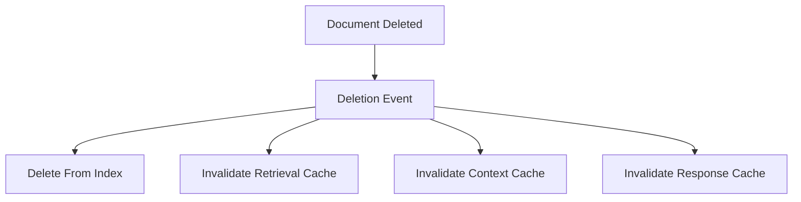

---

# 🧠 108. Cache Observability

Every cache operation should ideally emit:

```text
cache_name
cache_key_hash
hit/miss
latency
entry_size
version
tenant
```

Avoid logging sensitive key contents.

---

# 🧠 109. Example Cache Log

```json
{
  "cache": "retrieval",
  "result": "hit",
  "tenant": "tenant-a",
  "latency_ms": 3,
  "index_version": "v17"
}
```

---

# 🧠 110. Distributed Cache Failure

What happens if Redis fails?

Do not assume:

```text
Cache Failure
=
RAG Failure
```

Prefer:

```text
Cache Failure
      ↓
Bypass Cache
      ↓
Normal RAG Pipeline
```

when backend capacity allows.

---

# 🧠 111. Cache as an Optimization

A critical principle:

> **The cache should usually accelerate the system, not become the system's only source of truth.**

Architecture:

```text
Cache
  ↓
Optimization

Source / Index
  ↓
Authoritative Derived Knowledge
```

---

# 🧠 112. Cache Failure Strategy

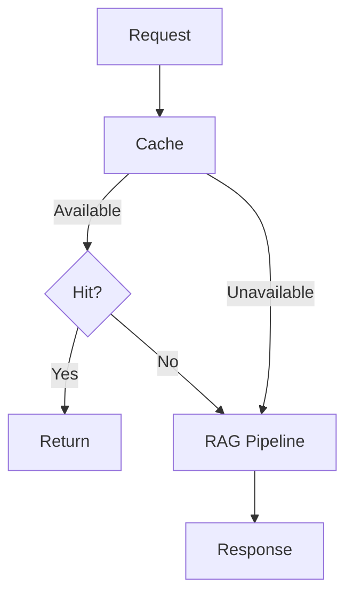

---

# 🧠 113. Circuit Breaker for Cache

If cache infrastructure becomes unhealthy:

```text
Cache Requests
      ↓
Repeated Failures
      ↓
Circuit Open
      ↓
Bypass Cache
```

This prevents cache failure from increasing application latency.

---

# 🧠 114. Cache Warmup After Restart

After a cache restart:

```text
Cold Cache
 ↓
High Miss Rate
 ↓
Backend Load
```

Mitigate with:

```text
Warmup
Gradual Traffic
Rate Limiting
Background Refresh
```

---

# 🧠 115. Cache Warmup Priorities

Warm:

```text
Most Frequent Queries
Most Expensive Queries
Most Important Queries
```

rather than everything.

---

# 🧠 116. Cache Precomputation

For known workloads:

```text
Scheduled Job
 ↓
Popular Queries
 ↓
RAG Pipeline
 ↓
Cache
```

Useful for:

```text
Employee FAQ
Customer Support
Product Documentation
Operations Dashboard
```

---

# 🧠 117. Cache and Streaming

Response caching can be more complicated when responses stream.

```text
LLM
 ↓
Token Stream
 ↓
Client
```

Possible approach:

```text
Collect Complete Response
 ↓
Validate
 ↓
Cache Final Response
```

Do not cache incomplete or failed responses.

---

# 🧠 118. Cache Only Validated Responses

Prefer:

```text
LLM
 ↓
Validation
 ↓
Citation
 ↓
Cache
```

rather than:

```text
LLM
 ↓
Cache
 ↓
Validation
```

Otherwise invalid output can be reused.

---

# 🧠 119. Cache Poisoning

A cache poisoning scenario occurs when incorrect or malicious output becomes cached.

Potential causes:

```text
Prompt Injection
Bad Source
Model Failure
Incorrect Authorization
Application Bug
```

Mitigation:

```text
Validate Before Cache
Trusted Sources
Authorization Checks
Cache Versioning
Audit
```

---

# 🧠 120. Semantic Cache Poisoning

Semantic caches require extra caution.

A bad answer for:

```text
Query A
```

could be incorrectly reused for:

```text
Similar Query B
```

Therefore semantic cache entries should carry:

```text
Evidence Provenance
Knowledge Version
Model Version
Validation Status
```

---

# 🧠 121. Cache Provenance

A response cache entry can store:

```json
{
  "response": "...",
  "document_ids": [
    "doc-123",
    "doc-456"
  ],
  "index_version": "v17",
  "retriever_version": "v8",
  "prompt_version": "v9",
  "model_version": "v4",
  "validated": true
}
```

This enables stronger invalidation and auditing.

---

# 🧠 122. Cache Dependency Graph

```text
Document
   ↓
Index
   ↓
Retrieval
   ↓
Reranking
   ↓
Context
   ↓
Prompt
   ↓
Model
   ↓
Response
```

The further downstream a cache is placed, the more dependencies it typically has.

---

# 🧠 123. Cache Complexity

Conceptually:

```text
Embedding Cache
     ↓
Few Dependencies

Retrieval Cache
     ↓
More Dependencies

Context Cache
     ↓
More Dependencies

Response Cache
     ↓
Many Dependencies
```

Therefore:

> **Downstream caches generally require stronger invalidation and versioning strategies.**

---

# 🧠 124. Cache Architecture Recommendation

A mature production RAG system may use:

```text
L1:
Local Cache

L2:
Distributed Cache

Pipeline:
Embedding Cache
Retrieval Cache
Reranking Cache

Application:
Semantic Cache

Optional:
Response Cache
```

Do not automatically enable every layer.

---

# 🧠 125. Recommended Cache Selection

### Low Traffic

```text
Minimal Cache
    ↓
Embedding Cache
```

### Medium Traffic

```text
Embedding
+
Retrieval
+
Distributed Cache
```

### High Traffic

```text
L1 + L2
+
Retrieval
+
Reranking
+
Semantic
```

### FAQ Workload

```text
Response Cache
+
Semantic Cache
```

### Highly Dynamic Workload

```text
Limited Cache
+
Short TTL
+
Strict Invalidation
```

---

# 🧠 126. Cache Architecture

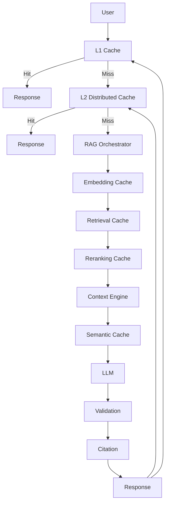

---

# 🧠 127. Cache Strategy by Pipeline Stage

| Stage | Cache Candidate | Main Concern |
|---|---|---|
| Document Parsing | Yes | Source version |
| Embedding | Yes | Model version |
| Retrieval | Yes | Index version |
| Reranking | Yes | Candidate/version changes |
| Context | Yes | Evidence freshness |
| Semantic | Yes | False positives |
| Response | Yes | Security/freshness |

---

# 🧠 128. Cache Decision Tree

```text
Is the operation expensive?
        │
        ├── No → Probably don't cache
        │
        └── Yes
             │
             ▼
       Is the result reusable?
             │
             ├── No → Don't cache
             │
             └── Yes
                  │
                  ▼
          Can stale results be tolerated?
                  │
             ┌────┴────┐
             ▼         ▼
            Yes        No
             │          │
             ▼          ▼
          Cache      Short TTL /
                     Versioning /
                     Invalidation
```

---

# 🧠 129. Cache Strategy by Risk

```text
LOW RISK
    ↓
Aggressive Caching

MEDIUM RISK
    ↓
Version + TTL

HIGH RISK
    ↓
Strict Invalidation

REAL-TIME / SECURITY CRITICAL
    ↓
Bypass or Minimal Cache
```

---

# 🧠 130. Cache Testing

Caching must be tested independently.

Test:

```text
Hit
Miss
Expiration
Invalidation
Concurrent Requests
Cache Failure
Cache Restart
Version Change
Tenant Isolation
Authorization Change
Document Update
```

---

# 🧪 131. Cache Unit Tests

Test:

```text
Key Generation
TTL Calculation
Version Handling
Serialization
Deserialization
Admission
Eviction
```

---

# 🧪 132. Cache Integration Tests

Verify:

```text
Application
   ↕
Cache
   ↕
Retriever
```

Test:

```text
Hit
Miss
Failure
Timeout
Fallback
```

---

# 🧪 133. Cache Security Tests

Test:

```text
Tenant A → Tenant A Cache ✓
Tenant A → Tenant B Cache ✗

Authorized User → Response ✓
Unauthorized User → Response ✗
```

---

# 🧪 134. Cache Stampede Test

Simulate:

```text
1,000 concurrent requests
```

for the same missing key.

Expected:

```text
1 backend computation
```

rather than:

```text
1,000 backend computations
```

---

# 🧪 135. Cache Invalidation Test

Scenario:

```text
Document V1
 ↓
Cache Response
 ↓
Document V2
 ↓
Invalidate
 ↓
Query
```

Expected:

```text
Response Based on V2
```

---

# 🧪 136. Cache Failure Test

Simulate:

```text
Redis Down
```

Expected:

```text
Application
 ↓
Cache Bypass
 ↓
RAG Pipeline
```

provided the backend can safely absorb the load.

---

# 🧪 137. Cache Performance Test

Measure:

```text
Hit Latency
Miss Latency
Backend Latency
Throughput
Memory
CPU
```

---

# 🧪 138. Cache Load Test

Test:

```text
Normal Load
Peak Load
Cache Cold Start
Cache Warm State
Cache Restart
Mass Expiration
```

---

# 🧠 139. Cache Monitoring Dashboard

A production dashboard should show:

```text
Cache Hit Rate
Cache Miss Rate
Cache Latency
Eviction Rate
Memory Usage
Entry Count
Invalidation Rate
Stampede Events
Backend Load
LLM Calls Avoided
Cost Saved
```

---

# 🧠 140. Cache Cost Model

A distributed cache has its own cost:

```text
Memory
Network
Compute
Replication
Operations
```

Therefore:

```text
Cache Savings
>
Cache Cost
```

should generally be the goal.

---

# 🧠 141. Cache ROI

A simple conceptual model:

```text
Cache ROI
=
Cost Avoided
-
Cache Operating Cost
```

More sophisticated analysis should include:

```text
Latency Value
Reliability Value
Backend Capacity Value
```

---

# 🧠 142. Cache Anti-Patterns

### Anti-Pattern 1 — Global Response Cache

```text
All Users
    ↓
One Cache
```

without authorization-aware keys.

---

### Anti-Pattern 2 — Cache Without Versioning

```text
Index Changes
 ↓
Old Cache Still Used
```

---

### Anti-Pattern 3 — Infinite TTL

```text
Cache Forever
```

This creates stale knowledge.

---

### Anti-Pattern 4 — Cache Everything

```text
Every Query
 ↓
Cache
```

This causes:

```text
Cache Pollution
High Memory
Low Value
```

---

### Anti-Pattern 5 — No Stampede Protection

```text
Cache Miss
 ↓
1000 Requests
 ↓
1000 Backend Calls
```

---

### Anti-Pattern 6 — Cache Before Validation

```text
LLM
 ↓
Cache
 ↓
Validation
```

Invalid answers may become reusable.

---

### Anti-Pattern 7 — Ignore Deletion

```text
Document Deleted
 ↓
Cache Still Contains Answer
```

---

### Anti-Pattern 8 — Treat Cache as Source of Truth

```text
Cache
 ↓
Authoritative Knowledge
```

A cache should generally be a derived optimization.

---

# 🧠 143. Production Cache Checklist

```text
☐ Cache layers identified
☐ Cache ownership defined
☐ Cache keys versioned
☐ Tenant isolation implemented
☐ Authorization scope considered
☐ TTL defined
☐ Invalidation strategy defined
☐ Document update invalidation handled
☐ Index version handled
☐ Embedding version handled
☐ Prompt version handled
☐ Model version handled
☐ Cache stampede protection
☐ Cache avalanche protection
☐ Cache penetration protection
☐ Negative caching considered
☐ Cache warming considered
☐ Cache failure fallback
☐ Cache encryption
☐ Cache observability
☐ Cache capacity planning
☐ Cache load testing
☐ Cache security testing
☐ Cache cost tracking
```

---

# 🧠 144. Recommended Production Pattern

A strong default architecture is:

```text
                   REQUEST
                      │
                      ▼
                 L1 Cache
                      │
                 ┌────┴────┐
                 ▼         ▼
                Hit       Miss
                 │         │
                 │         ▼
                 │    L2 Distributed
                 │        Cache
                 │         │
                 │    ┌────┴────┐
                 │    ▼         ▼
                 │   Hit       Miss
                 │    │         │
                 │    │         ▼
                 │    │     RAG Pipeline
                 │    │         │
                 │    │    ┌────┼────┐
                 │    │    ▼    ▼    ▼
                 │    │ Embed Retrieve Rerank
                 │    │ Cache  Cache  Cache
                 │    │    │    │      │
                 │    │    └────┼──────┘
                 │    │         ▼
                 │    │      Context
                 │    │         │
                 │    │         ▼
                 │    │      Semantic
                 │    │       Cache
                 │    │         │
                 │    │      ┌──┴──┐
                 │    │      ▼     ▼
                 │    │     Hit   Miss
                 │    │      │     │
                 │    │      │    LLM
                 │    │      │     │
                 │    │      │  Validate
                 │    │      │     │
                 │    │      │  Citation
                 │    │      │     │
                 └────┴──────┴─────┘
                              │
                              ▼
                           RESPONSE
```

---

# 🧠 145. Final Mental Model

RAG caching should be thought of as:

```text
                 RAG CACHING
                      │
      ┌───────────────┼────────────────┐
      ▼               ▼                ▼
   SPEED             COST          SCALABILITY
      │               │                │
      └───────────────┼────────────────┘
                      ▼
                  CORRECTNESS
                      │
       ┌──────────────┼──────────────┐
       ▼              ▼              ▼
    Freshness      Security       Versioning
       │              │              │
       └──────────────┼──────────────┘
                      ▼
                  INVALIDATION
                      │
                      ▼
                 OBSERVABILITY
```

---

# 🧠 146. Cache Strategy Formula

A useful architectural mental model:

```text
Effective RAG Cache
=
Reuse
+
Correctness
+
Freshness
+
Security
+
Versioning
+
Observability
```

A cache that is fast but returns unauthorized or stale information is not a successful production cache.

---

# 🧠 147. Final Key Takeaways

- Caching can significantly reduce RAG latency and cost.
- RAG should generally use multiple cache layers selectively.
- Embedding caching avoids repeated embedding computation.
- Retrieval caching avoids repeated search operations.
- Reranking caching avoids repeated expensive ranking.
- Context caching can avoid repeated evidence assembly.
- Semantic caching enables reuse across similar queries.
- Response caching provides the largest potential savings but also carries the highest correctness and security risk.
- Exact caching is safer than semantic caching because the reuse condition is explicit.
- Semantic caching requires similarity thresholds and strong contextual guardrails.
- Cache keys must include every important dependency that can change the result.
- Tenant identity should generally be included in security-sensitive cache keys.
- Authorization scope must be considered when caching protected responses.
- Index version should be included in retrieval-related cache keys.
- Embedding version should be included in embedding-related cache keys.
- Retriever version should be included in retrieval cache keys.
- Prompt version and model version should be considered for response caches.
- TTL alone is rarely sufficient for enterprise RAG.
- Versioned cache namespaces provide a powerful invalidation mechanism.
- Event-driven invalidation is useful for knowledge-driven systems.
- Document-level invalidation can reduce unnecessary cache eviction.
- Cache stampedes can overload downstream RAG components.
- Single-flight, request coalescing, locks, jitter, and background refresh can mitigate stampedes.
- Cache avalanche can occur when many entries expire simultaneously.
- Cache penetration can occur when invalid or nonexistent queries repeatedly bypass the cache.
- Negative caching can reduce repeated no-result queries.
- Cache admission policies prevent cache pollution.
- Cache warming can reduce cold-start load.
- Stale-while-revalidate can improve latency when controlled staleness is acceptable.
- Cache failure should ideally degrade the system rather than bring down RAG.
- A cache should generally be an optimization layer, not the authoritative source of truth.
- Cached responses should preferably be validated before they become reusable.
- Cache entries can carry provenance and dependency metadata.
- Cache invalidation must account for document, index, model, prompt, retriever, and authorization changes.
- Two-level caches can combine local speed with distributed consistency.
- Cache eviction policies such as LRU and LFU help manage finite memory.
- Cache observability should include hits, misses, latency, evictions, invalidations, memory, and backend load.
- Measure LLM calls and tokens avoided to quantify RAG cache value.
- Cache cost must be compared against the cost saved.
- Sensitive information may require restricted or disabled caching.
- Cache deletion must be included in data deletion workflows.
- Cache testing should include concurrency, failure, invalidation, security, and stampede scenarios.
- The best cache architecture is not the one with the most cache layers.
- The best architecture is the one that maximizes **safe reuse while preserving correctness, freshness, security, and operational simplicity**.

---

# 🧭 148. Chapter Navigation

### Part VI — Production RAG Deployment & Operations

**Previous:**  
[12. RAG Deployment Patterns](12-rag-deployment-patterns.md)

**Next:**  
[14. Multi-Tenant RAG](14-multi-tenant-rag.md)

### Production RAG Engineering Path

```text
01 Prompt Assembly
        ↓
02 Context Selection & Context Engineering
        ↓
03 Response Validation
        ↓
04 Citation & Source Attribution
        ↓
05 Enterprise Response
        ↓
06 RAG Evaluation & Benchmarking
        ↓
07 RAG Observability
        ↓
08 RAG Performance Optimization
        ↓
09 RAG Cost Optimization
        ↓
10 Production Retrieval Architecture
        ↓
11 Building Production RAG Systems
        ↓
12 RAG Deployment Patterns
        ↓
13 RAG Caching Strategies
        ↓
14 Multi-Tenant RAG
        ↓
15 RAG Testing Frameworks
        ↓
16 RAG Failure Patterns
```

---

> **Enterprise AI Engineering Handbook**  
> *Building Production-Grade Enterprise AI Systems — One Chapter at a Time.*