# 14. Multi-Tenant RAG

> **Category:** Production RAG Engineering  
> **Module:** Part VI — Production Deployment  
> **Difficulty:** Advanced

---

## 📖 Overview

A multi-tenant RAG system serves multiple organizations, business units, customers, or logical tenants from a shared or partially shared platform.

A simple RAG architecture:

```text
User
 ↓
RAG Application
 ↓
Knowledge Base
 ↓
LLM
```

A multi-tenant RAG architecture must answer a much harder question:

> **How do we guarantee that every user can retrieve and generate answers only from knowledge they are authorized to access?**

A production multi-tenant architecture must therefore combine:

```text
Tenant Isolation
+
Identity
+
Authentication
+
Authorization
+
Data Isolation
+
Index Isolation
+
Cache Isolation
+
Observability
+
Cost Attribution
+
Governance
```

The fundamental security boundary should be:

```text
User
 ↓
Identity
 ↓
Tenant Context
 ↓
Authorization Context
 ↓
Retrieval
 ↓
Authorized Evidence
 ↓
LLM
 ↓
Response
```

Never:

```text
User
 ↓
Retrieve Everything
 ↓
LLM
 ↓
Try to Hide Unauthorized Information
```

The LLM is not an authorization boundary.

---

# 🎯 Learning Objectives

After completing this chapter, you will be able to:

- Understand multi-tenant RAG architecture
- Define tenant boundaries
- Design tenant isolation strategies
- Compare shared and dedicated infrastructure
- Design shared vector indexes
- Design tenant-specific indexes
- Design hybrid isolation
- Implement tenant-aware metadata
- Implement tenant-aware retrieval
- Implement authorization-aware retrieval
- Understand RBAC
- Understand ABAC
- Design ACL-aware retrieval
- Design tenant-aware caching
- Prevent cross-tenant cache leakage
- Design tenant-aware ingestion
- Design tenant-aware indexing
- Design tenant-aware observability
- Design tenant-level cost attribution
- Handle tenant-specific configuration
- Handle noisy-neighbor problems
- Design tenant quotas
- Design tenant rate limits
- Design tenant-specific model routing
- Design tenant-aware evaluation
- Handle tenant onboarding and offboarding
- Design tenant data deletion
- Design tenant migration
- Design multi-region tenant architectures
- Design tenant disaster recovery
- Understand multi-tenant security failure modes
- Build production-ready multi-tenant RAG systems

---

# 🧠 1. What Is a Tenant?

A tenant is an isolated logical customer or organizational boundary.

Examples:

```text
Tenant A = Bank A
Tenant B = Bank B
Tenant C = Telecom Company C
```

Within a large enterprise:

```text
Tenant
 ├── Department
 ├── Team
 ├── Application
 └── Users
```

A tenant may represent:

```text
Customer
Organization
Business Unit
Project
Workspace
Enterprise Account
```

The exact meaning depends on the product architecture.

---

# 🧠 2. Multi-Tenant RAG

A multi-tenant RAG platform can be visualized as:

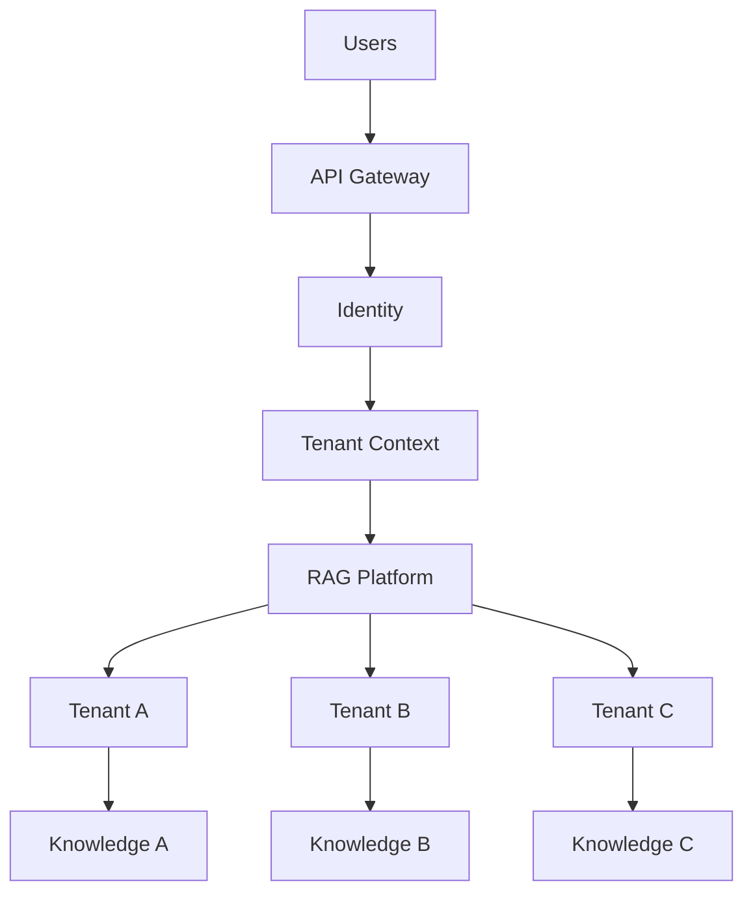

The platform may share compute while maintaining logical or physical data isolation.

---

# 🧠 3. Core Multi-Tenant Principle

Every request should carry trusted tenant context.

```text
Request
 ↓
Identity
 ↓
Tenant Resolution
 ↓
Authorization Context
 ↓
Retrieval
```

Example:

```json
{
  "user_id": "user-123",
  "tenant_id": "tenant-a",
  "roles": [
    "employee"
  ]
}
```

The application should not blindly trust:

```http
X-Tenant-ID: tenant-b
```

provided by the client.

Tenant context should be derived from a trusted identity or validated authorization mechanism.

---

# 🧠 4. Tenant Context

A useful request context may contain:

```python
from dataclasses import dataclass


@dataclass
class TenantContext:

    tenant_id: str
    user_id: str
    roles: list[str]
    permissions: list[str]
    region: str | None = None
```

This context should flow through:

```text
API
 ↓
Query
 ↓
Retriever
 ↓
Cache
 ↓
Observability
```

---

# 🧠 5. Multi-Tenant Request Flow

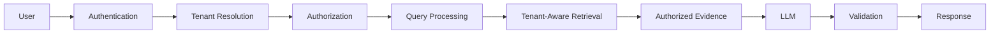

---

# 🧠 6. Tenant Isolation Levels

Multi-tenant RAG can isolate resources at different levels:

```text
Logical Isolation
        ↓
Namespace Isolation
        ↓
Index Isolation
        ↓
Database Isolation
        ↓
Infrastructure Isolation
        ↓
Account / Subscription Isolation
```

Higher isolation generally means:

```text
Higher Security
+
Higher Cost
+
Higher Operational Complexity
```

---

# 🧠 7. Four Common Isolation Strategies

### Strategy 1 — Shared Everything

```text
Shared API
Shared Index
Shared Cache
Shared Compute
```

Isolation:

```text
Metadata + Authorization
```

---

### Strategy 2 — Shared Compute, Isolated Data

```text
Shared API
Shared Compute

Tenant A → Data A
Tenant B → Data B
```

---

### Strategy 3 — Shared Platform, Dedicated Index

```text
Shared API
Shared Compute

Tenant A → Index A
Tenant B → Index B
```

---

### Strategy 4 — Dedicated Tenant Stack

```text
Tenant A
 ├── API
 ├── Index
 ├── Cache
 └── Storage

Tenant B
 ├── API
 ├── Index
 ├── Cache
 └── Storage
```

---

# 🧠 8. Isolation Spectrum

```text
Lowest Isolation
      │
      ▼
Shared Index
      │
      ▼
Tenant Namespace
      │
      ▼
Dedicated Index
      │
      ▼
Dedicated Database
      │
      ▼
Dedicated Infrastructure
      │
      ▼
Dedicated Cloud Account
      │
      ▼
Highest Isolation
```

---

# 🧠 9. Shared Index Architecture

A common cost-efficient architecture:

```text
                Vector Index
                     │
        ┌────────────┼────────────┐
        ▼            ▼            ▼
     Tenant A     Tenant B     Tenant C
```

Every vector contains:

```text
tenant_id
```

---

# 🧠 10. Tenant Metadata

Example:

```json
{
  "document_id": "doc-123",
  "chunk_id": "chunk-7",
  "tenant_id": "tenant-a",
  "department": "payments",
  "classification": "confidential",
  "region": "eu",
  "document_type": "policy"
}
```

---

# 🧠 11. Tenant Filter

Retrieval should apply tenant constraints before returning evidence.

Conceptually:

```text
query
+
tenant_id = current_tenant
```

Example:

```python
filters = {
    "tenant_id": tenant_context.tenant_id
}
```

---

# 🧠 12. Tenant Filter Must Be Server-Side

Unsafe:

```text
Client
 ↓
tenant_id = tenant-a
 ↓
Retriever
```

A malicious user could change:

```text
tenant-a
```

to:

```text
tenant-b
```

The server must derive or validate tenant identity from trusted authentication context.

---

# 🧠 13. Shared Index Architecture

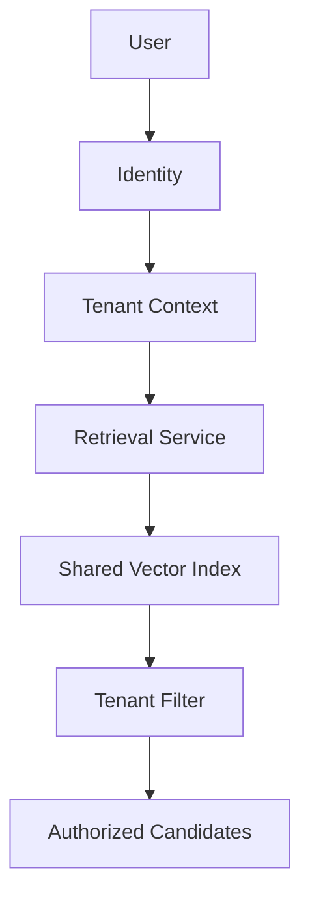

The tenant filter should be part of the trusted retrieval path.

---

# 🧠 14. Dedicated Index Architecture

For stronger isolation:

```text
Tenant A
   ↓
Index A

Tenant B
   ↓
Index B

Tenant C
   ↓
Index C
```

The retrieval router selects the correct index.

---

# 🧠 15. Dedicated Index Router

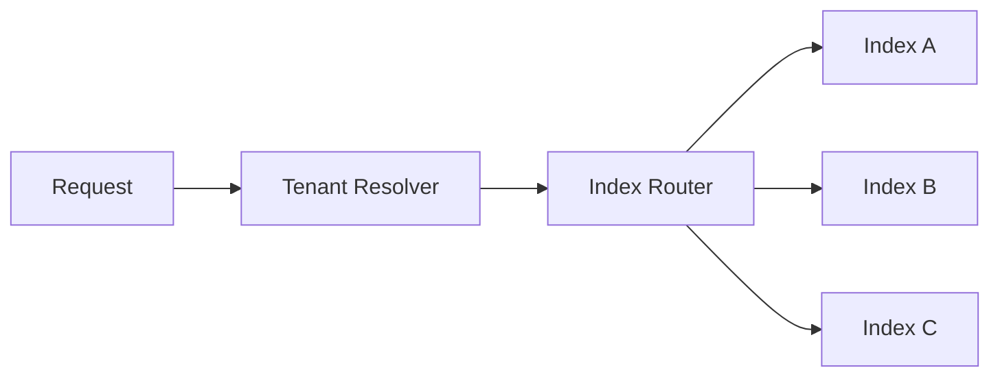

---

# 🧠 16. Shared vs Dedicated Index

| Attribute | Shared Index | Dedicated Index |
|---|---|---|
| Cost | Lower | Higher |
| Isolation | Logical | Stronger |
| Operations | Easier | More complex |
| Scaling | Shared | Independent |
| Customization | Limited | High |
| Noisy Neighbor Risk | Higher | Lower |

---

# 🧠 17. Hybrid Isolation

A mature platform can classify tenants:

```text
Tier 1
Small Tenants
→ Shared Index

Tier 2
Medium Tenants
→ Namespace / Dedicated Partition

Tier 3
Large / Regulated Tenants
→ Dedicated Index
```

This balances:

```text
Security
Cost
Scale
Performance
```

---

# 🧠 18. Tenant Tiers

Example:

```yaml
tenant_tiers:

  standard:
    isolation: shared

  enterprise:
    isolation: dedicated_index

  regulated:
    isolation: dedicated_infrastructure
```

---

# 🧠 19. Tenant-Aware Retrieval

The retriever should accept tenant context explicitly.

```python
@dataclass
class RetrievalRequest:

    query: str
    tenant_id: str
    filters: dict
    top_k: int
```

Then:

```python
async def retrieve(request):

    filters = {
        "tenant_id": request.tenant_id,
        **request.filters
    }

    return await vector_store.search(
        query=request.query,
        filters=filters,
        top_k=request.top_k
    )
```

---

# 🧠 20. Tenant Context Should Not Be Optional

Avoid APIs like:

```python
retrieve(query)
```

for multi-tenant systems.

Prefer:

```python
retrieve(
    query=query,
    tenant_context=context
)
```

This makes tenant awareness explicit in the contract.

---

# 🧠 21. Tenant-Aware Retriever Interface

```python
class TenantAwareRetriever:

    async def retrieve(
        self,
        query: str,
        tenant_context: TenantContext
    ):
        raise NotImplementedError
```

---

# 🧠 22. Authorization vs Tenant Isolation

These are related but different.

### Tenant Isolation

```text
Tenant A
cannot access
Tenant B
```

### Authorization

Within Tenant A:

```text
Employee
→ Public Internal Docs

Manager
→ Management Docs

Finance
→ Financial Docs
```

Therefore:

```text
Tenant Filter
+
Authorization Filter
```

are both required.

---

# 🧠 23. Authorization-Aware Retrieval

```text
User
 ↓
Tenant
 ↓
Roles
 ↓
Permissions
 ↓
Document ACL
 ↓
Retrieval
```

---

# 🧠 24. RBAC

Role-Based Access Control:

```text
User
 ↓
Role
 ↓
Permissions
```

Example:

```text
employee
manager
finance
admin
```

---

# 🧠 25. RBAC Example

```json
{
  "user": "user-123",
  "tenant": "tenant-a",
  "roles": [
    "finance"
  ]
}
```

Document:

```json
{
  "document_id": "doc-456",
  "tenant_id": "tenant-a",
  "allowed_roles": [
    "finance",
    "admin"
  ]
}
```

---

# 🧠 26. ABAC

Attribute-Based Access Control uses attributes.

Example:

```text
User:
department = finance
region = eu
clearance = confidential

Document:
department = finance
region = eu
classification = confidential
```

Policy evaluates whether access is allowed.

---

# 🧠 27. RBAC vs ABAC

| Model | Main Concept | Best For |
|---|---|---|
| RBAC | Roles | Simple organizational permissions |
| ABAC | Attributes | Complex enterprise policies |
| ACL | Explicit Access List | Document-level permissions |

Large enterprise RAG systems may combine them.

---

# 🧠 28. Document ACL

Example:

```json
{
  "document_id": "doc-123",
  "tenant_id": "tenant-a",
  "allowed_users": [
    "user-1"
  ],
  "allowed_groups": [
    "finance"
  ]
}
```

---

# 🧠 29. ACL-Aware Retrieval

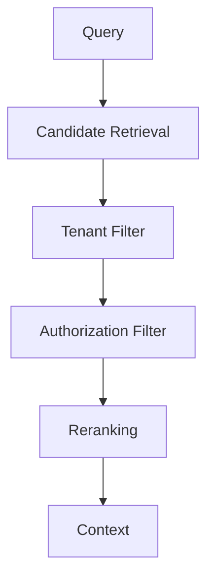

---

# 🧠 30. Filter Ordering

Security filtering should happen as early as practical.

Preferred:

```text
Query
 ↓
Tenant Filter
 ↓
Authorization Filter
 ↓
Retrieval / Ranking
```

However, implementation depends on the capabilities of the underlying search system.

The critical rule is:

> Unauthorized content must never reach the generation context.

---

# 🧠 31. Defense in Depth

Do not rely on only one security layer.

Use:

```text
API Authorization
        ↓
Tenant Validation
        ↓
Retriever Filtering
        ↓
Document ACL
        ↓
Context Validation
        ↓
Response Validation
```

---

# 🧠 32. Retrieval Security Boundary

The LLM should receive:

```text
AUTHORIZED EVIDENCE
```

not:

```text
ALL RETRIEVED EVIDENCE
```

---

# 🧠 33. Cross-Tenant Leakage

A critical failure:

```text
Tenant A User
      ↓
Query
      ↓
Tenant B Document
      ↓
LLM
      ↓
Response
```

This can occur through:

```text
Missing Tenant Filter
Incorrect Filter
Cache Leakage
Index Routing Bug
Metadata Bug
Authorization Bug
```

---

# 🧠 34. Cross-Tenant Leakage Prevention

Use:

```text
Trusted Tenant Context
+
Server-Side Filtering
+
Authorization Enforcement
+
Tenant-Aware Cache
+
Tenant-Aware Logging
+
Security Testing
```

---

# 🧠 35. Tenant-Aware Cache

A response cache must not be:

```text
query → response
```

for multi-tenant systems.

Prefer:

```text
tenant
+
authorization_scope
+
query
+
version
→ response
```

---

# 🧠 36. Cache Key

Example:

```text
response:
tenant-a:
auth-scope-123:
index-v17:
prompt-v9:
model-v4:
query-hash
```

---

# 🧠 37. Authorization Scope

Instead of putting every permission directly into the key, applications may derive a stable authorization scope:

```text
authorization_scope_id
```

The scope must change when permissions change.

---

# 🧠 38. Permission Changes

Suppose:

```text
User A
→ Finance Access
```

Then access is revoked:

```text
Finance Access
→ Removed
```

A cached response based on the old permission scope must not remain usable indefinitely.

Use:

```text
Policy Version
+
Short TTL
+
Explicit Invalidation
```

as appropriate.

---

# 🧠 39. Tenant-Aware Semantic Cache

Semantic caching is especially dangerous in multi-tenant systems.

Unsafe:

```text
"What is the refund policy?"
        ↓
Semantic Match
        ↓
Other Tenant's Cached Answer
```

Safe architecture:

```text
Tenant
+
Authorization Scope
+
Semantic Similarity
+
Knowledge Version
```

---

# 🧠 40. Tenant-Aware Cache Architecture

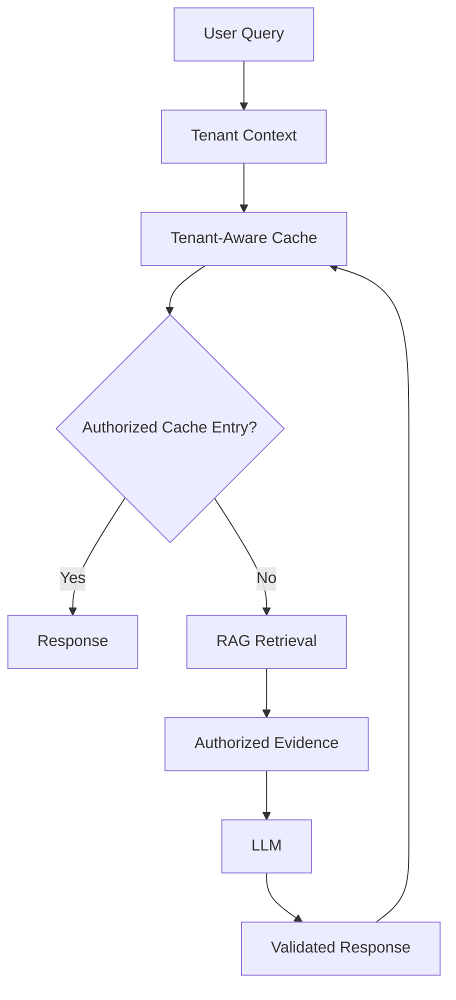

---

# 🧠 41. Tenant-Aware Ingestion

Ingestion must know:

```text
Which Tenant Owns This Document?
```

Example:

```json
{
  "document_id": "doc-123",
  "tenant_id": "tenant-a",
  "source": "sharepoint",
  "classification": "confidential"
}
```

---

# 🧠 42. Tenant Metadata Must Be Immutable

Where possible, tenant ownership should be assigned by trusted ingestion configuration rather than user-editable document metadata.

Avoid allowing a document upload request to arbitrarily specify:

```text
tenant_id = tenant-b
```

without validation.

---

# 🧠 43. Tenant-Aware Ingestion Pipeline

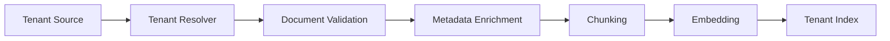

---

# 🧠 44. Source Isolation

Possible architecture:

```text
Tenant A
 ↓
Source A

Tenant B
 ↓
Source B
```

or:

```text
Shared Source
 ↓
Tenant Metadata
```

The latter requires strong filtering.

---

# 🧠 45. Tenant-Aware Indexing

Every chunk should carry tenant context.

```python
chunk.metadata["tenant_id"] = tenant_id
```

Also consider:

```text
classification
department
region
groups
document_owner
```

---

# 🧠 46. Tenant-Aware Index Schema

Example:

```json
{
  "chunk_id": "chunk-001",
  "document_id": "doc-123",
  "tenant_id": "tenant-a",
  "group_ids": [
    "finance"
  ],
  "classification": "confidential",
  "region": "eu",
  "version": "v7"
}
```

---

# 🧠 47. Tenant Data Lifecycle

A tenant lifecycle may be:

```text
Created
   ↓
Provisioned
   ↓
Active
   ↓
Suspended
   ↓
Offboarding
   ↓
Deleted
```

---

# 🧠 48. Tenant Onboarding

A production onboarding workflow may provision:

```text
Tenant ID
Configuration
Security Policies
Knowledge Sources
Indexes
Cache Namespace
Quotas
Observability
```

---

# 🧠 49. Tenant Provisioning

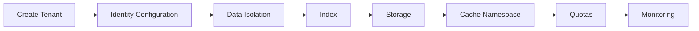

---

# 🧠 50. Tenant Configuration

Tenant-specific configuration may include:

```yaml
tenant:
  id: tenant-a

retrieval:
  top_k: 20
  reranking: true

generation:
  model: enterprise-model

security:
  classification: confidential

limits:
  max_requests_per_second: 50
```

---

# 🧠 51. Tenant Configuration Hierarchy

A useful hierarchy:

```text
Global Defaults
      ↓
Environment Configuration
      ↓
Tenant Configuration
      ↓
Application Configuration
      ↓
Request-Level Constraints
```

Security policies should not be weakened by lower-trust request configuration.

---

# 🧠 52. Tenant-Specific Retrieval

Different tenants may need different retrieval strategies.

```text
Tenant A
→ Hybrid Retrieval

Tenant B
→ Dense Retrieval

Tenant C
→ Dense + Graph
```

This can be controlled through tenant policy.

---

# 🧠 53. Tenant-Specific Models

Different tenants may have different requirements:

```text
Tenant A
→ Standard Model

Tenant B
→ Premium Model

Tenant C
→ Private Model
```

Reasons:

```text
Security
Quality
Compliance
Latency
Cost
```

---

# 🧠 54. Tenant Model Routing

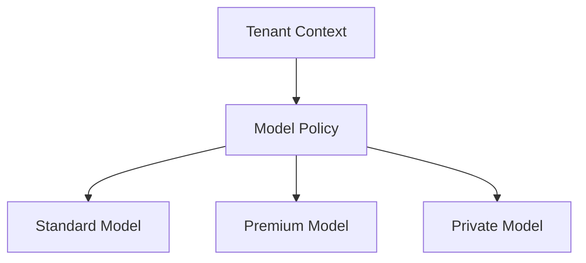

---

# 🧠 55. Tenant-Specific Prompts

Tenants may require:

```text
Branding
Output Format
Business Terminology
Compliance Instructions
Citation Format
```

Store these as versioned tenant configuration.

---

# 🧠 56. Prompt Isolation

Never allow tenant-provided prompt configuration to override trusted system security instructions.

Architecture:

```text
Trusted System Policy
        ↓
Security Instructions
        ↓
Tenant Instructions
        ↓
User Query
        ↓
Evidence
```

---

# 🧠 57. Tenant-Specific Knowledge Policies

Example:

```yaml
knowledge_policy:
  allowed_document_types:
    - policy
    - procedure

excluded:
    - archived
```

---

# 🧠 58. Tenant Quotas

A shared platform must prevent one tenant from consuming unlimited resources.

Example:

```text
Tenant A
→ 100 req/s

Tenant B
→ 50 req/s

Tenant C
→ 10 req/s
```

---

# 🧠 59. Tenant Rate Limiting

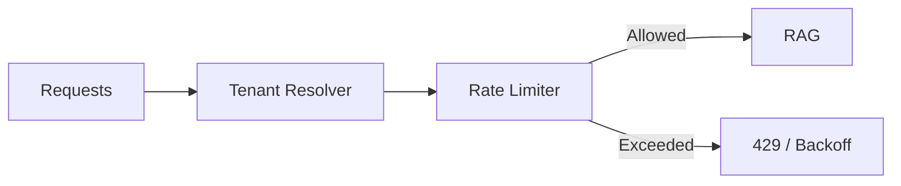

---

# 🧠 60. Tenant Quotas

Possible quotas:

```text
Requests / Second
Requests / Day
Tokens / Day
LLM Cost / Month
Documents
Storage
Index Size
Concurrent Requests
Agent Steps
```

---

# 🧠 61. Noisy Neighbor Problem

In shared infrastructure:

```text
Tenant A
High Traffic
      ↓
Consumes Resources
      ↓
Tenant B
Slower
```

This is the noisy-neighbor problem.

---

# 🧠 62. Noisy Neighbor Mitigation

Use:

```text
Rate Limits
Concurrency Limits
Resource Quotas
Priority Queues
Dedicated Workers
Dedicated Index
Autoscaling
Tenant Tiers
```

---

# 🧠 63. Tenant Priority

Example:

```text
Premium Tenant
     ↓
Priority Queue

Standard Tenant
     ↓
Normal Queue
```

Do not allow priority mechanisms to bypass security.

---

# 🧠 64. Tenant Resource Isolation

```text
Shared
 ├── API
 ├── Cache
 └── Retrieval

Dedicated
 ├── GPU
 └── Index
```

This hybrid model can isolate the most expensive or sensitive resources.

---

# 🧠 65. Tenant Cost Attribution

Every request should carry:

```text
tenant_id
```

through:

```text
Logs
Metrics
Traces
Billing
```

---

# 🧠 66. Cost Per Tenant

Track:

```text
Embedding Cost
Retrieval Cost
Reranking Cost
LLM Cost
Storage Cost
Infrastructure Cost
```

---

# 🧠 67. Tenant Cost Dashboard

```text
Tenant A
────────────────────
Requests       100K
Tokens         20M
LLM Cost       $X
Storage        $Y
Reranking      $Z

Tenant B
────────────────────
Requests       50K
Tokens         8M
LLM Cost       $A
```

---

# 🧠 68. Tenant Budgets

```yaml
tenant:
  budget:
    monthly_limit: 1000
    alert_threshold: 80
```

When the budget approaches its limit:

```text
Alert
 ↓
Rate Limit
 ↓
Model Downgrade
 ↓
Request Rejection
```

depending on business policy.

---

# 🧠 69. Tenant-Aware Model Routing

A cost-aware system might use:

```text
Normal Tenant
→ Standard Model

Premium Tenant
→ Premium Model

Budget Exhausted
→ Cost-Controlled Model
```

Any fallback must preserve security and quality requirements.

---

# 🧠 70. Tenant Observability

Metrics should be partitionable by:

```text
tenant_id
application
region
model
retriever
index
```

---

# 🧠 71. Tenant Metrics

Track:

```text
Requests
Latency
Errors
Cache Hits
Retrieval Quality
Token Usage
LLM Cost
Storage
No-Answer Rate
```

---

# 🧠 72. Tenant Tracing

A trace should include:

```text
request_id
tenant_id
user_scope
retriever_version
index_version
model_version
```

Avoid putting sensitive user data into trace attributes.

---

# 🧠 73. Tenant Logging

Use structured logs:

```json
{
  "request_id": "req-123",
  "tenant_id": "tenant-a",
  "operation": "retrieve",
  "index_version": "v17",
  "latency_ms": 180
}
```

Do not log raw confidential documents unnecessarily.

---

# 🧠 74. Tenant-Aware Evaluation

Evaluation datasets may differ by tenant.

```text
Tenant A
→ Banking Dataset

Tenant B
→ Telecom Dataset
```

This allows:

```text
Tenant-Specific Quality
```

---

# 🧠 75. Tenant Quality Metrics

Track:

```text
Recall
Precision
MRR
NDCG
Faithfulness
Groundedness
Citation Accuracy
No-Answer Accuracy
```

---

# 🧠 76. Tenant-Specific Quality Gates

A new retriever may pass globally:

```text
Global Recall = 92%
```

but fail:

```text
Tenant A Recall = 70%
```

Therefore critical tenants may need independent quality gates.

---

# 🧠 77. Tenant Data Residency

Some tenants may require:

```text
EU Data
→ EU Region

US Data
→ US Region
```

This influences:

```text
Storage
Index
Cache
LLM
Logging
Backups
```

---

# 🧠 78. Region-Aware Tenant Routing

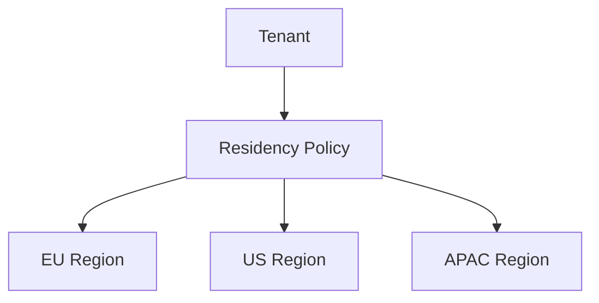

---

# 🧠 79. Tenant and Multi-Region Architecture

```text
Global Router
      │
      ├── Tenant A → EU
      ├── Tenant B → US
      └── Tenant C → APAC
```

---

# 🧠 80. Tenant Data Residency Boundary

Ensure that region-sensitive data does not accidentally enter:

```text
Global Cache
Global Logs
Global Analytics
Cross-Region Backup
Third-Party Model
```

without explicit authorization.

---

# 🧠 81. Tenant Disaster Recovery

Tenant recovery should consider:

```text
Documents
Indexes
Metadata
Configuration
ACLs
Caches
Evaluation Data
```

---

# 🧠 82. Tenant Backup

Possible architecture:

```text
Tenant Source
 ↓
Primary Storage
 ↓
Backup
 ↓
Secondary Region
```

---

# 🧠 83. Tenant Offboarding

When a tenant leaves:

```text
Disable Access
 ↓
Stop Ingestion
 ↓
Stop New Requests
 ↓
Delete / Archive Data
 ↓
Delete Index
 ↓
Delete Cache
 ↓
Delete Tenant Configuration
 ↓
Verify Deletion
```

---

# 🧠 84. Tenant Deletion

Deletion should include derived data:

```text
Source
Index
Embeddings
Vector Store
Search Index
Cache
Logs
Temporary Files
Backups
```

Retention requirements may affect backup deletion timing.

---

# 🧠 85. Tenant Suspension

A suspended tenant should not necessarily be deleted.

```text
Active
 ↓
Suspended
 ↓
Access Blocked
 ↓
Data Retained
```

This can support:

```text
Billing Issues
Security Investigation
Administrative Suspension
```

---

# 🧠 86. Tenant Migration

A tenant may move from:

```text
Shared Index
```

to:

```text
Dedicated Index
```

Migration:

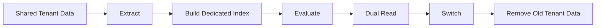

---

# 🧠 87. Tenant Migration Safety

Use:

```text
Backfill
Validation
Dual Read
Canary
Rollback
```

---

# 🧠 88. Tenant Isolation Migration

Example:

```text
Tenant A
Shared Index
    ↓
Dedicated Index A
```

During migration:

```text
Old Path
Shared Index

New Path
Dedicated Index
```

Compare results before switching.

---

# 🧠 89. Tenant Provisioning Automation

Use Infrastructure as Code where dedicated resources are required.

```text
Tenant Created
 ↓
Terraform / Controller
 ↓
Provision
 ├── Storage
 ├── Index
 ├── Cache
 ├── IAM
 └── Monitoring
```

---

# 🧠 90. Tenant Control Plane

A mature platform separates:

```text
Control Plane
```

from:

```text
Data Plane
```

---

# 🧠 91. Control Plane

Responsible for:

```text
Tenant Creation
Tenant Configuration
Policies
Quotas
Provisioning
Billing
Lifecycle
```

---

# 🧠 92. Data Plane

Responsible for:

```text
Queries
Retrieval
Generation
Responses
```

---

# 🧠 93. Multi-Tenant Control/Data Plane

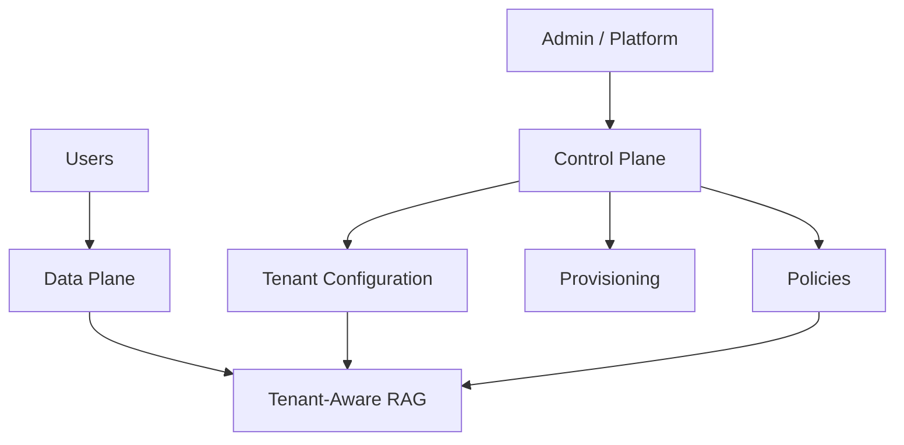

---

# 🧠 94. Why Separate Control and Data Planes?

Benefits:

```text
Cleaner Architecture
Centralized Governance
Tenant Lifecycle Management
Security
Operational Control
```

---

# 🧠 95. Tenant Registry

Maintain a trusted tenant registry:

```json
{
  "tenant_id": "tenant-a",
  "status": "active",
  "tier": "enterprise",
  "region": "eu",
  "isolation": "dedicated_index",
  "index_id": "index-a",
  "policy_version": "v4"
}
```

---

# 🧠 96. Tenant Registry Security

The tenant registry is security-sensitive.

Protect:

```text
Tenant Status
Isolation Configuration
Region
Policies
Index Mapping
```

---

# 🧠 97. Tenant-to-Index Mapping

```text
Tenant A → Index A
Tenant B → Shared Namespace B
Tenant C → Index C
```

The mapping should be controlled by trusted platform configuration.

---

# 🧠 98. Tenant Routing

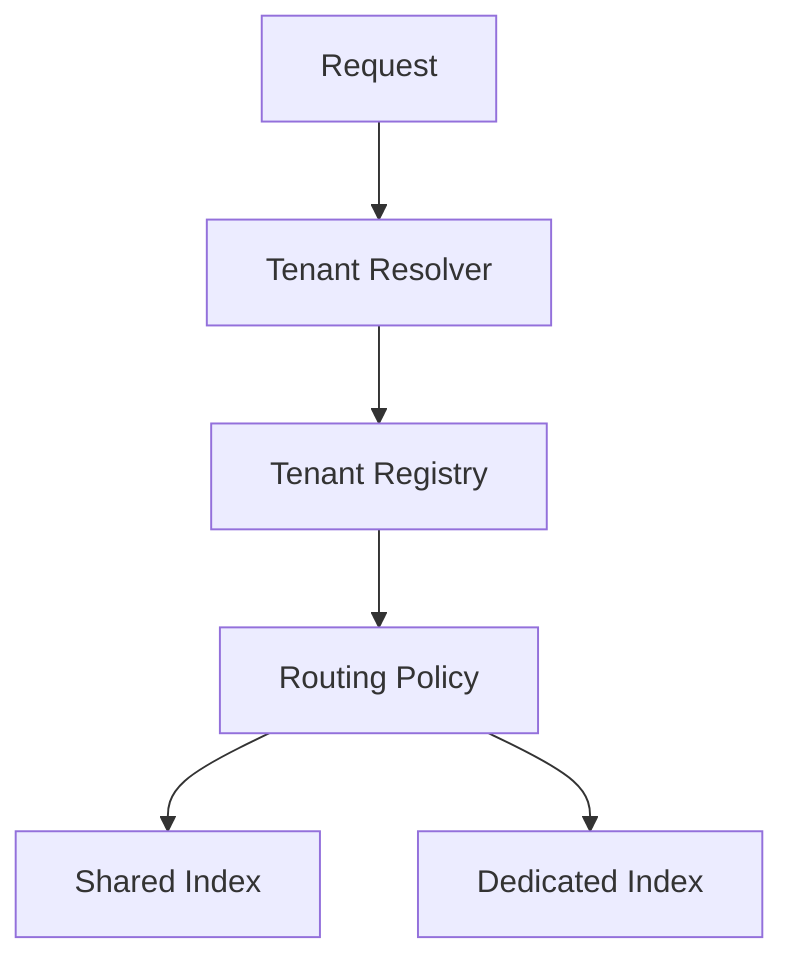

---

# 🧠 99. Tenant-Aware Retrieval Plan

The tenant policy may determine:

```json
{
  "tenant_id": "tenant-a",
  "retriever": "hybrid",
  "top_k": 20,
  "reranker": "reranker-v3",
  "index": "index-a",
  "model": "enterprise-model"
}
```

---

# 🧠 100. Tenant Configuration Versioning

Track:

```text
tenant_config_v1
tenant_config_v2
tenant_config_v3
```

This enables:

```text
Audit
Rollback
Debugging
Reproducibility
```

---

# 🧠 101. Tenant Security Policy

Example:

```yaml
security:
  tenant_isolation: strict

  allowed_classifications:
    - public
    - internal
    - confidential

  cross_region_access: false

  external_llm: false
```

---

# 🧠 102. Tenant-Specific Data Policies

Different tenants may require:

```text
No External LLM
EU Only
Dedicated Index
Short Retention
Long Retention
No Semantic Cache
```

---

# 🧠 103. Tenant Policy Evaluation

```text
Request
 ↓
Tenant Policy
 ↓
Allowed?
 │
 ├── No → Reject
 │
 └── Yes
       ↓
     Retrieval
```

---

# 🧠 104. Multi-Tenant Security Model

```text
                 TRUST BOUNDARY
                       │
                 Authentication
                       │
                       ▼
                Tenant Resolution
                       │
                       ▼
                Authorization
                       │
                       ▼
              Retrieval Filtering
                       │
                       ▼
                Evidence Security
                       │
                       ▼
                    LLM
                       │
                       ▼
                  Validation
```

---

# 🧠 105. Cross-Tenant Security Test

Test:

```text
Tenant A User
Query: "Show me all available documents."
```

Expected:

```text
Only Tenant A authorized evidence.
```

---

# 🧠 106. Cross-Tenant Cache Test

```text
Tenant A
Query X
 ↓
Cache A

Tenant B
Query X
 ↓
Must NOT receive Cache A
```

---

# 🧠 107. Cross-Tenant Index Test

```text
Tenant A
 ↓
Shared Index
 ↓
Search
```

Verify:

```text
No Tenant B chunks returned.
```

---

# 🧠 108. Authorization Regression Test

Create:

```text
User A
Role: Employee

User B
Role: Finance
```

Verify:

```text
Finance Document
Employee → DENY
Finance  → ALLOW
```

---

# 🧪 109. Multi-Tenant Testing Framework

Test dimensions:

```text
Tenant Isolation
Authorization
Cache Isolation
Index Isolation
Configuration
Rate Limits
Cost
Data Residency
Deletion
Migration
```

---

# 🧪 110. Tenant Isolation Test Matrix

| Test | Expected |
|---|---|
| Tenant A → A data | Allow |
| Tenant A → B data | Deny |
| Tenant B → A data | Deny |
| Unauthorized role → restricted data | Deny |
| Authorized role → restricted data | Allow |
| Tenant A cache → Tenant B | Deny |
| Tenant A index → Tenant B | Deny |

---

# 🧪 111. Tenant Load Testing

Simulate:

```text
Tenant A → 1000 RPS
Tenant B → 10 RPS
```

Verify:

```text
Tenant B remains within its latency SLO.
```

This tests noisy-neighbor protection.

---

# 🧪 112. Tenant Quota Testing

Test:

```text
Quota = 100 requests/minute
```

Send:

```text
101 requests
```

Expected:

```text
Request 101
→ Rate Limited
```

---

# 🧪 113. Tenant Deletion Testing

After deletion:

```text
Search
 ↓
No Tenant Documents
```

Also verify:

```text
Cache
Index
Metadata
Storage
```

no longer expose deleted tenant information according to the applicable retention policy.

---

# 🧪 114. Tenant Migration Testing

Verify:

```text
Shared Index
 ↓
Dedicated Index
```

with:

```text
Same Expected Results
No Missing Data
No Cross-Tenant Data
Rollback Available
```

---

# 🧠 115. Tenant Failure Isolation

A tenant-specific failure should ideally not bring down the platform.

```text
Tenant A Failure
       ↓
Tenant A Degraded

Tenant B
       ↓
Healthy
```

---

# 🧠 116. Tenant Circuit Breaker

A problematic tenant can trigger:

```text
Tenant-Level Circuit Breaker
```

rather than opening a global circuit.

---

# 🧠 117. Tenant-Level Backpressure

```text
Tenant A
High Traffic
   ↓
Tenant Queue
   ↓
Controlled Processing
```

Other tenants continue normally.

---

# 🧠 118. Tenant-Level Resource Pools

For high-value tenants:

```text
Tenant A
 ↓
Dedicated Worker Pool
```

while standard tenants use:

```text
Shared Worker Pool
```

---

# 🧠 119. Tenant Priority Classes

Example:

```text
Tier 1
Premium
Priority = High

Tier 2
Enterprise
Priority = Medium

Tier 3
Standard
Priority = Normal
```

---

# 🧠 120. Fairness

A multi-tenant system should avoid:

```text
One Tenant
      ↓
Consumes Everything
```

Use:

```text
Fair Queuing
Rate Limits
Concurrency Limits
Resource Quotas
```

---

# 🧠 121. Tenant Cost Guardrails

A tenant may have:

```text
Monthly Budget
Daily Token Limit
Daily Request Limit
```

The system can enforce:

```text
Budget
 ↓
Warning
 ↓
Throttling
 ↓
Fallback
```

according to the commercial policy.

---

# 🧠 122. Tenant-Aware Semantic Routing

A platform can route based on:

```text
Tenant
+
Query Complexity
+
Cost Policy
+
Security Policy
```

Example:

```text
Tenant A + Simple
→ Small Model

Tenant A + Complex
→ Large Model

Tenant B + Confidential
→ Private Model
```

---

# 🧠 123. Multi-Tenant RAG Architecture

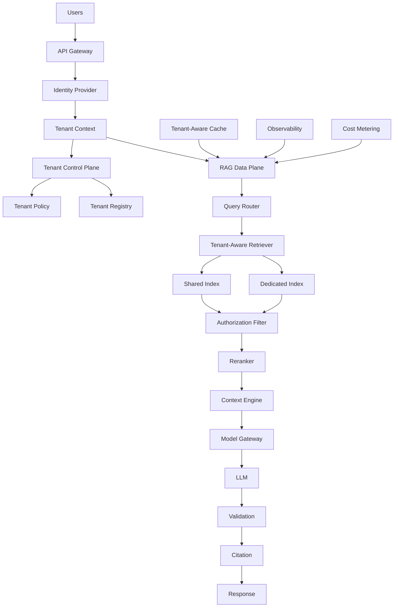

---

# 🧠 124. Multi-Tenant Architecture Layers

```text
CONTROL PLANE
 ├── Tenant Registry
 ├── Configuration
 ├── Policies
 ├── Provisioning
 ├── Billing
 └── Lifecycle

DATA PLANE
 ├── Query
 ├── Retrieval
 ├── Ranking
 ├── Generation
 └── Response

CROSS-CUTTING
 ├── Security
 ├── Observability
 ├── Cost
 └── Governance
```

---

# 🧠 125. Shared Platform Architecture

```text
                 Multi-Tenant RAG Platform
                           │
       ┌───────────────────┼───────────────────┐
       ▼                   ▼                   ▼
    Tenant A            Tenant B            Tenant C
       │                   │                   │
    Policy A             Policy B             Policy C
       │                   │                   │
       └───────────────────┼───────────────────┘
                           ▼
                    Shared RAG Services
                           │
              ┌────────────┼────────────┐
              ▼            ▼            ▼
           Retrieval     Cache         Model
```

---

# 🧠 126. Dedicated Tenant Architecture

```text
Tenant A
 ┌─────────────────────────┐
 │ API                     │
 │ Retrieval               │
 │ Index                   │
 │ Cache                   │
 │ Storage                 │
 └─────────────────────────┘

Tenant B
 ┌─────────────────────────┐
 │ API                     │
 │ Retrieval               │
 │ Index                   │
 │ Cache                   │
 │ Storage                 │
 └─────────────────────────┘
```

---

# 🧠 127. Hybrid Architecture

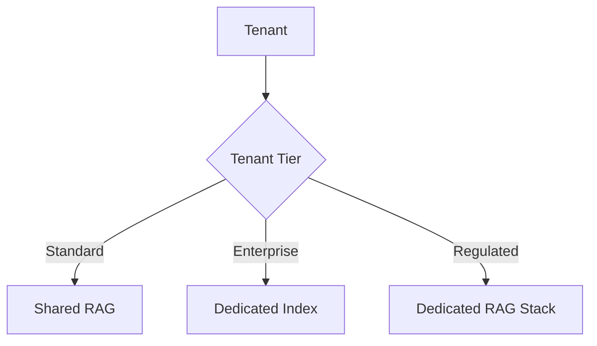

---

# 🧠 128. Multi-Tenant Deployment Matrix

| Tenant Type | Compute | Index | Cache | Model |
|---|---|---|---|---|
| Standard | Shared | Shared | Shared Namespace | Shared |
| Enterprise | Shared | Dedicated | Namespace / Dedicated | Configurable |
| Regulated | Dedicated | Dedicated | Dedicated | Private / Approved |

---

# 🧠 129. Multi-Tenant RAG SLOs

Define:

```text
Availability
Latency
Retrieval Quality
Freshness
Security
Cost
```

per tenant tier where necessary.

---

# 🧠 130. Tenant-Specific SLO

Example:

```text
Premium Tenant

Availability:
99.99%

p95 latency:
< 2 seconds

Freshness:
< 5 minutes
```

Values are illustrative.

---

# 🧠 131. Tenant SLA vs Platform SLO

A shared platform may have:

```text
Platform SLO
```

while individual contracts may define:

```text
Tenant SLA
```

Do not assume they are equivalent.

---

# 🧠 132. Tenant Governance

Govern:

```text
Data
Access
Models
Regions
Retention
Cost
Indexes
Prompts
Configuration
```

---

# 🧠 133. Tenant Audit Trail

Track:

```text
Tenant Created
Configuration Changed
Policy Changed
Index Changed
User Added
User Removed
Document Added
Document Deleted
Model Changed
```

---

# 🧠 134. Tenant Configuration Audit

Example:

```json
{
  "tenant_id": "tenant-a",
  "change": "model",
  "old_value": "model-v3",
  "new_value": "model-v4",
  "changed_by": "platform-admin",
  "timestamp": "2026-08-11T10:30:00Z"
}
```

---

# 🧠 135. Tenant-Specific Feature Flags

```yaml
features:
  hybrid_retrieval: true
  semantic_cache: false
  reranking: true
  graph_rag: false
```

This allows gradual rollout.

---

# 🧠 136. Tenant Canary

Instead of:

```text
5% of all traffic
```

use:

```text
Tenant A
→ New Retriever

Other Tenants
→ Old Retriever
```

This is useful when:

```text
One enterprise customer
```

needs controlled validation.

---

# 🧠 137. Tenant A/B Testing

```text
Tenant A
 ├── Users Group 1 → V1
 └── Users Group 2 → V2
```

Measure:

```text
Quality
Latency
Cost
Satisfaction
```

---

# 🧠 138. Tenant-Specific Rollback

A tenant can be rolled back independently:

```text
Tenant A
Retriever V8 → V7

Tenant B
Retriever V8
```

This reduces blast radius.

---

# 🧠 139. Tenant Migration Strategy

A mature migration:

```text
Assess Tenant
      ↓
Create Target Environment
      ↓
Backfill Data
      ↓
Build Index
      ↓
Validate
      ↓
Dual Read
      ↓
Canary
      ↓
Switch
      ↓
Monitor
      ↓
Retire Old
```

---

# 🧠 140. Multi-Tenant RAG Anti-Patterns

### Anti-Pattern 1 — Client-Controlled Tenant ID

```text
Client → tenant_id
```

without trusted validation.

---

### Anti-Pattern 2 — Global Response Cache

```text
query → response
```

without tenant or authorization context.

---

### Anti-Pattern 3 — Global Semantic Cache

Similar queries across tenants share cached answers.

---

### Anti-Pattern 4 — Tenant Filter Applied Too Late

Retrieving unrestricted candidates and relying on downstream logic to remove unauthorized content creates unnecessary risk.

---

### Anti-Pattern 5 — Tenant ID Missing From Metadata

Chunks cannot reliably be isolated.

---

### Anti-Pattern 6 — Shared Logs Containing Sensitive Content

A centralized log system becomes an unintended data exposure path.

---

### Anti-Pattern 7 — Noisy Neighbor

One tenant consumes shared infrastructure capacity.

---

### Anti-Pattern 8 — No Tenant-Level Cost Attribution

Platform cannot identify which tenants consume resources.

---

### Anti-Pattern 9 — No Tenant Offboarding

Deleted customers retain derived data indefinitely.

---

### Anti-Pattern 10 — One Configuration for Everyone

All tenants are forced into the same:

```text
Model
Retrieval
Region
Security
Cost
```

despite different requirements.

---

# 🧪 141. Practical Project

Build:

> **Multi-Tenant Enterprise RAG Platform**

Support:

```text
3 Tenants
        ↓
Shared RAG Platform
        ↓
Tenant-Aware Retrieval
        ↓
Tenant-Aware Cache
        ↓
Authorization
        ↓
Tenant-Level Cost Tracking
```

---

# 🧪 142. Suggested Repository

```text
multi-tenant-rag/
│
├── apps/
│   ├── rag-api/
│   ├── ingestion-worker/
│   └── control-plane/
│
├── core/
│   ├── retrieval/
│   ├── generation/
│   ├── authorization/
│   └── tenancy/
│
├── tenant/
│   ├── registry/
│   ├── configuration/
│   ├── provisioning/
│   ├── lifecycle/
│   └── policies/
│
├── security/
│   ├── authentication/
│   ├── authorization/
│   ├── rbac/
│   ├── abac/
│   └── acl/
│
├── cache/
│   ├── local/
│   ├── distributed/
│   └── semantic/
│
├── retrieval/
│   ├── shared-index/
│   ├── dedicated-index/
│   └── router/
│
├── observability/
│   ├── metrics/
│   ├── tracing/
│   └── logging/
│
├── billing/
│   ├── usage/
│   └── cost/
│
├── evaluation/
│   ├── tenant-datasets/
│   └── regression/
│
├── infrastructure/
│   └── terraform/
│
└── tests/
    ├── tenant-isolation/
    ├── authorization/
    ├── cache-isolation/
    ├── load/
    └── migration/
```

---

# 🧪 143. Project Scenario

Create:

```text
Tenant A
Banking

Tenant B
Telecom

Tenant C
Retail
```

Each tenant has:

```text
Separate Documents
Separate Metadata
Separate Policies
```

---

# 🧪 144. Security Scenario

Create:

```text
Tenant A:
Finance Documents

Tenant B:
HR Documents
```

Attempt:

```text
Tenant A User
"What is the HR policy?"
```

Expected:

```text
No unauthorized evidence.
```

---

# 🧪 145. Cache Scenario

Send:

```text
Tenant A:
"What is the refund policy?"
```

Then:

```text
Tenant B:
"What is the refund policy?"
```

Verify:

```text
Tenant B does not receive Tenant A's cached response.
```

---

# 🧪 146. Noisy Neighbor Scenario

Simulate:

```text
Tenant A → 1000 RPS
Tenant B → 10 RPS
```

Verify:

```text
Tenant B latency remains within its target.
```

---

# 🧪 147. Tenant Migration Scenario

Move:

```text
Tenant A
Shared Index
     ↓
Dedicated Index
```

Perform:

```text
Backfill
Evaluation
Dual Read
Canary
Switch
Rollback Test
```

---

# 🧪 148. Tenant Offboarding Scenario

Delete:

```text
Tenant B
```

Verify:

```text
Documents
Indexes
Caches
Metadata
Configuration
```

are removed or retained only according to the defined retention policy.

---

# 🧠 149. Production Multi-Tenant Checklist

```text
TENANCY
☐ Tenant ID defined
☐ Trusted tenant resolution
☐ Tenant context propagated
☐ Tenant lifecycle defined
☐ Tenant registry implemented

DATA ISOLATION
☐ Tenant metadata
☐ Shared / dedicated strategy defined
☐ Index routing
☐ Storage isolation
☐ Cache isolation
☐ Backup isolation

AUTHORIZATION
☐ Authentication
☐ RBAC / ABAC
☐ ACL
☐ Server-side filtering
☐ Policy versioning
☐ Permission change handling

RETRIEVAL
☐ Tenant-aware retriever
☐ Tenant filters
☐ Authorization filters
☐ Dedicated index support where required
☐ Cross-tenant tests

CACHE
☐ Tenant-aware keys
☐ Authorization scope
☐ Index version
☐ Model / prompt versions
☐ Semantic cache isolation
☐ Invalidation

OPERATIONS
☐ Tenant quotas
☐ Rate limits
☐ Concurrency limits
☐ Noisy-neighbor protection
☐ Tenant-level circuit breakers

COST
☐ Tenant usage
☐ Token tracking
☐ Model cost
☐ Storage cost
☐ Budget
☐ Alerts

OBSERVABILITY
☐ Tenant metrics
☐ Tenant traces
☐ Tenant logs
☐ Cost dashboards
☐ Quality dashboards

GOVERNANCE
☐ Data residency
☐ Classification
☐ Retention
☐ Audit
☐ Deletion
☐ Offboarding

LIFECYCLE
☐ Onboarding
☐ Provisioning
☐ Configuration
☐ Suspension
☐ Migration
☐ Offboarding
☐ Deletion

RESILIENCE
☐ Tenant failure isolation
☐ Regional failover
☐ Backup
☐ Restore
☐ RPO/RTO

TESTING
☐ Isolation tests
☐ Authorization tests
☐ Cache leakage tests
☐ Load tests
☐ Noisy-neighbor tests
☐ Deletion tests
☐ Migration tests
```

---

# 🧠 150. Multi-Tenant RAG Decision Framework

Before selecting an architecture, ask:

```text
1. What exactly is a tenant?

2. What data belongs to each tenant?

3. What isolation level is required?

4. Is shared indexing acceptable?

5. Are dedicated indexes required?

6. Are dedicated infrastructure resources required?

7. What authorization model is used?

8. Are document ACLs required?

9. Are users members of multiple tenants?

10. Does data residency vary by tenant?

11. How much traffic does each tenant generate?

12. Can one tenant become a noisy neighbor?

13. What are tenant-specific SLOs?

14. What are tenant-specific cost limits?

15. Can tenants use different models?

16. Can tenants use different retrieval strategies?

17. Is semantic caching allowed?

18. How will cache isolation work?

19. How will tenant deletion work?

20. How will tenant migration work?

21. How will tenant-specific evaluation work?

22. How will tenant-level rollback work?
```

---

# 🧠 151. Isolation Decision Tree

```text
Does tenant data require strong physical isolation?
                 │
          ┌──────┴──────┐
          ▼             ▼
         Yes            No
          │             │
          ▼             ▼
 Dedicated Stack     Shared Platform
                        │
                        ▼
             Is dedicated index needed?
                    │
              ┌─────┴─────┐
              ▼           ▼
             Yes          No
              │            │
              ▼            ▼
       Dedicated Index   Shared Index
```

---

# 🧠 152. Tenant Architecture by Requirement

```text
LOW COST
   ↓
Shared Index

BALANCED
   ↓
Shared Platform + Tenant Namespace

STRONGER ISOLATION
   ↓
Dedicated Index

REGULATED
   ↓
Dedicated Infrastructure

EXTREME ISOLATION
   ↓
Dedicated Account / Subscription / Region
```

---

# 🧠 153. Final Multi-Tenant Mental Model

```text
                    MULTI-TENANT RAG
                           │
          ┌────────────────┼────────────────┐
          ▼                ▼                ▼
       IDENTITY         ISOLATION        AUTHORIZATION
          │                │                │
          ▼                ▼                ▼
       Tenant ID       Shared/Dedicated    RBAC/ABAC
          │                │                ACL
          └────────────────┼────────────────┘
                           ▼
                       RETRIEVAL
                           │
                           ▼
                        EVIDENCE
                           │
                           ▼
                          LLM
                           │
                           ▼
                       RESPONSE
                           │
       ┌───────────────────┼───────────────────┐
       ▼                   ▼                   ▼
      CACHE             OBSERVABILITY        COST
       │                   │                   │
       └───────────────────┼───────────────────┘
                           ▼
                       GOVERNANCE
```

---

# 🧠 154. Multi-Tenant RAG Formula

A useful architectural mental model:

```text
Secure Multi-Tenant RAG
=
Tenant Isolation
+
Authorization
+
Tenant-Aware Retrieval
+
Tenant-Aware Cache
+
Resource Fairness
+
Observability
+
Cost Attribution
+
Lifecycle Governance
```

---

# 🧠 155. What Makes Multi-Tenant RAG Production-Grade?

A production multi-tenant RAG system should be able to answer:

```text
Which tenant owns this document?

Which user is making this request?

Which tenant is the user operating in?

What is the user's authorization scope?

Which index was queried?

Which filters were applied?

Could another tenant's document enter the candidate set?

Could another tenant's cache entry be returned?

What happens when a user's permission changes?

What happens when a tenant is suspended?

What happens when a tenant is deleted?

How much does each tenant consume?

Can one tenant overload the platform?

Where is the tenant's data stored?

Which model processed the tenant's data?

Can the tenant be migrated?

Can the tenant be rolled back?

Can the tenant's data be completely removed?
```

If these questions cannot be answered, the multi-tenant architecture is not mature enough.

---

# 📚 156. Key Takeaways

- Multi-tenant RAG requires tenant isolation as a first-class architectural concern.
- Tenant identity should come from trusted authentication and authorization context.
- Never rely on a client-provided tenant ID without validation.
- Tenant context should flow through the entire RAG request.
- Shared infrastructure can reduce cost.
- Dedicated infrastructure can provide stronger isolation.
- Shared indexes require reliable tenant metadata and server-side filtering.
- Dedicated indexes provide stronger isolation but increase operational complexity.
- Hybrid isolation is often the most practical enterprise strategy.
- Tenant isolation and authorization are separate concerns.
- RBAC, ABAC, and ACLs can be combined for enterprise authorization.
- Authorization should be enforced before evidence reaches the LLM.
- The LLM should never be responsible for access control.
- Cross-tenant leakage is one of the most serious multi-tenant RAG failure modes.
- Cache keys must include tenant and authorization context where responses are security-sensitive.
- Semantic caches require additional tenant, authorization, and knowledge-version boundaries.
- Ingestion must establish trusted tenant ownership.
- Tenant metadata should be preserved through chunking and indexing.
- Tenant-specific retrieval policies can support different business requirements.
- Tenant-specific models may be required for security, quality, latency, or compliance.
- Tenant quotas protect shared infrastructure.
- Rate limiting prevents a tenant from overwhelming the platform.
- Noisy-neighbor protection is essential for shared infrastructure.
- Tenant-level circuit breakers can prevent one tenant's failure from becoming a platform-wide failure.
- Tenant-level cost attribution enables accurate FinOps.
- Tenant-specific evaluation is useful when workloads differ significantly.
- Data residency can require tenant-specific regional routing.
- Tenant onboarding should provision security, data, indexes, cache, quotas, and observability.
- Tenant offboarding must account for source data and derived data such as indexes and caches.
- Tenant migration should use backfill, evaluation, dual read, canary, and rollback.
- A control plane can manage tenant lifecycle and configuration separately from the data plane.
- Tenant configuration should be versioned and auditable.
- Tenant-specific feature flags enable controlled rollout.
- Tenant-specific rollback can reduce deployment blast radius.
- Multi-tenant RAG should be tested explicitly for cross-tenant leakage.
- Cache isolation must be tested independently.
- Load testing should include noisy-neighbor scenarios.
- Security testing should attempt unauthorized tenant access intentionally.
- Data deletion workflows must include derived RAG artifacts.
- Multi-tenant RAG is fundamentally a combination of **identity, isolation, authorization, retrieval, platform engineering, governance, and FinOps**.
- The ultimate goal is not merely serving many tenants.
- The goal is serving many tenants while maintaining **security, correctness, fairness, scalability, observability, and operational isolation**.

---

# 🧭 157. Chapter Navigation

### Part VI — Production RAG Deployment & Operations

**Previous:**  
[13. RAG Caching Strategies](13-rag-caching-strategies.md)

**Next:**  
[15. RAG Testing Frameworks](15-rag-testing-frameworks.md)

### Production RAG Engineering Path

```text
01 Prompt Assembly
        ↓
02 Context Selection & Context Engineering
        ↓
03 Response Validation
        ↓
04 Citation & Source Attribution
        ↓
05 Enterprise Response
        ↓
06 RAG Evaluation & Benchmarking
        ↓
07 RAG Observability
        ↓
08 RAG Performance Optimization
        ↓
09 RAG Cost Optimization
        ↓
10 Production Retrieval Architecture
        ↓
11 Building Production RAG Systems
        ↓
12 RAG Deployment Patterns
        ↓
13 RAG Caching Strategies
        ↓
14 Multi-Tenant RAG
        ↓
15 RAG Testing Frameworks
        ↓
16 RAG Failure Patterns
```

---

> **Enterprise AI Engineering Handbook**  
> *Building Production-Grade Enterprise AI Systems — One Chapter at a Time.*